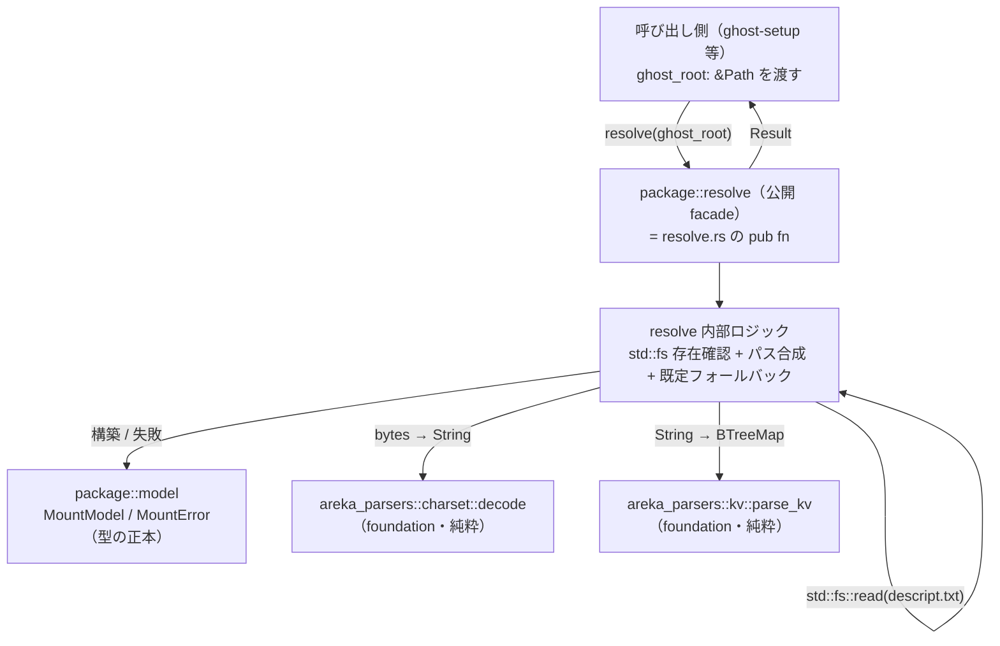
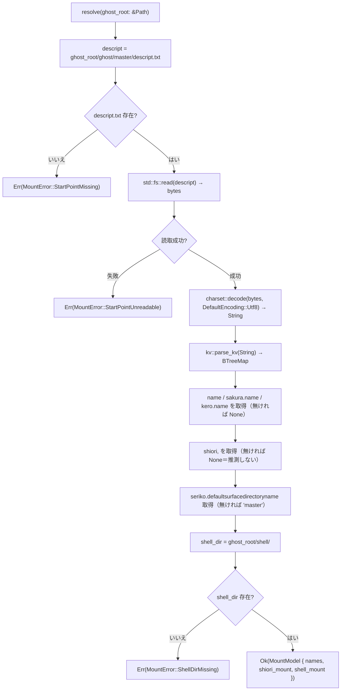

# 技術設計書（areka-P0-package-mount）

> 言語: ja / フェーズ: design-generated / 対象クレート: `crates/areka-parsers`（`package` module 追加）
> 正典: ukadoc（SSP 仕様）。emo2 fixture は最小サンプル。

## Overview

**Purpose**: 本機能は、ローカルに展開済みのゴーストパッケージのディレクトリツリーを解決し、後続の parser・エンジンが読むべきファイル群の所在（**マウントモデル**）を単一の値として返す純粋 loader を提供する。起点は `ghost/master/descript.txt`（起動時ゴースト構築の起点定義）であり、SHIORI マウント先（ディレクトリ＋DLL ファイル名）と shell マウント先（`shell/<既定シェルディレクトリ名>`）の **2 点**を解決する。

**Users**: 下流の `areka-P0-ghost-setup`（ゴースト lifecycle 構築）、runtime の `shell-parse` / `balloon-parse`（ファイルパス供給）、`host-32` トラック（SHIORI ロード先ディレクトリ）が、このマウントモデルを消費する。本 spec はパス文字列の解決までを所有し、消費側の挙動は所有しない。

**Impact**: `areka-parsers` クレートは、これまで純粋関数群（`&[u8]`/`&str` 入力・I/O 無し）のみで構成されてきたが、本 module は初めてローカルディレクトリツリーの走査（`std::fs`）を持ち込む最初の兄弟 module となる。この I/O は `resolve` サブモジュール内に閉じ込め、charset 判定・KV マップ化は `areka-P0-parser-foundation`（完了済み）へ委譲する。

### Goals
- `ghost/master/descript.txt` を起点に、ゴースト識別（SSP 所在ベース）・名前情報・SHIORI マウント先・shell マウント先を束ねた `MountModel` を返す。
- 現実に起こりうる欠落（起点不在・shell ディレクトリ不在）を**観測可能な失敗**として表現する。
- emo2 実 fixture のレイアウト（SHIORI=`pasta.dll`、shell=既定 `master` フォールバック）を正しく解決し、単体テストを通す。

### Non-Goals
- `install.txt` の読み取り・NAR インストーラ配置解決（起動時に読まれない配置マニフェスト）。
- balloon 所在解決（baseware 共有・ユーザ選択でパッケージ単独から確定不能）。
- ファイル**内容**の意味解析（surfaces.txt / descript の中身のパースは `shell-parse` / `balloon-parse` の担当）。
- SHIORI DLL のロード・pasta.dll 駆動（`host-32` トラック）。ゴースト lifecycle 構築（`areka-P0-ghost-setup`）。
- charset 判定・KV マップ化そのものの実装（`areka-P0-parser-foundation` に委譲）。

## Boundary Commitments

### This Spec Owns
- **`MountModel` 型の正本所有**: 解決済みマウント所在の型（ゴースト識別・名前情報・SHIORI マウント先・shell マウント先）。この型は下流との I/O 契約であり、本 spec が生成者、`ghost-setup` / `shell-parse` / `host-32` が消費者。
- **`MountError` 型の正本所有**: マウント解決の観測可能な失敗を表す enum。
- **ツリー解決ロジック**: `ghost_root` からの相対パス合成（`ghost/master`、`shell/<dir>`）、`std::fs` によるファイル/ディレクトリ物理存在確認、既定シェルディレクトリ名（`master`）フォールバック。
- **descript.txt 起点読み込みの合成**: `std::fs::read` → `charset::decode` → `kv::parse_kv` → キー参照の合成（各段は既存 API へ委譲）。

### Out of Boundary
- `install.txt` / NAR 配置マニフェストの読み取り、balloon 所在解決（Req 5.3・Boundary Out）。
- ファイル内容の意味解析（surfaces.txt / descript の中身）。SHIORI DLL のロード。
- ゴースト lifecycle 構築・窓配置・位置永続化（`ghost-setup` / ゴーストエンジン）。
- charset 判定アルゴリズム・KV 分割ロジック（foundation が所有）。

### Allowed Dependencies
- `areka_parsers::charset::{decode, DefaultEncoding}`（純粋・I/O 無し・完了済み）。
- `areka_parsers::kv::parse_kv`（純粋・I/O 無し・完了済み）。
- Rust 標準ライブラリのみ（`std::fs`・`std::path::{Path, PathBuf}`・`std::collections::BTreeMap`・`std::io`）。外部クレート追加なし。
- **依存制約**: UI・COM・SHIORI ホスト・非同期ランタイムに依存しない（Req 4.2）。入力はローカルディレクトリツリーとその中のテキストファイルのみ。

### Revalidation Triggers
- `MountModel` / `MountError` のフィールド・variant の**形状変更**（下流 `ghost-setup` / `host-32` / `shell-parse` の消費コードが再検証を要する）。
- パス表現（`PathBuf` ↔ `String`）や絶対/相対の**取り決め変更**。
- 「どの欠落が致命（`Err`）でどれが非致命（`Option`）か」の**エラー境界変更**。
- foundation の `charset` / `kv` API シグネチャ変更（上流依存方向の変化）。

## Architecture

### Existing Architecture Analysis

`areka-parsers` は「純粋・std のみ・host 非依存なパーサーファミリ」（`lib.rs` doc）で、`charset` / `kv`（foundation・完了）と `sakura` / `balloon`（兄弟パーサ）が同居する。確立済みの module 規約（`sakura` を範とする）:

- `mod.rs` が内部 submodule を `mod` 宣言し、公開面（型・facade 関数）を `pub use` で集約する。
- 依存方向は一方向（`sakura`: `model ← lexer ← decode ← parse`）。
- モデル型は `#[non_exhaustive]` ＋最小 derive（`sakura::Instruction` は `Clone, Debug, PartialEq` のみ）。不透明 NewType はフィールド非公開＋read-only アクセサ。
- テストは submodule ごとの `#[cfg(test)] mod xxx_tests;` ＋クレート横断 `validation_tests`。
- 責務が単一の module（`kv`）は内部分割を最小に留める（過剰分割回避）。

**接ぎ木点**: `lib.rs` に `pub mod package;` を 1 行追加。`package` は foundation の 2 API を同一クレート内から直接 `use` する。

**逸脱点（設計判断で整理）**: `package` は `areka-parsers` で初めて `std::fs`（I/O）を持つ module となる。純粋関数群という宣言との整合を保つため、I/O は `resolve` サブモジュール内に閉じ込め、`lib.rs` の doc コメントに「（`package` のみ）ローカルツリー走査を許容する」旨を補記する。

### Architecture Pattern & Boundary Map

**Selected pattern**: 単一クレート内の module 追加（レイヤードな一方向依存）。`sakura` パターンを踏襲しつつ責務が小さいため submodule を `model` ＋ `resolve` の 2 本に絞る（設計判断⑤）。



**Architecture Integration**:
- Selected pattern: `areka-parsers` の兄弟 module 追加（`sakura` 規約踏襲、`kv` 流儀の最小分割）。
- Domain/feature boundaries: 「型定義（`model`）」と「ツリー解決＋I/O（`resolve`）」を分離。facade は `resolve.rs` の `pub fn` を `mod.rs` で `pub use`。
- Existing patterns preserved: 一方向依存（`model ← resolve`）、`#[non_exhaustive]` ＋最小 derive、foundation 委譲。
- New components rationale: `MountModel`（下流 I/O 契約の正本・未存在）、`MountError`（観測可能失敗の正本）、`resolve`（唯一の新規ロジック＝ツリー解決）。
- Steering compliance: 純粋・host 非依存クレート方針を維持（I/O は 1 module に局所化・外部依存追加なし）。

### Technology Stack

| Layer | Choice / Version | Role in Feature | Notes |
|-------|------------------|-----------------|-------|
| Frontend / CLI | 該当なし | — | UI 非依存（Req 4.2） |
| Backend / Services | Rust（`areka-parsers` crate） | `package` module | 既存クレートへ module 追加 |
| Data / Storage | ローカルファイルシステム（`std::fs`） | descript.txt 読取・ディレクトリ存在確認 | `resolve` 内に局所化 |
| Messaging / Events | 該当なし | — | 同期・純粋関数呼び出し |
| Infrastructure / Runtime | `std` のみ | charset は foundation 委譲 | 外部クレート追加なし |

## File Structure Plan

### Directory Structure
```
crates/areka-parsers/src/
├── lib.rs                       # 変更: `pub mod package;` を 1 行追加 + doc に I/O 許容の補記
├── package/                     # 新規: マウント解決 module
│   ├── mod.rs                   # 公開面集約（pub use model::{MountModel, MountError}; pub use resolve::resolve;）+ 依存方向 doc
│   ├── model.rs                 # 型の正本: MountModel / ShioriMount / ShellMount / MountError（#[non_exhaustive] + 最小 derive）
│   ├── model_tests.rs           # #[cfg(test)] model のアクセサ/構築の単体テスト
│   ├── resolve.rs               # ツリー解決 + std::fs 存在確認 + descript 読み込み合成 + 既定フォールバック + 公開 fn resolve
│   ├── resolve_tests.rs         # #[cfg(test)] resolve の欠落系（起点不在・shell dir 不在・shiori 未指定）単体テスト
│   └── validation_tests.rs      # #[cfg(test)] emo2 実 fixture 参照のクレート横断テスト（Req 4.3）
```

> `sakura` の 4 分割（`model/lexer/decode/parse`）に対し、`package` の責務は「型定義」と「ツリー解決」の 2 つに集約されるため、`kv` 流儀の最小分割（`model` ＋ `resolve`）を採る。字句/意味の分離が不要（KV は foundation が済ませている）。

### Modified Files
- `crates/areka-parsers/src/lib.rs` — `pub mod package;` を追加し、doc コメントに「`package` module のみローカルディレクトリツリー走査（`std::fs`）を行い、それ以外の module は従来どおり純粋関数群」である旨を補記。

## System Flows



**フローの要点**:
- **識別は所在ベース**（SSP 準拠）: `ghost/master/descript.txt` が所在すれば ghost として受理する（Req 1.2）。`type,ghost` は確認的で、`type` 行の欠落自体は失敗としない（Req 1.3）。type-mismatch の分岐は作らない（過剰実装禁止・Req 5.2）。
- **decode の既定エンコーディング**: descript.txt は `charset` 宣言を含むが、その適用は foundation の `decode` が BOM/宣言を吸収する範囲に委ねる。呼び出しの既定引数は `DefaultEncoding::Utf8`（emo2 は `charset,UTF-8` 宣言あり）。charset 判定ロジック自体は本 spec で重複実装しない（Req 1.5）。
- **致命/非致命の境界**（設計判断①）: 致命（`Err`）＝起点 descript.txt 不在（Req 1.6/5.1）・shell ディレクトリ不在（Req 3.3/5.1）。非致命（型で保持）＝`shiori` 未指定（`Option::None`・Req 2.3）・名前値未指定（`Option::None`・Req 1.4）。
- **SHIORI ディレクトリ実体・DLL 実体の存在確認は行わない**: Req 2.1 は SHIORI ディレクトリを `ghost/master`（起点 descript.txt が置かれる＝存在確定済み）と解決するのみ。DLL ファイルの物理存在確認は host-32 トラックの責務（本 spec の観測可能失敗は起点不在・shell dir 不在の 2 種に限る）。

## Requirements Traceability

| Requirement | Summary | Components | Interfaces | Flows |
|-------------|---------|------------|------------|-------|
| 1.1 | 起点 `ghost/master/descript.txt` を読み込む | resolve | `resolve()` | descript_path → read |
| 1.2 | 所在すればゴースト受理（所在ベース識別） | resolve | `resolve()` | exists=はい |
| 1.3 | `type,ghost` は確認的・`type` 欠落は失敗としない | resolve | `resolve()`（type 分岐なし） | — |
| 1.4 | `name`/`sakura.name`/`kero.name` を model に含める | model, resolve | `MountModel.names` | names |
| 1.5 | charset/KV を foundation へ委譲 | resolve | `charset::decode`, `kv::parse_kv` | decode → kv |
| 1.6 | 起点不在＝観測可能失敗 | model, resolve | `MountError::StartPointMissing` | err_missing |
| 2.1 | SHIORI dir = `ghost/master` | model, resolve | `ShioriMount.dir` | shiori |
| 2.2 | `shiori,<file>` を model に含める | model, resolve | `ShioriMount.file` | shiori |
| 2.3 | `shiori` 未指定＝欠落を観測可能に（推測禁止） | model, resolve | `ShioriMount.file: Option` = None | shiori |
| 3.1 | 未指定時 shell = `shell/master`（既定） | resolve | 定数 `DEFAULT_SHELL_DIR = "master"` | shelldir=既定 |
| 3.2 | 指定時 shell = `shell/<name>` | resolve | `ShellMount.dir` | shellpath |
| 3.3 | shell dir 不在＝観測可能失敗 | model, resolve | `MountError::ShellDirMissing` | err_shell |
| 4.1 | 解決成功時に MountModel を単一値で返す | model, resolve | `Result<MountModel, MountError>` | build |
| 4.2 | UI/COM/host 非依存 | package（crate 方針） | 入力は `&Path` のみ | 全体 |
| 4.3 | emo2 レイアウトを解決してテスト通過 | validation_tests | `resolve()` | build（emo2 経路） |
| 5.1 | 欠落＝明示的失敗（sakura と対照） | model, resolve | `MountError` + `Result` | err_* |
| 5.2 | 未使用フィールドを無視・過剰実装禁止 | resolve | KV は分類しないので自然に無視 | names/shiori/shelldir のみ参照 |
| 5.3 | `install.txt`/NAR/balloon を読まない | resolve（触れない） | — | 起点は descript.txt のみ |

## Components and Interfaces

| Component | Domain/Layer | Intent | Req Coverage | Key Dependencies (P0/P1) | Contracts |
|-----------|--------------|--------|--------------|--------------------------|-----------|
| `model` | 型定義 | マウントモデル・失敗型の正本所有 | 1.4, 1.6, 2.1–2.3, 3.3, 4.1, 5.1 | なし（`std::path::PathBuf`） | State（型契約） |
| `resolve` | ツリー解決 + I/O | descript 読込合成・存在確認・パス合成・既定フォールバック・公開 facade | 1.1–1.6, 2.1–2.3, 3.1–3.3, 4.1–4.3, 5.1–5.3 | `charset::decode` (P0), `kv::parse_kv` (P0), `std::fs` (P0) | Service |

### 型定義（model）

#### MountModel / 付随型 / MountError

| Field | Detail |
|-------|--------|
| Intent | 解決済みマウント所在の I/O 契約（正本）と観測可能失敗の表現 |
| Requirements | 1.4, 1.6, 2.1, 2.2, 2.3, 3.3, 4.1, 5.1 |

**Responsibilities & Constraints**
- `MountModel` は下流（`ghost-setup` / `host-32` / `shell-parse`）と共有する I/O 契約の片側。本 spec が生成者・正本。
- パス表現は `PathBuf`（`ghost_root` に相対パスを `join` した結果）。下流 `host-32` は CP_ACP 世界だが、本 spec は「パス文字列の解決まで」を所有し、エンコード変換は消費側境界の責務（設計判断④）。
- `#[non_exhaustive]` ＋最小 derive（`Clone, Debug, PartialEq, Eq`）。`f32`/`Duration` を含まないため `Eq` は付与可（`sakura::Instruction` との差異＝本型は文字列/パスのみ）。`serde` は付さない（他兄弟型と整合・不要）。
- 名前情報・SHIORI ファイル名は `Option`（欠落を型で表現・推測しない）。

**Contracts**: State [x]

##### State Management（型契約）
```rust
/// 解決済みゴーストマウントモデル（下流 I/O 契約の正本）。
#[non_exhaustive]
#[derive(Clone, Debug, PartialEq, Eq)]
pub struct MountModel {
    /// ゴースト名前情報（欠落は None・Req 1.4）。
    pub names: GhostNames,
    /// SHIORI マウント先（Req 2.1/2.2/2.3）。
    pub shiori: ShioriMount,
    /// shell マウント先（Req 3.1/3.2）。
    pub shell: ShellMount,
}

/// 名前情報（各値は未指定なら None・推測しない）。
#[non_exhaustive]
#[derive(Clone, Debug, PartialEq, Eq, Default)]
pub struct GhostNames {
    pub name: Option<String>,        // descript `name`
    pub sakura_name: Option<String>, // descript `sakura.name`
    pub kero_name: Option<String>,   // descript `kero.name`
}

/// SHIORI マウント先。dir は起点定義の所在（= ghost/master）。
#[non_exhaustive]
#[derive(Clone, Debug, PartialEq, Eq)]
pub struct ShioriMount {
    /// ghost_root/ghost/master（存在確定済み・Req 2.1）。
    pub dir: PathBuf,
    /// descript `shiori,<file>`。未指定なら None（推測禁止・Req 2.3）。
    pub file: Option<String>,
}

/// shell マウント先。
#[non_exhaustive]
#[derive(Clone, Debug, PartialEq, Eq)]
pub struct ShellMount {
    /// ghost_root/shell/<dir>（既定 master・Req 3.1/3.2、存在確認済み・Req 3.3）。
    pub dir: PathBuf,
}

/// マウント解決の観測可能な失敗（致命）。
#[non_exhaustive]
#[derive(Clone, Debug, PartialEq, Eq)]
pub enum MountError {
    /// ghost/master/descript.txt が存在しない（Req 1.6/5.1）。
    StartPointMissing { expected: PathBuf },
    /// descript.txt は所在するが読み取れなかった（I/O エラー・Req 1.1/5.1）。
    StartPointUnreadable { path: PathBuf, kind: std::io::ErrorKind },
    /// 解決した shell ディレクトリが存在しない（Req 3.3/5.1）。
    ShellDirMissing { expected: PathBuf },
}
```
- Preconditions: `MountModel` は `resolve` の成功時のみ構築される。
- Postconditions: `shiori.dir` は物理存在確定（起点 descript.txt の親）、`shell.dir` は物理存在確認済み。
- Invariants: `shiori.file` / `names.*` は解決可否の型（`Option`）で欠落を保持し、`resolve` は既定値を推測しない（`shell.dir` の `master` フォールバックのみ ukadoc 既定で例外）。

### ツリー解決 + I/O（resolve）

#### resolve

| Field | Detail |
|-------|--------|
| Intent | ghost_root からツリーを解決し MountModel を返す唯一の公開 facade |
| Requirements | 1.1, 1.2, 1.3, 1.5, 2.1, 2.2, 3.1, 3.2, 3.3, 4.1, 4.2, 5.2, 5.3 |

**Responsibilities & Constraints**
- 唯一の I/O 保有点。`std::fs::read`（descript 読取）・`Path::exists`（ディレクトリ存在確認）を本 module 内に閉じ込める。
- descript 読み込みは `std::fs::read` → `charset::decode(bytes, DefaultEncoding::Utf8)` → `kv::parse_kv(&str)` の合成。charset 判定/KV 分割は再実装しない（Req 1.5）。
- 参照キーは `name` / `sakura.name` / `kero.name` / `shiori` / `seriko.defaultsurfacedirectoryname` のみ（Req 5.2）。`type` は所在ベース識別のため参照不要（分岐を作らない・Req 1.3）。`id.emo2` 等のカンマ無し行は `parse_kv` が自動スキップ。
- `install.txt` / balloon 系キー / NAR には一切触れない（Req 5.3）。

**Dependencies**
- Inbound: `ghost-setup` 等の呼び出し側 — `ghost_root: &Path` を渡す（P0）。
- Outbound: `model`（`MountModel`/`MountError` 構築）（P0）。
- External: `charset::decode`・`kv::parse_kv`（foundation・P0）、`std::fs`・`std::path`（P0）。

**Contracts**: Service [x]

##### Service Interface
```rust
/// 展開済みゴーストパッケージのルートから、descript.txt 起点で
/// SHIORI/shell の 2 点マウントを解決する。
///
/// - `ghost_root`: 展開済みゴーストパッケージのルート（`ghost/` `shell/` を含む階層）。
/// 成功時 `MountModel`、致命的欠落時 `MountError` を返す。
pub fn resolve(ghost_root: &Path) -> Result<MountModel, MountError>;

// module 内定数
const GHOST_MASTER: &str = "ghost/master";       // SHIORI マウント先（Req 2.1）
const DESCRIPT_FILE: &str = "descript.txt";      // 起点定義（Req 1.1）
const SHELL_ROOT: &str = "shell";                // Req 3.1/3.2
const DEFAULT_SHELL_DIR: &str = "master";        // ukadoc 既定（Req 3.1）
```
- Preconditions: `ghost_root` は展開済みパッケージのルートを指す（呼び出し側責務・本 spec は存在を仮定しないが、起点 descript.txt 不在は `StartPointMissing` で表現）。
- Postconditions: 成功時、返る `MountModel` の `shell.dir` は物理存在確認済み・`shiori.dir` は起点 descript.txt の親（存在確定）。
- Invariants: `resolve` は入力ツリー以外の状態に触れない（純粋関数に近い・I/O は読取のみ・書き込みなし）。

**Implementation Notes**
- Integration: `mod.rs` が `pub use resolve::resolve;` と `pub use model::{MountModel, GhostNames, ShioriMount, ShellMount, MountError};` を集約。
- Validation: emo2 fixture 参照テストは `env!("CARGO_MANIFEST_DIR")` 相対でパス構築（`sakura::validation_tests` の fixture 参照流儀に合わせる）。
- Risks: charset decode の既定引数選択。emo2 は `charset,UTF-8` 宣言ありゆえ `DefaultEncoding::Utf8` で読める。宣言と実バイトの不一致は foundation 側の責務（U+FFFD 置換）で本 spec のスコープ外。

## Data Models

### Domain Model
- **Aggregate**: `MountModel` を集約ルートとし、`GhostNames`・`ShioriMount`・`ShellMount` を値オブジェクトとして内包。トランザクション境界は「1 回の `resolve` 呼び出し」。
- **Business rules & invariants**:
  - ゴースト識別 = 所在（`ghost/master/descript.txt` の存在）。`type,ghost` は非強制の確認的フィールド。
  - shell 既定 = `master`（ukadoc 正典）。`shell/<dir>` は必ず物理存在確認する。
  - 欠落の分類: 致命（`Err`）= 起点不在・起点読取不能・shell dir 不在。非致命（`Option`）= 名前値・`shiori` ファイル名。

### Logical Data Model
- `MountModel 1 — 1 GhostNames`（内包）
- `MountModel 1 — 1 ShioriMount`（`dir: PathBuf` 必須、`file: Option<String>`）
- `MountModel 1 — 1 ShellMount`（`dir: PathBuf` 必須・存在確認済み）
- 識別子: ゴースト識別は所在ベース（明示的 id フィールドは持たない＝emo2 `id.emo2` は未使用フィールドとして無視・Req 5.2）。

## Error Handling

### Error Strategy
`resolve` は致命的欠落を `Result::Err(MountError)` で早期 return する（設計判断①のハイブリッド方針）。`sakura` の `Result` 無し寛容パースとは意図的に非対称（マウントは不在という現実の失敗を持つ・Req 5.1 が明示）。非致命の欠落は `MountModel` 内の `Option` で保持し、下流に判断を委ねる（推測しない・Req 2.3）。

### Error Categories and Responses
| カテゴリ | 条件 | 表現 | 根拠 |
|----------|------|------|------|
| 起点不在（致命） | `ghost/master/descript.txt` が無い | `MountError::StartPointMissing` | Req 1.6, 5.1 |
| 起点読取不能（致命） | descript.txt は在るが `std::fs::read` が失敗 | `MountError::StartPointUnreadable` | Req 1.1, 5.1 |
| shell dir 不在（致命） | 解決した `shell/<dir>` が無い | `MountError::ShellDirMissing` | Req 3.3, 5.1（ukadoc: `shell/master` は仕様上必須） |
| SHIORI 未指定（非致命） | descript に `shiori` 行が無い | `ShioriMount.file = None` | Req 2.3（推測禁止） |
| 名前未指定（非致命） | `name`/`sakura.name`/`kero.name` が無い | 対応 `Option = None` | Req 1.4 |
| 未使用フィールド | scope 外キー全般 | 無視（参照しない） | Req 5.2, 5.3 |

### Monitoring
本 module はログ/メトリクスを持たない（純粋 loader）。失敗は型（`MountError`）で呼び出し側に返し、観測は消費側（`ghost-setup`）の責務。

## Testing Strategy

### Unit Tests（model_tests / resolve_tests）
1. **起点不在 → `StartPointMissing`**: `ghost/master/descript.txt` を欠く一時ツリーで `resolve` が `Err(StartPointMissing)` を返す（Req 1.6/5.1）。
2. **`shiori` 未指定 → `file = None`（推測しない）**: `shiori` 行を除いた descript で `MountModel.shiori.file == None`、既定 `shiori.dll` へ推測しないことを検証（Req 2.3）。
3. **shell 既定フォールバック**: `seriko.defaultsurfacedirectoryname` 未指定かつ `shell/master` 実在時、`shell.dir` が `.../shell/master` に解決される（Req 3.1）。
4. **shell 指定 + 不在 → `ShellDirMissing`**: `seriko.defaultsurfacedirectoryname,foo` 指定だが `shell/foo` 不在で `Err(ShellDirMissing)`（Req 3.2/3.3）。
5. **`type` 欠落でも受理**: `type,ghost` を欠く descript でも所在ベースで受理し `Ok` を返す（Req 1.2/1.3）。

### Integration Tests（validation_tests・emo2 実 fixture）
1. **emo2 主経路（Req 4.3）**: `crates/pilot/examples/shiori-host-32/fixtures/emo2/` を `ghost_root` に与え、`shiori.file == Some("pasta.dll")`・`shiori.dir` が `.../ghost/master`・`shell.dir` が既定 `.../shell/master`（emo2 は `seriko.defaultsurfacedirectoryname` 不在）に解決されることを検証。
2. **emo2 名前情報**: `names.name == Some("えも？？")`・`sakura_name == Some("むらさき")`・`kero_name == Some("エモ")`（UTF-8 decode を foundation 経由で通す・Req 1.4/1.5）。
3. **未使用フィールド無視**: emo2 の `id.emo2`（カンマ無し）・`craftman`・`homeurl`・ルート `install.txt`・`emo2-kakukaku/`・`delete.txt` が結果に一切影響しないことを確認（Req 5.2/5.3）。

## Supporting References
- 詳細なギャップ分析・オプション比較（Option A/B/C）・ukadoc 既定値の出典は `research.md` を参照。
- 正典参照済み: `seriko.defaultsurfacedirectoryname` 既定 = `master`（ukadoc `descript_ghost`）、`shell/master` 仕様上必須（ukadoc `dev_shell_error`）、`shiori` canonical 既定 = `shiori.dll`（ただし Req 2.3 で推測を明示的に禁止）。
