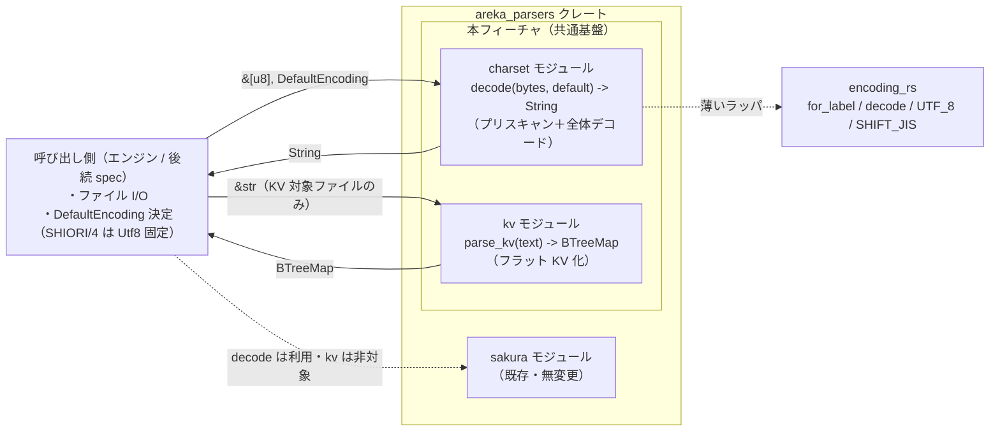
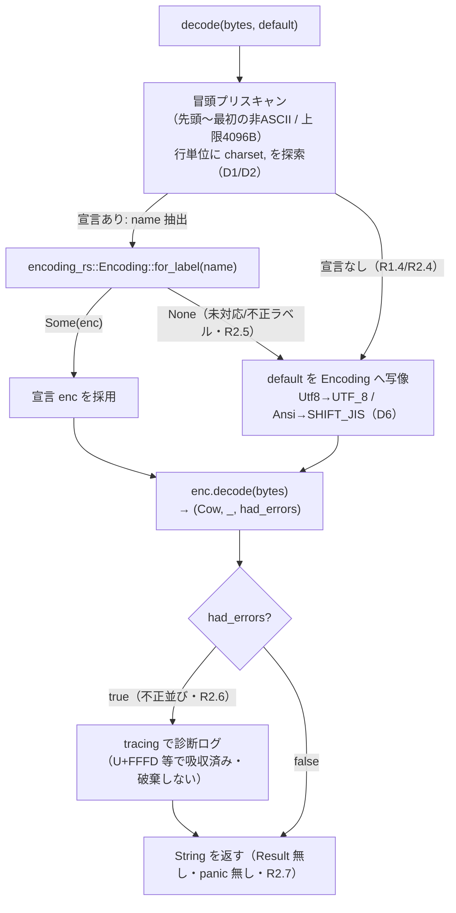

# Design Document

## Overview

**Purpose**: 本フィーチャは `areka_parsers` クレートに **パーサー共通基盤（2 モジュール）** を確立し、後続の各パーサー spec（balloon／shell／package／sakura 辞書系）が重複実装していた前処理を排する価値を提供する。

**Users**: 後続パーサー spec の実装者が、本基盤の返す **文字列**（`charset::decode`）と **フラット KV マップ**（`kv::parse_kv`）を消費し、「自分のキーを引いて型付け・解決する薄い固有層」だけを書けばよくなる。エンジン（呼び出し側）はバイト列と既定エンコード指定を渡す。

**Impact**: 既存 `areka_parsers`（現状 `sakura` モジュールのみ公開）に、host 非依存・純粋関数の **`charset`／`kv`** トップレベルモジュールを追加する。外部依存として `encoding_rs`（開発者承認済み・唯一の意図的追加）を導入する。既存 `sakura` モジュールには一切変更を加えない。

### Goals
- バイト列 → charset 宣言検出 → 宣言エンコードで全体デコード → `String` の純粋関数を提供する（`charset::decode`）。
- デコード済み文字列 → 素朴な `key,value` フラットマップの純粋関数を提供する（`kv::parse_kv`）。
- 既存 `sakura` モジュールの規律（`Result` 無し寛容・panic しない・`tracing` のみ・in-source テスト・公開パス契約・最小派生・`#[non_exhaustive]`）を機械的に踏襲する。
- emo2 fixture（UTF-8）＋ Shift_JIS 合成入力の単体テストで契約を固定する。

### Non-Goals
- キーの意味解釈・既知/未知分類・型付け・優先度解決（各後続 spec 固有層の領分）。
- `surfaces.txt` のセクション構造パース（KV 非対象。`charset::decode` のみ利用）。
- sakura スクリプト構文解析（`charset::decode` は利用しうるが構文解析は本フィーチャ外）。
- ファイル読み込み I/O（バイト列は呼び出し側が渡す）。
- OS ロケール／ANSI コードページの環境依存解決（純粋性のため `decode` は環境を読まない。§ 決定事項 D6 を参照）。

## Boundary Commitments

### This Spec Owns
- **charset 宣言検出＋全体デコード**（`charset::decode`）: バイト列冒頭を ASCII プリスキャンして `charset,<name>` を検出し、宣言エンコード（未検出／未対応時は呼び出し側指定の既定）でバイト列全体を単一 `String` へデコードする振る舞い。
- **KV マップ化**（`kv::parse_kv`）: デコード済み文字列を `key,value` フラットマップへ変換する振る舞い（後勝ち・trim・空行/カンマ無し行スキップ・値は文字列保持・順序非保持）。
- **既定エンコード指定型**（`DefaultEncoding`）: 呼び出し側が `decode` へ渡す ANSI／UTF-8 の 2 値選択を表す公開型（契約の片側を本 spec が所有・正本）。
- 上記を検証する in-source 単体テスト（emo2 UTF-8 fixture 由来のリテラル期待値＋ Shift_JIS 合成入力）。

### Out of Boundary
- 各後続 spec 固有のキー写像・型付け・座標符号解釈・参照優先度解決（balloon の 3 段参照など）。
- surface セクション構文（`surfaces.txt`）・sakura スクリプト構文の解析。
- ファイル I/O・パス解決・`readme.charset` のような **別ファイルを指すキー** の解釈（`decode` が見るのは自ファイル冒頭の `charset` 行のみ）。
- OS ANSI コードページの環境依存解決（エンジンが `DefaultEncoding` を決定して渡す。`decode` 内では固定写像）。

### Allowed Dependencies
- **Upstream**: `encoding_rs`（`Encoding::for_label` / `Encoding::decode` / 定数 `UTF_8`・`SHIFT_JIS`。いずれも `Option`／タプルを返し `Result`・panic なし）。承認済み・唯一の外部追加依存。
- **std のみ**（`BTreeMap`・`str` 操作）＋ workspace `tracing`。
- 既存 `sakura` モジュールへは依存しない（同一クレート内の別ツリー・独立）。
- **依存制約**: DB／UI／認証／ファイルシステム／OS ロケール API へは一切依存しない（R3 純粋性）。

### Revalidation Triggers
以下の変更は後続 spec（balloon／shell／package）・surface parser の再点検を要する。

- `charset::decode` の公開シグネチャ（`fn decode(bytes: &[u8], default: DefaultEncoding) -> String`）の形状変更。
- `DefaultEncoding` enum の variant 追加・意味変更（特に `Ansi` の写像先コードページ）。
- `kv::parse_kv` の戻り値型（`BTreeMap<String, String>`）または後勝ち・skip 規則の変更。
- charset プリスキャン範囲（§ D1）・書式寛容度（§ D2 相当の R1.3）の変更。
- `encoding_rs` の依存方向・バージョン方針の変更。

## 決定事項（研究フェーズからの持ち越し 6 項目の確定）

research.md §5 の 6 項目を本設計で以下のとおり確定する。これらは Architecture／Components を規定する前提である。

| ID | 論点 | 確定 | 根拠 |
|----|------|------|------|
| **D1** | 冒頭プリスキャン範囲 | 先頭から **最初の非 ASCII バイトまで、かつ上限 4096 バイト** の範囲を行単位で走査する。上限到達または非 ASCII 出現で走査を打ち切り「宣言なし」とする。 | SHIORI3「Charset は最初の行、少なくとも非 ASCII 行より前が望ましい」（research §1.6）。charset 名は ASCII（R1.5）ゆえ非 ASCII 行より前に必ず現れる。上限は過大スキャン防止の安全弁。 |
| **D2** | `charset` 行の書式寛容度 | 区切りは **カンマ `,` のみ**（ukadoc は `charset,` のみ）。キーの **大文字小文字を無視**（`CHARSET`/`Charset` 可）・キー／値の **前後空白を trim**・行末 **CRLF/LF 両対応**。`charset:` 等の異体は **許容しない**。 | R1.3（空白・大小・行末を寛容）。ukadoc 正典が `charset,` 単一書式（research §1.6）。異体許容は過剰実装（brief 禁止事項）。 |
| **D3** | Shift_JIS 合成テストの正本化 | テスト内で `encoding_rs::SHIFT_JIS.encode(<期待文字列リテラル>)` によりバイト列をラウンドトリップ生成する。期待文字列はリテラル直書きし、doc コメントに「合成（fixture に SJIS 実ファイル無し・R7.2）」と採取根拠を明示する。 | R7.2（SJIS は合成入力）・R7.3（リテラル直書き＋出典明示）。fixture に SJIS 実ファイルが無い（research §1.4）。手打ちバイト literal より可読・保守容易。 |
| **D4** | KV マップ型 | **`std::collections::BTreeMap<String, String>`** を採用する。 | R4.8（順序非保持は満たす。`BTreeMap` はキー順で決定的＝テスト比較が容易・`HashMap` の非決定順を回避）。std のみ（研究 §2）。 |
| **D5** | `encoding_rs` 依存宣言場所 | ルート `Cargo.toml [workspace.dependencies]` に `encoding_rs = "0.8"` を追加し、`crates/areka-parsers/Cargo.toml` から `encoding_rs = { workspace = true }` で参照する。 | 他 workspace 依存がすべてバージョン明記で集約されている（既存慣行 `Cargo.toml:15-31`）。バージョン統制の一貫性。 |
| **D6** | 既定エンコード API と ANSI 写像 | `decode(bytes: &[u8], default: DefaultEncoding) -> String`。`DefaultEncoding` は **2 値 enum `{ Ansi, Utf8 }`**（`#[non_exhaustive]`）。`Ansi` は `decode` 内で **固定的に CP932（`encoding_rs::SHIFT_JIS`）へ写像**する（option (a)）。`Utf8` は `encoding_rs::UTF_8`。SHIORI/4 ゴーストはエンジンが `Utf8` を渡す。 | 要件ディスカッション #1 確定（既定は呼び出し側が引数指定・SHIORI/4 は UTF-8 固定）。R3 純粋性：`decode` は OS ロケールを読まず引数のみで決定。areka は JP 文脈が支配的で ANSI=CP932 が実質正解（research §5.6 option (a)）。OS ANSI の非 JP ロケール差はエンジンが将来 `DefaultEncoding` を拡張する余地を `#[non_exhaustive]` で残す。 |

> D6 補足: option (b)（エンジンが具体エンコードを渡す）は `decode` の入力を `&'static Encoding` にする案だが、(a) の 2 値 enum は「ANSI か UTF-8 か」という要件語彙（R2.3/2.4/2.5）と 1:1 で対応し純粋性も保つため、現時点の要件に対し過不足がない。将来 OS ロケール依存の厳密解決が必要になれば variant 追加（`#[non_exhaustive]` ゆえ後方互換）で吸収する。

## Architecture

### Existing Architecture Analysis

既存 `areka_parsers` は「純粋・std のみ・host 非依存」を description に掲げるパーサーファミリで、現状 `pub mod sakura;` のみを公開する（`lib.rs:7`）。`sakura` は `model ← lexer ← decode ← parse` の一方向依存で、`parse` が唯一の公開 facade である。本フィーチャはこの規律をそのまま踏襲した **兄弟トップレベルモジュール** を追加する（`lib.rs` に「兄弟モジュールは各 spec が追加する」と既に明記済み）。

**踏襲する既存パターン**（research §1.2 の discipline table）:
- `Result` を返さない寛容処理・panic しない（`unwrap_or`/`unwrap_or_default` で吸収）。
- 副作用は `tracing` のみ（想定外入力の寛容吸収時に診断ログを出してよい・R6.3）。
- in-source `#[cfg(test)] mod *_tests;` を `mod.rs` に列挙。
- 公開パス経由の契約固定（`validation_tests.rs` 相当を用意）。
- 不透明 NewType＋read-only アクセサ・`#[non_exhaustive]`・最小派生（本 spec では `DefaultEncoding` enum に適用。`kv` の戻り値は素朴な `BTreeMap` ゆえ NewType 不要＝過剰実装回避）。

**命名衝突の回避（research §1.3・D2）**: 既存 `sakura::decode` は「構文トークン → Instruction」の意味デコーダであり、本フィーチャの charset バイトデコードとは別概念で同名。物理モジュール名を **`charset`** とし公開関数を `charset::decode` とすることで、`sakura::decode` との概念混同を明快に解消する（別ツリーゆえ技術的衝突は元々ないが、可読性を優先）。requirements.md の「Decode module」は本設計の **`charset` モジュール** に対応する。

### Architecture Pattern & Boundary Map

選択パターン: **純粋関数パイプライン（2 段・独立モジュール）**。呼び出し側が I/O を担い、本基盤は `&[u8] → String → BTreeMap` の純粋変換のみを担う。



**Architecture Integration**:
- 選択パターン: 純粋関数パイプライン。理由 — 全要件がアルゴリズム的純粋処理（外部連携は `encoding_rs` 1 本のみ・状態なし）。既存 `sakura` の純粋規律に素直に乗る（research §2 複雑性シグナル）。
- 境界分離: `charset`（全パーサー共通・例外なし）と `kv`（surface 以外の全パーサー共通）を独立モジュールに分け、単一責務化。両者は互いに依存しない（呼び出し側が `decode` の出力を `parse_kv` へ渡す）。
- 既存パターン保持: sakura の discipline table 全項目。
- 新規コンポーネント根拠: `charset`＝多重実装（balloon/shell/package で三重）排除の中核。`kv`＝同上。`DefaultEncoding`＝純粋性を保ったまま既定エンコードを外部注入する契約型。
- Steering 準拠: host 非依存・依存追加最小・過剰実装禁止（brief）・正典 ukadoc。

### Technology Stack

| Layer | Choice / Version | Role in Feature | Notes |
|-------|------------------|-----------------|-------|
| Language / Runtime | Rust 2024 | 純粋関数実装 | workspace edition 2024・`publish=false` |
| Parsing / Encoding | `encoding_rs` 0.8 | charset ラベル解決＋バイトデコード | 承認済・唯一の外部追加。`for_label -> Option`・`decode -> (Cow, &Encoding, bool)`（Result/panic 無し） |
| Data / Storage | std `BTreeMap<String,String>` | KV フラットマップ | 決定的順序・順序非保持要件（R4.8）と両立 |
| Observability | `tracing`（workspace） | 寛容吸収の診断ログ（唯一許容される副作用・R6.3） | 既存 `sakura` と同一方針 |

## File Structure Plan

### Directory Structure
```
crates/areka-parsers/
├── Cargo.toml                       # 変更: encoding_rs = { workspace = true } を追加
└── src/
    ├── lib.rs                       # 変更: pub mod charset; pub mod kv; を追加
    ├── charset/
    │   ├── mod.rs                   # 公開面集約: pub use decode / DefaultEncoding。#[cfg(test)] mod *_tests 列挙
    │   ├── model.rs                 # DefaultEncoding enum（#[non_exhaustive]・最小派生）
    │   ├── prescan.rs               # 内部（非公開）: 冒頭 ASCII プリスキャンで charset 名抽出（D1/D2）
    │   ├── decode.rs                # 内部（非公開）: prescan 結果＋encoding_rs で全体デコード（公開 facade decode）
    │   ├── model_tests.rs           # #[cfg(test)] DefaultEncoding の派生・構築
    │   ├── prescan_tests.rs         # #[cfg(test)] プリスキャン（検出/未検出/寛容/上限/非ASCII打ち切り）
    │   ├── decode_tests.rs          # #[cfg(test)] decode 単体（宣言あり/なし/未対応/不正並び/BOM）
    │   └── validation_tests.rs      # #[cfg(test)] 公開パス契約: emo2 UTF-8 + SJIS 合成（リテラル期待値）
    └── kv/
        ├── mod.rs                   # 公開面集約: pub use parse_kv。#[cfg(test)] mod *_tests 列挙
        ├── parse.rs                 # 内部（非公開）: 行分割＋split_once(',')＋trim＋後勝ち（公開 facade parse_kv）
        ├── parse_tests.rs           # #[cfg(test)] parse_kv 単体（後勝ち/空行/カンマ無し/trim/CRLF・LF/空入力）
        └── validation_tests.rs      # #[cfg(test)] 公開パス契約: emo2 balloons0s.txt 由来のリテラル期待値
```

> `charset` は内部を `prescan`（検出）と `decode`（デコード合成）に分ける（sakura の `lexer`/`decode` 分割に対応）。`kv` は単一責務ゆえ内部 `parse.rs` 1 本で足りる（過剰分割回避）。両モジュールとも `mod.rs` が `pub use` で薄い公開面を集約する（sakura `mod.rs` 流儀）。

### Modified Files
- `Cargo.toml`（ルート） — `[workspace.dependencies]` に `encoding_rs = "0.8"` を追加（D5）。
- `crates/areka-parsers/Cargo.toml` — `[dependencies]` に `encoding_rs = { workspace = true }` を追加。description の "std-only" 文言は `encoding_rs` 追加で厳密には破れるが、承認済み意図的逸脱ゆえ description の "Pure ... host-independent" は維持し、必要なら "std-only" を "minimal-dependency" 相当へ軽微更新（実装タスクで判断）。
- `crates/areka-parsers/src/lib.rs` — `pub mod charset;` と `pub mod kv;` を追加（クレート doc の「兄弟モジュールは各 spec が追加する」記述に沿う）。既存 `pub mod sakura;` は無変更。

## System Flows

`charset::decode` の内部フロー（R1/R2/R5 の分岐を可視化）:



補足:
- BOM（R5.2）は `encoding_rs::decode` が sniff して処理する。プリスキャンは ASCII 判定のみゆえ BOM バイトを charset 名と誤認しない（BOM 直後から行走査を続ける実装で吸収）。
- `kv::parse_kv` は分岐が単純（行ループ＋`split_once`）ゆえ図を割愛する。

## Requirements Traceability

| Requirement | Summary | Components | Interfaces | Flows |
|-------------|---------|------------|------------|-------|
| 1.1–1.5 | charset 宣言の冒頭 ASCII プリスキャン・寛容抽出・未検出時は既定へ | `charset::prescan` | `decode` 内部 | decode フロー（Prescan） |
| 2.1, 2.2 | 宣言エンコードで全体デコード（SJIS 文字化け防止） | `charset::decode` | `decode` | decode フロー（Enc→Decode） |
| 2.3, 2.4 | 既定エンコードを引数受領（環境非依存）・宣言なしは既定 | `charset::decode`, `DefaultEncoding` | `decode(_, default)` | decode フロー（DefaultEnc） |
| 2.5 | 未対応ラベルは既定へ寛容フォールバック | `charset::decode` | `for_label -> None` 分岐 | decode フロー（ForLabel→None） |
| 2.6, 2.7 | 不正並びを吸収・単一 String・Result/panic 無し | `charset::decode` | `decode` | decode フロー（had_errors） |
| 3.1–3.3 | 純粋性（I/O・環境なし・決定的・副作用は log のみ） | `charset::decode`, `kv::parse_kv` | 全公開 fn | — |
| 4.1–4.8 | KV マップ化（split_once・分類なし・後勝ち・trim・値は文字列・順序非保持） | `kv::parse_kv` | `parse_kv(text) -> BTreeMap` | — |
| 5.1 | CRLF/LF 両対応の行分割 | `kv::parse_kv` | `parse_kv` | — |
| 5.2 | BOM を charset 探索・デコードで寛容に扱う | `charset::decode` | `decode`（encoding_rs sniff） | decode フロー補足 |
| 5.3 | 空入力 → 空マップ・panic 無し | `kv::parse_kv` | `parse_kv` | — |
| 6.1–6.3 | 寛容規律（no panic / no Result / tracing のみ） | 両モジュール | 全公開 fn | decode フロー（Trace） |
| 7.1–7.5 | 単体テスト（UTF-8 fixture・SJIS 合成・リテラル期待値・公開パス契約・既定別検証） | `*_tests.rs`, `validation_tests.rs` | 公開 API 経由 | — |

## Components and Interfaces

| Component | Domain/Layer | Intent | Req Coverage | Key Dependencies | Contracts |
|-----------|--------------|--------|--------------|------------------|-----------|
| `charset::decode` | Foundation / Encoding | バイト列 → charset 検出 → 全体デコード → String | 1, 2, 3, 5.2, 6 | `encoding_rs`(P0), `charset::prescan`(P0), `DefaultEncoding`(P0) | Service |
| `charset::prescan`（内部） | Foundation / Encoding | 冒頭 ASCII 走査で charset 名抽出（非公開） | 1 | std str（P0） | （内部） |
| `DefaultEncoding` | Foundation / Model | 既定エンコード指定の公開契約型 | 2.3, 2.4, 2.5 | — | State |
| `kv::parse_kv` | Foundation / KV | デコード済み文字列 → フラット KV マップ | 4, 5.1, 5.3, 6 | std `BTreeMap`（P0） | Service |

### Foundation / Encoding

#### `charset` モジュール（公開 facade: `decode`）

| Field | Detail |
|-------|--------|
| Intent | バイト列冒頭を実エンコード非依存で走査し charset 宣言を検出、宣言（または呼び出し側指定既定）エンコードで全体をデコードして単一 `String` を返す |
| Requirements | 1.1, 1.2, 1.3, 1.4, 1.5, 2.1, 2.2, 2.3, 2.4, 2.5, 2.6, 2.7, 3.1, 3.2, 3.3, 5.2, 6.1, 6.2, 6.3 |

**Responsibilities & Constraints**
- 冒頭プリスキャン範囲は D1（先頭〜最初の非 ASCII バイト、上限 4096 バイト）。範囲内を行単位に走査し、大小無視・trim・CRLF/LF 寛容で `charset,<name>` を抽出（D2）。
- 抽出名を `encoding_rs::Encoding::for_label(name.as_bytes())` で解決。`Some` → その Encoding、`None`（未対応/不正）→ 既定へフォールバック（R2.5）。
- 宣言なし（R1.4）→ 既定へ。既定は `DefaultEncoding` を `Ansi→SHIFT_JIS` / `Utf8→UTF_8` へ写像（D6）。
- 選定 Encoding で `enc.decode(bytes)` を実行。`had_errors == true`（R2.6）は破棄せず、必要なら `tracing` で診断（R6.3）。結果 `Cow<str>` を `String` 化して返す。
- **Result を返さず・panic しない**（R2.7/R6.1）。**環境（FS・OS ロケール）へアクセスしない**（R3.1）。同一 `(bytes, default)` に対し決定的（R3.2）。可変状態を持たない（R3.3）。

**Dependencies**
- Outbound: `charset::prescan` — charset 名抽出（Critical）
- Outbound: `DefaultEncoding` — 既定選択（Critical）
- External: `encoding_rs` — `Encoding::for_label` / `Encoding::decode` / `UTF_8` / `SHIFT_JIS`（Critical）。いずれも `Option`／タプルを返し `Result`・panic なし（research §1.5）。

**Contracts**: Service [x] / State [ ]

##### Service Interface
```rust
/// 既定エンコード指定（呼び出し側が ANSI / UTF-8 を選択）。
/// SHIORI/4 ゴーストはエンジンが `Utf8` を渡す。環境非依存（R2.3/R3.1）。
#[non_exhaustive]
#[derive(Clone, Copy, Debug, PartialEq, Eq)]
pub enum DefaultEncoding {
    /// 旧環境互換の ANSI。areka では CP932（Shift_JIS）へ固定写像する（D6）。
    Ansi,
    /// UTF-8。SHIORI/4 の既定。
    Utf8,
}

/// バイト列を charset 宣言（または `default`）に従いデコードして 1 文字列を返す。
/// I/O・環境状態へアクセスしない純粋関数（R3）。Result を返さず panic しない（R2.7/R6.1）。
pub fn decode(bytes: &[u8], default: DefaultEncoding) -> String;
```
- Preconditions: なし（任意のバイト列を受理。空も可）。
- Postconditions: 常に `String` を返す。宣言 Shift_JIS 等はそのエンコードで復元され文字化けしない（R2.2）。不正並びは U+FFFD 等で吸収済み（R2.6）。
- Invariants: 同一 `(bytes, default)` → 同一 `String`（決定的・R3.2）。副作用は `tracing` ログのみ（R3.3/R6.3）。

**Implementation Notes**
- Integration: 呼び出し側がファイルを読み `bytes` を渡す。KV 対象ファイルは戻り `String` を `kv::parse_kv` へ渡す。
- Validation: プリスキャンは ASCII バイト（`< 0x80`）のみを走査対象とし、非 ASCII バイト出現で打ち切る（charset 名が ASCII である前提・R1.5）。BOM は encoding_rs のデコードで吸収、プリスキャンは BOM バイトを非 ASCII 相当として扱うか読み飛ばして誤検出を防ぐ（R5.2）。
- Risks: `for_label` のラベル正規化（Encoding Standard 準拠）が ukadoc 表記（`Shift_JIS`）を解決できることは validation_tests で固定する。

### Foundation / KV

#### `kv` モジュール（公開 facade: `parse_kv`）

| Field | Detail |
|-------|--------|
| Intent | デコード済み文字列を素朴な `key,value` フラットマップへ変換する（分類・型付けなし） |
| Requirements | 4.1, 4.2, 4.3, 4.4, 4.5, 4.6, 4.7, 4.8, 5.1, 5.3, 6.1, 6.2, 6.3 |

**Responsibilities & Constraints**
- 入力を行に分割（CRLF/LF 両対応・R5.1）。各行を最初のカンマで `split_once(',')` して `key`/`value` に分割（R4.1）。
- キー・値の前後空白を trim（R4.4）。空行はスキップ（R4.5）。カンマ無し行はスキップ（R4.6）。
- 同一キーは後勝ち（`BTreeMap::insert` の上書き・R4.3）。既知/未知の分類・専用スロット・未知行コレクションを設けない（R4.2）。
- 値は文字列のまま保持（数値化・符号解釈なし・R4.7）。順序非保持（`BTreeMap`・R4.8）。空入力 → 空マップ・panic 無し（R5.3）。
- **Result を返さず・panic しない**（R6.1）。副作用は `tracing` のみ（R6.3）。

**Dependencies**
- Outbound: std `BTreeMap`・`str::lines`/`split_once`/`trim`（Critical）
- External: なし（`kv` は `encoding_rs` に依存しない）

**Contracts**: Service [x]

##### Service Interface
```rust
/// デコード済み文字列を素朴な `key,value` フラットマップへ変換する。
/// 分類・型付けをせず、後勝ち・trim・空行/カンマ無し行スキップ・値は文字列保持・順序非保持。
/// Result を返さず panic しない（R6.1）。
pub fn parse_kv(text: &str) -> std::collections::BTreeMap<String, String>;
```
- Preconditions: なし（空文字列可）。
- Postconditions: 空入力 → 空マップ（R5.3）。同一キー複数行 → 最後の値（R4.3）。
- Invariants: 同一入力 → 同一マップ（決定的）。値は無加工文字列（R4.7）。

**Implementation Notes**
- Integration: 通常 `charset::decode` の出力を受ける（`&str`）。BOM 済みデコード後の文字列を前提とするため BOM 処理は `charset` 側で完結。
- Validation: `str::lines()` は LF/CRLF を両吸収するが、末尾 CR 残りが無いことを trim で担保（R5.1）。
- Risks: 値中のカンマは `split_once` が最初の 1 個のみで分割するため保持される（R4.1「最初のカンマで分割」に合致・意図どおり）。

## Error Handling

### Error Strategy
本基盤は **エラー型を持たない寛容処理**（既存 `sakura` 規律・R6.1）。想定外・不完全入力は情報を捨てず「最善の結果」を返して継続する（R6.2）。回復不能状態は存在しない（純粋関数・外部リソースなし）。

### Error Categories and Responses
- **未対応/不正 charset ラベル**（R2.5）: `for_label -> None` → 呼び出し側指定既定でデコード継続。診断ログ可。
- **charset 宣言なし**（R1.4/R2.4）: 既定でデコード（エラーではない正常経路）。
- **宣言エンコードとして不正なバイト並び**（R2.6）: `encoding_rs` が U+FFFD 等で置換（`had_errors=true`）。破棄せず String を返す。診断ログ可。
- **空入力・カンマ無し行・空行**（R4.5/R4.6/R5.3）: スキップ／空マップ。panic しない。

### Monitoring
`tracing` を唯一の副作用として、想定外入力の寛容吸収（未対応ラベル・`had_errors`）時に診断ログを出してよい（R6.3）。ログ以外の副作用・可変状態は持たない（R3.3）。

## Testing Strategy

すべて in-source `#[cfg(test)]` テスト（host 非依存・R7）。期待値はリテラル直書きし、fixture 由来値には採取元の正本ファイル名・行をコメントで明示する（クレート跨ぎ `include_str!` を使わない・R7.3）。fixture 実測は research §1.4・本設計「決定事項 D3」に準拠。

### Unit Tests（各モジュール内部・公開 API 経由の一部を含む）
1. **charset プリスキャン検出/未検出/寛容**（R1.1–1.5, D1/D2）: `charset,UTF-8`（emo2 `descript.txt` L1 由来）を検出／大小差 `CHARSET,utf-8`・前後空白・CRLF 末尾を許容／宣言なし（`balloons0s.txt` は先頭 `windowposition.x,266`＝charset 行なし）で「宣言なし」判定／非 ASCII 出現・4096B 上限で打ち切り。
2. **charset デコード分岐**（R2.1–2.7, R5.2）: 宣言 UTF-8 で全体デコード／未対応ラベルは既定へフォールバック／`had_errors` を含む不正並びを U+FFFD 吸収して String を返す／BOM 付き入力を寛容に扱う。
3. **`DefaultEncoding` 写像**（R2.3/2.4/2.5, D6, R7.5）: charset 宣言なし入力を `Utf8` 指定 → UTF-8 デコード／同入力を `Ansi` 指定 → SHIFT_JIS(CP932) デコード。既定指定ごとに指定どおりのエンコードでデコードされることを固定。
4. **`kv::parse_kv` 規則**（R4.1–4.8, R5.1, R5.3）: 後勝ち上書き／空行・カンマ無し行スキップ／key・value trim／CRLF と LF 双方で同結果／値中カンマ保持／空入力 → 空マップ。

### Integration / 公開パス契約テスト（`validation_tests.rs`）
1. **emo2 UTF-8 通し**（R7.1, R7.4）: `descript.txt` 冒頭（`charset,UTF-8` ＋ `type,balloon` / `name,kakukaku for emo-gs`）を模したバイト列（リテラル）を `charset::decode(_, Utf8)` → `kv::parse_kv` に通し、`type→balloon`・`name→kakukaku for emo-gs` を固定。採取元 `emo2-kakukaku/descript.txt` L1–L3 をコメント明示。
2. **charset なしファイル**（R7.4, R1.4）: `balloons0s.txt` 由来（`windowposition.x,266` / `windowposition.y,-129` / `wordwrappoint.x,-49`・charset 行なし）を `Utf8` 既定で通し、`windowposition.x→266`（文字列のまま・R4.7）等を固定。採取元 `emo2-kakukaku/balloons0s.txt` L1/L2/L4 コメント明示。
3. **Shift_JIS 合成通し**（R7.2, D3）: `encoding_rs::SHIFT_JIS.encode("charset,Shift_JIS\r\nname,かくかく\r\n")` でバイト生成 → `charset::decode(_, Utf8)` が宣言 Shift_JIS を優先し `name→かくかく` を文字化けなく復元することを固定（既定 `Utf8` を渡しても宣言優先で SJIS デコードされる＝R2.2 の生き証人）。期待文字列はリテラル直書き＋「合成・fixture に SJIS 実ファイル無し」コメント。

> Performance/Load・E2E は本フィーチャに非該当（純粋関数・host 非依存・UI/ネットワークなし）。

## Supporting References
- 既存規律実装: `crates/areka-parsers/src/sakura/{mod,model,parse}.rs`・`validation_tests.rs`（discipline の手本）。
- fixture 実測: `crates/pilot/examples/shiori-host-32/fixtures/emo2/emo2-kakukaku/{descript.txt, balloons0s.txt}`（research §1.4・本設計テスト採取元）。
- `encoding_rs` API 詳細・ukadoc charset 正典・6 決定項目の背景: `research.md`（§1.5/§1.6/§5）。
