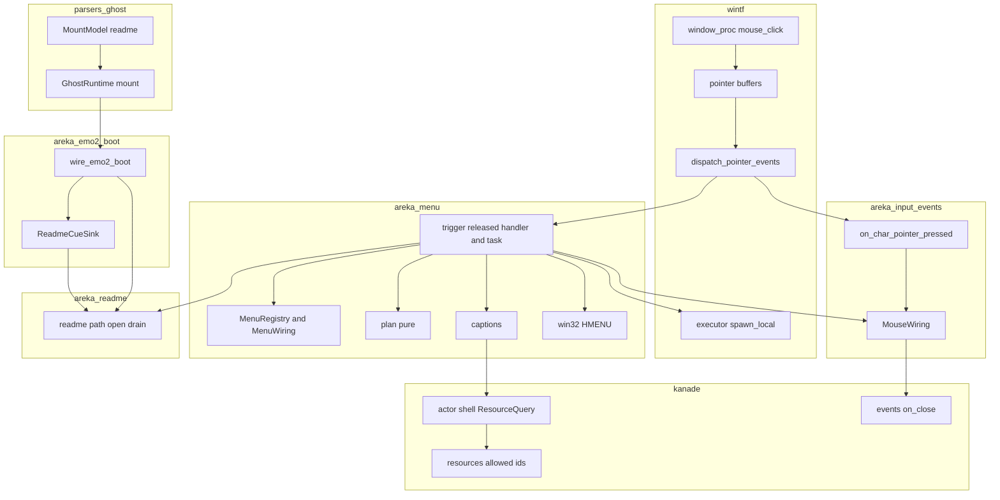
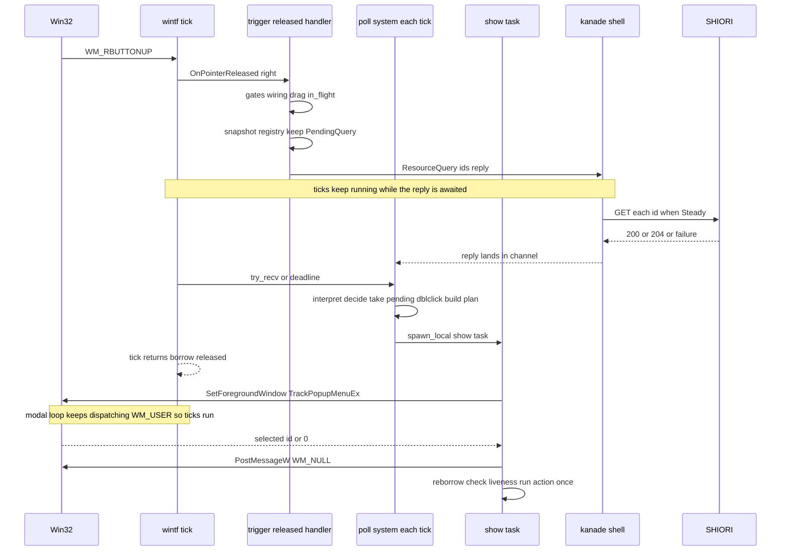
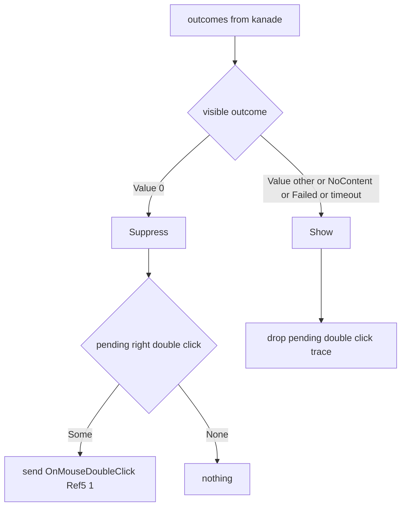

# Design Document: areka-P0-popup-menu-minimal

> 2026-09-18 生成。本文で挙げるファイルと定義名は本ブランチ（main `ca3c4fdc` 直後）での実測である。行数は目安であり、着手時に `wc -l` で引き直すこと。引用は「どのファイルの、何の定義か」で指し、行番号は使わない。調査の経緯と選ばなかった案は `research.md` §1〜§7 にある。

## Overview

**Purpose**: 第三者の利用者が、キャラクター窓の右クリックから「説明書を開く」「終了する」を見つけられるようにする。あわせて、後続の 4 本の spec（ゴースト／シェル／バルーンの切替・インストール・ネットワーク更新）が自分の項目を足すための**登記式の口**（`MenuRegistry`）を切る。

**Users**: 第三者の利用者（右クリック→操作）、ゴースト作者（`*button.caption`・`popupmenu.visible` で項目名と表示を制御）、後続 spec の実装者（`MenuRegistry` へ登記）。

**Impact**: 右クリックは今日 `OnMouseDoubleClick` の材料としてしか使われていない（`crates/areka/src/input_events/mod.rs` の `on_char_pointer_pressed`）。本設計は ⑴ wintf のポインタ配送に「離した」を足し、⑵ areka に `menu`・`readme` の 2 モジュールを新設し、⑶ kanade に「任意の時点で SHIORI リソースを引く」入口と `OnClose` の Ref1／Ref2 を足し、⑷ parsers に `readme` キーの転記を足す。見た目は OS 標準メニュー（`HMENU`＋`TrackPopupMenuEx`）に任せ、自前描画は持たない。

### Goals

- 右ボタンを離した位置に OS 標準のポップアップメニューが出る（要件 1）。
- 枠 7 種の並びと、「説明書」「終了」の動作（要件 2・4・5）。
- 項目名を `*button.caption` で差し替え、`popupmenu.visible` で抑止する（要件 3）。
- 登記式の口 `MenuRegistry` と、それを OS 非依存の純粋関数で検証できる構造（要件 6・9）。
- 表示中もゴーストが動き続ける（要件 7・開発者裁定 2026-09-18）。
- 網羅台帳への担当登記の**手順**を確定する（要件 10・登記そのものは実装タスク）。

### Non-Goals

- オーナードロー（`menu.*` キー・`menu_*.png`）、着せ替えメニュー、設定・バージョン情報・「全て終了」等の枠に無い項目、トレイアイコン。
- 右クリック単発の `OnMouseClick`（Ref5＝1）送出（要件 1.5・11.1＝送らない）。
- ゴースト／シェル／バルーンのサブメニューの中身、「インストール…」「ネットワーク更新」の動作（登記する側の spec）。
- `\![open,readme,種類,名前]`（引数付き）の実行、`readme.charset` の解釈。
- `popupmenu.type` の問い合わせ（要件 3.8）と `char{n}`（n≧2）の問い合わせ先（要件 3.6）。

## Boundary Commitments

### This Spec Owns

- **入力**: wintf のポインタ配送に「ボタンを離した」1 フレーム限りの旗と `OnPointerReleased` の配送を足すこと（`crates/wintf/src/ecs/pointer/`）。areka 側のキャラクター窓の解放ハンドラ（右ボタンだけを見る）。
- **メニューの構造と表示**: 枠 7 種・並び・区切り・識別子の払い出し・`MenuRegistry` の口・`TrackPopupMenuEx` の呼び方・表示中の並行動作（`crates/areka/src/menu/`）。
- **項目名と表示可否の照会**: どのリソース名を・いつ・どこへ問い合わせ、返り値をどう項目名に写すか。kanade 側の「任意の時点の GET」の入口（`KanadeMsg::ResourceQuery`）と許可名の追加。
- **説明書**: `readme` キーの転記（parsers）・ファイルの決め方・既定アプリで開く関数・`\![open,readme]` の消費者（`crates/areka/src/readme.rs`・`emo2_boot/readme_cue.rs`）。
- **終了**: 「終了」項目→既存の `CloseRequest` 経路、`CloseReason::User` にスコープを載せて `OnClose` の Ref1／Ref2 を出すこと。
- **右ダブルクリックの規則**（要件 1.10）: `OnMouseDoubleClick(Right)` を送るかどうかをメニュー側が決める形。
- **台帳の担当登記の手順**（要件 10）。実施は実装の最終タスク。

### Out of Boundary

- 登記する側の内容（列挙・現在のチェック・`menu,hidden` の除外・切替・インストール・更新の実行）。本仕様は「登記した項目が定めた場所に出る」ことだけを保証する。
- `Emo2Wiring`（`crates/areka/src/emo2_boot/frame/wiring.rs`）の形。本仕様は `Emo2Wiring::new` の署名にも欄にも触らない（構築点が 6 か所以上あるため）。`readme` の受け口は別の NonSend 資源として置く。
- kanade の状態機械（`schedule/mod.rs`・`steady.rs`・`boot.rs`・`close.rs`）の遷移。`CloseReason::User` の形が変わるだけで、遷移・保留・締切の規則は不変。
- バルーン窓の右クリック（`input_events/balloon.rs` は触らない）。
- `main.rs` のファサード分割（別途）。本仕様の `main.rs` 増分は結線 1 呼出（3〜5 行）に限る。
- `ForceQuit` 経路の `OnClose` NOTIFY（`events::on_close_notify`）の Ref 列（Ref0 のみのまま）。

### Allowed Dependencies

- 上流（完了済み）: `areka-P0-input-events`（`MouseWiring`・ポインタハンドラの署名）、`areka-P0-collision-dpi-hittest`（`resolve_hit_owned`）、`areka-P0-host32-window-thread-pump`（SHIORI アクターの待機中の死活監視）。
- 共有基盤: `wintf-winmsg-executor` 0.0.5（`wintf::executor::spawn_local`・再輸出は `crates/wintf/src/lib.rs`）、wintf の NonSend 資源 `EcsWorldSelfRef`（外側 World への `Weak`・`WinApp::wire_new_path` が注入）、`windows` 0.62.2 の有効機能（`Win32_UI_WindowsAndMessaging`・`Win32_UI_Shell`・`Win32_Graphics_Gdi`＝ワークスペース `Cargo.toml`）、`areka_actor::reply_channel`、`log-capture-kit`（テスト）。
- モジュール間の依存方向（areka bin クレート内・左から右へだけ import する）:
  `readme` → `menu` → `input_events` → `emo2_boot` → `placement`／wintf。
  `readme` は葉（`menu` にも `input_events` にも依存しない）。`emo2_boot/readme_cue.rs` は `readme::ReadmeRequest` だけを使う。`menu` は `input_events`（`MouseWiring`・`char_scope`）と `placement`（`CharWindowMarker`）と `readme` に依存し、`emo2_boot` には依存しない。
- 守ること: 新しい外部クレートを足さない。kanade は sylphya にもメニューにも依存しない（許可名は kanade 自身の表）。`\!` の typed variant を新設しない（汎用キャリアを名前で自己選別する）。

### Revalidation Triggers

- `MenuItem`／`Supplier`／`MenuAction`／`Frame` の形を変えたら、登記する 4 本（`baseware-root-layout`・`ghost-shell-balloon-switch`・`ghost-install`・`network-update`）が再確認する。
- `KanadeMsg::ResourceQuery` の形（返り値の型・許可名の集合）を変えたら、kanade の凍結テストと本仕様の照会テストを同時に直す。
- `CloseReason::User { scope }` は 20 ファイルの構築点を持つ。並走する `nar-install` が触りうるのは `crates/areka/src/emo2_boot/spine.rs`（1 行）と `spine_conformance_script.rs`（`CLOSE_REASON` の期待列・2 行）で、後着側が rebase で解く。
- `PointerState.released` を足すため、wintf の `dispatch_pointer_events` の末尾のクリア処理と既存テスト `test_dispatch_clears_button_state_after_dispatch` を同時に更新する。
- `wire_emo2_boot` の sinks の本数（5→6）。sinks の順序を前提にしたテストがあれば追随する。
- `wire_menu` は呼ばれた時点に在る `CharWindowMarker` 窓へだけ `OnPointerReleased` を装着する（`attach_char_pointer_handlers` と同じ性質）。ゴースト切替で窓を作り直す spec（`ghost-shell-balloon-switch`）は、再生成した窓へ `attach_char_pointer_handlers` と `menu::attach_release_handlers` の両方を掛け直す。
- 台帳（`doc/ukadoc-coverage/ledger/*.toml`）と `roadmap-draft.md` は A0 の 3 本が同時に触りうる（要件 10.5）。

## Architecture

### Existing Architecture Analysis

- **入力**: Win32 の `WM_RBUTTONDOWN`／`WM_RBUTTONUP` は wintf が受けて `ButtonBuffer{down_received, up_received}` に記録し（`ecs/window_proc/mouse_click.rs` の `handle_button_message`）、`pointer/buffers.rs` の `transfer_buffers_to_world` が `PointerState.right_down` へ写す。`pointer/dispatch/mod.rs` の `dispatch_pointer_events` は `OnPointerMoved`（常時）と `OnPointerPressed`（`*_down` のいずれか）だけを配り、`OnPointerReleased` は型だけあって配られない。押下と解放が同じ tick に入ると `else if` で解放が捨てられる。
- **UI スレッド**: `WinApp`（`crates/wintf/src/runtime/mod.rs`）は `COINIT_MULTITHREADED`。tick は `runtime/tick_bridge.rs` の `tick_one_frame_with` が `try_borrow_mut` を tick の間保持する。ポインタハンドラはその内側で呼ばれる。実行器の起床はメッセージ専用窓への `WM_USER` で、モーダルループの中でも他のタスクは poll される（`research.md` §7.2）。
- **kanade**: SHIORI への送出は `actor.rs` の `round_trip_request` 1 か所。リソースの GET は `schedule/boot.rs` の prefetch 段で `username` を 1 回引くだけ（許可表 `schedule/resources.rs` の `ALLOWED_RESOURCE_IDS`）。結果語彙 `ResourceOutcome{Value, NoContent, Failed}` は要件 3.2〜3.4 の 3 分岐と 1 対 1。殻には状態機械を経ずに処理する前例がある（`KanadeMsg::Close`）。
- **終了**: `MouseWiring::send_close_request` → `KanadeMsg::CloseRequest{reason}` → `steady.rs` の `on_close_request`／`begin_close` → `events::on_close(reason, snapshot)`（Ref0 のみ）。
- **`\!` コマンド**: `dola::cue::CueCommand::Custom` の汎用キャリアを消費者が名前で自己選別する（`emo2_boot/move_cue.rs` の `MoveCueSink`）。台帳 `emo2_boot/consumer_ledger.rs` の `ConsumerLedger::canonical` が名前と選別子の一意性を守る。
- **readme**: `areka-parsers/src/package/resolve.rs` の `resolve` は `readme` を読まない。`GhostRuntime` は `mount` を私有し公開アクセサが無い。

### Architecture Pattern & Boundary Map



**Architecture Integration**:
- **選んだ形**: 「純粋な構造（登記→計画→識別子）」と「OS を触る薄い層（`win32.rs`）」を分け、両者を UI スレッドのタスク（`trigger.rs`）が繋ぐ。照会は kanade の殻で受け、状態機械を変えない。
- **責務の分離**: 枠と並びは `plan`、名前は `captions`、表示は `win32`、動作は登記された閉包。`readme` はメニューからも台本からも呼ばれる葉モジュール。
- **既存の型を保つ**: ポインタハンドラの署名（`fn(&mut World, Entity, Entity, &Phase<PointerState>) -> bool`）、NonSend 資源の結線（`wire_mouse_input`／`wire_choice_drain` と同型）、`CueSink` の名前自己選別、`ReplySender`／`ReplyReceiver` の往復。
- **新設の理由**: `menu/`（メニューの都合を `input_events/mod.rs` へ混ぜない・後続 4 本が見る場所を 1 つにする）、`readme.rs`（メニューと台本の 2 入口が同じ関数へ届く）、kanade `actor_resources.rs`（殻の照会を `actor.rs` の 500 行へ足さない）。
- **steering との整合**: エンジン固有名（kanade＝運行表・sakura＝再生）、並行モデル（アクター＋UI スレッド固定）、ログ規約（`logging.md`）、1 ファイル 1,000 行、テストの兄弟ファイル配置、`\!` の汎用キャリア。

### Technology Stack

| Layer | Choice / Version | Role in Feature | Notes |
|-------|------------------|-----------------|-------|
| UI 基盤 | wintf（bevy_ecs 0.19・`wintf-winmsg-executor` =0.0.5） | ポインタ配送・NonSend 資源・`spawn_local` | 変更は `pointer/` の 3 ファイルのみ |
| Win32 | `windows` 0.62.2（`Win32_UI_WindowsAndMessaging`・`Win32_UI_Shell`・`Win32_Graphics_Gdi`） | `CreatePopupMenu`／`AppendMenuW`／`TrackPopupMenuEx`／`DestroyMenu`／`SetForegroundWindow`／`PostMessageW`／`ClientToScreen`／`ShellExecuteW` | 依存追加 0。`unsafe` は `menu/win32.rs` と `readme.rs` の 2 ファイルに閉じる |
| 運行 | areka-kanade（アクター殻） | `KanadeMsg::ResourceQuery` の往復・`CloseReason::User{scope}` | 状態機械の遷移は不変 |
| 再生 | dola `cue`／areka-sakura | `\![open,readme]` の汎用キャリア | 消費者 1 本を追加 |
| 解析 | areka-parsers `package` | `readme` キーの転記 | `MountModel` は `#[non_exhaustive]` |
| ログ | tracing | 要件 8 の記録 | `[menu]`／`[readme]` 接頭辞 |
| テスト | `log-capture-kit`・kanade テストハーネス（`tests/kanade/common/`） | ログ表明・偽 SHIORI | 既存の道具のみ |

## File Structure Plan

### 新規ファイル

```
crates/wintf/src/ecs/pointer/
└── （新規なし・既存 3 ファイルへ追記）

crates/areka/src/
├── menu/
│   ├── mod.rs                 # Frame・MenuItem・Supplier・MenuAction・MenuRegistry・MenuWiring・wire_menu・組込 2 項目の登記（約 300 行）
│   ├── mod_registry_tests.rs  # 登記の置き換え warn・取り消し・組込 2 項目（要件 6.3/6.4/2.2）
│   ├── plan.rs                # 純粋: 登記の写し＋名前 → MenuPlan（枠順・区切り・識別子・& の写し）（約 200 行）
│   ├── plan_tests.rs          # 要件 9.1
│   ├── captions.rs            # リソース名の表・問い合わせる名前の列挙・kanade 往復・返り値の写し・表示可否（約 250 行）
│   ├── captions_tests.rs      # 要件 9.2（写し側）・9.3（表示可否）・3.8（問い合わせない表）
│   ├── trigger.rs             # 解放ハンドラ（写し＋照会送出）・PendingQuery・poll_menu_query（毎 tick の返事覗き・判定・計画）・show_task（表示→動作）（約 350 行）
│   ├── trigger_tests.rs       # 判定 decide／poll_step の純粋テスト（要件 9.3）・終了の送出 1 件（要件 9.6）
│   └── win32.rs               # HMENU 組立・TrackPopupMenuEx・フォアグラウンド作法・ClientToScreen（約 200 行・unsafe はここだけ）
├── readme.rs                  # ReadmeRequest・resolve_path・open（ShellExecuteW）・ReadmeWiring・wire_readme・drain system（約 200 行）
├── readme_tests.rs            # 要件 9.4（決め方・有効／無効）
├── input_events/
│   └── input_events_menu_tests.rs  # 右ダブルクリックの預かり・Ctrl+左ダブルクリックの scope（要件 1.10/5.3）
└── emo2_boot/
    ├── readme_cue.rs          # ReadmeCueSink（\![open,readme] の消費者・引数付きは warn）（約 120 行）
    └── readme_cue_tests.rs    # 要件 9.5

crates/areka-kanade/src/
├── actor_resources.rs         # 殻の ResourceQuery 応答（Steady なら往復・それ以外は NoContent）（約 120 行）
└── actor_resources_tests.rs   # 純粋部分（フェーズ判定）のテスト

crates/areka-kanade/tests/kanade/
└── resource_query_test.rs     # 偽 SHIORI で 4 通り（値／空／204／失敗）（要件 9.2）
```

### 変更ファイル（増分の目安と 1,000 行の余裕）

| ファイル | 現在 | 増分 | 変更 |
|---|---|---|---|
| `crates/wintf/src/ecs/pointer/types/mod.rs` | 372 | +20 | `PointerState.released: ButtonReleased` と `ButtonReleased` 型 |
| `crates/wintf/src/ecs/pointer/buffers.rs` | 506 | +10 | `transfer_buffers_to_world` で `up_received` から独立に `released` を立てる |
| `crates/wintf/src/ecs/pointer/dispatch/mod.rs` | 260 | +15 | `OnPointerReleased` の配送と末尾のクリア |
| `crates/wintf/src/ecs/pointer/dispatch/tests.rs` | 362 | +60 | 解放配送・同 tick 押下＋解放・クリアの檻 |
| `crates/areka/src/input_events/mod.rs` | 475 | +40 | `char_scope` を `pub(crate)`、`MouseWiring` に右ダブルクリックの預かり、`send_close_request` を `pub(crate)`、押下ハンドラの右ダブルクリック分岐を預かりへ、Ctrl+左ダブルクリックに scope |
| `crates/areka/src/input_events/input_events_tests.rs` | 845 | +5 | `CloseReason::User { scope }` の追随（新規檻は兄弟ファイルへ） |
| `crates/areka/src/main.rs` | 948 | +5 | wired 分岐で `wire_mouse_input` の直後に `menu::wire_menu(app.world().borrow_mut().world_mut(), runtime.kanade().clone())` 1 呼出・`mod menu; mod readme;`・`shutdown(CloseReason::User { scope: 0 })` |
| `crates/areka/src/emo2_boot/mod.rs` | 654 | +10 | `ReadmeCueSink` を sinks の 6 本目へ・boot 後に `readme::wire_readme` |
| `crates/areka/src/emo2_boot/consumer_ledger.rs` | 627 | +8 | `("open", Some("readme"))` → `CommandConsumer::ReadmeSink` |
| `crates/areka/src/emo2_boot/spine.rs`・`spine_conformance_script.rs`・`spine_conformance_support*.rs`・`spine_*_tests.rs` | — | 各 1〜2 | `CloseReason::User { scope: 0 }` と `OnClose` 期待列 `[user, 0, 0]` |
| `crates/areka-actor/src/reply.rs` | 161 | +10 | `ReplyReceiver::try_recv(&self)`（`recv`／`recv_timeout` は不変・テスト 2 本を同ファイルの `tests` へ） |
| `crates/areka-kanade/src/msg.rs` | 744 | +15 | `CloseReason::User { scope: u32 }`・`KanadeMsg::ResourceQuery`・variant 数のテスト追随 |
| `crates/areka-kanade/src/actor.rs` | 500 | +8 | 閉包で `ResourceQuery` を `actor_resources::answer` へ委譲・`round_trip_request` を `pub(crate)` |
| `crates/areka-kanade/src/lib.rs` | — | +2 | `mod actor_resources;`・再輸出 |
| `crates/areka-kanade/src/schedule/resources.rs` | 224 | +25 | 許可名 10・汎用 `resource_get(id, snapshot)`・凍結テストの書き換え |
| `crates/areka-kanade/src/schedule/events.rs` | 424 | +8 | `on_close` が `User{scope}` で Ref1／Ref2 を積む |
| `crates/areka-kanade/src/schedule/events_tests.rs`ほか kanade のテスト | — | 各 1〜3 | `CloseReason::User { scope: 0 }` の追随・`OnClose` 参照列の期待 |
| `crates/areka-ghost/src/runtime.rs` | 678 | +5 | `GhostRuntime::mount(&self) -> &MountModel` |
| `crates/areka-ghost/tests/ghost/spine_e2e_test_s4_*.rs`・`s5_*.rs` | — | 各 1 | `CloseReason::User { scope: 0 }` |
| `crates/areka-parsers/src/package/model.rs` | 454 | +3 | `MountModel.readme: Option<String>`（正典 URL 1 行付き） |
| `crates/areka-parsers/src/package/resolve.rs` | 963 | +2 | `readme: map.get("readme").cloned()` |
| `crates/areka-parsers/src/package/resolve_tests.rs` | 441 | +25 | `readme` あり／なし |
| `doc/ukadoc-coverage/ledger/shiori.toml`・`sakura-script.toml`・`assets.toml`・`roadmap-draft.md`・`report/*.md`・`summary.md` | — | — | 要件 10（最終タスク） |

`steady.rs`（935）・`boot.rs`・`close.rs`・`schedule/mod.rs` は**本文を変えない**（テスト内の `CloseReason::User` リテラルの追随のみ）。`Emo2Wiring`・`frame.rs`・`placement/spawn.rs`・`input_events/balloon.rs` は触らない。

## System Flows

### 右クリックからメニューが閉じるまで



流れの上の決め事:
- **入口は解放だけ**。押下ハンドラはメニューに関わらない（右ダブルクリックの材料を預けるだけ）。
- **待ちは tick に乗せる**（開発者裁定 2026-09-18 設計ディスカッション #1）。解放ハンドラは登記の写しを取って kanade へ照会を送るだけで返事を待たない。返事は毎 tick の system `poll_menu_query` が `try_recv` で覗き、届いた tick（または期限）で判定・計画して表示タスクを起こす。**照会を待っている間も tick は回る**（描画・文字送り・まばたきが止まらない）。UI スレッドが同期で待つ区間は無い。
- **World を借りるのは tick の中だけ**（解放ハンドラ・poll system・動作の再借用）。表示（`TrackPopupMenuEx`）の間は World を借りていない。tick は表示中も回る（要件 7.2）。
- **表示は 1 枚まで**（`MenuWiring.in_flight`＝解放から動作の終わりまで）。待ちの間や表示中に届いた解放は預かりを捨てて `trace!`。
- **動作は戻った後に 1 回**。`Weak` の upgrade と窓 entity の `WindowHandle` の有無を確かめてから呼ぶ（要件 1.4／6.5／7.4）。

### 表示可否と右ダブルクリックの判定（純粋関数 `decide`）



- `Failed`／上限超過は「表示する」と扱う（要件 3.7）。
- 預かり（`PendingDoubleClick`）は押下ハンドラが `MouseWiring` へ置き、タスクが `take` する。同じ tick に解放と 2 度目の押下が入っても、送るかどうかを決めるのはタスク 1 か所である（要件 1.10／11.3）。

## Requirements Traceability

| Requirement | Summary | Components | Interfaces | Flows |
|---|---|---|---|---|
| 1.1 | 右ボタン解放位置に OS 標準メニュー | wintf `released`／`OnPointerReleased`、`trigger`、`win32` | `on_char_pointer_released`、`win32::show` | 右クリック |
| 1.2 | 描画・キー操作・閉じ方は OS | `win32` | `TrackPopupMenuEx`（オーナードロー無し） | — |
| 1.3 | 外クリック／Esc はゴースト入力にしない | `win32` | メニューがマウスを捕捉・`WM_NULL` 作法 | 実機 9.9 ⑴ |
| 1.4 | 選択後に閉じてから 1 回 | `trigger` | `TPM_RETURNCMD` の戻り値→動作 1 回 | 右クリック |
| 1.5 | `OnMouseClick` は送らない | `input_events`（不変） | — | — |
| 1.6 | バルーンの右クリック不変 | `input_events/balloon.rs`（不変） | — | — |
| 1.7 | 表示失敗は `error!` | `win32`、`trigger` | `win32::show -> Result` | エラー表 |
| 1.8 | 起動前は出さない | `trigger` | `MouseWiring`／`MenuWiring` 不在の self-gating | — |
| 1.9 | 左ドラッグ中は出さない | `trigger` | `wintf::ecs::drag::snapshot_drag_state` | — |
| 1.10 | 右ダブルクリックは `visible=0` のときだけ | `input_events`（預かり）、`trigger::decide` | `MouseWiring::defer_right_double_click`／`take_pending_right_double_click` | 判定 |
| 2.1 | 枠 7 種の並び | `menu::Frame::ORDER`、`plan` | `Frame` | — |
| 2.2 | 説明書・終了を常に載せる | `menu::wire_menu`（組込登記） | `MenuRegistry::register` | — |
| 2.3 | 未登記の枠は出さない | `plan` | `MenuRegistry::snapshot` | — |
| 2.4 | サブメニュー・順・チェック | `plan` | `ItemBody::Submenu`、`checked` | — |
| 2.5 | 無効は灰色 | `plan`、`win32` | `enabled` → `MF_GRAYED` | — |
| 2.6 | 区切り線は設計に委ねる | `plan` | 4 群の間に 1 本 | — |
| 2.7 | 識別子の一意性と逆引き | `plan` | `MenuPlan::action(id)` | — |
| 3.1 | 枠↔リソース↔既定名 | `captions::FRAME_CAPTIONS` | `resource_for(frame)` | — |
| 3.2 | 毎回 GET・空でなければ使う | `captions::send_query`／`interpret`、`trigger::poll_menu_query` | `KanadeMsg::ResourceQuery` | 右クリック |
| 3.3 | 204／空は既定名＋`debug!` | `captions::interpret` | `ResourceOutcome::NoContent`／`Value("")` | エラー表 |
| 3.4 | 失敗は既定名＋`warn!` 1 回・出す | `captions::send_query`／`interpret`、`trigger::poll_step` | `ResourceOutcome::Failed`／`QueryFailure` | エラー表 |
| 3.5 | `&` は素通し | `plan` | リソース由来の文言は写さない | — |
| 3.6 | `visible` の問い合わせ先は scope で 2 名 | `captions::visible_resource_for` | `SAKURA_POPUPMENU_VISIBLE`／`KERO_POPUPMENU_VISIBLE` | — |
| 3.7 | `0` なら出さず `info!` | `captions::interpret`、`trigger::decide` | `Visibility::Suppress` | 判定 |
| 3.8 | `popupmenu.type` は問い合わせない | `captions::UNQUERIED_POPUPMENU_RESOURCES`＋テスト | 許可表に無い | — |
| 3.9 | 登記時にリソース名を指定できる | `MenuItem.caption_resource` | `Option<&'static str>` | — |
| 3.10 | 起動前は既定名で出す | kanade `actor_resources::answer` | `Phase::Steady` 以外は SHIORI へ送らず全件 `NoContent`（UI 側は `trigger::poll_menu_query` が tick で覗く・止まらない） | — |
| 4.1 | readme の決め方 | parsers `MountModel.readme`、`readme::resolve_path` | `ghost_root.join(key or readme.txt)` | — |
| 4.2 | 既定アプリで開く | `readme::open` | `ShellExecuteW("open")` | — |
| 4.3 | 無ければ灰色＋初回 `debug!` | `readme::is_available`、組込登記 | `Path::exists` | — |
| 4.4 | 開けなければ `error!` | `readme::open` | `HINSTANCE <= 32` → `error!(path, code)` | エラー表 |
| 4.5 | `\![open,readme]` は同じ関数 | `ReadmeCueSink`、`readme::drain_readme_requests`、`open_from_world` | `mpsc<ReadmeRequest>` | — |
| 4.6 | 引数付きは `warn!` で何もしない | `ReadmeCueSink` | `tokens.len() > 1` | — |
| 4.7 | `readme.charset` は読まない | `readme`（読まない） | — | — |
| 5.1 | 終了は `CloseRequest{User}` 経路 | 組込登記（終了）、`MouseWiring::send_close_request` | `CloseReason::User { scope }` | — |
| 5.2 | `OnClose` Ref1＝Ref2＝scope | kanade `events::on_close` | 参照列 `[user, n, n]` | — |
| 5.3 | Ctrl+左ダブルクリックも scope | `input_events::on_char_pointer_pressed` | `CloseReason::User { scope }` | — |
| 5.4 | 拒否経路は既存 | `schedule/close.rs`（不変） | — | — |
| 5.5 | Ctrl／Ctrl+Shift の入口は残す | `input_events`（不変） | — | — |
| 6.1 | 登記の単位 | `menu::MenuItem`／`ItemBody`／`Supplier` | `MenuRegistry::register` | — |
| 6.2 | そのときの内容 | `MenuRegistry::snapshot` | 供給関数を表示のたびに呼ぶ | 右クリック |
| 6.3 | 置き換えは `warn!` | `MenuRegistry::register` | — | — |
| 6.4 | 取り消し | `MenuRegistry::unregister` | — | — |
| 6.5 | 子項目の動作は閉じた後 1 回 | `trigger` | `MenuPlan::action(id)` | 右クリック |
| 6.6 | 台本と同じ経路 | 組込 2 項目（`send_close_request`／`readme::open_from_world`） | 規約（閉包一本） | — |
| 6.7 | 純粋な構造 | `plan` | `plan::build` は OS 非依存 | — |
| 7.1 | 死活監視を止めない | `shiori/real.rs`（不変・別スレッド） | — | 実機 9.9 ⑸ |
| 7.2 | 表示中も動く | `trigger`（借用の外で表示・照会の待ちも tick に乗せる） | `spawn_local`・`poll_menu_query` | 右クリック |
| 7.2a | 閉じた後に飛びを起こさない | `trigger`（表示中に止めていない） | — | 実機 9.9 ⑸ |
| 7.3 | 表示中の SHIORI 停止 | `trigger`（戻った後は既存経路）、`run_ghost_quit_phase`（不変） | — | — |
| 7.4 | 表示中に窓が消えても落ちない | `trigger`（`Weak` upgrade・entity 生存確認） | `debug!` | 右クリック |
| 7.5 | IME 窓を残さない | `win32`（owner＝キャラクター窓の実 HWND） | — | 実機 9.9 ⑹ |
| 8.1 | 出したら `info!` | `trigger` | `[menu] shown` | ログ表 |
| 8.2 | 選ばれたら `info!` | `trigger` | `[menu] selected` | ログ表 |
| 8.3 | 未選択で閉じたら `debug!` | `trigger` | `[menu] dismissed` | ログ表 |
| 8.4 | 失敗経路は必ず記録 | 全コンポーネント | エラー表 | — |
| 8.5 | `logging.md` の書式 | 全コンポーネント | 接頭辞＋構造化フィールド | — |
| 9.1 | 構造の決定論テスト | `plan_tests.rs` | — | — |
| 9.2 | 偽 SHIORI 4 通り | `resource_query_test.rs`、`captions_tests.rs` | — | — |
| 9.3 | visible と右ダブルクリック | `captions_tests.rs`、`trigger_tests.rs` | `decide` | — |
| 9.4 | readme の決め方 | `readme_tests.rs`、`resolve_tests.rs` | — | — |
| 9.5 | `\![open,readme]` | `readme_cue_tests.rs` | — | — |
| 9.6 | 終了 1 件・Ref1／Ref2 | `trigger_tests.rs`、`input_events_menu_tests.rs`、`events_tests.rs` | 受信側で数える | — |
| 9.7 | 摂動 | tasks の完了記録 | — | — |
| 9.8 | 1,000 行 | File Structure Plan | `file_length_guard_test.rs` | — |
| 9.9 | 実機確認 6 項目 | 実機チェックリスト | — | — |
| 10.1 | 担当 15 項目 | 台帳の手順 | `owner` | — |
| 10.2 | 同じコミットで `roadmap-draft.md` | 台帳の手順 | `[[spec]]`・`owner_count` | — |
| 10.3 | 実装済み 6・語彙のみ 9 | 台帳の手順 | `status` | — |
| 10.4 | 正典 URL 1 行ずつ | `captions.rs`、`resources.rs`、`consumer_ledger.rs`、`model.rs` | `/// ukadoc:` | — |
| 10.5 | 数は数え直す | 台帳の手順 | 道具で数える | — |
| 11.1 | `OnMouseClick` 送らない | `input_events`（不変） | — | — |
| 11.2 | トレイアイコン含めない | Non-Goals | — | — |
| 11.3 | 右ダブルクリックの規則 | `trigger::decide` | — | 判定 |
| 11.4 | readme 不在は灰色 | 組込登記（説明書） | `enabled=false` | — |
| 11.5 | 覆したら同時改訂 | 本文書の Revalidation Triggers | — | — |

## Components and Interfaces

| Component | Domain/Layer | Intent | Req Coverage | Key Dependencies (P0/P1) | Contracts |
|---|---|---|---|---|---|
| `PointerState.released`＋`OnPointerReleased` 配送 | wintf pointer | 「離した」を 1 フレーム限りの旗として配る | 1.1 | `transfer_buffers_to_world`（P0） | State |
| `MouseWiring` 拡張 | areka input_events | 右ダブルクリックの預かり・終了の scope | 1.10, 5.1, 5.3 | kanade `Sender`（P0） | Service |
| `menu::MenuRegistry`／`MenuWiring`／`wire_menu` | areka menu | 登記の口・組込 2 項目・結線 | 2.2, 6.1〜6.4, 3.9 | `readme`（P1）、`MouseWiring`（P0） | Service, State |
| `menu::plan` | areka menu（純粋） | 写し＋名前 → 計画（順・区切り・識別子） | 2.1, 2.3〜2.7, 3.5, 6.7 | なし | Service |
| `menu::captions` | areka menu | 名前表・問い合わせ・写し・表示可否 | 3.1〜3.8, 3.10 | kanade（P0） | Service |
| `menu::trigger` | areka menu | 解放ハンドラ・タスク・判定 | 1.1, 1.4, 1.7〜1.10, 6.5, 7.2〜7.4, 8.1〜8.3 | `wintf::executor`（P0）、`win32`（P0） | Service |
| `menu::win32` | areka menu（OS） | HMENU の組立と表示 | 1.2, 1.3, 1.7, 2.5, 7.5 | `windows`（P0） | Service |
| `readme` | areka（葉） | ファイルの決定・開く・台本からの受け口 | 4.1〜4.7 | `windows`（P0）、parsers（P1） | Service, State |
| `ReadmeCueSink` | areka emo2_boot | `\![open,readme]` の消費者 | 4.5, 4.6 | dola `CueSink`（P0）、消費者台帳（P0） | Event |
| kanade `ResourceQuery`／`actor_resources`／許可名 | kanade | 任意の時点の GET | 3.2〜3.4, 3.10 | `round_trip_request`（P0） | Event |
| kanade `CloseReason::User{scope}`／`on_close` | kanade | `OnClose` の Ref1／Ref2 | 5.2, 5.3 | 既存の終了経路（P0） | Event |
| parsers `MountModel.readme`・ghost `mount()` | parsers / ghost | `readme` キーの転記と公開 | 4.1 | `resolve`（P0） | State |
| 台帳の担当登記 | doc | 15 項目の登記手順 | 10.1〜10.5 | `cargo test -p ukadoc-survey`（P0） | Batch |

### wintf pointer

#### `PointerState.released` と `OnPointerReleased` の配送

| Field | Detail |
|---|---|
| Intent | ボタンを離したことを 1 フレーム限りの旗として `PointerState` に載せ、`OnPointerReleased` ハンドラへ配る |
| Requirements | 1.1 |

**Responsibilities & Constraints**
- `crates/wintf/src/ecs/pointer/types/mod.rs`: `PointerState` に `pub released: ButtonReleased` を足す。`ButtonReleased { left, right, middle, xbutton1, xbutton2: bool }`（`Copy`・`Default`）と `fn any(&self) -> bool`。`double_click`・`wheel` と同じ「1 フレームのみ有効」。
- `crates/wintf/src/ecs/pointer/buffers.rs` の `transfer_buffers_to_world`: 既存の `if down_received … else if up_received …` は変えず、その**前後どちらでもよい独立の文**として `if buf.up_received { released.<button> = true }` を置く。同じ tick に押下と解放が入っても解放を落とさない。
- `crates/wintf/src/ecs/pointer/dispatch/mod.rs` の `dispatch_pointer_events`: `OnPointerPressed` の配送の後に `if state.released.any()` で `OnPointerReleased` を配る（同じ `dispatch_event_for_handler`・Tunnel→Bubble）。末尾のクリアで `released = ButtonReleased::default()`。
- ハンドラの型は既存の `OnPointerReleased(pub PointerEventHandler)`（同ファイルに定義済み・未配送だっただけ）。

**Contracts**: State [x]

##### State Management
- 旗は `transfer_buffers_to_world`（tick の入力段）で立ち、`dispatch_pointer_events` の末尾で消える。同 tick の押下＋解放は `Pressed` と `Released` の両方が配られる。

**Implementation Notes**
- Validation: `dispatch/tests.rs` に ⑴ 解放だけで `OnPointerReleased` が 1 回、⑵ 同 tick 押下＋解放で両方、⑶ 配送後に `released` が消える、を足す。既存 `test_dispatch_clears_button_state_after_dispatch` に `released` の表明を足す。
- Risks: `PointerState` を `..Default::default()` で組んでいるテストは無改変で通る（欄の追加）。

### areka input_events

#### `MouseWiring` 拡張と押下ハンドラの改変

| Field | Detail |
|---|---|
| Intent | 右ダブルクリックを預かる箱と、終了指示にスコープを載せる |
| Requirements | 1.10, 5.1, 5.3 |

**Responsibilities & Constraints**（`crates/areka/src/input_events/mod.rs`）
- `pub(crate) fn char_scope(world, entity) -> Option<u32>`（可視性のみ変更）。
- `MouseWiring` に `pending_right_double_click: Option<PendingDoubleClick>` を足す。
- `on_char_pointer_pressed` の変更は 2 点だけ:
  - Ctrl＋左ダブルクリック（結線済み・Shift 非押下）: `let scope = char_scope(world, entity).unwrap_or(0)` を先に取り、`send_close_request(CloseReason::User { scope })`。
  - `DoubleClick::Right`: `send_double_click` を呼ばず `wiring.defer_right_double_click(PendingDoubleClick{scope, surface_pos: hit.surface_point, region: hit.region})` を呼んで `true`。`Left` は従来どおり即送出。
- `send_close_request` を `pub(crate)` にする（メニューの「終了」が呼ぶ）。

**Contracts**: Service [x]

##### Service Interface
```rust
// crates/areka/src/input_events/mod.rs
pub(crate) struct PendingDoubleClick {
    pub scope: u32,
    pub surface_pos: (i64, i64),
    pub region: Option<String>,
}
impl MouseWiring {
    pub(crate) fn send_close_request(&mut self, reason: CloseReason);           // 既存・可視性のみ
    pub(crate) fn defer_right_double_click(&mut self, pending: PendingDoubleClick); // 上書き（最新だけ残す）
    pub(crate) fn take_pending_right_double_click(&mut self) -> Option<PendingDoubleClick>;
    pub(crate) fn send_pending_right_double_click(&mut self, pending: PendingDoubleClick); // send_double_click(.., MouseButton::Right)
}
```
- Preconditions: 呼び手は `MouseWiring` の存在を確認済み（既存の self-gating）。
- Postconditions: `defer` は前の預かりを捨てて上書きする（同一メニュー要求に 2 件は積まない）。`take` 後は `None`。
- Invariants: 預かりは `OnMouseDoubleClick` の**材料**であり、送るかどうかはメニューのタスクだけが決める（要件 1.10／11.3）。

**Implementation Notes**
- Validation: 新規 `input_events_menu_tests.rs`（`world_with_wiring` の型）で ⑴ 右ダブルクリックで `rx` に何も届かず預かりが `Some`、⑵ Ctrl＋左ダブルクリックの `CloseRequest` が `User { scope: 1 }`（相方側の窓で）。既存 `input_events_tests.rs` は `CloseReason::User { scope: 0 }` へ追随。
- Risks: 預かりが取り出されないまま残る経路（解放が来ない＝メニューが出ない）は無い。押下と解放は対で届き、解放が抑止された場合（ドラッグ中・結線前）は預かりを `take` して捨てる（trace）。

### areka menu

#### `menu::MenuRegistry`／`MenuWiring`／`wire_menu`（`crates/areka/src/menu/mod.rs`）

| Field | Detail |
|---|---|
| Intent | 登記の口と、メニューに要る結線状態を 1 つの NonSend 資源に束ねる。組込の 2 項目を登記する |
| Requirements | 2.2, 3.9, 6.1, 6.2, 6.3, 6.4, 11.4 |

**Responsibilities & Constraints**
- 登記の単位は `MenuItem`。枠ごとに供給関数を 1 つだけ持つ（`[Option<Supplier>; 7]`）。同じ枠へ 2 度目の登記は置き換え＋`warn!`（要件 6.3）。`unregister(frame)` で空にする（要件 6.4）。
- `snapshot(&World, &MenuContext) -> Vec<(Frame, MenuItem)>` は登記された枠だけを `Frame::ORDER` の順に、供給関数をその場で呼んで返す（要件 6.2）。
- `wire_menu` は ⑴ `MenuWiring` を World へ挿入し、⑵ 組込 2 項目を登記し、⑶ 全 `CharWindowMarker` 窓へ `OnPointerReleased(trigger::on_char_pointer_released)` を装着し（`attach_char_pointer_handlers` と同じ走査）、⑷ `Input` スケジュールへ `trigger::poll_menu_query.after(dispatch_pointer_events)` を登録する（`wire_choice_drain` と同型）。`main.rs` の wired 分岐で `wire_mouse_input` の直後に呼ぶ（キャラクター窓は `open_startup_window` で既に生えている）。
- 組込の登記:
  - ⑥説明書: `label: "説明書"`, `caption_resource: Some("readmebutton.caption")`, `enabled: readme::is_available(world)`, `checked: None`, `body: Action(readme を開く閉包)`。閉包は `readme::open_from_world(world)`。
  - ⑦終了: `label: "終了"`, `caption_resource: Some("closebutton.caption")`, `enabled: true`, `body: Action(閉包)`。閉包は `world.get_non_send_mut::<MouseWiring>()` を取り `send_close_request(CloseReason::User { scope: ctx.scope })`。`MouseWiring` 不在なら `warn!` で no-op（要件 8.4）。

**Contracts**: Service [x] / State [x]

##### Service Interface
```rust
// crates/areka/src/menu/mod.rs
#[derive(Clone, Copy, Debug, PartialEq, Eq, Hash)]
pub(crate) enum Frame { Ghost, Shell, Balloon, Update, Install, Readme, Close }
impl Frame { pub(crate) const ORDER: [Frame; 7] = [/* ①〜⑦ */]; }

pub(crate) struct MenuContext { pub scope: u32 }

pub(crate) type Supplier   = Rc<dyn Fn(&World, &MenuContext) -> MenuItem>;
pub(crate) type MenuAction = Rc<dyn Fn(&mut World, &MenuContext)>;

pub(crate) struct MenuItem {
    pub label: String,                          // 既定名（リソースが空のとき使う）
    pub caption_resource: Option<&'static str>, // 文言に使う SHIORI リソース名（任意・要件 3.9）
    pub enabled: bool,                          // false は灰色（要件 2.5）
    pub checked: Option<bool>,                  // Some(true) でチェック（要件 2.4）
    pub body: ItemBody,
}
pub(crate) enum ItemBody { Action(MenuAction), Submenu(Vec<MenuItem>) }

pub(crate) struct MenuRegistry { slots: [Option<Supplier>; 7] }
impl MenuRegistry {
    pub(crate) fn register(&mut self, frame: Frame, supplier: Supplier);   // 置き換えは warn!
    pub(crate) fn unregister(&mut self, frame: Frame);
    pub(crate) fn snapshot(&self, world: &World, ctx: &MenuContext) -> Vec<(Frame, MenuItem)>;
}

pub(crate) struct MenuWiring {
    pub registry: MenuRegistry,
    kanade: Sender<KanadeMsg>,
    in_flight: Rc<Cell<bool>>,                // 表示 1 枚まで（解放〜動作の終わり・guard が Drop で必ず戻す）
    pending: Option<PendingQuery>,            // 照会の返事待ち（trigger::poll_menu_query が毎 tick 覗く）
}
pub(crate) fn wire_menu(world: &mut World, kanade: Sender<KanadeMsg>);
/// 全 CharWindowMarker 窓へ OnPointerReleased を装着する（wire_menu が呼ぶ・窓を作り直す spec も呼ぶ）
pub(crate) fn attach_release_handlers(world: &mut World);
/// 後続 spec 向けの便宜: MenuWiring 不在なら warn! で no-op
pub(crate) fn register(world: &mut World, frame: Frame, supplier: Supplier);
```
- Preconditions: `wire_menu` は UI スレッド・boot 成功後（`wire_mouse_input` と同じ枠）に 1 回。
- Postconditions: `snapshot` は登記順ではなく `Frame::ORDER` の順。供給関数は表示のたびに呼ばれ、値は使い回さない。
- Invariants: 枠 1 つに供給関数は高々 1 つ。`MenuWiring` は UI スレッド専有（NonSend）。

**Implementation Notes**
- Integration: 外側の World（`Rc<RefCell<EcsWorld>>`）への参照は `main.rs` から渡さない。wintf が `WinApp::wire_new_path`（`crates/wintf/src/runtime/mod.rs`）で NonSend 資源 `EcsWorldSelfRef(Weak<RefCell<EcsWorld>>)`（`crates/wintf/src/ecs/world/mod.rs`）を注入済みで、`run()` 中は必ず在る。解放ハンドラがこれを読んで `Weak` の複製をタスクへ渡す（`window_system.rs` の `create_windows` と同じ読み方）。
- Validation: `mod_registry_tests.rs` で置き換えの `warn!`（`log-capture-kit` の `capture_lines`）・取り消し・組込 2 項目が `snapshot` に出ること（`readme` 不在なら `enabled=false`）。
- Risks: `Frame` に variant を足す日（α 後）は `ORDER` と `[_; 7]` と `captions::FRAME_CAPTIONS` を同時に直す＝定数 3 つの長さ一致をテストで縛る。

#### `menu::plan`（純粋・`crates/areka/src/menu/plan.rs`）

| Field | Detail |
|---|---|
| Intent | 登記の写しと名前から、OS に渡す直前の計画（順・区切り・識別子・動作の索引）を作る |
| Requirements | 2.1, 2.3, 2.4, 2.5, 2.6, 2.7, 3.5, 6.7, 9.1 |

**Responsibilities & Constraints**
- 入力は `Vec<(Frame, MenuItem)>`（既に `ORDER` 順）と `CaptionMap`。OS の型に触れない（`windows` を import しない）。
- 文言の決め方: `caption_resource` が `Some(id)` で `captions.get(id)` が非空 → その文言を**そのまま**（要件 3.5）。それ以外 → `escape_ampersand(&item.label)`（`&`→`&&`・登記者由来の文言だけ・`research.md` §7.3-14）。子項目も同じ規則。
- 識別子は 1 から、深さ優先の出現順に払い出す。サブメニューの見出しは識別子を持たない（選べない）。
- 区切り: 群 {①②③}{④⑤}{⑥}{⑦} の**隣り合う非空の群の間**に 1 本（要件 2.6 の設計裁定）。
- 未登記の枠は現れない（`snapshot` が返さない・要件 2.3）。

**Contracts**: Service [x]

##### Service Interface
```rust
// crates/areka/src/menu/plan.rs
pub(crate) enum PlanEntry {
    Item { id: u32, label: String, enabled: bool, checked: bool },
    Submenu { label: String, enabled: bool, children: Vec<PlanEntry> },
    Separator,
}
pub(crate) struct MenuPlan {
    pub entries: Vec<PlanEntry>,
    actions: HashMap<u32, (Frame, MenuAction)>,
}
impl MenuPlan {
    pub(crate) fn action(&self, id: u32) -> Option<(Frame, MenuAction)>; // 逆引き（要件 2.7）
    pub(crate) fn item_count(&self) -> usize;                            // ログ用（要件 8.1）
}
pub(crate) fn build(snapshot: Vec<(Frame, MenuItem)>, captions: &CaptionMap) -> MenuPlan;
pub(crate) fn escape_ampersand(label: &str) -> String;
```
- Preconditions: `snapshot` は `Frame::ORDER` 順（`MenuRegistry::snapshot` が保証）。
- Postconditions: 識別子は一意・`action(id)` は `Item` の id にだけ `Some`。`Submenu` の子は登記された順。
- Invariants: 同じ入力から同じ計画（決定論）。

**Implementation Notes**
- Validation（要件 9.1）: `plan_tests.rs` — 7 枠すべて登記して順を確かめる／⑥⑦だけで「説明書・区切り・終了」／サブメニューの子の順とチェック位置／`enabled=false` の写し／識別子の一意性と逆引き／`&` の写し（リソース由来は素通し・登記由来は `&&`）／未登記の枠が無い。摂動（要件 9.7）は `ORDER` の 2 要素を入れ替えて赤になることを完了記録に残す。

#### `menu::captions`（`crates/areka/src/menu/captions.rs`）

| Field | Detail |
|---|---|
| Intent | どのリソース名を引くかを決め、kanade へ問い合わせ、返り値を文言と表示可否に写す |
| Requirements | 3.1, 3.2, 3.3, 3.4, 3.6, 3.7, 3.8, 3.10, 10.4 |

**Responsibilities & Constraints**
- 表 `FRAME_CAPTIONS`（先頭にページ URL の `/// ukadoc:` 1 行・要素の最初の文字列リテラルがリソース名＝台帳の証拠規則 README §3）:

  | 枠 | リソース | 既定名 |
  |---|---|---|
  | Ghost | `ghostrootbutton.caption` | ゴースト |
  | Shell | `shellrootbutton.caption` | シェル |
  | Balloon | `balloonrootbutton.caption` | バルーン |
  | Update | `updatebutton.caption` | ネットワーク更新 |
  | Install | `ghostinstallbutton.caption` | インストール… |
  | Readme | `readmebutton.caption` | 説明書 |
  | Close | `closebutton.caption` | 終了 |

- 表示可否の名前は scope で選ぶ: `SAKURA_POPUPMENU_VISIBLE`（0）／`KERO_POPUPMENU_VISIBLE`（1）。各定数の直上に `/// ukadoc:` 1 行（要件 3.6）。n≧2 は `debug_assert!(scope <= 1)`（`char_scope` と同じ前提）で到達しない。
- 問い合わせない 4 名は `UNQUERIED_POPUPMENU_RESOURCES`（先頭にページ URL）。テストがこの表の全要素が kanade の許可表に**無い**ことを確かめる（要件 3.8 の判定・死んだ定義にしない）。
- `query_ids(snapshot, scope)`: 表示可否の名前 1 つ＋写しに現れる `caption_resource` の集合（第 1 スライスは 3 件）。
- `send_query`: `KanadeMsg::ResourceQuery { ids, reply }` を送り、**待たずに** `ReplyReceiver` を返す（送出失敗は `Err(QueryFailure::SendFailed)`）。待つのは `trigger::poll_menu_query`（毎 tick の `try_recv`・期限 `QUERY_TIMEOUT` は `Instant` で測る）。上限超過は `Timeout`・切断は `Dropped`。
- `ReplyReceiver::try_recv(&self) -> Result<Option<T>, ReplyError>` を `crates/areka-actor/src/reply.rs` に足す（`TryRecvError::Empty` → `Ok(None)`・`Disconnected` → `Err(Dropped)`・約 10 行・既存の `recv`／`recv_timeout` は不変）。
- `interpret`: 各 `(id, outcome)` を ⑴ `Value(s)` で `s` 非空 → 文言、⑵ `Value("")`／`NoContent` → 既定名＋`debug!`、⑶ `Failed(reason)` → 既定名、に写す。⑶ に落ちた id は 1 回の表示につき **1 行の `warn!`** にまとめて記録する（id と理由を列挙＝要件 3.4 の「1 回」）。`QueryFailure` は全件 ⑶ 相当で、同じく `warn!` 1 行（理由に `timeout`／`dropped`／`send_failed` を載せる）。表示可否は `Value("0")` のときだけ `Suppress`＋`info!`（要件 3.7）、それ以外は `Show`。

**Contracts**: Service [x]

##### Service Interface
```rust
// crates/areka/src/menu/captions.rs
/// ukadoc: https://ssp.shillest.net/ukadoc/manual/list_shiori_resource.html
pub(crate) const FRAME_CAPTIONS: &[(&str, Frame, &str)] = &[ /* (resource, frame, default) ×7 */ ];
/// ukadoc: https://ssp.shillest.net/ukadoc/manual/list_shiori_resource.html#sakura.popupmenu.visible:1
pub(crate) const SAKURA_POPUPMENU_VISIBLE: &str = "sakura.popupmenu.visible";
/// ukadoc: https://ssp.shillest.net/ukadoc/manual/list_shiori_resource.html#kero.popupmenu.visible:1
pub(crate) const KERO_POPUPMENU_VISIBLE: &str = "kero.popupmenu.visible";
/// ukadoc: https://ssp.shillest.net/ukadoc/manual/list_shiori_resource.html
pub(crate) const UNQUERIED_POPUPMENU_RESOURCES: &[&str] = &[
    "char*.popupmenu.visible", "sakura.popupmenu.type", "kero.popupmenu.type", "char*.popupmenu.type",
];
pub(crate) const QUERY_TIMEOUT: Duration = Duration::from_millis(1000);

pub(crate) fn resource_for(frame: Frame) -> &'static str;
pub(crate) fn default_label(frame: Frame) -> &'static str;
pub(crate) fn visible_resource_for(scope: u32) -> &'static str;
pub(crate) fn query_ids(snapshot: &[(Frame, MenuItem)], scope: u32) -> Vec<&'static str>;

pub(crate) struct CaptionMap(HashMap<&'static str, String>);  // 非空の文言だけ
impl CaptionMap { pub(crate) fn get(&self, id: &str) -> Option<&str>; }
pub(crate) enum Visibility { Show, Suppress }
pub(crate) struct Interpreted { pub captions: CaptionMap, pub visibility: Visibility }

pub(crate) enum QueryFailure { SendFailed, Timeout, Dropped }
pub(crate) type QueryReply = Vec<(&'static str, ResourceOutcome)>;
/// 送るだけ・待たない（待つのは trigger::poll_menu_query）
pub(crate) fn send_query(kanade: &Sender<KanadeMsg>, ids: Vec<&'static str>)
    -> Result<ReplyReceiver<QueryReply>, QueryFailure>;
pub(crate) fn interpret(result: Result<Vec<(&'static str, ResourceOutcome)>, QueryFailure>, visible_id: &'static str, scope: u32) -> Interpreted;
```
- Preconditions: `ids` は kanade の許可表に含まれる名前（含まれない名前は kanade が `Failed` で返す）。
- Postconditions: `interpret` は入力の全 id について既定名か文言かのどちらかに決まる（`CaptionMap` に無い id は既定名）。
- Invariants: 前回の値を持たない（毎回問い合わせる・要件 3.2）。

**Implementation Notes**
- Validation（要件 9.2 の写し側・9.3）: `captions_tests.rs` — `Value("取扱説明書(&R)")`→文言・`Value("")`／`NoContent`→既定名＋`debug!`・`Failed`→既定名＋`warn!` 1 行（2 件失敗でも 1 行）・`Err(Timeout)`→全件既定名＋`warn!` 1 行・`visible` の `0`／`1`／`NoContent`／`Failed` の表示可否・`UNQUERIED_POPUPMENU_RESOURCES ∩ ALLOWED_RESOURCE_IDS = ∅`。
- Risks: 待ちは tick に乗るので UI は止まらない。返事が遅いとメニューが遅れて出る（最大 `QUERY_TIMEOUT`＝1,000 ms・超過は既定名で出す）。実機で体感を見て長ければ定数を下げる。

#### `menu::trigger`（`crates/areka/src/menu/trigger.rs`）

| Field | Detail |
|---|---|
| Intent | 解放ハンドラで照会を送って要求を預け、毎 tick の system が返事を覗いて判定・計画し、UI スレッドのタスクで「（借用を解いて）表示→再借用して動作」を回す |
| Requirements | 1.1, 1.4, 1.7, 1.8, 1.9, 1.10, 6.5, 7.2, 7.2a, 7.3, 7.4, 8.1, 8.2, 8.3, 11.3 |

**Responsibilities & Constraints**
- `on_char_pointer_released`（`PointerEventHandler` 署名・Bubble のみ）:
  1. `state.released.right` でなければ `false`。
  2. `MouseWiring` 不在 → `trace!` で `false`（要件 1.8）。`MenuWiring` 不在も同じ。
  3. `snapshot_drag_state() != Idle` → 預かりを `take` して捨て `trace!`・`false`（要件 1.9）。
  4. `MenuWiring.in_flight` が立っている → 手順 3 と同じく預かりを `take` して捨て `trace!`・`false`。
  5. `char_scope`、`WindowHandle.hwnd`、`win32::client_to_screen(hwnd, client_point)` を集めて `MenuRequest{scope, entity, hwnd, screen_pos}` を作り、`MenuContext{scope}` で `registry.snapshot` を取り（要件 6.2 の「そのとき」＝右クリックの時点）、`captions::query_ids` → `captions::send_query`。送れたら `in_flight.set(true)` し、`MenuWiring.pending = Some(PendingQuery{request, snapshot, rx, deadline: Instant::now() + QUERY_TIMEOUT})`。送れなければ（`SendFailed`）`rx` 無しの `PendingQuery` を置き、次の tick で全件既定名として扱う（`warn!` 1 行）。`true`。
- `poll_menu_query`（`Input` スケジュールの system・毎 tick・`dispatch_pointer_events` の後）:
  - `MenuWiring.pending` が `None` なら何もしない（通常の tick のコストはこの 1 判定だけ）。
  - `Some` なら純粋関数 `poll_step(&pending, now)` で ⑴ `rx.try_recv()` が `Ok(Some(reply))` → `Decided(Ok(reply))`、⑵ `Ok(None)` かつ `now < deadline` → `Wait`、⑶ `Ok(None)` かつ期限超過 → `Decided(Err(Timeout))`、⑷ `Err(Dropped)` → `Decided(Err(Dropped))`。`Wait` なら戻る（tick はそのまま進む）。
  - `Decided` なら `pending` を取り出し、`captions::interpret`、`MouseWiring::take_pending_right_double_click`、`decide`。`Suppress` なら（預かりがあれば `send_pending_right_double_click`）guard を落として終了。`Show` なら `plan::build(snapshot, &captions)` して計画を作り、`EcsWorldSelfRef` の `Weak` の複製と guard を添えて `wintf::executor::spawn_local(show_task(weak, request, plan, guard))`（初回 poll は tick が返った後・`research.md` §7.2）。`EcsWorldSelfRef` 不在は `warn!` で捨てる。
- `show_task`（async・UI スレッド・World を借りずに始まる）:
  - **B（表示）**: `win32::show(hwnd, screen_pos, &plan)`。`Err` → `error!`（要件 1.7）。`Ok(None)` → `debug!`（要件 8.3）。`Ok(Some(id))` → `info!`（要件 8.2）。
  - **C（再借用）**: `weak.upgrade()` できない、`try_borrow_mut` が取れない、または `world.get::<WindowHandle>(entity)` が無い → `debug!` で動作を行わない（要件 7.4）。それ以外は、表示中に届いた預かりが残っていれば `take` して捨て（古い材料を次の要求へ持ち越さない）、`plan.action(id)` を 1 回呼ぶ（要件 1.4／6.5）。`in_flight` は guard の `Drop` が全経路で戻す。
- `decide(visibility, pending) -> Decision` は純粋（上の flowchart）。`poll_step` も純粋（`Instant` を引数で受ける・OS を触らない）。
- 待ちの間に窓が消えた場合: `poll_menu_query` は `request.entity` に `WindowHandle` が無ければ `debug!` で `pending` を捨てる（表示しない）。
- 表示中に SHIORI が止まった場合（要件 7.3）: tick は回り続けるので `run_ghost_quit_phase`（`emo2_boot/frame.rs`）が表示中に窓を消しうる。C の生存確認で動作を行わず終わる。落ちない。

**Contracts**: Service [x]

##### Service Interface
```rust
// crates/areka/src/menu/trigger.rs
pub(crate) fn on_char_pointer_released(world: &mut World, _sender: Entity, entity: Entity, ev: &Phase<PointerState>) -> bool;

pub(crate) struct MenuRequest { pub scope: u32, pub entity: Entity, pub hwnd: HWND, pub screen_pos: (i32, i32) }
pub(crate) struct PendingQuery {
    pub request: MenuRequest,
    pub snapshot: Vec<(Frame, MenuItem)>,     // 右クリック時点の写し（要件 6.2）
    pub rx: Option<ReplyReceiver<QueryReply>>, // None＝送出失敗（次の tick で全件既定名）
    pub deadline: Instant,
    guard: InFlightGuard,
}
pub(crate) enum PollOutcome { Wait, Decided(Result<QueryReply, QueryFailure>) }
pub(crate) fn poll_step(pending: &PendingQuery, now: Instant) -> PollOutcome;   // 純粋
pub(crate) fn poll_menu_query(world: &mut World);                               // Input スケジュール・system

pub(crate) enum Decision { Show, Suppress { send_double_click: bool } }
pub(crate) fn decide(visibility: Visibility, pending: Option<&PendingDoubleClick>) -> Decision;

async fn show_task(world: Weak<RefCell<EcsWorld>>, request: MenuRequest, plan: MenuPlan, guard: InFlightGuard);
```
- Preconditions: UI スレッド。`spawn_local` の初回 poll は tick が返った後（`research.md` §7.2）。
- Postconditions: 1 要求につき表示は高々 1 回・動作は高々 1 回・`in_flight` は guard の `Drop` で必ず戻る（早期 return を含む全経路）。
- Invariants: UI スレッドが同期で待つ区間は無い（照会の待ちは tick に乗る・開発者裁定）。B の間 World を借りていない（要件 7.2）。

##### ログ（要件 8）
| 事象 | レベル | 形 |
|---|---|---|
| 出した | `info!` | `[menu] shown` `scope`・`items` |
| 選ばれた | `info!` | `[menu] selected` `scope`・`frame`・`id` |
| 未選択で閉じた | `debug!` | `[menu] dismissed` `scope` |
| 抑止（`visible=0`） | `info!` | `[menu] suppressed by popupmenu.visible` `scope` |
| 表示失敗 | `error!` | `[menu] TrackPopupMenuEx failed` `error`・`hresult` |
| 窓が消えていた | `debug!` | `[menu] window gone after menu` `scope`・`id` |
| 結線前・ドラッグ中・表示中 | `trace!` | `[menu] ignored release` `reason` |

**Implementation Notes**
- Validation: `trigger_tests.rs` — `decide` の 4 組（`Show`×預かり有無・`Suppress`×預かり有無）。`poll_step` の 4 通り（返事あり→`Decided(Ok)`・返事なし期限内→`Wait`・返事なし期限超過→`Decided(Err(Timeout))`・送信端 drop→`Decided(Err(Dropped))`・`reply_channel` と `Instant` を注入）。終了の閉包が `rx` に `CloseRequest{User{scope}}` を**1 件**送ること（要件 9.6・`input_events_tests.rs` の `handler_ctrl_left_double_click_sends_one_close_request_and_keeps_the_windows` と同じ観測＝受信側で数える）。World の組み立ては `MouseWiring::new(tx, RegionSource::Mock(_))` を `insert_non_send` する（どちらも `pub(crate)`。`input_events_tests.rs` の `world_with_wiring`／`with_clock` はそのモジュール私有なので借りない）。`run_request` 自体は OS を触るので檻に入れず、A／C の判断は `decide`・`plan`・生存確認の 3 つの純粋部分に寄せる。
- Risks: 表示中の入れ子 poll（`research.md` §7.4）。実機 9.9 ⑸ で観察。

#### `menu::win32`（`crates/areka/src/menu/win32.rs`）

| Field | Detail |
|---|---|
| Intent | 計画を `HMENU` に写し、OS の作法どおりに表示して選ばれた識別子を返す |
| Requirements | 1.2, 1.3, 1.7, 2.5, 7.5 |

**Responsibilities & Constraints**
- `CreatePopupMenu` → `PlanEntry` を順に `AppendMenuW`（`Item`: `MF_STRING`＋`MF_GRAYED`（`enabled=false`）＋`MF_CHECKED`（`checked`）・id＝識別子／`Submenu`: `MF_POPUP`＋子 `HMENU`／`Separator`: `MF_SEPARATOR`）。文字列は UTF-16 へ（`HSTRING` か `Vec<u16>`）。
- 表示: `SetForegroundWindow(owner)` → `TrackPopupMenuEx(hmenu, TPM_RETURNCMD | TPM_RIGHTBUTTON | TPM_LEFTALIGN | TPM_TOPALIGN, x, y, owner, None)` → `PostMessageW(owner, WM_NULL, 0, 0)`（KB Q135788 の作法・要件 1.3）。
- 戻り値: 0 は「未選択」か「失敗」。呼ぶ前に `SetLastError(0)`、0 が返ったら `GetLastError()` が 0 でなければ `Err`（要件 1.7）。
- 全 `HMENU` は RAII の守り（`Drop` で `DestroyMenu`）。サブメニューは親に `MF_POPUP` で渡した時点で親が所有するので、二重破棄しない。
- owner はキャラクター窓の実 HWND（`WindowHandle.hwnd`）。メニュー窓（クラス `#32768`）は閉じれば消え、IME 窓は増えない見込み（要件 7.5・実機 9.9 ⑹）。
- `client_to_screen(hwnd, x, y)`: `ClientToScreen`。失敗は `None`（呼び手は `trace!` で要求を捨てる）。

**Contracts**: Service [x]

##### Service Interface
```rust
// crates/areka/src/menu/win32.rs
pub(crate) fn show(owner: HWND, screen_pos: (i32, i32), plan: &MenuPlan) -> windows::core::Result<Option<u32>>;
pub(crate) fn client_to_screen(hwnd: HWND, x: i32, y: i32) -> Option<(i32, i32)>;
```
- `unsafe` はこのファイルに閉じる（`readme.rs` の `ShellExecuteW` と合わせて 2 ファイル）。決定論テストは持たない（実機 9.9 ⑴）。

### areka readme（葉・`crates/areka/src/readme.rs`）

| Field | Detail |
|---|---|
| Intent | 説明書のファイルを決め、既定のアプリで開く。メニューと台本の 2 入口が同じ関数へ届く |
| Requirements | 4.1, 4.2, 4.3, 4.4, 4.5, 4.7, 11.4 |

**Responsibilities & Constraints**
- `resolve_path(ghost_root, key: Option<&str>) -> PathBuf` ＝ `ghost_root.join(key.unwrap_or("readme.txt"))`。`ghost_root` は `boot_config.rs` の `cfg.ghost_root`（起動引数の根）。中身も `readme.charset` も読まない（要件 4.7）。
- `ReadmeWiring { path, rx: Receiver<ReadmeRequest>, missing_logged: Cell<bool> }` を NonSend で持つ（`missing_logged` を `Cell` にするのは、供給関数の `&World` から `is_available` を呼ぶため）。`wire_readme(world, path, rx)` は挿入と、`Input` スケジュールへ `drain_readme_requests.after(dispatch_pointer_events)` の登録（`input_events/choice_drain.rs` の `wire_choice_drain` と同型）。
- `is_available(world: &World) -> bool`: `path.exists()`。初めて `false` を見たとき `debug!`（要件 4.3・`missing_logged.set(true)`）。`ReadmeWiring` 不在は `false`。共有借用だけで済むので `MenuRegistry::snapshot(&World)` の供給関数から呼べる。
- `open_from_world(world)`: `ReadmeWiring.path` を取り `open(path)`。不在なら `warn!`。
- `open(path)`: `ShellExecuteW(None, "open", path, None, None, SW_SHOWNORMAL)`。戻り値（`HINSTANCE`）が 32 以下なら失敗＝`error!(path, code)`（要件 4.4）。成功は `info!`。
- `drain_readme_requests`: `rx.try_iter()` を全件取り出し、1 件ごとに `open_from_world`。

**Contracts**: Service [x] / State [x]

##### Service Interface
```rust
// crates/areka/src/readme.rs
pub(crate) struct ReadmeRequest;                       // \![open,readme]（引数なし）
pub(crate) const DEFAULT_README: &str = "readme.txt";
pub(crate) fn resolve_path(ghost_root: &Path, key: Option<&str>) -> PathBuf;
pub(crate) struct ReadmeWiring { /* path, rx, missing_logged: Cell<bool> */ }
pub(crate) fn wire_readme(world: &mut World, path: PathBuf, rx: Receiver<ReadmeRequest>);
pub(crate) fn is_available(world: &World) -> bool;   // 供給関数（&World）から呼ぶ
pub(crate) fn open_from_world(world: &World);
pub(crate) fn drain_readme_requests(world: &mut World);   // Input スケジュール・system
fn open(path: &Path) -> windows::core::Result<()>;
```
- Invariants: `readme` は `menu` にも `input_events` にも `emo2_boot` にも依存しない（葉）。

**Implementation Notes**
- Integration: `wire_readme` の呼び手は `wire_emo2_boot`（boot 成功後・`runtime.mount().readme` を読める唯一の場所）。`mpsc::channel::<ReadmeRequest>()` の送出端は `ReadmeCueSink` へ、受信端はここへ。
- Validation（要件 9.4）: `readme_tests.rs` — `resolve_path` のキーあり／なし、`temp-path-kit` で作った根にファイルを置く／置かないで `is_available` が変わり、初回だけ `debug!` が出る。`open` は OS を触るので檻に入れない（実機 9.9 ⑵）。

### areka emo2_boot

#### `ReadmeCueSink`（`crates/areka/src/emo2_boot/readme_cue.rs`）

| Field | Detail |
|---|---|
| Intent | `\![open,readme]` を talk スレッドで名前選別し、UI へ要求を送る |
| Requirements | 4.5, 4.6, 10.4 |

**Responsibilities & Constraints**
- `dola::cue::CueSink::emit`: `cue.command.as_command_carrier()` が `("open", tokens)` で `tokens[0] == "readme"` のとき、`tokens.len() == 1` なら `tx.send(ReadmeRequest)`、`> 1` なら `warn!` で何もしない（要件 4.6）。他の名前・非キャリアは `debug!` で良性スキップ（`MoveCueSink` と同じ流儀）。
- `#[derive(Clone)]`（`areka_ghost::BootCueSink` の包括実装は `CueSink + Clone + Send + 'static`）。
- 消費者台帳（`consumer_ledger.rs` の `ConsumerLedger::canonical`）に `("open", Some("readme")) → CommandConsumer::ReadmeSink` を 1 行足す（`open` は未登記なので排他規則に触れない）。正典 URL の 1 行 `/// ukadoc: https://ssp.shillest.net/ukadoc/manual/list_sakura_script.html#_5c_21_5bopen_2creadme_5d:1` は列挙 `CommandConsumer` の新 variant `ReadmeSink` の doc に置く（定義箇所＝README §3 の「分岐の腕」・関数本文の呼び出し行には置かない・要件 10.4）。
- `wire_emo2_boot`（`emo2_boot/mod.rs`）の `sinks` に 6 本目として追加。

**Contracts**: Event [x]

##### Event Contract
- 購読: broadcast された全 `TalkCue`。担当は `Custom{command:"open", params:["readme"]}` のみ。
- 発行: `ReadmeRequest`（UI の `ReadmeWiring.rx`）。順序は到着順・取りこぼしなし（チャネルが保留を兼ねる）。
- 冪等性: 1 タグ 1 要求。重複送出は無い。

**Implementation Notes**
- Validation（要件 9.5）: `readme_cue_tests.rs` — `\![open,readme]` で `rx` に 1 件・`\![open,readme,ghost,x]` で 0 件＋`warn!`・`\![move,…]` で 0 件。台帳テスト（既存の `consumer_ledger` テスト）に `("open","readme")` の一意性を足す。

### kanade

#### `KanadeMsg::ResourceQuery` と `actor_resources::answer`

| Field | Detail |
|---|---|
| Intent | UI から任意の時点で SHIORI リソースを複数件引く入口。状態機械を経ず殻で答える |
| Requirements | 3.2, 3.3, 3.4, 3.10 |

**Responsibilities & Constraints**
- `msg.rs`: `KanadeMsg::ResourceQuery { ids: Vec<&'static str>, reply: ReplySender<Vec<(&'static str, ResourceOutcome)>> }`。`KanadeMsg` は derive を持たないので `ReplySender` を載せられる（`ShioriMsg::Request` と同じ形）。variant 数を数えるテスト（`existing_eight_kanade_msg_variants_are_unchanged_by_additive_growth`）へ腕を 1 つ足す。
- `actor.rs` の閉包: `KanadeMsg::Close` の腕の隣で `KanadeMsg::ResourceQuery { ids, reply } => { actor_resources::answer(&state, &shiori, ids, reply); return Ok(ControlFlow::Continue(())); }`。`step` を経ない（`drive` の「最後の応答だけ再投入」に乗らない）。
- `actor_resources.rs`:
  - `fn queryable(phase: &Phase) -> bool` ＝ `matches!(phase, Phase::Steady { .. })`（純粋・テスト対象）。Boot 系（`Idle`〜`BootVersion`）・Close 系・`Unloading`・`Stopped` は `false`（要件 3.10 と「終了中は既定名」）。
  - `answer`: `queryable` が `false` なら全件 `NoContent`。`true` なら各 id について `resources::resource_get(id, &snapshot_of(&state.phase))` を作り `round_trip_request(shiori, call)` で往復し、`ShioriOutcome` を `ResourceOutcome` へ写す（`boot.rs` の `on_prefetch_reply` と同じ写像: `Value(body)`→`Value`・`NoContent`→`NoContent`・`Failed(f)`→`Failed(f.to_string())`・それ以外→`Failed("unexpected")`＋`warn!`）。`reply.send(vec)`（受信側が待ちを諦めていれば送出失敗を無視）。
  - `round_trip_request` は許可表で id を検査する（`is_allowed_resource_id`）。許可されない id は既存どおり拒否され、`Failed` として返す。
- `resources.rs`: `ALLOWED_RESOURCE_IDS` を 10 名（`username`＋`FRAME_CAPTIONS` の 7＋`sakura.popupmenu.visible`＋`kero.popupmenu.visible`）へ。各要素の直上に `/// ukadoc: <URL#anchor>` 1 行（許可表の要素＝証拠の置き場・要件 10.4。`username` は既存）。`resource_get(id: &'static str, snapshot) -> ShioriCall` を足し、`resource_username` はそれを呼ぶ形に畳む。凍結テスト `allowed_resource_ids_are_exactly_username` は新しい集合の逐語一致に書き換える（名前も改める）。
- `lib.rs`: `mod actor_resources;`。`ResourceOutcome` は既に公開（`schedule::resources`）。

**Contracts**: Event [x]

##### Event Contract
- 受信: `KanadeMsg::ResourceQuery`。inbox の順序どおり処理（他の入力の後ろに並ぶ）。
- 応答: `Vec<(id, ResourceOutcome)>`・入力の id と同じ順・同じ長さ。1 回だけ（`ReplySender` は consume）。
- Status ヘッダ: `ExecutionStatus::derive(&snapshot_of(&state.phase))`（会話中なら `talking`）。

**Implementation Notes**
- Validation（要件 9.2）: `crates/areka-kanade/tests/kanade/resource_query_test.rs` — 既存ハーネス（`spawn_harness`＋`Fixture`）で boot→`Steady{None}`（`without_boot_greeting`）へ進めた後に `ResourceQuery` を送り、偽 SHIORI が `readmebutton.caption` に ⑴ `Value("x")` ⑵ `Value("")` ⑶ 204 ⑷ 失敗（`spawn_mock_shiori_failing`＋`FailOn{id:"readmebutton.caption", ..}`）を返す 4 通りで `ResourceOutcome` が対応すること。Boot 中（`OnInitialize` で止める `spawn_mock_shiori_blocking`）に送ると全件 `NoContent`。`Fixture` に任意 GET id の応答を注入する口が無ければ、`mouse_responses` と同型の `resource_responses: HashMap<&'static str, MouseResponse>`（`Script`／`NoContent`）を `Fixture::with_resource_response` として足す（テスト支援の additive 追加）。
- Risks: kanade が長い往復の最中だと要求は待つ。UI 側の上限（1,000 ms）で守る。

#### `CloseReason::User { scope }` と `events::on_close`

| Field | Detail |
|---|---|
| Intent | `OnClose` に Ref1／Ref2（スコープ番号）を載せる |
| Requirements | 5.1, 5.2, 5.3 |

**Responsibilities & Constraints**
- `msg.rs`: `pub enum CloseReason { User { scope: u32 }, System }`（`Copy` 維持）。`as_ref_str` は `User { .. } => "user"`（不変）。
- `events.rs` の `on_close(reason, snapshot)`: `references` を `User { scope }` なら `["user", scope, scope]`、`System` なら `["system"]`（既存）。`on_close_notify`（ForceQuit の NOTIFY）は変えない（Ref0 のみ）。冒頭 doc の表（`Ref1/2 省略`）を改める。
- 構築点: `input_events`（Ctrl＋左ダブルクリック・メニュー「終了」）は `User { scope }`。`main.rs` の `runtime.shutdown(areka_kanade::CloseReason::User)`（窓 0 で `run()` が返る経路）は `User { scope: 0 }`。テスト・spine の `CloseReason::User` リテラルは `User { scope: 0 }` へ。`spine_conformance_script.rs` の `get("OnClose", &[CLOSE_REASON])` は `&[CLOSE_REASON, "0", "0"]`。
- 状態機械（`pending_close: Option<CloseReason>`・`Phase::ClosePending{reason}`）は型が同じなので**本文不変**。

**Contracts**: Event [x]

##### Event Contract
- `OnClose` GET: Ref0＝`user`／`system`、Ref1＝Ref2＝スコープ番号（`user` のときだけ・正典 [OnClose](https://ssp.shillest.net/ukadoc/manual/list_shiori_event.html#OnClose:1)）。α では `popupmenu.type` に差を付けないので Ref1＝Ref2。

**Implementation Notes**
- Validation（要件 9.6）: `events_tests.rs` の `OnClose` 参照列の期待を `["user","1","1"]`（scope 1）へ・`System` は `["system"]` のまま。`input_events` の Ctrl＋左ダブルクリックの檻で `User{scope}` を数える。
- Risks: 並走 `nar-install` との 2 ファイルの重なり（Revalidation Triggers）。

### parsers / ghost

#### `MountModel.readme` と `GhostRuntime::mount`

| Field | Detail |
|---|---|
| Intent | ゴースト定義 `descript.txt` の `readme` キーを転記し、UI から読めるようにする |
| Requirements | 4.1, 10.4 |

**Responsibilities & Constraints**
- `crates/areka-parsers/src/package/model.rs`: `MountModel` に `pub readme: Option<String>`（`#[non_exhaustive]` ゆえ additive）。欄の直上に `/// ukadoc: https://ssp.shillest.net/ukadoc/manual/descript_ghost.html#readme_2c_30d5_30a1_30a4_30eb_540d:1`（台帳 `assets.toml` の証拠）。
- `resolve.rs` の `resolve`: `readme: map.get("readme").cloned()`（他のキーと同じ 1 行・転記のみ・存在確認や既定値の補いはしない＝転記層の原則）。
- `crates/areka-ghost/src/runtime.rs`: `pub fn mount(&self) -> &MountModel`。
- `wire_emo2_boot`: boot 成功後に `readme::resolve_path(ghost_root, runtime.mount().readme.as_deref())` を作り `readme::wire_readme(world, path, rx)`。

**Contracts**: State [x]

**Implementation Notes**
- Validation（要件 9.4）: `resolve_tests.rs` に `readme,manual.txt` あり→`Some("manual.txt")`／無し→`None`。
- Risks: `resolve.rs` は 963 行。増分 +2 で 1,000 未満。テストは本文に足さず兄弟ファイルへ。

### 台帳の担当登記（要件 10・実装の最終タスクで実施）

手順（同じコミットで行う・`research.md` §1.8・§7.2 の検査の腕に合わせる）:
1. `doc/ukadoc-coverage/ledger/shiori.toml` の 13 項目・`sakura-script.toml` の `\![open,readme]`・`assets.toml` の `descript_ghost readme,ファイル名` の `owner = "areka-P0-popup-menu-minimal"`。台帳の id は符号化済みなので見た目の名前で探さずカタログから写す（`char*.popupmenu.visible` は `ukadoc:list_shiori_resource:char_2a.popupmenu.visible:1`・`char*.popupmenu.type` は同 `char_2a.popupmenu.type:1`・`\![open,readme]` は `_5c_21_5bopen_2creadme_5d` を含む id・`readme,ファイル名` は `descript_ghost:readme_2c_…`＝README §1）。
2. `status`: 実装済み 6（`readmebutton.caption`・`closebutton.caption`・`sakura.popupmenu.visible`・`kero.popupmenu.visible`・`readme,ファイル名`・`\![open,readme]`）は `"implemented"`。語彙のみ 9 は `"vocabulary-only"` のまま `note` に理由と引受先（枠 ①〜⑤の caption＝枠を登記する spec が着地した日に実装済みへ／`char*.popupmenu.visible`＝n≧2 の窓が無い／`popupmenu.type` ×3＝問い合わせない裁定）を書く。`\![open,readme]` の引数付きは縮退として備考へ。
3. 証拠（`/// ukadoc:` 1 行）の置き場: `resources.rs` の許可表の要素（caption 7・visible 2）、`captions.rs` の 3 表（`FRAME_CAPTIONS`・visible 定数 2・`UNQUERIED_POPUPMENU_RESOURCES`）、`consumer_ledger.rs` の `("open","readme")` 行、`model.rs` の `readme` 欄。`cargo run -p ukadoc-survey -- evidence` で拾えていることを見る。
4. `doc/ukadoc-coverage/roadmap-draft.md`: `[[spec]]` に `name = "areka-P0-popup-menu-minimal"`・`stage = "A"`・`bundle = "メニュー"`・`owner_count = 15`・`wave = "A0"` を足し、`[briefs].count` と本文の手書きの数（「置き場にあるが表に無いもの」等）を**道具で数え直して**書く（引き算をしない・要件 10.5）。
5. `cargo run -p ukadoc-survey -- report` と `-- report-summary` で報告を作り直す。
6. `cargo test -p ukadoc-survey` が緑（腕 a・c・f と `ImplementedWithoutEvidence`）。
7. 担当にしないもの（`quitbutton.caption`・`OnMouseClick`・`readme.charset`・`menu,hidden`／`char*.menu`・`OnClose`・束「メニュー」の残り）は触らない。理由は要件 10.1 のとおり。

## Data Models

### Domain Model

- **枠（`Frame`）**: 7 値の順序付き列挙。並びは `Frame::ORDER` が唯一の権威。
- **登記（`Supplier`）**: 枠 → 供給関数。表示のたびに呼ばれ `MenuItem` を返す。
- **項目（`MenuItem`）**: 既定名・文言リソース名・有効／無効・チェック・本体（動作 or 子の列）。
- **計画（`MenuPlan`）**: `PlanEntry` の木＋識別子→（枠・動作）の索引。1 回の表示ごとに作り捨てる。識別子は 1 起点の連番。
- **文脈（`MenuContext`）**: メニューを出した窓のスコープ。供給関数と動作に渡る。
- **預かり（`PendingDoubleClick`）**: 右ダブルクリックの材料。`MouseWiring` が高々 1 件持ち、`poll_menu_query` が判定時に消費する。
- **返事待ち（`PendingQuery`）**: 右クリック時点の写し・照会の受信端・期限・`in_flight` の guard。`MenuWiring` が高々 1 件持ち、毎 tick 覗かれて判定と同時に消える。
- **照会結果（`ResourceOutcome`）**: 既存の 3 語彙。`CaptionMap` は非空の文言だけを持つ。
- **終了理由（`CloseReason`）**: `User { scope }`／`System`。

### Logical Data Model

- `MenuRegistry.slots: [Option<Supplier>; 7]`——枠が主キー。`Frame as usize` が添字。
- `MenuPlan.actions: HashMap<u32, (Frame, MenuAction)>`——識別子が主キー・`Item` のみ。
- `ReadmeWiring.path: PathBuf`——起動時に 1 回決め、存在確認は表示のたび（要件 6.2 と同じ「そのとき」）。
- 永続化は無い。

### Data Contracts & Integration

- `KanadeMsg::ResourceQuery { ids: Vec<&'static str>, reply }` → `Vec<(&'static str, ResourceOutcome)>`（同順・同長）。
- `OnClose` の参照列: `["user", n, n]` または `["system"]`。
- `ReadmeRequest`（unit）: talk スレッド → UI の `mpsc`。

## Error Handling

### Error Strategy

失敗は記録して縮退し、ゴーストの動作を止めない（記憶 areka-log-first-no-silent-failure）。panic は使わない。

### Error Categories and Responses

| 経路 | 検出 | 記録 | 振る舞い | 要件 |
|---|---|---|---|---|
| `TrackPopupMenuEx` が失敗 | 戻り値 0 かつ `GetLastError()≠0` | `error!`（`hresult`） | 何も表示せず続行 | 1.7 |
| `ClientToScreen` 失敗 | `BOOL` false | `trace!` | 要求を捨てる | — |
| リソース 204／空 | `NoContent`／`Value("")` | `debug!` | 既定名 | 3.3 |
| リソース失敗 | `Failed` | `warn!` 1 行（失敗した id と理由を列挙） | 既定名・出す | 3.4 |
| 照会の上限超過・切断・送出失敗 | `QueryFailure` | `warn!` 1 回 | 全件既定名・出す | 3.4 |
| `visible=0` | `Value("0")` | `info!` 1 回 | 出さない・預かりがあれば右ダブルクリックを送る | 3.7, 1.10 |
| readme 不在 | `!path.exists()` | 初回 `debug!` | 灰色 | 4.3 |
| 既定アプリで開けない | `HINSTANCE ≤ 32` | `error!`（`path`・`code`） | 続行 | 4.4 |
| 引数付き `\![open,readme,…]` | `tokens.len()>1` | `warn!` | 何もしない | 4.6 |
| 登記の置き換え | 同じ枠に 2 度目 | `warn!` | 後勝ち | 6.3 |
| 表示中に窓が消えた | `Weak`／`WindowHandle` 不在 | `debug!` | 動作を行わない | 7.4 |
| 終了指示の送出失敗 | `Sender` エラー | `warn!`（既存） | no-op | 8.4 |
| `MouseWiring`／`MenuWiring`／`ReadmeWiring` 不在 | `get_non_send` が `None` | `trace!`／`warn!` | no-op | 1.8, 8.4 |
| 不許可の id を kanade へ | `round_trip_request` が拒否 | 既存の記録 | `Failed` → 既定名 | 3.4 |

### Monitoring

`RUST_LOG=areka::menu=debug,areka::readme=debug` で本仕様の記録だけを出せる（モジュール別フィルタ・`logging.md`）。

## Testing Strategy

### Unit Tests（決定論・OS 非依存）
- `menu/plan_tests.rs`（9.1）: 7 枠の順／未登記の枠が出ない／サブメニューの子の順とチェック／無効の写し／識別子の一意性と逆引き／区切りの位置／`&` の写し（リソース由来は素通し・登記由来は `&&`）。
- `menu/captions_tests.rs`（9.2 の写し・9.3）: `interpret` の 4 通り＋上限超過／`visible` の `0`／`1`／`NoContent`／`Failed`／`query_ids` が第 1 スライスで 3 件／`UNQUERIED_POPUPMENU_RESOURCES` が許可表に無い（3.8）。
- `menu/trigger_tests.rs`（9.3・9.6）: `decide` の 4 組／`poll_step` の 4 通り（返事・期限内・期限超過・切断）／終了の閉包が `CloseRequest{User{scope}}` を 1 件。
- `areka-actor/src/reply.rs` の `tests`: `try_recv` が空で `Ok(None)`・送信後に `Ok(Some)`・送信端 drop で `Err(Dropped)`。
- `menu/mod_registry_tests.rs`（6.3・6.4・2.2）: 置き換えの `warn!`／取り消し／組込 2 項目。
- `readme_tests.rs`（9.4）: `resolve_path`／`is_available` と初回 `debug!`。
- `input_events/input_events_menu_tests.rs`（1.10・5.3）: 右ダブルクリックは送らず預かる／Ctrl＋左ダブルクリックの scope。
- `emo2_boot/readme_cue_tests.rs`（9.5）: 引数なし→1 件／引数付き→0 件＋`warn!`／他名→0 件。
- `areka-kanade/src/actor_resources_tests.rs`: `queryable` が `Steady` だけ `true`。
- `areka-kanade/src/schedule/events_tests.rs`（9.6）: `OnClose` の参照列 `["user","1","1"]`／`["system"]`。
- `areka-parsers/.../resolve_tests.rs`（9.4）: `readme` あり／なし。
- `wintf/.../dispatch/tests.rs`: 解放配送／同 tick 押下＋解放／クリア。

### Integration Tests
- `areka-kanade/tests/kanade/resource_query_test.rs`（9.2）: 偽 SHIORI で値／空／204／失敗の 4 通り＋Boot 中は全件 `NoContent`。
- 既存の spine（`emo2_boot/spine_*`）・areka-ghost e2e・kanade テストは `CloseReason::User { scope: 0 }` へ追随し、`OnClose` の期待列を `[user,0,0]` にして緑を保つ。

### 摂動（9.7）
- 完了記録に最低 1 件: `Frame::ORDER` の ⑥⑦を入れ替えて `plan_tests` が赤／`decide` の `Suppress` 腕を `Show` に変えて `trigger_tests` が赤。走らせたら戻す。

### 実機確認（9.9・argv 起動 emo2 と `R_POST_and_KOMAINU`）
| # | 確認 | 期待 |
|---|---|---|
| ⑴ | 右クリックで出る・外クリック／Esc で閉じる・2 度目も閉じる | KB Q135788 の作法が効いている |
| ⑵ | 「説明書」で `readme.txt` が既定アプリで開く | MTA からの `ShellExecuteW` が動く |
| ⑶ | 「終了」で終了挨拶が再生されて閉じる | `CloseRequest{User{scope}}` 経路 |
| ⑷ | 里々の `readmebutton.caption`（`(&R)` の下線・開き直すたびに 3 候補が変わりうる） | 毎回問い合わせている |
| ⑸ | 表示中にまばたき・文字送りが続く・閉じた後も続く・表示中に SHIORI を落としても落ちない | M-2 の入れ子 poll・7.3／7.4 |
| ⑹ | 閉じた後に見えない窓がキャラクター窓の上に残らない | IME 窓の罠 |

### 1,000 行の番人（9.8）
- 新規ファイルはいずれも 300 行前後。変更ファイルの増分は File Structure Plan の表のとおりで、最大の `resolve.rs` は 965 前後・`main.rs` は 953 前後。`cargo test -p log-capture-kit --test file_length_guard_test` で確かめる。

## Performance & Scalability

- 表示までの遅れ: 解放の tick（≦16 ms）＋照会の往復（第 1 スライス 3 件・通常数十 ms・上限 1,000 ms）＋返事を拾う tick（≦16 ms）。待ちの間も表示中も UI スレッドは止まらない（開発者裁定・要件 7.2）。通常の tick に足すのは `pending` の `None` 判定 1 つ。
- 表示中の tick は通常どおり回る（`research.md` §7.2）。追加の CPU は無い。
- `HMENU` は表示ごとに作って壊す。項目数は α で 2〜3、後続で十数。

## Open Questions / Risks

- 実機でしか分からないもの（`research.md` §7.4）: 入れ子 poll の実測・owner 消失時の `TrackPopupMenuEx` の戻り・MTA からの `ShellExecuteW`・フォアグラウンド作法・IME 窓。いずれも要件 9.9 の 6 項目に含めた。
- 要件の番号 `7.2a` は数字だけの ID ではない。本文書では `7.2` の補足として同じ行に対応付けた（要件側の表記は変えない）。
- `Fixture` に任意 GET id の応答を注入する口が無い場合はテスト支援を additive に足す（kanade の `tests/kanade/common/`・本番コードは触らない）。

## Supporting References

- `research.md` §1（資産の地図）・§3（選択肢）・§7（設計フェーズの調査と判断）。
- 正典: [OnClose](https://ssp.shillest.net/ukadoc/manual/list_shiori_event.html#OnClose:1)・[OnMouseDoubleClick](https://ssp.shillest.net/ukadoc/manual/list_shiori_event.html#OnMouseDoubleClick:1)・[SHIORI Resource](https://ssp.shillest.net/ukadoc/manual/list_shiori_resource.html)・[descript_ghost readme](https://ssp.shillest.net/ukadoc/manual/descript_ghost.html#readme_2c_30d5_30a1_30a4_30eb_540d:1)・[\![open,readme]](https://ssp.shillest.net/ukadoc/manual/list_sakura_script.html#_5c_21_5bopen_2creadme_5d:1)。
- 既存コードの型: `input_events/mod.rs`（`MouseWiring`・`on_char_pointer_pressed`・`attach_char_pointer_handlers`）、`input_events/choice_drain.rs`（`wire_choice_drain`＝NonSend＋system 登録）、`emo2_boot/move_cue.rs`（`MoveCueSink`）、`emo2_boot/consumer_ledger.rs`（`ConsumerLedger::canonical`）、`areka-kanade/src/actor.rs`（`KanadeMsg::Close` の腕・`round_trip_request`）、`schedule/boot.rs`（`on_prefetch_reply` の写像）、`schedule/resources.rs`（`ALLOWED_RESOURCE_IDS`・`ResourceOutcome`）、`schedule/events.rs`（`on_close`）、`wintf/src/ecs/pointer/{types,buffers,dispatch}`、`wintf/src/runtime/mod.rs`（`WinApp::world`・`spawn_ui_local`）。
