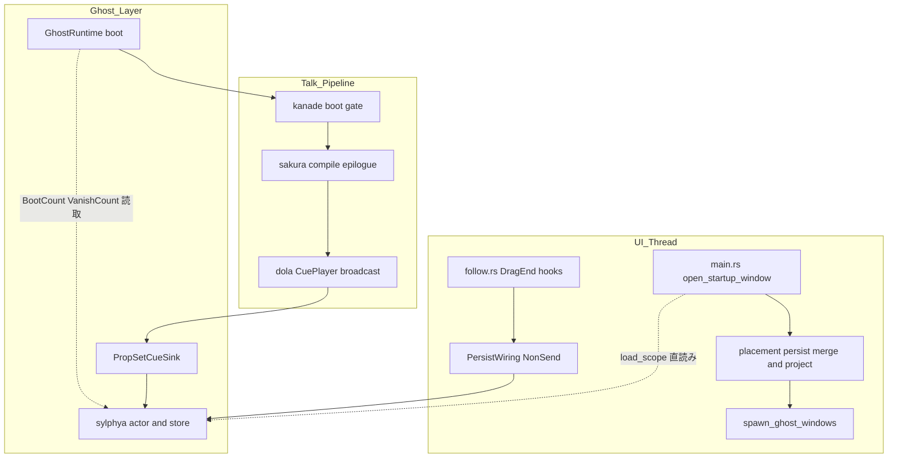
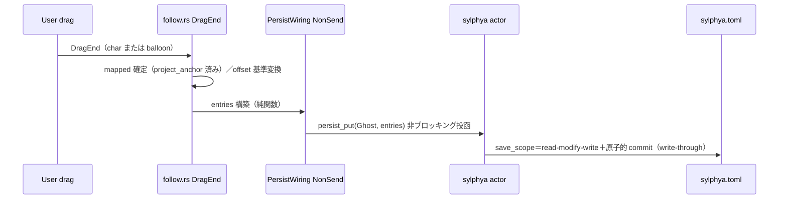
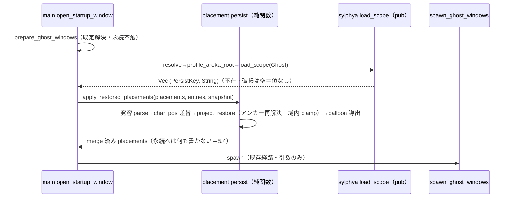
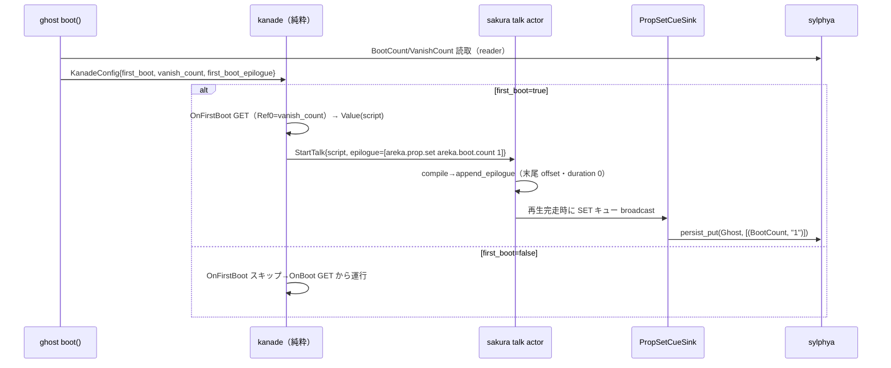

# Technical Design: areka-P0-position-persist

> 生成: 2026-07-24（requirements.md 2026-07-24 改訂版・research.md 2026-07-24 全面改訂版に基づく）。
> 本設計は「新機構を作らず、実物の永続ストア（sylphya）と実物の注入口（placement/kanade/cue）を**結線する**」層に徹する（要件 Introduction と整合）。要件ディスカッション決定（2026-07-24・research.md §4-4/§4-8）は既決として再オープンしない。

## Overview

**Purpose**: areka（ukadoc 準拠互換ベースウェア）に「伺かアプリとしての体裁」——窓位置を覚える・初回起動と通常起動を区別する——を与える。永続ストア実体は `completed/areka-P0-sylphya` が実装済み（4 key 族・原子的書込・寛容読取・ゴースト単位スコープ分離）であり、本 spec はその**消費者結線**をすべて埋める: (1) ドラッグ確定→永続書込、(2) 起動時読出→初期配置注入＋画面内縮退、(3) OnFirstBoot ゲート＋vanish 読取、(4) 初回挨拶トーク完走時の起動記録書込（汎用プロパティ SET キュー）。

**Users**: areka ユーザー（位置が保たれる・初回挨拶が繰り返されない）／ゴースト SHIORI 脳（OnFirstBoot Reference0 に永続 vanish 回数）／将来の消費者（M2 `\![vanish]`・ゴースト切替が同じ SET 語彙・同じ key 族に乗る）。

**Impact**: 既存システムの拡張（Extension）。新規 crate なし。編集は areka bin（placement 結線・main シーム）・areka-ghost（config 注入・SET sink・アクセサ）・areka-kanade（初回ゲート・epilogue 添付）・areka-talk（StartTalk additive）・areka-sakura（epilogue 末尾付加）に閉じる。dola cue モデル（10 variant・envelope・`CueSink`）は**無改変**（`\!` 汎用キャリアの上に乗るのみ）。

### Goals

- 窓位置・バルーン相対オフセットの「ドラッグ確定時 write-through ＋ 終了時フラッシュ安全網」耐久性モデルの結線（1.1–1.3, 2.1）
- 起動時の保存値復元（既定位置解決に優先）＋アンカー再解決＋作業領域内縮退＋原本非破壊（1.4–1.9, 5.1–5.4）
- OnFirstBoot ゲート（起動記録の有無）と 204 フォールスルー維持、vanish 回数の Reference0 結線（3.1–3.5, 4.1–4.2）
- 初回挨拶トーク**再生完走**時の起動記録書込＝汎用プロパティ SET キュー（`\!` 汎用キャリア上・消費側名前選別）の新設（3.4）
- 消費側の寛容縮退（値なし→既定・保存失敗→ログ＋継続・起動を止めない）（6.1–6.3, 7.1–7.2）
- 結線の決定論檻＋実機サインオフ（8.1–8.6）

### Non-Goals

- 永続ストア実装そのもの（形式・原子性・寛容読取・スコープ分離＝sylphya 実装済み・不触）
- `\![vanish]` 実装（vanish 増分の発生源＝M2。増分語彙 `areka.prop.inc` は**名前のみ予約**し M1 実装しない）
- ゴースト切替・多重ゴースト（M2）／`\![move]` との相互作用（表示のみ・永続不書込は裁定済み＝合流裁定(E)）
- バルーン位置の per-surface 再配置モデル（ukadoc `balloon.offsetx/offsety` 忠実化＝M2。M1 はキャラクタースコープ単一オフセット）
- SSP `ghost.dat` バイナリ互換／窓生成・既定位置解決そのもの（window-placement）／再吸着機構そのもの（surface-resize-resnap の `project_anchor` を消費するのみ）
- `WM_DISPLAYCHANGE` 追随（`MonitorSnapshot` はセッション内固定＝既存 DD15 を維持）

## Boundary Commitments

### This Spec Owns

- **保存結線**: `on_char_drag_end`（全アンカー種別）・バルーン DragEnd → `persist_put` への配線と、その発火規律（ユーザードラッグ確定のみ・1.9）
- **復元結線**: 起動時の永続値先読み（A1）→ `ScopePlacement` への merge 純関数 → 復元時再射影（`project_restore`）
- **バルーン相対オフセットのアンカー辺基準変換**（保存⇄復元の双方向純関数・2.2）
- **OnFirstBoot ゲートと vanish 注入**: `KanadeConfig` additive フィールド・`on_prefetch_reply` 分岐・`events::on_first_boot` 署名
- **汎用プロパティ SET キュー語彙**: コマンド名 `areka.prop.set`（assignment・`[正準key, 値]`）の定義・`StartTalk.epilogue`（additive）・sakura での CueSheet 末尾付加・areka-ghost の SET sink（`PropSetCueSink`）と書込 key 統制
- **終了時フラッシュの表現**: shutdown 系列での `barrier()` 明示確認（E1＋E2-lite）
- 上記の決定論檻と、`prepare_never_reads_or_writes_ghost_dat` 檻の doc 現況化

### Out of Boundary

- sylphya の persist 層・鏡像・アクター（読み書き契約の消費のみ。ただし檻済み正準 key 文字列を単一権威として参照する）
- `project_anchor`／`move_window_to`／`BottomSnapPolicy` の意味論（消費のみ・変更しない）
- kanade の boot cascade 順序（OnInitialize・username prefetch 段は不変・3.5）、Status/ヘッダ契約（idle-talk 正本）
- dola `cue` モジュール全域（`CueCommand`/`CueSheet`/`CuePlayer`/`CueSink`＝settled cue モデル・無改変）
- W4 並走契約により**編集禁止**: `crates/areka/src/placement/measure.rs`・`crates/areka/src/input_events/`・`crates/areka/src/emo2_boot/`（A1 採用＝emo2_boot 不触。`consumer_ledger.rs` への `areka.prop.set` 登記 1 行も W4 中は行わず後送——後述 Revalidation Triggers）

### Allowed Dependencies

- areka bin → areka-sylphya（**新規 Cargo 依存・additive**: `load_scope`/`PersistKey`/`PersistScope`/`ScopeRoots`/`persist::FsPersistIo`/`SylphyaPublisher`）・areka-ghost（`profile_areka_root`・`GhostRuntime::sylphya_publisher()`）・areka-parsers（`package::resolve`＝mount 規則の単一権威・二重実装しない）
- areka-ghost → areka-sylphya（既存）・areka-talk（既存・`EpilogueCommand`）
- areka-kanade → areka-talk（既存）。**kanade → sylphya 依存は禁止**（steering 規律）——正準 key 文字列は ghost が `KanadeConfig.first_boot_epilogue` へ焼き込んで注入し、kanade は不透明に運ぶ
- areka-sakura → areka-talk（既存）・dola（既存・`command_carrier` 生成のみ）

### Revalidation Triggers

- `StartTalk` の形状変更（`epilogue` フィールド追加）: 全構築点（kanade boot/steady・テスト・spine e2e）はコンパイラ捕捉の機械的追随。**下流 W6 `choice-select-events` は design 時に本形状へ再突合すること**
- `events::on_first_boot` 署名変更（vanish 引数化・実測波及 5+ 箇所）
- `KanadeConfig` additive 3 フィールド（既定値で現行挙動不変）
- 永続 key 正準文字列（`areka.window.scope(N).x` 等）は sylphya 檻が固定——変えるなら本 spec の復元・SET sink 檻が壊れて検出される
- **`consumer_ledger.rs` への `areka.prop.set` 登記（1 行＋variant 1 つ）は W4 完了後の後送タスク**（emo2_boot/ 不触契約のため。暫定の一意性担保: `areka.` 名前空間接頭辞は baseware 内部キュー予約とし、正典 ukadoc コマンド名（裸単語）と構造的に非衝突。ghost 側檻が名前リテラルを固定する）
- kero-balloon（W5）: バルーンオフセット永続は `BalloonOffset { scope: 1 }` で kero 側もそのまま表現できる（key 族追加不要・research §6 の調整メモ消化）

## Architecture

### Existing Architecture Analysis

- 起動順序（main.rs 実測）: `open_startup_window`（:309・窓配置）→ `wire_emo2_boot`（:316・内部で `areka_ghost::boot`＝sylphya spawn）→ fallback boot（:335）→ `app.run()`（:361）→ shutdown（:394）。**窓復元値が要る時点で sylphya 未起動**——本設計は Option A1（placement シームでの `load_scope` 直読み・起動順序不変）で解消する。
- 保存観測点: `on_char_drag_end`（follow.rs:319・非 Free のみ結線）／バルーンは `on_balloon_drag`（連続イベント・DragEnd 未結線）。**確定点＝DragEnd** に統一する。
- kanade boot cascade: `on_prefetch_reply`（boot.rs:131-183）が無条件に OnFirstBoot 発行（:180）。スクリプト受付→`StartTalk` 発行は `to_baseware_version`（boot.rs:197-222）の**単一点**（BootType-Value／BootMain-Value／204 の全経路が通る）。
- cue パイプライン: kanade は script 文字列のみ発行（純粋層）→ dispatcher（areka-ghost）→ `spawn_talk`（sakura drive.rs）が parse→`compile`→`CueSheet`→`CuePlayer` broadcast。`CueSheet` 末尾の cue は**再生がそこへ到達したときのみ発火**し、中断（Close→`CuePlayer::stop()`）で**残余 cue は破棄**される——「完走時のみ記録」（3.4）に構造一致。
- 消費者先例: `MoveCueSink`（emo2_boot/move_cue.rs・名前自己選別・非担当は記録付き良性スキップ）と `make_username_resource_sink`（sylphya_wiring.rs:142・publisher 捕獲 sink）——`PropSetCueSink` は両者の合成同型。

### Architecture Pattern & Boundary Map



**Architecture Integration**:

- Selected pattern: **消費者結線層**（新機構ゼロ）。読み 2 系統（起動時: `load_scope` 直読み＝A1／boot 内: sylphya reader）・書き 2 系統（UI: DragEnd→`persist_put`／talk: SET キュー→`persist_put`）が、すべて sylphya の単一実装・単一ファイル（`sylphya.toml`）へ収斂する。
- 主要判断（research §3 軸の確定・詳細は research.md 設計決定台帳）:
  - **軸A＝A1**（placement シームで `load_scope` 直読み・二度読み許容・起動順序とW4 並走契約を不変に保つ。A2 は起動シーケンス大改造ゆえ却下・A3 は既定位置で一瞬表示→ジャンプの体裁劣化ゆえ却下）
  - **軸B**＝`GhostRuntime::sylphya_publisher()` additive アクセサ＋**NonSend** リソース `PersistWiring`（`SylphyaPublisher` は Clone+Send だが内部 `std::sync::mpsc::Sender` ゆえ Sync を仮定しない——`MouseWiring` NonSend 先例に従う。UI スレッド専有の規律とも一致）
  - **軸C**＝`KanadeConfig` additive（`first_boot`/`vanish_count`/`first_boot_epilogue`・既定値で現行挙動不変）＋書込タイミング＝**トーク末尾 SET キュー**（要件ディスカッション #2 既決・C3）
  - **軸D**＝保存値は物理 px・仮想スクリーン絶対座標の i32 文字列化（`WindowPos` と同一通貨・モニタ識別子は保存しない・復元時 live 再射影で吸収）
  - **軸E**＝E1（write-through＋mpsc FIFO: close 投函以前の PersistPut は commit されてから停止）を保証の正本とし、E2-lite（shutdown 系列冒頭の `barrier()` 明示確認・Err は warn＋継続）を観測点として添える。タイムアウト付与はしない（アクター死亡時は `barrier()` が即 Err を返す・生存かつ停止は工程病理でスコープ外・smoke 有界 auto-exit が外側の防波堤）。**フェンスは送信端をまたいで成立**する: `SylphyaPublisher` の clone（`PersistWiring`・UI スレッド）も同一 mpsc キューへ投函し、単一 FIFO ゆえ enqueue 済み put は Barrier より先に処理される（shutdown 時点で UI 送信は静止済み）——runtime 側 publisher から呼ぶ `barrier()` が UI clone 経由の put も被覆する（バリデーション Issue 2 対応）
- **依存方向（違反はエラー扱い）**: `areka-talk` → { kanade, sakura, ghost } ／ `areka-sylphya`（最下層） → { ghost, areka bin } ／ dola → sakura ／ areka bin が最上位。**kanade→sylphya・dola→上流 areka クレートの import は禁止**。
- Existing patterns preserved: 単一位置ライター（`enqueue_window_set_pos`/`move_window_to`）・`project_anchor` 単一射影・sink 名前自己選別・log-first（無音失敗禁止）・「prepare は永続を読まない」檻の精神
- Steering compliance: 「名前で引ける値は 1 機構」（sylphya）の書込対応物／「\! コマンドは汎用キャリア 1 本」（typed 個別新設禁止・`Custom` に乗る）／「cue 再生制御は dola 集約」（新規監視者を作らない）／「ログ無し失敗経路の禁止」

### Technology Stack

新規外部依存なし。areka bin の Cargo.toml へ **workspace 内 `areka-sylphya` 依存を additive 追加**するのみ（最下層 crate ゆえ依存方向規律に適合）。

## File Structure Plan

### 新規ファイル

```
crates/areka/src/placement/persist.rs   # 復元 merge・project_restore・バルーン基準変換・寛容 parse・
                                        # PersistWiring(NonSend)・保存 entries 構築（純関数群＋檻）
crates/areka-ghost/src/prop_sink.rs     # PROP_SET_CUE_NAME 定数・PropSetCueSink（名前自己選別・
                                        # 書込 key 統制・persist_put）＋檻
```

### Modified Files

| ファイル | 変更内容（すべて additive／既存挙動は既定値で不変） |
|---|---|
| `crates/areka/src/main.rs` | `open_startup_window` の Ok アーム内: 永続先読み＋merge 呼出（snapshot 構築 :558 直後・spawn closure へ merge 済み placements を渡す）。wire 成立後（:323-326 近傍・**別行 additive**）と fallback boot 経路（:335 以降）に `PersistWiring` NonSend 挿入 |
| `crates/areka/src/placement/mod.rs` | `pub mod persist;` 追加・`prepare_never_reads_or_writes_ghost_dat` の doc を現況（sylphya.toml 別系統・prepare 不触は真のまま）へ更新 |
| `crates/areka/src/placement/spawn.rs` | `OnDragEnd(on_char_drag_end)` を**全キャラ窓**へ結線（:230-234 の非 Free 限定を撤去）。バルーン窓へ `OnDragEnd(on_balloon_drag_end)` を新規結線 |
| `crates/areka/src/placement/follow.rs` | `on_char_drag_end` 末尾に保存フック（mapped 確定後）。新規 `on_balloon_drag_end`（現在 offset を基準変換して保存）。in-session `BalloonFollow.offset`（左上基準）は不変 |
| `crates/areka/Cargo.toml` | `areka-sylphya` 依存 additive 追加 |
| `crates/areka-ghost/src/runtime.rs` | `boot()`: sylphya spawn 後に BootCount/VanishCount 読取→`KanadeConfig` 注入・epilogue 焼込・`PropSetCueSink` を `options.sinks` へ push（spawn_dispatcher :473 直前）。`pub fn sylphya_publisher()` アクセサ。`shutdown()`: sylphya close 前に `barrier()`（warn＋継続） |
| `crates/areka-ghost/src/lib.rs` | `mod prop_sink;` 追加（公開面は `PROP_SET_CUE_NAME`・`PropSetCueSink`） |
| `crates/areka-talk/src/lib.rs` | `EpilogueCommand` 新規・`StartTalk.epilogue: Vec<EpilogueCommand>` additive・`StartTalk::new()` ヘルパ |
| `crates/areka-sakura/src/compile.rs` | `pub fn append_epilogue(sheet, &[EpilogueCommand]) -> CueSheet`（純関数） |
| `crates/areka-sakura/src/drive.rs` | `on_start`: compile 後・空判定前に `append_epilogue` 適用 |
| `crates/areka-kanade/src/msg.rs` | `KanadeConfig` へ `first_boot: bool`（既定 true）・`vanish_count: u32`（既定 0）・`first_boot_epilogue: Vec<EpilogueCommand>`（既定空） |
| `crates/areka-kanade/src/schedule/boot.rs` | `on_prefetch_reply` に config 引数＋初回ゲート分岐。`to_baseware_version`: epilogue 添付（Some アーム）／epilogue-only StartTalk（None アーム・epilogue 非空時のみ） |
| `crates/areka-kanade/src/schedule/events.rs` | `on_first_boot(snapshot, vanish_count: u32)` 署名変更（Ref0 実値化） |
| テスト（機械的追随） | kanade boot/events 檻・spine_e2e（on_first_boot ×3・StartTalk 構築点）・follow/spawn in-crate 檻 |

**編集しないことを明記**: `measure.rs`／`input_events/`／`emo2_boot/`（consumer_ledger.rs 含む）／dola `cue/` 全域／sylphya persist 層・actor 中核。

## System Flows

### 保存（ドラッグ確定・1.1/2.1/1.9）



- 発火点は char/balloon の **DragEnd のみ**。`on_char_drag`（ドラッグ中）・`move_window_to`（`\![move]` 消費者）・`resize_window_to`・復元時再射影は発火しない（1.9）。`PersistWiring` 不在（fallback 未挿入等）は debug ログ＋no-op（6.2 系縮退）。

### 復元（起動時・A1・1.4-1.8/5.1-5.4）



### 初回ゲートと起動記録（3.1-3.4/4.1）



- 中断（Close funnel）時は `CuePlayer::stop()` が残余 cue を破棄＝SET は発火せず記録されない→次回起動も初回扱い（3.4 の「初回挨拶が一度は完走することの保証」を構造で実現）。
- 204 系: OnFirstBoot 204→OnBoot Value なら **OnBoot トーク末尾**へ同 epilogue（そのトークが de-facto 初回挨拶・完走保証が生きる）。OnBoot も 204（トーク不在）なら **epilogue-only StartTalk**（空 script・SET キュー 1 件・即時完走）で同一書込経路に載せる（第二の書込経路を作らない）。

## Requirements Traceability

| Req | 要約 | 実現コンポーネント | 主要契約・檻 |
|---|---|---|---|
| 1.1 | ドラッグ確定で全アンカー種別即時書込 | C2 保存フック・C3 全窓 OnDragEnd・C1 entries | write-through＝`persist_put`（sylphya 契約）・偽 Free 檻 |
| 1.2 | 終了時フラッシュ安全網 | C6 shutdown `barrier()`＋E1（FIFO close） | 檻: n×DragEnd→close→ファイル最終値 |
| 1.3 | 異常終了耐性 | ドラッグ確定時 write-through（原子的 commit は sylphya 契約） | sylphya 檻へ委譲（再実装しない） |
| 1.4 | 保存位置優先復元 | C1 `apply_restored_placements`・C4 シーム | 檻: plant→復元値等価 |
| 1.5 | 値なし→既定位置解決 | C1（寛容 parse・欠損 skip） | 檻: 空 entries→placements 恒等 |
| 1.6 | キャラスコープ別・バルーンは相対導出のみ | `PersistKey::WindowPos{scope}`・バルーン絶対位置は不保存 | 檻: scope 別往復・balloon key 不書込 |
| 1.7 | 仮想デスクトップ絶対座標 | 軸D（物理 px i32・負値可・プライマリ丸めなし） | sylphya 負値往復檻＋merge 檻 |
| 1.8 | アンカーは毎起動再解決 | `ScopePlacement.anchor`（resolver 由来）＋`project_restore` | 檻: 保存 y ≠ 現 work area でも下端一致 |
| 1.9 | 永続更新はユーザードラッグのみ | 発火規律（DragEnd 2 点限定） | 檻: `apply_move_directive`/再射影/resize で不書込 |
| 2.1 | バルーン offset 即時書込 | C2 `on_balloon_drag_end`・C3 バルーン OnDragEnd | 檻: DragEnd→BalloonOffset entries |
| 2.2 | アンカー辺（下端）基準・左上基準禁止 | C1 基準変換純関数（双方向） | 檻: 高さ変動不変（8.5 と共用） |
| 2.3 | 保存 offset 適用復元 | C1 merge の balloon 導出 | 檻: offset→balloon_pos 値等価 |
| 2.4 | offset なし→シェル既定 | C1（欠損時は resolver 既定 offset 保持） | 檻: 欠損→既定 offset で導出 |
| 2.5 | スコープ別 | `PersistKey::BalloonOffset{scope}` | 檻: scope 混同なし |
| 3.1 | 記録なし→OnFirstBoot 発火 | C8 config（既定 first_boot=true）・C9 分岐 | 既存 happy-path 檻＝意味不変で緑 |
| 3.2 | 204→OnBoot フォールスルー | 既存実装不変（boot.rs:75-79） | 既存檻維持 |
| 3.3 | 記録あり→OnFirstBoot スキップ | C9 skip アーム（OnBoot GET→BootMain 直行） | 新檻: skip 経路の Action 列 |
| 3.4 | 初回挨拶完走で記録 | C11 epilogue・C12 末尾付加・C7 SET sink・C6 焼込 | 檻: 完走→書込／中断→不書込／204 系 |
| 3.5 | OnInitialize・prefetch 段不変 | C9 は BootPrefetch 応答後の分岐のみ | 既存檻無改変 |
| 4.1 | Ref0=永続 vanish | C10 署名＋C6 読取注入 | events 檻更新（vanish 引数由来） |
| 4.2 | 記録なし→Ref0=0 | C6 寛容 parse 既定 0 | 檻: 値なし→"0" |
| 5.1 | 域外→アンカー再射影で域内へ | C1 `project_restore`（`project_anchor`＋補軸 clamp） | 檻: 域外 x/y→域内 |
| 5.2 | 吸着規則維持 | `project_anchor` 委譲（Bottom=X 保持・y=wa.bottom−h） | 檻: 下端一致・X 意図保持 |
| 5.3 | 域内→そのまま | clamp/射影のべき等（域内は同値） | 檻: 域内入力→恒等 |
| 5.4 | 再射影を書き戻さない | merge は純関数（書込 API を持たない構造遮断） | 檻: 復元後ファイル不変 |
| 6.1 | 値なし→既定へ寛容縮退・起動継続 | C1/C6 寛容 parse（非数値→値なし＋warn） | 檻: 破損値→既定・warn |
| 6.2 | 保存失敗→ログ＋継続 | sylphya Degraded 契約＋sink/フックの warn 経路 | sylphya 檻＋sink 檻 |
| 6.3 | 永続起因で起動停止なし | 全経路 panic なし（縮退アーム網羅） | 各檻の非 panic 検証 |
| 7.1 | 当該ゴーストスコープのみ | `PersistScope::Ghost` 固定・`profile_areka_root` 由来 roots | コードレビュー事項＋sink 檻（scope 固定） |
| 7.2 | 無関係 key 温存 | sylphya `save_scope` merge 契約（key 族契約書込のみ） | sylphya 檻へ委譲 |
| 8.1 | 往復値等価の決定論檻 | 統合檻（FakePersistIo/temp dir＋headless World） | Testing Strategy 参照 |
| 8.2 | 縮退・再射影檻 | C1 純関数檻 | 同上 |
| 8.3 | ゲート檻 | kanade 純粋 step 檻 | 同上 |
| 8.4 | 自動再射影の不書込檻 | 1.9/5.4 檻 | 同上 |
| 8.5 | offset 寸法不変檻 | 基準変換檻（高さ一般＝DPI 変動も同檻に入る） | 同上 |
| 8.6 | 実機サインオフ | 実 emo2・実 DPI≠96・マルチモニタ・絶対パス・有界 auto-exit＋ログ grep | Testing Strategy 参照 |

## Components and Interfaces

| Component | 層 | Intent | Req | 依存（P0） | Contracts |
|---|---|---|---|---|---|
| C1 placement/persist.rs | areka bin（純関数＋型） | 復元 merge・再射影・基準変換・entries 構築・PersistWiring | 1.4-1.9, 2.2-2.5, 5.1-5.4, 6.1 | areka-sylphya, follow.rs 資産 | Service/State |
| C2 follow.rs 保存フック | areka bin（UI） | DragEnd 観測点→保存投函 | 1.1, 1.9, 2.1 | C1, PersistWiring | Service |
| C3 spawn.rs 結線 | areka bin（UI） | 全キャラ窓＋バルーン窓の DragEnd 結線 | 1.1, 2.1 | follow.rs | State |
| C4 main.rs シーム | areka bin | 先読み merge 呼出・PersistWiring 挿入 | 1.4, 5.1, 6.1 | C1, C5 | Service |
| C5 GhostRuntime 拡張 | areka-ghost | config 注入・sink 登録・アクセサ・flush | 1.2, 3.1, 3.3, 4.1, 4.2 | sylphya, kanade | Service |
| C6 = C5 の boot()/shutdown() 増分 | areka-ghost | （C5 に含む） | — | — | — |
| C7 prop_sink.rs | areka-ghost | SET キュー消費（名前選別・key 統制・persist_put） | 3.4, 6.2, 7.1 | sylphya publisher, dola CueSink | Event |
| C8 KanadeConfig additive | areka-kanade | 初回・vanish・epilogue の構築時注入の器 | 3.1, 4.1 | areka-talk | State |
| C9 boot.rs ゲート | areka-kanade | 初回分岐・epilogue 添付・204 系裁定 | 3.1-3.4 | C8 | Service |
| C10 events::on_first_boot | areka-kanade | Ref0 実値化 | 4.1, 4.2 | — | Service |
| C11 StartTalk.epilogue | areka-talk | 汎用 epilogue の搬送（不透明） | 3.4 | — | Event |
| C12 append_epilogue | areka-sakura | CueSheet 末尾への carrier cue 付加（純関数） | 3.4 | dola command_carrier | Service |

### areka bin — placement 結線

#### C1: `placement/persist.rs`（新規・復元とエントリ構築の純関数群）

| Field | Detail |
|---|---|
| Intent | 永続値⇄配置の変換をすべて純関数で所有し、IO・World 変異と分離する |
| Requirements | 1.4-1.9, 2.2-2.5, 5.1-5.4, 6.1 |

**Responsibilities & Constraints**

- 復元 merge・復元時再射影・バルーン基準変換・寛容 parse・保存 entries 構築の**単一の住処**。IO は `load_restored_state` の 1 点のみ（他は全て純関数・決定論）。
- `prepare_ghost_windows` の**外**に置く＝「prepare は永続を読まない」檻の精神を存続させる（research §4-6 決着）。
- 永続への**書込 API を持たない**（5.4 の構造遮断——merge 経路から `persist_put` へ到達できない）。

**Contracts**: Service [x] / State [x]

##### Service Interface

```rust
/// 起動時先読み（唯一の IO 点・全縮退＝warn＋空）。
/// mount 解決は areka_parsers::package::resolve（単一権威）・profile 導出は
/// areka_ghost::sylphya_wiring::profile_areka_root（単一権威）を消費し、規則を二重化しない。
pub fn load_restored_state(
    ghost_root: &Path,
    default_encoding: DefaultEncoding,
) -> Vec<(PersistKey, String)>;

/// 復元 merge（純関数・決定論・永続不書込）。
/// scope ごとに WindowPos x/y が両軸とも寛容 parse できたときのみ char_pos を差し替え、
/// project_restore でアンカー再解決＋域内縮退し、BalloonOffset があれば基準逆変換で
/// balloon_pos/balloon_offset を導出（無ければ resolver 既定 offset を最終 char_pos に追従）。
pub fn apply_restored_placements(
    placements: Vec<ScopePlacement>,
    entries: &[(PersistKey, String)],
    snapshot: &MonitorSnapshot,
) -> Vec<ScopePlacement>;

/// 復元専用射影＝ project_anchor（アンカー辺の再導出・5.2）＋補軸 clamp（5.1）。
/// Bottom/Top はアンカー辺再導出後に x を [wa.left, wa.right−w] へ clamp、
/// Left/Right は y を [wa.top, wa.bottom−h] へ clamp、Free は両軸 clamp（identity 射影＋可視性保証）。
/// wa は work_area_for_window（最近傍規則込み）。snapshot 空は identity（既存縮退流儀）。
pub fn project_restore(
    anchor: Anchor, pos: PointPx, size: SizePx, snapshot: &MonitorSnapshot,
) -> PointPx;

/// バルーン offset の基準変換（保存方向）。アンカー辺基準点＝
/// Bottom: (char.x, char.y+h) ／ Top・Left: 左上 ／ Right: (char.x+w, char.y) ／ Free: 左上（縮退・檻固定）。
/// persist = offset_topleft − (基準点 − char左上)。restore は逆変換（現在の char_size を用いる）。
pub fn balloon_offset_to_persist(anchor: Anchor, offset_tl: PointPx, char_size: SizePx) -> PointPx;
pub fn balloon_offset_from_persist(anchor: Anchor, persisted: PointPx, char_size: SizePx) -> PointPx;

/// 寛容 parse（非数値・空→ None＝「値なし」＋呼び手が warn・6.1）。
pub fn parse_px(value: &str) -> Option<i32>;

/// 保存 entries 構築（純関数・文字列化は i32 の Display）。
pub fn char_pos_entries(scope: u32, pos: PointPx) -> Vec<(PersistKey, String)>;
pub fn balloon_offset_entries(scope: u32, offset_persist: PointPx) -> Vec<(PersistKey, String)>;
```

- Preconditions: `apply_restored_placements` の placements は resolver 出力（anchor 解決済み・正寸）。
- Postconditions: 出力 placements は入力と同じ scope 集合・同じ寸法・同じ anchor（位置と balloon 導出のみ変わる）。永続状態は不変。
- Invariants: `balloon_offset_from_persist(a, balloon_offset_to_persist(a, o, s), s) == o`（全アンカー・全寸法）。

##### State Management（PersistWiring）

```rust
/// UI スレッド常駐の保存投函口（NonSend・MouseWiring 先例）。
/// SylphyaPublisher は Clone+Send（内部 mpsc Sender）だが Sync を仮定せず NonSend で持つ。
pub struct PersistWiring {
    pub publisher: SylphyaPublisher,
}
/// フック用ヘルパ: PersistWiring 不在は debug!＋no-op（fallback 経路縮退）。
pub fn persist_entries(world: &World, entries: Vec<(PersistKey, String)>);
```

**Implementation Notes**

- Integration: `PersistScope::Ghost` 固定（7.1）。`persist_put` は fire-and-forget 非ブロッキング＝UI スレッドに同期 IO を持ち込まない。
- Validation: 檻は `FakePersistIo`／temp dir・合成 `MonitorSnapshot`・`prepare_ghost_windows_with_work_area` の流儀を再利用。
- Risks: 変換式の対称性ミス→往復恒等檻（上記 Invariant）で捕捉。

#### C2/C3: DragEnd 観測点の保存結線（follow.rs／spawn.rs 改修）

- `on_char_drag_end`（follow.rs:319）: `mapped` 確定・`enqueue_window_set_pos`・`follow_balloon` の**後**に `CharWindowMarker.scope`（entity から逆引き）＋`mapped` で `char_pos_entries`→`persist_entries`。Free アンカーは `project_anchor` が identity ゆえ既存ハンドラがそのまま**保存専用アーム**として機能する（要件ディスカッション #1 既決・射影段は無害通過）。
- `spawn.rs`: `if !p.anchor.is_free()` ガード（:230-234）を撤去し全キャラ窓へ `OnDragEnd` を結線。**バルーン窓へ `OnDragEnd(on_balloon_drag_end)` を新規結線**（`on_balloon_drag` は連続イベントのため書込トリガにしない——1 ドラッグ 1 書込の確定点規律）。
- 新規 `on_balloon_drag_end`（follow.rs）: バルーン entity→`BalloonFollow` 逆引き（`on_balloon_drag` と同流儀）。保存値は in-session `offset` を読まず、**DragEnd の最終確定位置から `balloon_pos − char_pos` を再導出**する（`on_balloon_drag` と同一式。最終確定位置は最後の OnDrag 配信とずれ得る——char 側檻 follow.rs:1875 と同前提）。再導出 offset（左上基準・in-session 表現は不変のまま）＋ char の `Anchored`・`WindowPos.size` → `balloon_offset_to_persist` → `balloon_offset_entries`→`persist_entries`。檻: DragEnd 最終位置→保存値等価（バリデーション Issue 1 対応・2.1/8.1）。
- **発火規律（1.9）**: 保存は上記 2 ハンドラのみ。`on_char_drag`・`move_window_to`・`resize_window_to`・復元 merge は構造的に `persist_entries` へ到達しない（檻: `apply_move_directive` 前後でストアのバイト不変）。

#### C4: main.rs シーム（additive）

- `open_startup_window` Ok アーム: snapshot 構築（:558-560）直後に `let entries = placement::persist::load_restored_state(&cfg.ghost_root, ...)` → `let placements = apply_restored_placements(prepared.placements, &entries, &snapshot)` → spawn closure へ merge 済み placements を move（既存経路の引数差し替えのみ）。
- `PersistWiring` 挿入: wired 経路（:323-326 近傍・chI 近接ゆえ**別行 additive** 厳守）と fallback boot 経路（:335 以降）の両方で `runtime.sylphya_publisher().clone()` を `insert_non_send_resource(PersistWiring { .. })`。
- 失敗時（prepare 失敗＝ダミー窓経路）は永続結線なし（従来どおり）。

### areka-ghost — 注入・SET 消費・フラッシュ

#### C5: GhostRuntime 増分（runtime.rs・sylphya_wiring.rs）

##### Service Interface

```rust
impl GhostRuntime {
    /// additive アクセサ（kanade()/dispatcher() と同型）。main が PersistWiring を組むために公開。
    pub fn sylphya_publisher(&self) -> &SylphyaPublisher;
}
```

- `boot()` 増分（sylphya spawn :417 の後・`spawn_kanade` :461 の前）:
  1. `sylphya_reader.resolve_dotted_str(ghost_asker, "areka.boot.count")`（正準文字列は `PersistKey::BootCount.to_canonical_key()` から取得＝単一権威）: `Value(_)` あり→`first_boot=false`／`NotFound`→`true`。**存在ゲート**（値の数値解釈はしない・過剰実装回避＝research §4-8 (iv) 決着）。
  2. `areka.vanish.count`: 寛容 parse（u32・非数値→0＋warn）→ `config.vanish_count`。
  3. `first_boot==true` のとき `config.first_boot_epilogue = vec![EpilogueCommand { name: PROP_SET_CUE_NAME.into(), tokens: vec![PersistKey::BootCount.to_canonical_key(), "1".into()] }]`（kanade は sylphya 非依存のまま正準 key を不透明搬送——依存方向規律の担保）。
  4. `options.sinks` へ `Box::new(PropSetCueSink::new(sylphya_publisher.clone()))` を push（`spawn_dispatcher` :473 直前・wired/fallback 両経路を自動被覆・emo2_boot 不触）。
- `shutdown()` 増分（step 10 の `close()` 直前）: `sylphya_publisher.barrier()`——Ok なら `info!("persist flush confirmed")`・Err なら `warn!`＋続行（E2-lite。E1＝FIFO close が保証の正本）。

#### C7: `prop_sink.rs`（新規・SET キュー消費者）

| Field | Detail |
|---|---|
| Intent | `areka.prop.set` キューの名前自己選別消費→`persist_put`（統一プロパティシステムの書込側対応物） |
| Requirements | 3.4, 6.2, 7.1 |

**Contracts**: Event [x]

##### Event Contract

- 語彙（**汎用・将来消費者が name 違いで再乗車**）:
  - コマンド名: `pub const PROP_SET_CUE_NAME: &str = "areka.prop.set";`（`areka.` 接頭辞＝baseware 内部キュー名前空間。ukadoc 正典コマンド名（裸単語）と構造的に非衝突。増分語彙は `areka.prop.inc` を**名前のみ予約**・M1 不実装）
  - 引数形（assignment）: `tokens = [正準 dotted key, 値文字列]`（例 `["areka.boot.count", "1"]`）。ワイヤ形は `CueCommand::command_carrier` 正準形（`Custom { command, params: Array<String> }`）そのもの＝dola 無改変。
- 消費（`impl CueSink for PropSetCueSink`・`MoveCueSink` 同型）:
  1. `as_command_carrier()` で抽出。非キャリアは debug スキップ。`Custom` かつ非正準 params は宛名規律（自分宛＝warn／他人宛＝debug）。
  2. `name != PROP_SET_CUE_NAME` は debug スキップ（名前自己選別・duration honor に不触）。
  3. **書込 key 統制（research §4-8 (ii) 決着）**: key トークンが `PersistKey::BootCount.to_canonical_key()` または `PersistKey::VanishCount.to_canonical_key()` に一致するときのみ受理（**カウンタ key 族限定**）。`WindowPos`/`BalloonOffset` は拒否＝warn スキップ——位置の永続ライターをユーザードラッグ 2 点に限る 1.9 の単一ライター規律を cue 側から侵食させない。未知 key も warn スキップ。
  4. 引数不足（tokens < 2）は warn スキップ。受理時 `publisher.persist_put(PersistScope::Ghost, vec![(key, value)])`（fire-and-forget・talk スレッドをブロックしない）＋ `info!` 1 本（実機 grep 証跡: `prop_set_cue applied`）。
- Ordering / delivery: broadcast の一部として台本時刻どおり配送（末尾 cue は完走時のみ）。中断時は `CuePlayer::stop()` により**未発火のまま破棄**（3.4 意図どおり）。
- 型境界: `#[derive(Clone)]`・`SylphyaPublisher: Clone+Send` ⇒ `BootCueSink`（`CueSink + Clone + Send + 'static`）充足。

**Implementation Notes**

- Integration: 登録は `boot()` の 1 点（C5）。台帳（consumer_ledger.rs）への登記は W4 契約により後送（Revalidation Triggers 参照）——それまでの一意性は名前空間接頭辞規約＋本 sink 檻（名前リテラル固定）で担保。
- Risks: ゴーストスクリプトが `\![areka.prop.set,...]` を自書きした場合も同経路で消費される——書込先は当該ゴースト自身の Ghost スコープ・カウンタ key 限定のため実害なし（受容面として明記・檻で key 統制を固定）。

### areka-kanade／areka-talk／areka-sakura — 初回ゲートと epilogue

#### C8: `KanadeConfig` additive（msg.rs）

```rust
pub struct KanadeConfig {
    // 既存 4 フィールド不変…
    /// 初回起動ゲート（既定 true＝現行挙動不変・値源は ghost boot の BootCount 存在判定）。
    pub first_boot: bool,
    /// OnFirstBoot Reference0 に渡す永続 vanish 回数（既定 0）。
    pub vanish_count: u32,
    /// 初回挨拶トーク末尾へ添付する汎用 epilogue（既定空＝何も添付しない）。
    /// kanade は内容を解釈しない（不透明搬送・sylphya 非依存の維持）。
    pub first_boot_epilogue: Vec<EpilogueCommand>,
}
```

`KanadeConfig::new` の既定（true / 0 / 空）により、**既存 boot happy-path 檻は意味論無改変で緑**（StartTalk 構築点のフィールド追随のみ機械的更新）。

#### C9: boot.rs ゲート分岐と epilogue 添付

- `on_reply` の `Phase::BootPrefetch` アーム: `on_prefetch_reply(state, outcome, config)` へ config を渡す。
- `on_prefetch_reply` 末尾分岐（prefetch 段自体は不変＝3.5）:
  - `config.first_boot == true`: 現行どおり `[ResourceOutcome, ShioriRequest(on_first_boot(&snapshot, config.vanish_count))]`・`Phase::BootType`。
  - `config.first_boot == false`: `[ResourceOutcome, ShioriRequest(on_boot(config, &snapshot))]`・**`Phase::BootMain` 直行**（OnFirstBoot スキップ・3.3）。info ログ `boot_gate skip_first_boot`。
- `to_baseware_version`（**epilogue の単一添付点**——BootType-Value／BootMain-Value／BootMain-204 の全経路が通る）:
  - `Some(script)`: `StartTalk { talk_id, script, epilogue: config.first_boot_epilogue.clone() }`（epilogue 空＝現行と同値）。
  - `None` かつ `!config.first_boot_epilogue.is_empty()`（＝初回かつ挨拶トーク不在・204-204）: **epilogue-only StartTalk**（`script: String::new()`・talk_id 採番・`ActiveTalk{origin:"boot"}` として正規追跡）。空台本＋末尾 SET 1 件＝即時完走で記録が書かれる（research §4-8 (iii) の裁定: OnBoot 末尾を正・トーク皆無時のみこの縮退形。書込経路は cue 1 本のまま）。
  - `None` かつ epilogue 空（通常起動の 204・現行全ケース）: 従来どおり StartTalk なし・`BootVersion{talk: None}`（既存檻無改変）。
- **204 フォールスルー（3.2）は不変**（BootType-NoContent→OnBoot GET）。

#### C10: `events::on_first_boot` 署名変更

```rust
/// Ref0 ＝永続 vanish 回数（値源は KanadeConfig 経由・値なしは 0）。
pub fn on_first_boot(snapshot: &ExecutionSnapshot, vanish_count: u32) -> ShioriCall
// references: vec![vanish_count.to_string()]
```

波及（実測・機械的）: boot.rs 発行点／boot.rs:324 assert／events.rs:311 檻（「Ref0=vanish 引数由来・0 で従来値同値」へ更新）／kanade tests ×2／spine_e2e ×3。

#### C11: `StartTalk.epilogue`（areka-talk・additive）

```rust
/// 台本末尾へ付加する汎用コマンド（`\!` キャリアの typed 前段。搬送のみ・解釈しない）。
#[derive(Debug, Clone, PartialEq, Eq)]
pub struct EpilogueCommand { pub name: String, pub tokens: Vec<String> }

pub struct StartTalk {
    pub talk_id: TalkId,
    pub script: String,
    /// compile 後の CueSheet 末尾（最終 offset・duration 0）へ carrier cue として付加される。
    /// 既定は空（従来挙動）。
    pub epilogue: Vec<EpilogueCommand>,
}
impl StartTalk {
    /// epilogue なしの従来形コンストラクタ（構築点の機械的追随を最小化）。
    pub fn new(talk_id: TalkId, script: impl Into<String>) -> Self;
}
```

スクリプト文字列末尾への追記案は不採用: 台本が `\e` で終わる場合 compile の End 切詰めで**脱落**する（kanade によるスクリプト外科手術は転記層規律違反）。typed epilogue は切詰め後の CueSheet へ付くため構造的に脱落しない。

#### C12: `append_epilogue`（areka-sakura・純関数）

```rust
/// CueSheet 末尾へ epilogue を carrier cue として付加する（決定論・no IO）。
/// 各 cue: actor="0"・start_time=既存 cues の max(start_time+duration)（空 sheet は 0.0）・
/// duration=0.0・payload=command_carrier(name, tokens)。
/// CueSheet::new の安定ソートにより同時刻の既存末尾要素（選択待ち barrier 等）の後に並ぶ＝
/// barrier 解決後・占有 horizon 到達 tick（TalkDone 送出前）に発火する。horizon は延長しない。
pub fn append_epilogue(sheet: CueSheet, epilogue: &[EpilogueCommand]) -> CueSheet;
```

`drive.rs::on_start`: `compile` 後・空判定**前**に適用（`epilogue.is_empty()` なら恒等＝既存経路完全不変）。epilogue-only talk（空 script＋epilogue）は 1 cue の非空 sheet として通常再生・即時完走する。

## Data Models

### 永続 key 族（sylphya 確定済み・消費のみ）

| PersistKey | 正準 key | 値ドメイン（本 spec の書式） | 書き手 | 読み手 |
|---|---|---|---|---|
| `WindowPos{scope,axis}` | `areka.window.scope(N).x\|y` | 物理 px・仮想スクリーン絶対 i32（負値可）の Display 文字列 | C2 char DragEnd のみ | C1 merge |
| `BalloonOffset{scope,axis}` | `areka.balloon.offset.scope(N).x\|y` | アンカー辺基準 offset（物理 px i32） | C2 balloon DragEnd のみ | C1 merge |
| `BootCount` | `areka.boot.count` | M1 は固定 `"1"`（ゲートは**存在**判定・数値解釈しない） | C7 SET sink のみ | C5 boot() |
| `VanishCount` | `areka.vanish.count` | u32 の Display 文字列（M1 は書き手不在＝常に値なし→0） | （M2 `\![vanish]`） | C5 boot() |

- 保存の単一真実源: 位置はキャラ窓のみ（バルーン絶対位置 key は存在しない・1.6）。アンカーは保存しない（毎起動 resolver 解決・1.8）。モニタ識別子は保存しない（復元時 `work_area_for_window` live 帰属＋最近傍規則で吸収・軸D）。
- SET キューのワイヤ形（dola 既存形・無改変）: `{"Custom":{"command":"areka.prop.set","params":["areka.boot.count","1"]}}`。

## Error Handling

### Error Strategy

全経路 log-first・非 panic・起動/talk を殺さない（6.3・steering [areka-log-first-no-silent-failure]）。

| 事象 | 挙動 | レベル |
|---|---|---|
| mount 解決失敗・load 失敗・ファイル不在・破損（起動時先読み） | 復元スキップ＝既定位置解決（sylphya 寛容読取が「値なし」化） | warn（不在は debug） |
| 永続値の非数値・片軸欠損 | 当該 scope/当該 key を「値なし」扱い（既定へ） | warn |
| `PersistWiring` 未挿入（fallback 等）で DragEnd | 保存 no-op | debug |
| `persist_put` 先の commit 失敗 | sylphya が error!＋`Degraded`（旧状態非破壊は sylphya 契約） | （sylphya 側） |
| SET キュー: 非キャリア／他人宛 | 良性スキップ | debug |
| SET キュー: 自分宛の非正準・key 統制外・引数不足 | 記録付きスキップ | warn |
| shutdown `barrier()` Err（アクター既死） | flush 確認なしで続行（write-through 済みが正本） | warn |
| BootCount/VanishCount 読取不能 | 初回扱い・vanish 0（既定運行） | warn（不在は debug） |

### Monitoring（実機 grep 証跡・8.6）

- 保存: sylphya 既存 `Saved`/`Degraded` ログ＋フック側 debug。
- 記録: `prop_set_cue applied`（C7 info・初回のみ 1 回）／2 回目起動: `boot_gate skip_first_boot`（C9 info）。
- フラッシュ: `persist flush confirmed`（C5 info）。

## Testing Strategy

### Unit Tests（決定論・headless）

1. **C1 純関数群**: 基準変換の往復恒等（全 5 アンカー×寸法変動）／高さ変動不変（8.5＝保存時 h1・復元時 h2 でバルーンとキャラの配置関係維持。DPI 由来の寸法変化も同檻）／`parse_px` 寛容縮退（6.1）／`char_pos_entries`・`balloon_offset_entries` の key/値等価。
2. **`project_restore`**: 域内→恒等（5.3）／域外 y→下端一致・X 意図保持（5.1/5.2・Bottom）／域外 x→wa 内 clamp（モニタ喪失シナリオ＝最近傍 wa）／Free→identity 射影＋両軸 clamp／空 snapshot→identity。
3. **`apply_restored_placements`**: 復元値優先（1.4）／空 entries→恒等（1.5/2.4）／scope 分離（1.6/2.5）／offset 欠損→既定 offset が最終 char_pos に追従（2.4）／片軸破損→当該 scope 既定（6.1）。
4. **kanade ゲート**（純粋 step 檻）: 既定 config で既存 happy-path 意味不変（3.1）／`first_boot=false`→OnFirstBoot 不発行・OnBoot GET→BootMain（3.3）／204 フォールスルー不変（3.2）／`on_first_boot(snapshot, n)` の Ref0=n（4.1・events 檻更新）／epilogue 添付（Some アーム）／204-204＋epilogue→epilogue-only StartTalk・追跡 Some／204-204＋epilogue 空→従来どおり None。
5. **C12 `append_epilogue`**: 末尾 offset（max(start+duration)）・duration 0・horizon 不延長・barrier より後（安定ソート FIFO）・空 epilogue 恒等・空 sheet→0.0。
6. **C7 sink 檻**: 名前自己選別（`move`/`bind`/未知名スキップ）／key 統制（`areka.window.scope(0).x` 拒否・warn）／引数不足スキップ／`BootCueSink` 型境界（compile 檻）／`spawn_sylphya`＋`FakePersistIo` で受理→`barrier`→`load_scope` に `BootCount="1"`。
7. **偽 Free アンカー DragEnd→保存値等価（要件ディスカッション #1 必達檻）**: headless World に `Anchored(Anchor::Free)` のキャラ窓を合成し、DragEnd 駆動→wndproc 確定位置がそのまま entries 化されること（射影段は identity で無害通過・保存はアンカー種別を問わない・1.1）を決定論固定する（emo2 は全スコープ Bottom＝実機で観測不能なため檻が正本）。
8. **カウンタ寛容 parse（4.2/6.1・ghost 側）**: BootCount 存在ゲート（値の数値解釈をしないこと）／VanishCount の値なし→0・非数値→0＋warn を純関数檻で固定する。

### Integration Tests（偽装境界・実アクター）

1. **保存→復元 往復値等価（8.1）**: temp dir sylphya（実 `FsPersistIo`）＋headless World（fake_handle 流儀）——char/balloon DragEnd 駆動→`barrier`→`load_scope`→`apply_restored_placements`→位置・offset・（別途）BootCount/vanish の値等価。
2. **発火規律（1.9/8.4）**: `apply_move_directive`・復元 merge・（存在すれば）resize 経路の駆動前後でストア内容バイト不変／DragEnd のみが書く。
3. **終了時フラッシュ（1.2/8.1）**: put は **`PersistWiring` の clone 送信端**から投函する（実経路同型・runtime 保持の publisher からではない）——n×DragEnd 相当 put（barrier なし）→ runtime 側 `barrier()`／`close()`（FIFO）→ アクター join 後にファイル最終値一致（E1 の檻＋E2-lite の越境フェンス検証を兼ねる）。
4. **完走時のみ記録（3.4）**: sakura `spawn_talk` 実駆動（注入時刻 Tick）——epilogue 付き台本の完走→sink 受理／horizon 前 `Close`→`stop()` で SET 不発火・ストア不変。
5. **spine e2e 追随**: `on_first_boot` 署名×3・StartTalk 構築点の機械的更新（fixture ghost は永続ファイル無し＝初回扱いで従来挙動不変）。2 回目起動相当（BootCount plant）で OnFirstBoot 非発火の新檻。
6. **`prepare_never_reads_or_writes_ghost_dat`**: 檻存続（A1＝prepare 不触は真のまま）・doc 参照更新のみ。merge 側に新契約檻（sylphya.toml plant→復元適用・prepare 出力は不変）。

### E2E（実機・人間サインオフ・8.6 必達）

- 実 emo2＋実 pasta.dll（**絶対パス起動**・[areka-emo2-signoff-needs-absolute-paths]）・実 DPI≠96・マルチモニタ・`AREKA_APP_SMOKE_EXIT_MS` 有界 auto-exit＋`RUST_LOG` grep（[areka-real-machine-signoff-bounded-auto-exit]）:
  1. ドラッグ→終了→再起動→前回位置一致（キャラ・バルーン相対）。
  2. 初回起動: 初回挨拶完走→`prop_set_cue applied`。2 回目起動: 挨拶が繰り返されない＋`boot_gate skip_first_boot`。
  3. モニタ構成変更（保存モニタ切断）→ 再起動でゴーストが画面内に出現・ストア原本不変→構成復帰で元位置。

## Optional: Risks

- **StartTalk/on_first_boot の署名波及**が想定より広い場合もコンパイラ捕捉の機械的追随（`StartTalk::new` で最小化）。
- **204-204＋初回の epilogue-only talk** は `baseware_version` NOTIFY の Status に talking が一瞬立つ（正規追跡の帰結・emo2 は挨拶必発ゆえ実機非顕現）——kanade 檻で新経路として固定し、Status 契約正本（idle-talk）とは非交差であることを design レビューで確認済み。
- **consumer_ledger 登記の後送**——名前空間規約で衝突は構造的に不能だが、W4 完了後の 1 行追加を Revalidation Triggers に登記済み（忘却防止）。
