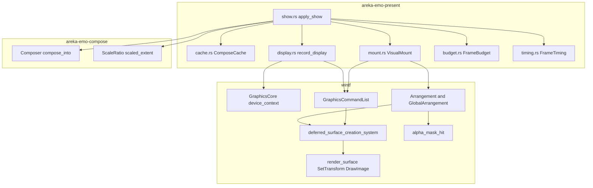
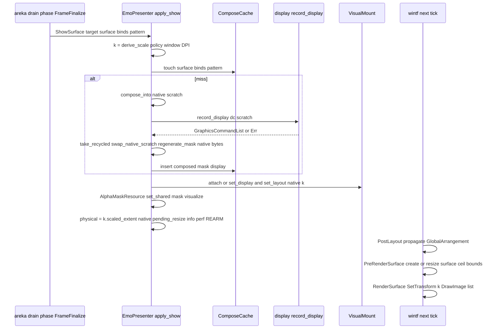

# Technical Design: areka-P0-present-gpu-transform-scale

> 2026-09-11・HEAD `67e0a4d3`。要件（`requirements.md`・裁定 D）と調査（`research.md` §7〜§9）から導いた設計。コードの引用は「file ＋ 何の定義か」で指す（行番号は使わない）。**変更 0 は明示して書く**。

## Overview

**Purpose**: 提示段 `areka-emo-present` から **CPU 拡大経路**（k 倍リサンプル・k 倍バイト列由来のマスク・k 倍面の保持・自前 swap chain 供給面・物理寸の `Arrangement`）を撤去し、wintf が既に持つ **コマンドリスト経路**（`GraphicsCommandList` → `deferred_surface_creation_system` → `render_surface` の `SetTransform`＝D2D の変換行列）へ戻す。画像本体は native 原寸のまま GPU へ 1 度だけ上げ、拡大率 k は surface entity の `Arrangement.scale` に置く変換の係数としてだけ現れる。

**Users**: 拡大率 k≠1（125%／200%）のモニタで `emo2` を動かす利用者（絵が変わるコマで文字が止まらない）・提示段と wintf の保守者（emo が wintf の DPI 機構を迂回しない形へ戻る）・実機サインオフと性能判定の運用者（`info!`／`perf(apply_show)` の grep 契約は保つ）。

**Impact**: `crates/areka-emo-present` の `chain.rs`（`SwapChainPresenter`）を撤去し `mount.rs` を純 ECS の spawn に改め、`cache.rs` のキーから k を外し、`presenter/budget.rs` のリサンプル席と `presenter/timing.rs` のリサンプル段を撤去する。`crates/areka-emo-compose/src/scale.rs` はリサンプラ（約 370 行）を失い `ScaleRatio` の寸法権威だけになる。wintf のコードは **変更 0**（doc 3 行のみ）。

### Goals

- 提示段のどの経路も k のいかなる値でも CPU で画素を書き換えない（1.1〜1.4・1.7）。
- k≠1 の見た目・物理寸・窓寸・当たり判定は従来と同じ規約（`scaled_extent`・点 ÷k）で成立し、k 変化は再合成なしに追従する（2.x・4.x・5.x）。
- k=2 の絵が変わるコマの UI スレッド処理を 16.7 ms 以下に収め、段階別計時と判定スクリプトの契約を保つ（3.x）。
- 決定論: k=1 の合成 golden をバイト単位で不変に保ち、k≠1 を読んでいた檻を再導出か撤去に裁定し、新設分岐を GPU 非依存で固定する（6.x）。
- 失敗経路は `error!`＋`Err`・前状態維持（7.x）。D3／D5／D6・Option D の上書きを 3 か所へ登記する（8.x）。

### Non-Goals（ゼロの明示）

- 合成規約（`areka-emo-compose` の `plan.rs`／`blit.rs`／`compose_into`）: **変更 0**（9.1）。
- 文字層（`areka-emo-text`・`ScaleContract`・供給面寸）: **変更 0**（9.2）。文字層の swap chain 供給面は残るため wintf の swap chain ヘルパも残る（research §7.6）。
- k の政策（`crates/areka-emo-present/src/scale.rs` `ScalePolicy`／`derive_scale`）と導出タイミング（show 適用ごと・`refresh_scale` のゲート）: **変更 0**（9.3）。
- `ScaleRatio` の数学（`scale_len`／`scaled_extent`／`unscale_coord`）: **変更 0**（1.5）。
- 当たり判定の領域解決（`hit_region_client`・点 ÷k）・バルーン窓のヒット経路: **変更 0**（4.5・4.6）。
- 窓の寸法・配置・DPI 変化時の reconcile 呼び手（`drain_resnap.rs`／`dpi.rs`）: **変更 0**（2.2・2.4）。
- バルーンのオフセット・DPI 系の完了 spec（`balloon-offset-dpi`・`balloon-vertical-canon`）の裁定: **変更 0**（9.4）。
- 合成メモの容量 3・LRU の意味論: **変更 0**（5.4）。CPU リサンプルの高速化・別スレッド化・容量増: **採らない**（1.6）。
- 案 A（surface brush の `SetStretch`）の設計: 行わない。D が実機計測（Requirement 3.1）で 16.7 ms を割れないと確定した場合だけの退避案で、そのときは `VisualMount` に brush の伸縮設定を戻す差分を別途起こす（B／C は却下済み）。
- 提示段の drain 相をどの schedule で回すか（+1 tick の着地・research §7.2）: 本仕様では動かさない。
- デバイスロスト後の復旧: **変更 0**。合成メモが保持する `GraphicsCommandList`（旧デバイスの D2D bitmap を参照）は、wintf の WUC 系 component と同じく無効化されない（`crates/wintf/src/ecs/graphics/systems/window_pos.rs` `invalidate_dependent_components` の NOTE(W3b-V)）。`invalidate_all` をデバイス再初期化へ配線しない（既存の穴と同格・本仕様で広げも狭めもしない）。

## Boundary Commitments

### This Spec Owns

- 提示段の**表示の作り方**: native 原寸の `ComposedSurface` → D2D bitmap → 論理 px 宛先矩形の `DrawBitmap` を記録した `GraphicsCommandList`（新モジュール `display.rs`）。
- surface entity の **`Arrangement`（論理寸 native・`scale`＝k）** と `GraphicsCommandList` の書き込み（`mount.rs` `VisualMount`）。
- 合成メモのキーとエントリの形（`cache.rs`: キー＝合成入力のみ・エントリ＝原寸面＋原寸マスク＋表示記録）。
- `apply_show` の流れと表示成立点の状態（`show.rs`）・`read_back` の定義（`read.rs`）・段階別計時のスキーマ（`timing.rs`・`tools/perf/judge-perf.py` の必須集合）・予算席の一覧（`budget.rs`）。
- k≠1 檻の裁定（付録 A′）と実機 2 水準サインオフの手順。
- 設計判断の上書き登記（D3／D5／D6・Option D・COMPAT §8・プロジェクト記憶）。

### Out of Boundary

- wintf の DPI 伝播・レイアウト・`render_surface`・`deferred_surface_creation_system`・クリック透過の判定手順: **変更 0**（9.5）。書き換えるのは doc 3 行（`hit_test/mod.rs` の `AlphaMaskResource`／`alpha_mask_hit` の座標契約 2 行・`tick_wake.rs` の `REARM` 生産者行 1 行）だけ。
- wintf の swap chain ヘルパ（`com/dxgi.rs` `create_composition_swap_chain`・`com/wuc.rs` `CompositorInteropExt::create_composition_surface_for_swap_chain`）: 消費者が `areka-emo-text/src/surface.rs` に残るため **撤去しない**（1.4 の条件不成立を明示）。
- Non-Goals に列挙した全項目。並走 W13 の 8 本と共有ファイル 0（9.6）。

### Allowed Dependencies

- `areka-emo-present` → `wintf`（`ecs::graphics::GraphicsCommandList`・`ecs::GraphicsCore`・`ecs::{Arrangement, LayoutScale, Visual, HitTest, AlphaMaskResource}`・`com::d2d::{D2D1DeviceContextExt, D2D1CommandListExt}`・`ecs::world::tick_wake`）／`areka-emo-compose`（`ComposedSurface`・`ScaleRatio`）／`windows`（`Win32_Graphics_Direct2D`・`Direct2D_Common`・`Dxgi_Common`）。逆方向（wintf → emo）は禁止のまま。
- `crates/areka` → `areka-emo-present` の公開 API（`EmoPresenter::{apply, refresh_scale, take_pending_resize, target_physical_size, text_slot_view, read_back, hit_region_client}`）: 署名不変。
- 依存の削除: `areka-emo-present` の `windows-numerics`（`SpriteVisual::SetSize` の `Vector2` 専用だった）と feature `Win32_Graphics_Dxgi`（chain 専用だった）は不要になる。Direct2D の型（`ID2D1DeviceContext`／`D2D1_BITMAP_PROPERTIES1` 等）は workspace 既定の `Win32_Graphics_Direct2D_Common` が `Win32_Graphics_Direct2D` を含意する（`windows` 0.62.2 の feature 表）ため feature の追加は **0**。

### Revalidation Triggers

- `perf(apply_show)` 行のフィールド集合（段 5→4・確保 4→2）: `tools/perf/judge-perf.py` の `J_PERF_STAGE_FIELDS`／`J_PERF_ALLOC_FIELDS` を同時に更新し `--selftest` を回す。他の perf スクリプトは当該フィールドを参照しない（research §1.4）。
- `read_back` の意味（供給面 → 原寸の合成バイト列）: `crates/areka/examples/emo-present/reconcile.rs`・`examples/collision-probe/probe.rs` が追随する。
- `transition_diag` の `surface` 行の `resized` の意味（供給面のリサイズ → 原寸外形の変化）: 判定器の読み手 0（7.6）。
- `ScaleRatio::as_f32` の裁定済み消費者に「`Arrangement.scale` の係数」が加わる: doc を改訂しないと禁止則の違反に読める。
- `CacheEntry`／`ComposeCache::{insert, touch, get}` の署名（k と `native` が消える）: 消費者は `show.rs` と `cache_tests.rs` のみ。
- 起床の旗 `REARM` の生産者に `areka-emo-present/src/presenter/show.rs` が加わる: wintf `tick_wake.rs` の doc 行へ登記。

## Architecture

### Existing Architecture Analysis

- **迂回の三重構造**（要件「根因」）: `mount.rs` `physical_arrangement`（`Arrangement` を物理寸・`scale` 1.0 で spawn し自前 `VisualGraphics::new(sprite)` を同梱して `Visual::on_add` の既定挿入を回避）／`GraphicsCommandList` 不使用（`deferred_surface_creation_system`・`render_surface` が走らない）／`chain.rs` `SwapChainPresenter`（自前 swap chain に生バイトを `UpdateSubresource` → `Present(0)`・`SpriteVisual::SetSize` を物理 px で直書き）。
- **wintf 側の事実**（research §7.1）: `Arrangement.scale` を書く本番コードは `taffy_systems.rs` `update_arrangements_system` だけで `TaffyStyle` を持つ entity に限られる。ゴースト窓は `placement/spawn.rs` が `BoxStyle` を付けずに spawn するため、窓の `GlobalArrangement` のスケールは **1.0**。ゆえに k は emo の surface entity 自身の `Arrangement.scale` に置く（窓に DPI を書かせる案は placement U2 と 9.5 に反する）。
- **既存パターン**（lift 元）: `bitmap_source/systems.rs` `draw_bitmap_sources`（原寸 bitmap × 論理 px 宛先矩形 → `GraphicsCommandList`・既存と `!=` のときだけ `insert`）。emo はこのレシピを WIC 由来 bitmap → メモリ直渡し `CreateBitmap` に替えて複製する。
- **スケジュール順**（research §7.2）: `apply_show` は `FrameFinalize`（tick の末尾）で走り、挿した命令と `Arrangement` は次の tick の `PostLayout` → `PreRenderSurface` → `RenderSurface` で描かれる。見た目の着地は現行より **+1 tick**（表示成立点は同一 tick）。

### Architecture Pattern & Boundary Map



**Architecture Integration**:

- Selected pattern: **既存コンポーネントの撤去＋wintf 既存経路への復帰**（research §3.3 の A）。新設は `display.rs`（記録 1 関数＋純関数の記録レシピ＋test ビルド限定の失敗注入）のみ。
- Domain boundaries: emo は「原寸の絵と論理寸＋k の配置」を書き、wintf は「面の寸・生成・変換・描画・合成」を担う。両者の接点は component 3 つ（`GraphicsCommandList`・`Arrangement`・`AlphaMaskResource`）だけ。
- Existing patterns preserved: `Visual::on_add` の連鎖挿入・`BitmapSource` の記録手順・`device_err` の失敗写像・`FrameBudget` の席と計数・`FrameTiming` の emit 規律・`fault_point` の失敗注入。
- Steering compliance: `tech.md`（WUC は UI スレッド固定・`Commit` 廃止＝vsync 暗黙反映）・`logging.md`（`error!`＋`Err`・構造化フィールド）・`structure.md`（1 ファイル 1,000 行・テストは兄弟ファイル）。

### Technology Stack

| Layer | Choice / Version | Role in Feature | Notes |
|---|---|---|---|
| Graphics | Direct2D（`windows` 0.62.2・`ID2D1DeviceContext::CreateBitmap`／`CreateCommandList`／`DrawBitmap`） | 原寸 bitmap の生成と描画命令の記録 | `wintf::com::d2d` の ext trait（`set_transform`／`draw_bitmap`／`close`）を再利用 |
| Composition | WUC（wintf 既存 `deferred_surface_creation_system`・`render_surface`） | 面の生成・`SetTransform(k)`・描画 | emo からの WUC 直呼び 0 |
| ECS | bevy_ecs 0.19（wintf `Visual`／`Arrangement`／`GraphicsCommandList`） | surface entity の構成 | `Visual::on_add` の連鎖に乗る |
| Perf tooling | `tools/perf/judge-perf.py`（Python） | perf 行の必須集合 | 2 タプル更新・`--selftest` |

## File Structure Plan

### Directory Structure（変更点のみ）

```
crates/areka-emo-present/
├── Cargo.toml                       # windows-numerics 削除・Win32_Graphics_Dxgi の上乗せ撤去（feature 追加 0）
├── src/lib.rs                       # mod display 追加・chain の記述撤去
├── src/display.rs                   # 新設: record_display / DisplayRecipe / DisplayFault（test）
├── src/display_tests.rs             # 新設: 純関数の檻（GPU 不要）
├── src/display_fault_tests.rs       # 新設: 失敗注入（chain_fault_tests の後継・GPU）
├── src/display_gpu_tests.rs         # 新設: 成功経路の檻 T-G1（恒等 k のオフスクリーン往復 golden・GPU）
├── src/chain.rs                     # 撤去
├── src/chain_fault_tests.rs         # 撤去
├── src/chain_test_support.rs        # 撤去
├── tests/swapchain_spike.rs         # 撤去（chain の spike）
├── src/mount.rs                     # attach を純 ECS 化・set_layout/set_display
├── src/mount_test_support.rs        # GPU 不要化
├── src/cache.rs                     # キーから scale・エントリから native を外し display を足す
├── src/cache_tests.rs               # 引数削減で縮む（例外表・行数増やさない）
├── src/presenter.rs                 # doc・import（chain・resample）
├── src/presenter/target.rs          # chain フィールド撤去
├── src/presenter/show.rs            # 流れの改稿（下記 Flow 1）
├── src/presenter/read.rs            # read_back の定義・text_slot_view のゲート
├── src/presenter/refresh.rs         # 変更 0（doc の「再サンプル」語のみ）
├── src/presenter/budget.rs          # XmapSeat・resample_native_into・ResampleDst/Xmap 撤去
├── src/presenter/timing.rs          # Stage::Resample 撤去（COUNT 4）
├── src/presenter/transition_record.rs # resized の doc
└── src/presenter_*_tests.rs         # 付録 A′ の裁定どおり
crates/areka-emo-compose/src/
├── scale.rs                         # リサンプラ撤去（ScaleRatio のみ残す）・doc
├── lib.rs                           # pub use scale::ScaleRatio（resample 撤去）
├── composed.rs                      # doc 3 か所
├── scale_resample_tests.rs          # 撤去
├── scale_prior_path_tests.rs        # 撤去
└── scale_test_support.rs            # 撤去（リサンプラ専用なら）
crates/areka/examples/
├── emo-present/reconcile.rs         # golden＝native（resample 撤去）
├── collision-probe/probe.rs         # anchor を原寸座標で読む
└── emo-present.rs                   # モジュール doc
crates/wintf/src/ecs/layout/hit_test/mod.rs   # doc 2 行（コード 0）
crates/wintf/src/ecs/world/tick_wake.rs       # doc 1 行（REARM 生産者・コード 0）
tools/perf/judge-perf.py                      # J_PERF_STAGE_FIELDS / J_PERF_ALLOC_FIELDS
crates/log-capture-kit/tests/file_length_guard_test.rs # budget_tests.rs が 1,000 行を下回ったときのみ例外表から除外
.kiro/specs/completed/areka-P0-emo-dpi-scaling/design.md  # D3／D5／D6 行の末尾に上書き追記（8.1・本文非改変）
.kiro/specs/completed/areka-P0-emo-present/design.md      # Option D 行の末尾に上書き追記（8.1）
doc/COMPAT_ARCHITECTURE.md                                # §8 【上書き】行 1 行（8.2）
（プロジェクト記憶 2 ファイル＋MEMORY.md 索引は repo 外・8.3）
```

### Modified Files（責務 1 行）

- `display.rs`（新）: `record_display(dc, &ComposedSurface) -> Result<GraphicsCommandList, PresentError>`＝原寸 bitmap 生成＋論理 px 宛先矩形の `DrawBitmap` 記録＋`Close`。純関数 `DisplayRecipe::for_surface(&ComposedSurface)`（bitmap 寸・pitch・宛先矩形・補間）。test ビルド限定 `DisplayFault`／`fault_point`／`arm_display_fault`／`clear_display_fault`（`chain.rs` の型を移設）。
- `mount.rs`: `attach(world, window, native, k, display, initially_visible)`（COM 呼び出し 0・`display` はエントリの `GraphicsCommandList`）・`set_layout(world, native, k)`・`set_display(world, &GraphicsCommandList)`・`logical_arrangement(native, k)`。冒頭 doc の「非衝突」節を「`Visual::on_add` に乗る」へ書き換え。
- `cache.rs`: `ComposeKey{surface_id, binds, pattern}`・`CacheEntry{composed, mask, display}`・`insert(surface_id, binds, pattern, composed, mask, display)`・`touch(surface_id, &binds, &pattern)`・`get(..)`。モジュール doc の「k のキー参加」節を撤去。
- `show.rs`: Flow 1。`chain` 系の全行・`is_identity` 分岐・`resample_native_into`・`Stage::Resample` が消え、`record_display`・`set_display`・`set_layout`・`tick_wake::mark(REARM)` が入る。
- `read.rs`: `read_back` はメモのエントリから原寸バイト列を返す。`text_slot_view` のゲートは `mount` の有無。
- `budget.rs`: 席 2 つ（合成先の常設席・マスクの輪番）・発生点 2 つ（`ComposeDst`・`Mask`）。表示バッファの成長は次の適用の `ComposeDst` に載る（既存 doc のとおり）。
- `timing.rs`: `Stage::{CacheLookup, Compose, MaskGen, Upload}`・`COUNT = 4`・emit のフィールド 11 個。
- `judge-perf.py`: `J_PERF_STAGE_FIELDS`（`t_resample_us` を外す）・`J_PERF_ALLOC_FIELDS`（`alloc_resample_dst`・`alloc_xmap` を外す）・「14 個」の註釈を 11 個へ。
- `compose/scale.rs`: `WEIGHT_*`／`AxisSample`／`AxisWalk`／`blend_axis`／`ResampleScratch`／`resample`／`resample_with` を撤去。`unscale_coord` の doc は式そのまま・参照先を「GPU の線形サンプリングのテクセル中心規約（`dst 中心 (d+½) → src (d+½)·den/num − ½`）」へ言い換え。`as_f32` の doc に 2 つ目の裁定済み消費者（`Arrangement.scale` の係数・本仕様）を追記。

## System Flows

### Flow 1: `ShowSurface` の適用（`show.rs` `apply_show`・裁定 D 後）



手順（既存の番号付けを保つ）:

- (0) k 導出: 不変（`world.get::<DPI>(window)` → `derive_scale`）。
- (1) 引き当て: `cache.touch(surface_id, &binds, &pattern)`（**k はキーでない**）。ミスのとき: `budget.native_scratch(|s| composer.compose_into(..))` → `timing.mark(Compose)` → `GraphicsCore::device_context()` を借りて `record_display(dc, scratch)`（失敗は `error!`＋`Err(Device)`・**この時点でメモ・World・表示は無傷**）→ `timing.mark(Upload)` → `take_recycled` → `display_buffer(recycled)` → `swap_native_scratch(&mut display)`（**全 k で交代**・`is_identity` 分岐は消える）→ `regenerate_mask(retired, display.bytes(), w, h, stride)`（原寸バイト）→ `cache.insert(surface_id, binds, pattern, display, mask, list)` → `timing.mark(MaskGen)`。`EmptyComposition`／`SurfaceNotFound` の扱いは不変。
- (2) 装着の遅延生成: `mount` 不在なら `VisualMount::attach(world, window, native, k, &entry.display, initially_visible)`（surface entity を `GraphicsCommandList`＝エントリの `display` 込みで spawn）。`WucGraphicsResource`／`Compositor` の取得は不要になる（`GraphicsCore` だけ）。
- (3) 反映: `mount.set_display(world, &entry.display)`（値が異なるときだけ `insert`）→ `mount.set_layout(world, native, k)`（`Arrangement` が同値なら書かない）→ `AlphaMaskResource::set_shared(entry.mask.clone())` → 所有権が `CommandDriven` なら `set_visible(true)`。物理寸は `let physical = k.scaled_extent(native)`（`chain.size()` の代替・研究 §5 議題 9 は「式 1 つ・ヘルパ新設なし」で閉じる）。`resized = prev_native != Some(native)`・`size_changed = prev_physical != Some(physical)`（`prev_physical` の導出式は不変）。遷移観測の `upload`／`visualize` 行は `size: Some(physical)`・`resized: Some(resized)`。
- (3.5)〜成立点: `pending_resize`・`applied`・`native_size`（エントリの `composed` 外形）・`last_show`・`info!`（フィールド不変・`scaled_w/h = physical`）・`take_delta`・`timing.emit` は不変。成立直前に `tick_wake::mark(tick_wake::REARM)`（次の tick の描画を予約・門が OFF なら無害）。

**キー決定**: 失敗し得る GPU 呼び出しは (1) の `record_display` に**集約**され、メモの回収（`take_recycled`）より手前にある。ゆえに失敗時は「表示・メモ・`GraphicsCommandList`・`Arrangement`・マスク・可視性」の全てが適用前のまま（7.1）——旧 upload 失敗（挿入後に失敗）より強い前状態維持になる。ヒット経路は GPU 呼び出し 0。

### Flow 2: 窓 DPI 変化（`refresh.rs` `refresh_scale`・不変）

`run_dpi_phase` → `refresh_scale`（ゲート不変）→ `apply_show`（Flow 1）。キーに k が無いので **ヒット**（`cache_hit=true`・compose／upload／mask 段は 0）。`set_layout` が `Arrangement.scale` を書き換え → 次の tick で `Changed<GlobalArrangement>` → `deferred_surface_creation_system` が面を新寸へ作り直し → `render_surface` が新しい変換で描く。物理寸が変われば `pending_resize`（呼び手の reconcile 不変）。

### Flow 3: クリック透過（wintf・不変）

`evaluate_targets`（`clickthrough/controller.rs`）→ `hit_test_in_window` → `hit_test_entity_ex` → `global.bounds.contains`（bounds＝`native × k` の f32）→ `alpha_mask_hit`（`rel = (p − left)/bounds_w`・`mask = ⌊rel × mask.width⌋`＝**÷k を 1 回だけ**）→ `AlphaMask::is_hit`（原寸マスク）。emo 側で点を縮約する経路は無い（4.7）。

## Requirements Traceability

| Requirement | Summary | Components | Interfaces | Flows |
|---|---|---|---|---|
| 1.1 | 画像本体は native 原寸のみ | ComposeCache・record_display | `CacheEntry.composed`（原寸）・`DisplayRecipe`（bitmap 寸＝native） | Flow 1 |
| 1.2 | 拡大は wintf の `SetTransform` にのみ委ねる | VisualMount・wintf `render_surface` | `logical_arrangement(native, k)`・`GraphicsCommandList` | Flow 1／2 |
| 1.3 | ミス時に原寸 bitmap へ・リサンプル段なし・全 k 同手順 | show.rs Flow 1 | `swap_native_scratch` が唯一の経路 | Flow 1 |
| 1.4 | 撤去（resample 系・SwapChainPresenter・物理寸配線・helper は条件付き） | File Structure Plan | DoD grep（Validation Hooks） | — |
| 1.5 | `ScaleRatio` の権威は残す | compose scale.rs | `scale_len`／`scaled_extent`／`unscale_coord` 不変 | — |
| 1.6 | 高速化・別スレッド化・容量増を採らない | Non-Goals | — | — |
| 1.7 | CPU 拡大の残置は完了阻却 | Validation Hooks（DoD） | grep 0 件 | — |
| 2.1 | 表示物理寸＝`scaled_extent` と ≤1 px | VisualMount＋wintf `calculate_surface_size_from_global_arrangement` | 丸めの一致表（§Data Models） | Flow 1 |
| 2.2 | 照会値は `scaled_extent` のまま | read.rs `target_physical_size`・`TextSlotView::physical_size` | 署名不変 | — |
| 2.3 | 窓寸・配置・原点の変更 0 | drain_resnap／dpi（不変） | `pending_resize` の式不変 | Flow 2 |
| 2.4 | DPI 変化の同一フレーム成立＋reconcile 要求 | refresh.rs（不変）・set_layout | `take_pending_resize` | Flow 2 |
| 2.5 | 相対配置は合成済み 1 枚に単一 k | VisualMount | `Arrangement.scale` は 1 対の係数 | — |
| 2.6 | 補間は bilinear 相当以上 | record_display | `D2D1_INTERPOLATION_MODE_LINEAR` | — |
| 2.7 | 実機 2 水準サインオフ | Testing Strategy §実機 | `info!` grep＋スクショ | — |
| 2.8 | `scaled_w/h` は物理寸のまま | show.rs 成立点 | `physical = k.scaled_extent(native)` | Flow 1 |
| 3.1 | k=2 のミス 1 回 ≤16.7 ms | Performance | 見込み表 | Flow 1 |
| 3.2 | catch-up ≤10／3 分 | Testing Strategy §実機 | `ticker.rs` の行 grep | — |
| 3.3 | perf 行と判定スクリプトの契約維持 | FrameTiming・judge-perf.py | `PERF_LINE_MESSAGE` 不変 | — |
| 3.4 | 撤去段のフィールド裁定 | FrameTiming・FrameBudget・judge-perf.py | 2 タプル更新・`--selftest` | — |
| 3.5 | 分布（中央値・p90）の報告 | Testing Strategy §実機 | judge-perf.py の集計 | — |
| 3.6 | 定常確保 0 | FrameBudget（席 2） | `take_delta` 全 0 | — |
| 4.1 | マスクは原寸バイトから 1 回 | show.rs (1) | `regenerate_mask(display.bytes())`（原寸） | Flow 1 |
| 4.2 | 判定は ÷k した原寸 α | wintf `alpha_mask_hit`（不変） | bounds 物理×マスク原寸 | Flow 3 |
| 4.3 | 境界 1 px の差は退行でない | Data Models §÷k の写像 | 表 | — |
| 4.4 | 表示とマスクの原子対 | ComposeCache・show.rs (3) | `insert` は対で受ける | Flow 1 |
| 4.5 | 領域判定の変更 0 | hit.rs（不変） | — | — |
| 4.6 | バルーンヒット経路の変更 0 | （不変） | — | — |
| 4.7 | ÷k を二重に掛けない檻 | Testing Strategy T-N4 | `hit_test_in_window` の決定論テスト | Flow 3 |
| 4.8 | 実機で透過・つかみ・領域 | Testing Strategy §実機 | `debug!` 行 grep | — |
| 5.1 | エントリは原寸面＋原寸マスク（k 寸なし） | ComposeCache | `CacheEntry` | — |
| 5.2 | k をキーから外す | ComposeCache | `ComposeKey` | — |
| 5.3 | k 変化＝ヒット | show.rs・refresh.rs | `cache_hit=true` | Flow 2 |
| 5.4 | 完全一致・容量 3・LRU 不変 | ComposeCache | `CAPACITY`／`touch`／`get`／`take_recycled`／`invalidate_all` | — |
| 5.5 | 保持量減 | Data Models | 10.3 MB → 約 2.6 MB | — |
| 5.6 | 旧 k の絵が載らない構造 | ComposeCache・VisualMount | k は係数であって面ではない | — |
| 6.1 | k=1 golden 不変 | 付録 A′・T-G1 | compose golden・`read_back` 等価・恒等 k のオフスクリーン往復 | — |
| 6.2 | `read_back`＝原寸の `ComposedSurface` | read.rs | `read_back` | — |
| 6.3 | 再導出／撤去の裁定 | 付録 A′ | — | — |
| 6.4 | 裁定材料の並記 | 付録 A′ | — | — |
| 6.5 | 新設分岐の GPU 非依存檻 | Testing Strategy T-N1〜T-N9（GPU 非依存）・T-G1（既存のオフスクリーン型） | — | — |
| 6.6 | k≠1 の見た目は実機へ | Testing Strategy §実機 | — | — |
| 6.7 | 1,000 行 | §行数の見張り | — | — |
| 6.8 | 消費者 0 の観測口は除外 | 付録 A′（budget_tests） | — | — |
| 7.1 | 生成・記録失敗＝`error!`＋`Err`・前状態維持 | record_display・show.rs (1) | `PresentError::Device` | Flow 1 |
| 7.2 | 供給失敗＝従来どおり | record_display（`CreateBitmap`＝供給） | 同上 | Flow 1 |
| 7.3 | k で失敗分岐を増やさない | show.rs | `is_identity` 分岐の消滅 | — |
| 7.4 | panic は致命限定 | Error Handling | — | — |
| 7.5 | `info!` フィールド不変 | show.rs 成立点 | — | — |
| 7.6 | `resized` の意味の置き直し | transition_record.rs doc・show.rs | `resized = prev_native != native` | Flow 1 |
| 8.1 | D3／D5／D6・Option D への追記 | §登記 | 文言 | — |
| 8.2 | COMPAT §8 の【上書き】行 | §登記 | 文言 | — |
| 8.3 | プロジェクト記憶 | §登記 | — | — |
| 8.4 | モジュール doc の書き換え | File Structure Plan | — | — |
| 8.5 | collision-dpi-hittest の確認（該当 0） | §登記 | — | — |
| 8.6 | e2e 記録の引受先・roadmap | §登記（完了時） | — | — |
| 8.7 | two-tick-bounce への申し送り | §登記（完了時） | — | — |
| 9.1 | 合成規約の変更 0 | Non-Goals | `plan.rs`／`blit.rs`／`compose_into` 不変（compose で触るのは `scale.rs`・`lib.rs` 再輸出・`composed.rs` doc のみ） | — |
| 9.2 | 文字層の変更 0 | Non-Goals・Out of Boundary | `areka-emo-text` 0 file・swap chain ヘルパ残置 | — |
| 9.3 | k の政策・導出タイミングの変更 0 | Non-Goals | `ScalePolicy`／`derive_scale`／`refresh_scale` のゲート不変 | Flow 2 |
| 9.4 | バルーン offset／DPI 系裁定の変更 0 | Non-Goals | `balloon.rs` 0 file | — |
| 9.5 | wintf はコード 0・doc 3 行 | Out of Boundary | — | — |
| 9.6 | W13 と共有 0 | Out of Boundary | — | — |
| 9.7 | 全テスト緑（裁定分を除く） | Validation Hooks | — | — |

## Components and Interfaces

| Component | Domain/Layer | Intent | Req Coverage | Key Dependencies (P0/P1) | Contracts |
|---|---|---|---|---|---|
| `display::record_display` | emo-present／表示の記録 | 原寸 `ComposedSurface` から D2D bitmap を作り論理 px 宛先矩形の `DrawBitmap` を `GraphicsCommandList` へ記録 | 1.1, 1.2, 1.3, 2.6, 7.1, 7.2 | `GraphicsCore::device_context`（P0）・`D2D1DeviceContextExt`／`D2D1CommandListExt`（P0） | Service |
| `mount::VisualMount` | emo-present／配置 | surface entity を wintf の `Visual::on_add` に乗る形で spawn し `Arrangement`（論理・k）と `GraphicsCommandList` を書く | 1.2, 2.1, 2.5, 4.2, 5.6 | `Visual`／`Arrangement`／`HitTest`／`AlphaMaskResource`（P0） | Service, State |
| `cache::ComposeCache` | emo-present／状態 | 合成入力→（原寸面・原寸マスク・表示記録）の容量 3 LRU | 4.4, 5.1〜5.6 | `GraphicsCommandList`（P1・値として保持） | State |
| `show.rs apply_show` | emo-present／漏斗 | Flow 1 | 1.3, 2.4, 2.8, 4.1, 5.3, 7.1〜7.6 | 上記全て（P0）・`tick_wake`（P1） | Service |
| `budget::FrameBudget` | emo-present／予算 | 席 2 つ・発生点 2 つ | 3.6 | — | State |
| `timing::FrameTiming` | emo-present／観測 | 段 4 つ・確保 2 つの perf 行 | 3.3, 3.4 | `judge-perf.py`（外部消費者・P1） | Event |
| `read.rs read_back` | emo-present／照会 | 表示中エントリの原寸バイト列 | 6.1, 6.2 | `ComposeCache::get`（P0） | Service |
| wintf（不変） | wintf | 面生成・変換・描画・÷k 判定 | 1.2, 2.1, 4.2, 4.7 | — | （既存契約） |

### emo-present／表示の記録

#### `display::record_display`

| Field | Detail |
|---|---|
| Intent | 原寸バイト列を 1 度だけ GPU へ上げ、論理 px の宛先矩形で描く命令を閉じたコマンドリストとして返す |
| Requirements | 1.1, 1.2, 1.3, 2.6, 7.1, 7.2, 7.3, 7.4 |

**Responsibilities & Constraints**
- `BitmapSource` の `draw_bitmap_sources`／`create_d2d_bitmap` の手順を逐語で lift する。差分は「WIC 由来 bitmap → `ID2D1DeviceContext::CreateBitmap(D2D_SIZE_U{w,h}, Some(bytes), pitch=stride, &props)`」の 1 点だけ。`props` は `B8G8R8A8_UNORM`・`PREMULTIPLIED`・`dpi = dc.GetDpi()`・`BITMAP_OPTIONS_NONE`（宛先矩形を明示するので bitmap DPI は寸に影響しない・踏襲で差分 0）。
- 記録: `CreateCommandList` → `SetTarget(&list)` → `set_transform(identity)` → `BeginDraw` → `draw_bitmap(bitmap, Some(&dest), 1.0, D2D1_INTERPOLATION_MODE_LINEAR, None, None)` → `EndDraw` → `close()`。`dest = (0, 0, w as f32, h as f32)`（論理 px＝native）。
- k を知らない（引数に無い）。bitmap は閉じたリストが参照を保持するため戻り値に含めない。
- 失敗は全て `device_err("<context>")`（`mount.rs`／`chain.rs` と同形・`error!(hresult, context)`）→ `PresentError::Device{hresult, context}`。panic なし。

**Dependencies**
- Inbound: `show.rs apply_show`（ミス経路・P0）。
- Outbound: `wintf::com::d2d::{D2D1DeviceContextExt, D2D1CommandListExt}`（P0）・`windows::Win32::Graphics::Direct2D`（P0）。

**Contracts**: Service [x]

##### Service Interface

```rust
/// 記録の引数を値で持つ純関数の出力（檻の対象）。
pub(crate) struct DisplayRecipe {
    pub(crate) bitmap_size: (u32, u32),   // == native
    pub(crate) pitch: u32,                // == ComposedSurface::stride
    pub(crate) dest: (f32, f32, f32, f32),// (0, 0, w, h) 論理 px
    pub(crate) interpolation: D2D1_INTERPOLATION_MODE, // LINEAR
}
impl DisplayRecipe { pub(crate) fn for_surface(s: &ComposedSurface) -> Self; }

/// 原寸面 → 閉じたコマンドリスト（GPU 呼び出しはこの関数の内側だけ）。
pub(crate) fn record_display(
    dc: &ID2D1DeviceContext,
    surface: &ComposedSurface,
) -> Result<GraphicsCommandList, PresentError>;

/// test ビルド限定の失敗注入（chain.rs の UploadFault/fault_point を移設）。
#[derive(Clone, Copy, Debug, PartialEq, Eq)]
pub(crate) enum DisplayFault { CreateBitmap, CreateCommandList, EndDraw, Close }
#[cfg(test)] pub(crate) fn arm_display_fault(at: DisplayFault);
#[cfg(test)] pub(crate) fn clear_display_fault();
```

- Preconditions: `surface` の外形 ≥ 1×1（0 外形は上流 `EmptyComposition` が先に遮断）。
- Postconditions: `Ok` なら返したリストは `Close` 済みで再利用可能（何度 `insert` しても同じ絵）。`Err` なら GPU 資源は生成途中のものを含めて drop され、副作用は無い。
- Invariants: 記録内容は k に依らない。同一 `ComposedSurface` からは同一のレシピ（`DisplayRecipe` は決定的）。

**Implementation Notes**
- Integration: `GraphicsCore` の共有 DC を使う（`draw_bitmap_sources` と同じ）。`SetTarget` は戻さない（同じく踏襲）。
- Validation: `display_tests.rs`（T-N1・純関数）／`display_fault_tests.rs`（4 点×3 場面・GPU の資源生成のみ）。
- Risks: 共有 DC の `SetTarget` 状態を他の記録者と共有する点は `BitmapSource` と同条件（UI スレッド直列）。

### emo-present／配置

#### `mount::VisualMount`

| Field | Detail |
|---|---|
| Intent | 窓の子として surface entity と text-layer slot を spawn し、以後は `Arrangement`（論理寸・k）と `GraphicsCommandList` を書く |
| Requirements | 1.2, 2.1, 2.3, 2.5, 4.2, 4.4, 5.6 |

**Responsibilities & Constraints**
- surface entity の bundle: `Name("emo-surface")`・`Visual{is_visible}`・`logical_arrangement(native, k)`・`GraphicsCommandList`（エントリの `display` の clone）・`HitTest::alpha_mask()`／`none()`・`AlphaMaskResource::new()`・`ChildOf(window)`。**`VisualGraphics` を入れない**——`Visual::on_add`（`graphics/visual.rs` `on_visual_add`）が `VisualGraphics`／`SurfaceGraphics`／`SurfaceGraphicsDirty`／`BrushInherit` を連鎖挿入し、`visual_resource_management_system` が SpriteVisual を、`deferred_surface_creation_system` が面と brush と `SetSize` を担う。
- `logical_arrangement(native, k) = Arrangement{offset: (0,0), scale: LayoutScale{x: k.as_f32(), y: k.as_f32()}, size: Size{native_w, native_h}}`。`as_f32` は「変換行列の係数」であって寸法演算ではない（`ScaleRatio::as_f32` doc に 2 つ目の裁定済み消費者として登記）。**`offset` は 0 でなければならない**（不変条件・`logical_arrangement` の doc に明記・T-N2 で固定）: wintf は `visual_property_sync_system` が `offset × 自 entity の累積スケール（k 込み）` を WUC へ書き、`impl Mul<Arrangement> for GlobalArrangement` は `offset × 親スケール（1.0）` で bounds を出す。両者は offset が 0 のときだけ一致する。
- text-layer slot（兄弟・上位 z・`Children` 先頭）: **不変**。
- `set_layout(world, native, k)`: 現値と同値なら書かない（`Changed<Arrangement>` → 再描画の連鎖を止める）。
- `set_display(world, &list)`: `world.get::<GraphicsCommandList>(e) != Some(list)` のときだけ `insert`（`draw_bitmap_sources` の守りと同形）。
- `set_visible`／`surface_entity`／`text_slot`: 不変。`sprite_visual`・`SpriteVisual::SetSize`・`Compositor`・`ICompositionSurface` 引数は消える。

**Dependencies**
- Inbound: `show.rs`（P0）・`hub.rs apply_hide`／`visibility.rs show_target`（`set_visible`・不変）。
- Outbound: wintf component 群（P0）。COM 依存 0。

**Contracts**: Service [x] / State [x]

##### Service Interface

```rust
pub(crate) fn logical_arrangement(native: (u32, u32), k: ScaleRatio) -> Arrangement;
impl VisualMount {
    pub(crate) fn attach(world: &mut World, window: Entity, native: (u32, u32), k: ScaleRatio,
                         display: &GraphicsCommandList, initially_visible: bool) -> Self; // 失敗経路なし（純 ECS）
    pub(crate) fn set_layout(&self, world: &mut World, native: (u32, u32), k: ScaleRatio);
    pub(crate) fn set_display(&self, world: &mut World, display: &GraphicsCommandList);
    pub(crate) fn set_visible(&self, world: &mut World, visible: bool); // 不変
}
```

##### State Management
- State model: surface entity の `Arrangement`（論理寸＝表示中エントリの原寸・`scale`＝実適用 k）と `GraphicsCommandList`（表示中エントリの記録）。`GlobalArrangement.bounds`（物理・f32）は wintf が導く。
- Persistence & consistency: 同一 `apply` 内で `set_display` → `set_layout` → マスク → 可視の順に書く。hit-test は同じ UI スレッドで走るため中間状態は観測不能（原子対・4.4）。
- Concurrency strategy: UI スレッド専有（`EmoPresenter` は `!Send`・不変）。

**Implementation Notes**
- Integration: `attach` は `world.flush()` で `ChildOf` と `on_add` の遅延コマンドを確定させる（現行どおり）。
- Validation: mount 系テストは GPU 不要になる（`attach_fixture` から `Guards` が消える）。
- Risks: 現行 doc「非衝突」節の逆転を読み手が見落とす → モジュール doc を全面書き換え（8.4）。

### emo-present／状態

#### `cache::ComposeCache`

| Field | Detail |
|---|---|
| Intent | 合成入力（surface id＋binds＋pattern）→ 原寸面＋原寸マスク＋表示記録の容量 3・LRU |
| Requirements | 4.4, 5.1, 5.2, 5.3, 5.4, 5.5, 5.6 |

**Responsibilities & Constraints**
- `ComposeKey{surface_id, binds, pattern}`（`scale` を外す）。`CacheEntry{composed: ComposedSurface, mask: Arc<AlphaMask>, display: GraphicsCommandList}`（`native` は `composed.width()/height()` と同値ゆえ外す・研究 §5 議題 4）。
- 意味論（完全一致のみヒット・1 ビット差でミス・`CAPACITY = 3`・`touch` だけが順序を動かす・`get` は動かさない・`take_recycled`・`invalidate_all`）: **変更 0**。
- `display` は挿入時に与えられた閉じたリストを保持するだけ（生成しない・GPU を知らない）。GPU 無しの檻では `GraphicsCommandList::empty()` を渡す。

##### Service Interface

```rust
impl ComposeCache {
    pub fn touch(&mut self, surface_id: u32, binds: &BindSet, pattern: &PatternState) -> bool;
    pub fn get(&self, surface_id: u32, binds: &BindSet, pattern: &PatternState) -> Option<&CacheEntry>;
    pub fn insert(&mut self, surface_id: u32, binds: BindSet, pattern: PatternState,
                  composed: ComposedSurface, mask: Arc<AlphaMask>, display: GraphicsCommandList);
    pub fn take_recycled(&mut self) -> Option<CacheEntry>; // 不変
    pub fn invalidate_all(&mut self);                       // 不変
}
```

**Implementation Notes**
- Validation: `cache_tests.rs` は k 鍵の檻 4 本（`different_scale_on_same_compose_inputs_must_miss`・`numerically_equal_scales_constructed_differently_hit`・`insert_with_new_scale_adds_a_distinct_entry`・`dpi_change_drives_recompose_without_invalidate_all`）を撤去し、`other_key_elements_still_miss_when_scale_is_equal`・`invalidate_all_clears_regardless_of_scale` は k 引数を落として再導出（行数は減る）。
- Risks: 例外表の件数較正（`CALIBRATION_DROPPED_ENTRY`＝`cache_tests.rs`）は 1,000 行を下回らない限り不変。

### emo-present／漏斗・照会・観測（Summary-only）

- **`show.rs apply_show`**: Flow 1 のとおり。`PresentTarget` から `chain: Option<SwapChainPresenter>` が消える（`target.rs`）。`native_size` は残す（表示中エントリが追い出された後も照会契約が絵の原寸を返すため・`InvalidateCache` の doc どおり）。
- **`read.rs`**: `read_back(target)`＝`last_show` のキーで `cache.get` したエントリの `composed.bytes().to_vec()`。未装着・未表示・エントリ消失（追い出し／`InvalidateCache` 後）は `error!`＋`Err(TargetNotAttached)`（読み戻しの寿命はメモの寿命——消費者 2 つ（examples）は表示直後に読む）。`text_slot_view` のゲートは `t.mount.as_ref()?`。`target_physical_size`／`applied_*`／`current_surface_id`／`target_visible`: 不変。
- **`budget.rs`**: `AllocSite::{ComposeDst, Mask}`・`BudgetDelta`／`BudgetCounters` は 2 フィールド。`XmapSeat`・`resample_native_into`・`use areka_emo_compose::scale::{ResampleScratch, resample_with}` を撤去。`native_scratch`／`swap_native_scratch`／`display_buffer`／`regenerate_mask`／`take_delta`／`cumulative`: 不変。
- **`timing.rs`**: `Stage::{CacheLookup, Compose, MaskGen, Upload}`・`COUNT = 4`。`Upload` の doc＝「原寸 D2D bitmap 生成＋描画命令記録＋Close（ミスのみ・ヒットは 0）」。perf 行 11 フィールド（`t_cache_us` `t_compose_us` `t_mask_us` `t_upload_us` `t_total_us`・`alloc_compose_dst` `alloc_mask`・同定 4）＋`frame`。`PERF_LINE_MESSAGE` 不変。
- **`transition_record.rs`**: `SurfaceRecord.size` の doc「表示の物理寸（`scaled_extent`）」・`resized` の doc「原寸の外形が前回表示から変わったか（k だけの変化は false）」。語彙定数は不変。

## Data Models

### Domain Model

- **表示記録（DisplayRecord）**＝閉じた `ID2D1CommandList`（wintf の `GraphicsCommandList` で運ぶ）。不変条件: 「原寸 bitmap × 論理 px 宛先矩形 (0,0,w,h) × LINEAR」・k を含まない。
- **配置（Placement）**＝`Arrangement{offset 0, scale (k,k), size native}`。不変条件: `size` は表示中エントリの原寸、`scale` は `applied`。
- **合成メモのエントリ**＝`{composed（原寸・premultiplied BGRA）, mask（原寸 α・閾値 128）, display}`。原子対の単位。
- **物理寸**: 照会値と窓寸 reconcile は `ScaleRatio::scaled_extent(native)`（整数・round half away from zero）。wintf の描画面は `ceil(native × k_f32)`。

### 丸めの一致（2.1／2.2）

| native | k | native×k | wintf 面寸（`ceil`） | `scaled_extent` | 差 |
|---|---|---|---|---|---|
| 382×547 | 2/1 | 764×1094 | 764×1094 | 764×1094 | 0 |
| 382×547 | 5/4 | 477.5×683.75 | 478×684 | 478×684 | 0 |
| 5 | 5/4 | 6.25 | 7 | 6 | +1 |
| 31 | 7/6 | 36.17 | 37 | 36 | +1 |

- 整数 k は常に一致。分数 k で小数部が (0, 0.5) のときだけ wintf が 1 px 大きい（`ceil ≥ round` ゆえ負側は無い）。差の 1 px は窓 client（`scaled_extent` 寸）の外にあり見えない。**単一真実源の読み方**: 利用者から見える物理寸（窓 client・照会値・`info!` の `scaled_w/h`）は `scaled_extent` 1 式、wintf の `bounds`（f32・ceil 前）は当たり判定と面寸の権威。両者の関係は檻 T-N3 で固定する。

### ÷k の写像（4.2／4.3）

`alpha_mask_hit` の `mask_x = ⌊(p − left) / (native × k) × native⌋ = ⌊(p − left) / k⌋`（f32）。整数 k で `unscale_coord` と一致、分数 k で境界 1 px 以内の差（要件 4.3 の許容）。emo が点を縮約する経路は 0 ゆえ二重縮約は構造的に起きない（T-N4 で固定）。

### 保持量（5.5）

k=2・1 target: 旧 約 10.3 MB（764×1094×4×3＋マスク）→ 新 約 2.6 MB（382×547×4×3＋原寸詰めマスク 3 枚）。GPU 側に bitmap 836 KB×3 が加わる（コマンドリストが保持）。

## Error Handling

### Error Strategy

- **GPU 呼び出しは `record_display` の内側に集約**し、失敗は全て `device_err` → `error!(hresult, context)`＋`Err(PresentError::Device)`。呼び手（`apply_show`）は `reply` へ流して early return。失敗点は `take_recycled` より前なので、メモ・`GraphicsCommandList`・`Arrangement`・マスク・可視性・`applied`／`native_size`／`last_show`／`pending_resize` は**全て適用前のまま**（7.1／7.2）。
- `GraphicsCore` 不在・`device_context` 不在: `error!`＋`Err(Device{hresult: 0, context})`（現行の `WucGraphicsResource` 不在と同形）。
- k の値による失敗分岐は **0**（`is_identity` 分岐が消えるため構造で成立・7.3）。
- wintf 側（`render_surface` の `BeginDraw`／`EndDraw`・`deferred_surface_creation_system` の `CreateDrawingSurface`／`SetBrush`）: wintf 既存の `error!` 経路のまま **変更 0**。emo からは観測しない（前の面が残る＝表示は前状態）。
- panic: 内部不変条件（「直前に引き当て済み」の `expect`）に限る（現行どおり・7.4）。

### Monitoring

- 成立点 `info!`（フィールド不変・7.5）／`perf(apply_show)`（11 フィールド）／遷移観測 `surface` 行（`resized` の意味のみ変わる・7.6）／`hit_region_client` の `debug!` 行（不変）。

## Testing Strategy

### 方針

- **純関数（GPU 不要）で固定する判断分岐**: 記録レシピ・論理 `Arrangement`・丸めの一致・÷k の写像・perf フィールド集合・`resized` 述語・予算席の数。
- **既存の `make_world_with_gpu` 型（D3D HARDWARE デバイスの資源生成のみ・窓無し・画素は読まない）で固定する流れ**: k 変化ヒット・失敗注入の前状態維持・`read_back` 等価・定常確保 0。wintf の schedule（`render_surface`）は檻の中で回さない（6.5／6.6）。
- **k≠1 の見た目**は実機 2 水準サインオフへ（6.6）。

### 新設の檻（GPU 非依存）

| ID | file | 固定する性質 |
|---|---|---|
| T-N1 | `display_tests.rs` | `DisplayRecipe::for_surface`: bitmap 寸＝native・pitch＝stride・dest＝(0,0,w,h)・補間＝LINEAR。k を引数に持たないことは署名で固定 |
| T-N2 | `mount.rs` `tests` | `logical_arrangement`: `size`＝native f32・`scale`＝(k.as_f32(), 同)・offset 0。親を `Window::default()` 付き entity にして attach → `world.flush()` 後、`Visual::on_add` の連鎖で `VisualGraphics`／`SurfaceGraphics`／`SurfaceGraphicsDirty` が**存在**し（既定値・`!is_valid()`＝自前の COM 生成ではない）、`GraphicsCommandList`・`HitTest::alpha_mask`・`AlphaMaskResource`・`Arrangement`（論理・k・offset 0）も揃う（wintf `tests/graphics/dcomp_integration_test.rs` の `(Visual, ChildOf(window))` 1 bundle の型・GPU 不要） |
| T-N9 | `mount.rs` `tests` | T-N2 の較正（対照）: 親が `Window` を持たなければ上記 3 component は挿されない。片方だけでは恒真になるため両方置く |
| T-N3 | `display_tests.rs` | 丸めの一致表: (native, k) の表で、本番と同じ式 `窓 GA（scale 1.0・offset 任意） × logical_arrangement`（`impl Mul<Arrangement> for GlobalArrangement`）の bounds 幅＝`native × k_f32`、`calculate_surface_size_from_global_arrangement` と `scaled_extent` の差 ∈ {0, +1}、整数 k は 0 |
| T-N4 | `mount.rs` `tests`（wintf の純 API） | 二重縮約なし: 窓 entity（`WindowPos.position`）＋ surface entity（`Arrangement` k=2 と `GlobalArrangement::from` を直挿し・原寸 4×4 の既知マスク）で `hit_test_in_window` の結果が `mask.is_hit(⌊x/2⌋, ⌊y/2⌋)` の表と一致 |
| T-N5 | `mount.rs` `tests` | `set_layout`／`set_display` の同値スキップ: 同じ値を書いても `Changed` が立たない（`world.is_changed` 相当の観測） |
| T-N6 | `timing_tests.rs` | 段 4・フィールド 11・`t_resample_us` 等が行に**現れない** |
| T-N7 | `budget_tests.rs` | 発生点 2（`every_allocation_site_is_enumerated` の再導出） |
| T-N8 | `transition_record_tests.rs` | `resized` 述語: 原寸が同じで k だけ変わる → false・原寸が変わる → true |

### 新設の檻（GPU・要件 6.5 が許す「オフスクリーン readback の既存の型」）

| ID | file | 固定する性質 |
|---|---|---|
| T-G1 | `display_gpu_tests.rs` | 供給の成功経路の golden（旧 `chain.rs` `upload_read_back_roundtrip_and_resize` の正当な後継）: `record_display` が返した閉じたリストを**恒等変換（k=1）**でオフスクリーン D2D ターゲット（`ID2D1Bitmap1`・透明クリア）へ `DrawImage` し、`CPU_READ` の bitmap へ `CopyFromBitmap` → `Map` で読み戻したバイト列が `Composer::compose` の原寸バイト列と**バイト単位で一致**する（k=1・整数矩形・LINEAR は texel 中心で恒等・SOURCE_OVER on 透明＝src）。これ 1 本で `CreateBitmap` の寸・pitch・premultiplied・宛先矩形・`Close` を固定する。成功側の最低線として `command_list().is_some()` かつ `!= GraphicsCommandList::empty()` も同 file に置く。型は wintf `tests/graphics/surface_pixel_equivalence_test.rs`（`CPU_READ` の staging へ `CopyFromBitmap` → `Map(READ)`）の既存の型をそのまま使う |

### 既存 GPU 型の再導出（代表）

- `presenter_dpi_scale_tests.rs`: `same_scale_hits_cache_and_window_dpi_change_still_hits`（DPI 96→192 で `cache_hit=true`・compose 段 0・`Arrangement.scale` 2.0・`target_physical_size` = 764×1094）。
- `presenter_display_failure_tests.rs`（`presenter_upload_failure_tests.rs` の後継）: 4 注入点 × {初回・同形再表示・Hide 後} で `reply` Err・`GraphicsCommandList`／`Arrangement`／マスク／`applied`／`native_size`／`current_surface_id`／`pending_resize`／メモの件数が全て前値。
- `presenter_display_tests.rs` `golden_match_read_back_equals_direct_compose`: 主張の字面は不変だが、`read_back` がメモのバイト列を返す形になるため **GPU 非経由の配線検査**（合成 → メモ → 読み戻し）になる。供給の成功経路（`CreateBitmap` の寸・pitch・premultiplied・宛先矩形・`Close`）はこの檻では固定されないので、旧 `upload_read_back_roundtrip_and_resize` の正当な後継として **T-G1** を置く（下表）。

### 付録 A′: k≠1 を読む既存テストの台帳（Requirement 6.3／6.4・裁定 D 版・要件 付録 A を作り直したもの）

> 分類: **撤去**＝対象が消える／**再導出**＝性質は残り期待値を新不変条件（原寸面・原寸マスク・論理 `Arrangement`＋k・物理 bounds・k 変化＝ヒット・`resized`＝原寸外形の変化）へ導き直す／**不変**。行数は 2026-09-11 実測。

| # | file（行数） | 対象テスト | いま固定している性質 | 裁定 | 再導出の期待値／失う檻 |
|---|---|---|---|---|---|
| 1 | `compose/scale_resample_tests.rs`（835） | 16 本全て | 整数 bilinear リサンプラ | **撤去** | 失う: リサンプラ golden（対象消滅）。恒等性は k=1 合成 golden が担う |
| 2 | `compose/scale_prior_path_tests.rs`（565）・`scale_test_support.rs`（58） | 6 本＋補助 | 旧経路とのバイト等価 | **撤去** | 同上 |
| 3 | `compose/scale_ratio_tests.rs`（812） | 27 本 | `ScaleRatio` の数学 | **不変** | `unscale_coord` の doc 参照先だけ言い換え |
| 4 | `chain.rs`（484）`upload_read_back_roundtrip_and_resize`・`chain_fault_tests.rs`（427）13 本・`chain_test_support.rs`（121）・`tests/swapchain_spike.rs`（1 本） | 供給面の往復・失敗注入 11 組合せ | **撤去** | 失敗注入は `display_fault_tests.rs` へ移設（4 点・cage ④ の観測点の後継） |
| 5 | `mount.rs`（462）`arrangement_bounds_are_physical_size_on_attach_and_resize` | 物理寸 `Arrangement` | **再導出** → `arrangement_is_logical_native_with_scale_k`（T-N2） | `text_slot_is_higher_z_sibling_with_name`・`hide_toggle_switches_hittest_and_visibility`・`mount_visibility_tests.rs` 2 本は不変（GPU 不要化のみ） |
| 6 | `presenter_dpi_scale_tests.rs`（852） | `show_surface_scales_display_to_scaled_extent_at_k2`・`target_physical_size_uses_rounding_authority_and_matches_view_and_chain`・`same_scale_hits_cache_and_window_dpi_change_misses_and_resamples` | 供給面寸＝物理・`chain.size()` 一致・k 変化＝ミス | **再導出** | `Arrangement.size`＝native・`scale`＝k・照会値＝`scaled_extent`・`chain` 照合を bounds 照合（≤1 px）へ・k 変化＝**ヒット**。他 8 本は不変（`native_size_*` 2 本はエントリ外形から読む形へ字面のみ） |
| 7 | `presenter_fractional_scale_tests.rs`（718） | `show_surface_scales_display_mask_and_bounds_at_k_five_quarters`・`alpha_mask_bits_come_from_k_scaled_display_bytes`・`refresh_scale_shrinks_display_mask_and_bounds_to_smaller_k`・`show_surface_scales_layered_bind_and_pattern_content_with_single_k` | マスク＝k 寸由来・寸＝物理・k=5/4 の画素 golden | **再導出**（4 本） | マスク＝`from_pbgra32(native)`（正反対ゆえ名も `alpha_mask_bits_come_from_native_bytes` へ）・8×6 → `Arrangement` 8×6／scale 1.25／照会 10×8・縮小は scale だけ変わりマスク不変・「単一 k」は `scale` が 1 対の係数で命令が 1 枚の `DrawBitmap` であること（画素由来の突合は GPU 出力ゆえ檻から外す） |
| 8 | `presenter_budget_equivalence_tests.rs`（600） | 3 本 | 予算経路と使い捨て経路の表示バイト・マスク等価（期待値を `resample` で生成） | **再導出** | 期待値＝native 合成バイト（`test_support` の `scaled_golden` → `native_golden`・`resample` 依存が消えて簡単になる） |
| 9 | `presenter_budget_steady_state_tests.rs`（661） | `a_steady_scaled_run_reuses_every_buffer_and_allocates_nothing` | k=2 定常の確保 0（リサンプル席込み） | **再導出** | k=2 も交代経路＝identity と同じ 4 本の回転・確保 0。他 2 本は不変 |
| 10 | `presenter/budget_tests.rs`（1,081・例外表） | `the_resample_scratch_is_the_budgets_own_seat_not_a_throwaway`・`the_resample_scratch_seat_reaches_its_width_once_and_never_regrows`・`every_allocation_site_is_enumerated`・`an_identity_scale_dimension_change_costs_one_allocation_per_swapped_buffer`・`an_identity_scale_failed_recycle_lands_on_the_compose_seat_one_apply_later`・`a_steady_run_with_identity_scale_allocates_nothing_at_all` | リサンプル席・発生点 4・「恒等 k だけ交代」 | 席 2 本 **撤去**・発生点は **再導出**（2）・「恒等 k だけ」の 3 本は **再導出**（全 k で交代・名から identity を外す） | 1,000 行を下回れば例外表から外す（`OVER_LIMIT_ALLOWED`＋`COUNT`）。他 15 本不変 |
| 11 | `presenter_perf_log_tests.rs`（956・増やさない） | `identity_scale_miss_reports_exact_zero_resample_stage_and_no_resample_allocs`・`miss_apply_emits_adjacent_info_and_perf_pair_with_every_stage_and_alloc_wired`・`cache_hit_apply_reports_exact_zero_for_skipped_stages_and_zero_allocs`・`early_returns_before_swapchain_creation_emit_neither_info_nor_perf_line` | k≠1 外れで `t_resample_us` 非零・全段配線・ヒットで upload 非零 | 1 本 **撤去**・3 本 **再導出** | 段 4・確保 2・ヒットは `t_upload_us` も 0・「swapchain 生成前」→「表示記録前」。他 2 本不変。行数は減る |
| 12 | `presenter/timing_tests.rs`（414） | 5 本 | 段 5・フィールド 14 | **再導出** | 段 4・フィールド 11（T-N6） |
| 13 | `presenter_refresh_and_log_tests.rs`（760） | `refresh_scale_after_dpi_change_reapplies_new_k` | 再表示で新 k | **再導出**（`cache_hit=true` を加える） | 他 8 本不変 |
| 14 | `presenter_visibility_tests.rs`（784） | `external_reshow_while_invisible_updates_scale_bounds_and_mask`・`external_establish_at_non_identity_dpi_derives_scale_without_visualizing` | 不可視中の bounds／マスク更新 | **再導出** | マスクは原寸で不変・`Arrangement.scale` が更新される。他 15 本不変 |
| 15 | `presenter/transition_record_tests.rs`（714） | `a_scale_change_records_the_buffer_resize`・`the_previous_size_is_read_immediately_before_the_upload_and_the_error_branch_is_unmoved` | k 変化で `resized=true`・upload 直前の前値読みと error 分岐の字面 | **再導出** | k 変化は `size_changed=true`／`resized=false`（T-N8）・前値（原寸）は `record_display` の前に読む・error 分岐の字面は新モジュールの呼び出しへ。他 15 本不変 |
| 16 | `presenter_resize_report_tests.rs`（265） | 4 本 | 戻り値＝`scaled_extent` | **不変** | — |
| 17 | `presenter_read_accessor_tests.rs`（451） | `visible_surface_hit_uses_applied_scale_at_k2` ほか計 9 本 | 領域判定 ÷k | **不変** | — |
| 18 | `presenter_display_tests.rs`（811） | `golden_match_read_back_equals_direct_compose` ほか計 8 本 | `read_back`＝合成バイト | **不変**（字面）。ただし `read_back` がメモを返すため GPU 非経由の配線検査になる＝供給の成功経路は **T-G1** が引き継ぐ | `invalid_surface_skips_and_leaves_display_and_mask_unchanged` の「display」は `GraphicsCommandList` を読む |
| 19 | `presenter_upload_failure_tests.rs`（566） | 3 本 | upload 7 点の前状態維持 | **再導出** → `presenter_display_failure_tests.rs`（4 点） | 前状態の集合にメモの件数を加える（失敗点が回収より前になったため） |
| 20 | `cache_tests.rs`（1,618・例外表・較正） | k 鍵の 4 本 | k のキー参加 | **撤去**（4）・引数削減で他は再導出（機械的） | 行数は減る・1,000 行は下回らない |
| 21 | `presenter_cache_capacity_tests.rs`（238）・`presenter_hide_contract_tests.rs`（309）・`presenter_compose_input_tests.rs`（470） | 全 9 本 | 容量・非表示契約・合成入力 | **不変** | — |
| 22 | `crates/areka/examples/emo-present/reconcile.rs`（377）・`collision-probe/probe.rs`（332） | 起動 golden（`resample` で k 倍）・`assert_drawn_anchor`（物理座標へ写像） | **再導出** | golden＝native（k に依らず同一バイト・長さ比較も native）・anchor は Head／Bust 中心を原寸座標で直接読む（写像が消える） |
| 23 | `crates/areka/src/emo2_boot/frame_dpi_tests.rs`（360） | `dpi_phase_reconciles_changed_window_to_scaled_extent` | 窓寸 | **不変** | — |

集計（`#[test]` の実数え・2026-09-11）: **撤去 44 本**（#1 16・#2 6・#4 15＝`chain.rs` 1＋`chain_fault_tests.rs` 13＋spike 1・#10 2・#11 1・#20 4）／**再導出 34 本**（#5 1・#6 3・#7 4・#8 3・#9 1・#10 4・#11 3・#12 5・#13 1・#14 2・#15 2・#19 3・#22 2。#20 の引数削減と #6 `native_size_*` 2 本の字面変更は機械的ゆえ数えない）／**新設 10 本**（T-N1〜T-N9・T-G1）／**不変 127 本**（#3 27・#5 4・#6 8・#9 2・#10 15・#11 2・#13 8・#14 15・#15 15・#16 4・#17 9・#18 8・#21 9・#23 1）。分類の方針（陳腐化は除外・壊れたら更新）は要件ディスカッションで承認済み・本表は設計ディスカッションで確定。

数え方の単位: 各行の本数は file の `#[test]` 全数（撤去／再導出／不変の合計＝file の全数）。例外は #23 で、`frame_dpi_tests.rs` 8 本のうち k≠1 の窓寸を読む 1 本だけを載せた（他 7 本は本仕様と無関係ゆえ台帳外）。

### 実機 2 水準サインオフ（2.7／3.2／3.5／4.8・6.6）

1. 本番ゴースト `emo2` を **絶対パス**で、`AREKA_APP_SMOKE_EXIT_MS` の有界 auto-exit・`RUST_LOG=areka_emo_present=debug,areka_ghost=info` で、125%（DPI 120）と 200%（DPI 192）の 2 水準で起動する（完了 spec `emo-dpi-scaling`／`collision-dpi-hittest` の受け入れ記録の手順）。
2. grep: `apply(ShowSurface): 表示・マスクを更新` 行の `k_ratio`・`native_w/h`・`scaled_w/h` が水準間で異なる物理寸（例 478×684 と 764×1094）・`cache_hit=true` が DPI 変化直後に出る／`perf(apply_show)` 行を `tools/perf/judge-perf.py` で集計し `t_total_us` の中央値・p90 を症状 E の前回値（中央値 41〜78 ms・p90 65〜227 ms）と並べる／`ticker catch-up: skipped multiple boundaries, firing once` が 3 分で ≤10 件／`[hit_region_client] client 物理 px を ÷k して当たり判定を解決` が頭・胸のクリックで出る。
3. 目視（スクリーンショット）: 立ち絵とバルーンの大きさ・位置・原点（下端中央）が前回と同じ・拡大の画素ムラ無し・透明部でクリックが後ろへ抜け不透明部でつかめる・絵が変わるコマで文字が止まらない・面切替のコマで絵が文字より 1 tick 遅れて見えるか（research §7.2 の既知の帰結の目視）。ついでに e2e §13.1 行 3（初回起動限定の位置調整）も目視する（roadmap の申し送り）。ドラッグ中に `tick_diag` を 1 度読み、窓移動の tick の再描画代金を記録する。
4. 合否: 静かな機械で k=2 のミス 1 回 `t_total_us` ≤ 16.7 ms（wintf の再描画分は次の tick の `transition`／`tick_diag` から読める範囲で併記）・負荷下の値は報告のみ。

### Validation Hooks（DoD・機械で確認）

- `grep -rn "resample\|ResampleScratch\|XmapSeat\|SwapChainPresenter\|create_composition_swap_chain" crates/areka-emo-present crates/areka-emo-compose crates/areka --include=*.rs` → **0 件**（doc を含む・1.4／1.7）。`crates/areka-emo-text` の `create_composition_swap_chain` は残る（対象外）。
- `cargo test --workspace`（`| tail` で exit code を隠さない）緑・`python tools/perf/judge-perf.py --selftest` 緑・`cargo test -p log-capture-kit --test file_length_guard_test` 緑。
- `git diff --stat crates/wintf/src` がコード 0・doc 3 行（`hit_test/mod.rs`・`tick_wake.rs`）だけ。

## Performance & Scalability

| 段 | 旧（k=2・静か） | 新（見込み） | 根拠 |
|---|---|---|---|
| compose | 5〜7 ms | 5〜7 ms | 不変 |
| resample | 44〜61 ms | **0（撤去）** | — |
| mask | 11 ms | 約 3 ms | 画素数 1/4（原寸） |
| upload → 表示記録 | 0.3 ms | 0.3〜0.5 ms | `CreateBitmap` 836 KB ＋ 命令記録 |
| 合計（`t_total_us`） | 60〜85 ms | **約 9〜11 ms** | 16.7 ms の内側 |
| wintf 再描画（次の tick） | — | 0.2〜1 ms | `BeginDraw`／`Clear`／`DrawImage`／`EndDraw`（764×1094） |
| 窓移動中の tick（**新規の定常代金**） | 0（swap chain は再描画なし） | 0.2〜1 ms／tick | `mark_dirty_surfaces` が `Changed<GlobalArrangement>` で dirty を立てるため、ドラッグ・`\![move]` 系で窓の offset が変わる tick ごとに `render_surface` が全面を描き直す（面の再生成は無し・`deferred_surface_creation_system` は同寸なら continue）。実機でドラッグ中の `tick_diag` を 1 度読む |
| ヒット（k 変化含む） | upload 0.3 ms | **0** | GPU 呼び出しなし |

定常経路の新規確保 0（席 2・`take_delta` 全 0）。合成メモの CPU 保持量は k=2 で約 1/4。

## 登記（8.1〜8.7）

- **`.kiro/specs/completed/areka-P0-emo-dpi-scaling/design.md`** Key Design Decisions 表の D3／D5／D6 行の末尾に追記: 「（**2026-09-11 上書き**: `areka-P0-present-gpu-transform-scale`——提示段は CPU リサンプルをやめ、原寸 bitmap を wintf のコマンドリスト経路で `render_surface` の `SetTransform`（D2D 変換行列）により拡大する。cache エントリは原寸面＋原寸マスク・k はキー外。D1／D2／D4／D7／D8 は不変）」。
- **`.kiro/specs/completed/areka-P0-emo-present/design.md`** の「Selected pattern: … Option D（自前 swap chain 供給面・R8 要件化済み）」行に追記: 「（**2026-09-11 上書き**: `areka-P0-present-gpu-transform-scale`——供給面は wintf の `GraphicsCommandList`＋`CompositionDrawingSurface` 経路へ戻り、R8 の読み戻しは `ComposedSurface` 直読みで代替）」。
- **`doc/COMPAT_ARCHITECTURE.md` §8** に 1 行: 「| **【上書き】画像本体の保持と拡大縮小の方式**（完了アーカイブ `areka-P0-emo-dpi-scaling` の D3／D5／D6・`areka-P0-emo-present` の Option D を現役仕様が上書きする行） | **画像本体は native 原寸で持ち、拡大縮小は wintf の描画経路（`render_surface` の `SetTransform`＝D2D の変換行列）でのみ行う。CPU で画素を拡大する経路は不可。emo は wintf の DPI 機構（`Arrangement`／`GraphicsCommandList`／`deferred_surface_creation_system`）を迂回しない。** k は surface entity の `Arrangement.scale` の係数としてだけ現れ、当たり判定は原寸 α を ÷k の比例写像で読む | 開発者裁定 2026-09-11（`/kiro-discovery`・要件ディスカッション 議題 1＝裁定 D）。ukadoc は沈黙（areka 内部の描画アーキテクチャ） | areka-P0-present-gpu-transform-scale |」。
- **プロジェクト記憶**: `areka-emo-own-compositor-atlas.md` に「表示の拡大縮小は wintf の D2D 変換行列（2026-09-11・CPU 拡大不可・`present-gpu-transform-scale`）」、`areka-dpi-following-core-design.md` に「k は `Arrangement.scale` の係数・画像は原寸（2026-09-11）」を追記し、`MEMORY.md` の索引行を更新。
- **8.5**: 完了 spec `collision-dpi-hittest` の design／requirements に「マスク」「mask」は 0 件＝**該当 0**（要件フェーズ grep のとおり・改訂不要）。
- **8.6／8.7（完了時）**: e2e `acceptance-record.md` §13.2 行 9 の引受先欄を本仕様で埋める（記録は非改変）・roadmap は `/kiro-complete`・`dpi-transition-two-tick-bounce` へ「外れの代金が消え、絵の着地が +1 tick になったので走行 D 形式で再計測してから設計」を申し送る。
- **8.4**: モジュール doc の書き換え対象は File Structure Plan のとおり（`cache.rs`・`presenter.rs`・`show.rs`・`budget.rs`・`compose/scale.rs`・`composed.rs`・`read.rs`・`mount.rs`・`lib.rs`・`timing.rs`・`target.rs`・`transition_record.rs`・`examples/emo-present.rs`・wintf `hit_test/mod.rs` 2 行）。

## 行数の見張り（6.7・2026-09-11 実測）

| file | 現在 | 見込み |
|---|---|---|
| `presenter/show.rs` | 486 | 減（chain 系撤去・記録呼び出し追加で ±0 前後） |
| `cache.rs` | 378 | 減 |
| `presenter/budget.rs` | 657 | 減（`XmapSeat` 撤去） |
| `mount.rs` | 462 | 減（COM 撤去） |
| `display.rs`（新） | — | 約 150 |
| `presenter/timing.rs` | 318 | 減 |
| `presenter/read.rs` | 238 | ±0 |
| `compose/scale.rs` | 603 | 約 230 |
| `presenter_perf_log_tests.rs` | 956 | 減（増やさない） |
| `presenter/budget_tests.rs` | 1,081（例外表） | 減・1,000 未満なら例外表から除外 |
| `cache_tests.rs` | 1,618（例外表・較正） | 減・1,000 以上を保つ |
| wintf `hit_test/mod.rs` | 632 | ±0（doc 2 行） |

## Supporting References

- research.md §7（設計フェーズの調査ログ）・§8（(a)〜(l) の決定表）・§9（リスク）。
- lift 元: `crates/wintf/src/ecs/widget/bitmap_source/systems.rs` `draw_bitmap_sources`／`create_d2d_bitmap`。
- 失敗注入の型: `crates/areka-emo-present/src/chain.rs` `UploadFault`／`fault_point`（移設元）。
- 先例の登記作法: `doc/COMPAT_ARCHITECTURE.md` §8 の【上書き】3 行（`\_l` 座標・`\_l` と `\n` の適用順・`font.height`）。
