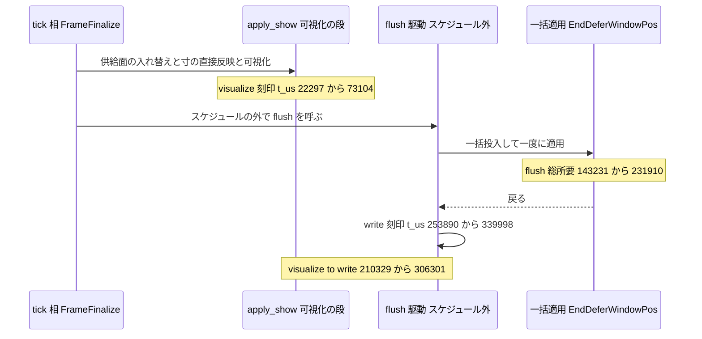
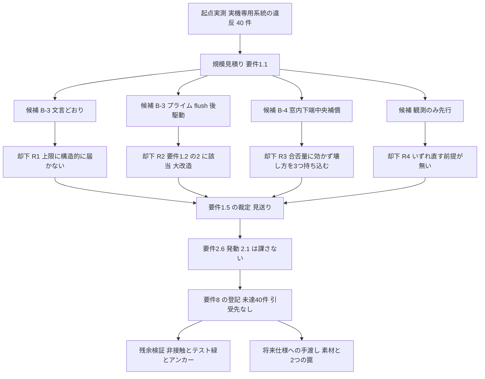

# 技術設計書: areka-P0-present-write-coherence

> **性格**: 縮小設計（2026-08-27 の要件討議による**見送り＋登記**の裁定を受けた姿）。**実行時の挙動を一切変更しない**——是正コード 0 行・製品ファイル非接触。
> **裁定の正本**: `requirements.md` の「裁定の記録」4・5 と末尾の「未達の登記」節。本設計はその裁定を出発点として前提し、**再審しない**。
> **規模見積りの正本**: `research.md`（ギャップ分析 §0〜§9）。本設計は結論のみを自己完結の形で再掲し、根拠の詳細はそちらへ委ねる。

## Overview

**Purpose**: 拡大率の遷移で「絵は旧寸のまま・窓だけ新しい」中間状態が見える問題（atom 要件 4.2 の実機側）について、**是正を行わないという裁定を、仕様の内側から見える形で完結させる**。成果物は ⑴ 裁定と却下理由の登記、⑵ 未達 40 件と引受先なしの登記、⑶ 不適用となる要件の確定、⑷ コード非接触であることの検証、⑸ 将来この未達を引き受ける仕様への手渡し、の 5 点である。

**Users**: 開発者（本裁定を後から読む者・将来の再着手を判断する者）、W6.95 で並走する 3 仕様（`balloon-offset-dpi`・`scope-zorder-pinning`・`balloon-vertical-canon`）の執筆者、W7 の `emo2-conformance-e2e`（現状の見た目のまま走る前提を得る）、ロードマップ管理者。

**Impact**: 製品コード・テストコード・`Cargo.toml` はいずれも変更しない。差分は `.kiro/specs/areka-P0-present-write-coherence/` 配下の仕様文書のみである（steering `roadmap.md` の追随は要件段階で適用済み）。実機の挙動・判定器の出力・観測語彙は着手前と同一であり、既存のサインオフ判定が本 2 量の違反を報告し続けることは**正常な状態**として残る。

### Goals

- 要件 1.5 の裁定（見送り）と、4 つの候補それぞれを採らなかった理由を、設計文書の側にも機械で読める形で登記する（要件 8.4 の「設計文書まで追随させる」の充足）。
- 未達の量（`visualize_to_write_us` 32 件・`flush_total_us` 8 件＝計 40 件）と**引受先なし**の明示を、設計の境界の内側に置く。
- 見送りにより不適用となる要件と、生き続ける要件（7.7・5.1・8.x）を一覧で確定し、「採用時条項が未達として読まれる」誤読を塞ぐ。
- 残余検証を定義する——コード非接触の証跡・ワークスペース全体テストの緑・上流アンカーの実測再確認。
- 将来の再着手仕様へ、規模見積りの素材の所在と**2 つの罠**（判定量の飽和・`t_us` の起点）を手渡す。

### Non-Goals

- **B-3 の実装設計**（可視化の 2 相化・保留の器・commit の入口・wintf 側の flush 後フック）——文言どおりの形は上限に構造的に届かず、届く唯一の形 B-3′ は要件 1.2⑵ に該当して要件 1.3 で落ちている。**設計しない**。
- **B-4 の実装設計**（遷移中の窓内下端中央オフセットとその解除点）——要件 1.5 で却下済み。**設計しない**。
- **提示側の観測点の新設**（DWM 合成・提示時刻の取得）——要件 1.5 で「観測のみ先行」も採らないと裁定済み。
- 上限 16,667µs・判定器・観測語彙・サインオフ手順書の変更（要件 8.3 が禁じる）。
- 実機サインオフの実施（要件 3 は不適用。起点実測 `atom-73-signoff-1` が「前」の保全記録として既に存在する）。
- tick の門の本採用（`tick-gate-adoption` の担当）、フレーム駆動の CPU 負荷（`draw-load-parity` が閉じた）、バルーン追従オフセットの k 倍（`balloon-offset-dpi` の担当）。

## Boundary Commitments

### This Spec Owns

- **裁定の登記**——要件 1.5 の結論（見送り）と、B-3・B-3′・B-4・観測のみ先行の 4 候補それぞれの却下理由、およびその根拠となる構造的事実。
- **未達の登記**——量・違反件数・上限との比・引受先の不在。正本は `requirements.md` 末尾節であり、本設計はその設計側の反映を持つ。
- **不適用要件の確定**——どの受入基準が発動せず、どれが生き続けるかの一覧。
- **残余検証の定義**——「何も触っていないこと」「ワークスペース全体テストが通ること」「上流アンカーがずれていないこと」の 3 点。
- **将来仕様への手渡し**——規模見積りの素材の所在と、再着手時に先に裁定すべき 2 点。

### Out of Boundary

- **製品コード・テストコード・`Cargo.toml` の一切の変更**。本仕様の差分集合（`origin/main...HEAD`）は **`.kiro/specs/areka-P0-present-write-coherence/` 配下＋`.kiro/steering/roadmap.md`（要件 8.4 の追随・要件段階で適用済み）** に限る。この 2 つが許可集合の唯一の定義であり、V2 がこれを機械で検査する。
- atom（completed）が確定させた資産の改変——判定器（`crates/areka/src/placement/transition_judge*.rs`）・観測チャネルとレコード語彙（`crates/wintf/src/ecs/window/transition_diag.rs`）・上限・サインオフ手順書・確定台帳。
- 可視化の段（`crates/areka-emo-present/src/presenter/show.rs`）・配置契約（`crates/areka-emo-present/src/presenter/mount.rs`）・窓書込 flush（`crates/wintf/src/ecs/window/command.rs`・`crates/wintf/src/runtime/tick_bridge.rs`）。**読むだけで変えない**。
- 並走 3 仕様のファイル素（`placement/follow` 系・`zorder_pair*.rs`・`areka-parsers/balloon`＋`areka-emo-text`）。
- **観測された残余で本仕様が引き取らないもの**: `crates/areka/src/placement/transition_signoff_procedure_tests.rs:3` と `crates/areka/src/placement/transition_judge_reobservation_tests.rs:13` の**doc コメント内**の spec パスが完了アーカイブ移動前のまま残っている（実行に影響しない。実パスを読む定数 `:41` は是正済み）。本仕様はコード非接触を証跡とするため**触らない**——引受先は**なし**（doc コメントのみで実行に影響しないため起票は不要。これらのファイルを改変する仕様が現れたとき併せて直せばよい）。

### Allowed Dependencies

- **読むだけ**: atom 確定台帳 §11（数量の正本）、判定器と観測語彙の現物、`show.rs` の可視化の段のアンカー、steering `roadmap.md`。
- **書く先**: `.kiro/specs/areka-P0-present-write-coherence/`（`design.md`・`research.md`・`tasks.md`・`spec.json`）のみ。`requirements.md` は裁定確定済みのため本設計フェーズでは改訂しない。
- steering `roadmap.md` への追随（ゴール表 `:67`・W6.95 行 `:82`・干渉台帳 `:89`）は**要件段階で適用済み**であり、本設計フェーズでは検証対象であって編集対象ではない。
- 本仕様名はソースコードに 1 件も現れない（2026-08-27 実測・`crates/` `doc/` 全域 0 件）。したがって完了時のアーカイブ移動でコードからの参照が壊れる経路は存在しない。

### Revalidation Triggers

以下が起きたとき、本仕様の登記は**根拠の一部を失う**——未達が消えたのではなく、見送りの前提が変わったことを意味するので、再着手の可否を裁定し直す必要がある。

| 変化 | 失効する登記 |
|---|---|
| 窓書込の刻印位置が変わる（`write` レコードが `EndDeferWindowPos` の**前**に発行される形になる） | 却下理由 R1（B-3 が構造的に届かない）の根拠＝隙間の下限表 |
| 窓書込 flush の駆動位置が変わる（`tick_bridge.rs` のスケジュール外駆動をやめる） | 却下理由 R2（B-3′ が要件 1.2⑵ に該当）の前提 |
| 判定器の `saturating_sub`（`transition_judge.rs:817`）または `Bounds::signoff()`（`transition_judge_verdict.rs:169`）の armed 量が変わる | 未達件数の意味・将来仕様への手渡し②（判定量の飽和） |
| 可視化の段の位置（`show.rs` の `set_visible`／`set_bounds`／`Visualize` 発行）が動く | 登記のアンカー（要件 9.5 の再確認結果） |
| 上限 16,667µs の変更 | **これは失効ではなく要件 8.3 違反**である。上限の変更で未達を消してはならない |

## Architecture

### Existing Architecture Analysis（変更しない現状）

遷移 1 回は 1 つの tick の内側で 340ms 級に伸びており、その内側で「絵が新寸になる」と「窓が動く」が 0.21〜0.31 秒離れている。刻印の位置関係が本仕様の裁定を決めた。



**この図から読める確定事実は 3 つである**（いずれも 2026-08-27 に実測で再確認・詳細は `research.md` §1）。

1. `t_us` の起点は**プロセス開始ではなく当該 tick の開始**である（`transition_diag.rs:692` `since_tick_start_us`・`:703` `stamp`）。この読み替えを持たないと規模見積りが 1 桁ずれる。
2. **窓書込の刻印は `EndDeferWindowPos` が戻った後**に発行される。ゆえに可視化を flush の直前へ置いても、残る隙間の下限は flush の総所要（143,231µs 以上＝上限の 8.6 倍以上）である。
3. **上限へ届く置き場は `EndDeferWindowPos` の後だけ**であり、そこへ駆動を足すことは flush の後ろに新しい駆動を足す行為である。

### Key Decisions

| # | 決定 | 根拠 |
|---|---|---|
| D1 | 要件 1.5 の裁定（**見送り**）を設計の出発点として固定し、本設計は候補の再評価を行わない | 裁定の記録 4・5（2026-08-27 開発者裁定）。設計が裁定を再審すると、確定した結論の上に矛盾した文書が立つ |
| D2 | **是正コード 0 行**——差分集合を仕様文書に限定し、「触っていない」ことを検証可能な形（変更ファイル一覧）で示す | 要件 8 の登記は「直さないことを見えるようにする」ことであり、部分的な着手は却下理由（費用と釣り合わない）と矛盾する |
| D3 | 4 候補の却下理由を、**構造的事実と対にして**設計に残す（下表 R1〜R4） | 理由のない見送りは将来「もう一度検討し直す」費用を丸ごと再発生させる。事実を残せば再着手は差分の確認だけで足りる |
| D4 | 上限・判定器・観測語彙は**書き換えない**。既存判定が本 2 量の違反を報告し続けることを正常な状態として登記する | 要件 8.3。判定を緩めれば未達は「消える」が、消えたのは表示だけである |
| D5 | 完了条件は要件 7.7（ワークスペース全体テストが通る）**のみ**とし、実機サインオフ・新規決定論テストは課さない | 要件 3・7 の採用時条項は発動しない（2.6 発動）。是正で新たに生じる判断分岐が 0 個なので、決定論テストの対象が存在しない |
| D6 | 引受先は「**なし**」と明示し、ウェーブ名や既存仕様を引受先として書かない | 要件 8.2 と開発規律（先送りは担当仕様の実在検証が要る）。`tick-gate-adoption` は tick の門の本採用が担当であり本量を担当しない |
| D7 | 将来仕様への手渡しに**2 つの罠**を必ず含める——⑴ 可視化を書込の後ろへ回すと判定量が飽和して 0＝満点になる ⑵ `t_us` は tick 起点である | どちらも「知らないまま着手すると、直っていないのに PASS が出る／規模を 1 桁誤る」種類の事実である |

### 却下の登記（4 候補）

| # | 候補 | 却下理由 | 根拠となる構造的事実 |
|---|---|---|---|
| R1 | **B-3（文言どおり）**＝可視化を窓書込の直前まで遅らせる | 上限 16,667µs に**構造的に届かない**。是正しても未達は残る | 窓書込の刻印は `EndDeferWindowPos` が戻った後（`command.rs` の flush 記録ループ）。ゆえに残る隙間の下限＝flush 総所要 143,231µs 以上＝上限の 8.6 倍以上 |
| R2 | **B-3′**＝flush 完了後に可視化の反映を駆動する | 要件 1.2⑵「tick の駆動と窓書込 flush の駆動の関係を変更する」に**該当**（裁定の記録 4）＝大改造。要件 1.3 により候補から落ちる | 上限へ届く唯一の置き場が `EndDeferWindowPos` の後であり、そこへの駆動は flush の後ろに新しい駆動を足す行為。加えて wintf は areka を知らないため、既定 None のコールバック口という前例の無い仕組みが要る |
| R3 | **B-4**＝遷移中だけサーフェスを窓内下端中央へ置く補償 | 合否量 `visualize_to_write_us` を **1µs も動かせない**（要件 2.1 を原理的に満たせない）一方で、3 つの新しい壊し方を持ち込む。切替頻度が稀で無視できる優先度に対し費用と釣り合わない（裁定の記録 5） | 判定量は可視化と書込の**時刻差**しか見ないが、B-4 はどちらの時刻にも触れない。3 つの壊し方＝⑴ 当たり判定の基準座標と絵の実位置が遷移中だけ食い違う ⑵ オフセット常時ゼロを前提にする既存テストが壊れる ⑶ 一時配置の解除の取りこぼしが定常を静かに壊す。さらに配置経由のオフセットは**次の tick まで効かない**ため、同一 tick で効かせるには寸の直接反映と同型の直接呼出が要り、当たり判定の権威と実位置の乖離が必然になる |
| R4 | **観測のみ先行**＝提示側の観測点を足して見え方の順序を初めて機械で名指しする | **いずれ直す前提が無い**ため採らない（裁定の記録 5）。観測点は是正の準備であって、是正しないなら費用だけが残る | 提示（合成器）を観測する仕組みはリポジトリに 1 つも無く、GPU 合成窓で「画面に出た時刻」を返す手段自体が未調査（`research.md` §8-①） |

### Technology Stack

変更なし。新規依存ゼロ。ビルド構成（`opt-level='z'` 等）非接触。本仕様の完了確認は `cargo test --workspace` のみで足りる——**本仕様が新たに**要求する環境は無い（実機操作・新規採取は不要）。ただしゲート自体は GPU 実描画＋readback のテストを含み、**i686（host-32）成果物を先にビルドしておかないと赤になる**（V1 の前提条件として明記）。

## File Structure Plan

### Modified Files（本設計フェーズ以降に変更するファイル＝すべて仕様文書）

| パス | 変更内容 | 対応 Component |
|---|---|---|
| `.kiro/specs/areka-P0-present-write-coherence/design.md` | 本文書。裁定・却下理由・不適用要件・残余検証・手渡しの登記 | C1・C2・C3・C4・C5 |
| `.kiro/specs/areka-P0-present-write-coherence/research.md` | §10 として設計フェーズの合成結果（一般化・作るか採るか・簡約の 3 観点と、その結論＝作らない）を追記 | C5 |
| `.kiro/specs/areka-P0-present-write-coherence/tasks.md` | 残余検証と登記の完結をタスクとして生成（次フェーズ） | C4 |
| `.kiro/specs/areka-P0-present-write-coherence/verification/notes.md` | 残余検証 V1〜V5 の実行結果と、登記の突合結果・完了報告の文面を残す記録（実装フェーズで新規作成）。V2 の許可集合の内側であり、**V2 の差分採取より前にコミットして作業ツリーを確定させる** | C4 |
| `.kiro/specs/areka-P0-present-write-coherence/spec.json` | フェーズ・承認状態の更新 | — |

### 既に追随済み（本フェーズでは**検証対象**・編集しない）

| パス | 状態 |
|---|---|
| `.kiro/specs/areka-P0-present-write-coherence/requirements.md` | 「裁定の記録」4・5 と末尾「未達の登記」節が正本。2026-08-27 確定 |
| `.kiro/steering/roadmap.md` | ゴール表 `:67`・W6.95 行 `:82`・干渉台帳 `:89`（pwc⇄bod の要ウォッチは B-4 却下により**解消**と登記済み）。2026-08-27 追随済み |

### 接触禁止集合（本仕様は 1 行も変更しない）

```
crates/areka-emo-present/src/presenter/show.rs      # 可視化の段（読むだけ・アンカー再確認の対象）
crates/areka-emo-present/src/presenter/mount.rs     # 配置契約と寸の直接反映（B-4 却下により非接触）
crates/wintf/src/ecs/window/command.rs              # 窓書込 flush と刻印（atom の確定物）
crates/wintf/src/runtime/tick_bridge.rs             # flush の駆動点（atom／dlp の確定物）
crates/wintf/src/ecs/window/transition_diag.rs      # 観測チャネルとレコード語彙（要件 5.4）
crates/areka/src/placement/transition_judge*.rs     # 判定器と上限（要件 8.3）
Cargo.toml / crates/**/Cargo.toml                   # 依存・ビルド構成
```

## System Flows

裁定の到達経路（本仕様が実行した順序そのもの＝要件 1 の「順序を要件にする」の実現形）:



## Requirements Traceability

| Requirement | 概要 | 実現要素 |
|---|---|---|
| 1.1 | B-3 の規模見積りを作成し記録する | `research.md` §1・§3（接触ファイル・破る順序制約 6 本・追加が必要な仕組み 5 点）＋ C2 |
| 1.2 | 「大改造」の 3 定義 | C2（R2 の判定根拠として引用） |
| 1.3 | 該当時は B-3 を採らず分割を再裁定し結論を記録 | C2 の R2（結論＝見送り・`requirements.md` 裁定の記録 4） |
| 1.4 | 候補を C8 の表の内側に限る | C2（表外の手段は評価対象にしていない） |
| 1.5 | B-3・B-4・見送りの一意な裁定と、採らなかった理由 | C1（裁定＝見送り）＋ C2（R1〜R4） |
| 1.6 | 上流の食い違いに対する読みの明記 | `requirements.md` 裁定の記録 1（要件段階で充足済み）・C1 が参照を保つ |
| 2.1 | `visualize_to_write_us` ≤ 16,667µs | **不適用**（2.6 発動）。未達として C1 が登記 |
| 2.2 | B-3 採用時の同一 flush 区間 | **不適用**（採用時条項・B-3 不採用） |
| 2.3 | B-4 採用時の一時配置 | **不適用**（採用時条項・B-4 不採用） |
| 2.4 | 一時配置の解除点 | **不適用**（一時配置を導入しない） |
| 2.5 | 解除漏れのログ | **不適用**（同上） |
| 2.6 | 見送り時は 2.1 を課さず要件 8 の登記へ替える | C1（発動済み）＋ C3 |
| 3.1 | 合否は実機採取で判定する | **不適用**（是正しないため合否判定を行わない）。C3 が明示 |
| 3.2 | 低→高・高→低を各 3 回以上 | **不適用**（同上・起点実測 8 遷移が「前」の保全記録） |
| 3.3 | 既存サインオフ判定で判定し出力を保全 | **不適用**（同上）。判定器は非接触＝要件 8.3 の側で保たれる |
| 3.4 | 上限を緩めない | C1・C4（上限非接触の検証） |
| 3.5 | 未測定を合格へ丸めない | C1（未達を合格と読める書き方をしない・要件 8.5 と同趣旨） |
| 3.6 | 採取条件の記録 | **不適用**（新規採取を行わない） |
| 3.7 | 目視所見と機械判定の一致・食い違いの記録 | C1（食い違いのまま閉じる形＝症状に対応する量は `visualize_to_write_us`・引受先は無し） |
| 3.8 | 是正前後の同一手順比較 | **不適用**（是正が無いため「後」が存在しない） |
| 4.1 | 合否量は `visualize_to_write_us` | C1（登記表の第 1 行） |
| 4.2 | `flush_total_us` は測るが合否に載せない | C1（登記表の第 2 行・合否外である旨を明記） |
| 4.3 | 残違反の件数と値・引受先の明示 | C1（32 件＋8 件＝40 件・引受先なし） |
| 4.4 | 決定論 PASS を提示フレーム一致の証拠と読まない | C1・C3（決定論側の全緑は本量の充足を意味しないと明記） |
| 4.5 | 意味が変わった量で前後比較しない | C1（1 件あたりの呼出所要を比較に用いない旨の登記を保つ） |
| 4.6 | 完了宣言に実機と決定論の双方を要求 | C3（3.x 不適用に伴い、本仕様の完了宣言は「合格」ではなく「未達の登記」であることを明示＝合格宣言を行わないので双方要求の趣旨は破られない） |
| 5.1 | 見え方の順序を未特定として扱う | C1（登記事項として存続・アプリ側ログの時刻順を見え方の順序と読まない） |
| 5.2 | 順序を名指しするなら観測点を足してから | **不適用**（名指ししない） |
| 5.3 | 観測点は既存チャネルの内側・別系統を新設しない | **不適用**（観測点を追加しない）。C2 の R4 が理由を保持 |
| 5.4 | 既存レコード語彙の文言・フィールド名を変更しない | C4（`transition_diag.rs` 非接触の検証） |
| 5.5 | 追加観測点は既定無効 | **不適用**（追加しない） |
| 5.6 | 点灯確認を採取手順で明示する | **不適用**（同上） |
| 6.1 | atom の窓書込の形を変更しない | C4（`command.rs`・`tick_bridge.rs` 非接触） |
| 6.2 | 当たり判定原点・バルーン追従基準を変更しない | C4（`mount.rs`・`placement/follow` 非接触） |
| 6.3 | B-4 採用時の当たり判定確認 | **不適用**（B-4 不採用） |
| 6.4 | 定常アロケーション 0 と段階別計時ログを壊さない | C4（`show.rs` 非接触＝構造的に成立） |
| 6.5 | 壊れた既存テストを残さない | C4（変更が 0 行のため既存テストは 1 本も壊れない。`research.md` §6 が挙げた 5 件はいずれも非発火） |
| 6.6 | tick の門の既定を変更せず本採用しない | C4（`world/mod.rs` 非接触） |
| 6.7 | 起床旗と相名は読むだけ | C4（同上） |
| 7.1 | 新たな判断分岐を純関数化して網羅 | **不適用**（是正が無く新たな判断分岐が 0 個） |
| 7.2 | B-4 のオフセット導出と解除の検証 | **不適用**（B-4 不採用） |
| 7.3 | B-3 の同一 flush 区間性の検証 | **不適用**（B-3 不採用） |
| 7.4 | 是正前に赤・是正後に緑の形 | **不適用**（是正が無い。是正の有無に関わらず緑のテストを証拠に数えないという趣旨は C3 が保つ） |
| 7.5 | テスト本体は兄弟ファイルへ | **不適用**（新規テストを作らない） |
| 7.6 | 目視でしか判らない効果を決定論で合格判定しない | C3（決定論の結果を提示フレーム一致の証拠にしない・4.4 と対） |
| 7.7 | ワークスペース全体のテストが通る状態で完了する | **C4（本仕様で唯一生きている完了条件）** |
| 8.1 | 未達の量を要件文書へ登記 | `requirements.md` 末尾節（正本・充足済み）＋ C1（設計側の反映） |
| 8.2 | 引受先を実在の仕様として名指しするか、無いことを明示 | C1（**引受先なし**を明示・ウェーブ名を引受先にしない） |
| 8.3 | 上限・判定器・観測語彙を書き換えて未達を消さない | C4（3 者の非接触検証）＋ Revalidation Triggers の最終行 |
| 8.4 | 改訂を設計・境界節・steering まで追随させる | 本文書（設計）＋ Boundary Commitments（境界節）＋ `roadmap.md`（追随済み・C4 が検証） |
| 8.5 | 未達を残した完了は合格と読める書き方をしない | C3（完了報告の文面規律） |
| 9.1 | 可視化の段を担当し tick の相順は担当しない | Boundary Commitments（Out of Boundary の flush 駆動） |
| 9.2 | B-4 で配置契約に触れるなら bod と相互照合 | **不適用**（B-4 不採用）。`roadmap.md:89` の要ウォッチは解消として登記済み |
| 9.3 | CPU 負荷とバルーン k 倍を担当しない | Non-Goals |
| 9.4 | 門が有効な採取での集計の妥当性を再確認 | **不適用**（新規採取を行わない。門の既定は OFF のまま非接触） |
| 9.5 | 上流アンカーの実測再確認と、ずれていれば記述更新 | C4（2026-08-27 実測・ドリフトなし。完了時に再実行） |

## Components and Interfaces

本仕様は実行時の構成要素を持たない。以下の 5 つは**文書上の成果物**であり、サービス契約・API 契約・イベント契約・バッチ契約・状態管理のいずれも新設しない。

| Component | 種別 | Intent | Req 対応 | 所在 |
|---|---|---|---|---|
| C1 裁定と未達の登記 | 仕様文書 | 見送りの結論と未達 40 件・引受先なしを設計側にも置く | 1.5, 1.6, 2.6, 3.4, 3.5, 3.7, 4.1-4.5, 5.1, 8.1, 8.2 | 本文書「未達の登記（設計側の反映）」 |
| C2 却下の登記 | 仕様文書 | 4 候補の却下理由と構造的事実を対で残す | 1.1-1.4, 5.3 | 本文書 Architecture「却下の登記」 |
| C3 不適用要件の確定 | 仕様文書 | 発動しない受入基準と生きている受入基準を一覧化する | 2.6, 4.4, 4.6, 7.4, 7.6, 8.5 | 本文書 Requirements Traceability ＋「完了報告の規律」 |
| C4 残余検証 | 検証手順 | 非接触・テスト緑・アンカーの 3 点を証跡にする | 3.4, 5.4, 6.1-6.7, 7.7, 8.3, 8.4, 9.5 | 本文書 Testing Strategy（実行は tasks.md） |
| C5 将来仕様への手渡し | 仕様文書 | 再着手仕様が最初に読むべき素材と 2 つの罠を渡す | 8.2 の補完 | 本文書「将来仕様への手渡し」＋ `research.md` §1・§3・§5・§10 |

### 未達の登記（設計側の反映）

正本は `requirements.md` 末尾「未達の登記」節である。設計として自己完結させるため要点のみ再掲する。

| 量 | 実測（`atom-73-signoff-1`・release・8 遷移） | 上限 | 違反 | 合否 |
|---|---|---|---|---|
| `visualize_to_write_us` | 210,329 … 306,301µs（上限の 12.6〜18.4 倍） | 16,667µs | 32 窓中 32 件（上限以下 0 件） | **本仕様の合否量**（要件 4.1）だが 2.6 発動により課さない |
| `flush_total_us` | 143,231 … 231,910µs | 16,667µs | 8 遷移中 8 件 | もとより合否外（要件 4.2） |

- 実機専用系統の違反は**計 40 件**が是正されないまま残る。利用者に見える症状は「拡大率切替の瞬間、絵と窓が食い違う中間状態が最大 0.3 秒程度見える」であり、切替頻度が稀であることから無視できる優先度と裁定された。
- **引受先なし**（要件 8.2 の明示）。現存の仕様でこの量を引き受けられるものは無い。`tick-gate-adoption` は tick の門の本採用が担当であり本量を担当しない。将来是正するには新規仕様の起票が要る。
- 上限・判定器・観測語彙はそのまま残す。**既存のサインオフ判定が本 2 量の違反を報告し続けるのは正常であり、それを未達の解消と読んではならない。**
- 決定論側の判定が全て PASS であることは、絵と窓が同じ提示フレームに載った証拠ではない（要件 4.4）——測っている量が違う。
- 「絵と窓のどちらが先に画面へ出るか」は**未特定のまま**である（要件 5.1）。アプリ側ログの時刻順は「寸が先・位置が後」、開発者の目視申告は逆向きで、是正前後の 2 採取で再現している。本仕様は観測点を追加しないため、この食い違いは未特定のまま引き継がれる——症状に対応する量は `visualize_to_write_us` であり、その引受先は無い（要件 3.7）。

### 完了報告の規律（要件 8.5）

- 完了報告は「**未達 40 件を登記して閉じた**」ことを明示し、合格・PASS・解決と読める書き方をしない。
- ワークスペース全体テストの緑は**要件 7.7 の充足**であって、要件 2.1 の充足ではない。両者を同じ段落で並べない。
- 本仕様の差分が仕様文書のみであることを併記し、「実行時の挙動は着手前と同一」と明言する。

**要件 4.6 の読み（設計側で明示する解釈）**: 4.6 は「完了の宣言に実機採取と決定論テストの双方の結果を要求する」と述べるが、これは**是正の合格を宣言する場合の要求**である。見送りの裁定により要件 3 の実機採取は実施されない（`requirements.md`「見送りにより不適用となる要件」）ため、本仕様は**合格を宣言しない**——閉じ方は「未達 40 件の登記」であり、片方の結果をもって合格と読み替える行為そのものが起きない。この読みを採らないと、要件 3 が不適用であることと 4.6 が完了を要求することが互いに矛盾する。将来の再着手仕様が是正を伴って合格を宣言するときは、4.6 が文言どおり双方を要求する。

### 将来仕様への手渡し（再着手の前提）

将来この未達を引き受ける仕様が起票されたとき、最初に読むべき素材と、**着手前に裁定すべき 2 点**を示す。

- **素材の所在**: `research.md` が規模見積りの正本である。§1（現状構造の実測と隙間の内訳）・§3（B-3 の接触集合・破る順序制約 6 本・追加が必要な仕組み 5 点）・§5（判定器の落とし穴 3 件）・§6（影響を受ける既存テスト 5 件）・§7（工数と危険度）・§8（未調査 5 件）。
- **罠①（判定量の飽和）**: `visualize_to_write_us` は同一フレーム内の `write_us - visualize_us` を**飽和減算**で求める（`crates/areka/src/placement/transition_judge.rs:817`）。可視化を書込の**後ろ**へ動かすと値は 0＝満点になる。これは未測定でも違反でもなく**満点として通る**——是正の実体が伴わなくても PASS が出せる形である。上限へ届く唯一の置き場（`EndDeferWindowPos` の後）はこの落とし穴の上にあるので、**置き場を決めるより先に、合格の意味をどう保つかを裁定すること**（要件 8.3・3.5 の趣旨）。
- **罠②（`t_us` の起点）**: `t_us` はプロセス開始からではなく**当該 tick の開始からの経過**である（`crates/wintf/src/ecs/window/transition_diag.rs:692`・`:703`）。起点実測の 22,297〜339,998µs はすべて 1 つの tick の内側で起きており、遷移 1 回の tick は 340ms 級に伸びている。この読み替えを持たずに見積もると規模が 1 桁ずれる。
- **未調査で残る 1 点**: `EndDeferWindowPos` 単独の所要は台帳に無い（OS 側の内訳は未特定）。`research.md` §8-② のとおり、その直前・直後に計時点を足せば確定でき、**この 1 点の実測が B-3′ の到達可否を確定させる**。
- **候補表の縛り**: 採用候補を atom 設計 C8 の表の内側に限る縛り（要件 1.4）は本仕様の裁定であり、新規仕様がそれを継承するか否かは新規仕様が裁定する。

## Error Handling

本仕様はエラー経路を新設しない。定めるのは残余検証が期待どおりに運ばなかったときの扱いのみである。

- **ワークスペース全体テストが赤のとき**: まず前提条件（i686 host-32 成果物・GPU 環境）を確認し、次に原因ファイルを名指しして本仕様の差分集合（V2 の許可集合）の外であることを **file 単位で示す**。それができて初めて「本仕様に由来しない」と結論してよい（並走 3 仕様の着地や main の取り込みが原因になり得る）。**示せないまま「無関係だから」と黙って通してはならない。**
- **アンカーがずれていたとき**: 要件 9.5 に従い本文書と `research.md` の記述を実測値へ更新する。ずれの内容が Revalidation Triggers の第 1・2 行に該当する場合は、却下理由 R1・R2 の根拠が失効するため、**完了させる前に開発者へ再着手の可否を確認する**。
- **接触禁止集合に差分が出たとき**: 本仕様の裁定（是正コード 0 行）に反する。差分を取り消すか、裁定そのものを開発者へ差し戻す。**部分的な着手で埋めない。**
- **未達を消す方向の変更**: 上限・判定器・観測語彙の変更は要件 8.3 違反である。本仕様の完了条件として明示的に禁じる。

## Testing Strategy

### 新規テスト

**なし。** 是正で新たに生じる判断分岐が 0 個であるため、決定論テストの対象が存在しない（要件 7.1〜7.3 は採用時条項で発動しない）。是正の有無に関わらず緑のままのテストを是正の証拠として数えないという要件 7.4 の趣旨は、**そもそもテストを追加しない**ことで自明に守られる。

### 残余検証（C4・完了時に実行）

| # | 検証 | 手順 | 判定 |
|---|---|---|---|
| V1 | ワークスペース全体テスト（要件 7.7） | 前提＝i686（`i686-pc-windows-msvc`）の host-32 成果物をビルド済みにした上で `cargo test --workspace` を実行 | 全通過（`test result: ok`）。赤があれば Error Handling の第 1 項へ |
| V2 | コード非接触の証跡（要件 6.1-6.7・8.3） | ⑴ `git diff --name-only origin/main...HEAD` の全行が許可集合（`.kiro/specs/areka-P0-present-write-coherence/` 配下＋`.kiro/steering/roadmap.md`）に含まれることを確認 ⑵ `git status --porcelain` で作業ツリーを別建てに検査——`vendors/pasta`（サブモジュールのポインタ・**本仕様着手前からの汚れ＝本仕様は触っていない**）以外の未コミット差分が無いこと、および `vendors/pasta` を本仕様のどのコミットにも**含めない**ことを確認 | ⑴ 許可集合外 0 件 ⑵ 想定外の作業ツリー差分 0 件・`vendors/pasta` は本仕様のコミット履歴に現れない |
| V3 | 上流アンカーの実測再確認（要件 9.5） | `crates/areka-emo-present/src/presenter/show.rs` の `apply_show` 起点・`set_visible`・`set_bounds`・`Visualize` 発行の 4 点を現物で確認（2026-08-27 実測＝`:46`／`:375`／`:381`／`:392`・ドリフトなし） | 4 点が現存。ずれていれば記述を更新 |
| V4 | 判定器・語彙・上限の非接触（要件 8.3・5.4） | `transition_judge*.rs`・`transition_diag.rs` に差分が無いことを確認（2026-08-27 実測アンカー＝飽和減算 `transition_judge.rs:817`・`Bounds::signoff` `transition_judge_verdict.rs:169`・`since_tick_start_us` `transition_diag.rs:692`） | 差分 0 |
| V5 | steering 追随の確認（要件 8.4） | `.kiro/steering/roadmap.md` のゴール表 `:67`・W6.95 行 `:82`・干渉台帳 `:89` が見送り裁定を反映していることを確認 | 3 箇所とも反映済み（2026-08-27 追随済み） |

### 実機サインオフ

**不要**（要件 3 は不適用）。実行時の挙動を変更しないため、実機で再確認すべき差分が存在しない。起点実測 `atom-73-signoff-1` が未達の証拠として既に保全されている。

### E2E

対象外。W7 の `emo2-conformance-e2e` は**現状の見た目のまま**走る——遷移中の中間状態は是正されないので、適合走行で拡大率遷移の見た目を判定条件に含めてはならない。

## Supporting References

- `research.md` §0（要旨 5 点）・§1（現状構造の実測）・§3（B-3 の規模見積り）・§5（判定器の落とし穴）・§6（既存テストへの影響）・§7（工数と危険度）・§8（未調査事項）・§10（設計フェーズの合成結果）。
- `requirements.md`「裁定の記録」1・4・5 と末尾「未達の登記」節（**裁定の正本**）。
- atom（completed）`mechanism-ledger.md` §11（数量の正本）・`signoff-procedure.md`（実機手順書・本仕様では使用しない）。
- `.kiro/steering/roadmap.md`（W6.95 の編成と本裁定の追随・干渉台帳）。
