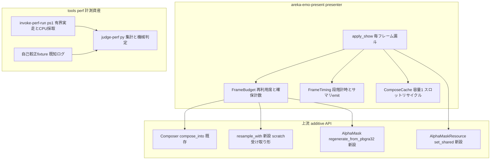
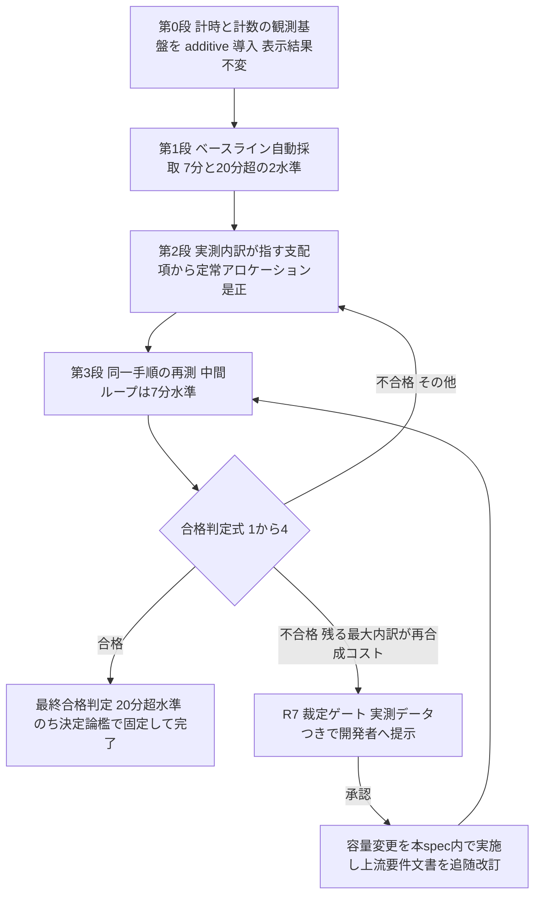
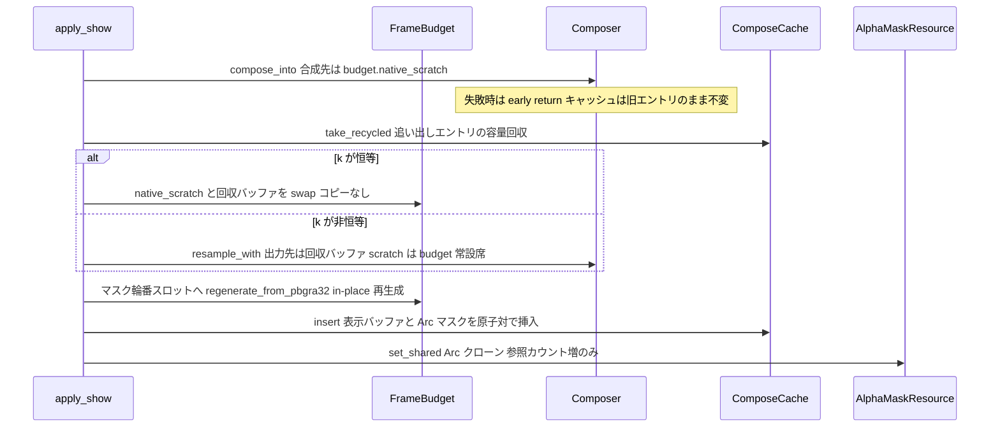

# 技術設計: areka-P0-recompose-budget

> file:line アンカーは 2026-08-14 時点の実コード実測（design フェーズで再検証済み・research.md §1/§9 が根拠）。

## Overview

**Purpose**: ゴースト放置時の CPU 消費とアイドルアニメのスロー再生を根治する。表示の毎フレーム経路（`apply_show`）が上流合成層の提供するバッファ再利用形 API を使わず毎コマ 4MB 級の確保・解放を繰り返している構造欠陥を、⑴段階別計時ログ（恒久観測基盤）→ ⑵ベースライン自動採取 → ⑶定常アロケーション完全ゼロ化 → ⑷同一手順再測の機械判定、の自走ループで是正する。

**Users**: ゴーストを常駐させるエンドユーザー（軽く滑らかな再生）と、以後の全 spec で実機サインオフを行う開発者（CPU 税の除去・再利用可能な計測資産）。

**Impact**: `areka-emo-present` の `presenter/show.rs` ホットパスを `compose_into`＋再利用バッファ束へ再配線し、`cache.rs` にスロット容量リサイクルを加える。上流 2 クレートへは **additive な API 追加のみ**（emo-compose: リサンプル作業領域受け取り形／wintf: マスクの in-place 再生成と共有供給）。リポジトリ級の性能計測資産 `tools/perf/` を新設する。承認済み契約（キャッシュ容量 1・完全一致キー・表示とマスクの原子対・`compose_into` の意味・既存 info! ログ契約）は 1 つも書き換えない。

### Goals

- 定常状態の表示 1 コマ適用で表示用バッファの新規確保 0（マスクの下流供給複製・リサンプル内部作業領域を含む完全ゼロ＝議題 1 裁定）
- release ビルドのアイドル CPU（1 コア換算）3% 未満・20 分超走行で単調上昇しない（議題 2 裁定）
- コマ適用間隔の p95 がアニメ定義の指定間隔＋許容率以内（スロー再生解消の機械判定）・定常状態で進行境界スキップ 0 件
- 「何が重いか」の特定から効果判定まで開発者の介在なしで完結する計測・判定資産（`tools/perf/`・恒久資産）
- 是正が絵と当たり判定をバイト単位で変えないこと、および是正後状態の決定論的な固定

### Non-Goals

- 合成キャッシュ容量（承認済み要件で容量 1）の変更——Requirement 7 の裁定ゲートを通った場合のみ本 spec 内で実施
- SERIKO のアニメ発火頻度・アニメ定義・ゴースト fixture の改変（互換性違反・症状隠し）
- 合成アルゴリズム本体（`build_plan`／`blit::execute`）の最適化——O(elements) 契約は満たされている前提
  - **※ task 3.2 追記（2026-08-14）**: `scale.rs` の `resample` はこの列挙に**含まれていない**。第 1 段実測で `resample` の計算そのものが支配項（1 コマ適用の約 50%）と確定したため、これを本 spec の範囲に含めるかは開発者裁定に委ねる。決定は行っていない——下記「実測に基づく是正設計の追補（task 3.2）」§A4 を参照
- GPU 側（スワップチェーン・合成面更新）の最適化——CPU 側の確定分を潰してから測り直す
- bind の意味論（bindoption-exclusivity で完了済み）・拡大率切替時の跳ね（dpi-transition-atomicity の所有）

## Boundary Commitments

### This Spec Owns

- `areka-emo-present` の毎フレーム経路（`presenter/show.rs`）のアロケーション予算と再配線
- `presenter/` 配下の観測基盤（段階別計時・確保計数）と、その固定文言・フィールドスキーマ
- `cache.rs` のスロット容量リサイクル API（容量 1・完全一致・原子対の意味論は不変のまま）
- 上流への additive API 追加: emo-compose `resample_with`＋`ResampleScratch`／wintf `AlphaMask::regenerate_from_pbgra32`・`AlphaMaskResource::set_shared`（内部表現の `Arc` 化を含む・公開挙動不変）
- リポジトリ共通の性能計測資産 `tools/perf/`（採取ランナー・判定スクリプト・手順書・自己較正 fixture）
- 定常アロケーション 0 とバイト等価を固定する決定論檻

### Out of Boundary

- キャッシュ容量政策の変更（R7 裁定が下りるまで実装しない・自律ループの唯一の例外）
- SERIKO・ghost・kanade の駆動側（発火頻度・スケジュール・`ticker.rs`／`looper.rs` のコード）——判定スクリプトが既存ログを grep するのみで、コードには触れない
- `show.rs` :215-235 帯（スワップ〜upload 域）の**構造**——atom（W6.75）の観測対象。upload エラー分岐 :227-231 は cage④（W6.9）の観測点であり移動しない。本帯への変更は :240 のマスク供給 1 文の置換（`set` → `set_shared`）に限る
- `scale.rs` の既存項目の変更——追加は関数＋opaque 型のみ（exact との先着後 rebase 対象）
  - **※ task 3.2 追記（2026-08-14）**: 第 1 段実測により、支配項の是正（`resample` の計算・出力バッファの冗長なゼロ埋め）は本行に触れる。本行を改訂して範囲へ取り込むか、別 spec へ切り出すかは開発者裁定（追補 §A4）。裁定が下りるまで `resample` の既存項目は変更しない
- 既存 info! 表示成立点ログ（`"apply(ShowSurface): 表示・マスクを更新"`・info 水準・全フィールド）——実機サインオフ契約ゆえ文言・水準・フィールドとも不変

### Allowed Dependencies

- `areka-emo-present` → `areka-emo-compose`（`compose_into`・`resample`・`resample_with`）・`wintf`（`AlphaMask`・`AlphaMaskResource`）——既存方向のまま
- `tools/perf/` → areka 実行体（子プロセス起動）・実行ログ・`Get-Counter`。**リポジトリのビルドグラフに入らない**（PowerShell＋Python 標準ライブラリのみ・bindopt `signoff-scan.py` 前例踏襲）
- テストは既存の檻パターン（emo-compose 予算檻のアプローチ (A)・emo-present 自前 `CaptureSubscriber`・GPU readback 檻）へ相乗り

### Revalidation Triggers

- perf サマリ行の固定文言・フィールド名の変更 → `tools/perf/judge-perf.py` と計時檻の再検証
- 判定式⑴の判定粒度（系列単位）・系列鍵（`FRAME_INTERVAL_SERIES_KEY`）・判定対象の確定方法（`FRAME_INTERVAL_JUDGED_SERIES`）の変更 → `judge-perf.py` の判定式⑴とプール希釈の赤ケースを含む自己較正 fixture の再検証
- `ComposeCache` の公開シグネチャ変更（`insert`／`take_recycled`）→ `cache_tests.rs`・presenter 檻の再検証
- `AlphaMaskResource` の内部表現変更 → wintf hit_test 檻・emo-present 表示檻の再検証
- `scale.rs` への追加が exact（scale-exact-rational）着地後に rebase された場合 → `resample_with` 等価檻の再実行
- R7 裁定でキャッシュ容量が変わる場合 → 上流 `completed/areka-P0-emo-present` requirements R4.1 の改訂＋本設計のキャッシュ節・檻の全面再検証
- `BindSet` の等価比較コストを線形から短絡形（ハッシュ保持・要素数や指紋による早期打ち切り・ポインタ同一性判定など）へ変える変更 → `presenter_perf_log_tests.rs` の `t_cache_us` 非 0 主張（`timing.mark(Stage::CacheLookup)` の唯一の固定点）の再検証

## Architecture

### Existing Architecture Analysis

毎フレーム経路の現状（research.md §1 実測・design フェーズ再検証済み）:

- `apply_show`（`presenter/show.rs:32-322`）はミス毎に ⑴`Composer::compose`（lib.rs:158 で `ComposedSurface::new(0,0)` を新規確保）⑵k≠1 時 `ComposedSurface::new(0,0)`＋`resample`（show.rs:87-88）⑶`cache.insert` 内 `AlphaMask::from_pbgra32`（cache.rs:135-140・毎回 `vec!` 確保）を実行し、スロット置換（cache.rs:147）で旧エントリの表示バッファ＋マスクを drop する。ヒット・ミスを問わず毎 apply でマスク全複製（show.rs:240 `entry.mask.clone()`＝104KB/コマ）が走る。
- 上流は既に再利用形を提供済み: `Composer::compose_into`（lib.rs:117-125）は任意の `&mut ComposedSurface` を受け、内部 `resize_and_clear`（composed.rs:73-83）が容量を再利用する（本番呼出点ゼロ）。`resample`（scale.rs:395）も出力先を `resize_and_clear` で再利用する——残る確保は内部の x 軸写像表 `Vec<AxisSample>`（scale.rs:423・私有型）のみ。
- `refresh_scale`（refresh.rs:52-117）は :91 で `apply_show` を再入する第 2 の消費者。show.rs を是正すれば自動で直る。
- `AlphaMaskResource`（wintf hit_test/mod.rs:157-177）は値所有（`Option<AlphaMask>`）で、**消費は全て `World::get` の同期 pull 読み**（hit_test 内 `alpha_mask_hit` :199-216 経由の 2 分岐のみ）。`Changed<AlphaMaskResource>`／`Added` 依存はリポジトリ全体で 0 件——共有化・スキップとも変更検知の下流影響なし（design フェーズ実測確定）。
- `resize_and_clear`／`bytes_mut` は emo-compose の `pub(crate)`——emo-present は `compose_into`・`resample` 経由でのみバッファ再利用できる（本設計はこの可視性を変えない）。

### Architecture Pattern & Boundary Map

段階ループ（brief ⑷・要件の骨格）と 1:1 対応するハイブリッド構成（gap 分析 Option C・採用）。観測（第 0 段）と是正（第 2 段）を独立モジュールに分離し、show.rs は各段で薄く呼ぶだけにする。



**Key decisions**（詳細な代替案比較は research.md §9）:

- **D1（構成）**: Option C ハイブリッド。第 0 段（観測）は additive・表示結果不変で先行コミットし、以後の判断を全て実測駆動にする。
- **D2（バッファ再利用の位相）**: ⑴native 合成先＝`FrameBudget` 常設スクラッチ（swap で表示バッファと交代・コピーなし）⑵表示バッファ＝キャッシュ追い出しエントリの容量リサイクル（`take_recycled`）⑶リサンプル作業領域＝`ResampleScratch` 常設席 ⑷マスク＝`Arc<AlphaMask>` の 2 スロット輪番（下記 D3）。
- **D3（マスク複製 A7 の消し方）**: `Arc<AlphaMask>` 共有。キャッシュエントリと `AlphaMaskResource` が同一 `Arc` を持ち、下流供給は参照カウント増のみ。ミス時は輪番の空きスロット（前々回のマスク・参照 1＝unique）へ `Arc::get_mut`＋`regenerate_from_pbgra32` で in-place 再生成する。変更検知依存 0 件の実測により安全（skip 方式より、`set` を常に呼ぶ現行の観測形を保てる点で採用）。
- **D4（マスク生成点の移動）**: `from_pbgra32` 呼出は `cache.insert` 内から `FrameBudget` の取得シームへ移す。「1 apply につきマスク 1 回生成・表示バッファと原子対で挿入」の契約は apply 単位で不変（insert が表示バッファと `Arc` マスクを同時に受け取る）。
- **D5（計時の形）**: 計測（`Instant`）は無条件に実行し、emit のみ debug 水準の tracing に委ねる（R1.5 が構造的に自明化——ログ有効・無効で実行経路が分岐しない）。1 apply = 1 サマリ行・全段フィールドを常に持つ（スキップ段は 0）＝欠落段検出（R2.5）が行単位で機械可能。
- **D6（確保計数）**: `#[global_allocator]` 差し替えは既存予算檻が棄却済み（golden_tests_determinism_budget_tests.rs:120-121）。`FrameBudget` の席取得シーム 1 箇所で「新規確保・容量成長が起きた時だけ」計数し、サマリ行フィールド＋テスト用アクセサで露出する。
- **D7（計測資産の形）**: bindopt `signoff-scan.py` を型紙に、ランナー（PowerShell）＋判定（Python 標準ライブラリのみ）＋手順書＋自己較正 fixture の 4 点を `tools/perf/` へ。較正値はスクリプト内の定数バナー・exit code 0/1/2/3・観測ゼロ＝判定不能 exit 2 の規律を踏襲。
- **D8（バイト等価の檻）**: 旧経路（確保形 `compose`＋新規 out `resample`＋`from_pbgra32`）を「テスト向け便宜」としてそのまま残し、新経路（budget 経由）との**同一入力バイト等価**を層内で固定する。GPU readback 往復檻（chain.rs:401 既設）が表示面まで担保する。
- **D9（不変量の範囲）**: 「定常アロケーション 0」の対象は裁定どおり A1（合成先）A2（リサンプル先）A3（x_map）A4（マスク生成）A6（対の解放 churn）A7（マスク下流供給複製）。キー複製（A5 `binds.clone()`＋`pattern.clone()`・A8 `last_show` 置換）は要素数比例の小確保で表示用バッファではなく、対象外として明文化する（計時ログの内訳で観測は継続し、実測で支配的と出た場合のみ R3.4 により是正順へ繰り込む）。
- **D10（催行順）**: 是正の着手順は第 1 段の実測内訳が決める（R3.4）。本設計の D2〜D4 は「現時点の最有力仮説に基づく是正の設計」であり、実測が別の段（例: upload）を支配項と示した場合は、その段の是正設計を追補してから着手する。

### Technology Stack

| Layer | Choice | Role in Feature | Notes |
|-------|--------|-----------------|-------|
| ホットパス計時 | `std::time::Instant`＋`tracing`（debug 水準） | 段階別計時・確保計数の常設ログ | 新規依存なし。emo-present は module-path target（`areka_emo_present::…`）＝既存 `RUST_LOG=areka_emo_present=debug` 流儀に整合 |
| バッファ再利用 | `compose_into`（既存）・`resample_with`（additive 新設）・`Arc<AlphaMask>` | 定常アロケーション 0 | 上流の承認済み契約を書き換えない |
| 実走採取 | PowerShell（`Get-Counter`・`AREKA_APP_SMOKE_EXIT_MS` 有界 auto-exit） | CPU 時系列＋実行ログの自動採取 | steering 確立済み流儀。直接起動・絶対パス（emo2 実走の既知要件） |
| 集計・判定 | Python 3 標準ライブラリのみ | p50/p95・catch-up・間隔・CPU 収束の機械判定 | `signoff-scan.py` 前例踏襲（exit 0/1/2/3・較正値スクリプト内明記） |
| 決定論檻 | `cargo test`（純 x64・実時間不使用） | アロケーション 0・バイト等価の固定 | emo-compose 予算檻アプローチ (A) の移植 |

## File Structure Plan

### New Files

```
crates/areka-emo-present/src/presenter/
├── budget.rs                          # FrameBudget: 再利用席（native scratch・ResampleScratch・マスク輪番）＋確保計数シーム
├── budget_tests.rs                    # FrameBudget 単体檻（席の再利用・計数・輪番の unique 性）
├── timing.rs                          # FrameTiming: 段階計時の記録器＋perf サマリ行 emit（固定文言・全段フィールド）
└── timing_tests.rs                    # FrameTiming 単体檻（全段フィールドの emit 形）

crates/areka-emo-present/src/
├── presenter_budget_steady_state_tests.rs   # 定常アロケーション0檻（presenter 経由・ポインタ/容量/計数不変）
├── presenter_budget_equivalence_tests.rs    # 新旧経路バイト等価檻（表示 bytes＋マスク・R3.3/6.4）
└── presenter_perf_log_tests.rs              # 計時ログ較正檻（固定文言・debug 水準・全段出現・既存 info! 不変）

tools/perf/
├── invoke-perf-run.ps1                # 有界実走ランナー: 静寂確認ゲート→起動→CPU 時系列採取→ログ収集（2 水準・dev/release）
├── judge-perf.py                      # 集計＋機械判定: 段階別 p50/p95・命中率・catch-up・間隔・CPU 収束・合格判定式⑴〜⑷
├── README.md                          # 手順書: 2 水準の使い分け・静寂状態ゲート・同一手順再測・較正値の所在
└── fixtures/                          # judge-perf.py 自己較正用の既知ログ断片（PASS 用・FAIL 用・空＝判定不能用）
```

### Modified Files

- `crates/areka-emo-present/src/presenter/show.rs` — ミス経路を `compose_into`＋budget 席へ再配線（:66-101 帯）・:240 を `set_shared` へ置換・段階計時点の挿入とサマリ行 emit。**:215-235 帯の構造・:227-231 の upload エラー分岐・:303-320 の info! は不変**
- `crates/areka-emo-present/src/presenter/target.rs` — `PresentTarget` へ `budget: FrameBudget` 席を追加（:53 `composer` の隣・他フィールド不変）
- `crates/areka-emo-present/src/presenter.rs` — ファサードへ `mod budget;`／`mod timing;` と新テスト接続宣言を追加
- `crates/areka-emo-present/src/cache.rs` — `CacheEntry.mask` を `Arc<AlphaMask>` へ・`take_recycled` 新設・`insert` がマスクを引数で受ける形へ（容量 1・完全一致・原子対の意味論不変・`from_pbgra32` 呼出は budget シームへ移動）
- `crates/areka-emo-present/src/cache_tests.rs` — 署名追随＋リサイクル檻の追加
- `crates/areka-emo-compose/src/scale.rs` — **additive のみ**: `pub struct ResampleScratch`（opaque・Default）＋`pub fn resample_with(src, scale, out, scratch)`。既存 `resample` は新形へ委譲（挙動不変）。exact（W6.5 並走）と同一ファイル＝先着後 rebase を登記
- `crates/areka-emo-compose/src/scale_resample_tests.rs`（scale.rs の既存リサンプルテスト群）— `resample == resample_with` 等価檻＋scratch 容量非成長檻を追加
- `crates/wintf/src/ecs/widget/bitmap_source/alpha_mask.rs` — **additive**: `pub fn regenerate_from_pbgra32(&mut self, …)`（`self.data` を clear+resize で再利用）＋`PartialEq` derive（等価檻用）
- `crates/wintf/src/ecs/layout/hit_test/mod.rs` — `AlphaMaskResource` 内部を `Option<Arc<AlphaMask>>` へ（`set` は `Arc::new` で包む＝公開シグネチャ・挙動不変）＋ **additive**: `pub fn set_shared(&mut self, mask: Arc<AlphaMask>)`。`mask()` は `as_deref` で従来どおり `Option<&AlphaMask>`
- wintf 側の `alpha_mask` 既存テスト群 — `regenerate_from_pbgra32 == from_pbgra32` 等価檻を追加

> 依存方向は不変（emo-present → emo-compose／wintf）。`tools/perf/` はビルドグラフ外。テストファイルの接続は structure.md の兄弟ファイル規約（`<stem>_<モジュール名>.rs`＋`#[cfg(test)] #[path]` 接続宣言）に従う。

## System Flows

### Flow 1: 段階ループ（spec 全体の催行順）



- 各段は独立コミット可能（areka-commit-as-you-go）。第 0 段・第 1 段は表示コードの挙動を変えない。
- 実機計測（S1・S3・S4）の開始前に開発者へセッションを渡し、測定マシンの静寂状態の確認を得る（R2.7・ランナーの確認ゲートで機械化）。
- 長時間（20 分超）水準はベースライン（S1）と最終合格判定（S4）の 2 回のみ。中間ループは 7 分水準（議題 4 裁定）。

### Flow 2: 是正後の apply_show ミス経路（定常アロケーション 0 の成立機序）



**流れ上の決定**: `take_recycled` は合成成功後にのみ呼ぶ——合成失敗時にキャッシュが空になる挙動変化（現行「表示は適用前のまま」の破壊）を構造的に防ぐ。マスク輪番は「現行マスク（エントリ＋リソースが共有・参照 2）」「前々回マスク（参照 1＝unique・次の再生成先）」の 2 スロットで決定論的に回る。unique でない場合（初回・境界条件）は新規確保し、必ず計数する（黙って確保しない）。

## Requirements Traceability

| Requirement | Summary | Components | Interfaces / Flows |
|-------------|---------|------------|--------------------|
| 1.1 | 段階別計時ログ（固定文言＋数値フィールド） | FrameTiming・show.rs 計時点 | perf サマリ行スキーマ（Data Models）|
| 1.2 | debug 水準・実行時フィルタでオンオフ | FrameTiming | `RUST_LOG=areka_emo_present=debug` |
| 1.3 | バッファ新規確保の発生点計数 | FrameBudget 計数シーム | サマリ行 alloc_* フィールド＋テスト用アクセサ |
| 1.4 | 計時ログの檻（文言・水準・全段出現） | presenter_perf_log_tests | CaptureSubscriber 流儀（既存 emo-present 檻と同型） |
| 1.5 | ログ有効無効で表示結果不変 | FrameTiming（D5: 計測無条件・emit のみフィルタ） | 等価檻＋構造的保証 |
| 2.1 | 2 水準の有界自動実走・目視工程なし | invoke-perf-run.ps1 | `AREKA_APP_SMOKE_EXIT_MS`・Flow 1 |
| 2.2 | p50/p95・命中率・catch-up・間隔・CPU の自動集計 | judge-perf.py | perf 行＋CPU CSV＋既存 info!/catch-up 行の grep |
| 2.3 | CPU 時系列の一定間隔自動採取 | invoke-perf-run.ps1（Get-Counter） | CPU CSV スキーマ |
| 2.4 | 同一手順・同一 fixture の再現可能な文書化 | tools/perf/README.md | Flow 1 |
| 2.5 | 欠落段の部分集計禁止・エラー報告 | judge-perf.py | 行単位の全段フィールド検証＋exit 規約 |
| 2.6 | 恒久置き場 tools/perf/・fixture 較正値はスクリプト内 | tools/perf/ 一式 | File Structure Plan |
| 2.7 | 実走開始前の静寂状態確認ゲート | invoke-perf-run.ps1 確認ゲート＋README | Flow 1 注記 |
| 3.1 | 定常アロケーション完全ゼロ（マスク複製・リサンプル作業領域含む） | FrameBudget・ComposeCache リサイクル・上流 additive API | Flow 2・D2/D3/D4 |
| 3.2 | 寸法変化時は一度だけ再確保 | resize_and_clear 容量再利用＋計数シーム | Flow 2・檻（Testing #4） |
| 3.3 | 是正前後のバイト等価（表示＋マスク） | presenter_budget_equivalence_tests | D8 |
| 3.4 | 着手順は第 1 段実測に従う | 段階ループ（プロセス） | Flow 1・D10 |
| 4.1 | 同一手順再測・機械合否 | invoke-perf-run.ps1＋judge-perf.py | Flow 1 |
| 4.2 | 合格判定式⑴〜⑷ | judge-perf.py verdict モード | Performance 節の判定式定義 |
| 4.3 | ⑴〜⑶を dev・release 両ビルドへ適用 | judge-perf.py（build 引数） | Performance 節 |
| 4.4 | release アイドル CPU 3% 未満・単調上昇なし | judge-perf.py＋是正本体 | Performance 節（較正値） |
| 4.5 | 閾値・許容率の較正値明記＋マシン条件併記 | judge-perf.py 較正値バナー・出力ヘッダ | Data Models（較正値台帳） |
| 4.6 | 不合格時の差し戻し経路（再合成コストなら R7 へ） | 段階ループ（プロセス） | Flow 1 分岐 |
| 5.1 | CPU 収束か単調上昇かの機械判定 | judge-perf.py 収束判定 | Performance 節（収束判定式） |
| 5.2 | 未知機序の記録・範囲判定・独立起票 | プロセス（README に手順明記） | Flow 1 |
| 5.3 | 収束判定の方法・閾値を較正値として明記 | judge-perf.py 較正値バナー | Data Models |
| 6.1 | 定常アロケーション 0 の決定論検証 | presenter_budget_steady_state_tests | 計数＋ポインタ/容量不変（アプローチ (A) 移植） |
| 6.2 | 実時間を檻の合否に使わない | 全新設テスト | 檻は回数・ポインタ・バイトのみ |
| 6.3 | 純 x64 常設テスト | 全新設テスト | `cargo test` 常設（env-gate なし） |
| 6.4 | 是正後経路のバイト等価固定 | presenter_budget_equivalence_tests・上流等価檻 | D8 |
| 7.1 | 容量変更は裁定なしに実装しない | プロセス（本設計は容量 1 を前提に構築） | Flow 1 R7 ゲート |
| 7.2 | 容量拡大選択肢の実測つき提示 | perf サマリ行の key_hash フィールド（異なりキー数の機械抽出） | Data Models |
| 7.3 | 裁定承認時は本 spec 内で実施・上流文書追随 | プロセス（Revalidation Triggers 記載） | — |

## Components and Interfaces

| Component | Layer | Intent | Req Coverage | Key Dependencies | Contracts |
|-----------|-------|--------|--------------|------------------|-----------|
| FrameTiming | emo-present presenter | 段階計時とサマリ行 emit | 1.1, 1.2, 1.5 | tracing (P0) | State |
| FrameBudget | emo-present presenter | 再利用席と確保計数シーム | 1.3, 3.1, 3.2 | emo-compose (P0)・wintf (P0) | Service |
| ComposeCache 改修 | emo-present | スロット容量リサイクル | 3.1 | — | Service |
| apply_show 再配線 | emo-present presenter | ホットパスの is-a 消費者是正 | 3.1, 3.2, 3.3 | 上記全部 (P0) | — |
| resample_with | emo-compose (additive) | scratch 受け取り形リサンプル | 3.1 | — | Service |
| AlphaMask 再生成・共有 | wintf (additive) | マスク in-place 再生成と Arc 供給 | 3.1 | — | Service |
| invoke-perf-run.ps1 | tools/perf | 有界実走＋CPU 採取ランナー | 2.1, 2.3, 2.7, 4.1 | areka 実行体 (P0) | Batch |
| judge-perf.py | tools/perf | 集計・合格判定・収束判定 | 2.2, 2.5, 4.2-4.5, 5.1, 5.3 | 実行ログ・CPU CSV (P0) | Batch |
| 決定論檻群 | emo-present / emo-compose / wintf tests | 是正状態の固定 | 1.4, 3.3, 6.1-6.4 | 既存檻パターン (P1) | — |

### emo-present presenter 層

#### FrameTiming（`presenter/timing.rs`・新設）

| Field | Detail |
|-------|--------|
| Intent | 1 apply の段階別所要時間を記録し、成立点で 1 行の perf サマリを debug 水準で emit する |
| Requirements | 1.1, 1.2, 1.5 |

**Responsibilities & Constraints**
- 段は R1.1 の列挙に一致: キャッシュ照会（`t_cache_us`）・合成（`t_compose_us`）・リサンプル（`t_resample_us`）・マスク生成（`t_mask_us`）・供給面転写（`t_upload_us`）・合計（`t_total_us`）。スキップされた段は 0 を持つ（フィールドは常に全段出現＝R2.5 の行単位検証を可能にする）
- 計測は無条件実行（`Instant::now` は段あたり数十 ns・emit 判断のみ tracing フィルタに委ねる）——表示経路がログ設定で分岐しない（D5）
- emit は `tracing::debug!`・module-path target（`areka_emo_present::presenter::timing`）・固定文言 `"perf(apply_show): 段階別計時"`。既存 info! 成立点ログの直後に置き、同一 apply の対として読める
- 早期 return 経路（エラー・EmptyComposition）では emit しない（成立点の対のみ）

##### Service Interface

```rust
/// 1 apply 分の段階計時。apply_show 冒頭で開始し、各段の境界で区間を確定する。
pub(super) struct FrameTiming { /* Instant 起点と段別 Duration（私有） */ }

impl FrameTiming {
    pub(super) fn start() -> Self;
    /// 段の完了を記録する（同一段の二重記録は debug_assert で拒否）
    pub(super) fn mark(&mut self, stage: Stage);
    /// 成立点で 1 行 emit（budget の計数スナップショットを同居させる）
    pub(super) fn emit(self, ctx: &EmitContext, counters: BudgetDelta);
}

pub(super) enum Stage { CacheLookup, Compose, Resample, MaskGen, Upload }
```

- Preconditions: `start` は apply 冒頭で 1 回。Postconditions: `emit` 後の再利用不可（move）。Invariants: 全段フィールドが常に出力される。

#### FrameBudget（`presenter/budget.rs`・新設）

| Field | Detail |
|-------|--------|
| Intent | 毎フレーム経路の全再利用席の所有と、新規確保・容量成長の唯一の計数シーム |
| Requirements | 1.3, 3.1, 3.2 |

**Responsibilities & Constraints**
- 席の一覧（= 是正対象の全数・research §1.2 A1〜A7 と 1:1）:
  - `native_scratch: ComposedSurface` — `compose_into` の合成先（A1）。恒等 k のとき表示バッファと swap で交代（コピー・確保なし）
  - `resample_scratch: ResampleScratch` — `resample_with` の x 軸写像表席（A3）
  - `mask_spare: Option<Arc<AlphaMask>>` — マスク輪番の空きスロット（A4/A7）。再生成時に `Arc::get_mut` で in-place、直前エントリのマスクを次の空きとして受け取る
  - 表示バッファ（A2/A6）は budget が持たず `ComposeCache::take_recycled` の回収で回す（所有はキャッシュ・容量回収の仲介のみ）
- 計数: 各席の取得で「新規確保 or 容量成長」が起きた場合のみ該当カウンタを増やす。定常状態では全カウンタ増分 0 が不変量。寸法変化時の一度だけの再確保（R3.2）は計数に現れ、その後 0 に戻ることを檻が確認する
- カウンタは apply 単位の増分（サマリ行へ）と累積（テスト用アクセサ）の両方を露出する

##### Service Interface

```rust
pub(super) struct FrameBudget { /* 席＋ BudgetCounters（私有） */ }

/// 1 apply 分の確保計数スナップショット（サマリ行フィールドの供給源）
pub(super) struct BudgetDelta {
    pub alloc_compose_dst: u32,   // A1: native 合成先の新規確保/成長
    pub alloc_resample_dst: u32,  // A2: 表示バッファの新規確保/成長（リサイクル不成立を含む）
    pub alloc_xmap: u32,          // A3: リサンプル作業領域の新規確保/成長
    pub alloc_mask: u32,          // A4/A7: マスクの新規確保（輪番 unique 不成立を含む）
}

impl FrameBudget {
    pub(super) fn new() -> Self;
    /// 合成先席を貸し出す（compose_into へ渡す &mut）
    pub(super) fn native_scratch(&mut self) -> &mut ComposedSurface;
    /// 表示バッファを整える: 回収エントリがあれば流用・なければ新規確保して計数
    pub(super) fn display_buffer(&mut self, recycled: Option<CacheEntry>) -> (ComposedSurface, Option<Arc<AlphaMask>>);
    /// マスクを再生成して Arc で返す（輪番 in-place・unique 不成立は新規確保＋計数）
    pub(super) fn regenerate_mask(&mut self, bytes: &[u8], w: u32, h: u32, stride: u32) -> Arc<AlphaMask>;
    /// この apply の増分を取り出してリセット
    pub(super) fn take_delta(&mut self) -> BudgetDelta;
    /// 累積カウンタ（テスト用・読み取りのみ）
    pub(super) fn cumulative(&self) -> &BudgetCounters;
}
```

- Invariants: 定常状態（初回確保後・寸法不変）で `take_delta` の全フィールドが 0。マスク輪番は高々 2 本の `Arc` を保持し無限成長しない。

#### ComposeCache 改修（`cache.rs`）

| Field | Detail |
|-------|--------|
| Intent | 容量 1・完全一致・原子対の意味論を不変に保ったまま、追い出しエントリの容量を回収可能にする |
| Requirements | 3.1 |

**Responsibilities & Constraints**
- **不変の承認済み意味論**（completed/areka-P0-emo-present R4.1）: 容量 1 のメモ化スロット・キー完全一致のみヒット・表示バッファとマスクの原子対
- `CacheEntry.mask` の型を `AlphaMask` → `Arc<AlphaMask>` へ（クレート内部の表現変更・原子対は不変）
- `insert` は生成済みマスクを引数で受ける形へ（`from_pbgra32` 呼出は budget シームへ移動＝D4。「1 apply 1 回生成・原子対で挿入」は apply 単位で不変）

##### Service Interface

```rust
impl ComposeCache {
    /// スロットを取り出して容量を回収する（キーは破棄・スロットは空になる）。
    /// 呼出は合成成功後に限る（失敗時にキャッシュを空にしない規律は呼び手 show.rs が保証）。
    pub fn take_recycled(&mut self) -> Option<CacheEntry>;

    /// 従来と同一の意味論で挿入する（容量 1・完全一致キー・表示＋マスク原子対）。
    pub fn insert(
        &mut self,
        surface_id: u32,
        binds: BindSet,
        pattern: PatternState,
        scale: ScaleRatio,
        composed: ComposedSurface,
        mask: Arc<AlphaMask>,
    ) -> &CacheEntry;

    // get / invalidate_all は不変
}
```

#### apply_show 再配線（`presenter/show.rs`）

要点のみ（コード詳細は実装の領分）:

- ミス経路 :66-101 帯を Flow 2 の形へ。エラー経路（SurfaceNotFound・EmptyComposition・upload 失敗）の挙動・ログ・reply は全て不変
- :240 `mask_res.set(entry.mask.clone())` → `mask_res.set_shared(entry.mask.clone())`（`Arc` クローン・帯内の 1 文置換のみ）
- 計時点: 冒頭 `FrameTiming::start` → 各段 `mark` → info! 直後に `emit`。**:215-235 帯は分岐・呼出順序・エラー経路の構造を不変に保つ**（変更は計時 `mark` の挿入のみ）。:227-231 の upload エラー分岐は移動せず、:303-320 の info! は文言・水準・フィールドとも不変（atom／cage④ の観測域・実機サインオフ契約）
- `refresh_scale`（refresh.rs:91 の再入）は無修正で是正の恩恵を受ける

### 上流 additive API

#### resample_with（`areka-emo-compose/src/scale.rs`・additive）

| Field | Detail |
|-------|--------|
| Intent | リサンプル内部の x 軸写像表を呼び手所有の作業領域で再利用可能にする |
| Requirements | 3.1 |

##### Service Interface

```rust
/// リサンプル作業領域（x 軸写像表の席）。中身は opaque・Default で空から始まる。
#[derive(Debug, Default)]
pub struct ResampleScratch { /* x_map: Vec<AxisSample>（私有） */ }

/// 作業領域受け取り形。既存 `resample` と同一入力で同一出力（バイト等価）。
pub fn resample_with(
    src: &ComposedSurface,
    scale: ScaleRatio,
    out: &mut ComposedSurface,
    scratch: &mut ResampleScratch,
);

/// 既存 API（挙動不変・内部で resample_with へ委譲）
pub fn resample(src: &ComposedSurface, scale: ScaleRatio, out: &mut ComposedSurface);
```

- Invariants: `scratch` の容量は出力幅に到達後は成長しない（`clear`＋再利用）。`AxisSample` は私有のまま（公開面は opaque 型のみ）。
- **exact（scale-exact-rational・W6.5 並走）との調停**: 追加は関数＋opaque 型のみで既存項目に触れない。scale.rs:245-249 の申し送り（公開面の名前二重化回避）に抵触しない。先着した側の実形へ後着側が rebase（干渉台帳へ登記）。

#### AlphaMask 再生成・共有（wintf・additive）

| Field | Detail |
|-------|--------|
| Intent | マスクの in-place 再生成（確保なし）と `Arc` 共有供給を可能にする |
| Requirements | 3.1 |

##### Service Interface

```rust
// alpha_mask.rs（additive）
impl AlphaMask {
    /// 既存バッファを再利用して内容を再生成する（clear + resize・容量再利用）。
    /// from_pbgra32 と同一入力で同一結果（等価檻で固定）。
    pub fn regenerate_from_pbgra32(&mut self, pixels: &[u8], width: u32, height: u32, stride: u32);
}
// PartialEq を derive（等価檻の比較用・公開挙動に影響なし）

// hit_test/mod.rs
impl AlphaMaskResource {
    /// 共有マスクを供給する（additive・クローンは参照カウント増のみ）
    pub fn set_shared(&mut self, mask: Arc<AlphaMask>);
    // set(mask: AlphaMask) は Arc::new で包んで格納（公開シグネチャ・挙動不変）
    // mask() -> Option<&AlphaMask> は as_deref で不変
}
```

- 安全性の根拠（design フェーズ実測）: `AlphaMaskResource` の読み手は hit_test 内 `alpha_mask_hit`（`World::get` の同期 pull）のみで、`Changed`／`Added` 依存はリポジトリ全体 0 件。書き手は show.rs:238-240 が唯一。内部表現の `Arc` 化は観測可能な挙動を変えない。

### 計測資産（tools/perf/）

#### invoke-perf-run.ps1

| Field | Detail |
|-------|--------|
| Intent | 有界実走＋CPU 時系列採取を 1 コマンドで再現可能に実行する |
| Requirements | 2.1, 2.3, 2.4, 2.7, 4.1 |

##### Batch / Job Contract

- **Trigger**: 手動実行 `invoke-perf-run.ps1 -Profile short|long -Build dev|release -GhostRoot <絶対パス> [-BalloonRoot <絶対パス・省略時 <GhostRoot>\emo2-kakukaku>] [-OutDir <省略時 %LOCALAPPDATA%\areka-diag\perf-<timestamp>>] [-DryRun] -ConfirmQuiet`
- **Input / validation**: `-ConfirmQuiet` が無ければ**起動を拒否**し、静寂状態（並行開発セッション等の他負荷がないこと）の確認を促して終了する（R2.7 の機械化・判定に目視を持ち込まない原則は不変）。ghost root は絶対パス必須（emo2 実走の既知要件）。実行体は `-Build` に応じ `target/debug|release/areka.exe`
  - **`-BalloonRoot`（実装時に確定）**: areka 本体は balloon root を argv[2] で受け、欠落時は `<CARGO_MANIFEST_DIR>/balloon/master`（本リポジトリに実在しない）へフォールバックする（`crates/areka/src/main.rs:118-138`）。したがって balloon 引数なしの起動は正当なゴースト実走にならない。既定値 `<GhostRoot>\emo2-kakukaku` は **emo2 fixture 固有の較正値**でありスクリプト冒頭のバナーに明記する（R2.6）
  - **`-DryRun`（実装時に追加・テスト用シーム）**: 引数検証と `run-meta.txt` の生成までを行い実走を起動しない。出力先名に `-dryrun` を付し `DRY-RUN.txt` を置き、`run.log`／`cpu.csv` を作らないため判定モードへ載せられない（測定との取り違えが構造的に起きない）
- **実行**: `AREKA_APP_SMOKE_EXIT_MS`（short=420000／long=1500000）＋`RUST_LOG=info,areka_emo_present=debug` で直接起動し、標準出力・標準エラーをログファイルへ。並行して `Get-Counter` により対象プロセスの CPU（1 コア換算）を 15 秒刻みで CSV へ採取
  - **「1 コア換算」の定義（実装時に実測確定）**: `\Process(areka*)\% Processor Time` の値を**除数なし**でそのまま出す（1 コア占有＝100）。1 スレッド専有の実測が 96〜101・4 スレッドで 268〜332 になることを検証済みで、較正値台帳の `IDLE_CPU_MAX_RELEASE_PCT = 3.0` と同一の土俵
  - **対象プロセスの突き合わせ**: カウンタの `InstanceName` は同名プロセスが複数あると枝番を持たない（枝番は `Path` にのみ現れる）。PID との突き合わせは必ず `Path` を鍵に行う（`InstanceName` で照合すると他プロセスの CPU を誤帰属する）
- **Output / destination**: `<OutDir>/run.log`・`<OutDir>/run.stderr.log`・`<OutDir>/cpu.csv`・`<OutDir>/run-meta.txt`（ビルド種別・プロファイル・開始終了時刻・マシン識別＝R4.5 の条件併記素材）。`run-meta.txt` は**起動前**に書き出す（失敗した走行でも実行条件が残る）。標準出力と標準エラーは同一ファイルへ流せないため別ファイルに分ける
- **Idempotency & recovery**: 出力は毎回新規ディレクトリ。プロセス起動失敗・カウンタ取得失敗は即エラー終了（黙って部分成果を出さない・log-first）

#### judge-perf.py

| Field | Detail |
|-------|--------|
| Intent | 実走ログ＋CPU CSV から集計・合格判定・収束判定を機械実行する |
| Requirements | 2.2, 2.5, 4.2, 4.3, 4.4, 4.5, 5.1, 5.3, 7.2 |

##### Batch / Job Contract

- **Trigger**: `python judge-perf.py <run.log> <cpu.csv> --mode baseline|verdict --build dev|release`（Python 標準ライブラリのみ）
- **集計（両モード共通・R2.2）**: perf サマリ行から段階別 p50/p95・キャッシュ命中率・コマ適用間隔分布・確保計数合計。catch-up 件数は既存 info! の**実文言** `"ticker catch-up: skipped multiple boundaries, firing once"`（dispatcher/kanade）および `"loop ticker catch-up: skipped multiple boundaries, firing once"`（loop_ticker）の grep（実測確定文言・ticker.rs:205/225/307。brief 記載の `(loop)` 形は誤りで、こちらが正）。CPU CSV から時系列統計。R7 素材として perf 行の `key_hash`＋`surface_id` の異なり数（必要スロット数の実測根拠）も集計する
- **検証（R2.5）**: perf 行に全段フィールドが揃わない・必要ログ種（perf 行／表示成立 info!／CPU CSV）が欠落 → 部分集計を出さず欠落内容をエラー報告して exit 2
- **判定（verdict モード）**: 合格判定式⑴〜⑷（Performance 節）と収束判定（R5.1）。⑴〜⑶は dev・release 両方に適用し、⑷（CPU 数値目標）は release のみ（R4.3/4.4）
- **出力**: 判定根拠つきレポート（較正値・マシン条件を先頭に併記＝R4.5）。**Exit codes**（signoff-scan.py 前例踏襲）: `0`=PASS／`1`=FAIL／`2`=観測ゼロ・欠落等で判定不能（沈黙を PASS にしない）／`3`=引数不正・ファイル読取不能
- **自己較正（道具の較正規律）**: `--selftest` が `fixtures/` の既知ログ（PASS 用・FAIL 用・空）に対し期待 exit code を逐語再現する。毎回赤も作る（subagent-tooling-can-be-wrong-calibrate-it）

#### README.md（手順書）

- 2 水準の使い分け（長時間はベースラインと最終合格判定の 2 回のみ・中間ループは短時間水準＝議題 4 裁定）・静寂状態ゲートの運用・同一手順再測の条件（同一 fixture・同一マシン・同一 RUST_LOG）・較正値の所在（judge-perf.py 冒頭バナー）・R5.2 の未知機序記録と独立起票の手順を明記する。

### プロセス（コード外の設計拘束）

- **R7 裁定ゲート**: 本設計は容量 1 を前提に構築されており、キャッシュ容量変更のコードパスを一切持たない。再測の残余最大項が再合成コストの場合、judge-perf.py の集計（異なりキー数・段階別内訳）を根拠資料として開発者へ容量拡大の選択肢（容量根拠・置換方式・上流 R4.1 改訂手続き）を提示する（7.1/7.2）。承認された場合のみ本 spec 内で実施し、Revalidation Triggers に従い上流要件文書・関連宣言を追随改訂する（7.3）
- **R3.4／D10**: 実測内訳が本設計の仮説（確保 churn 支配）と異なる支配項を示した場合、当該段の是正設計を design.md へ追補してから着手する（設計文書と実装の乖離を作らない）

## Data Models

### perf サマリ行スキーマ（コード⇔判定スクリプト間の唯一のデータ契約）

固定文言 `"perf(apply_show): 段階別計時"`・debug 水準・1 apply 1 行。フィールド:

| フィールド | 型 | 意味 |
|---|---|---|
| `target_id` / `surface_id` | Debug / u32 | 適用対象（既存 info! と同一の識別子） |
| `cache_hit` | bool | この apply が引き当てで済んだか |
| `t_cache_us` `t_compose_us` `t_resample_us` `t_mask_us` `t_upload_us` `t_total_us` | u64 | 段階別所要（マイクロ秒・スキップ段は 0・**全段常時出現**） |
| `alloc_compose_dst` `alloc_resample_dst` `alloc_xmap` `alloc_mask` | u32 | この apply で発生した新規確保/容量成長の計数（定常状態では全て 0） |
| `key_hash` | u64 | 合成キー（surface_id・binds・pattern・k）の安定ハッシュ（run 内で異なりキー数を機械抽出＝R7.2 素材。実装は非ランダム化ハッシュを用い run 内で安定） |

- 既存の表示成立点 info!（文言・水準・フィールド）とは**別行**であり、両者は同一 apply の対として隣接 emit される。
- スキーマ変更は Revalidation Trigger（judge-perf.py・計時檻の再検証）。

### CPU 時系列 CSV スキーマ

`timestamp,cpu_percent_1core`（15 秒刻み・`Get-Counter` 由来・ヘッダ行つき）。run-meta.txt がビルド種別・プロファイル・マシン識別を持つ。

### 較正値台帳（judge-perf.py 冒頭の定数バナー・fixture 固有値は他ゴーストへ流用禁止の明記つき）

| 較正値 | 初期値（実装時に第 1 段実測で確定） | 根拠 |
|---|---|---|
| `FRAME_INTERVAL_EXPECTED_MS` | 172（emo2 まばたき定義値） | brief 実測・seriko 定義由来 |
| `FRAME_INTERVAL_TOLERANCE` | 許容率（例 15%・第 1 段で較正） | R4.2⑴ |
| `FRAME_INTERVAL_WINDOW` | 判定式⑴の測定窓と**判定粒度**の定義: `target_id`／`surface_id` で系列を分離し、アイドル区間（talk 再生・複数アニメ重畳を除外した窓）に限定する。**判定は分離した系列ごとに行い、判定対象の系列が 1 つでも上限を超えたら⑴は不合格とする**。同一 target の複数系列をまとめた p95 は参考表示にとどめ、判定には使わない——速い系列の 5% の裾に遅い系列が丸ごと吸収され、スロー再生が合格に化けるため。どの系列を判定対象とするかと窓の境界条件は第 1 段ベースラインで確定し README に登記 | R4.2⑴/R4.5（validation Issue 2 の取り込み・重畳 apply の混入による偽陽性/偽陰性の排除。validation Issue 2 の「対象 target 限定」は**判定対象の絞り込み**＝`FRAME_INTERVAL_JUDGED_SERIES` の意であり、target 単位への再併合ではない） |
| `IDLE_CPU_MAX_RELEASE_PCT` | 3.0 | 議題 2 裁定（SSP 実測 2.2〜2.8% の同等圏） |
| `WARMUP_EXCLUDE_SEC` | 定常状態の開始境界（初回確保・起動過渡の除外窓） | R3.1「定常状態」定義の運用形 |
| `CONVERGENCE_*` | 収束判定: 時系列後半窓の回帰傾きと窓間平均差の上限 | R5.1/5.3 |
| `J_*` | catch-up 文言・必要ログ種の一覧 | R2.5/4.2⑵ |

## Error Handling

- **是正コード（show.rs／budget）**: 既存エラー経路（`TargetNotAttached`・`SurfaceNotFound`・`EmptyComposition`・upload 失敗）の挙動・ログ・reply を一切変えない。`take_recycled` を合成成功後に限定することで「失敗時は表示・キャッシュとも適用前のまま」を構造維持。budget の席が期待どおり再利用できない境界（マスク輪番の unique 不成立等）は**黙って確保**し計数へ必ず現す（隠れた縮退を作らない・ログ無し失敗経路の禁止は計数フィールドで担保）
- **ランナー**: プロセス起動失敗・`Get-Counter` 失敗・出力先作成失敗は即エラー終了（部分成果を出さない）。`-ConfirmQuiet` 欠落は起動拒否＋案内
- **判定スクリプト**: 欠落段・必要ログ種欠落・観測ゼロは部分集計を出さず exit 2（判定不能）。引数不正・読取不能は exit 3。FAIL(1) の判定は INCONCLUSIVE(2) より優先（前例踏襲）
- **監視**: 恒久観測基盤（perf 行）自体の破壊はテスト（presenter_perf_log_tests）が常設で検出する

## Testing Strategy

いずれも実時間を合否に使わず（R6.2）、純 x64 の常設 `cargo test` に含める（R6.3）。tracing 檻は emo-present 既存の自前 `CaptureSubscriber` 流儀（`tracing::subscriber::with_default`・スレッドローカル）に従い、「出ないこと」の主張は同一 `with_default` スコープ内で陽性と陰性を対で観測する（callsite interest キャッシュの既知罠への対処・presenter_refresh_and_log_tests :661-697 の前例）。

### Unit Tests

1. **FrameTiming emit 形**（timing_tests）: 全段フィールドの常時出現・スキップ段 0・固定文言・debug 水準
2. **FrameBudget 席の再利用と計数**（budget_tests）: 初回確保後の再取得で計数増分 0／寸法拡大で 1 回だけ増えて戻る（R3.2）／マスク輪番が 2 本を超えない・unique 不成立時に計数される
3. **resample_with ≡ resample**（emo-compose scale テスト群）: 同一入力バイト等価＋scratch 容量が到達後成長しない
4. **regenerate_from_pbgra32 ≡ from_pbgra32**（wintf alpha_mask テスト群）: 同一入力等価（`PartialEq`）＋再利用時の内容残留なし（サイズ縮小方向を含む）
5. **ComposeCache リサイクル**（cache_tests）: `take_recycled` 後の insert で意味論（容量 1・完全一致・原子対）不変・回収バッファの容量が引き継がれる

### Integration Tests（presenter 経由）

1. **定常アロケーション 0 檻**（presenter_budget_steady_state_tests）: 2 パターン交互適用（毎回ミス）×k≠1 でウォームアップ後、①budget 累積計数の増分 0 ②表示バッファ先頭ポインタ不変 ③native scratch ポインタ不変 ④マスク輪番の 2 ポインタ集合不変、を N 反復で assert（emo-compose 予算檻アプローチ (A) の presenter 移植・R6.1）。非空性ガード（不透明画素 > 0）で空実装の偽合格を防ぐ。**同檻を恒等 k（D2 の swap 交代経路＝100% 表示の一般条件）でも実施**し、表示バッファ・native scratch が 2 ポインタ集合の交互（swap を許容する形）に収まること＋計数増分 0 を assert する（validation Issue 1 の取り込み・swap 忘れ／コピー化の回帰を檻で検出）
2. **新旧経路バイト等価檻**（presenter_budget_equivalence_tests）: 同一入力に対し便宜経路（`compose`＋新規 out `resample`＋`from_pbgra32`）と budget 経路の表示 bytes・マスクをバイト等価で固定（R3.3/6.4・k 恒等／非恒等の両方）
3. **計時ログ較正檻**（presenter_perf_log_tests）: perf 行の固定文言・debug 水準・全段出現＋**既存 info! 行の文言・info 水準・全フィールドが不変であること**を同時に固定（R1.4・実機サインオフ契約の防波堤）
4. **GPU readback 往復**: 既存檻（chain.rs:401 `upload_read_back_roundtrip_and_resize`）が是正後もそのまま成立することを確認（変更不要・表示面までのバイト保証）

### Performance / 実機判定（cargo test 外・tools/perf）

1. judge-perf.py `--selftest`: fixtures の既知ログで PASS/FAIL/判定不能の 3 態を逐語再現（道具の較正・毎回赤も作る）
2. ベースライン採取（第 1 段・2 水準）→ 是正後再測（第 3 段）→ 合格判定式⑴〜⑷（下記）

## Performance & Scalability

**合格判定式**（R4.2・judge-perf.py verdict モードの定義・閾値は較正値台帳）:

| # | 判定 | 適用ビルド |
|---|---|---|
| ⑴ | 判定対象の**各系列**（`target_id`×`surface_id`）について コマ適用間隔の p95 ≦ アニメ定義の指定間隔 ×（1＋許容率）。1 系列でも超過すれば不合格 | dev・release |
| ⑵ | 定常状態（ウォームアップ除外後）の catch-up 件数 = 0 | dev・release |
| ⑶ | 定常状態の表示用バッファ新規確保（perf 行 alloc_* 合計）= 0 | dev・release |
| ⑷ | アイドル CPU（1 コア換算）< 3.0% かつ 20 分超で単調上昇しない | release のみ |

**収束判定**（R5.1）: ウォームアップ除外後の CPU 時系列を窓分割し、後半窓の回帰傾き ≦ 上限 かつ 末尾窓平均 − 中間窓平均 ≦ 上限 なら「頭打ち（定常到達）」、いずれか超過なら「単調上昇（未知機序候補）」。機序の傍証として seriko 発火系 info!（`"seriko: loop 抽選発火"`・停止系 2 種）の窓別件数を併記する（活性集合の定常到達 (b) と CPU の相関を機械提示。活性集合サイズの直接ログは現存しないため、発火・停止イベント収支からの間接推定であることをレポートに明記する）。

**規模の前提**: 全て単一 UI スレッド内の純 CPU 処理・入力規模は emo2 実寸（native 382×547／200% 時 764×1094）。是正は確保・ゼロ埋め・解放 churn（毎コマ 4MB 級）を除去するもので、dev ビルドに不均衡に効く見込み（dev 500ms／release 143ms の 3.5 倍差の帰属は第 1 段実測で確定する——R4.3 により両ビルドで同一ログが出る）。

> **※ task 3.2 追記（2026-08-14）**: この見込みは実測により**否定された**。確保・解放は 1 コマ適用の約 4% にとどまり、dev・release とも支配項はリサンプルの計算そのもの（約 50%）である。詳細と是正設計の追補は次節。

## 実測に基づく是正設計の追補（task 3.2）

> 追補の根拠は `baseline-2026-08-14.md`（第 1 段ベースラインの内訳と着手順の根拠）。R3.4／D10 が定める
> 「実測が本設計の仮説と異なる支配項を示した場合、当該段の是正設計を design.md へ追補してから着手する」
> の履行である。**既存の D1〜D10・Flow 2・Components and Interfaces・Testing Strategy は取り消していない**
> ——R3.1 が要求する定常アロケーション 0 の設計（D2／D3／D4）はそのまま有効で、本追補はその**上に足す**ものである。

### A1. 実測が否定した仮説

D2／D9／D10 と R3.1 の前提は「毎コマ 4MB 級の確保・解放の繰り返しが支配的」であった。第 1 段の 3 走行と、
`areka-emo-compose` 内で行った分解実験（使い捨てコードで実施・リポジトリには残していない）が示した内訳は次のとおり。

| 中身 | 1 コマ適用に占める割合（release long・p50 14,917µs 基準） | 測り方 |
|---|---:|---|
| リサンプルの計算そのもの | **約 50%** | リサンプル段の内側 2 重ループのみを分離計測（出力バイト等価を対照で確認） |
| 合成（blit）の計算 | 約 14% | 合成段からゼロ埋め・確保解放を差し引き |
| リサンプル出力のゼロ埋め | 約 6% | `resize_and_clear` 単体計測 |
| **是正対象（A1〜A7）の確保・解放の総額** | **約 4%** | 発生点ごとに確保・解放のみを 2,000 回直接計測 |

確保・解放の代金は 2 通りの独立した方法（(A)−(B) の引き算・発生点ごとの直接測定）で一致した。
dev ビルドでも割合の形は同じ（計算 78.4%・ゼロ埋め 14.1%・確保解放 1.9%）で、ビルド差による逆転はない。

**結論**: 支配項は「確保と解放の繰り返し」ではなく「リサンプル段の計算」である。以下 A2〜A4 が当該段の是正設計。

### A2. 追補①: リサンプル出力の冗長なゼロ埋めの除去（`ComposedSurface`）

**根拠**: `resample` は出力の全バイトを書き潰す（恒等 k は `copy_from_slice`・非恒等 k は 2 重ループが
`out_h × out_w × 4` バイトを全て代入する）。したがって `resize_and_clear` のゼロ埋めは **1 バイトも読まれない**。
1 コマあたり約 924µs（3,343,264 バイトの memset）が丸ごと無駄である。

**設計**:

```rust
// composed.rs（additive・pub(crate)）
impl ComposedSurface {
    /// 全バイトが直後に上書きされる用途向けの寸法合わせ。
    /// 長さが既に一致していれば**何もしない**（ゼロ埋めを行わない）。
    /// 長さが違うときだけ `resize` する（新規確保・伸長・縮小のいずれも初期化は必要）。
    pub(crate) fn resize_for_full_overwrite(&mut self, width: u32, height: u32);
}
```

- `resample`／`resample_with` の先頭の `resize_and_clear` をこれに差し替える。**`blit` 側の
  `resize_and_clear` は変更しない**——合成は「クリア済みの画布へ重ねる」意味論であり、ゼロ埋めが要る。
- **前提**: 効果が出るのは出力バッファを使い回しているときだけである。毎コマ新規確保している現状では
  長さが常に 0 から始まるため必ず初期化が走る。**したがって本追補は D2 の表示バッファ再利用
  （`take_recycled`）が入った後に初めて効く。着手順は 定常アロケーション 0 → 本追補 の順**。
- **安全性**: `unsafe` を使わない。未初期化メモリを読む経路を作らない（長さが違うときは従来どおり初期化する）。
- **バイト等価（R3.3／R6.4）**: 全バイトが上書きされることが `resample` の実装から構造的に言えるため、
  同一入力に対する出力は不変。等価檻（`presenter_budget_equivalence_tests`・emo-compose の
  `resample` 等価檻）へ「使い回した `out` に前フレームの内容が残っていても出力が変わらない」ケースを追加する
  ——具体的には、`out` を 0 以外の値（例: `0xAA`）で満たしてから `resample` を呼び、まっさらな `out` を
  渡した場合とバイト等価であることを固定する。これが**残像混入の唯一の防波堤**になる。

### A3. 追補②: リサンプル計算の是正（**開発者裁定待ち**・§A4）

**実測**: 計算だけで 1 画素あたり 7.31〜7.44ns（release）。同じ出力を単に 0 で埋めるだけの作業（1 画素 0.89〜0.91ns）の
**8.1〜8.3 倍**である。出力の書き込み帯域で頭打ちになっているのではなく、計算で詰まっている。

**現状の形**（`scale.rs` の `resample` 内側ループ）: 出力 1 画素につき `for c in 0..4` の 4 反復を回し、
1 反復ごとに 4 近傍のバイトを**スライス添字**（範囲検査つき）で読み、u32 の乗算 2 回・u64 の乗算 2 回・
加算・シフトを行う（u32 の掛け算 4 回＝`p00·inv_wx`／`p01·wx`／`p10·inv_wx`／`p11·wx`、u64 の掛け算 2 回＝`top·inv_wy`／`bottom·wy`）。1 画素あたり **16 回の範囲検査つき読み出しと 24 回の乗算**になる。

**是正設計の方向**（いずれも整数専用・丸め規約不変・バイト等価を必須条件とする）:

1. **範囲検査の除去**: 4 近傍を `[u8; 4]` として取り出す（行スライスを `split_at`／`chunks_exact` で
   前もって切り、画素境界の 4 バイト配列として読む）。添字ごとの検査が画素あたり 16 回から 0 回になる。
2. **行スライスの前取り**: `row0`／`row1` を毎画素の `usize` 加算ではなく、行の開始で `&src_bytes[row..row+stride]`
   として 1 度だけ切り出す。
3. **チャンネルループの展開**: `for c in 0..4` を 4 本の直書きへ展開し、u64 への昇格を最後の 1 回にまとめる。
4. **横方向の中間結果の共有**: 現状は上下 2 行それぞれで横補間しているが、`x_map` は行間で不変なので、
   出力行あたりの上下行ペアが変わらない区間では横補間の結果を再利用できる（k=2 の拡大では
   同じ入力行ペアが連続する出力行で繰り返し現れる）。
5. いずれも **`ScaleRatio` の丸め規約・`AxisWalk` の写像・`WEIGHT_*` の固定小数点分解能を一切変えない**。
   変えたら当たり判定（`unscale_coord` が描画写像の逆であることに依存する）が壊れる。

**必須の固定**: 既存の `scale_resample_tests.rs` 群（恒等 k のバイト恒等・エッジクランプ・
premultiplied 不変条件・決定論）を 1 本も緩めない。加えて **是正前後のバイト等価**を
`scale-exact-rational` が残した 27,600 組の実測と同じ密度で固定する（同一 `(src, scale)` で
是正前の出力と 1 バイトも違わないこと）。速くなったが絵が変わった、を通さない。

### A4. 範囲の判断（**決定していない・開発者へ差し戻す**）

`### Non-Goals` は「合成アルゴリズム本体（`build_plan`／`blit::execute`）の最適化」を除外しているが、
**`resample` はこの列挙に含まれていない**。一方 `Boundary Commitments` の `Out of Boundary` は
「`scale.rs` の既存項目の変更——追加は関数＋opaque 型のみ」と定めており、A2・A3 はいずれも
`resample`／`ComposedSurface` の**既存項目に触れる**。

本追補は範囲を勝手に広げない。選択肢は次の 3 つで、判断は開発者に委ねる。

1. 本 spec の範囲に取り込む（`Out of Boundary` の当該行を改訂し、A2・A3 を tasks へ追加する）
2. 別 spec として起票する（本 spec は R7 裁定＋定常アロケーション 0 で着地させ、再測で残る最大内訳として引き渡す）
3. 据え置く（release アイドル CPU 3% 未満は本 spec の範囲では達成不能と確定させる）

**裁定が下りるまで `resample`／`ComposedSurface` の既存項目は変更しない。**
`resample_with`＋`ResampleScratch` の additive 追加（D2 の A3 席・R3.1）は既存項目に触れないので、
この裁定とは独立に着手できる。

### A5. R7 裁定ゲートへ渡す材料（R7.2）

キャッシュ命中率は定常で 4.5%、キャラクター（`TargetId(0)`／`surface_id=1000`）は
**定常 1,049 回の適用で 0 回**である（全区間なら 1,073 回で 0 回。どちらの分母でも命中はゼロ）。合成キーの異なり数は定常 227（うち `TargetId(0)` が 216）。
実走ログのキー列を最近使用順（LRU）で再現すると、容量 3 で全体命中率が 4.4% → **58.7%** へ跳ねる
（emo2 のまばたきが 3 コマの繰り返しであるため）。命中した適用は合成・リサンプル・マスク生成が
まるごと起きないので、これは A2・A3 を含む他のどの手よりも効果が大きい。
必要メモリは 1 スロットあたり表示バッファ 3.3MB＋マスク 105KB。

**R7.1 により、容量変更は開発者の明示的な裁定なしに実装しない。** 本節は材料の提示のみである。

### A6. 判定式⑴の較正値の確定（R4.5・較正値台帳の追随）

第 1 段ベースラインの成果として、判定式⑴の窓と較正値を確定した（詳細は `baseline-2026-08-14.md` §5）。

- `FRAME_INTERVAL_EXPECTED_MS = 172` は**誤り**であった。172 は emo2 まばたきの
  **サイクル全長**（0→150→22 の和）であり、コマとコマの間隔ではない。コマ間隔は 150ms と 22ms の 2 種類である。
- 確定した窓: 「`seriko: loop 抽選発火` を起点とし、⑴起点から `CYCLE_SPAN_MS`（=172）以内に始まり、
  ⑵区間内に次の発火を含まない」間隔のみを判定に使う。上限は**アニメ定義に現れる最大のコマ待ち**（=150）×（1＋許容率）。
- 判定対象系列は `TargetId(0) × surface_id=1000` を明示指定する（ケロ側はアニメ ID が複数のベース
  サーフェスで重複しており、系列とアニメ定義が 1 対 1 に対応しないため判定できない）。
- この窓での実測は release long p95=164.0ms（合格）・release short p95=178.6ms（不合格）・
  dev short p95=822.0ms（不合格）で、ビルド差を正しく分離できている。
- 既存の Revalidation Trigger（「判定式⑴の判定粒度・系列鍵・判定対象の確定方法の変更 → `judge-perf.py` と
  自己較正 fixture の再検証」）がそのまま適用される。
