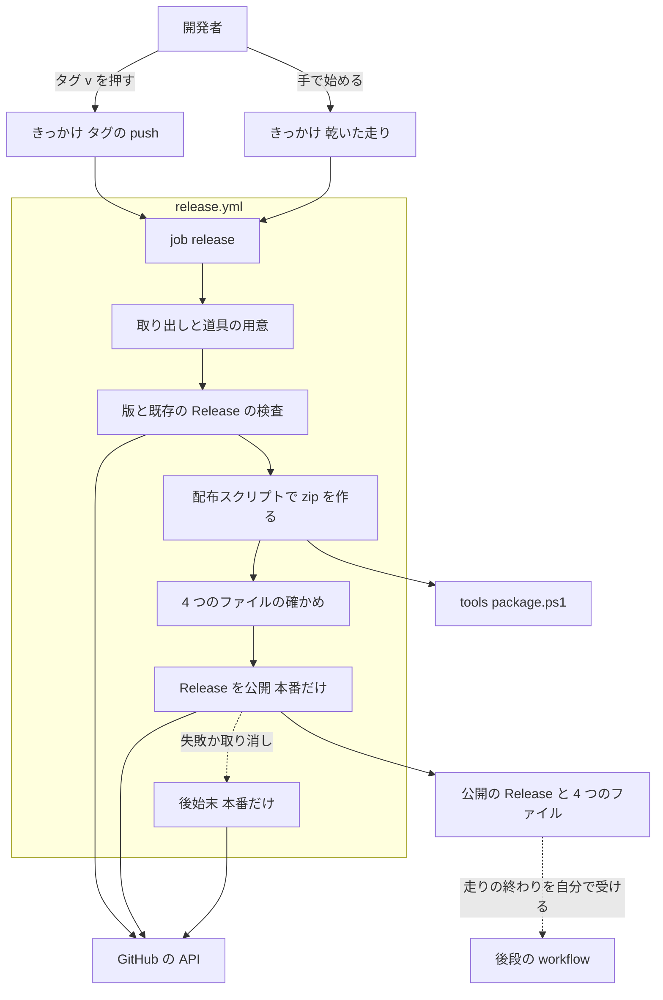
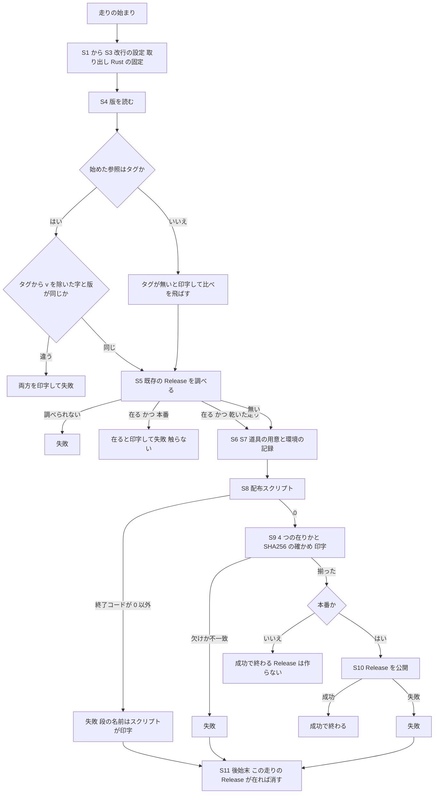
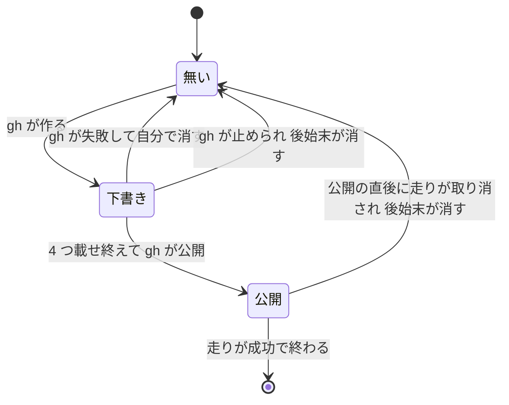

# Design Document: areka-P0-release-ci-workflow

> 2026-10-03・基準コミット `2d2fbc81`（枝 `claude/areka-p0-release-ci-a887d8`）。調べた事実と比べた案の詳細は `research.md`（ギャップ分析の 1〜8 章と、末尾の「設計で決めたこと」）。この文書だけで決定と約束が読めるように、結論はここへ書き直してある。

## Overview

**Purpose**: 開発者が `v` で始まるタグを押したときだけ動く GitHub Actions の workflow を 1 本置き、手元と同じ配布スクリプト `tools/package.ps1` で x64 と arm64 の zip と SHA256 を作り、4 つのファイルを揃えた GitHub Release を公開する。

**Users**: 開発者（`release-cycle` の手順でタグを打つ人）と、後段の workflow（crates.io への公開・winget への提出）を持つ spec。

**Impact**: リポジトリに `.github/workflows/release.yml` が初めて現れる。`tech.md` の「外部 CI は持たない」は「テストの門は手元・ビルドと配布は Actions」に改まる。`crates/`・`tools/`・各 `Cargo.toml`・`Cargo.lock`・`dist/README.txt`・既存のタグ `v0.0.1` の変更は 0。

### Goals

- タグ `v*` の push と、手で始める乾いた走りの 2 つだけで動く workflow を 1 本置く（job は 1 つ・Windows の実行環境 1 本）。
- 版とタグの食い違い・既存の Release・zip の失敗・公開の失敗・時間切れのどれでも、Release を残さずに成功以外で終える。
- 成功で終わったタグの走りは、4 つのファイルを揃えた公開の Release を必ず残す（後段が走りの結果だけで見分けられる）。
- マージの前に、作業の枝で本番と同じ実行環境の上を 1 回緑で通し、手元では確かめられない事柄（日本語の印字・arm64 のリンク・空き容量・所要時間など）を測って証跡に残す。

### Non-Goals

- テストを CI で回すこと（門は手元の `tools/test-all.ps1`）。zip の起動確認（`-Check`）を CI で回すこと。
- 配布スクリプトの直し（直しが要ると分かったら、直す spec を起票して止める）。
- 版を選ぶ・上げる・タグを打つ（`release-cycle`）。後段を呼ぶ・合図を送る。署名。
- Rust の依存のビルドのキャッシュ（タグの走り同士は残り物を共有できず、公開の後に失敗しうる後処理を増やすだけなので持たない）。
- 試し版（`0.0.3-rc.1` の形の版）を Release の画面で「試し版」と印づけること（要件に無い。そういう版のタグを打つかどうかは `release-cycle` が決める）。
- 初回の実走 `v0.0.2`（マージの後に `release-cycle` の初回が起こして見守る）。

## Boundary Commitments

### This Spec Owns

- `.github/workflows/release.yml` の全部: きっかけ・権限・重なりの扱い・時間の上限・段の並び・各段の入出力・失敗と取り消しのときの後始末。
- 後段への約束（「後段への口」）: workflow の名前 `release`・ファイル名 `release.yml`・「タグの push で始まり成功で終わった走り ⇔ そのタグの Release が 4 つを揃えて公開済み」。
- `tech.md` の Testing の節の最後の段落と、`structure.md` の「その他の最上位」の行の書き換え。
- マージ前の実行環境での 1 回の走りと、その証跡 `verification/runner-trial.md`。

### Out of Boundary

- `tools/package.ps1`・`tools/test-all.ps1` を含む `tools/` の下、`crates/` の下、各 `Cargo.toml`、`Cargo.lock`、`dist/README.txt`。変更 0。
- 根に `rust-toolchain.toml` や `.gitattributes` を足すこと（手元の開発にも効くので、Rust の版と改行の扱いは workflow の中だけで閉じる）。
- 後段の workflow（`crates-io.yml`・`winget.yml`）の中身と、後段の brief の書き換え（`crates-io-publish` は自分の枝で直す）。
- 版を上げる PR・タグを打つこと・手元の `-Check`・初回の実走の見守り（`release-cycle`）。
- リポジトリの設定の変更（Actions の権限の既定・タグの保護・secret の登録）。何も変えない。

### Allowed Dependencies

- 配布スクリプト `tools/package.ps1`（スクリプトの版 `2.0.0`）の、次の外から見える約束だけ: 呼び方 `-Arch all`・置き場 `target/package/`・名前 `areka-{版}-{arch}.zip` と `.zip.sha256`・`.sha256` の 1 行の形・終了コード 0〜3・失敗の段の名前の印字・道具が無いと終了コード 3。
- GitHub が用意する物: 実行環境 `windows-2025-vs2026`、そこに入っている `git`・`gh`・`pwsh`・`rustup`・Visual Studio、その走りの一時のトークン（`github.token`）。
- 第三者の action は 2 つだけ: `actions/checkout`（取り出し）と `taiki-e/install-action`（ビルド済みの道具の取り込み）。どちらもコミットの SHA で固定する。これ以外の action を足すときは設計を見直す。
- 長生きするトークン・secret・キャッシュ・成果物の置き場（artifact）には頼らない。

### Revalidation Triggers

次のどれかが変わったら、後段（`crates-io-publish`・`winget-manifest-submission`・`release-cycle`・`release-code-signing`）は自分の前提を確かめ直す。本 workflow 側は乾いた走りを 1 回通し直す。

- workflow の名前 `release`・ファイル名 `release.yml`・きっかけの種類（後段は `workflow_run` でこの名前を名指しし、`event == 'push'` と `conclusion == 'success'` で絞る）。
- Release に添えるファイルの数・名前の形・`.sha256` の形（配布スクリプト側の変更も含む）。
- 「成功 ⇔ 公開済み」の約束に触る変更（公開の段の後ろに段や後処理を持つ action を足す、job を分ける、など）。
- 実行環境の名前・Rust の版・道具 2 つの版・action の SHA の更新（どれも証跡の走りの前提）。
- 配布スクリプトの呼び方・終了コード・置き場の変更。

## Architecture

### Existing Architecture Analysis

- CI は今まで無い（`.github/` が無い）。ビルドと zip の手順はすべて配布スクリプトが持ち、CI 向けの呼び方（`-Arch all`・起動確認なし）と「終了コード 0 のときだけ完成品の名前の物が在る」約束を既に備える。workflow はこれを呼ぶだけで、ビルドの手順を自分では持たない。
- 配布スクリプトは始めと終わりの `git status --porcelain` が同じことを確かめる。workflow は作業ツリーの中（`target/` の外）にファイルを作らない。道具は `~/.cargo/bin`（作業ツリーの外）へ入る。
- 配布スクリプトの印字は日本語。実行環境の PowerShell は出力の文字コードが UTF-8 でないことがあるので、呼ぶ側で出力の文字コードを UTF-8 にしてから呼ぶ（スクリプトには触らない）。
- リポジトリの設定（2026-10-03 に確認）: 公開リポジトリ・workflow のトークンの既定の権限は読み取りだけ・Release は 0 件・リモートの `v*` タグは `v0.0.1` だけ。

### Architecture Pattern & Boundary Map

1 つの workflow・1 つの job・直列の段。「走りの種別」を最初に 1 回だけ決め、以後の段はそれを見て公開するかどうかを分ける。本番と乾いた走りは公開の段と後始末の段を除いて同じ段を通る。



**Architecture Integration**:

- 選んだ形: **1 job・`gh release create` に下書き→添付→公開を任せ、公開の段を最後の普通の段にする**（ギャップ分析の案 A）。gh はファイルを添えて作るとき、下書きで作り、全部載せてから公開し、途中で失敗したら自分の下書きを消す。workflow が足すのは、gh が途中で止められたときの後始末だけ。
- 退けた形: 下書き→照らし合わせ→公開を自前で持つ（案 B・段が増え、消し漏れの経路が広がる。載せる前に手元で SHA256 を照らすので得る物が少ない）／job を分ける（案 C・成果物の上げ下ろしと実行環境が増える。「Windows の実行環境 1 本」の読み方に解釈が要る）。
- 段の向き: 用意 → 検査 → ビルド → 確かめ → 公開。後ろの段は前の段の出力（版・一つ前のタグ・「Release は無かった」の印）だけを読む。前の段は後ろの段を知らない。
- 既存の型の維持: ビルドの手順は配布スクリプトだけが持つ。workflow はファイルの名前を「版」から組み立てて在りかを確かめるだけで、zip を作り直さない。
- steering との整合: テストの門は手元のまま（`tech.md`）。トークンとリモートの URL を記録に出さない（origin の URL に関する手元の決まりと同じ向き）。

### Technology Stack

| Layer | Choice / Version | Role in Feature | Notes |
|-------|------------------|-----------------|-------|
| 実行環境 | GitHub の `windows-2025-vs2026`（Windows Server 2025＋Visual Studio 2026・x64） | job を回す唯一の機械 | `windows-latest` が今指す物を名前で固定する。中身が黙って入れ替わるのを避け、証跡の走りと初回の実走の前提を揃える |
| シェル | PowerShell 7（実行環境の物） | 段の本文と配布スクリプト | 日本語を印字する段は最初に出力の文字コードを UTF-8 にする |
| Rust | `1.99.0` を workflow の先頭の 1 か所に書いて固定（`rustup` で入れて既定にする） | ビルド | 手元と同じ版。実行環境に入っている版（1.98.1）は使わない。版を上げるのは本ファイルの 1 行の書き換え＋乾いた走り |
| 道具 | `cargo-about` 0.9.2・`cargo-deny` 0.20.2（ビルド済みの実行ファイル） | 配布スクリプトの前提 | `taiki-e/install-action`・`fallback: none`（ビルド済みが取れなければ失敗。ソースからは組まない）・チェックサムの検査は既定の有効のまま |
| action | `actions/checkout`・`taiki-e/install-action`（どちらも 40 桁の SHA で固定・横に版の名前を注記） | 取り出し・道具 | 後処理を持つのは `actions/checkout` だけで、その後処理は失敗しても警告で終わる（走りを失敗にしない） |
| Release | 実行環境の `gh`（2.101 系）＋ `github.token` | 既存の Release の調べ・公開・後始末 | 権限は `contents: write` だけ。トークンは gh を使う 3 つの段にだけ渡す |

## File Structure Plan

### Directory Structure

```
.github/
└── workflows/
    └── release.yml            # 新規。リリース workflow の全部（きっかけ・権限・段）
.kiro/
├── steering/
│   ├── tech.md                # 変更。Testing の節の最後の段落
│   └── structure.md           # 変更。「その他の最上位」の行に .github/ を足す
└── specs/areka-P0-release-ci-workflow/
    └── verification/
        └── runner-trial.md    # 新規。実行環境での走りの証跡と静的な確かめの結果
```

### Modified Files

- `.kiro/steering/tech.md` — 「**外部 CI は持たない**」で始まる段落を、「テストの門は手元のフルテストのまま。ビルドと配布だけを GitHub Actions に乗せる（タグ `v*` のときだけ・`.github/workflows/release.yml`）。zip の起動確認（`-Check`）は窓を出すので CI では回さず、手元で通す」の趣旨に改める。2026-09-24 に見送った経緯（GUI・WUC・GPU のテストがホスト型の実行環境で同じ水準を確かめられない）は、テストの門の話として残す。
- `.kiro/steering/structure.md` — 「その他の最上位」の行に「`.github/`＝GitHub Actions の定義（`workflows/release.yml`＝タグ `v*` で動くリリース。zip と SHA256 を作って GitHub Release を公開する）」を足す。

新しいスクリプトのファイルは作らない（段の本文は `release.yml` の中に書く。`tools/` は変更 0）。

## System Flows

### 走りの流れ



- **本番**とは「きっかけが push で、始めた参照がタグ」の走り。それ以外（手で始めた走り・要件 9 の一時的なきっかけ）はすべて乾いた走りとして振る舞う。分け方は 1 か所（job の環境変数 `PUBLISH`）で決め、公開の段と後始末の段だけがそれを見る。
- 後始末（S11）は、失敗か取り消しで、かつ S5 が「Release は無かった」の印を出した本番の走りでだけ動く。S5 より前で止まった走りと、既存の Release を見つけて止まった走りでは動かない（既に在った物に触らない）。
- 時間切れは段ごとの上限で起きるように組む（段の上限の合計が job の上限より小さい）。段の時間切れはその段の失敗になり、後始末が普通の失敗の経路で動く。

### Release の状態



「公開」に入るのは 4 つを載せ終えた後だけ。成功以外で終わる走りは、後始末（S11）が動いて成功した限り「無い」へ戻る。残りうるのは 2 つの場合だけ: S11 自身が失敗したときと、S10 が終わった後・`actions/checkout` の後処理の最中に走りが取り消されたとき（S11 の条件はもう評価済みで動かない）。どちらも Error Handling の表に挙げる。タグはどの遷移でも触らない。

## Requirements Traceability

| Requirement | Summary | Components | Interfaces | Flows |
|-------------|---------|------------|------------|-------|
| 1.1 | タグの指すコミットだけで始める | きっかけ・S2 取り出し | `on.push.tags: ['v*']`・取り出しは始めた参照のまま | 走りの流れ |
| 1.2 | PR・枝への push で動かない | きっかけ | `on` に `pull_request` と `push.branches` を書かない | − |
| 1.3 | タグ・版・コミットに触らない・版の入力を持たない | きっかけ・S10・S11 | `workflow_dispatch` は入力なし・`--verify-tag`・削除はタグを残す・`git push` を持たない | Release の状態 |
| 1.4 | きっかけは 2 つだけ | きっかけ | `on` の鍵は `push`（`tags` だけ）と `workflow_dispatch` | − |
| 2.1 | タグの版と `Cargo.toml` の版を文字どおり比べる | S4 版の検査 | 出力 `version` | 走りの流れ |
| 2.2 | 不一致は zip の前に止め、両方を印字 | S4 | 失敗の印字の形 | 走りの流れ |
| 2.3 | 既存の Release（下書きを含む）で止め、触らない | S5 既存の Release の検査 | 出力 `absent` | 走りの流れ |
| 3.1 | `-Arch all` で 4 つを得る | S8 zip を作る | 配布スクリプトの呼び方 | 走りの流れ |
| 3.2 | 0 以外か欠けで Release を作らず、段の名前を残す | S8・S9 | 終了コード・4 つの在りか | 走りの流れ |
| 3.3 | `-Check` を呼ばない | S8 | 引数は `-Arch all` だけ | − |
| 3.4 | 道具を揃える・ソースから組み直さない・残り物を前提にしない | S3 Rust の固定・S6 道具の用意 | `fallback: none`・キャッシュなし | − |
| 3.5 | arm64 の道具が無ければ x64 だけで出さない | S7 環境の記録・S8 | 配布スクリプトの終了コード 3 | 走りの流れ |
| 4.1 | 一つ前の `v*` タグからのノートつき・公開で作り 4 つを添える | S5（一つ前のタグ）・S10 | 出力 `prev_tag`・`gh release create` の引数 | Release の状態 |
| 4.2 | 添える物はスクリプトが作った物そのもの・`.sha256` が合う | S9・S10 | SHA256 の計算し直し・同じ置き場の 4 つを渡す | − |
| 4.3 | 途中で失敗したら下書きも公開も残さない | S10・S11 後始末 | 後始末の条件 | Release の状態 |
| 4.4 | 一部だけの Release を公開にしない | S10 | gh の「下書き→全部載せる→公開」 | Release の状態 |
| 5.1 | 乾いた走りは同じ手順で Release もタグも作らない | 走りの種別・S10 の条件 | `PUBLISH` | 走りの流れ |
| 5.2 | 枝で始めたら比べを飛ばして印字 | S4 | 「タグが無い」の印字 | 走りの流れ |
| 5.3 | タグで始めて Release が在っても止まらない | S5 | 乾いた走りでは印字だけ | 走りの流れ |
| 5.4 | 4 つの名前と SHA256 を印字 | S9 | 印字の形 | − |
| 6.1 | 長生きするトークンを置かない | 権限 | `github.token` だけ・`secrets.` を参照しない | − |
| 6.2 | トークン・リモートの URL を出さない | S2・全段 | `persist-credentials: false`・`git remote` を呼ばない・トークンは 3 段だけ | − |
| 6.3 | 権限は中身への書き込みだけ | 権限 | `permissions: contents: write` | − |
| 6.4 | 無料枠・Windows の実行環境 1 本 | job | job は 1 つ・`runs-on` は 1 つ | − |
| 6.5 | 上限の時間で止め、Release を作らず失敗 | 時間の上限・S11 | 段と job の `timeout-minutes` | 走りの流れ |
| 7.1 | `tech.md` を改める | 文書 | Modified Files | − |
| 7.2 | `structure.md` に `.github/` を足す | 文書 | Modified Files | − |
| 8.1 | 成功で終わったタグの走り ⇒ 4 つ揃いの公開の Release | S9・S10 | 後段への口 | Release の状態 |
| 8.2 | 公開できなかったタグの走り ⇒ 成功以外 | S4・S5・S8・S9・S10・時間の上限 | どの失敗も段の失敗になる | 走りの流れ |
| 8.3 | 公開の後に失敗しうる手順を持たない | 段の並び・action の選び方 | S10 が最後の普通の段・後処理は `actions/checkout` だけ | − |
| 8.4 | 乾いた走りは「手で始めた」のまま | きっかけ | `workflow_dispatch` | − |
| 8.5 | 後段を呼ばない・合図を送らない | 全体 | 呼び出しと合図の手順を持たない | − |
| 9.1 | マージ前に実行環境で 1 回緑・証跡 | 実行環境での確かめ | `verification/runner-trial.md` | − |
| 9.2 | 一時的なきっかけを残さない | 実行環境での確かめ・きっかけ | 走らせた版と最終版の差が、きっかけの行だけ | − |
| 9.3 | 完了は 9.1 の 1 回と静的な確かめで判定 | 実行環境での確かめ | Testing Strategy | − |

## Components and Interfaces

| Component | Domain/Layer | Intent | Req Coverage | Key Dependencies (P0/P1) | Contracts |
|-----------|--------------|--------|--------------|--------------------------|-----------|
| きっかけ・権限・重なり・時間の上限 | workflow の頭 | いつ・どの権限で・どれだけの時間動くかを決める | 1.1〜1.4, 5.1, 6.1, 6.3〜6.5, 8.4, 8.5 | GitHub Actions (P0) | Batch, State |
| 用意の段（S1〜S3・S6・S7） | job | 取り出し・Rust・道具・環境の記録 | 1.1, 3.4, 3.5, 6.2, 9.1 | `actions/checkout` (P0)・`taiki-e/install-action` (P0)・`rustup` (P0) | Batch |
| 検査の段（S4・S5） | job | 版とタグの一致・既存の Release・一つ前のタグ | 2.1〜2.3, 4.1, 5.2, 5.3 | `cargo metadata` (P0)・GitHub の API (P0) | Service |
| ビルドと確かめの段（S8・S9） | job | 配布スクリプトを呼び、4 つを確かめて印字する | 3.1〜3.3, 3.5, 4.2, 5.4, 8.1 | `tools/package.ps1` (P0) | Service |
| 公開と後始末の段（S10・S11） | job | Release を公開する・成功以外なら残さない | 1.3, 4.1〜4.4, 6.5, 8.1〜8.3 | `gh` (P0)・GitHub の API (P0) | Service, State |
| 文書の改め | steering | `tech.md`・`structure.md` | 7.1, 7.2 | − | − |
| 実行環境での確かめ | 証跡 | マージ前の 1 回の走りと静的な確かめ | 9.1〜9.3 | 開発者の了承 (P0) | Batch |

### workflow の頭

#### きっかけ・権限・重なり・時間の上限

| Field | Detail |
|-------|--------|
| Intent | 走りを始める条件と、走りが持つ権限・時間・重なりの扱いを 1 か所で決める |
| Requirements | 1.1, 1.2, 1.3, 1.4, 5.1, 6.1, 6.3, 6.4, 6.5, 8.4, 8.5 |

**Responsibilities & Constraints**

- workflow の名前は `release`（後段が名指しする名前。変えない）。
- `on` の鍵は 2 つだけ: `push`（`tags: ['v*']` だけ。`branches` を書かない）と `workflow_dispatch`（入力なし）。`pull_request`・`release`・`schedule`・`workflow_run`・`repository_dispatch` を書かない。
- `permissions` は workflow の頭に `contents: write` の 1 行だけ。`secrets.` を参照しない。トークンは `github.token` を、gh を使う段（S5・S10・S11）の環境変数 `GH_TOKEN` としてだけ渡す。
- job は `release` の 1 つ。`runs-on: windows-2025-vs2026`。
- 走りの種別: job の環境変数 `PUBLISH` を「きっかけが `push` かつ始めた参照の種別が `tag`」のとき `true`、それ以外は `false` にする。main へ入る定義では `push` はタグでしか起きないが、要件 9 の一時的なきっかけ（枝への push）でも公開しないよう、参照の種別も見る。
- 固定する値は workflow の頭の環境変数に 1 か所ずつ書く: `RUST_TOOLCHAIN: 1.99.0`。道具の版（0.9.2・0.20.2）は S6 の 1 行に書く。

**Contracts**: Batch [x] / State [x]

##### Batch / Job Contract

- Trigger: タグ `v*` の push（本番）／`workflow_dispatch`（乾いた走り・枝でもタグでも選べる。ただし選んだ参照のコミットに `release.yml` が在ること＝`v0.0.1` では始められない）。
- Input / validation: 入力は始めた参照だけ。版の入力は無い。
- Output / destination: 本番の成功＝公開の Release と 4 つのファイル。乾いた走りの成功＝走りの記録の印字だけ（Release も成果物の置き場も使わない）。
- Idempotency & recovery: 同じタグで走り直すと、公開済みなら S5 が止める（同じ版で出し直さない）。成功以外で終わった走りは Release を残さないので、走り直しは最初からやり直しになる。走り直すかどうかは `release-cycle` が決める。

##### State Management

- 重なり: `concurrency` の組は「`release-` ＋始めた参照」・`cancel-in-progress: false`。同じタグの走りは同時に 1 つだけ動く（後から来た方は待つ）。これが後始末の「S5 の後に現れた Release はこの走りの物」の前提。
- 時間の上限（`timeout-minutes`）:

| 対象 | 上限（分） | 根拠 |
|---|---|---|
| S3 Rust の固定 | 10 | 落として入れるだけ |
| S5 既存の Release の検査 | 5 | API の呼び出し 2 つ |
| S6 道具の用意 | 10 | ビルド済みを落とすだけ |
| S8 zip を作る | 90 | 冷えたビルドの見積もり 20〜40 分の 2 倍強 |
| S10 Release を公開 | 10 | 数十 MB の 4 つを載せる |
| S11 後始末 | 5 | API の呼び出し 2 つ |
| job 全体 | 150 | 段の上限の合計（130）より大きい最後の歯止め |

上限を持たない段（S1・S2・S4・S7・S9）は合計に入れていない。どれも数十秒で終わる段で、合わせて 20 分を超えない限り job の上限は段の上限より先に来ない。

実行環境での走り（要件 9.1）で S8 の所要時間が 45 分を超えたら、S8 を「測った値の 2 倍を 10 分単位に切り上げ」、job を「段の合計＋20」に改めてからマージする。45 分以下なら上の値のまま。

**Implementation Notes**

- Integration: 後段への口は「名前 `release`・`event == 'push'`・`conclusion == 'success'`」。タグの名前は後段が走りの `head_branch` から読める。本 workflow は何も送らない。
- Validation: `on` の鍵・`permissions`・`secrets.` の不在・`uses:` の SHA は静的な確かめ（Testing Strategy）。
- Risks: 段の時間切れが「その段の失敗」として扱われ後始末が動く、は GitHub の決まりに頼る（実行環境では Release を作らないので削除の経路は通せない）。job 全体の上限は段の上限より先に来ないよう合計より大きくしてある。

### job の段

段の一覧（上から順に 1 回ずつ。番号は説明のための呼び名で、ファイルには日本語の段の名前を書く）:

| 段 | 名前 | 動く条件 | トークン | 出力 |
|---|---|---|---|---|
| S1 | 改行の設定 | 常に | なし | − |
| S2 | 取り出し | 常に | なし（`persist-credentials: false`） | − |
| S3 | Rust の固定 | 常に | なし | − |
| S4 | 版の検査 | 常に | なし | `version` |
| S5 | 既存の Release の検査 | 常に | あり | `absent`・`prev_tag` |
| S6 | 道具の用意 | 常に | なし | − |
| S7 | 環境の記録 | 常に | なし | − |
| S8 | zip を作る | 常に | なし | − |
| S9 | 4 つの確かめ | 常に | なし | − |
| S10 | Release を公開 | `PUBLISH` が `true` | あり | − |
| S11 | 後始末 | 失敗か取り消し、かつ `PUBLISH` が `true`、かつ S5 の `absent` が `true` | あり | − |

S10 が成功の経路で最後に動く段。S10 の後ろに在るのは S11（成功のときは動かない）と `actions/checkout` の後処理（失敗しても警告で終わる）だけ。

#### 用意の段（S1〜S3・S6・S7）

| Field | Detail |
|-------|--------|
| Intent | 配布スクリプトが要る物を、作業ツリーを汚さずに揃え、実行環境の様子を記録に残す |
| Requirements | 1.1, 3.4, 3.5, 6.2, 9.1 |

**Responsibilities & Constraints**

- S1 改行の設定: 取り出す前に、実行環境の `core.autocrlf` の元の値と出どころを印字し、`git config --global core.autocrlf true` にする（手元の Git と同じ。zip に入る `README.txt` などの改行を手元で確かめた形に揃える）。作業ツリーの外の設定なので `git status` に影響しない。
- S2 取り出し: `actions/checkout`（SHA で固定）・`persist-credentials: false`・参照の指定なし（始めた参照のコミットをそのまま取り出す）・サブモジュールなし・深さは既定の 1。
- S3 Rust の固定: `RUST_TOOLCHAIN` の版を `rustup` で最小の構成で入れ、既定にする。i686 と arm64 のターゲットは配布スクリプトが自分で足すので、ここでは足さない。
- S6 道具の用意: `taiki-e/install-action`（SHA で固定）に `cargo-about@0.9.2,cargo-deny@0.20.2` と `fallback: none` を渡す。ビルド済みの実行ファイルが取れなければこの段が失敗する（ソースから組む経路へ落ちない）。置き場は `~/.cargo/bin`。
- S7 環境の記録: 実行環境の版（イメージの版）・`rustc`／`cargo`／`cargo about`／`cargo deny`／`gh` の版・arm64 のリンクの道具の在りか（配布スクリプトと同じ `vswhere` の問い方）・作業ドライブの空き容量を印字する。印字だけで、合否は付けない（arm64 の道具が無いときに止めるのは配布スクリプトの終了コード 3）。この段は本番でも残す（各リリースの記録になる）。
- arm64 のリンクの道具を足す段は持たない。実行環境の一覧に在ることを確かめてあり、無ければ S8 が止まって Release は作られない。
- キャッシュの action は使わない。

**Dependencies**

- External: `actions/checkout` — 取り出し (P0)。後処理は認証の後片付けで、失敗は警告になる（公式のソースで確認）。
- External: `taiki-e/install-action` — 道具 2 つ (P0)。後処理を持たない。両方とも対応する道具の一覧に在り、Windows のビルド済みを作者の GitHub Releases から取り、チェックサムを確かめる。
- External: `rustup`（実行環境の物）— Rust の版の固定 (P0)。

**Contracts**: Batch [x]

##### Batch / Job Contract

- Trigger: 走りの始まり。
- Input / validation: `RUST_TOOLCHAIN`・道具の版。
- Output / destination: 既定の Rust が固定の版・`cargo about`／`cargo deny` が PATH に在る・作業ツリーは取り出したままの状態（`git status --porcelain` が空）。
- Idempotency & recovery: どの段も失敗したら走りが止まる。やり直しは走り直し。

**Implementation Notes**

- Integration: action の SHA は実装のときに、その時点の最新の版のタグが指すコミットを GitHub の API で引いて書き、横に版の名前を注記する。引いた値は証跡に残す。
- Validation: 実行環境での走りで、S7 の印字（arm64 の道具が在った・空き容量・Rust の版）と S1 の元の値を証跡へ写す。
- Risks: 固定した Rust の版が Visual Studio 2026 のリンカを見つけられない場合は S8 が赤になる。そのときは実行環境を `windows-2022`（Visual Studio 2022）へ替える案を開発者へ上げて止める（黙って替えない）。

#### 検査の段（S4・S5）

| Field | Detail |
|-------|--------|
| Intent | zip を作る前に、版とタグの食い違いと既存の Release を見つけて止め、後ろの段へ「版」「一つ前のタグ」「Release は無かった」を渡す |
| Requirements | 2.1, 2.2, 2.3, 4.1, 5.2, 5.3 |

**Responsibilities & Constraints**

- 入力は環境変数だけ（`GITHUB_REF_TYPE`・`GITHUB_REF_NAME`・`GITHUB_REPOSITORY`・`PUBLISH`・`GH_TOKEN`）。GitHub の式を本文の中に埋め込まない（手元の PowerShell で環境変数を差し替えて同じ本文を回せるようにする）。
- 版の読み方は配布スクリプトと同じ: `cargo metadata --no-deps --locked --format-version 1` の `areka` パッケージの `version`。`areka` は `version.workspace = true` で `[workspace.package] version` を継ぐので、要件 2.1 の比べる相手と同じ値で、かつ zip の名前に入る値とも同じになる。
- 比べは大文字小文字を区別する文字列の一致。版の形の検査は足さない（形の検査は配布スクリプトが持つ）。
- 既存の Release は、Release の一覧（下書きを含む）を API で全部取り、`tag_name` がタグの名前と一致する物を探す。「取れたが無い」と「取れなかった」を終了コードで分ける。取れなかったら本番でも乾いた走りでも失敗で止まる。この「タグの名前で Release を探す」呼び出しは S11 でも使う。2 か所は 1 字違わず同じ行にする（静的な確かめで比べる）。
- 既に在った Release には読み取り以外をしない。

**Contracts**: Service [x]

##### Service Interface

段の入出力を型の形で書く（実装は PowerShell の本文）。

```typescript
// S4 版の検査
type RefType = 'tag' | 'branch';
interface VersionCheckInput {
  refType: RefType;      // GITHUB_REF_TYPE
  refName: string;       // GITHUB_REF_NAME（タグなら 'v0.0.2' の形）
}
type VersionCheckResult =
  | { ok: true; version: string; compared: boolean }           // compared=false は枝で始めたとき
  | { ok: false; reason: 'mismatch'; tagVersion: string; cargoVersion: string }
  | { ok: false; reason: 'unreadable'; detail: string };

// S5 既存の Release の検査
interface ReleaseGuardInput {
  publish: boolean;      // PUBLISH
  refType: RefType;
  refName: string;
  version: string;       // S4 の出力
  repository: string;    // GITHUB_REPOSITORY
}
type ReleaseGuardResult =
  | { ok: true; absent: boolean; prevTag: string | null }      // absent=true は「調べて無かった」
  | { ok: false; reason: 'exists'; releaseUrl: string; draft: boolean }
  | { ok: false; reason: 'lookup-failed'; detail: string };
```

- S4 の事前条件: 取り出しと Rust の固定が済んでいる。
- S4 の事後条件: 成功なら出力 `version` が入る。タグで始めた走りでは「タグの名前から先頭の `v` を 1 字除いた文字列」と `version` が一致している。枝で始めた走りでは「タグが無いので比べを飛ばす」と版を印字する。不一致は「タグの版」と「`Cargo.toml` の版」の両方を印字して失敗（タグ `v` は空文字との比べ、`v0.0.2-x` はそのままの比べで落ちる）。
- S5 の事前条件: S4 が成功。
- S5 の事後条件:
  - タグで始めた走りで、そのタグの Release（下書きを含む）が在る: 本番は「既に在る」と URL と下書きかどうかを印字して失敗（出力 `absent` は出さない）。乾いた走りは同じ印字をして続ける。
  - 枝で始めた走りは `v{版}` の Release を探し、在れば印字して続ける（乾いた走りなので止めない）。
  - 無いことを確かめたら出力 `absent=true`。
  - 一つ前のタグ: リモートの `v` で始まるタグを API で全部取り、`v` を除いた部分が版として読める物のうち、`version` より小さい最大の物を出力 `prev_tag` にする。版の読み方と比べ方は PowerShell 7 の `[semver]`（`0.0.3-rc.1` の形の付記つきも読める。`[version]` は付記つきを読めずに落ちるので使わない）。読めないタグ（`v`・`vfoo` など）は黙って飛ばす。決める部分は「タグの名前の並び」と「版」を受けて答えを返す関数にまとめ、API の呼び出しと分ける（手元で並びを差し替えて回せるようにする）。1 つも無ければ空（そのとき S10 は始まりのタグを渡さない）。初回の `v0.0.2` では `v0.0.1` になる。乾いた走りでも求めて印字する（実行環境での走りで通しておくため）。
- 不変条件: 2 つの段は読むだけで、リポジトリにも Release にも書かない。

**Implementation Notes**

- Integration: gh の呼び出しは `gh api`（Release の一覧・タグの一覧）。`gh release view` は「無い」と「調べられない」が同じ終了コードになるので使わない。
- Validation: S4 の本文は手元で環境変数を差し替えて 5 通り回す。S5 の一つ前のタグを決める関数は手元で 6 通り回す（どちらも Testing Strategy）。S5 の全体は実行環境での走りで「Release 0 件・一つ前のタグ `v0.0.1`」の印字を確かめる。
- Risks: 下書きは書き込みの権限を持つトークンにだけ見える（GitHub の決まり）。本 workflow のトークンは `contents: write` なので見える前提だが、実行環境での走りでは Release を作らないので確かめられない。今は下書きが 0 件で、下書きを作るのは本 workflow の S10 だけなので、見えなかった場合の害は「止められた gh の残した下書きを後始末が見つけられない」に限られる。初回の実走を見守る `release-cycle` へ申し送る。

#### ビルドと確かめの段（S8・S9）

| Field | Detail |
|-------|--------|
| Intent | 配布スクリプトを起動確認なしで呼び、できた 4 つが揃っていて `.sha256` が合うことを確かめて印字する |
| Requirements | 3.1, 3.2, 3.3, 3.5, 4.2, 5.4, 8.1 |

**Responsibilities & Constraints**

- S8: 配布スクリプトを別の PowerShell のプロセスで、引数 `-Arch all` だけで呼ぶ（`-Check`・`-CheckDir`・`-KeepExpanded`・`-SmokeExitMs` を付けない）。呼ぶ前にそのプロセスの出力の文字コードを UTF-8 にする。スクリプトの終了コードをそのまま段の終了コードにする。トークンは渡さない。`CARGO_TARGET_DIR`・`RUSTFLAGS` を設定しない。
- S9: `version` から 4 つの名前（`areka-{版}-x64.zip`・`areka-{版}-x64.zip.sha256`・`areka-{版}-arm64.zip`・`areka-{版}-arm64.zip.sha256`）を組み立て、`target/package/` に 4 つとも在ることを確かめる。各 zip の SHA256 を計算し直し、`.sha256` の 1 行（小文字の 16 進 64 字・空白 2 つ・zip のファイル名）と一致することを確かめる。欠けか不一致なら、どれがどう違うかを印字して失敗。揃っていれば 4 つの名前と各 zip の SHA256、作業ドライブの空き容量を印字する（本番でも乾いた走りでも）。
- S9 は読むだけで、4 つのファイルを書き換えない・作り直さない。S10 は同じ置き場の同じ 4 つを渡す。

**Dependencies**

- Outbound: `tools/package.ps1` — ビルド・zip・SHA256・失敗の段の名前の印字・arm64 の道具が無いときの終了コード 3 (P0)。

**Contracts**: Service [x]

##### Service Interface

```typescript
interface PackageRunResult {
  exitCode: 0 | 1 | 2 | 3;   // 配布スクリプトの終了コード（2 は -Check を付けないので起きない）
}
interface ArtifactSet {
  version: string;
  files: [
    { name: `areka-${string}-x64.zip`; sha256: string },
    { name: `areka-${string}-x64.zip.sha256` },
    { name: `areka-${string}-arm64.zip`; sha256: string },
    { name: `areka-${string}-arm64.zip.sha256` },
  ];
}
type ArtifactCheckResult =
  | { ok: true; artifacts: ArtifactSet }
  | { ok: false; reason: 'missing'; names: string[] }
  | { ok: false; reason: 'sha256-mismatch'; name: string; expected: string; actual: string };
```

- 事前条件: S4 が `version` を出している。道具と Rust が揃っている。作業ツリーは取り出したまま。
- 事後条件: S9 が成功なら、`target/package/` に 4 つが在り、各 `.sha256` は隣の zip の SHA256 と一致する。
- 不変条件: workflow は S8 の間、作業ツリーの中にファイルを作らない。

**Implementation Notes**

- Integration: 失敗の段の名前は配布スクリプトが `FAIL {段の名前}` の形で印字する。workflow は付け足さない。
- Validation: 実行環境での走りで、スクリプトの日本語の印字（段の名前）が読めること・4 つの名前と SHA256 の印字・所要時間を証跡へ写す。
- Risks: 日本語が化けた場合は、呼び方（workflow 側）だけを直して走り直す。配布スクリプトに直しが要ると分かったら、本仕様では直さず、直す spec を起票して止める。空き容量が足りずに S8 が赤になった場合も同じく開発者へ上げて止める。

#### 公開と後始末の段（S10・S11）

| Field | Detail |
|-------|--------|
| Intent | 4 つを添えた Release を公開する。成功以外で終わる本番の走りは、この走りが作った Release を残さない |
| Requirements | 1.3, 4.1, 4.2, 4.3, 4.4, 6.5, 8.1, 8.2, 8.3 |

**Responsibilities & Constraints**

- S10: `gh release create v{版}` に 4 つのファイルを渡し、`--repo`（`GITHUB_REPOSITORY` を名指し。作業ツリーのリモートからの推し量りに頼らない）・`--verify-tag`（タグがリモートに無ければ止まる＝workflow がタグを作らない）・`--generate-notes`・`--notes-start-tag {prev_tag}`（`prev_tag` が空なら付けない）・`--title v{版}` を付ける。`--draft`・`--target`・`--latest` は付けない。gh は下書きで作り、4 つを載せ終えてから公開し、途中で失敗したら自分の下書きを消す。
- S11: Release の一覧（下書きを含む）からこのタグの物を探し（S5 と同じ行の呼び出し）、在れば **Release の番号を名指しして** 消す（下書きでも公開でも）。タグは消さない。無ければ「残っていない」と印字して終わる。S11 自身が失敗したら、残っているおそれがあることと、開発者が手で確かめる先（Release の一覧）を印字して失敗で終える。
- S11 が公開済みの物も消す理由: S11 が動くのは走りが成功以外で終わるときだけで、そのとき後段は動かない。公開の直後に取り消された走りで Release だけが残ると「Release が在るのに結果が成功でない」食い違いになるので、どちらの状態でも残さない（要件 4.3 の「下書きとしても公開としても残さず」）。
- S10 と S11 のほかに Release へ書く段は無い。`git push`・`git tag` を呼ぶ段は無い。

**Dependencies**

- External: `gh release create`（実行環境の gh）— 下書き→添付→公開・失敗のときの下書きの削除 (P0)。
- External: GitHub の API（Release の一覧・Release の削除）(P0)。

**Contracts**: Service [x] / State [x]

##### Service Interface

```typescript
interface PublishInput {
  version: string;            // S4
  prevTag: string | null;     // S5
  files: string[];            // S9 が確かめた 4 つの絶対パス
}
type PublishResult =
  | { ok: true; releaseUrl: string }
  | { ok: false; detail: string };     // gh の終了コードが 0 以外

interface CleanupInput {
  tag: string;                // GITHUB_REF_NAME
  repository: string;
}
type CleanupResult =
  | { ok: true; deleted: boolean }      // deleted=false は「残っていなかった」
  | { ok: false; detail: string };      // 調べられない・消せない
```

- S10 の事前条件: `PUBLISH` が `true`・S5 の `absent` が `true`・S9 が成功。
- S10 の事後条件: 成功なら、タグ `v{版}` の Release が公開の状態で在り、4 つのファイルを持ち、ノートは `prev_tag` からの変更で自動生成されている。失敗なら gh が自分の下書きを消している（消せなかった分は S11）。
- S11 の事前条件: 走りが失敗か取り消し・`PUBLISH` が `true`・S5 の `absent` が `true`（＝始めに無かったことを確かめてある）・同じタグの走りが同時に動いていない（`concurrency`）。
- S11 の事後条件: 成功なら、このタグの Release は下書きとしても公開としても無い。タグは在る。

##### State Management

- State model: 「Release の状態」の図のとおり（無い → 下書き → 公開、成功以外なら無いへ戻す）。
- Persistence & consistency: 状態は GitHub の側だけに在る。workflow は状態を持たず、毎回 API で調べる。
- Concurrency strategy: タグごとの `concurrency` の組で、同じタグの走りを直列にする。

**Implementation Notes**

- Integration: 後段は Release を API で読むだけ。本 workflow は公開のほかに何も知らせない。
- Validation: S10 と S11 は実行環境での走りでは動かない（Release を作らないため）。静的な確かめ（引数・条件の式・並び順）で判定する。S11 の本文だけは、Release が 0 件の今の状態で手元から 1 回回し、「残っていない」と印字して終わることを確かめる（読むだけで何も消えない）。消す経路と S10 が初めて動くのは `release-cycle` の初回の実走。この残りは証跡に明記する。
- Risks: 公開の直後の数秒に走りが取り消されると、公開済みの Release を S11 が消す。意図した動きだが、その間に Release を見た人には消えて見える。リポジトリで「公開した Release を変えられなくする設定」を有効にすると S11 は公開済みの物を消せなくなる（今は無効。有効にするときは本設計を見直す）。

### 文書の改め

要件 7.1・7.2。中身は File Structure Plan の Modified Files のとおり。`tech.md` の「マルチアーキテクチャ・ターゲット」の節と `roadmap.md` は変えない（`roadmap.md` の「配布と公開」節は既に同じ趣旨）。

### 実行環境での確かめ

| Field | Detail |
|-------|--------|
| Intent | 手元では動かせない workflow を、マージの前に本番と同じ実行環境で 1 回通し、測った値を証跡に残す |
| Requirements | 9.1, 9.2, 9.3 |

**Responsibilities & Constraints**

- 押す前の前提: `.github/workflows/` の下のファイルを含む push は、押すのに使うトークンが workflow を書く権限を持たないと GitHub に断られる。手元の origin が使うトークンの権限は値に触れずには確かめられないので、最初の push で分かる。断られたら、どのトークンで押すかを開発者に決めてもらって止める（設定は変えない・トークンの値を印字しない）。断られても何も壊れない。
- コミットの順番: 一時的なきっかけの行は、押す直前のコミットで足し、緑を見た次のコミットで外す。きっかけが在る間は、workflow に関係の無い push でも数十分の走りが始まるので、その間にほかの変更を押さない。
- 作業の枝の `release.yml` の `on.push` に、一時的に `branches: ['claude/areka-p0-release-ci-a887d8']` を足して押す。この走りは「push・参照の種別は枝」なので `PUBLISH` は `false`＝乾いた走りと同じ道を通る（S10・S11 は動かない）。一時的に足すのはこの行だけで、段には手を入れない。
- **作業の枝を押すたびに、その時点で開発者の了承を得る**。一時的なきっかけが在る間は、押すたびに 1 回の走り（数十分）が始まる。
- 走りの記録は `gh run view` で読み、次を `verification/runner-trial.md` に写す:

| 測る物 | 出どころ | 合格の線 |
|---|---|---|
| 走りの URL・コミット・結果 | `gh run view` | 結果が成功 |
| 実行環境の版・Rust と道具の版 | S7 | 固定した値と一致 |
| arm64 のリンクの道具が在ったか | S7 | 在る（足す段を持たない設計の前提） |
| 固定した Rust が Visual Studio 2026 のリンカで arm64 と x64 と i686 を組めたか | S8 | S8 が緑 |
| 日本語の印字が読めるか | S4・S8 の記録 | 配布スクリプトの段の名前が化けずに読める（S4 の印字は最初の数分で出る。化けていたら S8 を待たずに走りを取り消して直す） |
| 走りの記録に出るリモートの URL | 取り出しの記録 | `actions/checkout` が自分で印字する公開の URL（トークンを含まない）だけ |
| `core.autocrlf` の元の値 | S1 | 記録だけ |
| 空き容量（始めと終わり） | S7・S9 | 記録だけ（S8 が緑なら足りている） |
| 4 つの名前と各 zip の SHA256 | S9 | 4 つ揃い・`.sha256` と一致 |
| 一つ前のタグ | S5 | `v0.0.1` |
| 所要時間（全体と S8） | `gh run view` | S8 が 45 分を超えたら上限を改める |

- 緑を確かめたら、一時的なきっかけの行を外す。**走らせたコミットの `release.yml` と最終の `release.yml` の差が、きっかけの行だけ**であることを `git diff` で確かめ、結果を証跡に書く（上限の値を改めた場合はその行も差として挙げる）。
- 走りが赤なら、原因が workflow 側にあれば直して押し直す（そのつど了承を得る）。原因が配布スクリプトか実行環境の道具にあれば、開発者へ上げて止める。
- 完了の判定はこの 1 回の緑と静的な確かめで行い、初回の実走 `v0.0.2` の成否は条件にしない。

**Contracts**: Batch [x]

##### Batch / Job Contract

- Trigger: 開発者の了承を得た、作業の枝の push。
- Input / validation: 一時的なきっかけを足した `release.yml`。
- Output / destination: `verification/runner-trial.md`。
- Idempotency & recovery: 何度走らせても Release もタグも作らない。

## Data Models

持つデータは段の間の出力 3 つだけ。

| 名前 | 出す段 | 形 | 読む段 |
|---|---|---|---|
| `version` | S4 | 版の文字列（例 `0.0.2`） | S5・S9・S10 |
| `absent` | S5 | `true` か、出さない | S11 の条件 |
| `prev_tag` | S5 | タグの名前（例 `v0.0.1`）か空 | S10 |

走りの種別 `PUBLISH`（`true`／`false`）は job の環境変数。ファイルの名前は `version` から組み立てる（配布スクリプトの名前の決め方と同じ形を workflow 側に 1 か所だけ持つ）。

## Error Handling

### Error Strategy

早く止める。どの失敗も「その段の失敗」にして、走りを成功以外で終える。Release を残さないことは、公開の前の失敗では「まだ作っていない」ことで、公開の途中と後の失敗では gh 自身の片付けと S11 で守る。

### Error Categories and Responses

| 起きること | 見つける段 | 走りの記録に出る物 | Release |
|---|---|---|---|
| タグと版の不一致（`v` だけ・付記つきを含む） | S4 | タグの版と `Cargo.toml` の版の両方 | 作らない |
| 版を読めない | S4 | `cargo metadata` の失敗の末尾 | 作らない |
| 既存の Release（本番） | S5 | 既に在ること・URL・下書きかどうか | 既存の物に触らない |
| Release の一覧を取れない | S5 | 取れなかったこと | 作らない |
| ビルド済みの道具が取れない | S6 | action の失敗 | 作らない |
| arm64 の道具が無い・前提の不正 | S8（終了コード 3） | スクリプトの 1 行（何を入れるか） | 作らない |
| ビルド・ライセンス検査・中身の判定などの段の失敗 | S8（終了コード 1） | `FAIL {段の名前}` と出力の末尾 | 作らない |
| 4 つのどれかが無い・`.sha256` が合わない | S9 | どれがどう違うか | 作らない |
| タグがリモートに無い・添付や公開の失敗 | S10 | gh の印字 | gh が下書きを消す・残りは S11 |
| 段の時間切れ・取り消し | 各段 | GitHub の印字 | S11 が消す |
| 後始末の失敗 | S11 | 残っているおそれと、手で確かめる先 | 開発者が手で確かめる |
| S10 が終わった後、`actions/checkout` の後処理の最中の取り消し | 無し（S11 は動かない） | 結果が「取り消し」 | 公開のまま残る。結果が成功でないので後段は動かない。開発者が Release の一覧を手で確かめる |

### Monitoring

走りの記録（GitHub の画面と `gh run view`）がすべて。知らせの仕組みは足さない（失敗した走りの知らせは GitHub の既定の通知）。

## Testing Strategy

手元では workflow を動かせない。確かめは「静的な確かめ」「段の本文を手元で回す確かめ」「実行環境での 1 回の走り」の 3 つに分け、結果はすべて `verification/runner-trial.md` に書く。自動テスト（`cargo test`）は足さない（`crates/`・`tools/` は変更 0）。

### 静的な確かめ（最終の `release.yml` に対して・検索で判定）

1. `on` の鍵が `push` と `workflow_dispatch` の 2 つだけで、`push` の下が `tags: ['v*']` だけ（`branches` が 0 件）・`workflow_dispatch` に入力が無い（1.2・1.3・1.4・8.4・9.2）。
2. `permissions` が `contents: write` の 1 行だけ・`secrets.` の参照が 0 件・`git remote`・`git push`・`git tag` の呼び出しが 0 件・`GH_TOKEN` を持つ段が S5・S10・S11 の 3 つだけ・取り出しに `persist-credentials: false`（1.3・6.1・6.2・6.3）。
3. `uses:` が 2 件だけで、どちらも 40 桁の SHA（3.4・Allowed Dependencies）。キャッシュの action が 0 件・`fallback: none` が在る。
4. 配布スクリプトの呼び出しが 1 件で、引数が `-Arch all` だけ（`-Check` が 0 件）（3.1・3.3）。
5. job が 1 つ・`runs-on` が 1 つ・job と S3・S5・S6・S8・S10・S11 に `timeout-minutes` が在り、段の合計が job の値より小さい（6.4・6.5）。
6. S10 の条件が `PUBLISH`、引数に `--verify-tag`・`--generate-notes`・`--notes-start-tag` が在り `--draft` が無い。S10 の後ろの段が S11 だけで、S11 の条件が「失敗か取り消し・`PUBLISH`・`absent`」。S5 と S11 の「タグの名前で Release を探す」行が 1 字違わず同じ。S10 に `--repo` が在る（2.3・4.1・4.3・4.4・8.3）。
7. 後段を呼ぶ・合図を送る手順（`workflow_call` の利用・`repository_dispatch`・`gh workflow run`）が 0 件（8.5）。
8. 走らせたコミットと最終の `release.yml` の差が、一時的なきっかけの行（と、改めた場合の上限の値）だけ（9.2）。
9. `git diff --stat` で、`crates/`・`tools/`・各 `Cargo.toml`・`Cargo.lock`・`dist/README.txt` の変更が 0（変更 0 の約束）。

### 段の本文を手元で回す確かめ（S4・S5 の一部・S9・S11）

S4 の本文を `release.yml` から取り出し、手元の PowerShell で環境変数を差し替えて回す（今の版は `0.0.1`）。

| 始めた参照 | 期待 |
|---|---|
| タグ `v0.0.1` | 成功・`version=0.0.1` |
| タグ `v0.0.2` | 失敗・`0.0.2` と `0.0.1` の両方を印字 |
| タグ `v` | 失敗・空の版と `0.0.1` を印字 |
| タグ `v0.0.1-x` | 失敗・両方を印字 |
| 枝 `main` | 成功・「タグが無い」と `0.0.1` を印字 |

S5 の一つ前のタグを決める関数を `release.yml` から取り出し、タグの名前の並びを差し替えて回す。

| タグの並び | 今の版 | 期待 |
|---|---|---|
| `v0.0.1` | `0.0.2` | `v0.0.1` |
| `v0.0.1`・`v0.0.2` | `0.0.2` | `v0.0.1`（同じ版のタグは選ばない） |
| `v0.0.2` | `0.0.2` | 空 |
| `v`・`vfoo`・`v0.0.1` | `0.0.2` | `v0.0.1`（読めないタグは飛ばす） |
| `v0.0.1`・`v0.0.2`・`v0.0.3-rc.1` | `0.0.3` | `v0.0.3-rc.1` |
| `v0.0.1`・`v0.0.2` | `0.0.3-rc.1` | `v0.0.2` |

S11 の本文を、手元の `gh`（読み取りだけ）で、Release が 0 件の今の状態で 1 回回し、「残っていない」と印字して終わることを確かめる。

S9 の照らし合わせも、手元の `target/package/` に配布スクリプトで作った 4 つを置いて 1 回通し、`.sha256` を 1 字書き換えた写しで失敗することを 1 回確かめる（写しは `target/` の下に作り、終わったら消す）。

### 実行環境での 1 回の走り（要件 9.1）

「実行環境での確かめ」の表のとおり。本番の道のうち通るのは S1〜S9。通らないのは S10・S11 と、S4・S5 の「タグで始めた」枝で、これらは上の静的な確かめと手元の確かめで判定する。この区別を証跡に明記する。

### 実走でしか確かめられない残り（完了の条件にしない・`release-cycle` へ申し送る）

- S10 が実際に Release を公開できること・自動のノートが `v0.0.1` からの範囲になること。
- S11 が止められた gh の下書きを見つけて消せること（下書きがトークンから見えること）。
- マージの後の乾いた走り（`workflow_dispatch`）が main と、`release.yml` を含むタグで始められること。

## Security Considerations

- トークンは `github.token` だけ。権限は `contents: write` だけ。gh を使う 3 つの段にだけ環境変数で渡し、配布スクリプトと道具の取り込みの段には渡さない。取り出しは `persist-credentials: false` で、`.git/config` にトークンを残さない。
- 書き込みの権限を持つ走りで第三者の action を使うので、2 つとも 40 桁の SHA で固定する（版の名前のタグは後から付け替えられる）。道具の取り込みはチェックサムの検査を有効のままにし、ソースから組む経路（外のコードを実行環境でビルドする）を `fallback: none` で閉じる。
- 走りの記録に出す物は、版・タグの名前・Release の URL・ファイルの名前・SHA256・実行環境の様子だけ。リモートの一覧・環境変数の一覧を印字する手順を持たない。
- 本番のきっかけはタグの push だけで、押せるのはリポジトリへ書き込める人だけ。フォークからの PR では走らない（`pull_request` を持たない）。

## Performance & Scalability

- 見積もり: 冷えたビルドで全体 20〜40 分（手元の温まった状態では 38 秒）。キャッシュは持たないので毎回同じ程度かかる。公開リポジトリの標準の実行環境は無料で、リリースの頻度（開発者がタグを打ったときだけ）に対して十分。
- 上限は「時間の上限」の表のとおり。実測で改める線（S8 が 45 分超）も同じ表の下に書いた。
