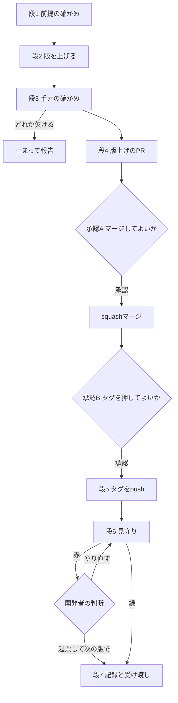

# Design Document: areka-P0-release-cycle

## Overview

**Purpose**: 開発者が `/kiro-impl areka-P0-release-cycle` を打ったときだけ、版を 1 つ上げ、タグを 1 つ打ち、GitHub Release と crates.io への公開までを見届ける、繰り返しの手順を決める。

**Users**: 開発者（リリースの時期を決め、マージとタグを承認する人）と、手順を回す AI（`/kiro-impl` を受けた主文脈）。

**Impact**: 製品のコードは 1 行も足さない。本書は「何を、どの順で、どの道具で行い、どこで止まり、何をどこに記録するか」を決める手順の設計である。使う道具はすべて main に在る物（`tools/test-all.ps1`・`tools/package.ps1`・`tools/crates-io.ps1`・`gh`・`git`・`cargo`）で、新しいスクリプトは 0 本。

### Goals

- 1 回の実行で 1 回のリリースだけを行う、毎回同じ 7 つの段を決める。
- 取り返しのつかない操作（PR のマージ・タグの push）の前に、必ず開発者の明示の承認で止まる。
- 版上げの PR に版上げ以外を混ぜず、main の `tasks.md` を常に未完了のままに保つ。
- 記録（roadmap の 1 行）を、記録だけの PR を出さずに main へ入れる受け渡しの形を決める。
- 初回（`v0.0.2`）だけの手順を、2 回目以降の手順から切り離して消せる形にする。

### Non-Goals

- workflow のファイル・`tools/` のスクリプト・各クレートのコードの変更（0 件）。
- `.kiro/steering/workflow.md`・`.claude/skills/kiro-complete/SKILL.md`・`.claude/skills/kiro-impl/SKILL.md` など、ほかの spec と分け合う決まりの文書の変更（0 件。要件 1.8）。
- 差分の範囲を判定する専用のスクリプト（作らない。下の「設計で決めたこと」8）。
- 赤の原因の修正（別の spec として起票するだけ）。
- winget の見守りの細部（`winget-manifest-submission` が `winget.yml` を main へ入れた回から、見守る相手が 1 つ増えるだけ）。

## Boundary Commitments

### This Spec Owns

- 繰り返しの手順（7 つの段・止まる点・判定・やり直しの決まり）と、それを写した `tasks.md`。
- この spec だけに効く `/kiro-impl` の読み替え（下の「`/kiro-impl` の読み替え」）。
- 版上げの 1 コミットの中身（根の `Cargo.toml` の 2 行・`Cargo.lock`・`THIRD-PARTY-NOTICES.md`・`dist/README.txt` の「時点」の行）。
- タグ `v{版}`（打つのはこの手順だけ）。
- `.kiro/steering/roadmap.md` の「完了サマリ」の下の小見出し「リリース」と、その表の行。
- 初回だけ: 根の `README.md` の「## 入手と起動」の最初の箇条の 1 行、初回の記録 `verification/first-run.md`。

### Out of Boundary

- `release.yml`・`crates-io.yml`・`winget.yml` の中身と、その赤の原因の修正。
- `tools/package.ps1`・`tools/crates-io.ps1`・`tools/test-all.ps1` の中身。
- Trusted Publishing の設定の値と手順（正本は `doc/crates-io-publish.md` 2 節。本書は写さない）。
- 公開の走りが赤のときの切り分けの中身（正本は同 5 節）。
- 大きい版をいつ上げるかの判断（開発者がその場で指示する）。
- 赤の原因を直す spec の中身（`/kiro-discovery` が brief と roadmap の行を書く。その書き込みは `/kiro-discovery` の成果物で、この手順が書き換える物の数には入れない）。

### Allowed Dependencies

- 手元の道具: `git`・`gh`・`cargo`・cargo-edit（`cargo set-version`。開発者の手元に 0.13.13 が在る）・`pwsh`。
- リポジトリの道具: `tools/test-all.ps1 -License`・`tools/package.ps1 -Check`・`tools/crates-io.ps1 -Verify`／`-Pending`。
- 受け手: `.github/workflows/release.yml`・`.github/workflows/crates-io.yml`（タグ `v*` の push で動く）。
- 手順書: `doc/crates-io-publish.md`（2 節・4 節・5 節・7 節）。
- 申し送り: `.kiro/specs/completed/areka-P0-release-ci-workflow/verification/runner-trial.md` の「release-cycle への申し送り」。
- してはいけない依存: 接続先の URL を印字するコマンド（`git remote -v` など同 7 節の一覧）・`git push --tags`・`git push --follow-tags`・`--force` の付く push・`tools/test-all.ps1 -Format`。

### Revalidation Triggers

次が変わったら、本書と `tasks.md` を見直す。

- `release.yml`・`crates-io.yml` のきっかけ（タグ `v*` の push）・待ちの上限・Release に添える物の数（今は 4 つ）。
- 版の置き場（今は根の `Cargo.toml` の 2 行だけ）。3 行目が増えたら段 2 と段 3 の判定を直す。
- `tools/test-all.ps1`・`tools/package.ps1`・`tools/crates-io.ps1` の引数の名前や終了コードの意味。
- `winget.yml` が main に入る（段 6 の見守りの相手が増える）。
- `/kiro-impl` が `tasks.md` と `design.md` を読む順や、チェックの付け方を変える。
- roadmap の「完了サマリ」の構成が変わる（「リリース」の置き場）。

## Architecture

### Existing Architecture Analysis

- 版の正本は根の `Cargo.toml` の `[workspace.package]` の `version` で、`[workspace.dependencies]` の `dola` の `version` が同じ値を持つ。ワークスペースの全クレートが `version.workspace = true` なので、動く行はこの 2 行だけ。
- main へ入る道は PR だけ。枝はハーネスのワークツリーが用意し、手順は枝を作らない。
- タグ `v*` の push で `release.yml`（Release を作る）と `crates-io.yml`（crates.io へ出す）が同時に動く。`release.yml` はタグの版と `Cargo.toml` の版が違えば止まる。テストは回さない。
- `/kiro-impl` の自走の形は、タスクごとにサブエージェントを起こし、タスクごとに `tasks.md` をコミットし、最後に `/kiro-validate-impl` を回す。サブエージェントは開発者に聞けない。
- 手元には、リモートに無いタグ `pre-rebase-5-1`・`pre-rebase-5-1b` が在る。

### 手順の全体（7 つの段と止まる点）



- 段 1〜3 のどこかで止まったときは、main にも GitHub にも何も出ていない。
- 承認 A と承認 B は別々に取る。承認 A の答えを、タグの承認として使わない。
- 段 7 が済んだ時点を「1 回の実行が終わった」とする。

### `/kiro-impl` の読み替え（この spec だけ）

`/kiro-impl areka-P0-release-cycle`（タスク番号なし）で始める。この spec では、`/kiro-impl` の自走の形を次のとおり読み替える。決まりは本書と `tasks.md` の冒頭に置き、`/kiro-impl` の文書は直さない（要件 1.8 と同じ考え方）。

| `/kiro-impl` の段 | この spec での扱い | 理由 |
|---|---|---|
| 文脈の読み込み・タスクの承認の確かめ・始めの `git status --porcelain` | そのまま行う。始めの作業木は変更 0 件であること | — |
| タスクごとの実装役・レビュー役・デバッグ役のサブエージェント | 起こさない（0 回）。主文脈がタスクを上から順に自分で行う | サブエージェントは開発者に聞けない。コードを書かないので、レビューの相手になる差分が版上げの 4 ファイルしか無く、それは開発者が承認 A で見る |
| テストを先に書く流れ・機能の旗 | 当てはめない | 振る舞いを変えるコードが無い |
| タスクの完了の判定 | 各タスクに書いた「判定」を、その場で取り直した事実（コマンドの出力・終了コード）で確かめてから完了とする | `kiro-verify-completion` の考え方をそのまま使う |
| `tasks.md` の `[x]` | 作業木に付けるだけで、**コミットしない**（`git add` に `tasks.md` を入れない） | 版上げの PR に `tasks.md` を混ぜない。main の `tasks.md` は常に未完了のまま |
| タスクごとのコミット | しない。コミットは「初回の `spec.json`」「版上げ」「記録」の 3 種だけ（下の表） | 同上 |
| `tasks.md` の「Implementation Notes」への追記 | しない。気付きは最後の報告に書き、範囲の外の問題は `/kiro-discovery` で起票する | `tasks.md` を毎回同じ形に保つ |
| 最後の `/kiro-validate-impl` | 回さない | 確かめる相手はコードでなく走りの結果で、段 6 が見る |
| `/kiro-complete` | 使わない（要件 1.8） | 記録だけの PR が出てしまう |

`tasks.md` の冒頭には、この表を指す短い「走らせ方」の節を置く（`/kiro-impl` は `tasks.md` と `design.md` の両方を読む）。

**1 回の実行で作るコミット**

| コミット | 回 | 入れる物 | main への入り方 |
|---|---|---|---|
| `spec.json` を実装中の段にする | 初回だけ | `spec.json`（`phase` を `implementation` に・`updated_at`） | 版上げの PR（初回は spec の文書を同じ PR に載せる） |
| 版上げ | 毎回 | 根の `Cargo.toml`・`Cargo.lock`・`THIRD-PARTY-NOTICES.md`・`dist/README.txt` | 版上げの PR |
| 記録 | 毎回 | roadmap の 1 行（初回は下の「段 7」の 4 点） | 次に main へ入る PR に相乗り |

### Technology Stack

| Layer | Choice / Version | Role in Feature | Notes |
|-------|------------------|-----------------|-------|
| 版上げ | cargo-edit 0.13.13 の `cargo set-version` | 根の `Cargo.toml` の 2 行と `Cargo.lock` を動かす | 開発者の手元の道具。無い・2 行目が動かないときは手で 2 行を直して `cargo update -w` |
| 手元の確かめ | `tools/test-all.ps1 -License`・`tools/package.ps1 -Check`・`tools/crates-io.ps1 -Verify -Version {版}` | 全体テスト・起動の確かめ・公開前の確かめ | どれも終了コード 0 が緑 |
| GitHub の操作 | `gh`（`pr`・`run`・`release`・`workflow`） | PR・走りの見守り・Release の確かめ | — |
| 版の管理 | `git`（`--quiet` つきの `fetch`・`push`・`ls-remote`） | 取り込み・タグ | 標準エラーは捨て、成否は終了コードと事実の読み直しで決める |

## File Structure Plan

### Directory Structure

```
.kiro/specs/areka-P0-release-cycle/
├── requirements.md
├── design.md                 # 本書
├── research.md
├── tasks.md                  # 7 つの段を写した毎回同じ手順。main では常に全部 [ ]
├── spec.json                 # 初回に phase を implementation にして、以後は動かさない
└── verification/
    └── first-run.md          # 初回だけ作る。初回だけの確かめの結果（下の「初回の記録の形」）
```

新しく作るファイルは `tasks.md`（タスクの段で作る）と `verification/first-run.md`（初回の段 7 で作る）の 2 つ。スクリプトは 0 本。

### Modified Files

毎回（版上げのコミット）:

- `Cargo.toml`（根） — `[workspace.package]` の `version` の行と、`[workspace.dependencies]` の `dola` の `version` の、2 行だけ。
- `Cargo.lock` — ワークスペースのクレートの `version` の行だけ。
- `THIRD-PARTY-NOTICES.md` — 全体テストの `-License` が作り直した物。動くのはワークスペースのクレートの版の行だけ。
- `dist/README.txt` — 冒頭の「この説明書は …… 時点の内容です。」の日付だけ。

毎回（記録のコミット）:

- `.kiro/steering/roadmap.md` — 「完了サマリ」の下の「リリース」の表に 1 行。

初回だけ（記録のコミットに同乗）:

- `.kiro/steering/roadmap.md` — 小見出し「### リリース」と表の見出しの行を作る。
- `README.md`（根） — 「## 入手と起動」の最初の箇条の 1 行。
- `.kiro/specs/areka-P0-release-cycle/verification/first-run.md` — 新規。
- `.kiro/specs/areka-P0-release-cycle/tasks.md` — 見出しに「（初回だけ）」と付いたタスクを消す。

触らない物: 各クレートの `Cargo.toml`・各クレートのコード・`tools/`・`.github/workflows/`・`.kiro/steering/workflow.md`・`.claude/skills/`（どれも 0 件）。

## Components and Interfaces

手順の部品は 7 つの段で、どれも `tasks.md` の 1 つの大きなタスクになる。

| 段 | すること | 要件 | 止まる点 | 使う物 |
|---|---|---|---|---|
| 1 前提の確かめ | 枝・開いた PR・版・タグの在否 | 1.1, 1.5, 1.7, 2.1, 2.2, 2.3, 3.1, 3.2, 3.6, 3.7, 8.4 | 欠ければ止まる | `git`・`gh` |
| 2 版を上げる | 2 行と lock と「時点」の行 | 3.1, 3.2, 3.3, 3.4 | — | `cargo set-version` |
| 3 手元の確かめ | 全体テスト・差分の範囲・起動・公開前 | 1.6, 2.4, 2.5, 2.6, 3.3, 3.4, 3.5, 3.6, 3.8, 3.9, 8.3 | 欠ければ止まる | `tools/` の 3 本 |
| 4 版上げの PR | コミット・PR・承認 A・squash マージ | 2.7, 4.1, 4.2, 4.3, 4.4 | **承認 A** | `gh pr` |
| 5 タグ | squash のコミットにタグ・承認 B・push | 5.1, 5.2, 5.3, 5.4, 8.1, 8.2 | **承認 B** | `git tag`・`git push` |
| 6 見守り | 2 本の走り・Release・crates.io・赤の決まり | 6.1〜6.8, 8.5, 8.6, 8.7 | 赤は開発者の判断 | `gh run`・`gh release` |
| 7 記録と受け渡し | roadmap の 1 行・相乗りの頼み | 1.2, 1.3, 1.4, 7.1〜7.4, 8.8 | — | `git`・Edit |

以下、`{remote}` は `git remote`（名前だけを出す。`-v` は付けない）で読んだリモートの名前、`{版}` はその回に出す版、`{旧版}` は上げる前の版、`{枝}` はハーネスが用意した作業の枝を指す。`git fetch`・`git push`・`git ls-remote` には必ず `--quiet` を付け、標準エラーは捨てる（要件 1.7）。成否は終了コードと、その後の読み直し（`ls-remote`・`gh`）で決める。

### 段 1: 前提の確かめ

| 確かめ | やり方 | 判定 | 欠けたとき |
|---|---|---|---|
| 作業木がきれい | `git status --porcelain` | 0 行（再開のときは、この spec の `tasks.md` の作業木だけのチェックは在ってよい） | 止まる |
| 枝が main の最新を取り込んでいる（2.1） | `git fetch --quiet {remote} main` の後、`git merge-base --is-ancestor {remote}/main HEAD` | 終了コード 0 | `git merge {remote}/main` で取り込む。衝突したら止まる |
| 枝に余計な変更が無い（4.2・4.4） | `git diff --name-only {remote}/main...HEAD` | 2 回目以降は 0 件。初回は全部がこの spec のフォルダの下 | 止まる |
| 3 つのファイルを触る開いた PR が 0 本（2.2） | `gh pr list --state open --limit 200 --json number,title,files` | `files` に `Cargo.toml`・`Cargo.lock`・`THIRD-PARTY-NOTICES.md`（どれも根の物）を持つ PR が 0 本 | その PR の番号と題を示して止まる |
| 今の版（3.6） | 根の `Cargo.toml` の 2 行を読む | 2 行の版が同じ | 止まる |
| 次の版（3.1・3.2） | 指示が無ければ `{旧版}` の 3 つ目の数字に 1 を足す。指示があればその版 | 数字 3 つを点でつないだ形（`release.yml` と `crates-io.yml` が受ける形） | 形が違えば開発者に聞き直す |
| タグが無い（3.7） | `git ls-remote --quiet --tags {remote} refs/tags/v{版}` | 出力が 0 行 | 止まる（同じ版で出し直さない） |
| 版上げの道具 | `cargo set-version --version` | 終了コード 0 | 段 2 を「代わりのやり方」で行う |

- **初回だけ**: 確かめの前に、`spec.json` の `phase` を `implementation` にしてコミットする（1.4。版上げの PR に spec の文書として載る）。2 回目以降は `spec.json` に触らない。
- 開いた PR の `files` は 1 本あたり 100 件までしか返らない。100 件ちょうどの PR は `gh pr diff {番号} --name-only` で読み直す。
- 3 つのファイルを触らない PR が開いていても止まらない（2.3）。
- 前の回の記録が main に入っているか（roadmap の「リリース」に、リモートのいちばん新しい `v*` のタグの行が在るか）も読み、無ければ開発者へ知らせる。止まる理由にはしない。
- **初回だけ（8.4）**: ここで main の乾いた走りを始める（`gh workflow run release.yml --ref main`）。走りは GitHub の上で進むので、段 2・段 3 と並べて待つ。承認 A を求める前に緑を確かめ、赤なら承認 A へ進まずに止まって報告する。開発者が省くと決めた回は始めない。
  - この赤で起票が要るときは、作業の枝に起票のコミットを置かない（版上げの PR に混ざる）。止まって報告し、開発者が別のセッションで `/kiro-discovery` を打つ。
  - タグの直前でなく段 1 に置く理由: 版上げの PR をマージした後に赤が分かると、main の版だけが上がってタグを打てない版が残る。マージの前に分かれば、何も出ていないうちに止まれる。

### 段 2: 版を上げる

- **いつものやり方**: 指示が無い回は `cargo set-version --bump patch --workspace`、指示がある回は `cargo set-version {版} --workspace`。`--locked` は付けない（`Cargo.lock` を書き直すので、付けると失敗する）。
- **代わりのやり方**（道具が無い・2 行目を動かさなかったとき）: 根の `Cargo.toml` の 2 行を Edit で直し、`cargo update -w` で `Cargo.lock` を揃える（`.kiro/steering/workflow.md` の「`Cargo.lock` の扱い」が認めているやり方）。
- `dist/README.txt` の冒頭の「この説明書は …… 時点の内容です。」の日付を、その日の日付に Edit で直す（ファイルは BOM 付き・CRLF。行の置き換えだけにして、ほかの行と改行を動かさない）。
- どちらのやり方でも、正しく上がったかは段 3 の「差分の範囲の判定」が決める。段 2 自身は判定を持たない。

### 段 3: 手元の確かめ

上から順に、1 つずつ回す（同時に回さない。`cargo` の置き場と記憶を取り合う）。

| 順 | 確かめ | コマンド | 緑の条件 | 要件 |
|---|---|---|---|---|
| a | lock が合っている | `cargo metadata --locked --no-deps --format-version 1` | 終了コード 0 | 3.6 |
| b | 全体テスト | `pwsh -NoProfile -File tools/test-all.ps1 -License` | 終了コード 0 | 2.4 |
| c | 差分の範囲の判定 | 下の表 | 全部が当たる | 3.3, 3.4, 3.5, 3.6, 8.3 |
| d | 起動の確かめ（x64） | `pwsh -NoProfile -File tools/package.ps1 -Check` | 終了コード 0 | 2.5 |
| e | 公開前の確かめ | `pwsh -NoProfile -File tools/crates-io.ps1 -Verify -Version {版}` | 終了コード 0 | 3.8, 3.9 |

- b に `-Format` は付けない。`-Format` は先に `cargo fmt --all` でソースを書き換えるので、要件 1.6 に反する。付けなくても `cargo fmt --all -- --check` は回る。`-License` は `THIRD-PARTY-NOTICES.md` を作り直す。
- b と d は時間がかかるので裏で回し、終わりの知らせを待つ。d は窓を出す。
- a〜e のどれかが欠けたら、版上げの PR を出さずに止まり、どの確かめが欠けたか（e なら赤の理由も）を開発者へ報告する（2.6・3.9）。作業木はそのまま残し、消したり戻したりしない。

**差分の範囲の判定（c）** — 主文脈が `git diff` の出力を読んで決める。スクリプトは作らない。変更かどうかは中身の差分（`git diff`）で見て、`git status` の印では見ない（改行だけの違いは `git diff` に出ないので、変更に数えない）。数は決め打ちにせず、`N`＝ワークスペースのクレートの数（a の出力の `packages` の数。今は 30）を使う。

| 見る物 | コマンド | 当たりの条件 |
|---|---|---|
| 動いたファイルの集まり | `git diff --numstat HEAD` | `Cargo.toml`・`Cargo.lock`・`THIRD-PARTY-NOTICES.md` の 3 つが在り、ほかに在ってよいのは `dist/README.txt` と、この spec の `tasks.md`（作業木だけのチェック）だけ |
| 新しいファイル | `git status --porcelain` の `??` の行 | 0 行 |
| `Cargo.toml` | `git diff -U0 HEAD -- Cargo.toml` | 足した行 2・消した行 2。`[workspace.package]` の `version` の行と `dola` の行で、どちらも `{旧版}` が `{版}` になっただけ（初回は、この「2 行とも動いた」を `first-run.md` に書く＝8.3） |
| `Cargo.lock` | `git diff -U0 HEAD -- Cargo.lock` | 消した行は全部 `version = "{旧版}"`、足した行は全部 `version = "{版}"` で、どちらも `N` 行。それ以外の行（外部のクレートの行を含む）は 0 行 |
| `THIRD-PARTY-NOTICES.md` | `git diff -U0 HEAD -- THIRD-PARTY-NOTICES.md` | 消した行は全部「`- {ワークスペースのクレートの名前} {旧版}`」、足した行は全部同じ名前の「`{版}`」で、数が同じ。それ以外の行は 0 行 |
| `dist/README.txt` | `git diff -U0 HEAD -- dist/README.txt` | 足した行 1・消した行 1 で、「時点」の行の日付だけ（同じ日に 2 回目の版上げなら 0 行でよい） |

1 つでも当たらなければ、その変更を取り込まずに止まり、当たらなかった行を開発者へ示す（3.5）。

### 段 4: 版上げの PR

1. `git add Cargo.toml Cargo.lock THIRD-PARTY-NOTICES.md dist/README.txt` と、名前を挙げて足す（`git add -A`・`git add .` は使わない。`tasks.md` は足さない）。コミットの題は `chore(release): v{版}`。
2. このときの `{remote}/main` の先端のコミットを「確かめた main」として覚える。
3. `git push --quiet {remote} HEAD` の後、`gh pr create --base main --title "chore(release): v{版}"`。本文には、版・4 ファイルの `--numstat`・段 3 の a〜e の結果を書く。初回は「spec の文書を同じ PR に載せている」と書く。
4. PR の中身を読み直す: `gh pr view {番号} --json files`。2 回目以降は上の 4 ファイルだけ（4.2）。初回は 4 ファイルと、この spec のフォルダの下のファイルだけ（4.4）。違えば止まる。
5. **承認 A**: PR の URL・差分の数・確かめの結果を示し、「squash マージしてよいか」を開発者に聞いて止まる（4.3）。初回は、乾いた走りの結果（緑・省いた）も添える。
6. 承認を得たら、`git fetch --quiet {remote} main` で main を読み直す。先端が「確かめた main」と違えば（2.7）、`git merge {remote}/main` で取り込み、段 3 の a・b・c を回し直し、push する。取り込みで衝突したら止まる。取り込みの後も版上げの 4 ファイルの差分が同じなら、承認 A は取り直さない。差分が変わったら取り直す。
7. `gh pr merge {番号} --squash`（`--delete-branch` は付けない。枝は段 7 の受け渡しで使う）。`gh pr view {番号} --json state,mergeCommit` で `MERGED` と squash のコミットを読む。main へ直接 push する操作は 0 回（4.1）。

### 段 5: タグ

1. squash のコミット `{sha}` は `gh pr view {番号} --json mergeCommit` から取る。`git fetch --quiet {remote} main` の後、`git merge-base --is-ancestor {sha} {remote}/main` で main に在ることを確かめる。
2. `git show {sha}:Cargo.toml` の 2 行の版が `{版}` と 1 字違わず同じことを確かめる（5.3）。タグの名前は `v{版}`。
3. `git ls-remote --quiet --tags {remote} refs/tags/v{版}` が 0 行であることを、もう一度確かめる。
4. **承認 B**: タグの名前と `{sha}` を示し、「このコミットにタグを打って push してよいか」を開発者に聞いて止まる（5.2）。
   - **初回だけ（8.1・8.2）**: 同じ場で、crates.io の `wintf`・`dola` の両方に Trusted Publishing を設定したかを聞く（値と手順は `doc/crates-io-publish.md` 2 節を指す。本書には写さない）。開発者が「済ませた」とはっきり答えるまで、タグを push しない。
5. `git tag v{版} {sha}`（`v0.0.1` と同じ、注釈なしのタグ）の後、`git push --quiet {remote} refs/tags/v{版}`。**タグは名前を指して 1 本だけ押す**。`--tags`・`--follow-tags` は使わない（手元の `pre-rebase-5-1`・`pre-rebase-5-1b` を押し出さないため）。
6. `git ls-remote --quiet --tags {remote} refs/tags/v{版}` が `{sha}` を返すことを確かめる。
7. 押したタグは、この先どの段でも動かさず、消さない（5.4）。`git tag -d`・`git push --delete`・`--force` は使わない。

タグを打つのは squash のコミットで、その後に main へ入ったコミットには打たない（5.1）。`{sha}` を名指しするので、main が先へ進んでいても変わらない。

### 段 6: 見守り

**走りを見つける**: `gh run list --workflow release.yml --event push --json databaseId,headSha,headBranch,status,conclusion` から、`headBranch` が `v{版}` で `headSha` が `{sha}` の走りを取る。`crates-io.yml` も同じ。数分待っても見つからなければ、開発者へ報告する。

**待ち方**: 走りごとに `gh run watch {id} --exit-status --interval 60` を裏で回し、終わりの知らせを待つ。Release の走りは最長 150 分、公開の走りは Release の緑を最長 120 分待ってから出す。裏の待ちが上限（2 時間）で切れたら、同じ待ちを掛け直す。走りの状態は `gh run view {id} --json status,conclusion` でいつでも読み直せるので、セッションが切れても再開できる。

**緑の判定**

| 相手 | やり方 | 緑の条件 | 要件 |
|---|---|---|---|
| Release の走り | `gh run view {id} --json conclusion` | `success` | 6.1 |
| GitHub Release | `gh release view v{版} --json isDraft,assets,url` | `isDraft` が `false`。添わった物がちょうど 4 つ＝`areka-{版}-x64.zip`・`areka-{版}-x64.zip.sha256`・`areka-{版}-arm64.zip`・`areka-{版}-arm64.zip.sha256` | 6.1 |
| 公開の走り | `gh run view {id} --json conclusion` | `success` | 6.2 |
| crates.io | `pwsh -NoProfile -File tools/crates-io.ps1 -Pending -Version {版}`（作業木の版が `{版}` のまま回す） | 終了コード 0 で、標準出力が 0 行 | 6.2 |
| winget | `git cat-file -e {sha}:.github/workflows/winget.yml` が 0 のときだけ、winget-pkgs へのその版の PR を `gh pr list --repo microsoft/winget-pkgs` で探す | PR が在る | 6.3, 8.7 |

`winget.yml` がタグのコミットに無い回（初回を含む）は、winget を見守りの相手に入れない。

**赤のときの決まり** — やり直すかどうかは、どの行でも開発者が決める（6.8）。主文脈は、見えた事実と下の表の当てはめを示して止まる。

| 見えたこと | 当てはめ | してよいこと | 要件 |
|---|---|---|---|
| Release の走りが赤 | その版の Release が残っていない（下書きも無い）、かつ原因が通信の失敗・時間切れ・取り消し | 開発者が決めたら、同じ走りを「Re-run」する（`gh run rerun {id}` か画面） | 6.4 |
| Release の走りが赤 | 上の 2 つのどちらかを満たさない。または、タグのコミットの直しが要る | 同じ版で出し直さない。タグを動かさない。原因を直す spec を `/kiro-discovery` で起票し、直したら次の版で出す | 6.5 |
| 公開の走りが赤 | `doc/crates-io-publish.md` 5 節の切り分けに当てはめる | 同じ版のまま「Re-run」か「Run workflow」で残りを出してよい。次の版で出し直すのは、タグのコミットのコードや公開前の確かめのスクリプトの誤りのときだけで、そのときは起票する | 6.6 |
| 公開の走りだけが赤 | Release の走りは Rust 1.99.0、公開の走りは最新の安定版 | 版の差を先に疑う | 6.6 |
| Release の公開より後の段（winget など。公開の走りを除く）が赤 | — | 同じ版で出し直さない。原因を直す spec を起票する | 6.7 |

起票は `/kiro-discovery` が brief と roadmap の行を書く。その書き込みは作業の枝に別のコミットとして置き、段 7 の受け渡しで記録のコミットと一緒に渡す。

**初回だけ: 申し送りの 6 項目（8.5・8.6）** — 見守って `first-run.md` に書く。どれも完了の条件にしない。赤なら `/kiro-discovery` で起票する。

| 項目 | 見る事実 | 見られる回 |
|---|---|---|
| 1 Release の公開の段 | 上の「GitHub Release」の判定と、Release の本文の比べる範囲が `v0.0.1` から `v0.0.2` であること（`gh release view v0.0.2 --json body`） | 必ず |
| 2 後始末の段の消す経路 | 赤か取り消しの走りの「後始末」の段の結果と、その後もタグが残っていること（`ls-remote`） | 赤か取り消しが起きた回だけ。起きなければ「起きなかった」と書く |
| 3 下書きの Release の見え方 | 走りの「既存の Release の検査」「後始末」の段の記録に、下書きが見えたと出ているか | 下書きが残った回だけ。起きなければ「起きなかった」と書く |
| 4 赤の走りの「Re-run」 | Re-run が「既存の Release の検査」を通って公開まで進み、公開の走りがそれを緑として受け取ったか | 6.4 の Re-run を行った回だけ。行わなければ「起きなかった」と書く |
| 5 マージ後の乾いた走り | 前半＝段 1 の main の乾いた走り（緑・省いた）。後半＝`gh workflow run release.yml --ref v0.0.2` をタグから始められて緑になること | 後半は、Release の走りと公開の走りが両方終わった後に 1 回だけ始める（公開の走りが待つ相手と紛れないようにする）。開発者が省くと決めたら「省いた」と書く |
| 6 「タグで始めた」枝 | タグの push の走りの「版の検査」「既存の Release の検査」の段が `success`（`gh run view {id} --json jobs`） | 必ず |

2・3・4 を見るために、わざと赤を起こすことはしない。

### 段 7: 記録と受け渡し

見守りが終わったら（すべて緑、または赤の原因を直す spec の起票まで済んだら）行う（7.1）。

1. `git fetch --quiet {remote} main` の後、`git merge {remote}/main` で作業の枝に main を取り込む（版上げは squash で main に入っているので、中身の差は出ない）。
2. `tasks.md` の作業木だけの `[x]` を Edit で `[ ]` に戻す。
3. `.kiro/steering/roadmap.md` の「リリース」の表の末尾に 1 行を足す（下の「記録の形」）。
4. **初回だけ**: 小見出しと表の見出しを作る。根の `README.md` の 1 行を直す（8.8。Release が公開の状態で在ることを段 6 で確かめた後なので、ここで初めて直す）。`verification/first-run.md` を作る。`tasks.md` から見出しに「（初回だけ）」と付いたタスクを消す（1.2）。
5. 名前を挙げて `git add` し、題 `docs(release): v{版} の記録` でコミットし、`git push --quiet {remote} HEAD` で枝を push する。
6. **受け渡し**: 開発者へ、次の 1 文をそのまま渡せる形で報告する。記録だけの PR は出さない（7.4）。
   > 次に main へ入る PR（spec の完了か棚卸）に、リリース `v{版}` の記録を相乗りさせてください。枝 `{枝}` のコミット `{記録のコミット}`（起票があればそのコミットも）を `git cherry-pick` で取り込みます。roadmap で衝突したら、取り込む側を採って「リリース」の表にこの 1 行を足します: `{記録の 1 行}`。main に入ったら、リモートの枝 `{枝}` は消して構いません。

- 相乗りの形にした理由: 記録を main へ入れられるのは PR だけで（7.3）、記録だけの PR は出さない（7.4）。次の PR を出す側のスキル（`/kiro-complete`・`/kiro-discovery`）にリリースの記録を拾う段を足すと、ほかの spec と分け合う文書を直すことになる（1.8 に反する）。コミット 1 つと頼みの 1 文なら、どの文書も直さずに渡せる。Release の一覧から読めない物（winget の PR・起票した spec の名前）も一緒に渡る。
- 2 回目以降の記録のコミットは roadmap の 1 行だけなので、main の `tasks.md` に戻す物は無い（0 件）。main の `tasks.md` は、`[x]` を一度もコミットしないので、いつも全部 `[ ]` のまま（1.3）。初回だけ、「（初回だけ）」のタスクを消す変更が相乗りに乗る。
- この spec のフォルダは `.kiro/specs/` の直下に置いたままにし、`spec.json` の `phase` は `implementation` のまま動かさない（1.3・1.4）。

**README の 1 行（初回）** — 今の「配布物の zip を展開する（まだ GitHub Releases での配布はしていないので、今は手元で zip を組みます。下の「ビルド」）」を、「GitHub Releases（`https://github.com/ekicyou/areka/releases`）から配布物の zip を入手して展開する。手元で組むこともできる（下の「ビルド」）」という中身に直す。版の数字は書かない（次の回に古くならないようにする）。

## Data Models

### 記録の形（roadmap の「リリース」）

置き場は `.kiro/steering/roadmap.md` の「## 完了サマリ」の末尾（箇条書きの後、次の「## 」の見出しの前）。初回に作る。

```markdown
### リリース

| 版 | 日付 | GitHub Release | winget-pkgs の PR | 赤で起票した spec |
|---|---|---|---|---|
| v0.0.2 | 2026-10-06 | https://github.com/ekicyou/areka/releases/tag/v0.0.2 | — | — |
```

- 1 回のリリースが 1 行。新しい行は表の末尾に足す（途中の行を動かさない＝相乗りで衝突しにくい）。
- 「日付」はタグを push した日。
- 無い物は「—」と書く（空欄にしない）。Release が公開まで進まなかった回は、Release の欄に「公開なし」と書き、起票した spec の名前を必ず書く。
- 起票した spec は名前で書く（番号では書かない）。

### 初回の記録の形（`verification/first-run.md`）

| 節 | 書く物 | 要件 |
|---|---|---|
| 版上げの道具 | 使ったやり方（`cargo set-version` か代わりのやり方）と、根の `Cargo.toml` の 2 行が両方動いたか（段 3 の c の差分） | 8.3 |
| タグの前 | Trusted Publishing を済ませたと開発者が答えた日。main の乾いた走りの結果（緑・赤・省いた）と走りの URL | 8.1, 8.2, 8.4 |
| 申し送りの 6 項目 | 項目ごとに「見た事実・結果（緑・赤・起きなかった・省いた）・起票した spec の名前」 | 8.5, 8.6 |
| 走り | Release の走りと公開の走りの URL と結果 | 6.1, 6.2 |

### 再開のときの事実の読み方

セッションが切れたら、同じワークツリーで `/kiro-impl areka-P0-release-cycle` を打ち直す。作業木の `tasks.md` の `[x]` が残っていればそこから続ける。残っていないときも、取り返しのつかない操作を二度しないよう、次の事実を先に読む。

| 事実 | 読み方 | 在るとき |
|---|---|---|
| 版上げの PR | `gh pr list --head {枝} --state all --json number,state,mergeCommit` | 開いていれば承認 A から。`MERGED` なら段 5 から（段 2〜4 をやり直さない） |
| タグ | `git ls-remote --quiet --tags {remote} refs/tags/v{版}` | 在れば段 6 から（タグを打ち直さない） |
| Release・走り | `gh release view v{版}`・`gh run list` | 在れば見守りの続きから |

マージの後、タグの承認が得られないまま日が空いても、タグを打つ相手は同じ squash のコミットのまま変わらない。

## Requirements Traceability

| Requirement | Summary | 段・決めごと |
|---|---|---|
| 1.1 | 実行 1 回＝リリース 1 回 | 手順の全体（段 2 と段 5 はどちらも 1 回だけ）・再開のときの事実の読み方 |
| 1.2 | 2 回目以降は毎回同じタスク | 段 7 の 4（「（初回だけ）」のタスクを消す） |
| 1.3 | main の `tasks.md` は未完了・`completed/` へ移さない | 読み替え（`[x]` をコミットしない）・段 7 |
| 1.4 | `spec.json` は実装中の段のまま | 1 回の実行で作るコミット（初回に `implementation`）・段 7 |
| 1.5 | 版とタグの唯一の経路 | Boundary Commitments（タグを打つのはこの手順だけ） |
| 1.6 | ソースコードを書き換えない | Modified Files・段 3（`-Format` を付けない・範囲の判定） |
| 1.7 | 接続先や認証を印字しない | Components の前置き（`--quiet`・標準エラーを捨てる・`git remote` は名前だけ）・Allowed Dependencies |
| 1.8 | `/kiro-complete` を使わない・決まりは本 spec の中 | 読み替え・Non-Goals |
| 2.1 | main の最新を取り込む | 段 1 |
| 2.2 | 3 ファイルを触る開いた PR が 0 本 | 段 1 |
| 2.3 | 触らない PR では止まらない | 段 1 |
| 2.4 | 全体テスト | 段 3 の b |
| 2.5 | 起動の確かめ（x64） | 段 3 の d |
| 2.6 | 欠けたら PR の前に止まる | 段 1・段 3 |
| 2.7 | main が動いたら取り込んで回し直す | 段 4 の 6 |
| 3.1 | 指示が無ければ patch を 1 つ | 段 1（次の版）・段 2 |
| 3.2 | 指示された版にする | 段 1（次の版）・段 2 |
| 3.3 | 書き換える物の一覧 | Modified Files・段 2・段 3 の c |
| 3.4 | ほかの行を書き換えない | 段 3 の c |
| 3.5 | 範囲の外の変更で止まる | 段 3 の c |
| 3.6 | 2 行の版が合わなければ止まる | 段 1（今の版）・段 3 の a と c |
| 3.7 | タグが既に在れば止まる | 段 1・段 5 の 3 |
| 3.8 | 公開前の確かめ | 段 3 の e |
| 3.9 | 公開前の確かめが赤なら止まる | 段 3 |
| 4.1 | PR と squash マージ・直接 push しない | 段 4 |
| 4.2 | 2 回目以降は版上げだけ | 段 1（枝に余計な変更が無い）・段 4 の 1 と 4 |
| 4.3 | マージは開発者の承認の後 | 段 4 の 5（承認 A） |
| 4.4 | 初回は版上げと spec の文書を 1 本に | 段 1・段 4 の 4 |
| 5.1 | squash のコミットにタグ | 段 5 の 1 |
| 5.2 | タグは開発者の承認の後 | 段 5 の 4（承認 B） |
| 5.3 | タグの名前は版を写す | 段 5 の 2 |
| 5.4 | タグを動かさず消さない | 段 5 の 7 |
| 6.1 | Release の走り・Release・4 ファイル | 段 6 の緑の判定 |
| 6.2 | 公開の走り・crates.io | 段 6 の緑の判定 |
| 6.3 | winget（在る回だけ） | 段 6 の緑の判定 |
| 6.4 | Release の赤で Re-run してよい条件 | 段 6 の赤のときの決まり |
| 6.5 | コミットの直しが要る赤 | 同上 |
| 6.6 | 公開の走りの赤 | 同上 |
| 6.7 | 後の段の赤 | 同上 |
| 6.8 | やり直しは開発者が決める | 同上 |
| 7.1 | roadmap の「リリース」に 1 行 | 段 7・記録の形 |
| 7.2 | 1 行に含める物 | 記録の形 |
| 7.3 | 記録は PR で入れる | 段 7 の 6 |
| 7.4 | 次の PR に相乗り・記録だけの PR は出さない | 段 7 の 6 |
| 8.1 | Trusted Publishing を設定してもらう | 段 5 の 4 |
| 8.2 | 済ませたと聞くまで push しない | 段 5 の 4 |
| 8.3 | 道具が 2 行とも動かしたかを記録 | 段 3 の c・初回の記録の形 |
| 8.4 | main の乾いた走り | 段 1 |
| 8.5 | 申し送りの 6 項目を見守って記録 | 段 6・初回の記録の形 |
| 8.6 | 6 項目の赤は起票 | 段 6 |
| 8.7 | `winget.yml` が無い間は winget を入れない | 段 6 の緑の判定 |
| 8.8 | README の 1 行を公開の後に直す | 段 7 の 4 |

## 設計で決めたこと

ギャップ分析（`research.md` 8 節）が設計へ持ち越した 11 件の答え。

| # | 決めること | 決め | 理由 |
|---|---|---|---|
| 1 | 版上げの道具 | `cargo set-version`。無い・2 行目が動かないときは手で 2 行＋`cargo update -w` | 1 行で 2 行と lock が動く見込みで、道具を足さない。どちらでも段 3 の同じ判定で確かめるので、道具の違いは結果に出ない |
| 2 | `/kiro-impl` との噛み合わせ | 主文脈が自分で順に行う。サブエージェントは 0 回。`tasks.md` の `[x]` はコミットしない | 承認で止まれるのは主文脈だけ。`[x]` をコミットしなければ、版上げの PR に `tasks.md` が混ざらない |
| 3 | `tasks.md` の戻し方 | main へは戻さない（戻す物が無い） | `[x]` が main に入らないので、main はいつも未完了 |
| 4 | 記録の受け渡し | 作業の枝に記録のコミットを置いて push し、開発者へ相乗りの頼みの 1 文を渡す | ほかの決まりの文書を直さずに済み、Release の一覧から読めない物も渡せる |
| 5 | roadmap の「リリース」の置き場 | 「完了サマリ」の末尾に小見出しと 5 列の表。行は末尾に足す | 要件 7.2 の 5 つがそのまま列になる |
| 6 | `/kiro-complete`・`workflow.md` の扱い | 使わない・直さない（要件ディスカッションで決着） | 要件 1.8 |
| 7 | 全体テストの形 | `-License` だけ | `-Format` はソースを書き換える |
| 8 | 差分の範囲の判定 | 主文脈が `git diff --numstat` と `-U0` の差分を読む。スクリプトは作らない | 見るのは 4 ファイルで、行の形は 2 種類だけ。置き場の前例が無いスクリプトを足すほどの量でない。承認 A で開発者も同じ差分を見る |
| 9 | タグの押し方 | `git push --quiet {remote} refs/tags/v{版}` の 1 本だけ | 手元にリモートへ出したくないタグが 2 本在る |
| 10 | 初回の 6 項目の記録 | `verification/first-run.md`。赤が起きないと見られない項目は「起きなかった」と書く。タグからの乾いた走りは 2 本の走りの後に 1 回 | わざと赤を起こさない。申し送りは完了の条件でない |
| 11 | 見守りの待ち方 | `gh run watch --exit-status` を裏で回し、切れたら掛け直す | 走りの状態は GitHub に在り、いつでも読み直せる |

## Error Handling

### 止まり方の決まり

- **取り返しのつく所で止まる**: 段 1〜3 の欠けと、初回の乾いた走りの赤は、PR を出す前に止まる。main にも GitHub にも何も出ていない。作業木は消さずに残し、欠けた確かめの名前を報告する。
- **取り返しのつかない操作は承認の後だけ**: マージ（承認 A）とタグの push（承認 B）。承認の言葉がはっきりしないときは、行わずに聞き直す。
- **タグの後は直さない**: 赤の原因がタグのコミットに在れば、同じ版で出し直さず、起票して次の版で出す。タグは動かさない。
- **マージの後にタグを打てなくなったとき**（承認 B が得られない・Trusted Publishing が済んでいない）: main の版は上がったまま待つ。後で再開すれば、同じ squash のコミットにタグを打てる。
- **`git` の失敗**: 標準エラーを捨てているので、終了コードが 0 でないときは、事実の読み直し（`ls-remote`・`gh pr view`）で何が起きたかを確かめてから報告する。接続先を出して調べることはしない。

### Monitoring

走りの記録は GitHub の Actions の画面と `gh run view` に残る。手元の確かめの結果は、版上げの PR の本文に書く。初回の見守りは `verification/first-run.md` に残す。

## Testing Strategy

この spec が足すテストは 0 本（コードを書かない）。手順の正しさは、次の確かめで見る。

### 毎回の確かめ（手順そのものが持つ判定）

- 段 3 の c: 版上げの差分が 4 ファイルの決まった行だけであること（要件 3.3〜3.6）。
- 段 4 の 4: PR に載ったファイルの集まりが決まりどおりであること（4.2・4.4）。
- 段 5 の 2 と 6: タグの名前がそのコミットの版と同じで、リモートのタグが squash のコミットを指すこと（5.1・5.3）。
- 段 6 の緑の判定: Release が公開の状態で 4 つの物を持ち、`-Pending` の残りが 0 行であること（6.1・6.2）。
- 段 7 の後: main の `tasks.md` に `[x]` が 0 個であること（1.3）。相乗りが main に入った後、次の回の段 1 が roadmap の行を読んで確かめる。

### 初回の実走で確かめること

- `cargo set-version --bump patch --workspace` が根の `Cargo.toml` の 2 行を両方動かし、`Cargo.lock` の動いた行がワークスペースのクレートの数と同じであること（8.3）。
- `tools/test-all.ps1 -License` の作り直しが、`THIRD-PARTY-NOTICES.md` の版の行の外を動かさないこと。動いたら段 3 の c で止まる。
- `--quiet` を付けて標準エラーを捨てた `git push`・`git ls-remote` が、接続先を画面に出さないこと（1.7）。
- `gh pr list --json files` が、開いた PR の触るファイルを漏れなく返すこと（100 件の上限の扱い）。
- 承認 A・承認 B で主文脈が止まり、承認の後に同じセッションで続けられること。
- 申し送りの 6 項目（8.5）。

### 2 回目の実走で確かめること

- `tasks.md` に「（初回だけ）」のタスクが 0 個で、段 1 の「枝に余計な変更が無い」が 0 件になること（1.2・4.2）。
- 版上げの PR のファイルがちょうど 4 つ（同じ日の 2 回目なら 3 つ）であること。

## Security Considerations

- 接続先の URL と認証の情報は、画面にもログにも出さない。`git remote` は名前だけを出す形で使い、`git fetch`・`git push`・`git ls-remote` は `--quiet` を付けて標準エラーを捨てる。`doc/crates-io-publish.md` 7 節の「してはいけない操作」は、この手順のどこでも行わない。記録に書く GitHub の公開の頁の URL（PR・Release・走り）は、これに当たらない。
- 手順は鍵を扱わない（0 個）。Release の走りは GitHub が渡す一時の鍵、公開の走りは Trusted Publishing で動く。Trusted Publishing の設定は開発者が crates.io の画面で行う。
- 公開に当たる操作（マージ・タグの push・走りのやり直し）は、どれも開発者の明示の承認か判断の後にだけ行う。
