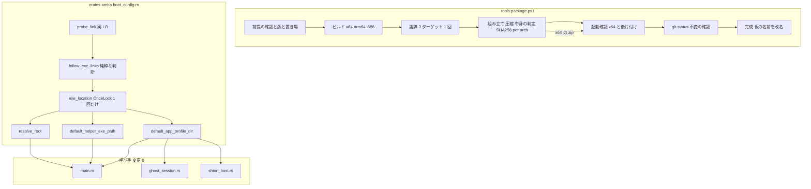
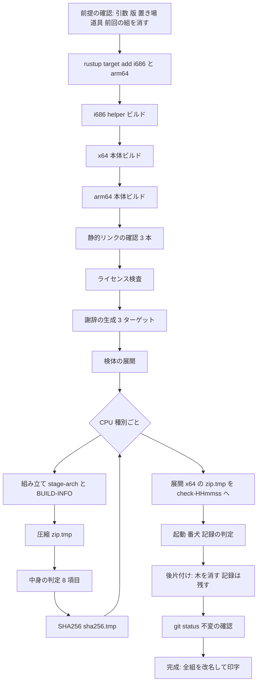
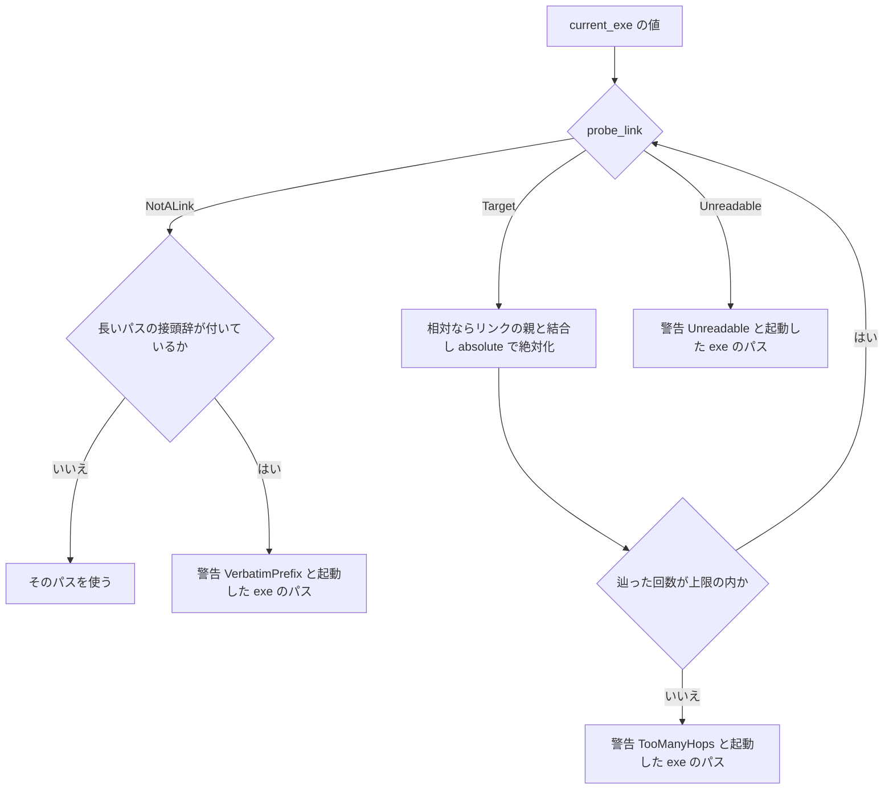

# 設計: areka-P0-release-package-versioned

> 2026-10-03・`/kiro-spec-design`（要件は 2026-10-03 の要件討議で確定・ブランチ `claude/areka-p0-release-package-688ad4`）。調査の記録と決定の経緯は `research.md`（§1〜§8 がギャップ分析・§9 が設計フェーズの決定）。ソースの場所は「何の定義か」で指す。

## Overview

**Purpose**: 配布物の zip を winget と GitHub Releases に乗せられる形（版入りの固定の名前・隣の SHA256・x64 と arm64）で作れるようにし、winget の portable が作るリンク経由で `areka` と打っても areka が自分の本当の場所から起動するようにする。あわせて、配布スクリプトの起動確認（`-Check`）が `%TEMP%` に残していた展開物と記録を、ワークツリーの `target\` の下へ移して片付ける。

**Users**: 配布物を作る開発者（手元）と、下流の CI（`release-ci-workflow`・`-Check` なしで同じスクリプトを呼ぶ）、winget で areka を入れる利用者（リンク経由の起動）。

**Impact**: `tools/package-alpha.ps1` を `tools/package.ps1` へ改めて育てる（1 ファイルのまま）。areka 本体は `crates/areka/src/boot_config.rs` の中で、起動した exe のパスを使う 3 つの関数を「リンクを解いた 1 つの場所」経由に揃える（呼び手 `main.rs`・`ghost_session.rs`・`shiori_host.rs` は変更 0）。

### Goals

- zip の名前が版と CPU 種別だけで決まり（`areka-{版}-{arch}.zip`）、隣に `sha256sum -c` で検証できる `.sha256` が置かれる。
- `-Arch x64|arm64|all` で作り分けられ、arm64 の zip にも x64 と同じ中身の検査 8 項目が効く。
- 完成品に見える zip と `.sha256` は、全段が緑のときにしか出力先に現れない。
- `-Check` の展開先と記録が `target\` の下に置かれ、合格のときは展開した木が片付く。
- areka がシンボリックリンク経由で起動されても、リンクの先の `areka.exe` の在るフォルダから根・補助 exe・記憶の置き場を引く。リンクでないときのふるまいは変えない。
- 手元のマニフェストで `winget install --manifest` から入れ、`areka` の 1 語で起動して、リンク経由であったことを記録で判定する実機の確かめが 1 回通る。

### Non-Goals

- GitHub Actions の workflow（`release-ci-workflow`）・winget のマニフェストの作成と提出（`winget-manifest-submission`）・版を上げる手順（`release-cycle`）・crates.io（`crates-io-publish`）・署名（`release-code-signing`）。
- exe の `--version`・Windows のファイル版の資源・インストーラー・補助 exe の arm64 版・arm64 の実機での起動の確かめ・再現可能ビルド・中継 exe の同梱（`mcp-stdio-bridge`）。
- `-Check` の起動の記録の判定 7 行・zip の中身の構成（最上位の項目・ゴースト・バルーンの許可表）の変更。

## Boundary Commitments

### This Spec Owns

- 配布スクリプト `tools/package.ps1` の全体: 引数（`-Arch`・`-Check`・`-CheckDir`・`-KeepExpanded`・`-SmokeExitMs`）・段の並び・zip と `.sha256` の名前と置き場・`BUILD-INFO.txt` の行・中身の検査の期待値の表・展開先と記録の置き場・後片付け・終了コードの割り当て・使い方の説明。
- areka 本体の「起動した exe の本当の場所」の決め方: `boot_config.rs` の純粋な判断 `follow_exe_links` と、その結果をプロセスで 1 回だけ求めて覚える口 `exe_location`、それを使う 3 関数（`resolve_root`・`default_helper_exe_path`・`default_app_profile_dir`）。警告の行 `exe_link_unresolved`。
- 兄弟のテストファイル `boot_config_exe_link_tests.rs`（判断の分岐の決定論テスト）。
- steering の `structure.md`（`tools/` の説明）・`tech.md`（arm64 の zip に要る道具と補助 exe の扱い）と、いま生きている文書の旧名の書き換え（`roadmap.md`・`product.md`・brief 3 本）。
- 実機の確かめ（要件 7）の手順と記録の置き場（`verification/winget-local-check.md`）。

### Out of Boundary

- `.github/**`・`dist/README.txt`・`dist/winget/**`・`crates/areka/src/main.rs`・`emo2_boot/`・`install/`・各 `Cargo.toml` の依存と版・`Cargo.lock`・`tools/test-all.ps1`・`tools/perf/**`。
- 完了 spec の文書・受入記録・`roadmap-history.md` に残る旧名 `tools/package-alpha.ps1` と `%TEMP%` のパス（書き換えない）。
- winget の portable を外す・上げるときに入れ先の中の記憶（`profile\areka`・ゴーストの `profile`）が消えるかの利用者向けの扱い（`winget-manifest-submission` へ申し送り済み・本仕様は確かめの後片付けに `--purge` を使うだけ）。
- 起動の記録の判定 7 行の中身（`Test-RunLog`）と、zip の中身の構成の規則（許可表の値）。

### Allowed Dependencies

- 配布スクリプト: PowerShell 7（`#Requires -Version 7`）・.NET の `System.IO.Compression`・`Get-FileHash`・`git`・`cargo`（`metadata`・`build`・`run`）・`rustup`・`cargo about`・`cargo deny`・`vswhere.exe`（VS Installer 同梱）・`sample-ghost-kit` の `nar-sample-path`。新しい道具を足さない。
- areka 本体: 標準ライブラリだけ（`std::fs::symlink_metadata`・`std::fs::read_link`・`std::path::absolute`・`std::sync::OnceLock`）と既にある `tracing`。`windows` クレートの新しい機能フラグも新しいクレートも足さない（`Cargo.toml` 変更 0）。
- 実機の確かめ: `winget`（v1.29 系）・Python 3 の `http.server`（開発機に在ることを実測済み・配る道具は開発者が代えてよい）。

### Revalidation Triggers

- zip の名前の規則・`.sha256` の書式・出力先 `target/package/` を変える → `release-ci-workflow`・`winget-manifest-submission` を再確認。
- 終了コードの意味を変える・新しい番号を足す → `release-ci-workflow`（CI が終了コードで判定する）。
- `BUILD-INFO.txt` の行を増減する → 中身の検査 8 番（本仕様の内）と、将来の `mcp-stdio-bridge`（同じスクリプトに同梱を足す）。
- `exe_location` の戻り値の意味（リンクのときだけ解く・解けないときは起動した exe のパス）を変える → 完了 `baseware-root-layout` の根の規則の読み方と `install-companion-canon`（`boot_config.rs` を触りうる）。
- `-Check` の展開先の親を変える → `alpha-release-signoff` 型の受入記録が記録を引く場所。

## Architecture

### Existing Architecture Analysis

- 配布スクリプトは「名前つきの段を直列に回し、失敗したら段の名前と出力の末尾を印字して後始末して即終了」の骨組み（`Step`・`Exit-Script`・`Invoke-Cleanup`）を持つ。段の中で前提の不正は `Exit-Script 3`、段の失敗は 1、起動確認の否は 2。この骨組みと終了コードの意味は保つ（5.4）。
- 配布物の仮の名前 → 最後に改名（`.zip.tmp` → `.zip`）の流儀がある。本仕様はこれを `.sha256` と複数の CPU 種別へ広げ、改名を最後の段へ動かす（下の「完成を最後へ」）。
- 起動確認は、自分が起こした子だけを止める番犬と、記録の判定 7 行（`Test-RunLog`）から成る。判定の各行は変更 0。
- areka 本体で起動した exe のパスを使うのは `boot_config.rs` の 3 関数だけ（ギャップ分析 §2.2 実測）。根の判断 `resolve_root_from` は env と exe を引数で受ける純粋な形で、テストは注入で踏む。リンクの読み取りも同じ型（I/O を引数で注入し、判断を純粋に保つ）で足す。
- ログの初期化（`main` の `tracing_subscriber::fmt()`）は `resolve_boot` と `default_helper_exe_path` の呼び出しより前なので、`exe_location` の初回の警告は記録に載る。

### Architecture Pattern & Boundary Map



**Architecture Integration**:

- 選んだ形: 配布スクリプトは「改名して育てる 1 ファイル」（ギャップ分析 §4.1 案 A）。CPU 種別ごとの違いは冒頭の較正値の表 `ARCHS` 1 つに置き、ビルドから中身の判定までを表の行の数だけ回す。本体は「判断は純粋・I/O は注入・結果は 1 回だけ求めて覚える」（§4.2 案 1＋`OnceLock`）。
- 責務の分かれ目: スクリプトは「配布物を作って確かめる」、本体は「自分の場所を決める」。両者は zip の中の `areka.exe` でしかつながらない。
- 保つ型: 段の直列・終了コード 0〜3・番犬・記録の判定 7 行・`resolve_root_from` の注入の型・テストは兄弟ファイル（`structure.md` の Unit Tests の規約）。
- 依存の向き（本体）: `probe_link`（I/O）→ `follow_exe_links`（判断）→ `exe_location`（記憶）→ 3 関数 → 呼び手。逆向きの参照は無い。テストは `follow_exe_links` を直に呼ぶ。
- steering との整合: 新しい依存 0（`tech.md` の「OS の機能で賄う」）・1 ファイル 1,000 行以内（スクリプトは 700 行前後の見込み）・一時フォルダは `target\` の下だけ・失敗は黙らず記録に残す。

### Technology Stack

| 層 | 選択 | 役割 | 備考 |
|---|---|---|---|
| 配布スクリプト | PowerShell 7.x（実測 7.6.6） | 段の直列・PE の読み取り・zip・SHA256 | `Get-FileHash -Algorithm SHA256` は大文字の 16 進を返すので小文字へ |
| ビルド | `cargo build --locked --release`・`rustup target add` | x64・arm64・i686 の 3 ターゲット | arm64 のリンクは VS の `Microsoft.VisualStudio.Component.VC.Tools.ARM64` が要る（`vswhere` で前提を確かめる。`vswhere.exe` は PATH に無いので `VSWHERE_PATH` の固定の場所から呼ぶ） |
| 版の読み取り | `cargo metadata --no-deps --locked --format-version 1` | `areka` パッケージの `version` を読む | ネットワーク不要・実測で `0.0.1` が返る |
| 謝辞・ライセンス | `cargo about generate`・`cargo deny check licenses` | 今どおり | `--target` を 3 つ渡す（CPU 種別で分けない） |
| areka 本体 | Rust 標準ライブラリ | `symlink_metadata`・`read_link`・`path::absolute`・`OnceLock` | `read_link` は外せるときは `\\?\` を外した普通の綴りを返す（rustc 1.99 の標準ライブラリで確認） |
| 実機の確かめ | `winget` 1.29・Python 3 `http.server` | 手元のマニフェストと zip の配布 | 配る道具は開発者の裁量・`localhost` の http で渡す（要件 7.6） |

## File Structure Plan

### Directory Structure

```
tools/
└── package.ps1                                   # 改名（git mv）。配布 zip を組み・検査し・起動を確かめる唯一のスクリプト
crates/areka/src/
├── boot_config.rs                                # 変更: follow_exe_links・LinkProbe・ExeLinkWarning・exe_location を足し、3 関数を exe_location 経由へ
└── boot_config_exe_link_tests.rs                 # 新規: follow_exe_links の判断の分岐の決定論テスト（接続は boot_config.rs 末尾の #[cfg(test)] #[path] mod exe_link_tests）
.kiro/steering/
├── structure.md                                  # 変更: tools/ の説明（新しい名前と役割）
├── tech.md                                       # 変更: arm64 の zip に要る道具（VS の ARM64 の部品・vswhere の固定の置き場）・補助 exe は arm64 の zip でも i686
├── roadmap.md                                    # 変更: 旧名 3 か所 → tools/package.ps1
└── product.md                                    # 変更: 旧名 1 か所 → tools/package.ps1
.kiro/specs/
├── areka-P0-mcp-stdio-bridge/brief.md            # 変更: 旧名 → 新しい名前（文意は変えない）
├── areka-P0-mcp-server-core/brief.md             # 同上
├── areka-P0-release-ci-workflow/brief.md         # 同上
└── areka-P0-release-package-versioned/verification/
    └── winget-local-check.md                     # 新規: 要件 7 の実機の確かめの手順と記録
target/package/                                   # 追跡外（.gitignore の target）。cargo の --target-dir・stage-{arch}・zip・.sha256・check-<HHmmss>{,-logs}・winget-local/ の置き場
```

### Modified Files

- `tools/package.ps1`（旧 `tools/package-alpha.ps1`）— 下の Components の S1〜S7。較正値に `ARCHS`・`OUT_DIR = 'target/package'`・`SCRIPT_VERSION = '2.0.0'`・`REMOVE_RETRY = 5`。`BUILD-INFO.txt` の `script=` も新しい名前。
- `crates/areka/src/boot_config.rs` — 「ベースウェアの根」の節の前に「起動した exe の本当の場所」の節を足す。`resolve_root`・`default_helper_exe_path`・`default_app_profile_dir` の `std::env::current_exe()` を `exe_location()` に置き換える（それ以外の本文は変えない）。
- steering 4 本と brief 3 本 — 旧名の置き換えと、`structure.md`・`tech.md` の 1〜2 行の追記。過去の記録（`completed/`・`roadmap-history.md`）は触らない。

## System Flows

### 配布スクリプトの段（`-Arch all -Check` のとき）



- 失敗の扱い: どの段で落ちても `Exit-Script` の後始末が `.zip.tmp`・`.sha256.tmp` を全部消す。完成品の名前の zip と `.sha256` が出力先に在るのは終了コード 0 のときだけ（2.4・2.5・3.7 がこの 1 つの決め方で満たされる）。
- 起動確認の否（終了コード 2）でも仮の名前の組は消す。展開した木と記録は残して置き場を印字する（1.5）。
- `-Check` が無いときは O〜Q を飛ばす（窓を出さない・問いかけない＝5.1）。`-Arch x64` のときは E を飛ばし、arm64 の target の導入も行わない（道具の無い機械で既定の実行が止まらない）。

### 起動した exe の場所の決め方（areka 本体）



- リンクでないときは 1 回の `probe_link` で `OK` へ抜け、入力のパスがそのまま返る（6.3）。
- 警告の 3 形はどれも「起動した exe のパスをそのまま使う」へ倒す（6.6＝今のふるまい）。警告は `exe_location` が初回に 1 度だけ `warn!` に出す。

## Requirements Traceability

| 要件 | 要約 | コンポーネント | 契約・判断 | フロー |
|---|---|---|---|---|
| 1.1 | 展開先と記録を `target\` の下へ・`%TEMP%` に作らない | S1・S6 | 既定の親 `<リポジトリ>\target\package\`・`check-<HHmmss>`／`-logs` | 段 O |
| 1.2 | 160 字の上限 | S1 | `-Check` か `-CheckDir` のとき展開先のフルパスを検査・超えたら 3 | 段 A |
| 1.3 | `-CheckDir` の受け入れ | S1 | リポジトリの中は `<リポジトリ>\target\` の下だけ受け付け・外は今どおり | 段 A |
| 1.4 | 合格で木を消し記録を残す | S6 | `後片付け` の段 | 段 Q |
| 1.5 | 否で木と記録を残す | S6 | 終了コード 2 の経路は後片付けを通らず置き場を印字 | 段 P |
| 1.6 | 残す引数 | S1・S6 | `-KeepExpanded` | 段 Q |
| 1.7 | 消せなければ 1 | S6 | `REMOVE_RETRY` 回の再試行の後に throw（段の失敗） | 段 Q |
| 1.8 | 子が終わった後に消す・他を止めない | S6 | 後片付けは番犬の後・番犬は `$script:Child` だけ | 段 P→Q |
| 1.9 | git status 不変 | S7 | 今どおりの段・`target` は追跡外 | 段 R |
| 1.10 | 説明の例 | S1（説明の欄） | `.EXAMPLE` は `-CheckDir` を使わない例と `target\` の下の例 | − |
| 2.1 | 版入りの固定の名前 | S1・S4 | `cargo metadata` の `areka` の `version`・`areka-{版}-{arch}.zip` | 段 A・L |
| 2.2 | `.sha256` の 1 行 | S5 | 小文字 16 進 64 字＋空白 2 つ＋ファイル名＋LF・BOM なし | 段 N |
| 2.3 | 版を読めない → 3 | S1 | `cargo metadata` の失敗・空・`+` を含む版 | 段 A |
| 2.4 | 同名の組を先に消す | S1 | 前提の確認の最後で `areka-{版}-{arch}.zip` と `.sha256` を消す | 段 A |
| 2.5 | 作りかけを残さない | S7・後始末 | 仮の名前（`.tmp`）→ 完成は最後の段・後始末が `.tmp` を消す | 段 S |
| 2.6 | 印字 | S7 | CPU 種別ごとに zip と `.sha256` の絶対パスと版 | 段 S |
| 3.1 | `-Arch` の 3 値と既定 | S1 | `x64`・`arm64`・`all`・省略は `x64` | 段 A |
| 3.2 | 不正な値 → 3 | S1 | 受け付ける値を印字 | 段 A |
| 3.3 | arm64 のビルド | S2 | `ARCHS.arm64.Target`＝`aarch64-pc-windows-msvc`・helper は i686 のまま | 段 E |
| 3.4 | arm64 の道具が無い → 3 | S1 | `VSWHERE_PATH` → PATH の順で `vswhere` を探し、無いか `-requires Microsoft.VisualStudio.Component.VC.Tools.ARM64` が空なら 3 | 段 A |
| 3.5 | 検査 8 項目を arm64 にも | S4 | 機械種別の表を `ARCHS` から引く（`areka.exe`＝0xAA64・helper と `pasta.dll`＝0x014c）・6 番も効く | 段 M |
| 3.6 | 中身の構成は同じ | S3・S4 | 謝辞は 3 ターゲットで 1 つ・stage の 9 項目は同じ写し元 | 段 H・K |
| 3.7 | `all` は両方そろって成功 | S7・後始末 | 完成は最後の段で全組を一度に改名・途中の失敗は `.tmp` を全部消す | 段 S |
| 3.8 | `-Check` は x64 で・arm64 は印字 | S6 | 展開するのは `ARCHS.x64` の zip・arm64 を作ったときは注意書きを印字 | 段 O |
| 3.9 | `-Check` と `-Arch arm64` だけ → 3 | S1 | 組み合わせの検査 | 段 A |
| 4.1 | `version=` の行 | S4 | `BUILD-INFO.txt` に `version={版}` | 段 K |
| 4.2 | CPU 種別の行 | S4 | `arch={arch}` | 段 K |
| 4.3 | 名前との一致を検査 | S4 | 8 番で `version=`・`arch=` を期待値と比べる | 段 M |
| 5.1 | 窓を出さない・問いかけない | S1〜S7 | `-Check` 以外に `Start-Process` も入力待ちも無い | − |
| 5.2 | 手元と CI で同じ名前・同じ検査 | S1・S4 | 名前は版と CPU 種別だけから・検査は同じ関数 | − |
| 5.3 | 道具が欠ける → 3 と入れ方 1 行 | S1 | `cargo about`・`cargo deny`・`vswhere`・ARM64 の部品・`Cargo.lock` | 段 A |
| 5.4 | 終了コードを保つ | 全体 | 0・1・2・3 のまま・後片付けの失敗は 1 | − |
| 5.5 | 置き場を固定し説明に書く | S1（説明の欄） | `target/package/` | − |
| 6.1 | リンクの先から 3 つを引く | `exe_location`・3 関数 | `follow_exe_links` の `Target` の枝 | 本体フロー |
| 6.2 | リンクのリンク・相対の先 | `follow_exe_links` | 繰り返し・相対はリンクの親と結合して `absolute` | 本体フロー |
| 6.3 | リンクでないときは今どおり | `follow_exe_links` | `NotALink` で入力をそのまま返す | 本体フロー |
| 6.4 | 環境変数が勝つ | 3 関数（既存の分岐） | `AREKA_ROOT`・`AREKA_PROFILE_DIR` の分岐は `exe_location` より先に評価 | − |
| 6.5 | `\\?\` を付けない | `follow_exe_links` | `read_link` の綴りを使う・接頭辞が残れば `VerbatimPrefix` で倒す | 本体フロー |
| 6.6 | 解けない → 警告して続ける | `exe_location` | `exe_link_unresolved` の `warn!`・起動した exe のパスを使う | 本体フロー |
| 6.7 | 決定論テスト | `boot_config_exe_link_tests.rs` | 注入した `probe` で全分岐を踏む・実物のリンクを要しない | − |
| 6.8 | 根の行 | 既存 `root_resolved` | `resolve_boot_from` の info 行の `root=` が解いた後の根（変更 0） | − |
| 7.1 | winget から入れて `areka` で起動 | 実機の確かめ | `verification/winget-local-check.md` の手順 | − |
| 7.2 | リンク経由であったことを両方記録 | 実機の確かめ | `(Get-Command areka).Source` の `LinkType`＝`SymbolicLink` と記録の `root=` | − |
| 7.3 | 置き場は `target\`・追跡しない・外す | 実機の確かめ | `target\package\winget-local\`・`winget uninstall … --purge` | − |
| 7.4 | 設定は開発者の手で・記録に残す | 実機の確かめ | 開発者モードと `LocalManifestFiles` の on/off を記録の表に | − |
| 7.5 | arm64 は既知の制限 | 実機の確かめ | 記録の末尾に明記 | − |
| 7.6 | `localhost` の http で渡す | 実機の確かめ | Python の `http.server` を `target\package` で起こす | − |
| 8.1 | 改名・旧名を残さない | `tools/package.ps1` | `git mv` | − |
| 8.2 | 使い方の説明 | S1（説明の欄） | 下の「使い方の説明の欄」 | − |
| 8.3 | `structure.md` | steering | `tools/` の説明の 1 行 | − |
| 8.4 | `tech.md` | steering | arm64 の道具（VS の部品名と `vswhere` の固定の置き場）・補助 exe は i686 のまま | − |
| 8.5 | 過去の記録は触らない | − | `completed/`・`roadmap-history.md` は変更 0 | − |
| 8.6 | 生きている文書の旧名を直す | steering・brief | `roadmap.md`（3）・`product.md`（1）・brief 3 本 | − |

## Components and Interfaces

| Component | 層 | 意図 | 要件 | 主な依存 | 契約 |
|---|---|---|---|---|---|
| S1 前提の確認と版と置き場 | スクリプト | 引数と道具を検査し、版・名前・置き場を決め、前回の組を消す | 1.1〜1.3, 1.10, 2.1, 2.3, 2.4, 3.1, 3.2, 3.4, 3.9, 5.3, 5.5, 8.2 | git・cargo・vswhere | Batch |
| S2 ビルド | スクリプト | `ARCHS` の行ごとに本体を、i686 の helper を 1 回 release ビルド | 3.3 | rustup・cargo | Batch |
| S3 謝辞 | スクリプト | 3 ターゲットで 1 つの `THIRD-PARTY-NOTICES.md` | 3.6 | cargo about | Batch |
| S4 組み立て・圧縮・中身の判定 | スクリプト | CPU 種別ごとに stage → `.zip.tmp` → 8 項目 | 2.1, 3.5, 3.6, 4.1〜4.3 | `Test-ZipContent`・`Read-PeInfo` | Batch |
| S5 SHA256 | スクリプト | `.sha256.tmp` を 1 行で書く | 2.2 | `Get-FileHash` | Batch |
| S6 起動確認と後片付け | スクリプト | x64 の zip を `target\` の下へ展開して起動・判定し、木を片付ける | 1.4〜1.8, 3.8 | 番犬・`Test-RunLog`（変更 0） | Batch |
| S7 完成と後始末 | スクリプト | 全組を一度に改名して印字・失敗時は `.tmp` と今回の完成品を消す | 2.5, 2.6, 3.7, 1.9 | `Invoke-Cleanup` | Batch |
| `follow_exe_links` | 本体・判断 | 起動した exe のパスからリンクを辿って使うパスと警告を返す純粋な関数 | 6.1〜6.3, 6.5, 6.7 | `LinkProbe`（注入） | Service |
| `exe_location` | 本体・記憶 | 実 I/O の `probe_link` で 1 回だけ解いて覚え、警告を 1 度出す | 6.1, 6.6 | `follow_exe_links`・`tracing` | Service / State |
| 3 関数の差し替え | 本体・配線 | `resolve_root`・`default_helper_exe_path`・`default_app_profile_dir` が `exe_location` を使う | 6.1, 6.4, 6.8 | `exe_location` | − |
| 実機の確かめ | 手順 | 手元のマニフェストで winget から入れてリンク経由の起動を記録で判定 | 7.1〜7.6 | winget・http.server | Batch |

### 配布スクリプト `tools/package.ps1`

#### 較正値（冒頭・説明の欄の一覧と対応）

| 名前 | 値 | 用途 |
|---|---|---|
| `SCRIPT_VERSION` | `2.0.0` | `BUILD-INFO.txt` の `script=tools/package.ps1 2.0.0` |
| `OUT_DIR` | `target/package` | cargo の `--target-dir`・stage・zip・`.sha256`・`check-*` の置き場（5.5） |
| `ARCHS` | `x64 → {Target='x86_64-pc-windows-msvc'; Machine=0x8664}`／`arm64 → {Target='aarch64-pc-windows-msvc'; Machine=0xAA64}`（順序つき） | ビルド・zip の名前・機械種別の検査・`arch=` の行の唯一の出どころ |
| `HELPER_TARGET`・`HELPER_MACHINE` | `i686-pc-windows-msvc`・`0x014c` | 補助 exe と `pasta.dll` は CPU 種別に依らず 32 ビット |
| `ARM64_VS_COMPONENT` | `Microsoft.VisualStudio.Component.VC.Tools.ARM64` | `vswhere -requires` に渡す部品名（3.4・5.3 の印字にも使う） |
| `VSWHERE_PATH` | `"$([Environment]::GetFolderPath('ProgramFilesX86'))\Microsoft Visual Studio\Installer\vswhere.exe"` | `vswhere.exe` の固定の置き場（VS Installer 同梱・**PATH には載らない**＝開発機と GitHub の Windows ランナーで実測）。無ければ PATH の `vswhere` を試す |
| `EXPAND_DIR_MAX_CHARS` | `160` | 今どおり |
| `REMOVE_RETRY`・`REMOVE_RETRY_WAIT_SEC` | `5`・`1` | 後片付けの再試行（補助 exe の終了や Windows Defender の走査でファイルが掴まれる間） |
| `VERSION_PATTERN` | `^\d+\.\d+\.\d+(-[0-9A-Za-z.-]+)?$` | 版の形（`+` のビルドの付記はファイル名と URL で困るので受けない） |
| 既存の `SMOKE_EXIT_MS`・`WATCHDOG_MARGIN_SEC`・`DLL_DENY_PREFIXES`・`ALLOWED_EXECUTABLES`・`LOG_MARKER_*`・`OUTPUT_TAIL_LINES` | 変更 0 | − |

#### 引数（契約）

| 引数 | 型 | 既定 | 意味 |
|---|---|---|---|
| `-Arch` | 文字列 `x64`／`arm64`／`all` | `x64` | 作る CPU 種別。他の値は終了コード 3（受け付ける値を印字） |
| `-Check` | スイッチ | 付けない | x64 の zip を展開して起動し記録を判定する。窓を出すので CI では付けない |
| `-CheckDir` | 絶対パス | `<リポジトリ>\target\package` | 展開先 `check-<HHmmss>` と記録 `check-<HHmmss>-logs` を作る親。リポジトリの中は `<リポジトリ>\target\` の下だけ受け付ける |
| `-KeepExpanded` | スイッチ | 付けない | 判定の合否にかかわらず展開した木を消さず置き場を印字する |
| `-SmokeExitMs` | 正の整数 | `SMOKE_EXIT_MS` | 今どおり |

数でない値や不正な組み合わせはすべて終了コード 3。`-Check` と `-Arch arm64` の組み合わせは「起動確認には x64 の zip が要る」を印字して 3（3.9）。

#### S1 前提の確認と版と置き場（段「前提の確認」）

- 入力の検査の順: `-SmokeExitMs` → `-Arch` → `-Check`×`-Arch` の組み合わせ → `-CheckDir`（絶対パス・リポジトリの中なら `<リポジトリ>\target\` の下か）→ 展開先の長さ（`-Check` か `-CheckDir` のとき・160 字）→ git → 道具（`cargo about`・`cargo deny`・`Cargo.lock`・`-Arch` に arm64 を含むときだけ `vswhere` と ARM64 の部品）→ 版。
- `vswhere` の探し方: `VSWHERE_PATH` の固定の場所 → 無ければ PATH の `vswhere`（`Get-Command vswhere -ErrorAction SilentlyContinue`）の順。どちらにも無ければ 3 で止め、探した 2 か所を印字する（名前だけで呼ぶ実装にすると、部品のそろった機械でも常に 3 になる）。見つかった実行ファイルで `-latest -products * -requires $ARM64_VS_COMPONENT -property installationPath` を呼び、空なら 3。
- rustup のビルドのターゲット（i686・arm64）は「欠けたら 3」ではなく、今どおり段 `rustup target add` で足す（S2・失敗は 1）。自動で足せる物は 5.3 の「欠ける前提」に数えない（CI の workflow に別の段を要らせない）。
- 版: `cargo metadata --no-deps --locked --format-version 1` の JSON から `name` が `areka` のパッケージの `version` を読む。読めない・空・`VERSION_PATTERN` に合わない → 3（理由を印字・ビルドしない）。`$script:Version` に持つ。
- 名前の組み立ては 1 関数 `Get-ArtifactNames($Arch)` に集め、`Zip`・`Sha`・`ZipTmp`・`ShaTmp` の 4 つの絶対パスを返す（`$OUT_DIR\areka-{版}-{arch}.zip`・同 `.zip.sha256`・それぞれに `.tmp`）。zip の名前と `arch=` の行と 8 項目の期待値はすべてこの関数と `ARCHS` から引く（手書きの重複を作らない）。
- 前回の組の削除: 作る CPU 種別ごとに `Zip`・`Sha`・`ZipTmp`・`ShaTmp` が在れば消す（2.4）。
- 展開先: `$script:ExpandDir = <親>\check-<HHmmss>`・`$script:LogDir = "$ExpandDir-logs"`（旧 `areka-alpha-check-` の「alpha」は落とす）。既定の親は `[IO.Path]::GetFullPath("$PSScriptRoot\..\target\package")`。
- 道具が欠けるときの印字は 1 行で「何が無いか・どう入れるか」（例: `arm64 のリンクに要る VS の部品が無い（VS Installer で Microsoft.VisualStudio.Component.VC.Tools.ARM64 を追加する）`・`vswhere.exe が無い（探した場所: <VSWHERE_PATH> と PATH。Visual Studio か Build Tools を入れる）`）。
- `-Check` を付けず `-CheckDir` も無いとき、展開先の長さは検査しない（今どおり。CI の長いパスで止めない）。

#### S2 ビルド

- `rustup target add` を i686 と、`-Arch` に arm64 を含むときは arm64 にも行う（段として・失敗は 1）。
- `RUSTFLAGS` の差し替えは今どおり 2 段の間だけ。段の並び: `i686 helper ビルド` → `ARCHS` の行ごとに `{arch} 本体ビルド`（`cargo build --locked --release -p areka --target <Target> --target-dir $OUT_DIR`）。
- 静的リンクの確認は作った exe 全部（helper＋各 arch の本体）に効かせ、機械種別も表の値と比べて印字する。

#### S3 謝辞

- `cargo about generate --locked --workspace --target x86_64-pc-windows-msvc --target aarch64-pc-windows-msvc --target i686-pc-windows-msvc about.hbs -o $OUT_DIR/THIRD-PARTY-NOTICES.md` を `-Arch` に依らず 1 回。両方の zip に同じバイト列が入り（3.6）、`-Arch x64` だけの手元と `-Arch all` の CI で謝辞の中身が揃う（5.2）。

#### S4 組み立て・圧縮・中身の判定（CPU 種別ごと）

- stage は `$OUT_DIR/stage-{arch}`（前回の物は消して作り直す）。写す 9 項目は今どおり・`areka.exe` だけ `ARCHS[arch].Target` の出力から。
- `BUILD-INFO.txt` は 7 行: `version={版}`・`arch={arch}`・`commit=`・`dirty=`・`built=`・`script=tools/package.ps1 2.0.0`・`rustflags=`。
- 圧縮は `ZipTmp` へ（今どおり `includeBaseDirectory=$false`）。
- `Test-ZipContent($ZipPath, $Arch)` に CPU 種別を渡す。5 番の機械種別の表は `@{ 'areka.exe' = $ARCHS[$Arch].Machine; 'shiori-host32-helper.exe' = $HELPER_MACHINE; 'ghost/emo2/ghost/master/pasta.dll' = $HELPER_MACHINE }`。8 番の `BUILD-INFO.txt` の期待値は `version=$Version`・`arch=$Arch`・`commit=`・`dirty=` の 4 行（4.3）。他の 1〜4・6・7 は変更 0。
- 否が 1 件でもあれば段の失敗（1）。

#### S5 SHA256

- `Get-FileHash -LiteralPath $ZipTmp -Algorithm SHA256` の `Hash` を小文字にし、`"{0}  {1}`n" -f $hash, $zipName`（空白 2 つ・LF・ファイル名は完成後の名前 `areka-{版}-{arch}.zip`）を UTF-8（BOM なし）で `ShaTmp` へ書く。`sha256sum -c areka-{版}-{arch}.zip.sha256` がそのまま通る形（2.2）。

#### S6 起動確認と後片付け（`-Check` のとき）

- 展開するのは `ARCHS.x64` の `ZipTmp`（`.tmp` のままでも展開できる）。`-Arch all` のときは「arm64 の zip は作ったが起動確認はしていない」を印字（3.8）。
- 「展開」「起動」「番犬」「記録の判定」は変更 0（展開先と記録の置き場が `target\` の下に変わるだけ）。「記録の判定」の否は今どおり `Exit-Script 2`。このとき後片付けの段は通らないので木と記録が残り、両方の置き場が印字される（1.5）。
- 新しい段「後片付け」（記録の判定の合格の直後）: `-KeepExpanded` なら置き場を印字して何もしない（1.6）。それ以外は `Remove-Item -LiteralPath $ExpandDir -Recurse -Force` を `REMOVE_RETRY` 回まで `REMOVE_RETRY_WAIT_SEC` 秒おきに試し、消せなければ「消せなかったパス・最後の例外の文・段の名前」を印字して throw（段の失敗＝1・1.7）。記録は消さず置き場を印字（1.4）。
- 番犬は今どおり `$script:Child` だけを止める。後片付けは番犬の後にしか来ないので、自分の子が終わる前に木を消すことは無い（1.8）。補助 exe は本体の終了に道連れで止まるが、掴みが残る間は再試行が吸収する。

#### S7 完成と後始末

- 段「完成」は「git status 不変の確認」の後の最後の段。作った CPU 種別ごとに `ZipTmp → Zip`・`ShaTmp → Sha` を改名し、**改名が済んだ物から順に** `$script:Finalized` へ登録してから `zip: <絶対パス>`・`sha256: <絶対パス>`・`version: <版>` を CPU 種別ごとに印字する（2.6）。途中で落ちたときは済んだ分だけが `$script:Finalized` に在り、後始末で消える。
- 後始末は終了コードを受け取る形に改める: `Invoke-Cleanup([int]$Code)`。`Exit-Script($Code, …)` は自分の `$Code` を渡し、成功の最後（スクリプト末尾）は `Invoke-Cleanup 0` を呼ぶ（今の `Invoke-Cleanup` は引数なしで両方から同じ形で呼ばれている）。`Invoke-Cleanup` は `$script:TmpFiles`（全 CPU 種別の `ZipTmp`・`ShaTmp`）を常に消し、`$Code` が 0 でないときだけ `$script:Finalized` も消す。これで「完成品の名前の zip と `.sha256` が在る ⇔ 終了コード 0」が保たれる（2.5・3.7）。
- git status の確認は改名の前に行う（`target` は追跡外なので改名の前後で結果は変わらないが、確認の段を最後の判定より前に置く今の意味を保つ）。

#### 使い方の説明の欄（`Get-Help`・8.2・1.10）

- `.SYNOPSIS`／`.DESCRIPTION`: 版入りの zip と `.sha256` を `target/package/` に組む・x64 と arm64・`-Check` は窓を出すので CI では付けない・終了コードの意味（0〜3・後片付けの失敗は 1）・完成品は全段が緑のときだけ現れる。
- `.PARAMETER` を 5 つ（上の表の文言）。`.EXAMPLE` は `pwsh -NoProfile -File tools/package.ps1 -Arch all`（CI の形）・`… -Check`（既定の置き場＝`target\package\check-<HHmmss>`）・`… -Check -KeepExpanded`。`C:\t` などの `target\` の外の例は書かない。

### areka 本体 `crates/areka/src/boot_config.rs`

#### `follow_exe_links`（純粋な判断）

| 項目 | 内容 |
|---|---|
| 意図 | 起動した exe のパスからシンボリックリンクを辿り、使うパスと警告を返す。I/O は引数で注入する |
| 要件 | 6.1, 6.2, 6.3, 6.5, 6.7 |

**契約**: Service

```rust
/// リンクを 1 段読んだ結果。I/O は呼び手（`probe_link`）か、テストの偽の口が返す。
pub(crate) enum LinkProbe {
    /// リンクではない（普通のファイル）。
    NotALink,
    /// リンクで、先はこのパス（`read_link` の綴りのまま・絶対でも相対でもよい）。
    Target(std::path::PathBuf),
    /// リンクかどうか、または先を読めなかった（理由の文）。
    Unreadable(String),
}

/// 解けなかった理由（警告の行に載せる）。どの形でも起動した exe のパスをそのまま使う。
#[derive(Debug, Clone, PartialEq, Eq)]
pub(crate) enum ExeLinkWarning {
    Unreadable { link: std::path::PathBuf, reason: String },
    TooManyHops { limit: usize, last: std::path::PathBuf },
    VerbatimPrefix { path: std::path::PathBuf },
}

/// 辿る回数の上限（輪になったリンクで止まるため・Windows の再解析の上限 63 より小さい値）。
pub(crate) const EXE_LINK_MAX_HOPS: usize = 32;

/// 起動した exe のパス `exe` からリンクを辿って、根・補助 exe・記憶の置き場に使うパスを決める。
/// 戻りの第 2 要素が `Some` のときは第 1 要素は `exe` そのもの（今のふるまいへ戻る）。
pub(crate) fn follow_exe_links(
    exe: &std::path::Path,
    probe: &mut dyn FnMut(&std::path::Path) -> LinkProbe,
) -> (std::path::PathBuf, Option<ExeLinkWarning>);
```

- 事前条件: `exe` は `current_exe()` が返した綴り（絶対）。`probe` はファイルシステムを読んでよいが、`follow_exe_links` 自身は `probe` 以外の I/O をしない（`std::path::absolute` は文字列の操作で、ファイルを開かない）。
- 事後条件:
  - `probe(exe)` が `NotALink` → `(exe の綴りそのまま, None)`（6.3）。ただしその綴りが `\\?\` の接頭辞（`std::path::Prefix::Verbatim*`）で始まれば `(exe, Some(VerbatimPrefix))`。
  - `Target(t)` → `t` が絶対ならそれ、相対ならそのリンクの親と結合し、`std::path::absolute` で正規化（`..`・`.` を畳む）したものを次のパスとして `probe` を繰り返す（6.2）。`absolute` が失敗したら `Unreadable`。
  - `probe` が `Target` を返した回数が `EXE_LINK_MAX_HOPS` に達したら、次を読まずに `(exe, Some(TooManyHops))`（`probe` の呼ばれる回数はちょうど `EXE_LINK_MAX_HOPS`＝32 回。輪になったリンクで 33 回目を読まない）。
  - `Unreadable(r)` → `(exe, Some(Unreadable { link, reason: r }))`。
  - 戻りのパスは `read_link` の綴りを使うので、途中のドライブ文字・`subst`・割り当てたネットワークドライブの綴りを書き換えない。`canonicalize` は使わない（6.5）。
- 不変: 警告が `Some` なら戻りのパスは入力 `exe` と等しい。

#### `exe_location`（1 回だけ求めて覚える口）

| 項目 | 内容 |
|---|---|
| 意図 | 実 I/O で `follow_exe_links` を 1 回だけ回し、結果を覚え、警告を 1 度だけ記録に出す |
| 要件 | 6.1, 6.6 |

**契約**: Service / State

```rust
/// `std::fs::symlink_metadata` と `std::fs::read_link` で 1 段読む本物の口（配線・テストは踏まない）。
fn probe_link(path: &std::path::Path) -> LinkProbe;

/// 起動した exe の本当の場所（プロセスで 1 回だけ解いて覚える）。`current_exe()` が失敗したときは `None`。
pub(crate) fn exe_location() -> Option<&'static std::path::Path>;
```

- 状態: `static LOC: OnceLock<Option<PathBuf>>`。初回の呼び出しで `current_exe()` → `follow_exe_links(&exe, &mut probe_link)`。警告が `Some` なら `tracing::warn!(event = "exe_link_unresolved", exe = %exe.display(), reason = ?warning, "起動した exe のリンクの先を解けなかったので、起動した exe のパスをそのまま使います")` を 1 度だけ出す。
- `probe_link` の決め方: `symlink_metadata(path)` の失敗 → `Unreadable`。`file_type().is_symlink()` が偽 → `NotALink`。真なら `read_link(path)` の `Ok` → `Target`、`Err` → `Unreadable`。
- 新しい info の行は足さない（6.8 は既存の `root_resolved` の `root=` で満たす）。
- 覚える理由: `default_app_profile_dir` はゴーストの切替などで何度も呼ばれる。毎回解くと警告が繰り返し出て、途中でリンクが張り替えられたときに置き場が変わりうる。

#### 3 関数の差し替え

- `resolve_root()`: `std::env::current_exe().ok()` を `exe_location().map(std::path::Path::to_path_buf)` に。`resolve_root_from` と `AREKA_ROOT` の分岐は変更 0（6.4）。
- `default_helper_exe_path()`・`default_app_profile_dir()`: `std::env::current_exe().ok().and_then(parent)` を `exe_location().and_then(std::path::Path::parent)` に。`"."` への寛容な倒し方と `AREKA_PROFILE_DIR` の分岐は変更 0。
- 説明文（`///`）の「`current_exe()` の親」を「起動した exe の本当の場所（`exe_location`）の親」へ書き換える。

### 実機の確かめ（要件 7）

| 項目 | 内容 |
|---|---|
| 意図 | 手元のマニフェストで winget から入れた areka が `areka` の 1 語で、リンク経由で起動することを x64 の実機で 1 回確かめ、記録を残す |
| 要件 | 7.1〜7.6 |

**契約**: Batch

- 置き場: `target\package\winget-local\<版>\`（マニフェスト 3 ファイル＝version・defaultLocale・installer）・同 `run.log`／`run.stderr.log`・記録の正本は `.kiro/specs/areka-P0-release-package-versioned/verification/winget-local-check.md`。
- マニフェストの要点: `PackageIdentifier: Areka.Areka.Portable`・`InstallerType: zip`・`NestedInstallerType: portable`・`NestedInstallerFiles: [{RelativeFilePath: areka.exe, PortableCommandAlias: areka}]`・`InstallerUrl: http://127.0.0.1:<port>/areka-{版}-x64.zip`・`InstallerSha256` は本仕様の `.sha256` の値（大文字で書く）。**`ArchiveBinariesDependOnPath` は書かない**（リンクの経路を通すため・7.2）。
- 配る口: `python -m http.server <port> --bind 127.0.0.1 --directory target\package`（開発機に Python 3.13 が在ることを実測済み・他の道具でもよい）。
- 手順: (1) `pwsh -NoProfile -File tools/package.ps1 -Check` で zip と `.sha256` を作る → (2) 開発者の手で OS の開発者モードをオン・管理者で `winget settings --enable LocalManifestFiles`（変えた物と時刻を記録） → (3) http.server を起こす → (4) 利用者の権限で `winget install --manifest target\package\winget-local\<版>` → (5) `(Get-Command areka).Source` と `(Get-Item (Get-Command areka).Source).LinkType` を記録（`…\Microsoft\WinGet\Links\areka.exe`・`SymbolicLink` であること。`LinkType` が空か PATH にパッケージのフォルダが足されていれば 7.2 の確かめは済んでいない） → (6) `$env:RUST_LOG='info'; $env:AREKA_APP_SMOKE_EXIT_MS='10000'; Start-Process areka -RedirectStandardOutput … -RedirectStandardError … -Wait` で有界に起動 → (7) `run.log` の `root_resolved` の `root=` がパッケージのフォルダ（`…\WinGet\Packages\Areka.Areka.Portable_…`）でリンクの置き場でないことと、`本物のゴースト窓を開きました` の行を記録 → (8) `winget uninstall Areka.Areka.Portable --purge`・http.server を止める → (9) 開発者の手で `LocalManifestFiles` と開発者モードを元へ戻し記録。
- 記録に書く表: 変えた設定と戻した時刻／`Source`・`LinkType`／`root=` の値／窓の行の件数／arm64 は確かめていない（既知の制限・7.5）。

## Data Models

本仕様が持つデータは配布物の名前と `BUILD-INFO.txt` の行、`.sha256` の 1 行だけ。

| もの | 形 | 出どころ |
|---|---|---|
| 版 | `cargo metadata` の `areka` の `version`（`VERSION_PATTERN` に合う文字列） | `Cargo.toml` の `[workspace.package] version`（正本は 1 か所） |
| zip の名前 | `areka-{版}-{arch}.zip`（`{arch}` は `ARCHS` の鍵） | `Get-ArtifactNames` |
| `.sha256` | `<小文字 16 進 64 字>␠␠areka-{版}-{arch}.zip\n`（UTF-8・BOM なし・LF） | S5 |
| `BUILD-INFO.txt` | `version=`・`arch=`・`commit=`・`dirty=`・`built=`・`script=`・`rustflags=` の 7 行（UTF-8・BOM なし） | S4 |
| 展開先・記録 | `<親>\check-<HHmmss>`・`<親>\check-<HHmmss>-logs\{run.log, run.stderr.log}` | S1・S6 |

## Error Handling

### 配布スクリプト

| 事象 | 終了コード | 印字 |
|---|---|---|
| `-Arch` の値が不正・`-Check` と `-Arch arm64` の組・`-CheckDir` が相対かリポジトリの中の `target\` の外・展開先が 160 字超・`-SmokeExitMs` が正の整数でない | 3 | 受け付ける値／短くする手段／直し方 1 行 |
| 版を読めない（`cargo metadata` の失敗・空・`+` 入り） | 3 | 読めなかった理由（ビルドしない・仮の名前の zip を作らない） |
| 道具が無い（`cargo about`・`cargo deny`・`Cargo.lock`・`vswhere`・ARM64 の部品・git） | 3 | 何が無いか＋入れ方 1 行 |
| ビルド・静的リンク・ライセンス・謝辞・検体・組み立て・圧縮・中身の判定・SHA256・展開・起動・番犬・後片付け・git status の各段の失敗 | 1 | 段の名前・理由・外部コマンドの出力の末尾（後片付けは消せなかったパスと例外の文） |
| 起動確認の記録の判定の否 | 2 | 否の行の名前・記録と展開先の置き場（木は残す） |
| 全段 緑 | 0 | CPU 種別ごとの zip と `.sha256` の絶対パスと版 |

- 失敗の経路はすべて `Exit-Script($Code)` → `Invoke-Cleanup($Code)` を通る: `.tmp` の削除・今回の完成品の削除（`$Code` が 0 でないとき）・自分の子の停止・環境変数と PATH の復元。展開した木は失敗の経路では消さない（調べる証拠）。
- 黙って倒れる形を作らない: `-Arch all` で arm64 の道具が無いときは x64 だけ作って 0 で終わらず 3 で止める。後片付けが消せなかったときは 1 で終わる。

### areka 本体

- リンクを解けない 3 形（読めない・回数の上限・`\\?\` が残る）は `warn!`（`exe_link_unresolved`・理由と起動した exe のパス）を 1 度出し、起動した exe のパスで続ける（6.6）。`error!` にしない＝起動が止まる事象ではない。
- `current_exe()` の失敗は今どおり（根は `ExeLocationUnavailable` で告知へ、補助 exe と記憶の置き場は `"."`）。

## Testing Strategy

### 決定論テスト（`crates/areka/src/boot_config_exe_link_tests.rs`・要件 6.7）

`follow_exe_links` へ偽の `probe`（パス → `LinkProbe` の表）を注入して判断の分岐を全部踏む。実物のシンボリックリンクは作らない（この開発機は管理者でないと作れない＝黙って飛ばすテストを置かない方針に合う）。

1. リンクでない → 入力の綴りそのまま・警告なし（6.3。`C:\x\areka.exe` のような普通の綴りと、`subst` を模した別のドライブ文字の綴りが書き換わらないこと）。
2. 絶対の先を 1 段 → 先のパス・警告なし（6.1）。
3. 相対の先（`..\pkg\areka.exe`）→ リンクの親と結合し `..` を畳んだ絶対パス（6.2）。
4. リンクのリンク（2 段）→ 最後のパス（6.2）。
5. 輪になったリンク → `TooManyHops { limit: 32 }`・戻りは入力（6.6）。`probe` の呼ばれた回数がちょうど 32 回（上限に達したら次を読まない）であることも見る。
6. `Unreadable` → `Unreadable { link, reason }`・戻りは入力（6.6）。
7. 先が `\\?\C:\…` の綴り → `VerbatimPrefix`・戻りは入力（6.5）。
8. `resolve_root_from(Some(env), …)`・`AREKA_PROFILE_DIR` の分岐が exe より先に評価されること（6.4）は既存の `mod root` のテストと、`default_app_profile_dir` の env の分岐（コードが変わらないこと）で足りる＝新しいテストは足さない。

`probe_link`（実 I/O の口）と `exe_location`（`OnceLock`）は配線なので決定論テストの対象にしない。実物のリンクの経路は要件 7 の実機の確かめが 1 回踏む。

### 配布スクリプトの検査（実走・結果を `verification/` に記録）

自己検査の枠は無い（今どおり）。実装の後に次を回し、終了コードと印字を記録する。

| 走り | 期待 |
|---|---|
| `-Arch all -Check` | 0。`target/package/` に 2 組の zip と `.sha256`・`.tmp` 0 件・`check-<HHmmss>` が消え `-logs` だけ残る・`%TEMP%` に新しい物が無い・`sha256sum -c`（Git Bash）が両方 OK・`BUILD-INFO.txt` の `version=`・`arch=` が名前と一致 |
| `-Arch all -Check -KeepExpanded` | 0。木が残り置き場が印字される |
| `-Arch foo`／`-Check -Arch arm64`／`-CheckDir <リポジトリ>\doc`／版を一時的に `0.0.1+x` に変えた状態（作業後に戻す） | 3・ビルドしない・`target/package/` に新しい zip が無い |
| `-Check -CheckDir <リポジトリ>\target\package\deep\…`（160 字超） | 3・パスの長さと上限を印字 |
| `-Arch all` で中身の判定を 1 項目わざと落とす（期待の機械種別を書き換えて実走・直後に戻す） | 1・完成品の名前の zip と `.sha256` が 0 件・`.tmp` 0 件 |
| 前回の 0 の成果物が在る状態で `-Arch x64` を途中で失敗させる | 前回の同名の組が始めに消え、終わりに完成品が無い（2.4・2.5） |
| `-Check` を付けず実行 | 窓が出ない・入力待ちが無い・0 |

### 実機の確かめ（要件 7）

上の「実機の確かめ」の手順を 1 回通し、`verification/winget-local-check.md` に記録する。合格の条件は `LinkType` が `SymbolicLink` **かつ** `root=` がパッケージのフォルダ **かつ** 窓の行が 1 件以上。

## Security Considerations

- 配布スクリプトは `AREKA_*`・`WINTF_*` を外して起動する今の形を保つ。`.sha256` は改ざんの検知の手段であり、署名は本仕様の外（未署名で出す＝テーマの決めごと）。
- 実機の確かめで変える設定（開発者モード・`LocalManifestFiles`）は開発者の手で行い、終わったら戻す（7.4）。AI はこれらを変えない。
- リンクの解決で得た場所は `read_link` の綴りをそのまま使い、`canonicalize` で別の綴りへ展開しない（利用者の環境の実パスを記録に余計に出さない・160 字の上限を守る）。

## Supporting References

- ギャップ分析と候補の比較: `research.md` §2〜§4。設計フェーズの決定と根拠: 同 §9。
- 完了 `areka-P0-alpha-package`（スクリプトの土台・要件 3.1 を本仕様の要件 1 が上書き）・完了 `areka-P0-baseware-root-layout`（根の規則）。
- [winget-cli #2889](https://github.com/microsoft/winget-cli/issues/2889)（リンク経由の起動で隣の DLL を見失う）・[PR #2401](https://github.com/microsoft/winget-cli/pull/2401)（リンクを作れないときは PATH を足す）・[#4358](https://github.com/microsoft/winget-cli/issues/4358)（`InstallerUrl` のローカルのパス）。
