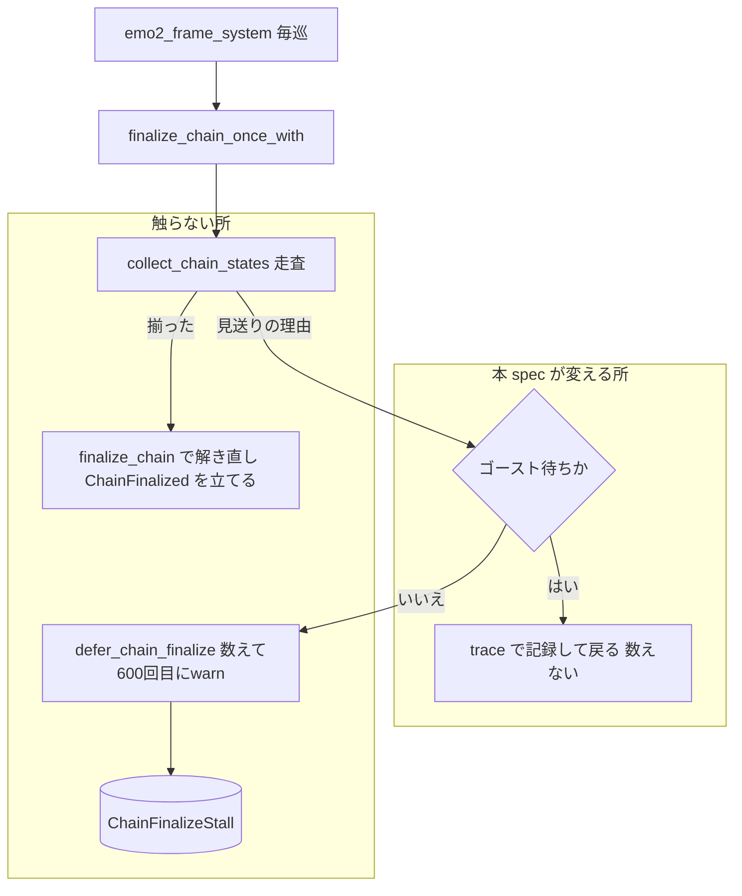
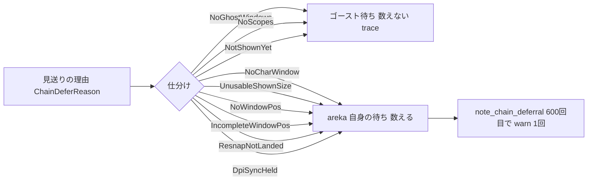

# 設計書: areka-P0-restart-chain-finalize-stall

- 作成日: 2026-10-03（ワークツリー `claude/areka-p0-restart-chain-stall-b7f2ab`）
- 入力: `requirements.md`（確定）・`research.md`（ギャップ分析 §1〜6・実機の測り直し §6.1.1・裁定 §6.1.2・設計へ送る判断 §6.1.3）
- コードの引用は「何の定義か」（関数名・型名・テスト名）で行う。行番号は使わない。

## Overview

**Purpose**: 初期配置の確定を見送った巡を停滞として数えるかどうかの判定を、「ゴースト待ちは数えない・areka 自身の待ちだけ数える」形に直す。ゴーストがいつ相方に最初の `\s` を出すかに関わらず、正常な起動と起こし直しで `deferrals=600` の WARN が鳴らなくなる。

**Users**: ログで本物の異常（表示された後に areka の処理が着地せず初期配置が決まらない）を拾いたい開発者。

**Impact**: 変える本番ソースは `crates/areka/src/emo2_boot/frame/drain_resnap.rs` の `finalize_chain_once_with` の見送りの腕 1 か所だけ。見送りの数の記録（`ChainFinalizeStall`）・しきい値（600）・WARN の本文・拡大率の遷移の後の解き直し（`chain_realign`）は 1 行も変えない。

### Goals
- ゴースト待ち（窓の一式が無い・スコープが無い・いずれかのシェルがまだ一度も表示されていない）の巡を見送りの数に加えず、WARN も出さない（1.1〜1.3）。
- 起こし直しの後の新しい一式は 0 から数え、ゴースト待ちが明けたら初回と同じく確定を 1 回だけ行う（1.4・1.5）。
- 数えなかったことを、既定の level では増やさず、開けた level（`trace`）で毎巡読み取れる形で残す（1.6・4.2）。
- areka 自身の待ち（表示された後の理由）は今日と同じ回数・同じ本文で WARN を出す（2.1〜2.4）。
- 直りと後退の無さを決定論テストで判定し、直す前のコードでは新しいテストが赤になる（3.1〜3.8）。
- 観測された場面（起動済み emo2 の入れ直し）を実機で 1 回確かめる（4.1〜4.4）。

### Non-Goals
- 窓の無い区間で毎フレームの処理そのものを止めること（`Emo2Wiring` の持ち方）。
- 起こし直しの手順（`close_windows_for_restart`・`GhostSession`・`ghost_switch`）。
- 初期配置の確定の規則（`finalize_chain`）・配置の計算（`placement/`）。
- WARN のしきい値（`CHAIN_FINALIZE_STALL_FRAMES`）と本文・`ChainDeferReason` の語彙（`chain_finalize.rs` は触らない）。
- 拡大率の遷移の後の解き直し（`chain_realign.rs`）の見送りの数え方。
- しきい値を時間で測る形に変えること（`research.md` §6.1.2 で却下）。
- シェルを最初の `\s` まで表示しない作り（`attach.rs`）・インストールの手続き（`install/`）。

## Boundary Commitments

### This Spec Owns
- 初期配置の確定（`finalize_chain_once_with`）が見送りの理由を受け取ったとき、**その巡を数えるか数えないか**の判定と、数えなかったことの記録。
- その判定を確かめる決定論テスト（新規 3 本＋既存 2 本の更新）。
- 実機で 1 回の確かめ（手順と記録の読み方）。

### Out of Boundary
- `ChainFinalizeStall`・`note_chain_deferral`・`CHAIN_FINALIZE_STALL_FRAMES`・`ChainDeferReason`（`crates/areka/src/placement/chain_finalize.rs`）——定義も語彙も変えない。
- `chain_realign.rs`（遷移後の解き直しは `collect_chain_states` を同じ閉包で使うが、見送りの数え方は自分の `defer_chain_realign` で持つ）。
- `app_exit.rs`（`close_windows_for_restart` が資源を外す形）・`ghost_session.rs`・`placement/`・`install/`。
- 表示の経路（seriko → `PresentBridge` → drain → `EmoPresenter::apply`）の失敗の記録——本 spec は「その場で記録している」ことを確かめるだけで、足しも変えもしない（§設計判断 3）。
- `frame_test_support.rs`——既存の道具（`resnap_world`・`spawn_resnap_windows`・`PerTargetSizes`・`settled_sizes`・`capture_logs`・`count_level`）で足りるので触らない。

### Allowed Dependencies
- `crate::placement::chain_finalize::{ChainDeferReason, ChainFinalizeStall, note_chain_deferral}`（読むだけ・今日どおり）。
- `crate::placement::spawn::GhostWindows`・`wintf::ecs::WindowPos`（走査の入力・今日どおり）。
- `tracing::{trace, debug, info, warn}`（記録。`trace` を新たに import する）。
- テストは `crate::app_exit::close_windows_for_restart`（本番と同じ閉じ方）と `frame_test_support.rs` の道具だけに依る。OS の窓・GPU・時刻には依らない。

### Revalidation Triggers
- `ChainDeferReason` に新しい理由が足されたとき——本設計の判定は列挙を**網羅する `match`** で書くので、足した側がコンパイルエラーで「ゴースト待ちか areka 自身の待ちか」を決めることになる。
- `close_windows_for_restart` が `ChainFinalizeStall` を外さなくなったとき（1.4 の前提が崩れる）。
- 表示の経路が失敗を記録しなくなったとき（§設計判断 3 の前提が崩れ、「`\s` は出たのに表示が着地しない」が無音になる）。
- `attach` がシェルの初回表示を自分で駆動する形へ戻ったとき（`NotShownYet` の意味が変わる）。

## Architecture

### Existing Architecture Analysis

毎フレーム `emo2_frame_system`（`frame.rs`）が、終了の指示が無く `Emo2Wiring` が在れば drain → resnap → **`finalize_chain_once`** → `realign_chain_once` の順に呼ぶ。`finalize_chain_once` は本体を持たず `finalize_chain_once_with`（`drain_resnap.rs`）へ委ねる。本体は:

1. `ChainFinalized` が在れば戻る（一度きり）。
2. `collect_chain_states` で全スコープを走査し、1 つでも欠けば **最初に躓いた理由** `ChainDeferReason` を返す。
3. 理由を区別せず `defer_chain_finalize` へ渡す。`defer_chain_finalize` は `init_resource::<ChainFinalizeStall>()` で資源を（無ければ作って）取り、`note_chain_deferral` で 1 を足し、600 回目ちょうどで `warn!` を 1 回出す。

起こし直し（`ghost_switch::switch_to`）は 1 回の同期呼び出しの中で `close_windows_for_restart`（`GhostWindows`・`ChainFinalized`・`ChainFinalizeStall` ほかを外す）から新しい結線の挿入までを済ませる。新しい窓は次の巡で生える（実機 0.03〜0.15 秒）。その後、シェルは最初の `\s` が届くまで表示されない（`attach.rs`: 「シェルは `ShowSurface` そのものを発行せず最初のさくらスクリプト `\s` cue まで非表示を保つ」）ので、相方の初回表示までの長さはゴーストの台本しだい（実機 r5 で 5.76 秒）。この間の見送りの理由は `NotShownYet { scope: 1 }` で、今日はこれが数えられて 600 に届く。

### Architecture Pattern & Boundary Map



**Architecture Integration**:
- 選んだ形: 既存の `match collect_chain_states(...)` の `Err(reason)` の腕に、理由の仕分け（ゴースト待ち／areka 自身の待ち）を 1 つ足す（`research.md` 案 A）。
- 境界: 「数えるか」は確定の本体（`finalize_chain_once_with`）が決め、「どう数えるか」は `defer_chain_finalize` と `chain_finalize.rs` が今日どおり持つ。
- 保つ既存の形: 走査と判定は 1 つの実装（`collect_chain_states`）を起動時確定と遷移後の解き直しで共有する。本設計は走査に触らず、確定側の腕だけを変えるので、解き直し側の見送りの数え方は変わらない（2.4）。
- 新しい型・資源・状態は作らない（§設計判断 1）。
- steering との整合: 失敗の経路は無音にしない（記録は `trace` で毎巡残す）・1 フレーム遅らせる解は取らない（判定は同じ巡で決まる）・決定論テスト（OS の窓・GPU・時刻に依らない）。

### Technology Stack

| Layer | Choice / Version | Role in Feature | Notes |
|-------|------------------|-----------------|-------|
| Runtime | bevy_ecs 0.19（World・Resource） | `ChainFinalizeStall` の有無と `GhostWindows` の走査（今日どおり） | 新しい資源は作らない |
| Logging | tracing（workspace） | 数えなかったことを `trace!` で記録 | target は `areka::emo2_boot::frame::drain_resnap` |
| Test | log-capture-kit（`capture_lines`）・`frame_test_support.rs` | WARN の件数と trace の有無の判定・偽の寸で何巡でも回す | TRACE を含む全 level を捕捉する |

新しい依存は無い。

## File Structure Plan

### Modified Files
- `crates/areka/src/emo2_boot/frame/drain_resnap.rs` — `finalize_chain_once_with` の `Err(reason)` の腕に理由の仕分けを足す。ゴースト待ちなら `trace!` で記録して戻り（`defer_chain_finalize` を呼ばない＝`init_resource` が走らない）、areka 自身の待ちなら今日どおり `defer_chain_finalize` へ渡す。`use tracing::{debug, info, warn}` に `trace` を足す。`finalize_chain_once_with` と `defer_chain_finalize` の説明文（「見送りの可観測性」の節）を新しい振る舞いに合わせて書き直す。`collect_chain_states`・`defer_chain_finalize`・`resnap_*`・`realign_*` の本文は変えない。
- `crates/areka/src/emo2_boot/frame_chain_finalize_tests.rs` — 新規 1 本（シェルが一度も表示されない待ちは数えない・明けたら 1 回確定）。既存 2 本（`stalled_finalize_reports_the_reason_exactly_once`・`finalize_within_the_bounded_wait_emits_no_diagnostic`）を「相方が表示されない」形から「areka 自身の理由（再アンカーが未 landing）」の形へ置き換える。
- `crates/areka/src/emo2_boot/frame_chain_finalize_restart_tests.rs` — 新規 2 本（窓を閉じた後の窓なし 600 巡は数えない／窓なしと未表示の巡を挟んだ後の新しい一式は表示が揃ってから 600 回目でちょうど 1 件）。

### Not Modified（境界の確認）
- `crates/areka/src/placement/chain_finalize.rs`・`chain_realign.rs`・`crates/areka/src/app_exit.rs`・`ghost_session.rs`・`emo2_boot/frame.rs`・`emo2_boot/frame/attach.rs`・`emo2_boot/frame_test_support.rs`・`placement/`・`install/`。
- 実機の確かめは `target\rt\` の下で行い、リポジトリにはログの要約（`verification/` 相当の文書はタスク生成で決める）以外を残さない。

## System Flows



- 仕分けは `match` で**全列挙子を書く**（`_` を使わない）。理由が足されたら足した側がコンパイルエラーで仕分けを決める。
- `DpiSyncHeld` は起動時の確定には届かない理由（解き直し専用）だが、表示された後の areka 側の待ちなので「数える」側に置く。
- 走査は最初に躓いた理由で打ち切るので、同じ巡に「scope 0 は未 landing・scope 1 は未表示」が重なっていても、返るのは昇順で先に躓いた理由 1 つである。先に areka 自身の理由が返れば数え、先にゴースト待ちが返れば数えない。これは「全スコープが表示済みで areka 自身の理由で見送られ続けている」（2.1）の読みと一致する——未表示のスコープが残る間は、そもそも「全スコープが表示済み」ではない。

## Requirements Traceability

| Requirement | Summary | Components | Interfaces | Flows |
|-------------|---------|------------|------------|-------|
| 1.1 | 窓の一式が無い巡を数えない・資源を作り直さない | 仕分け（`NoGhostWindows` → 数えない） | `finalize_chain_once_with` | 仕分け |
| 1.2 | 未表示のスコープが残る間は数えない | 仕分け（`NotShownYet` → 数えない） | 同上 | 仕分け |
| 1.3 | ゴースト待ちが続く間は何巡でも WARN を出さない | 仕分け（`defer_chain_finalize` を呼ばない） | 同上 | 仕分け |
| 1.4 | 新しい一式は 0 から数える | 仕分け＋`close_windows_for_restart`（前提） | 同上 | 仕分け |
| 1.5 | 明けたら確定を 1 回だけ | 既存の確定（`ChainFinalized`） | 同上 | 既存 |
| 1.6 | 数えなかったことを開けた level でだけ残す | 記録（`trace!`） | target `areka::emo2_boot::frame::drain_resnap` | 仕分け |
| 2.1 | areka 自身の理由は 600 回目にちょうど 1 回 | `defer_chain_finalize`（不変） | `note_chain_deferral` | 数える |
| 2.2 | 同じ本文と項目 | `defer_chain_finalize` の `warn!`（不変） | 同上 | 数える |
| 2.3 | 一度きり | `ChainFinalizeStall.reported`（不変） | 同上 | 数える |
| 2.4 | 規則・しきい値・解き直しの数え方を変えない | 触らないファイルの一覧（File Structure Plan） | — | — |
| 3.1 | 窓なし 600 巡で WARN 0・数の記録なし | テスト T1 | `frame_chain_finalize_restart_tests.rs` | — |
| 3.2 | 未表示のまま 600 超で WARN 0・数 0 | テスト T3 | `frame_chain_finalize_tests.rs` | — |
| 3.3 | 直す前のコードで 3.1・3.2 が赤 | テスト T1・T2・T3 の赤の確認手順 | Testing Strategy | — |
| 3.4 | 対照: 599 回目まで 0・600 回目で 1 | テスト T4（既存の置き換え） | `frame_chain_finalize_tests.rs` | — |
| 3.5 | ゴースト待ちの後に表示が揃ってから数えて 600 回目で 1 | テスト T2 | `frame_chain_finalize_restart_tests.rs` | — |
| 3.6 | 明けたら確定が 1 回 | テスト T3（末尾） | `frame_chain_finalize_tests.rs` | — |
| 3.7 | OS の窓・GPU・時刻に依らない | 既存の道具（偽の寸・偽の窓ハンドル） | `frame_test_support.rs` | — |
| 3.8 | 未表示の待ちを数える前提の既存テストを更新 | テスト T4・T5 | `frame_chain_finalize_tests.rs` | — |
| 4.1 | 入れ直しの実機で WARN 0 件 | 実機の確かめ | `research.md` §6.1.1 と同じ形（r5） | — |
| 4.2 | 判定の分岐が見える level で記録を読む | `RUST_LOG` に `areka::emo2_boot::frame::drain_resnap=trace` | 記録 | — |
| 4.3 | 根・検体・一時フォルダは `target\` の下 | 実機の確かめ | `research.md` §6.1.1 の手順 | — |
| 4.4 | WARN が出たら止める | 実機の確かめの判定 | — | — |

## Components and Interfaces

| Component | Domain/Layer | Intent | Req Coverage | Key Dependencies (P0/P1) | Contracts |
|-----------|--------------|--------|--------------|--------------------------|-----------|
| 見送りの仕分け（`finalize_chain_once_with` の `Err` の腕） | emo2_boot / frame | 理由がゴースト待ちなら数えずに戻り、areka 自身の待ちなら今日どおり数える | 1.1〜1.6, 2.1〜2.4 | `collect_chain_states`（P0）・`defer_chain_finalize`（P0）・`ChainDeferReason`（P0） | Service, State |
| 確定のテスト（兄弟テスト 2 ファイル） | emo2_boot / tests | 直りと後退の無さを決定論で判定 | 3.1〜3.8 | `frame_test_support.rs`（P0）・`close_windows_for_restart`（P0） | — |
| 実機の確かめ | 手順 | 観測と同じ形で WARN 0 件を確かめる | 4.1〜4.4 | 配布 zip（`tools/package-alpha.ps1`）・emo2 の検体 | — |

### emo2_boot / frame

#### 見送りの仕分け

| Field | Detail |
|-------|--------|
| Intent | 見送りの理由を「ゴースト待ち」と「areka 自身の待ち」に分け、前者は数えない |
| Requirements | 1.1, 1.2, 1.3, 1.4, 1.5, 1.6, 2.1, 2.2, 2.3, 2.4 |

**Responsibilities & Constraints**
- `collect_chain_states` が返した理由だけで判定する（表示側や装着の状態を別に問い合わせない）。
- ゴースト待ちの巡では `defer_chain_finalize` を**呼ばない**。これが 1.1 の「外された数の記録を作り直さない」の構造的な根拠（`init_resource` はその関数の先頭にしか無い）。
- areka 自身の待ちの巡は、今日と 1 bit も変わらず `defer_chain_finalize(world, reason)` へ渡す。
- 判定は同じ巡で決まる（持ち越しの状態を持たない）。

**Dependencies**
- Inbound: `emo2_frame_system`（`frame.rs`）→ `finalize_chain_once` → 本体（P0・今日どおり）。
- Outbound: `defer_chain_finalize`（P0）・`tracing::trace!`（P1）。
- External: なし。

**Contracts**: Service [x] / API [ ] / Event [ ] / Batch [ ] / State [x]

##### Service Interface

```rust
/// 変えない（呼び手の形は今日どおり）。
pub(super) fn finalize_chain_once_with<S: PhysicalSizeSource + ?Sized>(source: &S, world: &mut World);

/// 新しく足す判定（本体の `Err(reason)` の腕・列挙子を網羅する match）。
/// ゴースト待ち: NoGhostWindows | NoScopes | NotShownYet { .. }   → trace! して戻る
/// areka 自身 : NoCharWindow | UnusableShownSize | NoWindowPos
///              | IncompleteWindowPos | ResnapNotLanded | DpiSyncHeld → defer_chain_finalize(world, reason)
```

- Preconditions: `ChainFinalized` が無い（在れば先頭で戻る・今日どおり）。
- Postconditions（ゴースト待ち）: World は変わらない（`ChainFinalizeStall` が無ければ無いまま・在れば数も `reported` も据え置き）。`trace` が 1 行出る。
- Postconditions（areka 自身の待ち）: 今日と同じ（数が 1 増え、600 回目ちょうどで `warn!` 1 回、以後は数えも報せもしない）。
- Invariants: WARN の本文・項目（`deferrals`・`scope`・`reason`）・しきい値は不変。

##### State Management
- State model: 新しい状態は持たない。`ChainFinalizeStall` の意味は「**areka 自身の理由**で見送った巡の数」へ狭まる（型も欄も変えない）。
- Persistence & consistency: 資源は窓の一式ごと（`close_windows_for_restart` が外す）。ゴースト待ちの巡は資源に触れないので、閉じた後に作り直されることが無い。
- Concurrency strategy: UI スレッドの毎フレーム処理の中だけ（今日どおり）。

**Implementation Notes**
- Integration: `match reason { ChainDeferReason::NoGhostWindows | ChainDeferReason::NoScopes | ChainDeferReason::NotShownYet { .. } => { trace!(...); return; } 残り 6 つ => defer_chain_finalize(world, reason) }` の形。`_` は書かない。
- 記録の行: `trace!(scope = ?reason.scope(), reason = %reason, "chain_finalize: ゴースト待ちのため見送りを数えない（窓が無い・まだ一度も表示されていない）")`。項目は WARN と同じ `scope`・`reason` で揃え、grep の形を合わせる。
- 説明文の更新: `finalize_chain_once_with` の「見送りの可観測性」の節に「ゴースト待ちは数えない（理由はゴーストの台本しだいで長さが決まり、巡でも秒でも固定の数で区切ると正常な待ちで鳴る）」と、`NotShownYet` に「表示側が未装着」も含むことと、その失敗は装着の側が記録することを書く。`defer_chain_finalize` の説明に「呼び手が areka 自身の理由だけを渡す」と書く。
- Validation: T1〜T5（Testing Strategy）。
- Risks: 「`\s` は出たのに表示が着地しない」はこの WARN では拾えなくなる。表示の経路が自分で記録していることを §設計判断 3 で確かめた。

### emo2_boot / tests

#### 確定のテスト

| Field | Detail |
|-------|--------|
| Intent | ゴースト待ちは数えない・areka 自身の待ちは今日どおりを、偽の寸と偽の窓で決定論的に判定する |
| Requirements | 3.1, 3.2, 3.3, 3.4, 3.5, 3.6, 3.7, 3.8 |

**Responsibilities & Constraints**
- 窓は `resnap_world`／`spawn_resnap_windows`（本物の `spawn_ghost_windows`・2 スコープ・偽の窓ハンドル）で生やし、閉じるのは本番と同じ `close_windows_for_restart`。
- 「未表示」は `PerTargetSizes` の `(1, None)`、「areka 自身の待ち」は `PerTargetSizes::new([(0, Some((500, 687))), (1, Some(SPAWN_SIZE_1))])`（scope 0 の実表示寸 500 が窓の寸 434 と食い違う＝`ResnapNotLanded { scope: 0 }`。確定の処理は再スナップを呼ばないので、この食い違いは何巡回しても解けない）。
- 記録は `capture_logs`（呼んだスレッドだけ）で捕らえ、WARN は `count_level(logs, "WARN")`（restart 側）／`lines_of_level(logs, "WARN")`（finalize 側）で数える。
- 時刻・OS の窓・GPU に依らない。

**Implementation Notes**
- T1〜T3 は**直す前に書いて赤を見てから**本番を直す（3.3）。赤の形は Testing Strategy に書く。
- 既存テストの `(1, None)` を使う 2 本は T4・T5 へ置き換える。`finalize_defers_while_any_scope_has_not_shown_yet`（1 巡だけ見送って、揃えば確定する）は数えることを前提にしていないので据え置く。

## Data Models

### Domain Model
- `ChainDeferReason`（不変）に**仕分けの意味**を与える。定義は `chain_finalize.rs` のまま、仕分けの表は `drain_resnap.rs` の `match` が持つ。

| 理由 | 仕分け | 根拠 |
|---|---|---|
| `NoGhostWindows` | ゴースト待ち | 窓が生える前・閉じた後。確定の対象が無い |
| `NoScopes` | ゴースト待ち | 台帳は在るがスコープ 0。配置が 0 件のときだけ起こり得て、意味は「窓が無い」側（§設計判断 4） |
| `NotShownYet` | ゴースト待ち | ゴーストがそのスコープへ最初の `\s` を出していない（または表示側が未装着・§設計判断 2） |
| `NoCharWindow` | areka 自身 | 台帳のスコープにキャラ窓が無い＝台帳の不整合 |
| `UnusableShownSize` | areka 自身 | 表示された後に寸が扱えない |
| `NoWindowPos`・`IncompleteWindowPos` | areka 自身 | 表示された後に窓の位置が無い・未確定 |
| `ResnapNotLanded` | areka 自身 | 表示された後に窓の寸の追従が着地しない |
| `DpiSyncHeld` | areka 自身 | 整合待ちの札（起動時の確定には届かないが、届いたとしても areka 側の待ち） |

- `ChainFinalizeStall`（不変）: 欄は `deferrals: u32`・`reported: bool` のまま。意味は「areka 自身の理由で見送った巡の数」。

## Error Handling

### Error Strategy
- 本 spec の変更に新しい失敗の経路は無い。ゴースト待ちの巡は「失敗」ではなく正常な待ちなので、`warn` 以上を出さず `trace` で毎巡残す（steering `logging.md`: フレームごとの処理は `trace`）。
- areka 自身の待ちの記録は今日どおり（600 回目に `warn!` 1 回・本文「chain_finalize: 初期配置の確定が続けて見送られている…」）。

### Monitoring
- 既定の `RUST_LOG`（`info`）では、本 spec の変更で記録は 1 行も増えない（1.6）。
- 実機の確かめ（4.2）は `RUST_LOG=info,areka=debug,kanade=trace,areka::emo2_boot::frame::drain_resnap=trace` で、次を読む: 新しい一式で「chain_finalize: 初期配置を確定」（`debug`）が出ること・その前に「ゴースト待ちのため見送りを数えない」（`trace`・`reason=scope 1: 実表示寸が未確定（初回表示が未成立）`）が続くこと・`deferrals=600` の WARN が 0 件であること・窓が生えてから表示側の「apply(ShowSurface)」の target 2 の最初の行までの時間。
- `drain_resnap.rs` には今日 `trace!` が無いので、この target を `trace` に開けても増えるのは本 spec の行だけである。

## Testing Strategy

### Unit / 結線テスト（決定論・`cargo test -p areka`）

| ID | 置き場 | 名前（案） | 形 | 判定 | 直す前の赤 |
|---|---|---|---|---|---|
| T1 | `frame_chain_finalize_restart_tests.rs` | `no_window_frames_after_close_are_not_counted` | `resnap_world` → `close_windows_for_restart` → 窓なしで `finalize_chain_once_with(&settled_sizes(), ..)` を 600 巡 | WARN 0 件・`ChainFinalizeStall` が無い・`ChainFinalized` が無い（3.1・1.1・1.3） | 600 巡目に WARN 1 件・資源が `{600, true}` で残る |
| T2 | 同上 | `next_window_set_counts_only_areka_deferrals_after_all_shown` | 閉じる → 窓なし 600 巡 → `spawn_resnap_windows` → 未表示 `(1, None)` で 600 巡 → areka 自身の理由（未 landing）で 599 巡 → さらに 1 巡 | 599 巡目まで WARN 0 件・600 巡目でちょうど 1 件（本文に `scope 0` と「再アンカーが未 landing」）・以後 600 巡回しても増えない（1.4・3.5・2.1〜2.3） | 窓なしの 600 巡目で WARN が出て「599 巡目まで 0 件」が破れる |
| T3 | `frame_chain_finalize_tests.rs` | `never_shown_scope_is_a_ghost_wait_and_is_not_counted` | `resnap_world` → `(1, None)` で 1200 巡 → `settled_sizes()` で 2 巡 | 1200 巡の捕捉に WARN・INFO・DEBUG が 0 件で TRACE が 1200 件・`ChainFinalizeStall` が無い → 揃えた後は「実表示寸で連鎖を再解決」が 1 件・`ChainFinalized` が在る・scope 1 の x が 1205（3.2・1.2・1.5・1.6・3.6） | 600 巡目に WARN 1 件 |
| T4 | 同上（既存の置き換え） | `stalled_finalize_reports_the_reason_exactly_once` | 未 landing の fake で 599 巡 → さらに 1200 巡 | 599 巡は無音・以後 WARN ちょうど 1 件・本文に `scope 0` と「再アンカーが未 landing」・`ChainFinalized` が無い（3.4・2.1〜2.3・3.8） | （置き換え前の形は直した後に赤＝置き換えの根拠） |
| T5 | 同上（既存の置き換え） | `finalize_within_the_bounded_wait_emits_no_diagnostic` | 未 landing の fake で 599 巡 → `settled_sizes()` → さらに 1200 巡 | WARN 0 件・`ChainFinalized` が在る・x が 1205（2.1・3.8） | — |

- T1〜T3 の赤は、本番を直す前に `cargo test -p areka <名前>` で実際に見る（3.3）。赤の本文を `research.md` か実装の記録へ書き残す。
- 既存の `finalize_defers_while_any_scope_has_not_shown_yet`・`finalize_defers_until_resnap_has_landed`・`close_windows_for_restart_forgets_window_set_resources`・`next_window_set_finalizes_once_like_first_boot` は変えずに緑のまま通ること（後退の無さ）。
- `chain_realign` の既存テスト（`frame_chain_realign_tests.rs` ほか）が緑のまま通ること（2.4：解き直しの数え方は変わらない）。

### 実機（1 回・4.1〜4.4）
- `research.md` §6.1.1 の r5 と同じ形: 配布 zip を組み、根は `target\rt\<走行名>\`、検体は `target\rt\nar\emo2.nar`。1 回目の起動で初回を済ませ、2 回目の `OnBoot` の台詞に `\![execute,install,path,<検体>]` を差し込み、入れ直しで起こし直す。
- `RUST_LOG` は Monitoring の節のとおり。`AREKA_NO_ALERT=1`・`AREKA_APP_SMOKE_EXIT_MS` で有界の自動終了。
- 判定: `deferrals=600` の WARN が 0 件。読み取るもの: 新しい一式の確定の記録・ゴースト待ちの `trace`・窓が生えてから相方の初回表示までの時間。WARN が出たら止めて原因を取り直す（4.4）。

## 設計判断（`research.md` §6.1.3 の 7 項目）

1. **記録の形（1.6・4.2）**: 毎巡 `trace!` 1 行。区間の始まりだけ `debug!` で残す案は「前の巡もゴースト待ちだったか」を覚える状態が要り、外した資源を作り直さない 1.1 と置き場所がぶつかるうえ、本 spec にそれを置く理由（毎巡の記録で足りない場面）が無い。steering の割り当て（フレームごとの処理は `trace`）とも合う。実機で 5 秒なら 600 行ほどで、1 回の確かめには十分読める。
2. **`NotShownYet` の中身**: 「ゴーストがまだ `\s` を出していない」と「表示側がまだ装着されていない」を同じ扱い（数えない）にする。確定の走査からは両者を見分けられず（どちらも `physical_size` が `None`）、見分けるには表示側の装着状態を別に問い合わせる口が要る（境界の外）。装着は窓と GPU 資源が揃った数巡で終わり、失敗は `attach.rs` が `warn!`／`error!` で自分で記録する（「窓はあるが対応資産が無い」「BootAssets が既に消費済み」・個別の装着失敗）。よって装着の失敗をこの WARN が拾わなくなっても、無音になる失敗は無い。
3. **表示の経路の失敗の記録**: 確かめた。seriko 側の `PresentBridge`（`adapter.rs`）は写像できない scope を `warn!`、配送先の drop（終了中の期待事象）を `debug!` で残す。表示側 `EmoPresenter::apply` は「全失敗分岐は返す前に `error!`／`warn!` を出す」（`presenter.rs` の冒頭の説明・`presenter_display_failure_tests.rs` が固定）。装着の失敗は 2 のとおり。記録の無い失敗の経路は見つからなかったので、別 spec の登記は要らない。
4. **`NoScopes`**: ゴースト待ち（数えない）側に置く。台帳は在るがスコープが 0 の状態で、配置が 0 件のときにしか起こらず、`collect_chain_states` の説明文も「窓がまだ生えていない」と書く。要件 1.1 の「窓の一式が無い」に含める。
5. **判断の置き場所**: 案 A（`finalize_chain_once_with` の `Err(reason)` の腕）。「数えない」が確定の本体の字面に見え、`defer_chain_finalize` は「数える」だけの役目のまま。案 A'（数える関数の内側で戻る）は「数えない」が隠れる。案 A''（走査の前に `GhostWindows` を見る）は `NotShownYet` を扱えず、裁定の形に合わない。
6. **既存テストの更新（3.8）**: `stalled_finalize_reports_the_reason_exactly_once` と `finalize_within_the_bounded_wait_emits_no_diagnostic` の 2 本が `(1, None)`（相方が表示されない）で停滞を作っており、前者は直した後に赤になる。両方を「areka 自身の理由」＝`ResnapNotLanded`（scope 0 の実表示寸 500 と窓の寸 434 の食い違い・既存の `finalize_defers_until_resnap_has_landed` と同じ fake）へ置き換える（T4・T5）。本文の判定は `scope 0`・「再アンカーが未 landing」へ変える。
7. **対照のテストの置き場所（3.4・3.5）**: 3.4 は `frame_chain_finalize_tests.rs` の T4（既存の置き換えがそのまま対照になる）。3.5 は `frame_chain_finalize_restart_tests.rs` の T2（閉じる → 窓なし → 新しい一式 → 未表示 → 表示が揃ってから areka 自身の待ち、を 1 本で歩く）。新しい一式の確定が 1 回であること（1.5・3.6）は T3 の末尾で見る（`next_window_set_finalizes_once_like_first_boot` が窓なしの巡を挟まない形を既に固定しているので、挟む形は T2 の中では確定させず、停滞の対照に専念させる）。

## Open Questions / Risks
- 未解決の問いは無い。
- リスク: しきい値の前提（60Hz で約 10 秒）は 120Hz の画面では約 5 秒のまま（`research.md` §6.1 議題 2）。本 spec の後、areka 自身の待ちが 5 秒を超える場面があれば今日どおり鳴る。しきい値は本 spec の境界の外。
