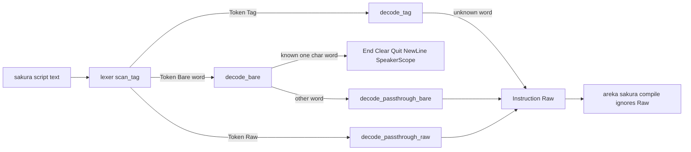
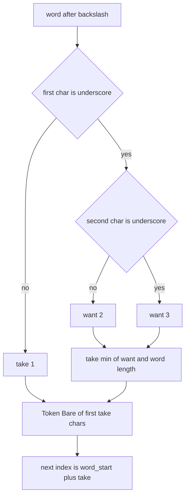

# Design Document: areka-P0-sakura-bare-tag-lexer

> 生成: 2026-09-02（`/kiro-spec-design -y`・ワークツリー `claude/sakura-bare-tag-lexer-bbdf8c`・HEAD `46e9ee49`）。
> 本書に書く行番号はすべて 2026-09-02 に実ファイルで再測定した値（`research.md` §10.2）。
> 要件 ID は `requirements.md` の番号をそのまま使う（`1.1a`・`1.1b`・`1.7a`・`5.3a`・`6.4a` を含む）。

## Overview

**Purpose**: さくらスクリプトの字句解析が、角括弧を伴わない `\_` 始まりのタグ（2 文字形 `\_a` `\_q` `\_n` `\_s` `\_V` `\_?` `\_+` `\_!`・3 文字形 `\__c` `\__t` `\__q` `\__v`）を最後まで 1 単位として読み取らず、末尾の文字を台詞として画面へ漏らす欠陥を是正する。是正後、利用者から見える変化は「台詞に混ざっていた余計な文字が消える」ことだけである。

**Users**: areka で既存の伺かゴースト（里々／YAYA 辞書）を動かす利用者と、そのゴーストの作者。里々のアンカー `\_a[ID]ラベル\_a` とクイックセクション `\_q…\_q` はこの形を日常的に使う。

**Impact**: `crates/areka-parsers` の `sakura` モジュールの内部型 `Token::Bare` を `char` から `String`（角括弧なしタグの綴り）へ広げ、字句層の角括弧なし経路の消費長を「`\_` ＋（`_` 0〜1 個）＋ 1 文字」の固定規律に置き換える。意味層は既知 1 文字タグの写像を綴りで引き直すだけで、新しい意味写像は追加しない。公開 API（`parse`・`Instruction`）は 1 バイトも動かない。適合対象フィクスチャ emo2 は角括弧なし `\_` を使わないため、表示結果と時間軸は不変である。

### Goals

- 角括弧なし `\_X`／`\__X` を 1 単位で消費し、余計な文字を本文へ漏らさない（要件 1）。
- タグに挟まれた台詞本文を 1 文字も欠かさない・増やさない（要件 2）。
- 切り分けた断片に意味を与えず、既存の素通し形式 `Instruction::Raw` にタグ全体の文字列で載せる（要件 3）。
- 既存の切り分け規律（既知 1 文字タグ・短縮形・角括弧形・エスケープ・未閉じ吸収）を 1 バイトも変えない（要件 4）。
- 是正を元へ戻しても・行き過ぎても赤になる決定論テストを新設する（要件 5）。
- 互換記録 §8 への 1 行登記と、発見元仕様への消化済み登記を残す（要件 6）。
- 触れるファイルを 1,000 行未満に保ち、実装と食い違う説明注記を残さない（要件 7）。

### Non-Goals

- `\_a`（アンカー）・`\_q`（一気表示）・`\_n`・`\_s`・`\_?`・`\_+`・`\_!`・`\_V`・`\__c`・`\__t`・`\__q`・`\__v` の**意味付け**。所有は `areka-P0-anchor-tag-canon`（`\_a`）・`areka-P0-sakura-time-directives`（`\_q`）、その他は所有先未定（`areka-P0-ukadoc-coverage-roadmap` の無所有一覧で裁定・要件 6.4／6.4a）。
- 角括弧付き `\_` タグ（`\_a[ID]`・`\_w[ms]`・`\_l[x,y]`・`\_s[ID...]`・`\_b[...]`・`\_m[...]`・`\_u[...]`・`\_v[...]`・`\__q[ID,...]`・`\__v[...]`・`\__w[...]`）の現在の扱い。
- `\_` 以外で始まるタグの切り分け（短縮形・システム変数・未閉じ吸収）。
- 実装が正典に合っていることを示す出典注記をソースへ置くこと（`areka-P0-ukadoc-survey-sakura-script` の担当・要件 6.5）。
- 隣接仕様の記録のうち自らの登記行以外の書き換え（要件 6.3）。

## Boundary Commitments

### This Spec Owns

- **字句層の角括弧なし経路の消費規律**（`crates/areka-parsers/src/sakura/lexer.rs` `scan_tag` の `else` 腕）: 「先頭が `_` なら `\_` ＋（`_` 0〜1 個）＋ 1 文字、先頭が `_` でなければ 1 文字」という固定長の決定と、その純粋関数化。
- **`Token::Bare` の載荷型**（`char` → `String`）とその不変条件（下記 Data Models）。
- **意味層の bare 写像の入口の形**（`decode_bare(word: &str)`・`decode_passthrough_bare(word: &str)`）。既知 1 文字語の写像内容は変えず、未知語は `Instruction::Raw("\\" + 綴り)` へ落とす。
- 新設テスト 2 ファイル（`lexer_bare_tag_tests.rs`・`parse_bare_tag_tests.rs`）と、`lexer.rs`／`parse.rs` 末尾に置くパス属性つきの接続宣言、既存 `lexer_tests.rs` の型追随（機械置換）。
- 触れるファイル内の、実装と食い違う説明注記の訂正（`lexer.rs:8` `:34` `:124` `:125` `:132` `:133` `:173-174`・`decode.rs:163` `:328`）。
- `doc/COMPAT_ARCHITECTURE.md` §8 の 1 行と、`.kiro/specs/areka-P0-anchor-tag-canon/brief.md` 末尾の登記 1 行。

### Out of Boundary

- `decode_tag`（角括弧付きタグ）の全腕・`decode_bare` の既知 1 文字語の写像内容・`fold_*`（`\![*]` マーカー／旧 2 連 `\q`）・`scan_bracket_args`・`scan_sysvar`・エスケープ処理。これらは**読むだけで編集しない**。
- `Instruction` 列挙（`model.rs`）への variant 追加。`Instruction::Raw` の意味の変更。
- `crates/areka-sakura/src/compile.rs` の catch-all（`Raw` を無視する経路）。
- `file_length_guard_test.rs` の例外表。
- ソースへの ukadoc URL 注記。
- `anchor-tag-canon` brief の登記行以外・roadmap・steering の書き換え（roadmap ⓪ 行の消し込みは `/kiro-complete` の手順に従う）。

### Allowed Dependencies

- 既存の `sakura` モジュール内依存方向 **`model ← lexer ← decode ← parse`** をそのまま使う。`lexer` は `model` を知らず、`decode` が `lexer::Token` と `model::Instruction` の両方を知る。逆向きの import は作らない。
- 既存の素通し道具 `Instruction::Raw`・`format!("\\{word}")`（`decode_passthrough_bare`）を再利用する。
- 新しい crate 依存・新しい feature は追加しない。Rust 2024・`std` のみ。
- テストは `#[test]` のみ（決定論・GPU 非依存・実機非依存）。

### Revalidation Triggers

- `Token::Bare` の載荷型または不変条件を再び変える変更（後着仕様が `\_` 系へ意味を付けるときは `decode_bare` に腕を足すだけで済む設計だが、型を変えるなら本書のテスト 2 ファイルを再検証する）。
- `scan_tag` のワード走査停止条件（`[`／`\`／`%`）を変える変更（消費規律は「ワード長を使わない」ことを前提にしている）。
- `decode_passthrough_bare` の出力形式（`\` ＋ 綴り）を変える変更（COMPAT §8 の登記行と要件 3.2 が壊れる）。
- `Instruction::Raw` を `compile.rs` が無視しなくなる変更（要件 3.3「表示にも待ちにも変換しない」が下流で破れる）。
- 正典（ukadoc）に `_` 3 個以上の角括弧なしタグが追加された場合（固定規律の上限 3 文字を見直す）。

## Architecture

### Existing Architecture Analysis

- `crates/areka-parsers/src/sakura/` は 4 層の線形パイプライン（`model ← lexer ← decode ← parse`）で、公開面は `parse(&str) -> Vec<Instruction>` と `Instruction` 系のみ（`mod.rs:35-36`・`parse.rs:28-30`）。`Token` は `pub(crate)` で crate 外へ出ない。
- 字句層 `scan_tag`（`lexer.rs:126-178`）は `\` の後ろのワードを `[`／`\`／`%` に当たるまで読み（`:152-157`）、直後が `[` なら角括弧経路（`:162-171`）、そうでなければ角括弧なし経路（`:172-177`）へ落ちる。**角括弧なし経路は作った `word` を捨て、先頭 1 文字だけを `Token::Bare(char)` として消費する**。これが欠陥の本体である。
- ワード走査は本文でも空白でも止まらないため、`\_aをクリックする。` の `word` は `_aをクリックする。` になる。**ワード長を消費長に使うと台詞が消える**（要件 2 の逆向きの失敗）。
- 意味層 `decode_bare(c: char)`（`decode.rs:174-186`）は `e`/`c`/`-`/`n`/`0`/`h`/`1`/`u` を写像し、他は `decode_passthrough_bare`（`:331-333`）で `Instruction::Raw(format!("\\{c}"))` へ落とす。角括弧付きの未知タグも `decode_passthrough_tag`（`:309-311`）で `Instruction::Raw` へ落ちる。
- 下流 `crates/areka-sakura/src/compile.rs:202-203` は `Instruction::Raw` を `tracing::debug!` で無視し cue を作らない。**`Raw` に落ちるものだけが利用者から見て何も起きない**。`Wait`（`:61-65`）と `Cursor`（`:137-149`）は実 cue になるため、`decode_tag` の `"_w"`／`"_l"` 腕（`decode.rs:196`・`:212`）へ角括弧なし形を流してはならない（案 B 却下の根拠）。

### Architecture Pattern & Boundary Map



**Architecture Integration**:
- 選んだ形: **案 A — `Token::Bare(char)` を `Token::Bare(String)` へ広げる**。角括弧なしタグの綴り（`\` を除く）をそのまま載せ、意味層は綴りで既知語を引く。
- 案 A を選ぶ理由（`research.md` §10.3 に詳細）:
  1. 「角括弧を伴わないタグの綴り」の一般形が `String` であり、既知 1 文字タグはその特殊事例になる。後で意味を付ける所有仕様は **`decode_bare` に腕を 1 本足すだけ**で構造化されたトークンを受け取れる。
  2. `Token::Raw` の意味（lexer が区切れなかった入力の逐語受け皿・`lexer.rs:47-48`）を「未知だが正しく区切れたタグ」で汚さない。素通しは意味層の `Instruction::Raw` で行い、要件 3.4「既存の素通し形式と同じ」を満たす。
  3. 利用者から見える挙動は案 C（lexer が `Token::Raw("\\_X")` を返す）と同一なので、差は保守性と拡張点の置き場だけになる。
- 却下した形: **案 B**（`Token::Tag{word, args: []}`）は `\_w`／`\_l` が `Wait`／`Cursor` になり要件 3.1／3.3 を破る。**案 D**（ワード全体を消費）は台詞本文を飲み込み要件 2 を破る。**案 C** は退避案として `research.md` に記録。
- 既存パターンの保存: 依存方向・`pub(crate)` の閉包・`Instruction::Raw` の素通し・`parse` の失敗しない契約（`parse.rs:13-14`）。
- 新規コンポーネント: 消費長を決める純粋関数 `bare_tag_len` 1 個のみ（判断分岐を 1 か所に閉じてテストで網羅するため）。

### Technology Stack

| Layer | Choice / Version | Role in Feature | Notes |
|-------|------------------|-----------------|-------|
| Parser crate | Rust 2024・`areka-parsers`（`crates/areka-parsers`） | 字句層・意味層の変更 | 新規依存なし |
| 下流（検証のみ） | `areka-sakura`（`crates/areka-sakura`） | `Instruction::Raw` の無視経路と emo2 断片の不変確認 | 編集しない |
| テスト | `cargo test`（決定論・`#[test]`） | 新設 2 ファイル＋既存追随 | GPU・実機・時計に依存しない |
| 行数規律 | `log-capture-kit` の `file_length_guard_test.rs` | 1,000 行上限の機械検査 | 例外表は触らない |

## File Structure Plan

### Directory Structure

```
crates/areka-parsers/src/sakura/
├── lexer.rs                     # 変更: Token::Bare(String)・bare_tag_len・角括弧なし経路・注記訂正・末尾に接続宣言
├── decode.rs                    # 変更: decode_bare(&str)・decode_passthrough_bare(&str)・注記訂正
├── parse.rs                     # 変更: 末尾に接続宣言のみ（#[cfg(test)] #[path = "parse_bare_tag_tests.rs"] mod bare_tag_tests;）
├── lexer_tests.rs               # 変更: Token::Bare('x') → Token::Bare("x".to_string()) の機械置換 11 行
├── lexer_bare_tag_tests.rs      # 新規: 字句層（lex → Token 列）の判断分岐網羅
└── parse_bare_tag_tests.rs      # 新規: 通し（parse → Instruction 列）で表示本文と Raw の形を固定
doc/
└── COMPAT_ARCHITECTURE.md       # 変更: §8 表へ 1 行追記
.kiro/specs/areka-P0-anchor-tag-canon/
└── brief.md                     # 変更: 末尾に消化済み登記 1 行追記（他は不変）
```

### Modified Files

- `crates/areka-parsers/src/sakura/lexer.rs`（285 行 → 約 300 行）
  - `:35` `Bare(char)` → `Bare(String)`。doc（`:34`）を「角括弧を伴わないタグの綴り（`\` を除く）。既知 1 文字タグ `e` `c` `-` `n` … と、`\_` 始まりの 2〜3 文字形 `_a` `__q` 等」へ。
  - `:129` 末尾裸 `\` → `Token::Bare("\\".to_string())`（挙動不変）。
  - `:172-177` 角括弧なし経路 → `bare_tag_len(&word)` で消費長 `take` を決め、`chars[word_start..word_start + take]` を綴りにして `Token::Bare(綴り)` を返し、`word_start + take` を次位置とする。
  - 新規 `fn bare_tag_len(word: &str) -> usize`（private・純粋）: 下記 Components の契約。
  - 注記訂正: `:8`（「1 文字タグ」→ 綴り単位）・`:124`／`:133`（短縮対象語の例に `\p` を加える——実装の `SHORTHAND_WORDS` は `w` `b` `p` の 3 語）・`:125`・`:132`（「空白」を削除し、実装どおり `[`／`\`／`%` でのみ止まると書く）・`:173-174`。ukadoc URL は書かない。
  - 末尾に接続宣言 `#[cfg(test)] #[path = "lexer_bare_tag_tests.rs"] mod bare_tag_tests;` を置く（steering `structure.md` Unit Tests の規約。`mod.rs` 経由は歴史形で新規には使わない）。
- `crates/areka-parsers/src/sakura/decode.rs`（348 行 → 約 350 行）
  - `:156` `Token::Bare(word) => decode_bare(&word)`。
  - `:174` `fn decode_bare(word: &str)`: `match word { "e" | "c" | "-" | "n" | "0" | "h" | "1" | "u" => 既存写像 (内容不変), other => decode_passthrough_bare(other) }`。`:163` の「角括弧なし 1 文字」を訂正。
  - `:331` `fn decode_passthrough_bare(word: &str) -> Instruction { Instruction::Raw(format!("\\{word}")) }`。`:328` の説明を訂正。
  - `decode_tag`（`:191-221`）・`fold_*`・`is_*` は**触らない**。
- `crates/areka-parsers/src/sakura/parse.rs`（末尾 +3 行）: `#[cfg(test)] #[path = "parse_bare_tag_tests.rs"] mod bare_tag_tests;` のみ。本体は触らない。`mod.rs` は**編集しない**。
- `crates/areka-parsers/src/sakura/lexer_tests.rs`（458 行・行数不変）: `:92` `:93` `:94` `:100` `:161` `:163` `:174` `:229` `:323` `:436` `:454` の `Token::Bare('X')` を `Token::Bare("X".to_string())` へ。期待値の意味は変えない。
- `doc/COMPAT_ARCHITECTURE.md`（216 行 → 217 行）: `:207` の直後に §8 の 1 行（4 欄・文面は Components「COMPAT 登記」）。
- `.kiro/specs/areka-P0-anchor-tag-canon/brief.md`（62 行 → 63 行）: 末尾に blockquote 1 行（文面は Components「隣接仕様登記」）。他の行は 1 文字も変えない。

### New Files

- `crates/areka-parsers/src/sakura/lexer_bare_tag_tests.rs`（見積 250〜350 行）: `lexer.rs` の子モジュールなので `use super::{Token, lex};`。Testing Strategy の T1〜T15。
- `crates/areka-parsers/src/sakura/parse_bare_tag_tests.rs`（見積 200〜300 行）: `parse.rs` の子モジュールなので `use super::parse; use super::super::model::Instruction;`。Testing Strategy の P1〜P10。

> 命名は `.kiro/steering/structure.md` の `<stem>_<モジュール名>.rs`（stem ＝ `lexer`／`parse`・モジュール名 ＝ `bare_tag_tests`）。接続は同 steering の Unit Tests 規約どおり**本番ファイル末尾**に `#[cfg(test)] #[path = "<stem>_bare_tag_tests.rs"] mod bare_tag_tests;` を置く。既存兄弟（`lexer_tests` 等）が `mod.rs` から繋がっているのは歴史形であり、新規には使わない（設計検証の指摘 1）。逆引きの最長 stem 規則で `lexer_tests`／`parse_tests` とは衝突しない。

## System Flows

角括弧なし経路の消費長の決定（`bare_tag_len`）。



- 消費長は**ワード走査の結果の長さを使わない**。`word` は `[`／`\`／`%` でしか止まらず本文を含み得るため、長さは「先頭 1〜3 文字だけを見て」決める。
- `min(want, len)` の頭打ちは要件 1.7／1.7a（`\_`／`\__` が入力末尾）と要件 1.6（`\_` の直後に `\`／`%`）を同じ式で満たす。
- `_` が 3 個以上続く場合（`\___x`）は 2 文字目が `_` なので `want = 3` → 綴り `___`、続く `x` は本文（要件 1.1b）。
- `want` の上限 3 は正典の全件走査で `_` 3 個以上の角括弧なしタグが 0 件であることに基づく（`research.md` §10.1）。

## Requirements Traceability

| Requirement | Summary | Components | Interfaces | Flows |
|-------------|---------|------------|------------|-------|
| 1.1 | `\_` ＋ 1 文字を 1 単位で消費 | 字句層 角括弧なし経路・`bare_tag_len` | `bare_tag_len`・`Token::Bare` | 消費長決定 |
| 1.1a | `\__` ＋ 1 文字を 1 単位で消費 | 同上 | 同上 | 同上（`want = 3`） |
| 1.1b | `_` 3 個以上は新形にしない（`\___x` ＝ `\___` ＋ `x`） | 同上 | 同上 | 同上 |
| 1.2 | 正典 12 タグへ同一規律 | 同上・字句テスト T1/T2 | — | — |
| 1.3 | 続く文字種を問わない（`\_z` 等） | 同上・T4 | — | — |
| 1.4 | 大小文字を区別 | `char` 比較のみ・T3 | — | — |
| 1.5 | 直後の本文は独立した本文 | 消費長の頭打ちが本文へ及ばない・T5 | — | 消費長決定 |
| 1.6 | 直後の `\`／`%` は独立 | ワード走査の停止条件（不変）＋ `min`・T6/T7 | — | 同上 |
| 1.7 | `\_` が入力末尾 | `min(2, 1)`・T8 | — | 同上 |
| 1.7a | `\__` が入力末尾 | `min(3, 2)`・T8 | — | 同上 |
| 1.8 | ワード直後が `[` なら角括弧経路 | 角括弧経路（不変）・T10 | — | — |
| 2.1 | 挟まれた本文を欠落・追加なく表示 | 通しテスト P1〜P3・P10 | `parse` | — |
| 2.2 | `\_q…\_q` → 本文のみ | P1 | `parse` | — |
| 2.3 | `\_a[Hint]アンカー\_aをクリックする。` → 本文のみ | P2（変異対の要） | `parse` | — |
| 2.4 | 直後の本文を吸い込まない | T5・P2・P3 | — | 消費長決定 |
| 2.5 | 全角半角混在でも成立 | T11・P10 | — | — |
| 2.6 | `\__q[OnTest]選ぶ\__qこの例の場合` → 「選ぶこの例の場合」 | P3 | `parse` | — |
| 3.1 | 新しい動作を与えない | 意味層 `decode_bare`（未知語は素通し）・P5 | `decode_bare` | — |
| 3.2 | タグ全体の文字列を保持 | `decode_passthrough_bare` → `Raw("\\" + 綴り)`・P5 | 同上 | — |
| 3.3 | 表示にも待ちにも変換しない | `Raw` は `compile.rs:202-203` で無視・P5/P7 | — | — |
| 3.4 | 既存の素通し形式と同じ | `Instruction::Raw` を再利用・variant 追加なし | — | — |
| 3.5 | 未知でも中断せずエラーなし | `parse` の失敗しない契約（不変）・P6 | `parse` | — |
| 4.1 | 既知 1 文字タグの切り分けと動作を変えない | `bare_tag_len` の「先頭が `_` でなければ 1」・T13・P9 | — | 消費長決定 |
| 4.2 | 1 文字タグ直後の本文を吸い込まない | T13 | — | 同上 |
| 4.3 | 短縮形の規律を変えない | 短縮形判定（`lexer.rs:142-149`・不変）・T14 | — | — |
| 4.4 | エスケープ・クォートを変えない | `lex`／`scan_bracket_args`（不変）・T14 | — | — |
| 4.5 | 未閉じの寛容吸収を変えない | 角括弧経路 `Unclosed`（不変）・T14 | — | — |
| 4.6 | 引数分割を変えない | `scan_bracket_args`（不変）・T14・P8 | — | — |
| 4.7 | emo2 の表示と時間軸を変えない | `\_l[5em,2lh]` は角括弧経路・P8・`cargo test -p areka-sakura` | — | — |
| 5.1 | 12 タグ各々を固定 | T1/T2・P5 | — | — |
| 5.2 | 開始形と終了形の対 | P1〜P4 | — | — |
| 5.3 | `\_`／`\__` 単独末尾 | T8・P6 | — | — |
| 5.3a | `\___x` が新形でないことを固定 | T9 | — | — |
| 5.4 | 直後に本文・`\`・`%` の 3 境界 × 2 形 | T5/T6/T7 | — | — |
| 5.5 | 是正を戻すと失敗する対 | T12・P2＋変異手順 ⑴ | — | — |
| 5.6 | 広く読みすぎを検出する対 | T5・T12・P2・P3＋変異手順 ⑵ | — | — |
| 5.7 | 既存規律の前後同一 | T13〜T15・P8/P9＋既存 3 テストファイル | — | — |
| 5.8 | 決定論の範囲を実機へ回さない | 全テストが `#[test]`・時計/GPU/実機非依存 | — | — |
| 5.9 | 対象 crate と全体を緑 | 実行手順（Testing Strategy） | — | — |
| 6.1 | COMPAT §8 へ 4 欄 1 行 | COMPAT 登記 | — | — |
| 6.2 | 発見元仕様へ取り込み番号付きで登記 | 隣接仕様登記（実装時に仮置き・完了時に PR 番号確定の 2 段） | — | — |
| 6.3 | 登記行以外を書き換えない | 隣接仕様登記（追記のみ） | — | — |
| 6.4 | 意味付けの所有を変えない | 登記文面が所有先を名指しで引用するのみ | — | — |
| 6.4a | 所有先未定を明記し割り当てない | 登記文面「その他 10 タグは所有先未定」 | — | — |
| 6.5 | 出典注記をソースへ置かない | 注記訂正の範囲を「実装との食い違い」に限定 | — | — |
| 7.1 | 行数上限と例外表 | File Structure Plan の見積・`file_length_guard_test.rs` 緑 | — | — |
| 7.2 | 解析を中断する新経路を作らない | `bare_tag_len` は常に 1 以上を返し `lex` は前進する | — | 消費長決定 |
| 7.3 | 新しい意味写像を足さない | `decode_bare` の既知語集合は不変 | — | — |
| 7.4 | 範囲外ファイルを編集しない | File Structure Plan の 8 ファイルのみ | — | — |
| 7.5 | 実装と食い違う注記を残さない | 注記訂正（`lexer.rs:8` `:34` `:124` `:125` `:132` `:133` `:173-174`・`decode.rs:163` `:328`） | — | — |

## Components and Interfaces

| Component | Domain/Layer | Intent | Req Coverage | Key Dependencies (P0/P1) | Contracts |
|-----------|--------------|--------|--------------|--------------------------|-----------|
| 字句層 角括弧なし経路 ＋ `bare_tag_len` | `lexer.rs` | 角括弧なしタグの消費長を固定規律で決め `Token::Bare(綴り)` を返す | 1.1, 1.1a, 1.1b, 1.2, 1.3, 1.4, 1.5, 1.6, 1.7, 1.7a, 1.8, 2.4, 4.1, 4.2, 7.2 | ワード走査（P0・不変）・`Token`（P0） | Service |
| `Token::Bare(String)` | `lexer.rs`（型） | 角括弧なしタグの綴りを載せる内部トークン | 3.2, 3.4 | `decode`（Inbound・P0） | State |
| 意味層 bare 写像 | `decode.rs` | 既知 1 文字語のみ写像し、未知語を `Instruction::Raw` へ素通し | 3.1, 3.2, 3.3, 3.4, 3.5, 4.1, 7.3 | `Token::Bare`（P0）・`Instruction::Raw`（P0） | Service |
| 注記訂正 | `lexer.rs`・`decode.rs` | 実装と食い違う説明を実装に合わせる（出典注記は置かない） | 6.5, 7.5 | — | — |
| 字句テスト `lexer_bare_tag_tests.rs` | テスト | `lex` の判断分岐を網羅・変異対 | 1.x, 2.4, 2.5, 4.1〜4.6, 5.1, 5.3, 5.3a, 5.4, 5.5, 5.6, 5.7, 5.8 | `lex`・`Token` | — |
| 通しテスト `parse_bare_tag_tests.rs` | テスト | `parse` で表示本文と `Raw` の形を固定 | 2.1〜2.6, 3.1〜3.5, 4.1, 4.6, 4.7, 5.1, 5.2, 5.3, 5.5, 5.6, 5.7, 5.8 | `parse`・`Instruction` | — |
| COMPAT 登記 | `doc/COMPAT_ARCHITECTURE.md` §8 | 裁量を 4 欄 1 行で記録 | 6.1, 6.4, 6.4a | — | — |
| 隣接仕様登記 | `anchor-tag-canon/brief.md` | 消化済みを取り込み番号付きで 1 行登記 | 6.2, 6.3, 6.4 | — | — |

### 字句層

#### 角括弧なし経路 ＋ `bare_tag_len`

| Field | Detail |
|-------|--------|
| Intent | `scan_tag` の角括弧なし腕で、綴りの先頭だけを見て消費長を決め、`Token::Bare(綴り)` を返す |
| Requirements | 1.1, 1.1a, 1.1b, 1.2, 1.3, 1.4, 1.5, 1.6, 1.7, 1.7a, 1.8, 2.4, 4.1, 4.2, 7.2 |

**Responsibilities & Constraints**
- 消費長は `bare_tag_len(&word)` が返す値のみ。**`word.chars().count()` を消費長に使ってはならない**（`word` は本文を含み得る）。
- 角括弧経路（直後が `[`）と短縮形判定は本経路の**手前**で確定済みであり、本経路はそれらに触れない（要件 1.8／4.3）。
- 返す次位置は `word_start + take`。`take >= 1` なので `lex` は必ず前進し、解析は中断しない（要件 7.2）。

**Dependencies**
- Inbound: `lex`（`\` 検出後に `scan_tag` を呼ぶ）— P0。
- Outbound: `Token::Bare` — P0。
- External: なし。

**Contracts**: Service [x] / API [ ] / Event [ ] / Batch [ ] / State [ ]

##### Service Interface

```rust
/// 角括弧なしタグの消費長（`\` を除く綴りの文字数）を決める純粋関数。
/// `word` は `\` の直後から `[`/`\`/`%` の手前までの走査結果（本文を含み得る・空でない）。
fn bare_tag_len(word: &str) -> usize;
```

- Preconditions: `word` は 1 文字以上（`scan_tag` は `\` の次の文字が存在する場合のみここへ来る）。
- Postconditions（決定表・`n = word.chars().count()`）:

| 先頭 | 2 文字目 | 返り値 | 例（入力 → 綴り／残り） |
|---|---|---|---|
| `_` 以外 | 問わない | `1` | `\eあ` → `e`／`あ`・`\iい` → `i`／`い` |
| `_` | 無い（`n = 1`） | `1` | `\_`（末尾）→ `_`・`\_\e` → `_` ＋ 次のタグ |
| `_` | `_` 以外 | `min(2, n) = 2` | `\_a本文` → `_a`／`本文`・`\_q` → `_q` |
| `_` | `_`・`n = 2` | `min(3, 2) = 2` | `\__`（末尾）→ `__`・`\__\e` → `__` ＋ 次のタグ |
| `_` | `_`・`n >= 3` | `3` | `\__q本文` → `__q`／`本文`・`\___x` → `___`／`x` |

- Invariants: 返り値は `1 <= 返り値 <= min(3, n)`。`word` の 4 文字目以降は結果に影響しない。大小文字の正規化をしない（`\_V` と `\_v` は別綴り・要件 1.4）。

**Implementation Notes**
- Integration: `scan_tag` の `else` 腕を `let take = bare_tag_len(&word); let spelling: String = chars[word_start..word_start + take].iter().map(|&(_, c)| c).collect(); (Token::Bare(spelling), word_start + take)` の形にする。末尾裸 `\`（`:128-130`）は `Token::Bare("\\".to_string())` で挙動不変。
- Validation: 字句テスト T1〜T15。変異手順 ⑴⑵（Testing Strategy）を実際に適用して赤を確認する。
- Risks: 「ワード全体を消費」への誤実装。契約の「使ってはならない」を注記に残し、T5／T12 で塞ぐ。

### 意味層

#### bare 写像（`decode_bare` / `decode_passthrough_bare`）

| Field | Detail |
|-------|--------|
| Intent | `Token::Bare(綴り)` を、既知 1 文字語ならこれまでどおりの命令へ、それ以外は `Instruction::Raw` へ写す |
| Requirements | 3.1, 3.2, 3.3, 3.4, 3.5, 4.1, 7.3 |

**Responsibilities & Constraints**
- 既知語集合は **`e` `c` `-` `n` `0` `h` `1` `u` の 8 語で固定**（要件 7.3）。腕を足すのは各所有仕様の仕事。
- 未知語は `Instruction::Raw(format!("\\{word}"))`。`\_a` → `Raw("\\_a")`・`\__q` → `Raw("\\__q")`・`\_` → `Raw("\\_")`・末尾裸 `\` → `Raw("\\\\")`（現行と同一）。
- `Instruction` に variant を足さない。`Result` を返さない（`parse.rs:13` の契約）。

**Dependencies**
- Inbound: `decode_token`（`decode.rs:156`）— P0。
- Outbound: `Instruction`（`model.rs`）— P0。`Instruction::Raw` の無視経路（`compile.rs:202-203`）— P1（本仕様は触らないが要件 3.3 の成立条件）。

**Contracts**: Service [x] / API [ ] / Event [ ] / Batch [ ] / State [ ]

##### Service Interface

```rust
/// 角括弧なしタグの綴り（`\` を除く）を `Instruction` へ写像する。
fn decode_bare(word: &str) -> Instruction;

/// 既知語以外の綴りを、情報を失わない `Raw`（`\` ＋ 綴り）へ落とす。
fn decode_passthrough_bare(word: &str) -> Instruction;
```

- Preconditions: `word` は `bare_tag_len` の規律で切られた綴り（1〜3 文字、または末尾裸 `\` の `"\\"`）。
- Postconditions: 既知 8 語は現行 `decode_bare(char)` と同じ命令。それ以外は `Instruction::Raw` で、文字列は `\` ＋ `word` に逐語一致。
- Invariants: 失敗しない・panic しない・ログを出さない（現行と同じ）。

**Implementation Notes**
- Integration: `Token::Bare(c) => decode_bare(c)` を `Token::Bare(word) => decode_bare(&word)` に。`match word { "e" => …, "0" | "h" => …, other => decode_passthrough_bare(other) }`。
- Validation: 通しテスト P5〜P9。特に `\_w`／`\_l` の角括弧なし形が `Wait`／`Cursor` にならず `Raw` になること（案 B の副作用が入っていない証拠）。
- Risks: 後着仕様との rebase で `decode_bare` のシグネチャ差が出る。本仕様が先に着地する前提（roadmap ⓪ 行）。

### 注記訂正

| Field | Detail |
|-------|--------|
| Intent | 触れるファイルの説明注記を実装の実際の振る舞いに合わせる（出典注記は置かない） |
| Requirements | 6.5, 7.5 |

- `lexer.rs:132`「…／`%`／空白に当たるまで」→「`[`／`\`／`%` に当たるまで（本文でも空白でも止まらない。角括弧なし経路はこのワード長を消費長に使わない）」。
- `lexer.rs:8`・`:34`・`:125`・`:173-174`・`decode.rs:163`・`:328` の「1 文字」を「綴り（1〜3 文字）」の表現へ。
- `lexer.rs:124`・`:133` の短縮対象語の例（`\wN`/`\bN`・`\w`/`\b`）に `\p` を加え、実装の `SHORTHAND_WORDS`（`w` `b` `p`）と一致させる。
- ukadoc の URL・「正典に合致」を示す文言は書かない（`areka-P0-ukadoc-survey-sakura-script` の担当）。

### 登記

#### COMPAT 登記（`doc/COMPAT_ARCHITECTURE.md` §8・`:207` の直後に 1 行）

| 項目 | 裁量 | 根拠 | 出典 spec |
|---|---|---|---|
| 角括弧なし `\_` タグ（2 文字形 `\_X`・3 文字形 `\__X`）の字句境界と意味 | 消費長は「`\_` ＋（`_` 0〜1 個）＋ 1 文字」の固定長で 1 単位に切り分け、意味を与えず `Instruction::Raw`（タグ全体の文字列）として素通し（表示も待ちも生じない）。`_` 3 個以上は新形として扱わない（`\___x` ＝ `\___` ＋ 本文 `x`）。意味付けは各所有 spec（`\_a` ＝ `areka-P0-anchor-tag-canon`・`\_q` ＝ `areka-P0-sakura-time-directives`・その他 10 タグ `\_n` `\_s` `\_V` `\_?` `\_+` `\_!` `\__c` `\__t` `\__q` `\__v` は所有先未定＝`areka-P0-ukadoc-coverage-roadmap` の無所有一覧で裁定） | 正典は角括弧なし `\_` タグの終端規則を明文化せず記述例で示すのみ・角括弧なし形は全 12 個が `\_` ＋ 0〜1 個の `_` ＋ 1 文字で終わる（`\___X` は ukadoc スナップショット全 2,983 項目で 0 件）・ワード走査長で消費すると台詞本文を飲み込む | areka-P0-sakura-bare-tag-lexer |

#### 隣接仕様登記（`.kiro/specs/areka-P0-anchor-tag-canon/brief.md` 末尾に 1 行）

- 取り込み番号は当該 brief 内の消化済み登記の通し番号（本件が **消化済み①**）。追跡キーは spec 名 ＋ PR 番号の 2 本。PR 番号は `/kiro-complete` の squash 時に採番されるため実装時点では書けないので、登記は **2 段**で行う（設計ディスカッション議題 1 で確定）:
  1. **実装時（本仕様のタスク）**: 下の文面を 1 行追記し、PR 番号の位置に `PR #（完了時に記入）` と置く。
  2. **完了時（`/kiro-complete` の最終コミット直前・参照パス修正の工程と同じ段）**: squash PR の番号が採番されたら、**自分の登記行のこの 1 か所だけ**を `PR #NNN` へ置き換える。他の行には触れない（要件 6.3）。完了スキルの「参照パス修正」工程で本行を対象に含めること。
- 文面（実装時）: `> **2026-09-XX 追記（消化済み①・areka-P0-sakura-bare-tag-lexer・PR #（完了時に記入））**: 上記「直接修正」＝角括弧なし \_ タグの消費是正は spec areka-P0-sakura-bare-tag-lexer で消化済み（規律＝\_＋_ 0〜1 個＋1 文字の固定長・\__X 3 文字形も射程・意味付けなし＝Instruction::Raw 素通し・決定論テスト新設）。本 spec に lexer 修正は残らず規模は L→M。`（`XX` は実装日）
- 文面（完了時）: 同じ行の `PR #（完了時に記入）` を `PR #NNN` へ置換するのみ。
- 制約: この 1 行以外は 1 文字も変えない（要件 6.3）——完了時の置換も同じ行の中に閉じる。文面は `\_a` の意味付けの所有を `anchor-tag-canon` に残したまま（要件 6.4）。

## Data Models

### Domain Model

- **`Token::Bare(String)`**（`lexer.rs`・`pub(crate)`）: 角括弧を伴わないタグの綴り（先頭の `\` を除く）。
  - 不変条件: 長さ 1〜3 文字。先頭が `_` でなければ長さ 1。先頭が `_` なら長さは `bare_tag_len` の決定表に従う。末尾裸 `\` は綴り `"\\"`（長さ 1）。
  - 値の例: `"e"` `"c"` `"-"` `"n"` `"0"` `"1"` `"h"` `"u"`（既知）・`"i"` `"j"`（未知 1 文字）・`"_"` `"__"` `"___"` `"_a"` `"_q"` `"_V"` `"_?"` `"_+"` `"_!"` `"__c"` `"__t"` `"__q"` `"__v"` `"_z"`。
  - 派生: `Instruction::Raw` の文字列は常に `"\\"` ＋ 綴り（逐語復元可能・情報を失わない）。
- **`Instruction::Raw(String)`**（`model.rs:60`・既存・不変）: 意味を持たない生の断片。本仕様は新しい variant を足さず、既存の `Raw` に載せる。
- `Token::Tag`／`Token::Raw`／`Token::Shorthand`／`Token::SysVar`／`Token::Text` は不変。

### Data Contracts & Integration

- 公開契約 `parse(&str) -> Vec<Instruction>` は形も意味も不変。crate 外へ出る型に変化はない。
- 挙動が変わる入力は「角括弧なしで `\_` に 1 文字以上が続くもの」だけ。その出力は `Instruction::Raw(タグ全体)` ＋ 後続の `Text`（本文があれば）。

## Error Handling

- 新しいエラー経路は作らない。`parse` は `Result` を返さず、`bare_tag_len` は常に 1 以上を返すので `lex` は必ず前進する（要件 3.5／7.2）。
- 未知の綴り（`\_z`・`\___`）は `Instruction::Raw` へ落ち、下流 `compile.rs:202-203` が `tracing::debug!` で無視する。新しいログは足さない（既存経路が `Raw` の無視ログを既に出す）。
- panic・`unwrap`・添字の範囲外を作らない: `take <= word.chars().count()` が決定表で保証されるため `chars[word_start..word_start + take]` は常に範囲内。

## Testing Strategy

すべて決定論（`#[test]`・時計/GPU/実機に依存しない・要件 5.8）。各項目は要件の受入基準から導出し、テスト名は挙動を英語で書く（既存ファイルの流儀）。

### 字句テスト `crates/areka-parsers/src/sakura/lexer_bare_tag_tests.rs`（`lex` → `Token` 列）

- **T1** 2 文字形の全件（`\_a` `\_q` `\_n` `\_s` `\_V` `\_?` `\_+` `\_!` の各々）: `lex(r"\_X") == [Bare("_X")]`（1.1・1.2・5.1）。
- **T2** 3 文字形の全件（`\__c` `\__t` `\__q` `\__v`）: `[Bare("__X")]`（1.1a・1.2・5.1）。
- **T3** 大小文字の区別: `\_V` と `\_v` が別の綴り（1.4）。
- **T4** 正典に無い組み合わせ（`\_z`・`\_9`・`\_#`）も同じ規律（1.3）。
- **T5** 直後に本文（2 形）: `\_a本文` → `[Bare("_a"), Text("本文")]`・`\__q本文` → `[Bare("__q"), Text("本文")]`（1.5・2.4・5.4・5.6）。
- **T6** 直後に `\`（2 形）: `\_a\e` → `[Bare("_a"), Bare("e")]`・`\__q\e`（1.6・5.4）。
- **T7** 直後に `%`（2 形）: `\_a%username` → `[Bare("_a"), SysVar("username")]`・`\__q%username`（1.6・5.4）。
- **T8** 入力末尾: `\_` → `[Bare("_")]`・`\__` → `[Bare("__")]`（1.7・1.7a・5.3）。
- **T9** `_` 3 個以上: `\___x` → `[Bare("___"), Text("x")]`（1.1b・5.3a）。
- **T10** 角括弧優先: `\_a[Hint]` → `Tag{"_a",["Hint"]}`・`\__q[OnTest]` → `Tag`・`\_[x]` → `Tag{"_",["x"]}`（1.8）。
- **T11** 全角半角混在: `\_qあaい\_q` → `[Bare("_q"), Text("あaい"), Bare("_q")]`（2.5）。
- **T12** 変異対の要（字句層）: `\_a[Hint]アンカー\_aをクリックする。` → `[Tag{"_a",["Hint"]}, Text("アンカー"), Bare("_a"), Text("をクリックする。")]`（5.5・5.6）。
- **T13** 既知 1 文字タグ ＋ 直後の本文: `\eあ` `\cあ` `\-あ` `\nあ` `\0あ` `\1あ` `\hあ` `\uあ` → `[Bare("X"), Text("あ")]`（4.1・4.2・5.7）。
- **T14** 不変の抜き取り: 短縮形 `\w2`／`\w[2]`（4.3）・エスケープ `\\`／`\%`／`\s[a\]b]`・クォート `\s["a,b"]`（4.4）・未閉じ `\s[1000`／`\_a[`（4.5）・引数分割 `\![a,,c]`／`\s[]`（4.6）（5.7）。
- **T15** 末尾裸 `\`: `lex(r"\")` → `[Bare("\\")]`（挙動不変・4.1）。

### 通しテスト `crates/areka-parsers/src/sakura/parse_bare_tag_tests.rs`（`parse` → `Instruction` 列）

- **P1** `\_q文字を瞬間表示する。\_q` → `[Raw("\\_q"), Text("文字を瞬間表示する。"), Raw("\\_q")]`（2.1・2.2・3.2・5.2）。
- **P2** `\_a[Hint]アンカー\_aをクリックする。` → `[Raw("\\_a[Hint]"), Text("アンカー"), Raw("\\_a"), Text("をクリックする。")]`（2.3・5.2・5.5・5.6）。
- **P3** `\__q[OnTest]選ぶ\__qこの例の場合` → `[Raw("\\__q[OnTest]"), Text("選ぶ"), Raw("\\__q"), Text("この例の場合")]`（2.6・5.2・5.6）。
- **P4** `\__v[disable]しゃべらない。\__v` → `[Raw("\\__v[disable]"), Text("しゃべらない。"), Raw("\\__v")]`（5.2）。
- **P5** 12 タグ各々が単独で `[Raw("\\" + タグ)]` 1 個になり、`Wait`／`Cursor`／`NewLine`／`Text` 等を生まない。加えて正典外の `\_w`・`\_l`（角括弧なし）が `Raw` になり `Wait`／`Cursor` にならない（3.1・3.2・3.3・3.4・5.1）。
- **P6** 未知 `\_z`・末尾 `\_`／`\__` が `Raw` で、panic せず空にもならない（3.5・1.7・1.7a・5.3）。
- **P7** タグだけの入力から `Text` が生じない（3.3）。
- **P8** emo2 の実断片 `\_l[5em,2lh]` → `Cursor{x:"5em", y:"2lh"}`・`\_w[450]` → `Wait(450ms)` が不変（4.6・4.7・5.7）。
- **P9** 既知 1 文字タグの意味が不変: `\e`→`End`・`\c`→`Clear`・`\-`→`Quit`・`\n`→`NewLine(1.0)`・`\0`/`\h`→`SpeakerScope{0}`・`\1`/`\u`→`SpeakerScope{1}`（4.1・5.7）。
- **P10** 全角半角混在の本文が逐語で残る（2.1・2.5）。

### 変異手順（要件 5.5／5.6・実装タスクで実施し結果を記録する）

1. 是正後の全テストが緑であることを確認する。
2. **変異 ⑴（元の欠陥へ戻す）**: `bare_tag_len` の本体を `1` に置き換える（＝旧実装の `word_start + 1` と同値）。`cargo test -p areka-parsers` を実行。**期待の赤: T1・T2・T4・T5・T6・T7・T9・T11・T12・P1・P2・P3・P4・P5・P6**。**期待の緑: T3（別綴りであることは 1 文字でも成立）・T8・T10・T13・T14・T15・P7・P8・P9・P10**。
3. **変異 ⑵（広く読みすぎ）**: `bare_tag_len` の本体を `word.chars().count()`（ワード全体）に置き換える。**期待の赤: T5・T9・T11・T12・T13・P2・P3・P10**（T13 は `\eあ` が `Bare("eあ")` に、T9 は `\___x` が `Bare("___x")` になるため赤）。**期待の緑: T1・T2・T3・T4・T6・T7・T8・T10・T14・T15・P1・P4・P5・P6・P7・P8・P9**——タグが入力末尾か `\`／`%` の直前にある形はワード長 ＝ 固定長なので偶然通る。だから本文が続く形（T5・T11・T12・P2・P3・P10）を対に必ず含める。
   - 変異は `bare_tag_len` の**本体置換**で定義する（呼び出し側の式を変えない）。呼び出し側や `_` 分岐だけを変える別の変異では上の赤リストが変わるため、記録には「どの本体に置き換えたか」を添える。
4. どちらの変異も元へ戻し、再び全緑を確認する。変異ごとに赤になったテスト名を実装記録へ残す。

### 既存テストの扱い

- `lexer_tests.rs` の 11 行は型追随の機械置換のみ。`decode_tests.rs`・`validation_tests.rs`・`parse_tests.rs`・`model_tests.rs` は無変更で、既存規律の非回帰（要件 4.3〜4.6・5.7）を引き続き担う。

### 実行手順（要件 5.9・7.1）

1. `cargo test -p areka-parsers -p areka-sakura`（対象範囲。`areka-sakura` は emo2 断片を直入力する `compile_arm_tests.rs`／`drive_choice_tests.rs`／`drive_delivery_tests.rs` を含み、要件 4.7 の確認を兼ねる）。
2. `cargo test -p log-capture-kit`（行数上限の機械検査。例外表は触らない）。
3. ワークスペース全体: 先に i686 の host-32 成果物をビルドしてから `cargo test --workspace`（記憶「workspace test は i686 host-32 成果物が要る」・クロスターゲットは PowerShell で実行）。
4. 出力の `| tail` は exit code を隠すため使わない（記憶「`cargo test | tail` は exit code を tail のものにする」）。

## Optional Sections

### Performance & Scalability

- `Token::Bare` が `char` から `String` になり、角括弧なしタグ 1 個につきヒープ確保が 1 回増える。さくらスクリプトは 1 トーク 1 回の parse で、既に `Token::Text`／`Token::Tag` が `String` を確保している経路に並ぶため測定対象にならない。目標値は設けない。

### Open Questions / Risks

- 未解決の要件はない。
- リスク: ⑴ ワード長で消費する誤実装（対策: 契約・注記・T5/T12・変異 ⑵）。⑵ 後着仕様との `decode_bare` シグネチャの rebase（対策: 本仕様の先行着地・roadmap ⓪ 行）。⑶ ワークスペース全体テストの i686 前提（対策: 実行手順に前置）。⑷ 隣接 brief の登記行に PR 番号が実装時点で書けない（対策: 実装時は仮置き、`/kiro-complete` の最終コミット直前に自分の行 1 か所だけ番号を埋める 2 段登記）。
