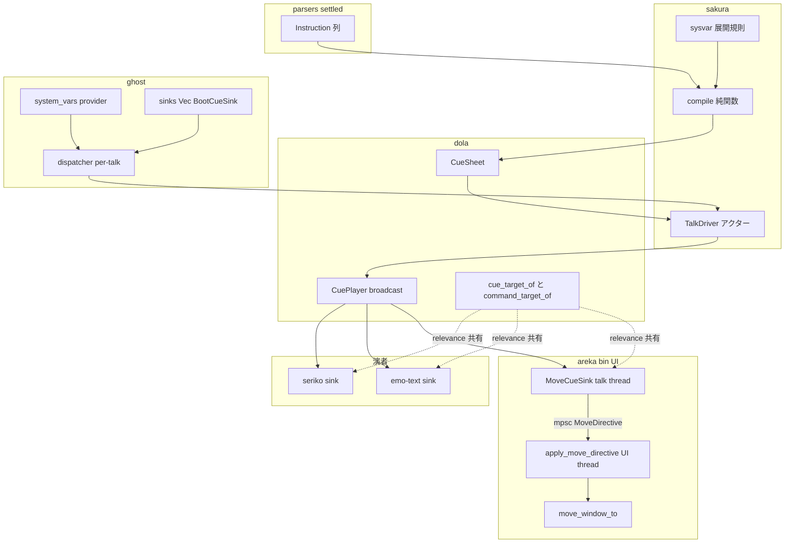
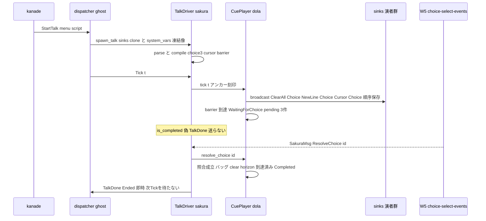
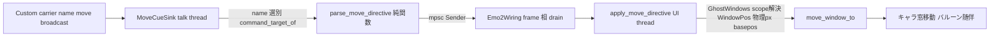

# Technical Design: areka-P0-sakura-dialogue-tags

## Overview

**Purpose**: emo2 のメニュー・位置調整・撫で talk が使う 4 語彙（`\q`／`\_l`／`\![move]` を含む `\!` 名前空間全体／`%username`）を、settled な cue モデル（`completed/areka-P0-cue-playback-duration`）の上へ additive に載せ、compile catch-all での無音落ちを根絶する。`\![move]` は末端（実際の窓移動）まで貫通させる。

**Users**: ゴースト利用者はダブルクリックメニュー・初回起動の立ち位置調整・撫で talk の名前呼びを取り戻す。下流 spec（`areka-P0-choice-render`＝W4・`areka-P0-choice-select-events`＝W5・`areka-P0-mayuna-compose`＝W2）は本 spec が確定する **choice cue 形・選択待ち barrier 並び規則・`\!` 汎用キャリア形・選択解決の口**を消費のみで使う（契約の正本）。

**Impact**: dola cue 語彙の additive 増分（`Cursor` variant・`Choice.references`・`CueTarget::Window`・名前権威表）＋ settled 挙動 2 点の**意図的仕様変更**（compile 除外集合の縮小＝Raw のみ・choice cue の配送列合流）＋ sakura compile の 4 アーム＋barrier 発行口＋ ghost boot の sink スロット可変長化＋ move 末端結線（新規 `MoveCueSink`＋UI 配送）。

### Goals

- fixture script 直入力から決定論的に正しい cue／barrier 列を得る（R9.1〜9.5/9.7/9.8）。
- choice cue 形・barrier 並び規則・`\!` 汎用キャリア形・`SakuraMsg` 解決アームを**正本として確定**し、下流が再定義なしに消費できる形にする（R1/R2/R4）。
- `\![move]` を実機の初回起動（OnFirstBoot）で末端まで貫通させる（R5・R9.6）。
- `%username` を値源非所有（スナップショット消費）のまま展開する（R7）。
- 既存 cue 挙動の非退行＋除外仕様の意図的更新を檻の対置換で行う（R8）。

### Non-Goals

- 選択肢の表示・UI・ヒットテスト・`\_l` の単位換算（em/lh/%）＝choice-render（W4）。
- 選択確定→SHIORI カスケード（ID 解釈・`OnChoiceSelect(Ex)` 判別・タイムアウト）＝choice-select-events（W5）。
- `\![bind]` 等 move 以外のコマンド**消費**（cue 化＝転写は本 spec のキャリアが行う）。
- compile 側時間指令 allowlist の実導出（語彙＋縮退のみ・追跡 spec `areka-P0-sakura-time-directives`）。
- 時間付き移動アニメーション・`\![moveasync]`（即時縮退・語彙保持）。
- 位置の永続化（sylphya persistent backing／position-persist）・宣言 `point.basepos` の実導出（追跡 spec `areka-P0-surfaces-basepos`）。
- プロパティシステム本体（`areka-P0-sylphya`）・`%username` 以外のシステム変数の実導出。

## Boundary Commitments

### This Spec Owns

- **choice cue の形**（`CueCommand::Choice{id,text,references}`）と**配送規則**（他 cue と順序を保った broadcast 合流＝案C）・**選択待ち barrier の並び規則**（choice ありの台本へ最終 offset に 1 個）。
- **`\!` 汎用コマンドキャリアの形**（`Custom` 正準形＝name＋カンマ分割生トークン列）と**消費側名前選別の単一権威表**（`command_target_of`）。
- **選択解決の口**（`SakuraMsg::ResolveChoice{id}`＝talk アクター境界の型付き入力）の定義（消費は W5）。
- cursor cue の形（`CueCommand::Cursor{x,y}` 不透明転写）。
- `%username` 展開の消費側契約（`SystemVarSnapshot` 型・展開/既定値/素通しの縮退規則・`DEFAULT_USERNAME` 定数）。
- move cue の末端消費（`MoveCueSink`→UI 配送→`move_window_to`）と `\![move]` 引数意味論の解決（正典既定 basepos・物理 px 一元）。
- ghost boot の sink スロット形（S-3 可変長・`BootCueSink`）と `system_vars` provider シーム。
- 除外仕様の意図的更新（compile 除外＝Raw のみ・choice 先積み一択の廃止・relevance 権威文言の改訂）とその檻の対置換。

### Out of Boundary

- 選択肢の表示・ヒットテスト・ハイライト・`\_l` の単位解釈（choice-render）。
- ID 解釈・カスケード則・タイムアウト決定・`OnChoiceTimeout`（choice-select-events）。
- `bind` ほか move 以外のコマンド名の action 実装（各消費 spec が権威表へ 1 行追記して実装）。
- スナップショットの実値供給（sylphya。W1 は ghost 暫定 provider＝既定値充填）。
- 永続化層・`ghost.dat`・ドラッグ確定ライターの変更（position-persist/sylphya）。
- areka-kanade・areka-talk・areka-parsers・areka-seriko の**ソース改変**（編集面外。seriko は既存 catch-all/relevance 枝が新 cue を吸収することを確認済み）。

### Allowed Dependencies

- dola cue モジュール（settled モデルへの additive 増分のみ・時間/配送/完了の規則は再定義しない）。
- `areka_parsers::sakura`（settled・読み取りのみ。`Instruction` 15 variant の転記結果を消費）。
- `areka-sakura`→dola、`areka-ghost`→`areka-sakura`、`crates/areka`→`areka-ghost` の既存依存方向（逆流禁止）。
- `crates/areka` の placement 資産（`move_window_to`・`GhostWindows`・`WindowPos`）と emo2_boot 結線資産（`Emo2Wiring`・`PresentBridge` パターン）。
- 新規 crates.io 依存なし・tokio 不使用・Rust 2024。

### Revalidation Triggers

- `CueCommand`／`CueTarget`／キャリア正準形（`Custom` の params 形）のワイヤ形変更 → W2/W4/W5・mayuna の再突合。
- `command_target_of` の写像変更（名前の担当変更）→ 当該名の消費 spec。
- `SakuraMsg` アームの形変更 → W5（choice-select-events）。
- choice cue の配送規則（順序・バッグ並存）変更 → W4/W5。
- `SystemVarSnapshot` の型・縮退規則変更 → sylphya（供給側）。
- `GhostBootOptions.sinks`／`spawn_talk` 署名変更 → W4 の演者追加・emo2-conformance-e2e。

## Architecture

### Existing Architecture Analysis

settled cue モデル（全て main 着地済み・実測正）:

- **compile（純関数）**: `Instruction` 列→`CueSheet`（D 焼き込み・ClearAll 前置・scope 転写・End/Quit 切詰め）。4 語彙は catch-all（`compile.rs:117-122`）で無音落ち＝本 spec の主戦場。`emit()` は `CueCommand` 専用で barrier 発行口がない。
- **配送**: `CuePlayer`（受動・注入時刻）が全 sink へ broadcast、演者側 relevance（`cue_target_of` 単一権威）が action を選別。Choice のみ `pending_choices` へ分離され**配送されない**（意図的更新の対象）。
- **完了**: 占有 horizon（entry 枯渇∧barrier なし∧horizon 到達）。barrier 判定は完了判定より先＝R2.3 は構造充足済み（新規調停を作らない）。
- **アクター**: talk ごとに `spawn_talk`（`SakuraMsg` inbox・Start/Tick/Close）。dispatcher（areka-ghost）が per-talk に sink を clone して spawn。`GhostBootOptions` は 2 固定スロット（意図的更新の対象）。
- **末端**: `move_window_to`（物理 px・バルーン随伴・warn+false）が dead_code で眠っている。UI スレッド専用（bevy World）ゆえ talk スレッドの sink から直接呼べない——`PresentBridge`（mpsc→frame 相 drain）が確立済みの跨ぎパターン。

### Architecture Pattern & Boundary Map



**Architecture Integration**:

- 選択パターン: **既存拡張＋move 末端のみ新規コンポーネント**（gap 分析 Option C）。cue 再生制御は dola 一本（新ランタイム・新配送機構を建てない）。
- 依存方向（左→右のみ import 可）: `dola` → `areka-parsers`/`areka-sakura` → `areka-ghost` → `crates/areka`（bin）。演者（seriko/emo-text）は dola 契約（re-export 経由）のみ消費。
- 保存する既存パターン: broadcast＋演者側 relevance・envelope 一律 duration honor・additive variant（balloon-face-cue 前例）・sink デコレータ/UI 配送ブリッジ（ClockedTextSink/PresentBridge）・ログ規律（無音失敗禁止）。
- 新規コンポーネントの理由: `MoveCueSink`＋`apply_move_directive` は「talk スレッド（純粋解釈）と UI スレッド（ライブ解決＋窓移動）」のスレッド境界が構造的に要求する 2 段。他は全て既存への additive アーム。
- Steering 準拠: 決定論テスト必達・面引数不透明・実機（実 DPI）サインオフ・正典 ukadoc。

### Technology Stack

| Layer | Choice / Version | Role in Feature | Notes |
|-------|------------------|-----------------|-------|
| 語彙/配送 | dola `cue`（既存） | additive variant・名前権威表・案C 配送 | 新規依存なし |
| コンパイル | areka-sakura（既存） | 4 アーム＋barrier 発行＋sysvar 展開 | 純関数維持 |
| 結線 | areka-ghost（既存） | S-3 sink Vec・provider シーム | dispatcher 刻印点 |
| UI/窓 | crates/areka＋wintf（既存） | move 末端（物理 px） | bevy World は UI スレッド固定 |

## File Structure Plan

### New Files

```
crates/areka-sakura/src/sysvar.rs        # SystemVarSnapshot・DEFAULT_USERNAME・展開規則（純関数）＝R7 の消費側契約正本
crates/areka/src/emo2_boot/move_cue.rs   # MoveDirective（完全語彙型）・parse_move_directive（純関数）・MoveCueSink（CueSink）・
                                         # BaseposResolver/CanonDefaultBasepos・apply_move_directive（UI 側適用）＝R5/R6 の末端
```

### Modified Files

- `crates/dola/src/cue/command.rs` — `Choice` へ `references`（`serde(default, skip_serializing_if)`）追加・`Cursor{x,y}` variant 追加・`CueTarget::Window` variant 追加・キャリア正準コンストラクタ/抽出子（`command_carrier`/`as_command_carrier`）・`Custom` rustdoc 改訂（R8.7）・ワイヤ檻の追加（Cursor/references/キャリア形。既存 8 variant 檻は無改変で緑）。
- `crates/dola/src/cue/sink.rs` — `cue_target_of` へ `Cursor→Balloon` アーム追加・`Custom→None` の注釈を「名前レベル選別への委譲」へ改訂（R8.7）・**新設** `command_target_of(name)->Option<CueTarget>`（名前権威表: `"move"→Window`・他 `None`）。
- `crates/dola/src/cue/runtime.rs` — tick の Choice アームを「バッグ積み＋配送列合流」（案C）へ変更・rustdoc の「Choice 除外」文言更新（R8.6）。
- `crates/dola/tests/cue/runtime_test.rs` — `:156-163` の先積み一択檻を**意図的更新**（配送列に順序どおり現れる檻＋バッグ並存檻へ対置換）。
- `crates/dola/tests/cue/sink_test.rs` — `cue_target_of` 全 variant 檻へ Cursor 追加・`command_target_of` の写像/未知名檻を新設。
- `crates/dola/tests/cue/sheet_test.rs` — `Choice` 構造体リテラル（`:555`）へ `references` フィールドの機械的追随。
- （横断・機械的）`CueCommand`/`CueTarget` を構築・match するテスト/example（emo-text tests/examples の duration 抽出 match 等）は、variant/フィールド追加に対しコンパイラ指摘どおり機械的追随する（意味変更なし・[[obsolete-vs-broken-test-policy]]）。exhaustive match で Window 追加の影響を受けるのは `spine_e2e_test.rs:436-437`（下記に含む）のみと実測済み（seriko は catch-all 吸収）。
- `crates/areka-sakura/src/compile.rs` — 署名 `compile(instructions, vars: &SystemVarSnapshot)`・Choice/Cursor/Move/GenericCommand/SystemVar の 5 アーム・barrier 発行ヘルパ・catch-all を Raw＋未知 variant のみへ縮小・除外檻 `:511-544` を Raw-only へ**意図的更新**＋新檻（R9.2/9.3/9.4 系）。
- `crates/areka-sakura/src/contract.rs` — `SakuraMsg::ResolveChoice{id:String}` アーム追加・`sysvar` 型の re-export。
- `crates/areka-sakura/src/drive.rs` — `spawn_talk(start, done, sinks: Vec<Box<dyn CueSink + Send>>, system_vars: SystemVarSnapshot)` へ署名変更・`ResolveChoice` ハンドラ（即時 settle）・既存テストの機械的追随＋R9.7/9.8/R2.3 檻。
- `crates/areka-sakura/src/lib.rs` — `sysvar` module 公開。
- `crates/areka-ghost/src/runtime.rs` — `GhostBootOptions{ sinks: Vec<Box<dyn BootCueSink>>, system_vars: SystemVarSource, .. }`（S-3）・`default_system_vars()`（暫定 provider）・boot 結線の追随。
- `crates/areka-ghost/src/dispatcher.rs` — sink Vec 保持＋per-talk `clone_box`・provider per-talk 呼出→`spawn_talk` へ手渡し（凍結像の刻印点）。
- `crates/areka-ghost/src/sink.rs` — `BootCueSink` trait（`clone_box`＋blanket impl）新設・`command_kind` へ Cursor アーム・「2 スロット構造」文言の意図的更新。
- `crates/areka-ghost/tests/ghost/spine_e2e_test.rs` ほか boot 呼出テスト — S-3 形へ機械的追随。
- `crates/areka/src/emo2_boot/mod.rs` — `MoveCueSink` 生成＋`sinks` Vec 結線（surface/text/move の 3 sink）・`Emo2Wiring` へ `Receiver<MoveDirective>` 受け渡し。
- `crates/areka/src/emo2_boot/frame.rs` — frame 相で move directive を drain→`apply_move_directive`（PresentBridge と同型）。
- `crates/areka/src/emo2_boot/spine.rs` — S-3 形＋move 結線の追随（決定論 spine 檻）。
- `crates/areka/src/placement/follow.rs` — `move_window_to` の `#[allow(dead_code)]` 撤去（呼び手が生えるため）。
- `crates/areka-emo-text/src/state.rs` — Cursor の warn-once スキップアーム追加・Choice アーム文言更新（配送列第一級化・W4 シーム）。
- `crates/areka-emo-text/src/actor.rs` — 同上の網羅 match 追随（機械的）。

> 編集面とウェーブ規律: 触るのは dola／areka-sakura／areka-ghost／crates/areka／areka-emo-text（機械的アームのみ）。**areka-kanade・areka-talk・areka-parsers・areka-seriko は 0 ファイル**（W1 併走 idle-talk=kanade+shiori-host32・collision-geometry=emo-compose 系と共有ファイルなし）。

## System Flows

### メニュー talk（choice＋barrier＋解決）



補足: barrier は最終 offset（＝占有 horizon）に置かれるため、解決の時点で horizon 到達済みなら `ResolveChoice` ハンドラがその場で TalkDone を送る（R-5 の一 tick 遅延を残さない）。未一致 id・非待機時は記録のみで継続。

### move 末端（スレッド跨ぎ）



## Requirements Traceability

| Requirement | Summary | Components | Interfaces | Flows |
|-------------|---------|------------|------------|-------|
| 1.1 | `\q`→choice cue 発行 | compile | `CueCommand::Choice` | メニュー talk |
| 1.2 | ラベル/ID 別データ | compile | `Choice{id,text}`（disp→text・target→id） | — |
| 1.3 | references 欠落なし | dola command / compile | `Choice.references`（serde default/skip） | — |
| 1.4 | 不透明転写・ID 非解釈 | compile | 文字列素通し（`script:` 形も不透明） | — |
| 1.5 | 現在スコープ帰属 | compile | `emit` の scope 転写 | — |
| 1.6 | 記述順保存 | compile / CueSheet | 安定ソート＋同一 at FIFO | — |
| 1.7 | 旧形/`script:` 形の縮退 | parsers settled / compile | 旧 2 連形＝`Raw`→除外記録（decode.rs 実測）・`script:` 形＝不透明転写 | — |
| 1.8 | 配送列に順序保持で現れる | CuePlayer（案C） | tick の合流 | メニュー talk |
| 2.1 | barrier ちょうど 1 個 | compile | barrier 発行ヘルパ（`WaitForChoice{timeout:None}`） | メニュー talk |
| 2.2 | 全 choice より後 | compile | 最終 offset へ append＋FIFO | — |
| 2.3 | 未解決中は完了しない | 既存 CuePlayer/schedule | barrier 先行判定（構造充足・新調停なし） | メニュー talk |
| 2.4 | 解決で再開 | CuePlayer / TalkDriver | `resolve_choice`＋`ResolveChoice` アーム | メニュー talk |
| 2.5 | `\q` 無しなら barrier 無し | compile | 条件付き発行 | — |
| 2.6 | タイムアウト無指定 | compile | `timeout: None`（語彙は既存型が保持） | — |
| 2.7 | 解決の型付き口の定義 | contract / TalkDriver | `SakuraMsg::ResolveChoice{id}` | メニュー talk |
| 3.1 | `\_l`→cursor cue | compile / dola command | `CueCommand::Cursor{x,y}` | — |
| 3.2 | 単位/相対/空の区別保持 | dola command | 不透明 String×2 | — |
| 3.3 | 解釈しない | compile | 素通し | — |
| 3.4 | スコープ帰属 | compile | scope 転写 | — |
| 3.5 | 双方空でも発行 | compile | 無条件発行 | — |
| 4.1 | `\!` 全体→単一汎用 cue | compile / dola command | `command_carrier(name, tokens)`（Custom 正準形・typed 新設なし） | move 末端 |
| 4.2 | 生トークン列・空/`--k=v` 素通し | compile / dola command | `params: Array<String>`（空トークン保持） | — |
| 4.3 | compile 非解釈＋allowlist 但書 | compile | M1 は転写のみ（allowlist 実導出なし・追跡 spec） | — |
| 4.4 | スコープ帰属 | compile | scope 転写（`\1\![move]`＝"1"） | — |
| 4.5 | 名前選別・単一権威表・高々 1 消費者 | dola sink | `command_target_of(name)`＝`"move"→Window`・未知 `None` | move 末端 |
| 5.1 | move cue で窓が即時移動 | MoveCueSink / apply_move_directive | mpsc→frame drain→`move_window_to` | move 末端 |
| 5.2 | 正典意味論＋既定 basepos＋裸 base＋対応表 | parse_move_directive / BaseposResolver | positional 表・省略既定・`base.base` 等価・`CanonDefaultBasepos` | move 末端 |
| 5.3 | バルーン随伴 | move_window_to（既存内包） | `BalloonFollow` | move 末端 |
| 5.4 | 時間付きは即時縮退・語彙保持 | parse_move_directive | `MoveDirective.duration_ms` 保持＋縮退記録 | — |
| 5.5 | 対象不在は warn＋継続 | apply_move_directive / move_window_to | `GhostWindows` 未解決＝warn・既存 warn+false | — |
| 6.1 | 表示位置のみ・永続値非更新 | apply_move_directive | `Anchored` 非接触（構造） | — |
| 6.2 | 位置確定ライター非二重化 | apply_move_directive | DragEnd 観測点を経ない経路（構造） | — |
| 7.1 | `%username` 展開・生露出なし | sysvar / compile | スナップショット参照→Text cue | — |
| 7.2 | テキスト同格（順序・D 規則） | compile | `text_playback_duration` 適用＋offset 前進 | — |
| 7.3 | 値源非所有・凍結像消費・差替シーム | sysvar / dispatcher / provider | `SystemVarSnapshot` を talk 起動時手渡し（provider＝ghost） | — |
| 7.4 | 値なしは既定値へ（決定論） | sysvar | `DEFAULT_USERNAME`（「あなた」・対応表記録） | — |
| 7.5 | 未対応名は素通し＋記録 | sysvar / compile | `%名前` を Text で出力＋tracing 記録 | — |
| 7.6 | 純粋写像・外部環境非読取 | sysvar / compile | 純関数（no I/O） | — |
| 8.1 | 既存ワイヤ形不変の additive | dola command | 既存 8 variant 檻が無改変で緑・references は skip_serializing | — |
| 8.2 | Raw は従来通り記録・`\!` は卒業 | compile | catch-all＝Raw＋未知 variant のみ | — |
| 8.3 | 除外集合の意図的更新 | compile tests | `:511-544` を Raw-only 檻へ対置換 | — |
| 8.4 | 既存台本規則の一貫適用 | compile | ClearAll 前置・D 焼込・絶対時刻整列・End/Quit 切詰めを新アームにも適用 | — |
| 8.5 | 無関心演者の良性スキップ | seriko（既存枝）/ emo-text / MoveCueSink | debug/warn-once スキップ（記録あり） | — |
| 8.6 | 先積み一択の廃止（責務二分） | CuePlayer / runtime_test | 配送列＝表示真実源・バッグ＝照合真実源 | メニュー talk |
| 8.7 | relevance 権威文言の改訂 | dola sink rustdoc | 型レベル `None`＝名前レベル委譲・duration honor 不変 | — |
| 9.1 | script 直入力の決定論検証 | 全檻 | 純関数・注入 Tick・sleep 不使用 | — |
| 9.2 | メニュー期待 cue 列 | compile tests | ClearAll/Choice×3/NewLine/Cursor/barrier の順序・時刻 | — |
| 9.3 | move 生引数列保持 | compile tests | 空トークン 2 個含む 6 トークン・scope"1" | — |
| 9.3b | 未知名の第一級縮退＋partition 檻 | drive/sink tests | 未知名キャリア配送→全消費者スキップ→完了・`command_target_of` 檻 | — |
| 9.4 | スナップショット有無の展開檻 | compile tests | 値あり/なし→値/既定値 | — |
| 9.5 | 永続位置ライター非混入檻 | move_cue tests | `Anchored` 不変 assert（構造檻） | — |
| 9.6 | 実機サインオフ | 手動手順 | OnFirstBoot・実 DPI・絶対パス・i686 helper | — |
| 9.7 | 配送列の交互配置檻 | drive/runtime tests | 記録 sink で観測順 assert | メニュー talk |
| 9.8 | 解決注入で再開・完了檻 | drive tests | `ResolveChoice` 投函→TalkDone | メニュー talk |

## Components and Interfaces

| Component | Domain/Layer | Intent | Req Coverage | Key Dependencies | Contracts |
|-----------|--------------|--------|--------------|------------------|-----------|
| dola cue 語彙増分 | dola | Cursor/references/Window/キャリア正準形 | 1.2,1.3,3.1,3.2,4.1,4.2,8.1 | serde（既存） | Event/State |
| 名前権威表 | dola | `command_target_of` 名前選別の単一権威 | 4.5,8.7,9.3b | — | Service |
| choice 配送（案C） | dola | 配送列合流＋バッグ並存 | 1.8,8.6,9.7 | TimedSchedule（既存） | Event |
| sysvar 展開 | sakura | スナップショット消費・縮退規則 | 7.1-7.6,9.4 | — | Service |
| compile 増分 | sakura | 5 アーム＋barrier 発行 | 1.x,2.1-2.2,2.5-2.6,3.x,4.1-4.4,8.2-8.4,9.2-9.4 | dola・parsers（読取） | Service |
| 解決の口 | sakura | `ResolveChoice` アーム＋即時 settle | 2.4,2.7,9.8 | CuePlayer（既存） | Event |
| ghost boot S-3 | ghost | sink Vec＋provider シーム | 5.1（座）,7.3,8.5 | areka-sakura | Service/State |
| move 末端 | areka bin | 純粋解釈＋UI 適用＋basepos シーム | 5.x,6.x,9.5 | placement・GhostWindows | Service/Event |
| 演者追随 | emo-text | Cursor/Choice の良性スキップ | 8.5 | dola 契約 | — |

### dola（cue 語彙・権威・配送）

#### CueCommand 増分＋キャリア正準形（command.rs）

| Field | Detail |
|-------|--------|
| Intent | 語彙の additive 増分とキャリア形の単一権威 |
| Requirements | 1.2, 1.3, 3.1, 3.2, 4.1, 4.2, 8.1, 8.7 |

**Responsibilities & Constraints**

- `Choice { id, text, references: Vec<String> }` — `#[serde(default, skip_serializing_if = "Vec::is_empty")]`。references 空のシリアライズ形は現行と**バイト同一**（既存檻 `command.rs:462-507` は無改変で緑＝R8.1 の直接証跡）。
- `Cursor { x: String, y: String }` — 不透明転写（単位付き/裸数値/`@` 相対/空の区別を失わない）。
- `CueTarget::Window` — additive unit variant（窓/placement 演者スロット）。
- `Custom` の rustdoc を R8.7 に従い改訂: 「`\!` 汎用コマンドキャリアの正準形。型レベル分類 `None` は『誰も action しない』でなく『コマンド名レベル選別（`command_target_of`）への委譲』」。

##### Service Interface（キャリア正準形＝単一権威）

```rust
impl CueCommand {
    /// `\![name,args...]` の汎用キャリア正準形を構築する（生成はこの一点を通す）。
    /// Custom { command: name, params: DynamicValue::Array([String…]) }。
    /// 空トークン・`--key=value` トークンは素通しで保持する。
    pub fn command_carrier(name: impl Into<String>, tokens: Vec<String>) -> CueCommand;

    /// キャリア正準形の抽出子（消費はこの一点を通す）。
    /// Custom 以外・params が正準形でない（非 Array／非 String 要素）場合は None
    /// ＝消費側は記録付き良性スキップへ縮退する。
    pub fn as_command_carrier(&self) -> Option<(&str, Vec<&str>)>;
}
```

- 事前条件: なし（任意の `CueCommand` に適用可）。
- 事後条件: `as_command_carrier(&command_carrier(n, t)) == Some((n, t))`（往復同一・檻で固定）。
- 不変条件: ワイヤ形は `{"Custom":{"command":名,"params":[токен…]}}`（檻で追加固定）。既存 variant のワイヤ形は不変。

#### 名前権威表（sink.rs）

| Field | Detail |
|-------|--------|
| Intent | コマンド名→担当消費者の単一権威（1 名前＝高々 1 消費者） |
| Requirements | 4.5, 8.7, 9.3b |

##### Service Interface

```rust
/// 汎用コマンドキャリアの**名前レベル** relevance 単一権威（R4.5）。
/// 型レベル `cue_target_of(Custom)=None` はここへの委譲を意味する（R8.7）。
/// 1 コマンド名を action する消費者は高々 1（Option 戻り値の構造が保証）。
/// 未知名は None＝全消費者が記録付き良性スキップ。M1: "move"→Window。
/// 消費 spec の追加（W2 "bind"→Shell 等）は本表への 1 行追記で行う
/// （消費者ごとの私的名前リストへの分散は禁止）。
pub fn command_target_of(name: &str) -> Option<CueTarget>;
```

- 不変条件: duration honor（envelope 一律）は名前選別と無関係に全演者で不変（R4.5 後段）。

#### choice 配送＝案C（runtime.rs）

| Field | Detail |
|-------|--------|
| Intent | 配送列＝配置/表示の単一真実源・バッグ＝解決照合の単一真実源 |
| Requirements | 1.8, 8.6, 9.7 |

**Responsibilities & Constraints**

- `tick` の Choice アーム: `pending_choices` へ積み**かつ** `filtered_ready` へも積む（分離廃止）。順序は schedule の安定 FIFO をそのまま保存＝`\q \n \q \_l \q` の交互配置が broadcast 列に現れる。
- `pending_choices`／`resolve_choice`（id 照合・解決時 clear）は不変（バッグは照合専用に限定・`PendingChoice{id,text}` 形も不変）。
- **意図的仕様変更**: `runtime_test.rs:156-163`（「Choice は surface されない」檻）を配送列檻＋バッグ並存檻へ**対置換**（R8.6。削除でなく置換＝非退行の観測を残す）。

### sakura（compile・sysvar・アクター境界）

#### sysvar 展開（sysvar.rs・新規）

| Field | Detail |
|-------|--------|
| Intent | R7 消費側契約の正本（スナップショット型・縮退規則・既定値の単一定義） |
| Requirements | 7.1-7.6, 9.4 |

##### Service Interface

```rust
/// 名前→値の凍結スナップショット（プロパティシステム読み口の凍結像）。
/// BTreeMap NewType＝決定論順序。供給は ⓪ghost（W1 暫定 provider→sylphya 差替）。
#[derive(Clone, Debug, Default, PartialEq)]
pub struct SystemVarSnapshot(/* BTreeMap<String, String> */);
impl SystemVarSnapshot {
    pub fn get(&self, name: &str) -> Option<&str>;
    pub fn insert(&mut self, name: impl Into<String>, value: impl Into<String>);
}

/// R7.4 の既定値（areka 裁量・正典沈黙・対応表記録対象）。唯一の定義点。
pub const DEFAULT_USERNAME: &str = "あなた";

/// 展開結果（compile が Text cue へ写像する）。
pub enum ResolvedVar {
    /// 展開成立（スナップショット値 or 既定値）＝通常テキスト同格。
    Text(String),
    /// M1 未対応名の素通し（`%名前` をそのまま・記録付き縮退）。
    PassThrough(String),
}

/// 純粋展開（no I/O・同一入力→同一出力）:
/// snapshot にあり→値／なし＆M1 対応語彙（username のみ）→既定値／他→素通し。
pub fn resolve_system_var(name: &str, vars: &SystemVarSnapshot) -> ResolvedVar;
```

#### compile 増分（compile.rs）

| Field | Detail |
|-------|--------|
| Intent | 5 アーム＋barrier 発行＋除外集合の Raw-only 化 |
| Requirements | 1.1-1.7, 2.1-2.2, 2.5-2.6, 3.1-3.5, 4.1-4.4, 8.2-8.4, 9.2-9.4 |

**Responsibilities & Constraints**

- 署名: `pub fn compile(instructions: &[Instruction], vars: &SystemVarSnapshot) -> CompiledTalk`（純関数のまま・スナップショットは入力の一部）。
- アーム写像（全て現在 scope 転写・既存規律を一貫適用＝R8.4）:
  - `Choice{disp,target,references}` → `CueCommand::Choice{ id: target, text: disp, references }`・瞬時（duration 0）。
  - `Cursor{x,y}` → `CueCommand::Cursor{x,y}`・瞬時。双方空でも発行（R3.5）。
  - `Move(MoveArgs{args})` → `CueCommand::command_carrier("move", args)`・瞬時（name は暗黙 "move"＝parser が種別で分離済みの転記を戻すだけ）。
  - `GenericCommand{name,raw_args}` → `command_carrier(name, raw_args)`・瞬時（`\![*]` 単独形も含め全 `\!` が台本に第一級で載る＝R8.2 卒業）。
  - `SystemVar(name)` → `resolve_system_var` の結果を `Text` cue へ（`Text`/`PassThrough` とも）。`duration = text_playback_duration(展開文字列)`・`offset += D`（R7.2）。独立 cue とし隣接 Text と併合しない（D12・観測同一・純粋走査維持）。
- **barrier 発行**: 走査終了後（End/Quit 切詰め後の出力に対し）、choice cue が 1 個以上あれば `CuePayload::Barrier(BarrierKind::WaitForChoice{timeout:None})`・`start_time=最終 offset`・`duration=0.0` を 1 個 append（R2.1/2.2/2.5/2.6）。`emit` とは別の Barrier 用発行ヘルパを新設（`emit` は `CueCommand` 専用のまま）。同一 at の FIFO で全 cue より後に配送される。
- catch-all 縮小: 残る除外は `Raw`＋`#[non_exhaustive]` 未知 variant のみ（debug 記録・非 panic・R8.2/8.3）。旧 2 連 `\q` は parser が `Raw` へ吸収済み（実測）＝R1.7 は追加実装なし。`script:` 形は不透明転写（R1.4）。
- ClearAll 前置は新アームの cue も「内容 cue」として数える（メニュー talk・move だけの talk も前置対象）。

#### 解決の口＋spawn 署名（contract.rs / drive.rs）

| Field | Detail |
|-------|--------|
| Intent | W5 が叩く talk アクター境界の型付き入力と、S-3/スナップショットの受け口 |
| Requirements | 2.4, 2.7, 7.3, 9.8 |

##### Service Interface

```rust
#[non_exhaustive]
pub enum SakuraMsg {
    Start(StartTalk),
    Tick(f64),
    Close,
    /// 選択解決（additive・R2.7）。投函は W5 の領分（本 spec は口の定義と檻のみ）。
    ResolveChoice { id: String },
}

pub fn spawn_talk<D: From<TalkDone> + Send + 'static>(
    start: StartTalk,
    done: Sender<D>,
    sinks: Vec<Box<dyn CueSink + Send>>,       // S-3: 登録順＝broadcast 順（決定論）
    system_vars: SystemVarSnapshot,             // talk 起動時手渡しの凍結像（R7.3）
) -> TalkHandle;
```

- `ResolveChoice` ハンドラ（TalkDriver）: `Driving` → `player.resolve_choice(&id)`。`Some` 後に `player.is_completed()` なら**その場で** `TalkDone{end}` 送出＋`Break`（`settle_after_tick` と同型の後始末を共用＝R-5 の一 tick 遅延を残さない）。`None`（id 不一致・非待機）は記録して継続。`Armed`/`Idle` は warn して継続（防御枝）。
- 事後条件: barrier 待機中に `Tick` を horizon 越えまで注入しても `TalkDone` は出ない（R2.3・既存構造）。`ResolveChoice` 成立で再開し完了へ到達（R2.4/9.8）。
- **設計判断（D8）**: スナップショットは `StartTalk` 構造体でなく talk 起動境界（`spawn_talk` 引数）で手渡す。`StartTalk` へのフィールド追加は areka-kanade の構築点（W1 併走 idle-talk の編集面）へ波及するため排し、R7.3 の本質（talk 起動時に ghost から手渡される凍結像のみを参照・値源非所有・provider 差替で sakura 契約不変）を W1 編集面の内側で満たす。sylphya 着地ウェーブでの `StartTalk` 統合再検討は申し送り（research.md D8）。

### ghost（boot 結線・provider）

#### GhostBootOptions S-3＋provider（runtime.rs / dispatcher.rs / sink.rs）

| Field | Detail |
|-------|--------|
| Intent | 演者数に依らない sink 結線とスナップショット供給シーム |
| Requirements | 5.1（座）, 7.3, 8.5 |

##### Service Interface

```rust
/// boot が要求する複製可能 sink（dispatcher が per-talk に clone_box する）。
/// `CueSink + Clone + Send + 'static` へ blanket impl（既存 sink は無改変で適合）。
pub trait BootCueSink: dola::cue::CueSink + Send {
    fn clone_box(&self) -> Box<dyn BootCueSink>;
}

/// per-talk に呼ばれ凍結像を返す供給シーム（W1 暫定→sylphya 差替の差替点）。
pub type SystemVarSource = Box<dyn Fn() -> SystemVarSnapshot + Send>;

pub struct GhostBootOptions {
    pub ghost_root: PathBuf,
    pub default_encoding: DefaultEncoding,
    pub shiori: ShioriWiring,
    /// S-3: 可変長 sink（登録順＝broadcast 順）。「2 スロット構造」の意図的更新。
    pub sinks: Vec<Box<dyn BootCueSink>>,
    /// システム変数の供給シーム（⓪ghost が埋める責務の実装点）。
    pub system_vars: SystemVarSource,
    pub ticker: TickerMode,
}

/// W1 暫定 provider: `{"username": areka_sakura::sysvar::DEFAULT_USERNAME}` を充填
/// （既定値の定義は sakura 側の 1 箇所のみ・二重定義しない）。
pub fn default_system_vars() -> SystemVarSource;
```

- dispatcher: `on_start` で `sinks.iter().map(clone_box)`＋`(self.system_vars)()` を取得して `spawn_talk` へ渡す（**凍結像の刻印点**＝talk ごと凍結の意味論・sylphya の per-talk 凍結と同形）。
- 診断既定: `vec![LogSink, DiscardSink]` 相当（cue ごと 1 回ログの既存性質を維持）。

**Implementation Notes**

- Integration: `boot` の generic `<S,T>` 境界は撤去（trait object 化）。呼出側（spine/emo2_boot/tests）は Vec 形へ機械的追随。
- Validation: 既存 spine e2e が S-3 形で緑・「cue ごと 1 回ログ」檻の維持。
- Risks: 署名変更の波及はテスト群に閉じる（本番呼出は emo2_boot/mod.rs と main の 2 系）。

### areka bin（move 末端）

#### MoveCueSink＋純粋解釈＋UI 適用（emo2_boot/move_cue.rs・新規）

| Field | Detail |
|-------|--------|
| Intent | move cue の名前選別消費と、実窓移動への末端貫通 |
| Requirements | 4.5（消費側）, 5.1-5.5, 6.1-6.2, 9.5 |

##### Service Interface

```rust
/// `\![move]` の完全語彙型（M1 実導出は positional＋数値スコープ基準のみ・残りは縮退＋保持）。
pub struct MoveDirective {
    pub scope: u32,                    // 移動対象（cue.actor 由来）
    pub x: AxisSpec, pub y: AxisSpec,  // Fix（省略/"fix"）| Px(i32)
    pub duration_ms: u32,              // 省略=0。>0 は即時へ縮退（記録・語彙保持・R5.4）
    pub base: MoveBase,                // Scope(u32) | Screen | PrimaryScreen | Me | Global
    pub base_offset: RefPoint,         // 省略=left.top。X∈{left,right,base,center} Y∈{top,bottom,base,center}
    pub move_offset: RefPoint,
}

/// 純粋解釈（決定論・no I/O）: canon positional 表＋省略時既定＋裸 base≡base.base。
/// `--key=value` 名前付き形の混入は M1 縮退（Err＝記録付きスキップ・語彙は将来 additive）。
pub fn parse_move_directive(scope: u32, tokens: &[String]) -> Result<MoveDirective, MoveDegradation>;

/// basepos 型シーム（宣言 point.basepos は追跡 spec areka-P0-surfaces-basepos が別実装を差す）。
pub trait BaseposResolver { fn basepos(&self, window_size: SizeI) -> PointPx; }
pub struct CanonDefaultBasepos;   // x=幅÷2・y=下端（正典既定・A-1）

/// CueSink（talk スレッド）: as_command_carrier→command_target_of(name)==Some(Window) かつ
/// name=="move" のときのみ解釈して mpsc へ送出。他は記録付き良性スキップ。
pub struct MoveCueSink { /* Sender<MoveDirective>（Clone 可） */ }

/// UI スレッド適用（frame 相で drain）: scope→GhostWindows・基準/対象窓の
/// WindowPos（物理 px）→最終座標→move_window_to。失敗は warn＋継続（R5.5）。
pub fn apply_move_directive(world: &mut World, directive: &MoveDirective) -> bool;
```

**Responsibilities & Constraints**

- 座標算出（全て**物理 px**・R-6 対策）: `x' = base_pos.x + basepos(base窓).x + dx − basepos(対象窓).x`（Y は Fix なら現状維持・同型）。窓サイズは `WindowPos.size`（物理）のみを源とし、論理 px 系（BoxStyle）を経由しない。fixture 検算: `\1\![move,-353,,,0,base,base]` → `x' = pos0.x + w0/2 − 353 − w1/2`・y 現状維持（「エモが横へ動く」）。
- 縮退（記録付き・非 panic・語彙保持）: 名前付き `--` 形／基準 `screen`/`primaryscreen`/`me`/`global`（M1 非実導出・emo2 未使用）／time>0（即時反映＋記録・R5.4）／scope・基準窓不在（warn＋継続・R5.5）。
- **永続分離（R6/9.5）**: 適用経路は `move_window_to` のみを呼び、`Anchored`（ドラッグ確定系の単一真実源）と DragEnd 観測点（`on_char_drag_end`/`on_balloon_drag`）に**構造的に触れない**。檻は「適用前後で `Anchored` がビット同一」を直接 assert（position-persist/sylphya のストア移管後もこの単一ライター構造がそのまま檻として効く）。
- 結線: `emo2_boot/mod.rs` で `mpsc::channel::<MoveDirective>()`→`MoveCueSink` を `GhostBootOptions.sinks` の第 3 要素に、`Receiver` を `Emo2Wiring` へ（`PresentBridge` と同型）。frame 相（`emo2_frame_system`）で drain→`apply_move_directive`。`move_window_to` の `#[allow(dead_code)]` を撤去。

**Implementation Notes**

- Integration: `GhostWindows` は Resource（World から読む）。scope は `cue.actor`（"0"/"1" 文字列）の u32 parse（不正は warn＋スキップ）。
- Validation: 純粋解釈の全網羅檻＋UI 適用の headless World 檻（`fake_handle` パターン既存）＋実 DPI 実機サインオフ（R9.6・dpi=96 の自己整合は檻で捕まらないことを明記）。
- Risks: R-6（座標系）が最高技術リスク——物理 px 一元化で構造遮断し、最終確認は実機（[[areka-placement-real-ghost-first]]）。

### 演者追随（emo-text）

`state.rs`/`actor.rs` の網羅 match へ `Cursor` の warn-once スキップアーム（choice-render シーム・状態不変）を追加し、`Choice` アームの檻文言を「配送列に第一級で現れる（R8.6 仕様変更）・表示消費は W4」へ更新（挙動は warn-once スキップのまま＝実機の見た目不変）。seriko は改修不要（Balloon 分類の debug-skip 枝と Shell 側 catch-all が実測で吸収）。ghost `LogSink::command_kind` へ Cursor アーム追加。

## Data Models

### ワイヤ形（serde・externally tagged・全て additive）

| 対象 | ワイヤ形 | 互換性 |
|---|---|---|
| Choice（references 空） | `{"Choice":{"id":"OnYes","text":"はい"}}` | **現行とバイト同一**（既存檻が無改変で緑） |
| Choice（references あり） | `{"Choice":{"id":"OnYes","text":"はい","references":["r0","r1"]}}` | `default` で旧資産も読める |
| Cursor | `{"Cursor":{"x":"5em","y":"2lh"}}` | 新規（additive） |
| `\!` キャリア | `{"Custom":{"command":"move","params":["-353","","","0","base","base"]}}` | 既存 `Custom` ワイヤ形の範囲内（形は正準コンストラクタが固定） |
| barrier | `{"Barrier":{"WaitForChoice":{"timeout":null}}}` 相当（既存型） | 変更なし |
| CueTarget | `"Window"` unit variant 追加 | additive・`EntityKey` 参照非破壊 |

### ドメイン不変条件

- choice cue: `id`/`text`/`references` は不透明文字列（ID 解釈なし・R1.4）。台本内順序＝記述順（R1.6）。
- barrier: choice cue ⩾1 の台本にちょうど 1 個・最終 offset・`timeout: None`（R2.1/2.2/2.6）。
- キャリア: `params` は String の Array のみ（正準形）。非正準は消費側 `as_command_carrier()=None`→良性スキップ。
- `SystemVarSnapshot`: 決定論順序（BTreeMap）・compile は参照のみ（no I/O・R7.6）。
- duration: 新 cue は全て瞬時 0（SystemVar 由来 Text のみ D）。envelope 一律 honor は不変（R4.5/8.7）。

## Error Handling

### Error Strategy

全経路 log-first（[[areka-log-first-no-silent-failure]]）・入力起因で panic しない・talk 再生は止めない。

### Error Categories and Responses

- **作者入力の縮退（正常系の隣・記録付き継続）**: 未知コマンド名（全消費者 debug スキップ・R4.5）／旧 2 連 `\q`＝Raw（compile debug 記録・R8.2）／M1 未対応システム変数名（素通し＋記録・R7.5）／move の名前付き形・非数値スコープ基準・time>0（warn/debug＋縮退記録・R5.4）。
- **破損・異常（warn/error＋スキップ・非 panic）**: キャリア非正準 params（`as_command_carrier()=None`→warn）／move 対象・基準窓不在（warn＋talk 継続・R5.5）／`cue.actor` の非数値 scope（warn）／`ResolveChoice` の id 不一致・非待機（記録のみ・状態不変）。
- **プロトコル防御枝（error＋継続）**: `Armed`/`Idle` への `ResolveChoice`（W5 実装前の誤投函検出）。

### Monitoring

新規ログは全て構造化 tracing（`name`/`scope`/`talk_id` フィールド付き）。既存 `ghost-sink` 診断（cue ごと 1 回ログ）は S-3 後も維持（檻あり）。

## Testing Strategy

すべて script 直入力・注入 Tick・sleep 不使用の決定論（R9.1・[[deterministic-test-coverage-mandate]]）。檻対象は判断分岐のみ・証明済み配線は存在チェックで足る（[[test-only-decision-branches-not-proven-wiring]]）。

### Unit Tests（純関数・判断分岐の全網羅）

1. **compile メニュー檻（R9.2）**: `menu.pasta:15` 相当の直入力→期待列 `[ClearAll, Choice(頻度), NewLine, Choice(位置調整), Cursor(5em,2lh), Choice(閉じる), Barrier(WaitForChoice)]`（順序・at・duration・scope・barrier 唯一性/最終位置）。`\q` 無し台本は barrier 無し（R2.5）。
2. **compile キャリア檻（R9.3）**: `\1\![move,-353,,,0,base,base]`→`Custom` 正準形（6 トークン・空 2 個保持・scope "1"）。未知名 `\![raise,OnBoot]`・`\![*]` 単独形→キャリア発行（R8.2 卒業）。`--k=v` トークン素通し（R4.2）。
3. **sysvar 檻（R9.4/R7）**: 値ありスナップショット→値／username 欠落→`DEFAULT_USERNAME`／未対応名→`%名前` 素通し。展開 Text の D と offset 前進（R7.2）。同一入力→同一出力（R7.6）。
4. **parse_move_directive 檻（R5.2/5.4）**: 正典省略既定（fix/fix/0/screen/left.top）・裸 `base`≡`base.base`・time>0 縮退・名前付き形縮退・基準語彙全種の受理/縮退分類。
5. **権威表檻（R4.5/9.3b）**: `command_target_of("move")==Some(Window)`・未知名==None・`as_command_carrier` 往復と非正準 None。
6. **除外檻の対置換（R8.3）**: `:511-544` を「Raw＋未知 variant のみ 0 cue」へ書換え（Choice/Cursor/Move/SystemVar/GenericCommand は卒業を明示）。

### Integration Tests（配送・アクター境界・UI 適用）

1. **配送列檻（R9.7/R1.8/R8.6）**: compile→`CuePlayer`＋記録 sink×複数→broadcast 観測順が compile 順と一致（Choice が NewLine/Cursor と交互のまま現れる）・バッグに同時に積まれる（責務二分）・`runtime_test.rs:156-163` の意図的更新。
2. **barrier 停止と解決檻（R2.3/2.4/9.8）**: `spawn_talk` へメニュー script→horizon 越え Tick でも `TalkDone` 不送出→`SakuraMsg::ResolveChoice{id}` 投函→再開・`TalkDone{Ended}` 到達（即時 settle＝追加 Tick 不要も檻で固定）。不一致 id→状態不変。
3. **未知名の第一級縮退（R9.3b/R8.5）**: 未知コマンド名入り script を配送→全 sink が受領・良性スキップ（記録）・talk 完了。emo-text の Cursor/Choice warn-once スキップ・seriko の既存枝スキップ。
4. **move 経路檻（R5.1/5.3/5.5/R6/9.5）**: headless World（`fake_handle`）＋`GhostWindows`＋既知 `WindowPos`→`apply_move_directive`→fixture 検算式どおりの物理座標・バルーン随伴 offset 維持・対象不在 warn+false・**`Anchored` ビット同一**（第二位置ライター非混入の構造檻）。
5. **S-3 結線檻**: `GhostBootOptions.sinks` 3 要素（LogSink/DiscardSink/MoveCueSink 相当）で spine が緑・cue ごと 1 回ログ維持・ワイヤ檻（既存 8 variant 無改変緑＋Cursor/references/キャリア形の追加檻・R8.1）。

### E2E / 実機

- **決定論 spine**: 既存 spine e2e（S-3 追随後）で boot→talk→close が緑。
- **実機サインオフ（R9.6・手動）**: 実 emo2＋実 pasta.dll＋実 DPI（≠96 推奨）・**初回起動状態（OnFirstBoot 経路）**・絶対パス起動・workspace ビルド後の i686 helper 上書きコピー（既知の罠）→ エモ（相方側）が起動時に横へ動くことを目視サインオフ。dpi=96 は自己整合して座標欠陥を隠すため実機確認を DoD から外さない。

## 互換裁量の記録（対応表・R5.2/R7.4 の義務）

実装タスクで以下を対応表（正典沈黙箇所の areka 裁量記録・`doc/COMPAT_ARCHITECTURE.md` の沈黙ルール準拠）として登記する:

| 項目 | 裁量 | 根拠 |
|---|---|---|
| 裸 `base`（ドット無し基準位置） | `base.base` と等価 | 正典形式は `X.Y`・fixture の de-facto（R5.2 明文） |
| `%username` 既定値 | `あなた` | 正典沈黙・呼びかけ語として fixture 文面に自然・決定論定数（R7.4） |
| move 名前付き `--` 形 | M1 縮退（記録付きスキップ・語彙保持） | emo2 未使用・positional が canon 正 |
| move 基準 `screen`/`primaryscreen`/`me`/`global` | M1 縮退（記録・語彙保持） | emo2 未使用（数値スコープのみ実導出） |
| time>0 の移動 | 最終位置へ即時（縮退記録） | R5.4 明文・fixture は time 空=0 |
| 宣言 `point.basepos` | 型シーム予約・追跡 spec `areka-P0-surfaces-basepos` | A-1 裁定（emo2 は宣言なし＝正典既定が正規経路） |
| compile 時間指令 allowlist | M1 非実導出・追跡 spec `areka-P0-sakura-time-directives` | R4.3 但書 |
