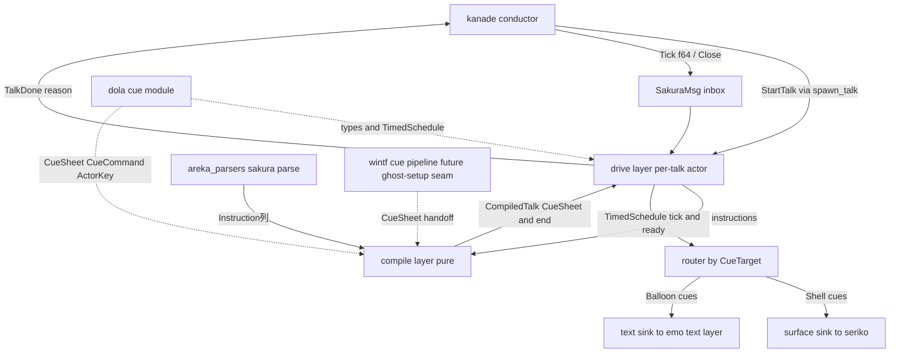
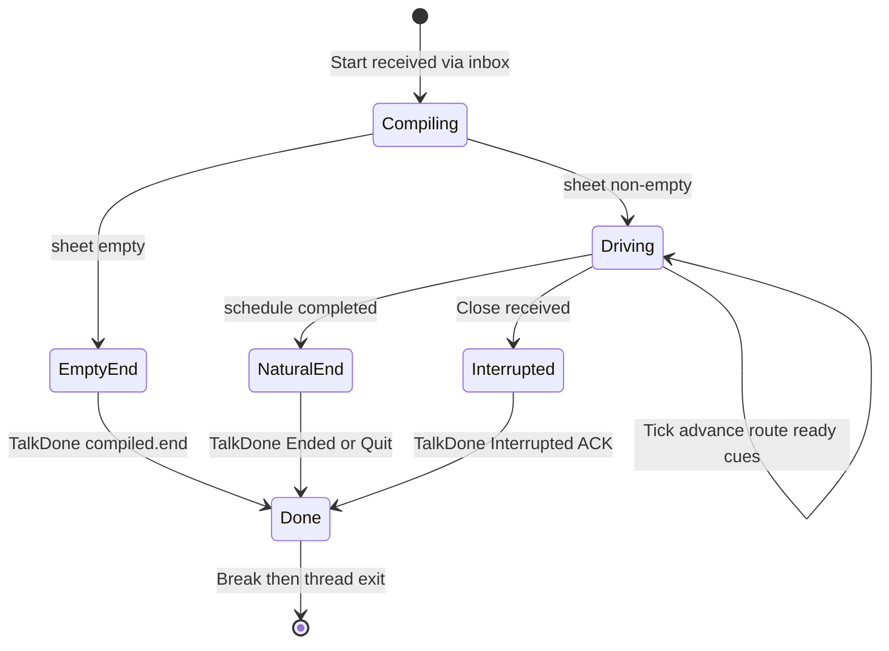
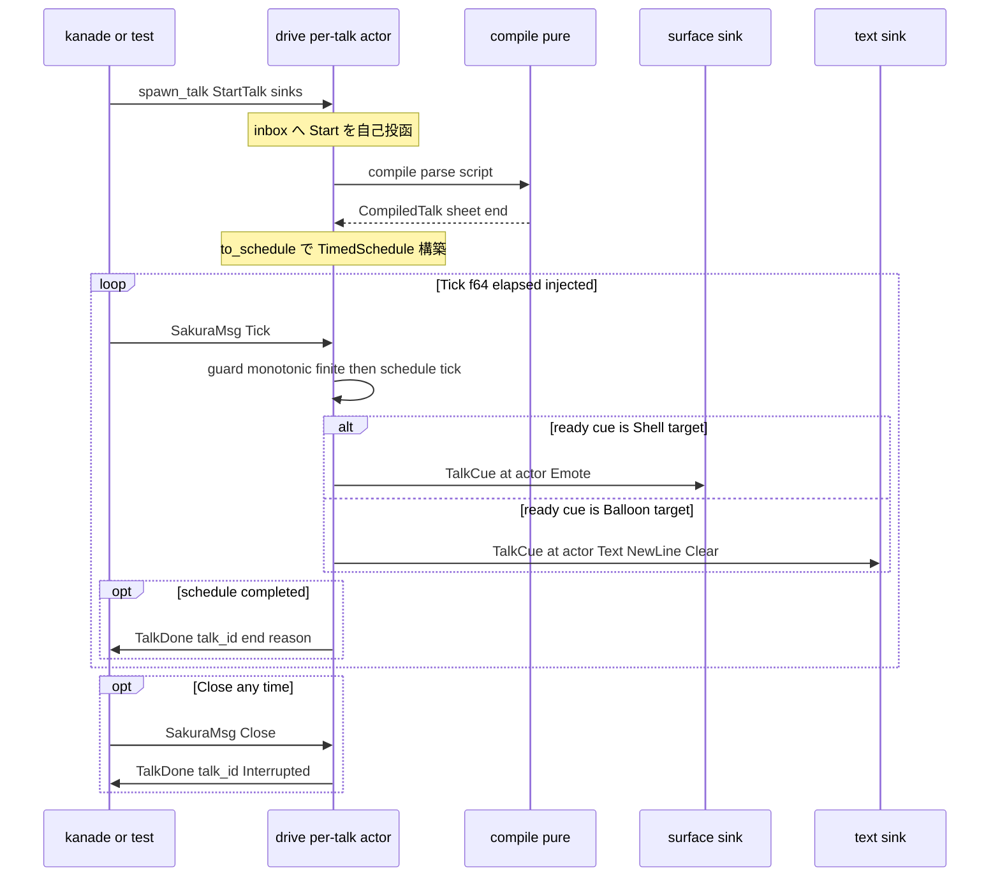

# 技術設計書: areka-P0-sakura-engine

> **改訂 2（2026-07-05・設計ディスカッション #3 反映）**: 初版の DD-3（dola cue 不採用・自前 expand）を**新証拠に基づき覆し**、sakura を **dola の cue ドメイン上に建てるエンジン**として再設計した。DD-2（Duration 貫通）も dola ドメインの **f64 秒**へ改める。経緯と証拠は `research.md` §9 が正本。

## Overview

**Purpose:** 本仕様は areka M1 の再生系エンジン ④ sakura（さくらスクリプト再生エンジン）を定義する。SHIORI が返した Value（さくらスクリプト）を時間軸上で再生する装置を提供し、「emo2 が喋る」の "喋る" を成立させる。sakura は `StartTalk{script, talk_id}` を受け、上流 `areka_parsers::sakura::parse` が生成する `Instruction` 列を **dola cue ドメインの時刻付き発火列（`CueSheet`）へ純粋コンパイル**し、dola `TimedSchedule` を注入時刻（`Tick(f64)`）で駆動して、下流 2 系統（`CueTarget::Shell`→seriko／`CueTarget::Balloon`→emo text-layer）へ発火を届け、終端（`End`/`Quit`/末尾/中断）で `TalkDone{talk_id, reason}` を kanade へ返して自己を破棄する per-talk transient である。

**Users:** kanade（③ conductor・talk 起動者かつ `TalkDone` 消費者）、seriko（⑤・Shell 系発火の消費者）、emo text-layer（⑥・Balloon 系発火の消費者）が本エンジンの契約を消費する。M-boot 段階では表示・実 kanade を伴わず、mock sink 2 本＋script 直入力＋時刻注入で決定的に観測する。

**Impact:** 新設クレート `crates/areka-sakura` を追加し、**dola を P0 の Cargo 依存に加える**（cue モジュール: `TimedSchedule`/`CueSheet`/`CueCommand`/`ActorKey`/`CueTarget`）。roadmap の「両 anim engine は dola 上」「時間軸は dola✅（時刻注入 tick＝決定的）」に整合する。本仕様は **`Instruction` → cue ドメインの写像（マッピング）の正本**を確立する（cue の型自体の正本は dola）。付随して dola `CueCommand` へ `NewLine` variant を 1 件追加する（DD-9・隣接クレート増分・正規経路）。wintf には依存しない（headless）。

### Goals

- `Instruction` 列を dola cue ドメインの決定的な `CueSheet`＋終端理由へ**純粋コンパイル**する（R2・単体テスト主戦場）。
- `Instruction` → cue の**写像の正本**（scope→`ActorKey`・`Surface`→`Emote`・テキスト系→`Text`/`NewLine`/`Clear`・`at`＝f64 秒）を確立する（R3/R4/R5）。
- dola `TimedSchedule` を注入時刻で駆動し、`CueTarget` で 2 sink へ振り分け、通算高々 1 回の reason 付き `TalkDone` を返す（R6/R7/R9）。
- M-boot 外タグを寛容に無視（ログ）しつつ、`Choice`/`\x` 系の将来写像先として **dola 既存 primitive（`CueCommand::Choice`・`BarrierKind::WaitForChoice`/`WaitForInput`）**をシームとして明記する（R8/R11）。

### Non-Goals

- script の字句解析・`Instruction` 化（**sakura-parse** 完了済み・本仕様は再パースしない）。
- surface id・alias の解釈（`sakura.surface.alias` 含む・**seriko/emo** の責務・`SurfaceArg` の中身は `Emote{key}` へ不透明転写）。
- typewriter の字送り間隔・グリフ描画・テキストレイアウト（**emo text-layer** の責務）。
- `Choice`/`Move`/`Cursor`/`SystemVar`/`GenericCommand`/`Raw` の**実挙動**（**sakura-dialogue-tags**・M-dialogue）。
- talk の選定・スケジューリング・中断トリガの調停（**kanade** の領分・後続 M の拡張点）。
- 本番の実時刻 ticker（kanade/clock アクターが `dola::runtime::clock::now()` から `Tick` を送る結線）と、wintf ECS cue パイプラインへの結線（**ghost-setup** の領分・後述シーム）。

## Boundary Commitments

### This Spec Owns

- **`Instruction` → cue ドメインの写像の正本**: scope n→`ActorKey`、`Surface(SurfaceArg)`→`CueCommand::Emote{key}`、`Text`/`NewLine`/`Clear`→対応 `CueCommand`、`Wait(Duration)`→f64 秒累積オフセット、`CueCommand`→`CueTarget` 分類（`cue_target_of`）。
- **純粋コンパイル**（`compile(&[Instruction]) -> CompiledTalk{sheet: CueSheet, end: TalkEndReason}`）: `Wait` 累積・scope 状態機械・終端切詰め・M-boot タグ分類を決定的に行う（R2/R9）。
- **終端信号 `TalkDone{talk_id, reason}` の意味論**: reason 3 値（`Ended`/`Quit`/`Interrupted`）、通算高々 1 回、`talk_id` エコー（変更なし・議題#1/#2 確定契約）。
- **per-talk transient のライフサイクル**（生成・駆動・終端破棄）と Close 即時中断の結線、`Tick(f64)` の意味論（talk 起点経過秒）。
- **M-boot 再生対象タグ表**（`Instruction` 全 variant の実挙動/無視ログ/シーム分類・cue 写像込み）。
- **観測ハーネス**（mock sink 2 本・fixture・期待値表・時刻注入駆動）。

### Out of Boundary

- cue ドメインの**型の正本**（`CueCommand`/`CueSheet`/`TimedSchedule`/`ActorKey`/`CueTarget`/`BarrierKind`）＝ **dola** が所有。本仕様は消費し、`NewLine` variant 1 件のみ dola へ増分する（DD-9）。
- `Instruction` モデルの定義（`areka_parsers::sakura` が正本）。
- `ActorKey` の実体解決（"0" が誰か）＝下流 registry（wintf `EntityRegistry`／seriko・emo 結線）の関心。sakura は scope 番号の**純粋な転写**のみ行う。
- `SurfaceArg` の中身の解釈・alias 解決（seriko/emo）。
- **`StartTalk`/`TalkDone` の最終正本**は kanade（`areka-P0-kanade`）。本仕様は kanade 未実装の間だけ**暫定的に型を所有**する（DD-1・移譲前提・変更なし）。
- 本番 ticker（実時刻 cadence で `Tick` を送る側）・wintf ECS 結線（ghost-setup）。

### Allowed Dependencies

| 依存先 | 用途 | 制約 |
|---|---|---|
| `dola`（`cue::{TimedSchedule, CueSheet, Cue, CuePayload, CueCommand, ActorKey, CueTarget, BarrierKind, Entry}`） | 発火列の表現・配信エンジン・演出ドメイン型 | **P0 Cargo 依存**。`compile_sheet` は使用しない（後述）。`runtime`/`DolaRuntime` は使用しない |
| `areka_parsers::sakura`（`parse`・`Instruction`・`SurfaceArg`・`NewLineRatio`） | script→`Instruction` 変換 | 消費のみ・改変しない・再パースしない |
| `areka-actor`（`spawn_actor`・`run_inbox`・`reply_channel`・停止規約） | per-talk transient の spawn・Close 即時停止・`TalkDone` 返信 | 規約に従う・framework 化しない |
| `tracing` | 無視ログ・失敗ログ | ログ無し失敗経路を持たない |
| `thiserror` | エラー型 | — |

**wintf は依存しない**（headless・ECS 非依存）。`std::time::Instant` は sakura に一切現れない。

**依存方向（左が上流・右向き import 禁止）:**
`dola::cue` / `areka_parsers` / `areka-actor`（外部） → `contract`（メッセージ型・写像正本・暫定所在） → `compile`（純粋コンパイル） → `sink`（trait＋mock） → `drive`（駆動・アクター結線） → テストハーネス。

### Revalidation Triggers

- **`Instruction`→cue 写像の変更**（`Emote{key}` の形・`ActorKey` 転写規則・`cue_target_of` 分類）→ seriko・emo text-layer・ghost-setup は契約を再確認。
- **dola `CueCommand` の variant 追加/変更**（本件 `NewLine` 含む）→ wintf 側 cue 消費者（catch-all 済みだが意味論上）と本仕様のタグ表を再確認。
- **`TalkDone` の reason 集合の変更** → kanade の close 握手ロジックを再確認。
- **暫定所在型（`StartTalk`/`TalkDone`）の kanade への移譲** → 本クレートは re-export へ切替（下流 import パス不変を維持）。
- **`Tick` の意味論変更**（経過秒→絶対秒等）→ 本番 ticker（ghost-setup/kanade）を再確認。
- **wintf cue パイプラインの `CueSheet` 消費形の変更** → handoff シーム（`CompiledTalk::sheet`）を再確認。

## Architecture

### ピボットの根拠（dola 基盤化・research.md §9 の要約）

実ソース精査により、dola の cue モジュールが**さくらスクリプト再生のために purpose-built された配信基盤**であることが確認された:

- `ActorKey` の doc は「さくらスクリプトの `\0`(さくら)/`\1`(うにゅう) に相当」と明記（`crates/dola/src/cue/command.rs`）。
- `CueTarget::{Shell, Balloon}` は「Shell＝Emote/EntityRef を主に消費・Balloon＝Text/Clear/Choice を主に消費」と、本仕様の下流 2 分岐（seriko／emo text-layer）そのもの。
- `BarrierKind::{WaitForInput, WaitForChoice, Timeout}`・`CueCommand::Choice` は R8 シーム（`\x`・`\q`）の将来写像先として既に存在し、wintf `CueQueue` に消費実装まである。
- wintf には `CueSheet → dispatch → per-entity CueQueue（`TimedSchedule<CueCommand>` 内包）→ pop_ready → 消費者` の**本番配送パイプラインが稼働済み**（`crates/wintf/src/ecs/cue/`）＝再生の「配送側半身」は既に存在する。
- roadmap 正本: 「両 anim engine は dola 上」「時間軸は dola✅（時刻注入 tick＝決定的）」。

sakura が自前の発火列型を持つと、ghost-setup での wintf 結線時に「自前型→cue ドメイン」の翻訳層が必ず要る。**最初から cue ドメインで喋る**ことでこの翻訳層を消し、`CueSheet`（serde 可）を handoff 成果物として wintf パイプラインへそのまま渡せる。

### 三層構造（compile / drive / sink）

brief の三層——タイムライン展開（純粋）／再生駆動／出力結線——を cue ドメイン上で再定義する。



- **compile（純粋）**: `&[Instruction]` → `CompiledTalk{sheet: CueSheet, end: TalkEndReason}`。clock・sink・talk_id・アクターを知らない。単体テスト主戦場（R2/R9.4）。
- **drive（per-talk transient アクター）**: `spawn_actor` で起動。`CueSheet` を `TimedSchedule<TalkCue>` へ載せ、inbox の `Tick(f64)` で `tick`→`ready()`、`cue_target_of` で 2 sink へ振り分け。終端/中断で `TalkDone` を返信し body 復帰＝自己破棄。
- **sink（trait＋mock）**: `SurfaceSink`/`TextSink` の 2 trait（R3.3 の別系統を型で分離）。本番は seriko/emo への送出アダプタ、M-boot はテスト mock。

### 時間概念（DD-2 改訂: f64 秒で貫通）

**全てのオフセット・`at`・`Tick` は dola ドメインの f64 秒**とする（`TimedSchedule` の offset・wintf `FrameTime(f64)`・`clock::now() -> f64` と同一ドメイン）。

- compile は `Instruction::Wait(Duration)` を `Duration::as_secs_f64()` で累積する。これは**単位換算であって `\w`×50ms の再導出ではない**——待ち時間の唯一の真実は上流正規化済みの `Duration` のまま（R2.3 維持・ukadoc `\w`＝×50ms は上流 sakura-parse が換算済み）。
- **不変条件（dola NaN ハザードの放電）**: compile が生成する offset は「有限非負の `Duration` 由来の `as_secs_f64()` 値の累積和」であり、**構成的に有限かつ非負**である。dola が文書化する NaN ハザード（`schedule.rs` NOTE(D3-V): NaN offset は release で配信順が黙って崩れる／NaN tick は全量即時配信）は、本エンジンの入力経路では**発生し得ない**。`Tick` 側は駆動層で有限性をガードする（後述）。

### `Tick` の意味論（固定・validation Issue 2 の解決）

`SakuraMsg::Tick(f64)` は **talk 起点からの経過秒（0 起点・単調非減少・有限）**とする。

- 駆動層は `TimedSchedule::new(0.0)` で構築し、`tick(elapsed)` を直接渡す（offset＝elapsed の恒等対応。wintf `CueQueue` が start_time 0.0 を維持する運用と同型）。
- 根拠: 絶対時刻の epoch（QPC 起点）の知識を sakura から完全に排除でき、テストは注入列（`0.0, 0.05, 0.15, …`）の直入力で決定的（R9.1/9.4）。`Instant` は sakura に現れない。
- **本番 ticker はスコープ外のシーム**: kanade（または clock アクター）が talk 起動時に `clock::now()` を採取し、以降 `elapsed = clock::now() - t_start` を実 cadence で `Tick` として送る。この結線は ghost-setup/kanade の領分。
- 冪等・逆行ガード: 駆動層は直前 tick 値を **`last_tick: Option<f64>`（初期値 `None`）** で保持し、`Some(prev)` に対し `t <= prev` の `Tick` は no-op（debug ログ）とする。**初回 `Tick` は値を問わず必ず通す**（`None` は比較対象なし）——初期値を `0.0` にすると契約上正当な先頭 `Tick(0.0)`（テスト注入列の起点）が飲み込まれ、`at=0` の発火が永久に出ず待ち無し script が `TalkDone` を返せなくなるため禁止（設計固定）。`TimedSchedule::tick` の冪等早期 return は `ready()` バッファを保持するため、ガード無しでは同時刻再 tick で**同一発火を二重送出**し得る——このガードが二重発火を防ぐ（設計固定）。非有限（NaN/inf）の `Tick` は `tracing::error!` を記録して無視する（ログ無し失敗経路の禁止・dola の NaN 全量配信ハザードを遮断）。

### Build vs Adopt: 配信エンジン（DD-3 改訂の決着）

| 観点 | 初版（自前 `expand`＋`Duration`） | 改訂（dola cue 採用・**決定**） |
|---|---|---|
| 発火列表現 | 自前 `Timeline`/`TimedFire` | dola `CueSheet`（serde 可・wintf 配送半身がそのまま消費） |
| 配信エンジン | 自前駆動ループ | `TimedSchedule<TalkCue>`（降順ソート・tick/ready 2 相・実績コード） |
| 下流翻訳 | ghost-setup で自前型→cue の翻訳層が必要 | **翻訳層ゼロ**（最初から cue ドメイン） |
| R8 シーム | 自前 enum に将来 variant を発明 | `Choice`/`WaitForChoice`/`WaitForInput` が**既存 primitive** |
| 単位 | `Duration` 直（換算不要） | f64 秒（`as_secs_f64()` 換算 1 箇所・有限非負を構成的に保証） |
| 不要概念 | 無し | `Barrier`/`Routing` は M-boot 未使用（compile は生成しない・将来シーム） |

**決定**: dola cue を採用する。初版 DD-3 の懸念（f64 換算負債・Barrier/Routing 混入・2 分岐の実行時 match）は、(a) 換算は compile 内 1 箇所で不変条件付き、(b) Barrier/Routing は「使わない」のではなく「M-dialogue の写像先として温存する」資産、(c) 振り分け match は `cue_target_of` 1 関数に閉じる——ことでいずれも受容可能であり、翻訳層ゼロ・配送半身の再利用・roadmap 整合の利得が上回る。

**重要な不採用: `dola::cue::compile_sheet` は使わない。** `compile_sheet` は最小 `start_time` を 0 基準へ正規化するため、**冒頭の `\w`（先頭待ち）を消してしまう**（例: `\w9テキスト` の 0.45 秒待ちが 0 秒へ潰れる）。sakura の compile は構成的に 0 起点のオフセットを生成済みであり、駆動層は独自アダプタ `to_schedule` で `Entry::Payload(cue.start_time, TalkCue{..})` を直接挿入する（`CompiledCue` は actor/at を payload の外に置くため headless 駆動にも不適合）。

### DD-9: `NewLine` の表現（dola `CueCommand` への variant 追加・決定）

`Instruction::NewLine(NewLineRatio)` の cue 表現として、**dola `CueCommand` へ `NewLine { ratio: f32 }` variant を追加する**（`Custom{command:"newline"}` 案は棄却）。

- **根拠**: (1) 改行はさくらスクリプトのテキスト系一級指令（`\n`/`\n[percent]`）であり、M1 の主経路（emo text-layer）が消費する。stringly-typed な `Custom`＋`DynamicValue` は型安全性を失い、比率 f32 が JSON 経由の動的値になる（Type Safety 原則違反）。(2) steering 記憶「終了経路は正規実装・小細工禁止」＝正規（canonical）経路のためなら隣接クレート増分はスコープ内。(3) `CueCommand` は `#[non_exhaustive]` ではないため exhaustive match には source-breaking だが、**実測でワークスペースに exhaustive match は存在しない**（下記）。
- **変更内容**: `crates/dola/src/cue/command.rs` — `CueCommand` へ `/// 改行（比率 1.0=全角 1 行）。意味解釈は消費者の責務。` `NewLine { ratio: f32 },` を追加（derive は既存のまま `Clone, Debug, PartialEq, Serialize, Deserialize`・f32 は `PartialEq` に適合、`Eq`/`Hash` は元々非導出）。serde は variant 追加＝後方互換（旧データは読める・新 variant を旧読者は読めない——現行ワークスペースに永続化経路は無い）。
- **touch point 実測（source-breaking 調査済み）**:
  - `crates/wintf/src/ecs/cue/queue/mod.rs` — `tick()` の match は `other =>`、`resolve_entity_ref` は `_ =>` の catch-all あり＝**非破壊**（`NewLine` は `filtered_ready` へ素通り＝消費者へ届く。バルーン消費者の実処理は emo text-layer 側の将来実装）。
  - `crates/wintf/src/ecs/cue/mod.rs` — モジュール doc 例（`rust,ignore`）＝非コンパイル・**非破壊**。
  - `crates/dola/src/cue/command.rs` テスト `cue_command_six_variants`・モジュール doc「データ系 6 バリアント」（`cue/mod.rs` 表含む）— **要更新**（7 バリアントへ・roundtrip テスト追加）。
  - `crates/wintf/tests/ecs/*`（cue 系 6 ファイル）— `matches!`／個別 variant 構築のみで exhaustive match 無し＝**非破壊**。`Entry<CueCommand>` サイズテスト（128B 上限）は `NewLine{f32}` が `Text(String)` より小さいため影響なし。

### Technology Stack

| Layer | Choice / Version | Role in Feature | Notes |
|-------|------------------|-----------------|-------|
| 言語 / Edition | Rust 2024 | 実装言語 | tokio 禁止・std のみの並行 |
| 演出ドメイン / 配信 | `dola`（workspace・cue モジュール） | `CueSheet`/`CueCommand`/`ActorKey`/`CueTarget`/`TimedSchedule` | **P0 依存**（新規）。`NewLine` variant を増分（DD-9） |
| 並行 / アクター | `areka-actor`（workspace） | per-talk transient spawn・Close 停止・`TalkDone` 返信 | 規約正本・framework 化しない |
| 上流パーサ | `areka_parsers::sakura`（workspace） | script→`Instruction` | 消費のみ |
| ログ | `tracing` | 無視ログ（debug）・失敗ログ（error） | ログ無し失敗経路禁止 |
| エラー | `thiserror` | エラー型定義 | — |
| テスト | in-source `#[cfg(test)]`＋fixture＋mock sink | 時刻注入・決定性検証 | 実時間 sleep 非依存 |

## File Structure Plan

### Directory Structure
```
crates/areka-sakura/
├── Cargo.toml                 # 新規: dola / areka-actor / areka-parsers / tracing / thiserror
└── src/
    ├── lib.rs                 # クレート rustdoc（責務・三層・写像正本宣言）＋公開面 re-export
    ├── contract.rs            # メッセージ契約型（暫定所在 DD-1）＋出力契約:
    │                          #   SakuraMsg / StartTalk / TalkId / TalkDone / TalkEndReason /
    │                          #   TalkHandle / TalkCue / cue_target_of、
    │                          #   dola::cue（ActorKey/CueCommand/CueSheet/CueTarget 等）と
    │                          #   areka_parsers::sakura（SurfaceArg/NewLineRatio）の re-export
    ├── compile.rs             # 純粋コンパイル層（単体テスト主戦場）:
    │                          #   compile(&[Instruction]) -> CompiledTalk{sheet, end}、
    │                          #   Wait 累積(f64)・scope→ActorKey 状態機械・終端切詰め・
    │                          #   M-boot タグ分類（写像の正本）
    ├── drive.rs               # 再生駆動層（R1/R6/R7/R9/R10）:
    │                          #   spawn_talk -> TalkHandle、body（run_inbox）、
    │                          #   to_schedule(CueSheet)->TimedSchedule<TalkCue>（compile_sheet 不使用）、
    │                          #   Tick ガード（単調・有限）・CueTarget 振り分け・TalkDone 返信
    ├── sink.rs                # 出力 sink トレイト（SurfaceSink / TextSink）＋
    │                          #   テスト用 mock sink（Arc<Mutex<Vec<TalkCue>>> 共有蓄積）
    └── error.rs               # SakuraError（thiserror・失敗経路の型）
```

### Modified Files
- `crates/dola/src/cue/command.rs` — `CueCommand::NewLine { ratio: f32 }` variant 追加＋doc/バリアント数記述更新＋serde roundtrip テスト追加（DD-9）。
- `crates/dola/src/cue/mod.rs` — モジュール doc の「6 バリアント」表記を更新（同上・doc のみ）。
- （wintf は不改変: catch-all 実測済み・DD-9 touch point 調査参照）

> 各ファイルは単一責務。`compile.rs` は clock・sink・talk_id・アクターを一切知らない純粋層。`drive.rs` のみが `areka-actor`・`TimedSchedule`・sink を結線する。`contract.rs` は下流が import する契約面で、kanade 完成時に `StartTalk`/`TalkDone` を kanade からの re-export へ切替可能な単一箇所（DD-1）。

## System Flows

### 再生駆動と終端・中断のライフサイクル（状態遷移）



- **空 sheet**（R1.4/R6.2）: compile 結果の `sheet` が空なら時間軸駆動せず即 `TalkDone{compiled.end}`→`Break`。空 script・空 `Instruction` 列では `end=Ended`（R1.4）だが、**発火を伴わない終端のみの script（例: 裸の `\-`）は空 sheet＋`end=Quit`** となるため、`Ended` を固定送出してはならない（R6.2）。
- **終端切詰め**（R6.5）: `End`/`Quit` 以降の `Instruction` は compile 時に破棄（`CueSheet` へ載せない）。ukadoc `\e`「この後に書かれたスクリプトは実行・表示されない」に整合。
- **通算高々 1 回**（R6.4/R7.4/R7.5）: 全終端経路は「`TalkDone` 送出（`ReplySender::send(self)` の move-consume）→ 直後に `Break`」の対で実装される。`Break` によりアクタースレッドは終了するため、終端後の `Close` は届く先が無く（send 失敗を kanade 側が観測）、二重返信は**構造的に不可能**。

### talk 再生シーケンス（駆動と 2 sink 振り分け）



投函経路は **inbox 一貫**（validation Issue 1 の解決）: `spawn_talk` は `spawn_actor` でアクターを起動した直後、返された `Sender` へ `SakuraMsg::Start(start)` を自ら送る。以降 kanade/テストは `TalkHandle::inbox` へ `Tick`/`Close` を送る。単一 inbox の全順序により「`Start` が必ず最初」「`Close` と `Tick` の順序が確定」が保証される（Close checked by message order）。

## Requirements Traceability

| Requirement | Summary | Components | Interfaces | Flows |
|-------------|---------|------------|------------|-------|
| 1.1, 1.2, 1.3 | talk 起動・parse 呼出・talk_id 付与 | drive, contract | `spawn_talk`, `StartTalk`, `parse` | 再生シーケンス |
| 1.4 | 空 script→即 `TalkDone{Ended}` | drive | `TalkDone` | ライフサイクル EmptyEnd |
| 2.1, 2.2, 2.3, 2.4, 2.5 | `Wait` 累積・`Duration` 唯一真実（f64 換算のみ）・決定的コンパイル | compile | `compile`, `CompiledTalk` | — |
| 3.1, 3.2, 3.3 | surface 分岐・不透明・別 sink | compile, drive, sink, contract | `Emote{key}`, `cue_target_of`, `SurfaceSink` | 再生シーケンス |
| 4.1, 4.2, 4.3, 4.4 | テキスト系分岐・字送りは持たない | compile, drive, sink, contract | `Text`/`NewLine`/`Clear`, `TextSink` | 再生シーケンス |
| 5.1, 5.2, 5.3 | scope 状態機械・両系統付与・既定 scope | compile, contract | `ActorKey` 転写 | — |
| 6.1, 6.2, 6.3, 6.4, 6.5, 6.6 | 終端検出・reason 3 値・高々 1 回・切詰め・talk_id 相関 | compile, drive, contract | `TalkDone`, `TalkEndReason` | ライフサイクル |
| 7.1, 7.2, 7.3, 7.4, 7.5 | Close 即時停止・drain せず破棄・停止規約整合・`Interrupted` ACK・二重返信禁止 | drive, contract | `SakuraMsg::Close`, `run_inbox`, `TalkHandle` | ライフサイクル Interrupted |
| 8.1, 8.2, 8.3 | M-boot 外タグ無視・ログ・非 panic シーム（dola 既存 primitive を明記） | compile | タグ分類表 | — |
| 9.1, 9.2, 9.3, 9.4 | 時刻注入（`Tick(f64)`）・mock sink 2 本・fixture 決定性 | drive, sink | `SakuraMsg::Tick`, mock sink | 再生シーケンス |
| 10.1, 10.2, 10.3 | transient 生成/破棄・状態非持ち越し | drive | `spawn_actor`, `TalkHandle` | ライフサイクル |
| 11.1, 11.2, 11.3, 11.4 | 回復可能失敗の error ログ・非 panic・致命前ログ・ログ無し禁止 | drive, compile, error | `SakuraError`, Tick ガード | — |

### requirements 語彙 ↔ cue ドメイン写像表（「級/相当」の実現形）

requirements.md は出力契約を `SurfaceCommand` 級／`TextCommand` 級とヘッジ表記している。本設計はこれを **cue ドメイン**で次のとおり実現する（本表が対応の正本）:

| requirements の語彙 | cue ドメインでの実現形 | 付帯情報 |
|---|---|---|
| `SurfaceCommand{scope, surface, at}` 級（R3.1） | `TalkCue{at: f64, actor: ActorKey, command: CueCommand::Emote{key}}` を `SurfaceSink` へ | `key` = `SurfaceArg::as_str().to_string()`（不透明転写・R3.2）、`actor` = scope 転写、`at` = talk 起点相対秒 |
| `TextCommand{scope, text, at}` 級（R4.1） | `TalkCue{at, actor, command: CueCommand::Text(String)}` を `TextSink` へ | 同上 |
| 改行指令（R4.2） | `TalkCue{at, actor, command: CueCommand::NewLine{ratio}}` を `TextSink` へ | `ratio` = `NewLineRatio::ratio()`（DD-9） |
| クリア指令（R4.3) | `TalkCue{at, actor, command: CueCommand::Clear}` を `TextSink` へ | — |
| 話者スコープ（R5） | `TalkCue::actor: ActorKey`（scope n → `ActorKey::from(n.to_string())`・既定 `"0"`） | "0" が誰か（実体解決）は下流 registry の関心 |
| `TalkDone{talk_id, quit}` 相当（R6） | `TalkDone{talk_id: TalkId, reason: TalkEndReason}`（3 値） | 議題#1/#2 確定・変更なし |

## Components and Interfaces

| Component | Domain/Layer | Intent | Req Coverage | Key Dependencies (P0/P1) | Contracts |
|-----------|--------------|--------|--------------|--------------------------|-----------|
| contract | 契約型（暫定所在＋写像正本） | メッセージ・出力・終端型と cue 写像宣言 | 1, 3, 4, 5, 6, 7, 9 | dola::cue (P0), areka_parsers (P0), areka-actor (P0) | State |
| compile | 純粋コンパイル層 | `Instruction`→`CueSheet`＋終端理由 | 1, 2, 3, 4, 5, 6, 8, 11 | areka_parsers (P0), dola::cue (P0), contract (P0) | Service |
| drive | 再生駆動層 | 駆動・振り分け・終端/中断・transient | 1, 6, 7, 9, 10, 11 | areka-actor (P0), dola::cue (P0), compile (P0), sink (P0) | Service, Event, State |
| sink | 出力結線 | 2 sink trait＋mock | 3, 4, 9 | contract (P0) | Service |
| error | 失敗型 | `SakuraError` | 11 | thiserror (P0) | — |

### 契約層（contract）

#### Message & Output Contracts

| Field | Detail |
|-------|--------|
| Intent | kanade・seriko・emo・ghost-setup が消費するメッセージ／出力／終端型と、cue 写像の宣言（`StartTalk`/`TalkDone` は kanade 移譲までの暫定所在） |
| Requirements | 1.1, 1.3, 3.1, 3.3, 4.1, 5.1, 6.1, 6.6, 7.4, 9.1 |

**Responsibilities & Constraints**
- 出力の意味論は cue ドメイン（dola 正本の型）で表現し、本層は**写像**（`TalkCue`・`cue_target_of`）と kanade 授受型（暫定）を所有する。
- `StartTalk`/`TalkDone` は kanade が正本だが未実装ゆえ本層が**暫定所有**する（DD-1・不変）。kanade 完成時は re-export へ差し替え、下流の import パス（`areka_sakura::contract::*`）を不変に保つ。
- dola cue 型・parsers 値型は re-export し二重定義しない。

**Contracts**: State [x]

##### State Management（型定義）
```rust
// ── kanade との授受（暫定所在・DD-1／kanade 完成時に移譲） ──

/// sakura アクターの inbox メッセージ（areka-actor inbox 規約・投函経路は inbox 一貫）。
#[non_exhaustive]
pub enum SakuraMsg {
    /// talk 起動（spawn_talk が spawn 直後に自己投函する。外部からは送らない）。
    Start(StartTalk),
    /// 時刻前進（注入式）。**talk 起点からの経過秒・0 起点・単調非減少・有限**。
    /// 本番は外部 ticker（kanade/clock アクター・ghost-setup 結線）が
    /// `dola::runtime::clock::now()` から elapsed を算出して送る（スコープ外シーム）。
    Tick(f64),
    /// kanade からの中断（単一 Close funnel・R7）。areka-actor 停止規約の Close 相当。
    Close,
}

/// talk 起動契約（正本=kanade・暫定所在）。
pub struct StartTalk {
    pub script: String,
    pub talk_id: TalkId,
    /// TalkDone の返信端（oneshot 相当・move-consume が唯一の高々 1 回機構）。
    pub reply: areka_actor::ReplySender<TalkDone>,
}

/// talk 相関 ID（kanade が stale 終端信号の棄却に用いる・R6.6）。不透明 newtype。
#[derive(Clone, Copy, Debug, PartialEq, Eq, Hash)]
pub struct TalkId(pub u64);

/// 終端信号（正本=kanade・暫定所在）。通算高々 1 回・reason 3 値（R6/R7）。
pub struct TalkDone {
    pub talk_id: TalkId,
    pub reason: TalkEndReason,
}

/// 終端理由（従来の quit:bool を 3 値化・議題#1 確定）。
#[derive(Clone, Copy, Debug, PartialEq, Eq)]
pub enum TalkEndReason {
    /// \e / 末尾到達 / 空列（R6.1/6.3/1.4）。
    Ended,
    /// \- （R6.2）。
    Quit,
    /// Close による中断（R7.4・close 握手 ACK）。
    Interrupted,
}

/// spawn_talk の返り値: 中断/時刻注入の投函端＋join ハンドル（validation Issue 1 の解決）。
pub struct TalkHandle {
    /// Tick / Close の投函端（Start は spawn_talk が投函済み）。
    pub inbox: std::sync::mpsc::Sender<SakuraMsg>,
    /// 非 RAII join ハンドル（テストの終了同期・本番は kanade 裁量）。
    pub actor: areka_actor::ActorHandle,
}

// ── 出力契約（cue ドメイン・写像の正本は本仕様） ──

/// 1 発火（両 sink 共通形）。requirements の SurfaceCommand級/TextCommand級 の実現形。
#[derive(Clone, Debug, PartialEq)]
pub struct TalkCue {
    /// talk 起点からの相対秒（R2.1・f64 秒＝dola ドメイン）。
    pub at: f64,
    /// 話者スコープの転写（scope n → ActorKey(n.to_string())・既定 "0"・R5）。
    pub actor: ActorKey,
    /// 演出コマンド（dola 正本・Emote は SurfaceArg の不透明転写・R3.2）。
    pub command: CueCommand,
}

/// CueCommand → 配送先スロットの分類（写像の正本・R3.3 の 2 系統分離）。
/// Emote / EntityRef → Shell、Text / NewLine / Clear / Choice → Balloon。
/// 分類不能（Custom 等・M-boot compile は生成しない）は None（呼び手が error ログ）。
pub fn cue_target_of(command: &CueCommand) -> Option<CueTarget>;

// ── 再輸出（二重定義しない） ──
pub use dola::cue::{ActorKey, BarrierKind, Cue, CueCommand, CuePayload, CueSheet, CueTarget};
pub use areka_parsers::sakura::{NewLineRatio, SurfaceArg};
```

**Implementation Notes**
- Integration: seriko/emo text-layer は `TalkCue`＋`cue_target_of` を、kanade は `SakuraMsg`/`StartTalk`/`TalkDone`/`TalkHandle` を import する。ghost-setup は `CompiledTalk::sheet`（`CueSheet`・serde 可）を wintf パイプラインの handoff として利用できる。
- Validation: `TalkId` の相関・stale 棄却は kanade 側判断（本層は `talk_id` エコーのみ保証）。
- Risks: kanade 移譲時の import パス破壊を避けるため、下流は必ず `areka_sakura::contract` 経由で参照する規律を固定。

### 純粋コンパイル層（compile）

#### Talk Compiler

| Field | Detail |
|-------|--------|
| Intent | `Instruction` 列を `Wait` 累積（f64 秒）・scope→`ActorKey` 転写・終端切詰め・M-boot タグ分類で決定的な `CueSheet`＋終端理由へ写像 |
| Requirements | 1.2, 2.1, 2.2, 2.3, 2.4, 2.5, 3.1, 3.2, 4.1, 4.2, 4.3, 5.1, 5.2, 5.3, 6.1, 6.2, 6.3, 6.5, 8.1, 8.2, 8.3, 11.2 |

**Responsibilities & Constraints**
- **純粋関数**: `compile(&[Instruction]) -> CompiledTalk`。clock・sink・talk_id・アクターを知らない（R9.4 の決定性を型で守る）。
- **`Wait` 累積**（R2.2/2.4）: `offset += duration.as_secs_f64()` を単調非減少に累積し各後続 `Cue::start_time` へ反映。単位換算のみで `\w`×50ms を再導出しない（R2.3・上流正規化済み）。
- **scope 状態機械**（R5）: 現在 scope（u32・既定 0）を走査中に更新し、各 `Cue::actor` へ `ActorKey::from(n.to_string())` を付与。転写のみ（実体解決は下流）。
- **終端切詰め**（R6.5）: `End`/`Quit` 検出で `TalkEndReason` を確定し以降の命令を `CueSheet` へ載せない。
- **M-boot タグ分類**（R8）: 下表に従い分岐。無視タグは `tracing::debug!` を記録し `CueSheet` へ載せない。`#[non_exhaustive]` の未知 variant も無視ログ既定で非 panic（R8.3/R11.2）。
- **不変条件（NaN 放電）**: 生成する全 `start_time` は有限・非負・出現順に非減少（`Duration` 由来の構成的保証）。dola の NaN ハザード（D3-V）は本経路で発生し得ない。

**Contracts**: Service [x]

##### Service Interface
```rust
/// 純粋コンパイル: Instruction 列 → cue ドメインの発火列＋確定終端理由（決定的・no I/O）。
pub fn compile(instructions: &[Instruction]) -> CompiledTalk;

/// コンパイル結果。sheet は wintf cue パイプラインがそのまま消費できる serde 可能形
/// （ghost-setup handoff 成果物）。
pub struct CompiledTalk {
    /// 0 起点相対秒の発火列（CuePayload::Command のみ・Barrier/Routing は M-boot 非生成）。
    pub sheet: CueSheet,
    /// コンパイル時点で確定した終端理由（End→Ended / Quit→Quit / 末尾到達→Ended）。
    /// Interrupted は駆動層のみが決めるため、ここには現れない。
    pub end: TalkEndReason,
}
```
- **Preconditions**: `instructions` は `areka_parsers::sakura::parse` の出力（再パースしない・R1.2）。
- **Postconditions**: `sheet` 内の `start_time` は有限・非負・非減少。同一入力に対し同一出力（決定的・R2.5）。`End`/`Quit` 以降の命令は `sheet` に含まれない。`end` は `Ended` か `Quit` のみ。
- **Invariants**: 各 `Cue::actor` はその発火時点の有効 scope の転写。`CuePayload` は `Command` のみ。

**Implementation Notes**
- Integration: `drive` が `compile` を呼び `to_schedule` で駆動する。空列時は `sheet` 空＋`end=Ended`（R1.4 は駆動層で即返信）。
- Validation: 単体テストは `compile` を値で検証（fixture→期待 `(actor, start_time, payload)` 列・期待 `end`）＝ R9 の主戦場。`Cue` は `PartialEq` 非導出のためフィールド組で照合する（dola 既存テストと同流儀）。
- Risks: `compile_sheet` を誤用すると先頭待ちが 0 正規化で消える——**禁止事項として rustdoc に明記**する。

##### M-boot 再生対象タグ表（写像の正本・`Instruction` 全 14 variant）

| Instruction variant | 分類 | cue 写像／挙動 | Req |
|---|---|---|---|
| `Text(String)` | 実挙動 | `Cue{actor, start_time, Command(Text(s))}`（→Balloon） | 4.1 |
| `SpeakerScope{n}` | 実挙動（状態） | 現在 scope を `n` へ更新（cue を生成しない） | 5.1 |
| `Surface(SurfaceArg)` | 実挙動 | `Command(Emote{key: arg.as_str().to_string()})`（不透明転写・→Shell） | 3.1/3.2 |
| `Wait(Duration)` | 実挙動（時刻） | `offset += as_secs_f64()`（cue を生成しない） | 2.2/2.3 |
| `NewLine(NewLineRatio)` | 実挙動 | `Command(NewLine{ratio: r.ratio()})`（DD-9・→Balloon） | 4.2 |
| `Clear` | 実挙動 | `Command(Clear)`（→Balloon） | 4.3 |
| `End` | 実挙動（終端） | `end=Ended`・以降切詰め | 6.1/6.5 |
| `Quit` | 実挙動（終端） | `end=Quit`・以降切詰め | 6.2/6.5 |
| `Choice(Choice)` | 無視ログ＋シーム | `tracing::debug!`・非 panic。**将来写像先は dola 既存 primitive: `CueCommand::Choice{id,text}` 先積み＋`Barrier(WaitForChoice)`**（wintf `CueQueue` に消費実装済み・M-dialogue が写像） | 8.1/8.2/8.3 |
| `Cursor{x,y}` | 無視ログ＋シーム | 同上（写像先未定・M-dialogue） | 8.1/8.2/8.3 |
| `Move(MoveArgs)` | 無視ログ＋シーム | 同上（写像先未定・M-dialogue） | 8.1/8.2/8.3 |
| `SystemVar(String)` | 無視ログ＋シーム | 同上 | 8.1/8.2/8.3 |
| `GenericCommand{..}` | 無視ログ＋シーム | 同上。**クリック待ち系（`\x` 等）の将来写像先は `Barrier(WaitForInput)`**（dola 既存 primitive） | 8.1/8.2/8.3 |
| `Raw(String)` | 無視ログ＋シーム | 同上 | 8.1/8.2/8.3 |
| （未知 variant・`#[non_exhaustive]`） | 無視ログ＋シーム | `_ =>` で無視ログ・非 panic（後方互換） | 8.3/11.2 |

### 再生駆動層（drive）

#### Talk Driver（per-talk transient アクター）

| Field | Detail |
|-------|--------|
| Intent | `CueSheet` を `TimedSchedule<TalkCue>` で注入時刻駆動し 2 sink へ振り分け、終端/中断で `TalkDone` を返し自己破棄 |
| Requirements | 1.1, 1.2, 1.3, 1.4, 6.1, 6.2, 6.3, 6.4, 6.6, 7.1, 7.2, 7.3, 7.4, 7.5, 9.1, 9.2, 9.3, 9.4, 10.1, 10.2, 10.3, 11.1, 11.3, 11.4 |

**Responsibilities & Constraints**
- **per-talk transient**（R10・DD-4）: `spawn_actor("sakura-talk-{talk_id}", body)` で talk ごとに名前付きスレッドを起動。終端＝body 復帰＝スレッド終了＝状態破棄。再生状態（schedule・直前 tick・reply）は body ローカルゆえ次 talk へ持ち越さない。
- **投函経路の一貫**（validation Issue 1 解決）: `spawn_talk` は spawn 直後に `SakuraMsg::Start(start)` を inbox へ自己投函し、`TalkHandle{inbox, actor}` を返す。kanade/テストは inbox へ `Tick`/`Close` のみ送る。単一 inbox の全順序で `Start` 先行と `Close`/`Tick` の順序が確定する。
- **駆動**（R9.1・validation Issue 2 解決）: 正準ループは `run_inbox`。`Tick(t)` ハンドラで (1) 単調・有限ガード、(2) `schedule.tick(t)`、(3) `schedule.ready()` の各 `TalkCue` を `cue_target_of` で振り分け emit、(4) `schedule.is_completed()` なら `TalkDone{end}` を送出し `Break`。実時間 sleep・`Instant`・`clock::now()` を一切呼ばない。
- **Close 即時中断**（R7）: `Close` ハンドラは保持状態を take し `TalkDone{Interrupted}` を送出して `Break`（`run_inbox` の Break＝即時 return・積み残しは rx drop で破棄＝R7.2/7.3）。
- **高々 1 回の唯一機構**（validation Issue 3 解決・不変）: `ReplySender::send(self)` の move-consume が唯一の機構であり、終端済みフラグは持たない。body は `Option<TalkState>`（`TalkState{talk_id, reply, schedule, end, last_tick}`）を所有権スロットとして保持し、**全終端経路は「`state.take()` → `reply.send(TalkDone)` → 直後に `Break`」の対**で実装する（take は所有権移動であってフラグではない）。`Break` 後はスレッドが消えるため終端後の `Close` は構造的に再返信し得ない（R6.4/R7.5）。

**Dependencies**
- Inbound: kanade — `spawn_talk` 呼出・`Tick`/`Close` 投函（P0）。
- Outbound: seriko — Shell 系 `TalkCue`（P0）／emo text-layer — Balloon 系 `TalkCue`（P0）／kanade — `TalkDone`（P0）。
- External: `areka-actor` — `spawn_actor`/`run_inbox`/`ReplySender`（P0）／`dola::cue` — `TimedSchedule`/`Entry`（P0）。

**Contracts**: Service [x] / Event [x] / State [x]

##### Service Interface（駆動）
```rust
/// per-talk transient を起動し、Tick/Close の投函端と join ハンドルを返す。
/// spawn 直後に SakuraMsg::Start(start) を inbox へ自己投函する（投函経路は inbox 一貫）。
pub fn spawn_talk(
    start: StartTalk,
    surface_sink: impl SurfaceSink + Send + 'static,
    text_sink: impl TextSink + Send + 'static,
) -> TalkHandle;

/// 内部: CueSheet → TimedSchedule<TalkCue>（0 起点・TimedSchedule::new(0.0)）。
/// dola::cue::compile_sheet は使わない（min 正規化が先頭待ちを消すため・禁止）。
/// 挿入は CueSheet::cues() の記述順に 1 件ずつ insert() で行う（extend() 禁止）:
/// insert は同一オフセット群の前方へ挿入し末尾 pop が挿入順を保つため、同一 at の
/// cue は CueSheet 記述順（FIFO）で配信される。extend は安定降順ソート＋末尾 pop
/// ゆえ同一 at 群が逆順配信となり、\w 無しで連続する Text/NewLine の順序を壊す
/// （R4.1/4.2 違反）——設計固定。
/// CuePayload::Command 以外（Barrier/Routing・M-boot compile は非生成）は
/// tracing::error! を記録してスキップ（防御・非 panic）。
fn to_schedule(sheet: &CueSheet) -> TimedSchedule<TalkCue>;
```
- **Preconditions**: `start.reply` は生存する `ReplyReceiver` と対（kanade or テスト）。`Tick` は経過秒・単調非減少・有限（違反は無視＋ログで自衛）。
- **Postconditions**: 終端・中断のいずれでも `TalkDone` を高々 1 回返し body 復帰（スレッド終了）。返信後の body は `reply` を保持しない（move 済み）。
- **Invariants**: 1 talk の再生状態は当該アクター body に閉じ、他 talk と共有しない（R10.3）。発火順は `at` 昇順（`TimedSchedule` 降順ソート＋末尾 pop）・**同一 `at` は `CueSheet` 記述順（FIFO・to_schedule の per-cue insert が保証）**。同一注入時刻列で同一観測（R9.4）。

##### Event Contract
- Published: Shell 系 `TalkCue`（→`SurfaceSink`）・Balloon 系 `TalkCue`（→`TextSink`）・`TalkDone`（→kanade reply）。
- Subscribed: `SakuraMsg::{Start, Tick, Close}`（inbox・areka-actor 規約）。
- Ordering / delivery: 発火は `at` 昇順・`Tick` 境界ごとに到達分を一括送出。二重 tick（同値/逆行）は no-op ガードで二重発火を防止。`TalkDone` は通算高々 1 回。

##### State Management
- State model: `NotStarted → Compiling → {EmptyEnd | Driving} → {NaturalEnd | Interrupted} → Done`（body ローカル・`Option<TalkState>` スロット）。
- Persistence: 無し（transient・R10.2）。
- Concurrency: 1 talk = 1 スレッド。中断は inbox の `Close`（`run_inbox` Break）。`Start` 前の `Close` は状態なしで Break（`reply` 未受領＝kanade は `ReplyError::Dropped` を観測——ただし投函経路上 `Start` が必ず先行するため到達しない防御枝）。

**Implementation Notes**
- Integration: 本番の実時刻 cadence（ticker）と wintf 結線は ghost-setup の領分。sakura は `Tick` の意味論（経過秒）だけを契約として固定する。
- Validation: mock sink 2 本＋fixture＋注入時刻列で単一 pass/fail（R9.3）。
- Risks: `TalkDone` 送出失敗（`ReplyReceiver` drop＝kanade 側キャンセル）は `tracing::error!` を記録して `Break`（握り潰さない・R11.1/11.4）。sink emit は infallible trait（mock は蓄積のみ）だが、本番アダプタが channel 切断を `error!` で観測する（R11.1）。

### 出力結線（sink）

#### Sink Traits & Mock

| Field | Detail |
|-------|--------|
| Intent | 2 系統の出力先を trait 抽象化し、本番結線とテスト mock を差し替え可能にする |
| Requirements | 3.3, 4.1, 9.2 |

**Responsibilities & Constraints**
- `SurfaceSink`・`TextSink` を別 trait とし 2 分岐を型で分離（R3.3）。受け渡し単位は `TalkCue`（at・actor 込み＝R9.2 の発火時刻観測を含む）。
- mock sink は `Arc<Mutex<Vec<TalkCue>>>` の共有蓄積で、アクタースレッドへ move 後もテスト側が clone ハンドルで照合できる。

**Contracts**: Service [x]
```rust
pub trait SurfaceSink { fn emit(&mut self, cue: TalkCue); }
pub trait TextSink    { fn emit(&mut self, cue: TalkCue); }

/// テスト用 mock（surface/text 共用の実装を型別名で 2 本立てる）。
/// records() が Arc クローンを返し、テストスレッドから発火列・at を照合する。
pub struct MockSink { records: std::sync::Arc<std::sync::Mutex<Vec<TalkCue>>> }
```
**Implementation Notes**
- Integration: 本番は seriko/emo inbox への送出アダプタが実装（後続 spec）。M-boot はテスト mock のみ。
- Risks: `emit` は `Result` 化しない。送出側アダプタが失敗を `tracing::error!` で観測（R11.1・ログ無し失敗経路禁止）。

## Error Handling

### Error Strategy
areka の「ログ無し失敗経路の禁止」規律に従う。回復可能失敗は `error!`＋継続/観測可能終端、致命は panic 直前ログ、通常の入力異常は非 panic で寛容に受け流す。

### Error Categories and Responses
- **入力異常（非 panic）**: 未対応タグ・不正引数を含む `Instruction` は M-boot タグ表の無視ログ経路で吸収（R8/R11.2）。parse 自体は上流の寛容パース（`Result` 無し）で `Raw` 等へフォールバック済み。
- **プロトコル異常（ガード＋ログ）**: 非有限 `Tick` は `error!`＋無視（dola の NaN 全量配信ハザードを遮断）。逆行/同値 `Tick` は no-op（debug ログ・冪等）。`Start` 二重受領は `error!`＋無視。`to_schedule` が `Command` 以外の `CuePayload` に遭遇（M-boot では非到達）したら `error!`＋スキップ。
- **回復可能失敗（error ログ＋継続/観測可能終端）**: `TalkDone` 送出失敗（受信端 drop）は `error!` を記録して終了。下流 sink 送出失敗は本番アダプタが `error!` で観測（R11.1）。
- **致命（panic 直前ログ）**: `spawn_actor` のスレッド起動失敗は `areka-actor` が `error!`＋panic（規約既定）。本層で新たな panic 経路は増やさない（R11.3）。

##### SakuraError（error.rs）
```rust
#[derive(Debug, thiserror::Error)]
pub enum SakuraError {
    #[error("non-finite tick ignored: {0}")]
    NonFiniteTick(f64),
    #[error("downstream sink send failed: {0}")]
    SinkSend(String),
    // 拡張シーム（M-dialogue 以降の失敗種別を追加可能）
}
```
（`run_inbox` の handler `Err` はログして継続、が areka-actor 規約。終端に至らない異常は `Err(SakuraError)` で返しループ継続とする。）

### Monitoring
- 無視タグ: `tracing::debug!(instruction = ?variant, "M-boot 外タグを無視")`。
- ガード: `tracing::error!`（非有限 Tick・payload 種別防御）／`tracing::debug!`（冪等 Tick no-op）。
- span: `spawn_actor` が `actor` span を張る（talk 名＝`sakura-talk-{talk_id}`）。

## Testing Strategy

### Unit Tests（compile 純粋層・R9 主戦場）
- `Wait` 累積: `[Text, Wait(50ms), Text, Wait(100ms), Surface]` → `start_time` が 0.0 / 0.05 / 0.15 と単調累積（R2.2/2.4）。**期待値は同一の `as_secs_f64()` 累積で計算**（IEEE 754 加算は決定的・10 進リテラル直書きとの表現誤差を排除）。
- 先頭待ち保存: `[Wait(450ms), Text]` → 最初の cue が `start_time=0.45`（`compile_sheet` の 0 正規化を使っていないことの固定）。
- 終端切詰め: `[Text, End, Text]` → sheet に 2 つ目 `Text` を含まず `end=Ended`。`Quit` で `end=Quit`（R6.1/6.2/6.5）。末尾到達で `end=Ended`（R6.3）。
- scope 転写: `[SpeakerScope{1}, Text, SpeakerScope{0}, Surface]` → actor が `"1"`/`"0"`、未指定開始は既定 `"0"`（R5）。
- 写像: `Surface(SurfaceArg)`→`Emote{key}`（`as_str` 完全一致・不透明）、`NewLine(ratio)`→`NewLine{ratio}`、`Clear`→`Clear`（R3.2/4.2/4.3・DD-9）。
- M-boot タグ無視: `Choice`/`Move`/`Cursor`/`SystemVar`/`GenericCommand`/`Raw` を含む列 → sheet に載らず非 panic（R8）。
- 決定性: 同一 `Instruction` 列で 2 回 compile → 同一 `(actor, start_time, payload)` 列＋同一 `end`（R2.5/R9.4）。
- 不変条件: 生成 `start_time` が全て有限・非負・非減少（NaN 放電の固定）。

### Integration Tests（drive＋mock sink・時刻注入）
- fixture script（emo2 boot 級 `text + \s + \w + \e`）を script 直入力 → `Tick` 注入列（0.0→…）で surface mock / text mock に期待 `TalkCue` 列（actor・command・`at`＝50ms×n 反映）が届き `TalkDone{Ended}` が返る（R9.3）。
- 空 script → 即 `TalkDone{Ended}`・両 sink 空・`Tick` 不要（R1.4）。
- Close 中断: 駆動途中で `Close` → 未発火分が届かず `TalkDone{Interrupted}`（R7.1/7.2/7.4）。
- 二重終端禁止: 自然終端（`\e`）後の `Close` → inbox send 失敗（アクター消滅）を観測・追加 `TalkDone` 無し（R6.4/R7.5）。
- 冪等/逆行 `Tick`: 同一時刻の再 `Tick`・逆行 `Tick` で発火が重複しない（二重発火ガードの固定）。
- 非有限 `Tick`: `NaN`/`inf` の `Tick` が無視され再生が破綻しない（R11.1/11.2）。
- talk_id エコー: `StartTalk{talk_id}` に対する `TalkDone` が同一 `talk_id`（R1.3/R6.6）。

### Determinism / No-Sleep（R9.1/9.4）
- 同一 fixture＋同一注入 `Tick` 列 → 同一観測（発火列・`at`・終端）を複数回再現。
- 全テストは実時間 sleep を用いず注入時刻のみで駆動（`clock::now()`/`Instant` を呼ばない）。

### dola 増分（DD-9）のテスト
- `CueCommand::NewLine{ratio}` の serde roundtrip（dola 側・既存 roundtrip 群へ追加）。
- wintf `CueQueue` 経路の非破壊確認は既存テストのフルパス（catch-all 実測済み・追加実装なし）。

## Supporting References
- ピボットの経緯・証拠・DD-1..11 の決着は `research.md`（§7 設計判断・§8 初版シンセシス・**§9 設計ディスカッション #3（dola 基盤化）**）参照。
- ukadoc 正典確認（初版から不変）: `\p[ID]`（既定 scope=本体側=0）・`\e`（以降非実行＝切詰め）・`\w時間`（×50ms・上流換算済み）。
- 実シンボル根拠: `crates/dola/src/cue/{command.rs, schedule.rs, sheet.rs}`・`crates/wintf/src/ecs/cue/{mod.rs, queue/mod.rs, dispatch.rs}`・`crates/dola/src/runtime/clock.rs`・`crates/areka-actor/src/{spawn.rs, reply.rs}`・`crates/areka-parsers/src/sakura/model.rs`。
