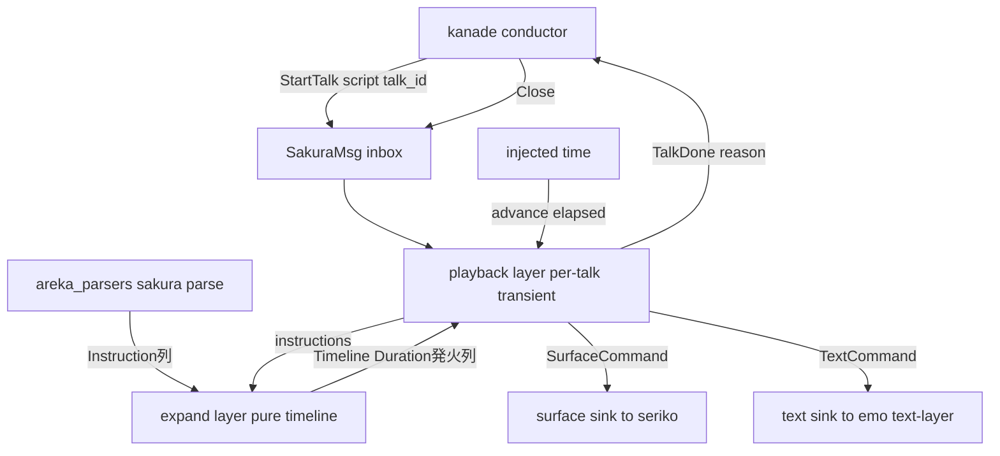
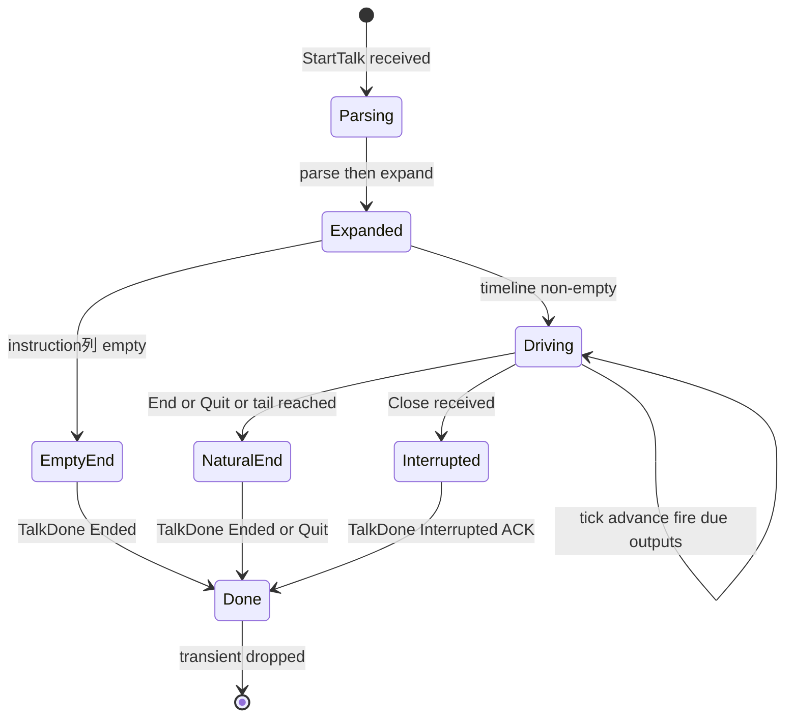
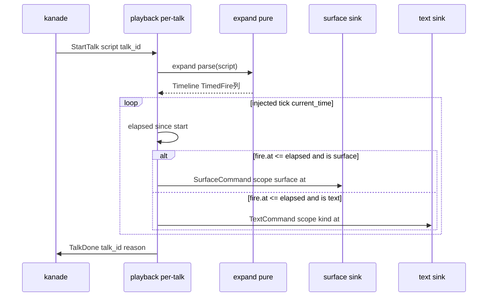

# 技術設計書: areka-P0-sakura-engine

## Overview

**Purpose:** 本仕様は areka M1 の再生系エンジン ④ sakura（さくらスクリプト再生エンジン）を定義する。SHIORI が返した Value（さくらスクリプト）を時間軸上で再生する装置を提供し、「emo2 が喋る」の "喋る" を成立させる。sakura は `StartTalk{script, talk_id}` を受け、上流 `areka_parsers::sakura::parse` が生成する `Instruction` 列を**時刻付き発火列**へ純粋展開し、`Wait` を反映した時間軸で駆動して、下流 2 系統（surface 指令→seriko／テキスト系→emo text-layer）へ発火を届け、終端（`End`/`Quit`/末尾/中断）で `TalkDone{talk_id, reason}` を kanade へ返して自己を破棄する per-talk transient である。

**Users:** kanade（③ conductor・上流の talk 起動者かつ `TalkDone` 消費者）、seriko（⑤・`SurfaceCommand` 消費者）、emo text-layer（⑥・`TextCommand` 消費者）が本エンジンの契約を消費する。M-boot 段階では表示・実 kanade を伴わず、mock sink 2 本＋script 直入力＋時刻注入で決定的に観測する。

**Impact:** 新設クレート `crates/areka-sakura` を追加する（既存資産の改変なし・ワークスペース `crates/*` glob により非衝突）。本仕様は下流 2 分岐の**出力契約（`SurfaceCommand`/`TextCommand`）の正本**を新たに確立し、`TalkDone`/`StartTalk` の型を kanade 完成までの**暫定所在**として持つ。

### Goals

- `Instruction` 列を待ち命令反映済みの決定的な時刻付き発火列へ**純粋展開**する（R2・単体テスト主戦場）。
- 下流 2 分岐の出力契約（surface 系／テキスト系）と `TalkDone`（reason 3 値）を確立し、時刻注入で決定的に観測可能にする（R3/R4/R6/R9）。
- kanade からの Close 単一入力で即時中断し、通算高々 1 回の reason 付き `TalkDone` を返す（R6/R7）。
- M-boot 外タグを寛容に無視（ログ）しつつ拡張シームとして保持し、非パニックを守る（R8/R11）。

### Non-Goals

- script の字句解析・`Instruction` 化（**sakura-parse** 完了済み・本仕様は再パースしない）。
- surface id・alias の解釈（`sakura.surface.alias` 含む・**seriko/emo** の責務・`SurfaceArg` は不透明のまま渡す）。
- typewriter の字送り間隔・グリフ描画・テキストレイアウト（**emo text-layer** の責務）。
- `Choice`/`Move`/`Cursor`/`SystemVar`/`GenericCommand`/`Raw` の**実挙動**（**sakura-dialogue-tags**・M-dialogue）。
- talk の選定・スケジューリング・中断トリガの調停（上書きガード・`\![enter,nouserbreakmode]` 等の source 特権判断）（**kanade** の領分・後続 M の拡張点）。

## Boundary Commitments

### This Spec Owns

- **タイムライン展開**（`Instruction` 列 → `Duration` オフセット付き発火列）を純粋・決定的に行う（R2/R9）。
- **下流 2 分岐の出力契約の正本**: `SurfaceCommand{scope, surface, at}`（→seriko）と `TextCommand{scope, kind, at}`（→emo text-layer）の型・意味論（scope・`at`）。
- **終端信号 `TalkDone{talk_id, reason}` の意味論**: reason 3 値（`Ended`/`Quit`/`Interrupted`）、通算高々 1 回、`talk_id` エコー。
- **per-talk transient のライフサイクル**（生成・駆動・終端破棄）と Close 即時中断の結線。
- **M-boot 再生対象タグ表**（`Instruction` 全 variant の実挙動/無視ログ/シーム分類）。
- **観測ハーネス**（mock sink 2 本・fixture・期待値表・時刻注入駆動）。

### Out of Boundary

- `Instruction` モデルの定義（`areka_parsers::sakura` が正本）。
- `SurfaceArg` の中身の解釈・alias 解決（seriko/emo）。
- typewriter 字送り・グリフ描画（emo text-layer）。
- 上記 M-dialogue タグ群の実挙動（sakura-dialogue-tags）。
- **`StartTalk`/`TalkDone` の最終正本**は kanade（`areka-P0-kanade`）。本仕様はこれを消費する立場であり、kanade 未実装の間だけ**暫定的に型を所有**する（DD-1・移譲前提）。
- talk の選定・中断トリガ調停・kanade 側状態管理構造（単一 current スロットか多重管理か）。

### Allowed Dependencies

| 依存先 | 用途 | 制約 |
|---|---|---|
| `areka_parsers::sakura`（`parse`・`Instruction`・`SurfaceArg`・`NewLineRatio`） | script→`Instruction` 変換・値型の不透明再輸出 | 消費のみ・改変しない・再パースしない |
| `areka-actor`（`spawn_actor`・`run_inbox`・`reply_channel`・停止規約） | per-talk transient の spawn・Close 即時停止・`TalkDone` 返信 | 規約に従う・framework 化しない |
| `dola`（`clock` 規約・時刻観念） | 駆動層の注入式時刻観念への**方針整合**（Cargo 依存には加えない） | `TimedSchedule<T>` は**採用しない**（DD-3・後述） |
| `tracing` | 無視ログ・失敗ログ | ログ無し失敗経路を持たない |
| `thiserror` | エラー型 | — |

**依存方向（左が上流・右向き import 禁止）:**
`areka_parsers` / `areka-actor` / `dola`（外部） → `contract`（メッセージ型・暫定） → `expand`（純粋展開） → `playback`（駆動・アクター結線） → テストハーネス。

### Revalidation Triggers

- **`SurfaceCommand`/`TextCommand`/`TalkDone` の型形状変更** → seriko・emo text-layer・kanade は契約を再確認。
- **`TalkDone` の reason 集合の変更**（3 値以外の追加等）→ kanade の close 握手ロジックを再確認。
- **暫定所在型（`StartTalk`/`TalkDone`）の kanade への移譲** → kanade がこれらを正式所有した時点で本クレートは re-export へ切替（下流 import パス不変を維持）。
- **`at` の時刻表現変更**（`Duration`→他）→ 両 sink 消費者を再確認。
- **上流 `Instruction` の variant 追加**（`#[non_exhaustive]`）→ M-boot タグ表へ分類追加（無視ログ既定・非 panic 維持）。

## Architecture

### 三層構造（brief の Boundary Candidates に忠実）

本エンジンは brief が示す三層——**タイムライン展開（純粋）／再生駆動（clock 結線）／出力結線（sink 2 本）**——を層境界として採る。純粋展開層を駆動実装から切り離すことで、R9.4（同一入力→同一観測）の決定性を型と純粋関数で守り、単体テストの主戦場を確保する。



### 選択パターンと根拠

- **選択パターン**: per-talk アクター（`spawn_actor`）＋純粋展開関数。1 talk = 1 transient アクター＝天然のライフサイクル境界（R10）。中断は `areka-actor` の Close 即時停止規約（`run_inbox` の `Break`）へ自然に載る（R7）。
- **展開エンジンは自前所有（DD-3）**: dola `TimedSchedule<T>` を採らず、`Duration` ベースの純粋 `expand` を本クレートが所有する。根拠は §「Build vs Adopt」参照。
- **時刻は `Duration` で貫通（DD-2）**: `Instruction::Wait(Duration)` を累積し `at: Duration` で発火・出力する。`f64` 秒への換算を行わない（R2.3・精度と単位境界の設計固定）。
- **責務分離**: 展開（純粋・no I/O・no clock）↔ 駆動（clock 注入・sink 送出・終端判定）を型で分ける。展開は sink・talk_id・時刻源を知らない。

### Build vs Adopt: 展開エンジン（DD-3 の決定）

| 観点 | dola `TimedSchedule<T>` 再利用 | 自前 `expand`（採用） |
|---|---|---|
| 時刻単位 | `f64` 秒（`Wait(Duration)` から換算要） | `Duration` 直保持（R2.3 に素直） |
| 不要概念 | `Barrier`/`Routing`/`current_barrier`/timeout を内包（sakura 未使用） | 無し・最小 |
| 2 分岐型分離 | `Payload(f64, T)` の `T` に surface/text 混載→ sink 振り分けが実行時 match | 展開時に 2 列へ静的分離可能 |
| 決定性 | `tick`/`ready` で担保されるが NaN 時に配信順が黙って崩れる注意点あり（release） | 純粋関数・入力→出力が全域決定的 |
| テスト容易性 | schedule 状態を経由 | `expand(&[Instruction]) -> Timeline` を値で単体検証 |

**決定**: 自前 `expand` を採用。`TimedSchedule` は連続補間アニメ／barrier 待ちを主眼とし、sakura の離散発火列・`Duration` 唯一真実・2 分岐静的分離・全域決定性という要件に対し不要概念の混入と単位換算の負債が上回る。dola は「タイミング層の正本方針」だが、それは**駆動層の時刻観念（注入式 tick）への整合**として尊重すれば足り、展開データ構造まで借りる必然性は無い（brief の「dola 経由 vs 自前 seq は design で比較」を本表で決着）。

### Technology Stack

| Layer | Choice / Version | Role in Feature | Notes |
|-------|------------------|-----------------|-------|
| 言語 / Edition | Rust 2024 | 実装言語 | tokio 禁止・std のみの並行 |
| 並行 / アクター | `areka-actor`（workspace） | per-talk transient spawn・Close 停止・`TalkDone` 返信 | 規約正本・framework 化しない |
| 上流パーサ | `areka_parsers::sakura`（workspace） | script→`Instruction`・値型再輸出 | 消費のみ |
| 時刻源方針 | `dola::clock` 規約（整合参照のみ） | 駆動層の注入式時刻観念 | `TimedSchedule` は不採用 |
| ログ | `tracing` | 無視ログ（debug）・失敗ログ（error） | ログ無し失敗経路禁止 |
| エラー | `thiserror` | エラー型定義 | — |
| テスト | in-source `#[cfg(test)]`＋fixture | mock sink・時刻注入・決定性検証 | 実時間 sleep 非依存 |

## File Structure Plan

### Directory Structure
```
crates/areka-sakura/
├── Cargo.toml                 # 新規: areka-actor / areka-parsers / tracing / thiserror 依存（dola は不採用）
└── src/
    ├── lib.rs                 # クレート rustdoc（責務・三層・契約正本宣言）＋公開面 re-export
    ├── contract.rs            # メッセージ契約型（暫定所在・DD-1/DD-5）:
    │                          #   SakuraMsg / StartTalk / TalkDone / TalkEndReason /
    │                          #   SurfaceCommand / TextCommand / TextKind / SpeakerScope、
    │                          #   SurfaceArg・NewLineRatio の areka_parsers からの re-export
    ├── expand.rs              # 純粋展開層（DD-2/DD-3・単体テスト主戦場）:
    │                          #   expand(&[Instruction]) -> Timeline、
    │                          #   Timeline / TimedFire{at: Duration, output} 型、
    │                          #   Wait 累積・scope 状態機械・終端切詰め・M-boot タグ分類
    ├── playback.rs            # 再生駆動層（R1/R6/R7/R10）:
    │                          #   run_talk(スレッド body)・時刻注入 tick・sink 振り分け・
    │                          #   Close 割り込み・TalkDone 返信・per-talk 生成/破棄
    ├── sink.rs                # 出力 sink トレイト（SurfaceSink / TextSink）＋
    │                          #   テスト用 mock sink（Vec 蓄積・観測）
    └── error.rs               # SakuraError（thiserror・失敗経路の型）
```

### Modified Files
- （なし）ワークスペースは `crates/*` glob 収集ゆえ `crates/areka-sakura` 追加のみで自動メンバー化。既存クレートの改変は無い。

> 各ファイルは単一責務。`expand.rs` は clock・sink・talk_id・アクターを一切知らない純粋層（依存方向の中核）。`playback.rs` のみが `areka-actor`・時刻・sink を結線する。`contract.rs` は下流が import する契約面で、kanade 完成時に `StartTalk`/`TalkDone` を kanade から re-export へ切替可能な単一箇所。

## System Flows

### 再生駆動と終端・中断のライフサイクル（状態遷移）



- **空 script/空列**（R1.4）: 展開結果が空なら時間軸駆動せず即 `TalkDone{Ended}`。
- **終端切詰め**（R6.5）: `End`/`Quit` 以降の `Instruction` は展開時に破棄（発火列へ載せない）。ukadoc `\e`「この後に書かれたスクリプトは実行・表示されない」に整合。
- **通算高々 1 回**（R6.4/R7.4/R7.5）: 終端は「自然終端」か「Close 中断」の**どちらか一方**で必ず 1 回。既に終端済みの talk への Close は追加 `TalkDone` を出さない（先に成立した reason が唯一の結果）。

### talk 再生シーケンス（駆動と 2 sink 振り分け）



## Requirements Traceability

| Requirement | Summary | Components | Interfaces | Flows |
|-------------|---------|------------|------------|-------|
| 1.1, 1.2, 1.3 | talk 起動・parse 呼出・talk_id 付与 | playback, contract | `StartTalk`, `parse` | 再生シーケンス |
| 1.4 | 空 script→即 `TalkDone{Ended}` | playback | `TalkDone` | ライフサイクル EmptyEnd |
| 2.1, 2.2, 2.3, 2.4, 2.5 | `Wait` 累積・`Duration` 唯一真実・決定的展開 | expand | `expand`, `Timeline` | — |
| 3.1, 3.2, 3.3 | surface 分岐・不透明・別 sink | expand, playback, sink, contract | `SurfaceCommand`, `SurfaceSink` | 再生シーケンス |
| 4.1, 4.2, 4.3, 4.4 | テキスト系分岐・字送りは持たない | expand, playback, sink, contract | `TextCommand`, `TextKind`, `TextSink` | 再生シーケンス |
| 5.1, 5.2, 5.3 | scope 状態機械・両 sink 付与・既定 scope | expand, contract | `SpeakerScope` | — |
| 6.1, 6.2, 6.3, 6.4, 6.5, 6.6 | 終端検出・reason 3 値・高々 1 回・切詰め・talk_id 相関 | expand, playback, contract | `TalkDone`, `TalkEndReason` | ライフサイクル |
| 7.1, 7.2, 7.3, 7.4, 7.5 | Close 即時停止・drain せず破棄・停止規約整合・`Interrupted` ACK・二重返信禁止 | playback | `SakuraMsg::Close`, `run_inbox` | ライフサイクル Interrupted |
| 8.1, 8.2, 8.3 | M-boot 外タグ無視・ログ・非 panic シーム | expand | タグ分類表 | — |
| 9.1, 9.2, 9.3, 9.4 | 時刻注入・mock sink 2 本・fixture 決定性 | playback, sink | `SurfaceSink`/`TextSink` mock | 再生シーケンス |
| 10.1, 10.2, 10.3 | transient 生成/破棄・状態非持ち越し | playback | `spawn_actor` | ライフサイクル |
| 11.1, 11.2, 11.3, 11.4 | 回復可能失敗の error ログ・非 panic・致命前ログ・ログ無し禁止 | playback, expand, error | `SakuraError` | — |

## Components and Interfaces

| Component | Domain/Layer | Intent | Req Coverage | Key Dependencies (P0/P1) | Contracts |
|-----------|--------------|--------|--------------|--------------------------|-----------|
| contract | 契約型（暫定所在） | メッセージ・出力・終端型の正本 | 1, 3, 4, 5, 6, 7 | areka_parsers (P0) | State |
| expand | 純粋展開層 | `Instruction`→時刻付き発火列 | 2, 3, 4, 5, 6, 8 | areka_parsers::Instruction (P0) | Service |
| playback | 再生駆動層 | 駆動・sink 振り分け・終端/中断・transient | 1, 6, 7, 9, 10, 11 | areka-actor (P0), expand (P0), sink (P0) | Service, Event, State |
| sink | 出力結線 | 2 sink トレイト＋mock | 3, 4, 9 | contract (P0) | Service |
| error | 失敗型 | `SakuraError` | 11 | thiserror (P0) | — |

### 契約層（contract）

#### Message & Output Contracts

| Field | Detail |
|-------|--------|
| Intent | kanade・seriko・emo が消費するメッセージ／出力／終端型の正本（`StartTalk`/`TalkDone` は kanade 移譲までの暫定所在） |
| Requirements | 1.1, 1.3, 3.1, 4.1, 5.1, 6.1, 6.6, 7.4 |

**Responsibilities & Constraints**
- 下流 2 分岐の出力契約（`SurfaceCommand`/`TextCommand`）と終端信号（`TalkDone`）の**意味論の正本**。`at: Duration`（DD-2）、scope は `SpeakerScope(u32)` newtype で既定 0（DD-6・後述）。
- `SurfaceArg`・`NewLineRatio` は `areka_parsers::sakura` から**再輸出**し、二重定義しない（値の不透明性を保つ・R3.2）。
- `StartTalk`/`TalkDone` は kanade が正本だが未実装ゆえ本層が**暫定所有**する（DD-1）。kanade 完成時は本層を re-export へ差し替え、下流の import パス（`areka_sakura::contract::*`）を不変に保つ移譲設計とする。

**Contracts**: State [x]

##### State Management（型定義）
```rust
// ── kanade との授受（暫定所在・DD-1／kanade 完成時に移譲） ──

/// sakura アクターの inbox メッセージ（areka-actor inbox 規約）。
#[non_exhaustive]
pub enum SakuraMsg {
    /// talk 起動要求。
    Start(StartTalk),
    /// kanade からの中断（単一 Close funnel・R7）。areka-actor 停止規約の Close 相当。
    Close,
}

/// talk 起動契約（正本=kanade・暫定所在）。
pub struct StartTalk {
    pub script: String,
    pub talk_id: TalkId,
    /// TalkDone を返す返信端（oneshot 相当・高々 1 回）。R6.4/R7.4 を型で強制。
    pub reply: areka_actor::ReplySender<TalkDone>,
}

/// talk 相関 ID（kanade が stale 終端信号の棄却に用いる・R6.6）。不透明 newtype。
#[derive(Clone, Copy, Debug, PartialEq, Eq, Hash)]
pub struct TalkId(pub u64);

/// 終端信号（正本=kanade・暫定所在）。通算高々 1 回・reason 3 値（R6/R7）。
pub struct TalkDone {
    pub talk_id: TalkId,
    pub reason: TalkEndReason,
}

/// 終端理由（従来の quit:bool を 3 値化）。
#[derive(Clone, Copy, Debug, PartialEq, Eq)]
pub enum TalkEndReason {
    /// \e / 末尾到達 / 空列（R6.1/6.3/1.4）。
    Ended,
    /// \- （R6.2）。
    Quit,
    /// Close による中断（R7.4・close 握手 ACK）。
    Interrupted,
}

// ── 下流 2 分岐の出力契約（本仕様が正本・DD-5） ──

/// 現在の話者スコープ。既定 0（本体側・ukadoc 確認済み・R5.3）。
#[derive(Clone, Copy, Debug, PartialEq, Eq)]
pub struct SpeakerScope(pub u32);
impl Default for SpeakerScope { fn default() -> Self { SpeakerScope(0) } }

/// surface 指令（→seriko）。SurfaceArg は不透明のまま（R3.1/3.2）。
pub struct SurfaceCommand {
    pub scope: SpeakerScope,
    pub surface: SurfaceArg,          // areka_parsers::sakura から re-export
    pub at: std::time::Duration,      // talk 起点からの相対時刻（R2.1）
}

/// テキスト系指令（→emo text-layer）。字送りは持たない（R4.4）。
pub struct TextCommand {
    pub scope: SpeakerScope,
    pub kind: TextKind,
    pub at: std::time::Duration,
}

/// テキスト系指令の種別（R4.1/4.2/4.3）。
pub enum TextKind {
    Text(String),
    NewLine(NewLineRatio),            // re-export・比率保持
    Clear,
}

// ── 再輸出（二重定義しない・R3.2） ──
pub use areka_parsers::sakura::{SurfaceArg, NewLineRatio};
```

**Implementation Notes**
- Integration: 下流 seriko/emo は本層の `SurfaceCommand`/`TextCommand` を import。kanade は `SakuraMsg`/`StartTalk`/`TalkDone` を import（暫定は本層・将来 kanade）。
- Validation: `TalkId` の相関・stale 棄却は kanade 側判断（本層は `talk_id` エコーのみ保証）。
- Risks: kanade 移譲時の import パス破壊を避けるため、下流は必ず `areka_sakura::contract` 経由で参照する規律を design で固定。

### 純粋展開層（expand）

#### Timeline Expander

| Field | Detail |
|-------|--------|
| Intent | `Instruction` 列を `Wait` 累積・scope 付与・終端切詰め・M-boot タグ分類した決定的な発火列へ写像 |
| Requirements | 2.1, 2.2, 2.3, 2.4, 2.5, 3.1, 4.1, 4.2, 4.3, 5.1, 5.2, 5.3, 6.1, 6.2, 6.3, 6.5, 8.1, 8.2, 8.3 |

**Responsibilities & Constraints**
- **純粋関数**: `expand(&[Instruction]) -> Timeline`。clock・sink・talk_id・アクターを知らない（依存方向の中核・R9.4 の決定性を型で守る）。
- **`Wait` 累積**（R2.2/2.4）: `Duration` を単調非減少に累積し各後続発火の `at` に反映。`Wait` の 50ms 換算は上流済みゆえ再計算しない（R2.3・ukadoc `\w`＝時間×50ms 確認済み）。
- **scope 状態機械**（R5）: `SpeakerScope` を走査中に更新し、各発火へその時点の有効 scope を付与。開始時未指定は既定 0。
- **終端切詰め**（R6.5）: `End`/`Quit` を検出したら `TalkEndReason` を確定し以降の命令を発火列へ載せない。
- **M-boot タグ分類**（R8）: 下表に従い「実挙動／無視ログ／終端」を分岐。無視タグは発火せず `tracing::debug!` を記録し、`Timeline` へは載せない。`#[non_exhaustive]` の未知 variant も無視ログ既定で非 panic（R8.3/R11.2）。

**Contracts**: Service [x]

##### Service Interface
```rust
/// 純粋展開: Instruction 列 → 時刻付き発火列（決定的・no I/O）。R2/R9.4。
pub fn expand(instructions: &[Instruction]) -> Timeline;

/// 展開結果。発火列（at 昇順・talk 起点相対）＋確定終端理由。
pub struct Timeline {
    /// 時刻順の発火列（surface/text を tagged 保持）。
    pub fires: Vec<TimedFire>,
    /// 展開時点で確定した終端理由（End→Ended / Quit→Quit / 末尾到達→Ended）。
    /// Close 中断は駆動層が Interrupted を別途決めるため、ここには現れない。
    pub end: TalkEndReason,
}

/// 1 発火（どちらの sink 宛かを型で分離・DD-5）。
pub struct TimedFire {
    pub at: std::time::Duration,
    pub output: FireOutput,
}
pub enum FireOutput {
    Surface(SurfaceCommand),
    Text(TextCommand),
}
```
- **Preconditions**: `instructions` は `areka_parsers::sakura::parse` の出力（再パースしない）。
- **Postconditions**: `fires` は `at` 昇順・同一入力に対し同一出力（決定的）。`End`/`Quit` 以降の命令は `fires` に含まれない。
- **Invariants**: `at` は単調非減少に `Wait` を累積した値。scope は各発火時点の有効値。

**Implementation Notes**
- Integration: `playback` が `expand` を呼び `Timeline` を駆動する。空列時は `fires` 空＋`end=Ended`（R1.4 を駆動層で即返信）。
- Validation: 単体テストは `expand` を値で検証（fixture→期待 `TimedFire` 列・期待 `end`）＝ R9 の主戦場。
- Risks: `NewLineRatio` の `f32` は `Eq` 不可ゆえ `Timeline` は `PartialEq` 派生に留める（テストは `PartialEq` で照合）。

##### M-boot 再生対象タグ表（RN-7/DD-8・`Instruction` 全 14 variant）

| Instruction variant | 分類 | 挙動 | Req |
|---|---|---|---|
| `Text(String)` | 実挙動 | `TextCommand{kind: Text, scope, at}` 発火 | 4.1 |
| `SpeakerScope{n}` | 実挙動（状態） | 現在 scope を `SpeakerScope(n)` へ更新（発火せず） | 5.1 |
| `Surface(SurfaceArg)` | 実挙動 | `SurfaceCommand{surface, scope, at}` 発火（不透明転送） | 3.1/3.2 |
| `Wait(Duration)` | 実挙動（時刻） | 以降の `at` に累積加算（発火せず） | 2.2/2.3 |
| `NewLine(NewLineRatio)` | 実挙動 | `TextCommand{kind: NewLine(ratio), scope, at}` 発火 | 4.2 |
| `Clear` | 実挙動 | `TextCommand{kind: Clear, scope, at}` 発火 | 4.3 |
| `End` | 実挙動（終端） | 終端 `Ended`・以降切詰め | 6.1/6.5 |
| `Quit` | 実挙動（終端） | 終端 `Quit`・以降切詰め | 6.2/6.5 |
| `Choice(Choice)` | 無視ログ＋シーム | 実挙動なし・`tracing::debug!`・非 panic | 8.1/8.2/8.3 |
| `Cursor{x,y}` | 無視ログ＋シーム | 同上 | 8.1/8.2/8.3 |
| `Move(MoveArgs)` | 無視ログ＋シーム | 同上 | 8.1/8.2/8.3 |
| `SystemVar(String)` | 無視ログ＋シーム | 同上 | 8.1/8.2/8.3 |
| `GenericCommand{..}` | 無視ログ＋シーム | 同上 | 8.1/8.2/8.3 |
| `Raw(String)` | 無視ログ＋シーム | 同上 | 8.1/8.2/8.3 |
| （未知 variant・`#[non_exhaustive]`） | 無視ログ＋シーム | `_ =>` で無視ログ・非 panic（後方互換） | 8.3/11.2 |

### 再生駆動層（playback）

#### Playback Driver（per-talk transient）

| Field | Detail |
|-------|--------|
| Intent | `Timeline` を注入時刻で駆動し 2 sink へ振り分け、終端/中断で `TalkDone` を返し自己破棄 |
| Requirements | 1.1, 1.2, 1.3, 1.4, 6.1, 6.2, 6.3, 6.4, 6.6, 7.1, 7.2, 7.3, 7.4, 7.5, 9.1, 9.2, 9.3, 10.1, 10.2, 10.3, 11.1, 11.3, 11.4 |

**Responsibilities & Constraints**
- **per-talk transient**（R10・DD-4）: `spawn_actor` で talk ごとに名前付きスレッドを起動、終端で body 復帰＝スレッド終了＝状態破棄。累積時刻・scope は body ローカルゆえ次 talk へ持ち越さない。
- **駆動**（R9.1）: 時刻を**注入**（`tick(current_time)` 相当）で受け、`elapsed = current_time - start` に対し `at <= elapsed` の未発火を順次 sink へ。実時間 sleep 非依存。
- **2 sink 振り分け**（R3.3/R4）: `FireOutput::Surface`→`SurfaceSink`、`Text`→`TextSink`。sink は別系統（別 trait）。
- **Close 即時中断**（R7）: `SakuraMsg::Close` を `run_inbox` の `Break` へ写像し即時停止・未発火 `TimedFire` を drain せず破棄。停止後 `TalkDone{Interrupted}` を返信（R7.4・既終端なら返さない R7.5）。
- **終端返信**（R6）: 自然終端で `TalkDone{Timeline.end}`、空列で `TalkDone{Ended}`（R1.4）。`reply_channel` の `ReplySender::send`（consume）で通算高々 1 回を型強制。

**Dependencies**
- Inbound: kanade — `StartTalk`/`Close` 送信（P0）。
- Outbound: seriko — `SurfaceCommand`（P0）／emo text-layer — `TextCommand`（P0）／kanade — `TalkDone`（P0）。
- External: `areka-actor` — `spawn_actor`/`run_inbox`/`reply_channel`（P0）。

**Contracts**: Service [x] / Event [x] / State [x]

##### Service Interface（駆動）
```rust
/// per-talk transient を起動し、talk_id を返す（アクターは終端で自己破棄）。
/// 時刻源は注入式: 駆動ループは外部から進む時刻（tick）で elapsed を進める。
pub fn spawn_talk(
    start: StartTalk,
    surface_sink: impl SurfaceSink + Send + 'static,
    text_sink: impl TextSink + Send + 'static,
) -> areka_actor::ActorHandle;
```
- **Preconditions**: `start.reply` は生存する `ReplyReceiver` と対（kanade or テスト）。
- **Postconditions**: 終端・中断のいずれでも `TalkDone` を高々 1 回返し body 復帰（スレッド終了）。高々 1 回は `ReplySender` の move-consume で型強制し、`TalkDone` 送出後は body が `reply` を保持しないため再返信は構造的に不可能（R6.4/R7.5）。
- **Invariants**: 1 talk の再生状態は当該アクター body に閉じ、他 talk と共有しない（R10.3）。

##### Event Contract
- Published: `SurfaceCommand`（→surface sink）・`TextCommand`（→text sink）・`TalkDone`（→kanade reply）。
- Subscribed: `SakuraMsg::{Start, Close}`（inbox・areka-actor 規約）。
- Ordering / delivery: 発火は `at` 昇順・同一注入時刻列で同一結果（R9.4）。`TalkDone` は通算高々 1 回。

##### State Management
- State model: `NotStarted → Driving → {NaturalEnd | Interrupted} → Done`（body ローカル）。
- Persistence: 無し（transient・R10.2）。
- Concurrency: 1 talk = 1 スレッド。中断は inbox の Close で割り込み（`run_inbox` Break）。

**Implementation Notes**
- Integration: 時刻注入は「駆動ループが `tick(current_time)` を消費する」形。テストは注入時刻列を与え sleep しない（R9.1）。本番の実時刻結線（clock/`recv_timeout` 刻み）は本層内部に閉じ、注入インターフェースを変えない。
- Validation: mock sink 2 本＋fixture＋期待値表で単一 pass/fail（R9.3）。
- Risks: 二重 `TalkDone`（自然終端後の Close）は R7.5 で禁止。**唯一の高々 1 回機構は `ReplySender::send(self)` の move-consume**（`areka-actor` `reply.rs`）とし、終端済みフラグは持たない（フラグと consume の二重管理は R7.5 の唯一結果性を却って曖昧化するため排除）。不変条件: 自然終端で `TalkDone` を送った時点で body は `reply` を move 済み＝以降 `reply` を保持せず即 body 復帰するため、後続の Close は構造的に再返信し得ない。sink 送出失敗は `tracing::error!`＋可能な範囲で継続/観測可能終端（R11.1）。

### 出力結線（sink）

#### Sink Traits & Mock

| Field | Detail |
|-------|--------|
| Intent | 2 系統の出力先を trait 抽象化し、本番結線とテスト mock を差し替え可能にする |
| Requirements | 3.3, 4.1, 9.2 |

**Responsibilities & Constraints**
- `SurfaceSink`・`TextSink` を別 trait とし 2 分岐を型で分離（R3.3）。
- mock sink は発火を `Vec`（`(SurfaceCommand)` / `(TextCommand)`）に蓄積し、テストが発火列・`at` を照合（R9.2）。

**Contracts**: Service [x]
```rust
pub trait SurfaceSink { fn emit(&mut self, cmd: SurfaceCommand); }
pub trait TextSink    { fn emit(&mut self, cmd: TextCommand); }
```
**Implementation Notes**
- Integration: 本番は seriko/emo inbox への送出アダプタが実装。M-boot はテスト mock のみ。
- Risks: 送出失敗の扱いは `emit` を `Result` 化せず、送出側アダプタが `areka-actor` の channel 切断を `tracing::error!` で観測（R11.1・ログ無し失敗経路禁止）。

## Error Handling

### Error Strategy
areka の「ログ無し失敗経路の禁止」規律に従う。回復可能失敗は `error!`＋`Err`／継続、致命は panic 直前ログ、通常の入力異常は非 panic で寛容に受け流す。

### Error Categories and Responses
- **入力異常（非 panic）**: 未対応タグ・不正引数を含む `Instruction` は M-boot タグ表の無視ログ経路で吸収（R8/R11.2）。parse 自体は上流の寛容パース（`Result` 無し）で `Raw` 等へフォールバック済み。
- **回復可能失敗（error ログ＋継続/観測可能終端）**: 下流 sink 送出失敗は `tracing::error!` を記録し、可能なら継続、不能なら当該 talk を観測可能な終端へ落とす（R11.1）。
- **致命（panic 直前ログ）**: `spawn_actor` のスレッド起動失敗は `areka-actor` が `error!`＋panic（規約既定）。本層で新たな panic 経路は増やさない（R11.3）。

##### SakuraError（error.rs）
```rust
#[derive(Debug, thiserror::Error)]
pub enum SakuraError {
    #[error("downstream sink send failed: {0}")]
    SinkSend(String),
    // 拡張シーム（M-dialogue 以降の失敗種別を追加可能）
}
```

### Monitoring
- 無視タグ: `tracing::debug!(instruction = ?variant, "M-boot 外タグを無視")`。
- 失敗: `tracing::error!` で sink 送出失敗・想定外継続を記録。
- span: `spawn_actor` が `actor` span を張る（talk 名＝アクター名）。

## Testing Strategy

### Unit Tests（expand 純粋層・R9 主戦場）
- `expand` の `Wait` 累積: `[Text, Wait(50ms), Text, Wait(100ms), Surface]` → `at` が 0/50ms/150ms 単調累積すること（R2.2/2.4）。
- `expand` の終端切詰め: `[Text, End, Text]` → `fires` に 2 つ目 `Text` を含まず `end=Ended`（R6.5）。`Quit` で `end=Quit`。
- `expand` の scope 付与: `[SpeakerScope{1}, Text, SpeakerScope{0}, Surface]` → 各発火に scope 1/0 が付与、未指定開始は既定 0（R5）。
- `expand` の M-boot タグ無視: `Choice`/`Move`/`Cursor`/`SystemVar`/`GenericCommand`/`Raw` を含む列→ 発火列に載らず非 panic（R8）。
- `expand` の決定性: 同一 `Instruction` 列で 2 回展開→ 同一 `Timeline`（R2.5/R9.4）。

### Integration Tests（playback＋mock sink・時刻注入）
- fixture script（emo2 boot 級 `text + \s + \w + \e`）を script 直入力→ 注入時刻を進め、surface mock と text mock に期待発火列・期待 `at`（`\w[n]`=50ms×n 反映）が届き `TalkDone{Ended}` が返る（R9.3）。
- 空 script→ 即 `TalkDone{Ended}`・両 sink 空（R1.4）。
- Close 中断: 駆動途中で `SakuraMsg::Close`→ 未発火分が届かず `TalkDone{Interrupted}` が返る（R7.1/7.2/7.4）。
- 二重終端禁止: 自然終端（`\e`）後の Close→ 追加 `TalkDone` 無し（R7.5・`ReplySender` consume で型的保証）。
- talk_id エコー: `StartTalk{talk_id}` の全出力・`TalkDone` に同一 `talk_id`（R1.3/R6.6）。

### Determinism / No-Sleep（R9.1/9.4）
- 同一 fixture＋同一注入時刻列→ 同一観測（発火列・`at`・終端）を複数回再現。
- 全テストは実時間 sleep を用いず注入時刻のみで駆動（`clock::now()` を呼ばない）。

## Supporting References
- 背景調査・A/B/C 案比較・DD-1..8 の詳細は `research.md`（§4 実装アプローチ案・§6 研究項目・§7 設計判断）参照。
- ukadoc 正典確認: `\p[ID]`（既定 scope=本体側=0）・`\e`（以降非実行＝切詰め）・`\w時間`（×50ms・上流換算済み）。
