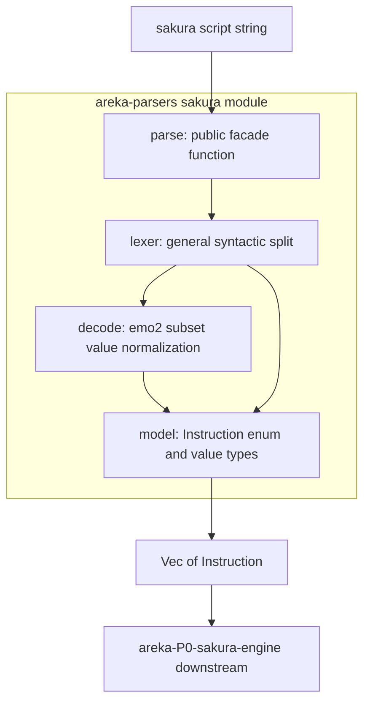
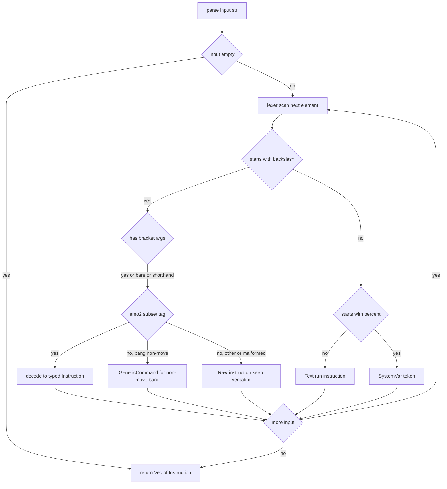

# 技術設計書: areka-P0-sakura-parse

## Overview

**Purpose**: 本機能は、SHIORI 応答の `Value:` に載って到来するさくらスクリプト文字列を、**値まで完全にデコード済みの型付き命令列（フラットな構造化命令の `Vec`）**へ変換する純粋関数を提供する。これにより下流の `areka-P0-sakura-engine` は文字列を二度と解析せず、命令列をそのままタイムライン再生できる。

**Users**: 第一の利用者は下流の `areka-P0-sakura-engine`（命令列の消費・再生）。次いで `conductor`（Value を本パーサへ渡す結線）。本パーサ自身は host 非依存・純粋・単体テスト可能であり、host を起動せず並走安全に検証される。

**Impact**: 現状 `crates/areka` は bin（`main.rs`）のみで、純粋ロジックを下流と共有できる公開面が無い。純粋・`std` のみ・host 非依存のパーサーを、重い `areka`（`windows`/`bevy_ecs`/`wintf`/D2D 依存）に同居させて下流に重依存を強いるのは不適切。よって本設計は**新クレート `areka-parsers`**（パーサーファミリ共通・純粋・`std` のみ・host 非依存）を新設し、その中に `sakura` モジュール（型 = 下流共有 I/O 契約、関数 = パーサ）を置く。`areka-parsers` は M-boot のパーサー4兄弟（sakura / shell / balloon / package-mount）の共通の住処であり、いずれも同一の依存素性を持つ（**本 spec は `sakura` モジュールのみを作る**。兄弟パーサーは各 spec が着手時に自分のモジュールを追加する＝空スタブは作らない）。`areka` は **bin のまま**変更しない。下流 `areka-P0-sakura-engine` は重い areka ではなく軽量な `areka-parsers` に依存して `Instruction` を得る。

### Goals

- さくらスクリプト文字列 → 順序保持のフラットな型付き命令列を返す純粋関数 `parse` を提供する（1.1〜1.5）。
- **2 層構造**を確立する: ① Lexer（全さくらスクリプトに対する一般構文分割）＋ ② Decode（emo2 subset のみの値正規化）。下流は再パースしない。
- emo2 タグ subset（要件 2〜9）の完全デコード — 待ち時間正規化、割合改行、Choice 分離、Move 引数 decode、サーフェス不透明保持、システム変数トークン化、Text run。
- 寛容パススルー（要件 10/13）— 未知タグ・不正トークンを raw/generic 命令へ吸収し、解析を中断しない。
- 拡張シーム（要件 11）— `#[non_exhaustive]` enum ＋汎用 raw/generic variant で将来のタグ追加を低コスト化。
- emo2 subset を網羅する host 非依存の単体テスト（要件 12）。

### Non-Goals

- 命令の**実行**（タイムライン再生・wait 実行・surface 指令発行）→ `areka-P0-sakura-engine`。
- `%username` の**実展開**（実ユーザ名置換）→ engine/runtime。
- `\s[...]` 中身の**数値解釈・エイリアス→ID 解決**→ surface 層 / `areka-P0-shell-parse`。
- `\![move]` の**窓移動実行**→ render / window-placement。
- emo2 subset 外タグの**意味デコード**（構文として区切り raw 保持するのみ）。
- `\q` 旧仕様 2 連ブラケット形式 `\q[ID][タイトル]` / `\q*[ID][タイトル]` の Choice デコード（さくらスクリプト唯一の `[...][...]` 連続形・ukadoc 明記の旧仕様ゆえ対象外。寛容パススルーで吸収）。
- charset 変換（UTF-8 前提・Shift_JIS は M2）、脳 DSL 解釈、バルーン／パッケージ解析。

## Boundary Commitments

### This Spec Owns

- **構文層（Lexer）**: さくらスクリプト文字列の一般構文分割。タグ区切り（`\` ＋ワード ＋ `[...]`）、bare タグ（`\e` `\c` `\-` `\n`）、`\wN` 短縮、`%keyword` システム変数、`[...]` 内のカンマ引数分割、引数クォート `"..."`（`""` = リテラル `"`）、エスケープ `\\` / `\%` / 角内 `\]`。**emo2 subset 外タグも構文として 1 単位に正しく区切る**（要件 13）。
- **デコード層（Decode）**: 構文分割済みの生タグ → 値正規化済みの型付き命令。待ち時間の Duration 統一、`\n[percent]` の比率 decode、`\q[disp,target]` の分離、`\![move,...]` の引数 decode、`\p[n]` 話者スコープ、`\s[...]` 不透明保持、`\_l`/`\e`/`\c`/`\-` の制御命令化、`%username` トークン化、テキストラン化（要件 2〜9）。**意味デコードは emo2 subset に限る**。
- **命令モデル（型）**: 下流 `areka-P0-sakura-engine` と共有する型付き命令 enum `Instruction` ＋付随する値型（`Duration`/`NewLineRatio`/`MoveArgs`/`Choice` 等）。これがクロスエンジン I/O 契約の片側であり、本パーサが**生成者**、engine が**消費者**。型の正本は本パーサが所有する。
- **寛容パススルー方針**: 未知タグ・不正トークンの raw/generic 命令としての吸収（要件 10/13.8）。
- **host 非依存の単体テスト**: emo2 subset を網羅する変換テスト（boot script を代表例に含むが限定しない・要件 12）。

### Out of Boundary

- 命令の意味解釈・実行・タイムライン再生（→ `areka-P0-sakura-engine`）。
- `%username` の実値展開（→ runtime）。
- `\s[...]` 中身の数値解釈・エイリアス解決・surface 合成（→ surface 層 / `areka-P0-shell-parse`）。
- `\![move]` の窓移動実行（→ render / window-placement）。
- `\q[disp,target]` の target → SHIORI `Reference0` 解決（→ conductor / reference_brain）。
- emo2 subset 外タグの意味デコード（構文区切り＋raw 保持のみ）。
- バルーン定義解析（→ `areka-P0-balloon-parse`）、パッケージ配置解決（→ `areka-P0-package-mount`）。

### Allowed Dependencies

- **`std` のみ**（`std::time::Duration` を待ち時間の正規化型に採用）。外部 parser ライブラリ（nom/pest/winnow）・正規表現は**導入しない**（最小実装・依存最小規律）。
- **`tracing`**（ライブラリ規約・workspace 既存依存）: 寛容パススルー時の `warn!`（未知タグ遭遇）発行のみ。subscriber 初期化はしない（logging.md: ライブラリは発行のみ）。
- **コード依存なし**: host-32 / conductor / wintf / dola / shiori-abi のいずれにも依存しない（純粋関数・並走安全）。dola の `CueCommand` は**設計パターンの範**として参照するのみで型依存はしない。

> **serde 派生は付さない**（設計判断・research §4 #3）。dola の命令型は serde デフォルト派生だが、本命令列はクロスエンジン I/O 契約をプロセス内のメモリで受け渡すのみで、シリアライズ／永続化／JSON スナップショットの計画が現時点で無い（YAGNI）。`Duration`/`f32` を含む variant があり `Eq`/`Hash` は付さない。テストは `PartialEq` ＋ `Debug` の構造比較で行う。下流 engine がシリアライズを要求した時点で 2 例目として追加する。

### Revalidation Triggers

以下の変更は下流 `areka-P0-sakura-engine`（および命令列を観測するテスト）に再検証を強制する:

- `Instruction` enum の **variant 追加・名称変更・フィールド構造変更**（`#[non_exhaustive]` ゆえ variant 追加は後方互換だが、消費側の `match` 網羅は影響を受ける）。
- 値型（`NewLineRatio` の内部表現、`MoveArgs` の構造、`Duration` 正規化規約、`Choice` のフィールド）の変更。
- 戻り値型（`Vec<Instruction>` 直返し ⇄ `Result` 化）の変更。
- 命令モデル型の**所有クレートの移動**（`areka-parsers` → 他クレート）。
- 寛容パススルーの吸収先 variant（`Raw` / `GenericCommand`）の意味変更。

## Architecture

### Existing Architecture Analysis

- **areka は bin-only クレート**: `crates/areka/src/` に `lib.rs` は無く、`main.rs` が `mod shiori_host; mod shiori_session; mod reference_brain; ...` で全モジュールを束ねる。これら既存モジュールは host/SHIORI 寄りで、純粋 parser の前例は無い。
- **整合すべき既存パターン**（`crates/dola/src/cue/command.rs`）: フラットな型付き enum（`CueCommand` 6 variant）、汎用枠 `Custom { command: String, params: ... }`、NewType（`ActorKey(String)` ＋ `From<&str>` / `Display`）、`#[derive(Clone, Debug, PartialEq)]`。本パーサの `Instruction` はこの構造を範とする（serde は前述の理由で外す）。
- **エラー規約**: 全クレート共通で `thiserror`。ただし本パーサは寛容パススルーゆえ**解析全体を失敗させない**（後述 Error Handling）。
- **命名規約**（structure.md）: ファイル `snake_case.rs`、型 `PascalCase`、関数 `snake_case`。単体テストは in-source `#[cfg(test)] mod tests`、肥大化時は `{module}/tests.rs`。
- **ロギング**（logging.md）: ライブラリは `tracing` マクロ発行のみ。スコーププレフィックス `[function_name]`・構造化フィールド優先。

### Architecture Pattern & Boundary Map

選択パターン: **2 層パイプライン（Lexer → Decode）＋フラット命令モデルの分離配置**。配置は設計ディスカッションで **Option C2（パーサー専用クレート）** に確定: 新クレート **`areka-parsers`**（パーサーファミリ共通・純粋／`std` のみ）に `sakura` モジュールを置き、その中で型（`model`）と関数（lexer / decode / parse facade）をモジュール分割する。当初案の areka lib 化（Option A/C1）は、純粋パーサーを重い areka に同居させ下流に重依存を強いるため破棄した（research §8.5）。



**Architecture Integration**:
- **選択パターン**: Lexer（構文・全スクリプト）と Decode（意味・emo2 subset 限定）の 2 層分離。Lexer の出力 = 構文トークン（生タグ／テキスト／bare／sysvar）、Decode が各構文トークンを `Instruction` へ正規化。下流が再パース不要なのは Decode が値を decode しきるため（要件 1.2）。
- **責務分離**: 構文の頑健性（要件 13）は Lexer に閉じ、意味の正しさ（要件 2〜9）は Decode に閉じる。寛容パススルー（要件 10）は両層に跨るが、Lexer は「区切れない不正」を、Decode は「区切れたが意味未対応」を、それぞれ別 variant（`Raw` / `GenericCommand`）へ吸収する明確なシームを持つ。
- **既存パターン踏襲**: フラット enum ＋汎用枠 ＋ NewType（dola `CueCommand` 準拠）。手書き線形スキャナ（依存ゼロ）。`thiserror` 不使用（送出しない方針）。`tracing` 発行のみ。
- **新コンポーネント根拠**: 新クレート `areka-parsers` は「下流と型を共有する I/O 契約（公開面）」と「純粋パーサーを重い areka から分離する」要請を両立する。Option B（areka bin mod）は外部から型が見えず契約共有が成立せず、Option A（areka lib 化）は純粋パーサーを重依存クレートに同居させるため不採用。パーサー4兄弟は全て同一素性（純粋／std／host 非依存）ゆえ `areka-parsers` に役割集約する（brief は配置を「着手時に確定」と open にしていた）。
- **steering 整合**: 最小実装＋薄い拡張シーム（roadmap 実装規律）、UTF-8 前提（tech.md）、`tracing` 規約（logging.md）、命名規約（structure.md）。

### Technology Stack

| Layer | Choice / Version | Role in Feature | Notes |
|-------|------------------|-----------------|-------|
| 言語 | Rust 2024 Edition | パーサ実装言語 | workspace 既定・32bit 可搬性維持 |
| 標準ライブラリ | `std`（`std::time::Duration`, `str::char_indices`） | 待ち時間正規化型・UTF-8 走査 | 外部 parser 依存ゼロ（手書き線形スキャナ） |
| ロギング | `tracing`（workspace 既定） | 寛容パススルー時の `warn!` 発行 | subscriber 初期化なし（ライブラリ規約） |

> 外部 parser ライブラリ（nom/pest/winnow）・正規表現は**不採用**: emo2 subset は約 12 種＋`\![move]` で手書き線形スキャナに収まり、`\wN` 短縮や「途中不正を飲み込んで継続」する寛容パススルーは手書きの方が素直（research §3.2）。`serde` 派生も**不採用**（前述）。詳細比較は `research.md` §3。

## File Structure Plan

### Directory Structure

```
crates/areka-parsers/        # 【新規クレート】パーサーファミリ共通（純粋・std のみ・host 非依存）
├── Cargo.toml              # 【新規】package = "areka-parsers"。依存は std（＋任意で tracing）のみ
└── src/
    ├── lib.rs              # 【新規】ライブラリルート。`pub mod sakura;`（兄弟 shell/balloon/package は各 spec が追加）
    └── sakura/             # 【新規】本 spec の成果物（さくらスクリプトパーサ）
        ├── mod.rs          # `pub use` で公開面を集約（parse / Instruction / 値型）
        ├── model.rs        # 命令モデル型（下流 engine 共有 I/O 契約）: Instruction enum ＋ NewLineRatio / MoveArgs / Choice / SurfaceArg / SpeakerScope 等の値型
        ├── lexer.rs        # 構文層: 手書き線形スキャナ。文字列 → 構文トークン列（生タグ／bare／shorthand／sysvar／text）。エスケープ・クォート・角括弧引数を処理
        ├── decode.rs       # 意味層: 構文トークン → Instruction。emo2 subset の値正規化（待ち時間／比率／Choice／Move）。未対応は Raw/GenericCommand へ
        ├── parse.rs        # 公開 facade: `pub fn parse(input: &str) -> Vec<Instruction>`。lexer → decode を結線
        └── tests.rs        # in-source 単体テスト（要件 2〜13 のタグ別 ＋ 寛容パススルー ＋ 空入力 ＋ emo2 boot script 代表例）
```

> モジュール内分割（model / lexer / decode / parse）は型（I/O 契約）と関数（実装）を分離し、下流 engine は `areka_parsers::sakura::Instruction` のみ import すれば足りる。lexer の構文トークン型は `lexer.rs` 内に閉じ、公開しない（`Instruction` のみ公開）。クレート名 `areka-parsers`（package）／lib 名 `areka_parsers`（`shiori-abi` と同じハイフン命名の前例に倣う）。

### Modified Files

- `crates/areka-parsers/Cargo.toml` — 【新規】`package.name = "areka-parsers"`、`edition = "2024"`。依存は std のみ（＋任意で既存 workspace の `tracing`）。外部 parser 依存は追加しない。
- workspace ルート `Cargo.toml` — `members = ["crates/*"]` ゆえ新クレートは**自動的に**メンバーへ含まれる（編集不要）。
- `crates/areka` — **変更なし**（bin のまま）。本 spec では parser の結線（`conductor` 経由の呼び出し）は範囲外ゆえ areka には一切手を入れない（done = `areka-parsers` 自己完結＋単体テスト）。将来 areka が parser を使う際は `areka-parsers` を依存に追加するだけ。

> `areka-parsers` は純粋パーサー専用クレートゆえ、`areka` の host/SHIORI 依存とは完全に切り離される。下流エンジンも本クレートに依存して `Instruction` を得るだけで、areka の重依存（windows/bevy_ecs/wintf）を引き込まない。

## System Flows

### パース処理フロー（構文区切り → 意味デコード → 寛容吸収）



**フロー上の決定**:
- Lexer は `[` がワード終端を、`]` が引数終端を機械的に決めるため、**未知タグでも構文として区切れる**（research §7.1）。これが寛容パススルーの頑健性の核心。
- `\![...]` は word=`!`・第 1 引数が実コマンド。`move` のみ Decode が `Move` 命令へ、それ以外は `GenericCommand` で通す（要件 7・research §7.1）。
- bare タグ（`\e` `\c` `\-` `\n`）と `\wN` 短縮は正準形で切れない**例外テーブル**で引く（research §7.2）。
- 解析は**中断しない**: 不正・未対応は必ずいずれかの `Instruction` へ畳まれ、前後の正常命令を欠落させない（要件 10.3）。

## Requirements Traceability

| Requirement | Summary | Components | Interfaces | Flows |
|-------------|---------|------------|------------|-------|
| 1.1 | 文字列→順序保持の型付き命令列 | parse, lexer, decode, model | `parse(&str) -> Vec<Instruction>` | パース処理フロー |
| 1.2 | 字句・構造化・値デコードを完了し未デコード断片を残さない | lexer, decode | Lexer→Decode 2 層 | パース処理フロー |
| 1.3 | 入力順どおりに整列 | parse, lexer | `Vec` 追加順 = 入力順 | パース処理フロー |
| 1.4 | 命令を実行・解釈しない | parse | 戻り値は命令列のみ（副作用なし） | — |
| 1.5 | 空入力→空命令列 | parse | `parse("") == vec![]` | パース処理フロー Empty 分岐 |
| 2.1 | `\p[n]` 話者スコープ命令 | decode, model | `Instruction::SpeakerScope { n }` | — |
| 2.2 | `\s[...]` 中身を不透明文字列で保持 | decode, model | `Instruction::Surface(SurfaceArg)` | — |
| 2.3 | `\s` 中身を数値解釈・エイリアス解決・改変しない | decode, model | `SurfaceArg(String)` 無加工 | — |
| 3.1 | `\w[n]`→Duration | decode, model | `Instruction::Wait(Duration)` | — |
| 3.2 | `\wN` 短縮→Duration | lexer, decode | shorthand 例外テーブル | — |
| 3.3 | `\_w[ms]`→絶対 ms Duration | decode | `Wait(Duration::from_millis)` | — |
| 3.4 | `\w`系/`\_w`系を同一 Wait 命令で表現 | model | 単一 `Wait` variant | — |
| 4.1 | `\n[percent]`→比率値 | decode, model | `Instruction::NewLine(NewLineRatio)` | — |
| 4.2 | 素の `\n`→既定比率 | decode | bare 例外テーブル＋既定値 | — |
| 5.1 | `\q[disp,target]`→disp/target 分離 Choice | decode, model | `Instruction::Choice(Choice)` | — |
| 5.2 | 第 3 引数以降の Reference を順序保持 | decode, model | `Choice.references: Vec<String>` | — |
| 5.3 | 旧 2 連 `\q[ID][タイトル]` を Choice 化せず寛容吸収 | lexer, decode | `Raw` ＋宙に浮く `[...]` 保持 | パースフロー RawKeep |
| 5.4 | `\![*]` マーカーを構造化し未デコード文字列を残さない | decode | マーカー消化 → Choice/GenericCommand | — |
| 6.1 | `\_l[x,y]`→カーソル絶対位置 | decode, model | `Instruction::Cursor { x, y }` | — |
| 6.2 | `\e`→終端命令 | decode, model | `Instruction::End` | — |
| 6.3 | `\c`→クリア命令 | decode, model | `Instruction::Clear` | — |
| 6.4 | `\-`→終了命令 | decode, model | `Instruction::Quit` | — |
| 7.1 | `\![move,...]`→引数 decode 済み Move | decode, model | `Instruction::Move(MoveArgs)` | パースフロー DecodeTag |
| 7.2 | move 以外の `\!`→汎用コマンドで継続 | decode, model | `Instruction::GenericCommand` | パースフロー GenericCmd |
| 7.3 | `\![move]` 以外の `\!` は意味解釈せず種別＋生引数保持 | decode, model | `GenericCommand { name, raw_args }` | — |
| 8.1 | `%username`→展開なしトークン | lexer, decode, model | `Instruction::SystemVar(String)` | パースフロー SysVar |
| 8.2 | 実値置換しない | decode | トークン化のみ | — |
| 9.1 | タグ間プレーンテキスト→Text run | lexer, decode, model | `Instruction::Text(String)` | パースフロー TextRun |
| 9.2 | 連続テキストの文字順保持 | lexer | text 蓄積 | — |
| 10.1 | 未知/不正→構文区切り＋raw/unknown 保持・継続 | lexer, decode, model | `Raw` / `GenericCommand` | パースフロー RawKeep |
| 10.2 | raw 保持中にエラーを送出しない | parse, decode | 戻り値は `Vec`（`Result` でない） | — |
| 10.3 | 不正トークン前後の正常命令を欠落させない | lexer, parse | スキャナは局所吸収・全域継続 | パース処理フロー More ループ |
| 11.1 | 命令種別を variant 追加に開く | model | `#[non_exhaustive] enum Instruction` | — |
| 11.2 | M1 未使用タグを寛容パススルー対象とし専用 decode しない | decode | 例外テーブル外 → Raw/GenericCommand | — |
| 12.1 | UTF-8 前提・charset 変換しない | lexer | `char_indices` 走査・変換なし | — |
| 12.2 | 同一入力に同一出力の純粋関数 | parse | 外部状態・host 非依存 | — |
| 12.3 | emo2 subset を host 非依存単体テストで検証 | tests | `#[cfg(test)] mod tests` | — |
| 12.4 | boot script 1 本に限定せずタグ個別検証 | tests | タグ別テストケース群 | — |
| 13.1 | bare/shorthand タグを規則で終端し後続を巻き込まない | lexer | bare/shorthand 例外テーブル | — |
| 13.2 | `\X[...]` を `]` まで引数範囲として区切る | lexer | 角括弧スキャン | — |
| 13.3 | 角括弧内 `,` で複数引数分割 | lexer | 引数分割 | — |
| 13.4 | `"..."` を 1 引数扱い・`""`→リテラル `"` | lexer | クォート処理 | — |
| 13.5 | `\\`→リテラル `\` をテキストへ | lexer | エスケープ処理 | — |
| 13.6 | `\%`→リテラル `%` をテキストへ | lexer | エスケープ処理 | — |
| 13.7 | 角括弧内 `\]`→リテラル `]` を引数へ | lexer | エスケープ処理 | — |
| 13.8 | subset 外タグを構文区切り＋raw 保持・前後破壊なし | lexer, decode | `Raw` 吸収 | パースフロー RawKeep |

## Components and Interfaces

| Component | Domain/Layer | Intent | Req Coverage | Key Dependencies (P0/P1) | Contracts |
|-----------|--------------|--------|--------------|--------------------------|-----------|
| `model` | 型（I/O 契約） | 下流 engine と共有する型付き命令 enum ＋値型を定義 | 1, 2, 3, 4, 5, 6, 7, 8, 9, 11 | なし（std のみ） | State（型契約） |
| `lexer` | 構文層 | 全さくらスクリプトの構文分割（手書き線形スキャナ） | 9, 12, 13 | model (P0) | Service |
| `decode` | 意味層 | 構文トークン → Instruction の値正規化（emo2 subset） | 2, 3, 4, 5, 6, 7, 8, 10, 11 | model (P0), lexer (P0) | Service |
| `parse` | facade | lexer→decode を結線する公開純粋関数 | 1, 10, 12 | lexer (P0), decode (P0) | Service |
| `tests` | テスト | emo2 subset 網羅の host 非依存単体テスト | 12 | parse (P0), model (P0) | — |

### 型（I/O 契約）

#### `model` — 命令モデル（下流共有 I/O 契約）

| Field | Detail |
|-------|--------|
| Intent | 下流 `areka-P0-sakura-engine` と共有する型付き命令 enum ＋値型の定義 |
| Requirements | 1.1, 2.1, 2.2, 3.1, 3.4, 4.1, 5.1, 5.2, 6.1, 6.2, 6.3, 6.4, 7.1, 7.3, 8.1, 9.1, 11.1 |

**Responsibilities & Constraints**
- フラットな単一 enum `Instruction`（`#[non_exhaustive]`）として全命令種別を表現（要件 11.1）。意味の入れ子構造は持たない（さくらスクリプト文法は線形）。
- 各 variant は値正規化済み（待ち時間 = `Duration`、改行 = 比率、Choice = disp/target 分離）。下流が再パース不要（要件 1.2）。
- `Surface` の中身は**不透明文字列**として無加工保持（要件 2.3）。
- 汎用枠 `GenericCommand { name, raw_args }`（dola `Custom` 準拠）と `Raw(String)` の 2 種で寛容パススルーを受ける（要件 10/11.2）。
- 派生は `#[derive(Clone, Debug, PartialEq)]`（`f32`/`Duration` 含むため `Eq`/`Hash` は付さない・serde は付さない）。

**Dependencies**
- Inbound: `decode` — Instruction の生成（P0）
- Inbound: `areka-P0-sakura-engine`（別 spec・下流） — Instruction の消費（P0・I/O 契約）
- Outbound: なし
- External: `std::time::Duration`（P0）

**Contracts**: State [x]

##### State Management（型定義スケッチ）

```rust
/// さくらスクリプトの 1 命令（フラット・拡張に開く）。
/// 下流 areka-P0-sakura-engine と共有する I/O 契約の片側。
#[non_exhaustive]
#[derive(Clone, Debug, PartialEq)]
pub enum Instruction {
    /// タグ間プレーンテキスト（要件 9）
    Text(String),
    /// 話者スコープ \p[n]（要件 2.1）
    SpeakerScope { n: u32 },
    /// サーフェス \s[...]（中身は不透明文字列・無加工。要件 2.2/2.3）
    Surface(SurfaceArg),
    /// 待ち時間 \w[n] / \wN / \_w[ms] を統一（要件 3）
    Wait(std::time::Duration),
    /// 改行 \n[percent] / \n（比率。要件 4）
    NewLine(NewLineRatio),
    /// 選択肢 \q[disp,target,...]（要件 5）
    Choice(Choice),
    /// カーソル絶対位置 \_l[x,y]（要件 6.1）
    Cursor { x: String, y: String },
    /// 終端 \e（要件 6.2）
    End,
    /// クリア \c（要件 6.3）
    Clear,
    /// 終了 \-（要件 6.4）
    Quit,
    /// キャラ移動 \![move,...]（引数 decode 済み。要件 7.1）
    Move(MoveArgs),
    /// システム変数 %username（展開なしトークン。要件 8）
    SystemVar(String),
    /// 汎用 \! コマンド（move 以外・種別＋生引数。要件 7.2/7.3/10）
    GenericCommand { name: String, raw_args: Vec<String> },
    /// 寛容パススルー: 構文区切りできたが意味未対応／不正の生保持（要件 10/13.8）
    Raw(String),
}

/// \s[...] の不透明中身（NewType・surface 層が解釈）。要件 2.2/2.3。
#[derive(Clone, Debug, PartialEq)]
pub struct SurfaceArg(String);

/// \n の比率（150 → 1.5）。素の \n は既定比率。要件 4。
#[derive(Clone, Debug, PartialEq)]
pub struct NewLineRatio(f32);

/// \q[disp,target,refs...] の分離保持。要件 5.1/5.2。
#[derive(Clone, Debug, PartialEq)]
pub struct Choice {
    pub disp: String,
    pub target: String,
    pub references: Vec<String>,
}

/// \![move,...] の decode 済み引数。要件 7.1。
#[derive(Clone, Debug, PartialEq)]
pub struct MoveArgs {
    pub args: Vec<String>,
}

// --- 共有 I/O 契約の読み取りアクセサ（公開クレート areka-parsers の公開面）---
// 不透明 NewType はフィールドを pub にせず読み取り専用メソッドで公開する（dola ActorKey 流儀）。
// これが無いと別クレートの下流 engine が中身を読めず、I/O 契約が機能しない（設計ディスカッション議題1）。
impl SurfaceArg {
    /// \s[...] の不透明中身を読み取る（改変不可・要件 2.3）。
    pub fn as_str(&self) -> &str { &self.0 }
}
impl NewLineRatio {
    /// \n の比率（150 → 1.5）を読み取る。
    pub fn ratio(&self) -> f32 { self.0 }
}
```

- Preconditions: `Instruction` は本パーサのみが生成。下流は読み取り専用で消費する。
- Postconditions: variant は値正規化済み（`Wait` は表記差を吸収した単一 `Duration`、`NewLine` は比率値）。
- Invariants: `Surface` の中身は入力バイト列を改変しない（要件 2.3）。`#[non_exhaustive]` により下流の `match` は `_ =>` を要する（variant 追加が後方互換）。

> **値型の暫定確定**（research §4 #6・未閉じ論点を OPEN QUESTIONS にも再掲）:
> - `Cursor { x, y }` の x/y は**文字列のまま保持**（em/lh 単位の数値解釈は surface/render 層の責務・パーサは区切りのみ）。
> - `MoveArgs.args` は**生引数列を保持**（dx/dy/base の意味割当は window-placement の責務。「decode」= 構文区切り＋引数分割であって意味解釈ではない）。これにより要件 7.1 の「引数を decode」と Out of Boundary（移動実行・引数の意味割当は別 spec）が両立する。
> - `SystemVar(String)` は `%` を除いたキーワード（例 `username`）を保持。

### 構文層

#### `lexer` — 一般構文分割

| Field | Detail |
|-------|--------|
| Intent | 全さくらスクリプトを構文トークンへ分割（手書き線形スキャナ・依存ゼロ） |
| Requirements | 9.1, 9.2, 12.1, 13.1, 13.2, 13.3, 13.4, 13.5, 13.6, 13.7 |

**Responsibilities & Constraints**
- 入力を `char_indices` で UTF-8 走査し、構文トークン列へ分割（charset 変換なし・要件 12.1）。
- 構文トークン種別（lexer 内部型・非公開）: 正準タグ（`\` ＋ word ＋ `[args]`）、bare タグ（`\e` `\c` `\-` `\n`）、shorthand（`\wN`）、sysvar（`%keyword`）、text run。
- `[` でワード終端、`]` で引数終端を機械的に決める（要件 13.2）。角括弧内 `,` で引数分割（要件 13.3）。
- クォート `"..."` を 1 引数扱い・`""` → リテラル `"`（要件 13.4）。エスケープ `\\` → `\`（要件 13.5）、`\%` → `%`（要件 13.6）、角内 `\]` → `]`（要件 13.7）はテキスト／引数へリテラル取り込み。
- 未知タグ・未閉じ `[` 等の境界も**構文として 1 単位に区切る**（区切れない場合のみ raw 範囲を確定して継続・要件 13.8 の前段）。

**Dependencies**
- Inbound: `parse` — トークン列の取得（P0）
- Outbound: `model`（最終 `Instruction` は decode 経由・lexer は内部トークン型を返す）（P0）
- External: `std`（`str::char_indices`）（P0）

**Contracts**: Service [x]

##### Service Interface
```rust
// lexer 内部 API（mod 内非公開・decode が消費）
pub(crate) fn lex(input: &str) -> Vec<Token>;

// 構文トークン（非公開・Instruction とは別物）
pub(crate) enum Token {
    Tag { word: String, args: Vec<String> },  // 正準形 \word[args]
    Bare(char),                                 // \e \c \- \n
    WaitShorthand(u8),                          // \wN（1 桁）
    SysVar(String),                             // %keyword
    Text(String),                               // タグ間テキスト（エスケープ解決済み）
    Raw(String),                                // 区切れたが正準でない／不正
}
```
- Preconditions: `input` は UTF-8。
- Postconditions: トークンは入力順を保持（要件 9.2/1.3）。エスケープは解決済み（`Text`/`Tag.args` にリテラル文字として格納）。
- Invariants: 解析を中断しない（不正は `Raw` トークン化して継続・要件 10.3 の構文側保証）。

**Implementation Notes**
- Integration: `decode` がトークン列を `Instruction` へ写像。lexer の `Token` は `sakura` モジュール外へ公開しない（`pub(crate)`）。
- Validation: 要件 13 の各エスケープ・クォート・角括弧を個別テストで固定（`tests.rs`）。
- Risks: 未閉じ `[`・`"` の境界処理。方針 = 入力末尾までを引数／クォート範囲とみなし `Raw` で吸収（クラッシュさせない）。

### 意味層

#### `decode` — emo2 subset 値正規化

| Field | Detail |
|-------|--------|
| Intent | 構文トークン → 値正規化済み `Instruction`（emo2 subset 限定の意味デコード） |
| Requirements | 2.1, 2.2, 2.3, 3.1, 3.2, 3.3, 3.4, 4.1, 4.2, 5.1, 5.2, 5.3, 5.4, 6.1, 6.2, 6.3, 6.4, 7.1, 7.2, 7.3, 8.1, 8.2, 10.1, 10.2, 11.2 |

**Responsibilities & Constraints**
- `Token` を 1:1（または `\![*]` ＋ `\q` の結合のように局所的に畳んで）`Instruction` へ写像。
- emo2 subset（要件 2〜9）は型付き命令へ decode。値正規化規約（research §4 #6・本書 model 節の暫定確定）に従う:
  - 待ち時間 `\w[n]`/`\wN`/`\_w[ms]` → 単一 `Wait(Duration)`（要件 3.4）。`\_w` は絶対 ms（要件 3.3）。`\w[n]`/`\wN` の単位は ukadoc 既定 wait 量に従う（OPEN QUESTION #1）。
  - `\n[percent]` → `NewLine(NewLineRatio(percent/100.0))`、素の `\n` → 既定比率（OPEN QUESTION #2）。
  - `\q[disp,target,refs...]` → `Choice { disp, target, references }`（要件 5.1/5.2）。`\![*]` マーカーは Choice へ畳む／単独なら `GenericCommand`（要件 5.4）。旧 2 連形 `\q[ID][タイトル]` は Choice 化せず、宙に浮く 2 個目の `[...]` は `Raw` で保持（要件 5.3）。
  - `\![move,...]` → `Move(MoveArgs)`、move 以外の `\!` → `GenericCommand { name, raw_args }`（要件 7）。
  - `\p[n]` → `SpeakerScope`、`\s[...]` → `Surface`（無加工）、`\_l`/`\e`/`\c`/`\-` → 各制御命令（要件 2/6）。
  - `%keyword` → `SystemVar`（展開なし・要件 8）。`Text` → `Instruction::Text`（要件 9）。
- emo2 subset 外タグ・未対応 `Token::Raw` は `Instruction::Raw` または `GenericCommand` へ吸収（要件 10/11.2）。**エラーを送出しない**（要件 10.2）。

**Dependencies**
- Inbound: `parse` — decode 呼び出し（P0）
- Outbound: `model` — Instruction 生成（P0）
- Outbound: `lexer` — Token 消費（P0）
- External: `tracing`（未対応タグ遭遇時 `warn!`・任意）（P2）

**Contracts**: Service [x]

##### Service Interface
```rust
// decode 内部 API（mod 内・parse が結線）
pub(crate) fn decode(tokens: Vec<Token>) -> Vec<Instruction>;
```
- Preconditions: `tokens` は lexer 出力（構文区切り済み）。
- Postconditions: 全 `Token` がいずれかの `Instruction` へ写像され、未デコード文字列断片は残らない（要件 1.2）。出力順は入力順（要件 1.3）。
- Invariants: 失敗しない（`Vec` を返す・`Result` でない）。前後の正常命令を欠落させない（要件 10.3）。

**Implementation Notes**
- Integration: bare/shorthand の意味割当は小テーブル（`\e`→End 等）。`\![...]` の第 1 引数で move/それ以外を分岐（research §7.1）。
- Validation: 各タグの decode 結果を期待 `Instruction` と構造比較（`PartialEq`）。値正規化（Duration ms・比率）を境界値で固定。
- Risks: `\q` 旧 2 連形・`\![*]` 結合の境界。テストで「旧形は隣接命令を壊さない」を明示的に固定（要件 5.3）。

### facade

#### `parse` — 公開純粋関数

| Field | Detail |
|-------|--------|
| Intent | lexer→decode を結線する単一公開エントリ。純粋・host 非依存 |
| Requirements | 1.1, 1.3, 1.4, 1.5, 10.2, 10.3, 12.2 |

**Responsibilities & Constraints**
- `pub fn parse(input: &str) -> Vec<Instruction>` を公開（`sakura/mod.rs` で `pub use`）。
- 空入力 → 空 `Vec`（要件 1.5）。同一入力 → 同一出力の純粋関数（要件 12.2）。
- 命令を実行・解釈しない（戻り値生成のみ・副作用なし・要件 1.4）。

**Dependencies**
- Inbound: 下流 `conductor`（別 spec・本 spec では未結線）／単体テスト（P0）
- Outbound: `lexer`, `decode`（P0）

**Contracts**: Service [x]

##### Service Interface
```rust
/// さくらスクリプト文字列を値まで decode 済みの型付き命令列へ変換する純粋関数。
/// 寛容パススルー: 失敗せず常に Vec<Instruction> を返す（要件 10）。
pub fn parse(input: &str) -> Vec<Instruction>;
```
- Preconditions: `input` は UTF-8（要件 12.1）。
- Postconditions: 順序保持の命令列（要件 1.1/1.3）。空入力で空列（要件 1.5）。
- Invariants: 純粋・決定的・host 非依存（要件 12.2）。エラーを送出しない（要件 10.2）。

**Implementation Notes**
- Integration: `conductor` 経由の結線は本 spec 範囲外（done = lib 自己完結＋単体テスト）。
- Validation: 空入力・順序保持・純粋性（同一入力 2 回呼び出しで等価）をテストで固定。
- Risks: なし（線形・依存ゼロ）。

## Error Handling

### Error Strategy

**寛容パススルー（要件 10/13）が唯一の方針**。本パーサは `Result`/`thiserror` エラー型を**定義しない**（戻り値は `Vec<Instruction>` 直返し・research §4 #5 の裁定）。あらゆる未知タグ・不正トークン・未閉じ角括弧は対応する `Instruction` variant（`Raw` / `GenericCommand`）へ吸収され、解析は中断しない（要件 10.2）。

### Error Categories and Responses

| 状況 | 応答 | 命令 | 要件 |
|------|------|------|------|
| 未知 `\!` コマンド（move 以外） | 汎用コマンドで継続 | `GenericCommand { name, raw_args }` | 7.2, 10.1 |
| emo2 subset 外タグ（`\b` `\i` 等） | 構文区切り＋raw 保持 | `Raw` | 11.2, 13.8 |
| 不正トークン・未閉じ `[`/`"` | 範囲を確定して raw 吸収 | `Raw` | 10.1, 10.3 |
| `\q` 旧 2 連形 | Choice 化せず宙に浮く `[...]` を raw 保持 | `Choice`（第 1 ブラケットのみ）＋ `Raw` | 5.3 |
| 空入力 | 失敗でない | `vec![]` | 1.5 |

- 前後の正常命令は欠落させない（要件 10.3）— スキャナは不正を局所範囲に閉じ込めて全域走査を継続する。

### Monitoring

- ライブラリ規約（logging.md）に従い `tracing` 発行のみ。未対応タグ遭遇時に `warn!(tag = %word, "[decode] unsupported tag, kept as raw")` を 1 点発行（任意・過剰ログ回避）。subscriber 初期化はしない。

## Testing Strategy

### Unit Tests（in-source `#[cfg(test)] mod tests`・host 非依存）

- **構文（要件 13）**: `\\`→`\`・`\%`→`%`・角内 `\]`→`]` のエスケープ、`"a,b"` を 1 引数・`""`→`"` のクォート、`\X[...]` の `]` 終端、未知タグ `\foo[a,b]` の構文区切り＋`Raw` 吸収を各々固定。
- **値正規化（要件 3/4）**: `\w[100]`/`\w9`/`\_w[500]` の Duration 等価、`\n[150]`→比率 1.5・素 `\n`→既定比率を境界値で固定。
- **Choice（要件 5）**: `\q[はい,OnYes]`→`Choice { disp:"はい", target:"OnYes", references:[] }`、第 3 引数付き `\q[t,id,r0,r1]`→`references:["r0","r1"]`、旧 2 連 `\q[ID][タイトル]` が隣接命令を壊さず `Raw` 吸収されることを固定。
- **Move と汎用 `\!`（要件 7）**: `\![move,10,20,...]`→`Move`、`\![open,sliderinput]`→`GenericCommand { name:"open", raw_args:[...] }` を固定。
- **不透明保持（要件 2）**: `\s[10]`/`\s[エイリアス]` の中身が無改変で `Surface` に入ることを固定。
- **寛容パススルー（要件 10）**: 不正トークンの前後に正常命令を置き、両端の命令が欠落しないことを固定。
- **純粋関数契約（要件 1/12）**: 空入力→空列、混在入力の順序保持、同一入力 2 回で等価、UTF-8 日本語テキストの Text run 化を固定。

### Integration Tests（host 不要・代表シナリオ）

- **emo2 boot script 代表例（要件 12.3/12.4）**: emo2 の boot script を題材に、想定命令列への変換を 1 シナリオで固定（フィクスチャ取り込み可否は OPEN QUESTION #3）。**boot script に現れないタグ（`\q`/`\![move]` 等）は個別単体テストで別途検証**し、done を boot script 1 本に限定しない（要件 12.4）。

> E2E/UI・Performance テストは本 spec の対象外（純粋関数・host 非依存・線形アルゴリズムゆえ性能目標なし）。

## Optional Sections

### Performance & Scalability

- アルゴリズムは線形 1 パス（`char_indices` 走査）。外部依存ゼロ。性能目標は設定しない（boot script 規模では無視できるコスト）。

---

## Open Questions / Risks（設計フェーズで未確定・実装着手前に裁定推奨）

> いずれも `Instruction` の**外形（variant 名・構造）には影響せず**、内部の値正規化定数のみに関わる。型契約を確定させたまま実装時に詰められるため、本設計は型・境界・責務を確定済みとして FINALIZE する。下記は実装テストのフィクスチャ確定時に裁定する。

1. **`\w[n]` / `\wN` の基準 ms**: `\_w[ms]` は絶対 ms で確定。`\w[n]`/`\wN` の 1 単位 ms 値は ukadoc 既定 wait 量に従う（一次確認は実装時）。`Wait(Duration)` という型は確定ゆえ外形不変。
2. **素の `\n` の既定比率**: `\n[percent]`→`percent/100.0` は確定（`\n[150]`=1.5）。引数なし `\n` の既定比率値（1.0 が有力）は実装時に確定。`NewLineRatio(f32)` 型は確定。
3. **emo2 実 boot script フィクスチャの取り込み**: 実スクリプトをリポジトリ同梱するか（ライセンス・所在）。同梱しない場合は代表抜粋を手書きフィクスチャ化。done の網羅性（要件 12.4: タグ個別検証）は手書きフィクスチャで担保可能ゆえブロッキングではない。
