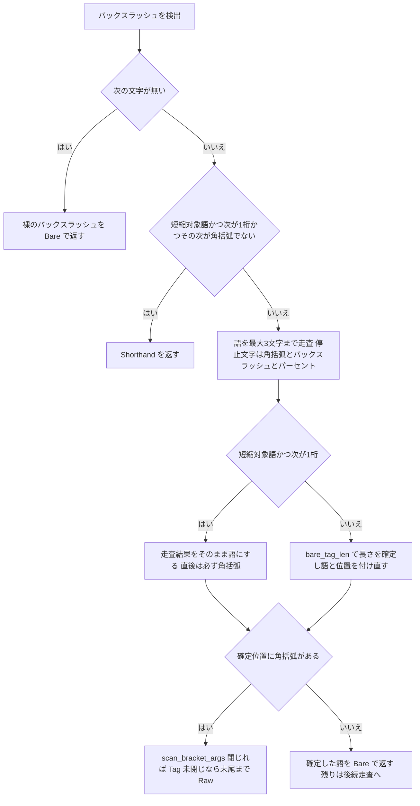

# 技術設計: areka-P0-sakura-tag-word-boundary

> 作成: 2026-09-13（`/kiro-spec-design`）。コードの参照は本日の現物（ブランチ `claude/sakura-tag-word-boundary-e6d12b`・HEAD `7d5ee259`）で再検証した。引用は原則「何の定義か」（関数名・注記の内容）で指し、行番号は補助に留める。採用案は要件ディスカッション（2026-09-11）で裁定済みの **案 δ**（`research.md` §5・§7）である。

## Overview

**Purpose**: 台詞の本文に半角 `[` が現れると直前のタグと本文が黙って消える欠陥を、さくらスクリプトの字句層 `crates/areka-parsers/src/sakura/lexer.rs` の 1 関数 `scan_tag` の中で是正する。
**Users**: 既存の伺かゴースト（里々／YAYA 辞書・外部由来テキストを台詞へ差し込むゴースト）を areka で動かす利用者と、そのゴーストの作者。
**Impact**: `scan_tag` の語走査を最大 3 文字で頭打ちにし、既存の純粋関数 `bare_tag_len` が返す長さでタグ名を確定してから角括弧の有無を判定する。公開契約 `parse(&str) -> Vec<Instruction>` の形と意味、`Token`・`Instruction` の型、意味層（`decode.rs`）、下流（`compile.rs`）は変えない。利用者から見える結果が変わるのは「タグ ＋ 本文 1 文字以上 ＋ 半角 `[`」の形と、正典に存在しない架空の多文字綴り（`\foo[a,b]` 等）だけである。

### Goals

- タグ名は綴りによらず「`\` ＋ 1 文字」「`\_` ＋ 1 文字」「`\__` ＋ 1 文字」の規則で終端し、本文中の `[` に引きずられない（要件 1・2・3）。
- 閉じた位置に `[` があれば従来どおり角括弧経路へ送る（要件 4）。
- 是正を元へ戻すと失敗する決定論テストを字句層と通しの 2 層で持つ（要件 5）。
- 触れるファイルの注記を実装と一致させ、互換記録へ裁量と非互換を登記する（要件 6・7）。

### Non-Goals

- タグ語彙表・アリティ表の新設（案 A）。字句層は既知綴りの一覧を持たない。
- タグの意味付けの追加。areka が意味を与えていない綴りは本仕様の後も `Instruction::Raw` のまま下流で捨てられる。
- 角括弧なし `\_` タグの固定長規律そのもの（`bare_tag_len` の決定表）の変更。
- 未閉じ `[`／`"` の寛容吸収規則（`BracketScan::Unclosed` → `Token::Raw`）の変更。
- 全角括弧など他の記号を引数開始と見なす拡張。
- ソースへの正典出典注記。

## Boundary Commitments

### This Spec Owns

- **`scan_tag` におけるタグ名の終端位置の決定**（`crates/areka-parsers/src/sakura/lexer.rs`）: 語走査の頭打ち（最大 3 文字）、`bare_tag_len` による長さ確定の前倒し、短縮対象語＋数字の 1 例外。角括弧の有無の判定はこの確定位置で行う。
- `lexer.rs` 内の、実装と食い違うことになる説明注記の訂正（要件 6.6）。対象は 7 か所——「モジュール doc の正準タグの項（`[` がワード終端）」「モジュール doc の bare タグの項」「`Token::Tag` の doc（word は `[` まで）」「`scan_tag` の doc の形態一覧（`[` がワード終端）」「`scan_tag` の語走査直前の注記」「角括弧なし経路の注記」「`bare_tag_len` の doc 冒頭 2 段落」。完了条件は `lexer.rs` 内で「`[` がワード終端」「word は `[` まで」の記述が 0 件になること（設計検証 2026-09-13 で 3 か所の漏れを訂正）。
- 新設テスト 2 ファイル（`lexer_word_boundary_tests.rs`・`parse_word_boundary_tests.rs`）と、`lexer.rs`／`parse.rs` 末尾のパス属性つき接続宣言。
- 架空の多文字綴り `\foo` を入力に使う既存テスト 8 本の扱い。綴り差し替え 7 本（`lexer_tests.rs` 1 本・`decode_tests.rs` 2 本・`parse_tests.rs` 1 本・`validation_tests.rs` 2 本・`decode_font_tests.rs` の `scripts_without_font_tag_decode_unchanged`——正典の 1 文字綴り `\i` へ）と、期待値の書き換え 1 本（`decode_font_tests.rs` の `other_words_starting_with_f_stay_raw`）。完了条件は、書き換え 1 本を除き `\foo[`（角括弧付き）を `lex`／`dec`／`parse` に通す既存テストが 0 件になること（角括弧を伴わない `\fooテキスト` を使う `decode_font_tests.rs` の `bare_f_consumes_exactly_one_character` は是正の前後で結果が同じ（1 文字規律そのものを固定する）ゆえ差し替えずに残す・`model_tests.rs` の `Instruction::Raw` 直接構築は対象外・設計検証 2026-09-13 で `validation_tests.rs` の 2 本、main 取り込み 2026-09-17 で `decode_font_tests.rs` の 2 本を追加）。
- `doc/COMPAT_ARCHITECTURE.md` §8 の裁量表への 1 行登記。

### Out of Boundary

- `bare_tag_len` の本体と決定表（先行 spec `areka-P0-sakura-bare-tag-lexer` の確定事項・要件 4.8）。読むだけで編集しない。
- `scan_bracket_args`・`scan_sysvar`・`lex` のエスケープ処理・短縮形判定の条件式（`SHORTHAND_WORDS.contains(&first) && 次が 1 桁 && その次が [ でない`）。
- `decode.rs`・`model.rs`・`crates/areka-sakura/src/compile.rs`（`Raw` を「M-boot 外タグを無視」の debug ログで捨てる catch-all）。同ウェーブ W13 の `areka-P0-text-decoration-canon` が `decode.rs`／`compile.rs` を触るため、本仕様はこれらに触れない（共有ファイル 0）。同 spec は 2026-09-17 に PR#148 で main へ着地し本ブランチへ取り込み済み——本番ファイルの共有 0 は保たれるが、同 spec が新設したテストファイル `decode_font_tests.rs` の 2 本は本仕様の編集対象に入る（下記 Modified Files）。
- 完了済み spec（`areka-P0-sakura-parse`・`areka-P0-sakura-bare-tag-lexer`）の文書、行数上限の例外表、roadmap・steering。
- `\_a`・`\_q` 等の意味付け（`areka-P0-anchor-tag-canon`・`areka-P0-sakura-time-directives` の領分）。

### Allowed Dependencies

- 既存の依存方向 **`model ← lexer ← decode ← parse`** をそのまま使う。`lexer.rs` は新しい `use` を 1 つも足さない（既知綴りの集合を持たないため意味層を参照する必要がない）。
- 再利用する既存資産: `bare_tag_len`（純粋関数）・`SHORTHAND_WORDS`・`Token`・`scan_bracket_args`・`BracketScan`。
- 新しい crate 依存・feature は追加しない。Rust 2024・`std` のみ。テストは `#[test]` のみ（決定論・GPU／実機非依存・要件 5.10）。

### Revalidation Triggers

- 語走査の停止文字（`[`／`\`／`%`）・頭打ち長（3）・`bare_tag_len` の決定表・短縮形の 1 桁規律のいずれかを変える変更。
- `Token::Tag { word }` の `word` が 3 文字を超えて生成され得るようになる変更（本設計後は `word` は常に 1〜3 文字。`decode_tag` の腕はすべて 1〜2 文字の綴りであり、この不変条件に依存しない設計だが、破れば `\foo[a,b]` の登記と要件 4.11 が無効になる）。
- 正典（ukadoc）に `_` 始まり以外の多文字タグ名が追加された場合（規則の統一の前提が崩れる）。
- 後続 spec への前提: `areka-P0-anchor-tag-canon`（W17）は `\_a[ID]` が角括弧経路で不変であること（要件 4.2）、`areka-P0-property-query-channels`（W14）は `scan_sysvar` を拡張する際に「タグ名は確定位置で閉じ、`%` は語走査の停止文字である」ことを前提にできる。

## Architecture

### Existing Architecture Analysis

`scan_tag`（`lexer.rs`）は現行 4 段で動く。

1. 入力末尾の裸 `\` → `Token::Bare("\\")`。
2. 短縮形判定: 先頭が `SHORTHAND_WORDS`（`w`/`b`/`p`）∧ 次が 1 桁 ∧ その次が `[` でない → `Token::Shorthand`。
3. **語走査**: `[`／`\`／`%` に当たるまで無制限に前進する（注記「本文でも空白でも止まらない」）。
4. `[` 判定: 走査位置に `[` があれば `scan_bracket_args`（閉じれば `Token::Tag`、未閉じなら `\` から末尾まで `Token::Raw`）。無ければ角括弧なし経路で `take = bare_tag_len(&word)` により綴りを切り出し `Token::Bare`。

根因は第 3 段が本文を語に含めることにある。第 4 段の `[` 判定が本文中の `[` に当たり、実在しないタグ（`Tag{"1青い",["1"]}`）が生まれて下流で捨てられる。`bare_tag_len` の固定長規律は第 4 段の角括弧なし腕にしか無く、`[` があると届かない。現行の非対称（`\4テキスト` は 1 文字で閉じるが `\4テキスト[注]` は閉じない）はこの構造そのものである（`research.md` §3）。

### Architecture Pattern & Boundary Map

**選んだ形（案 δ）**: 第 3 段と第 4 段の間に「長さの確定」を挟む。第 3 段の走査は最大 3 文字で頭打ちにし（停止文字は不変）、確定した長さで `word` と走査位置 `j` を付け直してから第 4 段へ入る。第 4 段の両腕は変えない。

- **統一規則**: 長さは `bare_tag_len(&word)` が返す値。`_` 以外で始まれば 1、`_X` なら 2、`__X` なら 3（既存の決定表のまま・要件 4.8／4.10）。綴りの一覧を持たないため、areka が意味を与えていない綴り（`\4` `\s` `\t` …）も同じ規則で終端する（要件 1.1／1.9）。
- **例外その一（要件 4.3）**: 先頭が短縮対象語（`w`/`b`/`p`）で次が 1 桁数字のときは長さを付け直さず、走査結果をそのまま使う。この形は第 2 段の短縮形判定を抜けてきた以上、数字の次は必ず `[` である（判定式の第 3 項が偽になる唯一の場合）。したがって走査結果は `<語><数字>` の 2 文字で、直後の `[` により従来どおり角括弧経路（`\w2[x]` → `Tag{"w2",["x"]}`・`\b1[` → `Raw("\b1[")`）へ入る。
- **例外その二（要件 4.10・2026-09-17 実装中に追加・`research.md` §11）**: 先頭が `q` で次が `*`、その次が `[` のときも長さを付け直さず走査結果 `q*` をそのまま使う。旧仕様の選択肢 `\q*[ID][タイトル]` は正典で唯一の「`_` 始まりでない 2 文字のタグ名」であり、意味層の `is_legacy_q_head` が `word == "q*"` を前提にする。条件を `[` 後続に限るので、`\q*テキスト` 等は例外に入らず規則どおり `Bare("q")` ＋ 本文になる（是正前と同じ）。
- **不変条件**: 第 4 段に達した時点で `word` は 1〜3 文字であり本文を含まない。`j = word_start + word.chars().count()`。角括弧なし腕の綴りは `word` そのものになる（`bare_tag_len(&word) == word.chars().count()` が常に成り立つ）。
- **境界**: 変更は `scan_tag` の第 3〜4 段の間に閉じる。`lex`・`scan_bracket_args`・`scan_sysvar`・`bare_tag_len` の本体・`decode`・`parse` は非接触。
- **既存パターンの維持**: 純粋関数・線形走査・「常に前進し解析を中断しない」（長さは 1 以上・要件 3.3／6.2）。
- **Steering 準拠**: 兄弟ファイルテスト規約（`structure.md` Unit Tests）、1 ファイル 1,000 行、ログ無し失敗経路の禁止（本設計は失敗経路を新設しない）。

### Technology Stack

| Layer | Choice / Version | Role in Feature | Notes |
|-------|------------------|-----------------|-------|
| 字句層 | Rust 2024・`std` のみ・crate `areka-parsers` | `scan_tag` の語境界の決定 | 新規依存なし |
| テスト | `#[test]`（`cargo test`） | 決定論テスト 2 ファイル | 時計・GPU・実機非依存 |
| 記録 | Markdown（`doc/COMPAT_ARCHITECTURE.md` §8） | 裁量と非互換の登記 | 4 欄表に 1 行 |

## File Structure Plan

### Directory Structure

```
crates/areka-parsers/src/sakura/
├── lexer.rs                        # 変更: scan_tag の語境界（頭打ち＋長さ確定）・注記・接続宣言 1 本追加
├── lexer_word_boundary_tests.rs    # 新規: 字句層テスト L1〜L12（lex → Token 列）
├── lexer_tests.rs                  # 変更: 既存 1 本の入力差し替え（\foo → \i）
├── lexer_bare_tag_tests.rs         # 不変（先行 spec の T1〜T15 が不変群を守る）
├── parse.rs                        # 変更: 末尾の接続宣言 1 本追加のみ（本体は非接触）
├── parse_word_boundary_tests.rs    # 新規: 通しテスト P1〜P9（parse → Instruction 列）
├── parse_tests.rs                  # 変更: 既存 1 本の入力差し替え（\foo → \i）
├── parse_bare_tag_tests.rs         # 不変
├── decode_tests.rs                 # 変更: 既存 2 本の入力差し替え（\foo → \i）
├── decode.rs / model.rs / mod.rs   # 不変
├── validation_tests.rs             # 変更: 既存 2 本の入力差し替え（\foo → \i）・mod.rs から常に走る
└── decode_font_tests.rs            # 変更: 既存 1 本の入力差し替え（\foo[f] → \i[f]）＋ 1 本の期待値書き換え（f で始まる別綴り → 引数なし Font ＋ 本文）
doc/
└── COMPAT_ARCHITECTURE.md          # 変更: §8 裁量表に 1 行（先行 spec の行の直後）
```

### Modified Files

- `crates/areka-parsers/src/sakura/lexer.rs` — `scan_tag` の語走査を最大 3 文字で頭打ちにし、`bare_tag_len`（短縮対象語＋数字は例外）で長さを確定してから `[` を判定する。角括弧なし腕は確定済みの `word` をそのまま綴りにする。注記 7 か所を実装に合わせる（「`[` がワード終端」「word は `[` まで」の記述をファイル内 0 件にする）。末尾に `#[cfg(test)] #[path = "lexer_word_boundary_tests.rs"] mod word_boundary_tests;` を足す。現行 338 行 → 約 350 行。
- `crates/areka-parsers/src/sakura/parse.rs` — 末尾に `#[cfg(test)] #[path = "parse_word_boundary_tests.rs"] mod word_boundary_tests;` の接続宣言だけを足す（`parse` 本体・doc は非接触。W13 の `text-decoration-canon` は `parse.rs` に触れない）。
- `crates/areka-parsers/src/sakura/lexer_tests.rs` — `unknown_tag_split_as_tag_preserving_neighbors` の入力 `あ\foo[a,b]い` を `あ\i[a,b]い`（期待 `Tag{"i",["a","b"]}`）へ差し替え、doc の綴りも合わせる。テストの意図（未知でも正典形の角括弧付きタグは 1 単位に区切り隣を壊さない）は保つ。
- `crates/areka-parsers/src/sakura/decode_tests.rs` — `unknown_tag_absorbed_as_raw`（`\foo[a,b]` → `\i[a,b]`・期待 `Raw("\i[a,b]")`）と `lenient_passthrough_never_aborts_keeps_valid_neighbors`（`\foo[x]` → `\i[x]`・期待 `Raw("\i[x]")`）の入力差し替え。
- `crates/areka-parsers/src/sakura/parse_tests.rs` — `malformed_token_does_not_drop_preceding_instruction` の入力 `\e\foo[` を `\e\i[`（期待は不変: `End` ＋ 未閉じ吸収の `Raw`・要素数 2）へ差し替え。
- `crates/areka-parsers/src/sakura/validation_tests.rs` — `syntax_unknown_tag_is_syntactically_split_and_kept_raw`（`\foo[a,b]` → `\i[a,b]`・期待 `Raw("\i[a,b]")`）と `lenient_passthrough_keeps_instructions_around_malformed_token`（`\e\foo[` → `\e\i[`・期待は不変: 要素数 2）の入力差し替え。`mod.rs` の `#[cfg(test)] mod validation_tests;` で常に走るため、放置すると是正後に 2 本とも赤になる。
- `crates/areka-parsers/src/sakura/decode_font_tests.rs`（2026-09-17 の main 取り込みで追加・完了 spec `areka-P0-text-decoration-canon` が新設）— `scripts_without_font_tag_decode_unchanged` の台本中の `\foo[f]` を `\i[f]`（期待 `Raw("\i[f]")`・引数の `f` が腕へ滲まない意図は保つ）へ差し替え、`decode_font_tests.rs` の `other_words_starting_with_f_stay_raw`（入力 `\foo[a,b]`・`\fo[x]`・`\font[bold,1]`・`\f2[1]` の 4 つを `Raw` と期待）は、是正後に「`f` で始まる別の綴りの角括弧付きタグ」が字句層で構成できなくなるため意図ごと書き換える——同じ 4 入力が `[Font{args:[]}, Text("oo[a,b]")]` のように引数なしの文字装飾 ＋ 本文へ分かれることを期待し、名前も挙動に合わせる（`other_words_starting_with_f_split_into_bare_font_and_text` 等）。後者は旧実装で赤になり、是正の対を 1 本増やす（変異手順 ⑴）。完了 spec の文書は書き換えない（要件 7.4）。
- `doc/COMPAT_ARCHITECTURE.md` — §8 の 4 欄表、項目「角括弧なし `\_` タグ（2 文字形 `\_X`・3 文字形 `\__X`）の字句境界と意味」の行の直後に 1 行。

### New Files

- `crates/areka-parsers/src/sakura/lexer_word_boundary_tests.rs` — 字句層テスト（Testing Strategy の L1〜L12）。既存の `lexer_bare_tag_tests.rs` と同じ組み立て補助（`bare`・`text`・`sysvar`・`raw`・`tag`）をファイル内に持つ（共有ヘルパの集約は既存ファイルの改変を伴うため、本仕様では複製を選ぶ。項目は 5 個の 1 行関数）。300 行以内。
- `crates/areka-parsers/src/sakura/parse_word_boundary_tests.rs` — 通しテスト（P1〜P9）。`parse_bare_tag_tests.rs` と同じ流儀（`raw`・`text` 補助）。250 行以内。

## System Flows



- 変更点は `Scan`（頭打ち）・`Exc`・`Len` の 3 節だけで、`Tail`・`Short`・`Br`・`Args`・`BareN` は現行のまま。
- `Len` の後は `word` が本文を含まないので、`Br` が本文中の `[` に当たることは構造上起きない（要件 1.1／3.1 の成立理由）。
- `Exc` の「はい」は第 2 段を抜けた形に限られるため、直後は必ず `[` であり `Br` は常に「はい」へ進む（要件 4.3／4.7 の不変の理由）。

## Requirements Traceability

| Requirement | Summary | Components | Interfaces | Flows |
|-------------|---------|------------|------------|-------|
| 1.1 | `_` 以外の 1 文字タグ ＋ 本文中 `[` で 1 文字終端・本文逐語（既知・未知の綴り双方） | 語境界（`scan_tag`） | `scan_tag` 決定表 行 A | Scan→Len→BareN |
| 1.2 | 代表例 `\1青い[1]ノート…\e` の表示 | 語境界・通しテスト P1 | `parse` | 同上 |
| 1.3 | `\w` `\b` `\p` ＋ 非数字本文 ＋ `[` で 1 文字終端 | 語境界 | 決定表 行 A（例外は数字後続のみ） | Exc いいえ |
| 1.4 | `\_X`／`\__X` ＋ 本文中 `[` で固定長終端 | 語境界 | 決定表 行 B・C | Scan→Len |
| 1.5 | `\_` 始まり 19 綴りの全件 | 字句テスト L3 | — | — |
| 1.6 | 半角英数のみの本文 `\0file[1].txt` | 字句テスト L5・通し P9 | — | — |
| 1.7 | `[` 複数・`]` 単独 | 字句テスト L6 | — | — |
| 1.8 | `[` の後に別のタグ・システム変数 | 字句テスト L7・通し P9 | 停止文字 `\`／`%` 不変 | — |
| 1.9 | 未知の綴り（`\4` `\s`）も同じ規則・タグは Raw のまま | 語境界・通し P3 | 決定表 行 A | — |
| 2.1 | `\0` `\1` `\h` `\u` の話者切替が保たれる | 通し P1・P2 | `parse` | — |
| 2.2 | `\n` の改行 | 通し P2 | — | — |
| 2.3 | `\e` のトーク終了 | 通し P2・P4 | — | — |
| 2.4 | `\-` の終了指令 | 通し P2 | — | — |
| 2.5 | `\c` の消去 | 通し P2 | — | — |
| 2.6 | 短縮対象語・`\_` タグは意味を持たない Raw のまま | 通し P3 | `decode_passthrough_bare`（不変・読むだけ） | — |
| 2.7 | 素の `\f` は引数なしの文字装飾のまま | 通し P2・P8 | `decode_bare` の `"f"` 腕（不変・読むだけ） | — |
| 3.1 | 本文中の未閉じ `[` で残り全部を飲まない | 語境界・L4・P4 | 決定表 行 A〜C | Len→BareN |
| 3.2 | 直後の未閉じ `[` は従来どおり末尾まで Raw | L9・P5 | `BracketScan::Unclosed`（不変） | Br→Args |
| 3.3 | エラー・例外なし・前後の単位を欠かさない | 語境界（長さ ≥ 1・常に前進） | 決定表の不変条件 | — |
| 4.1 | 直後 `[` の角括弧形 10 例が不変 | L8・P6 | 決定表 行 D | Br はい |
| 4.2 | `\_a[ID]` の角括弧経路が不変 | L8・P6 | 決定表 行 D | — |
| 4.3 | 短縮形の 1 桁規律と数字＋`[` の角括弧優先が不変 | L10・既存 `lexer_tests` 2 本 | 決定表 行 E | Exc はい |
| 4.4 | 真の短縮形 ＋ 本文中 `[` は不変 | L11・P7 | `Short` 段（不変） | — |
| 4.5 | エスケープ・クォートが不変 | 既存 `escapes_are_unchanged`・`quoted_args_are_unchanged` | `lex`・`scan_bracket_args`（不変） | — |
| 4.6 | 引数分割が不変 | 既存 `bracket_arg_splitting_is_unchanged` | 同上 | — |
| 4.7 | 直後の未閉じ `[`／`"` の寛容吸収が不変 | L9・既存 `balloon_unclosed_bracket_absorbed_as_raw` | 決定表 行 D・E | — |
| 4.8 | `\_` 固定長規律が不変（`\___x`） | L12・既存 `three_or_more_underscores_are_not_a_new_tag_form` | `bare_tag_len`（非接触） | — |
| 4.9 | 影響しない 4 形が不変 | L11・P7 | — | — |
| 4.10 | 正典の綴りの解釈を 1 つも変えない | L1・L3・L8・P6（規則が 3 形と一致するため） | 決定表 | — |
| 4.11 | 架空の多文字綴り `\foo[a,b]い` は 1 文字タグ＋本文（意図的非互換） | L12・P8・登記 | 決定表 行 A | — |
| 4.12 | emo2 の表示結果と時間軸が不変 | 構造証跡（素の `[` 0 件）＋ `cargo test -p areka-sakura` | — | — |
| 5.1 | 1 文字タグ名の全綴り × 本文中 `[…]`（9 綴りは意味も） | L1・P2 | — | — |
| 5.2 | 短縮対象語 3 個 × 本文中 `[…]` | L2 | — | — |
| 5.3 | `\_` 始まり 19 綴り × 本文中 `[…]` | L3 | — | — |
| 5.4 | 3 形 × 未閉じ | L4・P4 | — | — |
| 5.5 | 直後 `[` の角括弧形と直後の未閉じが不変 | L8・L9・L10・P5・P6 | — | — |
| 5.6 | 影響しない 4 形・正典の綴りの不変・架空綴りの分割 | L11・L12・P7・P8 | — | — |
| 5.7 | 是正を戻すと失敗する対 | 変異手順 ⑴⑵ | — | — |
| 5.8 | 半角英数・複数 `[`・後続タグの形を含む | L5・L6・L7・P9 | — | — |
| 5.9 | 完了契約 13.1 が `[` 後続形でも成立することを通しで固定 | P1・P2・P4 | `parse` | — |
| 5.10 | 決定論のみ（時計・GPU・実機非依存） | 全テスト `#[test]` | — | — |
| 5.11 | 対象範囲とワークスペース全体のテストが緑 | 実行手順 | — | — |
| 6.1 | 1,000 行以下・例外表非接触 | File Structure Plan の行数見積 | — | — |
| 6.2 | 解析を中断させる新経路を作らない | 語境界（長さ ≥ 1） | 決定表の不変条件 | — |
| 6.3 | 意味写像を追加しない | Out of Boundary（`decode.rs` 非接触） | — | — |
| 6.4 | Raw が下流で捨てられる契約を変えない | Out of Boundary（`compile.rs` 非接触）・P3 | — | — |
| 6.5 | 範囲外ファイルを編集しない | File Structure Plan（列挙したファイルのみ） | — | — |
| 6.6 | 食い違う注記を残さない | 注記訂正（7 か所・「`[` がワード終端」「word は `[` まで」が 0 件） | — | — |
| 7.1 | 裁量表へ 4 欄で 1 行 | 登記 | — | — |
| 7.2 | 根拠欄の 4 点 | 登記 | — | — |
| 7.3 | 非互換と残る事項の明記 | 登記 | — | — |
| 7.4 | 完了 spec 文書を書き換えない | Out of Boundary | — | — |
| 7.5 | 出典注記をソースへ置かない | Out of Boundary | — | — |

## Components and Interfaces

| Component | Domain/Layer | Intent | Req Coverage | Key Dependencies (P0/P1) | Contracts |
|-----------|--------------|--------|--------------|--------------------------|-----------|
| 語境界（`scan_tag` の頭打ち＋長さ確定） | 字句層 `lexer.rs` | タグ名を規則で終端してから `[` を判定する | 1.1, 1.3, 1.4, 1.9, 3.1, 3.3, 4.1〜4.3, 4.7, 4.8, 4.10, 4.11, 6.2 | `bare_tag_len`（P0）・`SHORTHAND_WORDS`（P0）・`scan_bracket_args`（P0） | Service |
| 注記訂正 | 字句層 `lexer.rs` | 実装と食い違う説明を残さない | 6.6 | — | — |
| 字句テスト `lexer_word_boundary_tests.rs` | テスト | `lex` → `Token` 列で判断分岐を固定 | 1.5〜1.8, 3.1, 3.2, 4.1〜4.4, 4.7〜4.11, 5.1〜5.8 | `lex`・`Token`（P0） | — |
| 通しテスト `parse_word_boundary_tests.rs` | テスト | `parse` → `Instruction` 列で利用者から見える結果を固定 | 1.2, 1.6, 1.8, 1.9, 2.1〜2.6, 3.1, 3.2, 4.1, 4.2, 4.9, 4.11, 5.9 | `parse`・`Instruction`（P0） | — |
| 既存テストの入力差し替え | テスト | 架空綴り `\foo` を正典の `\i` へ（7 本）・`f` 始まり別綴りの期待値書き換え（1 本） | 2.7, 4.11, 6.5 | — | — |
| 登記 | 記録 `COMPAT_ARCHITECTURE.md` §8 | 裁量・根拠・非互換・残る事項 | 7.1〜7.5 | — | — |

### 字句層

#### 語境界（`scan_tag` の頭打ち＋長さ確定）

| Field | Detail |
|-------|--------|
| Intent | `scan_tag` の語走査を最大 3 文字で頭打ちにし、`bare_tag_len` の長さで `word`／`j` を確定してから角括弧の有無を判定する |
| Requirements | 1.1, 1.3, 1.4, 1.9, 3.1, 3.3, 4.1, 4.2, 4.3, 4.7, 4.8, 4.10, 4.11, 6.2 |

**Responsibilities & Constraints**
- 語走査の停止文字（`[`／`\`／`%`）は変えず、前進の上限を `word_start + 3` にする。3 文字あれば `bare_tag_len` の入力として十分（同関数の不変条件「4 文字目以降は結果に影響しない」）。
- 長さの確定: 先頭が `SHORTHAND_WORDS` ∧ 次が 1 桁数字 → 走査結果の長さ（必ず 2）。それ以外 → `bare_tag_len(&word)`。確定後 `j = word_start + 長さ`、`word` はその範囲に切り詰める。
- 角括弧なし腕は確定済み `word` を綴りとして `Token::Bare(word)` を返し、次位置 `j` を返す。`bare_tag_len` を二度呼ぶ必要はない（`bare_tag_len(&word) == word.chars().count()` が成り立つ）。
- 長さは常に 1 以上なので `lex` は必ず前進し、解析を中断しない（要件 3.3／6.2）。新しい失敗経路・ログ・`Result` は作らない。
- 触らないもの: 短縮形判定の条件式、`scan_bracket_args`、`BracketScan::Unclosed` の吸収（`\` から末尾まで）、`bare_tag_len` の本体。

**Dependencies**
- Inbound: `lex`（`\` 検出後・エスケープ判定後に `scan_tag` を呼ぶ）— P0。
- Outbound: `bare_tag_len`・`SHORTHAND_WORDS`・`scan_bracket_args`・`Token` — P0。
- External: なし。

**Contracts**: Service [x] / API [ ] / Event [ ] / Batch [ ] / State [ ]

##### Service Interface

シグネチャは不変。

```rust
/// `\` で始まるタグを走査する。`i` は `\` の位置。返り値は (トークン, 次に読む添字)。
fn scan_tag(chars: &[(usize, char)], i: usize) -> (Token, usize);
```

- Preconditions: `chars[i] == '\\'`。`\\`／`\%` のエスケープは `lex` が先に解決済み（ここへ来ない）。
- Postconditions（決定表・`first` は `\` の次の文字・`d` は 1 桁数字・`X` は任意の 1 文字・「本文」は `[`／`\`／`%` 以外で始まる 1 文字以上）:

| 行 | 入力の形 | トークン | 次位置 | 現行からの変化 |
|---|---|---|---|---|
| A | `\X本文…`（`X` は `_` 以外・短縮対象語＋数字を除く） | `Bare("X")` | `X` の次 | 本文に `[` があっても同じ（**変わる**: 現行は `[` があると角括弧経路） |
| B | `\_X本文…` | `Bare("_X")` | `X` の次 | 同上（変わる） |
| C | `\__X本文…` | `Bare("__X")` | `X` の次 | 同上（変わる） |
| C′ | `\___…`（`_` 3 個以上） | `Bare("___")` | 3 個目の次 | `\___x[1]` は `Bare("___")`＋本文 `x[1]`（変わる・架空綴り） |
| D | `\X[`・`\_X[`・`\__X[`（確定位置の直後が `[`） | 閉じれば `Tag{word,args}`、未閉じなら `Raw(\ から末尾)` | `]` の次／末尾 | 不変（`\n[half]` `\_a[ID]` `\__q[OnTest]` `\e[注です` `\_[x]`） |
| E | `\wd[`・`\bd[`・`\pd[`（短縮対象語＋数字＋`[`） | 閉じれば `Tag{"wd",args}`、未閉じなら `Raw` | 同上 | 不変（`\w2[x]` `\b2[x]` `\b1[`） |
| E′ | `\q*[`（`q` ＋ `*` ＋ `[`） | 閉じれば `Tag{"q*",args}`、未閉じなら `Raw` | 同上 | 不変（`\q*[ID][タイトル]` → `Tag{"q*",["ID"]}` ＋ `Text("[タイトル]")`） |
| F | `\wd…`（数字の次が `[` でない） | `Shorthand{w,d}` | `d` の次 | 不変（第 2 段で確定・本設計の手前） |
| G | `\`（末尾）・`\_`（末尾）・`\__`（末尾）・`\_\e`・`\_%x` | `Bare("\\")`・`Bare("_")`・`Bare("__")`・`Bare("_")` | 在るだけ | 不変（`research.md` R2） |
| H | `\foo[a,b]…`（`_` 以外の多文字綴り＋`[`） | `Bare("f")` | `f` の次（本文 `oo[a,b]…` は後続走査） | **変わる**（意図的非互換・要件 4.11・登記） |

- Invariants: 第 4 段（`[` 判定）に達した時点で `1 <= word.chars().count() <= 3` かつ `word` は本文を含まない。行 E の `word` は `<語><数字>` の 2 文字、行 E′ の `word` は `q*` で、いずれも直後は必ず `[`。`Token::Tag.word` は本設計後 1〜3 文字にしかならない。

**Implementation Notes**
- Integration: 現行の「ワードを `[`／`\`／`%` の手前まで読み進める」ループに上限 `word_start + 3` を足し、その直後に長さ確定（例外判定 → `bare_tag_len`）と `j`／`word` の付け直しを置く。既存の `if let Some(&(_, '[')) = chars.get(j)` 以降は角括弧なし腕の綴り切り出しを `word` の直接使用に置き換える以外は変えない。差分は 15 行前後。
- Validation: 字句テスト L1〜L12・通し P1〜P9・変異手順 ⑴⑵。既存 `lexer_bare_tag_tests.rs` の T1〜T15 と `lexer_tests.rs` の短縮形境界 2 本（`wait_digit_then_bracket_is_tag_not_shorthand`・`balloon_digit_then_bracket_is_tag_not_shorthand`）が不変群を守る。
- Risks: ⑴ 例外判定を「短縮対象語なら常に走査結果」と誤実装すると `\wテキスト[注]` が救われない（L2 が赤）。⑵ 例外判定を省くと `\w2[x]` が `Bare("w")`＋本文になる（既存 2 本と L10 が赤）。⑶ 頭打ちを 2 にすると `\__q文字[注]` が `Bare("__")`＋`q…` になる（L3 が赤）。

#### 注記訂正（要件 6.6）

`lexer.rs` の次の 7 か所を、実装後の振る舞いに合わせて書き直す（内容の要点を示す。行番号は現物の位置で読み替える）。

| 箇所 | 現行の記述 | 訂正後の要点 |
|---|---|---|
| モジュール doc「正準タグ」の項 | 「正準タグ（`\` ＋ word ＋ `[args]`）— `[` がワード終端」 | タグ名は `bare_tag_len` の規則で終端し、その確定位置に `[` があれば角括弧経路（`[` がワード終端ではない） |
| `Token::Tag` の doc | 「word は `[` まで」 | `word` は 1〜3 文字の確定済みタグ名（本文を含まない）で、その直後が `[` |
| `scan_tag` の doc の形態一覧 | 「`\word[args]` → `Token::Tag`（`[` がワード終端、`]` まで引数）」 | 「確定したタグ名の直後が `[` → `Token::Tag`（`]` まで引数）」 |
| モジュール doc「bare タグ」の項 | 「角括弧を伴わないタグの綴り（1〜3 文字）」 | タグ名の長さは綴りによらず `bare_tag_len` の規則で決まり、角括弧の有無はその確定位置で判定する旨を 1 行足す |
| `scan_tag` の語走査直前の注記 | 「`[`／`\`／`%` に当たるまで（本文でも空白でも止まらない）。角括弧なし経路はこのワード長を消費長に使わない」 | 走査は最大 3 文字で頭打ち、長さは `bare_tag_len`（短縮対象語＋数字は例外）で確定してから `[` を判定する |
| 角括弧なし腕の注記 | 「走査結果 `word` の長さは使わない——本文を含み得るため」 | `word` は確定済みの綴りそのもの（本文を含まない）ゆえそのまま返す |
| `bare_tag_len` の doc 冒頭 2 段落 | 「`word` は `\` の直後から `[`／`\`／`%` の手前までの走査結果」「ワード走査の結果の長さを消費長に使ってはならない…走査は本文でも空白でも止まらない」 | `word` は最大 3 文字で頭打ちした走査結果。決定表と不変条件は不変。「走査結果の長さを使わない」の理由を「頭打ち前は本文を含み得た（旧欠陥）」として残す |

完了条件: `lexer.rs` 全体を「`[` がワード終端」「word は `[` まで」で検索して 0 件（実装タスクで機械的に数える）。

`decode.rs` の注記（`Token::Bare` の載荷・`decode_passthrough_tag` の「`\b2[x]` もここへ落ちる」）は本設計後も真であり、触らない。

### テスト

#### 字句テスト・通しテスト

詳細は Testing Strategy。構成は先行 spec の `lexer_bare_tag_tests.rs`／`parse_bare_tag_tests.rs` と同型（兄弟ファイル・パス属性つき接続宣言・組み立て補助はファイル内）。全件ループ（L1・L3）は綴りの配列を `const` で持ち、1 テスト内で `for` する。

#### 既存テストの入力差し替え

- 対象 8 本（File Structure Plan の Modified Files に列挙）。うち 7 本は綴りの差し替え、`decode_font_tests.rs` の `other_words_starting_with_f_stay_raw` 1 本は期待値の書き換え（下記）。差し替え先は正典に存在し areka が意味を与えていない 1 文字綴り `\i`（`decode_tag` に腕が無く `decode_passthrough_tag` → `Raw` へ落ちる）。各テストの意図（正典形の未知タグは 1 単位に区切られ `Raw` で保持される／未閉じ吸収が前の命令を欠落させない）は不変で、期待値の形も不変（綴りだけ変わる）。
- `\foo[a,b]` の新しい結果は新規 L12・P8 が固定する。これにより「架空綴りの結果が変わった」ことが既存テストの改変でなく新規テストの追加として記録される（要件 5.6 の「取り違えない」）。例外は `other_words_starting_with_f_stay_raw` で、このテストは「`f` で始まる別綴りの角括弧付きタグ」という是正後に構成できない形を固定していたため、綴りの差し替えでは意図を保てない。期待値を新しい結果へ書き換え、テスト名も挙動に合わせる（同テストの較正「腕の判定を `starts_with('f')` へ広げると赤」は、是正後は語が 1 文字に確定するため観測できなくなる——その旨を doc に残す）。

### 記録

#### 登記（`doc/COMPAT_ARCHITECTURE.md` §8）

| Field | Detail |
|-------|--------|
| Intent | 裁量表へ「項目・裁量・根拠・出典 spec」の 4 欄で 1 行 |
| Requirements | 7.1, 7.2, 7.3, 7.4, 7.5 |

- 位置: 項目「角括弧なし `\_` タグ（2 文字形 `\_X`・3 文字形 `\__X`）の字句境界と意味」の行の直後。
- 項目: タグ名の終端位置（本文中に半角 `[` が続く形を含む）。
- 裁量: タグ名の長さは綴りによらず「`\` ＋ 1 文字」（`\_` 始まりのみ `\_` ＋ 1 文字／`\__` ＋ 1 文字）で決まり、その位置に `[` があれば角括弧経路へ送る。短縮対象語 `w`/`b`/`p` の直後が数字のときは従来どおり数字まで読んでから `[` を判定する（`\w2[x]` は角括弧形）。定義点は `crates/areka-parsers/src/sakura/lexer.rs` の `scan_tag`（長さは `bare_tag_len`）。
- 根拠（要件 7.2 の 4 点）: ① 正典はタグ語の終端規則を明文化していない。② 正典のタグ名は 3 形しか無いことを `doc/ukadoc-coverage/ledger/sakura-script.toml` の `\` 始まり項目で全数え確認した（1 文字 31・`\_` ＋ 1 文字 14・`\__` ＋ 1 文字 5）。③ `[` はエスケープ対象でなく（エスケープはバックスラッシュの二重化のみ）台詞中の素の `[` は正当な入力である。④ 完了済み spec `areka-P0-sakura-parse` の受入基準 13.1 に `[` 後続形のテストが無かった。
- 非互換（要件 7.3）: 正典に存在しない架空の多文字綴りの直後に角括弧が続く形（例 `\foo[a,b]`・未閉じの `\foo[`・`\___x[1]`）は、従来の「丸ごと捨てる（未閉じなら残り全部を吸収）」から「1 文字タグ ＋ 本文」へ変わる（`\f` で始まる綴りは、1 文字タグ `\f` が引数なしの文字装飾として読まれる）。正典の綴りは 1 つも変わらない。
- 残る事項（要件 7.3）: タグの直後の `[` は従来どおり角括弧形として読む（`\e[注です` の寛容吸収を含む）。綴りごとの意味付けの未実装は本仕様の範囲外で、台帳の所有先未定項目として `areka-P0-ukadoc-coverage-roadmap` の裁定に委ねる。
- 出典 spec: `areka-P0-sakura-tag-word-boundary`（PR 番号は `/kiro-complete` の最終コミット直前に自分の行だけ埋める 2 段登記・先行 spec と同じ手順）。
- 完了 spec 文書は書き換えず（7.4）、ソースへ ukadoc の出典注記を置かない（7.5）。

## Data Models

### Domain Model

- 型の変更なし。`Token`（`Tag`／`Bare`／`Shorthand`／`SysVar`／`Text`／`Raw`）・`Instruction` は不変。
- 新しい不変条件: `Token::Tag { word }` の `word` と `Token::Bare` の綴りは 1〜3 文字で、本文を含まない。角括弧なし腕では `Bare` の綴り ＝ 確定済み `word`。
- `Token::Raw` の意味（未閉じの吸収・`\` から末尾まで）は不変。

## Error Handling

- 新しい失敗経路を作らない（要件 6.2）。長さは常に 1 以上で `lex` は必ず前進する。`Result`・`panic`・ログの追加なし。
- 未閉じ `[`／`"` は従来どおり `BracketScan::Unclosed` → `Token::Raw` で吸収し、解析を中断しない（要件 3.2／3.3／4.7）。本設計により、タグの後ろの本文中の `[` はそもそも角括弧経路へ入らないため、残り全部の吸収は「タグの直後に `[` がある形」に限られる。

## Testing Strategy

すべて決定論（`#[test]`・時計／GPU／実機に依存しない・要件 5.10）。各項目は要件の受入基準から導出し、テスト名は挙動を英語で書く（既存ファイルの流儀）。既存テストが既に固定している形（`[` の無い形・`\_` 固定長規律・エスケープ・クォート・引数分割）は新規側で重複させない（`research.md` §7 D4）。

### 字句テスト `crates/areka-parsers/src/sakura/lexer_word_boundary_tests.rs`（`lex` → `Token` 列）

- **L1** 1 文字タグ名の全件ループ（要件の表の 31 綴りのうち `\_` を除く 30 綴り: `-` `0` `1` `4` `5` `6` `7` `8` `C` `!` `&` `*` `+` `a` `b` `c` `e` `f` `i` `j` `m` `n` `p` `q` `s` `t` `v` `w` `x` `z`）: `lex(r"\X本文[注]です") == [Bare("X"), Text("本文[注]です")]`（1.1・1.9・4.10・5.1）。`\_` を除く理由: `\_` の直後に本文が続く形は先行 spec の規則で `\_X`（2 文字形）として読まれる（要件 4.8・既存 T4 `\_z` → `Bare("_z")`）ため、`\_` が 1 文字の綴りとして現れるのは末尾・`\`／`%` の直前・直後 `[` の形だけであり、それらは既存 T8／T6／T7／T10 が固定している。
- **L2** 短縮対象語 3 個 × 数字でない本文: `\wテキスト[注]です` `\bテキスト[注]です` `\pテキスト[注]です` → `[Bare("w"), Text("テキスト[注]です")]` 等（1.3・5.2）。
- **L3** `\_` 始まり 19 綴りの全件ループ（2 文字形 `_!` `_+` `_?` `_V` `_a` `_b` `_l` `_m` `_n` `_q` `_s` `_u` `_v` `_w`・3 文字形 `__c` `__q` `__t` `__v` `__w`）: `lex(r"\_X文字[注]を") == [Bare("_X"), Text("文字[注]を")]`・3 文字形も同型（1.4・1.5・4.8・5.3）。
- **L4** 3 形 × 未閉じ: `\1テキスト[注です。まだ続く台詞` → `[Bare("1"), Text("テキスト[注です。まだ続く台詞")]`・`\_qテキスト[注です` → `[Bare("_q"), Text("テキスト[注です")]`・`\__qテキスト[注です` → `[Bare("__q"), Text(...)]`（3.1・3.3・5.4）。
- **L5** 半角英数のみ: `\0file[1].txt` → `[Bare("0"), Text("file[1].txt")]`（1.6・5.8）。
- **L6** `[` 複数・`]` 単独: `\eあ[1]い[2]う` → `[Bare("e"), Text("あ[1]い[2]う")]`・`\eあ]い` → `[Bare("e"), Text("あ]い")]`（1.7・5.8）。
- **L7** 後続タグ・システム変数: `\1青い[1]ノート\nさん%username` → `[Bare("1"), Text("青い[1]ノート"), Bare("n"), Text("さん"), SysVar("username")]`（1.8・5.8）。
- **L8** 直後 `[` の角括弧形は不変（要件 4.1 の 10 例）: `\n[half]` `\n[50]` `\w[2]` `\b[2]` `\p[1]` `\_a[ID]` `\_l[x,y]` `\_w[600]` `\__q[OnTest]` `\__v[disable]` → それぞれ `Tag{word,args}`。加えて `\e[注]です` → `[Tag{"e",["注"]}, Text("です")]`（4.1・4.2・4.10・5.5）。
- **L9** 直後の未閉じは不変: `\e[注です` → `[Raw(r"\e[注です")]`・`\b1[` → `[Raw(r"\b1[")]`（3.2・4.7・5.5）。
- **L10** 短縮形規律は不変: `\w2[x]` → `Tag{"w2",["x"]}`・`\b2[x]` → `Tag{"b2",["x"]}`・`\p2[x]` → `Tag{"p2",["x"]}`・`\w2` → `Shorthand{w,2}`・`\b12` → `[Shorthand{b,1}, Text("2")]`（4.3・5.5）。旧仕様の選択肢も不変: `\q*[ID][タイトル]` → `[Tag{"q*",["ID"]}, Text("[タイトル]")]`・`\q*[ID` → `[Raw(r"\q*[ID")]`（4.10）。
- **L11** 影響しない 4 形: `\s[0]テキスト[注]です` → `[Tag{"s",["0"]}, Text("テキスト[注]です")]`・`\w9テキスト[注]です` → `[Shorthand{w,9}, Text("テキスト[注]です")]`・`\eテキスト［注］です` → `[Bare("e"), Text("テキスト［注］です")]`・`ふつうの台詞[1]です` → `[Text("ふつうの台詞[1]です")]`（4.4・4.9・5.6）。
- **L12** 架空の多文字綴り（意図的非互換）: `あ\foo[a,b]い` → `[Text("あ"), Bare("f"), Text("oo[a,b]い")]`・`\foo[` → `[Bare("f"), Text("oo[")]`・`\___x[1]` → `[Bare("___"), Text("x[1]")]`（4.8・4.11・5.6）。

既存テストが担う不変（新規側で重複させない・要件 4.3／4.5〜4.8）: `lexer_bare_tag_tests.rs` の `escapes_are_unchanged`・`quoted_args_are_unchanged`・`bracket_arg_splitting_is_unchanged`・`unclosed_brackets_are_absorbed_as_raw_unchanged`・`three_or_more_underscores_are_not_a_new_tag_form`・`underscore_tag_at_end_of_input_consumes_what_is_there`・`underscore_tag_terminates_before_sysvar`・`bracket_form_takes_precedence_over_bare_underscore_tag`、`lexer_tests.rs` の `wait_digit_then_bracket_is_tag_not_shorthand`・`balloon_digit_then_bracket_is_tag_not_shorthand`・`balloon_unclosed_bracket_absorbed_as_raw`・`balloon_bare_shorthand_consumes_one_digit_rest_is_text`。

### 通しテスト `crates/areka-parsers/src/sakura/parse_word_boundary_tests.rs`（`parse` → `Instruction` 列）

- **P1** 要件の代表例: `\1青い[1]ノートさんから交代したよ〜。\e` → `[SpeakerScope{1}, Text("青い[1]ノートさんから交代したよ〜。"), End]`（1.2・2.1・5.9）。
- **P2** 意味の保持 9 綴り: `\0本文[注]`／`\h` → `SpeakerScope{0}`＋`Text`、`\1`／`\u` → `SpeakerScope{1}`＋`Text`、`\n本文[注]` → `NewLine(1.0)`＋`Text`、`\e本文[注]` → `End`＋`Text`、`\-本文[注]` → `Quit`＋`Text`、`\c本文[注]` → `Clear`＋`Text`、`\f本文[注]` → `Font{args:[]}`＋`Text`（2.1〜2.5・2.7・5.1・5.9）。
- **P3** 意味を持たない綴りは `Raw` のまま新しい動作を得ない: `\wテキスト[注]です` → `[Raw(r"\w"), Text("テキスト[注]です")]`・`\_q文字[注]を瞬間表示する。\_q` → `[Raw(r"\_q"), Text("文字[注]を瞬間表示する。"), Raw(r"\_q")]`・`\4テキスト[注]です` → `[Raw(r"\4"), Text("テキスト[注]です")]`（1.4・1.9・2.6・6.3・6.4）。
- **P4** 本文中の未閉じ: `\1テキスト[注です。まだ続く台詞` → `[SpeakerScope{1}, Text("テキスト[注です。まだ続く台詞")]`・`\eテキスト[注です。まだ続く台詞` → `[End, Text("テキスト[注です。まだ続く台詞")]`（3.1・3.3・5.4・5.9）。
- **P5** 直後の未閉じは不変: `\e[注です` → `[Raw(r"\e[注です")]`（3.2・4.7・5.5）。
- **P6** 角括弧形の意味は不変: `\n[half]` → `NewLine(0.5)`・`\_w[600]` → `Wait(600ms)`・`\_l[x,y]` → `Cursor{x:"x",y:"y"}`・`\_a[ID]` → `Raw(r"\_a[ID]")`・`\p[1]` → `SpeakerScope{1}`（4.1・4.2・5.5）。
- **P7** 影響しない 4 形の通し: `\s[0]テキスト[注]です` → `[Surface("0"), Text(...)]`・`\w9テキスト[注]です` → `[Wait(450ms), Text(...)]`・`\eテキスト［注］です` → `[End, Text(...)]`・`ふつうの台詞[1]です` → `[Text(...)]`（4.4・4.9・5.6）。
- **P8** 架空綴りの通し: `\foo[a,b]い` → `[Font{args:[]}, Text("oo[a,b]い")]`（2.7・4.11・5.6・7.3。2026-09-17 の main 取り込みで素の `\f` が `Raw` から `Font` へ変わったため期待値を訂正）。
- **P9** 半角英数と後続単位: `\0file[1].txt` → `[SpeakerScope{0}, Text("file[1].txt")]`・`\1青い[1]ノート\nさん%username` → `[SpeakerScope{1}, Text("青い[1]ノート"), NewLine(1.0), Text("さん"), SystemVar("username")]`（1.6・1.8・5.8）。

### 変異手順（要件 5.7・実装タスクで実施し結果を記録する）

1. 是正後の全テストが緑であることを確認する。
2. **変異 ⑴（旧実装へ戻す）**: 語走査の上限を外し、長さ確定と `j`／`word` の付け直しを外す（角括弧なし腕は `bare_tag_len` で切り出す旧形へ戻す）。`cargo test -p areka-parsers`。**期待の赤: L1〜L7・L12・P1〜P4・P8・P9 と、期待値を書き換えた `decode_font_tests.rs` の 1 本、字句テストに追加した `q_star_without_immediate_bracket_is_one_char_tag_and_text`（計 16 本・2026-09-17 実測）**。**期待の緑: L8〜L11・P5〜P7 とそれ以外の既存の全テスト**（綴りを差し替えた 7 本は `\i` が正典形の 1 文字綴りゆえ旧実装でも緑＝差し替えが意図を保っている証拠）。
3. **変異 ⑵（例外を外す）**: 「短縮対象語＋数字なら走査結果のまま」の分岐を外し、常に `bare_tag_len` で確定する。**期待の赤: L9（`\b1[`）・L10 と既存 `wait_digit_then_bracket_is_tag_not_shorthand`・`balloon_digit_then_bracket_is_tag_not_shorthand`・`balloon_unclosed_bracket_absorbed_as_raw`・`balloon_bracketed_digit_word_stays_raw`（`decode_tests.rs`）（計 6 本・2026-09-17 実測で L9 と最後の 1 本を追加）**。他は緑。
   - **変異 ⑵′（例外その二を外す）**: 「`q` ＋ `*` ＋ `[` なら走査結果のまま」の分岐だけを外す。**期待の赤: L10 の `\q*` の項目と既存 `legacy_double_bracket_q_star_to_raw`（`decode_tests.rs`）・`choice_legacy_q_star_double_bracket_kept_raw`（`validation_tests.rs`）**。他は緑。
4. どちらの変異も元へ戻し、再び全緑を確認する。変異ごとに赤になったテスト名を実装記録へ残す。

### 既存テストの扱い

- 綴り差し替え 7 本（`lexer_tests.rs` 1・`decode_tests.rs` 2・`parse_tests.rs` 1・`validation_tests.rs` 2・`decode_font_tests.rs` 1）は綴り `\foo` → `\i` の置換と doc の追随のみ。期待値の形は変えない。期待値書き換え 1 本（`decode_font_tests.rs` の `other_words_starting_with_f_stay_raw`）は上記。完了条件: 書き換え 1 本を除き `\foo[`（角括弧付き）を `lex`／`dec`／`parse` に通す既存テストが 0 件（角括弧を伴わない `\fooテキスト` を使う `decode_font_tests.rs` の `bare_f_consumes_exactly_one_character` は是正の前後で結果が同じ（1 文字規律そのものを固定する）ゆえ差し替えずに残す・`model_tests.rs` の `Instruction::Raw("\\foo[a,b]")` は直接構築ゆえ対象外）。
- `lexer_bare_tag_tests.rs`・`parse_bare_tag_tests.rs`・`model_tests.rs` は無変更。
- `research.md` §8 の「更新対象の既存テストは `lexer_tests.rs` の 1 本」は設計時の全数 grep で 4 本へ、設計検証（2026-09-13）で `validation_tests.rs` の 2 本を加えて 6 本へ、main 取り込み（2026-09-17）で `decode_font_tests.rs` の 2 本を加えて 8 本へ訂正した（`research.md` §9・§10）。

### 実行手順（要件 5.11・4.12）

1. `cargo test -p areka-parsers -p areka-sakura`（対象範囲。`areka-sakura` は emo2 の台詞断片を直入力するテストを含み、要件 4.12 の代替証跡を兼ねる。構造証跡: emo2 辞書 `dic/*.pasta` の半角 `[` 21 行はすべて角括弧付きタグかコメント行で、素の `[` は 0 件・`research.md` §2.4）。
2. `cargo test -p log-capture-kit`（1,000 行の機械検査。例外表は触らない・要件 6.1）。
3. ワークスペース全体: 先に i686 の host-32 成果物をビルドしてから `cargo test --workspace`（PowerShell で実行）。`vendors/pasta` submodule が未取得なら `git submodule update --init --recursive` を一度だけ前置する。
4. 出力を `| tail` や `Select-Object -First N` で切らない（exit code と完走の証拠が失われる）。

## Optional Sections

### Performance & Scalability

- 語走査が最大 3 文字で止まるため、タグの後ろに長い本文が続く入力では走査量が減る。目標値は設けない（1 トーク 1 回の純粋関数）。

### Open Questions / Risks

- 未解決の要件はない。要件 5.1 の「31 綴り」は設計ディスカッション（2026-09-13）で「`\_` を除く 30 綴り」へ訂正した——`\_` の直後に本文が続く形は要件 4.8 の固定長規律で 2 文字形 `\_X` として読まれ、「1 文字タグ ＋ 本文」の形が入力として構成できないため。L1 は 30 綴りをループし、`\_` 単独の形は既存 T4／T6〜T8／T10 に委ねる。
- リスク ⑴: 例外判定の誤実装（対策: L2・L10・既存 2 本・変異 ⑵）。
- リスク ⑵: `decode_tests.rs`・`parse_tests.rs` の入力差し替えが同ウェーブ `text-decoration-canon` のテスト追加と同じファイルで rebase 面を作り得る（roadmap の干渉台帳は本番ファイル `decode.rs`／`compile.rs` の共有 0 を実測したもので、テストファイルは対象外）。対策: 差し替えは綴り 1 語の置換に留め（各 1〜3 行）、先に着地した側の上に後着が rebase する。→ 2026-09-17 に `text-decoration-canon` が先に着地し、main 取り込みは衝突なしで完了。ただし同 spec の新設テスト `decode_font_tests.rs` の 2 本が本仕様の是正と両立しないことが判明し、編集対象へ加えた（`research.md` §10）。
- リスク ⑶: ワークスペース全体テストの i686 前提と submodule（対策: 実行手順に前置）。
- リスク ⑷: 登記行の PR 番号（対策: 先行 spec と同じ 2 段登記）。
