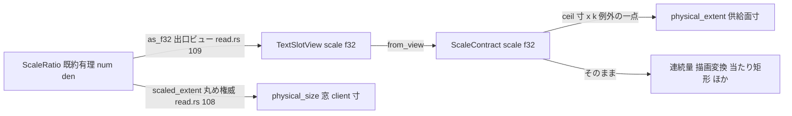

# 技術設計書: areka-P0-scale-exact-rational

> **性格**: 文書＋検証仕様（2026-08-14 裁定による縮小後の姿）。実行時の挙動・製品コードの式・署名は一切変更しない。
> **正本の裁定記録**: `research.md` §9（2026-08-14 要件ディスカッション）。本設計はその裁定を前提とし、再審しない。

## Overview

**Purpose**: 供給面寸導出の f32 経路（`ceil(image px 寸 × k_f32)` が真の積の整数時に +1 へ振れる既知欠陥）を**許容する**という 2026-08-14 の開発者裁定を、コード上の登記・規則宣言・決定論テストへ焼き付ける。これにより (1) 「裁定待ち」の札が裁定済みの事項に貼られたまま放置されず、(2) 「浮動小数を寸法演算に使わない」という絶対規則と実装の食い違いが例外として明文化され、(3) 裁定の土台（誤差は常に +1 側・−1 は起きない・不可視）が主張ではなく検証された不変条件になる。

**Users**: areka の保守者・レビュア（コードの注記と宣言を読む者）、下流仕様の執筆者（`emo2-conformance-e2e`・`balloon-offset-dpi`）、ポートフォリオ管理者（ロードマップ）。

**Impact**: 変更されるのは doc コメント（3 ファイル）・新規テスト 1 ファイル・仕様文書 3 件（下流 brief 2 本＋roadmap）のみ。`cargo build` の成果物（実行コード）はバイト等価の意味で不変（コメントのみの差分）。

### Goals

- `crates/areka-emo-text/src/region.rs:98-118` の既知欠陥登記を「裁定済み・許容」へ書き換える（削除しない）。
- 「寸法・画素演算に浮動小数を用いない」宣言 4 箇所（`scale.rs` module doc・`as_f32` doc・`read.rs` の 2 doc）へ、供給面寸導出を唯一の名指し例外として明記する。
- 裁定の前提（結果 ≥ 真値・差は 0 か 1 のみ・誤りが出るのは 6/5 と 12/5 の 2 比のみで各 81 件）を、実 DPI/GPU/実窓を要しない決定論テストで固定する。
- 下流仕様（e2e の +1 許容・balloon-offset-dpi の前提）とロードマップ（W6.5 編成からの実装作業の除外）へ申し送る。

### Non-Goals

- 有理数（分子・分母）の文字層への配管・`ratio()`/`num()`/`den()` アクセサ新設・`ScaleContract`/`TextSlotBinding` の署名変更（112 箇所の追随）——**2026-08-14 に却下済み**。再導入しない。
- 実行時の挙動の変更（供給面寸の値・連続量・レイアウトすべて不変）。
- 供給面の切り上げ規約そのものの見直し（「切れるより余る」非対称性に基づく現行 `ceil` を維持）。
- 拡大率の算出・照会契約の変更（上流 `completed/areka-P0-emo-dpi-scaling`・`completed/areka-P0-collision-dpi-hittest` の領分）。
- ダーティ矩形ガード余白（`viewbox.rs:734`）等、供給面寸以外の f32 消費点への注記追加（裁定は f32 の寸法演算を「供給面寸の 1 点」についてのみ例外化する。他の連続量消費点は従来どおり座標変換の領分であり本仕様の対象外）。

## Boundary Commitments

### This Spec Owns

- 供給面寸導出（`ScaleContract::physical_extent`）に付す**裁定登記の文面**（裁定の事実・日付・根拠・実測・出典参照）。
- 「浮動小数を寸法演算に使わない」規則群への**例外記述の文面**（例外が供給面寸の 1 点に限られることの明示）。
- 裁定の前提を固定する**決定論テスト**（新規 1 ファイル・`areka-emo-text` の統合テスト）。
- 下流 2 brief への申し送り追記と、roadmap の該当 2 行の改訂文面。

### Out of Boundary

- `physical_extent` の式（`region.rs:119-121`）・`ScaleContract::new` の縮退分岐（`:72-86`）・`as_f32` の式（`scale.rs:147-149`）——**1 文字も変更しない**。
- 既存テストの期待値・既存テストの本文（`region.rs` in-crate テスト・`tests/scale_invariance_test.rs` を含む全既存テスト）。
- 下流仕様の要件そのもの（申し送りは brief への追記であり、e2e / bod の要件裁定は各 spec が行う）。
- W6.5 並走 spec の編集面（`presenter/show.rs`＝budget・`placement/`＝wpl。research.md §5 で素を実測確認済み）。

### Allowed Dependencies

- 新規テストは `areka-emo-text` の公開 API（`ScaleContract`・`ImagePx`）と、**既存の dev-dependency** `areka-emo-compose`（`ScaleRatio`）のみを用いる。**Cargo.toml の変更は不可**（依存追加ゼロが受け入れ条件）。
- doc コメントからの参照は spec 名 `areka-P0-scale-exact-rational` による（完了後は `.kiro/specs/completed/` 配下へ移るため、パスではなく spec 名で辿れる形にする）。

### Revalidation Triggers

- `physical_extent` の式・入力型・`ScaleContract` の形が将来変わる場合 → 本仕様の決定論テストが赤になる設計であり、その時点で裁定（+1 許容）の再審が必要。
- 作者 DPI の語彙が {72, 96, 120, 144} の外へ広がる、またはモニタ DPI の対応域が 96〜288 を超える場合 → 到達比集合（23 比）が変わるためテストの比集合と登記の実測表の更新が必要（誤り方の性質＝+1 側のみ、は不変——requirements Adjacent expectations）。
- `as_f32` の式（`num as f32 / den as f32`）が変わる場合 → 誤り件数（81/81/0×21）の期待値が変わり得る。
- **搬送層（`TextSlotView.scale` → `TextSlotBinding::from_view`/`new`）が k を素通し以外に変換するよう変わる場合** → 本仕様の檻の到達範囲は `as_f32` 以降の算術であり、搬送層の変換は檻の外。その場合は檻の注入点の再設計が必要（C3 の Implementation Notes に同旨を登記）。

## Architecture

### Existing Architecture Analysis

k の搬送は三層（research.md §1 の 2026-08-14 実測）:



- 丸め権威は `ScaleRatio`（`scale.rs`）に集約済み。窓 client 寸は権威 `scaled_extent` を通る（汚染されない）。
- f32 が寸法演算に到達するのは `physical_extent`（供給面寸）の**ただ 1 点**。ここが裁定された例外であり、本仕様の登記・例外明記・テストはすべてこの 1 点を指す。
- `read.rs:113-130` の `target_physical_size` doc など「`applied_scale` から掛け算で復元してはならない」系の警告は、**窓 client 寸**という別対象への禁止であり例外化しない（据え置き）。例外記述はこの区別（供給面寸のみ除外・窓寸は従来どおり禁止）を明示する。

### Key Decisions

| # | 決定 | 根拠 |
|---|---|---|
| D1 | テストは**本番と同一の f32 経路**（`ScaleRatio::new(num,den)` → `as_f32()` → `ScaleContract::new` → `physical_extent`）を通す。`num as f32 / den as f32` をテスト内で再実装しない | 檻うべきは「本番配管の性質」であり式の写しではない。`areka-emo-compose` は既に dev-dependency（Cargo.toml 無改変・R5.2） |
| D2 | 真値オラクルは整数演算のみ: `((v as u64) * num as u64).div_ceil(den as u64)`。浮動小数を一切使わない | オラクル自体が f32 に依存すると検証が循環する。u64 中間で v≤1200・num≤288 域は桁溢れなし（3.7） |
| D3 | 比集合はテスト内で **DPI 格子から導出**する: 作者 {72,96,120,144} × モニタ {96,120,144,168,192,216,240,288} を gcd 約分・重複排除し、**要素数 23 を期待値として固定** | 3.3 の「現実的な組合せから導かれる比を網羅」の直訳。裁定実測（research.md §9.2）の前提集合そのものを固定する |
| D4 | 誤り件数を期待値として固定: 6/5 → **81 件**（代表 v=25 → 31・正 30）・12/5 → **81 件**（代表 v=25 → 61・正 60）・残り 21 比 → **0 件** | 3.4「是正しない判断を明示的にテストに入れる」。件数が変われば f32 経路か比集合が変わった合図＝裁定の再審トリガ |
| D5 | 新規テストは独立ファイル `crates/areka-emo-text/tests/physical_extent_arbitration_test.rs`（統合テスト・headless） | 裁定の檻であることを名前で示し、既存 `scale_invariance_test.rs`（レイアウト非依存の檻）と関心を混ぜない。file-slimming 三不変量（1,000 行超ゼロ）とも整合 |
| D6 | 登記の書き換えは**追記中心**: 見出しの「未是正・担当 spec 不在・裁定待ち」を「裁定済み・許容」へ差し替え、2026-07-30 実測表は保持し、2026-08-14 の 23 比総当たり・4 根拠・出典 spec 名を加える | 1.3「既存の 2026-07-30 実測表を根拠として保持」・1.5「削除しない」 |
| D7 | 申し送りは各 brief への**追記ブロック**（roadmap は編成と条件のみ・詳細は brief が正本——roadmap.md :78 の規律）。根拠の再説明はせず spec 名参照で済ませる | 4.4。roadmap の改訂は 2 行（ゴール表 :66・W6.5 行 :84 の exact 記述）＋因果台帳 :95 の「exact→bod（丸め権威）」注記に留める |

### Technology Stack

変更なし（Rust 2024・既存ワークスペース）。新規依存ゼロ。テストは `cargo test -p areka-emo-text` で GPU/実窓/実 DPI なしに走る（既存 headless 檻と同条件）。

## File Structure Plan

### New Files

| パス | 責務 |
|---|---|
| `crates/areka-emo-text/tests/physical_extent_arbitration_test.rs` | 裁定の前提を固定する決定論テスト（3 テスト関数＋整数オラクル・比集合導出ヘルパ）。file 冒頭 doc に裁定日・出典 spec・計測日を記録（`scale_ratio_tests.rs:305-328` の記録様式に倣う） |

### Modified Files

| パス | 変更内容（すべて doc コメント／文書のみ） |
|---|---|
| `crates/areka-emo-text/src/region.rs` | `:98-118` の登記書き換え（R1・下記 C1）。式 `:119-121` は不変 |
| `crates/areka-emo-compose/src/scale.rs` | module doc `:1-25` へ例外 1 項追記＋`as_f32` doc `:139-146` へ例外 1 文追記（R2.1/2.2・下記 C2）。式は不変 |
| `crates/areka-emo-present/src/presenter/read.rs` | `physical_size` doc `:52-69`・`applied_scale` doc `:138-160` へ例外の所在と参照先を追記（R2.3・下記 C2）。式は不変 |
| `.kiro/specs/areka-P0-emo2-conformance-e2e/brief.md` | 申し送り追記: 供給面寸の判定は絶対値不可・**+1 許容が必要**（R4.1・下記 C4） |
| `.kiro/specs/areka-P0-balloon-offset-dpi/brief.md` | 申し送り追記: 供給面寸は厳密化されない前提（R4.2・下記 C4）。既存 `:31`/`:50` の「ScaleRatio 配管を前提」の記述を実態（配管は却下・丸め権威 `scaled_extent` は既存のまま利用可）へ訂正 |
| `.kiro/steering/roadmap.md` | ゴール表 `:66` と W6.5 行 `:84` の exact 記述を「文書＋検証仕様へ縮小（実装配管は 2026-08-14 却下）」へ改訂・因果台帳 `:95` の exact→bod 注記を追随（R4.3・下記 C4） |

> 行番号は 2026-08-14 のワークツリー実測（research.md §0）。実装時に現物で再確認すること（並走 spec の着地でドリフトし得る）。

## Requirements Traceability

| Requirement | 概要 | 実現要素 |
|---|---|---|
| 1.1 | 「未是正・担当 spec 不在・裁定待ち」の除去 | C1（登記書き換え） |
| 1.2 | 裁定の事実・日付・4 根拠を含む | C1 |
| 1.3 | 実測（23 比総当たり・計測日）＋2026-07-30 表の保持 | C1 |
| 1.4 | 出典 spec の参照 | C1（spec 名参照・D6） |
| 1.5 | 登記を削除しない | C1（追記中心・D6） |
| 2.1 | `scale.rs` module doc への例外明記 | C2-a |
| 2.2 | `as_f32` doc への例外明記＋拡大解釈禁止の維持 | C2-b |
| 2.3 | 提示段 doc（`read.rs` 2 箇所）への例外の所在と参照先 | C2-c |
| 2.4 | 例外が供給面寸の 1 点に限られることの明示 | C2 共通文面 |
| 2.5 | 宣言・規則そのものは撤去しない | C2（追記のみ・削除ゼロ） |
| 3.1 | 結果 ≥ 真値の決定論テスト | C3 テスト① |
| 3.2 | 差が 0 または 1 に限られるテスト | C3 テスト① |
| 3.3 | 現実的 DPI 組合せの全比 × 1..=1200 の突合 | C3 テスト①＋比集合導出（D3） |
| 3.4 | 6/5・12/5 の誤差を期待値として固定（件数・代表例） | C3 テスト②（D4） |
| 3.5 | 真値未満または差 2 以上で失敗する | C3 テスト①の assert 構造 |
| 3.6 | 実 DPI/GPU/実窓不要・任意拡大率の注入 | C3（headless・`ScaleContract::new(k)` 注入） |
| 3.7 | 決定論・非パニック・非ラップアラウンド | C3（純関数・u64 オラクル・D2） |
| 4.1 | e2e への +1 許容の申し送り | C4-a |
| 4.2 | balloon-offset-dpi への前提申し送り | C4-b |
| 4.3 | roadmap から実装作業が外れたことの反映 | C4-c |
| 4.4 | 根拠再説明なしの spec 参照形式 | C4 共通（D7） |
| 5.1 | 供給面寸の導出結果の同一性 | 全変更が doc／文書／新規テストのみ＝式不変で構造的に成立（C1〜C4 の制約） |
| 5.2 | 構築口署名の不変・追随ゼロ | 同上（Out of Boundary） |
| 5.3 | 連続量・レイアウトの結果不変 | 同上 |
| 5.4 | 既存テストを赤にしない・期待値不変 | 検証手順（Testing Strategy・回帰確認） |
| 5.5 | 変更は注記・宣言・新規テストに限る | File Structure Plan がその全集合（他ファイル接触禁止） |

## Components and Interfaces

| Component | 層 | Intent | Req | 依存 |
|---|---|---|---|---|
| C1 裁定登記 | doc（emo-text） | 既知欠陥登記を裁定済みへ書き換える | 1.1-1.5 | なし |
| C2 例外明記 | doc（emo-compose / emo-present） | 絶対規則に唯一の例外を名指しで明記 | 2.1-2.5 | C1（参照先） |
| C3 前提の決定論テスト | test（emo-text tests/） | 裁定の前提を検証された不変条件にする | 3.1-3.7 | 公開 API＋dev-dep のみ |
| C4 申し送り | 仕様文書 | 下流 2 brief＋roadmap への伝達 | 4.1-4.4 | C1（参照先） |

### C1: 裁定登記（`region.rs:98-118` の書き換え）

**Responsibilities & Constraints**

- 見出しを「⚠️ 既知の残欠陥（2026-07-30 計測・未是正・担当 spec 不在）」から「**裁定済み・許容**（2026-08-14 開発者裁定・spec `areka-P0-scale-exact-rational`）」へ差し替える。
- 本文に必ず含める要素（1.2/1.3/1.4）:
  1. **裁定の事実**: f32 のまま引き回すことを許容すると決めた（厳密化＝有理配管は却下）。
  2. **裁定日**: 2026-08-14。
  3. **4 根拠**: ⑴誤差は常に +1 側のみ（真の積が整数のときだけ振れる・非整数時は最低 1/den の距離があり f32 相対誤差 ~1e-7 では跨げない＝文字が切れる方向には転ばない）⑵不可視（レイアウトは image 空間・窓寸は別権威・供給面生成は初回 1 回きり）⑶救える範囲が極小（到達 23 比 × 1..1200 総当たりで誤りは 6/5 と 12/5 の各 81 件のみ・12/5 は 6/5 の 2 倍尺で f32 仮数同一＝正体は「1.2 の f32 表現」一点）⑷費用不釣合（112 箇所の署名追随・変換ミスが緑のまま通る危険）。
  4. **実測**: 2026-08-14 の 23 比総当たり結果（作者 {72,96,120,144}×モニタ {96..288} 由来）を要約し、既存の 2026-07-30 実測表（6/5＝81 件・4/3 等＝0 件）は**根拠としてそのまま保持**する。
  5. **出典**: spec 名 `areka-P0-scale-exact-rational`（完了後 `.kiro/specs/completed/` 配下）と、前提を固定するテスト `tests/physical_extent_arbitration_test.rs` への言及。
- `[[deferral-requires-verified-owner]]` の文（担当 spec 不在の登記理由）は、担当 spec が本仕様として実在し裁定が下りた旨へ更新する。
- **禁止**: 表・登記の削除（1.5）、`physical_extent` 本体（`:119-121`）への接触（5.5）。

### C2: 例外明記（3 ファイル・4 箇所）

共通文面要素（2.4）: 「唯一の既知の例外は emo-text `ScaleContract::physical_extent`（文字供給面の確保寸）であり、2026-08-14 の裁定（spec `areka-P0-scale-exact-rational`）に基づく。誤差は +1 側のみで不可視。**この例外を他の用途へ拡大してはならない**」。

- **C2-a** `scale.rs:1-25` module doc（2.1）: 「画素・寸法演算に浮動小数（f32/f64）を一切持ち込まない」宣言の直後（または箇条書き末尾）へ、上記例外 1 項を追記。規則本文は不変（2.5）。
- **C2-b** `scale.rs:139-146` `as_f32` doc（2.2）: 「寸法・画素演算にこの値を使ってはならない」に「——唯一の裁定済み例外は供給面寸の導出（emo-text `physical_extent`）である」を接続。禁止の主文と `scale_len`/`scaled_extent` への誘導は保持（2.5）。
- **C2-c** `read.rs:52-69`（`physical_size` doc）と `:138-160`（`applied_scale` doc）（2.3）: 既存の「as_f32 は寸法・画素演算に使ってはならない」警告へ、例外の所在（emo-text の供給面寸のみ・裁定済み）と参照先（C1 の登記）を 1〜2 文で追記。**窓 client 寸の復元禁止（`target_physical_size` doc :113-130 の警告を含む）は例外化しない**——例外は供給面寸に限る、という区別を明示する。

### C3: 前提の決定論テスト（新規 `physical_extent_arbitration_test.rs`）

**Contracts**: State [x]（テストのみ・公開契約の新設なし）

**ヘルパ（テスト内私有・製品コードに足さない）**:

```rust
/// 検証対象の到達比（既約 num/den）を DPI 格子から導出する。
/// 作者 DPI {72, 96, 120, 144} × モニタ DPI {96, 120, 144, 168, 192, 216, 240, 288}
/// を gcd 約分し重複を除く。要素数 23 を呼び手が assert する（裁定実測の前提集合の固定）。
fn reachable_ratios() -> Vec<(u32, u32)>;

/// 真値オラクル: ceil(v · num / den) を整数のみで計算する（浮動小数を一切使わない・D2）。
fn true_ceil(v: u32, num: u32, den: u32) -> u32; // ((v as u64 * num as u64).div_ceil(den as u64)) as u32

/// 本番と同一経路で供給面寸を導出する（D1）:
/// ScaleRatio::new(num, den) → as_f32() → ScaleContract::new(k, None) → physical_extent(ImagePx(v as f32))
fn supply_extent_via_f32_path(v: u32, num: u32, den: u32) -> u32;
```

**テスト関数（3 本）**:

1. `供給面寸は全到達比・全寸で真値以上かつ差 1 以内`（英名例 `supply_extent_bounds_hold_for_all_reachable_ratios`）——23 比 × v ∈ 1..=1200 の全組で `true ≤ result && result - true ≤ 1` を assert（3.1/3.2/3.3/3.5）。失敗時メッセージに (num, den, v, result, true) を含める。
2. `誤り件数の固定 6/5 と 12/5 は各 81 件`（例 `error_counts_fixed_for_six_fifths_and_twelve_fifths`）——v ∈ 1..=1200 で `result != true` の件数が 6/5・12/5 とも**ちょうど 81** であること、代表例 **v=25 → 31（正 30）**・**v=25 → 61（正 60）** を個別に assert（3.4）。doc コメントに計測日 2026-08-14 と「是正しない判断を期待値として固定する」旨を記録（`scale_ratio_tests.rs:305-328` の記録様式）。
3. `残り 21 比は誤りゼロ`（例 `remaining_ratios_have_zero_errors`）——6/5・12/5 を除く全比で誤り 0 件を assert（裁定根拠⑶の集合側の固定・3.4 の対）。

**Preconditions / Postconditions / Invariants**

- 前提条件: なし（headless・実 DPI/GPU/実窓/OS 状態に依存しない・3.6）。
- 事後条件: 同一入力＝同一結果（f32 演算は IEEE 754 決定論・オラクルは u64 整数・3.7）。
- 不変条件: パニック・ラップアラウンドなし（v≤1200・num≤288・den≤96 域は u64 で桁溢れ不能・`ScaleRatio::new` は正の入力で常に `Some`・3.7）。ループ総量 23×1200＝27,600 評価 ×3 本＝軽量（1 秒未満）。

**Implementation Notes**

- Integration: `use areka_emo_text::region::{ImagePx, ScaleContract};` と `use areka_emo_compose::ScaleRatio;`（dev-dep 既存）。`ScaleRatio::new` は `Option` を返すため導出ヘルパ内で `expect`（正の格子入力ゆえ到達しない失敗＝到達すればテスト失敗として正しい）。
- Validation: `reachable_ratios().len() == 23` を assert し、6/5・12/5 が集合に含まれることも確認する（格子導出の較正・[[subagent-tooling-can-be-wrong-calibrate-it]] の教訓——裁定時の初回集計は道具の誤りを踏んだ）。
- Risks: 将来 `as_f32` の式や `physical_extent` の式が変われば件数期待（81/81/0）が割れて赤になる——**それが本テストの目的**（Revalidation Triggers）。誤検知リスクは f32 の platform 差だが、IEEE 754 単精度の除算・乗算・ceil は決定論であり x64/arm64 で同一。
- **檻の到達範囲**（テストファイル冒頭 doc に必ず記す）: 本檻は `as_f32` 以降の算術（`ScaleRatio::as_f32` → `ScaleContract::new` → `physical_extent`）を貫通するが、本番で k が経由する `TextSlotView.scale`（`read.rs:109`）→ `TextSlotBinding::from_view`/`new` の搬送層は **f32 素通し**を前提とする（現物は素通し・正規化は `ScaleContract::new` へ委譲）。搬送層が scale を変換するよう変わった場合は本檻の外である。

### C4: 申し送り（下流 2 brief＋roadmap）

- **C4-a** `emo2-conformance-e2e/brief.md`: 追記ブロック 1 個——「適合 #1 の DPI 検証で供給面寸（文字供給面の確保寸）を判定する場合、絶対値一致では書けない。**期待値 +1 の許容が必要**（対象は 6/5・12/5 の比のみだが判定式は一律 +1 許容が安全）。窓 client 寸は丸め権威経由ゆえ従来どおり絶対値で書ける。根拠は spec `areka-P0-scale-exact-rational` の裁定登記を参照」。既存 `:15` の「適合 #1 の DPI 検証を**絶対値で書ける前提**＝画素演算の有理数化」の記述は**失効注記**を付す（brief の当該行を書き換えるか追記で上書き宣言——brief の追記が正本という運用に合わせ追記側で上書き）。
- **C4-b** `balloon-offset-dpi/brief.md`: 追記ブロック 1 個——「`scale-exact-rational` は 2026-08-14 裁定で文書＋検証仕様へ縮小され、**ScaleRatio の文字層配管は行われない**。既存 `:31`『ScaleRatio 配管と丸め権威を前提にする』のうち配管は失効。**丸め権威（`ScaleRatio::scale_len`/`scaled_extent`）は既存のまま利用可能**であり、bod が f32 を寸法演算に持ち込まない規律は不変（供給面寸の例外は emo-text 内の 1 点に限られ bod へは適用されない）」。
- **C4-c** `roadmap.md`: ⑴ゴール表 `:66` の単一文を「裁定の登記＋前提の決定論テスト＝f32 供給面寸の許容を固定（配管は 2026-08-14 却下）」へ改訂 ⑵W6.5 行 `:84` 内の exact 記述（「f32 汚染点 :109」「exact は bod の前提（丸め権威）ゆえ W6.75 より先」）へ縮小の旨を追随（bod の前提は「丸め権威は既存充足＋供給面寸非厳密の申し送り」へ言い換え） ⑶因果台帳 `:95` の「exact→bod（丸め権威）」は「exact→bod（申し送りのみ・丸め権威は既存充足）」へ。**編成スロット（W6.5 での本仕様の着地）自体は維持**——縮小後も登記・テスト・申し送りの着地物がある。
- 共通規律（4.4）: いずれも裁定根拠を再説明せず「spec `areka-P0-scale-exact-rational`（research.md §9／region.rs の裁定登記）」参照で済ませる。

## Error Handling

本仕様はエラー経路を新設しない。テストの失敗様式のみ定める:

- C3 の assert 失敗メッセージは (num, den, v, 実測値, 真値) を必ず含め、どの比・どの寸で前提が割れたかを単独で読める形にする（実装者がログ突合なしで再現できる・[[areka-log-first-no-silent-failure]] の趣旨をテストへ適用）。
- `ScaleRatio::new` が `None` を返す入力は格子導出上あり得ないため `expect` で即失敗させる（黙って skip しない）。

## Testing Strategy

### Unit / Integration Tests（新規＝C3 の 3 本）

1. 全到達比 × 全寸の上下界（真値以上・差 1 以内）——裁定前提の中核（3.1/3.2/3.3/3.5）。
2. 誤り件数と代表例の固定（6/5・12/5 各 81 件・v=25 代表）——是正しない判断の明示的固定（3.4）。
3. 残り 21 比の誤りゼロ——欠陥の正体が「1.2 の f32 表現」一点に帰着するという裁定根拠⑶の固定。

### 回帰確認（R5・実装完了時の検証手順）

- `cargo test -p areka-emo-text -p areka-emo-compose -p areka-emo-present` 全緑・既存テストの期待値差分ゼロ（5.4）。
- `git diff` の製品コード 3 ファイル分が **doc コメント行のみ**であることの目視確認（式・署名・use・属性に差分がないこと＝5.1/5.2/5.3/5.5 の構造的充足の証跡）。
- 実機サインオフは**不要**（挙動不変・doc とテストのみ。[[areka-evidence-classes-static-equals-real-machine]]——file:line で再検証できる変更に実機再現は要らない）。

### E2E

対象外（実行時挙動の変更がない）。適合 e2e への影響は C4-a の申し送りとして下流 spec が消化する。
