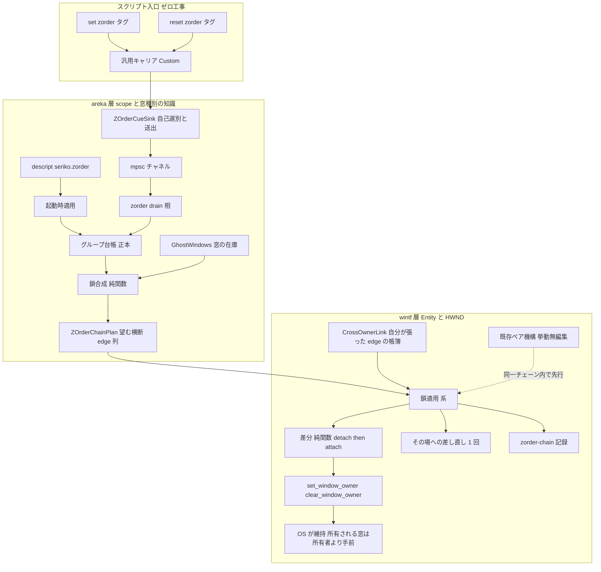
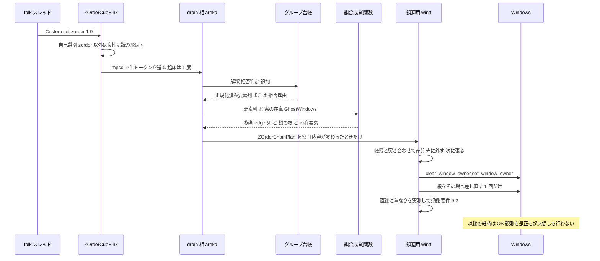
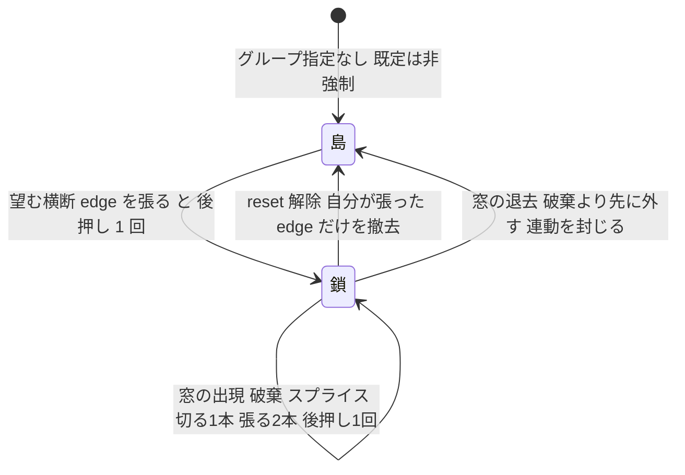

# Technical Design: areka-P0-scope-zorder-pinning

**改訂第 2 版（2026-08-29）** — 初版設計（毎巡の観測と `SetWindowPos` による是正）は実装完走後に実機 NO-GO となり撤回された。
本版は要件 14 が固定した方式——**所有の鎖**——へ全面的に書き替えたものである。初版のうち生き残る部分（解釈・台帳・descript・
診断の骨格・サインオフ一式）はそのまま引き継ぐ（`research.md` §10.7 の生死表・§11.1 の資産表）。

**入力**: requirements.md（改訂第 2 版・確定）・research.md（§10 差し戻しの根拠／§11 ギャップ分析／**§12 設計前実測**）・`.kiro/steering/`
**file:line は 2026-08-29 の実測値**。§12 の実測はすべて `crates/wintf/src/api_owner_chain_probe_tests.rs` で再現できる。
**設計ディスカッション改訂（2026-08-29・議題 1）**: 未指定スコープの後方参加（要件 15・DD-11）を組み込んだ——
指定が 1 つでもある間は**全窓が 1 本の鎖**に入る（グループは登記順・未指定はスコープ ID 昇順で後方）。

## Overview

**Purpose**: ゴースト作者がスクリプト（`\![set,zorder,...]`／`\![reset,zorder]`）または shell descript（`seriko.zorder`）で、
複数スコープの窓（キャラ窓・バルーン窓）の前後関係を確定的にピン留めできるようにする。

**Users**: ゴースト作者（emo2 開発者本人）が会話演出のために使う。既存の伺か資産の利用者は、指定が無い限り従来どおりの操作感（非強制）を保つ。

**Impact**: 前後関係の維持を「毎巡直す」から「**構造として書く**」へ変える。グループが有効な間、そのグループの窓は
**分岐の無い一直線の所有の鎖**に繋がれ、以後の維持は OS が行う。既存のスコープ内ペア機構（バルーンがキャラ窓に所有される）は
**その鎖の各スコープ区間そのもの**なので無編集で残り、本 spec が新設するのは**スコープをまたぐ 1 種類の edge（横断 edge）だけ**である。

### Goals

- 正典 3 入口（タグ 2 種＋descript）を ukadoc の意味論どおりに動かす（要件 1〜5）
- 前後関係を所有の鎖として構成し、維持を OS の不変条件へ委ねる（要件 14）
- 既定状態（指定ゼロ）＝非強制を構造的に保存する（横断 edge を撤去すれば島が戻る・要件 6）。指定が 1 つでもある間は**全窓が 1 本の鎖**に入る（未指定スコープは後方・要件 15）
- 窓の出現・破棄・再表示・利用者操作へ、**イベント応答としてのみ**追随する（要件 7・14.5）
- 判断分岐の決定論テスト網羅と、実機ログだけで判定できるサインオフ証跡（要件 9・10）

### Non-Goals

- **成立済みの前後関係を維持するための反復観測・反復是正**（要件 14.2 が明示的に禁じる。初版 NO-GO の根因）
- 星形の所有関係で順序を表現すること（要件 14.4）
- プロパティ `currentghost.seriko.zorder` の実導出（追跡 spec `areka-P0-zorder-property` 所有・要件 13）
- 窓の位置・寸法・常時最前面・最小化などの窓状態指定（要件 11.1／11.4・先送り語彙 9 語は既決）
- グループどうしの相対順の規定（要件 3.6・正典沈黙＝非強制のまま）
- バルーン表示ライフサイクル・スコープ内ペア機構の挙動変更

## Boundary Commitments

### This Spec Owns

- `\![set,zorder,...]`／`\![reset,zorder]` の消費（自己選別・解釈・拒否・記録）とグループ台帳（唯一の正本・areka 側）
- shell descript `seriko.zorder` の起動時適用
- **横断 edge**——全窓の鎖の並び（グループ登記順＋未指定スコープの後方配置＝要件 15）のうち**スコープをまたぐ連続対**に対して張る所有関係。書込先はキャラ窓（現在 owner を持たない窓）が原則
- 横断 edge の帳簿（`CrossOwnerLink`）と、その撤去・張り替え・スプライス
- 鎖を成立させるための**後押し 1 回**（鎖の先頭を 2 番目の直後へ差し直す。§12.2 実測 9 で形を確定）
- `[zorder-chain]` 系の診断記録と、`[zorder-group] applied`／`rejected` の維持
- COMPAT §8 への裁量登記（要件 12・13.3／13.4）

### Out of Boundary

- **スコープ内ペア edge**（バルーンがキャラ窓に所有される関係）——既存 `zorder_pair*` 5 ファイルの担当。本 spec は
  ペア edge を**張りも外しもしない**。唯一の例外は `zorder_pair_maintain.rs:258-262` の**doc 段落の訂正**（挙動非接触・下記 Modified Files）
- 窓の位置・寸法（`enqueue_window_set_pos`／`placement/follow/window_move.rs`＝並走 spec の領域）。本 spec は窓を動かさない
- 窓状態（常時最前面・最小化・全画面連動）・タスクバーへの出方・クリック透過（要件 11.4／11.5）
- sylphya 語彙表（`vocab/dotted.rs`）——名前だけの先行登録もしない（要件 13.5）
- 外部要因（他プロセスによる `GWLP_HWNDPARENT` 書換）で鎖が壊れた場合の**検知**（§12.7-7 の裁定。観測系を置くと要件 14.2 へ逆戻りする）

### Allowed Dependencies

- wintf 新設 → `api.rs` の `set_window_owner`（:141）／`clear_window_owner`（:152）／`get_window_long_ptr`（:11・撤去前の照合で `GWLP_HWNDPARENT` を読み戻す）／`get_window_above`（:72・前面走査の土台）（いずれも既存の `pub(crate)`）
- wintf 新設 → 既存 `zorder_pair` の `pub(crate)` 純関数（`InsertSpec` 等）— **読むだけ**
- areka 新設 → `GhostWindows`（scope→Entity の唯一の正本）・`ZOrderGroupLedger`・`dola::cue::CueSink`
- **wintf → areka の import は禁止**（既存規律 `zorder_pair.rs:5-7`）。scope／窓種別の知識は areka に閉じ、
  wintf へ渡すのは「手前から奥へ並んだ Entity 列」と「Entity 対の edge 列」だけ

### Revalidation Triggers

- `ZOrderChainPlan` Resource（wintf 受け口）の形の変更
- グループ台帳の正本の移動（areka → 他層）
- `[zorder-chain]` 記録行の書式変更（実機サインオフの `signoff-scan.ps1` が読む）
- `FrameFinalize` 内の system 追加順の変更（`establish_owner_links` → ペア維持 → **鎖適用**の順が前提）
- `zorder_pair` が owner を張る対象（現在はバルーン窓のみ）の変更
- ゴースト窓の拡張スタイルから `WS_EX_TOOLWINDOW` が外れること（タスクバー不変の根拠が消える・§12.3）

## Architecture

### Existing Architecture Analysis

- **ペア edge は鎖の部分列である**（`research.md` §11.2・本設計の中核）。正規化済みのグループ順では鎖は必ず
  `bN ← sN ← bM ← sM`（手前→奥）の形になり、`bN ← sN` は既存ペア機構がまさに今張っている edge と**同一**である。
  新規に要るのは `sN ← bM`（**手前側のキャラ窓を、奥側のバルーン窓に所有させる**）1 種類だけ。
  しかも書込先のキャラ窓は**現在 owner を持たない**ため、ペア機構の書込と衝突しない。
- **owner の原始命令は本番で現用・実証済み**: ペア確立は「両窓のハンドルが揃った巡で実行時に張る」形
  （`zorder_pair_establish.rs:169`）、切離しは「破棄に先立って外す」形（`zorder_pair_maintain.rs:286`）。
  生成経路は `CreateWindowExW` の `hWndParent` を意図的に使わない（`runtime/window_factory.rs`）ので、鎖も「生成後に張る」で整合する。
- **タグ入口はゼロ工事**: `\![set,zorder,1,0]` は `CueCommand::Custom { command: "set", params: ["zorder","1","0"] }` として
  sink へ届く。parsers／sakura／dola は無改変。初版の入口実装（`emo2_boot/zorder_cue.rs`）はそのまま生きる。
- **「可視」は Windows 基準**（要件 9.3 裁定済み）: 絵を消しただけのバルーン窓は `WS_VISIBLE` のままであり、実測上は可視の窓として数える。

### 設計の土台になった実測（`research.md` §12）

| 実測 | 結果 | 設計への帰結 |
|---|---|---|
| 表示中の窓の owner 張り替え | **それだけでは重なりが動かない** | 張り替えの直後に**後押しを 1 回**出す |
| 後押しの形 | `SWP_NOZORDER` では効かない。Z を伴う指令なら効く。挿入位置に他プロセスの窓を渡す形（`GW_HWNDPREV`）は、その窓が消えると黙って失敗する | 後押しは**鎖の先頭を 2 番目の直後へ差し直す**＝**自分の窓 2 枚だけ**を参照する 1 形のみ |
| 鎖のまとまり | 鎖は 1 つの塊として動き、**鎖の外の窓を追い越すことがある**（周囲の窓の状況に依る）。ただし**鎖の外どうしの相対順**は保たれる | 要件 6.1／6.2 が縛るのは鎖の外どうしの相対順であり、これは満たす。グループと非グループの間は正典も要件も規定していない（要件 3.6／6.1） |
| 収まった後の攪乱 | 最も奥の窓を `HWND_TOP` へ持ち上げても順が保たれる | 要件 1.3／14.3 は**構造で**満たす。是正経路を持たない |
| 鎖を外したとき | 並べ替えは起きない（束縛が消えるだけ） | 解除＝**横断 edge の撤去だけ**で既定状態が復元（要件 4／6） |
| 破棄の連動 | 鎖を伝って下流を巻き込む／**先に外せば完全に消える** | 破棄の前に必ず外す（要件 7.2） |
| 最小化の連動 | 鎖を伝う（可逆）。`SW_HIDE` は伝わない | 封じられない。**到達経路が無い**ことを根拠に許容し裁量として登記（DD-7） |
| スプライス | 切る 1 本 → 張る 2 本 → 後押し 1 回。途中状態は壊れない | 出現・破棄はこの手順で（要件 7.1／7.2／8.2） |
| `clear_window_owner` | **owner を持たない窓に当てると失敗を返す** | 撤去は「自分が書いた edge」に限り、外す前に現況を読む（§12.6） |

### Architecture Pattern & Boundary Map



**Architecture Integration**:

- 採用パターン: **Option A（`research.md` §11.5）**——ペア edge 温存＋横断 edge のモジュールを新設。
  §12.4 が「ペア edge を 1 本も触らずに鎖が組める」ことを実測で裏づけたため、ペア 5 ファイルは挙動非接触で残る。
- 責務分界: 「scope→窓種別→Entity」の知識は areka（`GhostWindows`）に閉じ、wintf は「手前から奥の Entity 列」と
  「Entity 対の edge 列」しか知らない。既存 `KeepDirectlyAbove` と同じ分界。
- 新設の理由: グループは「窓が未出現でも宣言が残る」（要件 1.4）ため Entity 付随 Component では表現できず、
  Resource／台帳が要る。鎖の適用は `pub(crate)` の Win32 ラッパを呼ぶので wintf 側でしか書けない。
- 初版から**消える**もの: 観測（前面走査）・是正要否の判断・連鎖発行・次巡検証・起床促し・引き金 3 点。
  **鎖の下ではどれも不要**であり、残せば要件 14.2 に正面から違反する（退役計画は後述）。

### イベント応答と周期処理の線引き（要件 14.5・7.4）

要件 14.5 は「組み替えをそのイベントへの応答として完了させ、**周期的な処理の実行に依存しない**」と定める。
本設計での線引きは次のとおりであり、実装はこの区別を守る。

| 事柄 | 本設計 | 要件との関係 |
|---|---|---|
| **成立済みの順の維持** | OS が行う。areka も wintf も 1 命令も出さない | 要件 7.4／14.2 を**構造で**満たす。周期処理が丸ごと省略されても順は崩れない |
| **組み替えの契機** | タグ・descript・窓の在庫の変化。いずれも**それ自体が 1 度の起床を起こす**既存の経路（タグは talk スレッドからの送信、窓の出現・破棄は spawn／despawn） | 要件 14.5。本 spec は**新しい起床経路を足さない** |
| **組み替えの完了** | 契機が起こしたその 1 巡の中で完結する。次巡へ持ち越さない・検証のために次巡を待たない | 要件 14.5 |
| **適用後の起床要求** | **行わない**。`apply_zorder_chain` は `tick_wake::mark` を呼ばない（檻で固定） | 要件 14.2。初版の「是正が着くまで促す」機構の復活を構造的に禁じる |

> 初版が退役するのは「**成立を待って何度も促し、毎巡観測して差分を是正する**」機構である。
> **イベントが 1 度だけ起床を起こし、その巡で書き終える**形はこれに当たらない——書いたあとに待つものが無いからである。

### Technology Stack

| Layer | Choice | Role in Feature | Notes |
|---|---|---|---|
| ECS | bevy_ecs 0.19（既存） | Resource・Component・`FrameFinalize` の system | 新規依存なし |
| Win32 | windows 0.62.2（既存） | `SetWindowLongPtrW(GWLP_HWNDPARENT)`／`GetWindowLongPtrW(GWLP_HWNDPARENT)`／`SetWindowPos`／`GetWindow(GW_HWNDPREV)` | すべて既存ラッパ経由。**新規 API 呼び出しは無い**——撤去前の照合は owner を書くのと同じ欄（`GWLP_HWNDPARENT`）を既存の `get_window_long_ptr` で読み戻す（`GetWindow(GW_OWNER)` と同値・`api.rs:590-618` の実窓檻が固定）。よって `api.rs` は非接触 |
| 演出 | dola `CueSink`（既存） | タグの受け口 | 初版の実装をそのまま流用 |
| 記録 | tracing（既存） | `[zorder-chain]` 系 1 target | マクロ呼び出しは 1 箇所に集約 |

新規外部依存: **なし**。`Cargo.toml` は 1 行も触らない。

## File Structure Plan

### 新設ファイル（すべて 1,000 行未満・`file_length_guard_test.rs` 例外表は触らない）

```
crates/areka/src/placement/
├── zorder_chain_compose.rs              # 鎖合成の純関数（グループ＋窓の在庫 → 横断 edge 列）
└── zorder_chain_compose_tests.rs        # 合成の分岐網羅（実機不要）

crates/wintf/src/ecs/window/
├── zorder_chain.rs                      # Resource / Component / 差分の純関数 / 後押しの選定 / 記録の唯一の入口
├── zorder_chain_diag.rs                 # 記録行の純関数組み立て＋タグ定数
├── zorder_chain_apply.rs                # 適用系 system（Win32 書込・後押し・実測・`detach_cross_owner_links_for_departing`）
├── zorder_chain_tests.rs                # 差分・後押し選定・不変条件（偽ハンドル）
├── zorder_chain_diag_tests.rs           # 記録行の逐語固定
├── zorder_chain_apply_tests.rs          # 適用系の巡（偽ハンドル＋記録捕捉）
└── zorder_chain_order_tests.rs          # 実窓 4 枚での最終形・解除・スプライス・破棄の非連動
```

**既に着地済みの実測檻（本設計の土台の証跡・恒久保存）**

- `crates/wintf/src/api_owner_chain_probe_tests.rs`（`crates/wintf/src/api.rs:625-627` で登記）——
  §12 の実測をそのまま assert で固定した檻。Windows 側の性質（張り替えの非即時性・後押しの要否・
  最小化／破棄の連動・`clear_window_owner` の落とし穴）が変われば**ここが赤で教える**。
  本 spec の設計はすべてこの檻の緑の上に立つ。

### 変更しない既存ファイル（担当と所在の明示・孤児の components を作らないため）

| ファイル | 本 spec での役割 |
|---|---|
| `crates/areka/src/emo2_boot/zorder_cue.rs`（159 行） | タグの自己選別と送出（`ZOrderCueSink`）。初版の実装をそのまま使う（要件 1.7／4.4／11.2／11.3） |
| `crates/areka/src/emo2_boot/frame/wiring.rs` | 台帳の住処（`:95`）と descript の種蒔き（`:194`）。台帳の型が変わらないので無編集 |
| `crates/wintf/src/api.rs`（owner 3 本＋読み戻し 1 本） | `set_window_owner`（`:141`）／`clear_window_owner`（`:152`）／`get_window_long_ptr`（`:11`・撤去前の照合）／`get_window_above`（`:72`）。**呼ぶだけ**で変更しない |
| `crates/wintf/src/ecs/window/zorder_pair.rs`・`zorder_pair_diag.rs`・`zorder_pair_establish.rs`・`zorder_pair_sink.rs` | スコープ内ペア edge＝鎖のスコープ区間（要件 6.3）。**挙動も doc も無編集** |
| `crates/areka/src/placement/zorder_property_deferral_tests.rs`（606 行） | 先送りプロパティの固定（要件 13）。設計に依存しないので無編集 |

### Modified Files

| ファイル | 変更内容 |
|---|---|
| `crates/areka/src/emo2_boot/frame/zorder_descript.rs` | **import 先の変更のみ**（`log_group_applied`／`log_group_rejected` の移設に追随）。shell 設定の読み取りと基底適用（要件 5）の挙動は無変更 |
| `crates/areka/src/placement/zorder_group_ledger.rs` | 要件 2.6 の**畳み込み**を `normalize_scope_blocks` へ追加。`Normalization` に `implied_partner: Option<GroupWindowKind>` を追加（加えたことの記録材料） |
| `crates/areka/src/placement/zorder_group_ledger_tests.rs`／`zorder_group_ledger_state_tests.rs` | 畳み込みの分岐を追加 |
| `crates/areka/src/placement/zorder_group_branch_coverage_tests.rs` | 要件 10.2 の分岐一覧を鎖の語彙へ差し替え（`BRANCHES` 配列。**要件文と機械では結ばれていないので逐語確認が要る**＝申し送り） |
| `crates/areka/src/emo2_boot/frame/zorder_drain.rs` | 射影の出口を `ZOrderGroups` から `ZOrderChainPlan` へ。台帳→合成→公開の 3 段。公開は**内容が前回と異なるときだけ**。`log_group_*` の import 先も移設へ追随 |
| `crates/areka/src/emo2_boot/frame/zorder_drain_test_support.rs`・`frame/zorder_descript_tests.rs`・`zorder_wiring_tests.rs`・`frame_visibility_integration_tests.rs` | **旧受け口 `ZOrderGroups` を読み続ける areka 側の檻・支援 4 本**（`zorder_wiring_tests.rs` は退役する `apply_zorder_group_maintenance` も import している）。受け口の差し替えと同じ作業単位で鎖側へ移すか、旧維持系だけを主張していたものは退役させる（**2026-08-29 タスク健全性レビューの指摘で追加**） |
| `crates/areka/src/emo2_boot/balloon_visibility_phase.rs` | 再表示の引き金（`note_balloon_shown`／`wants_group_follow_on_show`）を撤去。鎖の下では再表示が重なりへ作用する経路が無い（要件 7.3 は構造で満たす・DD-9）。撤去時に、引き金が他の要件を担っていないことを確認する |
| `crates/areka/src/emo2_boot/mod.rs` | `:510` の `.before(apply_zorder_group_maintenance)` を `.before(apply_zorder_chain)` へ |
| `crates/areka/src/placement/spawn.rs` | `:663-671` の `FrameFinalize` チェーン末尾を `apply_zorder_group_maintenance` → `apply_zorder_chain` へ |
| `crates/areka/src/placement/spawn_zorder_group_wiring_tests.rs` | 結線の字面の檻を鎖の名前へ（ファイル名も `spawn_zorder_chain_wiring_tests.rs` へ改名） |
| `crates/areka/src/placement/spawn_zorder_pair_deferred_tests.rs` | `PRODUCTION_FILES` 名簿（`:59` の 6 件）を新設・退役に合わせて更新（要件 10.4） |
| `crates/wintf/src/ecs/window/mod.rs` | 退役 3 モジュールの登記（`:14`／`:16`／`:18`＋再輸出）を削除、新設 3 モジュールを登記 |
| `crates/wintf/src/ecs/window/zorder_pair_deferred_vocabulary_tests.rs` | `PRODUCTION_FILES` 名簿（`:76` の 8 件）を更新（要件 10.4） |
| `crates/areka/src/emo2_boot/frame/wiring.rs`（`:89` 註）・`frame.rs`（`:21` 註）・`crates/areka/src/placement/spawn.rs`（`:538` 註） | **doc 註のみ追随**（旧受け口 `ZOrderGroups` を名指している 3 か所）。コードは変えない |
| `crates/wintf/src/ecs/window/zorder_pair_maintain.rs` | **doc 段落のみ訂正**（`:258-262`「スコープをまたぐ owner はそもそも存在しない」は本 spec が無効化する事実）。コードは 1 行も変えない |
| `.kiro/specs/.../signoff-scan.ps1`／`signoff-procedure.md`／`real-machine-signoff.md` | 判定語の差し替え（後述「実機サインオフの改訂」） |
| `doc/COMPAT_ARCHITECTURE.md` §8 | 裁量 11 件・訂正 1 件・先送りの参照 1 件の登記（要件 12・13） |

### 退役するファイル（前進コミットで削除・履歴は巻き戻さない）

**実装側**: `wintf/src/ecs/window/zorder_group.rs`（710 行）・`zorder_group_maintain.rs`（403 行）・
`zorder_group_diag.rs`（279 行）／`wintf/src/ecs/window_proc/window_pos.rs` の外部由来 Z 変化の引き金／
`wintf/src/ecs/world/tick_wake.rs` の「是正が適用されるまで促す」経路（**一度きりの起床マーカーそのものは残す**）。

**檻側**: `zorder_group_decision_tests.rs`・`zorder_group_maintain_tests.rs`・`zorder_group_order_tests.rs`・
`zorder_group_verify_tests.rs`・`zorder_group_wake_tests.rs`・`zorder_group_diag_tests.rs`・
`window_pos_zorder_group_tests.rs`・`balloon_visibility_phase_zorder_group_tests.rs`。

**流用してから捨てるもの**: `zorder_group_order_tests.rs:126-180` の `relative_z_order`／`z_shape`／`arrange_z` 歩行器と
`window_pos_zorder_group_tests.rs:580-632` の `RealWindowProbe` は、`zorder_chain_order_tests.rs` の雛形として写してから退役させる。

**退役の順序（要件 9.5 を割らないために）**: ⑴新設を着地させ緑にする（**`[zorder-group] applied`／`rejected` の `zorder_chain_diag.rs` への移設と呼出元 2 件の追随を含む**）→ ⑵結線を鎖側へ切り替える →
⑶退役ファイルを削除し両側 `PRODUCTION_FILES` 名簿と分岐網羅表を同時に直す → ⑷`signoff-scan.ps1` の判定語を差し替える。
**`[zorder-pair]` の 6 語と `[zorder-group] applied`／`rejected` は全工程を通じて 1 度も欠かさない。**

## System Flows

### タグ受理から鎖の成立まで（要件 1・14.5）



### 差分適用の状態遷移（要件 7・8.2・14.4）



## Requirements Traceability

| Requirement | Summary | Components | Interfaces | Flows |
|---|---|---|---|---|
| 1.1 | 数値モードで左ほど手前 | `zorder_group_ledger`・`zorder_chain_compose`・`zorder_chain_apply` | `parse_zorder_tokens`・`compose_chain`・`apply_zorder_chain` | タグ受理〜鎖の成立 |
| 1.2 | スコープ単位のかたまりで並ぶ | `zorder_group_ledger`（正規化）・`zorder_chain_compose` | `normalize_scope_blocks` | 同上 |
| 1.3 | 利用者操作で崩れたら是正 | — （**構造で満たす**） | 所有の鎖の OS 不変条件 | 状態遷移「鎖→鎖」。§12.1 の攪乱行が実測。是正経路は持たない（要件 14.2） |
| 1.4 | 未出現の窓をグループから外さない | `zorder_group_ledger`（台帳は要素のまま保持）・`zorder_chain_compose`（在庫へ射影） | `compose_chain` の射影 | タグ受理〜鎖の成立 |
| 1.5 | ゴースト終了まで有効・持ち越さない | `ZOrderGroupLedger`（プロセス内メモリのみ） | — | — |
| 1.6 | 要素 2 個未満は無視して記録 | `zorder_group_ledger` | `ZOrderReject::TooFewElements` | `[zorder-group] rejected` |
| 1.7 | 実行スコープに依らず同じ意味 | `zorder_cue`（実行スコープを渡さない） | `ZOrderDirective` | タグ受理 |
| 2.1 | 明示モードで窓 1 枚単位 | `zorder_group_ledger`・`zorder_chain_compose` | `parse_zorder_tokens` | 同上 |
| 2.2 | `bN`／`sN` の省略記法 | `zorder_group_ledger` | 語彙定数（小文字ちょうど） | — |
| 2.3 | モード混在は全体拒否 | `zorder_group_ledger` | `ZOrderReject::ModeMixed` | `[zorder-group] rejected` |
| 2.4 | スコープ内隣接を優先し記録 | `zorder_group_ledger` | `Normalization.reordered` | `[zorder-group] applied` の `normalized=` 欄 |
| 2.5 | グループ外の窓への作用は後方配置に限る（要件 15 へ置換） | `zorder_chain_compose`（未指定スコープは後方ブロックとしてのみ扱う） | テール合成（DD-11） | — |
| 2.6 | 片方だけの指名は相棒を暗黙に畳み込む | `zorder_group_ledger`（**新規**） | `Normalization.implied_partner` | `[zorder-group] applied` の `normalized=` 欄 |
| 3.1 | 重複しないなら追加 | `ZOrderGroupLedger::try_add_tag_group` | — | — |
| 3.2 | 既属スコープを含めば全体拒否 | 同上 | `ZOrderReject::CrossGroupRedesignation` | `[zorder-group] rejected` |
| 3.3 | `sN`／`bN` と `N` を同一スコープ扱い | `colliding_scopes` | — | — |
| 3.4 | タグ内の同一窓重複は全体拒否 | `zorder_group_ledger` | `ZOrderReject::DuplicateElement` | `[zorder-group] rejected` |
| 3.5 | `bN` と `sN` は別の窓 | `zorder_group_ledger` | 重複判定の粒度＝窓 | — |
| 3.6 | グループ間は登記順で確定（先に登記が手前） | `zorder_chain_compose`（登記順で 1 本に連結） | 合成の順序規則（DD-11） | — |
| 3.7 | 個数上限を設けない | `ZOrderGroupLedger`（`Vec`） | — | — |
| 4.1 | reset で descript 既定へ戻る | `ZOrderGroupLedger::reset_to_descript`・鎖の撤去 | `plan_chain_ops` の `Detach` | 状態遷移「鎖→島」 |
| 4.2 | descript が無ければ既定状態へ | 同上 | — | 同上 |
| 4.3 | 解除後の再指定は受理する | `ZOrderGroupLedger` | — | — |
| 4.4 | zorder 以外の reset は無変更 | `ZOrderCueSink`（自己選別） | — | — |
| 5.1 | descript を起動時に適用 | `frame/zorder_descript.rs`・`frame/wiring.rs:194` | `apply_descript_base` | 起動時の drain 初回 |
| 5.2 | タグと同じ書式で解釈 | `frame/zorder_descript.rs` | `parse_zorder_tokens` を共用（第 2 の解釈器を作らない） | — |
| 5.3 | 1 指定＝1 グループ | `set_descript_base` | — | — |
| 5.4 | 解釈不能なら起動継続・記録 | `frame/zorder_descript.rs` | `log_group_rejected` | `[zorder-group] rejected` |
| 5.5 | descript 由来も再指定拒否の対象 | `ZOrderGroupLedger`（基底も `groups` に載る） | `colliding_scopes` | — |
| 6.1 | 既定状態では前後を規定しない | `compose_chain`（グループがゼロなら `None`＝edge も指令もゼロ） | 早期 return | — |
| 6.2 | 既定状態では活性化で他スコープの相対順を変えない | 既定状態では 1 命令も出さない（`None`）。指定中の全窓は鎖に入る（要件 15 の射程） | 早期 return | — |
| 6.3 | バルーン直上は常に保つ | 既存ペア機構（無編集）＋正規化 | `KeepDirectlyAbove` | — |
| 6.4 | 指定ゼロなら導入前と同じ | `ZOrderChainPlan` が空なら 1 命令も出さない | 早期 return | — |
| 7.1 | 出現した窓を指定順へ | `zorder_chain_compose`＋`plan_chain_ops`（スプライス） | `Detach`→`Attach`→後押し | 状態遷移「鎖→鎖」・§12.4 |
| 7.2 | 破棄が他窓を巻き込まない | `detach_cross_owner_links_for_departing`（破棄より先に外す） | `clear_window_owner` | 状態遷移「鎖→島」・§12.3 |
| 7.3 | バルーン再表示直後に確認・是正 | — （**構造で満たす**。再表示は窓の中身の絵だけを触り、HWND にも owner にも作用しないため、鎖が崩れる経路が存在しない） | 所有の鎖の OS 不変条件＋決定論檻（内容可視性が変わっても `ZOrderChainPlan` が不変） | 1.3／7.4 と同型 |
| 7.4 | 周期処理の省略に影響されない | — （**構造で満たす**） | 所有の鎖の OS 不変条件 | 維持に周期処理が関与しない |
| 7.5 | 全窓が背面に回っても順を保持 | 同上 | 同上 | — |
| 8.1 | 解釈不能は部分適用せず記録 | `zorder_group_ledger` | `ZOrderReject::UnparsableToken` | `[zorder-group] rejected` |
| 8.2 | 鎖の構成・組み替えの失敗を記録し続行 | `zorder_chain_apply` | `link-failed`／`unlink-failed` | 失敗した edge だけ飛ばし残りは張る |
| 8.3 | 黙って諦めない | `zorder_chain.rs` の記録入口 | `skipped reason=` | 全経路に記録 |
| 8.4 | 一度も現れない窓を記録 | `zorder_chain_compose` の `absent`（グループ ID 付き）・`zorder_drain`（記録の出口） | `[zorder-chain] absent` | — |
| 9.1 | どの窓を鎖のどこへ繋いだか | `zorder_chain_compose`（区間の帰属を載せる）・`zorder_chain_apply`（記録） | `linked`／`unlinked` 行の `segment=`／`pos=` | — |
| 9.2 | 組み替えの内容と直後の実測を対応づける | `zorder_chain_apply`（**同期の後押しの直後に実測**） | `settled` 行（`declared=` と `measured=`） | 鎖適用 |
| 9.3 | 不可視窓を読み飛ばし最も近い可視の隣で判定 | 既存 `measure_*`（`zorder_pair.rs:525/:635`）を流用 | `FrontScan` | 実測 |
| 9.4 | 有界時間の自動終了実行のログで判定 | `signoff-scan.ps1`・`signoff-procedure.md` | 終了コード 0/1/2/3 | 実機サインオフ |
| 9.5 | 既存の観測記録の語彙を保つ | 退役の順序 ⑴〜⑷・両側の語彙檻 | `[zorder-pair]` 6 語＋`[zorder-group] applied`／`rejected` | — |
| 10.1 | 解釈と鎖の構成を決定論テストで | `zorder_chain_compose`（純関数）・`plan_chain_ops`（純関数） | `compose_chain`・`plan_chain_ops` | — |
| 10.2 | 列挙された各分岐を網羅 | `zorder_group_branch_coverage_tests`（分岐一覧の差し替え） | `BRANCHES` 配列 | — |
| 10.3 | 単独でも一括でも同じ結果 | 実窓檻は「順序で測る」（隣接で測らない）・指令キューは `thread_local!` | — | 3 プロセス同時 ×100 走行で確認 |
| 10.4 | 先送り語彙の検査が新ファイルも対象 | 両側 `PRODUCTION_FILES` 名簿の更新 | 名簿倒れ防止の檻 | — |
| 11.1 | 位置・寸法を変えない | 後押しは `SWP_NOMOVE｜SWP_NOSIZE｜SWP_NOACTIVATE` | `nudge_command` | — |
| 11.2 | 他コマンドの扱いを変えない | `ZOrderCueSink` の自己選別 | 担当登記（`consumer_ledger`） | — |
| 11.3 | 1 コマンド出現に担当は高々 1 つ | 同上（名前＋選別子の粒度） | — | — |
| 11.4 | 窓状態指定を扱わない | 先送り語彙檻（9 語） | `PRODUCTION_FILES` | — |
| 11.5 | 見える変化を重なり順に限る | §12.3 の実測＋DD-7（最小化の連動は到達経路が無い・タスクバーは `WS_EX_TOOLWINDOW` により不変・破棄は封じる） | — | — |
| 12.1 | 裁量を根拠つきで対応表へ | COMPAT §8 | — | — |
| 12.2 | 列挙された裁量を記録 | COMPAT §8（下限 7 件＋新規 3 件＝**10 件**） | — | — |
| 12.3 | `seriko.zorder` の誤記を訂正 | COMPAT §8 の訂正行（アーカイブは非改変） | — | — |
| 12.4 | 完了済み要件との関係を記録 | COMPAT §8 | — | — |
| 13.1 | プロパティを提供しない | 先送り檻 `zorder_property_deferral_tests.rs` | — | — |
| 13.2 | 参照・書込は現行どおりの応答 | 同上 | — | — |
| 13.3 | 先送り語彙を完全な形で記録 | COMPAT §8 →`areka-P0-zorder-property` brief | — | — |
| 13.4 | 追跡先を記録 | 同上 | — | — |
| 13.5 | 語彙表へ先行登録しない | 先送り檻 | — | — |
| 14.1 | 全窓を一直線の鎖で構成し維持を OS へ委ねる | `zorder_chain_compose`・`zorder_chain_apply` | `set_window_owner` | 全体 |
| 14.2 | 反復観測・反復是正を行わない | **退役計画**（観測・判断・発行・検証・起床促しを消す）＋結線の字面の檻 | — | — |
| 14.3 | 活性化しても往復なしで順を保つ | — （**構造で満たす**） | OS 不変条件 | §12.1 の攪乱行 |
| 14.4 | 星形にしない | `zorder_chain_compose` の不変条件①② | 純関数の檻 | — |
| 14.5 | 組み替えはイベント応答として完了 | drain 相（イベントが起こした 1 度の起床の中で完結）・適用後に追加の起床を要求しない | 「適用系は `tick_wake::mark` を呼ばない」の檻 | — |
| 15.1 | 未指定スコープを全グループの後ろへブロック配置 | `zorder_chain_compose`（テール合成・DD-11） | `compose_chain` | タグ受理〜鎖の成立 |
| 15.2 | 後方はスコープ ID 昇順 | `zorder_chain_compose`（現況の観測なしの完全決定論） | 同上 | — |
| 15.3 | 未指定窓の出現・破棄で組み替え | drain 相の内容差分（在庫の変化で合成結果が変わる） | `ZOrderChainPlan` の差分公開 | 7.1 と同経路 |
| 15.4 | 全解除で後方配置も撤去し既定状態へ | `plan_chain_ops`（`Detach`・`Teardown`） | — | 状態遷移「鎖→島」 |

## Components and Interfaces

| Component | Layer | Intent | Req Coverage | Key Dependencies | Contracts |
|---|---|---|---|---|---|
| `ZOrderCueSink`（既存・無改変） | areka | タグの自己選別と送出 | 1.7, 4.4, 11.2, 11.3 | dola `CueSink` (P0) | Event |
| `ZOrderGroupLedger`（既存・**畳み込みを追加**） | areka | 解釈・拒否・台帳の正本 | 1, 2, 3, 4, 5, 8.1 | なし（純） | Service / State |
| `zorder_chain_compose`（**新設**） | areka | グループ＋在庫 → 横断 edge 列（純関数） | 1.4, 2.5, 3.6, 6.1, 7.1, 8.4, 10.1, 14.1, 14.4, 15.1, 15.2 | `GhostWindows` (P0) | Service |
| `ZOrderChainPlan`（**新設**） | wintf | areka→wintf の唯一の受け口 | 6.4, 7.1, 7.3, 14.5 | bevy_ecs Resource | State |
| `CrossOwnerLink`（**新設**） | wintf | 自分が張った edge の帳簿 | 4.1, 7.2, 8.2 | bevy_ecs Component | State |
| `plan_chain_ops`（**新設**・純関数） | wintf | 望む edge と現況の差分（先に外す→次に張る） | 4.1, 7.1, 7.2, 10.1 | なし（純） | Service |
| `apply_zorder_chain`（**新設**・system） | wintf | Win32 書込・後押し・実測・記録 | 8.2, 8.3, 9.1, 9.2, 11.1, 14.1, 14.5 | `api.rs` の owner ラッパ＋`get_window_long_ptr` (P0)・既存 `measure_*` (P1) | Service |
| `zorder_chain_diag`（**新設**） | wintf | 記録行の純関数組み立て | 8.3, 9.1, 9.2 | なし（純） | — |
| 既存ペア機構（**挙動無編集**） | wintf | スコープ内隣接＝鎖のスコープ区間 | 6.3 | — | — |

### areka 層

#### `zorder_chain_compose`（新設・純関数）

| Field | Detail |
|---|---|
| Intent | 正規化済みグループと窓の在庫から、本 spec が張るべき横断 edge 列を導く |
| Requirements | 1.4, 2.5, 3.6, 6.1, 7.1, 8.4, 10.1, 14.1, 14.4, 15.1, 15.2 |
| 場所 | `crates/areka/src/placement/zorder_chain_compose.rs` |

**Responsibilities & Constraints**

- 台帳の各グループについて、宣言された要素列（手前→奥）を**実在する窓へ射影**する。射影から漏れた要素は
  グループから取り除かず、`absent` として返す（要件 1.4＝取り除かない・要件 8.4＝記録材料）
- 射影後の**連続対**を走り、**同一スコープの (Balloon, Char) 対を除いた残り**を横断 edge とする。
  同一スコープ対＝既存ペア edge であり、本 spec は張らない（境界）
- グループどうしは**登記の順**（先に登記されたグループほど手前・descript 基底が最前）で 1 本に連結する（要件 3.6）。どのグループにも属さないスコープは、**スコープ ID 昇順**のブロック（各ブロックは [Balloon, Char]）として全グループの後ろへ連結する（要件 15.1／15.2）。グループが 1 つも無ければ計画は空（既定状態・要件 6）

**Dependencies**

- Inbound: `zorder_drain`（`ZOrderGroupLedger::groups()` と `GhostWindows` を渡す・P0）
- Outbound: なし（純関数。Win32 も ECS も触らない）

**Contracts**: Service

##### Service Interface

```rust
// CrossEdge と ChainPlan は **wintf 側**（`ecs/window/zorder_chain.rs`）で定義し、
// areka はそれを `use` する（Resource が運ぶ型であり、wintf は areka を import できないため）。
// したがって両者の欄に areka 固有の型（`GroupElement` 等）は載せられない——
// 不在要素は**グループ ID と正準表記の文字列の対**（`(1, "b0")`）で運ぶ。記録行が要るのもこの形である。
// 区間（`ChainSegment`）だけは wintf 側で `pub` にしてあり、areka がそのまま詰める
// ——グループの境目は連結後の `members` から復元できないので、ここで載せる以外に道が無い。

pub fn compose_chain(
    groups: &[ZOrderGroup],
    all_scopes: &[u32],                // 在庫にある全スコープ（未指定の後方参加に使う・要件 15）
    resolve: &dyn Fn(&GroupElement) -> Option<Entity>,
) -> Option<ChainPlan>;               // グループがゼロなら None（既定状態＝1 命令も出さない）
```

- **Preconditions**: `groups` の各要素列は台帳で正規化済み（各スコープが `[Balloon, Char]` の隣接ブロック・要件 2.4／2.6 済み）・登記順に並ぶ
- **Postconditions**:
  - `groups` が空なら `None`（既定状態。edge も指令もゼロ・要件 6.1／6.4）
  - `members` ＝ グループの連結（登記順・先に登記されたグループほど手前）＋未指定スコープのブロック（スコープ ID 昇順・各ブロックは [Balloon, Char]・要件 15.1／15.2）
  - `cross_edges` は `members` の連続対の部分集合（同一スコープの (Balloon, Char) 対を除く）であり、順序は手前から奥
  - 各 `cross_edge` の `segment` は**手前側（被所有側）の枠が属する区間**——グループなら `Group(id)`、
    後方配置なら `Tail`。よってグループの末尾から次のグループへ渡る繋ぎは、手前側のグループが名乗る
  - `members.last()` が**鎖の根**（後押しの対象）
  - `absent` は宣言順のまま、`(宣言したグループの id, 要素の正準表記)` の対で並ぶ
- **Invariants**（純関数の檻で固定・要件 14.4）
  1. 返り値の全 `cross_edges` を通して、ある Entity が `owner` として現れるのは高々 1 回（**星形にならない**）
  2. 同じく `owned` として現れるのも高々 1 回（**輪にも分岐にもならない**）
  3. `cross_edges` の両端は必ず `members` に属する（在庫に無い窓を巻き込まない）
  4. `members` の中に同じ Entity は 2 回現れない（1 窓は鎖のちょうど 1 箇所）

**Implementation Notes**

- Integration: `zorder_drain.rs` が `GhostWindows` を引いた `resolve` を渡す。wintf の型は一切見ない
- Validation: 不変条件 1〜4 は純関数の檻で全網羅（実機不要・要件 10.1）
- Risks: 射影が「同一スコープのバルーンだけが存在する」形を生むと、横断 edge の被所有側がバルーンになる。
  そのバルーンはペア相手が不在なのでペア機構が owner を張れず、その時点では衝突しない。ただしキャラ窓が
  後から現れるとペア機構が上書きするため、**適用系は撤去の前に必ず現況（`GWLP_HWNDPARENT` の読み戻し）を読む**（下記 `apply_zorder_chain` 手順 3）

#### `ZOrderGroupLedger`（既存・畳み込みを追加）

| Field | Detail |
|---|---|
| Intent | タグ／descript の解釈・拒否・グループの保持（唯一の正本） |
| Requirements | 1, 2, 3, 4, 5, 8.1 |
| 場所 | `crates/areka/src/placement/zorder_group_ledger.rs`（既存 580 行） |

**変更点は 1 つだけ**——`normalize_scope_blocks`（`:333`）に**要件 2.6 の畳み込み**を加える。

- 明示モードで、あるスコープが**片方の窓だけ**を指名されている場合、相棒窓を
  **同一スコープ内の隣接（バルーンがキャラ窓の直上）を保つ位置**へ挿入する
  （`bN` だけ → 直後に `sN`／`sN` だけ → 直前に `bN`）
- 加えたことを `Normalization { scope, reordered, implied_partner: Option<GroupWindowKind> }` に載せる（要件 2.6 の「記録する」）
- **数値モードは畳み込みを起こさない**（展開で既に `[Balloon, Char]` になっているため）。既存の
  「数値モードは `Normalization` を 1 件も返さない」という決定（初版の申し送り 1.2）はそのまま
- 判定順は据え置き: 解釈不能（`:256`）→ モード混在（`:271`）→ **要素数（展開前・`:276`）** → 数値展開（`:283-298`）→
  タグ内重複（`:305`）→ 正規化（隣接調停＋畳み込み・`:318/:333`）。畳み込みは**要素数の判定より後**なので
  `\![set,zorder,b0]` は要素 1 個として無視される（要件 1.6 と整合）

**Contracts**: Service / State（既存の状態遷移——追加・再指定拒否・解除・基底の据え直し・版数——は変更しない）

#### `zorder_drain`（既存・出口を差し替え）

| Field | Detail |
|---|---|
| Intent | 指令の消化・台帳の適用・鎖の計画の公開 |
| Requirements | 1.4, 4, 5, 7.1, 7.3, 8.4, 14.5 |
| 場所 | `crates/areka/src/emo2_boot/frame/zorder_drain.rs`（既存 495 行） |

- 台帳の適用（追加・拒否・解除・基底）と `[zorder-group] applied`／`rejected` の記録は**現行のまま**
- 射影の出口を `ZOrderGroups` から **`compose_chain` → `ZOrderChainPlan`** へ差し替える
- **公開は内容が前回と異なるときだけ**（`ChainPlan` の `PartialEq` 比較。初版が版数でなく射影結果の
  突き合わせで変化を見たのと同じ判断）。窓の出現・破棄はここで自然に検出される（未指定スコープの出現・破棄も同様＝要件 7.1／15.3／14.5）。
  **再表示（要件 7.3）はここでは検出されない**——再表示は窓の在庫を 1 ミリも変えないため。7.3 は
  「鎖が崩れる経路が無い」ことによる**構造充足**であり（DD-9）、初版の引き金 3 点
  （`window_pos.rs`・`tick_wake`・`balloon_visibility_phase.rs`）はいずれの要件も担わなくなるので退役する
- `absent` は `[zorder-chain] absent` として記録（要件 8.4）。**同じ内容が続く間は 1 度だけ**出す

### wintf 層

#### `zorder_chain`（新設・受け口と純関数）

| Field | Detail |
|---|---|
| Intent | 計画の受け口・帳簿・差分の純判断・後押しの選定・記録の唯一の入口 |
| Requirements | 4.1, 6.2, 7.1, 7.2, 8.2, 8.3, 9.1, 9.2, 10.1, 11.1, 14.4 |
| 場所 | `crates/wintf/src/ecs/window/zorder_chain.rs` |

**Contracts**: State / Service

##### State Management

```rust
/// 手前側の窓が奥側の窓に所有される 1 本の関係。
#[derive(Clone, Copy, PartialEq, Eq, Debug)]
pub struct CrossEdge {
    /// 所有される窓（手前側）。
    pub owned: Entity,
    /// 所有する窓（奥側）。
    pub owner: Entity,
    /// この繋ぎが属する区間（グループの登記順の通し番号か、後方配置か）。
    /// **記録のためだけの欄**であり、所有関係を書く手順はこの値を読まない。
    /// 計画に載せるのは、区間を知っているのは台帳を持つ areka だけで、
    /// 連結された `members` からは境界が消えて復元できないためである（要件 9.1）。
    pub segment: ChainSegment,
}

/// 全窓の鎖 1 本ぶんの計画（areka が構築し、wintf が適用する・DD-11）。
/// `members` はグループの連結（登記順・先に登記されたほど手前）＋未指定スコープの後方配置（スコープ ID 昇順）。
#[derive(Clone, PartialEq, Eq, Debug)]
pub struct ChainPlan {
    /// 手前から奥へ並べた、実在する窓の Entity 列（射影後）。末尾が鎖の根。
    pub members: Vec<Entity>,
    /// 本 spec が張る横断 edge（`members` の連続対のうち、同一スコープのペア対でないもの）。
    pub cross_edges: Vec<CrossEdge>,
    /// 窓が存在しなかった宣言要素——**宣言したグループの ID と正準表記の対**
    /// （`(0, "b0")`／`(1, "s1")`。要件 1.4／8.4 の記録材料）。
    /// ID を伴うのは `[zorder-chain] absent group_id= element=` が単独で読めるためである。
    pub absent: Vec<(u32, String)>,
}

/// areka が公開する「望む鎖」。wintf 側の唯一の受け口。
#[derive(Resource, Default)]
pub struct ZOrderChainPlan {
    /// 望む鎖。`None` は既定状態（指定ゼロ＝1 命令も出さない・要件 6）。
    pub chain: Option<ChainPlan>,
    /// 内容が変わったことを示す。適用系が読んだら false へ戻す。
    pub dirty: bool,
}

/// 本 spec が張った横断 edge の帳簿（被所有側の Entity に付く）。
#[derive(Component, Clone, Copy, Debug)]
pub struct CrossOwnerLink {
    pub owner: Entity,
    pub owned_hwnd: HWND,
    /// 張った時点で書き込んだ owner の HWND。撤去前の照合に使う（§12.6）。
    pub owner_hwnd: HWND,
    /// 張った時点の区間。撤去の記録が名乗る（撤去の局面では望む鎖から区間を引けない）。
    /// 端点が同じまま区間だけが変わったときは、Win32 を呼ばずに控えだけを差し替える。
    pub segment: ChainSegment,
}
```

- **State model**: 望む状態（`ZOrderChainPlan`）と現況（`CrossOwnerLink` の集合）の 2 つだけ。
  **OS の z 順は状態として持たない**——持てば観測が要り、要件 14.2 へ戻る
- **Persistence & consistency**: なし（プロセス内・要件 1.5）。`CrossEdge`／`ChainPlan` は
  **wintf 側で定義し areka が構築する**（wintf→areka の import を作らないため）。この向きゆえ
  両者の欄に areka 固有の型は載せられず、不在要素は正準表記の文字列で運ぶ
- **Concurrency**: UI スレッド固定（`NonSendMarker`）。既存のペア系と同じ

##### Service Interface

```rust
pub(crate) enum ChainOp {
    /// 先に外す。
    Detach { owned: Entity, reason: DetachReason },
    /// 次に張る。
    Attach { owned: Entity, owner: Entity },
}

pub(crate) enum DetachReason {
    /// グループが解除された／このグループから外れた（要件 4.1／6）。
    Teardown,
    /// 同じ窓の owner が別の窓へ変わる（スプライス・要件 7.1）。
    Rechain,
    /// 窓が去る（破棄より先に外す・要件 7.2）。
    Departing,
    /// 帳簿と OS の現況が食い違う。撤去は行わず帳簿だけ落とす。
    Diverged,
}

/// 望む edge 列と現況の帳簿から、出すべき操作列を導く（純関数）。
///
/// 返り値は必ず **すべての `Detach` が先・すべての `Attach` が後**（§12.4 の実測手順）。
pub(crate) fn plan_chain_ops(
    desired: &[CrossEdge],
    current: &[(Entity, CrossOwnerLink)],
) -> Vec<ChainOp>;

/// 後押しの指令を組む（§12.2 実測 9）。
///
/// **鎖の先頭（`members[0]`）を 2 番目（`members[1]`）の直後へ差し直す**。参照するのは
/// どちらも自分のゴースト窓であり、主張する関係は鎖が既に強制しているものと同じなので、
/// 位置・寸法は変わらず（要件 11.1）、鎖の外どうしの相対順も変わらない（要件 6.1／6.2）。
///
/// **他の形を選んではならない**:
/// - `SWP_NOZORDER`（触るだけ）は再整列を起こさない（実測 7）
/// - `GW_HWNDPREV` の直後へ差し直す形は、挿入位置に**他プロセスの窓**を渡しうる。
///   読み取りと書き込みの間にその窓が消えると `SetWindowPos` が黙って失敗し、鎖が収まらない
///   （並走走行で実際に再現した＝`research.md` §12.9 の 2 件目）
/// - `HWND_TOP`／`HWND_BOTTOM` の絶対帯指定はグループの絶対位置を無用に動かす
///
/// `members.len() < 2` のときは後押しを出さない（張るべき edge も無い）。
pub(crate) fn nudge_command(members: &[HWND]) -> Option<SetWindowPosCommandSpec>;
```

- **Preconditions**: `desired` は `compose_chain` の不変条件を満たす
- **Postconditions**: 適用後、現況の帳簿は `desired` と一致する（失敗した edge を除く）
- **Invariants**: 出力に同じ `owned` に対する `Attach` が 2 本現れない

**Implementation Notes**

- 記録のマクロ呼び出しは**この 1 ファイルに集約**する。`tracing` の既定 target は呼び出し元の module path であり、
  他モジュールから呼ぶとサインオフの grep 対象が分裂する（初版の申し送り 2.1 の教訓）。target は
  `wintf::ecs::window::zorder_chain` 1 本
- 行の組み立ては `zorder_chain_diag.rs` の純関数（既存 `zorder_pair_diag`／`zorder_group_diag` と同じ規律）

#### `apply_zorder_chain`（新設・system）

| Field | Detail |
|---|---|
| Intent | 差分を Win32 へ書き、1 回だけ後押しし、直後に実測して記録する |
| Requirements | 7.1, 7.2, 8.2, 8.3, 9.1, 9.2, 11.1, 14.1, 14.5 |
| 場所 | `crates/wintf/src/ecs/window/zorder_chain_apply.rs` |

**Responsibilities & Constraints**

- `FrameFinalize` チェーンの**末尾**に置く（`establish_owner_links` → `apply_zorder_pair_maintenance` → **本 system**）。
  ペア機構が同じ巡で owner を張り替えたあとに走ることで、上書きの取り合いが構造的に起きない
- **手順 1（去る窓の切離し）だけは `dirty` の門の外**に置き、それ以降（手順 2〜7）は
  `ZOrderChainPlan.dirty` が偽なら**即座に return**する（1 命令も出さない・要件 6.4／14.2）。
  切離しを門の内側へ入れられないのは、破棄カスケードが**望む鎖の再公開を待てない**ためである
  ——窓が去ってから drain 相が鎖を組み直して公開するまでには少なくとも 1 巡の間があり、
  その間に `DestroyWindow` が走ると鎖の下流が巻き込まれる（要件 7.2）。去る窓が 1 枚も無ければ
  この段は Win32 を 1 度も呼ばないので、「変化が無ければ無操作」は割れない（決定論檻で固定）
- 手順（1 巡・鎖全体）:
  1. 去る窓の切離し（`Departing`）——**所有側**の窓が去った edge（所有側の Entity が despawn された、
     ないし所有側の `WindowHandle` が外れた）。被所有側だけを見ないのは、⑴破棄カスケードは
     「所有する窓を壊すと所有される窓も壊す」向きに働くので、断つべきは被所有側の owner であり、
     ⑵被所有側が先に去る場合、実体ごと消えれば帳簿（`CrossOwnerLink`）も一緒に消えて走査に現れず、
     実体が残って `WindowHandle` だけが外れた場合は帳簿が古い `owned_hwnd` を抱えて残るものの、
     次の dirty な巡で撤去（照合に失敗して `unlink-failed`）として掃かれる。いずれにせよ
     被所有側の破棄は他窓を巻き込まないため、ここで見る必要が無いためである
  2. `plan_chain_ops` で差分を得る（**Detach が先・Attach が後**）
  3. 各 `Detach`: **外す前に `GWLP_HWNDPARENT` を読み戻し**、帳簿の `owner_hwnd` と一致するときだけ
     `clear_window_owner` を呼ぶ。食い違えば `Diverged` として帳簿だけ落とす（**Win32 は呼ばない**）。
     読むのは `GetWindow(GW_OWNER)` ではなく、`set_window_owner`／`clear_window_owner` が**書くのと
     同じ欄**である——既存ラッパ `get_window_long_ptr` で読めるので `api.rs` は非接触のまま済み、
     新しい Win32 呼び出しも増えない。両者が同じ値を返すことは実窓の檻（`api.rs:590-618`）が固定している
  4. 各 `Attach`: `set_window_owner(owned_hwnd, owner_hwnd)`。成功したら `CrossOwnerLink` を挿す
     （このとき望む edge の**区間**を控える。撤去の記録が名乗る区間はこの控えである）
  5. 何らかの操作が実際に走ったときのみ、鎖全体へ**後押しを 1 回**
     （`nudge_command` → `SetWindowPos(members[0], members[1], SWP_NOMOVE|SWP_NOSIZE|SWP_NOACTIVATE)`）
  6. 後押しの**直後に**重なりを実測し（既存の `measure_*` を流用・不可視の窓は読み飛ばす＝要件 9.3）、
     宣言と実測を 1 行に載せる（要件 9.2）
  7. `dirty` を false へ戻す。**追加の起床は要求しない**（要件 14.5）
- **`tick_wake::mark` を呼ばない**——呼べば「是正が着くまで促す」機構の復活であり要件 14.2 に反する（檻で固定）

**Dependencies**

- Inbound: `ZOrderChainPlan`（areka の drain 相が公開・P0）
- Outbound: `api::set_window_owner`／`clear_window_owner`／`get_window_long_ptr`（`GWLP_HWNDPARENT` の
  読み戻し）（P0）・既存 `measure_*`（`measure_windows_in_front`・P1）
- External: なし

**Contracts**: Service

**Implementation Notes**

- **後押しは指令キューを経由せず `SetWindowPos` を直接呼ぶ**。理由は 2 つ:
  ⑴ 要件 9.2 が「組み替えの**直後に実測**した重なり」を求めており、遅延バッチでは同じ巡で測れない。
  ⑵ 後押しの挿入位置は「いま自分の 1 つ手前にいる窓」という**生の相対位置**であり、
  同じバッチの他の指令がその窓を動かすと意味が変わる。
  この指令は Z のみ（`SWP_NOMOVE｜SWP_NOSIZE`）であり、位置・寸法を扱う並走 spec の経路
  （`enqueue_window_set_pos`）には一切触れない（要件 11.1）
- **挿入位置には自分のゴースト窓だけを渡す**——`GW_HWNDPREV` などで得た他プロセスの窓を渡すと、
  読み取りと書き込みの間にその窓が消えたときに `SetWindowPos` が黙って失敗し、鎖が収まらない
  （`research.md` §12.9 の 2 件目で実測）
- 同じ巡の後続 flush が Z を動かしても、鎖が張られている以上 OS が順を戻す（§12.1 の攪乱行が実測）
- Risks: 手順 3 の照合を省くと、ペア機構に上書きされた edge を誤って外し、バルーン直上（要件 6.3）を壊す。
  **照合は省略不可**

#### `zorder_chain_diag`（新設）

| Field | Detail |
|---|---|
| Intent | 記録行の純関数組み立てとタグ定数の唯一の所在 |
| Requirements | 8.3, 9.1, 9.2 |
| 場所 | `crates/wintf/src/ecs/window/zorder_chain_diag.rs` |

記録の語彙（すべて target `wintf::ecs::window::zorder_chain`）:

| タグ | 水準 | 欄 | 要件 |
|---|---|---|---|
| `[zorder-chain] linked` | debug | `segment= owned= owner= owned_hwnd= owner_hwnd= pos=i/n` | 9.1 |
| `[zorder-chain] unlinked` | debug | `segment= owned= owned_hwnd= owner_hwnd= reason=<Teardown｜Rechain｜Departing｜Diverged>` | 4.1, 7.2, 9.1 |
| `[zorder-chain] settled` | debug | `nudged_hwnd= insert_after=<0x..> declared=<hwnd,...> measured=<hwnd,...>`（鎖全体につき 1 行） | **9.2** |
| `[zorder-chain] absent` | debug | `group_id= element=<b0｜s1｜...>` | 1.4, 8.4 |
| `[zorder-chain] skipped` | debug | `reason=<TooFewPresent｜NoChange｜HandleMissing>` | 8.3 |
| `[zorder-chain] link-failed` | error | `segment= owned_hwnd= owner_hwnd= error=` | 8.2 |
| `[zorder-chain] unlink-failed` | error | `owned_hwnd= error=` | 8.2 |

> `segment=` はその edge が属する区間——グループ（`gN`・登記順）か後方配置（`tail`・要件 15）か——を示す。
> **`ChainSegment` は `pub`**（crate の外へ開く）——望む鎖を組むのは areka であり、区間の値も areka が
> 詰められなければ計画に載らないためである。開くのは語彙だけで、判断も記録も wintf に閉じたままである。
> `absent` の `group_id=` は台帳上の宣言グループを指す（後方配置に宣言要素は無い）。
> `log_chain_absent` も同じ理由で `pub`——不在は「宣言と在庫の食い違い」であり、それを知るのは
> 台帳と在庫を持つ areka だけである（呼び手を立てるのは出口を差し替える task）。

**保全する既存語彙（要件 9.5）と、その新しい住処**: `[zorder-group] applied`（`action=set｜reset group_id=N source=Tag｜Descript members=… normalized=…`）・
`[zorder-group] rejected`（`reason= tokens=`）・`[zorder-pair]` の 6 語すべて。
**applied／rejected のタグ定数と記録関数（`log_group_applied`／`log_group_rejected`）は本ファイル（`zorder_chain_diag.rs`）へ移設する**——
現所在（`zorder_group.rs:653/668`・`zorder_group_diag.rs:41/54`）が退役対象のため。**タグの字面は 1 字も変えない**。
target は移設に伴い `wintf::ecs::window::zorder_group` から `wintf::ecs::window::zorder_chain` へ変わる
（サインオフの `RUST_LOG` は既に `zorder_chain=debug` を含むため判定に影響しない。grep はタグの字面で行う）。
呼び出し元 2 件（`zorder_descript.rs:36`・`zorder_drain.rs:67`）は import 先の変更のみ（Modified Files 参照）。
`log_group_member_missing`（`zorder_group.rs:700`）は退役し、後継は `[zorder-chain] absent`（要件 8.4・保全対象ではない）。
**呼出元 `zorder_drain.rs:326` の参照は受け口の差し替えと同じ作業単位で落とす**（残すと退役時にコンパイルが折れる）。
**移設対象 2 関数の呼出元は本番 2 件だけではない**——退役予定の檻 `zorder_group_decision_tests.rs:44,942`・`zorder_group_diag_tests.rs:35,571-589` も呼んでおり、移設と同じ作業単位で取り込み先を差し替える（削除は退役の順序 ⑶）。
**退役する語彙**: `[zorder-group] fix`・`[zorder-group] skip`・`[zorder-group] verify-failed`・`[zorder-group] member-missing`。

> ⚠ **サインオフへの必須事項（初版の申し送り 6.3 の再掲）**: 起動由来の受理行の実際の字面は
> `[zorder-group] applied action=set group_id=<N> source=Descript members=… normalized=…` であり、
> `action=set` と `source=Descript` の間に `group_id=N` が挟まる。**連結文字列として手順書へ写すと 1 件も当たらない。**
> `settled` 行の `declared=`／`measured=` も同じ罠を持つ——欄の間に他の欄が入る形で写さないこと。

> ⚠ **タグ語は必ず冠（`[...]`）込みで照合すること**（初版の申し送り・道具の罠 10 個目）。この作業ツリー名が
> ハイフン付きの語を含むため、冠なし grep は設定・パス行を巻き込む。

## Data Models

### Domain Model

- **グループ**（`ZOrderGroup`）: `{ id, members: Vec<GroupElement>, source: Tag｜Descript }`。
  `GroupElement = { scope: u32, kind: Balloon｜Char }`。**手前から奥の順**。台帳が唯一の正本
- **鎖の計画**（`ChainPlan`）: 全グループ（登記順）と未指定スコープ（昇順・後方）を窓の在庫へ射影した
  1 本の鎖。`members`（Entity 列）と `cross_edges`（Entity 対＋区間）と `absent`（グループ ID 付きの不在要素）
- **帳簿**（`CrossOwnerLink`）: 本 spec が実際に OS へ書いた edge。被所有側の Entity に付く

**Business rules & invariants**

1. 台帳の 1 スコープは高々 1 グループに属する（要件 3.2 が構造的に保証）
2. 鎖は一直線——ある窓を所有する窓は高々 1 つ、ある窓が所有される回数も高々 1 回（要件 14.4）
3. 本 spec は**同一スコープの (Balloon, Char) 対に owner を書かない**（ペア機構の担当・要件 6.3）
4. 本 spec が撤去するのは**帳簿にあり、かつ OS の現況が帳簿と一致する** edge のみ（§12.6）
5. 指定が 1 つでもある間、鎖はゴーストの全窓を含む 1 本（グループ登記順＋未指定スコープ昇順・DD-11／要件 15）

**Consistency & integrity**: 望む状態と現況の一致は「イベントのたびに差分を出す」ことで保つ。
**周期的な照合は行わない**（要件 14.2）。整合が崩れうる唯一の外部要因（他プロセスによる `GWLP_HWNDPARENT` 書換）は
検知しない（DD-8）。

## Error Handling

### Error Strategy

| 種類 | 扱い | 記録 | 要件 |
|---|---|---|---|
| タグ／descript の解釈失敗 | そのタグ全体を採用しない（部分適用しない） | `[zorder-group] rejected`（warn） | 8.1, 5.4 |
| 要素 2 個未満 | そのタグによる変更を行わない | `[zorder-group] rejected reason=TooFewElements` | 1.6 |
| 既属スコープの再指定 | タグ全体を採用せず既存グループを一切変えない | 同上 `reason=CrossGroupRedesignation` | 3.2 |
| 窓が不在 | 存在する窓だけで鎖を組む。グループから取り除かない | `[zorder-chain] absent` | 1.4, 8.4 |
| `set_window_owner` 失敗 | **その edge だけ**飛ばし、残りの edge は張る。同じ巡で再試行しない | `[zorder-chain] link-failed`（error） | 8.2 |
| `clear_window_owner` 失敗 | 帳簿は落とす（同じハンドルでの再試行は同じ失敗を繰り返すだけ） | `[zorder-chain] unlink-failed`（error） | 8.2 |
| 帳簿と OS の現況が食い違う | **Win32 を呼ばず**帳簿だけ落とす | `[zorder-chain] unlinked reason=Diverged` | 8.3 |
| 後押しの失敗 | 記録して続行。次のイベントで再び機会がある | `[zorder-chain] settled` に失敗を載せる | 8.2 |
| ハンドル未取得 | 見送りを理由つきで記録 | `[zorder-chain] skipped reason=HandleMissing` | 8.3 |

**いずれの経路でもゴーストを異常終了させず、各窓の表示と入力の受け付けを損なわない**（要件 8.2）。
記録を残さないまま黙って諦める経路を持たない（要件 8.3・steering `areka-log-first-no-silent-failure`）。

### Monitoring

実機サインオフは `RUST_LOG="info,wintf::ecs::window::zorder_pair=debug,wintf::ecs::window::zorder_chain=debug"` で
有界時間の自動終了実行を行い、`signoff-scan.ps1` が終了コード 0/1/2/3 で判定する（要件 9.4）。

## Testing Strategy

### Unit（決定論・実機不要／要件 10.1・10.2）

1. **`compose_chain` の分岐**——数値モード・明示モード・畳み込み（要件 2.6）・不在要素の射影（1.4）・
   指定ゼロ（`None`＝既定状態・6.1／6.4）・複数グループの登記順連結（3.6）・未指定スコープの後方参加と
   スコープ ID 昇順（15.1／15.2）・要素 1 個以下のグループ
2. **`compose_chain` の不変条件 1〜4**——星形・輪・分岐が作れないこと（要件 14.4）。
   **摂動は「経路から外す」形で当てる**（同一スコープ対の除外を落とす／グループ境界をまたいで繋ぐ）
3. **`plan_chain_ops` の差分**——追加のみ・撤去のみ・張り替え（`Detach` が必ず `Attach` より前）・変化なし（ops 空）
4. **`nudge_command`**——要素 2 枚以上なら先頭と 2 番目を参照した指令が 1 本／要素 1 枚以下なら `None`／
   **他プロセスの窓を挿入位置に選ばないこと**（自分の `members` 以外の HWND が指令に現れないことを固定する）
5. **`parse_zorder_tokens` の既存 10 分岐**（初版から生存）＋畳み込みの新分岐。
   檻の入力は**両側から挟む**（初版の申し送り 1.2 の教訓——片側偏りの入力は「動かしてはならないもの」を守れない）

### Integration（in-crate・World 使用）

1. **drain 相の差分公開**——同じ内容では公開しない／窓が現れたら公開する（未指定スコープ含む）／解除で空になる（要件 7.1／15.3／4.1）
1b. **再表示の非作用**——バルーンの内容可視性が変わっても `ZOrderChainPlan` が変化しないこと（要件 7.3 の構造充足の証跡）
2. **`apply_zorder_chain` の 1 巡**（偽ハンドル＋記録捕捉）——`dirty=false` なら 1 命令も出さない（6.4）／
   `Detach`→`Attach` の順／`Diverged` で Win32 を呼ばない／失敗した edge を飛ばして残りを張る（8.2）
3. **`tick_wake::mark` を呼ばないこと**（要件 14.2・14.5）——適用系のソースに当該呼び出しが無いことを字面で固定し、
   併せて「呼ぶ側の実装へ差し替えると赤になる」対照を置く
4. **結線の字面**——`FrameFinalize` の `.chain()` が `establish_owner_links` → ペア維持 → `apply_zorder_chain` の順であること

> ⚠ 記録を捕捉する檻は **`SingleThreadedExecutor` を明示する**こと。既定の多スレッド実行器では
> `capture_under_filter`（スレッドローカルの dispatcher 差し替え）が 1 行も拾えず、記録の検査が空虚に緑になる
> （`zorder_pair_establish_tests.rs:142-152`）。「出ないこと」の主張には、同じ捕捉窓に**確かに出る記録を併置**し
> 「その種の行がちょうど N 本」で固定する。

### 実窓テスト（`cargo test`・本プロジェクトの定石／`zorder_chain_order_tests.rs`）

1. **最終形**——実窓 4 枚を宣言の逆順から始め、本番の適用系を 1 巡回すと宣言順に着くこと（要件 1.1／1.2／14.1）
2. **攪乱後の保持**——最も奥の窓を `HWND_TOP` へ持ち上げても順が保たれること（要件 1.3／14.3）。
   **これが初版で成立しなかった主張であり、本 spec の中心**
3. **解除**——横断 edge の撤去だけで束縛が消え、並べ替えが起きないこと（要件 4／6）
4. **スプライス**——後から現れた窓が鎖の途中へ入り、抜けると元へ戻ること（要件 7.1／7.2）
5. **破棄の非連動**——鎖の窓を壊しても他スコープの窓が生き残ること（要件 7.2）
6. **部外者どうしの相対順が変わらないこと**——鎖に属さない検体窓（他アプリの窓に相当）で前後を挟み、
   後押しの前後で**部外者どうしの前後関係**が変わらないこと（§12.5 の実測の恒久化。ゴースト窓は全て
   鎖に入るため、要件 6.1／6.2 は既定状態＝指令ゼロの檻で満たす）。
   **鎖と部外者の間の前後関係は主張しない**（DD-3b・鎖は塊として動く）
7. **未指定スコープの後方参加**——3 スコープ中 2 つだけを指定し、未指定スコープのブロックが
   全グループの後ろに来ること（要件 15.1／15.2）

いずれも**順序で測る**（隣接では測らない）——不可視の隣（既定 IME 窓）が挟まっても結果が動かないため。
歩行器は `zorder_group_order_tests.rs:126-160` の `relative_z_order`／`z_shape` を写す。

**安定性の regime（初版の申し送り 7.1）**: 実窓の檻は **cargo 3 プロセス同時 × 最低 100 走行**で確認する。
単独プロセスの低反復走行は要件 10.3 の証跡にならない。

### 既に取得済みの実測檻

`api_owner_chain_probe_tests.rs`（9 本）は Windows 側の性質を固定する。設計の前提が崩れれば実装より先にここが赤くなる。
**cargo 3 プロセス同時 × 14 周＝42 走行で `937 passed / 0 failed`**（`cargo test -p wintf --lib` の全体走行）を実測済み。
**既存の檻は 1 本も不安定化していない。**

> ⚠ この安定に至るまでに**檻自身の非決定を 3 度潰した**（`research.md` §12.9）。3 件とも原因は
> 「**こちらが保証していないものを檻に書いていた**」形であり、うち 1 件は本番の設計判断を変えた（DD-3）。
> 本 spec の実装が書く実窓の檻も、⑴助走に絶対帯指定を使わない ⑵挿入位置に他プロセスの窓を渡さない
> ⑶要件が保証していない前後関係を主張しない、の 3 点を守ること。

### 実機サインオフの改訂（要件 9.4・9.5）

`signoff-scan.ps1` の判定語を差し替える:

| 現行（行） | 改訂後 |
|---|---|
| `$TAG_GROUP_FIX = '[zorder-group] fix'`（`:43`） | `$TAG_CHAIN_LINKED = '[zorder-chain] linked'` |
| `$TAG_GROUP_SKIP = '[zorder-group] skip'`（`:44`） | `$TAG_CHAIN_SETTLED = '[zorder-chain] settled'` |
| `$TAG_GROUP_VERIFY_FAILED = '[zorder-group] verify-failed'`（`:45`） | `$TAG_CHAIN_FAILED = '[zorder-chain] link-failed'` |
| `'reason=AlreadyOrdered'` ＋ `'order_ok=true'`（`:154`） | 撤去（観測が無いので存在しない） |
| `'reason=GaveUpAfterFailures'`（`:155`） | 撤去（頭打ちが無い） |
| 正規表現 `'head=(\S+)\s+moves=(\S+)\s+measured=(\S+)'`（`:122`） | `'nudged_hwnd=(\S+)\s+insert_after=(\S+)\s+declared=(\S+)\s+measured=(\S+)'` |

**据え置き**: `$TAG_GROUP`／`$TAG_GROUP_APPLIED`／`$TAG_GROUP_REJECTED`（`:41,42,46`）・
`$TAG_PAIR` 系 4 本（`:47-50`）・`'action=set'`／`'source=Descript'`／`'source=Tag'`（`:140-142`）・
`$PAIR_OWNER_FIELDS`（`:214`）・終了コード 0/1/2/3。

判定の意味も変わる: 初版の J1 は「是正が出て次巡で検証が通った」を見ていたが、本版の J1 は
**「`linked` が宣言どおりの本数出て、`settled` の `declared=` と `measured=` が一致する」**である。
J2（既定＝非強制）と J3（ペア語彙の保全）は形を変えない。

## Design Decisions

| # | 決定 | 根拠 | 却下した案 |
|---|---|---|---|
| DD-1 | 前後関係を**所有の鎖**として書き、維持を OS へ委ねる | 要件 14.1。§12.1 で実測 | 毎巡の観測＋`SetWindowPos` 是正（初版・実機 NO-GO） |
| DD-2 | 新設する edge は**横断 edge 1 種類のみ**。ペア edge は既存機構のまま | `research.md` §11.2 の構造上の発見。§12.4 が「ペア edge 非接触で鎖が組める」を実測 | Option B（全 edge を鎖モジュールへ一元化）＝変更面積が跳ね、要件 9.5 の語彙保全が難しくなる |
| DD-3 | 後押しは**鎖の先頭を 2 番目の直後へ差し直す 1 形**のみ（参照は自分の窓 2 枚だけ） | §12.2 実測 9。位置・寸法を変えず（要件 11.1）、鎖の外どうしの相対順も変えない（要件 6.1／6.2）。何より**外部の窓の生死に依存しない** | `SWP_NOZORDER`（効かない・実測 7）／`GW_HWNDPREV` の直後へ差し直す形（**挿入位置に他プロセスの窓を渡しうる**——消えると黙って失敗する。§12.9 の 2 件目で実測）／`HWND_TOP`・`HWND_BOTTOM`（グループの絶対位置を無用に動かす） |
| DD-3b | **鎖が他アプリの窓を追い越しうることを許容する**——DD-11 によりゴースト窓は全て鎖に入るため、鎖の外に居るのは他アプリの窓だけ | §12.5——鎖は塊として動く。他アプリの窓との前後は正典も要件も規定しておらず、部外者どうしの相対順が保たれることは実測で固定した | 追い越しを抑える（抑えるには観測と是正が要り、要件 14.2 へ逆戻りする） |
| DD-4 | 後押しは指令キューを経由せず直接 `SetWindowPos` | 要件 9.2 が「直後の実測」を求める／挿入位置が生の相対位置である | バッチ経由（同じ巡で測れず、他の指令が挿入位置を動かしうる） |
| DD-5 | 撤去は**帳簿にあり現況が一致する edge のみ**。掃除のための一括撤去をしない | §12.6——`clear_window_owner` は owner を持たない窓に当てると失敗を返す。またペア edge を誤って外すと要件 6.3 を壊す | 全窓を舐めて外す（偽の失敗を量産し、バルーン直上を壊す） |
| DD-6 | 破棄の前に必ず外す（既存ペア切離しの雛形と同型） | §12.3——外してから壊せば道連れが完全に消える（要件 7.2） | 破棄後に帳簿を掃除する（既に他窓が巻き込まれている） |
| DD-7 | **最小化の連動は封じない**。到達経路が無いことを根拠に許容し、裁量として COMPAT §8 へ登記 | §12.3——鎖である以上 OS の性質として付いてくる。ただし⑴ゴースト窓は `WS_POPUP`＋`WS_EX_TOOLWINDOW`＋最小化ボックス無しで、areka はどの経路でも `SW_MINIMIZE` を出さない（要件 11.4・先送り語彙の檻が `minimize`／`iconic` の混入を赤で止める）、⑵同型の連動は既にペア edge で本番成立している（キャラ窓を最小化すればバルーンは既に隠れる）、⑶可逆である。要件 11.5 が縛るのは「利用者に見える変化」であり、経路が無い以上その変化は生じない | 最小化を検知して鎖を外す（要件 11.4 が窓状態を射程外とし、検知系は要件 14.2 の観測系の復活になる） |
| DD-8 | 外部要因で鎖が壊れた場合の**検知系を持たない** | `research.md` §12.7-7。鎖が壊れるのは他プロセスが `GWLP_HWNDPARENT` を書いた場合だけで、その仮説のために観測系を置けば NO-GO の根因へ逆戻りする（要件 14.2） | 定期照合（要件 14.2 違反） |
| DD-9 | 再表示（要件 7.3）は**構造で満たし**、専用の引き金を持たない | 再表示は「窓の中身の絵の消去・再描画」であり（要件 7.3 の定義）、HWND にも owner にも作用しない。鎖が崩れる経路が存在しないので、確認も是正も不要（1.3／7.4 と同型）。決定論檻「内容可視性が変わっても `ZOrderChainPlan` 不変」で固定し、引き金 3 点は退役 | 合成層の shown エッジから直接点火（初版の形。鎖の下では点火しても出す指令が無い）／drain 相の在庫差分で拾う（**誤り**——在庫は再表示で変わらない。検証レポート Critical 2 で棄却） |
| DD-10 | 部分グループは**相棒窓の畳み込み**（要件 2.6） | 2026-08-29 要件ディスカッションの裁定。バルーン直上の既存不変条件により初版方式でも相棒窓は同じ位置に拘束されており、見える結果が変わらない | スコープをまたぐ部分グループを拒否（正典の例示は常にペア込みだが、拒否は作者の書けるものを狭める） |
| DD-11 | **指定が 1 つでもある間は全窓が 1 本の鎖に参加**——グループは登記順（先に登記が手前・descript 基底が最前）、未指定スコープはその後ろへスコープ ID 昇順のブロック（要件 15） | 2026-08-29 設計ディスカッション裁定「指定がない＝後ろ側に回る窓とみなす」（指定漏れは作者のバグ想定）。SSP の実測窓木（§10.2）が全窓を 1 本の鎖に繋ぐ構造と整合。登記順は成立済みの指定を新しい指定が乱さない（3.1 の精神と一貫）・スコープ ID 昇順は現況の観測なしの完全決定論 | グループの窓だけを鎖に入れ未指定を放置（改稿前の本設計——「追い越し」の合否が要件文から判定できない・検証 Critical 3）／新しいグループほど手前（成立済みの並びが動く） |

## 互換記録（`doc/COMPAT_ARCHITECTURE.md` §8）

**登記する裁量（要件 12.2 の列挙は下限＝「少なくとも」。着地は 11 件）**

1. 既定＝非強制とグループ指定時のみピン留めという二状態の採用
2. 既にペアにしたスコープ ID を含むタグを受け付けない際の扱い（タグ全体を不採用・既存グループ不変）
3. descript での明示モード記法の受理
4. 明示モードが同一スコープ内の隣接と矛盾する場合に隣接を優先すること
5. `seriko.zorder` が複数回現れた場合に最後の 1 行だけを 1 つのグループとして扱うこと
6. **指定が 1 つでもある間は未指定スコープの窓も後方へ参加させ、全窓を 1 本の鎖とすること**（要件 15。
   未指定はスコープ ID 昇順で後方。既定状態＝指定ゼロは非強制のまま。正典実装の窓木は既定状態でも全窓を
   鎖に繋ぐ観測があり、既定状態の差だけが残る）
7. スコープの片方の窓だけを指名した明示モードで相棒窓を暗黙にグループへ加えること（要件 2.6・DD-10）
8. 語彙の一致は**小文字ちょうど**（`Balloon0`／`B0` は解釈不能として拒否。初版の申し送り 1.1）
9. `set_descript_base` が既存のタグ由来グループと衝突したときの終状態を「タグ由来を残さず基底のみ」と決めたこと
   （初版の申し送り 1.3。正典経路では起きない）
10. **グループが有効な間、最小化の連動がスコープをまたいで伝わること**（DD-7・§12.3 の実測。
    ゴースト窓に最小化の到達経路が無いため利用者に見える変化は生じないが、性質としては変わるので登記する）
11. **グループどうしの前後を登記の順（先に登記されたグループほど手前・descript 基底が最前）で確定すること**
    （要件 3.6・DD-11。全窓が 1 本の鎖に入る以上、確定は不可避であり正典は沈黙している）

**訂正**: 既存文書にある `seriko.zorder` を SERIKO のレイヤ順とする記述（所在は**完了アーカイブ配下の 2 か所のみ**——
`completed/areka-P0-ghost-window-zorder/brief.md:10`・同 `research.md:74-77`。現行の `doc/` にも `crates/` にも残っていない）を、
**窓の重なり順の指定**であるという正典どおりの解釈へ訂正する。訂正は現役の対応表への訂正行として行い、
**完了アーカイブ配下の文書は書き換えない**（先例＝`scope-chain-gap`・要件 12.3）。

**完了済み要件との関係**（要件 12.4）: `areka-P0-ghost-window-zorder` 要件 3「スコープ間の上下関係を強制しない」は、
**既定状態では従来どおり非強制**として保存される。本 spec が加えるのは作者の明示指定がある場合のピン留めのみ。

**先送り**（要件 13）: `currentghost.seriko.zorder` は本リリースで提供しない。完全な語彙の正本は追跡 spec
`areka-P0-zorder-property` の brief（2026-08-27 起票済み・M2 解禁ゲート）とし、対応表からそこへ参照を張る。
sylphya の語彙表へ名前だけを先行登録することは**しない**（要件 13.5）。

## 実装上の注意（初版の申し送りから引き継ぐもの）

- **cargo は必ず PowerShell から実行する**。Git Bash の GNU coreutils `link.exe` が MSVC のリンカを遮蔽する
- **`cargo test -p areka --lib` は使わない**——areka は bin crate なので `error: no library targets found` で
  exit 101 を返し、テスト失敗と区別が付かない
- **`cargo fmt --all -- --check` を検証コマンド一式へ入れる**——初版で 2 度、fmt 赤のまま着地した
- **CRLF の判定は `tr -cd '\r' | wc -c` で行う**。`grep -c $'\r$'` は純 LF のファイルを全行 CRLF と誤報告する
- **PowerShell の `Select-Object -First N` は上流のパイプラインを打ち切る**（それでも終了コード 0）。集計は `-Last N` か `Out-String` で
- **変異の復元は内容書き戻し＋ md5 突合で**。`Copy-Item` は mtime を巻き戻し、cargo が変異体のバイナリを黙って測る
- **`| tail` は終了コードを tail のものにする**。緑の判定は終了コードで取る
- **「無い」の主張は、検索が最後まで走ったことを示してから書く**（打ち切られた検索の空出力は「一致なし」ではない）
- **タグ語は冠（`[...]`）込みで照合する**——この作業ツリー名がハイフン付きの語を含む
- `crates/areka-sylphya/src/vocab/` の公開 const を増減させる task は `SCANNED_VOCAB_TABLES`／
  `NON_PROPERTY_VOCAB_CONSTS`／⓪の下限を併せて直すこと（fail-closed なので正当な撤去でも赤くなる）
- 分岐網羅表の `BRANCHES` 配列は `requirements.md` と機械では結ばれていない（spec 文書は完了時に移動するため）。
  **要件 10.2 の文言が変わったこの改訂では、配列の逐語一致を人が確認すること**
- 新設ファイルはすべて 1,000 行未満で作り、行数の例外表には触れない（並走 spec の共有ファイル）

## Supporting References

- 差し戻しの根拠と正典実装 SSP の窓木: `research.md` §10
- 改訂第 2 版のギャップ分析と資産表: `research.md` §11
- **設計前実測（本設計のすべての前提）**: `research.md` §12／`crates/wintf/src/api_owner_chain_probe_tests.rs`
- 実機サインオフ一式: `signoff-procedure.md`・`real-machine-signoff.md`・`signoff-scan.ps1`
- 初版の実装上の申し送り 60 項目超（道具の罠 10 件を含む）: `tasks.md` 「実装上の申し送り」
