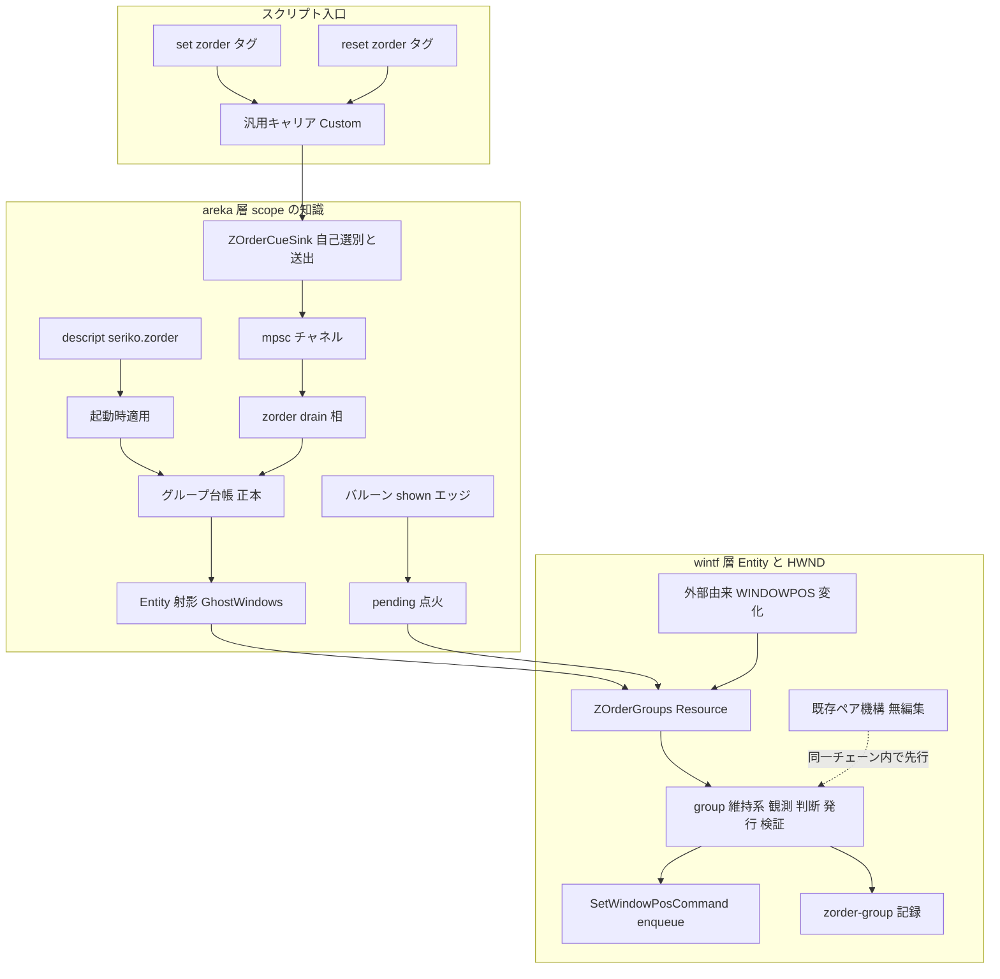
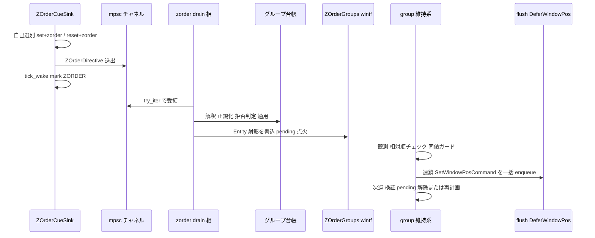

# Technical Design: areka-P0-scope-zorder-pinning

**作成**: 2026-08-27／**入力**: requirements.md（確定・議題 3 件裁定済）・research.md（ギャップ分析＋設計前再実測 §9）・`.kiro/steering/`
**file:line は 2026-08-27 の設計前再実測値**（research.md §9 のドリフト訂正を反映済み）。

## Overview

**Purpose**: ゴースト作者がスクリプト（`\![set,zorder,...]`／`\![reset,zorder]`）または shell descript（`seriko.zorder`）で、複数スコープの窓（キャラ窓・バルーン窓）の前後関係を確定的にピン留めできるようにする。
**Users**: ゴースト作者（emo2 開発者本人）が会話演出のために使う。既存の伺か資産の利用者は、指定が無い限り従来どおりの操作感（非強制）を保つ。
**Impact**: 既存のスコープ内ペア機構（`zorder_pair*`）には** 1 行も手を入れず**、その隣に「グループ」の語彙・維持系・記録を新設する。タグはゼロ工事で届く汎用 `\!` キャリアから新設 sink が受ける。

### Goals

- 正典 3 入口（タグ 2 種＋descript）を ukadoc の意味論どおりに動かす（要件 1〜5）
- 既定状態＝非強制を構造的に保存する（グループが空なら新系統は 1 命令も出さない・要件 6）
- 窓の出現・破棄・再表示・利用者操作へ追随し、是正が適用されるまで処理を促す（要件 7）
- 判断分岐の決定論テスト網羅と、実機ログだけで判定できるサインオフ証跡（要件 9・10）

### Non-Goals

- プロパティ `currentghost.seriko.zorder` の実導出（追跡 spec `areka-P0-zorder-property` 所有・要件 13）
- 窓の位置・寸法・常時最前面・最小化などの窓状態（要件 11.1／11.4・先送り語彙 9 語は既決）
- グループどうしの相対順の規定（要件 3.6・正典沈黙＝非強制のまま）
- バルーン表示ライフサイクル・ペア機構（owner 方式）の変更

## Boundary Commitments

### This Spec Owns

- `\![set,zorder,...]`／`\![reset,zorder]` の消費（自己選別・解釈・拒否・記録）
- グループ台帳（唯一の正本・areka 側・scope／窓種別のまま保持）と descript `seriko.zorder` の起動時適用
- グループ順の観測・是正・検証（wintf 側の新設維持系）と `[zorder-group]` 系の診断記録
- COMPAT §8 への裁量（要件 12.2 の列挙 5 件は下限＝「少なくとも」・着地は 9 件）＋誤記訂正 1 件＋実機の現況 1 件＋先送りの参照 1 件の登記（要件 12・13.3／13.4）

### Out of Boundary

- 既存 `zorder_pair*` 5 ファイル（**無編集**。共有純関数は `pub(crate)` 参照のみ）
- `enqueue_window_set_pos`（`placement/follow/window_move.rs`・bod 領域）——維持系は従来どおり `SetWindowPosCommand` を直接発行
- sylphya 語彙表（`vocab/dotted.rs`）——名前だけの先行登録もしない（要件 13.5）
- `command.rs` の flush／バッチ機構（実測済みの既存保証をそのまま使う）

### Allowed Dependencies

- wintf 新設 → 既存 `zorder_pair` の `pub(crate)` 純関数（`measure_*`・`hwnd_field` 等）と `SetWindowPosCommand::enqueue`
- areka 新設 → `GhostWindows`（scope→Entity の唯一の正本）・`tick_wake`・`dola::cue::CueSink`
- **wintf → areka の import は禁止**（既存規律 `zorder_pair.rs:5-7`）。scope の知識は areka 側で Entity 列へ解決してから wintf へ渡す

### Revalidation Triggers

- `ZOrderGroups` Resource（wintf 受け口）の形の変更
- グループ台帳の正本の移動（areka → 他層）
- `[zorder-group]` 記録行の書式変更（実機サインオフ grep が読む）
- FrameFinalize 内の system 追加順の変更

## Architecture

### Existing Architecture Analysis

- **ペア機構は不変の土台**: `KeepDirectlyAbove`（バルーン→キャラの片側宣言・`zorder_pair.rs:46`）＋案 A（Win32 owner）で、スコープ内隣接は OS が構造保証する。維持系は「1 巡 1 本」（`zorder_pair_maintain.rs:396,483-489`）・実測は「最も近い可視の隣」（`:525-605`）。
- **バッチの順序保存は実証済み**: `SetWindowPosCommand::flush` の `DeferWindowPos` 一括投入は enqueue 順を保存し、逐次適用と最終 Z 形が一致する（実窓の対照テスト `command_batch_tests.rs:633` が緑）。**グループ内の自己参照連鎖を 1 巡で一括発行できる前提が既に成立している**（research R1 解決済み）。
- **タグ入口はゼロ工事**: `\![set,zorder,1,0]` は `CueCommand::Custom { command: "set", params: ["zorder","1","0"] }` として sink へ届く（`decode.rs:321-326`→`compile.rs:174-181`）。parsers／sakura／dola は無改変。
- **「可視」は Windows 基準**（要件 9.3 裁定済み）: 絵を消しただけのバルーン窓は WS_VISIBLE のままであり、実測上は可視の窓として数える。「再表示」の発火点は合成層の shown エッジ（`balloon_visibility.rs:550`）。

### Architecture Pattern & Boundary Map



**Architecture Integration**:

- 採用パターン: **案 C（混成）**——グループの正本と解釈は areka、維持は wintf の新設 1 系統。既存ペア機構は無編集（research §4 の評価表どおり、語彙保存・干渉最小・調停一元で最良）。
- 責務分界: 「scope→窓」の知識は areka（`GhostWindows`）に閉じ、wintf は「手前から順の Entity 列」しか知らない。既存 `KeepDirectlyAbove` と同じ分界。
- 既存パターンの踏襲: mpsc チャネル＋drain 相（move_cue と同型・`GhostWindows` 不在時はチャネルが保留バッファ）・純関数判断→記録→発行→次巡検証（pair 維持系と同型）・診断行の純関数分離（diag 規律）。
- 新設の理由: ペア語彙（peer 単数）は N 窓の列を表せず、グループは「窓が未出現でも宣言が残る」（要件 1.4）ため Entity 付随 Component では表現できない——Resource／台帳が必要。

### Technology Stack

| Layer | Choice | Role | Notes |
|---|---|---|---|
| ECS | bevy_ecs（既存） | Resource・system・FrameFinalize | 新規依存なし |
| Win32 | windows crate（既存） | `SetWindowPos`（既存 flush 経由）・実測（既存 `measure_*`） | 新規 API 呼び出しなし |
| 演出 | dola `CueSink`（既存） | タグの受け口 | trait 実装 1 本追加 |

新規外部依存: **なし**。

## File Structure Plan

### 新設ファイル（すべて 1,000 行未満で作る・`file_length_guard_test.rs` 例外表は触らない）

```
crates/wintf/src/ecs/window/
├── zorder_group.rs                 # グループ語彙（Resource・観測・純判断 decide_group_fix・記録マクロ呼出）
├── zorder_group_maintain.rs        # 維持系 system（pending 消費・調停・連鎖発行・次巡検証・起床旗）
├── zorder_group_diag.rs            # 記録行の純関数（tracing マクロを含まない）＋タグ定数
├── zorder_group_decision_tests.rs  # 純判断の決定論テスト（兄弟配置）
├── zorder_group_maintain_tests.rs  # 計画・検証・調停の決定論テスト
└── zorder_group_order_tests.rs     # 実窓での連鎖適用テスト（command_batch_tests.rs:633 と同型）

crates/areka/src/
├── placement/zorder_group_ledger.rs              # 台帳の正本＋トークン解釈・正規化・拒否判定（純関数・Win32/ECS 非依存）
├── placement/zorder_group_ledger_tests.rs        # 7 分岐＋正規化＋actor 非依存の決定論テスト（兄弟配置）
├── placement/zorder_group_ledger_state_tests.rs  # 残り 3 分岐（再指定拒否・解除・descript 適用）の状態遷移テスト（兄弟配置）
├── emo2_boot/zorder_cue.rs                       # ZOrderCueSink（自己選別・トークン送出・起床旗）＋ZOrderDirective
├── emo2_boot/frame/zorder_drain.rs               # drain 相（指令適用→台帳→Entity 射影→ZOrderGroups 書込→pending）
└── emo2_boot/frame/zorder_descript.rs            # descript 基底の着席（起動時適用・タグと同一の解釈経路）
```

### Modified Files

- `crates/wintf/src/ecs/window/mod.rs` — 新設 3 モジュールの登録のみ
- `crates/wintf/src/ecs/window_proc/window_pos.rs` — 外部由来（`!is_echo`）の WINDOWPOS 変化時、グループが 1 つでもあれば `ZOrderGroups.pending` を立て `tick_wake::mark(ZORDER)`（数行。`wp.flags`／`hwndInsertAfter` の解析はしない）
- `crates/wintf/src/ecs/world/tick_wake.rs` — module doc の ZORDER 生産者行へ本 spec の生産者を追記（doc のみ）。着地時点で当該行（:18-21）は 5 人を名指し、うち 4 人が本 spec 由来＝`window/zorder_group_maintain.rs`・`window_proc/window_pos.rs`・areka `emo2_boot/zorder_cue.rs`・areka `emo2_boot/balloon_visibility_phase.rs`（既存は `window/zorder_pair_maintain.rs` の 1 人）
- `crates/wintf/src/ecs/window/zorder_pair_deferred_vocabulary_tests.rs` — `PRODUCTION_FILES` 5→8（新設 3 本追加）＋件数定数
- `crates/areka/src/placement/mod.rs` — 台帳モジュールの登録（:49）と、shell 設定の生の値を起動窓の準備から `main.rs` へ渡す中継フィールド `PreparedPlacement::zorder_raw`（:258）。placement は値を解釈しない
- `crates/areka/src/placement/spawn.rs` — `wire_zorder_pair` のチェーンを `(establish, pair_maintain, group_maintain).chain()` へ拡張（1 行）＋`KeepDirectlyAbove` doc の「スコープ間には宣言を張らない」節を二状態の記述へ改訂
- `crates/areka/src/placement/spawn_zorder_pair_deferred_tests.rs` — `PRODUCTION_FILES` 2→6（ledger・zorder_cue・frame/zorder_drain.rs・frame/zorder_descript.rs 追加）＋件数定数
- `crates/areka/src/emo2_boot/mod.rs` — チャネル 1 組＋`sinks` 1 行＋`Emo2Wiring` 受け渡し（sink 追加 5 点セットの 3 点）＋起動の段で shell 設定由来の基底を据える呼出（:495-500・要件 5.1）
- `crates/areka/src/emo2_boot/frame/wiring.rs` — `Emo2Wiring` フィールド＋`new` 引数（残り 2 点）＋巡をまたいで台帳を持つ `zorder_ledger` フィールド（:95）と起動の段の入口 `seed_zorder_descript_base`（:183-195）
- `crates/areka/src/emo2_boot/frame.rs` — `run_move_drain_phase`（:216）の直後に `run_zorder_drain_phase`（:225）を追加
- `crates/areka/src/emo2_boot/balloon_visibility_phase.rs` — `show_target` の結果を畳んだ直後（:477 の `note_balloon_shown`）に pending 点火＋`tick_wake::mark(ZORDER)`（:537-543。同ファイルに tick_wake 使用の先例あり :36,114-115）
- `crates/areka/src/emo2_boot/consumer_ledger.rs` — キーを（名前＋選別子）へ拡張し `("set","zorder")`／`("reset","zorder")` を `ZOrderSink` として登記
- `crates/areka/src/main.rs` — **適用は行わない**。起動窓の準備が読んだ `config.zorder_raw` を生のまま搬送するだけ＝`open_startup_window` の内側で写し（:664）`StartupDescriptValues` へ載せ（:721）、呼び手が取り出して（:209）`wire_emo2_boot` へ渡す（:235）。台帳への適用は結線の側（`emo2_boot/mod.rs:500` → `frame/wiring.rs:194-195` → `frame/zorder_descript.rs:61`）にあり、`set_descript_base`／`apply_descript_base`／`seed_zorder_descript_base` の呼出は main.rs に 1 件も無い（下の「descript 起動時適用」節と同じ事実）
- `doc/COMPAT_ARCHITECTURE.md` — §8 へ 12 行（裁量 9・実機の現況 1・誤記訂正 1・先送りプロパティ 1）
- `crates/wintf/src/ecs/window/zorder_pair.rs` ほか既存ペア 4 ファイル — **編集しない**（`KeepDirectlyAbove` の doc 改訂は areka 側 spawn.rs の doc が対象）

> 注: 「スコープ間には宣言を張らない」の記述は wintf `zorder_pair.rs:42-45` と areka `spawn.rs:530-532` の 2 箇所にある。wintf 側は**ペア機構自身の**宣言規則として今も真（グループは別語彙）なので無編集とし、areka 側 spawn.rs の doc にだけ「グループ機構（本 spec）は別系統で列を宣言する」旨を追記する（着地済み＝`spawn.rs:535-542`）。

## System Flows

### タグ受理から是正までの流れ



- **同値ガード**: 観測でグループの相対順が既に成立していれば指令 0 本（既定状態＝非強制の保持と、要件 3.7 の「上限なし」の実コスト抑制を同時に満たす）。
- **1 巡 1 グループ**: 是正の連鎖を出すのは 1 巡に 1 グループのみ。グループ内の連鎖は自己参照（`w[i]` を `w[i-1]` の直後へ）なので実測の陳腐化と無縁（先頭窓は動かさない）。
- **調停**: 同一巡にペア維持系が是正を出した場合（`Added<IssuedPairFix>` で検知）、グループ維持系はその巡の発行を見送る（pending は保持）。「1 巡に窓を動かす系統は 1 つ」の規律を系統間へ拡張した形。

## Requirements Traceability

| Req | 実現要素（Components／Contracts） |
|---|---|
| 1.1, 1.2 | 台帳の数値モード展開（scope→[Balloon, Char]）＋維持系の連鎖発行 |
| 1.3 | window_pos.rs の外部由来変化トリガ→pending→維持系の再検証・是正 |
| 1.4 | 台帳は scope／窓種別で保持・射影時に存在する窓だけ Entity 化・エントリは残す |
| 1.5 | 台帳はメモリ上 Resource のみ（persist 層に触れない＝終了で消滅） |
| 1.6 | `parse_zorder_tokens` の要素 2 個未満拒否＋`RejectReason::TooFewElements` 記録 |
| 1.7 | sink は `cue.actor` を読まない（move_cue との差を doc とテストで固定） |
| 2.1, 2.2 | 明示モード解釈（`balloonN`/`surfaceN`/`bN`/`sN`）→窓 1 枚単位の要素 |
| 2.3 | `RejectReason::ModeMixed`（タグ全体不採用） |
| 2.4 | スコープブロック正規化（同一スコープの反転・非隣接を [Balloon, Char] 隣接へ寄せ、調整内容を記録） |
| 2.5 | 連鎖はグループ構成窓の HWND のみを対象に enqueue（非構成窓に指令を出さない型の形） |
| 3.1 | 台帳へのグループ追加（重複なし時） |
| 3.2, 3.3 | `RejectReason::CrossGroupRedesignation`（sN/bN と N は同一スコープ扱い・全体不採用＋該当 ID 記録） |
| 3.4, 3.5 | `RejectReason::DuplicateElement`（窓単位判定・bN と sN は別窓） |
| 3.6 | グループ間の順序を決める規則を持たない（維持系はグループ単位で独立に相対順のみ見る） |
| 3.7 | `Vec` ベース・上限検査なし＋同値ガードで実コスト抑制 |
| 4.1, 4.2 | `Reset` 指令→タグ由来グループ全解除→descript 基底を再適用（無ければ空） |
| 4.3 | 解除後は台帳が空／基底のみ＝再指定拒否の対象外 |
| 4.4 | sink の自己選別（`reset`＋第 1 引数 zorder 以外は debug スキップ・重なり不変） |
| 5.1 | main.rs 起動シームは `zorder_raw` を搬送するのみ・台帳への適用は `wire_emo2_boot` の側（最初の維持巡より前） |
| 5.2 | descript 値はタグと同一の `parse_zorder_tokens` で解釈 |
| 5.3 | KV 後勝ち単一値＝高々 1 グループ（§8 登記・要件 12.2 済） |
| 5.4 | 解釈失敗は warn 記録＋グループ 0 適用＋起動継続 |
| 5.5 | descript 由来グループも台帳に載る＝再指定拒否判定に含まれる |
| 6.1, 6.2, 6.4 | グループ台帳が空なら射影も空＝維持系は観測すら行わず指令 0 本（構造的保証） |
| 6.3 | ペア機構（owner）は無編集＝スコープ内隣接は従来どおり |
| 7.1 | 射影相が GhostWindows の変化（新窓）で再射影＋pending 点火 |
| 7.2 | 射影時に消えた Entity を列から除外（台帳エントリは保持）・他窓へ指令を出さない |
| 7.3 | balloon_visibility_phase の shown 成功直後に pending＋ZORDER 起床（合成層エッジ＝裁定済み定義） |
| 7.4 | pending が立つ間、維持系が毎巡 `tick_wake::mark(ZORDER)`（maintain.rs:368-372 の作法に従い自系統で立てる） |
| 7.5 | 相対順は OS の帯移動で保存され、次の外部変化トリガで再検証（sink 観測は既存のまま） |
| 8.1 | トークン 1 つでも解釈不能→タグ全体不採用＋`RejectReason::UnparsableToken` 記録 |
| 8.2 | flush 層の既存 warn＋維持系の verify-failed 記録（ゴーストは継続） |
| 8.3 | 全拒否・見送り・失敗経路が `RejectReason`／`GroupSkipReason` を通る（理由なし見送りを型で作らせない） |
| 8.4 | 未出現スコープは射影から外れ続け、`skip` 記録（member-missing）を残し他窓の配置は継続 |
| 9.1, 9.2 | `[zorder-group] fix` 行（グループ ID・対象窓・挿入先・次巡検証の実測隣を同一行）＝pair `fix_line` の書式規律・検証段発行 |
| 9.3 | 既存 `measure_*`（最も近い可視の隣・Windows 基準）をそのまま共有 |
| 9.4 | 実機サインオフ手順（§Testing）: 有界 auto-exit＋grep 判定（成立証跡＋既定状態の指令 0 本証跡） |
| 9.5 | 既存ペア 5 ファイル無編集＝タグ 6 種・grep 対象 module path・起床旗・SCHEDULE_NAMES すべて不変 |
| 10.1, 10.2 | 純関数境界（解釈・正規化・拒否・decide_group_fix・検証判定）＋ **10 分岐**の兄弟テスト |
| 10.3 | テストは Resource／純関数単位で独立（log-capture-kit・temp-path-kit の cage 着地物を利用） |
| 10.4 | 新設 7 本（wintf 3・areka 4＝ledger・zorder_cue・zorder_drain・zorder_descript）を両肺の `PRODUCTION_FILES` へ追加＋件数定数更新 |
| 11.1 | `pair_fix_command` と同じ `WindowPos` 経由の型導出（`SWP_NOMOVE\|NOSIZE\|NOACTIVATE` 自動） |
| 11.2, 11.3 | consumer_ledger キー拡張（名前＋選別子）＝`set` の他サブコマンドの余地を残す・1 出現高々 1 担当 |
| 11.4 | 新設ファイルを先送り語彙検査の対象へ追加（10.4 と同じ変更で自動成立） |
| 12.1, 12.2 | COMPAT §8 へ裁量 9 行——要件 12.2 の列挙 5 件（二状態・再指定全体拒否・descript 明示記法受理・隣接優先・descript 後勝ち 1 グループ）は下限で、実装中に確定した 4 件（語の小文字ちょうど・基底据え直しの衝突時の終状態・`\![reset,zorder,...]` の余分なトークン受理・`origin=zorder-pair` の流用）を加えた。あわせて実機の現況（数値モードが実機で未成立＝要件 1.1／1.2 未達）を 1 行登記 |
| 12.3 | §8 へ訂正行（`seriko.zorder`＝窓の重なり順。完了アーカイブ非接触＝裁定済み） |
| 12.4 | §8 の二状態行に完了 spec 要件 3 との関係を明記 |
| 13.1〜13.5 | 実装なし＝現行 NOT_FOUND 応答維持・sylphya 非接触・語彙正本＝`areka-P0-zorder-property/brief.md`（起票済み）・§8 から参照 |

## Components and Interfaces

| Component | 層 | Intent | Req | 依存（P0） | Contracts |
|---|---|---|---|---|---|
| ZOrderCueSink | areka/emo2_boot | タグの自己選別と送出 | 1.7, 4.4, 11.2 | dola CueSink・tick_wake | Event |
| ZOrderGroupLedger | areka/placement | 台帳正本＋解釈・正規化・拒否（純関数） | 1.4-1.6, 2.1-2.4, 3.1-3.5, 4.1-4.3, 5.2-5.5, 8.1 | なし（純） | Service/State |
| zorder drain 相 | areka/emo2_boot/frame | 指令適用と Entity 射影 | 1.4, 5.1, 6.1, 7.1, 7.2 | GhostWindows | Batch |
| ZOrderGroups | wintf/ecs/window | wintf 受け口 Resource | 6.1, 7.4 | なし | State |
| group 維持系 | wintf/ecs/window | 観測・判断・連鎖発行・検証・調停 | 1.1-1.3, 2.5, 3.6, 7.4, 8.2-8.4 | measure_*・SetWindowPosCommand | Service |
| group diag | wintf/ecs/window | 記録行の純関数 | 9.1-9.3 | なし（純） | — |
| トリガ 2 点 | wintf window_pos／areka balloon_visibility_phase | pending 点火 | 1.3, 7.3 | ZOrderGroups | Event |
| consumer_ledger 拡張 | areka/emo2_boot | 担当の一意性登記 | 11.2, 11.3 | なし | State |

### areka 層

#### ZOrderGroupLedger（`placement/zorder_group_ledger.rs`）

| Field | Detail |
|---|---|
| Intent | グループの唯一の正本と、タグ／descript 共通の解釈・正規化・拒否判定（すべて純関数） |
| Requirements | 1.4-1.6, 2.1-2.4, 3.1-3.5, 4.1-4.3, 5.2-5.5, 8.1 |

**Responsibilities & Constraints**

- 正本は scope／窓種別のまま保持（Entity・HWND を知らない＝実機不要で全分岐テスト可能）
- 数値モードは解釈時に `[Balloon(n), Char(n)]` へ展開（数値モード＝明示モードの特例、という一般化）
- スコープブロック正規化: 同一グループ内に同一スコープの 2 窓が現れる場合、先に現れた要素の位置へ `[Balloon, Char]` の隣接ブロックとして寄せる。反転（sN が bN より前）も非隣接（間に他要素）も同じ規則で調停し、調整内容を戻り値で返す（呼び手が記録する）。要件 2.4 と research R6 の一元処理
- ゴースト終了まで有効＝persist 層に接続しない（要件 1.5 は「何もしない」ことで成立）

##### Service Interface

```rust
pub enum GroupWindowKind { Balloon, Char }
pub struct GroupElement { pub scope: u32, pub kind: GroupWindowKind }
pub enum GroupSource { Tag, Descript }
pub struct ZOrderGroup { pub id: u32, pub members: Vec<GroupElement>, pub source: GroupSource }

pub enum ZOrderReject {
    ModeMixed,                                  // 2.3
    DuplicateElement { element: GroupElement }, // 3.4（bN と sN は別窓＝3.5）
    TooFewElements { count: usize },            // 1.6
    UnparsableToken { token: String },          // 8.1
    CrossGroupRedesignation { scopes: Vec<u32> }, // 3.2（sN/bN/N 同一スコープ扱い＝3.3）
}
pub struct Normalization { pub scope: u32, pub reordered: bool }  // 2.4 の記録材料

/// トークン列 → 正規化済み要素列（タグ・descript 共通・actor 非依存）
pub fn parse_zorder_tokens(tokens: &[&str])
    -> Result<(Vec<GroupElement>, Vec<Normalization>), ZOrderReject>;

pub struct ZOrderGroupLedger { /* descript 基底 + タグ由来 groups + next_id */ }
impl ZOrderGroupLedger {
    pub fn try_add_tag_group(&mut self, members: Vec<GroupElement>) -> Result<u32, ZOrderReject>;
    pub fn set_descript_base(&mut self, members: Vec<GroupElement>);   // 5.1-5.3（高々 1 つ）
    pub fn reset_to_descript(&mut self);                               // 4.1-4.3
    pub fn groups(&self) -> &[ZOrderGroup];                            // 射影の読み口
    pub fn version(&self) -> u64;                                      // 変更検知（射影の再計算判定）
}
```

- Preconditions: なし（純）。Postconditions: 拒否時は台帳不変（部分適用なし＝8.1）。Invariants: どの scope も高々 1 グループに属する。

#### ZOrderCueSink（`emo2_boot/zorder_cue.rs`）

| Field | Detail |
|---|---|
| Intent | 汎用キャリアからの自己選別と UI スレッドへの送出（判断は持たない） |
| Requirements | 1.7, 4.4, 11.2 |

- `emit` の 4 段（move_cue `:486-553` の同型・ただし **`cue.actor` を読まない**＝1.7。この差は doc とテストで固定）:
  1. `as_command_carrier()` 抽出（失敗は宛名規律 D8④: 自分宛 warn／他人宛 debug）
  2. 自己選別: `(name, first) == ("set","zorder") | ("reset","zorder")` 以外は debug スキップ（`\![set,他]`・`\![reset,他]` は他人宛＝重なり不変で 4.4／11.2 成立）
  3. `ZOrderDirective { Set { tokens: Vec<String> } | Reset }` を mpsc 送出（解釈は drain 側＝台帳状態が要るため）
  4. `tick_wake::mark(tick_wake::ZORDER)`
- sink 登録位置: `mod.rs` の `sinks: vec![…]` で clocked_text_sink より後（既存の順序制約 `:411-413` に従う。zorder は文字 cue に依存しないため末尾で可）

#### zorder drain 相（`emo2_boot/frame/zorder_drain.rs`）

| Field | Detail |
|---|---|
| Intent | 指令の台帳適用と、台帳→Entity 列の射影・`ZOrderGroups` 書込 |
| Requirements | 1.4, 5.1, 6.1, 7.1, 7.2 |

- `run_move_drain_phase` の直後に呼ぶ。台帳適用（受理／拒否を warn/info で記録）→ 台帳 version か `GhostWindows` の構成が変わっていれば再射影 → `ZOrderGroups` へ書込＋`pending = true`
- 射影規則: メンバーのうち **存在する窓だけ** を Entity 化（未出現・破棄済みは飛ばす＝1.4／7.2／8.4）。存在数 2 未満のグループは射影から除外（維持対象なし。台帳には残る）
- `GhostWindows` 不在の間は指令を drain せず mpsc が保留バッファを兼ねる（move drain `drain_resnap.rs:79-87` の同型）

#### descript 起動時適用（main.rs シーム）

- `config.zorder_raw`（`config.rs:104`＝shell descript の生転記。本 spec の着地までは消費者ゼロだった）を `parse_zorder_tokens` で解釈し `set_descript_base` へ。解釈失敗は **warn**（`logging.md:23-29` の「無効なパラメーター」区分）＋グループ 0 適用＋起動継続（5.4）
- 適用位置は `wire_emo2_boot` の内側＝`main.rs:229` → `emo2_boot/mod.rs:500` `Emo2Wiring::seed_zorder_descript_base` → `frame/zorder_descript.rs::apply_descript_base`。台帳が `Emo2Wiring` に属する（6.2 の結線）ため、main.rs の呼び出し位置ではなく結線の側から据える。実行順は `open_startup_window`（`main.rs:207`。その内側 `main.rs:683` で `spawn_ghost_windows` を呼ぶ）の後・`insert_non_send`（`mod.rs:501`）より前・最初の FrameFinalize より前＝タグ実行を待たずに最初の維持巡から効く（5.1）

#### consumer_ledger 拡張（`emo2_boot/consumer_ledger.rs`）

- キーを `(name: String, selector: Option<String>)` へ拡張。同一 name に対し selector 有り登記と無し登記は相互排他（重複扱い）
- `canonical()`: 既存 `("move", None)`・`("bind", None)` ＋ 新規 `("set", Some("zorder"))`・`("reset", Some("zorder"))` → `CommandConsumer::ZOrderSink`
- これにより「1 コマンド出現に高々 1 担当」を実際の消費粒度（名前＋第 1 引数）で表し、`\![set,他]` の将来担当の余地を型で残す（11.3）

### wintf 層

#### ZOrderGroups Resource＋純判断（`zorder_group.rs`）

| Field | Detail |
|---|---|
| Intent | areka からの受け口と、観測→判断の純関数 |
| Requirements | 1.1, 1.2, 3.6, 6.1, 7.4, 8.4 |

##### State／Service Interface

```rust
#[derive(Resource, Default)]
pub struct ZOrderGroups {
    pub groups: Vec<ZOrderGroupSpec>,   // 射影済み（存在窓のみ・手前から順）
    pub pending: bool,                  // 是正が必要かもしれない
    verify: Option<GroupVerify>,        // 直前巡の発行に対する検証待ち
    fail_streaks: HashMap<u32, u8>,     // グループ ID ごとの連続 verify 失敗（頭打ち用）
}
pub struct ZOrderGroupSpec { pub id: u32, pub members: Vec<Entity> }

pub(crate) struct GroupObservation {
    pub id: u32,
    pub hwnds: Vec<HWND>,               // 解決できたメンバーのみ（順序保存）
    pub missing: usize,                 // ハンドル未解決の数（8.4 の記録材料）
    pub order_ok: bool,                 // 前面走査による相対順の成否
}
pub(crate) enum GroupSkipReason { AlreadyOrdered, TooFewResolved, MemberMissing, PairFixThisPass }
pub(crate) enum GroupFixDecision {
    Skip(GroupSkipReason),
    Chain { head: HWND, chain: Vec<HWND> },   // chain[i] を直前要素の直後へ
}
pub(crate) fn decide_group_fix(obs: &GroupObservation) -> GroupFixDecision;
```

- 観測は既存 `measure_windows_in_front`（前面走査・可視のみ・上限 512）でグループ末尾から前を走査し、メンバーが指定の相対順で現れるかを判定（**相対順のみ**。グループ間・非構成窓との位置は見ない＝3.6／6.1）
- 同値ガード: `order_ok` なら `Skip(AlreadyOrdered)`＝指令 0 本

#### group 維持系（`zorder_group_maintain.rs`）

| Field | Detail |
|---|---|
| Intent | pending の消費・調停・連鎖発行・次巡検証・起床旗 |
| Requirements | 1.1-1.3, 2.5, 7.4, 8.2, 8.3 |

- `wire_zorder_pair` のチェーン末尾に追加: `(establish_owner_links, apply_zorder_pair_maintenance, apply_zorder_group_maintenance).chain()`
- 1 巡の処理: ①検証待ちがあれば実測して検証（成功→`[zorder-group] fix` 行＝指令内容と検証実測を同一行で発行＋当該グループの fail_streak リセット・失敗→`[zorder-group] verify-failed` ＋当該グループの fail_streak++）②`pending` でなければ終了 ③調停: この巡にペア是正が出ていれば（`Query<(), Added<IssuedPairFix>>` 非空）`Skip(PairFixThisPass)` 記録のみ ④各グループを観測し、**最初に是正が要ると判断された 1 グループ**へ連鎖発行（`w[i]` を `ZOrder::InsertAfter(w[i-1])`・先頭は動かさない・既存 `WindowPos` 型導出で `SWP_NOMOVE|NOSIZE|NOACTIVATE` 自動＝11.1）⑤維持対象の全グループが `order_ok` なら `pending = false` ⑥`pending || verify` の間は `tick_wake::mark(ZORDER)`（7.4）
- 頭打ち: あるグループの fail_streak が 3 以上になったら warn（group_id・諦める旨・観測値）を出し、**そのグループだけ**を維持対象から外す。外したグループは次の追随トリガで維持対象へ戻す（＝8.2/8.3 の「黙って諦めない」）。pending の解除条件は⑤のまま（**維持対象**の全グループが `order_ok`）——外されたグループは判定に加えないので、1 グループの不成立が他グループの是正も tick の静穏も止めない
- バッチ順序の前提: `DeferWindowPos` 一括投入は enqueue 順を保存（実窓テスト `command_batch_tests.rs:633` で実証済み）。縮退経路（逐次）でも順序どおり

#### group diag（`zorder_group_diag.rs`）

- タグ定数: `[zorder-group] fix`／`skip`／`verify-failed`／`applied`（受理時の台帳内容）。**既存 `[zorder-pair]` 6 タグとは独立の新設**（9.5 は既存無編集で構造保証）
- 行組立は tracing マクロを含まない純関数（diag 規律 `zorder_pair_diag.rs:8-16` に従う）。マクロ呼出は `zorder_group.rs` 側に置き、grep 対象 module path を `wintf::ecs::window::zorder_group` の 1 本に保つ
- `fix` 行: グループ ID・動かした窓・挿入先・**次巡の検証で採った実測隣**。pair の実体と同じく `fix`（debug）／`verify-failed`（error）は**検証段でのみ**発行する（`record_verification` `zorder_pair.rs:858` の先例）。指令の書込は巡後の flush で起きるため、発行と同巡の実測は必ず書込前の値になり証跡に使えない。指令内容と検証実測が同一行に載ることで 9.1/9.2 を満たす

#### トリガ 2 点

- `window_pos.rs`（`WM_WINDOWPOSCHANGED`）: `!is_echo` かつ `ZOrderGroups.groups` 非空のとき `pending = true`＋`tick_wake::mark(ZORDER)`。**`wp.flags`／`hwndInsertAfter` は解析しない**（再実測でどちらも現行未読と確定。位置変化でも余分に検証が走るが同値ガードが 0 本で吸収）＝1.3
- `balloon_visibility_phase.rs`: `show_target` 成功直後に同上＝7.3（「再表示」＝合成層 shown エッジという裁定済み定義の実装点）

## Data Models

### Domain Model

- 集約ルート: `ZOrderGroupLedger`（areka）。不変条件: ⑴どの scope も高々 1 グループ ⑵グループ内で同一窓は 1 回 ⑶同一スコープの 2 窓は `[Balloon, Char]` の隣接ブロック ⑷descript 基底は高々 1 つ
- `ZOrderGroups`（wintf）は台帳の**射影キャッシュ**であり正本ではない（正本変更→drain 相が再射影）。二重帳簿を作らない（正典先例: balloon-visibility R7.5）
- 永続化なし（1.5）。ID はセッション内単調増加の u32

## Error Handling

- **不正入力（8.1・1.6・2.3・3.2・3.4）**: `ZOrderReject` を返しタグ全体不採用（台帳不変）。記録は **warn**（`logging.md:23-29`「無効なパラメーター」区分）＋受け取ったトークン列
- **担当外（4.4・11.2）**: 宛名規律 D8④（`move_cue.rs:489-505` 先例）——自分宛の壊れ物＝warn・他人宛＝debug
- **環境失敗（8.2）**: `SetWindowPos` 失敗は flush 層の既存 warn＋次巡 verify-failed。ゴーストは継続（panic なし）
- **未出現窓（8.4）**: `GroupSkipReason::MemberMissing` を debug 記録し、解決できた窓だけで維持を継続
- **記録なしの断念を型で禁止（8.3）**: すべての見送り・拒否が `ZOrderReject`／`GroupSkipReason` を経由（既存 `SkipReason` の設計を踏襲）

## Testing Strategy

### Unit（決定論・実機不要）

1. `parse_zorder_tokens`: 数値／明示／省略形の受理、モード混在・タグ内重複（bN+sN 併存は非重複）・2 個未満・解釈不能の各拒否（**10.2 の 10 分岐のうち 6**）
2. スコープブロック正規化: 反転（`s1,b1`）・非隣接（`b1,s0,s1,b0`）→ `[Balloon,Char]` 隣接ブロック化＋ `Normalization` 記録（2.4）
3. 台帳: 複数グループ併存・グループまたぎ再指定拒否（sN/N 同一視）・reset→descript 復帰／空復帰・reset 後の再受理・descript 由来の拒否判定参加（**10.2 残り 3 分岐**＝再指定拒否・解除・descript 適用）
4. `decide_group_fix`: 同値ガード・解決 2 未満・連鎖計画の形（先頭不動）
5. sink: 自己選別表（set/zorder・reset/zorder・set/他・reset/他・非キャリア）＋ **actor 値を変えても結果不変**（1.7）

### Integration（in-crate・World 使用）

1. drain 相: GhostWindows 不在時の保留→出現後の FIFO 適用（1.4）・射影の存在窓フィルタ（7.2）
2. 維持系: pending→発行→verify→解除の一巡・ペア是正との同巡調停（`Added<IssuedPairFix>`）・fail_streak 頭打ち warn
3. 起床旗: pending 中の `ZORDER` mark（7.4・tick_wake 檻の先例に倣う）
4. consumer_ledger: 拡張キーの排他（name 単独 vs selector 付きの衝突）

### 実窓テスト（cargo test・GPU/実窓は本プロジェクトの定石）

1. `zorder_group_order_tests.rs`: 実窓 4 枚で連鎖発行→最終 Z 形が指定順（`command_batch_tests.rs:633` と同型・バッチ／逐次両経路）

### 実機サインオフ（9.4・有界 auto-exit＋grep）

- descript `seriko.zorder` 入り fixture＋タグ実行スクリプトで `AREKA_APP_SMOKE_EXIT_MS` 走行 →
  ⑴ `[zorder-group] applied`（受理）と `fix`（次巡検証の成功＝指令と実測が同一行）で成立を判定 ⑵ グループ無し走行で `[zorder-group] fix` が **0 件**（既定＝非強制の証跡）⑶ 既存 `[zorder-pair]` 6 タグが従来どおり出る（9.5）
- 判定語は grep 1:1（`wintf::ecs::window::zorder_group` target）

## Performance & Scalability

- 計測は Out of scope（要件境界）。設計上の抑制のみ: 同値ガード（順序成立中は指令 0 本）・pending 消灯中は観測もしない・tick の門と両立（7.4 は旗で保証）
- 前面走査は既存 `SIBLING_SCAN_LIMIT = 512` を共有

## Supporting References

- research.md §1〜§8（ギャップ分析）・§9（設計前再実測＝ドリフト 8 件訂正・R1 解決済みの実証テスト・logging 規範の出所）
- 追跡 spec: `areka-P0-zorder-property/brief.md`（プロパティ語彙の正本）
- 干渉台帳（roadmap）: zsp⇄pwc＝起床旗と相名の保存（本設計は既存ファイル無編集で満たす）・zsp⇄bod＝`enqueue_window_set_pos` 非接触（本設計は `SetWindowPosCommand` 直接発行）・zsp⇄bvc＝sylphya 非接触化により消滅
