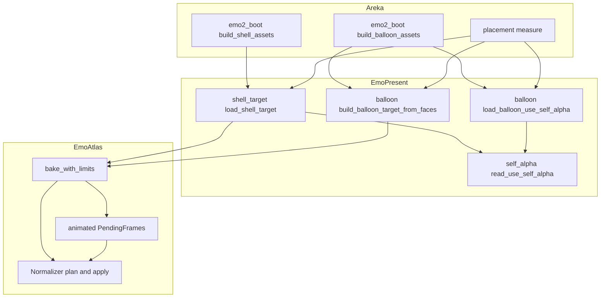
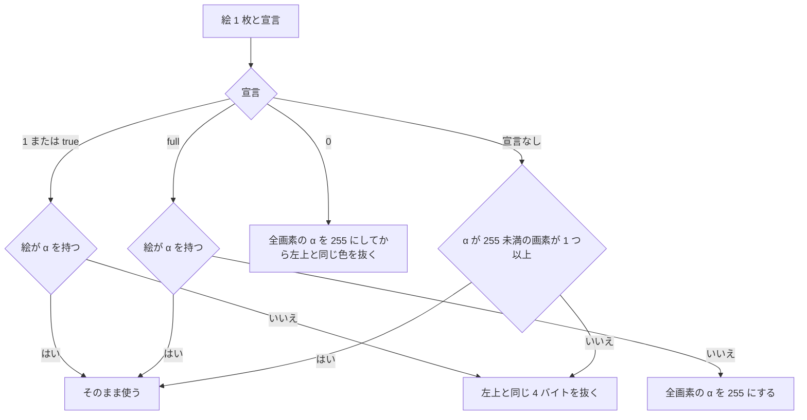

# Design Document: areka-P0-self-alpha-declaration

## Overview

**Purpose**: シェルの descript.txt の `seriko.use_self_alpha` と、バルーンの descript.txt の `use_self_alpha` を読み、絵の透過を宣言どおりに描き分ける。あわせて `surfaces.txt` を持たない（または面を 1 つも定義しない）シェルを `surface<数字>.png` だけで起動できるようにする。

**Users**: ゴースト作者・バルーン作者は、自分の絵の作り方（半透明あり・抜き色・全面不透明）に合った表示を宣言で選べる。利用者は、半透明を使わない前提で作られたバルーンも意図どおりに見られる。

**Impact**: 今は絵を焼く 2 か所（`areka-emo-present` の `shell_target::build_shell_target_with_boxes` と `balloon::build_balloon_target_from_faces`）が `UseSelfAlpha::On` を決め打ちで渡している。これを「読み込みの入口が descript.txt から読んだ値を渡す」形に替える。透過を決める `areka-emo-atlas` の `Normalizer` は、今は 2 通りしか描けず残りを失敗として返すが、4 通りの宣言すべてを描けるようにし、失敗を返さなくなる。

### Goals

- 宣言 `1`／`true`・`full`・`0` を正典（ukadoc）どおりに描く（要件 3・4・5）。
- 宣言が無い（または値が読めない）ときは、絵の中身を見て α か抜き色かを決める（要件 9。areka 独自の決まり）。
- `.pna` は宣言が何であっても無いものとして扱い、絵は普通に描く。無視した数を記録する（要件 5 の 7）。
- 画像だけのシェルを起動できる（要件 6）。
- 説明書・網羅台帳・開発者向けの文書を実態に合わせる（要件 8）。
- 今ある部品を広げるだけにとどめる。新しい層・抽象は足さない。

### Non-Goals

- `.pna` の画素を透明度として使うこと。
- バルーンの `use_input_alpha`、`paint_transparent_region_black`／`seriko.paint_transparent_region_black`。
- シェルの descript.txt そのものが無いシェルの起動（今までどおり、別の場所で起動に失敗する）。
- 明示の `0` のとき、元が透明・半透明だった画素の元の色を取り戻すこと（読み手に「乗算していない色で返す」口は足さない。開発者の裁定 2026-10-05）。
- 読み手（`ElementDecoder`）の `has_alpha` の決め方を変えること。
- 合成の描画メソッド、全画素が透明になる面の窓・当たり判定の確かめ。

## Boundary Commitments

### This Spec Owns

- 透過の宣言の 4 通り（`1`・`full`・`0`・宣言なし）を表す型 `UseSelfAlpha` と、宣言と絵から「画素をどう扱うか」を決める決まり（`areka-emo-atlas` の `normalize.rs`）。
- descript.txt の値の文字列を `UseSelfAlpha` に読み替える決まりと、その記録（`areka-emo-present` の新しい小さいファイル `self_alpha.rs`）。
- シェルの読み込みの入口 `shell_target::load_shell_target` が、透過の宣言を自分で読むこと・`surfaces.txt` が無い／面を定義しないときに画像だけで組むこと。
- バルーンの透過の宣言を読む入口 `balloon::load_balloon_use_self_alpha`（新設）と、焼く関数 `balloon::build_balloon_target_from_faces` が値を引数で受けること。
- 説明書 `dist/README.txt` の該当の節、網羅台帳 `doc/ukadoc-coverage/ledger/assets.toml` の 2 行、`doc/COMPAT_ARCHITECTURE.md` §8 のバルーンの透過の行、`.kiro/steering/tech.md` の該当の記述。

### Out of Boundary

- 面の画像の慣習（番号の読み方・重複・桁溢れ）: 完了 `areka-P0-shell-implicit-surface` の `shell_target::select_surface_images` をそのまま使う。変えない。
- 動く絵の読み込みと上限: 完了 `areka-P0-animated-image-decode` のもの。本仕様は「2 枚目以降のコマにも 1 枚目と同じ画素の扱いを当てる」所だけを広げる。
- 当たり判定のマスクの作り方（`wintf` の `AlphaMask`）と、合成・表示の経路。
- バルーンの設定の 2 層の重ね合わせ（`balloon::load_scope_balloon_model`・`areka_parsers::balloon::parse_str`）。透過の宣言はここに入れない。
- シェルの descript.txt の読取失敗を起動の失敗にしている 2 か所（`areka` の `placement::source::load_descript_source_for_shell` と `emo2_boot::assets::build_shell_assets`）。今のまま。
- 相方の初期の面（番号 10）が無いシェルでの既存の振る舞い。

### Allowed Dependencies

- 依存の向きは今のまま: `areka-parsers` ← `areka-emo-atlas` ← `areka-emo-compose` ← `areka-emo-present` ← `areka`。逆向きの依存を足さない。
- `areka-emo-present` の `self_alpha.rs` は `areka_parsers::kv::parse_kv` と `areka_emo_atlas::UseSelfAlpha` だけに依存する。
- 新しい外部クレートは足さない。`Cargo.toml` は触らない。

### Revalidation Triggers

- `UseSelfAlpha` に場合を足す・`AlphaParams` の形を変える（`SurfaceSet` を組むすべての場所に波及する）。
- `Normalizer::normalize` の署名をさらに変える、または失敗を返す形に戻す。
- `load_shell_target`・`build_balloon_target_from_faces` の署名を変える。
- 読み手の `has_alpha` の決め方を変える（パレットの PNG に透明の情報が付いた絵の扱いが変わる）。
- `.pna` を使うようにする（本仕様の「無いものとして扱う」と正面からぶつかる）。

## Architecture

### Existing Architecture Analysis

- **透過の決定は 1 か所**: `areka-emo-atlas` の `Normalizer`（`normalize.rs`）。絵 1 枚ごとに `bake_with_limits`（`lib.rs`）が呼ぶ。今の `Normalizer::normalize` は `(On, α あり)` と `(On, α なし・.pna なし)` だけ絵を返し、ほかは `NormalizeError::Unsupported` を返す。この失敗の型と、選んだ場合を表す `AlphaSource` を使っているのは `areka-emo-atlas` の中だけである（ほかのクレートからの参照は 0 件。grep で確かめた）。
- **絵は乗算済みで届く**: 静止画は WIC が `32bppPBGRA` に直し（`decode/wic_arm.rs` の `WicDecoderArm::decode_inner`）、動く絵は `decode/image_arm.rs` の `to_bgra` が自前で乗算する。α=0 の画素の色は届いた時点で失われている。
- **動く絵**: 1 枚目のコマだけが `normalize` を通り、2 枚目以降は `animated.rs` の `PendingFrames::new` が「1 枚目の抜き色（`Option<[u8; 4]>`）を消すだけ」で通す。
- **シェルの入口**: `shell_target::load_shell_target(shell_dir, decoder)` が fs を触る唯一の入口で、記録もここだけが出す。呼び手は起動・切り替え（`areka` の `emo2_boot::assets::build_shell_assets`）と採寸（`placement::measure` の `build_shell_assets`）。切り替え（`emo2_boot::switch_assets`）は `build_shell_assets`／`build_balloon_assets` を呼び直すので、入口の中で値を導けば切り替えにもそのまま付いてくる。
- **バルーンの入口**: `balloon::build_balloon_target_from_faces` がスコープごとに 1 回焼く。呼び手は起動・切り替えの `emo2_boot::assets::build_balloon_assets` のスコープのループと、採寸の `placement::measure::measure_balloon_surface0`、それに 1 スコープ用の包み `balloon::build_balloon_target`（examples とテストが使う）。
- **当たり判定**: `wintf` の `AlphaMask` は合成後の α が 128 以上の画素を「当たり」とする（`alpha_mask.rs` の `pack_pbgra32_alpha`）。焼いた画素の α が正しければ、当たり判定は追加の実装なしで付いてくる。

### Architecture Pattern & Boundary Map

今ある流れに「宣言を読む」1 段と「4 通りを描く」決まりを足すだけである。新しい層は無い。



**Architecture Integration**:

- 選んだ形: 今ある部品を広げる（`research.md` 4.6 の案 A）。
- 責務の分け方: 「文字列 → 宣言の値」と記録は `areka-emo-present`、「宣言の値と絵 → 画素の扱い」は `areka-emo-atlas`。`areka` は値を運ぶだけ（バルーンで 1 回読んでスコープのループへ渡す）。
- 保つ決まり: シェルの記録を出すのは `load_shell_target` だけ。fs を触らない核（`build_shell_target*`）はメモリ上の復号器でテストできる。`Normalizer` は設定ファイルを読まない。
- 新しいもの: ファイル `self_alpha.rs`（関数 1 つ＋値の読み）と関数 `load_balloon_use_self_alpha`。シェルとバルーンの 2 つの入口が同じ読み方・同じ記録を使うために 1 か所に置く。型は足さない。
- steering との整合: 記録の無い失敗を作らない（`logging.md`）・テストは実装の隣の兄弟ファイル・1 ファイル 1,000 行以内。

### Technology Stack

| Layer | Choice / Version | Role in Feature | Notes |
|-------|------------------|-----------------|-------|
| 透過の正規化 | `areka-emo-atlas`（既存） | 宣言 4 通りの描き分け | 外部クレートの追加なし |
| 読み込みの入口 | `areka-emo-present`（既存） | 宣言の読取・記録・画像だけのシェル | `areka_parsers::kv::parse_kv` を使う |
| 起動・採寸 | `areka`（既存） | バルーンの値を 1 回読んで運ぶ | 署名の追随だけ |
| 台帳の検査 | `ukadoc-survey`（既存） | 台帳の行を直した後の検査と報告の作り直し | コードは変えない |

## File Structure Plan

### Directory Structure

```
crates/areka-emo-atlas/src/
├── normalize.rs                    # UseSelfAlpha に Undeclared・AlphaRule・Normalizer::plan／apply（AlphaSource・NormalizeError・select_source・key_color を削除）
├── normalize_rule_tests.rs         # 新設: 宣言 4 通り × 絵の場合の表を固定するテスト
├── normalize_key_color_tests.rs    # 既存: key_color を plan に読み替えて直す
├── error.rs                        # BakeError::Normalize を削除
├── lib.rs                          # bake_with_limits の正規化の段・BakeResult.ignored_pna・pub use の整理
├── animated.rs                     # PendingFrames::new が AlphaRule を受ける
└── animated_tests.rs               # 既存: 追随＋ 0／full／宣言なしの動く絵

crates/areka-emo-present/src/
├── self_alpha.rs                   # 新設: 宣言の値の読みと記録（シェルとバルーンで共用）
├── self_alpha_tests.rs             # 新設: 値の読みの表・記録の 3 つの場合
├── lib.rs                          # mod self_alpha の宣言
├── shell_target.rs                 # load_shell_target: 宣言を読む・画像だけのシェル・.pna の記録／核が値を引数で受ける
├── shell_target_load_tests.rs      # 既存: 失敗の条件と記録の回数を直す
├── shell_target_image_only_tests.rs# 新設: 画像だけのシェル・シェルの宣言が焼きに届くこと
├── balloon.rs                      # load_balloon_use_self_alpha（新設）・build_balloon_target_from_faces が値を受ける
├── balloon_alpha_tests.rs          # 新設: バルーンの宣言（基層だけ・上書きされない・.pna の数）
└── balloon_target_tests.rs         # 既存: 呼び出しの追随

crates/areka/src/
├── emo2_boot/assets.rs             # build_balloon_assets: ループの前に 1 回読んで渡す
├── emo2_boot/mod.rs                # BootWiringError::ShellEmpty の文言と doc
└── placement/measure.rs            # ループの前に 1 回読んで measure_balloon_surface0 へ渡す
```

### Modified Files

- `crates/areka-emo-text/tests/staysee_balloon_fixture/bake.rs` — `build_balloon_target_from_faces` の呼び出しに値を足す（`balloon::load_balloon_use_self_alpha` で読んだ値）。
- `crates/areka-emo-present/src/shell_target_base_image_tests.rs`・`shell_target_boxes_tests.rs`・`shell_target_load_tests.rs` — 核（`build_shell_target*`）の直呼びに `UseSelfAlpha::On` を足す。
- 入口（`load_shell_target`・`build_balloon_target`）を一時フォルダで通す既存のテスト（`balloon_target_tests.rs`・`shell_target_load_tests.rs`・`shell_target_boxes_tests.rs`・`shell_target_nesting_tests.rs` など） — 一時フォルダに `seriko.use_self_alpha,1`／`use_self_alpha,1` の descript.txt を置く（下の「書き換え・削除する既存のテスト」）。
- `dist/README.txt` — 「◆ 既知の制限: 半透明を前提に作られたバルーンだけが正しく表示されます」の節を書き直す（見出しも実態に合わせる）。
- `doc/ukadoc-coverage/ledger/assets.toml` — `ukadoc:descript_shell:seriko.use_self_alpha_2c_5024:1` と `ukadoc:descript_balloon:use_self_alpha_2c_5024:1` の 2 行。
- `doc/ukadoc-coverage/report/` — 手では直さない。`cargo run -p ukadoc-survey -- report` と `report-summary` で作り直す。
- `doc/COMPAT_ARCHITECTURE.md` — §8 の「バルーン定義の透過の 3 宣言と `.pna`」の行。
- `.kiro/steering/tech.md` — 「シェルの面はファイル名の慣習でも建つ」の項の透過の記述。
- `crates/areka-emo-present/src/balloon.rs` と `crates/areka-emo-atlas/src/normalize.rs` のモジュール冒頭の説明 — 「`On` 固定」「シーム」の記述を実態に合わせる。

## System Flows

宣言と絵から画素の扱いを決める流れ（`Normalizer::plan`）。動く絵は 1 枚目のコマでこれを決め、全部のコマに同じ扱いを当てる。



- `.pna` の有無はこの決定に入らない（要件 5 の 7）。
- `1` の 2 つの枝は今の実装と同じ処理なので、出る画素は今と 1 バイトも変わらない（要件 3 の 3）。

## Requirements Traceability

| Requirement | Summary | Components | Interfaces | Flows |
|-------------|---------|------------|------------|-------|
| 1.1 | シェルの宣言をシェルの絵すべてに当てる | ShellTarget 入口・Bake | `load_shell_target`・`SurfaceSet.alpha_params` | 境界図 |
| 1.2 | `1`／`true` → 要件 3 | SelfAlpha・Normalizer | `read_use_self_alpha`・`Normalizer::plan` | 決定の流れ |
| 1.3 | `full` → 要件 4 | 同上 | 同上 | 同上 |
| 1.4 | `0` → 要件 5 | 同上 | 同上 | 同上 |
| 1.5 | 行が無い → 要件 9 | 同上 | 同上（`UseSelfAlpha::Undeclared`） | 同上 |
| 1.6 | 読めない値 → 行が無いときと同じ＋記録 | SelfAlpha | `read_use_self_alpha`（`warn!`） | − |
| 1.7 | 切り替えで前の宣言を持ち越さない | ShellTarget 入口 | 入口が呼ばれるたびに読む（状態を持たない） | − |
| 2.1 | バルーンの宣言をバルーンの絵すべてに当てる | Balloon 入口・Bake | `load_balloon_use_self_alpha`・`build_balloon_target_from_faces` | 境界図 |
| 2.2 | `1`／`true` → 要件 3 | SelfAlpha・Normalizer | `read_use_self_alpha`・`Normalizer::plan` | 決定の流れ |
| 2.3 | `full` → 要件 4 | 同上 | 同上 | 同上 |
| 2.4 | `0` → 要件 5 | 同上 | 同上 | 同上 |
| 2.5 | 行が無い → 要件 9 | 同上 | 同上 | 同上 |
| 2.6 | 読めない値 | SelfAlpha | `read_use_self_alpha`（`warn!`） | − |
| 2.7 | 面ごとの設定ファイルで上書きしない | Balloon 入口 | `load_balloon_use_self_alpha` は `descript.txt` だけを読む | − |
| 2.8 | シェルとバルーンの宣言を混ぜない | ShellTarget 入口・Balloon 入口 | キー名と読むフォルダが入口ごとに別 | − |
| 3.1 | `1` × α あり → α をそのまま | Normalizer | `plan` の表 | 決定の流れ |
| 3.2 | `1` × α なし → 抜き色 | Normalizer | `plan` の表 | 決定の流れ |
| 3.3 | 今までと 1 画素も違わない（`.pna` 付きの α なしは抜き色で出る） | Normalizer・Bake | `plan`／`apply`・`.pna` を決定に入れない | 決定の流れ |
| 4.1 | `full` × α あり → α をそのまま | Normalizer | `plan` の表 | 決定の流れ |
| 4.2 | `full` × α なし → 全面不透明 | Normalizer | `plan` の表（`opaque`） | 決定の流れ |
| 4.3 | `.pna` の有無で結果が変わらない | Bake | `.pna` を決定に入れない | − |
| 4.4 | `full` × α なしの動く絵 → 全部のコマが不透明 | Pending | `PendingFrames::new(…, rule)` | − |
| 4.5 | 絵の矩形のどこでもクリックを受ける | Normalizer（結果の α=255）・既存の `AlphaMask` | 追加なし | − |
| 5.1 | `0` × α なし → 抜き色 | Normalizer | `plan` の表 | 決定の流れ |
| 5.2 | `0` × α あり → α を捨てて抜き色 | Normalizer | `plan` の表（`opaque`＋`key`） | 決定の流れ |
| 5.3 | α を捨てた後の左上と同じ色だけを抜く | Normalizer | `apply`（α を 255 にしてから 4 バイト一致） | − |
| 5.4 | 許容幅なし | Normalizer | 既存の `clear_key_color`（完全一致） | − |
| 5.5 | 動く絵は 1 枚目の左上の色を全部のコマから抜く | Pending | `PendingFrames::new(…, rule)` | − |
| 5.6 | 半透明の画素を出さない | Normalizer | `apply`（全画素 α=255 → 抜いた所だけ 0） | − |
| 5.7 | `.pna` は無いものとして扱い、数を 1 度だけ記録 | Bake・ShellTarget 入口・Balloon 入口 | `BakeResult.ignored_pna`・`load_balloon_use_self_alpha` | − |
| 5.8 | 抜いた所はクリックを通す | Normalizer（結果の α=0）・既存の `AlphaMask` | 追加なし | − |
| 6.1 | `surfaces.txt` が無い＋画像あり → 起動 | ShellTarget 入口 | `load_shell_target` | − |
| 6.2 | 面を定義しない `surfaces.txt`＋画像あり → 起動 | ShellTarget 入口 | `load_shell_target` | − |
| 6.3 | 面の扱いは今の決まりと同じ | ShellTarget 入口 | 既存の `select_surface_images`・`EmoWorld::build_with_images` | − |
| 6.4 | 画像だけのシェルも要件 1 の宣言で描く | ShellTarget 入口 | 同じ入口が宣言を読む | − |
| 6.5 | 面も画像も無い → 失敗＋記録 | ShellTarget 入口 | `ShellLoadError::Empty` | − |
| 6.6 | `surfaces.txt` が在るのに読めない → 失敗 | ShellTarget 入口 | `ShellLoadError::Read` | − |
| 6.7 | 面を定義する `surfaces.txt` は今までと同じ | ShellTarget 入口 | 条件の外は無変更 | − |
| 7.1 | 採った扱いと出どころを 1 度だけ記録 | SelfAlpha | `read_use_self_alpha`（`info!`） | − |
| 7.2 | 読めなかった値を記録 | SelfAlpha | `read_use_self_alpha`（`warn!`） | − |
| 7.3 | 画像だけで組んだことと面の数を記録 | ShellTarget 入口 | `load_shell_target`（`info!`） | − |
| 7.4 | 足す失敗の経路すべてに記録 | ShellTarget 入口・Balloon 入口 | Error Handling の表 | − |
| 8.1 | 同梱の えも？？ と Staysee の見た目が変わらない | Normalizer | `1` の枝は無変更・既存の golden | − |
| 8.2 | 宣言なし・α なしの検体の見た目が変わらない | Normalizer | 宣言なし × α なし ＝ `1` × α なしと同じ扱い | − |
| 8.3 | `1` を宣言する検体の見た目が変わらない | Normalizer | 8.1 と同じ | − |
| 8.4 | 説明書の節を書き直す | 文書 | `dist/README.txt` | − |
| 8.5 | `.pna` の既知の制限を実態に合わせて残す | 文書 | `dist/README.txt` | − |
| 8.6 | 台帳の 2 行を直す | 文書 | `assets.toml`・`ukadoc-survey` | − |
| 8.7 | `COMPAT_ARCHITECTURE.md` §8 と `tech.md` を直す | 文書 | 同左 | − |
| 8.8 | `use_input_alpha` は読まないまま | SelfAlpha | 読むキーは 2 つだけ | − |
| 9.1 | 宣言なし × 透明な画素あり → α | Normalizer | `plan` の表 | 決定の流れ |
| 9.2 | 宣言なし × α はあるが全画素不透明 → 抜き色 | Normalizer | `plan` の表 | 決定の流れ |
| 9.3 | 宣言なし × α なし → 抜き色 | Normalizer | `plan` の表 | 決定の流れ |
| 9.4 | 動く絵は 1 枚目で決めて全部のコマに当てる | Bake・Pending | 1 枚目の `plan` を `PendingFrames::new` へ渡す | − |
| 9.5 | 抜き色の決まりは `1` と同じ | Normalizer・既存の `AlphaMask` | 同じ `clear_key_color` | − |

## Components and Interfaces

| Component | Domain/Layer | Intent | Req Coverage | Key Dependencies | Contracts |
|-----------|--------------|--------|--------------|------------------|-----------|
| Normalizer（`normalize.rs`） | areka-emo-atlas | 宣言と絵から画素の扱いを決めて当てる | 3.1〜3.3・4.1〜4.5・5.1〜5.6・5.8・8.1〜8.3・9.1〜9.5 | `DecodedImage`（P0） | Service |
| Bake・Pending（`lib.rs`・`animated.rs`） | areka-emo-atlas | 絵ごとに決まりを当てる・`.pna` を数える | 1.1・2.1・4.3・4.4・5.5・5.7・9.4 | Normalizer（P0）・`ElementDecoder::probe_pna`（P1） | Service |
| SelfAlpha（`self_alpha.rs`） | areka-emo-present | 宣言の値を読んで記録する | 1.2〜1.6・2.2〜2.6・7.1・7.2・8.8 | `parse_kv`（P0） | Service |
| ShellTarget 入口（`shell_target.rs`） | areka-emo-present | シェルの宣言を読む・画像だけのシェル | 1.1・1.7・2.8・5.7・6.1〜6.7・7.3・7.4 | SelfAlpha（P0）・Bake（P0） | Service |
| Balloon 入口（`balloon.rs`） | areka-emo-present | バルーンの宣言を 1 回読む・値を受けて焼く | 2.1・2.7・2.8・5.7・7.4 | SelfAlpha（P0）・Bake（P0） | Service |
| 値を運ぶ呼び手（`assets.rs`・`measure.rs`） | areka | バルーンの値をスコープのループの外で 1 回読んで渡す | 2.1・7.1 | Balloon 入口（P0） | − |
| 文書 | dist・doc・steering | 説明書・台帳・開発者向けの文書 | 8.4〜8.7 | `ukadoc-survey`（P1） | − |

### areka-emo-atlas

#### Normalizer（`crates/areka-emo-atlas/src/normalize.rs`）

| Field | Detail |
|-------|--------|
| Intent | 宣言（4 通り）と絵 1 枚から「画素をどう扱うか」を決め、画素に当てる |
| Requirements | 3.1, 3.2, 3.3, 4.1, 4.2, 4.5, 5.1, 5.2, 5.3, 5.4, 5.6, 5.8, 8.1, 8.2, 8.3, 9.1, 9.2, 9.3, 9.5 |

**Responsibilities & Constraints**

- 決めるのは 1 か所（`plan`）。静止画も、動く絵の全部のコマも、ここで決めた同じ扱い（`AlphaRule`）を `apply` で当てる。
- 設定ファイルを読まない。`.pna` の有無を受け取らない。
- 入力も出力も乗算済みの BGRA。色の乗算・割り戻しはしない。
- 失敗を返さない（描けない組み合わせが無くなるため）。`AlphaSource`・`NormalizeError`・`Normalizer::select_source`・`Normalizer::key_color`・`BakeError::Normalize` は削除する。

**Contracts**: Service [x]

##### Service Interface

```rust
/// `use_self_alpha` の宣言（ukadoc の 1／true・full・0）と、宣言が無い場合。
#[derive(Clone, Copy, Debug, PartialEq, Eq)]
pub enum UseSelfAlpha {
    On,          // 1／true
    Full,        // full
    Off,         // 0 と明示
    Undeclared,  // 行が無い・値が読めない（areka 独自: 絵の中身を見て決める）
}

/// 1 枚目の絵で決め、その絵と（動く絵なら）全部のコマに当てる画素の扱い。
#[derive(Clone, Copy, Debug, PartialEq, Eq)]
pub(crate) struct AlphaRule {
    /// 全画素の α を 255 にする（色のバイトは触らない）。
    pub opaque: bool,
    /// この 4 バイトと完全に同じ画素を 0,0,0,0 にする。
    pub key: Option<[u8; 4]>,
}

impl Normalizer {
    /// 宣言と絵から扱いを決める（純粋・画素を変えない）。
    pub(crate) fn plan(img: &DecodedImage, params: AlphaParams) -> AlphaRule;
    /// `plan` で決めて `apply` で当てた絵を返す。
    pub fn normalize(&self, img: DecodedImage, params: AlphaParams) -> NormalizedImage;
}

/// 扱いを画素に当てる（`opaque` → `key` の順）。行の詰め物は読まない。
pub(crate) fn apply(bgra: &mut [u8], width: u32, height: u32, stride: u32, rule: AlphaRule);
```

`plan` の表（これが本仕様の中心の決まり）:

| 宣言 | 絵 | `opaque` | `key` |
|---|---|---|---|
| `On` | `has_alpha` が真 | 偽 | 無し |
| `On` | `has_alpha` が偽 | 偽 | 左上の 4 バイト |
| `Full` | `has_alpha` が真 | 偽 | 無し |
| `Full` | `has_alpha` が偽 | 真 | 無し |
| `Off` | どちらでも | 真 | 左上の B・G・R と α=255 |
| `Undeclared` | α が 255 未満の画素が 1 つ以上（`has_alpha` は見ない） | 偽 | 無し |
| `Undeclared` | 上のほか | 偽 | 左上の 4 バイト |

- Preconditions: `img.bgra.len() == img.stride * img.height`（読み手の今の約束）。
- Postconditions:
  - `On` の 2 行は今の実装と同じ処理（そのまま渡す／`clear_key_color`）。出る画素は今と同じ。
  - `Off` の結果は、どの画素も α が 255 か 0（半透明なし）。抜かれるのは「α を 255 にした後の左上」と 4 バイトとも同じ画素だけ。
  - `Full` × `has_alpha` 偽の結果は、全画素 α=255。
  - 幅か高さが 0 の絵は `key` を持たない（今と同じ）。
- Invariants: `On`・`Full` の「α を持つ絵」は読み手が返す `has_alpha` で決める（今の `On` と同じ物差し）。`Undeclared` は `has_alpha` を見ず、届いた画素だけで決める: α<255 の画素を行ごとに探し、1 つ見つけたら止める。α を持たない絵は全画素 α=255 で届くので抜き色の側になる（要件 9 の 3）。`has_alpha` の出どころは静止画（WIC の画素形式の一覧）と動く絵（`image` クレートの色の形式）で違うので、挟むと同じ種類の絵の扱いが分かれうる。挟まなければ分かれない。

**Implementation Notes**

- Integration: `clear_key_color` は今のまま使う。「α を 255 にする」は行ごとに 4 バイト目を書くだけの数行。
- Validation: 表の 7 行を 1 行 1 テストで固定する（`normalize_rule_tests.rs`）。`On` の 2 行は「入力と出力のバイトが今の期待と同じ」ことを見る。
- Risks: パレットの PNG に透明の情報（`tRNS`）が付いた絵は、WIC の画素形式の一覧（`wic_arm.rs` の `pixel_format_has_alpha`）に索引つきの形式が無いので `has_alpha` が偽で届く見込みで、α<255 の画素を含みうる。`Full` と `Off` は α を 255 に書くので、この絵でも要件 4 の 2・5 の 6 は読み手の返し方に依らず成り立つ（透明だった所は乗算済みの色＝多くは黒で出る）。`On` では今と同じ（抜き色の枝を通り、α<255 の画素はそのまま残る）。`Undeclared` は届いた画素を見るので、この絵は α の側になり、透明の情報がそのまま使われる（要件 9 の 1 のとおり）。読み手は変えない。

#### Bake・Pending（`crates/areka-emo-atlas/src/lib.rs`・`animated.rs`）

| Field | Detail |
|-------|--------|
| Intent | 絵ごとに 1 枚目で扱いを決めて全部のコマに当てる。`.pna` が添えてある絵を数える |
| Requirements | 1.1, 2.1, 4.3, 4.4, 5.5, 5.7, 9.4 |

**Responsibilities & Constraints**

- `bake_with_limits` は絵ごとに `Normalizer::plan(&decoded, set.alpha_params)` を 1 回呼び、その `AlphaRule` を 1 枚目に当て、動く絵なら `PendingFrames::new` へ同じ `AlphaRule` を渡す（今の `key_color: Option<[u8; 4]>` の引数を置き換える）。
- `decoder.probe_pna(&path)` は呼び続けるが、決定には使わず、真だった絵の数を数えるだけにする。
- 抜いた色の `debug!`（今の「抜き色で透過しました」）は `rule.key` が在るときに出す。
- 「正規化で落ちた絵は動く絵の合計に数えない」の枝は、正規化が失敗しなくなるので無くなる（読めた動く絵は必ず合計に足す）。

**Contracts**: Service [x]

##### Service Interface

```rust
pub struct BakeResult {
    pub table: AtlasTable,
    pub errors: Vec<BakeError>,
    /// 焼いた絵のうち、同じ名前の `.pna` が添えてあったものの数（`.pna` は使っていない）。
    pub ignored_pna: usize,
}

// animated.rs
impl PendingFrames {
    pub(crate) fn new(
        parent: ElementId, key: AtlasKey, first_delay_ms: u32,
        rest: Vec<AnimationFrame>, loop_count: LoopCount,
        rule: AlphaRule,
    ) -> Self;
}
```

- Postconditions: 動く絵の全部のコマに 1 枚目と同じ `AlphaRule` が当たる（`Off` なら全部のコマで α を 255 にしてから 1 枚目の左上の色を抜く。`Full` × α なしなら全部のコマが不透明。`Undeclared` は 1 枚目で決めた側）。
- `BakeError` は `Decode` だけになる。

**Implementation Notes**

- Integration: `BakeResult` を組み立てているのは `bake_with_limits` の末尾だけ。欄を足しても外の呼び手は壊れない（テストの 1 か所 `let BakeResult { table, errors } = …` に `..` を足す）。
- Validation: `animated_tests.rs` の `picture_dropped_by_normalize_is_not_counted_in_the_total` は、確かめていた枝が無くなるので削除する。代わりに「`.pna` を添えた動く絵も全部のコマで載り、`ignored_pna` が 1」を見る。
- Risks: `ElementDecoder` の口（`probe_pna` を含む）は変えない。

### areka-emo-present

#### SelfAlpha（`crates/areka-emo-present/src/self_alpha.rs`・新設）

| Field | Detail |
|-------|--------|
| Intent | descript.txt の本文から透過の宣言を読み、採った扱いを 1 度だけ記録する |
| Requirements | 1.2, 1.3, 1.4, 1.5, 1.6, 2.2, 2.3, 2.4, 2.5, 2.6, 7.1, 7.2, 8.8 |

**Responsibilities & Constraints**

- シェルとバルーンは、キー名と記録の `kind` の欄だけが違う同じ関数を通る。
- 値の比べ方: 前後の空白を除き、英字の大小を区別しない。`1`・`true` → `On`、`full` → `Full`、`0` → `Off`。ほか（`false`・空・`2` など）は読めない値。
- fs を触らない（本文は呼び手が読んで渡す）。型は足さない。

**Contracts**: Service [x]

##### Service Interface

```rust
/// `descript` は descript.txt の本文（読めなかったら `None`）。`kind` は "shell" か "balloon"。
/// 呼ぶたびに `info!` を 1 行（採った扱い・宣言によるかどうか）、値が読めないときは `warn!` を 1 行出す。
pub(crate) fn read_use_self_alpha(
    kind: &'static str,
    key: &'static str,
    dir: &Path,
    descript: Option<&str>,
) -> UseSelfAlpha;

/// 値の読み（純粋）。読めない値は `None`。`Undeclared` は返さない。
fn parse(value: &str) -> Option<UseSelfAlpha>;
```

| 入力 | 戻り値 | 記録 |
|---|---|---|
| キーの行が在り、値が読める | `On`／`Full`／`Off` | `info!`（`treatment` ＝ `1`／`full`／`0`、`declared = true`） |
| キーの行が無い（本文が `None` を含む） | `Undeclared` | `info!`（`treatment = "none"`、`declared = false`） |
| キーの行が在り、値が読めない | `Undeclared` | `warn!`（書いてあった値・宣言なしとして扱うこと）＋上と同じ `info!` |

- 記録の欄: `kind`・`key`・`dir`・`treatment`・`declared`、`warn!` には `value`。文言は `self_alpha:` で始める。
- 同じキーが 2 行在るときは後の行が勝つ（`parse_kv` の今の決まり）。

#### ShellTarget 入口（`crates/areka-emo-present/src/shell_target.rs`）

| Field | Detail |
|-------|--------|
| Intent | シェルの宣言を読んで焼きへ渡す。`surfaces.txt` が無い／面を定義しないシェルを画像だけで組む |
| Requirements | 1.1, 1.7, 2.8, 5.7, 6.1, 6.2, 6.3, 6.4, 6.5, 6.6, 6.7, 7.3, 7.4 |

**Responsibilities & Constraints**

- `load_shell_target(shell_dir, decoder)` の署名は変えない。呼び手（起動・切り替え・採寸・examples）は無変更で、起動と採寸が別々の値を持つ余地が無い。
- 入口は呼ばれるたびに `shell_dir/descript.txt` を読む（状態を持たないので、切り替えで前の宣言は残らない）。キーは `seriko.use_self_alpha`。読み方は `emo2_boot::assets::build_shell_assets` の前例と同じく `std::fs::read` → `areka_parsers::charset::decode(…, DefaultEncoding::Ansi)`（`read_to_string` は使わない。Shift_JIS の descript.txt は昔からのシェルでは普通で、UTF-8 として読むと宣言が届かなくなる）。
- `descript.txt` が読めないときは `warn!` を出し、宣言なしとして続ける（ここでは失敗にしない。descript.txt の無いシェルを起動の失敗にしている 2 か所は別の場所に在り、今のまま働く）。
- fs を触らない核 `build_shell_target` と `build_shell_target_with_boxes` は、末尾に引数 `use_self_alpha: UseSelfAlpha` を足して受ける（決め打ちの `On` を消す）。
- 記録を出すのは今までどおり `load_shell_target` だけ。

**Contracts**: Service [x]

##### Service Interface

```rust
pub fn load_shell_target(shell_dir: &Path, decoder: &impl ElementDecoder)
    -> Result<ShellTarget, ShellLoadError>;                       // 署名は今のまま

pub fn build_shell_target(shell: Shell, selection: SurfaceImageSelection,
    shell_dir: &Path, decoder: &impl ElementDecoder, use_self_alpha: UseSelfAlpha) -> ShellTarget;

pub fn build_shell_target_with_boxes(shell: Shell, boxes: &ShellBoxes,
    selection: SurfaceImageSelection, shell_dir: &Path, decoder: &impl ElementDecoder,
    use_self_alpha: UseSelfAlpha) -> ShellTarget;
```

`load_shell_target` の中の `surfaces.txt` の扱い（変わるのはこの表の 2・3・4 行目だけ）:

| `surfaces.txt` | 面の画像 | 結果 | 記録 |
|---|---|---|---|
| 面を 1 つ以上定義する | 問わない | 今までと同じ | 今までと同じ |
| 無い（`ErrorKind::NotFound`） | 1 つ以上 | 空の定義として続け、画像だけで組む | `info!`（`surfaces_txt = "missing"`・認めた面の数） |
| 在るが面を定義しない | 1 つ以上 | 画像だけで組む | `info!`（`surfaces_txt = "empty"`・認めた面の数） |
| 無い、または面を定義しない | 0 | `ShellLoadError::Empty` | `error!`（面が 1 つも無い） |
| 在るのに読めない（`NotFound` 以外） | 問わない | `ShellLoadError::Read`（今までと同じ） | `error!`（今までと同じ） |

- `ShellLoadError` の枝は増やさない。`Empty` の意味を「面が 1 つも無い（`surfaces.txt` が面を定義せず、面の画像も無い）」に広げ、文言と doc を直す。`path` はシェルのフォルダにする（`surfaces.txt` が無い場合があるため）。
- `ShellTarget` に `ignored_pna: usize`（`BakeResult.ignored_pna` の写し）を足し、0 でなければ `load_shell_target` が `warn!` を 1 行出す（数つき）。
- Postconditions: 画像だけで組んだシェルの面は、今の「`surfaces.txt` に書かれていない番号を画像から認める」枝（`EmoWorld::build_with_images` → `base_image::apply_base_images` の「宣言の無い番号は新設」）がそのまま作る。新しい組み立ては足さない。

**Implementation Notes**

- Integration: `areka` の `emo2_boot/mod.rs` の `BootWiringError::ShellEmpty` は文言と doc だけ直す（「シェルに面が 1 つも無い」）。`From<ShellLoadError>` の写しは変えない。
- Validation: 「読めない」は、`surfaces.txt` という名前のフォルダを置いて作る（`std::fs::read` が `NotFound` 以外で失敗する）。
- Risks: 面 0 だけの画像だけのシェルで相方（番号 10）が無いとき、採寸は今の代替（スコープ 0 の寸法で代える `warn!`）を通る。本仕様は変えない。

#### Balloon 入口（`crates/areka-emo-present/src/balloon.rs`）

| Field | Detail |
|-------|--------|
| Intent | バルーンの宣言をバルーン 1 つにつき 1 回読む。焼く関数は値を引数で受ける |
| Requirements | 2.1, 2.7, 2.8, 5.7, 7.4 |

**Responsibilities & Constraints**

- 新設 `load_balloon_use_self_alpha(balloon_dir)` は、`balloon_dir/descript.txt`（基層）だけを読む。面ごとの設定ファイル（`balloons0s.txt` など）と `BalloonModel` の 2 層の重ね合わせは通さないので、上書きは構造として起きない。キーは `use_self_alpha`。
- 同じ関数が、バルーンのフォルダ直下の `.pna`（拡張子は大小を区別しない）の数を数え、0 でなければ `warn!` を 1 行出す。スコープごとに焼く関数の中では数えない（スコープごとに繰り返さないため）。
- `descript.txt` が読めないときは、今ある `read_descript_layer` の `warn!` を通して宣言なしとして続ける。フォルダの一覧が取れないときは今ある `enumerate_file_names` の `error!` が出て、`.pna` の数は 0 として続ける（続く系列の解決が同じ理由で失敗を返す）。
- `build_balloon_target_from_faces` は末尾に引数 `use_self_alpha: UseSelfAlpha` を足す。1 スコープ用の包み `build_balloon_target(balloon_dir, decoder, scope)` は署名を変えず、中で `load_balloon_use_self_alpha` を呼ぶ。

**Contracts**: Service [x]

##### Service Interface

```rust
/// バルーン 1 つの読み込みにつき 1 回呼ぶ（スコープのループの外）。記録はここで 1 度だけ出る。
pub fn load_balloon_use_self_alpha(balloon_dir: &Path) -> UseSelfAlpha;

pub fn build_balloon_target_from_faces(balloon_dir: &Path, decoder: &impl ElementDecoder,
    faces: &[ResolvedFace], use_self_alpha: UseSelfAlpha)
    -> Result<(EmoWorld, AtlasTable), PresentError>;
```

- Postconditions: `.pna` のせいで焼きが失敗する経路は無くなる（正規化が失敗しないため）。バルーン全体が `.pna` のために使えなくなることは無い。
- バルーンの `.pna` の数は「フォルダ直下に在る `.pna` のファイルの数」で、areka が読まない絵（矢印など）に添えた物も含む。記録の文言にそう書く。

### areka（値を運ぶ呼び手）

- `emo2_boot::assets::build_balloon_assets`: スコープのループの前に `load_balloon_use_self_alpha(balloon_root)` を 1 回呼び、ループの中の `build_balloon_target_from_faces` へ渡す。切り替え（`emo2_boot::switch_assets`）はこの関数を呼び直すので、切り替えた先のバルーンの宣言で描く。
- `placement::measure::measure_native_scope_sizes`: 同じく、ループの前に 1 回呼び、`measure_balloon_surface0` へ引数で渡す。
- シェルの側は `areka` に変更が無い（入口が自分で読む）。
- 起動・切り替えと採寸は別々に 1 回ずつ読むので、記録は読み込みの入口 1 回につき 1 行になる（要件 7 の 1 の数え方）。

### 文書

- `dist/README.txt`: 節の見出しを実態に合わせて替え、次を書く — 宣言どおりに表示すること／宣言が無いバルーンは、絵が透明な画素を持てばそれを使い、持たなければ左上の色を抜いて表示すること／`.pna` の中身は表示に使わず、添えてある絵は `.pna` が無いときと同じに表示して、使わなかったことを記録すること。「設定を読まない」「常に半透明を使うものとして表示する」「表示をやめて理由を記録します」は無くす。
- `assets.toml` の 2 行: 状態は 2 行とも `degraded`（宣言の 3 通りは正典どおりに描くが、宣言が無いときの決まりが areka 独自で、`.pna` を使わないため）。担当は `areka-P0-self-alpha-declaration`。説明に、読む場所（`shell_target::load_shell_target`／`balloon::load_balloon_use_self_alpha`）・描き分け・残り（`.pna`・宣言なしの独自の決まり）を書く。直した後は `cargo test -p ukadoc-survey` を通し、報告は `ukadoc-survey` の `report`・`report-summary` で作り直す（数を手で直さない）。
- `doc/COMPAT_ARCHITECTURE.md` §8: バルーンの透過の行を「`use_self_alpha` は読む。`use_input_alpha` と `paint_transparent_region_black` は読まない。`.pna` は使わない」に直し、「宣言が無いときは絵の中身を見て決める（シェル・バルーン共通・areka 独自・開発者の裁定 2026-10-05）」を登記する。
- `.kiro/steering/tech.md`: 「宣言に依らず常に `use_self_alpha,1` 相当」「`.pna`・`full`・`0` は型の口だけ」を実態に直す。

## Error Handling

### Error Strategy

本仕様は失敗の種類を増やさない。足す・変える経路と記録は次のとおり。

| 起きること | 扱い | 記録 |
|---|---|---|
| 宣言の値が読めない | 宣言なしとして続ける | `warn!`（値つき） |
| シェルの `descript.txt` が読めない（入口の中） | 宣言なしとして続ける | `warn!`（理由つき） |
| バルーンの `descript.txt` が読めない | 宣言なしとして続ける | 既存の `read_descript_layer` の `warn!` |
| `surfaces.txt` が無い／面を定義しない＋画像あり | 画像だけで組む | `info!` |
| 面も面の画像も無い | `ShellLoadError::Empty` | `error!` |
| `surfaces.txt` が在るのに読めない | `ShellLoadError::Read`（今までと同じ） | `error!` |
| `.pna` が添えてある | 無いものとして描く | `warn!`（数つき・読み込み 1 回につき 1 行） |

- `Normalizer` は失敗を返さなくなる。`BakeError::Normalize` を経て絵が落ちる経路（シェルでは絵 1 枚、バルーンでは全体）は無くなる。

### Monitoring

- 記録の宛先は各モジュールの既定の target。シェルの入口の文言は `shell:`、バルーンは `balloon:`、宣言の読みは `self_alpha:` で始め、値は構造化フィールドで渡す（steering `logging.md`）。
- シェルの入口の記録は「読み込み 1 回につき 1 度」を既存のテスト（`shell_target_load_tests.rs` の `every_record_is_emitted_once_per_load`）が数えている。足した記録の分だけ期待を直す。

## Testing Strategy

テストは判断の分かれ目だけを固定する。合成・表示・当たり判定のマスクなど、既に固定されている配線は確かめ直さない。すべてメモリ上の復号器（`MemoryDecoder`）か一時フォルダで決定論に走る。一時フォルダは `target\` の下に作る既存の道具を使う。

### Unit Tests

1. `normalize_rule_tests.rs` — `plan` の表の 7 行を 1 行ずつ（3.1・3.2・4.1・4.2・5.1・5.2・9.1・9.2・9.3）。宣言なしは `has_alpha` が偽でも α<255 の画素が在れば α の側になること。宣言なし × α なしの `AlphaRule` が `On` × α なしと等しいこと（8.2・9.5）。
2. 同 — `Off` × α ありの絵の結果: 半透明・完全な透明だった画素が不透明になり、α を 255 にした後の左上と 4 バイトとも同じ画素だけが `0,0,0,0`、α は 255 か 0 だけ（5.2・5.3・5.4・5.6）。色が 1 だけ違う画素は抜かれない（5.4）。
3. 同 — `Full` × α なしで、左上と同じ色の画素も α=255 のまま（4.2）。`has_alpha` が偽なのに α<255 の画素を持つ入力でも全画素 α=255 になる（パレットの絵の備え）。
4. 同 — `On` の 2 行は入力と出力のバイトが今の期待と一致（3.3）。行の詰め物（`stride > width * 4`）を触らない。
5. `self_alpha_tests.rs` — 値の読みの表: `1`・`true`・`TRUE`・`full`・`Full`・` 0 `・`false`・空・`2`（1.2〜1.6・2.2〜2.6）。記録の 3 つの場合（宣言あり・行なし・読めない値）で `info!` が 1 行、読めない値のときだけ `warn!` が 1 行（7.1・7.2）。`use_input_alpha` だけが書いてある本文は行なしと同じ（8.8）。

### Integration Tests

1. `animated_tests.rs` — `Off` の動く絵: 1 枚目の左上の色が全部のコマから抜け、どのコマにも半透明が無い（5.5）。`Full` × α なしの動く絵: 全部のコマが不透明（4.4）。宣言なし: 1 枚目が透明な画素を持てば全部のコマが α のまま、持たなければ全部のコマから 1 枚目の左上の色が抜ける（9.4）。
2. `animated_tests.rs`・`lib.rs` のテスト — `.pna` を添えた絵（α なし）が、`On`・`Full`・`Off`・宣言なしのどれでも `.pna` が無いときと同じ画素で載り、失敗の一覧が空で、`ignored_pna` が添えた数に等しい（3.3・4.3・5.7）。
3. `shell_target_image_only_tests.rs` — `surfaces.txt` が無い＋`surface0.png`／空の `surfaces.txt`＋`surface0.png`／波括弧 0 個の `surfaces.txt`＋画像、のそれぞれで読み込みが成功し面 0 が在る（6.1・6.2・6.3）。画像も無ければ `Empty`、`surfaces.txt` がフォルダなら `Read`（6.5・6.6）。画像だけで組んだときの `info!` が 1 行で面の数を持つ（7.3）。
4. 同 — `descript.txt` に `seriko.use_self_alpha,full` と書いた一時フォルダのシェルで、α なしの面の画像の左上が抜かれない／`0` と書けば α ありの絵が不透明になる／行が無ければ宣言なしの決まりになる（1.1・1.3・1.4・1.5・6.4）。同じフォルダの `descript.txt` を書き換えて入口を呼び直すと、後の宣言で描く（1.7）。日本語の行を含む Shift_JIS の `descript.txt` に書いた `seriko.use_self_alpha,full` が読める（文字コードの読み方の固定）。`use_self_alpha,full`（バルーンのキー）だけを書いたシェルは宣言なしになる（2.8）。
5. `balloon_alpha_tests.rs` — `descript.txt` に `use_self_alpha,0`、`balloons0s.txt` に `use_self_alpha,1` と書いたバルーンで、`load_balloon_use_self_alpha` が `Off` を返す（2.1・2.4・2.7）。`seriko.use_self_alpha,full` だけを書いたバルーンは宣言なし（2.8）。`.pna` を 2 つ置くと `warn!` が 1 行で数が 2、1 つも無ければ出ない（5.7）。`build_balloon_target_from_faces` に `Full` を渡すと α なしの面の左上が抜かれない（2.3）。
6. `shell_target_load_tests.rs`（既存の直し） — `missing_surfaces_txt_yields_read_error` と `surfaces_txt_without_any_surface_yields_empty_error` を新しい条件に合わせる。`every_record_is_emitted_once_per_load` と `emo2_shell_records_two_shadowed_images_and_no_warnings` に、宣言の `info!` 1 行を足す。

### 見た目が変わらないことの確かめ（要件 8 の 1〜3）

- 既存の golden と検体のテスト（`areka-emo-atlas` の `emo2_golden.rs`・`emo2_e2e.rs`、`areka-emo-present` の `shell_target_emo2_tests.rs`・`shell_target_template_tests.rs`、`areka-emo-text` の Staysee の検体のテスト、`areka` の `placement/measure_template_tests.rs`）が、入口を通して今と同じ結果を出すこと。これらは検体の descript.txt の宣言（`1`、または宣言なし）を本物の経路で読むようになる。
- 実機での確かめ（タスクの最後に 1 回）: 同梱の えも？？ と Staysee、`R_POST_and_KOMAINU`・`konnoyayame`、`claudia` を起動して見た目を見る。あわせて、`target\` の下に作った画像だけのシェル（`descript.txt` と `surface0.png`）と、`use_self_alpha,0`／`full` に書き換えたバルーンの写しで、記録と見た目を見る。

### 書き換え・削除する既存のテスト

- `normalize.rs` の中の `tests`: `on_no_alpha_with_pna_selects_pna_seam`・`full_with_alpha_selects_alphachannel_but_seam`・`full_no_alpha_selects_opaque_seam`・`off_with_pna_ignores_own_alpha_selects_pna_seam`・`off_no_pna_selects_keycolor_seam` は、失敗を期待する形から結果を見る形へ（`normalize_rule_tests.rs` に置き換える）。
- `normalize_key_color_tests.rs`: `key_color_is_some_only_on_the_key_color_arm` を `plan` の `key` を見る形へ。
- `animated_tests.rs`: `picture_dropped_by_normalize_is_not_counted_in_the_total` を削除（枝が無くなる）。
- `AlphaParams { use_self_alpha: UseSelfAlpha::On }` を直に組んでいる約 40 のテストファイルは、`AlphaParams` の形を変えないので無変更。
- **入口を一時フォルダで通す既存のテストの棚卸し（タスクに 1 つ立てる）**: descript.txt を置かない一時フォルダは「宣言なし」になる。そこで使う絵はほぼ「全画素不透明・1 色」（例: `balloon_target_tests.rs` の `opaque_1x1()`）なので、宣言なしの表では抜き色の側に当たり、絵が全部透明になってテストが赤くなる（例: `build_balloon_target_end_to_end_frames_only`）。`areka-emo-present` で `load_shell_target`・`build_balloon_target` を一時フォルダで呼ぶテストを洗い出し、フォルダに `seriko.use_self_alpha,1`／`use_self_alpha,1` の descript.txt を置く（今までの `On` 固定と同じ条件に戻る。descript.txt が読めない `warn!` も出なくなる）。`areka` クレートの側の一時フォルダの検体は えも？？ の写し（宣言 `1`）なので変わらない見込みだが、同じ棚卸しで確かめる。

## Performance & Scalability

- 宣言なしのときだけ、絵（動く絵は 1 枚目）ごとに α<255 の画素を探す走査が 1 回増える（1 つ見つけたら止まる）。`0` と、`full` × α なしでは、α を 255 に書く走査が絵・コマごとに 1 回増える。どちらも読み込みのときだけで、表示のたびには走らない。
- `1` を宣言している資産（同梱の えも？？・Staysee）では走査は増えない。

## 設計ディスカッションへの申し送り

設計で決めを置いた点。**設計ディスカッション（2026-10-05）で 7 件とも精査し、開発者へ出す議題は無かった**（1〜5 は設計のとおり確定。6 は要件の文面を直した。7 は既存のテストの棚卸しで `warn!` ごと消える）。検証レポートの 3 件（赤くなる既存のテストの棚卸し・シェルの descript.txt の文字コード・宣言なしの判定から `has_alpha` を外す）は本文へ反映済み。

1. **`full` × α なしは α を 255 に書く**（そのまま渡すのではなく）。α の無い絵は元から全画素 α=255 のはずなので普通は何も変わらないが、パレットの PNG に透明の情報が付いた絵（`has_alpha` が偽で届く見込み）でも要件 4 の 2 が成り立つようにした。その絵は透明だった所が黒などで出る。読み手の `has_alpha` の決め方は変えていない。
2. **`.pna` の数え方がシェルとバルーンで違う**。シェルは「焼いた絵のうち `.pna` が添えてあった数」（サブフォルダの絵も含めて正確）。バルーンは「フォルダ直下の `.pna` のファイルの数」（スコープごとに焼くので、1 回だけ数えられる場所がここになる）。
3. **台帳の 2 行の状態は `degraded`** とした（宣言なしの決まりが areka 独自・`.pna` を使わないため）。
4. **`NormalizeError`・`AlphaSource`・`BakeError::Normalize` を削除する**。描けない組み合わせが無くなり、使い手が `areka-emo-atlas` の外に 0 件のため。
5. **`ShellLoadError::Empty` は枝を増やさず意味を広げる**。`path` は `surfaces.txt` からシェルのフォルダに変わる。
6. **要件 6 の 4 の括弧書き「無ければ既定の `0`」は裁定の前の言い回しが残っている**。本設計は要件 1 の 5 と要件 9（裁定の後の文面）に従い、画像だけのシェルでも宣言が無ければ絵の中身を見て決める。要件 8 の Objective の「既定が `0` に変わっても」と、要件の申し送り 5 の「既定（`0`）として扱い」も同じ残りである。要件の文面を直すかどうかを確認したい（設計の中身は変わらない）。
7. **シェルの `descript.txt` が入口の中で読めないときは `warn!` を出して宣言なしで続ける**。本番ではその前後の別の場所が同じ理由で起動を失敗にするので実害は無いが、`descript.txt` を置かない一時フォルダのシェルを使う既存のテストでは `warn!` が 1 行増える（記録の数を数えているテストは期待を直す）。
