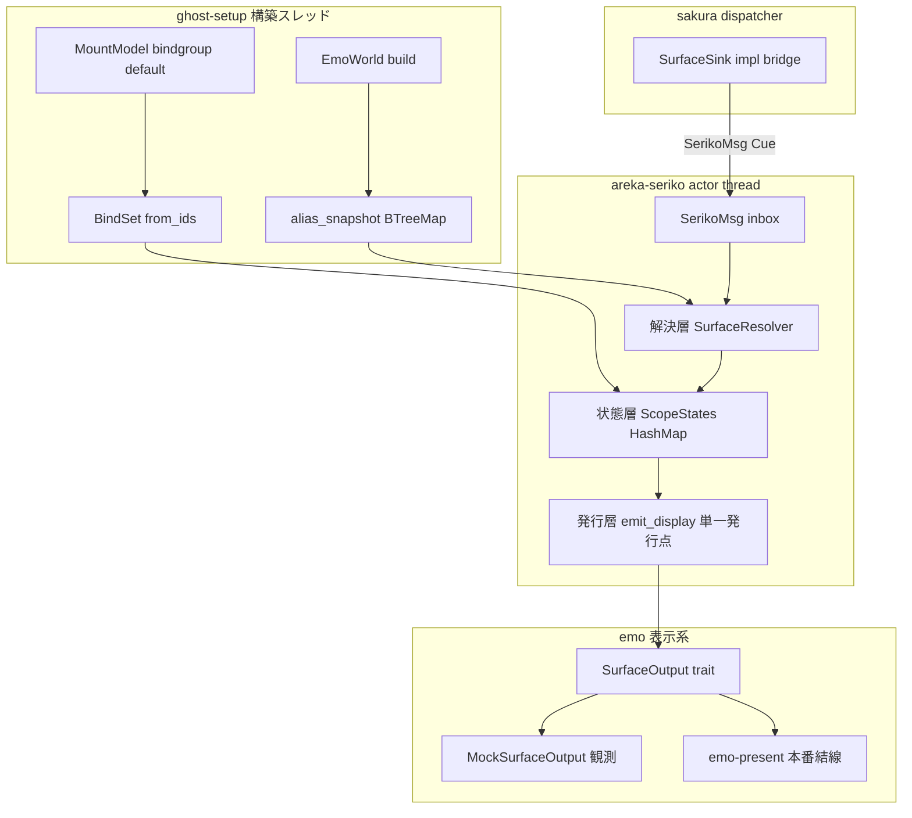
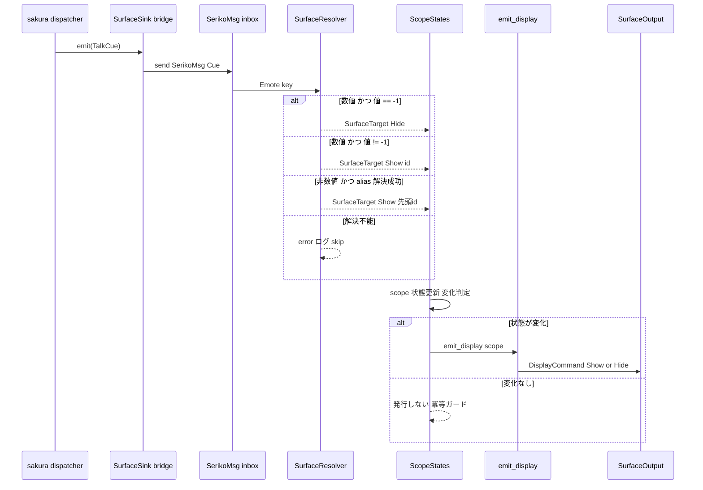
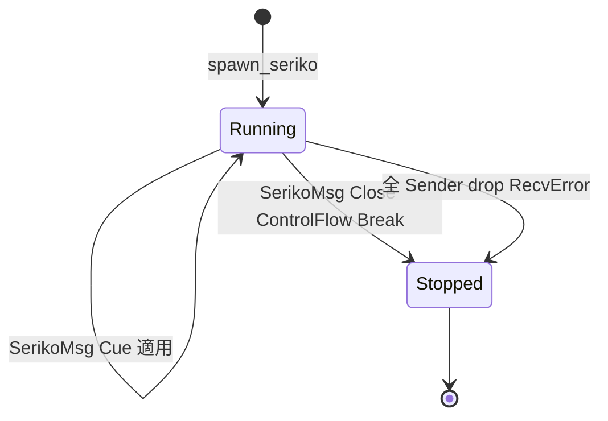

# Technical Design Document

## Overview

**Purpose**: 本仕様は areka の ⑤ seriko トラック **M-boot ユニット（`areka-P0-seriko-engine`）** を実装し、sakura（④）が `SurfaceSink` へ流す surface 指令（`\s[ID]` 相当の `TalkCue`）を受けて「今どのスコープにどの surface を出すか」という per-scope の surface 状態を所有し、shell descript 由来の静的 bind 集合とあわせて emo（⑥）への表示指令を発行する actor を提供する。

**Users**: ghost 起動系（`ghost-setup`）が本アクターを構築して sakura dispatcher の surface 系 sink 差し込み口へ挿す。emo 表示系（`emo-present`）が本アクターの発行する表示指令の消費者となる。後続の `seriko-loop`（M-life）／`mayuna-compose`（M-mayuna）が本ユニットの用意するシーム（単一発行点・bind 置き場）へ増分する。

**Impact**: 現状 surface 状態の所有者が不在で、M-boot 統合（emo2-boot）において script が surface を切り替えられない。本ユニットが per-scope surface 状態の唯一の所有者を新設することでこの欠落を埋める。上流 `areka-parsers/package`（`MountModel`）に bindgroup default KV の保持を最小増設する（DD4=(c)）。

### Goals

- sakura の `SurfaceSink` を実装する独立アクターを提供し、surface 系 `TalkCue` を per-scope surface 状態へ反映する。
- alias／name 文字列および数値 id を surface id へ解決する（正本は emo-compose の解決表・二重定義しない）。
- shell descript の bindgroup default に基づく静的 `BindSet` を起動時に一度だけ解決して保持する。
- 状態変化に応じた emo への表示指令（scope・surface_id・bind 集合・非表示遷移）を **単一発行点** から発行する。
- 指令適用・解決失敗ログ・非表示遷移・Close 停止のすべてを表示なし・sleep なしの決定論的実行テストで檻に入れる。

### Non-Goals

- SERIKO の interval ループ・blink・時間駆動アニメ再生（`\i[ID]` 相当）——`seriko-loop`（M-life）の領分。
- bind 集合の動的切替（着せ替え操作）——`mayuna-compose`（M-mayuna）の領分。本ユニットは bind 状態の置き場のみを持つ。
- surface の実合成・合成結果の正しさ——`emo-compose`（完了済み）の領分。
- 表示の実体・AlphaMask 生成・表示指令 API の実体——`emo-present` の領分。
- さくらスクリプトの解析・talk の運行・中断調停——sakura（④）／kanade（③）の領分。

## Boundary Commitments

### This Spec Owns

- **per-scope surface 状態の唯一の所有者**: `ActorKey`（"0"/"1"…）ごとの現 surface 状態（表示 surface id または非表示）を保持し、`TalkCue` の適用で更新する。
- **surface 引数の解釈責務**: `CueCommand::Emote { key: String }` の不透明文字列を (a) 数値 parse→id、(b) `-1`→非表示センチネル、(c) それ以外→alias／name 解決、へ分岐する解決層。
- **静的 bind 集合の起動時解決**: bindgroup default（`sakura.bindgroupNNNN.default,1`）→ 有効 animation id 集合 → `BindSet`。bindgroup 番号＝animation id の恒等写像（後述 R-2 決着）。
- **emo への表示指令の単一発行点**: 状態確定→表示指令発行を単一関数に集約し、後続 `seriko-loop` が同じ発行点を再利用できる形。
- **観測用出力先 trait（seriko 定義）**: emo-present 完了を待たずに単体観測を閉じるための surface 系表示指令 sink 抽象と、その mock 実装。
- **`areka-parsers/package`（`MountModel`）の bindgroup default KV 保持の最小増設**: R4 の入力源。既存 name 系フィールドと非衝突（DD4=(c)）。

### Out of Boundary

- SERIKO interval ループ／blink／`\i[ID]` アニメ再生（`seriko-loop`）。
- bind 動的切替（`mayuna-compose`）。本ユニットは bind 置き場のみ提供し、切替 API は持たない。
- surface 実合成（`emo-compose`）・表示実体／AlphaMask（`emo-present`）・collision（`collision-geometry`）。
- alias 解決表そのものの生成（`emo-compose` が正本・本ユニットは所有スナップショットを消費）。
- talk 運行・中断調停・さくらスクリプト解析（kanade／sakura）。
- **emo への表示指令 API の正本定義**: 正本は `emo-present`。本ユニットは自前の観測用 sink trait を通じて発行し、本番結線時に emo-present の API へ橋渡しする（結線は `ghost-setup`）。

### Allowed Dependencies

- `areka-sakura` — `SurfaceSink` trait（実装対象）・`TalkCue`／`CueCommand`／`ActorKey`（授受型・再定義しない）。
- `areka-emo-compose` — `BindSet`／`BindSet::from_ids`（静的 bind 集合の保持型）・`EmoWorld`（alias 解決表の生成元・**構築スレッド上でのスナップショット取得にのみ用いる**）。
- `areka-parsers` — `Shell`（emo-compose 経由で間接消費）・`MountModel`（bindgroup default KV の供給源・本 spec が増設）。
- `areka-actor` — `spawn_actor`／`run_inbox`／`ActorHandle`（アクター規約）。
- `tracing` — ログ規律（`error!`／`warn!`）。
- 制約: Rust 2024・tokio 禁止・wintf 非依存・上向き import 禁止。

### Revalidation Triggers

- `SurfaceSink` trait 形（`emit` シグネチャ・infallible 契約）の変更 → 本アクターの sink 実装を再検証。
- `CueCommand` の Shell 系 variant 追加／`Emote{key}` の意味論変更 → 解決層の分岐を再検証。
- `BindSet`／`EmoWorld` alias スナップショット accessor の契約変更 → 構築経路を再検証。
- **`MountModel` の bindgroup KV 保持形の変更** → 本アクターの bind 集合構築入力を再検証（下流 `ghost-setup` にも波及）。
- emo-present の表示指令 API 確定（非表示の表現形） → 本アクターの発行→emo-present 橋渡しを再検証。
- `ActorKey` の派生（`Hash`/`Eq`）変更 → per-scope マップのキー戦略を再検証。

## Architecture

### Existing Architecture Analysis

本ユニットは既存の完了済み上流資産の上に **新設クレート `crates/areka-seriko`**（Extends なし）として乗る。以下は実コードで突合済みの契約である。

- **アクター規約（`areka-actor`）**: `spawn_actor::<M,_>(name, body)` が名前付きスレッドを起動し `(Sender<M>, ActorHandle)` を返す。body 内で `run_inbox(rx, handler)` を回す。handler は `Result<ControlFlow<()>, E>` を返し、`Ok(Continue)`→次 recv、`Ok(Break)`→即時終了、`Err(e)`→`error!` ログ後ループ継続。停止は「`Break` 受領」と「全 Sender drop（`RecvError`）」の 2 経路のみ。**`Close` は areka-actor の共有型ではなく各 inbox enum が自前定義する規約**（`SakuraMsg::Close` が先例）。
- **sink 契約（`areka-sakura`）**: `pub trait SurfaceSink { fn emit(&mut self, cue: TalkCue); }` — `emit` は `&mut self`・**infallible**。`MockSink` は `Arc<Mutex<Vec<TalkCue>>>` に蓄積し `records()` で Arc クローンを返す流儀（本ユニットの観測 mock はこの流儀を踏襲）。
- **cue 契約（`dola::cue` 経由・`areka-sakura` 再輸出）**: `TalkCue { at: f64, actor: ActorKey, command: CueCommand }`。`ActorKey(String)` は `Clone + Debug + PartialEq + Eq + Hash`（**`Ord` は無し**・`as_str()`／`From<&str>` あり）。M-boot の sakura コンパイラは `\s[ID]` を無条件に `CueCommand::Emote { key: String }` へ写す（`"-1"`・`"通常"` も文字列のまま）。`CueCommand::EntityRef(u64)` は型として存在し `cue_target_of` で Shell に分類されるが、M-boot compile は生成しない（防御的に取り扱う）。
- **合成入力契約（`areka-emo-compose`）**: `BindSet(Vec<u32>)` は昇順・dedup 済み・`Send + Clone`。`BindSet::from_ids(impl IntoIterator<Item=u32>)`。`EmoWorld::resolve_alias(&self, key) -> Option<&[u32]>`（未解決は `warn!`＋`None`）。`AliasMap(pub BTreeMap<String, Vec<u32>>)` は公開型だが **`EmoWorld` は `World`（bevy_ecs）を内包し `Send`／`Sync` を実装しない**（別スレッドへ move 不可）。
- **package パーサ（`areka-parsers/package`）**: `MountModel { names: GhostNames, shiori, shell }`。現状 descript.txt の bindgroup KV は保持せず捨てている（本 spec が最小増設）。

### 主要アーキテクチャ決定

- **決定1（DD2・スレッド安全強制）— alias 解決は「所有スナップショット」方式（借用 `EmoWorld` は不採用）**: `EmoWorld` が `Send`/`Sync` でないため、別スレッドで走る seriko アクターは `&EmoWorld`／`Arc<EmoWorld>` を保持できない。よって **構築スレッド（`ghost-setup`）で `EmoWorld` から alias 表を所有スナップショット（`BTreeMap<String, Vec<u32>>` クローン相当）として取り出し、Send な解決テーブルを seriko へ move する**。seriko は実行時 `EmoWorld` に依存せず所有データのみで解決する。これで二重定義を避けつつ（正本は emo-compose 由来の同一データ）、R7 の決定論観測が所有テーブル直入力で自明に成立する。
  - スナップショット取得口: `AliasMap` フィールドは公開（`pub BTreeMap<..>`）だが `EmoWorld` は private 内包で外から `AliasMap` を引く公開 accessor が無い。**emo-compose に最小の公開 accessor `EmoWorld::alias_snapshot(&self) -> BTreeMap<String, Vec<u32>>` を増設する**（借用ではなくクローン返し・`resolve_alias` と非衝突・追加のみで既存契約不変）。これを本 spec の許容増設に含める（研究項目 R-6 の決着）。
- **決定2（DD4=(c)）— bindgroup default は上流 `MountModel` が保持し seriko が消費する**: `MountModel` に bindgroup default 集合を保持するフィールドを最小増設し（既存 name 系と非衝突）、seriko は構築時にこれを受けて `BindSet` を組む。bindgroup 解決を上流に据える正攻法。
- **決定3（R-2 決着）— bindgroup 番号＝animation id の恒等写像**: emo2 実測（`sakura.bindgroupNNNN.default,1`）と ukadoc MAYUNA 仕様より、`bindgroupNNNN` の `NNNN` はそのまま合成対象 animation id である。したがって「default,1 の bindgroup 番号集合」を `BindSet::from_ids` に渡せば有効 bind 集合になる（間接なし）。emo2 の default-on 集合は `{1100, 1207, 1302, 1500, 1800}`。
- **決定4（DD8）— 発行は cue 適用駆動・単一発行点・冪等ガード付き**: 各 `TalkCue` を到着順に適用し、状態が実際に変化したときのみ単一発行点 `emit_display(scope)` から表示指令を発行する（`at` 秒は sakura が正本＝seriko は到着順適用で足る）。`ActorKey` が `Ord` を持たないため per-scope マップは `HashMap` を用いるが、**発行は適用対象スコープ単位の event-driven** ゆえマップ全体を走査せず、HashMap のイテレーション順は観測列に影響しない（決定論を保つ）。
- **決定5（DD1）— 解決層の入力分岐**: `Emote{key}` の文字列を「数値 parse 成功→(値==-1 なら非表示センチネル / それ以外を surface id)」「数値 parse 失敗→alias／name 解決（複数 id は先頭固定選択・DD6）」へ分岐。`EntityRef(u64)` を受けた場合は防御的に `warn!`＋skip（M-boot では非到来）。

### Architecture Pattern & Boundary Map

**Selected pattern**: 三層（解決層 / 状態層 / 発行層）を内包する単一アクター（actor + owned pure data）。上流の可変・非 Send な `EmoWorld` を構築時スナップショットで切り離し、実行時は所有データのみで純粋に動く。



**Architecture Integration**:
- Selected pattern: 単一アクター内三層 + 構築時スナップショット注入。非 Send 上流を実行時依存から排除。
- Domain/feature boundaries: 解決（純粋・単体可）／状態（per-scope 所有）／発行（単一関数）を明確に分離し、`seriko-loop`／`mayuna-compose` が発行点・bind 置き場のみ差し替えられる。
- Existing patterns preserved: `spawn_actor`+`run_inbox` 規約、`SakuraMsg::Close` 相当の自前 Close variant、`MockSink` 観測流儀、areka ログ規律。
- New components rationale: 状態所有者が不在のため状態層は新規。観測用 `SurfaceOutput` trait は emo-present 非依存で単体を閉じるために必要。
- Steering compliance: エンジン固有名 seriko・決定論的テスト網羅・log-first no-silent-failure・エンジン構築モデル（load-time 構築）に整合。

### Technology Stack

| Layer | Choice / Version | Role in Feature | Notes |
|-------|------------------|-----------------|-------|
| 言語/エディション | Rust 2024 | 本体実装 | tokio 禁止・wintf 非依存 |
| 上流契約 | areka-sakura | `SurfaceSink`/`TalkCue`/`CueCommand`/`ActorKey` | 再定義しない |
| 合成入力 | areka-emo-compose | `BindSet`/`EmoWorld::alias_snapshot`(増設) | alias 表と bind 集合の正本 |
| パーサ | areka-parsers/package | `MountModel` bindgroup default(増設) | R4 入力源・最小拡張 |
| アクター基盤 | areka-actor | `spawn_actor`/`run_inbox`/`ActorHandle` | std mpsc 起点・std only |
| ログ | tracing | `error!`/`warn!` | silent failure 禁止 |

## File Structure Plan

### Directory Structure
```
crates/areka-seriko/
├── Cargo.toml                 # 新規クレート・依存 5 本（sakura/emo-compose/parsers/actor/tracing）
└── src/
    ├── lib.rs                 # 公開 re-export・クレート doc・モジュール宣言
    ├── resolve.rs             # 解決層: SurfaceResolver（Emote key → SurfaceTarget・純粋・所有 alias 表）
    ├── state.rs               # 状態層: ScopeState / ScopeStates（HashMap<ActorKey, ScopeState>）+ BindSet 置き場
    ├── output.rs              # 発行層契約: SurfaceOutput trait / DisplayCommand + MockSurfaceOutput（観測）
    ├── actor.rs               # SerikoMsg inbox enum(Close variant) / SurfaceSink bridge / spawn_seriko / emit_display 単一発行点
    └── bind.rs                # bindgroup default（MountModel 由来）→ BindSet 構築（build_static_bindset）
```

- `resolve.rs`: `Emote{key}` 文字列を `SurfaceTarget`（`Show(u32)` / `Hide` / `Unresolved`）へ写す純粋関数群。所有 alias 表（`BTreeMap<String, Vec<u32>>`）を保持。数値 parse・`-1` センチネル・alias 引き・複数 id 先頭固定選択・失敗ログをここに集約。
- `state.rs`: `ScopeState`（`Shown(u32)` / `Hidden`）と `ScopeStates`（per-scope マップ＋静的 `BindSet` 同居）。cue 適用で状態遷移し「変化したか」を返す。
- `output.rs`: emo への表示指令 `DisplayCommand`（`Show { scope, surface_id, binds }` / `Hide { scope }`）と、発行先抽象 `SurfaceOutput` trait、観測用 `MockSurfaceOutput`（`records()` 流儀）。
- `actor.rs`: `SerikoMsg`（`Cue(TalkCue)` / `Close`）、`SurfaceSink` を実装する薄いブリッジ（emit→inbox send）、`spawn_seriko`、単一発行点 `emit_display`。
- `bind.rs`: `MountModel` の bindgroup default 集合から `BindSet::from_ids` で静的 bind 集合を構築（恒等写像）。

### Modified Files
- `crates/areka-emo-compose/src/world.rs` — `EmoWorld::alias_snapshot(&self) -> BTreeMap<String, Vec<u32>>` を追加（クローン返し・追加のみ・既存契約不変）。
- `crates/areka-parsers/src/package/model.rs` — `MountModel` に bindgroup default 保持フィールドを増設（下記 Data Models 参照）。既存 name 系フィールドと非衝突。
- `crates/areka-parsers/src/package/`（parse 経路）— descript.txt の `sakura.bindgroupNNNN.default,N` KV を拾って新フィールドへ転記（`kero.` 側も同経路・転記のみ・展開しない）。
- ルート `Cargo.toml` — workspace members に `crates/areka-seriko` を登録。

## System Flows

### cue 適用〜表示指令発行（状態遷移＋単一発行点）



発行タイミング決定（DD8）: `at` 秒は sakura が正本ゆえ seriko は到着順に適用する。冪等ガードにより、同一 surface の再指定など状態不変時は再発行しない。`EntityRef(u64)` 到来時・`cue_target_of` が None を返す variant は解決層手前で `warn!`＋skip。

### 停止（Close / 全 Sender drop）



## Requirements Traceability

| Requirement | Summary | Components | Interfaces | Flows |
|-------------|---------|------------|------------|-------|
| 1.1 | `SurfaceSink` 実装 | actor.rs bridge | `impl SurfaceSink for SerikoSink` | cue 適用 |
| 1.2 | 発火受理→状態更新 | actor.rs / state.rs | `SerikoMsg::Cue` → apply | cue 適用 |
| 1.3 | 独立スレッド・inbox・Close/発火受領 | actor.rs | `spawn_seriko` / `SerikoMsg` | 停止 |
| 1.4 | Close/全 drop で正常終了 | actor.rs | `run_inbox` handler | 停止 |
| 1.5 | 到着順処理・Send 発行 | actor.rs / output.rs | `DisplayCommand: Send` | cue 適用 |
| 2.1 | 数値 id 解決 | resolve.rs | `resolve_key` 数値枝 | cue 適用 |
| 2.2 | alias/name 解決（emo 正本消費） | resolve.rs | 所有 alias 表（emo snapshot） | cue 適用 |
| 2.3 | alias と name を同一経路 | resolve.rs | 同一 `BTreeMap` 引き | cue 適用 |
| 2.4 | 未解決は error ログ＋skip | resolve.rs | `SurfaceTarget::Unresolved` | cue 適用 |
| 2.5 | 複数 id の決定的単一選択 | resolve.rs | 先頭固定選択 | cue 適用 |
| 3.1 | per-scope 独立状態 | state.rs | `ScopeStates` HashMap | cue 適用 |
| 3.2 | 対象 scope のみ更新 | state.rs | `apply(scope, target)` | cue 適用 |
| 3.3 | `\s[-1]`→非表示遷移 | resolve.rs / state.rs | `SurfaceTarget::Hide` | cue 適用 |
| 3.4 | 非表示保持・発行しない | state.rs / actor.rs | 冪等ガード | cue 適用 |
| 3.5 | 非表示→表示遷移 | state.rs | `ScopeState` 遷移 | cue 適用 |
| 4.1 | bindgroup default→BindSet 一度解決 | bind.rs | `build_static_bindset` | 構築時 |
| 4.2 | `BindSet` として保持 | state.rs | 静的 `BindSet` 同居 | 構築時 |
| 4.3 | 静的（不変）に保つ | state.rs | 切替 API を持たない | — |
| 4.4 | bind 置き場を per-scope と同居 | state.rs | `ScopeStates.static_binds` | — |
| 4.5 | パーサが bindgroup default KV 保持 | package/model.rs | `MountModel` 増設 | 構築時 |
| 5.1 | 表示 surface 確定→表示指令発行 | actor.rs / output.rs | `emit_display` → `Show` | cue 適用 |
| 5.2 | 非表示遷移を表示指令発行 | actor.rs / output.rs | `emit_display` → `Hide` | cue 適用 |
| 5.3 | 単一発行点 | actor.rs | `emit_display` 単一関数 | cue 適用 |
| 5.4 | Send 所有データ発行 | output.rs | `DisplayCommand: Send` | cue 適用 |
| 5.5 | 観測用出力先で emo-present 非依存 | output.rs | `SurfaceOutput` trait | cue 適用 |
| 6.1 | 未解決 alias→ログ＋skip・継続 | resolve.rs / actor.rs | handler `Err`→継続 | cue 適用 |
| 6.2 | 未知入力→warn/error＋skip | actor.rs | `cue_target_of` None 枝 | cue 適用 |
| 6.3 | silent failure 禁止 | 全モジュール | `error!`/`warn!` | — |
| 6.4 | panic は致命限定 | actor.rs | skip で状態不変 | — |
| 7.1 | fixture 直入力→発行列一致 | tests | `MockSurfaceOutput` | 全 |
| 7.2 | 表示なし・sleep なし決定論 | tests | 所有テーブル直入力 | 全 |
| 7.3 | emo2 alias 実データで追験 | tests | 静観→[2106,2206] 等 | cue 適用 |
| 7.4 | 適用/失敗ログ/非表示/Close を実行テスト | tests | 4 系統テスト | 全 |

## Components and Interfaces

| Component | Domain/Layer | Intent | Req Coverage | Key Dependencies (P0/P1) | Contracts |
|-----------|--------------|--------|--------------|--------------------------|-----------|
| SurfaceResolver | 解決層 | key 文字列→SurfaceTarget（純粋） | 2.1–2.5, 3.3, 6.1 | 所有 alias 表 (P0) | Service |
| ScopeStates | 状態層 | per-scope surface 状態＋静的 BindSet | 3.1–3.5, 4.2–4.4 | BindSet (P0) | State |
| SurfaceOutput / DisplayCommand | 発行層 | emo への表示指令抽象＋mock | 5.1–5.5 | — | Service, Event |
| SerikoActor (SerikoMsg / bridge / emit_display) | アクター | sink 実装・inbox・単一発行点 | 1.1–1.5, 5.3, 6.2–6.4 | areka-actor (P0), SurfaceSink (P0) | Service, State |
| build_static_bindset | 構築 | bindgroup default→BindSet | 4.1, 4.5 | MountModel (P0), BindSet (P0) | Service |
| MountModel 拡張 | 上流パーサ | bindgroup default KV 保持 | 4.5 | areka-parsers (P0) | State |

### 解決層

#### SurfaceResolver

| Field | Detail |
|-------|--------|
| Intent | `Emote{key}` の不透明文字列を surface 解決結果へ写す純粋層 |
| Requirements | 2.1, 2.2, 2.3, 2.4, 2.5, 3.3, 6.1 |

**Responsibilities & Constraints**
- 所有 alias 表（`BTreeMap<String, Vec<u32>>`・emo-compose スナップショット由来）のみを保持し、実行時 `EmoWorld` に依存しない（決定1）。
- 分岐（決定5・DD1）: 数値 parse 成功かつ値 `== -1` → `Hide`／数値かつ `!= -1` → `Show(id)`／非数値 → alias 表引き（成功時は複数 id なら**先頭固定**で `Show(ids[0])`・DD6）／いずれも不成立 → `Unresolved`。
- alias と surface `name` は同一 `BTreeMap` から引く（R2.3）。ukadoc は「surface `name,定義名` は surface.alias と同様に扱われ `\s[]` で ID の代わりに使用できる」と明記する（`descript_shell_surfaces` `name,定義名`・2.8.24〜）。emo2 には per-surface `name,定義名` 行が無く、`kero.surface.alias` ブロックが数値キーと日本語キーを同居させ `AliasMap` が両方を吸収するため、name は追加経路なしで解決される（R-3 決着）。**境界注記**: 将来のゴーストが per-surface `name` 行を用いる場合、その `AliasMap` への取り込みは emo-compose／shell-parse（上流）の責務であり、seriko は同一 `resolve` 経路で引くのみ（seriko 側に name 専用経路を発明しない）。
- 失敗（`Unresolved`）は呼び手（actor）が `error!` ログ＋skip する（silent failure 禁止・R2.4/R6.1）。

**Contracts**: Service [x]

##### Service Interface
```rust
/// 解決結果（非表示センチネル・未解決を型で区別）。
pub enum SurfaceTarget {
    Show(u32),   // 表示 surface id（2.1/2.2）
    Hide,        // \s[-1] 非表示（3.3）
    Unresolved,  // 解決不能（呼び手が error ログ＋skip・2.4/6.1）
}

pub struct SurfaceResolver {
    aliases: std::collections::BTreeMap<String, Vec<u32>>,
}

impl SurfaceResolver {
    /// emo-compose スナップショット（所有）から構築する。
    pub fn new(aliases: std::collections::BTreeMap<String, Vec<u32>>) -> Self;
    /// Emote{key} の文字列を解決結果へ写す（純粋・副作用なし）。
    pub fn resolve(&self, key: &str) -> SurfaceTarget;
}
```
- Preconditions: `aliases` は emo-compose の `alias_snapshot()` 由来（正本・二重定義しない）。
- Postconditions: `resolve` は副作用なし（ログは呼び手）。複数 id alias は決定的に `ids[0]` を返す。
- Invariants: 同一入力に対し常に同一出力（決定論・R7）。

**Implementation Notes**
- Integration: `key.parse::<i64>()` で数値枝を判定（`-1` は `i64` で受けて `== -1` 判定・それ以外の非負を `u32` へ）。負の非 `-1` 値は `Unresolved` 扱い（防御）。
- Validation: emo2 の `通常→[2100]`・`静観→[2106,2206]`（先頭 2106 選択）・未知キー→`Unresolved` を単体テスト。
- Risks: 複数 id 選択規則は SSP de-facto（ランダムサーフェス）と異なり得るが、決定論観測（R7）優先で先頭固定を採用（DD6・research に記録）。

### 状態層

#### ScopeStates

| Field | Detail |
|-------|--------|
| Intent | per-scope の現 surface 状態と静的 bind 集合の所有者 |
| Requirements | 3.1, 3.2, 3.3, 3.4, 3.5, 4.2, 4.3, 4.4 |

**Responsibilities & Constraints**
- `HashMap<ActorKey, ScopeState>`（`ActorKey` は `Hash+Eq` を持つが `Ord` を持たないため HashMap を採用）。
- `apply(scope, target)` は対象 scope のみ更新し、他 scope を変更しない（3.2）。戻り値で「状態が変化したか」を返し、冪等ガード（3.4）を発行層に委ねる。
- 静的 `BindSet` を per-scope マップと**同居**して保持し、後続 `mayuna-compose` が置き場のみ差し替えられる形（4.4）。本ユニットは切替 API を持たず不変（4.3）。

**Contracts**: State [x]

##### State Management
```rust
pub enum ScopeState {
    Shown(u32),  // 表示中の surface id
    Hidden,      // 非表示（3.3/3.4）
}

pub struct ScopeStates {
    scopes: std::collections::HashMap<ActorKey, ScopeState>,
    static_binds: areka_emo_compose::BindSet, // 静的・不変（4.2/4.3/4.4）
}

/// 適用結果（変化有無を発行層へ伝える冪等ガード用）。
pub enum ApplyOutcome {
    Changed(DisplayCommand), // 発行すべき指令
    Unchanged,               // 状態不変＝発行しない（3.4）
}

impl ScopeStates {
    pub fn new(static_binds: areka_emo_compose::BindSet) -> Self;
    pub fn apply(&mut self, scope: &ActorKey, target: SurfaceTarget) -> ApplyOutcome;
    pub fn binds(&self) -> &areka_emo_compose::BindSet;
}
```
- State model: 各 scope は `Shown(id)`／`Hidden`。未知 scope への `Show` は新規挿入。
- Postconditions: `Show(id)` で現状が同一 `Shown(id)` なら `Unchanged`（冪等）。`Hide` で既に `Hidden` なら `Unchanged`。`Unresolved` は `apply` に渡さない（呼び手が skip）。
- Concurrency: 単一アクタースレッド内でのみ可変。共有なし。

### 発行層

#### SurfaceOutput / DisplayCommand

| Field | Detail |
|-------|--------|
| Intent | emo への表示指令抽象と観測用 mock（emo-present 非依存で単体を閉じる） |
| Requirements | 5.1, 5.2, 5.3, 5.4, 5.5 |

**Responsibilities & Constraints**
- `DisplayCommand` は Send 所有データ（5.4）。emo-present の API 正本が確定するまで、本 spec 定義の `SurfaceOutput` trait を発行先とする（5.5）。本番結線（emo-present の `show_surface`/`hide` 相当への橋渡し）は `ghost-setup` の領分。
- 非表示は `DisplayCommand::Hide { scope }` として明示発行（DD5・R5.2）。emo-present 側 API の非表示表現（別メソッド or `Option<id>` or センチネル）との突合は本番結線時に emo-present design と行う（Revalidation Trigger 記載）。

**Contracts**: Service [x] / Event [x]

##### Service Interface
```rust
#[derive(Clone, Debug, PartialEq)]
pub enum DisplayCommand {
    Show { scope: ActorKey, surface_id: u32, binds: areka_emo_compose::BindSet }, // 5.1
    Hide { scope: ActorKey },                                                      // 5.2
}

/// emo への表示指令の発行先抽象（emo-present 完了を待たない・5.5）。
pub trait SurfaceOutput {
    fn send(&mut self, command: DisplayCommand);
}

/// 観測用 mock（MockSink 流儀・records() で発行列を照合）。
pub struct MockSurfaceOutput { /* Arc<Mutex<Vec<DisplayCommand>>> */ }
impl MockSurfaceOutput {
    pub fn new() -> Self;
    pub fn records(&self) -> std::sync::Arc<std::sync::Mutex<Vec<DisplayCommand>>>;
}
impl SurfaceOutput for MockSurfaceOutput { /* push */ }
```
- Event: 発行イベントは `DisplayCommand`。順序保証は cue 到着順（FIFO・単一スレッド）。
- Idempotency: 状態不変時は発行しない（冪等ガードは `ScopeStates::apply` の `Unchanged`）。

### アクター層

#### SerikoActor（SerikoMsg / SurfaceSink bridge / emit_display）

| Field | Detail |
|-------|--------|
| Intent | sink 実装・inbox・単一発行点の結節点 |
| Requirements | 1.1, 1.2, 1.3, 1.4, 1.5, 5.3, 6.2, 6.3, 6.4 |

**Responsibilities & Constraints**
- **inbox enum**（自前 Close・DD3）: `SerikoMsg { Cue(TalkCue), Close }`。`SakuraMsg::Close` を先例に、areka-actor の共有 Close 型は無い規約に従う。
- **SurfaceSink bridge**: `SurfaceSink::emit(&mut self, cue)` は `SerikoMsg::Cue(cue)` を inbox へ send する薄いブリッジ（`emit` は infallible・send 失敗は `error!` ログ・R6.3）。これにより trait 実装＝結線契約（追加の口を設けない・ghost-setup 期待）。
- **run_inbox handler**: `Cue` → `cue_target_of` 確認 →（Shell 系のみ）`Emote{key}` 抽出 → `SurfaceResolver::resolve` → `Unresolved` なら `error!`＋skip（handler は `Ok(Continue)` を返し継続・R6.1）→ 解決成功なら `ScopeStates::apply` →`Changed` なら `emit_display`。`EntityRef`/`None` variant は `warn!`＋skip（R6.2）。`Close` → `Ok(Break)`（正常終了・R1.4）。全 Sender drop でも正常終了（R1.4）。
- **単一発行点** `emit_display`（5.3）: 状態確定結果 `DisplayCommand` を `SurfaceOutput::send` へ渡す唯一の関数。後続 `seriko-loop` が時間駆動発火から同じ関数を叩ける形。
- panic は致命限定（6.4）。通常の入力起因失敗は状態不変の skip。

**Contracts**: Service [x] / State [x]

##### Service Interface
```rust
pub enum SerikoMsg {
    Cue(TalkCue),
    Close,
}

/// SurfaceSink を実装する送出ブリッジ（sakura dispatcher が保持）。
pub struct SerikoSink { tx: std::sync::mpsc::Sender<SerikoMsg> }
impl areka_sakura::SurfaceSink for SerikoSink {
    fn emit(&mut self, cue: TalkCue); // → tx.send(SerikoMsg::Cue(cue))・失敗は error!
}

/// アクター起動: 解決テーブル＋静的 BindSet＋出力先を受け、独立スレッドで稼働。
/// out は Send な SurfaceOutput 実装（本番アダプタ or MockSurfaceOutput）。
pub fn spawn_seriko<O>(
    resolver: SurfaceResolver,
    static_binds: areka_emo_compose::BindSet,
    out: O,
) -> (SerikoSink, areka_actor::ActorHandle)
where
    O: SurfaceOutput + Send + 'static;
```
- Preconditions: `resolver`・`static_binds` は構築スレッドで用意済みの所有 Send データ（`EmoWorld` はここへ来ない）。
- Postconditions: 返す `SerikoSink` を sakura dispatcher の surface sink 口へ挿す。`ActorHandle::join` で終了同期（テスト）。
- Invariants: 全ての可変状態は単一アクタースレッド内。

**Implementation Notes**
- Integration: ghost-setup が `EmoWorld::build`→`alias_snapshot()`→`SurfaceResolver::new`、`MountModel` bindgroup default→`build_static_bindset`→`spawn_seriko`、返り `SerikoSink` を sakura dispatcher へ結線。
- Validation: Close 停止・全 drop 停止・handler Err 継続を `ActorHandle` と `MockSurfaceOutput.records()` で観測。
- Risks: `EntityRef` 防御枝は M-boot 非到来だが `cue_target_of` が Shell 分類するため明示 skip を残す（将来 dola 変更時の catch-all 回避）。

### 構築層

#### build_static_bindset ＋ MountModel 拡張

| Field | Detail |
|-------|--------|
| Intent | bindgroup default（上流保持）→ 静的 `BindSet`（恒等写像） |
| Requirements | 4.1, 4.5 |

**Responsibilities & Constraints**
- `MountModel` に bindgroup default 集合を保持するフィールドを最小増設（4.5）。descript.txt の `sakura.bindgroupNNNN.default,N`（および `kero.` 側）を parse 経路が転記する。**転記のみ・展開しない**（parsers 転写層原則）。N==1 を「有効」とし bindgroup 番号を保持。
- `build_static_bindset` は「default,1 の bindgroup 番号集合」を `BindSet::from_ids` へ渡す（bindgroup 番号＝animation id 恒等・決定3・R-2）。emo2 実測の有効集合 `{1100,1207,1302,1500,1800}` を追験値とする。

**Contracts**: State [x] / Service [x]

##### State Management（MountModel 拡張）
```rust
// crates/areka-parsers/src/package/model.rs（増設・#[non_exhaustive] ゆえ後方互換）
#[non_exhaustive]
#[derive(Clone, Debug, PartialEq, Eq)]
pub struct MountModel {
    pub names: GhostNames,
    pub shiori: ShioriMount,
    pub shell: ShellMount,
    pub bindgroups: BindGroupDefaults, // 増設（4.5・既存 3 フィールドと非衝突）
}

/// bindgroup default の転記保持（sakura/kero スコープ別・展開しない）。
#[non_exhaustive]
#[derive(Clone, Debug, PartialEq, Eq, Default)]
pub struct BindGroupDefaults {
    /// default,1 の bindgroup 番号（sakura スコープ・昇順不問・保持は転記順）。
    pub sakura_default_on: Vec<u32>,
    /// default,1 の bindgroup 番号（kero スコープ）。
    pub kero_default_on: Vec<u32>,
}
```

##### Service Interface（seriko 側）
```rust
// crates/areka-seriko/src/bind.rs
/// bindgroup default 番号集合 → 静的 BindSet（恒等写像・from_ids が整列/dedup）。
pub fn build_static_bindset(default_on: &[u32]) -> areka_emo_compose::BindSet {
    areka_emo_compose::BindSet::from_ids(default_on.iter().copied())
}
```
- Preconditions: `default_on` は `MountModel.bindgroups.sakura_default_on`（本体スコープ）等。
- Postconditions: 恒等写像ゆえ `{1100,1207,1302,1500,1800}` → `BindSet` の `ids()==[1100,1207,1302,1500,1800]`。
- Invariants: 構築時一度きり（4.1）。実行時に変化しない（4.3）。

**Implementation Notes**
- Integration: package parse 経路で bindgroup KV を新フィールドへ転記。`GhostNames`（name/sakura.name/kero.name）保持経路は不変（R4.5「name 系保持を損なわない」）。
- Validation: emo2 descript.txt から `sakura_default_on == [1100,1207,1302,1500,1800]`（順不同集合として）を parse テストで確認。name 系フィールドが従来どおり保持されることを回帰テスト。
- Risks: `kero.bindgroup*.default,1` が emo2 に無い（本体のみ）ため kero 側は空集合になり得る（欠落を型で表現・空 Vec）。

## Data Models

### Domain Model
- **ScopeState 集約**: per-`ActorKey` の surface 状態（`Shown(u32)`/`Hidden`）が集約ルート。cue 適用がトランザクション境界（1 cue = 1 scope 更新）。
- **静的 BindSet**: 起動時に確定する不変値オブジェクト。状態集約と同居するが本ユニットでは書き換えない。
- **SurfaceTarget / DisplayCommand**: 解決結果と発行指令の値オブジェクト（`PartialEq` で観測照合）。
- 不変条件: 未解決（`Unresolved`）は状態を変更しない。状態不変（`Unchanged`）は発行しない。

### Data Contracts & Integration
- **入力**: `TalkCue`（sakura 正本・再定義しない）。Shell 系は `Emote{key: String}` のみ実到来（`EntityRef` は防御枝）。
- **発行イベント**: `DisplayCommand`（Send・FIFO）。emo-present API への写像は本番結線で確定。
- **構築入力**: `BTreeMap<String, Vec<u32>>`（emo-compose alias snapshot）＋`MountModel.bindgroups`（bindgroup default）。

## Error Handling

### Error Strategy
areka のログ規律（log-first・silent failure 禁止）に全面準拠。入力起因の失敗は「ログ＋skip＋状態不変＋ループ継続」、致命のみ panic。

### Error Categories and Responses
- **解決不能 alias／name（2.4/6.1）**: `error!`（key を含む）＋当該 cue skip。handler は `Ok(Continue)` を返しループ継続。状態不変。
- **未知／非 Shell variant（6.2）**: `cue_target_of` が `None` を返す variant、または `EntityRef` を受けた場合 `warn!`＋skip。
- **数値だが範囲外（負の非 -1 等）**: `Unresolved` 扱い＝`error!`＋skip。
- **sink send 失敗（inbox 全受信端消失）**: bridge の `emit` 内で `error!`（infallible ゆえ戻り値なし）。
- **致命（6.4）**: `spawn_actor` のスレッド起動失敗のみ panic（areka-actor 既定・直前 `error!`）。通常運転では panic しない。

### Monitoring
- `tracing::info_span!("actor", actor = "seriko")` 下でログが actor 名付きで出る（areka-actor 既定）。
- 発行列は `MockSurfaceOutput.records()`（テスト）／本番は emo-present 側の観測。

## Testing Strategy

### Unit Tests（解決層・状態層・構築層）
- `resolve_numeric`: `"2100"`→`Show(2100)`、`"-1"`→`Hide`、`"0"`→`Show(0)`（2.1/3.3）。
- `resolve_alias_single_and_multi`: emo2 実データ `通常→Show(2100)`、`静観→Show(2106)`（先頭固定・複数 id・2.2/2.5/7.3）。
- `resolve_unresolved`: 未知キー→`Unresolved`（呼び手 skip 前提・2.4）。
- `scope_isolation_and_hide`: scope "0" を更新しても "1" 不変、`Hide`→`Hidden` 保持で再 `Show` まで発行なし（3.1/3.2/3.4/3.5）。
- `build_static_bindset_identity`: `[1100,1207,1302,1500,1800]`→`BindSet.ids()` 一致（4.1・恒等）。
- `mountmodel_bindgroup_parse`: emo2 descript.txt→`sakura_default_on` 集合一致＋name 系フィールド保持回帰（4.5）。

### Integration Tests（アクター・発行列観測）
- `cue_sequence_emits_expected`: fixture の `TalkCue` 列（数値・alias・`-1`）を `SerikoSink::emit` で直入力し、`MockSurfaceOutput.records()` の `DisplayCommand` 列（scope・surface_id・binds・Hide）を期待照合（7.1/7.2）。sleep 不使用。
- `idempotent_no_reemit`: 同一 surface 再指定で `Unchanged`＝再発行なしを発行列で確認（3.4/5.3）。
- `unresolved_logs_and_skips_continue`: 未解決 alias を挟んでも後続 cue が適用され発行される＝ループ継続（6.1/6.3/7.4）。
- `close_stops_normally` / `disconnect_stops_normally`: `SerikoMsg::Close` 送信、または全 `SerikoSink` drop で `ActorHandle::join()==Ok`（1.4/7.4）。
- `entityref_is_skipped_with_warn`: `EntityRef(u64)` 到来時に状態不変・発行なし（6.2 防御枝）。

### 決定論保証
全テストは所有解決テーブル直入力・`MockSurfaceOutput` 照合・`ActorHandle` 終了同期で表示なし・sleep なし。低頻度 race は独立 reviewer が full-suite 反復で捕捉（記憶 deterministic-test-coverage-mandate）。

## Open Questions / Risks

- **emo-present API 突合（Revalidation Trigger）**: 本番結線時、emo-present の非表示表現（別メソッド／`Option<id>`／センチネル）と `DisplayCommand::Hide` の写像を emo-present design と突合する。単体観測は `SurfaceOutput` mock で閉じるため本 spec 完了はブロックされない（5.5）。
- **複数 id alias 選択規則（DD6）**: SSP de-facto はランダムサーフェスだが、決定論観測優先で先頭固定を採用。将来 SSP 互換が要れば `seriko-loop`/別 spec で乱数シード注入形へ拡張（インターフェイスは `SurfaceTarget` 単一 id を保つ）。
