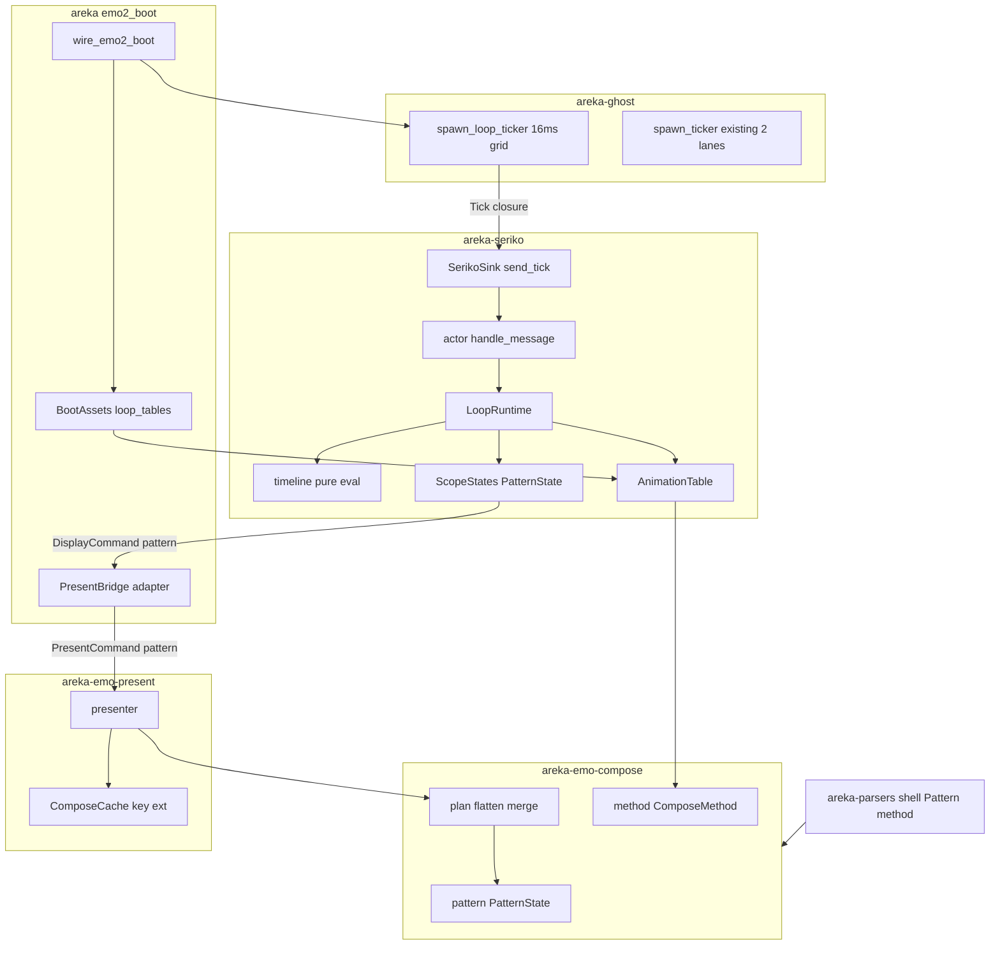
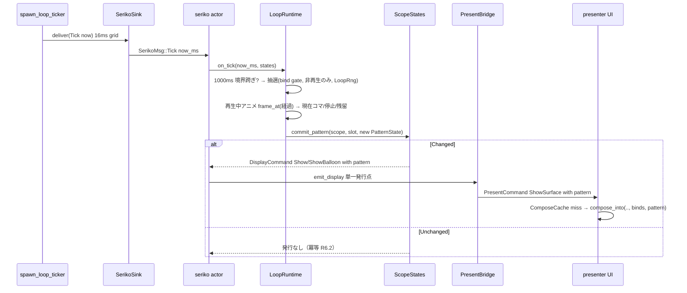
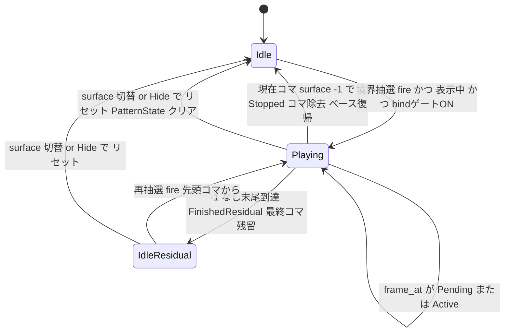

# Technical Design: areka-P0-seriko-loop

## Overview

**Purpose**: 本機能は SERIKO ループ・ランタイム（自律時限アニメ再生）を ⑤seriko に追加し、emo2 の実まばたき 2 系統——kero（`interval,random,4`＝bind 非依存）と sakura（`interval,bind+random,4`＝着せ替えゲート）——を実機で駆動する。ゴースト開発者・利用者に「起動しているだけで生きて見える」自律アニメーションを提供する。

**Users**: ゴースト利用者は起動中のまばたき等の自律アニメを目にする。ゴースト作者は ukadoc 正典どおりの `random,N`／`bind+random,N` 挙動を得る。開発者は注入 tick＋注入乱数による決定論テストで全経路を檻に入れる。

**Impact**: 既存 seriko アクター（cue 到着駆動）へ自律 tick 受理・pattern タイムライン評価・PatternState 管理を additive に追加する。合成入力（emo-compose 署名・emo-present キャッシュキー・表示指令）を PatternState で第一級拡張し、上流 parser の pattern 転記モデルに描画メソッド（method）欄を追加する（転記の穴の是正・要件裁定 (b)）。

### Goals

- 自律 tick 時間源を additive に増設し、talk cue 非従属で pattern タイムラインを進める（R1）
- `random,N` 毎秒抽選（R2）と `bind+random,N` 着せ替えゲート抽選（R3）を ukadoc 正典どおり駆動する
- pattern タイムライン進行規則（wait[ms] 累積・現在コマ 1 枚・`-1` 停止・末尾残留・再生中非再抽選）を純関数化し、注入 tick＋注入乱数で決定論的に全経路網羅する（R4/R7）
- PatternState を合成入力の第一級要素へ拡張し（compose 署名・cache キー・表示指令）、冪等発行を継承する（R5/R6）
- 描画メソッド（method）を parser で忠実転記し、完全語彙を保持したまま overlay のみ駆動する（R8・裁定 (b)）
- 実機まばたき 2 系統の人間サインオフ（R9）

### Non-Goals

- 動的 bind 切替の変更（上流 mayuna-compose 完了・read-only 参照のみ）／talk cue 再生（上流 cue-playback 完了）
- `random`/`bind+random` 以外の interval 語彙・`-2` の他アニメ停止・wait 範囲記法・exclusive option の駆動（完全形保持のみ・R8）
- 口パク（`interval,talk`）・`\i[N]` 明示再生タグ
- overlay 以外の描画メソッドの実合成（完全形保持のまま非駆動・R8.4）
- SERIKO 1.x 旧形式キー行（`NNNinterval`/`NNNpatternM`）の字句解析（emo2 subset 外。ただし旧形式の method 位置＝第 3 位置は正典事実としてモデル doc に転記し、将来の旧形式 lexer が同一 model 欄へ吸収できる形にする）

## Boundary Commitments

### This Spec Owns

- seriko の自律 tick 受理（`SerikoMsg::Tick`）と SERIKO ループ評価（抽選・タイムライン進行・per-scope 再生状態）
- `PatternState`／`PatternFrame` の公開型正本（emo-compose `pattern.rs`）と、その合成入力への搬送経路全体（`DisplayCommand`→`PresentCommand`→`ComposeKey`→`compose_into`）
- アニメ定義表（`AnimationTable`）の型と boot 時スナップショット構築（`EmoWorld` からの read-only 抽出）
- 乱数注入シーム（`LoopRng`）と純粋 PRNG（`seeded_rng`）
- ghost ticker への additive 汎用単発レーン（`spawn_loop_ticker`）
- parser `Pattern` の method 欄（`DrawMethod` 忠実転記）と decode の全メソッド転記化
- 合成側の PatternState 合流（`flatten_surface` 層(ii) の ID 整列合流・method ゲート）

### Out of Boundary

- 既存 2 系統 ticker（dispatcher 50ms／kanade 1000ms）の挙動・`spawn_ticker` シグネチャ（無改変）
- bind 状態の書込側（`apply_bind`/`apply_bind_exclusive` の遷移規則・mayuna 成果物）— 本ランタイムは read-only 参照のみ
- emo-compose の整列規則（animation-sort 2 段規則・pattern0 厳格選択）と blit 実装・emo-present の容量 1 メモ化思想（キー拡張のみ・思想不変）
- dola cue モデル（talk タイムラインと pattern タイムラインは別の時間系）
- SHIORI・kanade・dispatcher の各アクター

### Allowed Dependencies

- `areka-seriko` → `areka-emo-compose`（BindSet に加え PatternState/ComposeMethod/EmoWorld を消費）・`areka-sakura`・`dola`・`areka-actor`・`tracing`（既存方向のまま。**areka-ghost への依存は追加しない**）
- `areka-emo-compose` → `areka-parsers`（Pattern.method の転記値を消費）
- `areka-emo-present` → `areka-emo-compose`（PatternState をキーと署名で消費）
- `areka`（emo2_boot）→ 上記全部＋`areka-ghost`（spawn_loop_ticker の結線・唯一の結線点）
- `areka-ghost` は seriko に依存しない（tick 配送はクロージャ・型結合ゼロ）
- 新規 crates.io 依存なし・tokio 不使用（PRNG は自前 SplitMix64・シードは std::hash::RandomState 由来）

### Revalidation Triggers

- `PatternState`/`PatternFrame` の形（フィールド・順序性・Eq 意味論）の変更 → emo-present キャッシュ・emo-compose 合流・adapter の再検証
- `DisplayCommand`/`PresentCommand::ShowSurface` のフィールド変更 → adapter/frame/presenter の網羅 match 追随（コンパイル強制）
- parser `Pattern` の欄追加・意味変更 → emo-compose fold/plan・seriko 表構築の再検証
- `spawn_seriko` シグネチャ変更 → areka wire_emo2_boot／spine ハーネスの再結線
- 抽選境界（1000ms 絶対グリッド）や残留/非再抽選デファクトの変更（SSP 実観察による裏取り結果）→ 決定論テスト期待値と実機サインオフの再実施

## Architecture

### Existing Architecture Analysis

- seriko は独立スレッドのアクター（FIFO inbox・`SerikoMsg = Cue | Close`）で、解釈→状態（`ScopeStates`）→発行（`emit_display` 単一点）の一本経路を持つ。モジュール doc に「時間駆動ループが同じ発行点を再利用できる」と明記済み（`actor.rs:14-15`）。
- `ScopeStates` はシェル面・バルーン面の 2 つの per-scope 表示 map と、静的/動的 bind 集合を同居させ、`commit_bind`（冪等→書込→Shown なら再発行）の確立パターンを持つ。PatternState はこの鏡映で同居させる。
- 合成は `(surface_id, BindSet)` の純関数（emo-compose）＋容量 1 メモ化（emo-present `ComposeKey`・pattern 追加の予約記述あり）。`flatten_surface` 層(ii) が有効 bind pattern0 を animation ID 整列で積む＝transient コマの自然な合流点。
- ghost ticker は絶対グリッド整列＋catch-up 1 回の純粋層 `BoundarySchedule` を持ち、クロック注入可。既存 2 系統（dispatcher/kanade）は固定シグネチャ。
- 決定論テストの先例: クロック注入・Tick 直投函・`MockSurfaceOutput`・`Close→join` 同期（sleep 不使用）。乱数注入のみ先例なし＝本 spec が新設。

### Architecture Pattern & Boundary Map



**Architecture Integration**:

- 選択パターン: 既存アクター＋純関数コアの Extension（Opt-1A改＋2A＋3A＋4A改・research.md「Design Phase 追記」参照）。ループ評価は GPU 非依存の純関数群へ分離し、アクターは配線に徹する。
- 境界: 時間源機構＝ghost（`spawn_loop_ticker`）／結線＝areka（クロージャ）／評価と状態＝seriko／合成入力の正本＝emo-compose／キャッシュ＝emo-present／転記＝parsers。
- 既存パターン維持: 単一発行点 `emit_display`・冪等ガード（commit_bind 鏡映）・絶対グリッド＋catch-up・log-first・非 non_exhaustive の網羅 match 文化。
- 面種非仕切り（要件裁定 (a)）: 評価器・表・PatternState・commit は surface 種別非依存。シェル map／バルーン map の両表示エントリを同一経路で評価する。シェル表とバルーン表の 2 表は **surface ID 名前空間の別**（emo2 はシェル surface0 とバルーン面 0 が別物）であり能力の仕切りではない。
- steering 準拠: [deterministic-test-coverage-mandate]（純関数全網羅）・[areka-log-first-no-silent-failure]・[areka-bang-commands-generic-carrier]（不変）・[defer-canon-with-full-vocabulary-and-tracking-spec]（method/interval 完全語彙）。

### Dependency Direction

`areka-parsers` → `areka-emo-atlas` → `areka-emo-compose` → { `areka-emo-present`, `areka-seriko` } → `areka`。`areka-ghost` は seriko/emo 系に依存せず `areka` が両者を結線する。各層は左のみ import 可。**本 spec で新設される依存辺はゼロ**（既存辺への型追加のみ）。違反（seriko→ghost・ghost→seriko 等）は実装・レビューでエラーとして扱う。

### Technology Stack

| Layer | Choice / Version | Role in Feature | Notes |
|-------|------------------|-----------------|-------|
| Runtime / Actor | `areka-actor`（既存）＋ std::thread / std::sync::mpsc | seriko アクター・loop ticker スレッド | 新規依存なし |
| 時間源 | `GetTickCount64`（既存 `MonotonicMs`）＋注入クロージャ | 16ms 絶対グリッド tick・決定論は注入 tick | ghost ticker 既存機構を再利用 |
| 乱数 | 自前 SplitMix64（`seeded_rng`）＋ `std::hash::RandomState` シード | 毎秒 1/N 抽選・注入シーム `LoopRng` | 新規 crates.io 依存なし（`rand` 不使用） |
| 合成 | `areka-emo-compose`（CPU 整数 blit・既存） | PatternState 合流・overlay 駆動 | 署名拡張のみ |
| 提示 | `areka-emo-present`（WUC・既存） | ComposeKey 拡張・容量 1 メモ化不変 | |
| 転記 | `areka-parsers::shell`（既存） | Pattern.method 忠実転記 | encoding_rs 等は既存のまま |
| ログ | `tracing`（既存規約） | log-first・実機 grep マーカー | |

## File Structure Plan

### New Files

```
crates/areka-seriko/src/
├── table.rs      # AnimationTable / LoopAnimation / LoopTrigger / LoopFrame。
│                 #   EmoWorld からの boot 時スナップショット構築（from_world）・method 解決 1 回・
│                 #   random/bind+random のみ採録（他 interval は debug! で非駆動記録）
├── timeline.rs   # 純関数コア: frame_at（経過→現在コマ・FrameStatus）・should_fire（1/N 抽選）・
│                 #   LotteryBoundary（1000ms 絶対グリッド跨ぎ検出・catch-up 1 回）・seeded_rng（SplitMix64）
└── looper.rs     # LoopRuntime: per-(scope, slot) 再生状態・SerikoLoopConfig（表 2 面＋LoopRng）・
                  #   on_tick 統括（抽選→進行→PatternState 差分算出）・on_surface_changed（リセット）

crates/areka-emo-compose/src/
└── pattern.rs    # PatternState / PatternFrame の公開型正本（BTreeMap 正準順序・Eq・Default=空）
```

### Modified Files

- `crates/areka-parsers/src/shell/model.rs` — `DrawMethod` opaque NewType 追加・`Pattern` に `method: DrawMethod` 欄追加（doc に正典位置＝新形式第 1 位置／旧形式第 3 位置を転記）・`Interval` に `Other(Box<str>)` variant 追加（未認識 interval 語彙の原文忠実転記・討議 #1 裁定）
- `crates/areka-parsers/src/shell/decode.rs` — pattern 行の `overlay` フィルタ撤去・field[1] を method として全メソッド忠実転記・未認識 interval キーワードの fallback-Bind 撤去→`Interval::Other(原文)` 転記
- `crates/areka-parsers/src/shell/decode_tests.rs`／`parse_tests.rs`／`model_tests.rs` — method 転記の檻追加・既存 `Pattern` リテラルの追随
- `crates/areka-emo-compose/src/lib.rs` — `pattern` モジュール公開・`compose_into`/`compose` に `pattern: &PatternState` 引数追加
- `crates/areka-emo-compose/src/plan.rs` — `build_plan`/`derive_ops`/`flatten_surface` に pattern 合流（層(ii) の ID 整列へ transient コマ合流・同 ID は pattern0 置換）＋ pattern0/コマ双方への method ゲート（Overlay のみ駆動・非 Overlay warn+skip）
- `crates/areka-emo-compose/src/golden_tests.rs`／`composer_tests.rs` — 空 PatternState 等価 golden・transient コマ golden 追加
- `crates/areka-emo-present/src/cache.rs` — `ComposeKey { surface_id, binds, pattern }` 拡張・`get`/`insert` 署名追随
- `crates/areka-emo-present/src/command.rs` — `PresentCommand::ShowSurface` に `pattern: PatternState` 欄追加
- `crates/areka-emo-present/src/presenter.rs` — ShowSurface 適用経路で pattern をキャッシュ・合成へ透過
- `crates/areka-seriko/src/actor.rs` — `SerikoMsg::Tick { now_ms: u64 }` 追加・`SerikoSink::send_tick`・`spawn_seriko(.., loop_config: SerikoLoopConfig, ..)`・`handle_message` の Tick 腕（LoopRuntime 呼出）・Emote/Balloon 適用後の `on_surface_changed` 連動
- `crates/areka-seriko/src/state.rs` — per-(scope, slot) PatternState 同居・`commit_pattern`（commit_bind 鏡映）・`apply`/`apply_balloon` の surface 切替時 pattern クリア・`Show`/`ShowBalloon` 構築に pattern 同梱
- `crates/areka-seriko/src/output.rs` — `DisplayCommand::Show`/`ShowBalloon` に `pattern: PatternState` 欄追加
- `crates/areka-seriko/src/lib.rs` — 新モジュール（table/timeline/looper）公開
- `crates/areka-ghost/src/ticker.rs` — `LoopTickerConfig`＋`spawn_loop_ticker`（クロージャ配送・BoundarySchedule 再利用）を additive 追加（既存 `spawn_ticker`・2 系統は無改変）
- `crates/areka/src/emo2_boot/assets.rs` — `BootAssets` に `loop_tables: LoopTables { shell, balloon }` 追加（EmoWorld スナップショットから構築）
- `crates/areka/src/emo2_boot/adapter.rs` — `map_display_command` の pattern 透過（Show/ShowBalloon → ShowSurface.pattern）
- `crates/areka/src/emo2_boot/mod.rs` — `wire_emo2_boot`: SerikoLoopConfig 組立（表＋本番 rng シード採取・info! ログ）・`spawn_loop_ticker` 結線・戻り値へ ticker 停止端/ハンドル追加
- `crates/areka/src/emo2_boot/spine.rs` — ハーネス: `SerikoLoopConfig`（実表＋注入乱数）・tick は `SerikoSink::send_tick` 直接注入（loop ticker 不起動）・まばたき e2e 檻
- `crates/areka/src/emo2_boot/frame.rs` — drain 相の ShowSurface 網羅 match 追随（pattern 透過）
- `crates/areka/src/main.rs` — loop ticker の保持と shutdown 順序（ticker Close→ghost shutdown→seriko join）・実機 grep マーカー確認手順

## System Flows

### 本番 tick 経路（毎 16ms・変化時のみ発行）



フロー上の決定: 抽選判定は境界跨ぎ検出時のみ（catch-up でも 1 回）。`frame_at` は経過時刻の関数なので tick 落ち・粗い tick でも終端意味論（`-1` 停止・末尾残留）が保たれる。発行は PatternState が変化した tick のみ（6.1/6.2）。

### 1 アニメの再生状態機械（per (scope, slot, animation)）



`Idle`/`IdleResidual` が「非再生中」＝抽選対象（2.3/9.4）。`IdleResidual` は PatternState に最終コマを残したまま（4.4）。

## Requirements Traceability

| Requirement | Summary | Components | Interfaces | Flows |
|---|---|---|---|---|
| 1.1 | cue 非依存の tick 受理 | actor / SerikoSink | `SerikoMsg::Tick`・`SerikoSink::send_tick` | tick 経路 |
| 1.2 | 単調時刻でタイムライン進行 | LoopRuntime / timeline | `on_tick(now_ms)`・`frame_at` | tick 経路 |
| 1.3 | 非表示でも時間源は停止しない | spawn_loop_ticker | worker スレッド駆動（vsync 非依存） | tick 経路 |
| 1.4 | 既存 tick 系統の不改変 additive | ghost ticker | `spawn_loop_ticker` 新設・`spawn_ticker` 無改変 | — |
| 2.1 | 表示中×非再生中で毎秒 1/N | LoopRuntime / timeline | `LotteryBoundary`・`should_fire` | 状態機械 |
| 2.2 | 発火は先頭コマから | LoopRuntime | `Playing{started_at}` 新規開始 | 状態機械 |
| 2.3 | 再生中は再抽選対象外 | LoopRuntime | eligibility 判定（Idle/IdleResidual のみ） | 状態機械 |
| 2.4 | アニメごと独立抽選 | LoopRuntime | 固定順（D-7）の per-animation 乱数消費 | — |
| 3.1 | bindgroup OFF は判定不発 | LoopRuntime / ScopeStates | `current_binds(scope).contains(id)` ゲート | 状態機械 |
| 3.2 | ON かつ非再生で 1/N | LoopRuntime | 2.1 と同一抽選・ゲート通過後 | 状態機械 |
| 3.3 | bind read-only | LoopRuntime | `current_binds` 読取のみ（書込 API 不使用） | — |
| 3.4 | fixture 既定 OFF | assets（既存） | `default_bind_ids`＝1400 系不採録（default,1 なし） | — |
| 4.1 | wait 累積の経過でコマ進行 | timeline | `frame_at`（累積デッドライン列） | tick 経路 |
| 4.2 | 現在コマ 1 枚（前コマリセット） | PatternState / plan | anim id → 単一 `PatternFrame`・合流時置換 | — |
| 4.3 | `-1` 停止・ベース復帰・method/x/y 無視 | timeline / LoopRuntime | `FrameStatus::Stopped`→エントリ除去 | 状態機械 |
| 4.4 | `-1` 無し末尾は最終コマ残留で終了 | timeline | `FrameStatus::FinishedResidual(last)` | 状態機械 |
| 4.5 | wait 単位 1ms | table / timeline | `LoopFrame.wait_ms: u32`（SERIKO 2.0） | — |
| 4.6 | method 忠実保持・合成解釈 | parsers / table / plan | `DrawMethod`→`ComposeMethod`→`PatternFrame.method` | — |
| 5.1 | PatternState 第一級供給 | pattern.rs / output / command | `compose_into(.., pattern)`・`Show{pattern}`・`ShowSurface{pattern}` | tick 経路 |
| 5.2 | キャッシュキー拡張・再合成 | ComposeCache | `ComposeKey{surface_id, binds, pattern}` | tick 経路 |
| 5.3 | ID 整列へ合流・規則不変 | plan | `flatten_surface` 層(ii) 合流（同 ID 置換） | — |
| 5.4 | 空 PatternState は従来一致 | pattern.rs / plan / cache | `Default`=空・golden byte 等価檻 | — |
| 6.1 | 変化 tick は単一発行点から 1 回 | ScopeStates / actor | `commit_pattern`→`emit_display` | tick 経路 |
| 6.2 | 不変 tick は再発行なし | ScopeStates | `PatternApplyOutcome::Unchanged` | tick 経路 |
| 6.3 | 既存単一発行点・冪等の継承 | actor | `emit_display` 共用（新発行点なし） | — |
| 7.1 | 時刻・乱数の注入シーム | looper / timeline | `LoopRng`・注入 tick（`SerikoMsg::Tick` 直投函） | — |
| 7.2 | 固定注入列→期待 PatternState・golden | テスト群 | 固定順乱数消費（D-7）・spine e2e | — |
| 7.3 | sleep 不使用の tick 駆動テスト | テスト群 | `send_tick`/`handle_message` 直接駆動＋`Close→join` | — |
| 7.4 | 本番は実時間・実 entropy 接続 | wire_emo2_boot / ghost ticker | `LoopTickerConfig` 既定 clock・`RandomState` シード | — |
| 7.5 | 失敗はログを伴う | 全結線点 | error!/warn!/debug! の severity 規律（下記） | — |
| 8.1 | 駆動は random/bind+random のみ | table | `LoopTrigger` 2 種のみ採録 | — |
| 8.2 | 他語彙・`-2` 等は完全形保持・非駆動 | parsers / table / timeline | `Interval::Other(原文)` 忠実転記・非採録 debug!（元語彙込み）・負値 warn! | — |
| 8.3 | 口パク・`\i[N]`・動的 bind・talk 除外 | table / actor | 採録対象外・既存経路不変 | — |
| 8.4 | method 全語彙の忠実転記・overlay のみ駆動 | parsers / method.rs / plan | `DrawMethod`＋`ComposeMethod` registry・`is_implemented` ゲート | — |
| 9.1 | 実機 kero まばたき | main / wire | 実 ticker＋実 rng＋grep マーカー | tick 経路 |
| 9.2 | 実機 sakura まばたき（bind ON） | main / wire | `\![bind,まばたき,通常,1]` 貫通（mayuna 成果物） | tick 経路 |
| 9.3 | 人間目視サインオフ | 手順 | AREKA_APP_SMOKE_EXIT_MS＋RUST_LOG grep＋目視 | — |
| 9.4 | デファクト 2 点の確定挙動化 | timeline | D-3（残留・非再抽選を檻の期待値へ） | 状態機械 |

## Components and Interfaces

| Component | Domain/Layer | Intent | Req Coverage | Key Dependencies | Contracts |
|-----------|--------------|--------|--------------|------------------|-----------|
| shell parser method 転記 | parsers | Pattern に method 欄を忠実転記 | 4.6, 8.2, 8.4 | なし（最上流） | State |
| AnimationTable（table.rs） | seriko | interval/pattern 定義の boot 時不変表 | 4.5, 8.1, 8.2, 8.3 | EmoWorld (P0), ComposeMethod (P0) | Service, State |
| timeline 純関数（timeline.rs） | seriko | 抽選・進行・PRNG の決定論コア | 2.1–2.4, 4.1–4.5, 7.1, 9.4 | table (P0) | Service |
| LoopRuntime（looper.rs） | seriko | 二層時間の統括・PatternState 差分 | 1.2, 2.x, 3.x, 6.x, 7.2 | timeline (P0), ScopeStates (P0) | Service, State |
| actor 拡張（actor.rs） | seriko | Tick 受理・単一発行点継承 | 1.1, 6.1, 6.3, 7.3 | LoopRuntime (P0) | Event |
| ScopeStates 拡張（state.rs） | seriko | PatternState 同居・commit_pattern 冪等 | 5.1, 6.1, 6.2 | pattern.rs (P0) | State |
| DisplayCommand 拡張（output.rs） | seriko | 表示指令への pattern 搬送 | 5.1 | pattern.rs (P0) | Event |
| PatternState（pattern.rs） | emo-compose | 合成入力第一級の公開型正本 | 5.1, 5.4 | method.rs (P0) | State |
| 合成合流（plan.rs / lib.rs） | emo-compose | transient コマの ID 整列合流・method ゲート | 4.2, 4.6, 5.3, 5.4, 8.4 | pattern.rs (P0) | Service |
| ComposeKey 拡張（cache.rs） | emo-present | pattern 込み容量 1 メモ化 | 5.2 | pattern.rs (P0) | State |
| ShowSurface 拡張（command.rs / presenter.rs） | emo-present | 指令契約の pattern 搬送 | 5.1, 5.2 | pattern.rs (P0) | Event |
| spawn_loop_ticker（ticker.rs） | ghost | additive 単発 tick レーン | 1.1, 1.3, 1.4, 7.4 | BoundarySchedule (P0) | Service |
| areka 結線（assets/adapter/mod/main/spine） | areka | 表構築・rng シード・ticker 結線・e2e | 3.4, 7.4, 9.1–9.3 | 全部 (P0) | — |

### seriko（⑤）

#### AnimationTable（crates/areka-seriko/src/table.rs）

| Field | Detail |
|-------|--------|
| Intent | 表示 surface → 駆動対象アニメ（interval＋コマ列）を O(log n) で引ける boot 時不変表 |
| Requirements | 4.5, 8.1, 8.2, 8.3 |

**Responsibilities & Constraints**

- `EmoWorld`（fold 済み＝append/ターゲット展開済み）から read-only スナップショットを構築する（発見 C の解消）。UI スレッドの World を実行時に参照しない（boot 一度きり・値渡し）。
- `Interval::Random{k}`/`BindRandom{k}` のみ採録（8.1）。`Interval::Bind`・`Interval::Other(語彙)` および non_exhaustive の将来 variant は**採録せず debug! で記録**（8.2 の非駆動明示。`Other` は**元語彙文字列込み**で記録＝「sometimes と書いたのに動かない」が診断可能・討議 #1 裁定。match は `Bind`/`Other` 明示腕＋`other` 腕で将来 additive シームを保つ）。
- method は構築時に `ComposeMethod::from_name(DrawMethod::as_str())` で 1 回解決（完全語彙の型値・8.4）。コマ列は pattern index 昇順に整列して保持（疎 index 許容・kero の 0/1/3 実例）。
- 縮退ガード（構築時 1 回・log-first）: コマ列空のアニメは非採録（warn!）・`k == 0` は非採録（warn!・1/0 は定義不能）。
- 面種非依存: 表はどの `EmoWorld` からでも構築できる（シェル世界・バルーン世界の双方に同型適用・裁定 (a)）。

**Contracts**: Service [x] / State [x]

```rust
/// 駆動トリガ（採録は 2 種のみ・8.1）。
pub enum LoopTrigger {
    Random { k: u32 },
    BindRandom { k: u32 },
}

/// 1 コマ（method は構築時解決済みの完全形・wait は 1ms 単位・4.5）。
pub struct LoopFrame {
    pub surface_id: i64,          // 負値センチネル保持（-1 停止・他負値は非駆動）
    pub method: ComposeMethod,    // 完全語彙（overlay のみ駆動・8.4）
    pub wait_ms: u32,             // 前コマからこのコマへの遅延（1ms 単位）
    pub x: i64,
    pub y: i64,
}

pub struct LoopAnimation {
    pub id: u32,                  // animation ID（bind ゲート・合成整列のキー）
    pub trigger: LoopTrigger,
    pub frames: Vec<LoopFrame>,   // pattern index 昇順・非空保証（構築時ガード）
}

pub struct AnimationTable { /* BTreeMap<u32 /*surface_id*/, Vec<LoopAnimation>> */ }

impl AnimationTable {
    pub fn from_world(world: &EmoWorld) -> AnimationTable;
    pub fn empty() -> AnimationTable;
    pub fn animations(&self, surface_id: u32) -> &[LoopAnimation];
    pub fn is_empty(&self) -> bool;
}
```

- Preconditions: `world` は fold 済み（`EmoWorld::build` 完了）。
- Postconditions: 戻り表は不変・`Send`・全アニメ frames 非空・k >= 1。
- Invariants: 表は実行中に変化しない（ghost 再読込は再構築＝spawn し直し）。

#### timeline 純関数コア（crates/areka-seriko/src/timeline.rs）

| Field | Detail |
|-------|--------|
| Intent | 抽選境界・1/N 判定・経過→現在コマの決定論純関数（GPU/スレッド/実時間非依存） |
| Requirements | 2.1, 2.4, 4.1, 4.3, 4.4, 4.5, 7.1, 9.4 |

**Responsibilities & Constraints**

- 全関数が純粋（引数のみに依存・I/O なし）。テストは注入値のみで全分岐網羅（[deterministic-test-coverage-mandate]）。
- `LotteryBoundary`: 1000ms 絶対グリッドの跨ぎ検出。ghost `BoundarySchedule` と同じ「1 回だけ発火・次境界へスナップ」政策（catch-up でも抽選 1 回）。ukadoc「毎秒」の写像はこの絶対 1 秒グリッドで確定し、実機齟齬時は SSP 実観察で裏取りする（9.4 と同じ流儀・research.md D-2）。
- `frame_at`: 再生開始からの経過 `elapsed_ms` に対し累積 wait デッドライン列（t_k = Σ_{j<=k} wait_j）から現在コマを決める。デファクト 2 点（9.4）を期待値として焼き込む（D-3）。
- `seeded_rng`: SplitMix64＋乗算シフト縮約（`(state.next() as u128 * bound as u128) >> 64`）の純粋 PRNG。本番シードは結線層が供給。

**Contracts**: Service [x]

```rust
/// 乱数注入シーム（クロック注入と同型・7.1）。[0, bound) の一様整数を返す。
pub type LoopRng = Box<dyn FnMut(u32) -> u32 + Send>;

/// 決定論 PRNG（SplitMix64）。テストでも本番でも使える純粋構築子。
pub fn seeded_rng(seed: u64) -> LoopRng;

/// 1/N 抽選（2.1/3.2）。rng(k) == 0 で発火。呼び手は k >= 1 を保証（表構築ガード）。
pub fn should_fire(k: u32, rng: &mut LoopRng) -> bool;

/// 1000ms 絶対グリッド境界（毎秒抽選の写像・catch-up 1 回）。
pub struct LotteryBoundary { /* next_boundary_ms: u64 */ }
impl LotteryBoundary {
    pub fn starting_at(now_ms: u64) -> Self;      // now より厳密未来の次境界から
    pub fn poll(&mut self, now_ms: u64) -> bool;  // 跨いだら true（複数跨ぎでも 1 回）＋次境界へスナップ
}

/// 経過時刻に対する現在コマ判定（4.1–4.4・9.4）。
pub enum FrameStatus {
    Pending,                  // 先頭コマのデッドライン未到達（まだ何も出さない）
    Active(usize),            // frames[i] が現在コマ（4.2 現在コマ 1 枚）
    Stopped,                  // 現在コマの surface_id が負（-1 等）→ 停止・ベース復帰（4.3）
    FinishedResidual(usize),  // -1 なし末尾到達 → frames[i]（最終コマ）残留・終了状態（4.4/9.4）
}
pub fn frame_at(frames: &[LoopFrame], elapsed_ms: u64) -> FrameStatus;
```

- Preconditions: `frames` 非空・pattern index 昇順（表構築が保証）。
- Postconditions: 同一入力に対し常に同一結果（純粋）。`Stopped` は現在コマの `surface_id < 0` のとき——このときコマの method/x/y は一切搬送されない（無視・4.3）。`-1` は正典駆動、`-1` 以外の負値は呼び手＝LoopRuntime が warn! を 1 回発火して同扱い＝自アニメ停止のみ・他アニメ停止（`-2` 正典）は駆動しない（8.2）。
- Invariants: `elapsed_ms >= t_last` かつ最終コマ非負 → 常に `FinishedResidual(last)`（時間がさらに進んでも不変）。

#### LoopRuntime（crates/areka-seriko/src/looper.rs）

| Field | Detail |
|-------|--------|
| Intent | 二層時間（毎秒抽選×サブ秒進行）の統括と per-(scope, slot) 再生状態の所有 |
| Requirements | 1.2, 2.1–2.4, 3.1–3.3, 6.1, 6.2, 7.2 |

**Responsibilities & Constraints**

- アクター本体が単独所有（スレッド内・ロック不要）。状態: `LotteryBoundary` 1 個＋`HashMap<(ActorKey, Slot), SlotPlayback>`（`SlotPlayback = HashMap<u32 /*anim id*/, Playback { started_at_ms: u64 }>`）。
- `Slot` は表示エントリの名前空間（`Shell`／`Balloon`）＝ScopeStates の 2 map に整合する **ID 名前空間の区別**であり能力の仕切りではない（裁定 (a)・両 slot を同一コードパスで評価）。
- `on_tick(now_ms, states)`: (1) 単調性ガード（now < 前回 → debug!＋無視）。(2) 境界跨ぎなら抽選——表示中（`Shown(sid)`）の各 slot について `table.animations(sid)` を走査し、非再生（Idle/IdleResidual・2.3）かつ bind ゲート通過（`BindRandom` は `states.current_binds(scope).contains(anim.id)`・`Random` は無条件・3.1/3.2）のアニメへ `should_fire` を適用。発火で `Playback{started_at: now_ms}` 登録＋info!（実機 grep マーカー）。(3) 全再生中アニメへ `frame_at(now - started_at)` を評価し、slot ごとの新 PatternState を組み立てる（`Active/FinishedResidual` → コマ搬送・`Stopped` → エントリなし＋playback 除去・`FinishedResidual` は playback 除去のみでコマ残留）。(4) slot ごとに `states.commit_pattern` へ渡し、`Changed(cmd)` を呼び手（actor）へ返す。
- 抽選順序は決定論固定（D-7）: scope 昇順（`ActorKey` 文字列順）→ Shell → Balloon → animation id 昇順。注入乱数列の消費順が一意。
- `on_surface_changed(scope, slot)` / `on_hidden(scope, slot)`: 当該 slot の playback を全除去（PatternState クリアは ScopeStates 側の apply が行う）。ukadoc「そのサーフェスである間」＝再生とコマは表示中 surface に従属。
- bind の書込 API は一切呼ばない（3.3）。

**Contracts**: Service [x] / State [x]

```rust
pub struct SerikoLoopConfig {
    pub shell_table: AnimationTable,    // シェル表示エントリ用（surface ID 名前空間: shell）
    pub balloon_table: AnimationTable,  // バルーン表示エントリ用（同: balloon）。emo2 は空（データ事実）
    pub rng: LoopRng,
}
impl SerikoLoopConfig {
    /// 空表＋ダミー乱数（ループ完全不活性）。既存テスト・非 emo2 経路の非退行用。
    pub fn disabled() -> Self;
}

pub(crate) struct LoopRuntime { /* config + boundary + playback */ }
impl LoopRuntime {
    pub(crate) fn new(config: SerikoLoopConfig) -> Self;
    /// 1 tick の統括。発行すべき指令列（通常 0〜2 件）を返し、発行自体は actor（emit_display）が行う。
    pub(crate) fn on_tick(&mut self, now_ms: u64, states: &mut ScopeStates) -> Vec<DisplayCommand>;
    pub(crate) fn on_surface_changed(&mut self, scope: &ActorKey, slot: Slot);
}
```

- Preconditions: 表・rng は spawn 時注入済み。
- Postconditions: `on_tick` は PatternState が変化した slot に対してのみ指令を返す（6.1/6.2）。表が空なら常に空（非退行）。
- Invariants: 再生中（playback エントリあり・Stopped/Finished 未到達）のアニメは抽選対象外（2.3）。

#### actor 拡張（crates/areka-seriko/src/actor.rs）

| Field | Detail |
|-------|--------|
| Intent | Tick の inbox 受理と単一発行点の継承（新発行点を作らない） |
| Requirements | 1.1, 6.1, 6.3, 7.3 |

**Responsibilities & Constraints**

- `SerikoMsg::Tick { now_ms: u64 }` を additive 追加（素の u64＝新規依存なし・D-1）。`SerikoSink::send_tick(&self, now_ms)` は送出失敗を **debug!**（shutdown 中の期待事象・PresentBridge 先例）で観測して戻る（7.5 と 6.3 の両立）。
- `handle_message` に Tick 腕を追加: `for cmd in loop_runtime.on_tick(now_ms, &mut states) { emit_display(&mut out, cmd); }`——発行は既存 `emit_display` 単一点のみ（6.3）。表示中 slot が 1 つもない tick（起動直後の Show 前など）は評価対象ゼロ＝完全 no-op（2.1 の表示中ゲートの自然帰結・無発行）。
- 既存 Emote／BalloonSurface 適用（`apply`/`apply_balloon`）が `Changed` を返した際、`loop_runtime.on_surface_changed(scope, slot)` を呼ぶ（surface 切替・Hide でのループリセット連動）。
- `spawn_seriko(resolver, static_binds, bind_resolver, loop_config: SerikoLoopConfig, out)` へ拡張（表・乱数の値渡し・発見 C の解消）。既存呼び手は `SerikoLoopConfig::disabled()` で従来挙動と同値。

**Contracts**: Event [x]

- 停止経路（Close／全 Sender drop）・cue 経路・bind 経路は無改変。Tick は FIFO で cue と直列化される（同一 inbox）ため、状態競合は構造的に不在。

#### ScopeStates 拡張（crates/areka-seriko/src/state.rs）

| Field | Detail |
|-------|--------|
| Intent | per-(scope, slot) PatternState の所有と冪等 commit（commit_bind の鏡映） |
| Requirements | 5.1, 6.1, 6.2 |

**Responsibilities & Constraints**

- `pattern_states: HashMap<(ActorKey, Slot), PatternState>` を `dynamic_binds` と同居。読み口 `current_pattern(scope, slot) -> &PatternState`（不在は空の静的参照）。
- `commit_pattern(scope, slot, new) -> PatternApplyOutcome`: 冪等ガード（同値なら `Unchanged`・書込なし）→ 書込 → 表示中なら `Changed(Show{scope, surface_id, binds, pattern} | ShowBalloon{scope, surface_id, pattern})`。非表示/未知 slot は評価自体が走らない（2.1 ゲート）ため `StateOnly` 相当は発生しないが、防御的に非発行で扱う。
- `apply`（Emote）／`apply_balloon` の surface **切替時**（別 id への Changed）: 当該 slot の PatternState を空へリセットしてから Show を組む（新 surface のコマは未生成＝空 pattern で発行）。同一 id への再指定（Unchanged）は従来どおり無発行。
- `apply_bind` 系の Show 再発行にも `current_pattern` を同梱（bind 変化時に現在コマを保ったまま再合成）。

**Contracts**: State [x]

```rust
pub enum Slot { Shell, Balloon }

pub enum PatternApplyOutcome {
    Changed(DisplayCommand),
    Unchanged,
}
impl ScopeStates {
    pub fn current_pattern(&self, scope: &ActorKey, slot: Slot) -> &PatternState;
    pub fn commit_pattern(&mut self, scope: &ActorKey, slot: Slot, new: PatternState) -> PatternApplyOutcome;
}
```

#### DisplayCommand 拡張（crates/areka-seriko/src/output.rs）

- `Show { scope, surface_id, binds, pattern: PatternState }`・`ShowBalloon { scope, surface_id, pattern: PatternState }` へ欄追加（Opt-3A・「Show=1 面の完全な合成入力」意味論の維持）。`Hide`/`HideBalloon` は不変。
- 非 `#[non_exhaustive]` のため、下流（adapter/frame/presenter/テスト）の網羅 match・構築子はコンパイルエラーで追随が強制される（発見 D・意図された設計）。
- Requirements: 5.1。既存経路（cue 由来の Show）は `current_pattern` の同梱により、ループ不活性時は常に空 pattern＝従来と同値（5.4）。

### emo-compose（⑥合成）

#### PatternState 公開型正本（crates/areka-emo-compose/src/pattern.rs）

| Field | Detail |
|-------|--------|
| Intent | pattern 進行状態の合成入力第一級表現（seriko が生産・compose/present が消費） |
| Requirements | 5.1, 5.4 |

**Contracts**: State [x]

```rust
/// animation id → 現在コマ 1 枚（4.2）。BTreeMap で正準順序（Eq/ハッシュ安定・決定論）。
#[derive(Clone, Debug, Default, PartialEq, Eq)]
pub struct PatternState { /* frames: BTreeMap<u32, PatternFrame> */ }

#[derive(Clone, Debug, PartialEq, Eq)]
pub struct PatternFrame {
    pub surface_id: u32,        // 正値のみ（センチネルは評価器が解決済み）
    pub method: ComposeMethod,  // 完全語彙（8.4）・合成は Overlay のみ駆動
    pub x: i64,
    pub y: i64,
}

impl PatternState {
    pub fn is_empty(&self) -> bool;
    pub fn set(&mut self, animation_id: u32, frame: PatternFrame);
    pub fn remove(&mut self, animation_id: u32);
    pub fn get(&self, animation_id: u32) -> Option<&PatternFrame>;
    pub fn iter(&self) -> impl Iterator<Item = (u32, &PatternFrame)>;
}
```

- Invariants: `Default` は空＝「pattern 寄与なし」。空の `PatternState` を渡した合成・キャッシュは従来（拡張前）と**観測等価**（5.4・golden byte 等価で檻）。`Send + 'static` 所有（コンパイル時檻）。

#### 合成合流と method ゲート（crates/areka-emo-compose/src/plan.rs・lib.rs）

| Field | Detail |
|-------|--------|
| Intent | transient コマを既存 animation ID 整列へ合流させ、整列規則そのものは変更しない |
| Requirements | 4.2, 4.6, 5.3, 5.4, 8.4 |

**Responsibilities & Constraints**

- `compose_into(out, world, atlas, surface_id, active_binds, pattern: &PatternState)`／`compose` 同様・`build_plan`/`derive_ops` へ透過。
- `flatten_surface` 層(ii) の合流（**top-level surface のみ**・再帰段では PatternState を参照しない——コマは表示中 surface のアニメに属する）:
  1. 対象 id 集合 = { 有効 bind pattern0 を持つ animation id } ∪ { PatternState に現在コマを持つ animation id }。
  2. 整列は既存 animation-sort 2 段規則そのまま（Descend→id 昇順描画＝画家のアルゴリズム・5.3）。
  3. 各 id: PatternState にコマがあれば**コマが優先**（同 ID の pattern0 静的寄与を置換＝「各コマは直前コマをリセットしてベースへ」4.2）。無ければ従来の pattern0 経路。
  4. コマの描画: `method.is_implemented()`（＝Overlay）なら pattern0 と同様に `frame.surface_id` へ (x,y) 累積オフセットで再帰 flatten。非 Overlay は warn!（method 名込み）＋当該コマ不描画（完全形保持のまま非駆動・8.4）。
- pattern0 静的経路にも同じ method ゲートを追加する（parser のフィルタ撤去で非 overlay pattern0 がモデルへ流入し得るため・D-5 の是正）。emo2 は全 overlay ゆえ golden byte 不変。
- `compute_extent`（外形）は**変更しない**: 外形は従来どおり静的母集合（全 element＋全 bind pattern0）から算出し、transient コマは外形へ寄与しない。まばたきコマ（1410-1412/2106-2110）はベース外形内に収まる前提を維持し、bind オン/オフ・pattern 進行でサイズが揺れない不変条件（emo-present のバッファ再利用）を守る。コマがベース外形を越える場合は越えた分がクリップされる（既存クリップ規則・許容劣化として記録）。**この前提は宣言に留めず、emo2 fixture の実測檻で裏取りする**（Testing Strategy 参照——採録アニメ全コマの原寸＋(x,y) が当該ベース Extent 内に収まることを検証。前提が崩れた場合はテストで露見し R9 実機まで持ち越さない）。

**Contracts**: Service [x]

- Preconditions: `pattern` の frames は正の surface_id のみ（評価器が保証）。
- Postconditions: `pattern.is_empty()` なら出力命令列・外形とも拡張前と完全一致（5.4）。

### emo-present（⑥提示）

#### ComposeKey／指令契約拡張（crates/areka-emo-present/src/cache.rs・command.rs・presenter.rs）

| Field | Detail |
|-------|--------|
| Intent | キー＝合成入力の全体という不変条件の維持（予約記述の実装） |
| Requirements | 5.1, 5.2 |

**Responsibilities & Constraints**

- `ComposeKey { surface_id: u32, binds: BindSet, pattern: PatternState }`。`get(surface_id, binds, pattern)`／`insert(surface_id, binds, pattern, composed)` へ署名追随。1 ビットでも異なれば必ずミス＝再合成（容量 1 メモ化の思想不変・cache.rs 冒頭 doc の予約どおり）。
- `PresentCommand::ShowSurface` に `pattern: PatternState` 欄追加（`#[non_exhaustive]` enum だが variant 欄追加は workspace 内の構築/分解点＝adapter・presenter・frame・spine の追随で完結）。
- presenter は ShowSurface 適用時に pattern をキャッシュ引き当てと `compose_into` へ透過するのみ（新しい判断を持たない）。

**Contracts**: Event [x] / State [x]

### parsers（②転記層）

#### Pattern method 転記（crates/areka-parsers/src/shell/model.rs・decode.rs）

| Field | Detail |
|-------|--------|
| Intent | 描画メソッドの忠実転記（転記の穴の是正・要件裁定 (b)） |
| Requirements | 4.6, 8.2, 8.4 |

**Responsibilities & Constraints**

- `DrawMethod(String)` opaque NewType（`new`/`as_str`・`ElementPath` 先例と同規律）。意味解釈（同義写像・実装可否）は下流 `ComposeMethod::from_name` の責務＝parser は原文を無加工で運ぶ。
- `Pattern { index, method: DrawMethod, surface_id, wait, x, y }`。doc comment に正典位置を転記する: **新形式** `animation*.pattern*,描画メソッド,サーフェス番号,ウェイト,X,Y`（method＝第 1 位置・現行 lexer の対象）／**旧形式**（SERIKO 1.x）は method 第 3 位置（旧形式キー行の字句解析は emo2 subset 外＝Non-Goals。将来 lexer が旧位置を吸収して同一欄へ転記する）。
- **interval の忠実転記（討議 #1 裁定・method と同型の是正）**: `Interval` に `Other(Box<str>)` variant を追加し、`decode_animations` の未認識 interval キーワード（sometimes/rarely/periodic/always/runonce 等）の **fallback-Bind を撤去**して原文のまま `Other` へ転記する。転記層は語彙を落とさない・黙らない（R8.2 の「完全形保持」が字義どおり成立）。`#[non_exhaustive]` ゆえ下流は既存 `other` 腕で非破壊。
- `decode_animations`: `== Some("overlay")` フィルタを**撤去**し、field[1] を method として全 pattern 行を転記（欠落は空文字転記＝下流 `Unknown` 吸収）。surface_id/wait/x/y の位置・型は不変。
- 非退行: 下流の意味変化（非 overlay pattern の流入）は emo-compose 側 method ゲート（D-5）が受ける。emo2 fixture は全 overlay・interval 3 種のみゆえ観測不変。`Interval::Other` は emo-compose の bind 分類（`Bind` のみ）に該当せず静的経路にも乗らない＝未知語彙は「保持されるが駆動されない」で一貫（8.2）。

**Contracts**: State [x]

### ghost（⓪時間源）

#### spawn_loop_ticker（crates/areka-ghost/src/ticker.rs）

| Field | Detail |
|-------|--------|
| Intent | additive な汎用単発 tick レーン（既存 2 系統無改変・型結合ゼロ） |
| Requirements | 1.1, 1.3, 1.4, 7.4 |

**Responsibilities & Constraints**

- `BoundarySchedule`（絶対グリッド・catch-up 1 回）を再利用した単一系統スポーナー。配送はクロージャ（`From<Tick>` 境界を使わない＝orphan rule 回避・ghost は seriko の型を知らない・D-1）。
- worker スレッド駆動＝表示状態・vsync に非従属（1.3）。停止は `TickerMsg::Close` 受領または制御チャネル切断。
- 既存 `spawn_ticker`・`TickerConfig`・2 系統の挙動・シグネチャは一切変更しない（1.4）。

**Contracts**: Service [x]

```rust
/// ループ tick レーン構成（既定: 16ms・GetTickCount64）。
pub struct LoopTickerConfig {
    pub interval: Duration,                           // 既定 16ms（60Hz 近似・wait 最小 22ms を 1 tick 以内で拾う）
    pub clock: Box<dyn Fn() -> MonotonicMs + Send>,   // 既定 実クロック。テストは注入
}
impl Default for LoopTickerConfig { /* 16ms + real clock */ }

pub fn spawn_loop_ticker(
    config: LoopTickerConfig,
    deliver: Box<dyn FnMut(Tick) + Send>,   // 発火ごとに 1 回呼ばれる（配送失敗の観測は closure 側の責務）
) -> (Sender<TickerMsg>, ActorHandle);
```

- Postconditions: グリッド発火ごとに `deliver(Tick{now})` をちょうど 1 回呼ぶ（catch-up 時も 1 回）。Close/切断で正常終了。

### areka（結線）

#### 結線・資産・実機経路（assets.rs / adapter.rs / mod.rs / main.rs / spine.rs）

- **assets.rs**: `BootAssets` に `loop_tables: LoopTables { shell: AnimationTable, balloon: AnimationTable }` を追加。shell 表は `shells[0].emo_world`（全 scope 同一 `Shell` から build 済み＝内容同一）から、balloon 表は最初のバルーン `EmoWorld` から `AnimationTable::from_world` で構築（scope 資産が空なら `AnimationTable::empty()`）。以後ファイル I/O なしの事後条件は不変。
- **adapter.rs**: `map_display_command` が `Show.pattern`→`ShowSurface.pattern` を非改変転写・`ShowBalloon.pattern` 同様（binds は従来どおり既定空）。純変換・無状態は不変。
- **mod.rs（wire_emo2_boot）**: (1) `SerikoLoopConfig { shell_table, balloon_table, rng: seeded_rng(seed) }` を組立（`seed = RandomState 由来`・**info! でシードをログ**＝再現可能性の観測点・7.4/7.5）。(2) `spawn_seriko` へ渡す。(3) `spawn_loop_ticker(LoopTickerConfig::default(), closure)` を起動——closure は `SerikoSink` クローンを閉じ込め `sink.send_tick(tick.now.0)` を呼ぶ。(4) 戻り値（`Emo2Handles` 級）に loop ticker の停止端＋ハンドルを追加。
- **main.rs**: shutdown 順序＝ **loop ticker Close→join** → `ghost.shutdown` → seriko join（ticker が保持する SerikoSink クローンは ticker join で drop され、seriko の全 Sender drop 停止経路と整合）。実機サインオフは `AREKA_APP_SMOKE_EXIT_MS` 有界 auto-exit＋`RUST_LOG` grep（マーカー: 抽選発火 info!「seriko: loop 抽選発火」・再生開始/停止/残留 info!）＋人間目視（9.1–9.3）。
- **spine.rs**: ハーネスは loop ticker を**起動せず**、`SerikoSink::send_tick(now)` の直接注入＋`SerikoLoopConfig`（実 emo2 表＋固定注入乱数列）で駆動（7.2/7.3・sleep 不使用）。同期は既存の Close→join 技法。

**Implementation Notes**

- Integration: spine の既存テストは `SerikoLoopConfig::disabled()` 相当（または実表＋「発火しない」固定乱数）で従来観測が不変であることを先に檻へ入れ、その上でまばたき e2e を追加する。
- Validation: 実機 grep マーカーは 9.3 の手順書（tasks 生成時に DoD へ転記）に対応。
- Risks: `PresentCommand::ShowSurface` の欄追加は spine/presenter/frame の分解点追随が必要（コンパイル強制で漏れ検出）。

## Data Models

### Domain Model

- **AnimationTable（不変・boot 時構築）**: surface_id → LoopAnimation 列。集約ルートは表全体。ID 名前空間ごとに 1 表（shell/balloon）。
- **LoopRuntime（アクター所有・可変）**: LotteryBoundary（1 個）＋ per-(scope, slot) playback（anim id → started_at_ms）。トランザクション境界は 1 tick（FIFO 直列）。
- **PatternState（per-(scope, slot)・ScopeStates 所有）**: anim id → 現在コマ 1 枚。表示指令に値で同梱され、UI 側では ComposeKey の一部（イミュータブルスナップショット）。
- 不変条件:
  - PatternState のコマは常に正の surface_id（センチネルは評価器で解決済み）。
  - 再生中 playback を持つ (slot, anim) は抽選対象外（2.3）。
  - surface 切替・Hide で当該 slot の playback と PatternState は同時に空へ（コマの surface 従属性）。
  - 表示指令の発行は PatternState 差分 Changed のときのみ（6.1/6.2）。

### Data Contracts & Integration

- `DisplayCommand::Show/ShowBalloon`（seriko→adapter）と `PresentCommand::ShowSurface`（adapter→UI）は PatternState を**値**（所有・Send）で搬送。借用なし＝スレッド境界安全（既存 envelope 規約）。
- 乱数・時刻はコンストラクタ注入（`SerikoLoopConfig.rng`・`LoopTickerConfig.clock`）で、評価経路に実時間源・実 entropy への直接依存なし（7.1）。

## Error Handling

### Error Strategy

log-first・silent failure 禁止（[areka-log-first-no-silent-failure]）。入力起因で panic しない。severity は既存 seriko の規律（正常な担当外＝debug!／M1 未導出の正当構文＝warn!／破損・解決不能＝error!）を踏襲する。

### Error Categories and Responses

| 経路 | 事象 | Severity / 応答 |
|---|---|---|
| 表構築（boot 1 回） | 採録外 interval（Bind・Other{元語彙}・将来 variant） | debug!（非駆動明示・8.2。Other は元語彙文字列込み＝診断可能）・非採録 |
| 転記（parse 1 回） | 未認識 interval キーワード | `Interval::Other(原文)` 忠実転記（fallback-Bind 撤去・討議 #1）・落とさない黙らない |
| 表構築 | コマ列空・`k == 0` | warn!・非採録（1/0 定義不能の縮退ガード） |
| 表構築 | 未知 method 名 | `ComposeMethod::Unknown` 吸収（method.rs 既存 warn!）・完全形保持 |
| 評価（tick） | `-1` 以外の負 surface（`-2` 等） | warn!（アニメ・値込み・初回）＋自アニメ停止扱い（他アニメ停止は駆動しない・8.2） |
| 評価（tick） | 非単調 tick（now < 前回） | debug!＋無視（防御・実クロックでは非発生） |
| 合成 | 非 Overlay method のコマ／pattern0 | warn!（method 名込み）＋当該コマ不描画（8.4） |
| 配送 | `send_tick` 失敗（アクター停止後） | debug!（shutdown 期待事象・PresentBridge 先例） |
| 配送 | `PresentBridge` 送出失敗・非数値 scope | 既存規律（debug!／warn!）不変 |
| 合成失敗 | `ComposeError`（surface 不在等） | 既存 error!＋`Err` 伝播（presenter・不変） |

### Monitoring

- 実機 grep マーカー（info!・9.3）: 抽選発火（scope・slot・animation id・k）・再生開始・`-1` 停止・末尾残留・bind ゲート発火（既存「seriko: bind 適用」と同水準）。
- 本番 rng シードを boot 時に info! でログ（再現可能性・7.4/7.5）。

## Testing Strategy

檻に入れるのは判断分岐のみ・配線の再テストはしない（[test-only-decision-branches-not-proven-wiring]）。全テスト sleep 不使用・注入 tick＋注入乱数のみ（7.3）。

### Unit Tests（純関数コア・全経路網羅）

1. `timeline::frame_at` — 累積 wait 進行（境界値: 経過= t_k ちょうど／±1ms）・疎 index（0/1/3）・`Pending`（先頭 wait > 0）・`-1` で `Stopped`（4.3）・`-1` なし末尾で `FinishedResidual` 恒久（4.4/9.4）・単一コマ・wait 0 連鎖（emo2 実測列 0/150/22 と 0/40/80 を実データで）。
2. `timeline::LotteryBoundary` — 境界跨ぎ 1 回・複数跨ぎ（catch-up）でも 1 回・境界ちょうど・非跨ぎ false。
3. `timeline::should_fire`／`seeded_rng` — 固定シードの再現列・[0,k) 範囲・k=1（常時発火）・fire 条件（rng==0）。
4. `table::from_world` — random/bind+random のみ採録・Bind/`Other` 非採録（debug! 檻・Other は元語彙文字列が記録されること）・k=0/コマ空の warn! 非採録・method 解決（overlay/add 同義・未知 Unknown）・pattern index 昇順整列。
5. parser decode — method 忠実転記（overlay/replace/未知名/欠落）・非 overlay 行が**落ちない**こと（フィルタ撤去の檻）・未認識 interval キーワード（例 sometimes）が `Interval::Other(原文)` へ**忠実転記**され Bind へ倒れないこと（fallback-Bind 撤去の檻）・既存欄の非退行。

### Integration Tests（アクター・状態・合成）

1. `looper::on_tick`（同期・`handle_message` 経由）— 注入 tick 列＋注入乱数列で期待 PatternState 列と発行列が完全一致（7.2）: kero 型（`-1` 終端→ベース復帰）・sakura 型（末尾残留）・再生中の非再抽選（2.3）・bind OFF で判定不発（乱数**非消費**の檻・3.1）・ON で発火（3.2）・変化なし tick は無発行（6.2）・surface 切替でコマ消滅（リセット）。
2. `state::commit_pattern` — 冪等（同値 Unchanged）・Changed の Show/ShowBalloon 同梱値（binds・pattern）・`apply` の surface 切替 pattern クリア・`apply_bind` 再発行への current_pattern 同梱。
3. emo-compose golden — 空 PatternState で拡張前と **byte 等価**（5.4）・transient コマ合流の golden（同 ID 置換・ID 整列不変・5.3）・非 Overlay コマの warn!＋不描画（8.4）・`compute_extent` 不変・**外形前提の実測檻**: emo2 fixture の採録アニメ全コマ（kero 2106-2110／sakura 1410-1412）について原寸＋(x,y) オフセットが当該ベース surface の Extent 内に収まることをアサート（クリップ許容劣化が emo2 では発生しないことの裏取り）。
4. emo-present cache — pattern 差分でミス・同値でヒット・invalidate_all 不変（5.2）。
5. adapter — pattern 非改変転写（Show/ShowBalloon 両写像）。
6. ghost `spawn_loop_ticker` — 注入クロックでグリッド発火・catch-up 1 回・Close/切断停止（既存 ticker テスト流儀）。

### E2E（spine・決定論）

1. 実 emo2 fixture ＋ 固定乱数 ＋ `send_tick` 注入で、kero まばたき 1 周（2106→2110→`-1`→ベース復帰）の PresentCommand 列 golden。
2. `\![bind,まばたき,通常,1]` 貫通後の sakura まばたき 1 周（1412→1411→1410 残留）と、bind OFF のままでは何も起きないことの対照。
3. 既存 spine 全テストの非退行（loop 不活性経路）。

### 実機サインオフ（9.1–9.3・人間目視）

- 実 emo2・実 pasta.dll・実 DPI で起動し、`AREKA_APP_SMOKE_EXIT_MS` 有界 auto-exit＋`RUST_LOG` grep（抽選/再生マーカー）で機械判定、kero と sakura（bind ON 手順込み）の両まばたきを人間が目視確認（[areka-real-machine-signoff-bounded-auto-exit]）。

## Performance & Scalability

- アイドル時: 16ms tick は評価のみ（表引き＋playback 空走査）で無発行・無合成（6.2）。スレッド +1 本・メッセージ 60/s は許容（実測で問題があれば `LoopTickerConfig.interval` の 1 点で調整）。
- 再生時: コマ切替 tick のみ再合成（容量 1 メモ化・キー完全一致）。まばたき 1 周あたり再合成 2〜3 回。
- `PatternState` は BTreeMap（アニメ数は emo2 で高々 1〜4）＝クローン・比較コストは無視可能。
