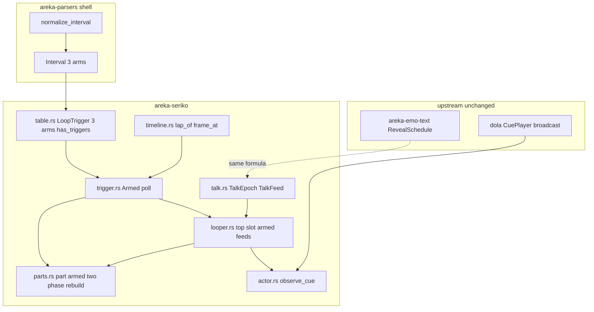
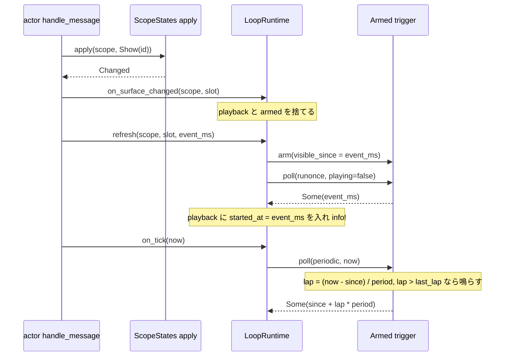
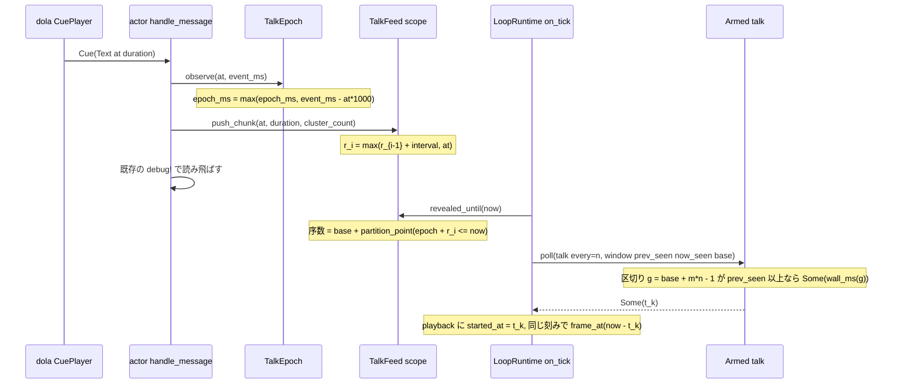
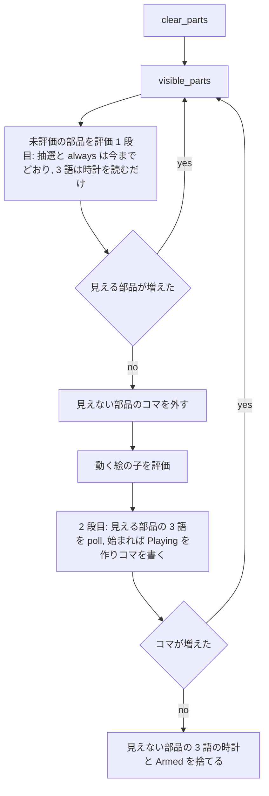

# Design Document: areka-P0-seriko-trigger-intervals

> 2026-10-10・`kiro-spec-design`。入力は確定済みの `requirements.md`・`research.md`（ギャップ分析＋要件討議の裁定）・`brief.md`（棚卸㉓の分割と「同じウェーブで触らない約束」）・steering（`product.md`・`tech.md`・`structure.md`・`logging.md`）。ファイルと行の主張はワークツリー `claude/seriko-trigger-intervals-490874`（main `226109e8` の上）の実物で確かめた。

## Overview

**Purpose**: SERIKO の interval の 3 語 `talk,数値`・`runonce`・`periodic,数値` を seriko の表に採って再生し、台詞に合わせてキャラクターの口が動くようにする。利用者に見える結果は、⑴ バルーンに文字が現れるのに合わせて口が動く、⑵ 面に切り替わった瞬間に 1 回だけ動く、⑶ その面でいる間、決めた秒ごとに動く、の 3 つ。

**Users**: ゴーストの利用者（口パクが見える）・シェルの作者（`surfaces.txt` に書いた 3 語がそのまま効く）・開発者（採った・採らなかった理由がログから読める）。

**Impact**: 今の areka は 3 語を読んで記録するだけで再生しない（読み手は `talk,数値`・`periodic,数値` の数値を捨てる＝`crates/areka-parsers/src/shell/decode.rs` の `normalize_interval`、seriko の表は `Other` の語を `debug!` して非採録＝`crates/areka-seriko/src/table.rs` の `from_world_and_films`）。本設計は、読み手の型 `Interval` に 3 つの腕を足し、seriko に「いつ始めるか」を決める引き金の状態（新しい兄弟モジュール `trigger.rs`・`talk.rs`）を置き、再生そのもの（`frame_at` による進行・`-1` の停止・末尾の保持・再生中は始め直さない）は今の `random` と同じ経路に乗せる。文字の到着は seriko に既に届いている文字の cue（`actor.rs` の `handle_message` が今は読み飛ばす `Text`・`Choice`）から数え、新しい時計も新しい知らせの口も作らない。

### Goals

- `talk,数値`・`runonce`・`periodic,数値` を数値ごと読み、seriko の表に採り、一番上の面でも部品（element定義の子・pattern定義の先）でも、シェルの面でもバルーンの面でも同じ決まりで再生する（要件 1〜5）。
- 時刻は正確に扱う: 面に入った時刻・文字が現れる時刻をそのまま起点にし、刻みの遅れは経過として数え、新しい時計を持ち込まない（要件 6）。
- 採った・採らなかった・捨てた経路の記録を、長い台詞で記録があふれない水準で残す（要件 7）。
- 3 語を書かないシェル（同梱の検体 4 本）の見た目・記録・乱数の消費の並びを変えない（要件 8）。
- 判断の分岐を偽の時計と偽の文字の到着で固定する決定論のテスト、網羅台帳の 3 行、口パクの検体と実機の確かめ（要件 9〜11）。

### Non-Goals

- `yen-e`・`never`・台本のタグ `\i[ID]`・`animation*.name` → `areka-P0-seriko-script-triggers`。
- `always` を含む `+` の組み合わせ（`bind+always` ほか）→ `areka-P0-seriko-interval-combinations`。`bind+runonce` など 3 語を含む組み合わせも、今までどおり元の綴りを添えた記録だけ（採らない）。
- `\i[ID,wait]`・`start`／`alternativestart`／`stop` などアニメーションから別のアニメーションを呼ぶメソッド・`\![anim,…]` 系。
- ゴーストの `descript.txt` の `don't need seriko talk`（口パクの無効化）。読まない。
- `\_q`・`\![quicksection]`・`\![set,balloonwait]`（`areka-P0-sakura-time-directives`）・クリックでの早送り（`areka-P0-talk-fast-forward`）。本設計は「文字が現れる時刻」を文字の層と同じ式で写すので、これらが文字の層の時刻を変えても、口はその時刻の列に自動で従う（式が同じなら同じにずれる）。
- 見えていない部品の抽選の乱数の消費（`areka-P0-seriko-rebuild-hidden-lottery`）。本設計は「見えていない部品で 3 語の再生が始まらない」ことだけを自分で保証し、乱数の並びは今のまま触らない。
- seriko の時計の種類（`GetTickCount64`）の変更。研究項目 11 の「QPC 由来の ms に揃える」案は採らない（下の Architecture「時計」）。

## Boundary Commitments

### This Spec Owns

- 読み手: `Interval` の 3 つの腕（`Runonce`・`Periodic { secs }`・`Talk { n }`）と、`normalize_interval` の読み方（小文字の完全一致・数値の検査・読めない数値は元の綴りを `Other` へ）。型 `Animation`・`Pattern`・`Element` の欄は変えない。
- seriko の表: `LoopTrigger` の 3 つの腕、採録の `debug!`／`warn!`、表の印 `has_triggers`（繰り返しの経路を通す門に加える）。
- 引き金の判定と状態（新規 `trigger.rs`）: 「見え始めの時刻」を起点にした `runonce`（1 回だけの印）・`periodic`（周の数え）・`talk`（文字の区切りの判定）の純関数と小さな状態。一番上と部品で同じ関数を使う。
- 文字の到着の写し（新規 `talk.rs`）: 文字の層と同じ式で「i 文字目が現れる時刻」を seriko の時計の上に写す起点（epoch）と、スコープごとの文字の時刻の列。
- 配線: `looper.rs`（一番上の引き金・刻みと切り替えでの判定・文字の窓の供給）・`parts.rs`（部品の引き金・見える部品だけが受ける 2 段の評価・見えなくなった部品の時計を捨てる）・`actor.rs`（届いた cue を写しへ渡す 1 か所）。
- 網羅台帳 `doc/ukadoc-coverage/ledger/assets.toml` の `talk,数値`・`runonce`・`periodic,数値` の 3 行と `always` の担当の付け替え、`sometimes`・`rarely` の note の古い 1 文の訂正。台帳の整合の見張りが要求する `doc/ukadoc-coverage/roadmap-draft.md` の spec 表の行（担当の数）。
- 口パクの検体（`crates/areka-seriko/tests/fixtures/trigger-intervals/`）と、それを使う決定論の E2E・実機の確かめの手順。

### Out of Boundary

- 台本の読み手 `crates/areka-parsers/src/sakura/`・台本のコンパイル `crates/areka-sakura/src/compile.rs`・運び手の名前の表 `crates/areka/src/emo2_boot/consumer_ledger.rs`・合成 `crates/areka-emo-compose/`（`plan_extent*.rs` を含む）には触らない（brief の約束）。
- dola の cue の形（`TalkCue`・`CueCommand`）・`CuePlayer` の配送・`CueSink::preview` の先渡し。知らせを足さず、届いている cue を読むだけ。
- 文字の層（`areka-emo-text`）の `RevealSchedule`・`TalkClock`。式を写すだけで触らない。
- `crates/areka/src/emo2_boot/mod.rs` の時計の結線（seriko の時計は `GetTickCount64` のまま）。
- seriko の `timeline.rs`（`frame_at`・`lap_of`・`always_at` をそのまま使う）・`state.rs`（面の切り替えの判定 `apply` の `Changed`／`Unchanged` をそのまま使う・面に入った時刻は状態層に置かない）・`output.rs`・`resolve.rs`・`bind.rs`。
- 抽選（`random`・`bind+random`・`sometimes`・`rarely`）と `always`・`bind` の振る舞い。

### Allowed Dependencies

- `areka_parsers::shell::{Interval, Animation, Pattern}`（読み手の型・腕を足すだけ）。
- `areka_emo_compose::{is_always_interval, NestTable, PartKey, PatternState, BindSet}`（今の seriko が既に使う公開 API だけ。`is_always_interval`・`is_bind_interval` は `matches!` なので新しい腕で答えが変わらない＝`crates/areka-emo-compose/src/nesting.rs` の `is_always_interval`・`plan.rs` の `is_bind_interval`）。
- `areka_sakura::{ActorKey, TalkCue, CueCommand, cluster::cluster_count}`（`cluster_count` は `crates/areka-sakura/src/cluster.rs`＝台詞の再生時間を求める単位と同じ書記素クラスタ）。
- `dola::cue::CueSink`（既存の受け口）。
- seriko の中: `trigger.rs`・`talk.rs` は `table.rs`（`LoopAnimation`・`LoopTrigger`）と `timeline.rs`（`lap_of`）だけに依存し、`looper.rs`・`parts.rs`・`actor.rs` へは依存しない（下の依存の向き）。
- テスト: `log-capture-kit`・`sample-ghost-kit`（既存の dev-dependencies）。新しい外部クレートは足さない。

### Revalidation Triggers

- `Interval` に腕が増えたので、`Interval` を網羅 `match` している crate 内のコードは腕を足す必要がある（`#[non_exhaustive]` ゆえ crate の外は `_` 腕で通る）。`LoopTrigger` は `#[non_exhaustive]` でないので、seriko の中と seriko の型を `match` するテスト（`crates/areka/src/emo2_boot/` の E2E など）は腕の漏れがコンパイル時に出る。
- 文字の層が「i 文字目が現れる時刻」の式（`crates/areka-emo-text/src/state.rs` の `RevealSchedule::extend_chunk`＝`r_i = max(r_{i−1} + interval, chunk_start)`・`interval = duration / glyph_count`・先頭は `r_0 = chunk_start`）や起点の式（`crates/areka/src/emo2_boot/talk_clock.rs` の `TalkClock::observe_cue`＝`epoch = max(epoch, now − at)`・全部の cue で観測）を変えたら、`talk.rs` の写しも同じに変える（`areka-P0-sakura-time-directives`・`areka-P0-talk-fast-forward` が変える見込み）。
- `cue_target_of`（`crates/dola/src/cue/sink.rs`）の `Text`・`Choice` の分類や、`Choice{text}` を文字の層が現れさせる決まり（`state.rs` の `Choice` の腕）が変わったら、`talk.rs` が読む腕を見直す。
- `ScopeStates::apply` の「同じ番号は `Unchanged`・それ以外は `Changed`」（`crates/areka-seriko/src/state.rs`）が変わったら、`runonce` の「切り替わった瞬間」の定義が動く。
- `parts.rs` の `rebuild` の評価の順を `areka-P0-seriko-rebuild-hidden-lottery` が変えるとき、本設計の 2 段の評価（見えると確定した部品だけが引き金を受ける）を保つこと。
- 台帳の整合の見張り（`crates/ukadoc-survey/tests/consistency/spec_checks.rs` の腕 a・c・f）が、担当の数と spec 表の行を要求する。

## Architecture

### Existing Architecture Analysis

- **読み手**（`crates/areka-parsers/src/shell/`）: `Interval`（`model.rs`）は `#[non_exhaustive]`・`Bind`／`Random{k}`／`BindRandom{k}`／`Other(Box<str>)`。`normalize_interval(fields)`（`decode.rs`）は `fields[1]` が `bind`／`random`／`bind+random` のときだけ型へ写し、それ以外は `Other(fields[1])`＝語だけ（数値は捨てる）。数値は `field_u32`（欠落・非数値は 0）。読み手は失敗せず記録も出さない層（`tracing` の呼び出しが 1 つも無い）。
- **表**（`crates/areka-seriko/src/table.rs`）: `LoopTrigger` は `Random{k}`／`BindRandom{k}`／`Always{period_ms, laps}`（`Copy`・`Eq`・`#[non_exhaustive]` でない）。`from_world_and_films` は面を昇順に回し、`interval` の `match` → `k==0` の `warn!` → コマの整列 → 空の `warn!` → `always` の周期、の順。門は `is_continuous()`（`has_animated_parts || has_always`）で、`LoopRuntime::refresh` は偽なら即 `None`、`on_tick` の (3) は「再生中が無い・一番上に `always` が無い・動く部品が見えない」slot を飛ばす。
- **刻み**（`looper.rs`）: `on_tick(now_ms, states)` は (1) 単調性 → (2) 1000 ms 境界を跨いだ刻みだけ抽選（`should_fire` で乱数を消費・`Always` は乱数の前で `continue`）→ (3) 進行（`playback: HashMap<(scope, slot), HashMap<anim_id, Playback{started_at_ms}>>`・`frame_at(frames, now − started)`・`Pending`→除去・`Active`→コマ・`FinishedResidual`→コマを残して playback 除去＋`info!`・`Stopped`→除去＋`info!`）→ (4) `commit_pattern`。`refresh(scope, slot, at_ms, states)` は `\s`・`\b`（`actor.rs` の `apply`／`apply_balloon` が `Changed` のとき・直前に `on_surface_changed` で playback を捨てる）・着せ替え（`bind` の `Changed`）・窓の知らせ（`on_stage`）の 4 か所から呼ばれ、一番上の `always` の時計を出来事の時刻で作る。
- **部品**（`parts.rs`）: 鍵は (scope, slot) × (`PartKey`, anim id)、値は `PartAnim::{Playing{started_at_ms}, Residual{frame_index}}`。`gate(anim, binds)` は `Lottery(k)`／`Always{..}`／`Off`。`rebuild` は `pattern.clear_parts()` → `visible_parts` → 未評価の部品を評価 → 増えなくなるまで → 評価したが最終的に見えない部品のコマを外す（`evaluated.len() > visible.len()` の枝）。この 1 回目の評価は、外側の今のコマでは見えない部品にも回る（`seriko-rebuild-hidden-lottery` の性質）。見えなくなった部品の時計は回数つきの `always` だけ `drop_unseen_finite` で捨てる。
- **面の状態**（`state.rs`）: `apply(scope, Show(id))` は既に `Shown(id)` なら `Unchanged`、未知・`Hidden`・別の番号なら `Changed`。未知のスコープへの最初の `Show` が `Changed` であることは `state_surface_tests.rs` の `show_same_surface_twice_second_is_unchanged`（1 回目が `Changed`）が既に固定している（研究項目 12・新しい檻は要らない）。着せ替えは `apply_bind`→`commit_bind` で `apply` を通らない。`stage_slots()` は進行の対象 (scope, slot, sid, open) を返し、バルーンの `open` は窓の知らせ。
- **文字の cue**: `TalkCue { at: f64（台本の秒）, actor, command, duration: f64 }`（`crates/dola/src/cue/command.rs`）。`Text(String)` の `duration` は `cluster_count × 50 ms` を秒にした値。`CuePlayer` は全 cue を全 sink へ放送し、seriko の `handle_message`（`actor.rs`）は `cue_target_of` が `Some(CueTarget::Balloon)` を返す `Text`・`Choice`・`Clear`・`ClearAll` などを `debug!` して捨てる。文字の層は `TalkClock`（`crates/areka/src/emo2_boot/talk_clock.rs`）の `epoch = max(epoch, QPC_now − at)` を**全部の cue**で更新し（`ClockedTextSink::emit`）、毎フレーム `talk_time = max(now − epoch, 0)` で `RevealSchedule::visible(t)` を引く（`crates/areka-emo-text/src/actor_present.rs`）。`Choice{text}` は `Text` と同じ追記＋同じ時刻式で現れる（`state.rs` の `Choice` の腕）。`Clear` は schedule を初期化する（次の塊は `r_0 = chunk_start` から）。

### 設計の芯（4 つの決め）

1. **引き金は「見え始めの時刻」を起点にした小さな状態 `Armed` で、一番上と部品で同じ**（新規 `trigger.rs`）。`runonce`＝見え始めの最初の判定で 1 回鳴らす印、`periodic`＝見え始めからの周の数え（`lap_of`）、`talk`＝文字の序数の区切り。「いつ始めるか」だけを決め、始まった後は今の `playback`／`PartAnim::Playing` にそのまま乗る。
2. **面に入ったことは `on_surface_changed` が `Armed` を捨てることで表す**。`refresh` の署名は変えず、`refresh`／`on_tick` は「面が在るのに `Armed` が無い」slot を見て出来事の時刻（無ければ刻みの時刻）で構える（研究項目の議題 3・R1／R2 のどちらでもない最小の形＝新しい口も理由の引数も要らない）。着せ替え・窓の知らせの `refresh` は `Armed` が在るので `runonce` を鳴らさない（要件 2.4）。
3. **文字の時刻は文字の層と同じ式を seriko の時計の上で引く**（裁定 T2・要件 6.4）。起点は `epoch_ms = max(epoch_ms, now_ms − at × 1000)` を届いた全部の cue で更新（`TalkClock` と同じ）、i 文字目は `r_i = max(r_{i−1} + interval, chunk_start)`（`RevealSchedule` と同じ・台本の秒のまま持つ）、壁時刻は `epoch_ms + r_i × 1000`。区切りの時刻 t_k を刻みが越えた最初の刻みで `started_at = t_k` として始める（裁定 2・要件 4.5）。
4. **部品は見えると確定した部品だけが引き金を受ける**（P1）。`rebuild` を 2 段にし、1 段目（今の評価）では 3 語の時計を読むだけ、2 段目で最終的に見える部品の引き金を判定する。引き金で新しいコマが載って見える部品が増えたら 1 段目へ戻る（同じ刻みで子まで出る＝1 刻み遅らせない）。見えなくなった部品の 3 語の時計と `Armed` は捨てる（P3・要件 5.6・5.9）。

### Architecture Pattern & Boundary Map



**Architecture Integration**:

- Selected pattern: 研究 §3.1 の **C（混成）**。判断の分岐を `trigger.rs`／`talk.rs` の純関数＋小さな状態に 1 か所で持ち、`looper.rs`／`parts.rs`／`actor.rs`／`table.rs` は配線だけ。
- Domain boundaries: 読み手（綴り→型）／表（型→引き金の種類）／引き金（いつ始めるか）／再生（どのコマか＝既存）／文字の写し（いつ現れるか）。再生の決まり（`-1`・末尾・再生中は始め直さない）は既存の経路に一切触れずに再利用する。
- Existing patterns preserved: `on_surface_changed` → `refresh` の順、`playback`／`PartAnim` の形、`frame_at`／`lap_of`、`stage_slots` の `open`、`gate`／`look`／`rebuild` の骨、`commit_pattern` の差分発行、`emit_display` の単一発行点。
- New components rationale: `trigger.rs`（一番上と部品で同じ決まりを機械的に揃える・要件 5.4）、`talk.rs`（文字の層の式の写しを 1 か所に閉じる・要件 6.4）。
- Steering compliance: 時刻は正確に扱う（丸めない・遅れは経過に数える・第 3 の時計を持ち込まない）、1 フレーム遅らせる解を取らない（2 段の評価は同じ刻みで子まで出す）、log-first（捨てる経路も `debug!`・失敗は `warn!`）、兄弟ファイル・1,000 行、檻に入れるのは判断の分岐だけ。
- 依存の向き（左から右へだけ・逆は違反）: `areka-parsers::shell`（`Interval`）→ `table.rs`（`LoopTrigger`）→ `timeline.rs`・`trigger.rs`・`talk.rs`（純関数と小さな状態・互いに依存しない）→ `looper.rs`・`parts.rs`（配線・`looper` が `parts` を呼ぶ）→ `actor.rs`（受け口）。`trigger.rs`／`talk.rs` が `looper`・`parts`・`actor`・`state` を `use` したら設計違反。

### 時計（要件 6）

- seriko の時計は今までどおり 1 本（本番は `crates/areka/src/emo2_boot/mod.rs` の `tick_count_ms`＝`GetTickCount64`・刻みと共有）。引き金の起点（面に入った時刻・窓が開いた時刻）は `event_ms()`（時計が在れば今・無ければ直前の刻み）で取り、刻みの境目に丸めない（要件 6.1）。再生中の経過は「今 − 開始」（要件 6.2）。
- 文字の時刻は `talk.rs` が seriko の時計の読みから起点を見積もる（要件 6.3・6.4）。台本の時計（QPC）を seriko へ注入しない（T3 は採らない）。
- **seriko の時計を QPC 由来に揃える案（研究項目 11）は採らない**。残る差は時計の種類の差（`GetTickCount64` の分解能 10〜16 ms）で、刻み自体が 16 ms なので利用者に見える差にならない。実機の確かめ（要件 11）で `talk` の開始時刻と文字の層の `Text cue 適用` の `at`・`interval` を突き合わせ、ずれが 1 刻みを超えて見えたら `emo2_boot/mod.rs` の結線 1 行（`seriko_clock`）の議題として起票する。
- `started_at_ms` は `u64`（既存の `Playback`・`PartAnim::Playing` の欄）なので、文字の区切りの壁時刻（f64 ms）は **1 ms 未満を切り捨てて**入れる。時計の分解能（1 ms）より細かい値は持てないための切り捨てで、刻みの境目への丸めではない（経過が最大 1 ms 未満だけ多く数えられる）。

### Technology Stack

| Layer | Choice / Version | Role in Feature | Notes |
|-------|------------------|-----------------|-------|
| 読み手 | `areka-parsers`（Rust 2024・std のみ） | `Interval` の 3 腕と `normalize_interval` | 新しい依存なし |
| エンジン | `areka-seriko`（`tracing`・`areka-sakura`・`areka-emo-compose`・`dola`） | 引き金の状態・文字の写し・配線 | `areka_sakura::cluster::cluster_count` を新たに使う（既存の依存） |
| テスト | `log-capture-kit`・`sample-ghost-kit`（dev） | 記録の檻・実機の検体の写し | 既存の dev-dependencies |
| 台帳 | `doc/ukadoc-coverage/ledger/assets.toml`・`roadmap-draft.md` | 3 行の判定・担当・note・spec 表の担当の数 | 見張りは `crates/ukadoc-survey/tests/consistency/` |

## File Structure Plan

### Directory Structure

```
crates/areka-parsers/src/shell/
├── model.rs                         # 変更: Interval に Runonce / Periodic{secs} / Talk{n} を足す
├── decode.rs                        # 変更: normalize_interval の 3 語の読み（数値の検査・読めなければ Other(原文)）
└── decode_interval_trigger_tests.rs # 新規: 3 語の読みの檻（要件 9.1）・接続は decode.rs の #[path] 1 行
crates/areka-seriko/src/
├── table.rs                         # 変更: LoopTrigger 3 腕・採録の debug!/warn!・has_triggers・is_continuous・has_talk
├── table_trigger_tests.rs           # 新規: 採録・無効の warn!・印の檻（要件 1.5・7.1・7.2・8.1）
├── trigger.rs                       # 新規: Armed（見え始めの起点・runonce の印・periodic の周）・TalkWindow・poll
├── trigger_tests.rs                 # 新規: poll の純関数の檻（要件 2.x・3.x・4.5〜4.7 の判定）
├── talk.rs                          # 新規: TalkEpoch（起点の見積もり）・TalkFeed（文字の時刻の列・序数・刈り込み）
├── talk_tests.rs                    # 新規: 式の写し・書記素・Clear の継ぎ目・刈り込みの檻（要件 4.2・4.10・6.4）
├── looper.rs                        # 変更: 一番上の Armed・文字の窓・刻みと refresh の引き金・門・talk の記録の水準
├── looper_trigger_tests.rs          # 新規: 一番上の runonce/periodic/talk を偽の刻みで固定（要件 9.2〜9.4）
├── parts.rs                         # 変更: Gate::Trigger・2 段の rebuild・部品の Armed・見えなくなった時計を捨てる
├── parts_trigger_tests.rs           # 新規: 見える部品で始まる・見えない部品で始まらない・後から見えたときの起点（要件 9.5）
├── actor.rs                         # 変更: Cue の腕の先頭で loop_runtime.observe_cue(&cue) を 1 回呼ぶ
├── actor_talk_tests.rs              # 新規: 偽の文字の到着（Text/Choice/Clear）からの口パク・スコープ別・非表示（要件 9.4・9.6）
├── actor_trigger_fixture_tests.rs   # 新規: 検体の surfaces.txt を本物の読み手で読み、本物のアクター＋偽の時計で通す E2E
└── lib.rs                           # 変更: mod trigger; mod talk; の宣言（公開面は変えない）
crates/areka-seriko/tests/fixtures/trigger-intervals/
├── README.md                        # 新規: 面の役の表・絵の出どころ（emo2 の既存の絵を番号で指す）・実機の手順への参照
└── surfaces.txt                     # 新規: 3 語を書いた面（9100〜）・部品の面・無効な数値の面
doc/ukadoc-coverage/
├── ledger/assets.toml               # 変更: talk/runonce/periodic の 3 行・always の担当・sometimes/rarely の note
└── roadmap-draft.md                 # 変更: spec 表 [[spec]] の担当の数（本 spec 1→3）・seriko-interval-combinations の行を足す・[briefs].count
```

### Modified Files

- `crates/areka-parsers/src/shell/model.rs` — `Interval` に `Runonce`・`Periodic { secs: u32 }`・`Talk { n: u32 }` を足す（`#[non_exhaustive]` のまま・欄の型は `Random{k}` と同じ流儀）。`Other` の doc に「`talk`／`periodic` で数値が読めないときは第 2 欄以降を `,` で繋いだ原文」を書く。
- `crates/areka-parsers/src/shell/decode.rs` — `normalize_interval` に `"runonce"`・`"talk"`・`"periodic"` の腕。数値は `fields[2]` を `u32` として読み、1 以上なら型へ、欠落・0・非数値なら `Other(fields[1..].join(","))`。失敗しない・記録を出さない層のまま。
- `crates/areka-seriko/src/table.rs` — `LoopTrigger::{Runonce, Periodic{period_ms: NonZeroU64}, Talk{every: NonZeroU32}}`。`from_world_and_films` の `match` に 3 腕（採録の `debug!`・要件 7.1）、`Other` の腕で先頭の語が `talk`／`periodic` なら `warn!`（要件 1.5・7.2）。`AnimationTable` に `has_triggers`（印）・`has_talk()`・`is_continuous()` の拡張。既存の檻 `only_random_and_bindrandom_are_recorded_others_debug_logged` の `Other("runonce")` を非駆動の語（`yen-e`）へ替える。
- `crates/areka-seriko/src/looper.rs` — `LoopRuntime` に `armed: HashMap<(ActorKey, Slot), Armed>`・`epoch: TalkEpoch`・`feeds: HashMap<ActorKey, TalkFeed>`・`has_talk: bool`。`observe_cue`（新規・`actor.rs` から）。`on_surface_changed` で `armed` を捨てる。`refresh`／`on_tick` で構える・判定する。(3) の門に `top_has_trigger`。`talk` の再生の終わり・停止の記録を `debug!` に下げる（他は不変）。`forget_slot_kind` で `armed` と `has_talk` を更新。
- `crates/areka-seriko/src/parts.rs` — `Gate::Trigger`、入れ物に `BTreeMap<PartKey, Armed>`、`rebuild` の 2 段目（`arm` 閉包）、`advance`／`refresh` に文字の窓の引数、`drop_unseen_finite` を「回数つきの `always`＋3 語」へ広げる（`is_transient`）、`clear`／窓の閉じで `Armed` を捨てる／隠す。
- `crates/areka-seriko/src/actor.rs` — `SerikoMsg::Cue(cue)` を取り出した直後（`cue_target_of` の `match` の前）に `loop_runtime.observe_cue(&cue)` を 1 回。他は不変（`Text` などの `debug!` の腕はそのまま）。
- `crates/areka-seriko/src/lib.rs` — `mod trigger; mod talk;`。
- `doc/ukadoc-coverage/ledger/assets.toml` — 要件 10 のとおり。
- `doc/ukadoc-coverage/roadmap-draft.md` — spec 表の `areka-P0-seriko-trigger-intervals` の `owner_count` を 1→3（`talk,数値`・`runonce`・`periodic,数値`）、`areka-P0-seriko-interval-combinations` の `[[spec]]` 行（`stage = "A"`・`bundle = "サーフェスアニメーション"`・`owner_count = 1`＝`always`）を足し、`[briefs].count` を 48→49。**理由**: 見張り `crates/ukadoc-survey/tests/consistency/spec_checks.rs` の腕 f は台帳の非空の宛先が spec 表の名前であることを要求し、腕 c は担当の数の一致を要求する。`seriko-interval-combinations` の行は今の表に無い（2026-10-10 の分割で起票したが表は 10-08 の写し）ので、`always` の担当を付け替える（要件 10.3）には行を足すしかない。

### 触るファイルと約束

- brief の「残した側が触るファイル」の列: `shell/{model,decode}.rs`・seriko の `{table,looper,parts,actor}.rs` と兄弟のテスト・`assets.toml`・検体。本設計は **`timeline.rs`・`state.rs` に触らない**（列にはあるが要らない）。
- 列に無いが触るもの（約束の外ではない・報告のため明記）: `crates/areka-seriko/src/lib.rs`（`mod` 宣言 2 行）・`crates/areka-seriko/tests/fixtures/trigger-intervals/`（新規フォルダ）・`doc/ukadoc-coverage/roadmap-draft.md`（上の理由）。
- 約束のファイル（`crates/areka-parsers/src/sakura/`・`crates/areka-sakura/src/compile.rs`・`consumer_ledger.rs`・`crates/areka-emo-compose/`・`plan_extent*.rs`・型 `Animation`／`Pattern`／`Element` の欄）には **触らない**。検体は compose の下に置かない（seriko の下に新しく切る）。`crates/areka/src/emo2_boot/mod.rs` にも触らない（E2E は seriko の中・時計の結線は変えない）。

## System Flows

### 面に入ってから `runonce`・`periodic` が鳴るまで（一番上）



- 同じ番号の再指定は `apply` が `Unchanged` を返すので `on_surface_changed` も `refresh` も呼ばれない＝鳴らない（要件 2.3）。着せ替えの `refresh` は `armed` が在るので構え直さない＝鳴らない（要件 2.4）。`\s[-1]` の後の `Show` は `Changed`＝鳴る（要件 2.6）。
- `periodic` は構えた時点の周が 0 なので切り替わった瞬間には鳴らず（要件 3.1）、`lap` が進んだ刻みで最新の境目の時刻を開始にする（要件 3.4・3.5）。再生中に周が進んだときは `last_lap` だけ進めて鳴らさない（要件 3.3）。

### 文字が届いてから `talk` が鳴るまで



- 文字の層と同じ式なので、`\x` の後の cue（`at` が実時刻より小さい）や新しいトークで起点が前へ飛ぶ場面も文字の層と同じにずれる（研究項目 2）。
- 区切りが同じ時刻に 2 つ以上来ても、刻みが越えた区切りのうち最新の 1 つだけを開始にする（要件 4.6）。再生中なら区切りを見送り、`seen` は進めるので後から鳴り直さない（要件 4.7）。

### 部品の 2 段の評価（刻み 1 回・`advance`）



- 2 段目で始まった再生のコマが新しい子を見せると 1 段目へ戻り、その子も同じ刻みで評価する（1 刻み遅らせない）。評価済みの集合と `Armed` の印は増えるだけなので止まる。2 段目の `poll` は同じ刻みで 2 度呼ばれても同じ答え（`runonce` は印・`periodic` は `last_lap`・`talk` は再生中の判定）。
- 1 段目で評価したが最終的に見えなかった部品は、`Armed` を持たず `poll` も受けないので、再生が始まらない（要件 5.6）。見えていた部品が見えなくなったら時計と `Armed` を捨て、次に見えた刻みで `since = その刻み` の新しい `Armed` を構える（要件 5.9）。

## Requirements Traceability

| Requirement | Summary | Components | Interfaces | Flows |
|-------------|---------|------------|------------|-------|
| 1.1 | `talk,数値` を語と数値で運ぶ | 読み手 | `Interval::Talk { n }`・`normalize_interval` | — |
| 1.2 | `periodic,数値` を語と数値で運ぶ | 読み手 | `Interval::Periodic { secs }` | — |
| 1.3 | `runonce` を運ぶ | 読み手 | `Interval::Runonce` | — |
| 1.4 | 小文字の完全一致・大文字混じり・`+` は `Other` | 読み手 | `normalize_interval` の腕は `"talk"`／`"periodic"`／`"runonce"` の逐語 | — |
| 1.5 | 読めない数値は採らず `warn!` 1 回 | 読み手・表 | `Other("talk,…")`（原文）→ 表の `Other` 腕の `warn!` | — |
| 1.6 | 既存の語の読みを変えない | 読み手・表 | 既存の腕は不変・新しい腕を足すだけ | — |
| 2.1 | 切り替わった刻みに 1 回頭から | 引き金・looper | `on_surface_changed`→`refresh`→`Armed::arm`→`poll(Runonce)` | 面に入ってから |
| 2.2 | 表示中は 2 回目を鳴らさない | 引き金 | `Armed.fired` の印 | 同上 |
| 2.3 | 同じ面の再指定は鳴らさない | state（既存） | `apply` の `Unchanged`（`refresh` を呼ばない） | 同上 |
| 2.4 | 着せ替えだけでは鳴らさない | looper | 着せ替えの `refresh` は `armed` が在るので構え直さない | 同上 |
| 2.5 | 戻ったらもう 1 回 | looper・引き金 | `on_surface_changed` が `Armed` を捨てる → 新しい `Armed` | 同上 |
| 2.6 | 非表示から表示へ戻ったら鳴らす | state（既存）・looper | `Hidden`→`Show` は `Changed` | 同上 |
| 3.1 | 起点から数値秒ごと・瞬間には鳴らさない | 引き金 | `poll(Periodic)`: `lap_of(now − since, period)` の `lap ≥ 1` | 面に入ってから |
| 3.2 | 離れたら止め・戻ったら新しい起点 | looper・引き金 | `Armed` を捨てる／`hide`→`show(at)` で `since` を置き直す | 同上 |
| 3.3 | 再生中の回は飛ばす | 引き金 | `playing` なら `last_lap` だけ進める | 同上 |
| 3.4 | 2 周以上またいでも 1 回 | 引き金 | 最新の周の境目 `since + lap × period` だけ | 同上 |
| 3.5 | 数値秒ちょうど・起点をずらさない | 引き金・timeline | `lap_of`（割り算・丸めない）・`since` は出来事の時刻 | 同上 |
| 4.1 | 数値分の文字が現れるごとに 1 回 | 文字の写し・引き金 | `TalkFeed::revealed_until`・`poll(Talk)` | 文字が届いてから |
| 4.2 | 書記素クラスタで数える | 文字の写し | `cluster_count`（`areka_sakura::cluster`） | 同上 |
| 4.3 | スコープごと・待ちや切れ目をまたいで積み上げる | 文字の写し・引き金 | `TalkFeed` はスコープごと・序数は塊をまたいで連続・`TalkCursor { base, seen }` | 同上 |
| 4.4 | 面の切り替えで 0 から | looper | `on_surface_changed` が `Armed`（`TalkCursor` 込み）を捨て、構え直しで `base = revealed_until(at)` | 同上 |
| 4.5 | t_k を越えた最初の刻みで `started_at = t_k` | 引き金・looper | `poll(Talk)` が返す `wall_ms(g)` を `Playback.started_at_ms` に入れ、同じ刻みの (3) が `frame_at(now − t_k)` | 同上 |
| 4.6 | 同じ時刻の区切りは 1 回 | 引き金 | 越えた区切りのうち最新の 1 つ | 同上 |
| 4.7 | 再生中の区切りは始め直さない | 引き金 | `playing` なら `None`・`seen` は進む | 同上 |
| 4.8 | 他のスコープは動かさない | 文字の写し | `TalkFeed` の鍵は `ActorKey`・窓は (scope, slot) ごと | 同上 |
| 4.9 | 非表示・`talk` 無しは何もしない・記録も増やさない | looper | `stage_slots` に無い slot は評価しない・`visible_since = None` なら `poll` は `None`・`talk` 無しの面は窓を作らない | 同上 |
| 4.10 | 文字でない知らせは数えない・選択肢は数える | 文字の写し | `observe_cue` が読むのは `Text`・`Choice{text}`（追記）と `Clear`／`ClearAll`（継ぎ目の初期化）だけ | 同上 |
| 5.1 | コマを番号順に 1 回流し繰り返さない | looper・parts（既存） | `frame_at`・`FinishedResidual`→playback 除去 | — |
| 5.2 | `-1` で消して終える | looper・parts（既存） | `FrameStatus::Stopped` | — |
| 5.3 | 再生中は頭からやり直さない | 引き金 | `poll(.., playing)` は `playing` で `None` | — |
| 5.4 | 一番上でも部品でも同じ決まり | 引き金 | `Armed`・`poll` を `looper.rs` と `parts.rs` の両方が呼ぶ | 部品の 2 段 |
| 5.5 | シェルでもバルーンでも同じ・閉じた窓は非表示 | looper | `stage_slots` の `open` → `Armed::hide`／`show`（`runonce` の印は残す） | — |
| 5.6 | 見えない部品で始めない | parts | 2 段目は最終的に見える部品だけ | 部品の 2 段 |
| 5.7 | 乱数を消費しない | looper・parts | `Gate::Trigger`／3 腕は `should_fire` の前で分岐（(2) の輪に入れない） | — |
| 5.8 | 抽選と混在しても干渉しない | looper・parts | `playback` の鍵は animation の番号・引き金は種類ごとに別の状態 | — |
| 5.9 | 部品が見えた瞬間が起点・見えなくなったら止める | parts・引き金 | `Armed::arm(since = 見えた刻み)`・`drop_unseen` で捨てる | 部品の 2 段 |
| 6.1 | 出来事の時刻を起点にする | looper | `refresh(at_ms = event_ms())`・`on_stage` の `at_ms` | — |
| 6.2 | 遅れた分だけ進める | looper・parts（既存） | 経過＝`now − started_at` | — |
| 6.3 | 新しい時計を持ち込まない | 文字の写し | `TalkEpoch` は seriko の時計の読みから見積もる | — |
| 6.4 | 文字の層と同じ式 | 文字の写し | `TalkEpoch::observe`・`TalkFeed::push_chunk` | 文字が届いてから |
| 7.1 | 採ったときの `debug!` | 表 | `from_world_and_films` の 3 腕 | — |
| 7.2 | 採れなかったときの `warn!` | 表 | `Other("talk,…")`／`Other("periodic,…")`・コマ列空（既存の `warn!`） | — |
| 7.3 | `talk` を文字ごと・刻みごとに記録しない | looper・parts | 開始は `debug!`・`talk` の終わり／停止の記録も `debug!` | — |
| 7.4 | `+` の組み合わせ・範囲外の語は今までどおり | 表 | `Other` の腕の既存の `debug!` | — |
| 7.5 | 捨てる経路は `warn!` 以上を出さない | looper・parts・引き金 | `poll` の `None` は記録しない（`trace!` も出さない） | — |
| 8.1 | 無いシェルで仕事を増やさない | 表・looper | `has_triggers`／`has_talk` の門・`top_has_trigger` | — |
| 8.2 | 既存の決定論テストと乱数の並び | looper・parts | 抽選の輪に入れない・`rebuild` の 1 段目は不変 | — |
| 8.3 | 同梱の検体の見た目と記録 | 表 | 3 語が無い表は `has_triggers = false`・`observe_cue` は即戻る | — |
| 9.1 | 読み手の檻 | テスト | `decode_interval_trigger_tests.rs` | — |
| 9.2 | `runonce` の檻 | テスト | `looper_trigger_tests.rs`・`actor_talk_tests.rs`（`\s[-1]` 復帰） | — |
| 9.3 | `periodic` の檻 | テスト | `trigger_tests.rs`・`looper_trigger_tests.rs` | — |
| 9.4 | `talk` の檻 | テスト | `talk_tests.rs`・`trigger_tests.rs`・`actor_talk_tests.rs` | — |
| 9.5 | 部品の檻 | テスト | `parts_trigger_tests.rs` | — |
| 9.6 | 偽の時刻が観測を追い越さない | テスト | 刻みは `on_tick(now)` の直呼び・時計は `Arc<AtomicU64>`（既存の型） | — |
| 9.7 | 兄弟ファイル・1,000 行 | テスト | 上の File Structure Plan | — |
| 10.1 | 3 行を `implemented`・担当・note・sometimes/rarely の訂正 | 台帳 | `assets.toml` | — |
| 10.2 | 見張りを緑に保つ | 台帳 | `roadmap-draft.md` の担当の数と行 | — |
| 10.3 | `always` の担当を付け替える | 台帳 | `assets.toml`・`roadmap-draft.md` の行 | — |
| 10.4 | `yen-e`・`never` に触れない | 台帳 | — | — |
| 11.1 | 口パクの検体を用意する | 検体 | `tests/fixtures/trigger-intervals/surfaces.txt`（emo2 の絵を指す） | — |
| 11.2 | 実機で 3 つを有界の自動終了と grep で確かめる | 実機 | 下の「実機の確かめ」 | — |
| 11.3 | 判定の分岐の記録が読める水準 | 実機 | `RUST_LOG=info,areka_seriko=debug,areka_emo_text=debug` | — |
| 11.4 | 未対応の件は全部起票 | 実機 | `/kiro-discovery` | — |

## Components and Interfaces

| Component | Domain/Layer | Intent | Req Coverage | Key Dependencies (P0/P1) | Contracts |
|-----------|--------------|--------|--------------|--------------------------|-----------|
| `normalize_interval` | 読み手 | 3 語を数値ごと型へ写す | 1.1〜1.6 | `Interval`（P0） | State |
| `AnimationTable`（3 腕・印） | 表 | 引き金の種類と印を持つ不変の表 | 1.5・7.1・7.2・7.4・8.1 | `is_always_interval`（P1） | State |
| `Armed`／`poll`（`trigger.rs`） | 引き金 | いつ始めるかを決める | 2.x・3.x・4.5〜4.7・5.3・5.4・5.9 | `lap_of`（P0） | Service・State |
| `TalkEpoch`／`TalkFeed`（`talk.rs`） | 文字の写し | 文字が現れる時刻を seriko の時計へ写す | 4.1〜4.4・4.8・4.10・6.3・6.4 | `cluster_count`（P0） | Service・State |
| `LoopRuntime`（一番上） | 配線 | 構える・判定する・窓を作る・門 | 2.x・3.2・4.4・4.9・5.5・6.1・7.3・8.1 | `Armed`・`TalkFeed`（P0） | State |
| `PartClocks`（部品） | 配線 | 2 段の評価・部品の `Armed`・捨てる | 5.4・5.6・5.9 | `Armed`（P0）・`NestTable`（P0） | State |
| `handle_message` | 配線 | 届いた cue を写しへ 1 回渡す | 4.10・8.3 | `LoopRuntime::observe_cue`（P0） | Event |
| 検体・台帳 | 文書 | 口パクの検体・3 行 | 10.x・11.x | 見張り（P1） | — |

### 読み手（`areka-parsers`）

#### `Interval` と `normalize_interval`

| Field | Detail |
|-------|--------|
| Intent | 3 語を小文字の完全一致で見分け、数値を落とさずに型へ写す |
| Requirements | 1.1, 1.2, 1.3, 1.4, 1.5, 1.6 |

**Responsibilities & Constraints**
- `Interval` に腕を足す（`#[non_exhaustive]` のまま・`Clone, Debug, PartialEq` のまま）。`Animation`／`Pattern`／`Element` の欄は変えない。
- 読み手は失敗せず・パニックせず・記録を出さない層のまま。無効な数値の記録は表（seriko）が出す。

##### State Management

```rust
#[non_exhaustive]
pub enum Interval {
    Bind,
    Random { k: u32 },
    BindRandom { k: u32 },
    /// `interval,runonce`（第 3 欄以降は読まない）。
    Runonce,
    /// `interval,periodic,秒`（`secs >= 1` を構築時に保証する）。
    Periodic { secs: u32 },
    /// `interval,talk,文字数`（`n >= 1` を構築時に保証する）。
    Talk { n: u32 },
    /// 未認識の語の原文。`talk`／`periodic` で数値が 1 以上の整数として読めないとき
    /// （欠落・0・非数値）は第 2 欄以降を `,` で繋いだ原文（例 `talk,abc`・`periodic`）。
    Other(Box<str>),
}
```

- `normalize_interval(fields)`: `fields[1]` が `"runonce"` → `Runonce`。`"talk"`／`"periodic"` → `fields[2].parse::<u32>()` が `Ok(n)` かつ `n >= 1` なら `Talk{n}`／`Periodic{secs: n}`、それ以外は `Other(fields[1..].join(","))`。それ以外の語（`Talk`・`bind+runonce`・`always`・`sometimes` など）は今までどおり `Other(fields[1])`。
- Postconditions: `Talk{n}`・`Periodic{secs}` の数値は常に 1 以上。`Other` の値の先頭の語が `talk`／`periodic` であることは「3 語の数値が読めなかった」ことと同値。

**Implementation Notes**
- Integration: `Interval` を網羅 `match` する crate 内のテスト（`decode_tests_*.rs`）に腕を足す。crate の外（`areka-emo-atlas/src/manifest.rs` は `Interval::Bind` を組むだけ・`areka-emo-compose` は `matches!`）は不変。
- Validation: `decode_interval_trigger_tests.rs`＝数値あり／なし／0／非数値／大文字混じり／`+` 入り／`runonce,3`（余分な欄は無視）の 7 通り（要件 9.1）。
- Risks: `Other` に初めて `,` 入りの値が現れる。`Other` を語として読む既存の場所は seriko の表（`sometimes`／`rarely` の逐語一致・影響なし）と compose の `is_always_interval`（`"always"` の逐語一致・影響なし）だけ。

### 表（`areka-seriko/src/table.rs`）

#### `LoopTrigger` と `AnimationTable`

| Field | Detail |
|-------|--------|
| Intent | 引き金の種類（3 腕）と、繰り返しの経路を通す印を boot 時に 1 回決める |
| Requirements | 1.5, 7.1, 7.2, 7.4, 8.1, 8.3 |

##### State Management

```rust
#[derive(Debug, Clone, Copy, PartialEq, Eq)]
pub enum LoopTrigger {
    Random { k: u32 },
    BindRandom { k: u32 },
    Always { period_ms: NonZeroU64, laps: Option<NonZeroU32> },
    /// 面に切り替わった瞬間に 1 回。
    Runonce,
    /// 面に切り替わった時刻を起点に `period_ms`（秒 × 1000・丸めなし）ごと。
    Periodic { period_ms: NonZeroU64 },
    /// `every` 文字が現れるごと。
    Talk { every: NonZeroU32 },
}

impl AnimationTable {
    /// 動く部品が在る・`always` を採った・3 語を採った、のどれか（繰り返しの経路を通す門）。
    pub fn is_continuous(&self) -> bool;
    /// `talk` を 1 本でも採ったか（文字の cue を写すかの門・一番上でも部品でも）。
    pub(crate) fn has_talk(&self) -> bool;
}
```

- `from_world_and_films` の `match`: `Interval::Runonce` → `Some(LoopTrigger::Runonce)`、`Periodic{secs}` → `Some(Periodic{period_ms: NonZeroU64::new(u64::from(secs) * 1000)})`（`secs >= 1` なので `Some`）、`Talk{n}` → `Some(Talk{every: NonZeroU32::new(n)})`。採ったら `debug!(surface_id, animation_id, vocab, value, "seriko table: 引き金の語を採録（要件 7.1）")` を 1 回。
- `Other(vocab)` の腕: `vocab.split(',').next()` が `"talk"`／`"periodic"` なら `warn!(surface_id, animation_id, vocab, "seriko table: talk/periodic の数値が無効ゆえ非採録（要件 1.5・7.2）")` して `continue`。それ以外は今までどおり（`sometimes`／`rarely` の読み替え・他は `debug!`）。
- コマ列が空の `warn!` は既存の経路がそのまま効く（要件 7.2）。
- `has_triggers`＝作者のサーフェスの採録に `Runonce`／`Periodic`／`Talk` が 1 本でも在る。`is_continuous = has_animated_parts || has_always || has_triggers`。`has_talk`＝`Talk` が 1 本でも在る。
- Postconditions: `Talk{every}` は 1 以上・`Periodic{period_ms}` は 1000 以上。

**Implementation Notes**
- Integration: `LoopTrigger` は `#[non_exhaustive]` でないので、seriko の中の網羅 `match`（`looper.rs` の (2) の `k` の `match`・`parts.rs` の `gate`・テストの `match`）がコンパイル時に赤になる＝漏れが無い。(2) の `match` では 3 腕を `Always` と同じく `continue`（乱数の前・要件 5.7）。
- Validation: `table_trigger_tests.rs`＝採録 3 通りの `debug!`・`Other("talk,abc")`／`Other("periodic")` の `warn!`・`has_triggers`／`has_talk`／`is_continuous` の真偽・3 語の無い表で全部偽・`talk,0` は読み手で `Other` になるので表には来ない（読み手の檻が持つ）。
- Risks: `table.rs` は 779 行（うち内蔵テストが約 350 行）。足すのは 60 行ほどで 1,000 行以下。

### 引き金（`areka-seriko/src/trigger.rs`・新規）

#### `Armed`・`TalkWindow`・`poll`

| Field | Detail |
|-------|--------|
| Intent | 「見え始めの時刻」を起点に、`runonce`・`periodic`・`talk` の「今の判定で始めるか・始めるなら何時に始まったことにするか」を決める |
| Requirements | 2.1, 2.2, 2.5, 3.1, 3.2, 3.3, 3.4, 3.5, 4.1, 4.5, 4.6, 4.7, 5.3, 5.4, 5.9 |

**Responsibilities & Constraints**
- 純関数＋小さな状態。`looper.rs`・`parts.rs`・`actor.rs` に依存しない（依存は `table.rs` の `LoopAnimation`／`LoopTrigger` と `timeline.rs` の `lap_of` だけ）。
- 乱数を持たない・読まない（要件 5.7）。記録は「鳴らした」ときだけ出す（捨てる経路は出さない・要件 7.5）。
- 一番上（鍵 (scope, slot)）と部品（鍵 (scope, slot) × `PartKey`）で同じ型・同じ関数。

##### Service Interface

```rust
/// 面（一番上の slot・または見えている部品 1 つ）が見え始めてからの引き金の状態。
pub(crate) struct Armed {
    /// 見えている間の起点（ms）。隠れている（バルーンの窓が閉じている）間は `None`。
    visible_since: Option<u64>,
    /// `runonce` を鳴らした animation の番号（見えている間は 2 度と鳴らさない）。
    fired: BTreeSet<u32>,
    /// `periodic` ごとに最後に判定した周（0＝まだ）。
    last_lap: BTreeMap<u32, u64>,
    /// `talk` の数え（一番上の slot だけが持つ・部品は slot の窓を借りる）。
    talk: Option<TalkCursor>,
}

/// スコープの文字の序数の数え。`base` は構えた時点で現れていた文字の序数（ここから 0 と数える）、
/// `seen` は最後の判定までに数えた序数。
pub(crate) struct TalkCursor { base: u64, seen: u64 }

/// 1 回の判定で `poll(Talk)` に渡す文字の窓（slot ごとに刻み 1 回作る・部品も同じ窓を使う）。
pub(crate) struct TalkWindow<'a> {
    base: u64,
    prev_seen: u64,
    now_seen: u64,
    /// 序数 → 壁時刻（ms・1 ms 未満は切り捨て）。
    wall_ms: &'a dyn Fn(u64) -> u64,
}

impl Armed {
    /// 見え始めの時刻で構える（`open` が偽なら起点は `None`）。
    pub(crate) fn arm(at_ms: Option<u64>, open: bool, revealed: Option<u64>) -> Armed;
    /// 窓が閉じた: 起点を消す（`runonce` の印は残す・`periodic` の周と `talk` の数えを捨てる）。
    pub(crate) fn hide(&mut self);
    /// 窓が開いた: 起点を置き直す（`periodic` の周は 0 から・`talk` は `revealed` を 0 と数え直す）。
    pub(crate) fn show(&mut self, at_ms: u64, revealed: Option<u64>);
    /// 今の判定で `anim` を始めるなら開始の時刻を返す（`playing` が真なら始めない）。
    pub(crate) fn poll(
        &mut self,
        anim: &LoopAnimation,
        now_ms: u64,
        playing: bool,
        talk: Option<&TalkWindow<'_>>,
    ) -> Option<u64>;
    /// `poll(Talk)` の後に数えた序数を進める（slot の窓 1 つにつき刻み 1 回）。
    pub(crate) fn advance_talk(&mut self, now_seen: u64);
    pub(crate) fn talk_window_bounds(&self) -> Option<(u64, u64)>; // (base, seen)
}
```

- Preconditions: `anim.trigger` が `Random`／`BindRandom`／`Always` のとき `poll` は常に `None`（呼ばれない前提だが防御・記録なし）。
- Postconditions（`poll` の決まり）:
  - `Runonce`: `visible_since` が `Some(since)` で `fired` に無ければ `fired` に入れて `Some(since)`。`playing` なら入れずに `None`（構えた直後は再生中でありえない）。それ以外は `None`（要件 2.1・2.2・2.5）。
  - `Periodic{period_ms}`: `visible_since` が `None` なら `None`。`(lap, _) = lap_of(now_ms − since, period_ms)`。`lap > last_lap[id]` なら `last_lap[id] = lap` と置き、`lap >= 1` かつ `!playing` なら `Some(since + lap × period_ms)`、`playing` なら `None`（その周は飛ばす・要件 3.1・3.3・3.4・3.5）。
  - `Talk{every}`: `visible_since` が `None` または窓が無ければ `None`。`m = (now_seen − base) / every`・区切りの序数 `g = base + m × every − 1`。`m >= 1` かつ `g >= prev_seen` かつ `!playing` なら `Some(wall_ms(g))`（越えた区切りのうち最新の 1 つ・要件 4.1・4.5・4.6・4.7）。
  - `arm`／`show` は `talk = Some(TalkCursor { base: revealed, seen: revealed })`（`revealed` が `None`＝その slot の表に `talk` が無ければ `None`）。
- Invariants: `seen` は単調非減少・`fired` と `last_lap` は `hide` では残り `show` で `last_lap` だけ空になる・`talk` の `base` は `show` ごとに置き直す。

**Implementation Notes**
- Integration: 一番上は `LoopRuntime.armed: HashMap<(ActorKey, Slot), Armed>`、部品は `PartClocks` の入れ物ごとの `BTreeMap<PartKey, Armed>`（部品の `talk` は `None`・窓は slot から借りる）。
- Validation: `trigger_tests.rs`＝`runonce`（1 回だけ・`playing` の防御・`hide`→`show` で鳴らない）・`periodic`（周 0・1・2 周またぎ・再生中の飛ばし・`show` で周が戻る）・`talk`（区切りの序数・同時 2 区切り・再生中の見送り・`base` の数え直し・窓無し）。
- Risks: 「`runonce` は窓が開き直しても鳴らさない」は正典が沈黙する areka の裁量（要件 5.5 は閉じた窓を 3.2・4.9 の非表示にだけ含める）。台帳の note に書く。

### 文字の写し（`areka-seriko/src/talk.rs`・新規）

#### `TalkEpoch`・`TalkFeed`

| Field | Detail |
|-------|--------|
| Intent | 文字の層と同じ式で「i 文字目が現れる時刻」を seriko の時計の上に写す |
| Requirements | 4.1, 4.2, 4.3, 4.4, 4.8, 4.10, 6.3, 6.4 |

**Responsibilities & Constraints**
- 式は `crates/areka-emo-text/src/state.rs` の `RevealSchedule::extend_chunk` と `crates/areka/src/emo2_boot/talk_clock.rs` の `TalkClock::observe_cue`／`talk_time` の写し。seriko の時計の値（ms）から起点を見積もるだけで、時計は持たない。
- 文字の時刻は**台本の秒（f64）のまま**持つ（ms に丸めない・`interval = duration / count` の端数を失わない）。壁時刻は読むときに `epoch + r_i` を ms にする。
- 大きさ: 1 文字 1 要素（`f64`・8 バイト）で、数え終えた文字は刈り込む（下）。長い台詞でも O(まだ数えていない文字)。

##### Service Interface

```rust
/// 台本の秒と seriko の ms の起点の見積もり（`TalkClock` と同じ単調 max・プロセスに 1 つ）。
pub(crate) struct TalkEpoch { epoch_s: Option<f64> }
impl TalkEpoch {
    /// 届いた cue ごと（種類を問わない）: `epoch = max(epoch, now_ms / 1000 − at)`。
    pub(crate) fn observe(&mut self, at_s: f64, now_ms: u64);
    /// 今の台本の秒（`max(now − epoch, 0)`・起点が無ければ `None`）。
    pub(crate) fn talk_time(&self, now_ms: u64) -> Option<f64>;
    /// 台本の秒を壁時刻（ms・1 ms 未満は切り捨て）に写す。
    pub(crate) fn wall_ms(&self, r_s: f64) -> Option<u64>;
}

/// スコープ 1 つの文字の時刻の列（序数は塊をまたいで連続）。
pub(crate) struct TalkFeed {
    /// `times` の先頭の文字の序数（刈り込んだ分だけ進む）。
    base: u64,
    /// 文字 i が現れる台本の秒 `r_i`（単調非減少）。
    times: VecDeque<f64>,
    /// 直前の文字の `r`（`Clear` で `None` に戻す＝次の塊は `chunk_start` から）。
    last: Option<f64>,
}
impl TalkFeed {
    /// `Text`／`Choice{text}` 1 件: `count = cluster_count(text)`・`interval = duration / count`・
    /// `r_i = max(last + interval, at)`（`last` が無ければ `at`）を `count` 個追記する。`count == 0` は何もしない。
    pub(crate) fn push_chunk(&mut self, at_s: f64, duration_s: f64, count: usize);
    /// `Clear`／`ClearAll`: 継ぎ目を初期化する（数えた序数は捨てない）。
    pub(crate) fn restart_chain(&mut self);
    /// 台本の秒 `t` までに現れた文字の序数（`base + partition_point(r_i <= t)`）。
    pub(crate) fn revealed_until(&self, t_s: f64) -> u64;
    /// 序数 `g` の台本の秒（刈り込み済みなら `None`＝呼び手は `g >= base` を保つ）。
    pub(crate) fn time_of(&self, g: u64) -> Option<f64>;
    /// 序数 `keep_from` より前の文字を捨てる（`base` を進める）。
    pub(crate) fn prune_before(&mut self, keep_from: u64);
}
```

- Preconditions: `duration_s` は dola の入口で有限・非負に clamp 済み（文字の層と同じ前提）。
- Postconditions: `times` は単調非減少（`partition_point` の前提）。`push_chunk` の答えは `RevealSchedule::extend_chunk` と同じ列（`talk_tests.rs` が同じ入力で同じ `Vec<f64>` になることを固定する）。
- Invariants: `base + times.len()` はそのスコープに届いた文字の総数（刈り込みで変わらない）。

**Implementation Notes**
- Integration: `LoopRuntime` が `epoch: TalkEpoch`（1 つ）・`feeds: HashMap<ActorKey, TalkFeed>` を持つ。刈り込みは刻みの最後に、そのスコープの `Armed` の `TalkCursor.seen` の最小（`Armed` が 1 つも無ければ `revealed_until(now)`）までを `prune_before`。
- Validation: `talk_tests.rs`＝⑴ 同じ入力で `RevealSchedule` と同じ列（絵文字の列は 1 文字・`\w` の塊の継ぎ目・`duration = 0` の同時）⑵ `Clear` の後の塊は `at` から ⑶ `observe` の単調 max（新しいトークで前へ・小さい値は負けない）⑷ 刈り込み後の `revealed_until` と `time_of` の整合 ⑸ `count == 0` は何もしない。
- Risks: 文字の層は `Clear` で schedule を初期化し、未リビールの文字も捨てる。seriko の写しは序数の数えを捨てない（要件 4.3 の「積み上げ」）。`Clear` の後に現れるはずだった未リビールの文字は文字の層では現れないが、seriko では序数に残る＝口が最大 1 区切り分だけ余分に動きうる。正典が沈黙する細部なので台帳の note に書く（`\c` の直後の口の 1 回）。

### 一番上の配線（`areka-seriko/src/looper.rs`）

#### `LoopRuntime` の引き金

| Field | Detail |
|-------|--------|
| Intent | slot ごとに構える・刻みと出来事で判定する・文字の窓を作る・門で無いシェルの仕事を増やさない |
| Requirements | 2.1, 2.4, 2.5, 3.2, 4.4, 4.9, 5.5, 5.7, 6.1, 7.3, 8.1, 8.2, 8.3 |

##### Service Interface

```rust
impl LoopRuntime {
    /// 届いた cue を 1 件写す（`actor.rs` の `handle_message` が `SerikoMsg::Cue` の先頭で呼ぶ）。
    /// `has_talk` が偽なら何もしない（要件 8.1・8.3）。真なら ⑴ `epoch.observe(cue.at, 今)`
    /// ⑵ `Text(text)`／`Choice{text,..}` は `feeds[actor].push_chunk(at, duration, cluster_count(text))`
    /// ⑶ `Clear` はそのスコープ・`ClearAll` は全スコープの `restart_chain`。他の種類は ⑴ だけ。
    pub(crate) fn observe_cue(&mut self, cue: &TalkCue);
}
```

- 「今」＝`event_ms()`、時計が無ければ `last_seen`、どちらも無ければ写さない（刻みが 1 度も来ていない起動直後の cue は起点を作らない＝次の cue で作る。文字の層も epoch 未確立の間は何も見せない）。`observe_cue` は記録を出さない（文字ごとの記録を増やさない・要件 4.9・7.3。担当外の読み飛ばしの `debug!` は既存の腕がこれまでどおり 1 件出すだけ）。
- `on_surface_changed(scope, slot)`: `playback` と `warned_negative` に加えて `armed.remove(key)`（要件 2.5・3.2・4.4）。
- `refresh(scope, slot, at_ms, states)`: 面が在る slot で、`armed` に無ければ `Armed::arm(at_ms, open, revealed)` を入れて `debug!(scope, slot, surface_id, at_ms, "seriko: trigger 面に入った（引き金を構えた）")`。在れば `open` と `visible_since` の食い違いを `hide`／`show(at)` で直す（窓の知らせ）。次に、`at_ms` が在れば一番上の `Runonce` を `poll`（`playing = playback に在る`）し、`Some(at)` なら `playback` に入れて `info!(scope, slot, animation_id, "seriko: trigger runonce を鳴らした（再生開始・要件 2.1）")`、`frame_at(frames, 0)` が `Active`／`FinishedResidual` ならそのコマを `pattern` に置く（`Pending` なら次の刻みが置く）。`periodic`・`talk` は `refresh` では鳴らさない（周 0・窓なし）。面が無い（`\s[-1]` の後）なら今までどおり。
- `on_tick` の (3): 門に `top_has_trigger(table, sid)`（`Runonce`／`Periodic`／`Talk` が 1 本でも在る）を足す。slot ごとに ⑴ `armed` が無ければ `now_ms` で構える（表の差し替えの後の最初の刻み）、`open` を同期 ⑵ その slot の表に `talk` が在り `armed.talk` と `feeds[scope]` と `epoch.talk_time(now)` が在れば `TalkWindow { base, prev_seen: seen, now_seen: revealed_until(t), wall_ms }` を作る ⑶ 一番上の 3 語の anim を番号の昇順に `poll`（`playing = playback に在る`）し、`Some(at)` なら `playback` に `Playback { started_at_ms: at }` を入れて記録（`runonce`／`periodic` は `info!`・`talk` は `debug!`・要件 7.3）⑷ 既存の進行（`frame_at(now − started)`）がそのまま続く ⑸ 部品へ `parts.advance(.., talk_window.as_ref(), ..)` ⑹ `armed.advance_talk(now_seen)`。刻みの最後に各スコープの `feeds` を刈り込む。
- 進行相の記録: `FinishedResidual`／`Stopped` の `info!` は、`anim.trigger` が `Talk` のときだけ `debug!`（文言は同じ・要件 7.3）。`runonce`／`periodic` は `random` と同じ `info!`。
- `forget_slot_kind(slot)`: `armed` のその slot 種を捨てる。`has_talk` は `shell_table.has_talk() || balloon_tables.values().any(has_talk)` で組み直す（`new`・`replace_*` の両方）。
- 門（要件 8.1）: 3 語の無い表は `has_triggers = false`・`has_talk = false` なので、`observe_cue` は即戻り、`refresh` は `is_continuous()` の偽で即 `None`、(3) は今までどおりの条件で飛ばす。`armed` は作られない。

**Implementation Notes**
- Integration: `looper.rs` は 682 行。足すのは `observe_cue`・構える／同期する補助・窓を作る補助・(3) の `poll` の輪で 120 行ほど（1,000 行以下）。
- Validation: `looper_trigger_tests.rs`（`rt.on_tick(now, &mut states)` と `rt.refresh(..)` の直呼び・偽の刻み）＝`runonce` の最初の表示・戻ってきたとき・着せ替えの `refresh` で鳴らない／`periodic` の起点・N 秒ごと・面を離れた停止・再生中の飛ばし・2 周またぎ／`talk` の区切りと `started_at = t_k`・同時 2 区切り・再生中・面の切り替えの数え直し／3 語の無い表で `armed` が空のまま・乱数の消費 0／`talk` の終わりの記録が `debug!`。
- Risks: `refresh` の `at_ms` が `None`（時計も刻みも無い）のときは構えない＝`runonce` は次の刻みで鳴る（本番は時計が常に在る）。

### 部品の配線（`areka-seriko/src/parts.rs`）

#### `PartClocks` の 2 段の評価

| Field | Detail |
|-------|--------|
| Intent | 見えると確定した部品だけが引き金を受け、見えなくなった部品の時計を捨てる |
| Requirements | 5.4, 5.6, 5.7, 5.9, 8.2 |

##### Service Interface

```rust
enum Gate {
    Lottery(u32),
    Always { period_ms: NonZeroU64, laps: Option<NonZeroU32> },
    /// 3 語（抽選しない・乱数を引かない・着せ替えに依らない）。
    Trigger,
    Off,
}

impl PartClocks {
    pub(crate) fn advance(&mut self, .., talk: Option<&TalkWindow<'_>>, ..);  // 既存の引数に窓を足す
    pub(crate) fn refresh(&mut self, ..);                                      // 署名は不変
}

/// `rebuild` は 2 段: `evaluate`（1 段目・既存）と `arm`（2 段目・見える部品の引き金）。
fn rebuild(.., evaluate: impl FnMut(PartKey, &mut PatternState), arm: impl FnMut(u32, &mut PatternState) -> bool);
```

- 1 段目 `evaluate` の `Gate::Trigger`: 抽選の塊（`crossed && open && !playing && should_fire`）を通らず、`look` の結果だけを書く（`Playing`→コマ・`Finished`→`Residual`・`Stopped`→時計を消す＝今の抽選の anim と同じ後半）。
- 2 段目 `arm(part)`: 入れ物の `armed[PartKey::Surface(part)]` が無ければ `Armed::arm(Some(now_ms), open, None)` で構える（`debug!`）。在れば `open` を同期。その部品の 3 語の anim を番号の昇順に `poll(anim, now, playing = Playing が在る, talk)` し、`Some(at)` なら `clocks.insert(key, Playing { started_at_ms: at })`・`look` でコマを書く・記録（`runonce`／`periodic` は `info!`・`talk` は `debug!`）。コマを 1 つでも書いたら `true`。
- `rebuild` の外側の輪: 1 段目の輪 → 見えない部品のコマを外す → 動く絵の子 → `visible` の各部品に `arm` → `true` が 1 つでもあれば 1 段目の輪へ戻る（`visible_parts` を引き直し、新しく見えた部品だけ `evaluate`）→ 無ければ終わり。
- `refresh`（切り替え直後・出来事の時刻）: 2 段目は `create_at`（開いていれば `at_ms`）で構え、`Runonce` だけが鳴る（`periodic` は周 0・`talk` は窓なし）。
- 捨てる: `drop_unseen_finite` を `drop_unseen_transient` に広げ、見えない部品の「回数つきの `always`」と「3 語」の時計を捨て、見えない部品の `armed` も捨てる（要件 5.6・5.9）。`drop_finite_if_closed`（窓が閉じた）は 3 語の時計を捨て、`armed` は `hide`（`runonce` の印は残す）。`clear(slot)` は `armed` も捨てる。`drop_finite`（面が隠れた・`\s[-1]`）は 3 語の時計と `armed` を捨てる。
- 乱数（要件 8.2）: 1 段目は今の順・今の条件のまま（3 語の anim は `should_fire` を呼ばない）。2 段目は乱数を読まない。

**Implementation Notes**
- Integration: `parts.rs` は 625 行。足すのは `Gate::Trigger` の腕・`arm` の閉包・外側の輪・`armed` の入れ物・捨てる判定で 110 行ほど。
- Validation: `parts_trigger_tests.rs`＝⑴ 外側の面に置かれた見える部品の `runonce` が切り替えの刻みに 1 回 ⑵ 着せ替えの辺の先（`binds` に無い）の部品は 1 段目で評価されても `armed` を持たず再生が始まらない ⑶ 外側のコマの変化で後から見えた部品は見えた刻みが起点（`periodic` の周 0） ⑷ 見えなくなったら時計と `armed` が消え、再び見えたら頭から ⑸ 部品の `talk` が slot の窓で鳴る ⑹ 2 段目のコマで見えた子の部品が同じ刻みで評価される ⑺ 乱数の消費回数が 3 語の有無で変わらない（`RngProbe`）。
- Risks: 2 段目で始まったコマが見せる子が、さらに 3 語を持つ場合は、戻った 1 段目では読むだけで、次の外側の輪の 2 段目で構える（同じ刻み）。輪は `evaluated`・`armed` が増えるだけなので止まる。

### cue の受け口（`areka-seriko/src/actor.rs`）

| Field | Detail |
|-------|--------|
| Intent | 届いた cue を写しへ 1 回渡す（分類の前・既存の腕は不変） |
| Requirements | 4.10, 6.4, 8.3 |

##### Event Contract
- Subscribed events: `SerikoMsg::Cue(TalkCue)`（全部の cue・放送）。`handle_message` の `SerikoMsg::Cue(cue) => cue` の直後に `loop_runtime.observe_cue(&cue)` を 1 行。
- Ordering: inbox は FIFO なので cue と刻みは直列。文字の cue は届いた順に `push_chunk`。
- 既存の `Some(other) => debug! して Continue` の腕（`Text` など）はそのまま（担当外の読み飛ばしの記録は変えない）。

**Implementation Notes**
- Validation: `actor_talk_tests.rs`（`actor_dispatch_tests.rs` の `text_cue(at, scope, text)` と同じ組み立て・`SerikoClock` は `Arc<AtomicU64>`）＝`\s[9100]` → `Text`（3 文字×2 塊・`\w` 相当の `Wait` を挟む）→ 刻み → `Show` の `pattern` に口のコマが `t_k` 起点で載る／`Choice{text}` も数える／`NewLine`・`Clear`・`Wait`・`Custom` は数えない／`\1` の `Text` で `\0` の口は動かない／`\s[-1]` の間は何も出ない・戻ったら `runonce` が鳴る／`talk` の無い表では `feeds` が空のまま。

### 検体と実機（要件 11）

#### 口パクの検体 `crates/areka-seriko/tests/fixtures/trigger-intervals/`

- `surfaces.txt`（`charset,UTF-8`）: 同梱の `emo2`（`vendors/sample_ghost/emo2.nar`）の `shell/master/` に既に在る絵を番号で指す（emo2 の `surfaces.txt` は口の面 `1200`〜`1211`＝`purple/2/*.png`・紅 `1600`・キラリ `1700`・瞬き `1410`〜`1414` を補助の面として定義している）。番号は emo2 と当たらないよう 9100 から。

  | 番号 | 役 |
  |---|---|
  | 9100 | 一番上。`element0,overlay,surface0.png,0,0`・`animation0.interval,talk,3`（`1200`→`1202`（80 ms）→`-1`（80 ms））・`animation1.interval,runonce`（`1700`→`-1`（300 ms））・`animation2.interval,periodic,2`（`1600`→`-1`（500 ms）） |
  | 9101 | 一番上。`element0,overlay,surface0.png,0,0`・`element1,overlay,9102,0,0`（部品） |
  | 9102 | 部品。`element0,overlay,purple/2/mouthbase.png,0,0`・`animation0.interval,talk,2`（`1203`→`-1`（100 ms））・`animation1.interval,runonce`（`1701`→`-1`（300 ms）） |
  | 9103 | 無効: `animation0.interval,talk,abc`・`animation1.interval,periodic,0`・`animation2.interval,Talk,3`（読み手で `Other`・表で `warn!`／`debug!`） |
  | 9104 | 一番上。`animation0.interval,runonce` のコマ列が空（表で `warn!`） |

- `README.md`: 上の表・絵の出どころ（emo2 の既存の絵・第三者の著作物 0）・決定論の E2E と実機の手順への参照。
- 決定論の E2E（`actor_trigger_fixture_tests.rs`）: `areka_parsers::shell::parse(include_str!(..))` → `EmoWorld::build` → `AnimationTable::from_world` → `spawn_seriko_clocked`（偽の時計）→ `Emote{key:"9100"}`・`Text`・刻み → `Show` の `pattern` の判定（`film_playback_e2e_tests.rs` と同じ流儀・合成も GPU も要らない）。

#### 実機の確かめ（手順・`animated-image-playback` の research「実機の確かめ」の型）

1. 置き場は全部ワークツリーの `target\` の下（絶対パス）。`cargo run -p sample-ghost-kit --bin nar-sample-path emo2` で検体を展開し、写し `target\p-trigger\ghost\emo2` を作る（検体そのものは書き替えない）。
2. 写しの `shell\master\surfaces.txt` の末尾に検体の `surfaces.txt` の面（9100〜9104）を書き足す（絵は写しの中に既に在る）。
3. `areka.exe` を `AREKA_APP_SMOKE_EXIT_MS`（有界の自動終了）・`AREKA_PROFILE_DIR`（走行ごと）・`NO_COLOR=1`・`RUST_LOG=info,areka_seriko=debug,areka_emo_text=debug` で起こす。
4. MCP の `sakurascript`（`crates/areka/src/mcp/sakurascript.rs`）で `\s[9100]` と台詞（3 の倍数の文字・`\w8`・`\x`・選択肢を含む）・`\s[9101]`・`\s[0]`・`\s[9100]`（戻り）・`\s[-1]`→`\s[9100]` を送り、`dump_surface` を繰り返し撮る。
5. 判定（記録の grep）: `trigger runonce を鳴らした` が 9100 へ入るたびに 1 回（着せ替え・同じ面の再指定では増えない）／`trigger periodic` が 2,000 ms ごと（起点は `面に入った` の `at_ms`）／`talk の区切りで再生開始` の `started_at_ms` が文字の層の `Text cue 適用` の `at`・`interval` から求めた t_k と 1 刻み（16 ms）以内で揃う／`WARN … talk/periodic の数値が無効` が 9103 で 2 行・`コマ列が空` が 9104 で 1 行／`emo2` の素の面（`surface0`・`1000`）の記録と見た目が前の実行体と同じ。
6. 範囲外で動かなかった件は全部 `/kiro-discovery` で起票（要件 11.4）。

## Data Models

### Domain Model

- **引き金の状態 `Armed`**（一番上は (scope, slot) ごと・部品は (scope, slot, `PartKey`) ごと）: `visible_since`・`fired`・`last_lap`・`talk`。生まれる＝面に入った／部品が見えた、消える＝面が替わった／部品が見えなくなった／表の差し替え、隠れる・現れる＝バルーンの窓の知らせ。
- **再生の状態**（既存）: 一番上は `playback[(scope, slot)][anim_id] = Playback { started_at_ms }`、部品は `PartAnim::Playing { started_at_ms }`。3 語の再生もここに入る（開始の時刻だけ違う）。
- **文字の写し**: `TalkEpoch`（1 つ）・`TalkFeed`（スコープごと・序数と台本の秒の列）。
- 不変条件: ⑴ `Armed` が在る slot は面を持つ（`stage_slots` に在る）⑵ `playback` に在る anim は `Armed.fired`／`last_lap`／窓の判定で始まったか抽選で始まったかを問わず、進行は `frame_at` だけで決まる ⑶ 3 語の anim は `should_fire` を通らない ⑷ `TalkFeed.times` は単調非減少。

## Error Handling

- 読み手は失敗しない（要件 1.5 の「読み込みは失敗させない」）。無効な数値は原文を `Other` へ運び、表が `warn!` を 1 回出して非採録にする。
- 表の縮退ガード（`k==0`・コマ列空・`always` の合計 0）は既存のまま。3 語のコマ列空も既存の `warn!`。
- 引き金を捨てる経路（非表示・窓が閉じている・再生中・区切り未到達・周 0）は正常で、記録を出さない（要件 7.5）。
- `observe_cue` で「今」が分からない（時計も刻みも無い）cue は写さない。本番は時計が常に在る。テストは注入で足りる。
- 記録の水準: 採録 `debug!`・無効 `warn!`・面に入った `debug!`・`runonce`／`periodic` の開始 `info!`・`talk` の開始と終わり `debug!`（`logging.md`: `info!`＝ライフサイクル・`debug!`＝状態変更・高頻度は `trace!` 以下に留める。`talk` は文字の到着ごとに起きうるので `debug!`）。

## Testing Strategy

### Unit Tests（判断の分岐だけ・配線は再テストしない）
- `decode_interval_trigger_tests.rs`: 3 語の 7 通りの読み（要件 9.1）。
- `table_trigger_tests.rs`: 採録の `debug!`・無効の `warn!`・印（要件 1.5・7.1・7.2・8.1）。
- `trigger_tests.rs`: `poll` の決まり（要件 2.1・2.2・3.1・3.3・3.4・4.5・4.6・4.7・5.3・5.9 の判定）。
- `talk_tests.rs`: 式の写し（`RevealSchedule` と同じ列）・書記素・`Clear`・単調 max・刈り込み（要件 4.2・4.3・4.10・6.4）。

### Integration Tests（偽の刻み・偽の文字の到着）
- `looper_trigger_tests.rs`: 一番上の 3 語（要件 9.2・9.3・9.4 の刻みの側）・3 語の無い表で状態が増えない・乱数 0（要件 8.1・8.2）。
- `parts_trigger_tests.rs`: 見える部品で始まる・見えない部品で始まらない・後から見えた起点・見えなくなったら捨てる・同じ刻みで子まで（要件 9.5）。
- `actor_talk_tests.rs`: 受け口からの口パク・スコープ別・非表示・`Choice`・文字でない知らせ（要件 9.4 の到着の側）。
- 既存の檻: `looper_tests.rs`・`parts_tests.rs`・`looper_always_tests.rs`・`table_interval_words_tests.rs` ほかが緑のまま（要件 8.2）。`table.rs` の内蔵テストの `Other("runonce")` だけ `Other("yen-e")` へ。

### E2E Tests
- `actor_trigger_fixture_tests.rs`: 検体の `surfaces.txt` を本物の読み手で読み、本物のアクター＋偽の時計で `\s[9100]`・文字・刻みを通して `Show` の `pattern` を判定（要件 11.1 の検体が読めること・9100 の 3 語・9102 の部品・9103／9104 の `warn!`）。
- 実機の確かめ（要件 11.2〜11.4）: 上の手順。常時テストには入れない（機械に依る）。

### 時刻の注入（要件 9.6）
- 刻みは `rt.on_tick(now_ms, ..)` の直呼び、出来事の時刻は `refresh(.., Some(at), ..)` と `SerikoClock = Arc<AtomicU64>` の注入（`actor_clock_tests.rs`・`film_playback_e2e_tests.rs` と同じ型）。文字の `at`・`duration` は台本の秒の固定値。注入した時刻は観測の後に進める（追い越さない）。

## Performance & Scalability

- 3 語の無いシェル・バルーン: 表の印が偽なので、刻みごと・文字ごとの仕事は今と同じ（`observe_cue` は真偽 1 つで戻る・`armed` は生まれない・`refresh` は `is_continuous` の偽で即戻る）。合成の回数も `commit_pattern` の差分発行で変わらない（要件 8.1）。
- 3 語の在るシェル: 刻みごとに slot あたり「表の anim の列を 1 回走査・`partition_point` 1 回・`poll` が anim の数だけ」。文字の列は刈り込みで O(まだ数えていない文字)。`talk` の再生は口のコマの数だけ `commit_pattern` の差分が出る（口が動くのだから当然の合成）。

## 台帳の書き方（要件 10）

- `talk_2c_6570_5024:1`・`runonce:1`・`periodic_2c_6570_5024:1`: `status = "implemented"`・`owner = "areka-P0-seriko-trigger-intervals"`。note に areka の裁量: `periodic` は切り替わった瞬間には再生しない（起点から数値秒後が最初）／`talk` は書記素クラスタで数え、面が切り替わったとき・窓が開き直したときに 0 から数え直す（選択肢の文字も数える・改行・消去・待ちは数えない）／同じ時刻に区切りが 2 つ以上来たら 1 回にまとめる／再生中の区切り・周は飛ばす／バルーンの窓が閉じている間は非表示（`periodic` は止まり、開き直しが新しい起点。`runonce` は開き直しでは鳴らさない）／`\c` の直後は文字の層が捨てた未表示の文字を口が数えることがある／`+` の組み合わせ（`bind+runonce` など）は採らない。
- `sometimes:1`・`rarely:1` の note: 「`runonce`・`periodic,数値` などは非駆動」の文を「`talk,数値`・`runonce`・`periodic,数値` は `areka-P0-seriko-trigger-intervals` で駆動・`yen-e`・`never` は非駆動」に直す。
- `always:1`: `owner = "areka-P0-seriko-interval-combinations"`（判定 `degraded` と note は不変）。
- `yen-e:1`・`never:1`: 触らない。
- `doc/ukadoc-coverage/roadmap-draft.md`: 上の File Structure Plan のとおり（見張りの腕 a・c・f）。

## Open Questions / Risks

### 決めたこと（2026-10-10・設計で確定・要件討議の議題 3〜12）
- 議題 3（`runonce` の口）: R1 でも R2 でもなく、`on_surface_changed` が `Armed` を捨てることで「面に入った」を表す。`refresh` の署名は不変。
- 議題 4（部品の門）: P1＋P3。`rebuild` を 2 段にし、見えると確定した部品だけが引き金を受け、見えなくなった部品の 3 語の時計と `Armed` を捨てる。`seriko-rebuild-hidden-lottery` は乱数の並びの話だけ残す。
- 議題 5（無効な数値）: N2。`Other("talk,abc")` の原文を運び、表で `warn!`。
- 議題 6（周の数え）: `last_lap` を anim ごとに持ち、再生中の周も `last_lap` に記す（飛ばした周を後から鳴らさない）。
- 議題 7（文字の列）: 1 文字 1 要素（台本の秒・`f64`）＋刈り込み。塊単位の圧縮は、文字の層と同じ式を同じ形で持つ方が検証しやすいので採らない。
- 議題 8（部品の `talk` の数え）: slot の窓を借りる（部品が後から見えても数え直さない。5.9 が挙げるのは `runonce`・`periodic` だけ）。
- 議題 9（`sometimes`／`rarely` の note）: 直す（要件 10.1 に明記済み）。
- 議題 10（検体の置き場）: `crates/areka-seriko/tests/fixtures/trigger-intervals/`（compose の下に置かない）。絵は emo2 の既存の絵を番号で指すので画像ファイルを足さない。E2E は seriko の中（合成・GPU 不要）。
- 議題 11（時計の種類）: 変えない。実機で 1 刻みを超えるずれが見えたら起票。
- 議題 12（最初の表示の `Changed`）: 既存の檻 `state_surface_tests.rs` の `show_same_surface_twice_second_is_unchanged` が 1 回目を `Changed` として固定している。新しい檻は要らない。

### リスク
- 文字と口のずれ: 時計の種類の差（`GetTickCount64` の分解能）と配送の経路の差は檻では固定できない。実機の確かめで突き合わせる（手順 5）。
- `LoopTrigger` の腕を足すと seriko の中の網羅 `match` が赤になる（見つけやすい）。同じウェーブに seriko を触る spec は居ない（brief）。
- `Other` に `,` 入りの値が初めて現れる。読む側は逐語一致なので影響なし。
- 台帳の見張り: `roadmap-draft.md` の行と数を一緒に直さないと腕 a・c・f が赤になる。`coverage-roadmap-refresh` と同じウェーブに置かない（roadmap の決まり）。

### 規模
- 読み手 1・表 1・`trigger.rs`／`talk.rs` 2〜3・一番上の配線 2〜3・部品 2・受け口 1・台帳 1・検体と E2E 1・実機 1＝12〜14 タスク（brief の 12〜15 と整合）。
