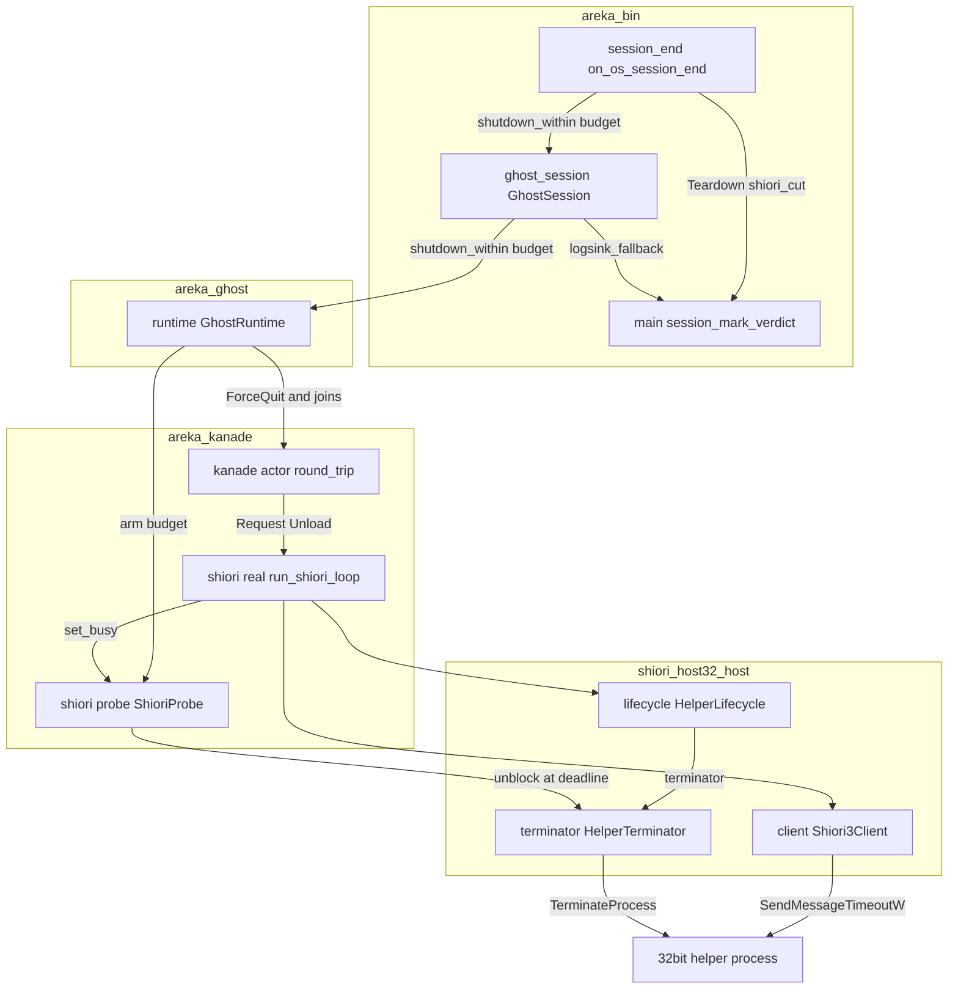
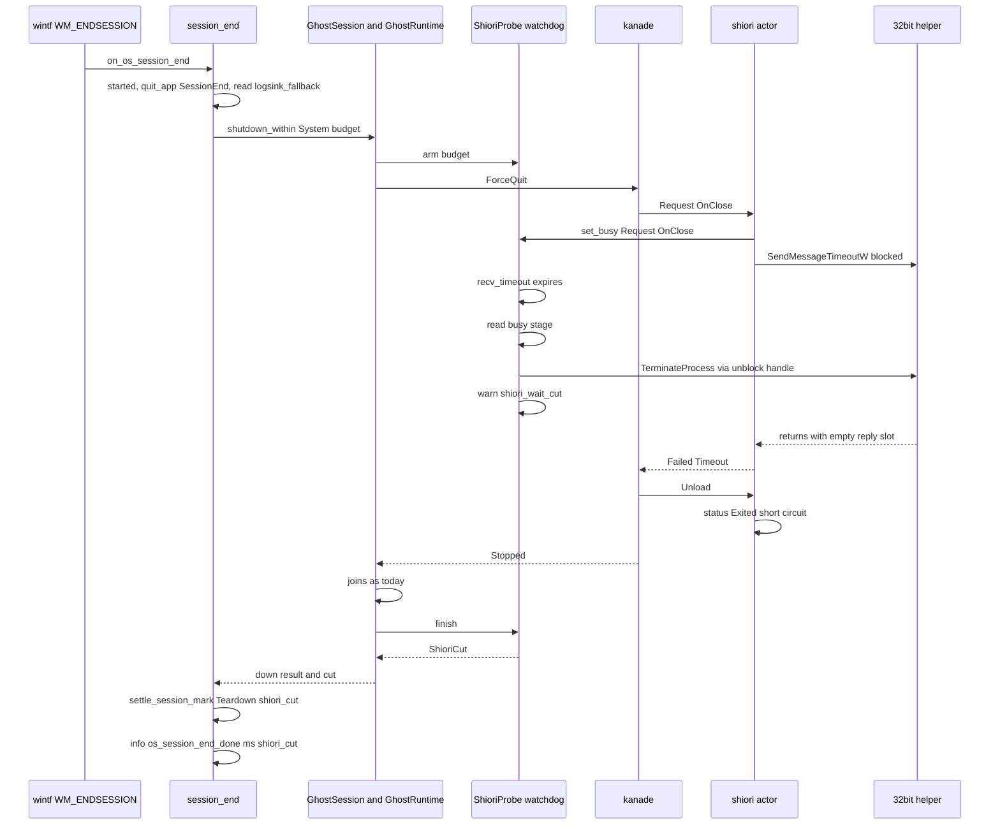
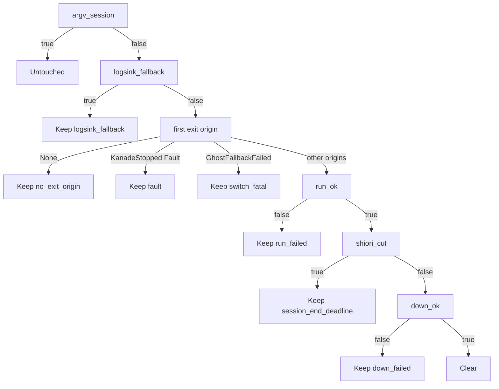

# Design Document: areka-P0-session-mark-residue

> 2026-09-27 作成（`/kiro-spec-design -y`）。対象はブランチ `claude/areka-p0-session-mark-residue-0e9e89`（ソースは main `5a232d2f` から不変）。コードは「何の定義か」（関数名・型名・定数名＋ファイルパス）で指し、行番号では指さない。本書の主張はすべてソースを読んで確かめた。調査の経緯と採らなかった案は `research.md` にある。

## Overview

**Purpose**: 裁定 13（起動中の印）の約束を、Windows のシャットダウン／ログオフと、窓の見えない起動（LogSink への倒れ込み）の 2 場面でも守る。あわせて、OS の終了の受け手が UI スレッドを塞ぐ間に同期の送信が重なっても止まらないことを、再現のテストと常設の検査で示す。

**Users**: SHIORI が固まったゴーストを動かしたまま PC を落とす利用者（「このアプリがシャットダウンを妨げています」を見ない）。前に動いたゴーストのファイルが外で壊れた利用者（次の起動が既定ゴースト emo2 の `halt` で始まり、壊れたゴーストの名前が伝わる）。後続 spec の開発者（印を消すか残すかの判定が 1 か所に残る）。

**Impact**: OS のセッションの終了のときだけ、SHIORI を待つ時間の合計に上限 **T＝3 秒** を置く。上限に達したら、shiori のスレッドの外から 32bit の補助プロセスを終わらせて待ちを解き、残りの後始末は今日どおり進め、印を残す。最初の起動が LogSink へ倒れたことを `GhostSession` に持たせ、きれいな終わりの判定（`session_mark_verdict`）で印を残す理由にする。切替・メニューの終了・強制退避・`WM_CLOSE`・smoke の経路のコードは 1 行も変わらない（期限の定数・環境変数の意味・`GhostSession::shutdown` は不変）。

### Goals
- OS のセッションの終了の後始末で SHIORI を待つ時間の合計を、後始末に入った時点から 3 秒以下に収める（どの段で固まっていても・既に待っていた往復を含む）。
- 上限に達した回は `warn!` 1 件（段・上限・経過）を残し、印を残し（理由 `session_end_deadline`）、補助プロセスを残さない。
- 最初の起動が LogSink へ倒れた回は、倒れた先の成否と終わり方によらず印を残す（理由 `logsink_fallback`）。
- 上の 2 つの理由を `session_mark_verdict` の 1 か所で判定し、表のテストで固定する。
- OS の終了の受け手の join と同期の送信の重なりを再現のテストで起こし、止まらない理由を説明に残し、新しい同期の送信が本番コードに現れたら赤になる検査を常設する。

### Non-Goals
- 切替・メニューの終了・強制退避・`WM_CLOSE`・smoke・kanade の終了系列の期限の変更（要件 3）。
- 起動中の印の方式（鍵・書く時点・読む規則・argv の上書き）の変更。
- `AREKA_SHIORI_REQUEST_TIMEOUT_MS` の意味の変更。
- x64 の SHIORI4 をプロセス内に読む `ShioriWiring::InProc` に外から待ちを解く手を付けること（本番の `fn main` では選ばれない＝`crates/areka/src/main_ghost_wiring_tests.rs` が固定。対象外として記録する）。
- 段ごとに期限を運ぶ改修（`KanadeMsg::ForceQuit`・`ShioriMsg`・`ShioriBackend::notify/unload` の署名は変えない）。

## Boundary Commitments

### This Spec Owns
- **SHIORI の待ちを外から見張って解く仕組み**: `crates/areka-kanade/src/shiori/probe.rs`（新設）の `ShioriProbe`（今の呼び出しの記録＋外から解く手＋見張り）と、`ShioriBackend` に足す既定つきの 1 メソッド `unblock_handle`。
- **補助プロセスを別スレッドから終わらせる取っ手**: `crates/shiori-host32-host/src/terminator.rs`（新設）の `HelperTerminator`。
- **期限つきで降ろす入口**: `GhostRuntime::shutdown_within`（`crates/areka-ghost/src/runtime.rs`）と `GhostSession::shutdown_within`（`crates/areka/src/ghost_session.rs`）。既存の `shutdown` は両方とも署名・振る舞いを変えない。
- **OS のセッションの終了の受け手の改修**: `crates/areka/src/session_end.rs` の `on_os_session_end`（上限の定数・期限つきの降ろし・印の材料）。
- **印の判定の材料と順序**: `crates/areka/src/main.rs` の `MarkInputs`・`session_mark_verdict`・`settle_session_mark`・`after_run`・`boot_first_ghost`。
- **LogSink へ倒れたことの記録**: `GhostSession` の欄と `boot_ghost` の LogSink の腕。
- **テストの偽物の拡張**: `ScriptedShioriBackend`（`crates/areka/src/emo2_boot/spine.rs`）の「解かれるまで固まる」台本、`SwitchRig`（`crates/areka/src/emo2_boot/ghost_switch_test_support.rs`）の「結線は不成立・LogSink の起動は成功」の形。
- **文書**: `doc/COMPAT_ARCHITECTURE.md` §8 の既存 2 行への追記、`on_os_session_end` の説明（要件 5.4 の理由）、`signoff.md`。

### Out of Boundary
- `crates/areka/src/emo2_boot/ghost_switch.rs`・`crates/areka/src/emo2_boot/change_cue.rs`・`crates/areka/src/menu/`・`crates/areka-parsers/`（`ghost-change-name-resolution` と並走）。
- `crates/areka-kanade/src/schedule/events.rs`（許可表）・`crates/areka-kanade/src/msg.rs` の既存の変種の欄と新しい変種（`shell-balloon-switch`・`ghost-install`・`network-update` が動かす）。本仕様は `msg.rs` に触らない。
- wintf の `WM_ENDSESSION` の腕（`crates/wintf/src/ecs/window_proc/lifecycle.rs`）と `wndproc_bridge.rs`（要件 5 の再現で止まらないので改修しない）。
- 32bit の補助プロセス（`crates/shiori-host32-helper/`）と i686 のテスト DLL。
- 完了 spec の文書（`completed/` 以下）。

### Allowed Dependencies
- 依存の向き（左から右へだけ import する）: `shiori-host32-host` → `areka-kanade`（host32 の型を import するのは `crates/areka-kanade/src/shiori/real.rs` だけ＝既存の約束を守る。`probe.rs` は host32 に依存しない）→ `areka-ghost` → `areka`（bin）。
- 使うもの: std（`std::os::windows::io::AsHandle`／`OwnedHandle::try_clone_to_owned`・`std::sync::mpsc::Receiver::recv_timeout`・`std::sync::OnceLock`）、`windows` クレートの `Win32::System::Threading::TerminateProcess`（機能 `Win32_System_Threading` はワークスペースの `windows` 依存（ルート `Cargo.toml` の `[workspace.dependencies.windows]`）に既にあり、`shiori-host32-host` は `workspace = true` でそれを継ぐ＝**機能も依存クレートも足さない**・要件 3.5）。
- テストだけ: `log-capture-kit`（`capture`）・`temp-path-kit`・`sample-ghost-kit`（既存の dev-dependencies）。テストの窓は `windows` の `CreateWindowExW`（クラス `STATIC`・親 `HWND_MESSAGE`＝message-only 窓）で作る（`areka` は既に `windows` に依存し、ワークスペースの機能 `Win32_UI_WindowsAndMessaging` を継ぐ）。
- 環境変数は本番コードで新しく読まない（要件 3.5）。

### Revalidation Triggers
- `spawn_shiori_actor` の戻り値が 3 つ組になる（`ShioriProbe` が増える）＝呼び手（`crates/areka-ghost/src/runtime.rs`・`crates/areka-kanade/tests/kanade/common/common_window_actor.rs`・`crates/areka-kanade/tests/kanade/real_helper_test.rs`）を直す。
- `ShioriBackend` に既定つきメソッドが増える＝既存の実装（`ScriptedShioriBackend`・`crates/areka-ghost/tests/ghost/spine_e2e_test.rs` の偽物・`crates/areka-ghost/src/shiori_inproc.rs`）は無改変で通るが、外から解く手が要る実装は上書きする。
- `session_mark_verdict`・`settle_session_mark` の署名が変わる＝呼び手（`fn main` の後始末・`on_os_session_end`・`main_session_mark_tests.rs`・`session_end_tests.rs`・`ghost_session_switch_memory_tests.rs`）を直す。後続 spec が終了や再起動の経路を足すときも、印を消すか残すかはこの 1 か所を通す。
- `GhostRuntime` に `shiori_probe` の欄が増える＝`into_parts` の分解に 1 欄足す（`GhostParts` には載せない）。
- 本番コードに `SendMessageW(`／`SendMessageTimeoutW(` などの同期の送信が増える＝要件 5 の常設の検査（許可表）を更新し、`on_os_session_end` の説明の理由を見直す。

## Architecture

### Existing Architecture Analysis

- **OS のセッションの終了の道すじ**（すべてソースで確認）: wintf `crates/wintf/src/ecs/window_proc/lifecycle.rs` の `WM_ENDSESSION`（wParam 真・World を借りたまま）→ `crates/areka/src/session_end.rs` の `on_os_session_end`（`started＝Instant::now()`）→ `run_ghost_quit_phase` → `quit_app(SessionEnd)` → `GhostSession::shutdown(CloseReason::System)`（① ticker Close ② `GhostRuntime::shutdown` ③ seriko join）→ `crates/areka-ghost/src/runtime.rs` の `GhostRuntime::shutdown`（`KanadeMsg::ForceQuit` → kanade・dispatcher・ticker・shiori・relay×2・sylphya を順に join・すべて期限なし）→ `crates/areka-kanade/src/schedule/mod.rs` の `force_quit`（`OnClose` の NOTIFY と `Action::ShioriUnload`）→ `crates/areka-kanade/src/actor.rs` の `round_trip`（`reply_rx.recv()`＝無期限）→ `crates/areka-kanade/src/shiori/real.rs` の `run_shiori_loop` → `ShioriConnection::notify/unload` → `crates/shiori-host32-host/src/client.rs` の `Shiori3Client::notify`（`effective_timeout`＝`REQUEST_TIMEOUT` 60 秒／環境変数／0＝`Duration::MAX`）・`crates/shiori-host32-host/src/lifecycle.rs` の `HelperLifecycle::request_clean_shutdown`（`UNLOAD_ACK_TIMEOUT` 30 秒 → `EXIT_OBSERVE_TIMEOUT` 10 秒）→ `crates/shiori-host32-ipc/src/lib.rs` の `SendMessageTimeoutW`。
- **期限を呼び手から渡す口はどの段にも無い**。kanade は 1 件ずつ往復して無期限に待つので、`ForceQuit` は今の往復が終わるまで読まれず、期限をメッセージで運んでも既に待っている往復は切れない（`research.md` §2.3）。
- **補助プロセスの終わらせ方**: `crates/shiori-host32-host/src/process_host.rs` の `HelperHandle::terminate`（`Child::kill`・`&mut self`）と `HelperLifecycle::terminate`／`Drop`。`HelperHandle` は shiori のスレッドの `ShioriConnection.helper` の中にあり、別スレッドから終わらせる口は無い。補助プロセスは `crates/shiori-host32-host/src/job.rs` の `attach_kill_on_close_job` で job に入り、areka のプロセスが終われば道連れで終わる（割り当て失敗なら `None`＝縮退）。
- **印の判定**: `crates/areka/src/main.rs` の `session_mark_verdict(first, argv_session, run_ok, down_ok)`（argv → 出所なし → `fault`／`switch_fatal` → `run_failed` → `down_failed` → 消す。`ExitOrigin` は網羅の match）、`settle_session_mark`、`MarkInputs { app_profile_dir, argv_session, first }`、`after_run`、`boot_first_ghost`（印を書く）。
- **LogSink への倒れ込み**: `crates/areka/src/ghost_session.rs` の `boot_ghost` は `boot_wired` の `Err(BootWiringFailed)` で `areka_ghost::boot_with_kanade_stop(ghost_boot_options(ghost_root, helper_exe), ..)` へ倒れる。成功なら `info!`＋`on_boot_ok`、失敗なら `is_benign_boot_error` で `warn!`／`error!`。どちらも `GhostSession { seriko: None, loop_ticker: None, .. }` を返し、倒れたことは外へ出ない。`ghost_boot_options`（`crates/areka/src/boot_config.rs`）は App スコープの置き場を `default_app_profile_dir()` で埋める（本番では結線ありの腕の `GhostBootInputs::production` が渡す `app_profile_dir` と同じ値）。
- **テストの土台**: `SwitchRig`（偽の SHIORI `ScriptedShioriBackend` を `ShioriWiring::Custom` で注入・`on_os_session_end` を実際に踏む）、`log_capture_kit::capture`、`main_session_mark_tests.rs` の `session_mark_verdict_table`・`first_boot`・`after_run_and_settle`・`next_boot`・`expected_halted_next`。`ScriptedShioriBackend` には「解かれるまで固まる」台本が無い。
- **同期の送信の洗い出し**（`research.md` §6）: 本番コードの `SendMessage*` の呼び出しは `crates/shiori-host32-ipc/src/lib.rs` の `SendMessageTimeoutW`（送る向きは `SMTO_ABORTIFHUNG`＋期限・宛先は別プロセスの message-only 窓）の 1 か所だけ（`crates/shiori-host32-host/src/parent_window.rs` の `SendMessageW` は `#[cfg(test)]` の中）。UI スレッドの窓への同期の送信は 0 件。

### Architecture Pattern & Boundary Map

採る形は **「見張り＋外から解く」**（`research.md` §4 案 A）。後始末の出発点が見張りを張り、上限に達したら shiori のスレッドの外から補助プロセスを終わらせる。補助プロセスが消えると、止まっていた `SendMessageTimeoutW` は宛先を失って戻り（実測〔タスク 1.2〕では戻り値 1・応答 0 で戻るので、受け皿が空のまま `send_request` は `IpcError::Timeout` を返し、kanade には `RequestError::Timeout` として見える。「打ち切った」かどうかはエラーの種類でなく `ShioriProbe` の結果で決める）、`request_clean_shutdown` は `HelperStatus::Exited` を観測して即座に抜け、kanade は失敗の応答で終了系列（`Unloading{Fault}` → `Stopped`）へ進み、以後の join はすべて今日どおり走る。段ごとの期限は運ばない（`msg.rs`・`ShioriBackend::notify/unload` の署名は不変）。



**Architecture Integration**
- 選んだ形の理由: 既に待っている往復（kanade の無期限の `recv()`・shiori のスレッドの `SendMessageTimeoutW` の中）を切れるのは外から待ちを解く手だけ。段ごとに期限を運ぶ案（B・C）でもこの手が要り、加えて並走の `msg.rs` と `ShioriBackend` の署名に触る（`research.md` §4・§8 D2）。
- 責務の分け方: **知る**（今どの呼び出しで待っているか＝shiori のアクターが `ShioriProbe` へ書く）・**解く**（補助プロセスを終わらせる取っ手＝host32 が作り、`ShioriConnection` が `unblock_handle` で `ShioriProbe` へ渡す）・**見張る**（上限で発火する別スレッド＝`ShioriProbe::arm`）・**判定する**（印は `session_mark_verdict` の 1 か所）。
- 守る既存の形: `GhostSession::shutdown`／`GhostRuntime::shutdown` の署名と手順、kanade の状態機械と `Action`、`ShioriBackend::get/notify/unload/status/on_idle`、`ExitOrigin` の網羅の match、`ScriptedShioriBackend` の台本の形。
- 新設の理由: `HelperTerminator`（`Child` は `&mut` でしか kill できず、shiori のスレッドの中に閉じている）・`ShioriProbe`（見張りが読む「今の呼び出し」の置き場と、解く手を一度だけ据える置き場は、shiori のアクターの外に居る必要がある）。
- 依存の向き: `shiori-host32-host` → `areka-kanade`（host32 を import するのは `real.rs` だけ）→ `areka-ghost` → `areka`。`probe.rs` は host32 の型を持たない（解く手は `Arc<dyn Fn() -> Result<(), String> + Send + Sync>`）。

### Technology Stack

| Layer | Choice / Version | Role in Feature | Notes |
|-------|------------------|-----------------|-------|
| Windows API | `windows` 0.62.2 `Win32::System::Threading::TerminateProcess` | 別スレッドから補助プロセスを終わらせる | 機能 `Win32_System_Threading` はワークスペースの `windows` 依存に既にある（追加なし） |
| std | `std::os::windows::io::AsHandle`／`OwnedHandle::try_clone_to_owned` | `Child` のプロセスの取っ手を複製して `Send + Sync` の取っ手にする | `Child::kill` は `&mut` なので使えない |
| std | `std::sync::mpsc::Receiver::recv_timeout`・`OnceLock`・`Mutex` | 見張りの待ち・解く手の一度だけの据え付け・今の呼び出しの置き場 | 偽の時計は持たない。テストは見張りを手で起こす口（`cut_now`）を使う |
| テスト | `windows` の `CreateWindowExW`（`STATIC`・`HWND_MESSAGE`）・`SendMessageTimeoutW`・`PeekMessageW` | 要件 5 の再現の窓と送信、案 A の前提の確認 | 既存の機能 `Win32_UI_WindowsAndMessaging` |

## File Structure Plan

### 新設
```
crates/shiori-host32-host/src/
├── terminator.rs                    # HelperTerminator: プロセスの取っ手の複製＋TerminateProcess（冪等）
└── terminator_tests.rs              # 冪等性・前提の確認（別プロセスの窓への SendMessageTimeoutW が終了で戻る）
crates/areka-kanade/src/shiori/
├── probe.rs                         # ShioriProbe・ShioriBusy・WaitBudget・CutGuard・ShioriCut・ShioriUnblock
└── probe_tests.rs                   # 見張りの発火（手動・期限）・段の語・解く手なし／失敗の記録
crates/areka/src/
├── session_end_deadline_tests.rs    # 要件 1・2・7.1〜7.2: 固まる偽 SHIORI × 段 × 上限で戻る・warn 1 件・印が残る
└── session_end_sync_send_tests.rs   # 要件 5: join 中の同期の送信の再現＋本番ソースの同期の送信の許可表の検査
```

### 変更
- `crates/shiori-host32-host/src/process_host.rs` — `HelperHandle::terminator()`（`child` の取っ手を複製して `HelperTerminator` を返す）。
- `crates/shiori-host32-host/src/lifecycle.rs` — `HelperLifecycle::terminator()`（委譲）。
- `crates/shiori-host32-host/src/lib.rs` — `mod terminator;` と `HelperTerminator` の再輸出。
- `crates/areka-kanade/src/shiori/real.rs` — `ShioriBackend::unblock_handle`（既定 `None`）、`ShioriConnection` の実装、`run_shiori_loop` が `ShioriProbe` へ今の呼び出しを書く、`spawn_shiori_actor` が `ShioriProbe` を返し接続後に解く手を据える。
- `crates/areka-kanade/src/shiori/mod.rs`・`crates/areka-kanade/src/lib.rs` — `probe` モジュールと型の再輸出。
- `crates/areka-kanade/tests/kanade/common/common_window_actor.rs`・`crates/areka-kanade/tests/kanade/real_helper_test.rs` — `spawn_shiori_actor` の 3 つ組に追随。
- `crates/areka-ghost/src/runtime.rs` — `GhostRuntime` に `shiori_probe`、`shiori_probe()`、`shutdown_within`、`into_parts` の分解に 1 欄。
- `crates/areka/src/ghost_session.rs` — `GhostSession` に `logsink_fallback` と `logsink_fallback()`、`shutdown_within`、共通の `shutdown_impl`、`boot_ghost` の LogSink の腕（欄を立てる・App スコープの置き場を結線の入力から渡す）、`for_test`。
- `crates/areka/src/session_end.rs` — 定数 `SESSION_END_SHIORI_LIMIT`、`end_session_within`（`on_os_session_end` はこれを定数で呼ぶ）、期限つきの降ろし、`Teardown` の組み立て、`os_session_end_done` に `shiori_cut`、要件 5.4 の理由の説明。
- `crates/areka/src/main.rs` — `MarkInputs.logsink_fallback`、`Teardown`、`session_mark_verdict` の材料と順序、`settle_session_mark(mark, teardown)`、`after_run`、`boot_first_ghost` の `warn!`、`fn main` の後始末の呼び出し。
- `crates/areka/src/main_session_mark_tests.rs` — 表の行の追加・`settle` の署名・LogSink へ倒れた 1 周（成功／失敗）。
- `crates/areka/src/session_end_tests.rs`・`crates/areka/src/ghost_session_switch_memory_tests.rs` — 署名の追随（振る舞いの判定は不変）。
- `crates/areka/src/emo2_boot/spine.rs` — `ScriptedShioriBackendBuilder::hold_at(HoldAt)`（解かれるまで固まる台本）・`unblock_handle` の実装。
- `crates/areka/src/emo2_boot/ghost_switch_test_support.rs` — `FakeShiori::BalloonMissing`（結線は不成立・LogSink の起動は成功）。
- `doc/COMPAT_ARCHITECTURE.md` — §8 の 2 行への追記。
- `.kiro/specs/areka-P0-session-mark-residue/signoff.md`（新設・実機確認の記録）。

## System Flows

### 上限に達したときの後始末（要件 1・2）



流れの決めごと:
- 見張りは `started` からの残り時間で待つ（`limit.saturating_sub(started.elapsed())`）。後始末の中で降ろす前の手順（予約の取り下げ・運行の通知の捌き・`quit_app`）に使った時間も上限の内に数える（要件 1.1）。
- 発火は 2 つの口から: 期限（`recv_timeout` の `Timeout`）とテストの手動（`cut_now`）。後始末が期限内に終われば `CutGuard::finish` が送信端を落として見張りを起こし、見張りは何もせず終わる（`Disconnected`／`Done`）。
- **期限と `finish` が同時のときは 1 人だけ勝つ**: どちらも `outcome` の `compare_exchange` を取り合い、`finish` が勝てば見張りは切らず（`None`）、見張りが勝てば `finish` は見張りの結果を待つ。これで「T に達しなかったのに印が残る」形（要件 2.6 の否定）は起きない。
- 発火時に読む「段」は shiori のアクターが直前に書いた今の呼び出しで決める: `Request(id)` で `id == "OnClose"` → `on_close_notify`、他の `Request(_)` → `in_flight_request`（後始末に入る前から待っていた往復）、`Unload` → `unload`（UNLOAD の応答と終了の観測をまとめる＝`research.md` §8 D4 は 3 語に縮める）、`Idle` → `idle`（SHIORI の呼び出しの外で上限に達した。以後に始まる往復が要件 1.1 の合計を破らないよう、補助プロセスをここで終わらせる）、`Unloaded`（`unload` が戻った後）→ **切らない**（SHIORI の待ちは終わっており、残りの join は上限の対象外＝要件 1.6。`debug!` だけで `ShioriCut` は返さず、印の判定は今日どおり＝要件 2.6）。
- 補助プロセスが消えた後の kanade の道は今日の形そのまま: `OnClose` の失敗は `Unloading{Forced}` の中の応答として `Stopped` へ（`crates/areka-kanade/src/schedule/mod.rs` の「Unloading 中の応答は Unload 完了として扱う」）。`request_clean_shutdown` は `status()` の `Exited` で短絡する。shiori 側の `error!`（`helper_exited`・`unload_failed` など）は残るが、その直前に `warn!(shiori_wait_cut)` が 1 件あるので因果が読める（D5＝許す）。
- 解く手が無い（`unblock_handle` が `None`＝`InProc`、または接続がまだ済んでいない）か失敗した場合は `error!` を残し、待ちは今日どおり続く（上限の内に戻る保証は無い。本番の `fn main` はこの形を踏まない）。

### 印の判定の順序（要件 2.3・4・6.1・6.2）

判定は時系列で最初に起きた理由を採る。



## Requirements Traceability

| Requirement | Summary | Components | Interfaces | Flows |
|-------------|---------|------------|------------|-------|
| 1.1 | SHIORI を待つ合計を後始末の起点から T 以下 | ShioriProbe・GhostRuntime::shutdown_within・session_end | `WaitBudget{started, limit}`・`arm` | 上限に達したときの後始末 |
| 1.2 | T は 5 秒より十分短い固定の値＝3 秒 | session_end | `SESSION_END_SHIORI_LIMIT` | — |
| 1.3 | どの段で待っていても T で打ち切る（今日の期限が先に切れる段は今日どおり） | ShioriProbe・HelperTerminator | `set_busy`・`unblock_handle` | 上限に達したときの後始末 |
| 1.4 | 環境変数より T が優先 | ShioriProbe（環境変数を読まず外から解く） | — | 上限に達したときの後始末 |
| 1.5 | T の前に応答すれば今日どおり | CutGuard::finish（何もせず終わる） | `finish -> None` | — |
| 1.6 | 他の段の後始末は省かない | GhostRuntime::shutdown（不変）を `shutdown_within` が呼ぶ | — | 上限に達したときの後始末 |
| 2.1 | T で待つのをやめ残りを続けて窓の手続きから戻る | ShioriProbe・session_end | `ShioriCut` | 上限に達したときの後始末 |
| 2.2 | `warn!` 1 件（段・T・経過） | ShioriProbe（発火時の `warn!(shiori_wait_cut)`） | `ShioriBusy` → 段の語 | — |
| 2.3 | 印を残し理由に上限切れの語 | main::session_mark_verdict | `Teardown.shiori_cut` → `Keep("session_end_deadline")` | 印の判定の順序 |
| 2.4 | 補助プロセスを残さない・失敗は `error!` | HelperTerminator・ShioriProbe | `HelperTerminator::terminate`・`error!(shiori_unblock_failed)` | — |
| 2.5 | 告知なし・終了コードは最初の出所 | session_end（不変）・after_run（不変） | — | — |
| 2.6 | T に達しなければ印の判定は今日どおり | main::session_mark_verdict・ShioriProbe（`finish` が先に勝てば切らない・`Unloaded` なら切らない） | `shiori_cut=false` の枝・`outcome` の `compare_exchange` | 印の判定の順序 |
| 3.1 | 切替・メニュー・強制退避・`WM_CLOSE`・smoke・kanade の期限は不変 | 期限の定数・`GhostSession::shutdown`（不変） | — | — |
| 3.2 | LOAD・GET／NOTIFY の期限は不変 | `LOAD_ACK_TIMEOUT`・`effective_timeout`（不変） | — | — |
| 3.3 | T を渡さない呼び手は 1 ミリ秒も違わない | 上限は `shutdown_within` だけが張る（`shutdown` は見張らない） | 呼び手の構造の検査 | — |
| 3.4 | 他の経路の期限切れの印は不変 | main::session_mark_verdict（既存の枝は不変） | — | 印の判定の順序 |
| 3.5 | 環境変数・依存クレートを足さない | HelperTerminator（既存の機能で書く） | — | — |
| 4.1 | LogSink へ倒れたらどの出所でも印を残す | GhostSession.logsink_fallback・main::session_mark_verdict | `MarkInputs.logsink_fallback` | 印の判定の順序 |
| 4.2 | 倒れた先の成否を問わない | boot_ghost の LogSink の腕（欄は腕で立てる） | — | — |
| 4.3 | 理由の語＋倒れた時点の `warn!` | main::boot_first_ghost・session_mark_verdict | `warn!(session_mark_pinned_by_fallback)`・`Keep("logsink_fallback")` | — |
| 4.4 | 次の起動は既定＋Ref6/7 | 既存の `first_boot_origin`・`resolve_boot`（不変） | — | — |
| 4.5 | 既定ゴースト自身でも残す | session_mark_verdict（名前を見ない） | — | — |
| 4.6 | argv では触らない | session_mark_verdict（argv が最初） | — | 印の判定の順序 |
| 4.7 | 終了コード・告知・LogSink の起動を変えない | boot_ghost（欄と置き場の受け渡しだけ） | — | — |
| 4.8 | 結線成功と切替は不変 | boot_wired・boot_ghost_strict（欄は `false`） | — | — |
| 5.1 | 同期の送信の洗い出し（0 件） | `research.md` §6・`on_os_session_end` の説明 | — | — |
| 5.2 | 代表の形の再現テスト | session_end_sync_send_tests | 4 スレッドの再現 | — |
| 5.3 | 止まるなら直す | （止まらない見込み。止まれば `research.md` 3-B を採る） | — | — |
| 5.4 | 止まらない理由の記録と常設テスト | on_os_session_end の説明・同期の送信の許可表の検査 | — | — |
| 5.5 | 後始末 1 回・`OnClose` 1 件は不変 | session_end（既存テストが固定） | — | — |
| 6.1 | 判定は `session_mark_verdict` の 1 か所 | main::session_mark_verdict | `Teardown`・`MarkInputs` | 印の判定の順序 |
| 6.2 | 理由の語は既存と別 | `logsink_fallback`・`session_end_deadline` | — | — |
| 6.3 | ログの無い経路を作らない | ShioriProbe・session_end・boot_first_ghost | 各 `warn!`／`error!`／`info!` | — |
| 6.4 | §8 への追記 | doc/COMPAT_ARCHITECTURE.md | — | — |
| 7.1 | 偽の SHIORI で上限の 4 場面を固定 | session_end_deadline_tests・ScriptedShioriBackend の `hold_at`・`cut_now` | ⑵ の「UNLOAD の応答」「終了の観測」の 2 段は `hold_at(Unload)` の固まりで代表する（`request_clean_shutdown` の中で分けられない＝D4。観測の段の脱出は `lifecycle.rs` の `status()` の `Exited` の既存の短絡と同じ道） | — |
| 7.2 | 他の経路の期限が今日の値のままと判定 | session_end_deadline_tests（呼び手の構造）・既存の定数の判定 | — | — |
| 7.3 | 表に LogSink の行・1 周（成功／失敗） | main_session_mark_tests・SwitchRig `BalloonMissing`／`WiringFail` | — | — |
| 7.4 | 表に上限切れの行 | main_session_mark_tests | — | — |
| 7.5 | 再現テストの常設 | session_end_sync_send_tests | — | — |
| 7.6 | 既存テストを消さない | 署名の追随のみ | — | — |
| 7.7 | 実機確認 | signoff.md | — | — |
| 8.1 | T＝3 秒・本番は定数・テストは引数 | session_end（`SESSION_END_SHIORI_LIMIT`・`end_session_within(limit)`） | — | — |
| 8.2 | 倒れたこと自体を理由にする | GhostSession.logsink_fallback | — | — |
| 8.3 | 切替先へ引き継がない | 欄は `GhostSession`（切替は新しい単位を作る） | — | — |
| 8.4 | 他の経路の期限切れの印は変えない | session_mark_verdict（既存の枝は不変） | — | — |

## Components and Interfaces

| Component | Domain/Layer | Intent | Req Coverage | Key Dependencies (P0/P1) | Contracts |
|-----------|--------------|--------|--------------|--------------------------|-----------|
| HelperTerminator | shiori-host32-host | 別スレッドから補助プロセスを終わらせる取っ手 | 2.4, 3.5 | `HelperHandle`（P0）・`TerminateProcess`（P0） | Service |
| ShioriProbe | areka-kanade/shiori | 今の呼び出しの記録・解く手の置き場・上限の見張り | 1.1, 1.3, 1.4, 2.1, 2.2, 2.4, 7.1 | shiori アクター（P0）・`ShioriBackend::unblock_handle`（P0） | Service, State |
| ShioriBackend 拡張と shiori アクター | areka-kanade/shiori | 解く手を backend から受け取り、今の呼び出しを記録する | 1.3, 2.2 | `ShioriConnection`（P0）・`HelperLifecycle::terminator`（P0） | Service |
| GhostRuntime::shutdown_within | areka-ghost | 見張りの内側で今日どおり降ろす | 1.1, 1.6, 2.1 | `ShioriProbe`（P0）・`GhostRuntime::shutdown`（P0） | Service |
| GhostSession | areka | 倒れた欄・期限つきの降ろし・置き場の受け渡し | 4.1, 4.2, 4.7, 4.8, 8.2, 8.3 | `GhostRuntime`（P0） | Service, State |
| session_end | areka | 上限の定数・期限つきの降ろし・印の材料・要件 5 の理由 | 1.1, 1.2, 2.1, 2.3, 2.5, 5.4, 6.3, 8.1 | `GhostSession::shutdown_within`（P0）・`settle_session_mark`（P0） | Service |
| main の印の判定 | areka | 材料の形と判定の順序・倒れた時点の `warn!` | 2.3, 2.6, 3.4, 4.1〜4.6, 6.1, 6.2 | `MarkInputs`・`ExitOrigin`（P0） | Service |
| テストの偽物 | areka（test） | 解かれるまで固まる台本・結線不成立で LogSink 成功の形 | 7.1, 7.3 | `ScriptedShioriBackend`・`SwitchRig`（P0） | — |
| 要件 5 の検査 | areka（test） | 再現と許可表 | 5.2, 5.4, 7.5 | `windows` の窓 API（P1） | — |
| 文書 | doc | §8 の追記・signoff | 6.4, 7.7 | — | — |

### shiori-host32-host

#### HelperTerminator

| Field | Detail |
|-------|--------|
| Intent | `Child` を持たないスレッドから補助プロセスを終わらせる、`Send + Sync` で複製できる取っ手 |
| Requirements | 2.4, 3.5 |

**Responsibilities & Constraints**
- `HelperHandle::terminator(&self) -> std::io::Result<HelperTerminator>` が `self.child.as_handle().try_clone_to_owned()` でプロセスの取っ手を複製して作る（`Child` の取っ手は `PROCESS_ALL_ACCESS`）。`HelperLifecycle::terminator(&self)` は委譲。
- `HelperTerminator::terminate(&self) -> std::io::Result<()>` は `TerminateProcess(handle, 1)`。既に終わったプロセス（`ERROR_ACCESS_DENIED`）は `Ok` に畳む（`HelperHandle::terminate` と同じ冪等の約束）。失敗は呼び手が `error!` する（本型は記録しない）。
- 型は `crates/shiori-host32-host/src/terminator.rs` に置く（`process_host.rs` は windows 依存を `job.rs` に隔離しているので、同じ理由で別ファイル）。`OwnedHandle` の `Drop` で取っ手を閉じる。
- 終了コード 1 で終わらせた補助プロセスは `poll_exit_kind` で `ExitKind::Abnormal(1)` に分類される（既存の分類のまま）。

**Dependencies**
- Inbound: `ShioriConnection::unblock_handle`（P0）。
- External: `windows::Win32::System::Threading::TerminateProcess`（P0・ワークスペースの機能に既にある）。

**Contracts**: Service [x]

```rust
pub struct HelperTerminator(Arc<OwnedHandle>);   // Clone + Send + Sync
impl HelperTerminator {
    pub(crate) fn from_child(child: &std::process::Child) -> std::io::Result<Self>;  // 取っ手の複製（HelperHandle::terminator と前提のテストが使う）
    pub fn terminate(&self) -> std::io::Result<()>;
}
impl HelperHandle    { pub fn terminator(&self) -> std::io::Result<HelperTerminator>; }
impl HelperLifecycle { pub fn terminator(&self) -> std::io::Result<HelperTerminator>; }
```
- 事前条件: `HelperHandle` が spawn 済み。事後条件: `Ok` なら補助プロセスは終わっているか終わりつつある（`status()` はまもなく `Exited`）。不変条件: 何度呼んでも `Ok`（冪等）。

**Implementation Notes**
- Validation: `terminator_tests.rs` — ⑴ 長命の子（`ping.exe` を直接起こす。`cmd /c` を挟むと孫が残る）を `terminate` → 締切内に `try_wait` が `Some`、2 度目も `Ok`。⑵ **案 A の前提**（往復の最中に宛先のプロセスを終わらせると `SendMessageTimeoutW` が戻る）: テストの実行体を `current_exe()` で子として起こす（`--exact` で子の入口の関数を指名し、環境変数の旗で「窓を作って眠る」枝に入れる。旗が無ければその関数は何もせず緑）。子は `STATIC`・`HWND_MESSAGE` の窓を**自分の pid を含む一意な題**で作り、メッセージを配らずに眠る。親は `FindWindowExW(HWND_MESSAGE, None, "STATIC", 題)` を有界に繰り返して窓を見つける（標準出力を読まない・`--nocapture` も要らない）。親の別スレッドが `SendMessageTimeoutW(hwnd, WM_GETTEXTLENGTH, SMTO_NORMAL, 30 秒)` を送る。子は `GetQueueStatus(QS_SENDMESSAGE)` で送信の到着を見て（配らない）名前つきイベントで親へ知らせ、親はそれを見てから `HelperTerminator::from_child(&child).terminate()`（「往復の最中」を子の側で確かめる）。判定は**時計に依らない**: 送信が期限切れの組（戻り値 0 かつ `GetLastError() == ERROR_TIMEOUT`）で**ない**こと、窓の応答が 0（子が配っていれば題の長さが返る＝同じ形の窓へ同じスレッドから送る対照で較正）、子の `try_wait` が `Some`。実測（x64）では宛先のスレッドが消えた送信は戻り値 1・応答 0・最後のエラー 0 で戻る（当初の見込み「0 で戻る」は外れ）。前提が崩れていれば 30 秒後に `ERROR_TIMEOUT` で赤になる（止まらない）。`SMTO_ABORTIFHUNG` は使わない: OS の「応答なし」の判定は「プロセスが起きてから概ね 20〜30 秒を過ぎている」かつ「宛先のスレッドが 14 秒以上メッセージを取り出していない」の 2 条件で 5 秒ではなく（`crates/shiori-host32-helper/src/main_response_flavor_hung_cage_tests.rs` の較正の記録）、時間で理由を判定すると Defender の再スキャンなどの遅れで偽の赤になる。x64 だけで走る。本物の補助プロセスに対する同じ形は、i686 のテスト DLL に「固まる」応答が無い（境界外）ので常設せず、実機確認（要件 7.7）で固まる SHIORI を用意できる場合に限る。既存の `crates/shiori-host32-host/tests/lifecycle_kill_e2e.rs` は「終わらせた**後**に送ると有限で戻る」までを固定しており、本テストはその前段（最中）を足す。
- Risks: 補助プロセスの取っ手の複製は `HelperHandle` が生きている間しか作れない。接続前（`spawn` から HELLO まで）に上限に達した場合は解く手が無く、記録だけになる。

### areka-kanade / shiori

#### ShioriProbe（`probe.rs`・新設）

| Field | Detail |
|-------|--------|
| Intent | shiori のアクターの外に置く「今の呼び出し」「解く手」「見張り」の 3 つの置き場（プロセス内で共有・`Arc`） |
| Requirements | 1.1, 1.3, 1.4, 2.1, 2.2, 2.4, 7.1 |

**Responsibilities & Constraints**
- shiori のアクターだけが `set_busy` を書く（往復の直前に `Request(id)`／`Unload`、直後に `Idle`。`unload` が戻ったら成否を問わず `Unloaded`＝SHIORI はもう降りている）。見張りだけが読む。
- 解く手は `install_unblock(Option<ShioriUnblock>)` で一度だけ据える（`OnceLock`・接続の成功後・アクターのスレッド上）。
- `arm(budget) -> CutGuard` は見張りのスレッドを 1 本起こす。見張りは `recv_timeout(残り)` で待ち、`Done`／切断なら何もせず終わる。期限か `CutNow` なら、まず**勝者を 1 人に決める**（`outcome` の `compare_exchange(Armed → Fired)`。`finish` が先に `Armed → Finished` を取っていれば何もせず終わる＝後始末が T ちょうどで終わった回には切らない・要件 2.6）。勝ったら段を読み、段が `Unloaded` なら切らずに終わる（SHIORI の待ちは既に終わっており、残りの後始末は上限の対象外＝要件 1.6・2.6。`debug!` だけ）。それ以外は **1 回だけ** 解く: 解く手を呼ぶ → `warn!` 1 件 → `ShioriCut` を返す。`Idle` で勝った場合も解く（SHIORI は今は待っていないが、上限の後に始まる往復は要件 1.1 の合計を破るので、以後の待ちを起こさないために補助プロセスを終わらせる。UNLOAD 前なら SHIORI の保存は失われる＝T＝3 秒を選んだときに引き受けた代価）。
- `cut_now()` はテストの口で**粘る**: 張られている見張りへ `CutNow` を送り、張られていなければ「切る予約」（`pending_cut`）を置く。次の `arm` は予約を見つけたら待たずに発火する（補助のスレッドが `arm` より先に呼んでも空振りしない＝順序に依らない）。本番コードは呼ばない。
- 環境変数は読まない（要件 1.4 は構造で満たす: 外から解くので、環境変数がどんな値でも T で切れる。環境変数が T より短ければ shiori のスレッドの側が今日どおり先に切る）。
- host32 の型を持たない（`real.rs` の約束を守る）。

**Contracts**: Service [x] / State [x]

```rust
pub type ShioriUnblock = Arc<dyn Fn() -> Result<(), String> + Send + Sync>;

#[derive(Debug, Clone, PartialEq, Eq)]
pub enum ShioriBusy { Idle, Request(String), Unload, Unloaded }   // Unloaded＝unload が戻った後（見張りは切らない）

#[derive(Debug, Clone, Copy)]
pub struct WaitBudget { pub started: Instant, pub limit: Duration }

#[derive(Debug, Clone, PartialEq, Eq)]
pub struct ShioriCut { pub stage: &'static str, pub unblocked: bool }
// stage: "in_flight_request" | "on_close_notify" | "unload" | "idle"
// idle＝SHIORI の呼び出しの外で上限に達した（以後の待ちを起こさないために補助プロセスを終わらせる）

#[derive(Clone, Default)]
pub struct ShioriProbe(Arc<ProbeInner>);
impl ShioriProbe {
    pub fn set_busy(&self, busy: ShioriBusy);
    pub fn install_unblock(&self, unblock: Option<ShioriUnblock>);   // 2 度目は無視（debug!）
    pub fn arm(&self, budget: WaitBudget) -> CutGuard;
    pub fn cut_now(&self);                                           // テストの口（粘る: 未 arm なら予約）
}
pub struct CutGuard { /* Sender<Signal> と見張りの JoinHandle<Option<ShioriCut>> */ }
impl CutGuard { pub fn finish(self) -> Option<ShioriCut>; }         // 送信端を落として見張りを join
```
- 事前条件: `arm` は同時に 1 つだけ（`GhostRuntime::shutdown_within` が `self` を消費して呼ぶので構造で 1 回）。事後条件: `finish` は見張りが終わってから戻る（見張りのスレッドを残さない）。不変条件: 発火は高々 1 回・`warn!(shiori_wait_cut)` は発火につき 1 件・`finish` と期限が同時なら `compare_exchange` でどちらか一方だけが勝つ（両方が勝つことも両方が負けることも無い）。

**State Management**
- `ProbeInner { busy: Mutex<ShioriBusy>, unblock: OnceLock<Option<ShioriUnblock>>, armed: Mutex<Option<Sender<Signal>>>, pending_cut: AtomicBool, outcome: AtomicU8 }`。`enum Signal { Done, CutNow }`。`outcome` は `Armed`／`Finished`／`Fired` の 3 値で、`arm` が `Armed` に戻し、`finish` と見張りが `compare_exchange` で 1 人だけ勝つ。
- 記録（発火時・すべて `target: "shiori-actor"`）:
  - 勝ったが段が `Unloaded`: `debug!(event = "shiori_wait_limit_after_unload", limit_ms, elapsed_ms, "上限に達したが SHIORI は既に降りている——切らない")`（`warn!` は出ない・`ShioriCut` は返さない）
  - `warn!(event = "shiori_wait_cut", stage, id = ?Option<String>, limit_ms, elapsed_ms, unblocked, "SHIORI の待ちを上限で打ち切った——補助プロセスを終わらせて待ちを解く")`（要件 2.2 の 1 件）
  - 解く手が `None`: `error!(event = "shiori_unblock_unavailable", stage, "外から解く手が無い（接続前か InProc）——待ちは今日どおり続く")`
  - 解く手が `Err`: `error!(event = "shiori_unblock_failed", error, stage, "補助プロセスを終わらせられなかった")`（要件 2.4）

**Implementation Notes**
- Integration: `run_shiori_loop(rx, backend, on_down, probe)` が `Request{call}` の前に `set_busy(Request(call の id.as_str()))`、その後に `Idle`、`Unload` の前に `set_busy(Unload)`、`unload` が戻ったら（成否を問わず）`Unloaded`。`spawn_shiori_actor(connect, on_down) -> (Sender<ShioriMsg>, ActorHandle, ShioriProbe)` は接続の成功後に `probe.install_unblock(backend.unblock_handle())`、失敗なら `install_unblock(None)`。
- Validation: `probe_tests.rs` — `arm` → `finish`（発火なし）は `None` で `warn!` 0 件（対照の事象つき）／`cut_now` で `Request("OnClose")` → `on_close_notify`・`Request("OnBoot")` → `in_flight_request`・`Unload` → `unload`・`Idle` → `idle`、解く手が 1 回呼ばれる／短い期限（数十 ms・偽の SHIORI は応答しないので結果は時刻に依らない）で期限の口からも発火する／解く手 `None` と `Err` で `error!` が出て `unblocked=false`／**`arm` より先に `cut_now`** を呼んでから `arm` すると待たずに発火する（粘り）／**`finish` が先に勝っていれば**見張りの決め手（`try_fire`）は `None` で `warn!` 0 件（同時の回に切らない）／段が **`Unloaded`** で期限に達すると `None`・`warn!` 0 件・`debug!(shiori_wait_limit_after_unload)` 1 件・解く手は呼ばれない。
- Risks: 見張りのスレッドは後始末ごとに 1 本（プロセスに 1 回の OS のセッションの終了だけなので安い）。

#### ShioriBackend の拡張と ShioriConnection（`real.rs`）

| Field | Detail |
|-------|--------|
| Intent | backend が「外から待ちを解く手」を持っていれば差し出す |
| Requirements | 1.3, 2.4 |

```rust
pub trait ShioriBackend {
    // 既存 5 メソッドは不変
    /// 往復の外から待ちを解く手（別スレッドから呼ぶ）。無ければ `None`（既定・InProc・多くの偽物）。
    fn unblock_handle(&self) -> Option<ShioriUnblock> { None }
}
impl ShioriBackend for ShioriConnection {
    fn unblock_handle(&self) -> Option<ShioriUnblock> {
        // helper.terminator() の Err は error!（取っ手が複製できない）の上で None
    }
}
```
- `Shiori3Client`・`HelperLifecycle::request_clean_shutdown`・期限の定数は不変（要件 3.1・3.2）。`ShioriMsg`・`KanadeMsg` は不変。

### areka-ghost

#### GhostRuntime::shutdown_within（`runtime.rs`）

| Field | Detail |
|-------|--------|
| Intent | 見張りを張った内側で、今日の `shutdown` をそのまま走らせる |
| Requirements | 1.1, 1.6, 2.1 |

```rust
pub struct GhostRuntime { /* 既存の欄 */ shiori_probe: ShioriProbe }
impl GhostRuntime {
    pub fn shiori_probe(&self) -> &ShioriProbe;                          // テストの cut_now 用
    pub fn shutdown(self, reason) -> Result<(), GhostShutdownError>;    // 不変
    pub fn shutdown_within(self, reason: CloseReason, budget: WaitBudget)
        -> (Result<(), GhostShutdownError>, Option<ShioriCut>);
}
```
- `shutdown_within` = `let guard = self.shiori_probe.clone().arm(budget); let r = self.shutdown(reason); (r, guard.finish())`。join の順・冪等・失敗の収集は `shutdown` のまま（要件 1.6）。
- `boot_with_origin` は `spawn_shiori_actor` の 3 つ目を `shiori_probe` へ入れる。`into_parts` は `shiori_probe: _` で捨てる（`GhostParts` は不変）。

### areka

#### GhostSession（`ghost_session.rs`）

| Field | Detail |
|-------|--------|
| Intent | 「いま動いているゴースト」の単位に、倒れたことと期限つきの降ろしを持たせる |
| Requirements | 4.1, 4.2, 4.7, 4.8, 8.2, 8.3 |

```rust
pub(crate) struct GhostSession { /* 既存 */ logsink_fallback: bool }
impl GhostSession {
    pub(crate) fn logsink_fallback(&self) -> bool;
    pub(crate) fn shutdown(self, reason) -> windows::core::Result<()>;               // 不変（shutdown_impl(reason, None).0）
    pub(crate) fn shutdown_within(self, reason: CloseReason, budget: WaitBudget)
        -> (windows::core::Result<()>, Option<ShioriCut>);                          // ② を runtime.shutdown_within に替えるだけ
}
```
- `boot_ghost`: `boot_wired` の腕は `logsink_fallback: false`（`boot_wired` が組む `GhostSession` に欄を足す）。LogSink の腕は倒れた先の成否によらず `true`（要件 4.2）。`boot_ghost_strict` は `boot_wired` だけを通るので `false`（要件 4.8）。`for_test` は `false`。
- LogSink の腕の App スコープの置き場: `wiring.app_profile_dir` を `boot_wired` へ渡す前に写し、`ghost_boot_options(..)` の `app_profile_dir` をその値で上書きする。本番では `GhostBootInputs::production` が `Some(default_app_profile_dir())` を入れるので `ghost_boot_options` の既定値と同じ（振る舞いは不変・要件 4.7）。テストは土台の置き場（`SwitchRig::app_dir`）か `None` になり、実行体の隣の実 profile へ書かなくなる。
- 8.3（切替先へ引き継がない）: 欄は単位に付くので、切替が新しい `GhostSession` を作れば自然に `false`。`ghost_switch.rs` には触らない。

#### session_end（`session_end.rs`）

| Field | Detail |
|-------|--------|
| Intent | 上限の定数を持ち、期限つきで降ろし、印の材料に倒れた欄と打ち切りを載せる |
| Requirements | 1.1, 1.2, 2.1, 2.3, 2.5, 5.4, 6.3, 8.1 |

```rust
/// OS のセッションの終了で SHIORI を待つ合計の上限（2026-09-27 開発者の確定・要件 8.1）。
pub(crate) const SESSION_END_SHIORI_LIMIT: Duration = Duration::from_secs(3);

pub(crate) fn on_os_session_end(world: &mut World, entity: Entity) {
    end_session_within(world, SESSION_END_SHIORI_LIMIT)     // wintf の OnSessionEnd に差すのはこちら
}
pub(crate) fn end_session_within(world: &mut World, limit: Duration);   // テストは limit を引数で渡す
```
- 手順の差分: ④ で置き場から取り出した単位の `logsink_fallback()` を **降ろす前に**読み、`shutdown_within(CloseReason::System, WaitBudget { started, limit })` を呼ぶ。戻りの `Option<ShioriCut>` から `shiori_cut = cut.is_some()`。⑤ は `settle_session_mark(&mark, Teardown { run_ok: true, down_ok, shiori_cut })`（`mark.logsink_fallback` も載せる）。⑥ `info!(os_session_end_done, ms, down_ok, shiori_cut)`。
- 告知は出さない・終了コードは最初の出所（不変・要件 2.5）。処理は 1 回（`SessionEnded`・不変・要件 5.5）。
- 要件 5.4 の説明（`on_os_session_end` の doc に書く）: 降ろす処理の join は UI スレッドを塞ぐが、areka のどのスレッドも UI スレッドの窓へ同期に送らない（ゴーストの実行系から UI への知らせはすべて `mpsc` の送信・shiori のスレッドの `SendMessageTimeoutW` の宛先は別プロセスの message-only 窓・wintf の窓操作は UI スレッド自身・VSync のスレッドは窓に触らない・COM は MTA）。外から UI の窓へ同期に送る相手（IME・シェル・他アプリ・補助プロセスの中の SHIORI）は送り手が待つだけで、join はそれに依らないので輪にならない。唯一の理屈の輪＝補助プロセスの中の SHIORI が `OnClose` の処理中に areka の窓へ同期で送る形は、上限 T で補助プロセスを終わらせることで切れる。

#### main の印の判定（`main.rs`）

| Field | Detail |
|-------|--------|
| Intent | 印を残す理由 2 つを、既存の 1 か所の判定に時系列の順で足す |
| Requirements | 2.3, 2.6, 3.4, 4.1〜4.6, 6.1, 6.2 |

```rust
struct MarkInputs { app_profile_dir: PathBuf, argv_session: bool, first: Option<ExitOrigin>, logsink_fallback: bool }

/// 降ろした結果（`fn main` の後始末は shiori_cut=false・OS のセッションの終了は見張りの結果）。
#[derive(Debug, Clone, Copy)]
struct Teardown { run_ok: bool, down_ok: bool, shiori_cut: bool }

fn session_mark_verdict(first: Option<&ExitOrigin>, argv_session: bool, logsink_fallback: bool, end: Teardown) -> MarkVerdict;
fn settle_session_mark(mark: &MarkInputs, end: Teardown) -> MarkVerdict;
```
- 順序（時系列で最初の理由・`research.md` §8 D8 の決着）: `argv_session` → `Untouched`／`logsink_fallback` → `Keep("logsink_fallback")`／`first == None` → `Keep("no_exit_origin")`／`KanadeStopped(Fault)` → `Keep("fault")`・`GhostFallbackFailed` → `Keep("switch_fatal")`／`!run_ok` → `Keep("run_failed")`／`shiori_cut` → `Keep("session_end_deadline")`／`!down_ok` → `Keep("down_failed")`／`Clear`。`ExitOrigin` の網羅の match はそのまま。
- `after_run`: `logsink_fallback = session.as_ref().is_some_and(GhostSession::logsink_fallback)` を `MarkInputs` に載せる（`SessionEnded` なら今日どおり `mark: None`）。`fn main` の後始末は `settle_session_mark(mark, Teardown { run_ok, down_ok: down.is_ok(), shiori_cut: false })`。
- `boot_first_ghost`: `boot_ghost` の戻りが `logsink_fallback()` で、かつ argv でなければ `warn!(event = "session_mark_pinned_by_fallback", "[main] 起動が LogSink へ倒れた——このプロセスは終わり方によらず起動中の印を残す（次の起動は既定のゴーストで Ref6/7 付き）")` を 1 件（要件 4.3）。argv なら `debug!`。
- 理由の語は既存（`fault`・`switch_fatal`・`no_exit_origin`・`run_failed`・`down_failed`）と別（要件 6.2）。`settle_session_mark` の `info!(session_mark_kept, reason, first)` は不変。

### テストの偽物

#### ScriptedShioriBackend の「解かれるまで固まる」台本（`spine.rs`）

```rust
pub(crate) enum HoldAt { Get(&'static str), Notify(&'static str), Unload }
impl ScriptedShioriBackendBuilder { pub(crate) fn hold_at(self, at: HoldAt) -> Self; }
```
- 該当の呼び出しに入ったら `Condvar` で `released` が立つまで待ち、立ったら今日どおり台本の応答を消費して返す。解かれた後の台本は `Err(RequestError::Timeout)`／`Err(ShutdownError::ExitTimeout)` にする（`IpcError` は `shiori_host32_host` が再輸出しておらず areka は `shiori-host32-ipc` に依存しないので `RequestError::Ipc(..)` は作れない。kanade は `Unloading` の中の応答を成否を問わず Unload 完了として扱うので、`Timeout` でも本番と同じ道＝`Stopped` を踏む）。`unblock_handle` は `Some`（`released` を立てて起こす閉じ手）。解く手が先に呼ばれていれば待たずに通る（順序に依らない）。`ScriptedShioriHandle` から「いま固まっている」ことを読める口（`holding()`）を 1 つ足す（テストが `cut_now` を呼ぶ前に固まりを待つ）。
- `unblock_handle` が呼ばれた回数も記録する（要件 7.1 の判定で「解く手が 1 回」を数える）。

#### SwitchRig の `FakeShiori::BalloonMissing`（`ghost_switch_test_support.rs`）

- 構成入力の `balloon_root` を実在しない場所に替える（`ghost_root` は本物）。`wire_emo2_boot` の `build_boot_assets_for` が失敗して結線は不成立、`boot_ghost` は LogSink の腕へ倒れ、mount は通るので `boot_with_kanade_stop` は成功する（SHIORI は `ShioriWiring::Helper` の使わない helper の経路で接続に失敗し、kanade は Fault で止まる＝倒れた先が「成功した」形）。既存の `WiringFail`（`ghost_root` が無い＝倒れた先も失敗）と対で要件 4.2 の両方を作る。

### 要件 5 の検査（`session_end_sync_send_tests.rs`）

- **再現**（要件 5.2）: テストのスレッド（UI スレッドの代わり）が `STATIC`・`HWND_MESSAGE` の窓を作る。`SwitchRig` に `hold_at(Notify("OnClose"))` の偽の SHIORI で A を起こす。スレッド C は合図を待ってから「送る」の旗を立て、`SendMessageTimeoutW(hwnd, WM_NULL, SMTO_NORMAL, 10 秒)` を送る。スレッド D は旗を見てから偽の SHIORI を解く（`ScriptedShioriHandle` 経由）。テストのスレッドは合図を出してから `end_session_within(world, 1 時間)` を呼ぶ（見張りは発火しない）。判定: 後始末が戻る（C の送信に依らない）→ 戻った後に `PeekMessageW(PM_NOREMOVE)` を 1 回呼ぶ → C の送信が返る。順序は `AtomicU8` の連番で判定する（後始末の戻り < 送信の戻り）。送信が 10 秒で切れたら赤（理由が崩れた＝止まる形）。
- **許可表の検査**（要件 5.4）: `crates/*/src/**/*.rs` の本番ソース（`_tests.rs`・`_test_support.rs`・`tests/`・`examples/` を除く）から `SendMessageW(`・`SendMessageA(`・`SendMessageTimeoutW(`・`SendMessageTimeoutA(`・`SendNotifyMessageW(`・`SendMessageCallbackW(`・`BroadcastSystemMessage` を探し、許可表 `{ crates/shiori-host32-ipc/src/lib.rs: SendMessageTimeoutW( ×1, crates/shiori-host32-host/src/parent_window.rs: SendMessageW( ×1（#[cfg(test)] の中） }` と一致することを判定する（表に無い当たりも、当たりの無い表の行も赤＝`crates/log-capture-kit/tests/with_default_guard_test.rs` と同じ作法）。

### 文書

- `doc/COMPAT_ARCHITECTURE.md` §8: ⑴ 「OS のシャットダウン・再起動・ログオフで終わるとき」の行の areka 裁量の欄に「SHIORI を待つ時間の合計を後始末に入った時点から 3 秒に収め、超えたら補助プロセスを終わらせて待ちを解き、印を残す（正典は待ちの長さに沈黙・areka 裁量）」と定義点（`session_end.rs` の `SESSION_END_SHIORI_LIMIT`・`probe.rs` の `ShioriProbe`・`terminator.rs` の `HelperTerminator`）と判定（新テスト名）を追記。⑵ 「きれいに終わらなかった次の起動（起動中の印）」の行に「最初の起動が LogSink へ倒れた回もきれいな終わりに含めない（倒れた先の成否を問わない・理由 `logsink_fallback`）」を追記。完了 spec の文書は書き換えない。
- `signoff.md`: 要件 7.7 の手順と結果。

## Data Models

### Domain Model
- **上限**: `SESSION_END_SHIORI_LIMIT`（3 秒・本番の定数）。`WaitBudget { started, limit }` は後始末の出発点から数える約束を型で運ぶ。
- **今の呼び出し**: `ShioriBusy { Idle, Request(id), Unload, Unloaded }`（shiori のアクターが書く・見張りが読む。`Unloaded` は「もう待たない」の印で、見張りはこの状態では切らない）。
- **打ち切りの結果**: `ShioriCut { stage, unblocked }`。`stage` の語 4 つは要件 2.2 の 3 語（在来の往復・`OnClose`・降ろす）＋`idle`（呼び出しの外で上限に達した）。
- **勝者**: `outcome ∈ { Armed, Finished, Fired }`。`finish` と見張りの `compare_exchange` で 1 人だけが `Armed` から進める。
- **降ろした結果**: `Teardown { run_ok, down_ok, shiori_cut }`。
- **印の材料**: `MarkInputs` に `logsink_fallback` を足す。判定の結論 `MarkVerdict::Keep(&'static str)` の語に `logsink_fallback`・`session_end_deadline` が増える。
- 不変条件: 見張りの発火は後始末 1 回につき高々 1 回。`logsink_fallback` は単位（`GhostSession`）の生涯で不変。

## Error Handling

| 場面 | 振る舞い | 記録 |
|---|---|---|
| 上限に達した | 段を読み、解く手を呼び、後始末は続ける | `warn!(shiori_wait_cut, stage, id, limit_ms, elapsed_ms, unblocked)` 1 件（要件 2.2） |
| 上限に達したが `finish` が先に勝った（同時） | 切らない・印の判定は今日どおり | 記録なし（後始末は期限内に終わっている＝`os_session_end_done` の `shiori_cut=false`） |
| 上限に達したが SHIORI は既に降りている（`Unloaded`） | 切らない・残りの join は今日どおり・印の判定は今日どおり | `debug!(shiori_wait_limit_after_unload, limit_ms, elapsed_ms)` 1 件 |
| 解く手が無い（接続前・InProc） | 待ちは今日どおり続く | `error!(shiori_unblock_unavailable, stage)` |
| 補助プロセスを終わらせられない | 待ちは今日どおり続く（job の道連れが最後の安全網） | `error!(shiori_unblock_failed, error, stage)`（要件 2.4） |
| 補助プロセスの取っ手が複製できない | `unblock_handle` は `None` | `error!` を `ShioriConnection::unblock_handle` で 1 件 |
| 補助プロセスを終わらせた後の shiori 側の失敗 | 今日どおり（`helper_exited`・`unload_failed` などの `error!`・kanade は `Fault` で止まる） | 直前の `warn!(shiori_wait_cut)` で因果が読める（D5＝許す） |
| 上限に達した回の印 | `Keep("session_end_deadline")` | `info!(session_mark_kept, reason)`（要件 2.3） |
| LogSink へ倒れた | 起動は今日どおり続く | `warn!(session_mark_pinned_by_fallback)` 1 件（要件 4.3）＋倒れた先の今日の記録 |
| LogSink へ倒れた回の印 | `Keep("logsink_fallback")` | `info!(session_mark_kept, reason)` |
| 後始末の所要 | 今日どおり | `info!(os_session_end_done, ms, down_ok, shiori_cut)` |

メッセージボックスは出さない（要件 2.5・4.7）。終了コードは今日どおり最初の出所で決まる。

## Testing Strategy

すべて決定論（偽の SHIORI・x64・見張りは手で起こす）。テストは本番ファイルの兄弟ファイルに置き、接続宣言だけを本番側に残す（`structure.md` の規約）。

### Unit（kanade・host32）
- `probe_tests.rs`: 発火なしで `finish` → `None`・`warn!` 0 件（対照の事象を要求）／`cut_now` で段の語 4 通り・解く手 1 回／短い期限で期限の口から発火／解く手 `None`・`Err` で `error!`・`unblocked=false`／`arm` の前の `cut_now` が `arm` で即発火（粘り）／`finish` が先に勝てば見張りの決め手は `None`（同時の回に切らない）／`Unloaded` で期限に達しても切らない（`debug!` 1 件・解く手 0 回）。
- `terminator_tests.rs`: 冪等（2 度 `Ok`）／案 A の前提（別プロセスの `STATIC`・`HWND_MESSAGE` 窓への `SendMessageTimeoutW(SMTO_NORMAL, 30 秒)` が、往復の最中の `terminate` で期限切れの組（0 かつ `ERROR_TIMEOUT`）でなく応答 0 で戻る。窓は `FindWindowExW(HWND_MESSAGE, ..)` で pid 入りの題から探す。時計では判定しない）。

### Integration（areka・`SwitchRig`）
- `session_end_deadline_tests.rs`（要件 7.1・7.2）:
  - ⑴ 上限の中で応答（`standard_script`・大きな `limit`）→ 今日どおり印が消え・`shiori_wait_cut` 0 件・`os_session_end_done` の `shiori_cut=false`（既存 `session_end_takes_ghost_down_with_system_close_and_clears_mark` と同じ形で `shiori_cut` の欄だけ足す）。
  - ⑵ 段ごとに固まる 4 通り: `hold_at(Get("OnBoot"))`（後始末に入る前から待っていた往復・定常を待たずに `end_session_within`）／`hold_at(Notify("OnClose"))`／`hold_at(Unload)`（要件 7.1 ⑵ の「UNLOAD の応答」「終了の観測」の 2 段をこの 1 つで代表する＝D4）／（`idle` は `probe_tests` で）。補助のスレッドが `holding()` を待って `cut_now` を呼ぶ（`arm` より先に呼んでも粘るので順序に依らない）。判定: 後始末が戻る・`warn!(shiori_wait_cut)` 1 件で `stage` が期待の語・解く手 1 回・印が残り `session_mark_kept` の `reason="session_end_deadline"`・`os_session_end_done` の `shiori_cut=true`・`OnClose` の Ref0＝`system` は 1 件（`OnClose` で固めた回）。
  - ⑵' 期限の口: `hold_at(Notify("OnClose"))`・`limit` を数十 ms にして `cut_now` を呼ばない → 発火（偽の SHIORI は自分では応答しないので結果は時刻に依らない）。
  - ⑶ 環境変数の 3 通りの言い換え（案 A では環境変数を読まないので「SHIORI 側の期限が T より長い・無限・短い」として起こす）: 長い・無限＝固まる台本で T の打ち切り（⑵ と同じ判定）／短い＝台本が自分で `Err(RequestError::Timeout)` を返す → `shiori_wait_cut` 0 件・印の判定は今日どおり。環境変数そのものの読み（`client.rs` の `effective_timeout`）は本仕様では変えず、実 helper で踏む既存の e2e（`crates/shiori-host32-host/tests/lifecycle_kill_e2e.rs` などが `AREKA_SHIORI_REQUEST_TIMEOUT_MS` を設定して走る）が固定している。
  - ⑷ 上限を渡さない呼び手（要件 3.3・7.2）: `crates/areka/src` の本番ソースで `shutdown_within(` と `.arm(` を呼ぶのが `session_end.rs` と `ghost_session.rs`（委譲）だけであることを判定する。`GhostSession::shutdown` で固まる台本を解く手で外から解いても `shiori_wait_cut` は 0 件（見張りは張られない）。期限の定数の値は既存の判定（`process_host.rs` の `LOAD_ACK_TIMEOUT`・`REQUEST_TIMEOUT`、`msg.rs` の `close_talk_deadline_ms`）に加え、`UNLOAD_ACK_TIMEOUT`＝30 秒・`EXIT_OBSERVE_TIMEOUT`＝10 秒を判定する行を `lifecycle.rs` のテストに足す。
  - 定数: `SESSION_END_SHIORI_LIMIT == Duration::from_secs(3)`（要件 1.2・8.1）。
- `main_session_mark_tests.rs`（要件 7.3・7.4）:
  - `session_mark_verdict_table` に行を足す: `logsink_fallback` × 8 つのきれいな出所 × `run_ok`/`down_ok` → `Keep("logsink_fallback")`／`logsink_fallback` × `fault`・`switch_fatal`・出所なし・`run_failed`・`down_failed` → `Keep("logsink_fallback")`（時系列で最初）／`logsink_fallback` × argv → `Untouched`／`SessionEnd` × `shiori_cut` → `Keep("session_end_deadline")`／`SessionEnd` × `shiori_cut` × `!down_ok` → `Keep("session_end_deadline")`／`shiori_cut` × `fault` → `Keep("fault")`／`shiori_cut` × argv → `Untouched`。既存 21 行は `Teardown` の形へ書き換えるだけで結論は不変。
  - 1 周（倒れた先が成功）: `FakeShiori::BalloonMissing` で初回の起動 → `boot_first_ghost` の `warn!(session_mark_pinned_by_fallback)` 1 件・単位の `logsink_fallback()`・`runtime().is_some()` → `quit_app(OsClose)` → `after_run_and_settle` → `Keep("logsink_fallback")`・印が A → `next_boot` が `expected_halted_next(rig, "A")`。倒れた先の SHIORI の接続の失敗で kanade の `Fault` の知らせが**非同期に**届くので、`first` の値（`OsClose` か `KanadeStopped(Fault)` か）は判定に使わない（理由は順序により `logsink_fallback` で安定する）。
  - 1 周（倒れた先が失敗）: `FakeShiori::WiringFail` で同じ手順・`runtime().is_none()`。
  - argv で LogSink へ倒れる → 印を読まず・書かず・消さず・`warn!` は出ない（要件 4.6）。
- `session_end_sync_send_tests.rs`（要件 5.2・5.4・7.5）: 上の「要件 5 の検査」の 2 本。

### 実機（要件 7.7・`signoff.md`）
- 定常のゴーストの全トップレベル窓へ `WM_QUERYENDSESSION` → `WM_ENDSESSION`（wParam＝TRUE）を送る（自分で起こしたプロセスに限る）→ 後始末 1 回・印が消える・`os_session_end_done` の `ms` が 3 秒より十分短く `shiori_cut=false`。
- LogSink へ倒した回（バルーンの根を壊す＝`BalloonMissing` と同じ形）をきれいに終え、次の起動で emo2 が Ref6＝`halt`・Ref7 付き。
- 固まる SHIORI の実機は、用意できる場合だけ（無ければ決定論テストと前提のテストで足りると記録）。`RUST_LOG` は `shiori-actor=warn,areka=info` 以上。

## Performance & Scalability
- 見張りのスレッドは OS のセッションの終了の後始末につき 1 本。`set_busy` は往復ごとに `Mutex` の書き込み 2 回（`String` 1 つ）で、往復の所要（ミリ秒級の IPC）に対して無視できる。健全な SHIORI の後始末（完了 spec の実機で 22 ms）は変わらない。

## Open Questions / Risks
- **案 A の前提**（補助プロセスを終わらせると `SendMessageTimeoutW` がすぐ戻る）: Win32 の一般の振る舞い（宛先の窓のスレッドが消えれば送信は失敗で戻る）に依る。`terminator_tests.rs` の前提のテストで x64 の別プロセスの窓に対して固定する（判定は期限切れの組でない＋応答 0＝時計に依らない）。本物の補助プロセスに対しては、i686 のテスト DLL に固まる応答が無いので常設せず、実機サインオフで固まる SHIORI を用意できる場合に見る。崩れた場合は待ちが今日どおり長くなるだけで、印は残る（悪化はしない）。
- **接続前に上限に達した場合**（起動直後の OS の終了）: 解く手が無く `error!` の記録だけになる。補助プロセスは job の道連れで終わる。頻度は低いので受け入れる。
- **InProc**: 対象外（本番では選ばれない）。M2 で本番に使うときの宿題として `research.md` に残す。
- **要件 5.2 の再現が止まった場合**: 5.3 に従い `research.md` 3-B（降ろす処理を別スレッドで走らせ、UI スレッドは待ちながら送られてきたメッセージだけ配る）を採る。静的な洗い出しは 0 件なので止まらない見込み。
