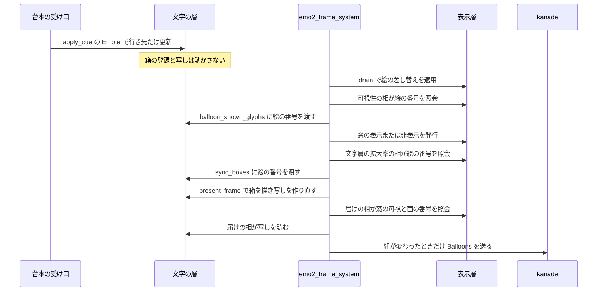

# Design Document: areka-P0-shell-balloon-frame-align

## Overview

**Purpose**: シェルの中の箱（完了 spec `areka-P0-shell-balloon`）で、サーフェスを切り替えた瞬間に残っていた 1 フレームのずれ 3 つ（絵と箱の置き場所・`Status` の `balloon(ID群)` の欠け・箱だけのときの警告の段の行）を、根から消す。

**Users**: 利用者（画面のずれが無くなる）、ゴーストの作者（`balloon(ID群)` が画面と食い違わない）、開発者（普通の使い方で警告の段の行が出ない）。

**Impact**: 箱と普通のバルーンの窓の「表示」の判断の基準を、文字の層が受け取った台本の `\s` から、**表示層がいま表示している絵のサーフェス番号**（`EmoPresenter::current_surface_id(shell_target(scope))`）へ移す。`Status` の届けはフレームの終わり（提示の後）へ移す。届けの台帳は普通のバルーンの面の番号を最後に取れた値で覚える。文字の行き先（完了 spec の要件 6）は変えない。

### Goals

- 絵・箱の置き場所・普通のバルーンの窓の表示と非表示・`Status` の届けの 4 つが、同じフレームの中で同じ絵の番号から決まる（0 フレーム。1 フレーム遅らせて揃える形は取らない）。
- 絵の差し替えが先に届く並びと、台本の `\s` の受け取りが先に届く並びのどちらでも同じ結果になる。
- 直す前のコードで失敗する決定論的なテストで固定する。

### Non-Goals

- 文字の行き先の規則（完了 spec の要件 6・`route_surface`）を変えること。
- サーフェスの絵を描き替える仕組み（seriko のスレッド・`run_drain_phase`・表示層）を変えること。
- 箱の当たり判定の要件を足すこと（写しの時機が画素と揃う結果だけを受ける）。
- 箱を持たないシェルでの窓の振る舞いを変えること。
- バルーンの面の番号の決め方（`balloon-canon-residue`）と、箱の重ね順（`balloon-element-order`）。

## Boundary Commitments

### This Spec Owns

- 箱の置き場所と「箱を表示するか」を導く基準（`TextLayerRuntime::sync_boxes`・`desired_box`・`box_still_shown`）。
- 箱を持つシェルで普通のバルーンの窓に出す文字の数を導く基準（`TextLayerRuntime::balloon_shown_glyphs`）。
- `Status` の `balloon(ID群)` の届けがフレームのどこで走るか（`emo2_frame_system` の相の並びの最後の 1 つ）。
- 箱だけが見えているときの `balloon(ID群)` の番号と警告（`collect_bindings`・`BalloonStatusLedger`）。
- 上の 4 つを固定する決定論的なテスト。

### Out of Boundary

- 文字の行き先とスコープの「受け取った `\s` の番号」（`state_route.rs` の `ScopeRoute`・`route_surface`・`route_select`・`reset_routes`）。読むだけで変えない。
- 表示層（emo-present クレート）。公開済みの照会 `current_surface_id`・`target_visible`・`text_slot_view` を読むだけ。
- `crates/areka/src/input_events/`・`emo2_boot/frame/wiring.rs`・`emo2_boot/frame/{attach,switch}.rs`・`emo2_boot/spine.rs`（同じウェーブの約束と 1,000 行の上限）。
- 可視性の判断の中身（`balloon_visibility_decision.rs` の `decide`）。入力の数え方だけが変わり、判断の分岐は変えない。
- 普通のバルーンの窓が見えているときの番号と警告（`balloon_status_surface_unknown`）。今のまま。

### Allowed Dependencies

- `areka-emo-present` の読み取り専用の照会（`EmoPresenter::current_surface_id`・`target_visible`・`text_slot_view`）。
- `emo2_boot/target_map.rs` の `shell_target`・`balloon_target`。
- 既存の檻の道具（`frame_visibility_integration_tests.rs` の `gpu_frame_world`・`boot_wiring`・`advance_frame`・`seat_ghost`・`balloon_reports`、`frame_shell_box_integration_tests.rs` の `Cage`）。
- 新しいクレート・新しい依存は足さない。

### Revalidation Triggers

- `EmoPresenter::current_surface_id` の意味が変わる（例: アニメーションのコマで番号が動くようになる、`Hide` で `None` にならなくなる）。箱の置き場所と窓の表示がそれに従って動く。
- `emo2_frame_system` の相の並びで、drain・可視性・文字層の拡大率の相・提示・`Status` の届けの前後が変わる。
- `balloon-canon-residue` が普通のバルーンの面の番号の出どころ（表示層の `current_surface_id`）を変える。箱だけのときの番号は台帳がその値を写すので自動で従うが、本 spec の決定論テストの期待値は見直す。
- `shown_boxes`（文字の出ている箱の写し）の読み手が増える。写しは「最後の提示で画素になった箱」であり、台本の `\s` の受け取りでは外れなくなる。

## Architecture

### Existing Architecture Analysis

台本の `\s` は 2 つの道を通る（詳細は `research.md` 2 節）。

- **文字の層**: UI スレッドの受け口が `TextLayerRuntime::apply_cue` を呼び、`route_surface` がスコープの「受け取った `\s` の番号」と文字の行き先を即時に更新する。フレームの外で起こる。
- **絵**: seriko のスレッドが解決して `PresentCommand` を送り、フレームの中の `run_drain_phase` が表示層へ適用する。

今は箱の置き場所（`desired_box`）・写しの刈り込み（`box_still_shown`）・窓に出す文字の数（`balloon_shown_glyphs`）の 3 か所が「受け取った `\s` の番号」（`TextLayerState::current_surface`）を読むので、絵とどちらが先に届くかで 1 フレームずれる。`Status` の届け（`report_balloons`）は可視性の相の中で呼ばれ、箱の同期（`run_text_scale_phase`）と提示（`run_text_phase`）より前なので、写しが 1 フレーム古い。

守る既存の型:

- 表示の真実源は表示層 1 か所（`read.rs` の `target_visible` の説明「第 2 の帳簿を作らせない」）。
- 可視性 → 箱の同期 → 提示の並び（時間切れで立てた「箱を隠す印」が同じフレームの同期に届き、隠したフレームに画素も消える）。この並びは動かさない。
- `apply_cue` は `World` に触れない。

### Architecture Pattern & Boundary Map

採る形: **表示の判断はすべて「いま表示している絵の番号」から、フレームの中で導く。文字の層は絵の番号を持たず、引数で受け取る。**



**Architecture Integration**:

- 選んだ形: 基準の一本化（`research.md` の案 A1）＋届けをフレームの終わりへ（案 S1）＋台帳が番号を覚える（案 N1）。評価は `research.md`「設計フェーズの記録」。
- 2 つの番号の線引き:
  - **行き先用**＝受け取った `\s` の番号（`ScopeRoute.surface`・`TextLayerState::current_surface`）。読むのは `state_route.rs` の中（`route_surface`・`route_select`・`reset_routes`）だけ。
  - **表示用**＝いま表示している絵の番号（`EmoPresenter::current_surface_id(shell_target(scope))`）。文字の層は持たず、結線が毎フレーム引数で渡す。
  - 確かめ方: 本 spec の後、`actor_box.rs` は `state.current_surface` を 1 か所も読まない（今は 3 か所）。
- 新しい部品: 無い。新しい型も足さない（既存の関数の引数が 1 つ増え、台帳に欄が 2 つ増え、相の呼び出しが 1 つ移る）。
- steering との整合: 表示層を真実源にする規律・「1 フレーム遅らせる解は取らない」・ログ無しの失敗経路を作らない。

### Technology Stack

| Layer | Choice / Version | Role in Feature | Notes |
|-------|------------------|-----------------|-------|
| 文字の層 | `areka-emo-text`（既存） | 箱の同期・写し・窓に出す文字の数 | 引数の形だけ変える |
| 結線 | `areka` の `emo2_boot`（既存） | 絵の番号を渡す・届けの相を足す | 相の並びの最後に 1 つ |
| 表示層 | `areka-emo-present`（既存・無変更） | 絵の番号と可視の照会 | 読むだけ |

## File Structure Plan

### Modified Files

文字の層（`crates/areka-emo-text/src/`）:

- `actor_box.rs` — `sync_boxes`・`sync_box_bindings`・`desired_box` が絵の番号を引数で受ける。`balloon_shown_glyphs` が絵の番号を引数で受ける。`box_still_shown` から「受け取った `\s` の番号」の条件を外す。説明文を合わせる。
- `actor.rs` — `apply_cue` の末尾の `prune_shown_boxes` の説明と、欄 `shown_boxes` の説明を合わせる（コードは変えない）。
- `actor_box_sync_tests.rs`・`actor_box_present_tests.rs`・`actor_box_tests.rs`・`tests/box_attach_test.rs` — 絵の番号を渡す形へ直し、判断の分岐のテストを足す（Testing Strategy）。

結線（`crates/areka/src/emo2_boot/`）:

- `frame/scale_text.rs` — `run_text_scale_phase` がシェルの窓の `text_slot_view` と `current_surface_id` を組にして `sync_boxes` へ渡す。
- `balloon_visibility_phase.rs` — `collect_observations` が `balloon_shown_glyphs` へ絵の番号を渡す。`report_balloons` の呼び出しと、そのための `balloon_status` の取り出しを外す。
- `frame/status_report.rs` — 届けの相 `run_status_report_phase` を足す。`BalloonStatusLedger` に欄を 2 つ足す。`collect_bindings` が箱だけのときに覚えた番号を使い、警告の対象にしない。モジュールの説明を「フレームの終わり」に合わせる。
- `frame.rs` — `emo2_frame_system` の `run_text_phase` の後に `run_status_report_phase` を呼ぶ。相の並びの説明を合わせる。
- `frame/status_report_tests.rs` — 箱だけ・番号なしの期待を改め、覚えた番号の分岐を足す。`collect_bindings` の引数が増えるので、既存の呼び出しは全部が形だけ変わる（期待値は変えない）。
- `balloon_visibility_phase_box_tests.rs` — `glyph_count_is_the_one_shown_in_the_balloon_window` を外す。この檻の表示層はシェルの窓を持たず（`attach_headless`）、絵の番号を持たせる道具も無いので、絵の番号基準では成り立たない。数の判断は文字の層の檻の 5 が、相が表示層の番号を渡すことは枠の檻の 3（箱のある面で窓が隠れる）が持つ。
- `frame_shell_box_integration_tests.rs` — `Cage` にシェルの文面の引数と、絵の差し替えを送る道具を足す。既存の 3 本は絵の差し替えも送る形に直す。新しいテストファイルを子として結ぶ。
- `spine_text_scale_tests.rs` — `text_scale_phase_syncs_boxes_on_the_shell_window` が絵（面 0）を表示した状態で確かめる形に直し、`Hide` の 1 歩を足す（差し込み口はあるが絵の番号は無い → 登録を外す。要件 1.3 の結線）。

### New Files

- `crates/areka/src/emo2_boot/frame_shell_box_align_tests.rs` — 本 spec の枠の檻（要件 4.1〜4.3）。`frame_shell_box_integration_tests.rs` の子モジュールとして結び、`Cage` を使う。

### 触らないファイル（約束）

`crates/areka/src/input_events/`・`emo2_boot/frame/wiring.rs`・`emo2_boot/frame/{attach,switch}.rs`・`emo2_boot/spine.rs`・`crates/areka-emo-present/`・`crates/areka-emo-text/src/state_route.rs`・`balloon_visibility_decision.rs`。

## System Flows

届く順ごとの、フレームの終わりの姿（箱 `talk` が面 0 と面 10 で置き場所が違う場合・要件 1.1）。

| 並び | フレーム | 絵 | 箱の置き場所 | `balloon(ID群)` |
|------|----------|----|--------------|-----------------|
| 絵が先 | N（絵だけ届いた） | 面 10 | 面 10 の置き場所 | 載ったまま |
| 絵が先 | N+1（`\s` も届いた） | 面 10 | 面 10 の置き場所 | 載ったまま |
| `\s` が先 | N（`\s` だけ届いた） | 面 0 | 面 0 の置き場所 | 載ったまま |
| `\s` が先 | N+1（絵も届いた） | 面 10 | 面 10 の置き場所 | 載ったまま |

窓と箱の入れ替わり（面 0 に箱あり・面 10 に箱なし・要件 1.8・1.9）:

| 向き | 絵が替わる前のフレーム | 絵が替わるフレーム |
|------|------------------------|--------------------|
| 窓 → 箱 | 窓を表示・箱は無し（`\s` の後に書いた文字は箱の場所に溜まる） | 可視性の相が窓を隠し、箱の同期と提示が箱を出す |
| 箱 → 窓 | 箱を表示・窓は無し（`\s` の後に書いた文字は普通のバルーンの場所に溜まる） | 可視性の相が窓を出し、箱の同期が箱を外す |

要件 1.8 の読み方: 入れ替わりは「移る先に、そのフレームで見えている文字がある」ときに成り立つ。絵が先に届き、移る先にまだ 1 字も無い場合（保持していた文字も無く、`\s` の後の文字もまだ届いていない）は、絵が替わるフレームで前の側の表示をやめ（要件 1.2）、文字が届いたフレームで移る先に出る。空の窓や空の箱は出さない（完了 spec の規則のまま）。

## Requirements Traceability

| Requirement | Summary | Components | Interfaces | Flows |
|-------------|---------|------------|------------|-------|
| 1.1 | 置き場所が違う面へ・両方の並び | 箱の同期 | `sync_boxes`（絵の番号） | 届く順の表 |
| 1.2 | 同じ名前の箱が無い面へ → 表示をやめる | 箱の同期 | `desired_box` が `None` → `unregister_box` | − |
| 1.3 | `\s[-1]` で絵が消えるフレームに消す | 箱の同期 | 絵の番号 `None` → `desired_box` が `None` | − |
| 1.4 | 保持した文字を同じ名前の箱で再表示 | 箱の同期 | `desired_box` → `register_box` | − |
| 1.5 | 同じ置き場所なら途切れない | 箱の同期 | `sync_box_bindings` の「同じなら何もしない」 | − |
| 1.6 | シェルに無い番号は今のまま | 箱の同期・行き先 | 絵が替わらない → 絵の番号が同じ | − |
| 1.7 | 遅らせない | 全体 | drain と表示層に触らない | シーケンス図 |
| 1.8 | 窓と箱を同じフレームで入れ替える | 窓に出す文字の数・箱の同期 | `balloon_shown_glyphs`（絵の番号）・`sync_boxes` | 入れ替わりの表 |
| 1.9 | `\s` の後・絵の前に書いた文字 | 行き先（無変更）・箱の同期 | `route_surface`（今のまま） | 入れ替わりの表 |
| 2.1 | 置き場所が替わるあいだも欠けない | 写し・届けの相 | `box_still_shown`・`run_status_report_phase` | 届く順の表 |
| 2.2 | 窓 ↔ 箱で載せ続ける | 届けの相・台帳 | `run_status_report_phase`・`collect_bindings` | 入れ替わりの表 |
| 2.3 | 表示から遅れて外さない・載せない | 届けの相 | フレームの終わりで照会 | シーケンス図 |
| 3.1 | 箱だけのときの番号 | 台帳 | `BalloonStatusLedger::last_surface`・`collect_bindings` | − |
| 3.2 | 警告の段を出さない | 台帳 | `collect_bindings` の警告の対象 | − |
| 4.1 | 1.1・1.8 を両方の並びで | 枠の檻 | `frame_shell_box_align_tests.rs` | − |
| 4.2 | 2.1・2.2 を 2 種の切替で | 枠の檻 | 同上 | − |
| 4.3 | 3.1・3.2 を「出して隠した後」で | 枠の檻・純関数の檻 | 同上・`status_report_tests.rs` | − |
| 4.4 | 直す前のコードで失敗する | 枠の檻 | テストの足場だけを足して組む | − |
| 4.5 | 普通のバルーンだけのテストを変えない | 全体 | 箱の表が空なら引数に依らない | − |

## Components and Interfaces

| Component | Domain/Layer | Intent | Req Coverage | Key Dependencies | Contracts |
|-----------|--------------|--------|--------------|------------------|-----------|
| 箱の同期と写し | 文字の層 `actor_box.rs` | 絵の番号から箱の置き場所と表示を導く | 1.1〜1.6, 1.8, 1.9, 2.1 | 結線が渡す絵の番号 (P0) | Service, State |
| 窓に出す文字の数 | 文字の層 `actor_box.rs` | 絵の番号から窓を出すかの材料を導く | 1.8, 1.9, 4.5 | 可視性の相 (P0) | Service |
| 絵の番号の受け渡し | 結線 `scale_text.rs`・`balloon_visibility_phase.rs` | 表示層の照会を文字の層へ渡す | 1.1, 1.7, 1.8 | `EmoPresenter` (P0) | Service |
| 届けの相と台帳 | 結線 `status_report.rs`・`frame.rs` | フレームの終わりに組を作って届ける | 2.1〜2.3, 3.1, 3.2 | `EmoPresenter`・`TextLayerRuntime` (P0) | Service, State |

### 文字の層

#### 箱の同期と写し

| Field | Detail |
|-------|--------|
| Intent | 文字を持つ箱の場所ごとに、絵の番号から「あるべき置き場所」を導いて登録を合わせる |
| Requirements | 1.1, 1.2, 1.3, 1.4, 1.5, 1.6, 1.9, 2.1 |

**Responsibilities & Constraints**

- 置き場所の番号は、引数で受けた「シェルの窓がいま表示している絵の番号」だけから取る。`self.state.current_surface` は読まない。
- 絵の番号が無い（絵が非表示・未確立）スコープの箱は、あるべき置き場所が無い（登録を外す）。
- `box_still_shown` は「登録がある・箱を隠す印が無い・文字を持つ」の 3 条件にする。登録は直近の同期で絵の番号から導いた置き場所なので、登録があること自体が「絵と合っている」ことを表す。絵はフレームの外では替わらないので、フレームのあいだに登録が古くなることは無い。
- `apply_cue` の末尾の `prune_shown_boxes` は残す。`\c`・台詞の頭（文字が無くなる）と箱を隠す印では今までどおりその場で外れる。台本の `\s` の受け取りでは外れなくなる。
- 写しへ足すのは提示（`refresh_shown_boxes`）だけ、という今の不変条件は変えない（写しに載る＝そのフレームで画素になった）。

**Contracts**: Service [x] / State [x]

##### Service Interface

```rust
impl TextLayerRuntime {
    /// 毎フレームの箱の同期。`shells` はスコープごとの「シェルの窓がいま表示している絵」＝
    /// 差し込み口の view と絵のサーフェス番号の組。絵が非表示・未確立なら `None`。
    pub fn sync_boxes(
        &mut self,
        world: &mut World,
        shells: &[(ActorKey, Option<(TextSlotView, u32)>)],
    );

    /// 内側（檻が直接踏む口）。view を binding に読み替えた後。
    pub(super) fn sync_box_bindings(
        &mut self,
        world: &mut World,
        shells: &[(ActorKey, Option<(TextSlotBinding, u32)>)],
    );
}
```

- Preconditions: 同じフレームの drain の後・提示の前に呼ぶ（今と同じ）。
- Postconditions: 登録済みの箱は、渡された絵の番号での置き場所と一致する。置き場所が違えば面を片付けて登録し直す（文字は保つ）。
- Invariants: 文字の行き先と保持（`TextLayerState`）には触れない。

##### State Management

- 変える状態: `box_sites`・`routing`・`layout_input`・`surfaces`・`shown_boxes`（今と同じ欄）。
- 足す状態: 無い（絵の番号は覚えない）。

**Implementation Notes**

- `DesiredBox::surface`（はみ出しの警告の鍵）も絵の番号になる。
- 既存のテスト `same_name_on_the_next_surface_moves_the_registration` ほかは、`\s` の cue でなく渡す絵の番号で置き場所を動かす形に直す。

#### 窓に出す文字の数

| Field | Detail |
|-------|--------|
| Intent | 絵が箱を持つ面なら 0、そうでなければ普通のバルーンの場所の見えている文字の数を返す |
| Requirements | 1.8, 1.9, 4.5 |

```rust
impl TextLayerRuntime {
    /// `shown_surface` はそのスコープのシェルの窓がいま表示している絵の番号（非表示・未確立は `None`）。
    pub fn balloon_shown_glyphs(
        &self,
        actor: &ActorKey,
        shown_surface: Option<u32>,
        talk_time: f64,
    ) -> usize;
}
```

- 箱の表が空のシェルでは `shown_surface` に依らず `state.visible_glyphs` を返す（要件 4.5）。
- 可視性の判断（`decide`）は変えない。窓 → 箱は「文字の数が 0 へ落ちた」非表示（契機 `Clear`・箱へは届かない）、箱 → 窓は「0 からの増加」の表示として、今ある分岐がそのまま働く。

### 結線

#### 絵の番号の受け渡し

| Field | Detail |
|-------|--------|
| Intent | 表示層の照会を、可視性の相と文字層の拡大率の相から文字の層へ渡す |
| Requirements | 1.1, 1.7, 1.8 |

- `run_text_scale_phase`（`scale_text.rs`）: スコープごとに `presenter.text_slot_view(shell_target(scope)).zip(presenter.current_surface_id(shell_target(scope)))` を集めて `sync_boxes` へ渡す。
- `collect_observations`（`balloon_visibility_phase.rs`）: `rt.balloon_shown_glyphs(&actor, presenter.current_surface_id(shell_target(scope)), t)`。
- 2 つの照会は同じフレームの drain の後にあり、あいだの相（可視性の発行・窓寸・move・重なり・resnap・連鎖）はシェルの絵の番号を変えない。よって窓の判断と箱の同期は同じ番号を見る。

#### 届けの相と台帳

| Field | Detail |
|-------|--------|
| Intent | フレームの最後に、窓の可視と箱の写しから組を作り、変わったときだけ kanade へ送る |
| Requirements | 2.1, 2.2, 2.3, 3.1, 3.2 |

**Responsibilities & Constraints**

- 呼ぶ位置: `emo2_frame_system` の `run_text_phase` の直後（結線を world へ戻す前）。窓の可視（可視性の相が発行済み）と箱の写し（このフレームの提示で作り直し済み）がどちらもそのフレームの最終の姿になっている。
- 毎フレーム呼ぶ（今と同じ頻度）。送るのは組が変わったときだけ（今と同じ）。
- 提示を飛ばすフレーム（時刻が未確立）: 写しへ足すのは提示だけ、外すのは同期・箱を隠す印・cue がその場で行う。よって提示が無くても写しは画面と食い違わない。
- 文字の層を借りられないフレーム: 誤りの段で 1 度だけ記録し（`event = "balloon_status_runtime_busy"`）、届けを次のフレームへ回す。借りられたら武装し直す（今の `borrow_runtime` の縮退と同じ向き）。

**Contracts**: Service [x] / State [x]

##### Service Interface

```rust
/// 届けの相。装着済みバルーンのスコープ（昇順）について照会 → 組 → 差分 → 送出 → 記録。
pub(in crate::emo2_boot) fn run_status_report_phase(wiring: &mut Emo2Wiring, world: &World);

/// 観測列と「最後に取れた番号」から組を作る純関数。第 2 の返り値は警告の対象。
pub(in crate::emo2_boot) fn collect_bindings(
    observed: &[BalloonObservation],
    last_surface: &BTreeMap<u32, u32>,
) -> (Vec<BalloonBinding>, Vec<u32>);
```

番号の規則（`collect_bindings`）:

| 窓が見えている | 箱に文字 | 今の番号 | 載せる番号 | 警告の対象 |
|----------------|----------|----------|------------|------------|
| はい | どちらでも | `Some(n)` | n | いいえ |
| はい | どちらでも | `None` | 0 | はい（今のまま） |
| いいえ | はい | `Some(n)` | n | いいえ |
| いいえ | はい | `None` | 覚えた番号（無ければ 0） | いいえ |
| いいえ | いいえ | − | 載せない | いいえ |

「無ければ 0」は完了 spec の要件 5.5 の「切り替えていなければ 0」に当たる。

##### State Management

```rust
#[derive(Default)]
pub(in crate::emo2_boot) struct BalloonStatusLedger {
    last_sent: Vec<BalloonBinding>,
    surface_unknown_warned: BTreeSet<u32>,
    /// スコープ → 普通のバルーンの面の番号で、最後に取れたもの（表示層の値の写し）。
    last_surface: BTreeMap<u32, u32>,
    /// 文字の層を借りられない旨を記録済みか。
    runtime_busy_logged: bool,
}
```

- 覚える所: `report_observed` の頭で、観測の `surface_id` が `Some` のスコープを `last_surface` へ書く（表示層を持たない檻もこの分岐を踏める）。
- 寿命: 台帳はゴーストごとに新品（`Emo2Wiring::new` の `Default`）。`wiring.rs` は触らない。
- 最初の値: 装着の相がバルーンを面 0 で不可視のまま確立するので、装着したフレームの終わりに 0 を覚える。
- `balloon-canon-residue` との関係: 覚えるのは表示層の `current_surface_id` の写しだけ。面の番号の決め方が変わっても台帳の規則は変えずに従う。

**Implementation Notes**

- 知っている限界: 同じフレームの中で普通のバルーンの面を切り替えてすぐ隠した場合（`\b[2]` と非表示が同じ drain に入る）、台帳はその番号を見ないまま前の番号を持ち続ける。次に面が確立したフレームで追い付く。厳密にしたくなったら表示層に「最後に確立した面」の照会を足す（`research.md` の案 N2・同じウェーブの約束の外）。
- `report_balloons` の引数の形は変えない（既存の檻 `report_balloons_reads_the_presenter_and_drops_unattached_scopes` がそのまま通る）。

## Error Handling

### Error Strategy

- **絵の差し替えが失敗した**（表示層が合成に失敗・`error!` 済みで表示は前のまま）: 絵の番号が変わらないので、箱も窓も前の表示を続ける。`\s` の後に書いた文字は要件 6 の行き先に溜まり、次に絵が替わったフレームで出る（要件 1.9 の「絵が表示されるまで」が続く形）。新しい記録は足さない（失敗は表示層が記録済み）。
- **絵が全透明へ退化した**（表示層が `Hide` と同じ扱いにし、番号は `None`）: 絵が消えたのと同じく箱の表示をやめる（要件 1.3 と同じ道）。
- **文字の層を借りられない**（届けの相）: 上記のとおり 1 度だけ `error!`、届けは次のフレーム。
- **提示の失敗**（`present_frame` の `Err`）: その箱は写しに載らないので、`Status` もそのフレームは載せない（画面と同じ）。記録は今のまま。

### Monitoring

- 足す記録は `balloon_status_runtime_busy`（誤りの段・1 度だけ）の 1 つ。
- `balloon_status_surface_unknown`（警告の段）は、窓が見えていて番号が取れないときだけに残る。
- 既存の `debug!`（箱の登録・登録の解除・`balloon_status_reported`）は語彙を変えない。

## Testing Strategy

方針: 判断の分岐だけを檻に入れる。枠の檻は本番の `emo2_frame_system` をそのまま回し、台本の cue は `apply_cue`、絵は `present_tx` への `PresentCommand::ShowSurface`／`Hide` で、届く順を決定論で組む。枠の檻はテストの足場（`Cage` のシェルの文面の引数と、絵を送る口）だけを足せば書けるので、**修正を入れる前のコードでそのまま走らせて失敗を確かめる**（要件 4.4）。実装の最初のタスクは、足場の追加 → 檻で使う面が検体で合成できることの確かめ → 赤の記録、の順に踏む。

### 枠の檻（新規 `frame_shell_box_align_tests.rs`・GPU 付き）

毎フレームの終わりに見るもの: 絵の番号（`current_surface_id(shell_target)`）・箱の四角（`shown_boxes` の `rect`）・窓の可視（`target_visible(balloon_target)`）・届いた組（`balloon_reports`）・ログ。

1. **置き場所が違う面へ・絵が先**（要件 1.1・2.1・4.1・4.2）: 面 0 と面 10 に箱 `talk` を別の X,Y で置く。絵だけ送って 1 フレーム → 絵が面 10 で四角も面 10 の置き場所、組は欠けない。直す前: 四角が面 0 の置き場所のまま。
2. **置き場所が違う面へ・`\s` が先**（同上）: cue だけ当てて 1 フレーム → 絵は面 0 で四角も面 0 の置き場所、写しは空にならず、空の組は届かない。続けて絵を送って 1 フレーム → 両方が面 10。直す前: 四角が先に動き、空の組が届く。
3. **窓 ↔ 箱の入れ替わり・両方の並び**（要件 1.2・1.4・1.8・2.2・4.1・4.2）: 面 0 に箱・面 10 に箱なし。箱と窓の両方に文字を持たせてから、窓 → 箱と箱 → 窓を、絵が先と `\s` が先のそれぞれで切り替える。どのフレームでも「窓と箱のちょうど片方が出ている」こと、絵が替わったフレームで入れ替わること、組からスコープが外れないことを見る。
4. **`\s` の後・絵の前に書いた文字**（要件 1.9）: 3 の `\s` が先の並びで、あいだに文字を書く。絵が替わる前のフレームでは前の表示のまま、絵が替わったフレームで行き先に出る。
5. **出して隠した後に箱だけ**（要件 3.1・3.2・4.3）: 箱の無い面で窓を出し、箱のある面へ切り替えて箱にだけ文字を出す。警告の段以上で `balloon_status_surface_unknown` の行が 0 件、組は `(スコープ, 0)` のまま送り直されない。直す前: 警告が 1 件。

絵の番号は emo2 の検体が合成できる面から選ぶ（面 0 と面 10 を想定。合成できなければ檻の中の番号だけを選び直す）。

### 文字の層の檻（既存ファイルを直す・足す）

1. `\s` の cue だけでは箱の登録も写しも動かない（絵の番号が同じ）（要件 1.1・1.6・2.1）。
2. 絵の番号だけが替われば、cue が無くても登録が動く／外れる／戻る（要件 1.1・1.2・1.4）。
3. 絵の番号が `None` なら登録を外す（要件 1.3）。
4. 同じ置き場所なら何もしない（既存の檻のまま・要件 1.5）。
5. `balloon_shown_glyphs` は絵の番号に従い、箱の表が空なら引数に依らない（要件 1.8・4.5）。

### 届けの檻（`status_report_tests.rs`）

1. 箱だけ・今の番号なし・覚えた番号あり → 覚えた番号で載り、警告の対象にならない（要件 3.1・3.2）。
2. 箱だけ・今の番号なし・覚えた番号なし → 0 で載り、警告の対象にならない（既存の `collect_lists_box_only_scopes_in_the_same_shape_as_visible_balloons` の期待を改める）。
3. `report_observed` を 2 回: 番号ありの観測の後、番号なし・箱だけの観測 → 前の番号で載る（覚える分岐）。
4. 窓が見えていて番号なし → 今までどおり 0 で警告（既存の檻を変えない）。

### 変えないテスト（要件 4.5）

- `frame_visibility_integration_tests.rs` の普通のバルーンの 2 本（見えたフレームに 1 回・消えたフレームに空の組・新しい台帳）は期待値を変えない。届けは同じフレームの中で後ろへ動くだけ。
- 可視性の相の檻（`balloon_visibility_phase_tests.rs`）は届けを見ていないので、相から呼び出しを外しても期待は変わらない。箱の表が空の檻は `balloon_shown_glyphs` の値が変わらない。
- 直すのは箱の檻だけ: `frame_shell_box_integration_tests.rs` の 3 本（絵の差し替えも送る）・文字の層の箱の檻（引数の形）・`status_report_tests.rs`（呼び出しの形は全部・期待値は箱だけの 1 本）・`balloon_visibility_phase_box_tests.rs` の 1 本（外す。理由は File Structure Plan）・`spine_text_scale_tests.rs` の 1 本。

### 実機の確かめ（任意・テストの代わりにしない）

完了 spec の `real-machine-check.md` と同じ手順でサーフェスの切替を繰り返し、絵と箱の置き場所が違うフレームが 0 回であることと、`balloon_status_surface_unknown` が出ないことをログで見る。
