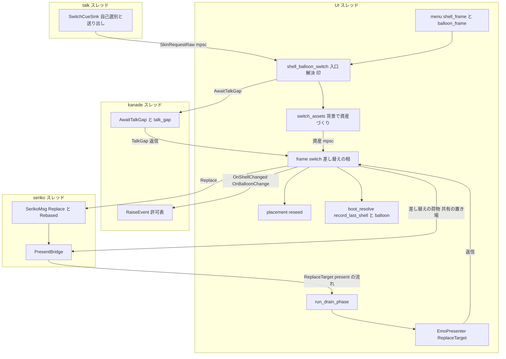
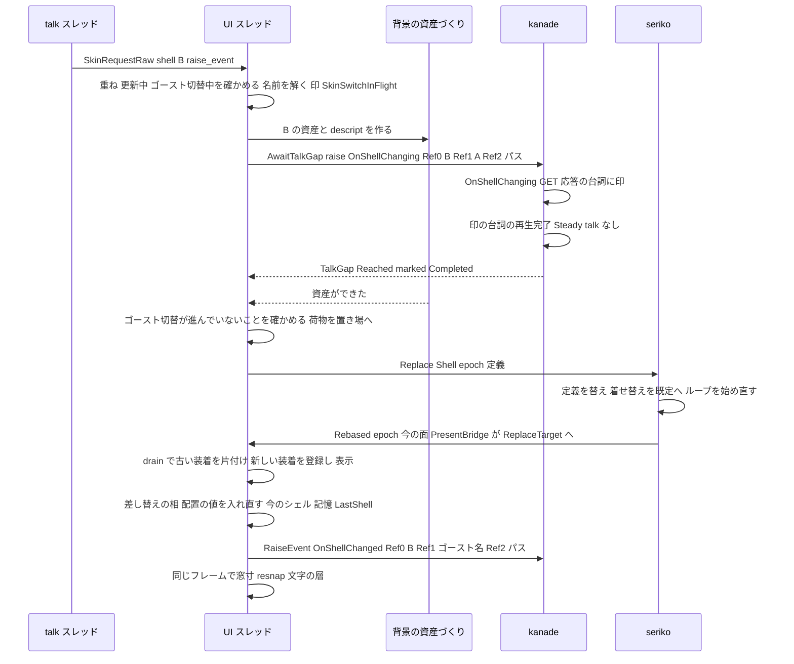
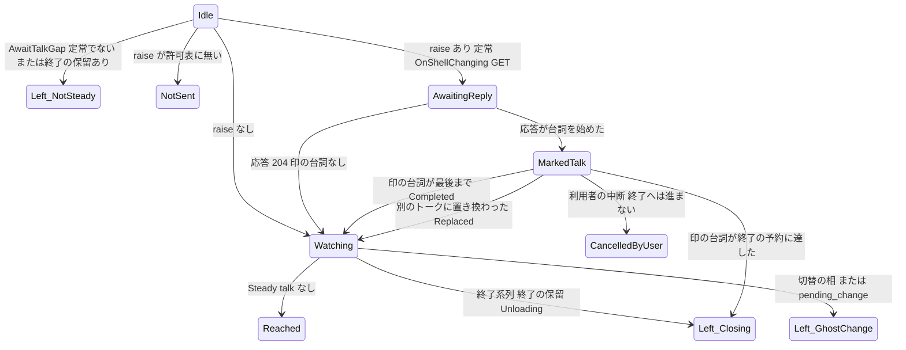
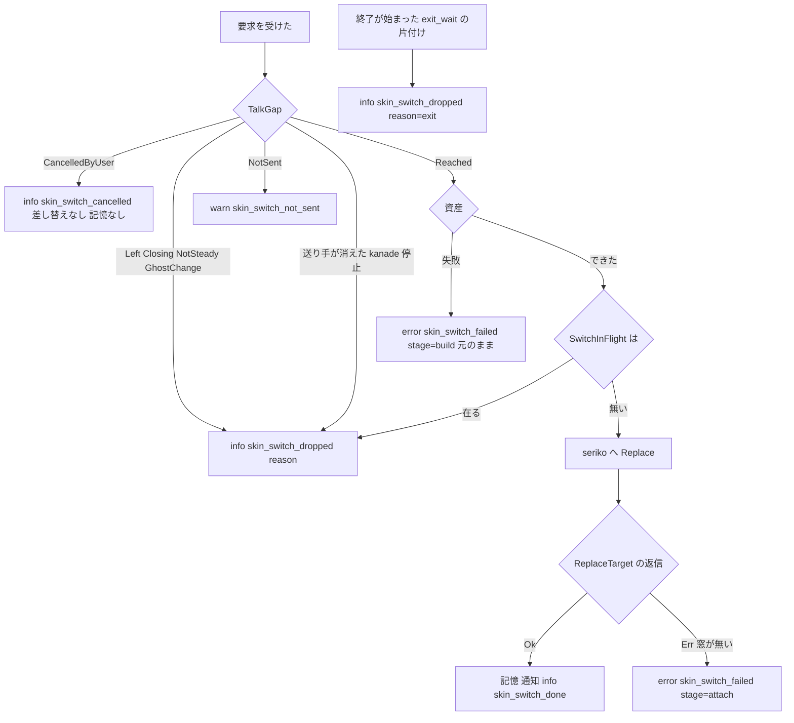
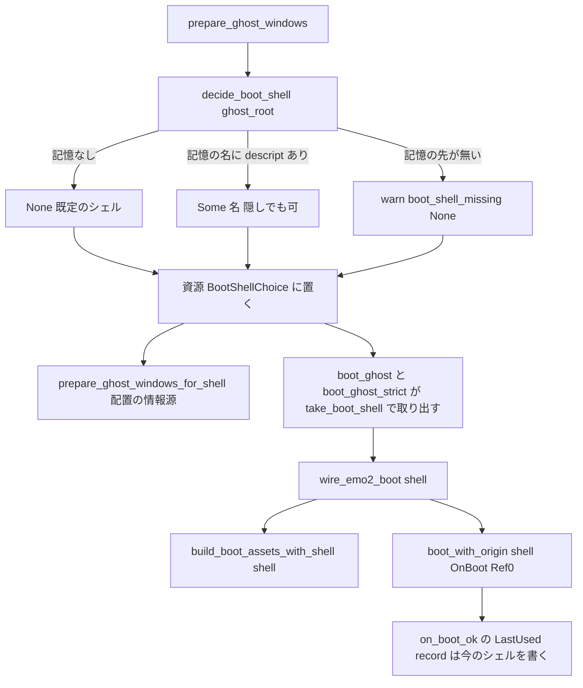

# Design Document — areka-P0-shell-balloon-switch

> 本文の実測は 2026-09-30・本ブランチ（main `d79ca8dc` の上に要件の 5 コミット）のもの。コードは「何の定義か」（関数名・型名＋ファイルパス）で指し、行番号では指さない。要件 12 の裁定 1〜9 は確定済みで、本設計はそれを覆さない。調べた経緯・選ばなかった案は `research.md` §9〜§12 にある。
> **要件の本文を追随させた 2 点（2026-09-30 設計ディスカッションで requirements.md 8.2・8.11・6.4 を改めた。裁定 8 の「印を付けるのは `OnShellChanging` だけ」と利用者から見える振る舞いは不変）**: ⑴ kanade に足す口を「`OnShellChanging` に付ける印」だけでなく「台詞の切れ目を待つ口」に広げた（要件 8.2・8.11 の字面を超える。理由は下の「kanade の口の広さ」）。⑵ シェル名の運び手を `Emo2BootInputs` の欄ではなく「配置の準備が決めたシェル」の資源と `wire_emo2_boot` の引数にした（要件 6.4 の字面と違う。`Emo2BootInputs` の構造体リテラルが触れてはならない `ghost_switch_test_support.rs` に在るため）。どちらも利用者から見える振る舞いは要件のとおりで、変わるのは要件が名指しした部品だけである。
> **実装に合わせて改めた（2026-10-01・tasks 12）**: 実装の途中で設計と違えた箇所を、該当する節へ反映した（経緯は `tasks.md` の Implementation Notes）。主なものは、名前の解決と控えの置き場（`shell_balloon_resolve.rs`）・Reference の組み立ての置き場（入口の側）・起動のシェルを取り出す入口（`boot_ghost`／`boot_ghost_strict`）・バルーンの `windowposition` を切替でも効かせるための配置の境界の広げ（`load_scope_windowpositions`／`merge_scope_windowpositions`）・シェルの後始末の順（窓寸 → 見た目の値 → キャラ窓の置き直し）・統合テストの土台と検体。利用者から見える振る舞いと裁定 1〜9 は変わらない。

## Overview

**Purpose**: SHIORI を降ろさずに、同じゴーストの別のシェルへ、また別のバルーンへ替わる。台本の `\![change,shell,名(,--option=raise-event)]`・`\![change,balloon,名]` とメニューの「シェル」「バルーン」枠が同じ 1 本の入口を通る。areka は kanade に「台詞の切れ目」を待ってもらい（`raise-event` とメニューのシェル切替では、先に `OnShellChanging` を送ってその台詞に印を付ける）、その間に新しい資産を画面を進める処理の外で作っておく。切れ目が来たら seriko に定義の差し替えを頼み、seriko の表示の流れの中で present が古い装着を片付けて新しい装着を登録・表示する。同じフレームのうちに窓寸・配置・文字の層を合わせ、`OnShellChanged`／`OnBalloonChange` を送り、選んだものを記憶に書く。次の起動では記憶のシェルで起きる。

**Users**: α の利用者（メニューで見た目を替える第三者）と、シェルを複数持つゴーストの作者（里々／YAYA の標準テンプレートの `\![change,shell,…]` と `OnShellChanging`／`OnShellChanged` の台詞）。

**Impact**: 次の 4 つが変わる。
- 起動時に固定されていた出し先（present の装着・seriko の定義）が、走っている間に 1 度ずつ差し替えられるようになる。
- kanade は、依頼した側へ「台詞の切れ目に達した／達しないと決まった」を 1 回だけ返せるようになる。
- 起動時のシェルは記憶から決まるようになる。
- メニューの「シェル」「バルーン」枠に項目が並ぶ。

ゴースト切替・終了経路・ネットワーク更新の読み直しの形は変えない。

### Goals

- 入口を 1 本にし、台本とメニューがそこを通る（要件 1）。
- シェルの切替は、`OnShellChanging` → 台詞の再生完了 → 差し替え → `OnShellChanged` を正典の Reference で行う。バルーンの切替は、差し替え → `OnBalloonChange` で行う（要件 2・3）。
- 差し替えは台詞の切れ目で、1 つの手順として行う。古い絵と新しい当たり判定が混ざるフレームも、空になるフレームも出さない（要件 4）。
- 中断は中止とし、途中の失敗では元のまま続ける。終了の意思が切替に勝つ（要件 5）。
- 記憶に書き、次の起動でシェルも復元する（要件 6）。
- メニューの 2 枠を出す（要件 7）。
- 判断の分岐を決定論テストで固定し、実機で 1 周する（要件 11）。

### Non-Goals

- ゴースト切替そのもの。`SwitchRequest`／`GhostSpec`／`request_ghost_switch` と `ghost_switch.rs` 一式（要件 8.1）。
- 次のものは本仕様では扱わない（要件 Boundary Context の Out）。
  - `\![reload,…]`
  - 着せ替えの操作 `\![bind,…]`
  - 拡大率の命令・`OnNotify*Info`・`currentghost.shelllist.*` 系
  - `sequential`
  - インストール直後の自動切替
  - 3 人以上のキャラの窓
  - `.pna`・`full`・`0` の透過
  - メッセージボックス
- sylphya の Shell スコープの根（`<shell.dir>/profile/areka/`）の張り替え。本番で Shell スコープへ書く呼び手が 0 なので、張り替えない（Revalidation Triggers に登記する）。

## Boundary Commitments

### This Spec Owns

- **シェル・バルーンの切替の入口**: `crates/areka/src/emo2_boot/shell_balloon_switch.rs` の要求の型 `SkinRequest` と入口 `request_skin_switch`、進行中の印 `SkinSwitchInFlight`（NonSend・高々 1 つ）、名前の解決（`name` → フォルダ名・隠しシェル・`random`・`lastinstalled`）、インストールの控え（`LastInstalledShell`／`LastInstalledBalloon`）、終了の門の片付け。名前の解決（`resolve_skin_target`・`pick_random`・候補の列挙 `shell_candidates`／`balloon_candidates`・控えの読み `installed_for`）と控えの資源・書き手は隣の `emo2_boot/shell_balloon_resolve.rs` に置いた（入口のファイルを短く保つため）。
- **台本の受け口**: `emo2_boot/switch_cue.rs` の `SwitchCueSink`（受け口の 11 本目）と、消費者台帳の `("change", Some("shell"))`・`("change", Some("balloon"))` の 2 行。
- **kanade の「台詞の切れ目」の口**: `KanadeMsg::AwaitTalkGap`、応答の型 `TalkGap` ほか（`crates/areka-kanade/src/change.rs`）、判断 `crates/areka-kanade/src/schedule/talk_gap.rs`。印の付いた台詞の中断を終了に結ばない例外は、`schedule/mod.rs` の `on_talk_done` に 1 か所置く。許可表の 3 語もここに含める。
- **資産の片側づくり**: `emo2_boot/assets.rs` の `build_shell_assets`／`build_balloon_assets`（`build_boot_assets` はこの 2 つを合わせたものになる）。背景のスレッドで作る `emo2_boot/switch_assets.rs`。
- **差し替えの語**:
  - seriko: `SerikoMsg::Replace`・`DisplayCommand::Rebased`・`ScopeStates::rebase_*`・`LoopRuntime::replace_*`
  - present: `PresentCommand::ReplaceTarget`・`EmoPresenter::detach_target`・`VisualMount::despawn`
  - areka の橋渡し: `PresentBridge` が `Rebased` を `ReplaceTarget` へ写す
  - 差し替えの相: `emo2_boot/frame/switch.rs`
- **シェルの差し替えで読み直す配置の値**: `crates/areka/src/placement/reseed.rs`（`apply_shell_descript`・`reanchor_char_windows`）。バルーン側の `windowposition` を切替でも効かせるため、境界を広げて `placement::apply_scope_windowpositions` を読み手 `load_scope_windowpositions` と合流の純関数 `merge_scope_windowpositions` に分けた（要件 2.7 の根本・`placement/mod.rs`）。
- **今のシェルの書き換え**: `GhostRuntime::set_shell_dir`（`crates/areka-ghost/src/runtime.rs`）とそれへ委ねる `GhostSession::set_shell_dir`、`BootContext.current.balloon` の書き換え。
- **起動時のシェル**: シェル名つきの解決 `crates/areka-parsers/src/package/resolve_shell.rs` の `resolve_with_shell` と、記憶の読み手 `read_last_shell`。起動のシェルの決定 `decide_boot_shell` と、1 つだけ書く記憶の書き手 `record_last_shell`／`record_last_balloon`（`boot_resolve.rs`）。配置の準備と起動の結線にシェル名を渡す口も含める。
- **メニュー**: `menu/shell_frame.rs`・`menu/balloon_frame.rs`。
- **目録**: 隠しシェルも含める列挙 `catalog::list_all_shells`。
- **検体**: 2 つ目のシェルを写す部品 `SampleRoot::add_shell_copy`（`sample-ghost-kit`）。
- **網羅台帳・§8・決定論テスト・実機サインオフの記録**（`signoff.md`）。

### Out of Boundary

- `crates/areka/src/emo2_boot/ghost_switch.rs`・`ghost_switch_tests.rs`・`ghost_switch_test_support.rs`・`crates/areka-parsers/src/sakura/`・`crates/areka-sakura/src/compile.rs`・`crates/areka-ghost/src/lib.rs`（変更 0 行。`catalog` は既に `pub mod`）。`request_ghost_switch` は呼ばない（本仕様の `lastinstalled` はゴースト切替を起こさない＝裁定 3）。
- `crates/areka-kanade/src/schedule/steady.rs`（935 行・変更 0 行）。`KanadeMsg::RaiseEvent` の形・`on_raise_event`・`value_replaces_active_talk`（変更 0。印の無い依頼の判断は不変＝要件 8.3）。`KanadeNotice` の変種（増減 0。`ghost_switch.rs` の `on_notice` が網羅の match で読むため）。
- `GhostBootOptions`・`ConfigInputs`・`CurrentGhost`・`GhostDecision`・`BalloonDecision`・`catalog::Identity`・`Emo2BootInputs`・`StartupDescriptValues` の欄（どれも増減 0）。`BalloonRoute` の腕（増減 0）。
- `session_mark_verdict`・`ExitOrigin`・`quit_app`（変更 0）。
- `areka-emo-text`（`sink.rs` の `TextMsg` を含め変更 0。文字の層は既存の毎フレームの結び直し `TextLayerRuntime::refresh_actor_scale` が新しい装着へ結び直す）。
- `placement/persist.rs` の `load_restored_state`（`shiori.dir` しか使わないので、シェル名を渡さない・変更 0）。
- `ALLOWED_SYNC_SENDS`（2 行のまま）・環境変数・依存クレート（どれも追加 0）。
- 上限の近いテスト（`runtime_tests.rs`・`assets_tests.rs`・`actor_tests.rs`・`schedule_tests.rs`・`ghost_switch_tests.rs`）への行の追加（0 行）。

### Allowed Dependencies

- 完了 `ghost-shell-balloon-switch`
  - `GhostSlot`・`BootContext`・`SwitchInFlight`（`pub(crate)`・有無を読むだけ）
  - `menu::register` と「起こすたびに登記をやり直す」契約
  - `KanadeMsg::RaiseEvent`（`OnShellChanged`／`OnBalloonChange` の送出に使う）
- 完了 `baseware-root-layout`: `catalog::list_shells`／`list_balloons`、`PersistKey::LastShell`／`LastBalloon`（Ghost スコープ）、`boot_resolve::pick_index`、`SylphyaPublisher::persist_put`／`barrier`。
- 完了 `pilot-balloon-asset-swap` の学び（古い装着を消してから、同じ呼び出しの中で再登録する。置き場は配置が決まる前の段）。
- 完了 `network-update` の `update/desk.rs`（段 `Stage` と `after_switch` を読む問いを 1 つ足すだけ）と `exit_wait::register_gate`。
- 完了 `balloon-break`: 印の付いた台詞の中断の判定は、既存の `user_break::take_user_break_quit` と同じ帳簿（`State.user_break_talk`）を読む。
- `dola::cue::CueSink`・`areka_actor::{reply_channel, ReplySender, ReplyReceiver}`・`std::sync::{mpsc, Arc, Mutex}`・`std::thread`・`windows` の COM 初期化（既存の依存）。
- 依存の向き: `areka-parsers` → `areka-ghost` → `areka-kanade`（型）→ `areka-seriko`・`areka-emo-present` → `areka`。
  - seriko は present を知らない。定義の差し替えの合図は seriko の語彙（`DisplayCommand::Rebased`）で出し、present の語への写しは areka の `PresentBridge` が行う。
  - present は seriko も areka も知らない。
  - kanade は areka の切替の印を知らない（台詞の切れ目の口は汎用）。

### Revalidation Triggers

- `KanadeMsg::AwaitTalkGap`・`TalkGap`・`GapRaise`・`MarkedEnd`・`GapLeft` の形。
  - α 後の `network-update-canon-order` がこの口を使う見込み（裁定 8 の根拠）。
- `PresentCommand::ReplaceTarget` の形と、引き継ぐ欄の表（可視性の持ち主・`applied`・`native_size`・`pending_resize`）。
- `SerikoMsg::Replace`・`DisplayCommand::Rebased` の形と、差し替えで消す状態の表（動的な着せ替え・パターンの進行）。
- `resolve_with_shell` の「名前つきで `shell/<名>/` が無ければ `ShellDirMissing`」の規則。
- `GhostRuntime::set_shell_dir` の後も、sylphya の Shell スコープの根は起動時のシェルのままであること。Shell スコープへ書く本番の呼び手を足す spec は再検証する。
- 記憶の書き手 `record_last_shell`／`record_last_balloon` が 1 つの鍵だけを書くこと（`LastUsed::record` は不変）。
- メニューの登記の列に `Frame::Shell`・`Frame::Balloon` が加わる（`ghost_session_restart_tests.rs` の登記の一覧）。
- 受け口の列が 11 本になる（`wire_emo2_boot` の `sinks`）。
- seriko の送り手の複製の寿命: 持ち主は `GhostSession` だけで、`shutdown_impl` の ① で落とす。seriko の送り手を UI 側の別の置き場（`Emo2Wiring` ほか、降ろした後も World に残るもの）に持たせる spec は、ゴースト切替・終了で join が戻るかを再検証する。

## Architecture

### Existing Architecture Analysis

- **起動は一度きりの構築**。`wire_emo2_boot`（`emo2_boot/mod.rs`）は次の順に組み立てる。
  1. `build_boot_assets_for` → `build_boot_assets`（`emo2_boot/assets.rs`）で、シェルとバルーンの資産をまとめて作る。
  2. `spawn_seriko(resolver, static_binds, bind_resolver, SerikoLoopConfig, PresentBridge)` に値で渡す。
  3. `GhostBootOptions.sinks` の 10 本とともに `areka_ghost::boot_with_origin` を呼ぶ。
  4. `Emo2Wiring` を据え、`seed_zorder_descript_base` で重なりの基底を 1 度だけ置く。
- **装着**。`run_attach_phase`（`frame/attach.rs`）は旗 `wiring.attached` で 1 度だけ走る。
  - シェル: `attach_target` だけを行う。
  - バルーン: `attach_target` → `set_visibility_ownership(External)` → 面 0 の `ShowSurface` → `connect_balloon_text` → `balloon_models.insert` の順。
  - `EmoPresenter::attach_target`（`presenter/hub.rs`）は表 `targets` を置き換えるだけで、World に触れない。装着の子（`emo-surface`・`emo-text-layer-slot`）は `VisualMount::attach`（`mount.rs`）が最初の表示で作る。表から外す口と子を消す口は 0 件。
- **表示の流れ**。seriko は `SurfaceOutput::send(DisplayCommand)` で出力する。本番の出力先は `PresentBridge`（`emo2_boot/adapter.rs`）で、`map_display_command` が `PresentCommand` に写して mpsc へ送る。`run_drain_phase`（`frame/drain_resnap.rs`）が毎フレームそれを全件適用する。
  - `emo2_frame_system`（`frame.rs`）の順は attach → dpi → drain → 可視性 → 窓寸の照合 → move → 重なり → resnap → 確定 → 再解決 → 文字の層の結び直し → 文字の描画。
- **文字の層**。`run_text_scale_phase`（`frame/scale_text.rs`）は毎フレーム `TextLayerRuntime::refresh_actor_scale` を呼ぶ。スロットの entity や面の寸法が変わっていれば描画の持ち物を作り直し、表示の進み具合は保つ（`areka-emo-text/src/actor.rs` の同関数の doc）。
- **kanade**。
  - `on_raise_event`（`schedule/change.rs`）は許可表と `Phase::Steady` だけを見る。`pending_close` は見ない。
  - 返信 `RaiseOutcome`（`change.rs`）は、最初の往復が済んだ時点で 1 回だけ返る（`actor.rs` の `spawn_kanade_with_stop_sink`）。
  - `on_talk_done`（`schedule/mod.rs`）では、`break_quit = take_user_break_quit(..) && !is_change_phase(..)` が真のとき終了系列へ進む。`TalkEndReason::Quit`（台本が `\-` に達した）も終了系列へ進む。
  - 再生中の台詞に応答が被さると、`steady.rs` の `on_reply` が新しい `TalkId` で置き換える。古い台詞の `TalkDone` は、1 世代だけ控えた帳簿か、未知の番号として捨てられる。
- **UI は kanade の相を知らない**。`KanadeNotice` は `Steady`（起動の完了）・`ChangeCancelled`・`Stopped` だけで、UI の `ghost_switch::on_notice` が網羅の match で読む。
- **配置の値**。
  - シェルの `descript.txt` から来る値は起動時に `placement::prepare_ghost_windows` → `source::load_descript_source` → `config::build_placement_config` で決まり、窓の部品として焼かれる（`placement/spawn.rs` のキャラ窓の `Anchored`・`BalloonFollow::new(balloon_window, p.balloon_offset_base)`・`BalloonKeywordBase`）。
  - 作者の DPI と `seriko.zorder` は `StartupDescriptValues`（`ghost_session.rs`）で起動の結線へ運ばれる。

### Architecture Pattern & Boundary Map



**Architecture Integration**:

- **選んだ形**: 研究の案 C（下の層に口を足してから、その上に入口と相を建てる）。
- **3 つの鍵**。
  - ⑴ **切れ目の判定は kanade に任せる**。UI が推し量らない（裁定 8 の根拠をそのまま、印の無い経路にも広げる）。
  - ⑵ **差し替えの順序は seriko の表示の流れで決める**。seriko が定義を替えた時点の合図を、同じ流れに `ReplaceTarget` として乗せる。これで古い定義の表示の指令は必ず古い装着に、新しい定義の指令は必ず新しい装着に当たり、世代番号も読み捨ても要らない。
  - ⑶ **失敗は差し替えより前に決める**。資産づくりは背景で行い、読めない・解釈できない・復号できないはここで決まる。seriko に渡した後に起こりうる失敗は、装着の登録（窓が既に無い）だけにする＝要件 5.6。
- **責務の分割**。
  - 名前の解決・重ねの禁止・更新中の禁止・ゴースト切替との優先・記憶・通知は UI（`shell_balloon_switch.rs`・`frame/switch.rs`）。
  - 切れ目・印・中断の扱いは kanade（`talk_gap.rs`）。
  - 定義の差し替えと差し替え後の最初の面は seriko。
  - 古い装着の片付けと新しい装着の登録・表示・引き継ぎは present。
- **既存のまま**:
  - ゴースト切替の入口と相、`KanadeMsg::RaiseEvent` の判断、`run_attach_phase` の 1 度だけの作り
  - `connect_balloon_text` の順序、`*_cue.rs` の 2 段の型（自己選別＋送り出し）、`wire_*`／`register_*_drain` の対
  - `LastUsed::record`（起動のたびに今のシェルを書く＝起動が記憶のシェルでマウントすれば同じ値になる）
- **新しい部品の理由**:
  - `AwaitTalkGap`: UI は kanade が終了系列に入ったことも、台詞が置き換わったことも知らない。kanade に聞く以外に要件 1.14・5.2・5.4・5.7 を厳密に満たす手段が無い。
  - `ReplaceTarget`: present に古い装着を片付ける口が無い（要件 4.6）。
  - `SerikoMsg::Replace`: seriko の定義は起動時に値で渡したきりで、差し替える語が無い。
  - `switch_assets.rs`: 資産づくりを画面を進める処理の外で行う（要件 4.4）。
  - `reseed.rs`: シェルの `descript.txt` の見た目の値を読み直す（要件 2.7）。
- **Steering との整合**:
  - 失敗の経路はすべて記録付き（無視は `warn!`・中止は `info!`・失敗は `error!`・受理と完了は `info!`）。
  - 1 フレーム遅らせて辻褄を合わせる解は無い。差し替えは drain の中の 1 手順で、同じフレームの下流の相（窓寸・resnap・文字の層）がそれを入力に取る。
  - `\!` 命令は汎用の運び手を名前で選別する。環境変数も依存クレートも足さない。

#### kanade の口の広さ（要件 8.2・8.11 の字面との差）

要件 8.11 は「`OnShellChanging` にだけ印を付け、その台詞の終わり方を知らせる」口を求め、要件 8.2 は kanade で触る範囲をそれに限る。一方で、印の付かない経路（`raise-event` 無しの台本・バルーン・メニューのバルーン）でも、要件は次を求める。
- 要件 5.4: 台本を運んだ台詞が `\-` の予約つきで中断されたら、保留の切替を捨てる。
- 要件 1.14: 終了系列の途中に届いた要求は無視する。
- 要件 5.7: 終了要求が来たら切替を取りやめる。

これらはどれも「kanade が終了系列へ入ったか」を知らなければ判定できない。既存の返信・通知で代わりになるものは無い。
- `RaiseOutcome::NotSteady` は依頼した時点の相しか言わない。
- `KanadeNotice` に変種を足すと、触れてはならない `ghost_switch.rs` の網羅の match が壊れる。
- 完了 `ghost-shell-balloon-switch` の同じ場面（`raise-event` 無しのゴースト切替）は kanade の `pending_change` が扱っており、UI は推し量っていない。

そこで本設計は、口を「台詞の切れ目を待つ」1 本にし、印はその任意の添え物にする（`OnShellChanging` のときだけ付ける＝8.11 の印の範囲は不変）。裁定 8 の根拠（UI が推し量ると `\-` 入りの台詞の中断でアプリが終わり、置き換えで判断を誤る）が、印の無い経路にもそのまま当てはまる。印の無い依頼の振る舞い（`RaiseEvent`）は 1 行も変えない（要件 8.3）。

### Technology Stack

| Layer | Choice / Version | Role in Feature | Notes |
|-------|------------------|-----------------|-------|
| 運行（kanade） | `areka-kanade`（純粋状態機械 `step`＋アクターの殻） | 台詞の切れ目の口・印・許可表 3 語 | 新規依存なし・`steady.rs` 不変 |
| 定義（seriko） | `areka-seriko`（アクター・`ScopeStates`・`LoopRuntime`） | 定義の差し替えと差し替え後の最初の面 | 新規依存なし |
| 表示（present） | `areka-emo-present`（`EmoPresenter`・`VisualMount`） | 古い装着の片付けと新しい装着の登録・表示・引き継ぎ | `PresentCommand` は `#[non_exhaustive]` |
| 解決（parsers／ghost） | `areka-parsers::package`・`areka-ghost`（`runtime`・`catalog`） | シェル名つきの解決・今のシェルの書き換え・隠しシェルを含む目録 | `resolve.rs` に行を足さない |
| UI／ECS | `bevy_ecs` 0.19（NonSend／Resource）・`wintf`（`Input`／`Update` 段） | 入口・差し替えの相・メニュー | 既存の段と順序を使う |
| 背景の資産づくり | `std::thread`＋COM の MTA 初期化（`windows` クレート・既存）＋WIC | 新しい資産の読み込みと復号 | 新規依存なし |
| 記憶 | `areka-sylphya`（`persist_put`・Ghost スコープ） | `LastShell`／`LastBalloon` を 1 つずつ | 鍵の追加なし |
| テスト | 偽の SHIORI（x64 偽境界）・`sample-ghost-kit`・`log-capture-kit`・GPU の `cargo test` | 決定論テスト | 実機は R_POST_and_KOMAINU と emo2 |

## File Structure Plan

### Directory Structure（新規ファイル）

```
crates/areka-kanade/src/schedule/
├── talk_gap.rs                  # 台詞の切れ目の口の判断（begin・印の記録・毎 step 後の見極め・中断の例外の問い）
└── talk_gap_tests.rs            # 上の決定論テスト（要件 11.4 の kanade 側・1.14・5.2・5.4・5.7）
crates/areka-kanade/src/
└── actor_talk_gap_tests.rs      # 殻が返信を 1 回だけ送る・止まれば送り手が消える（兄弟の新テスト）

crates/areka-parsers/src/package/
├── resolve_shell.rs             # resolve_with_shell（resolve の本体をここへ移し、名前つきに広げる）
└── resolve_shell_tests.rs

crates/areka-seriko/src/
├── actor_replace_tests.rs       # Replace で定義が替わり Rebased が出る・消す状態・ループの作り直し
├── state_rebase_tests.rs        # rebase_shell／rebase_balloon が消す状態と保つ状態（実装で分けた兄弟）
└── looper_replace_tests.rs      # replace_shell_table／replace_balloon_tables（実装で分けた兄弟）

crates/areka-emo-present/src/
├── presenter/replace.rs         # apply_replace（古い装着の片付け・新しい装着の登録・引き継ぎ・最初の表示）と detach_target
└── presenter_replace_tests.rs   # 引き継ぎと片付けの決定論テスト（要件 4.3・4.6・11.9）

crates/areka-ghost/src/
├── runtime_shell_tests.rs       # boot_with_origin のシェル名・set_shell_dir（兄弟の新テスト）
└── catalog_all_shells_tests.rs  # list_all_shells が隠しシェルを含む

crates/areka/src/
├── emo2_boot/
│   ├── switch_cue.rs            # \![change,shell|balloon,…] の受け口（自己選別＋送り出し）
│   ├── switch_cue_tests.rs
│   ├── shell_balloon_switch.rs  # 入口 request_skin_switch・SkinRequest・SkinSwitchInFlight・取り出しの系・終了の門・Reference の組み立て（skin_ref_name／skin_ref_path）
│   ├── shell_balloon_switch_tests.rs
│   ├── shell_balloon_resolve.rs # 名前の解決 resolve_skin_target・random・候補の列挙・控え LastInstalledShell／LastInstalledBalloon と書き手（実装で入口から分けた）
│   ├── shell_balloon_resolve_tests.rs
│   ├── switch_assets.rs         # 背景のスレッドでシェル／バルーンの資産を作る・荷物の型 SwapPayload・共有の置き場 SwapSlot
│   ├── switch_assets_tests.rs
│   ├── adapter_rebased_tests.rs # PresentBridge が Rebased を ReplaceTarget へ写す（実装で分けた兄弟）
│   ├── assets_shell_tests.rs    # シェル名つきの資産づくり（実装で分けた兄弟）
│   ├── balloon_visibility_forget_tests.rs  # forget_scope（実装で分けた兄弟）
│   └── frame/
│       ├── switch.rs            # 差し替えの相 run_switch_phase（切れ目と資産を待つ・seriko へ頼む・完了の後始末）
│       ├── switch_tests.rs      # 待ちの段
│       └── switch_finish_tests.rs  # 頼んだ段と完了の後始末（実装で分けた兄弟）
├── placement/
│   ├── reseed.rs                # シェルの descript の見た目の値を走っている窓の部品へ入れ直す・キャラ窓の置き直し
│   ├── reseed_tests.rs
│   └── source_shell_tests.rs    # シェル名つきの配置の情報源（実装で分けた兄弟）
├── menu/
│   ├── shell_frame.rs           # 「シェル」枠
│   ├── shell_frame_tests.rs
│   ├── balloon_frame.rs         # 「バルーン」枠
│   └── balloon_frame_tests.rs   # （設計の skin_frames_tests.rs は枠ごとの 2 本に分けた）
├── boot_shell_tests.rs          # 起動時のシェルの決定と 3 つの解決点の一致（要件 11.7・ghost_session.rs から #[path] で宣言＝ghost_session_switch_tests.rs と同じ形）
├── shell_balloon_switch_session_tests.rs          # 送り手を持つセッションの降ろし・メニュー相当の要求と 2 枠（同じく ghost_session.rs から宣言）
├── shell_balloon_switch_session_lap_tests.rs      # シェルの往復と OnShellChanging の有無（要件 11.1・11.3・土台 lap_rig）
├── shell_balloon_switch_session_balloon_tests.rs  # バルーンの往復（要件 11.2）
├── shell_balloon_switch_session_abort_tests.rs    # 中止・失敗・終了・ゴースト切替（要件 11.4〜11.6・8.5）
└── shell_balloon_switch_session_update_tests.rs   # 切替の後の更新の対象と読み直し（要件 11.8）

crates/sample-ghost-kit/src/
└── lib_tests.rs                 # add_shell_copy の検査は既存の兄弟テストに足した（設計の shell_copy_tests.rs は作らなかった）

.kiro/specs/areka-P0-shell-balloon-switch/signoff.md   # 実機の記録（要件 11.11・11.12・9.2）
```

### Modified Files

- `crates/areka-kanade/src/change.rs` — `GapRaise`・`TalkGap`・`MarkedEnd`・`GapLeft` を足す（型だけ）。126 → 約 190 行。
- `crates/areka-kanade/src/lib.rs` — 上の 4 型の再輸出（1 行）。
- `crates/areka-kanade/src/msg.rs` — `KanadeMsg::AwaitTalkGap { raise, reply }` と、名前を返す match の腕。883 → 約 905 行。
- `crates/areka-kanade/src/actor.rs` — `AwaitTalkGap` を `Input::AwaitTalkGap` へ写す。返信の送り手をメッセージをまたいで 1 本持ち、`drive` の後に `talk_gap::take_outcome` が `Some` なら 1 回送る。656 → 約 700 行。
- `crates/areka-kanade/src/schedule/mod.rs`（830 → 約 870 行）— `Input::AwaitTalkGap`・`State.talk_gap: Option<talk_gap::GapWatch>`・`step` の末尾で `talk_gap::observe` を呼ぶ（入力の種類を先に控える）・`on_talk_done` は `take_user_break_quit` の**前**に `let marked_break = talk_gap::is_marked_break(&state, &done);` を取り、真なら `State.talk_gap` の印を `BrokenByUser` にしてから、`break_quit` に `&& !marked_break` を掛ける（`take_user_break_quit` が帳簿 `user_break_talk` を空にするので、後ろで評価すると常に偽になる。帳簿を空にする単一の履行点は `take_user_break_quit` のまま）。**実装**: 見極めは 2 つに分けた——`step` は `route` の前に `talk_gap::marked_reply(&state, &input)` で印の応答の直前のトークの番号を控え、既存の分岐の後で `talk_gap::observe(&mut state, reply)` を呼ぶ。印の台詞の完了の写しは `on_talk_done` が現行のトークと突き合わせた後に `talk_gap::note_marked_done` を呼ぶ
- `State` の構造体リテラル 16 か所（**実数は 15 か所**＝`schedule/mod.rs` は 1 で、設計の 2 は数え違い。`schedule/mod.rs` 1・`close.rs` 2・`boot_reply_branch_tests.rs` 4・`boot_sequence_tests.rs` 6・`schedule_log_firing_tests.rs` 2）— `talk_gap: None` を 1 行ずつ足す（どのファイルも上限の近い表に無い）。
- `crates/areka-kanade/src/schedule/events.rs` — `ALLOWED_EVENT_IDS` に `OnShellChanging`・`OnShellChanged`・`OnBalloonChange`（42 → 45 語）と doc の件数。
- `events_change_tests.rs`（`assert_eq!(ALLOWED_EVENT_IDS.len(), 45)`）・`events_tests.rs`（テスト名を `allowed_event_ids_are_exactly_the_forty_five_and_exclude_ontalk_onhour` へ、配列に 3 語）— 件数の追随。 **実装**: 許可表に無い例として `OnShellChanged` を使っていた `raise_event_tests.rs` の既存テスト 1 本の例を `OnTalk` へ差し替えた（1 語・振る舞いは不変）。網羅の match の腕 `Input::AwaitTalkGap` は既存の `schedule_variant_tests.rs` に 1 本足した。
- `crates/areka-parsers/src/package/resolve.rs` — `resolve` の本体を `resolve_shell.rs` へ移し、`resolve_with_shell(ghost_root, default_encoding, None)` へ委ねる 1 行にする（952 → 約 890 行・既存の呼び出し約 30 本は不変）。
- `crates/areka-parsers/src/package/mod.rs` — `mod resolve_shell;`・`pub use resolve_shell::resolve_with_shell;`。
- `crates/areka-ghost/src/runtime.rs` — `boot_with_origin(options, kanade_stop, origin, shell: Option<&str>)` にし、解決を `resolve_with_shell` に替える。`boot_with_kanade_stop` は `None` を渡す。`GhostRuntime::set_shell_dir(&mut self, dir: PathBuf)` を足す（`mount.shell.dir` の書き換えだけ）。739 → 約 760 行。
- `crates/areka-ghost/src/runtime_origin_tests.rs` — 呼び出し 1 か所に `None`。
- `crates/areka-ghost/src/catalog.rs` — `list_all_shells(ghost_dir) -> Vec<ShellEntry>`（`menu,hidden` を除かない）。`list_shells` は不変（`updateother` が除外に依る）。362 → 約 385 行。
- `crates/areka-seriko/src/actor.rs`（522 → 約 600 行）— `SerikoMsg::Replace(Box<SerikoReplace>)` と `SerikoSink::send_replace`・`spawn_seriko` の受信の閉包が `Replace` を `handle_message` より先に捌く（`handle_message` の署名は不変＝テストの呼び出し 45 本を直さない）・`handle_message` の `Replace` の腕は「殻を経ずに届いた」`error!` だけ
- `crates/areka-seriko/src/state.rs` — `ScopeStates::rebase_shell(static_binds)`（静的な着せ替えを差し替え、動的な着せ替えとシェル側のパターンの進行を消す。今の面は保つ）・`rebase_balloon()`（バルーン側のパターンの進行を消す。今の面は保つ）。582 → 約 630 行。
- `crates/areka-seriko/src/looper.rs` — `LoopRuntime::replace_shell_table`・`replace_balloon_tables`（再生中のループを捨てて新しい表から始め直す）。「以後不変」の doc を「差し替えの語でだけ替わる」へ改める。
- `crates/areka-seriko/src/output.rs` — `DisplayCommand::Rebased { epoch, kind, shows }`・`RebaseKind`・`RebasedShow`。
- `crates/areka-seriko/src/lib.rs` — `SerikoReplace`・`RebasedShow` の再輸出。
- `crates/areka-emo-present/src/command.rs` — `PresentCommand::ReplaceTarget`（下の Components）。
- `crates/areka-emo-present/src/presenter/hub.rs` — `apply` の腕 1 つ（`apply_replace` へ）。176 → 約 185 行。
- `crates/areka-emo-present/src/presenter.rs`（`presenter` のモジュール宣言） — `mod replace;`。
- `crates/areka-emo-present/src/mount.rs` — `VisualMount::despawn(self, world)`（装着の子 2 つを消す）。300 → 約 330 行。
- `crates/areka/src/emo2_boot/assets.rs` — `build_boot_assets` の本体を `build_shell_assets(ghost_root, shell, scopes, author_dpi, decoder)` と `build_balloon_assets(balloon_root, scopes, author_dpi, decoder)` の 2 本に括り出し、両者を続けて呼ぶ兄弟 `build_boot_assets_with_shell(.., shell: Option<&str>)` を足す。`build_boot_assets` の署名は据え置き、`shell: None` で兄弟へ委ねる 1 行にする（`assets_tests.rs`〔976 行〕・`frame_attach_tests.rs`・`frame_visibility_integration_tests.rs`・`spine.rs` の呼び出しの追随 0）。409 → 約 460 行。 **実装**: `build_shell_assets` のシェル名は `Option<&str>`（作者の DPI は呼び手が渡す。新しいシェルの `seriko.dpi` を読むのは背景の資産づくり）。`ShellAssets` に `bake_failures`（焼く段で落ちた絵の理由）を足した＝起動は今日どおり読み飛ばし、切替は失敗にする（要件 5.5）。本番の起動はシェル名つきの兄弟を通るので、`build_boot_assets` は本番の呼び手を失い、関数単位の `#[allow(dead_code)]` を付けて残した（呼び手は example とテスト）。
- `crates/areka/src/emo2_boot/mod.rs`（825 → 約 870 行）— 新しいモジュール 3 つ（`switch_cue`・`shell_balloon_switch`・`switch_assets`）の宣言・`wire_emo2_boot` に `shell: Option<&str>` を足す（`build_boot_assets_with_shell` と `boot_with_origin` へ）・切替の線を 1 本作り、`sinks` の 11 本目に `SwitchCueSink`、受信端を `shell_balloon_switch::wire_switch_rx` で World へ・`SwapSlot` を 1 つ作って `PresentBridge::with_swap_slot` と `Emo2Wiring` の両方へ・`SerikoSink` の複製を `Emo2BootOutcome.seriko_sink`（新しい欄・構造体リテラルは本ファイルの 2 か所だけ）で返す。持ち主は `GhostSession`（下の `ghost_session.rs` の行。`Emo2Wiring` は降ろした後も次の起動まで World に残るので、そこに持たせると seriko の join が戻らない） **実装**: 新しいモジュールは `shell_balloon_resolve` を加えた 4 つ。`Emo2Wiring::new` は空の置き場を作り、`wire_emo2_boot` が構築の後に結線で作った置き場へ差し替える。
- `crates/areka/src/emo2_boot/adapter.rs` — `PresentBridge` に `swap: Option<SwapSlot>` を足す（`new` は `None`・`with_swap_slot` で `Some`）。`send` は `DisplayCommand::Rebased` を置き場の荷物と突き合わせて `ReplaceTarget` へ写し、それ以外は今日の `map_display_command`。493 → 約 560 行。
- `crates/areka/src/emo2_boot/frame.rs` — `run_drain_phase` の直後に `run_switch_phase(&mut wiring, world)` を 1 行と、`frame/switch.rs` のモジュール宣言。
- `crates/areka/src/emo2_boot/frame/wiring.rs` — `Emo2Wiring` に `swap_slot: SwapSlot`（`new` は空）と `reseed_zorder_descript_base`（`seed_zorder_descript_base` の隣）。seriko の送り手は持たせない。324 → 約 350 行。 **実装**: `swap_ms` の記録のために、そのフレームの drain に費やした時間 `last_drain` も持つ。
- `crates/areka/src/emo2_boot/frame/zorder_descript.rs` — `apply_descript_rebase(ledger, raw)`（`apply_descript_base` と同じ解釈器を通し、`None`・拒否は空の列で `set_descript_base` を呼ぶ・拒否は既存の `log_group_rejected`）。92 → 約 115 行。台帳 `placement/zorder_group_ledger.rs` は変更 0。
- `crates/areka/src/emo2_boot/balloon_visibility.rs` — `BalloonVisibilityState::forget_scope(scope)`（その scope の縁の記憶を消し、計測を止める）。875 → 約 895 行。 **実装**: `forget_scope` は可視の記憶（`prev_visible`）を偽へ倒して計測（`deadline`）を止めるが、文字の数の記憶（`last_glyphs`）は保つ（消すと表示の済んだ文字が次のフレームで増加の縁に化け、新しいバルーンが台詞の外で現れる＝要件 3.3）。
- `crates/areka/src/emo2_boot/consumer_ledger.rs`（831 → 約 850 行）— `CommandConsumer::SwitchSink` と `canonical()` の 2 行・`canonical_builds_without_duplicate` の件数 13 → 15・`canonical_registers_only_change_ghost_for_the_change_sink` を `canonical_registers_change_ghost_shell_balloon_and_no_bare_change` へ書き換え（削除しない）
- `crates/areka/src/emo2_boot/change_cue.rs` — モジュールの doc の「シェル・バルーンは本受け口の持ち場ではない」に持ち場（`switch_cue.rs`）を書き足す（コードは不変・要件 10.3）。
- `crates/areka/src/ghost_session.rs`（705 → 約 775 行）— `GhostSession` に `seriko_sink: Option<SerikoSink>`（`boot_wired` が `Emo2BootOutcome.seriko_sink` を移す・`for_test` と LogSink の腕は `None`）と借り口 `seriko_sink()`。`shutdown_impl` の ① で loop ticker の停止と一緒に `drop` し、③ の join の前に送り手が消える形にする（同関数の doc の前提「呼び手は自前の `SerikoSink` クローンを保持しない」を「複製は `GhostSession` だけが持ち ① で落とす」へ改める）・兄弟のテスト 2 本（`boot_shell_tests.rs`・`shell_balloon_switch_session_tests.rs`）の `#[path]` 宣言・`prepare_ghost_windows` が `boot_resolve::decide_boot_shell(&cfg.ghost_root)` を 1 度呼んで配置の準備へ渡し、資源 `BootShellChoice { ghost_root, shell }` に置く・`boot_wired` はそれを取り出し（無いか根が違えば自分で決める）、`wire_emo2_boot` へ渡す。`wire_menu` の直後に `menu::shell_frame::register`・`menu::balloon_frame::register`・`register_systems` に `shell_balloon_switch::register_switch_drain`・`GhostSession::set_shell_dir`（実行系へ委ねる）。**実装**: `BootShellChoice` を取り出すのは `boot_wired` でなく、起こす処理の 2 つの入口 `boot_ghost`・`boot_ghost_strict`（`take_boot_shell`）で、結線ありの腕と LogSink の倒れ先（`boot_with_origin(.., Plain, shell)`）の両方へ同じ値を渡す。足した口: `memory_publisher`（記憶の書き手の借り口）・`current_shell_folder`（今のシェルのフォルダ名＝メニューの印と入口が読む）・`set_shell_dir`（実行系へ委ね、実行系が無ければ偽を返す）、cfg(test) の `with_seriko_sink`・`with_memory_publisher`
- `crates/areka/src/boot_resolve.rs`（471 → 約 560 行）— `read_last_shell(ghost_dir)`（`read_last_balloon` と同じ形）・`decide_boot_shell(ghost_dir) -> Option<String>`（記憶の名の `shell/<名>/descript.txt` が在ればその名・無ければ `warn!` で `None`・記憶が無ければ `None`）・`record_last_shell(publisher, folder)`・`record_last_balloon(publisher, folder)`（どちらも 1 つの鍵だけを Ghost スコープへ投函し `info!`）
- `crates/areka/src/placement/source.rs` — `load_descript_source_for_shell(ghost_root, shell)`（`load_descript_source` はそれを `None` で呼ぶ・既存の呼び手 6 か所は不変）。
- `crates/areka/src/placement/mod.rs` — `prepare_ghost_windows_for_shell(ghost_root, balloon_root, shell)`（既存の `prepare_ghost_windows` はそれを `None` で呼ぶ）と `mod reseed;`。 **実装**: 名前なしの準備の段 `prepare_stages` は私的な `prepare_stages_for_shell` へ `None` で委ねる。`prepare_ghost_windows_with_work_area` に名前つきの兄弟は無い。`prepare_ghost_windows` は本番の呼び手を失い、関数単位の `#[allow(dead_code)]` を付けて残した（呼び手は example とテスト）。バルーンの `windowposition` を切替でも効かせるため、`apply_scope_windowpositions` を `load_scope_windowpositions`（読む）と `merge_scope_windowpositions`（純関数）に分けた（境界を広げた）。
- `crates/areka/src/update/desk.rs` — `pub(crate) fn is_busy(world) -> bool`（`stage != Idle` か `after_switch.is_some()`）。 **実装**: 統合テスト（要件 11.8）のために `resolve_targets` を `pub(super)` から `pub(crate)` にし、cfg(test) の口 `insert_running_desk_for_test`・`ask_reload_for_test` を足した（本番の振る舞いは不変）。
- `crates/areka/src/install/desk.rs` — `record_installed` のシェルの腕とバルーンの腕に、控えを書く呼び出しを 1 行ずつ（`shell_balloon_switch::record_installed_shell(world, ghost_folder, folder)`・`record_installed_balloon(world, folder)`）。 **実装**: 2 つの書き手は `shell_balloon_resolve.rs` に置いた。
- `crates/areka/src/menu/mod.rs` — `pub(crate) mod shell_frame;`・`pub(crate) mod balloon_frame;` と、「シェル・バルーンは別の spec」の doc を実装後の形へ（要件 10.3）。
- `crates/areka/src/ghost_session_restart_tests.rs` — 2 周目の登記の一覧に `Frame::Shell`・`Frame::Balloon` が加わる分の追随。 **実装**: 2 周目の「シェル」枠の登記が置き換えの記録 `menu_registration_replaced` を 0 件しか残さないことで、登記が新品であることを判定する形に追随した。
- `crates/sample-ghost-kit/src/lib.rs` — `SampleRoot::add_shell_copy(&self, from, to_folder, name) -> Result<PathBuf, SampleError>`（展開先の複製の `shell/<from>/` を `shell/<to_folder>/` へ写し、`descript.txt` の `name` を書き換える）。`SAMPLES`・`.nar`・README の表は不変。467 → 約 520 行。
- `doc/ukadoc-coverage/ledger/shiori.toml`・`sakura-script.toml` と生成物（`cargo run -p ukadoc-survey -- report`／`report-summary`）・`doc/COMPAT_ARCHITECTURE.md` §8 の 10 行（要件 10.2 の (a)〜(j)）。
- `crates/areka/src/emo2_boot/frame/zorder_descript.rs` の `apply_descript_rebase` は、先に基底を空の列へ戻してから、受理できた値だけを起動と同じ口で据え直す（受理できたときは台帳の `version` が 2 進む）。
- `crates/areka/src/placement/diag.rs` — `PlacementRoute::Restore` は `reseed::apply_shell_descript` が `follow_balloon` の引き金として作るようになったので、語の `#[allow(dead_code)]` を外して注記を改めた（実装 9.2 の後・tasks 12）。
- `main.rs`・`boot_config.rs`・`ghost_switch.rs`・`steady.rs`・`areka-emo-text`・`placement/persist.rs`・`placement/spawn.rs` — 変更 0 行。

行数はどのファイルも 1,000 行の目安の内側に収まる。新規ファイルはいずれも 500 行未満。`shell_balloon_switch.rs` が 500 行を超えそうなら、解決の純関数（`resolve_skin_target`・`pick_random`）を `shell_balloon_resolve.rs` へ分ける。

## System Flows

### Flow 1: `raise-event` 付きのシェル切替（成功）



流れの判断は次のとおり。
- ⑴ 名前の解決・重ねの判定は、kanade へ何か送る前に UI で行う。該当なしは `warn!` で終わり、何も送らない。
- ⑵ 資産づくりと切れ目の待ちは並行して進める。seriko に頼むのは、**資産がそろった後に受けた `Reached`** があるときだけ。`Reached` が資産より先に届いたら、資産がそろったフレームで `AwaitTalkGap { raise: None }` をもう 1 度送り、その返事で決める（kanade は `Reached` を返した時点で見張りを終えるので、資産づくりの数百 ms の間に始まったトークや終了の保留を UI は知らない。今が切れ目なら返事はすぐ `Reached` になる）。印の台詞の終わり方（`MarkedEnd`）は 1 度目の返事のものを記録に使う。残る窓は、最後の返事から drain までの 1〜2 フレームだけ（研究 §10.1 の見積もりどおり）。
- ⑶ 頼む直前に、もう一度 `SwitchInFlight` を見る。ゴースト切替が進んでいれば取りやめる（裁定 9）。
- ⑷ `ReplaceTarget` は seriko が定義を替えた点に並ぶ。drain がそれを適用するフレームでは、差し替えの相（drain の直後）→ 窓寸の照合 → resnap → 文字の層の結び直し → 文字の描画が同じフレームで続く。
- ⑸ `OnShellChanged` は差し替えの相の中で送る（差し替えの後）。

### Flow 2: 台詞の切れ目の口（kanade）



流れの判断は次のとおり。
- 見極め（`observe`）は毎 `step` の後に 1 回走り、次の順で決める。
  1. 相が定常でない（切替の相か、ゴースト切替の帳簿 `state.change` が在れば `GhostChange`、それ以外は `Closing`。**実装で広げた**: `raise-event` 無しのゴースト切替は切替の相を経ずに降ろす相へ入るので、帳簿で見分ける）
  2. `pending_close`
  3. `pending_change`
  4. 印の応答待ち
  5. 印の台詞の利用者の中断
  6. 再生中
  7. 切れ目
- 結果は 1 度決まったら変えない。殻が取り出して 1 回だけ送る。
- 印の台詞の中断は `on_talk_done` で終了に結ばない（`break_quit` を偽にする）ので、kanade は定常に戻り、見極めは `CancelledByUser` を返す。
- 印の無い台詞の `\-` 付きの中断は今日どおり終了系列へ進み、見極めは `Left{Closing}` を返す（要件 5.4）。
- 印の台詞が自分で `\-` に達したとき（`TalkEndReason::Quit`）は、今日どおり終了系列へ進んで `Left{Closing}` になる。要件 5.2 が例外にするのは中断だけで、台本が自ら終了を求めた場合は終了の意思が切替に勝つ（要件 5.7 と同じ向き・研究 §10.4）。
- 選択肢の時間切れの解除（`Interrupted` だが利用者の中断でない）は `Completed` とする。選択肢の選択の応答（カスケード）で台詞が替わったら `Replaced` とし、どちらも切替は続く。
- 「置き換え」は、印の台詞の番号と現行のトークの番号が食い違ったことで知る（`steady.rs` に触らない）。

### Flow 3: バルーンの切替と、印の無いシェル切替

`\![change,balloon,Y]`・`\![change,shell,B]`（`raise-event` 無し）・メニューのバルーンは、`AwaitTalkGap { raise: None }` を送る。
- 命令を運んだ台詞が再生中なら、kanade はその終わりまで待つ。無ければすぐ `Reached{marked: None}` を返す（要件 2.3・3.1）。
- 台詞が利用者の中断で終わり、`\-` の予約が無ければ `Reached`（切替を続ける）。予約があれば `Left{Closing}` で、UI は保留の切替を捨てて `info!(skin_switch_dropped, reason=closing)` を残す（要件 5.4）。
- 以降は Flow 1 の「seriko に頼む」から同じ。バルーンの `Rebased` は各スコープのバルーンの今の面（無ければ 0）を運ぶ。
- 差し替えの相は次を行う。
  - `balloon_models` と背景色を新しいものへ替える
  - 可視性の制御のその scope の記憶を消す（`forget_scope`）。古い装着が消えたので、残っていた古いバルーンは画面から消え、新しいバルーンは外部所有のため隠れたままになる。次の台詞で今日どおり現れる（要件 3.3）。
  - `BootContext.current.balloon` を書き換え、`LastBalloon` を書き、`OnBalloonChange` を送る

### Flow 4: 中止・失敗・終了



流れの判断は次のとおり。
- 印の中止と、資産づくりの失敗は、どちらも差し替えの前に決まる（要件 5.1・5.5・5.6）。
- 資産づくりの失敗で、`OnShellChanging` を既に送っていても、そのまま元のシェルで続ける（要件 5.5）。
- `ReplaceTarget` の失敗は窓が既に無い場合だけで、そのとき古い装着も無い（要件 5.6）。
- 終了要求（メニュー・閉鎖要求・Alt＋F4）は kanade の `pending_close` か終了系列として `Left{Closing}` に現れる。OS のセッションの終了とプロセスの終了は、`exit_wait::begin_close` が呼ぶ登記済みの片付け（`shell_balloon_switch::discard_for_exit`）で `info!` を残す（要件 5.7）。
- 切替の経路は `quit_app` を 1 度も呼ばない（要件 5.8）。

### Flow 5: 起動時のシェル



流れの判断は次のとおり。
- 決めるのは 1 か所・1 回だけ（`warn!` は 1 件）。取り出すのは起こす処理の 2 つの入口（`boot_ghost`・`boot_ghost_strict`）で、資源が無いか根が違えばそこで決める。取り出した値は結線ありの腕と LogSink の倒れ先（`boot_with_origin(.., Plain, shell)`）の両方へ渡す（実装 7.2）。
- `decide_boot_shell` が受けるのは 1 段のフォルダ名だけ（`..`・区切り・絶対パスは「先が無い」扱い）。`resolve_with_shell` は名前を検査しないので、名前を渡す側（起動のシェルの決定・切替先の解決）は目録に在る名前だけを渡す。
- 解決の 3 か所（配置の情報源・資産・実行系）が同じ値を受ける（要件 6.4）。
- 記憶の先が無かったときは既定のシェルでマウントされ、`on_boot_ok` の `LastUsed::record` がそのシェルを書く。こうして次の起動から警告が消える（要件 6.3・`LastUsed` は不変）。
- 切替の相手を起こす経路（`ghost_switch.rs` の `boot_into` → `reopen_ghost_windows` → `prepare_ghost_windows`）と、更新の読み直しも同じ関数を通るので、手当ては 0（要件 6.2・6.5）。

## Requirements Traceability

| Requirement | Summary | Components | Interfaces | Flows |
|-------------|---------|------------|------------|-------|
| 1.1 | 入口 1 本・ゴースト切替の形は不変 | ShellBalloonSwitch | `SkinRequest`・`request_skin_switch` | Flow 1 |
| 1.2, 1.3 | 台本のシェル（`raise-event` の有無） | SwitchCueSink → ShellBalloonSwitch | `SkinRequestRaw{kind: Shell, raise_event}` | Flow 1・3 |
| 1.4 | 台本のバルーン・未知の選択肢は `warn!` | SwitchCueSink | 同上（`kind: Balloon`） | Flow 3 |
| 1.5 | メニューの 2 枠 | ShellFrame・BalloonFrame | `SkinRequest{origin: Menu}` | Flow 1・3 |
| 1.6 | `name` → フォルダ名・隠しを含む・バルーンは目録 | ShellBalloonSwitch・Catalog | `resolve_skin_target`・`list_all_shells`・`list_balloons` | Flow 1 |
| 1.7 | 該当なしは `warn!`・イベント 0 | ShellBalloonSwitch | `SkinVerdict::NotFound` | Flow 4 |
| 1.8 | 自分自身への切替は作り直す | ShellBalloonSwitch | 解決は今のものを除外しない | Flow 1 |
| 1.9 | `random` | ShellBalloonSwitch | `pick_random`（`pick_index` を共用） | — |
| 1.10 | シェルの `lastinstalled` | ShellBalloonSwitch・Install | `LastInstalledShell{ghost_folder, folder}` | — |
| 1.11 | バルーンの `lastinstalled` | ShellBalloonSwitch・Install | `LastInstalledBalloon(folder)` | — |
| 1.12 | 重ね禁止・ゴースト切替が勝つ・ゴースト切替中は無視 | ShellBalloonSwitch・SwitchPhase・TalkGap | `SkinSwitchInFlight`・`SwitchInFlight` の有無・`GapLeft::GhostChange` | Flow 4 |
| 1.13 | 更新中は無視 | ShellBalloonSwitch・UpdateDesk | `update::desk::is_busy` | — |
| 1.14 | 定常でなければ無視 | TalkGap・ShellBalloonSwitch | `GapLeft::NotSteady`／`Closing` | Flow 2 |
| 1.15 | 汎用の運び手の名前の選別・台帳 2 行 | SwitchCueSink・ConsumerLedger | `CommandConsumer::SwitchSink` | — |
| 1.16 | 受理・決定・完了・中止・無視・失敗の記録 | 全部 | Error Handling の表 | Flow 4 |
| 2.1 | `OnShellChanging` の Ref0〜2 | ShellBalloonSwitch・TalkGap | `GapRaise`・`skin_ref_name`／`skin_ref_path`（入口の側） | Flow 1 |
| 2.2 | 台詞の再生完了で差し替え・204 は台詞なし | TalkGap・SwitchPhase | `MarkedEnd::Completed`／`NoTalk` | Flow 1・2 |
| 2.3 | `raise-event` 無しは命令の台本の終わり | TalkGap | `AwaitTalkGap{raise: None}` | Flow 3 |
| 2.4 | `OnShellChanged` の Ref0〜2 | SwitchPhase | `finish_shell`・`skin_ref_name`／`skin_ref_path`・`RaiseEvent` | Flow 1 |
| 2.5 | SHIORI を降ろさない・会話の状態を保つ | 全部（降ろす経路を持たない） | kanade の相は定常のまま | Flow 1 |
| 2.6 | 同じ面番号・着せ替えを既定へ | Seriko・Present | `rebase_shell`・`Rebased.shows` | Flow 1 |
| 2.7 | 窓を残す・寸法とバルーンの位置・見た目の値を読み直す | Present・Reseed・SwitchPhase | `ReplaceTarget`（`author_dpi`）・`reseed::apply_shell_descript`・`seed` の置き直し | Flow 1 |
| 2.8 | SERIKO のアニメを始め直す | Seriko | `LoopRuntime::replace_shell_table` | Flow 1 |
| 3.1 | 台詞の終わりで差し替え・無ければ直ちに | TalkGap | `Reached` | Flow 3 |
| 3.2 | `OnBalloonChange` の Ref0〜1 | SwitchPhase | `finish_balloon`・`skin_ref_name`／`skin_ref_path` | Flow 3 |
| 3.3 | 文字の層を組み直す・古いバルーンを隠す・新しいのは隠れたまま | Present・SwitchPhase・Visibility | `ReplaceTarget`（`External` の引き継ぎ）・`forget_scope`・`balloon_models` | Flow 3 |
| 3.4 | 今のバルーン | SwitchPhase | `BootContext.current.balloon` | Flow 3 |
| 3.5 | シェル側は不変・バルーンのアニメは替える | Seriko | `rebase_balloon`・`replace_balloon_tables` | Flow 3 |
| 4.1 | 片付けと登録・表示・窓寸を 1 手順・配置が決まる前 | Present・SwitchPhase | `apply_replace`（drain の中） | Flow 1 |
| 4.2 | 崩れのフレームを出さない | Present・Adapter | 順序は seriko の流れ・`ReplaceTarget` の原子性 | Flow 1 |
| 4.3 | 可視性の持ち主と窓寸の要求の引き継ぎ | Present | `apply_replace` の引き継ぎの表 | — |
| 4.4 | 読み込みと復号は画面を進める処理の外 | SwitchAssets | 背景のスレッド・`skin_switch_swap_ms` の記録 | Flow 1 |
| 4.5 | 拡大率 1 以外でも同じ | Present | 窓の `DPI` を毎回読む・`policy` は新しい作者の DPI | — |
| 4.6 | 片付ける口と登録を消す口 | Present | `PresentCommand::ReplaceTarget`・`detach_target`・`VisualMount::despawn` | — |
| 5.1 | 中断で中止 | TalkGap・SwitchPhase | `TalkGap::CancelledByUser` | Flow 2・4 |
| 5.2 | 印の台詞の中断は終了に結ばない・置き換えは続ける | TalkGap（`on_talk_done`） | `is_marked_break`・`MarkedEnd::Replaced` | Flow 2 |
| 5.3 | 隠す規則は不変 | （完了 `balloon-break`） | `TalkLifecycleSignal::UserBreak`（不変） | — |
| 5.4 | 命令の後の中断は続ける・`\-` なら捨てる | TalkGap | `Reached`／`Left{Closing}` | Flow 3 |
| 5.5 | 途中の失敗は元のまま | SwitchAssets・SwitchPhase | `error!(skin_switch_failed)` | Flow 4 |
| 5.6 | 失敗は差し替えの前で決める | SwitchAssets・Present | 背景で全 I/O・`ReplaceTarget` の失敗は窓が無いときだけ | Flow 4 |
| 5.7 | 終了要求が勝つ | TalkGap・ShellBalloonSwitch | `Left{Closing}`・`discard_for_exit` | Flow 4 |
| 5.8 | 終了の指示を出さない | 全部 | `quit_app` の呼び出し 0 | Flow 4 |
| 6.1 | 1 つだけ書く記憶 | BootResolve・SwitchPhase | `record_last_shell`・`record_last_balloon` | Flow 1・3 |
| 6.2 | 起動で記憶のシェル | BootResolve・GhostSession | `decide_boot_shell` | Flow 5 |
| 6.3 | 記憶の先が無ければ `warn!` と既定と書き直し | BootResolve | `warn!(boot_shell_missing)`・`LastUsed::record` | Flow 5 |
| 6.4 | 3 か所が同じシェルを見る | GhostSession・Emo2Boot・Placement・Ghost | `BootShellChoice`・`wire_emo2_boot(shell)`・`boot_with_origin(shell)`・`prepare_ghost_windows_for_shell` | Flow 5 |
| 6.5 | 更新の読み直しで保たれる・更新の対象が差し替え後 | GhostRuntime・SwitchPhase | `set_shell_dir`・`BootContext.current.balloon`・記憶 | Flow 5 |
| 6.6 | `OnBoot` Ref0・`OnGhostChanged` Ref7 | Ghost | `boot_with_origin` が `mount.shell.dir` から詰める（不変） | Flow 5 |
| 6.7 | argv の意味は不変・切替は書く | SwitchPhase | `record_last_balloon` は経路を見ない・`BalloonRoute::Memory` | Flow 3 |
| 7.1, 7.2 | 並び・現在を含む・1 つでも出す | ShellFrame・BalloonFrame | `list_shells`・`list_balloons` | — |
| 7.3 | 選ぶと要求 | ShellFrame・BalloonFrame | `request_skin_switch` | — |
| 7.4 | 起こすたびに登記 | GhostSession（`boot_wired`） | `register` 2 行 | — |
| 7.5 | 文言と作法は不変 | Menu | `captions.rs` 不変 | — |
| 8.1 | 触らないファイル・形を変えない | 境界 | Out of Boundary | — |
| 8.2 | 許可表 3 語・件数の追随・kanade の範囲 | Events・TalkGap | `ALLOWED_EVENT_IDS` 45 語・「kanade の口の広さ」 | — |
| 8.3 | 印の無い `RaiseEvent` の判断は不変 | Events | `on_raise_event` 不変 | — |
| 8.4 | 欄を足さない | 境界 | `BootShellChoice`・引数で運ぶ | Flow 5 |
| 8.5 | 既存の振る舞いとテストは落とさない | 全部 | Testing Strategy | — |
| 8.6, 8.7 | 同期の送信・環境変数・依存 0 | 全部 | — | — |
| 8.8 | 1,000 行・上限の近いテストに足さない | File Structure Plan | 兄弟の新テスト | — |
| 8.9 | 記録の無い失敗経路を作らない | 全部 | Error Handling の表 | — |
| 8.10 | `session_mark_verdict`・`ExitOrigin` 不変 | 境界 | — | — |
| 8.11 | 印の口 ⑴ 終わり方を 1 回 ⑵ 中断を終了に結ばない | TalkGap | `MarkedEnd`・`is_marked_break` | Flow 2 |
| 9.1 | テスト用の 2 つ目のシェル | SampleKit | `SampleRoot::add_shell_copy` | — |
| 9.2 | 実機の 2 つ目のシェル（`target\` の下） | signoff | `signoff.md` の手順 | — |
| 9.3 | `konnoyayame` に触れない | SampleKit | 部品は名前を問わないが、テストと手順は R_POST・emo2・`StayseeBalloon`（実装でバルーンの検体を claudia から替えた）だけ | — |
| 10.1 | 台帳と生成物 | Docs | `ukadoc-survey -- report`／`report-summary` | — |
| 10.2 | §8 の (a)〜(j) | Docs | `doc/COMPAT_ARCHITECTURE.md` | — |
| 10.3 | doc コメントの追随 | Menu・ConsumerLedger・ChangeCueSink | 3 ファイルの doc | — |
| 11.1〜11.10 | 決定論テスト | Tests | Testing Strategy | — |
| 11.11, 11.12 | 実機と記録 | signoff | `signoff.md` | — |
| 12.1〜12.7 | 裁定 1〜7（検体・切れ目・`lastinstalled`・`random`・自分自身・面と着せ替え・失敗は元のまま） | SampleKit・TalkGap・ShellBalloonSwitch・Seriko・SwitchPhase | 9.1・2.2〜2.3・1.8〜1.11・2.6・5.5 の行と同じ | Flow 2〜4 |
| 12.8, 12.9 | 裁定 8（kanade の口）・裁定 9（ゴースト切替が勝つ） | TalkGap・SwitchPhase | 「kanade の口の広さ」・1.12 の行と同じ | Flow 2・4 |
| 12.10 | 裁定を覆すなら議題へ | — | 本設計は覆さない（要件の本文の追随 2 点は冒頭の注記） | — |

## Components and Interfaces

| Component | Domain/Layer | Intent | Req Coverage | Key Dependencies (P0/P1) | Contracts |
|-----------|--------------|--------|--------------|--------------------------|-----------|
| TalkGap（`areka-kanade/src/schedule/talk_gap.rs`・`change.rs`・`msg.rs`・`actor.rs`） | kanade | 台詞の切れ目を待って 1 回返す・印の台詞の中断を終了に結ばない | 1.14, 2.1〜2.3, 3.1, 5.1, 5.2, 5.4, 5.7, 8.11 | `schedule/mod.rs` の横断（P0）・`events`（P0） | Service, State |
| Events（`schedule/events.rs`） | kanade | 許可表 3 語 | 8.2, 8.3 | — | Event |
| ResolveShell（`areka-parsers/src/package/resolve_shell.rs`） | parsers | シェル名つきの解決 | 6.2, 6.4 | — | Service |
| Ghost（`areka-ghost/src/runtime.rs`・`catalog.rs`） | ghost | シェル名つきの起動・今のシェルの書き換え・隠しを含む目録 | 1.6, 6.4〜6.6 | ResolveShell（P0） | Service |
| Seriko（`areka-seriko/src/actor.rs`・`state.rs`・`looper.rs`・`output.rs`） | seriko | 定義の差し替えと差し替え後の最初の面 | 2.6, 2.8, 3.5 | — | Event, State |
| Present（`areka-emo-present/src/presenter/replace.rs`・`command.rs`・`mount.rs`） | present | 古い装着の片付けと新しい装着の登録・表示・引き継ぎ | 4.1〜4.3, 4.5, 4.6, 5.6 | — | Service |
| SwitchCueSink（`emo2_boot/switch_cue.rs`）・ConsumerLedger | areka・talk 側 | `\![change,shell|balloon]` の自己選別と送り出し | 1.2〜1.4, 1.15 | `dola::cue`（P0） | Event |
| ShellBalloonSwitch（`emo2_boot/shell_balloon_switch.rs`） | areka・UI | 入口・解決・重ね／更新中／ゴースト切替中の判定・控え・終了の片付け | 1.1, 1.5〜1.14, 1.16, 5.7 | Catalog（P0）・UpdateDesk（P1）・TalkGap（P0） | Service, State |
| SwitchAssets（`emo2_boot/switch_assets.rs`・`assets.rs`） | areka・背景 | 片側の資産を背景で作る・荷物と置き場 | 4.4, 5.5, 5.6 | `build_shell_assets`／`build_balloon_assets`（P0） | Batch |
| Adapter（`emo2_boot/adapter.rs` の `PresentBridge`） | areka・seriko 側 | `Rebased` を `ReplaceTarget` へ写す | 4.1, 4.2 | SwapSlot（P0） | Event |
| SwitchPhase（`emo2_boot/frame/switch.rs`） | areka・UI の相 | 待ちの見極め・seriko へ頼む・完了の後始末 | 1.12, 2.4, 2.7, 3.2〜3.4, 5.5, 6.1, 6.5, 6.7 | Present（P0）・Reseed（P0）・BootResolve（P0） | State |
| Reseed（`placement/reseed.rs`） | areka・配置 | シェルの見た目の値を走っている窓へ入れ直す | 2.7 | `config::build_placement_config`（P0） | Service |
| BootResolve（`boot_resolve.rs`）・GhostSession（`ghost_session.rs`） | areka・起動 | 起動時のシェルの決定と運搬・1 つだけ書く記憶 | 6.1〜6.4 | sylphya（P0） | Service |
| ShellFrame／BalloonFrame（`menu/`） | areka・メニュー | 2 枠の供給と選択 | 1.5, 7.1〜7.5 | `menu::register`（P0） | — |
| SampleKit（`sample-ghost-kit`） | テスト | 2 つ目のシェルを写す | 9.1〜9.3 | — | — |
| Docs／Tests | 文書・検査 | 台帳・§8・決定論テスト・実機 | 10.x, 11.x | — | — |

### kanade

#### TalkGap

| Field | Detail |
|-------|--------|
| Intent | 依頼した側へ「台詞の切れ目に達した／達しないと決まった」を 1 回だけ返す。依頼に印（先に送るイベント）が付いていれば、その応答の台詞を追い、中断を終了に結ばない |
| Requirements | 1.14, 2.1〜2.3, 3.1, 5.1, 5.2, 5.4, 5.7, 8.11 |

**Responsibilities & Constraints**
- 判断は `step` の中だけで行う（純粋）。殻（`actor.rs`）は返信の送り手を持ち、決まった結果を取り出して送るだけ。
- 同時に見張るのは高々 1 つ。見張りの最中に次の依頼が来たら、古い送り手を捨てて `warn!(talk_gap_replaced)`（UI は重ねないので本番では起きない）。
- `RaiseEvent` と `on_raise_event` には触れない。印のイベントの送出は `events::allowed_static`・`events::raise` を同じ関数で呼ぶ（照合の規則を二重にしない）。
- 印のイベントを送る前に `pending_close` を見る（`on_raise_event` は見ないが、ここでは終了の保留に `OnShellChanging` を送らない＝要件 5.7）。

##### Service Interface（型・`crates/areka-kanade/src/change.rs`）

```rust
/// 台詞の切れ目の口に添える印のイベント（本仕様では OnShellChanging だけ）。
pub struct GapRaise { pub id: String, pub references: Vec<String>, pub method: ShioriMethod }

/// 台詞の切れ目の口の結果（ちょうど 1 回）。
pub enum TalkGap {
    /// 定常・再生中のトーク無し・終了とゴースト切替の保留無しに達した。
    Reached { marked: Option<MarkedEnd> },
    /// 印の台詞を利用者が中断した（終了系列へは進んでいない）。
    CancelledByUser,
    /// 切れ目に達しないと決まった。
    Left { reason: GapLeft },
    /// 印のイベントを送らなかった（許可表に無い・往復の失敗）。
    NotSent { outcome: RaiseOutcome },
}
/// 印の台詞の終わり方（要件 8.11 ⑴）。
pub enum MarkedEnd { Completed, Replaced, NoTalk }
pub enum GapLeft { NotSteady, Closing, GhostChange }

// msg.rs
KanadeMsg::AwaitTalkGap { raise: Option<GapRaise>, reply: ReplySender<TalkGap> }
```

- 事前条件: なし（どの相でも受ける）。
- 事後条件: 結果は 1 回だけ送られる。kanade が止まれば送り手は落ち、受け手には `ReplyError::Dropped` が見える。
- 不変条件: `CancelledByUser` のときは終了系列へ進んでいない。`Reached` のときは相が `Steady{talk: None}` で、`pending_close` も `pending_change` も無い。

##### State Management（`schedule/talk_gap.rs`）

- `State.talk_gap: Option<GapWatch>`。
  - `GapWatch { marked: Marked, outcome: Option<TalkGap> }`
  - `Marked` は `None`／`AwaitingReply(&'static str)`／`Talk(TalkId)`／`Ended(MarkedEnd)`／`BrokenByUser` のいずれか
- 関数は次のとおり。
  - `begin(state, raise)`（**実装**: `config` 引数は要らなかった）: 次の順で判定する（受けた時点で定常でないものは、どれも「届いたときに定常にない」＝要件 1.14 として `NotSteady` にまとめる）。
    1. 相が定常でない → `Left{NotSteady}`
    2. `pending_close` → `Left{NotSteady}`
    3. 印が許可表に無い → `NotSent{NotAllowed}`
    4. 印あり → `ShioriRequest(events::raise(..))`・`AwaitingReply(id)`
    5. 印なし → `Marked::None`
  - **実装**: 設計の `observe(state, reply_origin)` は 2 つに分けた。`marked_reply(&state, &input) -> Option<MarkedReply>` が遷移の**前**に、入力が印のイベントの応答ならその直前のトークの番号を控え、`observe(state, Option<MarkedReply>)` が遷移の後に、今のトークが控えと違えば `Talk(id)`、同じか無ければ `Ended(NoTalk)` にする。そのあと Flow 2 の順で結果を決める（判定の本体は私的な `decide`）。
  - `is_marked_break(state, done)`: `Talk(t)` で `done.talk_id == t`、`TalkEndReason::Interrupted`、かつ `state.user_break_talk == Some(t)` のとき真。`on_talk_done` はこれを `take_user_break_quit` の**前**に評価する。帳簿を空にする単一の履行点は `take_user_break_quit` のまま。結果がまだ決まっていない見張りにだけ効く（決まった見張りは殻が取り出すので、例外を効かせる相手が居ない）。
  - `note_marked_done(state, done, broken_by_user)`（`on_talk_done` が `is_marked_break` の直後に呼ぶ）: 印の台詞が利用者に中断されたなら `BrokenByUser`、そうでなく `done.talk_id == t` なら `Ended(Completed)`（`Quit` のときは相が終了系列に入るので、見極めは `Left{Closing}` を先に選ぶ）。
  - `take_outcome(&mut state) -> Option<TalkGap>`: 殻が呼ぶ。
- 往復の失敗（`Failed`）は、今日どおり `Unloading{Fault}` へ倒れる。見極めは相が定常でないことから `Left{Closing}` を返す（`NotSent{Failed}` は往復の前に分かる失敗が無いので使わない語として残さず、`NotSent` は `NotAllowed` だけを運ぶ）。

**Implementation Notes**
- Integration: `schedule/mod.rs` の `step` は、入力が「印のイベントの応答（`Input::ShioriReply{origin}` で `origin` が控えた名前）」かを先に控え、既存の分岐の後で `talk_gap::observe` を呼ぶ。`steady.rs` は変更 0。
- Validation: `talk_gap_tests.rs`（下の Testing Strategy）。`schedule_tests.rs` の網羅の match（`Input`・`Phase`）に腕が要るなら、その 1 本を兄弟の新ファイルへ移す（消さない・行を足さない）。
- Risks: 置き換えの検出は「印の番号 ≠ 今の番号」に依る。選択肢の 1 世代の控え（`choice_prev_talk`）と独立に働くことをテストで固定する。

#### Events（`schedule/events.rs`）

- `ALLOWED_EVENT_IDS` に `OnShellChanging`・`OnShellChanged`・`OnBalloonChange` の 3 語を足す（45 語）。許可表の照合・定常の判定・置き換えの政策（`value_replaces_active_talk`）は不変。
- 3 語はいずれも `OnSecondChange` でないので、再生中に応答が返れば今のトークを置き換える（完了 spec 要件 7.3・既存の裁定のとおり）。差し替えは切れ目で行うので、置き換えが起きるのは差し替えの後に別のトークが始まっていた場合だけ。

### parsers／ghost

#### ResolveShell（`areka-parsers/src/package/resolve_shell.rs`）

```rust
/// resolve の本体。shell が Some なら ghost_root/shell/<名>、None なら今日の規則（defaultsurfacedirectoryname → master）。
pub fn resolve_with_shell(ghost_root: &Path, default_encoding: DefaultEncoding, shell: Option<&str>) -> Result<MountModel, MountError>;
```
- 名前つきでフォルダが無ければ、今日と同じ `MountError::ShellDirMissing`。呼び手は事前に実在を確かめているので、起動中の削除でしか起きない。
- **実装**: 名前は検査せず `shell/` の下へつなぐ（`..`・絶対パスなら外を指せる）。名前を渡す側（起動のシェルの決定・切替先の解決）が目録に在る名前だけを渡す契約にした。
- bindgroup の転記も、選んだシェルの `descript.txt` から読む（今日と同じ関数）。

#### Ghost（`areka-ghost/src/runtime.rs`・`catalog.rs`）

```rust
pub fn boot_with_origin(options: GhostBootOptions, kanade_stop: Option<Sender<KanadeNotice>>, origin: BootOrigin, shell: Option<&str>) -> Result<GhostRuntime, GhostBootError>;
impl GhostRuntime { pub fn set_shell_dir(&mut self, dir: PathBuf); }   // mount.shell.dir だけを書き換える
pub fn list_all_shells(ghost_dir: &Path) -> Vec<ShellEntry>;           // menu,hidden を含む
```
- `set_shell_dir` は `mount().shell.dir` を読む 3 つの本番の読み手を差し替え後へ向ける（手当て 0）。
  - `update/desk.rs` の `here`
  - `ghost_switch.rs` の `record_steady_memory`（ゴースト切替の相手の定常到達でだけ読む）
  - `main.rs` の `on_boot_ok`（起動時だけ）
- `MountModel.bindgroups` と sylphya の Shell スコープの根は、起動時のシェルのまま。
  - bindgroup は資産づくりが起動時に 1 度読むだけで、差し替えでは新しい資産づくりが新しいシェルから読む。
  - Shell スコープへ書く本番の呼び手は 0（`PersistScope::Shell` の本番の出現は `areka-sylphya` 内部の列挙だけ）。

### seriko

#### Seriko（`areka-seriko`）

```rust
pub enum SerikoReplace {
    Shell { epoch: u64, resolver: SurfaceResolver, static_binds: BindSet, bind_resolver: BindResolver, shell_table: AnimationTable },
    Balloon { epoch: u64, balloon_tables: BTreeMap<ActorKey, AnimationTable> },
}
SerikoMsg::Replace(Box<SerikoReplace>)
impl SerikoSink { pub fn send_replace(&self, replace: SerikoReplace) -> bool; }   // 送れなければ false（呼び手が error!）
DisplayCommand::Rebased { epoch: u64, kind: RebaseKind, shows: Vec<RebasedShow> }
pub struct RebasedShow { pub scope: ActorKey, pub surface_id: Option<u32>, pub binds: BindSet }
```
- `Shell` を受けたら、この順で行う。
  1. 別名表・静的な着せ替え・着せ替えの名前表を差し替える
  2. `ScopeStates::rebase_shell(static_binds)`（動的な着せ替えとシェル側のパターンの進行を消す。今の面は保つ）
  3. `LoopRuntime::replace_shell_table`（再生中のループを捨て、新しい表で始め直す）
  4. 各シェルのスコープの今の面（無ければ `None`）と今の着せ替え（＝新しい既定）を `Rebased` で 1 件出す
- `Balloon` は `rebase_balloon`・`replace_balloon_tables` の後、各スコープのバルーンの今の面（無ければ `Some(0)`）を出す。
- **実装**: 今の面の読み口は `ScopeStates::current_surfaces(slot)`。合図の種別の型は `RebaseKind { Shell, Balloon }`。バルーンの合図の `shows` は「seriko が見たスコープ ∪ 新しいバルーンのアニメ表の鍵」（見ていないスコープは面 `Some(0)`）なので、背景の資産づくりと橋渡しはバルーンのアニメ表を装着の全スコープぶん作る前提に立つ。シェルの合図の `shows` に無いスコープは、橋渡しが `show: None`（登録だけ）と読む。差し替えのたびに `info!`（`epoch`・`kind`・「定義を差し替えた」）を 1 件残す。
- 同じ inbox の FIFO なので、`Replace` より前に処理した表示の指令はすべて `Rebased` より前に出力先へ届き、後の指令は後に届く。

### present

#### Present（`areka-emo-present`）

```rust
PresentCommand::ReplaceTarget {
    target: TargetId, emo_world: Box<EmoWorld>, atlas: AtlasTable, author_dpi: u16,   // 実装: 指令の enum を大きくしないため箱に入れた
    /// 最初の表示（面・着せ替え）。None なら登録だけ（今日のシェルの装着と同じ）。
    show: Option<(u32, BindSet)>,
    reply: Option<ReplySender<PresentOutcome>>,
}
impl EmoPresenter { pub fn detach_target(&mut self, world: &mut World, target: TargetId) -> Result<DetachedState, PresentError>; }
impl VisualMount { pub(crate) fn despawn(self, world: &mut World); }
```
- `apply_replace` の順は次のとおり。
  1. 対象が表に無ければ `error!` と `Err(TargetNotAttached)`。表は変えない。
  2. `detach_target` で表から外し、装着の子 2 つ（`emo-surface`・`emo-text-layer-slot`）を消す。引き継ぐ値を返す。
  3. 新しい `PresentTarget` を登録する。引き継ぐのは次の値。
     - `window`
     - `ownership`（バルーンは `External`）
     - `applied`・`native_size`・`pending_resize`（直前の物理寸と比べて、変わったときだけ次の表示が窓寸の要求を積む）
     - `policy` は新しい `author_dpi` から作る
  4. `show` があれば、今日の `apply_show` と同じ経路で表示する（装着の子はここで作られる）。バルーンは外部所有なので確立するだけで見えない。
  5. `reply` へ結果を送る。
- 合成の失敗（新しいシェルにその面が無い）は、今日の `apply_show` の失敗と同じく `error!` を残す。その target は表示なしのまま（要件 2.6 の「無い面」の扱い・研究 §10.5）。**実装**: このとき `error!` は present の 1 件と合成器の既存の 1 件の 2 件になる（tasks の「1 件」は present の件数）。登録が済んでいれば、無い面でも返信は `Ok`。
- **実装**: 未登録の対象の `error!` の文言は、手順 2 の `detach_target` が残す「`detach_target: 未装着ターゲット`」である。
- 可視性・窓寸・当たり判定は新しい装着のものだけになる。古い子は同じ呼び出しの中で消えるので、2 組の兄弟は同時に存在しない（先進坑の学び 1・2）。
- `detach_target` は「登録を消す口」（要件 4.6）。本番の呼び手は `apply_replace` だけ（登録を消したまま戻さない経路は作らない）。

### areka（UI）

#### SwitchCueSink（`emo2_boot/switch_cue.rs`）

- `ChangeCueSink` と同じ 2 段の型で、自己選別と送り出しを行う。
  - 担当は `("change","shell")`・`("change","balloon")` の 2 組。他は `debug!(switch_cue_skip)`。
  - 名前なしは `warn!(switch_cue_no_name)`。
  - `--option=raise-event` はシェルでだけ効く。他の選択肢（バルーンの `raise-event` を含む）は `warn!(switch_cue_unknown_option)` を残して要求は出す（要件 1.4）。
- 送る型は `SkinRequestRaw { kind: SkinKind, name: String, raise_event: bool }`。送れなければ `warn!(switch_cue_send_failed)`。台本は殺さない。
- **実装**: 開けない `change` の荷物は第 1 引数が読めず自分宛てか決まらないので `debug!(switch_cue_skip)` で見送る（同じ名前の `ChangeCueSink` が `warn!` を 1 件残すので 2 重に警告しない）。

#### ShellBalloonSwitch（`emo2_boot/shell_balloon_switch.rs`）

| Field | Detail |
|-------|--------|
| Intent | シェル・バルーンの切替の唯一の入口。受理の可否・切替先の決定・待ちの開始を行う |
| Requirements | 1.1, 1.5〜1.14, 1.16, 5.7 |

##### Service Interface

```rust
pub(crate) enum SkinKind { Shell, Balloon }
pub(crate) enum SkinOrigin { Script { raise_event: bool }, Menu }
pub(crate) struct SkinRequest { pub kind: SkinKind, pub target: SkinSpec, pub origin: SkinOrigin }
pub(crate) enum SkinSpec { Name(String), Folder(String) }       // メニューはフォルダ名で指す
pub(crate) enum SkinVerdict { Accepted, Busy, GhostSwitching, Updating, NotFound, NoContext }
pub(crate) fn request_skin_switch(world: &mut World, req: SkinRequest) -> SkinVerdict;
pub(crate) fn discard_for_exit(world: &mut World);
pub(crate) fn skin_ref_name(candidate: &SkinCandidate) -> String;   // 実装: Reference の組み立ては入口の側に置いた
pub(crate) fn skin_ref_path(dir: &Path) -> String;

// shell_balloon_resolve.rs（実装で入口から分けた）
pub(crate) enum NotFoundReason { NoMatch, RandomEmpty, LastInstalledNone, LastInstalledOtherGhost, LastInstalledMissing }
pub(crate) fn resolve_skin_target(candidates: &[SkinCandidate], spec: &SkinSpec, current: Option<&str>, installed: Result<&str, NotFoundReason>, pick: impl FnOnce(usize) -> usize) -> Result<SkinCandidate, NotFoundReason>;
pub(crate) fn installed_for(world: &World, kind: SkinKind, ghost_dir: &Path) -> Result<String, NotFoundReason>;
pub(crate) fn shell_candidates(ghost_dir: &Path) -> Vec<SkinCandidate>;
pub(crate) fn balloon_candidates(root: &BasewareRoot) -> Vec<SkinCandidate>;
pub(crate) fn record_installed_shell(world: &mut World, ghost_folder: Option<String>, folder: String);
pub(crate) fn record_installed_balloon(world: &mut World, folder: String);
```
- **実装**: `resolve_skin_target` の今のものは `Option<&str>`（今のシェル・バルーンが分からないこともある）、控えは `Result<&str, NotFoundReason>`（控えが無い・別のゴーストの理由を運ぶ）にした。該当なしの理由は上の 5 つ（`NoMatch`・`RandomEmpty` を足した）。入口は乱数を外から受ける `request_skin_switch_with` を持ち、本番の `request_skin_switch` は `boot_resolve::pick_index` を渡す。
- 判定の順は次のとおり（受理までに kanade へは何も送らない）。
  1. `SkinSwitchInFlight` あり → `Busy`＋`warn!(skin_switch_busy)`
  2. `SwitchInFlight` あり → `GhostSwitching`＋`warn!`
  3. `update::desk::is_busy` → `Updating`＋`warn!`
  4. `GhostSlot`／`BootContext`／`Emo2Wiring`／kanade の送出端／`GhostSession::seriko_sink()` が無い → `NoContext`＋`warn!(skin_switch_no_context, reason)`（**実装**: 理由に `kanade` を足した 5 つ＝`ghost_slot`・`boot_context`・`wiring`・`kanade`・`seriko_sink`）
  5. 解決できない → `NotFound`＋`warn!(skin_switch_unknown, reason)`
  6. 受理
- 候補は、シェルなら今のゴースト（`GhostSession::ghost_dir`）の `list_all_shells`、バルーンなら `list_balloons(&BootContext.root)`。
- 名前の照合は `name` → フォルダ名の順で、大文字小文字を区別する。`random` と `lastinstalled` はこの照合より先に解く（完了 `ghost-change-name-resolution` と同じ順）。
  - `random`: 隠しシェルを除き、今のものも除いて `pick_index` で 1 つ選ぶ。候補 0 なら今のもの。`info!(skin_switch_random_pick)`。
  - シェルの `lastinstalled`: 控え `LastInstalledShell{ghost_folder, folder}` が今のゴーストのフォルダと一致し（大文字小文字を区別しない＝インストールの記録と同じ比較）、`shell/<folder>/descript.txt` があるときだけ。それ以外は該当なし（`reason=lastinstalled_none／other_ghost／missing`）。
  - バルーンの `lastinstalled`: 控え `LastInstalledBalloon(folder)` が目録にあるときだけ。
  - **実装**: 控えのフォルダ名は候補のフォルダ名と大文字小文字を区別せずに突き合わせる（シェルの記録は書庫の綴りのまま）。控えを置くとき `info!(last_installed_shell_recorded)`／`info!(last_installed_balloon_recorded)` を残す。
- **実装**: 要件 1.14 の「定常でない」は入口では判定しない。待ちの返事 `Left{NotSteady}` を受けた差し替えの相が `warn!(skin_switch_not_steady)` を残す。
- 受理したら、この順で行う。
  1. `info!(skin_switch_requested, kind, to, origin)`
  2. 背景の資産づくりを起こす
  3. 待ちの口を送る。シェルで `raise_event` 真かメニューなら `AwaitTalkGap{raise: Some(OnShellChanging, Ref0〜2)}`、それ以外は `raise: None`
  4. `SkinSwitchInFlight` を置く
- 送れなければ（kanade が止まっている）`error!(skin_switch_send_failed)` で印を置かない（**実装**: 判定は `NoContext` を返す）。
- 終了の片付けは、背景で書く仕事を持たない空の `WorkGate`（名前 `skin_switch`）に `discard_for_exit` を登記して呼ばせる（終了を待たせない・`register_switch_drain` がプロセスに 1 回）。
- 取り出しの系 `drain_switch_requests`（`Input` 段・`register_switch_drain` がプロセスに 1 回登記）が、受け口の線から `SkinRequestRaw` を全件取り出して入口へ渡す。受信端は `wire_switch_rx` がゴーストごとに挿し替える（`ReadmeCueSink` と同じ対）。

##### State Management

- `SkinSwitchInFlight`（NonSend）: `{ kind, target: SkinCandidate, stage }`。
  - `Waiting { gap: Option<ReplyReceiver<TalkGap>>, gap_result: Option<TalkGap>, build: Receiver<Result<SwapBuilt, SwitchBuildError>>, built: Option<SwapBuilt> }`
  - `Committed { epoch, replies: Vec<(scope, ReplyReceiver<PresentOutcome>)>, finish: SwapFinish, marked: Option<MarkedEnd>, committed_at: Instant }`（**実装**: 記録に使う印の台詞の終わり方と、頼んだ時刻を足した。`SwapFinish`〔シェル: 新しいシェルの配置の値・走っているバルーンの配置の値・位置の記憶／バルーン: スコープごとの文字の模型と背景色〕は `shell_balloon_switch.rs` に置いた）
- 置くのは受理のときだけ。消すのは次のとき: 完了・中止・無視（ゴースト切替・終了）・失敗・`discard_for_exit`。
- 控え `LastInstalledShell`／`LastInstalledBalloon`（Resource・プロセスの中だけ）。書き手は `install/desk.rs` の `record_installed` の 2 つの腕。

#### SwitchAssets（`emo2_boot/switch_assets.rs`）

##### Batch / Job Contract

- Trigger: 受理のとき 1 回。`std::thread` を 1 本起こし、`CoInitializeEx(COINIT_MULTITHREADED)` の上で WIC を使う。
- 入力と作るもの:
  - シェル: ゴーストの根・シェルのフォルダ名・scope の集合（`derive_scopes` と同じ）。作るのは `assets::build_shell_assets`（作者の DPI は新しいシェルの `seriko.dpi`）と、`placement::source::load_descript_source_for_shell`（配置の値）と、`placement::persist::load_restored_state`（位置の記憶・読むだけ）。
  - バルーン: バルーンのフォルダ。作るのは `assets::build_balloon_assets`（作者の DPI は新しいバルーンの `dpi`）。
- 出力: `SwapBuilt`（scope ごとの `EmoWorld`・`AtlasTable`・作者の DPI。シェルは別名表・静的な着せ替え・着せ替えの名前表・アニメ表・`DescriptSource`・位置の記憶。バルーンは scope ごとの `BalloonModel`・背景色・アニメ表）を mpsc で UI へ返す。失敗は `SwitchBuildError`（`BootWiringError`／`PlacementError` の写し）を返す。スレッドの中でも `error!` を 1 件残す。
- **実装**:
  - シェルの依頼は `SwitchBuildRequest::Shell { ghost_root, folder, balloon_dir }` で、走っているバルーンのフォルダ（入口が `BootContext.current.balloon.dir` から写す）も運ぶ。背景がそのバルーンの `windowposition` と作者の DPI を読み、`SwapBuilt::Shell.balloon: BalloonPlacementInputs` で返す（シェルを替えても配置の設定は新しいシェルから組み直すので、起動の準備と同じくバルーン側の値をもう一度合流させる＝要件 2.7）。scope の集合は `derive_scopes()`。
  - `SwitchBuildError` に `ShellUndecodable { shell_dir, failures }` を足した（写しより広い）。`ShellAssets.bake_failures` が空でなければこの失敗にする——起動は復号できない絵を読み飛ばして続けるが、切替では元の表示のまま失敗にする（要件 5.5）。
  - 「`error!` 1 件」は目印 `switch_assets_failed` の件数。UI 側は `reason` に失敗の文字列（`to_string()`）を載せる。
- 冪等と回復: 作り直しは受理ごと（`EmoWorld` は複製できない）。スレッドが倒れて送り手が落ちたら、UI は `error!(skin_switch_failed, stage=build, reason=worker_gone)`。
- 送れること: `EmoWorld` は bevy の `World` を 1 欄に持つだけで `Send` である（`areka-emo-compose/src/world.rs` の `EmoWorld` の定義）。`AtlasTable` は `Arc` と `HashMap` だけ（`areka-emo-atlas/src/table.rs` の定義）。コンパイル時の確かめ（`fn assert_send<T: Send>()`）を `switch_assets_tests.rs` に置く。
- 荷物の置き場 `SwapSlot = Arc<Mutex<Option<SwapPayload>>>`（`SwapPayload { epoch, targets: Vec<(u32 scope, EmoWorld, AtlasTable, u16)>, replies: Vec<(u32, ReplySender<PresentOutcome>)> }`）。UI が置いてから `Replace` を送る。`PresentBridge` が `Rebased` の `epoch` と突き合わせて取り出す。鍵を持つのは置くときと取り出すときの一瞬だけ。

#### Adapter（`emo2_boot/adapter.rs`）

- `PresentBridge::send(DisplayCommand::Rebased{epoch, kind, shows})`: 置き場から `epoch` の一致する荷物を取り出し、scope ごとに `ReplaceTarget` を送る。
  - 対象の番号は、シェルなら `2*scope`、バルーンなら `2*scope+1`（`frame/attach.rs` と同じ写像）。
  - `show` は `shows` の同じ scope の面と着せ替え。
- 荷物が無い・番号が違うときは `error!(rebased_payload_missing)` を残し、何も送らない。UI は返信の送り手が落ちたことで失敗を知る。この場合は seriko だけが新しい定義になるので、UI は `error!` の上で同じ荷物をもう作らず、切替の失敗として終える（研究 §10.2・起きない想定の防御）。
- `Rebased` 以外は今日の `map_display_command` のまま。
- **実装**: 世代の違う合図では荷物を取り出さず置き場に残す（古い合図が今の荷物を食わない）。置き場は `Emo2Wiring::new` が空で作り、`wire_emo2_boot` が構築の後に結線で作った置き場（`PresentBridge::with_swap_slot` と同じもの）へ差し替える。

#### SwitchPhase（`emo2_boot/frame/switch.rs`）

| Field | Detail |
|-------|--------|
| Intent | 待ちの見極め・seriko へ頼む・完了の後始末を、drain の直後に毎フレーム 1 回行う |
| Requirements | 1.12, 2.4, 2.7, 3.2〜3.4, 4.1, 5.1, 5.5, 6.1, 6.5, 6.7 |

- `Waiting` の見極めは次のとおり。
  - 切れ目の返信:
    - `CancelledByUser` → `info!(skin_switch_cancelled)`
    - `Left{NotSteady}` → `warn!(skin_switch_not_steady)`（届いたときに定常にない要求の無視＝要件 1.14）
    - `Left{Closing}`・`Left{GhostChange}` → `info!(skin_switch_dropped, reason)`（待っている間の取りやめ＝要件 1.12・5.4・5.7）
    - `NotSent` → `warn!(skin_switch_not_sent)`
    - 送り手が落ちた → `info!(skin_switch_dropped, reason=kanade_stopped)`
    - いずれも印を消す（差し替え・イベント・記憶は 0）
  - 資産の失敗 → `error!(skin_switch_failed, stage=build, reason)` で印を消す。
  - `Reached` が資産より先に届いた → 資産がそろったフレームで `AwaitTalkGap { raise: None }` を送り直し、`gap` を新しい受け手にして待ち続ける（`debug!(skin_switch_gap_recheck)`。送れなければ `error!(skin_switch_send_failed)` で印を消す）。**実装**: `gap_result` は空にせず、1 度目の返事の印の台詞の終わり方（`MarkedEnd`）を保つ（Flow 1 ⑵ の「記録には 1 度目の返事のものを使う」を守るため）。送り直しの返事の `Left{NotSteady}` も同じく `warn!(skin_switch_not_steady)`。資産と切れ目が同じフレームに届いたときは資産を先に見るので、送り直さずに頼む。
  - 資産がそろった後に `Reached` を受けた → `SwitchInFlight` があれば `info!(skin_switch_dropped, reason=ghost_switch)`。無ければ次を行って `Committed`：
    1. `epoch` を進める
    2. 荷物を置き場へ置く
    3. 返信の受け手を控える
    4. `GhostSlot` の `GhostSession::seriko_sink()` で `send_replace`（送れなければ `error!(skin_switch_failed, stage=seriko)`・置き場を空にする）
- `Committed` の見極めは次のとおり。drain が `ReplaceTarget` を適用した同じフレームで、返信は同期にそろう。
  - どれかが `Err` か落ちた → `error!(skin_switch_failed, stage=attach)`
  - 全部 `Ok` → 完了の後始末（次項）
  - まだそろわない → 印を残して待つ。**実装（11.2 で確かめた）**: seriko の合図が来ないまま返信の送り手が置き場の荷物の中に残る形は、置き場の荷物が落ちれば（次の起動の結線が置き場を差し替えるなど）返信の送り手も落ちて `error!(skin_switch_failed, stage=attach)` で印が消える。この経路のテストは無い。
- 完了の後始末（同じフレーム・この順）:
  - シェルの場合（**実装**: 1 の前に `reconcile_reported_sizes` を呼び、drain が置き換えで積んだ窓寸の報告を先に窓へ反映して、配置の解決を新しいシェルの寸法で解かせる。同じフレームの後段の照合は取り出し済みで何もしない）:
    1. `reseed::apply_shell_descript`（キャラ窓の `Anchored`・`BalloonFollow` の基準・`BalloonKeywordBase` を新しい値で置き換え、既存の `follow_balloon` でバルーン窓を 1 度置き直す。窓の位置と scope の集合は保つ）。**実装**: 続けて新設の `reseed::reanchor_char_windows` が、入れ直した揃え方でキャラ窓を今の窓寸のまま置き直す（`PlacementRoute::AnchorChange`。揃え方だけが変わった差し替えは後段の再スナップが置き直さないため）。「位置は触らない」は `apply_shell_descript` だけに当てはまる。窓の正本（`GhostWindows`）が無ければ `warn!(reseed_skipped, reason=no_ghost_windows)` で読み飛ばす
    2. `Emo2Wiring::reseed_zorder_descript_base(new_raw)`（`frame/zorder_descript.rs` の `apply_descript_rebase` を通して、既存の `ZOrderGroupLedger::set_descript_base` で基底を新しいシェルの値へ置き直す。`None`・解釈できない値は空の列＝基底なし。台帳の既存の規則どおり、タグ由来のグループも落ちて「新しいシェルで起きた直後」と同じ状態になる＝研究 §9.8）
    3. `GhostSession::set_shell_dir`
    4. `record_last_shell`
    5. `RaiseEvent{OnShellChanged, Ref0＝新しいシェルの名前, Ref1＝ゴーストの名前, Ref2＝新しいシェルのフォルダの絶対パス, Get, reply: None}`
  - バルーンの場合:
    1. scope ごとに `balloon_models.insert`・`runtime.set_balloon_background`（新しい背景色）
    2. `balloon_visibility.forget_scope`（**実装**: 可視の記憶を偽へ倒して計測を止めるが、文字の数の記憶は保つ。設計の「記憶を消す」のままだと表示の済んだ文字が増加の縁に化け、新しいバルーンが台詞の外で現れる＝要件 3.3）
    3. `BootContext.current.balloon = BalloonDecision { route: BalloonRoute::Memory, dir, folder: Some }`（記憶に書いたのでこれが次の起動の選び方になる・`BalloonRoute` に腕を足さない）
    4. `record_last_balloon`
    5. `RaiseEvent{OnBalloonChange, Ref0＝名前, Ref1＝絶対パス}`
  - 最後に `info!(skin_switch_done, kind, to, swap_ms)` を残して印を消す。
  - **実装**: 縮退は `warn!` で残して切替は成功のまま進める——実行系が無くて今のシェルを書き換えられない `skin_shell_dir_not_set`、起動の文脈が無くて今のバルーンを書き換えられない `skin_current_balloon_not_set`、kanade が止まっていて切り替えた後のイベントを送れない `skin_switch_event_not_sent`、記憶の書き手が無い `skin_memory_not_recorded`。完了の記録には `epoch`・`marked`・`since_commit_ms`（頼んでからの経過）も載せる。後始末の口として `Emo2Wiring::reseed_zorder_descript_base`・`GhostSession::memory_publisher`／`set_shell_dir` を足した。
- 文字の層は、同じフレームの `run_text_scale_phase` が新しいスロットへ結び直す（`refresh_actor_scale` はスロットや面の寸法が変われば作り直し、表示の進み具合は保つ）。窓寸は、同じフレームの `reconcile_reported_sizes` と `resnap_shell_targets` が合わせる。
- `swap_ms` は、`Committed` へ移ってから後始末を終えるまでに UI スレッドが相の中で費やした時間（drain の中の `apply_replace` と後始末の和）の記録。決定論テストでは値を固定しない（要件 4.4）。**実装**: 返信のそろったフレームの drain 全体（`Emo2Wiring.last_drain`）＋後始末の時間とした＝上限の見積もり（drain は他の指令も捌く）。

#### Reseed（`placement/reseed.rs`）

```rust
pub(crate) fn apply_shell_descript(world: &mut World, windows: &GhostWindows, src: &DescriptSource, balloon: &BalloonPlacementInputs, restored: &[(PersistKey, String)]);
pub(crate) fn reanchor_char_windows(world: &mut World, windows: &GhostWindows);
pub(crate) struct BalloonPlacementInputs { pub author_dpi: u16, pub windowpositions: ScopeWindowPositions }
```
- **実装**: 設計の `Result<(), ReseedError>` は返さない形にした（失敗はスコープごとの `warn!(reseed_skipped)` で読み飛ばして続けるので、呼び手へ返す失敗が無い）。走っているバルーンの配置の値 `BalloonPlacementInputs`（背景の資産づくりが読んだ作者の DPI と scope ごとの `windowposition`）を受け、起動の準備と同じ順（シェル軸のずらしの換算 `apply_author_balloon_offset_scale` → バルーンの `windowposition` の合流 `merge_scope_windowpositions`）で配置の設定へ当てる。解決は 2 周に分けた——1 周目で走っているスコープの窓の部品を集めてスコープごとにその窓の DPI で換算と合流を当て、2 周目で全スコープを昇順に並べて 1 度に解き（起動と同じく連鎖 P2 を保つ）、自分の要素だけを取る。ドラッグの単一ライター（`DragConfig.move_window`）も揃え方から導き直す。バルーン窓の置き直しの引き金は `BalloonFollowTrigger::Placement(PlacementRoute::Restore)`（記憶の復元と同じ明示の配置）。記録の語は `reseed_skipped`（warn・`reason`）と `reseed_scope_not_running`（debug）。
- 起動時と同じ純関数を同じ順で通す。
  1. `config::build_placement_config(&src.ghost_kv, &src.shell_kv)` で新しい値を作る。
  2. `resolver::resolve_placement(cfg, work_area, scopes, dpi)` に渡す。入力は、今の窓の作業領域（`follow::work_area::work_area_for_window`）、今の窓寸、窓の `DPI`。
  3. `persist::apply_restored_placements(placements, restored, snapshot)` で、利用者のドラッグの記憶（`BalloonOffset` ほか）を起動時と同じ規則で重ねる（`restored` は背景の資産づくりが `persist::load_restored_state` で読んでおいたもの＝UI スレッドでファイルを読まない）。
  4. 結果から scope ごとの `anchor`・`balloon_offset_base`・`balloon_keyword_base` だけを取り、既存のキャラ窓の `Anchored`・`BalloonFollow` の基準・`BalloonKeywordBase` を置き換える（`char_pos` は捨てる）。
  5. 既存の `follow::drag_follow::follow_balloon` でバルーン窓を 1 度置き直す。
- 窓の位置（`WindowPos`）・記憶の位置・scope の集合（起動時の `GhostWindows`・`kero.*` は読み直さない）は触らない（`apply_shell_descript` の約束。揃え方の変化によるキャラ窓の置き直しは、続けて呼ぶ `reanchor_char_windows` が今の窓寸のまま行う）。
- 新しい設定に在って走っている窓に無い scope は、`debug!` で読み飛ばす（窓を作らない）。
- 失敗（窓が無い）は `warn!(reseed_skipped)` で scope ごとに続ける。差し替えは既に済んでいるので、配置の値だけが古いまま残る形。

#### BootResolve／GhostSession（起動時のシェル）

```rust
pub(crate) fn read_last_shell(ghost_dir: &Path) -> Option<String>;
pub(crate) fn decide_boot_shell(ghost_dir: &Path) -> Option<String>;
pub(crate) fn record_last_shell(publisher: &SylphyaPublisher, folder: &str);
pub(crate) fn record_last_balloon(publisher: &SylphyaPublisher, folder: &str);
#[derive(Resource)] pub(crate) struct BootShellChoice { pub ghost_root: PathBuf, pub shell: Option<String> }
```
- 記憶の書き込みは実行系の記憶の書き手（`GhostSession::runtime().sylphya_publisher()`）を通す。書き手が無ければ `warn!(skin_memory_not_recorded)` で、切替は成功として扱う（要件 6.1）。
- **実装**: `BootShellChoice` を取り出すのは `take_boot_shell`（`boot_ghost`・`boot_ghost_strict` が呼ぶ・Flow 5）。`decide_boot_shell` は 1 段のフォルダ名だけを受け、`..`・区切り・絶対パスは「先が無い」扱い。記録の語は `boot_shell_missing`（warn）・`last_shell_recorded`／`last_balloon_recorded`（info）。`LastUsed::record` の doc を「`areka.last.shell` は起動の決定が読む」へ改めた（振る舞いは不変）。
- 反映は投函だけ（`persist_put`）。更新の読み直しは、`GhostSession::shutdown` が書き手を処理し切ってから起動前の解決が記憶を直読みするので、書いた値が読める（研究 §10.6）。

#### ShellFrame／BalloonFrame（`menu/shell_frame.rs`・`balloon_frame.rs`）

- `ghost_frame.rs` と同じ形で、`register(world)` が `menu::register(world, Frame::Shell|Balloon, …)` を呼ぶ。
- 供給関数はメニューを出すたびに目録を読む。
  - シェル: 今のゴーストの `list_shells`（隠しを除く）
  - バルーン: `list_balloons(&BootContext.root)`
- 子のラベルは `name`（無ければフォルダ名）。今のものに印を付ける。
  - 今のシェル: `mount().shell.dir` の末尾（**実装**: 読み口 `GhostSession::current_shell_folder()` を足し、入口の文脈 `SwitchContext::read` も同じものを使う。印の突き合わせはゴースト枠と同じく大文字小文字を区別する）
  - 今のバルーン: `BootContext.current.balloon.folder`
- 子が 0 なら選べない見出しにする（1 つだけでも枠は出す＝要件 7.1・7.2）。
- 選ぶと、次の要求を入口へ出す。
  - シェル: `SkinRequest{kind: Shell, target: Folder(folder), origin: Menu}`
  - バルーン: 同じ形で `kind: Balloon`
- **実装**: 記録の語は `menu_skin_selected`（debug・選んだとき）と、文脈が無くて枠を空にした `menu_shell_frame_no_ghost`／`menu_balloon_frame_no_context`（trace）。

#### SampleKit（`sample-ghost-kit/src/lib.rs`）

- `SampleRoot::add_shell_copy(from: &str, to_folder: &str, name: &str)`: 展開先の複製の中だけを書き換える。
  - `shell/<from>/` を再帰で写す。
  - 写した `descript.txt` の `name,` 行を置き換える。無ければ足す。文字コードは元のまま（`charset` の宣言を保つ）。
- 失敗は `SampleError` で返す。テスト専用のクレートで、`[dependencies]` へは置かない（既存の約束）。

## Data Models

### Domain Model

- **切替の印 `SkinSwitchInFlight`**（UI・NonSend・高々 1 つ）: 段は `Waiting` → `Committed` → 消える。
- **kanade の見張り `State.talk_gap`**（高々 1 つ）: 結果が決まり、殻が送ったら消える。
- **差し替えの世代 `epoch`**（UI・単調増加の `u64`）: 置き場の荷物と `Rebased` を結ぶ。**実装**: プロセスに 1 つの `static AtomicU64`（`frame/switch.rs` の `NEXT_EPOCH`）で、ゴーストをまたいでも荷物と合図を取り違えない。
- **控え `LastInstalledShell`／`LastInstalledBalloon`**（プロセスの中だけ）。
- 不変条件は次のとおり。
  - 差し替え（`Replace` を送る）は、資産がそろった後に `TalkGap::Reached` を受け、`SwitchInFlight` が無いときだけ起きる。
  - seriko の送り手の複製を持つのは `GhostSession` だけで、`shutdown_impl` の ① で落ちる（③ の join が戻る）。
  - `Replace` を送った後に印を消すのは、全部の返信がそろったときか、どれかが失敗したときだけ。
  - 記憶と通知は全部の返信が `Ok` のときだけ出る。

### Logical Data Model（記憶）

| 鍵 | スコープ | 書く時 | 読む時 |
|---|---|---|---|
| `areka.last.shell` | Ghost | 起動の成功（`LastUsed::record`・今日どおり＝今マウントしたシェル）・シェルの差し替えの完了（`record_last_shell`） | 起動（`decide_boot_shell`・新規） |
| `areka.last.balloon` | Ghost | 起動の成功（argv 以外・今日どおり）・インストールの完了（`remember_balloon`・今日どおり）・バルーンの差し替えの完了（`record_last_balloon`・argv のプロセスでも書く） | 起動・ゴースト切替の相手のバルーンの解決（今日どおり） |

鍵の追加 0・書式の変更 0。

### Data Contracts & Integration

- `SkinRequestRaw`（talk → UI・mpsc・ゴーストごとの線）。
- `KanadeMsg::AwaitTalkGap`（UI → kanade）／`TalkGap`（kanade → UI・返信 1 回）。
- `SerikoMsg::Replace`（UI → seriko）／`DisplayCommand::Rebased`（seriko → `PresentBridge`）／`PresentCommand::ReplaceTarget`（`PresentBridge` → UI の drain・既存の present の線）。
- Reference の組み立ては 1 か所に置く。名前は `descript.txt` の `name`、無ければフォルダ名。パスは絶対パスの文字列。**実装**: 置き場は設計の「`frame/switch.rs` の私有の関数 `skin_refs::*`」でなく、入口の側（`shell_balloon_switch.rs` の `pub(crate)` の `skin_ref_name`・`skin_ref_path`）にした。入口の `OnShellChanging` と差し替えの相の `OnShellChanged`／`OnBalloonChange` が同じものを使う。`OnShellChanged` の Ref1（ゴーストの名前）は差し替えの相の `ghost_ref_name`。

## Error Handling

### Error Strategy

失敗は必ず記録してから着地する。着地先は ⑴ 何もしない（無視・`warn!`）⑵ 取りやめて元のまま（中止・取りやめ・`info!`）⑶ 元のまま続ける（失敗・`error!`）⑷ 差し替えは済んだが付随の一部が縮退する（`warn!`）の 4 つだけ。終了の指示・告知・新しい SHIORI イベントはどの場面でも出さない（裁定 7・要件 5.8）。

### Error Categories and Responses

| 場面 | 記録 | 着地 |
|---|---|---|
| 切替中に新しい要求 | `warn!(skin_switch_busy)` | 何もしない |
| ゴースト切替中・更新中に要求 | `warn!(skin_switch_ghost_switching)`／`warn!(skin_switch_updating)` | 何もしない |
| 文脈が無い（置き場・根・seriko の送り手） | `warn!(skin_switch_no_context)` | 何もしない |
| 名前に該当なし（`random` の候補 0 は該当ありとして今のもの） | `warn!(skin_switch_unknown, reason)` | 何もしない・イベント 0 |
| kanade へ送れない | `error!(skin_switch_send_failed)` | 印を置かない |
| 要求が届いたとき kanade が定常でない（起動系列・終了系列・終了の保留） | kanade `info!(talk_gap_left, reason=not_steady)` → UI `warn!(skin_switch_not_steady)` | 何もしない・イベント 0 |
| 待っている間に終了系列・終了の保留・ゴースト切替の保留が起きた | kanade `info!(talk_gap_left, reason)` → UI `info!(skin_switch_dropped, reason)` | 取りやめ |
| 印のイベントが許可表に無い（起きない想定） | kanade `warn!(raise_event_not_allowed)` → UI `warn!(skin_switch_not_sent)` | 取りやめ |
| `OnShellChanging` の台詞を利用者が中断（`\-` があっても） | kanade `info!(talk_gap_marked_break)` → UI `info!(skin_switch_cancelled)` | 元のまま・記憶 0 |
| 印の台詞が自ら `\-` に達した | kanade の今日の `info!(talk_done_quit)` → UI `info!(skin_switch_dropped, reason=closing)` | 今日の終了 |
| 命令の台本が `\-` の予約つきで中断された | kanade の今日の `info!(talk_done_break_quit)` → UI `info!(skin_switch_dropped, reason=closing)` | 今日の終了 |
| 資産づくりの失敗（読めない・解釈できない・復号できない・スレッドが倒れた） | 背景 `error!(switch_assets_failed)` → UI `error!(skin_switch_failed, stage=build, reason)` | 元のまま |
| 頼む直前にゴースト切替が始まっていた | `info!(skin_switch_dropped, reason=ghost_switch)` | 取りやめ |
| seriko へ送れない | `error!(skin_switch_failed, stage=seriko)` | 元のまま |
| `Rebased` に荷物が無い（起きない想定） | `error!(rebased_payload_missing)` → UI `error!(skin_switch_failed, stage=attach)` | 表示は元のまま（seriko の定義だけ新しい） |
| 装着の登録の失敗（窓が無い） | present `error!(detach_target: 未装着ターゲット)` → UI `error!(skin_switch_failed, stage=attach)` | 元のまま（古い装着も無い） |
| 新しいシェルに今の面が無い | present の今日の合成の失敗の `error!` | その scope は表示なし・次の `\s` で出る |
| 配置の値を入れ直せない scope | `warn!(reseed_skipped)` | 差し替えは完了扱い |
| 記憶の書き手が無い | `warn!(skin_memory_not_recorded)` | 切替は成功扱い |
| 起動時の記憶の先が無い | `warn!(boot_shell_missing, name)` | 既定のシェルで起動・記憶は起動の成功で書き直る |
| 終了が始まった（片付け） | `info!(skin_switch_dropped, reason=exit)` | 印を消す |
| 受け口の送出の失敗・名前なし・未知の選択肢 | `warn!(switch_cue_*)` | 台本は続く |
| kanade の見張りの差し替え（起きない想定） | `warn!(talk_gap_replaced)` | 新しい依頼を見張る |
| `handle_message` に殻を経ずに `Replace` が届いた（起きない想定） | `error!`（「差し替えの依頼が殻を経ずに届いたので捨てる」・実装は `event` の欄を持たない） | 捨てる |

### Monitoring

- 実機サインオフでは、`RUST_LOG` を判定の分岐の水準まで開ける（`areka=info,kanade=info,areka_seriko=info,areka_emo_present=info`）。
- 命令の直後で台本が自ら終わる形（`\![change,shell,B]\-`）は、`AwaitTalkGap` が kanade に届く時機しだいで `warn!(skin_switch_not_steady)`（台本の終わりの後に届いた）か `info!(skin_switch_dropped, reason=closing)`（前に届いた）のどちらか 1 件になる。どちらでも差し替え・イベント・記憶は 0 で、目印の件数はこの 2 つを合わせて数える。
- **実装で足した記録の語**（上の表に無いもの）: `skin_switch_random_pick`・`last_installed_shell_recorded`・`last_installed_balloon_recorded`・`last_shell_recorded`・`last_balloon_recorded`（info）、`boot_shell_missing`・`skin_shell_dir_not_set`・`skin_current_balloon_not_set`・`skin_switch_event_not_sent`（warn）、`skin_switch_gap_recheck`・`reseed_scope_not_running`・`menu_skin_selected`（debug）、`menu_shell_frame_no_ghost`・`menu_balloon_frame_no_context`・`skin_switch_drain_no_wiring`（trace）、kanade の `talk_gap_reached`・`talk_gap_marked_break`・`talk_gap_left`・`talk_gap_not_sent`（info）、seriko の差し替えごとの `info!`（`epoch`・`kind`）、背景の資産づくりの `switch_assets_failed`（error）。
- 次の事象の件数・順序と、`swap_ms` の値を `signoff.md` に残す: `skin_switch_*`・`talk_gap_*`・`switch_assets_*`・`last_*_recorded`・`boot_shell_*`・`shiori_request`（trace の `OnShellChanging`／`OnShellChanged`／`OnBalloonChange` の Reference）。

## Testing Strategy

判断の分岐だけを固定し、既に確かめられている配線（起動と終了の握手・ゴースト切替・窓の配置・汎用の入口・文字の層の結び直しの判定）は再テストしない（要件 11.10）。既存のテストは 1 本も消さず、字面で形を固定しているものは新しい字面へ追随させる。判定は集めてから 1 回。

### Unit Tests（kanade・`schedule/talk_gap_tests.rs`・`actor_talk_gap_tests.rs`・`events_*`）

- 始め方: `BootMain` 等と `pending_close` あり → `Left{NotSteady}`（`OnShellChanging` の送出 0）。許可表に無い名前 → `NotSent{NotAllowed}`。印なし・`Steady{None}` → 即 `Reached{marked: None}`。印あり・`Steady{None}` → `OnShellChanging` GET（Reference は渡したまま）。
- 印の台詞の終わり方（要件 8.11 ⑴）: 最後まで → `Reached{Completed}`。別の応答・選択肢の選択の応答が置き換えた → 置き換えた台詞の終わりで `Reached{Replaced}`。選択肢の時間切れの解除 → `Completed`。204 → `Reached{NoTalk}`（別の台詞が再生中ならその終わりで）。
- 中断（要件 5.1・5.2・8.11 ⑵）: 印の台詞を `UserBreak` → `TalkDone{Interrupted, quit_reserved: true}` で止める → `CancelledByUser`・相は `Steady{None}`・終了系列の `Action` 0。同じ台本を印なしで止める → `Left{Closing}` で終了系列へ（今日どおり）。印の台詞の `TalkDone{Quit}` → `Left{Closing}`。印なしで `\-` の予約なしの中断 → `Reached`（要件 5.4）。
- 見張り中の `CloseRequest` → `Left{Closing}`、再生中の `ChangeGhost`（`pending_change`）→ `Left{GhostChange}`（要件 1.12・5.7）。
- 殻: 結果がちょうど 1 回送られる・見張り中に kanade を止めると送り手が落ちる・2 つ目の依頼で `warn!` 1 件。
- 許可表: 45 語の完全一致と件数。印の無い `RaiseEvent` の既存テストは緑のまま（要件 8.3）。**実装**: 許可表に無い例として `OnShellChanged` を使っていた `raise_event_tests.rs` の 1 本だけは、例の 1 語を `OnTalk` へ差し替えた（振る舞いは不変・それ以外は不変）。

### Unit Tests（下の層）

- `resolve_shell_tests.rs`: `None` は今日と同じ（`defaultsurfacedirectoryname` → `master`）・`Some("B")` で `shell/B` と B の bindgroup・名前の先が無い → `ShellDirMissing`。
- `runtime_shell_tests.rs`: `boot_with_origin(.., Some("B"))` で `mount().shell.dir` と `OnBoot` の Ref0 が B（要件 6.6）・`set_shell_dir` の後の `mount().shell.dir`。`catalog_all_shells_tests.rs`: `list_all_shells` は `menu,hidden` を含み `list_shells` は含まない。
- `actor_replace_tests.rs`（seriko・要件 2.6・2.8・3.5）: `Replace::Shell` の後に同じ面の `Rebased` が新しい既定の着せ替えで 1 件・動的な着せ替えとパターンの進行が消える・古い表のループの指令は `Rebased` の後に 0 件・前に処理した指令は前に出る・`Replace::Balloon` はシェル側を変えない。
- `presenter_replace_tests.rs`（GPU・要件 4.3・4.6・11.9）: 置き換えの後、窓の子に古い `emo-surface`・`emo-text-layer-slot` が 0 で新しい子が 1 組・`External` の引き継ぎで `target_visible == Some(false)`・同じ物理寸なら `take_pending_resize == None`／違えば `Some`・未装着の番号 → `Err(TargetNotAttached)` で表は不変・無い面の `show` → `error!` 1 件で表示なし。
- `switch_cue_tests.rs`: `(change,shell,B)` → 1 件（偽）・`--option=raise-event` → 真・`(change,balloon,Y,--option=raise-event)` → `warn!` 1 件と要求 1 件（偽）・`(change,ghost,…)` → 0 件・名前なし → `warn!`。台帳: 15 行・3 組が登記され裸の `change` は無い（要件 1.15）。

### Unit Tests（areka の判断・実ゴースト無し）

- `shell_balloon_switch_tests.rs`（要件 1.6〜1.14・**実装**: 解決と控えの判定は `shell_balloon_resolve_tests.rs` へ分けた）: 解決は `name` → フォルダ名 → 該当なし・大文字小文字の区別・隠しシェルの名指し・今のものも候補。`random` は注入の乱数で今のものを除き、候補 0 なら今のもの、隠しは候補外。シェルの `lastinstalled` は控えあり・なし・別のゴースト・先が無いの 4 通りで、どれもゴースト切替の要求 0。バルーンの `lastinstalled` は控えあり・なし。入口の重ね・`SwitchInFlight`・更新中・文脈なし・該当なしで各 `warn!` 1 件と kanade の受信端が空。受理で `info!` 1 件と `AwaitTalkGap` 1 件（メニューのシェルと `raise_event` 真は `raise: Some(OnShellChanging)`・Ref0〜2 を突き合わせ）。
- `frame/switch_tests.rs`（偽の返信・**実装**: 頼んだ段と完了の後始末は `frame/switch_finish_tests.rs` へ分けた）: `CancelledByUser`・`Left` の各理由・送り手が落ちた・資産の失敗で、印が消え `Replace`・`RaiseEvent`・記憶が 0 で記録 1 件（`NotSteady` は `warn!`）。`Reached` と資産がそろったとき `SwitchInFlight` があれば取りやめ（裁定 9）。`Reached` が資産より先に届くと、資産がそろったフレームで `AwaitTalkGap{raise: None}` が 1 件送り直され、その返事が `Left{Closing}` なら取りやめ・`Reached` なら `Replace` 1 件（`Replace` は送り直しの返事より前に 0 件）。返信の `Err` で `error!` 1 件と記憶 0（要件 5.5）。終了の片付けで `info!` 1 件。
- `reseed_tests.rs`: 新しいシェルの `balloon.offsetx`／`alignment` がキャラ窓の部品に入り、`WindowPos` と scope の集合は不変・保存済みのバルーンのずらしは保たれる。
- `boot_shell_tests.rs`（要件 6.2〜6.4・11.7）: 記憶なし → `None`・記憶の名に `descript.txt` あり（隠しでも）→ `Some`・先が無い → `warn!` 1 件で `None`・`prepare_ghost_windows` の後の `boot_wired` が同じ値を取る（決定 1 回）・資産の解決・配置の情報源の `shell_dir`・`mount().shell.dir`・`OnBoot` の Ref0 が同じシェル。
- `skin_frames_tests.rs`（**実装**: `menu/shell_frame_tests.rs`・`menu/balloon_frame_tests.rs` の 2 本に分けた・要件 7・11.9）: 並び・ラベル・今のものの印・1 つでも見出し・選ぶと `SkinRequest{Folder, Menu}` が入口へ・`boot_wired` の 2 周目で登記が新品。`shell_copy_tests.rs`（**実装**: 既存の `sample-ghost-kit/src/lib_tests.rs` に足した）: 写した先の `name` が変わり元は不変。

### Integration Tests（偽の SHIORI・同じ World・GPU・`shell_balloon_switch_session_tests.rs`）

- 土台: `R_POST_and_KOMAINU` の複製に `add_shell_copy("master", "second", "second")`、根の `balloon/` に `claudia` の同梱バルーン 2 つ。偽の SHIORI は `ScriptedShioriBackend` の型、`emo2_frame_system` を有界に回す（`frame_attach_tests.rs` と同じ GPU の土台）。
- **実装**: 土台は `R_POST_and_KOMAINU` の複製でなく、既存の `SwitchRig`（emo2 のゴースト A・`ghost_switch_test_support.rs` は触らない）に `R_POST_and_KOMAINU` のシェルを `add_shell_copy` で `shell/second` として足したもの（`shell_balloon_switch_session_lap_tests.rs` の `lap_rig`）。バルーンの検体は `claudia` でなく `emo2-kakukaku`・`StayseeBalloon`（実機サインオフ ④ と同じ組）。テストは往復ごとに兄弟のファイルへ分けた（lap／balloon／abort／update・どれも `ghost_session.rs` から `#[path]`）。台詞の時計を止める判定は合成の時刻を観測より先に進めない形にし、描画の流れは毎巡 `FrameTime` を置いてスレッドのメッセージを配る（1 巡で配るメッセージは上限 1024）。実 fs の記憶は記憶の書き手の柵（`barrier`）の後か降ろした後に読む。
- **本仕様の外の既存の穴（11.2 で見つけた）**: 隠れたバルーンは、次の台詞が 1 文字だけだと現れない（全消去と 1 文字目が同じフレームに来るため）。
- シェルの往復（要件 11.1）: A → `\![change,shell,second,--option=raise-event]` → `OnShellChanging`（Ref0〜2・台本あり）→ 再生完了 → 差し替え → `OnShellChanged`（Ref0〜2）→ `LastShell==second` → A へ戻る。⑴ イベント列と Reference ⑵ `OnClose`・`OnBoot` 0 件 ⑶ 窓の子が新しい分だけ ⑷ 可視性の持ち主と窓寸の要求の引き継ぎ、を集めて判定。
- バルーンの往復（要件 11.2）: `\![change,balloon,Y]` → 台詞の終わり → 差し替え → `OnBalloonChange`（Ref0〜1）→ `LastBalloon==Y` → 次の台詞の文字の層が新しいスロットに結ばれている。
- 要件 11.3〜11.6・11.8: `raise-event` 無しで `OnShellChanging` 0 件と命令の台本の後の差し替え・メニュー相当で 1 件・バルーンで「切り替え前」0 件。`\-` 入りの `OnShellChanging` の台詞の中断で差し替え・`OnShellChanged`・記憶 0 と `AppExit` 未要求。シェルを 1 度差し替えた後のゴースト切替と終了で、`GhostSession::shutdown` が戻る（seriko の join が止まらない・要件 8.5）。復号できない画像のシェルで `error!` 1 件・元の装着・イベントと記憶 0。待ちの間の `CloseRequest` で取りやめと今日の終了。差し替え後の `update::desk::resolve_targets` が新しいシェル・バルーンを指し（`desk_resolve_tests.rs` の兄弟）、読み直しの後に記憶から同じシェル・バルーンで起きる（`desk_reload_tests.rs` の兄弟・既存は緑のまま）。

### E2E（実機・`signoff.md`・要件 11.11・11.12・9.2）

2 つ目のシェルは `nar-sample-path` が作る `manual/R_POST_and_KOMAINU/` の下（ワークツリーの `target\` の下）に同じ手順で置く。① メニューで 2 つ目のシェル ② 戻る ③ 台詞の途中でダブルクリック → 中止 ④ `emo2-kakukaku` ⇄ `StayseeBalloon` ⑤ 再起動で記憶どおり ⑥ 拡大率 200% で ①④ ⑦ emo2 の `\![change,balloon,…]` と `update.pasta` の応答、を有界の自動終了つきで走らせ、コマンド・終了コード・目印の件数・`swap_ms`・目視で崩れたフレームの有無を記録する。

## Performance & Scalability

- 目標: 差し替えの手順（drain の中の `apply_replace` と後始末）が UI スレッドを止める時間は、1 フレーム（約 16 ms）の内側。実機で `swap_ms` を測って記録する（要件 4.4）。
  - 復号とアトラスは背景なので、UI スレッドの仕事は装着の子の生成・最初の合成・部品の書き換え・記憶の投函だけ。
- 背景のスレッドは受理ごとに 1 本（切替は高々 1 つ）。
- 目録の読み取りはメニューを出すたびと要求ごと（数個のフォルダ）。

## Supporting References

- 選ばなかった案と根拠: `research.md` §9（設計判断）・§10（危険と対策）・§11（簡素化）・§12（要件の本文の追随）。
- 正典の引用: `requirements.md` の「正典（ukadoc）の位置づけ」。
- 先進坑の一次記録: `crates/pilot/examples/pilot-balloon-asset-swap/README.md` の「検証結果」。
