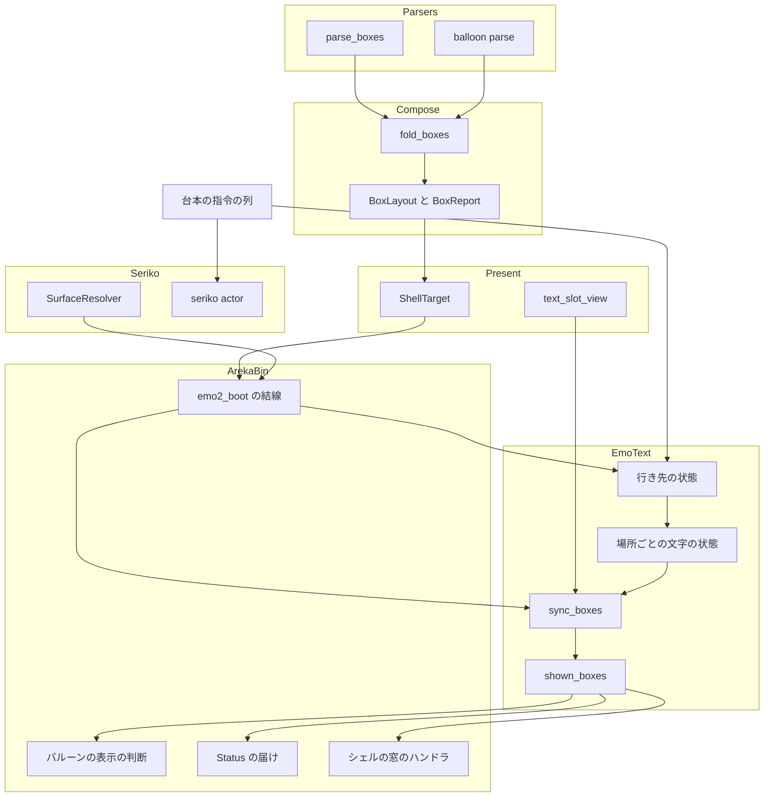
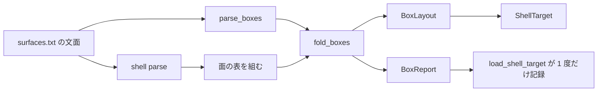
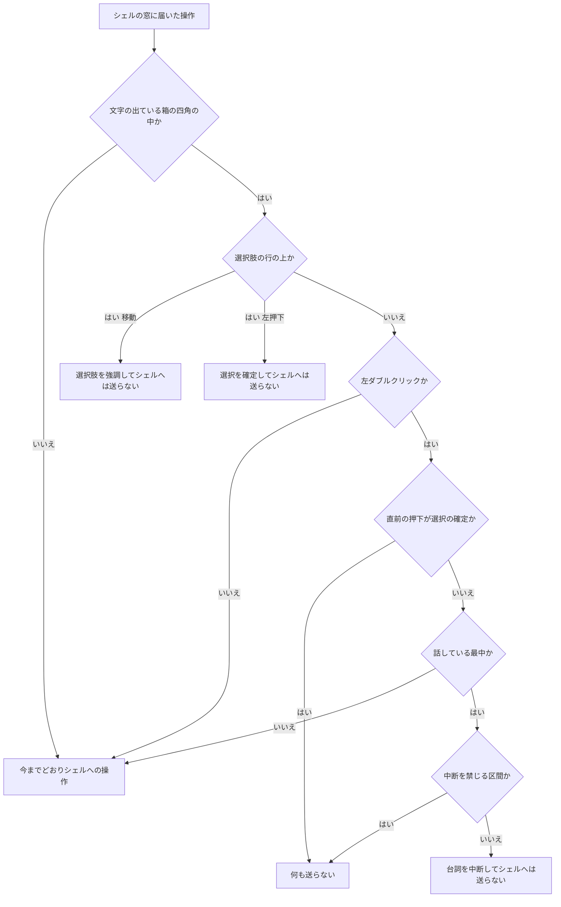
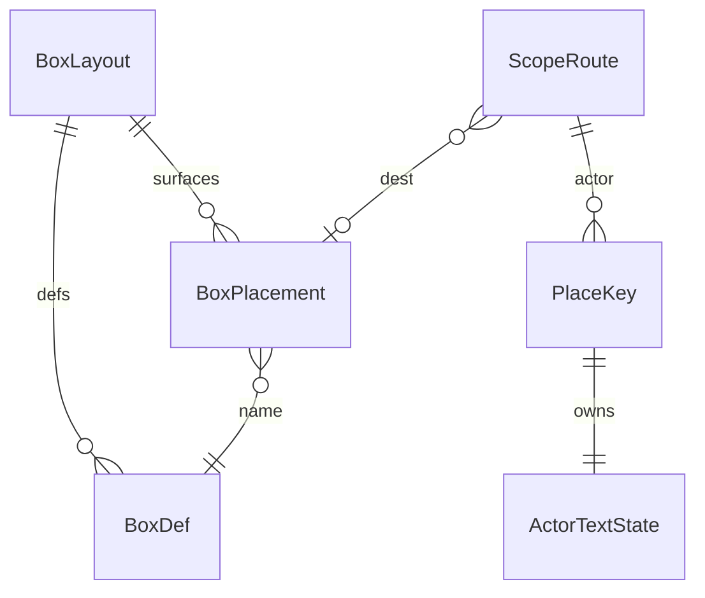

# Design Document: areka-P0-shell-balloon

## Overview

**Purpose**: シェルの surfaces.txt に `balloon.*`ブレスと、element定義の描画メソッド `balloon` を書くだけで、立ち絵の中に台詞を書く場所（以下「箱」）をいくつでも置けるようにする。台本からは普通のバルーンと同じ書き方で書ける。

**Users**: ゴーストの作者（絵の中に台詞を組む演出を作る）と、そのゴーストを使う利用者（箱に出た選択肢を選ぶ・箱の上から立ち絵を撫でる・掴む）。

**Impact**: 文字の層（`areka-emo-text`）が持つ表の鍵を「スコープ」から「スコープと文字の場所の組」へ広げ、文字の行き先をスコープごとに持つ。シェルの窓に、箱 1 つにつき 1 枚の文字の面を載せる。バルーンの窓の表示の判断・時間切れ・`Status`・ポインタ操作は、箱を数に入れるように観測を広げる。画像の合成の道（`Shell`・`Element`・`areka-emo-compose` の畳み込み・`areka-emo-atlas`）は 1 行も変えない。

### Goals

- `balloon.*`ブレスと描画メソッド `balloon` の element定義を読み、誤りは必ずログに残して読み捨てる（要件 1・2・10.1・10.2）。
- 箱の文字を、普通のバルーンと同じ配置・描画の道で、シェルの窓の中に描く（要件 3）。
- 文字の行き先を台本の指令の順番どおりに、遅れなく決める（要件 4・6・7）。
- 普通のバルーンの窓・時間切れ・`Status`・選択肢・ポインタ操作を、箱があるときも要件どおりに動かす（要件 5・6.10・6.11・8・9）。
- 箱が 1 つも無いシェルでは、本 spec の前と同じ振る舞いを構造で保つ（要件 1.7・2.8・5.4・10.5）。

### Non-Goals

- フォントファイルの読み込み（`balloon-font-file`）。本 spec は探す場所の順番を渡すところまで。
- 禁則・縦中横（`text-typesetting`）、ルビ（`text-ruby`）、早送りと `\x`（`talk-fast-forward`）、矢印などの印（`balloon-markers`）、フェード（`balloon-scroll-fade`）。
- element定義の並び順どおりに画像のあいだへ箱を挟む重ね順（`balloon-element-order`）。
- element定義でサーフェスを部品として置くこと（`surface-element-nesting`）。画像・サーフェス・箱の 3 通りの読み分けを 1 つの列挙に揃えるのは、後から着地する側が行う。
- プロパティへ箱を見せること（`currentghost-property-tree`）、箱だけのときの `OnBalloonTimeout`（`balloon-lifecycle-events`）。
- 箱の背景の絵、SSP での見え方。

## Boundary Commitments

### This Spec Owns

- surfaces.txt の `balloon.*`ブレスと、`surface*`ブレス・`surface.append*`ブレスの中の `elementN,balloon,名前,X,Y` の転記（`areka_parsers::shell::parse_boxes`）。
- 転記から「箱の定義の表」と「サーフェス番号ごとの箱の置き場所の表」を作る畳み込みと、その検証・報告（`areka_emo_compose::fold_boxes`・`BoxLayout`・`BoxReport`）。
- 文字の場所の鍵（`PlaceKey`＝スコープと「普通のバルーン／箱の名前」の組）と、スコープごとの文字の行き先の状態（`areka-emo-text`）。
- シェルの窓の中の箱の文字の面（生成・位置・重なり順・片付け）と、箱の四角の照会（`shown_boxes`）。
- `\b[名前]` の読み取りと、その警告（出す場所は文字の層の 1 か所）。
- 箱を数に入れた観測: 普通のバルーンの窓を出さない判断・時間切れ・利用者の中断・`Status` の `balloon(ID群)`。
- シェルの窓での箱の選択肢の強調とクリック、箱の上の左ダブルクリックでの中断。
- 折り返しと書き出し位置の警告の「バルーンの名前」の欄（固定の文字列 `(名前なし)` の撤去）。
- 箱を持つ試験用シェルの検体と、`doc/COMPAT_ARCHITECTURE.md` §8 への登記。

### Out of Boundary

- `areka_parsers::shell` の `Shell`・`Surface`・`SurfaceAppend`・`Element` の型と、`decode.rs` の既存の読み方（画像の element の X・Y は「読めなければ 0」のまま）。
- `areka-emo-compose` の `fold.rs`（画像の畳み込み）・`plan.rs`・`normalized.rs`、`areka-emo-atlas`。
- `areka-emo-present` の `VisualMount`（差し込み口は 1 つの窓に 1 つのまま）と `EmoPresenter` の表示の手続き。
- dola の `CueCommand`・`ActorKey`・`cue_target_of` の戻り値。`areka-sakura` の `compile.rs`。
- seriko のバルーンの番号の状態（`\b[ID番号]` の振る舞い）。
- wintf 本体。`placement/`。`main.rs`。
- 普通のバルーンの descript.txt の読み手（`areka_parsers::balloon`）の中身（呼ぶだけ）。

### Allowed Dependencies

- 依存の向き（左が下・右が上。右から左だけを引く）:
  `areka-parsers` → `areka-emo-compose` → `areka-emo-present` → `areka-emo-text` → `areka`（bin）。`areka-seriko` は `areka-emo-text` と互いに引かない。
- 新しい辺は 1 本だけ: `areka-emo-text` が `areka-emo-compose` を直接引く（`BoxLayout` の型を受け取るため。今も `areka-emo-present` 越しに推移的には引いている）。外部クレートの追加は 0。
- `areka-emo-text` の純粋な層（`lib.rs` の `PURE_SOURCES` に載るファイル）は `windows` 系クレートを引かない。新設の `place.rs`・`state_route.rs` はこの一覧へ載せる。
- seriko のサーフェス番号の解決（`areka_seriko::SurfaceResolver::resolve`）を文字の層が使うときは、結線（`areka` クレート）が閉包にして渡す。文字の層は seriko の型を名指ししない。

### Revalidation Triggers

- `ShellBoxes`（転記の型）の形が変わるとき、または `Element` に描画メソッドの欄が足されるとき → `surface-element-nesting`・`balloon-element-order` は読み分けの統合を見直す。
- `PlaceKey`・`TextPlace` の形、既存の読み口（`visible_glyphs`・`choice_hit_rows`・`choice_active`・`clear_count`）の意味が変わるとき → `talk-fast-forward`・`balloon-markers`・`text-reveal-fade`・`anchor-tag-canon` は呼び出しを見直す。
- 行き先の決め方（「System Flows」の表）が変わるとき → `talk-fast-forward`・`currentghost-property-tree`。
- `shown_boxes` の四角の座標系（シェルの窓の物理 px）が変わるとき → `input_events` を触る spec すべて。
- 箱の文字の面の持ち方（シェルの窓の直接の子・当たり判定なし）が変わるとき → `balloon-element-order`・`surface-element-nesting`。
- 時間切れの観測の欄（`box_showing`）が変わるとき → `balloon-lifecycle-events`。

## Architecture

### Existing Architecture Analysis

HEAD のコードで確かめた事実（ファイルと定義の名前で示す）。

- 読み手は未知のブレスも `overlay` 以外の element定義も黙って捨てる（`areka-parsers/src/shell/decode.rs` の `dispatch_block`・`decode_elements`）。`Shell`・`Surface`・`SurfaceAppend` は構造体リテラルで 30 を超えるファイルから組まれており、欄を足すと全部に波及する。
- 文字の層は台本の全指令を同じ順番で受け取り、`Emote`（`\s`）と `BalloonSurface`（`\b`）は「届くが何もしない」（`areka-emo-text/src/state.rs` の `TextLayerState::apply_cue` の末尾の腕）。
- 文字の層の表はすべて `ActorKey` が鍵（`areka-emo-text/src/actor.rs` の `struct TextLayerRuntime`、`state.rs` の `struct TextLayerState`）。配置と描画は「登録された装着先と配置の入力」だけから動く（`actor_present.rs` の `present_actor`）。
- 文字の面は今、窓の直接の子（差し込み口）に `VisualGraphics` と物理 px の `Arrangement` を挿す形で動いている（`areka-emo-text/src/surface.rs` の `TextSurface::attach`）。
- 兄弟の重なり順は親の `Children` の並びが決め、同期していない子が 1 つでも居る親は、全部の子を `Children` の順に挿し直す（`wintf/src/ecs/graphics/systems/visual_sync.rs` の `visual_hierarchy_sync_system`。先頭の子が最前面）。
- クリックが areka に届くかどうかは、窓の中の entity の当たり判定で決まる。矩形の当たり判定は不透明度だけを見るので、当たり判定を持つ文字の面は透明な画素の上でもクリックを取る（`wintf/src/ecs/layout/hit_test/mod.rs` の `hit_test_entity`）。
- シェルの窓のハンドラは窓の entity に付き、座標から当たり判定の名前を引く（`areka/src/input_events/mod.rs` の `on_char_pointer_moved`・`on_char_pointer_pressed`）。
- バルーンの窓の表示・時間切れは、観測を受け取る純関数が決める（`areka/src/emo2_boot/balloon_visibility_decision.rs` の `decide`・`decide_content`、`balloon_visibility_wait.rs` の `decide_timeout`）。
- 台詞の始まりと終わりは UI 側へ届いている（`areka/src/emo2_boot/user_break_cue.rs` の `NoUserBreakSignal::TalkStarted`・`TalkEnded`）。
- 名前の形の `\b` は seriko が警告して捨てている（`areka-seriko/src/actor.rs` の `BalloonResolve::NameForm` の腕）。

### 設計の分かれ目の結論（research.md 4 章 A〜F）

| 論点 | 結論 | 理由 |
|---|---|---|
| D 今のサーフェスの箱を文字の層がいつ知るか | **D-1**: 文字の層が、自分に届く指令の列（`\s`・`\b[名前]`）から行き先を決める | 文字と `\s` は同じ列を同じ順番で届くので、`\s[1001]` の直後の文字は必ず新しいサーフェスの箱へ入る。行き先を「指令を当てた瞬間の状態」として持つので、表示の層の結果を待たず、フレームをまたがない |
| A 「スコープと箱の名前の組」の持ち方 | **A-1**: 文字の層の中の表の鍵を `PlaceKey` に広げる。`ActorKey` を取る既存の読み口は「普通のバルーンの場所」の意味のまま残す | dola・sakura・seriko・ghost に波及しない。既存の呼び出しとテストは書き換えずに通る。連結した綴りを鍵にしない |
| C 1 つの窓に複数の文字の面 | **C-2 の変形**: 文字の層が、箱 1 つにつき 1 つの entity を**シェルの窓の直接の子**として作る（差し込み口の下の子にはしない） | 「窓の直接の子に、物理 px の位置で文字の面を挿す」は今のバルーンで動いている形そのもの。入れ子の合成（未測定）に頼らない。`areka-emo-present` を変えない |
| B surfaces.txt のモデルの形 | **B-1 の変形**: `Shell`・`Element` を触らず、同じ文面を読む 2 つ目の転記 `parse_boxes` → `ShellBoxes` を足す | 画像の合成の道が 1 行も変わらない（要件 1.7・2.8 が構造で成り立つ）。構造体リテラルの波及が 0 |
| E 普通のバルーンの窓を出さない判断 | 判断の純関数 `decide_content` は変えず、観測する文字の数を「普通のバルーンに今出ている文字の数」へ絞る | 箱のあるサーフェスへ移ると数が 0 へ落ちて窓が隠れ、戻ると 0 から増えて窓が出る。既存の規則だけで要件 5.1〜5.3・6.4・6.9 が成り立つ |
| F 箱の選択肢のクリックを受ける場所 | **F-1**: シェルの窓のハンドラの先頭で、箱の四角と選択肢の行を座標で見る | 届くかどうかはシェルの絵だけで決まる（要件 9.4）ので、箱の entity はポインタを取ってはならない。判定は座標で行うしかない |

### 0 フレームで決まる理由（論点 D）

行き先は「スコープごとの今のサーフェス番号」と「今の行き先」の 2 つの値として文字の状態の中に持つ。`\s` の指令を当てた時点で、サーフェス番号の解決（seriko と同じ `SurfaceResolver::resolve` を結線が閉包で渡す）と箱の置き場所の表（`BoxLayout`）から行き先が確定する。続く文字の指令はその行き先の場所へ入る。表示の層がサーフェスを実際に切り替えるのを待つ処理も、後から行き先を付け替える処理も無い。

描画は毎フレーム、「行き先の状態」と「シェルの窓の今の拡大率」から箱の位置を導いて行う。フレームの中では、表示の指令の適用（`run_drain_phase`）が箱の文字の描画（`run_text_phase`）より前に走る（`areka/src/emo2_boot/frame.rs` の `emo2_frame_system` の並び）。ただし seriko は別のスレッドで動くので、文字の層が `\s` を当てたフレームに、seriko からの表示の指令がまだ UI へ届いていないことはありうる。その 1 フレームは、前の絵の上に新しい置き場所で箱の文字が出る。行き先の決定には遅れが無いので設計は変えず、見え方を実機の確かめの項目にする。

**文字の層の「今のサーフェス番号」を、画面に出ているサーフェスからずらさない決まり**:

- seriko が解決できなかった `\s`（別名が無いなど）では、seriko は表示を変えず、文字の層も同じ解決結果を受けて番号も行き先も変えない。
- 番号としては読めるがシェルに無いサーフェス（例: `\s[9999]`）では、seriko は状態を進めて表示の指令を出すが、表示の層は失敗して前の表示を保つ（`areka-emo-compose` の `ComposeError::SurfaceNotFound`、`areka-emo-present/src/presenter/show.rs` の「表示不変」の腕）。文字の層は表示の層に合わせる: 結線が渡す解決の閉包が、解決した番号が今のシェルの面の表に在るかも見て、無ければ「解決できない」と同じ結果を返す。文字の層は番号も行き先も変えない。
- シェルの切替では `\s` の指令は流れず、seriko は各スコープの今の番号のまま新しいシェルで出し直す（`areka-seriko/src/actor.rs` の `rebased`）。文字の層も今のサーフェス番号を保ち、行き先だけを新しい表での既定へ引き直す。
- デバイスの失敗で表示が成立しなかった場合は予測できないので、対象外とする（表示の層が `error!` を残し、次の `\s` で揃う）。

### R-1・R-2 の扱い（未測定の振る舞いに頼らない）

- **R-1（子の文字の面の合成と重なり順）**: 差し込み口の下に子を入れ子にする形は採らない。箱の entity は窓の直接の子で、今のバルーンの文字の面と同じ構成（`Visual`＋`VisualGraphics`＋物理 px の `Arrangement`）にする。重なり順は `Children` の並びで決まり、後から足した子も `visual_hierarchy_sync_system` が並びどおりに挿し直す（コードで確認済み。兄弟順の既存テストは `wintf/tests/visual/child_order_test.rs`）。本 spec では測定用の検体を足していない。残る確かめは「箱を出し入れしたときにシェルの絵がちらつかない」の 1 点で、実機の確かめの項目にする。
- **R-2（箱の当たり判定と素通し）**: 箱の entity には当たり判定を付けない（`HitTest::none()`）。届くかどうかは今までどおりシェルの絵の entity のαマスクだけで決まるので、透明な画素の素通しは箱の有無で変わらない（要件 9.4）。箱への操作かどうかは、届いた座標と `shown_boxes` の四角を突き合わせて決める。未測定の振る舞いに頼る箇所は無い。

### Architecture Pattern & Boundary Map



- **採った型**: 既存の「純粋な核が事実を返し、fs を触る入口が 1 度だけ記録する」（emo の 3 段）と「純関数の判断＋薄い配線」（バルーンの表示の判断）をそのまま延ばす。新しい仕組みは作らない。
- **境界の分け方**: 読み手＝転記だけ／畳み込み＝検証と表づくり／文字の層＝行き先と描画／結線＝観測と発行／入力＝座標での振り分け。
- **保つ既存の型**: `cue_target_of` の区分け（表示を動かすのは seriko だけ）、`TextRegion::resolve`、`present_actor` の一連、`decide` の 4 段、`ChoiceSelection` の送り口。
- **steering との整合**: 1 ファイル 1,000 行以下・テストは兄弟ファイル・ログの無い失敗の経路を作らない・常時のテストは x64 と偽の境界で回す。

### Technology Stack

| Layer | Choice / Version | Role in Feature | Notes |
|-------|------------------|-----------------|-------|
| 読み手 | `areka-parsers`（既存） | `balloon.*`ブレスと描画メソッド `balloon` の転記 | 字句解析（`lexer::lex`）と `balloon::parse` を再利用 |
| 畳み込み | `areka-emo-compose`（既存） | 箱の定義と置き場所の表・検証の報告 | `fold.rs` の `expand_targets` を共用 |
| 文字の層 | `areka-emo-text`（既存） | 行き先・場所ごとの文字・箱の文字の面 | `areka-emo-compose` への直接の依存を 1 本足す |
| 合成 | wintf / WUC（既存・無改変） | 箱の文字の面の表示 | 窓の直接の子・`Children` の並びで重なり順 |
| 結線・入力 | `areka`（bin・既存） | 観測・発行・ポインタの振り分け | 新しい外部クレートは 0 |

## File Structure Plan

### Directory Structure

```
crates/
├── areka-parsers/src/shell/
│   ├── boxes.rs                      # 新設: ShellBoxes の型と parse_boxes の本体（転記だけ）
│   └── boxes_tests.rs                # 新設
├── areka-emo-compose/src/
│   ├── boxes.rs                      # 新設: BoxName・BoxDef・BoxPlacement・BoxLayout・BoxIssue・BoxReport・fold_boxes
│   └── boxes_tests.rs                # 新設
├── areka-emo-text/
│   ├── src/place.rs                  # 新設（純粋）: TextPlace・PlaceKey
│   ├── src/state_route.rs            # 新設（純粋・state の子）: 行き先の状態と遷移・SurfaceKeyOutcome
│   ├── src/actor_box.rs              # 新設（actor の子）: 箱の登録・sync_boxes・shown_boxes・hide_boxes
│   ├── src/place_tests.rs ほか       # 新設: state_route_tests.rs・actor_box_tests.rs・state_place_tests.rs・state_decoration_carry_tests.rs
│   ├── tests/box_attach_test.rs      # 新設: 窓の子としての装着・重なり順・読み戻し（GPU・既存の attach_wiring_test.rs と同じ流儀）
│   └── tests/fixtures/shell-balloon/surfaces.txt   # 新設: 箱を持つ試験用シェルの検体（要件 10.4。`font.follow,balloon` の箱を 1 つ含む）
└── areka/src/
    ├── emo2_boot/shell_box_assets.rs # 新設: BoxLayout・解決の閉包・フォントの探す場所の順を結線へ渡す束
    └── input_events/shell_box.rs     # 新設: 箱の上のポインタの判断（純関数）とハンドラの前段・滞在の記録
```

### Modified Files

- `crates/areka-parsers/src/shell/mod.rs` — `mod boxes;` と `pub use`（`parse_boxes`・`ShellBoxes` ほか）。`decode.rs` は `parse_targets` を `pub(super)` にするだけ。
- `crates/areka-emo-compose/src/lib.rs` — `boxes` の公開。`fold.rs` は `expand_targets` を `pub(crate)` にするだけ。
- `crates/areka-emo-present/src/shell_target.rs` — `ShellTarget` に `BoxLayout` と `BoxReport` を持たせ、`load_shell_target` が `parse_boxes` を呼んで報告を 1 度だけ記録する。fs を触らない核は `build_shell_target_with_boxes` を足し、既存の `build_shell_target` は空の `ShellBoxes` で委譲する（既存の呼び出しは変えない）。
- `crates/areka-emo-text/Cargo.toml` — `areka-emo-compose` を足す。
- `crates/areka-emo-text/src/lib.rs` — `pub mod place;` と、走査の一覧（`PURE_SOURCES`・`SOURCES_OUTSIDE_THE_PURE_SCAN`）への新設ファイルの登記。
- `crates/areka-emo-text/src/state.rs` — 表の鍵を `PlaceKey` へ。指令の宛先を「今の行き先」で引く。名前の形の `BalloonSurface` の腕。`ClearAll` で行き先を戻す。
- `crates/areka-emo-text/src/state_decoration.rs` — 鍵の追随。行き先が替わるときに台本の指定を新しい場所へ写す `carry_script_decor`、箱の名前ごとの 2 層と箱の種類（`font.follow`）を受け取る `set_box_traits`、`reset_decoration` の宛先を今の行き先にする（今 483 行。増えるのは 70 行程度で 1,000 行に届かない）。`ScopeRoute` の `shared` の欄は `state_route.rs`。
- `crates/areka-emo-text/src/actor.rs` — 表の鍵を `PlaceKey` へ。`apply_cue` が `Emote` を解決して行き先へ渡す。`choice_active` をスコープの全部の場所で見る。
- `crates/areka-emo-text/src/actor_attach.rs`・`actor_decoration.rs` — 警告の名前の欄を場所の名前にする。`set_balloon_label`。
- `crates/areka-emo-text/src/actor_present.rs` — 走査を場所ごとにする。箱の位置（X,Y）を面の位置と選択肢の当たり行へ足す。提示のたびに `shown_boxes` の写しを更新する。
- `crates/areka-emo-text/src/surface.rs` — `TextSurface::attach_window_child`（窓の子として作り `Children` の指定位置へ挿す）と、作った entity の片付け。今 792 行なので、面の生成の手順を複製しない: 既存の `attach` の本体のうち「スワップチェーン・描画面・`SpriteVisual` を作る」部分を私有の関数 1 つへ括り出し、`attach` と `attach_window_child` は「どの entity へ挿すか」だけが違う薄い入口にする（増えるのは 60 行程度の見込みで 1,000 行に届かない）。それでも 900 行を超えるなら、窓の子の入口と片付けを兄弟ファイル `surface_window_child.rs`（`#[path]` で `surface.rs` の子）へ出す。
- `crates/areka-emo-text/src/choice.rs` — `to_window_physical` に箱の位置の引数を足す（普通のバルーンは 0,0）。
- `crates/areka-emo-text/src/region.rs` — `BALLOON_NAME_PLACEHOLDER` の撤去。
- `crates/areka-seriko/src/actor.rs` — `BalloonResolve::NameForm` の腕を `debug!` へ下げる（警告は文字の層が出す）。
- `crates/dola/src/cue/sink.rs`・`crates/areka-ghost/tests/ghost/spine_e2e_test_broadcast_relevance_partition.rs` — コメントだけ（「文字の層は `Emote` と名前の形の `BalloonSurface` を、行き先を決めるために読む」）。期待値は変えない。
- `crates/areka/src/emo2_boot/assets.rs`・`switch_assets.rs` — `ShellTarget` から箱の束（`shell_box_assets.rs`）を取り出して運ぶ。
- `crates/areka/src/emo2_boot/frame/attach.rs` — 装着のときに文字の層へ箱の束と、普通のバルーンの名前（バルーンのフォルダ名）を渡す。
- `crates/areka/src/emo2_boot/frame/scale_text.rs` — `run_text_scale_phase` がシェルの窓の `text_slot_view` を集めて `sync_boxes` を呼ぶ（`World` を受け取る）。
- `crates/areka/src/emo2_boot/frame/switch.rs` — シェルの切替で箱の束を入れ替える。ゴーストの切替（`ghost_switch.rs`）は変えない（結線ごと作り直され、装着の相が箱の束を渡す。「箱の束の結線」に確かめた内容）。
- `crates/areka/src/emo2_boot/balloon_visibility.rs`・`balloon_visibility_decision.rs`・`balloon_visibility_wait.rs`・`balloon_visibility_phase.rs` — 観測の欄 `box_showing` を足し、中断と時間切れの対象に数える。文字の数の観測を `balloon_shown_glyphs` に替える。箱を隠す発行。
- `crates/areka/src/emo2_boot/frame/status_report.rs` — 箱に文字が出ているスコープを載せる。
- `crates/areka/src/input_events/mod.rs` — `on_char_pointer_moved`・`on_char_pointer_pressed` の先頭で `shell_box.rs` の前段を呼ぶ。シェルの窓から出たときの後始末。
- `crates/areka/src/input_events/user_break.rs` — 「話している最中か」の旗（`TalkStarted`・`TalkEnded` の畳み込み）と、箱の押下の入口。
- `doc/COMPAT_ARCHITECTURE.md` — §8 に行を足す。

## System Flows

### 定義の読み込み



`shell::parse` の結果は本 spec の前とバイト単位で同じ（その道を通るコードを触らない）。`fold_boxes` は記録を出さず、事実を `BoxReport` に載せて返す。

### 文字の行き先の決まり方

スコープごとに「今のサーフェス番号（無ければ非表示）」と「今の行き先」を持つ。「箱の列」は `BoxLayout` がそのサーフェス番号に対して持つ、element番号の昇順の箱の列。「既定」は、箱の列が空なら普通のバルーン、空でなければ列の先頭（element番号が一番小さい箱）。

| 届いた指令 | 条件 | 今のサーフェス番号 | 今の行き先 | 要件 |
|---|---|---|---|---|
| `\s`（解決できた・表示） | 新しいサーフェスに今の行き先と同じ名前の箱がある | 新しい番号 | そのまま | 6.1 |
| 同上 | 同じ名前の箱は無いが他の箱はある／今の行き先が普通のバルーンで箱がある | 新しい番号 | 既定（先頭の箱） | 6.2・6.9・4.2 |
| 同上 | 箱が 1 つも無い | 新しい番号 | 普通のバルーン | 6.4・5.2 |
| `\s[-1]` | — | 非表示 | 普通のバルーン | 6.6 |
| `\s`（解決できない） | — | 変えない | 変えない | — |
| `\s`（番号は読めるが、今のシェルにそのサーフェスが無い） | 閉包が「解決できない」と同じ結果を返す | 変えない | 変えない | 4.1・5.1 |
| シェルの切替（`set_box_layout`。指令ではない） | — | 変えない（保つ） | 全スコープを新しい表での既定へ。箱の場所の文字は捨てる | 6.8 |
| `\b[名前]` | 今のサーフェスの箱の列にその名前がある | 変えない | その箱（警告なし） | 4.3・4.9 |
| `\b[名前]` | 無い | 変えない | 変えない（`warn!`: 名前とサーフェス番号） | 4.4 |
| `\b[整数]` | — | 変えない | 変えない（seriko の担当） | 4.8 |
| 台詞の頭（`ClearAll`） | — | 変えない | 全スコープを既定へ | 4.10 |

文字・改行・`\_l`・選択肢・`\f`・`\c` は、届いた時点の「今の行き先」の場所へ当てる。場所ごとの文字は行き先が変わっても消さない（要件 4.5・6.2〜6.5）。`ClearAll` は全部の場所の文字を消す（要件 6.7）。`\c` は今の行き先の場所だけを消す（要件 7.1〜7.3）。

箱の文字が画面に出るのは、次の 3 つがすべて成り立つあいだだけである: ⑴ その箱の名前が、スコープの今のサーフェスの箱の列にある、⑵ 文字が 1 字以上見えている、⑶ スコープの「箱を隠す印」が立っていない。⑴ が外れた箱は文字を持ったまま面だけを片付け、⑴ が戻れば持っていた文字を描き直す（要件 6.2・6.3・6.5）。

### 箱の上のポインタ操作



- 「届いた」こと自体はシェルの絵のαマスクだけで決まる（箱の entity は当たり判定を持たない）。
- 箱が重なる位置では、element番号の大きい箱を手前として 1 つだけ選ぶ（要件 3.9）。
- 「話している最中」は、台詞の始まりの合図から終わりの合図まで（選択肢を待っているあいだを含む）。普通のバルーンで中断を禁じる区間を数えるのと同じ合図の列（`NoUserBreakSignal`）から畳む。

### 箱を数に入れた表示の判断

- 普通のバルーンの窓: 観測する文字の数を `balloon_shown_glyphs`（スコープの今のサーフェスに箱があれば 0・無ければ普通のバルーンの場所の見えている文字の数）にする。`decide_content` は変えない。
- 時間切れと中断: スコープの観測に `box_showing`（`shown_boxes` が空でない）を足す。`decide_timeout` と `decide_user_break` は「窓が見えている、または箱に文字が出ている」スコープを対象にする。待ちを止める条件（選択肢・ポインタの滞在・ドラッグ）は、箱の選択肢と箱の上の滞在を同じ欄へ入れる。
- 隠す発行の振り分け（純関数 `hide_reaches_boxes`）: 文字が 0 に落ちたことによる非表示は窓だけ。時間切れは窓と箱の両方。利用者の中断は窓と、「中断の掛け金が掛かったままなら」箱も（同じフレームに次の台詞の始まりが届いていたら、箱は新しい台詞のものなので隠さない）。
- 箱を隠す印は、次の台詞の頭（`ClearAll`）で文字の層が自分で下ろす。

## Requirements Traceability

| Requirement | Summary | Components | Interfaces | Flows |
|---|---|---|---|---|
| 1.1 | `balloon.*`ブレスを読む | ShellBoxes 転記・箱の畳み込み | `parse_boxes`・`fold_boxes` | 定義の読み込み |
| 1.2 | キーを descript.txt と同じ意味で読む | 箱の畳み込み | `areka_parsers::balloon::parse` を呼ぶ | 同上 |
| 1.3 | `size` | 箱の畳み込み | `BoxDef.size` | 同上 |
| 1.4 | `size` が無い・読めないブレスを採らない | 箱の畳み込み | `BoxIssue::BraceMissingSize`・`BraceBadSize` | 同上 |
| 1.5 | 当てはまらないキーを読み捨てる | 箱の畳み込み | `BoxIssue::BraceKeyIgnored` | 同上 |
| 1.6 | 背景の絵を描かない | 箱の文字の面 | `TextSurface::attach_window_child`（透明で初期化） | — |
| 1.7 | ブレスが無ければ前と同じ | ShellBoxes 転記 | `shell::parse` を触らない | 定義の読み込み |
| 1.8 | 同じ名前のブレスは後のもので置き換え | 箱の畳み込み | `BoxIssue::BraceReplaced` | 同上 |
| 1.9 | 整数として読める名前を採らない | 箱の畳み込み | `BoxIssue::BraceNumericName` | 同上 |
| 2.1 | element定義で箱を置く | ShellBoxes 転記・箱の畳み込み | `BoxPlacement` | 同上 |
| 2.2 | `surface.append*` でも置ける | 箱の畳み込み | `fold_boxes`（`expand_targets` と存在の条件） | 同上 |
| 2.3 | 数に上限なし | 箱の畳み込み | `BoxLayout.surfaces` は `Vec` | — |
| 2.4 | サーフェスごとに違う位置 | 箱の畳み込み | `BoxLayout::placements` | — |
| 2.5 | 名前のブレスが無い element定義を読み捨てる | 箱の畳み込み | `BoxIssue::ElementUnknownBrace` | 定義の読み込み |
| 2.6 | X・Y が整数でない element定義を読み捨てる | 箱の畳み込み | `BoxIssue::ElementBadPosition` | 同上 |
| 2.7 | 同じ名前は element番号最小だけ | 箱の畳み込み | `BoxIssue::ElementDuplicateName` | 同上 |
| 2.8 | `balloon` は画像を重ねない・他は前と同じ | ShellBoxes 転記 | `decode_elements` を触らない | 同上 |
| 3.1 | 箱の左上を (0,0) として読む | 箱の登録 | `TextRegion::resolve` に `BoxDef.size` を渡す | — |
| 3.2 | `validrect` 無しは箱の全体 | 箱の登録 | 同上 | — |
| 3.3 | `origin` 無しは書き出しの角 | 箱の登録 | 同上 | — |
| 3.4 | 同じキーが同じ結果 | 場所ごとの描画・装飾の持ち運び | `present_actor` の一連を場所ごとに通す。`\f` の指定は行き先が替わっても残る | — |
| 3.5 | 拡大率の追従 | 箱の同期 | `sync_boxes`（拡大率が変われば面を作り直す） | — |
| 3.6 | ドラッグ中も同じ位置関係 | 箱の文字の面 | シェルの窓の子 | — |
| 3.7 | 画像より手前 | 箱の文字の面 | `Children` の並び（絵の entity より前） | — |
| 3.8 | element番号が画像より小さいときの警告 | 箱の畳み込み | `BoxIssue::ElementBelowImage` | 定義の読み込み |
| 3.9 | 重なる箱は element番号の大きい方が手前 | 箱の文字の面・箱の四角の照会 | `Children` の並び・`shown_boxes` の並び | 箱の上のポインタ操作 |
| 3.10 | フォントの探す場所の順 | 箱の束 | `box_font_search_dirs`・`TextLayerRuntime::box_font_dirs` | — |
| 3.11 | 箱の警告の名前の欄 | 箱の登録 | 場所の名前＝ブレスの名前 | — |
| 3.12 | 普通のバルーンの警告の名前の欄 | 警告の名前 | `set_balloon_label`（未設定はスコープから導く） | — |
| 3.13 | `\f` の指定はスコープごと・既定値は行き先の定義から | 装飾の持ち運び | `carry_script_decor`・`ScopeRoute.shared`・`set_box_traits`・既存の `rebase` | 行き先の決まり方 |
| 3.14 | `font.follow,balloon` の箱は指定をその箱だけに持つ | 箱の畳み込み・装飾の持ち運び | `BoxDef.follow`・`carry_script_decor`（箱に閉じる箱へは写さない） | 同上 |
| 3.15 | 戻ったら、その箱の指定を保ったまま続ける | 装飾の持ち運び | 箱の場所の `Decoration` を台詞のあいだ保つ | 同上 |
| 3.16 | 出たら、入る前のスコープの指定で表示 | 装飾の持ち運び | `ScopeRoute.shared` の場所から写す | 同上 |
| 3.17 | 書かない・`scope` はスコープごと（普通のバルーンは常に） | 箱の畳み込み・装飾の持ち運び | `FontFollow::Scope`（既定） | 同上 |
| 3.18 | 不正な値は記録して `scope` として扱う | 箱の畳み込み | `BoxIssue::BraceBadFollow` | 定義の読み込み |
| 3.19 | 台詞の頭で両方とも既定へ戻す | 装飾の持ち運び | `ClearAll` が全部の場所で `reset_for_new_talk`・`shared` を戻す | 行き先の決まり方 |
| 4.1 | 箱のあるサーフェスでは箱へ描く | 行き先の状態 | `ScopeRoute` | 行き先の決まり方 |
| 4.2 | 既定は element番号最小 | 行き先の状態 | `BoxIndex` | 同上 |
| 4.3 | `\b[名前]` で切り替え | 行き先の状態 | `route_select` | 同上 |
| 4.4 | 無い名前は警告して切り替えない | 行き先の状態 | `route_select` の `warn!` | 同上 |
| 4.5 | 切り替える前の箱の文字を残す | 場所ごとの文字の状態 | `PlaceKey` ごとの `ActorTextState` | 同上 |
| 4.6 | 文字はスコープと名前の組ごと | 場所の鍵 | `PlaceKey` | — |
| 4.7 | 行き先はスコープごと | 行き先の状態 | `routes: BTreeMap<ActorKey, ScopeRoute>` | — |
| 4.8 | `\b[ID番号]` は箱に効かない | 行き先の状態・seriko | 整数の `BalloonSurface` を文字の層は読まない | 行き先の決まり方 |
| 4.9 | ある名前なら警告なし | 行き先の状態・seriko | seriko の `NameForm` の腕を `debug!` へ | 同上 |
| 4.10 | 台詞の頭で既定へ戻す | 行き先の状態 | `reset_routes`（`ClearAll`） | 同上 |
| 5.1 | 箱のあるサーフェスでは窓を出さない | 表示の判断の観測 | `balloon_shown_glyphs` | 箱を数に入れた表示の判断 |
| 5.2 | 箱の無いサーフェスでは前と同じ | 同上 | 同上 | 同上 |
| 5.3 | スコープごとに判定 | 同上 | 観測はスコープ単位 | 同上 |
| 5.4 | 箱の無いシェルは前と同じ | 行き先の状態 | `BoxLayout` が空なら行き先は常に普通のバルーン | — |
| 5.5 | `Status` に載せる | Status の届け | `BalloonObservation.box_showing` | — |
| 5.6 | どちらも出ていなければ載せない | Status の届け | `collect_bindings` | — |
| 6.1 | 同じ名前があれば続きを書く | 行き先の状態・箱の同期 | `route_surface`・`sync_boxes` | 行き先の決まり方 |
| 6.2 | 無ければ持ったまま表示をやめる | 同上・装飾の持ち運び | 同上。新しい行き先へ `\f` の指定を写す（`carry_script_decor`） | 同上 |
| 6.3 | 戻れば再び表示 | 箱の同期 | `sync_boxes` | 同上 |
| 6.4 | 箱が無ければ普通のバルーンへ | 行き先の状態・表示の判断の観測・装飾の持ち運び | `route_surface`・`balloon_shown_glyphs`・`carry_script_decor` | 同上 |
| 6.5 | 行き先でない箱の文字も表示 | 箱の同期 | 文字を持つ全部の箱を走査 | 同上 |
| 6.6 | `\s[-1]` | 行き先の状態 | `SurfaceKeyOutcome::Hide` | 同上 |
| 6.7 | 新しい台詞で全部消す | 場所ごとの文字の状態 | `ClearAll` が全部の場所を消す | 同上 |
| 6.8 | シェル・ゴーストの切替で持ち越さない | 箱の束の結線 | シェル＝`set_box_layout`（番号は保つ）／ゴースト＝結線の作り直し | 行き先の決まり方 |
| 6.9 | 普通のバルーン → 箱の向き | 行き先の状態・表示の判断の観測・装飾の持ち運び | `route_surface`・`balloon_shown_glyphs`・`carry_script_decor` | 行き先の決まり方 |
| 6.10 | 同じ待ち時間で箱の文字も消す | 表示の判断 | `decide_timeout`・`hide_boxes` | 箱を数に入れた表示の判断 |
| 6.11 | 待ちを止める条件 | 表示の判断・箱の上の滞在 | `choice_active`（スコープ全体）・`ShellBoxHover`・`next_box_hover`・`settle_box_hover` | 同上 |
| 7.1 | `\c` は行き先の箱だけ | 場所ごとの文字の状態 | `Clear` の宛先が今の行き先 | 行き先の決まり方 |
| 7.2 | 他の箱・他のスコープは消さない | 同上 | 同上 | 同上 |
| 7.3 | 普通のバルーンでは前と同じ | 同上 | 行き先が普通のバルーンなら従来の鍵 | 同上 |
| 8.1 | 選択肢を箱に出す | 場所ごとの描画 | `present_actor` の選択肢の流れ | — |
| 8.2 | `cursor.*` の強調 | 箱のポインタの前段・箱の登録と同期 | `judge_box_move`・`inject_choice_hover_at`・箱の位置を足した当たり行 | 箱の上のポインタ操作 |
| 8.3 | クリックで同じイベント | 箱のポインタの前段・箱の登録と同期 | `judge_box_click`・`click_selection`・`BalloonWiring::send_selection` | 同上 |
| 8.4 | 選択肢の待ちの振る舞いは同じ | 場所の鍵 | `choice_active` をスコープ全体で見る。送った後は `choice_drain.rs` の道をそのまま通る | — |
| 8.5 | 選択肢のクリックはシェルのクリックにしない | 箱のポインタの前段 | 前段が `true` を返して終わる | 箱の上のポインタ操作 |
| 9.1 | 話していないあいだはシェルへの操作 | 箱の押下の判断 | `judge_box_press` → `ShellOp` | 同上 |
| 9.2 | 箱の外は前と同じ | 箱のポインタの前段 | 四角の外は前段を素通り | 同上 |
| 9.3 | 文字の無い箱は無いのと同じ | 箱の四角の照会 | `shown_boxes` に載らない | 同上 |
| 9.4 | 届くかはシェルの絵だけで決まる | 箱の文字の面 | `HitTest::none()` | — |
| 9.5 | 四角の中なら箱への操作 | 箱のポインタの前段 | `box_under_point` | 箱の上のポインタ操作 |
| 9.6 | 話している最中の左ダブルクリックで中断 | 箱の押下の判断 | `judge_box_press` → `Break`・`on_box_left_press` | 同上 |
| 9.7 | それ以外はシェルへの操作 | 箱の押下の判断 | `judge_box_press` → `ShellOp` | 同上 |
| 9.8 | 箱の外の左ダブルクリックは前と同じ | 箱のポインタの前段 | 四角の外は前段を素通り | 同上 |
| 10.1 | 読み捨てと断りを必ず記録 | 箱の畳み込み・行き先の状態 | `BoxReport`・`route_select` の `warn!` | — |
| 10.2 | 誤りで読み込み全体を失敗させない | 箱の畳み込み | `fold_boxes` は失敗を返さない | — |
| 10.3 | §8 への登記 | 文書 | `doc/COMPAT_ARCHITECTURE.md` | — |
| 10.4 | 検体と決定論のテスト | 検体・テスト | `tests/fixtures/shell-balloon/surfaces.txt` | — |
| 10.5 | 正典のバルーンの既存テストを変えずに通す | 全体 | 既存の読み口の意味を保つ | — |

## Components and Interfaces

| Component | Domain/Layer | Intent | Req Coverage | Key Dependencies | Contracts |
|---|---|---|---|---|---|
| ShellBoxes 転記 | areka-parsers | ブレスと element定義を原文のまま並べる | 1.1, 1.7, 2.1, 2.8 | `lexer::lex`（P0） | Service |
| 箱の畳み込み | areka-emo-compose | 定義と置き場所の表を作り、誤りを報告に載せる | 1.1〜1.5, 1.8, 1.9, 2.1〜2.7, 3.8, 3.14, 3.17, 3.18, 10.1, 10.2 | `balloon::parse`（P0）・`EmoWorld`（P1） | Service |
| シェルの読み込みの入口 | areka-emo-present | 箱の表を `ShellTarget` に載せ、報告を 1 度だけ記録 | 10.1, 10.2 | 箱の畳み込み（P0） | Service |
| 場所の鍵 | areka-emo-text（純粋） | スコープと文字の場所の組 | 4.6 | — | State |
| 行き先の状態 | areka-emo-text（純粋） | 指令の列から行き先を決める | 4.1〜4.5, 4.7〜4.10, 5.4, 6.1, 6.2, 6.4, 6.6, 6.7, 6.9, 7.1〜7.3 | `BoxIndex`（P0） | State |
| 装飾の持ち運び | areka-emo-text（純粋・`state_decoration.rs`） | `\f` の指定を、スコープに従う場所ではスコープで保ち、箱に閉じる箱ではその箱だけに持つ | 3.4, 3.13〜3.17, 3.19, 6.2, 6.4, 6.9 | 行き先の状態（P0） | State |
| 箱の登録と同期 | areka-emo-text | 箱の位置・面・四角の照会・隠す印 | 1.6, 3.1〜3.7, 3.9〜3.11, 6.1〜6.3, 6.5, 6.8, 9.3, 9.4 | `TextSlotView`（P0）・wintf（P0） | Service, State |
| 警告の名前 | areka-emo-text | 警告の名前の欄を場所の名前にする | 3.11, 3.12 | — | Service |
| 箱の束の結線 | areka/emo2_boot | 箱の表・解決の閉包（シェルに在る番号だけを通す）・探す場所の順を文字の層へ渡す | 3.5, 3.10, 4.1, 5.1, 6.8 | `ShellTarget`・`SurfaceResolver`（P0） | Service |
| 箱を数に入れた表示の判断 | areka/emo2_boot | 窓を出さない・時間切れ・中断 | 5.1〜5.3, 6.4, 6.9〜6.11 | 箱の登録と同期（P0） | State |
| Status の届け | areka/emo2_boot | 箱に文字が出ているスコープを載せる | 5.5, 5.6 | 同上（P0） | Service |
| 箱のポインタの前段 | areka/input_events | 選択肢・中断・素通りの振り分け | 6.11, 8.2, 8.3, 8.5, 9.1〜9.3, 9.5〜9.8 | `shown_boxes`（P0）・`UserBreakWiring`（P0） | Service, State |
| seriko の名前の形の腕 | areka-seriko | 警告を文字の層へ譲る | 4.9 | — | — |

### 読み手（areka-parsers）

#### ShellBoxes 転記

| Field | Detail |
|---|---|
| Intent | surfaces.txt から、箱に関わる行だけを原文のまま、ブレスの登場順に並べる |
| Requirements | 1.1, 1.7, 2.1, 2.8 |

**Responsibilities & Constraints**
- 転記だけを行う。検証・展開・記録はしない（読み手の約束）。失敗しない。
- `balloon.名前`ブレスは、見出しの `balloon.` より後ろを名前とし、本体の行を欄の列のまま持つ。
- `surface*`ブレスと `surface.append*`ブレスは、箱の element定義が 1 つも無くても 1 件ずつ並べる（畳み込みが「その時点で既にあるサーフェス」を追えるようにするため）。見出しの読み方は既存の `parse_targets` と同じ。
- 箱の element定義は、`element` に続く番号・名前・X・Y を**文字列のまま**持つ（厳しく読むのは畳み込み）。
- `shell::parse` と `Shell` には触れない。

**Contracts**: Service [x]

##### Service Interface
```rust
pub fn parse_boxes(text: &str) -> ShellBoxes;

pub struct ShellBoxes { pub definitions: Vec<BoxDefinition> }

#[non_exhaustive]
pub enum BoxDefinition {
    Brace(BoxBrace),            // balloon.*ブレス
    Surface(BoxSurfaceLines),   // surface*ブレス
    Append(BoxSurfaceLines),    // surface.append*ブレス
}
pub struct BoxBrace { pub name: String, pub lines: Vec<Vec<String>> }
pub struct BoxSurfaceLines { pub targets: Vec<AppendTarget>, pub elements: Vec<BoxElementLine> }
pub struct BoxElementLine { pub element: String, pub name: String, pub x: String, pub y: String }
```
- Postconditions: 同じ文面からは同じ結果。`balloon.*`ブレスも箱の element定義も無い文面では、`Brace` は 0 件、各 `BoxSurfaceLines.elements` は空。

**Implementation Notes**
- Integration: 字句解析は既存の `lexer::lex` を呼ぶ。欄の足りない element定義（名前・X・Y の欠け）は空文字列で転記する。
- Risks: `surface-element-nesting` が `Element` を列挙へ広げるときは、この転記を取り込んで 1 つに揃える（Revalidation Triggers）。

### 畳み込み（areka-emo-compose）

#### 箱の畳み込み

| Field | Detail |
|---|---|
| Intent | 転記から「箱の定義の表」と「サーフェス番号ごとの箱の置き場所の表」を作り、読み捨てた事実を報告に載せる |
| Requirements | 1.1, 1.2, 1.3, 1.4, 1.5, 1.8, 1.9, 2.1, 2.2, 2.3, 2.4, 2.5, 2.6, 2.7, 3.8, 3.14, 3.17, 3.18, 10.1, 10.2 |

**Responsibilities & Constraints**
- 純粋。fs にも記録にも触れない。失敗を返さない（誤りは `BoxReport` に載せ、誤りのない定義だけを採る）。
- ブレスの本体を KV の表へ写す（先頭の欄＝キー・残りを `,` でつないだもの＝値・同じキーは後勝ち）。`size`・`font.follow`（areka 独自のキー）と当てはまらないキー（`windowposition.` で始まるキー・`use_self_alpha`・`use_input_alpha`）は表から抜いてから `areka_parsers::balloon::parse(&表, None)` へ渡す。
- 置き場所は画像の element と同じ規則で番号へ配る: 見出しの展開は `fold.rs` の `expand_targets`、`surface*`ブレスはその番号の置き場所を丸ごと置き換え、`surface.append*`ブレスは「その時点で既にある番号（面の画像だけで存在する番号を含む）」にだけ足す。
- 番号ごとに、名前の解決 → X・Y の検証 → 同じ名前の重複の整理（element番号最小を採る）→ element番号の昇順に並べる。
- 画像の element の最大の番号（引数の `EmoWorld` から引く）より小さい番号の箱があれば、報告に載せる（描画は常に画像より手前）。

**Dependencies**
- Inbound: `areka-emo-present` の `build_shell_target_with_boxes`（P0）
- Outbound: `areka_parsers::balloon::parse`（P0）・`fold.rs` の `expand_targets`（P0）・`EmoWorld::surface`（P1・画像の element番号を引く）

**Contracts**: Service [x]

##### Service Interface
```rust
pub fn fold_boxes(
    boxes: &ShellBoxes,
    images: &BTreeMap<u32, String>,   // 面の画像だけで存在する番号
    world: &EmoWorld,                 // 画像の element番号を引く
) -> (BoxLayout, BoxReport);

#[derive(Clone, Debug, PartialEq, Eq, PartialOrd, Ord, Hash)]
pub struct BoxName(/* 非公開 */);     // as_str() だけを公開

#[derive(Clone, Debug, PartialEq)]
pub struct BoxDef { pub model: BalloonModel, pub size: (u32, u32), pub follow: FontFollow }

/// `font.follow` の値（areka 独自のキー）。書かなければ `Scope`。
#[derive(Clone, Copy, Debug, Default, PartialEq, Eq)]
pub enum FontFollow { #[default] Scope, Balloon }

#[derive(Clone, Debug, PartialEq)]
pub struct BoxPlacement { pub element: u32, pub name: BoxName, pub x: i64, pub y: i64 }

#[derive(Clone, Debug, Default, PartialEq)]
pub struct BoxLayout { /* 非公開 */ }
impl BoxLayout {
    pub fn is_empty(&self) -> bool;                              // 置き場所が 1 つも無い
    pub fn def(&self, name: &BoxName) -> Option<&BoxDef>;
    pub fn placements(&self, surface_id: u32) -> &[BoxPlacement]; // element番号の昇順
}

#[derive(Clone, Debug, PartialEq)]
pub struct BoxReport { pub issues: Vec<BoxIssue> }
```
- Postconditions: `placements(id)` の各要素の名前は必ず `def` で引ける。同じ番号の中で名前は重複しない。
- Invariants: 表の鍵は構造のある型（`BoxName`・`u32`）で、文字列の連結を鍵にしない。

`BoxIssue` の種類（すべて原因と対象を欄に持つ。記録の水準は入口が決める）:

| 種類 | 対象の欄 | 要件 |
|---|---|---|
| `BraceEmptyName` | 見出しの原文（`balloon.` の後ろが空）。そのブレスは採らない | 10.1 |
| `BraceMissingSize` | ブレスの名前 | 1.4 |
| `BraceBadSize` | ブレスの名前・値の原文 | 1.4 |
| `BraceNumericName` | ブレスの名前 | 1.9 |
| `BraceReplaced` | ブレスの名前 | 1.8 |
| `BraceKeyIgnored` | ブレスの名前・キー | 1.5 |
| `BraceBadFollow` | ブレスの名前・`font.follow` の値の原文。ブレスは採り、`scope` として扱う | 3.18 |
| `ElementBadNumber` | サーフェス番号・element の原文 | 10.1 |
| `ElementUnknownBrace` | サーフェス番号・element番号・名前 | 2.5 |
| `ElementBadPosition` | サーフェス番号・element番号・名前・X と Y の原文 | 2.6 |
| `ElementDuplicateName` | サーフェス番号・捨てた element番号・名前・採った element番号 | 2.7 |
| `ElementBelowImage` | サーフェス番号・element番号・名前・画像の element番号 | 3.8 |
| `AppendTargetMissing` | サーフェス番号・名前 | 2.2, 10.1 |

**Implementation Notes**
- Integration: 「同じ名前のブレスを後のもので置き換える」は登場順の後勝ち。置き換えで `size` が不正になれば、その名前の定義は無くなる（前の定義へは戻さない＝同じ番号の `surface*`ブレスと同じ扱い）。
- Validation: 名前が整数として読めるかは `i64` の読み取りで判定する（seriko の `resolve_balloon_key` と同じ基準）。
- Risks: 存在の条件の追い方が `fold.rs` とずれること。同じ検体（`surface.append*` が先に書かれた場合・面の画像だけの番号・範囲と除外）を両方のテストに置いて突き合わせる。

#### シェルの読み込みの入口（areka-emo-present）

`shell_target.rs` の `load_shell_target` が、読んだ文面から `parse_boxes` を呼び、`build_shell_target_with_boxes` が `fold_boxes` を呼ぶ。`ShellTarget` は `boxes(&self) -> &BoxLayout` を公開する。`load_shell_target` は `BoxReport` の各件を `warn!` で 1 件ずつ記録する（読み込み 1 回につき 1 度・欄は `BoxIssue` の対象の欄そのまま）。置き場所が 1 つ以上あれば、数（ブレスの数・置き場所のあるサーフェスの数）を `info!` で 1 行記録する。要件 10.1・10.2。

### 文字の層（areka-emo-text）

#### 場所の鍵

```rust
#[derive(Clone, Debug, PartialEq, Eq, PartialOrd, Ord, Hash)]
pub enum TextPlace { Balloon, Box(BoxName) }

#[derive(Clone, Debug, PartialEq, Eq, PartialOrd, Ord, Hash)]
pub struct PlaceKey { pub actor: ActorKey, pub place: TextPlace }
impl PlaceKey { pub fn balloon(actor: &ActorKey) -> PlaceKey; }
```
- `TextLayerState` の `actors`・`clears` と、`TextLayerRuntime` の `routing`・`layout_input`・`surfaces`・`choice_hover`・`choice_snapshot`・`unresolved_warned` の鍵を `PlaceKey` にする。`balloon_background` はスコープのまま（箱は使わない）。
- `ActorKey` を取る既存の読み口（`visible_glyphs`・`clear_count`・`actor_state`・`choice_hit_rows`・`is_attached`・`surface`・`draw_stats`・`inject_choice_hover`・`register_actor`・`register_actor_view`・`refresh_actor_scale`・`set_balloon_background`）は名前も引数も変えず、`PlaceKey::balloon(actor)` を引く。意味は「普通のバルーンの場所」で、本 spec の前と同じ値を返す（要件 10.5）。
- 例外は `choice_active(&ActorKey)` だけで、スコープのどの場所かに選択肢があれば真を返す（時間切れの待ちを止める条件と、kanade の選択待ちの単位がスコープだから）。箱の無いシェルでは値は変わらない。
- 装飾（`\f`）は「台本の指定」と「場所の既定」に分けて持つ（要件 3.13。2026-10-03 に SSP で、`\f` の指定がスコープごとで、同じスコープの中で `\b[2]` に替えても残ることを確かめた裁定）。持ち方は次の「装飾の持ち運び」に書く。

##### 装飾の持ち運び（要件 3.13〜3.19）

箱は `balloon.*`ブレスの `font.follow` で 2 種類に分かれる。**スコープに従う箱**（`font.follow,scope`・書かない場合の既定。普通のバルーンは常にこちら）と、**箱に閉じる箱**（`font.follow,balloon`）である。

今の `Decoration`（`state_decoration.rs`）は、すでに 2 つの部分に分かれている。

| 部分 | 欄 | 意味 | 持ち主 |
|---|---|---|---|
| 場所の既定 | `layers`（既定・無効表示・選択肢の 2 層） | その場所の定義（`balloon.*`ブレス、または普通のバルーンの descript.txt）から解決した見た目 | 場所ごと |
| 台本の指定 | `base`（既定／無効表示のどちらを土台にしているか）・`applied`（台本が `\f` で当てた指定の列）・`unowned`（所有外のキーの保持）・`warned`（記録済みの値） | 台本が書いたもの | スコープに従う場所: スコープごとに 1 つ／箱に閉じる箱: その箱ごと |
| 今効いている見た目 | `current` | 場所の既定を土台に、台本の指定を順に当て直した結果（既存の `rebase`） | 導出値 |

- `Decoration` の型と読み口（`current_look`・`look_layers`・`unowned_vocab`）は変えない。`\f` はいつも今の行き先の場所の `Decoration` へ当たる。
- スコープごとの行き先の状態（`ScopeRoute`）に欄を 1 つ足す: **`shared: TextPlace`＝スコープの指定を今持っている場所**（スコープに従う場所のうち、最後に行き先だった場所。始めは普通のバルーン）。スコープの指定の正本は、この場所の `Decoration` の台本の指定の 4 欄である。
- 行き先が `前` から `新` へ替わる瞬間（`route_surface`・`route_select` が行き先を変えたとき。`\b[名前]` でも `\s` に伴う自動の切り替えでも同じ）の決まり（私有関数 `carry_script_decor`）:

  | `新` の種類 | すること | `shared` |
  |---|---|---|
  | スコープに従う場所 | `shared` の場所の台本の指定の 4 欄を `新` へ写し、`新` の `layers` の上で `rebase` する（`shared` が `新` 自身なら何もしない。`shared` の場所の状態がまだ無ければ、空の指定を写す） | `新` にする |
  | 箱に閉じる箱 | 何も写さない（その箱は自分の指定のまま。初めて入るなら指定は空＝その箱の定義の既定値） | 変えない |

  `前` の種類は見ない。箱に閉じる箱の中で書いた `\f` はその箱の `Decoration` だけに当たり、`shared` の場所には触れないので、出たときに写されるのは「その箱へ入る前にスコープが持っていた指定」である（要件 3.14・3.16）。箱に閉じる箱へ戻れば、その箱の `Decoration` は前のまま残っている（要件 3.15）。
- 例（スコープに従う箱 A → 箱に閉じる箱 X → スコープに従う箱 B）: A で赤を指定 → `shared`＝A。X へ: 写さない・`shared`＝A のまま。X で青を指定 → X の指定だけが青。B へ: `shared`（A）の赤を B へ写す・`shared`＝B。X へ戻る: X は青のまま。
- スコープに従う場所どうしの切り替えでは、指定した項目はそのまま残り、指定していない項目は新しい行き先の定義の既定値になる（要件 3.13・3.17）。
- `\f[default]` は今までどおり `applied` を空にして土台を既定へ戻す（＝今の行き先の定義の既定値で表示する）。項目ごとの `default`（例 `\f[color,default]`）は `applied` の中の 1 件として残り、当て直すたびに「そのときの場所の既定」を引くので、行き先が替わればその項目は新しい場所の既定値になる。
- 台詞の頭（`ClearAll`）は今までどおり全部の場所で `reset_for_new_talk` を呼ぶ。スコープの指定も、箱に閉じる箱ごとの指定も、ここで一緒に既定へ戻る（要件 3.19）。その後、`shared` を普通のバルーンへ戻し、普通のバルーンから既定の行き先へ替わる瞬間として装飾の持ち運び（`carry_script_decor`）を通す（要件 4.10）。既定がスコープに従う箱なら、`shared` はその箱になる（写す指定は空）。`shared` を普通のバルーンのまま箱を行き先にすると、その箱で書いた `\f` が次の切り替えで失われる（要件 3.13）。
- 外からの「戻す操作」（`reset_decoration(Some(scope))`）は、そのスコープの今の行き先の場所を戻す。
- シェルの切替（`set_box_index`）は箱の場所を捨てる。`shared` が箱を指していたら、その 4 欄を普通のバルーンの場所へ写してから `shared` を普通のバルーンにする（切替は台詞の切れ目で行われるので、ふつう写すものは空である）。その後、行き先を新しい表の既定へ引き直すときも同じ規則を通す。既定がスコープに従う箱なら、普通のバルーンの指定をそこへ写し、`shared` をその箱にする。この判定は箱の種類を使うので、箱の種類（`set_box_traits`）は箱の表（`set_box_index`）より先に入れる。
- すでに書いた文字は、書いたときの見た目の番号（`glyph_styles` と場所ごとの `StyleTable`）を持ち続ける。行き先でなくなった箱の文字も、隠れてから再び出た箱の文字も、書いたときの見た目で描き直される（後から替わった指定に染まらない）。
- 箱の場所の `layers` は、文字が届く前に決まっていなければならない（見た目の番号は場所の既定との差として作られる＝`push_current_style`）。`set_box_layout` が箱の名前ごとの 2 層（`ResolvedBalloonText::resolve_with_background(&def.model, def.size, 白)` の `font.looks`。拡大率に依らない）を先に作り、箱の種類（`BoxDef.follow`）と一緒に状態へ渡す（`set_box_traits(BTreeMap<BoxName, BoxTraits { looks, follow }>)`）。箱の場所の状態は作られるときに 2 層を受け取り、`carry_script_decor` は同じ表で箱の種類を引く。面の登録（`sync_boxes` → `register_actor`）が後から同じ値を差し込んでも結果は変わらない。
- `font.follow` を読むのは畳み込み（`fold_boxes`）で、`size` と同じ段で KV の表から抜く（`areka_parsers::balloon::parse` はこのキーを知らない）。値が `scope` でも `balloon` でもなければ `BoxIssue::BraceBadFollow` に載せて `scope` として扱う（要件 3.18）。
- 箱の無いシェルでは行き先が替わらないので `carry_script_decor` は 1 度も走らず、`shared` は普通のバルーンのまま動かない。普通のバルーンの場所の `Decoration` の動きは本 spec の前と同じである（要件 5.4・10.5）。

#### 行き先の状態

| Field | Detail |
|---|---|
| Intent | 指令の列から、スコープごとの今のサーフェス番号と文字の行き先を決める |
| Requirements | 4.1, 4.2, 4.3, 4.4, 4.5, 4.7, 4.8, 4.9, 4.10, 5.4, 6.1, 6.2, 6.4, 6.6, 6.7, 6.9, 7.1, 7.2, 7.3 |

**Responsibilities & Constraints**
- 純粋（`state_route.rs`）。時計も窓も `World` も見ない。遷移は「System Flows」の表のとおり。
- `TextLayerState::apply_cue` は、文字・改行・`\_l`・選択肢・`\f`・`\c` の宛先を `PlaceKey { actor, place: 今の行き先 }` にする。行き先の記録が無いスコープは普通のバルーン。
- 名前の形の `BalloonSurface`（鍵が `i64` として読めない）は `route_select` へ渡す。整数として読める鍵は何もしない。
- `Emote` は、`TextLayerRuntime::apply_cue` が結線から受け取った閉包で解決してから `route_surface` へ渡す。閉包が無い（箱の束が未設定）あいだは `Emote` を読まない＝行き先は常に普通のバルーン（要件 5.4）。
- `ClearAll` は全部の場所の文字を消し、全スコープの行き先を既定へ戻し、箱を隠す印を下ろす。

**Contracts**: State [x]

##### State Management
```rust
#[derive(Clone, Copy, Debug, PartialEq, Eq)]
pub enum SurfaceKeyOutcome { Show(u32), Hide, Unresolved }

#[derive(Clone, Debug, PartialEq)]
pub struct ScopeRoute {
    surface: Option<u32>,
    dest: TextPlace,
    shared: TextPlace, // スコープの \f の指定を今持っている場所（スコープに従う場所だけ・始めは Balloon）
}

impl TextLayerState {
    pub fn set_box_index(&mut self, index: BTreeMap<u32, Vec<BoxName>>); // 番号 → element番号の昇順の名前
    pub fn route_surface(&mut self, actor: &ActorKey, outcome: SurfaceKeyOutcome);
    pub fn route_select(&mut self, actor: &ActorKey, name: &str);         // 無ければ warn! して変えない
    pub fn destination(&self, actor: &ActorKey) -> TextPlace;
    pub fn current_surface(&self, actor: &ActorKey) -> Option<u32>;
    pub fn place_state(&self, key: &PlaceKey) -> Option<&ActorTextState>;
    pub fn places(&self) -> impl Iterator<Item = (&PlaceKey, &ActorTextState)>;
}
```
- Invariants: 行き先が `Box(n)` のとき、`n` は必ずそのスコープの今のサーフェスの箱の列にある。`set_box_index` は各スコープの今のサーフェス番号を保ったまま、全スコープの行き先を新しい表での既定へ引き直す（「文字の行き先の決まり方」の表の「シェルの切替」の行）。
- `route_select` の警告は名前とサーフェス番号（非表示なら「非表示」）を欄に持つ。出すのはここだけ（要件 4.4・4.9・10.1）。

**Implementation Notes**
- Integration: 既存の `actors()` は「普通のバルーンの場所」だけを `ActorKey` で返す形を保つ（既存の呼び出しを変えない）。場所ごとの走査は `places()`。
- Risks: `\b[名前,--fallback=…]` は読み手が第 1 引数だけを渡すので、名前だけが届く（`--fallback` は本 spec では働かない。§8 に登記）。

#### 箱の登録と同期

| Field | Detail |
|---|---|
| Intent | 文字を持つ箱を、今のサーフェスとシェルの窓の拡大率に合わせて面にし、箱の四角を照会できるようにする |
| Requirements | 1.6, 3.1, 3.2, 3.3, 3.4, 3.5, 3.6, 3.7, 3.9, 3.10, 3.11, 6.1, 6.2, 6.3, 6.5, 6.8, 9.3, 9.4 |

**Responsibilities & Constraints**
- `set_box_layout`: 箱の束を受け取る。前の箱の面を片付け、箱の場所の文字を捨て、新しい表を状態へ入れる（要件 6.8）。各スコープの今のサーフェス番号は保ち、行き先は新しい表での既定へ引き直す（切替の後の最初の台詞が `\s` を書かなくても、出ているサーフェスの箱へ書ける）。普通のバルーンの場所には触れない。
- `sync_boxes`（毎フレーム・結線が呼ぶ）: スコープごとのシェルの窓の `TextSlotView`（窓・差し込み口・拡大率）を受け取り、文字を持つ箱の場所すべてについて「あるべき置き場所」を導く。あるべき置き場所は、名前が今のサーフェスの箱の列にあり、箱を隠す印が立っておらず、シェルの窓が確立しているときだけ存在する。登録済みの置き場所と違えば、面を片付けて登録し直す（面は次の `present_frame` が作る。文字の進み具合は保つ）。同じなら何もしない。
- 置き場所から配置の入力を作る式は普通のバルーンと同じ（`ResolvedBalloonText::resolve_with_background(&def.model, def.size, 背景色)`）。箱の大きさを「画像の大きさ」として渡すので、`validrect`・`origin`・負の値の読み方は既存の `TextRegion::resolve` のまま成り立つ（要件 3.1〜3.3）。背景色は既定（白）を使う（箱に背景の絵は無い。`\f[disable]` の混色の相手として §8 に登記）。
- 面の位置は `(箱の X + 領域の左, 箱の Y + 領域の上) × 拡大率`、面の大きさは既存の式（`ScaleContract::physical_extent`）。選択肢の当たり行も同じ位置を足す。
- 面の entity はシェルの窓の直接の子で、`Visual`＋`VisualGraphics`＋`Arrangement`（物理 px）＋`HitTest::none()` を持つ。`Children` の中の位置は「差し込み口の直後から、element番号の大きい順」。絵の entity より前なので、画像より手前に描かれる（要件 3.7・3.9）。
- 箱がサーフェスの画像からはみ出す置き場所は採用し、最初に面にするときに 1 度だけ `warn!` する（サーフェス番号・名前・箱の四角・サーフェスの大きさ）。はみ出した部分は窓の端で切れる見込みである（窓の大きさは絵の大きさだけで決まる＝`frame/scale_text.rs` の `reconcile_reported_sizes`）。**この見え方は測っていない**（要件ディスカッションの結論 7 の「実測して決める」は未了）。決め手は実機の確かめの「はみ出す定義」の項目で、そこで「窓の端で切れる・窓の大きさが変わらない」を確かめる。違っていた場合は、採用する・警告するは変えず、見え方の記述だけを直す。
- `shown_boxes`: 最後に提示したフレームで文字が 1 字以上見えていた箱の四角を、手前から順に返す。サーフェスの切替と `\s[-1]` で箱の名前が今のサーフェスの箱の列から外れたとき、または置き場所が変わったとき・`\c`・`ClearAll`・`hide_boxes`・`set_box_layout` のときは、その場で写しから外す（選択肢の当たり行の写しと同じ規律）。`\b[名前]` で行き先だけが替わったときは、前の箱の文字は出たまま（要件 4.5）なので外さない。

**Dependencies**
- Inbound: 結線（`frame/attach.rs`・`frame/scale_text.rs`・`frame/switch.rs`）（P0）、`input_events/shell_box.rs`（P0）、`balloon_visibility_phase.rs`・`status_report.rs`（P0）
- Outbound: `areka_emo_present::TextSlotView`（P0）、wintf の `Visual`・`VisualGraphics`・`Arrangement`・`HitTest`（P0）

**Contracts**: Service [x] / State [x]

##### Service Interface
```rust
pub type SurfaceKeyResolver = Box<dyn Fn(&str) -> SurfaceKeyOutcome>;

#[derive(Clone, Debug, PartialEq)]
pub struct ShownBox { pub name: BoxName, pub element: u32, pub rect: HitRectPx } // シェルの窓の物理 px

impl TextLayerRuntime {
    pub fn set_box_layout(
        &mut self,
        world: &mut World,
        layout: BoxLayout,
        resolve: SurfaceKeyResolver,
        font_dirs: Vec<PathBuf>,          // 探す順（シェルのフォルダ → ゴーストのフォルダ）
    );
    pub fn sync_boxes(&mut self, world: &mut World, shell_views: &[(ActorKey, Option<TextSlotView>)]);
    pub fn shown_boxes(&self, actor: &ActorKey) -> &[ShownBox];       // 手前から
    pub fn hide_boxes(&mut self, actor: &ActorKey);                    // 次の ClearAll まで
    pub fn balloon_shown_glyphs(&self, actor: &ActorKey, talk_time: f64) -> usize;
    pub fn choice_hit_rows_at(&self, place: &PlaceKey) -> &[ChoiceHitRow];
    pub fn inject_choice_hover_at(&mut self, place: &PlaceKey, hover: Option<usize>);
    pub fn box_font_dirs(&self) -> &[PathBuf];                         // balloon-font-file が読む
}
```
- Preconditions: `set_box_layout`・`sync_boxes` は UI スレッドから呼ぶ。
- Postconditions: `sync_boxes` の後、面を持つ箱の場所は「あるべき置き場所」を持つものだけ。`balloon_shown_glyphs` は、スコープの今のサーフェスの箱の列が空でなければ 0、空なら `visible_glyphs` と同じ値。
- Invariants: 箱の面の entity は当たり判定を持たない。箱の面を作る・片付けるのは文字の層だけ。

**Implementation Notes**
- Integration: `present_frame` は場所ごとに走査する。普通のバルーンの場所は今までどおり差し込み口へ挿す（`TextSurface::attach`）。箱の場所は `TextSurface::attach_window_child` で entity を作る。片付けは entity の despawn まで行う。
- Validation: 窓の子の並び（差し込み口 → 箱を element番号の大きい順 → 絵）と読み戻しを `tests/box_attach_test.rs` で確かめる。
- Risks: 箱を出し入れするたびに窓の全部の子が挿し直される（`visual_hierarchy_sync_system`）。同じ合成の確定の中で行われるのでちらつかない見込みだが、実機の確かめの項目に入れる。

#### 警告の名前

- `register_actor` が出す 2 つの警告（折り返しの基準・無視した `origin`）の `balloon` の欄を、場所の名前にする。箱はブレスの名前（要件 3.11）。普通のバルーンは `set_balloon_label(&ActorKey, String)` で結線が入れた名前（バルーンのフォルダ名）で、未設定なら `スコープ{番号}のバルーン`（要件 3.12）。
- `region.rs` の `BALLOON_NAME_PLACEHOLDER` は撤去する。警告の文言と他の欄は変えない。

### 結線（areka/src/emo2_boot）

#### 箱の束の結線

- `shell_box_assets.rs` の `ShellBoxAssets { layout: BoxLayout, aliases: BTreeMap<String, Vec<u32>>, surface_ids: BTreeSet<u32>, font_dirs: Vec<PathBuf> }` を、起動（`assets.rs`）とシェルの切替（`switch_assets.rs`）が `ShellTarget` と面の表から組む。`surface_ids` は面の表に在るサーフェス番号（`EmoWorld::surface_ids`）。
- `box_font_search_dirs(shell_dir, ghost_dir) -> Vec<PathBuf>` は順番を決める純関数（シェルのフォルダ、ゴーストのフォルダの順・要件 3.10）。
- 解決の閉包の中身は純関数 `resolve_for_text(resolver: &SurfaceResolver, surface_ids: &BTreeSet<u32>, key: &str) -> SurfaceKeyOutcome`: 同じ別名の写しから組んだ `areka_seriko::SurfaceResolver` の `resolve` の結果を写し、`Show(id)` で `id` が `surface_ids` に無ければ `Unresolved` を返す（`Hide` と `Unresolved` はそのまま）。
- `set_box_layout` を呼ぶのは `frame/attach.rs`（装着の相）と `frame/switch.rs`（シェルの切替）の 2 か所。**ゴーストの切替（`ghost_switch.rs`）からは呼ばない**。コードで確かめた理由: ゴーストの切替は `ghost_switch.rs` の `boot_into` が窓を作り直して（`reopen_ghost_windows`）起動の結線をやり直し、`ghost_session.rs` が `wire_emo2_boot` を呼ぶ。`wire_emo2_boot`（`emo2_boot/mod.rs`）は `TextLayerRuntime::new` で文字の層を新しく作り、`Emo2Wiring` は `attached: false` から始まる（`frame/wiring.rs`）ので、装着の相がもう 1 度走って `set_box_layout` を呼ぶ。前のゴーストの箱の文字・行き先・サーフェス番号は古い `TextLayerRuntime` ごと落ち、箱の面の entity は古い窓ごと消える（要件 6.8 のゴーストの側）。
- `frame/scale_text.rs` の `run_text_scale_phase` が毎フレーム、全スコープの `presenter.text_slot_view(shell_target(scope))` を集めて `sync_boxes` を呼ぶ。シェルの窓が未確立のスコープは `None` を渡す（最初の `\s` までは箱を面にしない）。

#### 箱を数に入れた表示の判断

| Field | Detail |
|---|---|
| Intent | 普通のバルーンの窓を出さない・時間切れ・中断を、箱を数に入れて決める |
| Requirements | 5.1, 5.2, 5.3, 6.4, 6.9, 6.10, 6.11 |

**Contracts**: State [x]

##### State Management
- 観測（`balloon_visibility_phase.rs` の `collect_observations`）:
  - 文字の数 ← `balloon_shown_glyphs(&actor, t)`（今は `visible_glyphs`）。
  - 新しい欄 `box_showing: bool` ← `!shown_boxes(&actor).is_empty()`。既定は偽。
  - `hover` ← バルーンの窓の上の滞在、または文字の出ている箱の上の滞在（`ShellBoxHover`）。
  - `choice_active` ← 今までどおり（スコープのどの場所かに選択肢があれば真）。
- 判断（純関数）:
  - `decide_content` は変えない。
  - `decide_user_break` は「窓が見えている、または `box_showing`」のスコープを対象にする。
  - `decide_timeout` の「見えているスコープ」に `box_showing` のスコープを足す。
  - 新設 `hide_reaches_boxes(trigger: VisibilityTrigger, break_latch: bool) -> bool`: `Clear` は偽、`Timeout` は真、`UserBreak` は `break_latch`。
- 発行（`issue_actions`）: 隠す発行は、窓が見えているスコープには今までどおり窓を隠し、`hide_reaches_boxes` が真なら `hide_boxes(&actor)` も呼ぶ。
- `box_showing` が偽の入力（既存のテストの入力はすべてこれに当たる）では、3 つの関数の結果は本 spec の前と同じ。

#### Status の届け

`frame/status_report.rs` の `BalloonObservation` に `box_showing` を足し、`collect_bindings` は「窓が見えている、または `box_showing`」のスコープを載せる。番号は今までどおりバルーンの対象の `current_surface_id`（取れなければ 0）。要件 5.5・5.6。

### 入力（areka/src/input_events）

#### 箱のポインタの前段

| Field | Detail |
|---|---|
| Intent | シェルの窓に届いた操作を、箱の選択肢・箱での中断・シェルへの操作に振り分ける |
| Requirements | 6.11, 8.2, 8.3, 8.5, 9.1, 9.2, 9.3, 9.5, 9.6, 9.7, 9.8 |

**Responsibilities & Constraints**
- `on_char_pointer_moved`・`on_char_pointer_pressed` の先頭（強制退避の判定の後）で呼ばれ、「処理した」なら既存の道へ落とさない。
- 座標は窓の物理 px をそのまま `shown_boxes` の四角と突き合わせる（四角は既に拡大率を掛けた値）。
- 判断は純関数に置き、ハンドラは借用と送り出しだけを行う（借用の順は `balloon_pressed.rs` と同じ）。
- 選択の確定は既存の `click_selection` と `BalloonWiring::send_selection`、強調は既存の `hover_action` を使う。
- 中断は `user_break.rs` の送り出し（「隠せ」→「止めろ」）をそのまま使う。

**Contracts**: Service [x] / State [x]

##### Service Interface
```rust
pub(crate) fn box_under_point<'a>(boxes: &'a [ShownBox], x: f32, y: f32) -> Option<&'a ShownBox>; // 手前から最初の 1 つ

#[derive(Debug, Clone, Copy, PartialEq, Eq)]
pub(crate) enum BoxPressVerdict {
    ShellOp,              // シェルへの操作として既存の道へ
    ConsumedBySelection,  // この押下か直前の押下が選択の確定
    Disabled,             // 中断を禁じる区間
    Break,                // 台詞を中断する
}
pub(crate) fn judge_box_press(
    double_click: DoubleClick,
    selected_now: bool,
    prev_press_selected: bool,
    talking: bool,
    no_user_break: bool,
) -> BoxPressVerdict;
```
- `judge_box_press` の順: ⑴ 選択の確定（この押下）→ `ConsumedBySelection`、⑵ 左ダブルクリックでない → `ShellOp`、⑶ 直前の押下が選択の確定 → `ConsumedBySelection`、⑷ 話していない → `ShellOp`、⑸ 中断を禁じる区間 → `Disabled`、⑹ それ以外 → `Break`。
- `ShellOp` 以外は「処理した」で、シェルへのダブルクリックとしては通知しない。`Disabled` は `debug!` を 1 行残す。

移動と選択の確定の側の判断も純関数にする（ハンドラの中へ判断を書かない）:

```rust
/// 移動 1 回の結論。
#[derive(Debug, Clone, PartialEq)]
pub(crate) enum BoxMove {
    Outside,                                  // 文字の出ている箱の四角の外 → 既存の道へ
    OverChoice { name: BoxName, ordinal: usize }, // 選択肢の行の上 → 強調して、シェルへは送らない
    OverBody { name: BoxName },               // 箱の中で行の上でない → 滞在だけ記録して既存の道へ
}
/// `rows` は当たった箱の `choice_hit_rows_at`（箱の位置を足した窓の物理 px）。
pub(crate) fn judge_box_move(hit: Option<&ShownBox>, rows: &[ChoiceHitRow], x: f32, y: f32) -> BoxMove;

/// 左押下が箱の選択肢の確定か（既存の `click_selection` へ渡すだけ。箱の外は必ず `None`）。
pub(crate) fn judge_box_click(
    hit: Option<&ShownBox>, active: bool, rows: &[ChoiceHitRow], x: f32, y: f32, scope: usize,
) -> Option<ChoiceSelection>;

/// 滞在の記録の次の値と、強調を外す箱（前に居た箱から出た・行から外れたとき）。
pub(crate) fn next_box_hover(prev: Option<&BoxName>, mv: &BoxMove) -> (Option<BoxName>, Option<BoxName>);

/// 毎フレームの整え: 滞在している箱が `shown_boxes` に無ければ `None` へ戻す。
pub(crate) fn settle_box_hover(prev: Option<&BoxName>, shown: &[ShownBox]) -> Option<BoxName>;
```

##### State Management
- `UserBreakWiring` に `talking: bool` を足す。`drain_no_user_break_signals` が `TalkStarted` で真、`TalkEnded` で偽へ畳む（純関数 `fold_talking`）。
- `ShellBoxHover`（NonSend）: スコープごとの「今ポインタが居る、文字の出ている箱の名前」（居なければ `None`）。値を変えるのは次の 4 つだけで、どれも上の純関数の結果を書き込む。
  1. 箱へ入る・別の箱へ移る（移動のハンドラ → `next_box_hover`）。
  2. 箱の外へ出る（移動のハンドラ → `next_box_hover` が `None` を返す。前の箱の選択肢の強調も外す）。
  3. シェルの窓から出る（窓の離脱のハンドラ → `None`。強調も外す・`balloon_exit.rs` と同じ後始末）。
  4. 箱の文字が消える（時間切れ・中断・`\c`・サーフェスの切替・次の台詞の頭）: ポインタが動かなくても、`balloon_visibility_phase.rs` の観測の直前に毎フレーム `settle_box_hover` を通して `None` へ戻す。
- 時間切れの観測の `hover` には、整えた後の値が `Some` かどうかを入れる。4 が無いと、ポインタを置いたまま箱の文字が消えた後も印が残り、次に出た箱の文字が時間で消えなくなる（要件 6.11 の待ちが止まり続ける）。

**Implementation Notes**
- Integration: 箱の四角の中で選択肢の行の上でない移動は、滞在を記録してから既存の道へ落とす（`OnMouseMove` は今までどおり送る・要件 9.1・9.7）。
- Risks: `mod.rs` は 546 行。前段の本体は `shell_box.rs` に置き、`mod.rs` へ足すのは呼び出しの数行だけ。

### seriko の名前の形の腕

`areka-seriko/src/actor.rs` の `BalloonResolve::NameForm` の腕の `warn!` を `debug!` に下げ、文言を「名前の形の `\b` は文字の層が読む」に改める。発行しない・状態を変えないことは今までと同じ。名前の形についての警告は、文字の層の `route_select` だけが出す（要件 4.4・4.9）。この腕の警告の件数を数えている seriko のテストは、水準の変更に合わせて直す（正典の `\b[ID番号]` のテストではない）。

## Data Models

### Domain Model

- **箱の定義**（`BoxDef`）: 名前で引く。シェルに 1 つ。サーフェスが替わっても変わらない。
- **箱の置き場所**（`BoxPlacement`）: サーフェス番号ごと。同じ番号の中で名前は 1 つ。
- **文字の場所**（`PlaceKey`）: スコープと「普通のバルーン／箱の名前」の組。文字（`ActorTextState`）はこの単位で持つ。
- **行き先**（`ScopeRoute`）: スコープごとに 1 つ。今のサーフェス番号と今の行き先。

不変条件:
1. 行き先が箱のとき、その名前は今のサーフェスの箱の列にある。
2. 面を持つ箱の場所は、名前が今のサーフェスの箱の列にあり、隠す印が立っていない。
3. 箱の無いシェル（`BoxLayout::is_empty()`）では、行き先は常に普通のバルーンで、箱の場所は 1 つも生まれない。
4. `ClearAll` の後、全部の場所の文字は空で、行き先は既定、隠す印は下りている。
5. スコープの今のサーフェス番号を変えるのは、解決できて今のシェルに在る `\s` と `\s[-1]` だけである。シェルの切替（`set_box_layout`）でも `ClearAll` でも変わらない。
6. スコープの `\f` の指定の正本は、スコープごとに 1 つ（`ScopeRoute.shared` が指す場所の `Decoration`）。`shared` は必ずスコープに従う場所（普通のバルーンか `font.follow,scope` の箱）を指し、箱に閉じる箱を指すことは無い。箱に閉じる箱の指定の正本は、その箱の場所の `Decoration` で、他の場所へ写されることも、他の場所から写されることも無い。どちらも台詞の頭で消える。場所の既定（`layers`）は場所ごとで、行き先が替わっても動かない。
7. すでに書いた文字の見た目は、書いたときに決まり、後の `\f` や行き先の切り替えで変わらない。

### Logical Data Model



## Error Handling

### Error Strategy

失敗を返す経路は足さない。定義の誤りは「読み捨てて続ける」、実行時の断りは「変えずに続ける」で、どちらも必ず 1 行記録する（要件 10.1・10.2）。メッセージボックスは出さない。

### Error Categories and Responses

| 場面 | 振る舞い | 記録 |
|---|---|---|
| `balloon.*`ブレスの誤り（名前が空・`size` 無し・不正・整数の名前） | そのブレスを採らない | `warn!`（入口が 1 度・名前と原因） |
| 当てはまらないキー | キーだけ捨てる | `warn!`（名前とキー） |
| `font.follow` の値が `scope` でも `balloon` でもない | ブレスは採り、`scope` として扱う | `warn!`（名前と値） |
| 同じ名前のブレスが 2 つ | 後のもので置き換え | `warn!`（名前） |
| element定義の誤り（名前のブレスが無い・番号や X・Y が整数でない・同じ名前の重複・追記先が無い） | その element定義だけ捨てる | `warn!`（サーフェス番号・element番号・名前・原因） |
| 箱の element番号が画像より小さい | 画像より手前に描く | `warn!` |
| `\b[名前]` の名前が今のサーフェスに無い | 行き先を変えない | `warn!`（名前・サーフェス番号・スコープ） |
| 箱がサーフェスの画像からはみ出す | 採用する（窓の端で切れる） | `warn!`（最初に面にするときに 1 度） |
| シェルの窓が未確立のまま箱へ文字が届く | 文字は貯める・面は作らない | 既存の「装着先が未解決」と同じ（初回 `warn!`・以後 `debug!`） |
| 箱の面の生成に失敗（デバイス） | そのフレームの描画を見送り、次のフレームで再試行 | `error!`（既存の `present_frame` の扱い） |
| 中断を禁じる区間での箱のダブルクリック | 何もしない | `debug!` |

### Monitoring

読み込みの記録は `load_shell_target` の 1 か所（接頭辞 `shell:`）。行き先の切り替え・箱の面の生成と片付けは `debug!`／`info!`（既存の文字の層の記録と同じ水準）。毎フレームの判定は記録しない。

## Testing Strategy

常時のテストは x64・偽の境界で回す。GPU を使うものは既存の流儀（`GraphicsCore::new()`・WARP 可）に従う。実機の確かめの根と検体は、ワークツリーの `target\` の下だけに置く。

### Unit Tests

- `areka-parsers/src/shell/boxes_tests.rs`: ブレスの名前と本体の転記／`surface*`・`surface.append*` の両方の element定義／欄の欠け／箱の無い文面で `Brace` 0 件／同じ文面で `shell::parse` の結果が変わらないこと（1.1・1.7・2.1・2.8）。
- `areka-emo-compose/src/boxes_tests.rs`: `BoxIssue` の 13 種類を 1 つずつ起こす（名前が空の `balloon.`ブレスを含む）／`font.follow` の読み取り: 書かない＝`Scope`・`scope`＝`Scope`・`balloon`＝`Balloon`・それ以外＝`BraceBadFollow` を載せて `Scope`（ブレスは採る）・`font.follow` が `balloon::parse` へ渡る表に残らないこと（3.14・3.17・3.18）／`size` と当てはまらないキーを抜いた表が `balloon::parse` へ渡ること／ブレスの置き換え／`surface.append*` の存在の条件（先に書かれた追記・面の画像だけの番号・範囲と除外）を `fold.rs` のテストと同じ検体で突き合わせる／同じ名前は element番号最小／昇順（1.2〜1.5・1.8・1.9・2.2〜2.7・3.8・10.2）。
- `areka-emo-text/src/state_route_tests.rs`: 「行き先の決まり方」の表の 11 行を 1 行ずつ（`Unresolved` を受けたら番号も行き先も変わらない・`set_box_index` は番号を保って行き先だけを引き直す、を含む）／箱の表が空なら常に普通のバルーン（4.1〜4.4・4.8〜4.10・5.4・6.1・6.2・6.4・6.6・6.8・6.9）。
- `areka-emo-text/src/state_place_tests.rs`: 行き先を切り替えても前の箱の文字が残る／`\0` と `\1` の同じ名前は別／`\c` は行き先だけ／`ClearAll` は全部／既存の読み口が普通のバルーンの値を返す（4.5〜4.7・6.7・7.1〜7.3・10.5）。
- `areka-emo-text/src/state_decoration_carry_tests.rs`（新設・`state_decoration.rs` の兄弟）— 要件 3.13〜3.17・3.19:
  - `\f[color,…]` の後に `\b[名前]` で別の箱へ切り替えても、続きの文字の `current_look` の色が指定のまま。
  - `\f[color,…]` の後に `\s` で行き先が自動で替わる 3 つの向き（箱 → 別の箱・箱 → 普通のバルーン・普通のバルーン → 箱）でも指定のまま（6.2・6.4・6.9）。
  - 指定していない項目（例: 文字の大きさ）は、新しい行き先の定義の既定値になる（大きさの違う 2 つの `balloon.*`ブレスで確かめる）。
  - `\f[default]` の後は、今の行き先の定義の既定値。項目ごとの `default`（`\f[color,default]`）は、行き先が替わると新しい場所の既定の色。
  - `\f[disable]` の土台と所有外のキーの保持（`unowned_vocab`）も行き先と一緒に移る。
  - 台詞の頭（`ClearAll`）の後は、どの場所にも指定が残らない。
  - 行き先を切り替える前に書いた文字の `glyph_styles` は変わらない（後の `\f` に染まらない）。箱の場所は、文字が届く前に `set_box_traits` の 2 層を持っている。
  - スコープごと: `\0` の指定は `\1` の行き先へ移らない。
  - `font.follow` を書かない箱と `scope` の箱は、上と同じ動き（既定＝スコープ・3.17）。
  - 箱に閉じる箱 X は両方向に漏らさない: 外で赤を指定してから X へ入ると X の文字は X の定義の既定値／X の中で青を指定して出ると、出た先は赤のまま（3.14・3.16）。
  - A → X → B: A で赤、X で青、B の文字は赤。`shared` は A → A → B と動く（3.16）。
  - X へ戻る: 同じ台詞のあいだなら青のまま続く。X の中の `\f[default]` は X の指定だけを戻し、スコープの赤は残る（3.15）。
  - 普通のバルーン → X → 普通のバルーン（`\s` に伴う自動の切り替え）でも同じ（3.16）。
  - 台詞の最初の行き先が X の場合（`shared` は普通のバルーンのまま）: X を出た先は空の指定＝その場所の既定値。
  - 台詞の頭の後は、スコープの指定も X の指定も空で、`shared` は、既定の行き先がスコープに従う箱ならその箱、それ以外は普通のバルーン（3.19・4.10）。
  - 台詞の頭の後、既定の行き先がスコープに従う箱 A のとき、A で書いた指定が別の行き先へ替わっても残る（3.13）。
  - `set_box_index`（シェルの切替）の後、`shared` は新しい表での既定の行き先（スコープに従う箱ならその箱、それ以外は普通のバルーン）を指し、切替前の指定はそこへ写っている。
  - 箱の無い構成で、`\f` を含む既存の指令の列を当てた `TextLayerState` が本 spec の前と等しい（既存の `state_decoration_tests.rs` を期待値を変えずに通す・5.4・10.5）。
- `areka/src/input_events/shell_box_tests.rs`:
  - `judge_box_press` の 6 つの分岐／`box_under_point` の重なり（手前を選ぶ）と四角の外／`fold_talking`（9.1・9.3・9.5〜9.8・3.9）。
  - `judge_box_move` の 3 つの結論（四角の外・選択肢の行の上・箱の中で行の上でない）と、重なる箱では手前の箱の行だけを見ること（8.2・9.1・9.2）。
  - `judge_box_click`: 行の上の左押下で、普通のバルーンと同じ中身の `ChoiceSelection`（スコープ・ID・表示・参照）が 1 つ返る／行の外・箱の外・選択肢が無いときは `None`（8.3・8.5）。
  - `next_box_hover` の遷移: 入る・同じ箱の中で動く・別の箱へ移る・箱の外へ出る（前の箱の強調を外す）・行から行の外へ（強調を外す）（6.11・8.2）。
  - `settle_box_hover`: 滞在している箱が `shown_boxes` から消えたら `None`・残っていればそのまま・もともと `None` なら `None`（6.11）。
  - 印が残らないことの通し: 「箱へ入る → 箱の文字が消える（`shown_boxes` が空）→ 整える」の後、時間切れの観測の `hover` が偽になる。窓から出たときも偽になる（6.11）。
- `areka/src/emo2_boot/` の兄弟テスト: `hide_reaches_boxes` の 3 つの契機／`decide_timeout`・`decide_user_break` が `box_showing` のスコープを対象にする／`box_showing` が偽なら既存の期待値のまま／`collect_bindings` が箱のスコープを載せる・どちらも出ていなければ載せない／`box_font_search_dirs` の順／`resolve_for_text`: 箱のある `surface1000` と、シェルに無い 9999 を持つ検体で、`"1000"` は `Show(1000)`・`"9999"` は `Unresolved`・別名は先頭の番号が在れば `Show`・無ければ `Unresolved`・`"-1"` は `Hide`・読めない鍵は `Unresolved`（4.1・5.1・5.5・5.6・6.10・6.11・3.10）。

### Integration Tests

- `areka-emo-present` の `shell_target` のテスト: 検体の文面から `ShellTarget::boxes()` が引けること、報告の各件が 1 度ずつ記録されること、誤りのある検体でも読み込みが成功すること（10.1・10.2）。
- `areka-emo-text/src/actor_box_tests.rs`: `sync_boxes` の分岐（同じ置き場所は何もしない・拡大率が変われば作り直し・名前が外れれば片付け・戻れば登録し直し・隠す印）／`shown_boxes` が `\c`・`ClearAll`・サーフェスの切替（名前が外れる・置き場所が変わる）・`\s[-1]` でその場で外れ、`\b[名前]` だけでは外れない／`balloon_shown_glyphs`／警告の名前の欄（箱＝ブレスの名前・普通のバルーン＝入れた名前・未設定＝スコープから）／はみ出しの警告が 1 度／`choice_active(&ActorKey)` が、箱の場所にだけ選択肢があるときも真・`\c` でその箱を消すと偽・箱の無い構成では本 spec の前と同じ値／箱の場所の選択肢の当たり行（`choice_hit_rows_at`）が、箱の位置（X,Y）と領域の左上を足して拡大率を掛けた窓の物理 px になっていること（普通のバルーンの場所では足す量が 0 で前と同じ値）／`set_box_layout` の後、今のサーフェス番号が保たれ、行き先が新しい表での既定になり、箱の場所の文字が空であること（3.5・3.11・3.12・5.1・6.2・6.3・6.5・6.8・6.11・8.2・8.3・8.4・9.3）。
- `areka-emo-text/tests/box_attach_test.rs`（GPU）: 箱 2 つを持つスコープで、窓の `Children` が「差し込み口 → element番号の大きい箱 → 小さい箱 → 絵」に並ぶ／箱の面が当たり判定を持たない／読み戻しで文字が箱ごとに独立に描かれている／箱の位置が `(X + 領域の左) × 拡大率`／`set_box_layout` で entity が消える（1.6・3.1〜3.4・3.7・3.9・6.8・9.4）。
- `areka-emo-text` の検体テスト: `tests/fixtures/shell-balloon/surfaces.txt` を読み手 → 畳み込み → 文字の層へ通し、台本（`\s`・`\b[名前]`・文字・`\c`・選択肢）を指令の列として当てて、場所ごとの文字と行き先を確かめる。検体は `font.follow,balloon` の箱を 1 つ（と、書かない箱・`font.follow,scope` の箱）を含み、`\f` を挟んだ台本で 3 つの箱の見た目を確かめる（10.4・要件 3.13〜3.17・4・6・7・8.1 の通し）。
- `areka/src/emo2_boot` の結線テスト（既存の `spine` 系と同じ偽の境界）: 箱のあるサーフェスでは普通のバルーンの窓を出す発行が 0 件／箱の無いサーフェスへ移ると出る／時間切れで `hide_boxes` が呼ばれる／`Status` へ届く組（5.1〜5.3・5.5・6.4・6.9・6.10）。
- 既存のテスト一式（正典のバルーン・`\b[ID番号]`・区分けのテスト）が期待値を変えずに通ること（10.5）。seriko の名前の形の腕の水準を数えるテストだけは、本 spec の変更に合わせて直す。

### 実機の確かめ（`target\` の下に組んだ検体で）

- 縦書きの箱 2 つを持つシェルで、台詞が絵の中に出る・`\b[名前]` で書き分けられる・サーフェスを替えると文字が付いて回る。
- 窓をドラッグしても、拡大率（モニタをまたぐ）を変えても、文字が絵とずれない（3.5・3.6）。
- 箱を出し入れするときにシェルの絵がちらつかない（R-1 の残り）。
- 箱の置き場所が違うサーフェスへ `\s` で替えた瞬間を見る: 前の絵の上に新しい置き場所で文字が出るフレームがあるか・あっても 1 フレームで収まるか・目に付くちらつきにならないか（seriko が別のスレッドなので、表示の指令が 1 フレーム後に届きうる）。目に付く場合は別途の課題として起票する（本 spec では遅らせて合わせる手当てはしない）。
- 箱のあるサーフェスを出したまま、シェルに無い番号の `\s` を書いた台本で、箱の文字が出続け、普通のバルーンの窓が出ない。
- 箱のあるサーフェスを出したままシェルを切り替え、`\s` を書かない台詞を流して、新しいシェルの同じ番号のサーフェスの箱へ文字が出る。
- シェルの絵が透明な位置は、箱の四角の中でも下のアプリへクリックが抜ける（9.4）。
- 箱の選択肢を選べる。話している最中に箱を左ダブルクリックすると止まる。話していないときは立ち絵のダブルクリックになる。
- 台詞の後、普通のバルーンと同じ待ち時間で箱の文字が消える。ポインタを箱の上に置いているあいだは消えない。
- 箱がサーフェスからはみ出す定義で、はみ出した部分が窓の端で切れ、窓の大きさが変わらず、警告が 1 行出る（R-3。未測定の見込みをここで確かめて確定する）。

## Performance & Scalability

- `sync_boxes` は毎フレーム走るが、文字を持つ箱の場所の数だけの比較で、変化が無ければ何も作らない。箱の無いシェルでは走査の対象が 0 件。
- 箱の面の作り直しは、サーフェスの切替・拡大率の変化・隠す・戻るのときだけ。文字の更新は今までどおり面の提示だけで済む。
- 箱 1 つにつき面（スワップチェーン）を 1 つ持つ。文字を持たない箱は面を持たない。

## Supporting References

- 設計の分かれ目の材料と、調べた項目（R-1〜R-8）の結論は `research.md` の 9 章。
- 登記する独自の語（`doc/COMPAT_ARCHITECTURE.md` §8 に足す行）: `balloon.*`ブレス／`size`／描画メソッド `balloon`／`\b[名前]`／箱に対する `\c` の読み替え／`\f` の指定はスコープごとに持ち、行き先が替わっても保つ。指定していない項目と `\f[default]` で戻した項目は、そのときの行き先の定義の既定値（要件 3.13・SSP で確かめた振る舞いに合わせた）／`font.follow`（areka 独自のキー。`scope`＝既定・`balloon`＝その箱で書いた `\f` をその箱だけに持つ・それ以外の値は記録して `scope`）／箱の `\f[disable]` の混色の相手は白／`\b[名前,--fallback=…]` の `--fallback` は働かない／行き先を台詞の頭で既定へ戻す。
