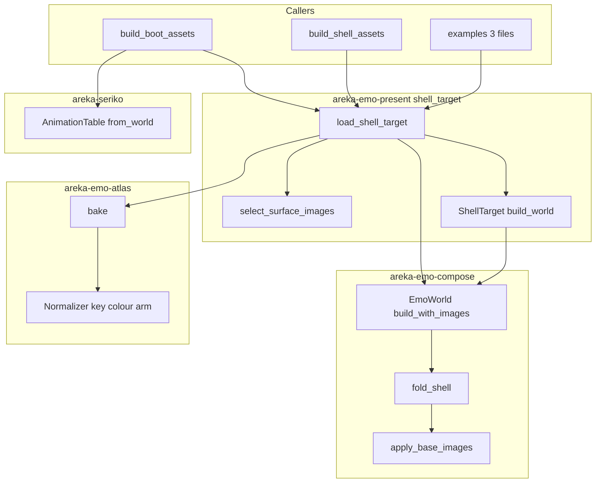
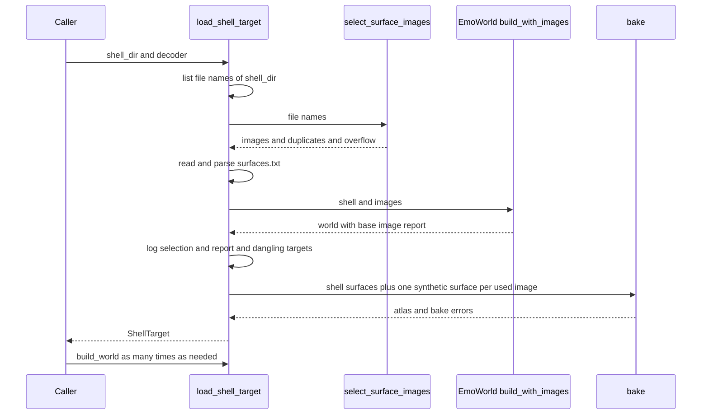
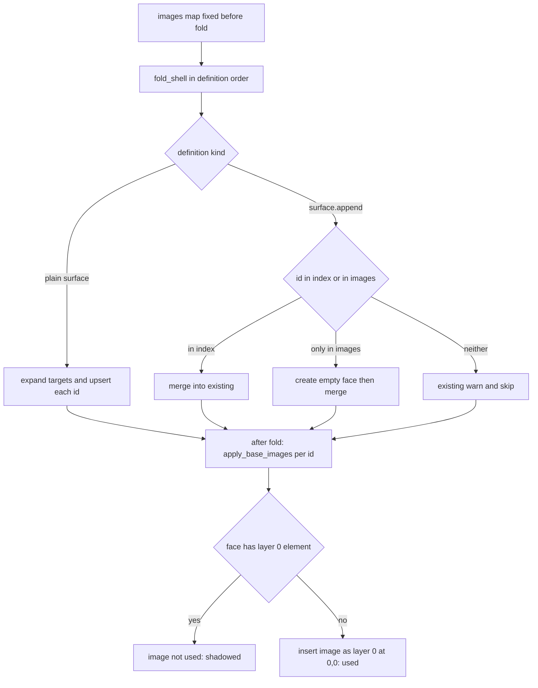

# Design Document: areka-P0-shell-implicit-surface

> コードは「何の定義か（関数名・型名）＋ファイル」で指す。件数・行数は本ブランチでの実測（2026-09-19）。正典の引用は `requirements.md`「正典の引き直し」の C1〜C17（URL と逐語つき）を番号で指す。
> `brief.md` は 2 か所で正典と食い違う。本書は `requirements.md` に従う。

## Overview

**Purpose**: 里々の標準テンプレート `R_POST_and_KOMAINU` と YAYA の標準テンプレート `konnoyayame` を、絵が出て・キャラクターの形に抜かれ・まばたきする状態にする。原因は 3 つ重なっている: ⑴ ファイル名だけで置かれた絵（`surface0000.png`）を面として読む経路が無い ⑵ α チャンネルの無い絵の透過（左上の色を抜く）が未実装 ⑶ 間隔の語 `sometimes` を再生しない。

**Users**: 第三者の利用者とシェル作者。SSP 向けに作ったシェルを、`surfaces.txt` に 1 行も足さずに areka で表示できる。

**Impact**: 「シェルのフォルダ → 面の表と焼いた絵」を組む手順を、いま 5 か所に複製されている形から **1 本の権威**（`areka-emo-present` の新しいモジュール `shell_target`）へ寄せる。面の土台の絵の決定は `areka-emo-compose` の面の表の構築に 1 か所だけ置く。抜き色は `areka-emo-atlas` の `Normalizer::normalize` の腕 1 本、間隔の語は `areka-seriko` の `AnimationTable::from_world` の読み替え 1 か所である。`emo2` は `purple/a/null.png` 1 枚の扱いを除いて画素も寸法も変わらない。

### Goals

- ファイル名の慣習（C1・C2）で面の番号を得て、面の土台の絵を正典どおり（C3〜C5）に決める。
- その結果を、起動時の面・`\s[N]`・コマの相手・採寸・`surface.append` の対象判定・焼く絵の一覧の**全部が構造として同じに**受け取る（要件 3.6）。
- α チャンネルの無い絵を、左上の 1 画素と完全に同じ色を透明にして描く（C9〜C11）。
- `sometimes`→`random,2`・`rarely`→`random,4` として再生する（C15〜C17）。
- `emo2` の画面に出る画素と寸法が変わらないことを、テストで言い切る。

### Non-Goals

- `.pna`・`seriko.use_self_alpha,full`・透過の宣言の読取・`UseSelfAlpha::Off` の下の抜き色（いずれも変更 0）。
- PNG 以外の形式、`defaultsurface`、`alias.txt`／`surfaces*.txt`／`surfacetable.txt`。
- `surfaces.txt` が無いシェル、波括弧 0 個のシェル（今の起動の失敗のまま・変更 0）。
- `sometimes`・`rarely` 以外の間隔の語（変更 0）。
- `overlay` 以外の描画メソッドで書かれた `element` 行を値にすること（`decode_elements` の既存の縮退のまま・解析の結果の型は変更 0）。
- 全画素が透明な面を表示の対象にしたときの扱い（変更 0）。

## Boundary Commitments

### This Spec Owns

- **「面の番号 → 面の画像」の対応**: シェルのフォルダ直下のファイル名から番号を得る規則（要件 1）。権威は `crates/areka-emo-present/src/shell_target.rs` の `select_surface_images` の 1 本。
- **面の土台の絵の決定**（要件 2.1 の表ア〜エ）: 権威は `crates/areka-emo-compose/src/base_image.rs` の `apply_base_images` の 1 本。畳み込み（`fold_shell`）が終わった後の面の表に対して、番号ごとに下す。
- **シェルの読み込み手順の権威**: `load_shell_target`（フォルダの一覧 → `surfaces.txt` の読取と解析 → 面の表 → 使う画像 → 焼く → 面の表を必要な数だけ組める値 `ShellTarget`）。本番 2 か所と `examples` 3 か所はこれを呼ぶだけになる。
- **抜き色の腕**: `Normalizer::normalize` の `(UseSelfAlpha::On, AlphaSource::KeyColor)` の 1 腕。
- **間隔の語 2 語の読み替え**: `AnimationTable::from_world` の中の 1 か所。
- 上に伴う記録（要件 6）・決定論テスト（要件 7）・実機確認（要件 8）・文書と台帳（要件 9）。

### Out of Boundary

- `areka-parsers` の解析の結果の型（`Shell`・`Surface`・`Element`・`Interval`）。**変更 0 件**。
- `SurfaceSet`（`crates/areka-emo-atlas/src/manifest.rs`）の欄。**変更 0 件**（構造体リテラルが 33 ファイル・43 か所に在るため、欄を足さない方法を採る）。
- `ManifestDeriver::derive`・`resolve_indirect`・`bake` の手順。**変更 0 件**（`bake` には `debug!` 1 本を足すだけ）。
- `plan.rs` の合成計画（`build_plan`・`flatten_surface`・`flatten_extent`・`push_static_element_ops`）。**変更 0 件**。
- `apply_show`・`SurfaceResolver::resolve`・当たり判定・`MaskRotation::regenerate`。**変更 0 件**。
- バルーンの系列解決（`resolve_balloon_faces`・`select_faces`・`build_balloon_target_from_faces`）の挙動。**変更 0 件**（`face_id_of` から数字部分の取り出しを私有関数へ切り出すだけで、戻り値は同じ）。
- `BootWiringError`・`PlacementError` の枝。**追加 0 件**。

### Allowed Dependencies

- 依存の向きは既存のまま: `areka-parsers` ← `areka-emo-atlas` ← `areka-emo-compose` ← `areka-emo-present` ← `areka`。`areka-seriko` は `areka-emo-compose` に依存する。逆向きの依存を足さない。
- `shell_target` は `areka-parsers`（`charset::decode`・`shell::parse`）・`areka-emo-atlas`（`bake`・`SurfaceSet`）・`areka-emo-compose`（`EmoWorld`）を使う。ファイルを読むのは `shell_target` だけで、`base_image`・`Normalizer` は読まない。
- 新しい外部クレートの追加 **0 件**。`Cargo.toml` の変更 **0 件**（触る 6 クレートはどれも `sample-ghost-kit` を `[dev-dependencies]` に既に持つ・`areka-emo-present` は `thiserror` を既に持つ）。
- 検体は `sample_ghost_kit::SampleRoot::acquire` 経由でのみ受ける。`konnoyayame` のシェルは CC BY-NC-ND であり、畳み直さない・areka の配布物へ同梱しない。

### Revalidation Triggers

- `EmoWorld::build_with_images`／`ShellTarget` の形が変わる → 呼び手 5 か所を見直す。
- `decode_elements` が `overlay` 以外の `element` 行を値にするようになる → 要件 2.7 の既知のずれが自動的に消える。`apply_base_images` の「層 0 が在るか」の判定が正典どおりになることを確かめ直す。
- 透過の宣言を読むようになる（`UseSelfAlpha::Off`／`Full` を渡す経路ができる）→ 抜き色の腕の条件（`On` のときだけ）を見直す。
- `areka-P0-surfaces-basepos` が `crates/areka-parsers/src/shell/` と `fold.rs` に触る → 後着が rebase する（本仕様は `areka-parsers` に触らないので、重なりうるのは `fold.rs` だけである）。

## Architecture

### Existing Architecture Analysis

- 実行時に面を引く入口 8 本（起動時の面の表示と採寸・`\s[N]`・コマの相手の描画と外形・コマの表・当たり判定・`surface.append` の対象判定）は、すべて `EmoWorld`（`SurfaceIndex`／`EmoWorld::surface`）を引く。`EmoWorld` は `EmoWorld::build` → `fold_shell` の 1 本道でしか作られない。
- 焼く絵の一覧を作る `ManifestDeriver::derive` だけが、`EmoWorld` ではなく `SurfaceSet.surfaces`（解析直後の `Surface` の並び）を読む。`derive` は渡された全 `Surface` の `elements` を無条件に集める（`collect_elements`）。
- 「読む → 解析 → 焼く → 面の表を組む」の並びは `build_boot_assets`（`crates/areka/src/emo2_boot/assets.rs`）・`build_shell_assets`（`crates/areka/src/placement/measure.rs`）・`crates/areka/examples/emo-present/setup.rs`・`crates/areka/examples/collision-probe/setup.rs`・`crates/areka/examples/window-placement.rs` の 5 か所に同じ形で在る。
- バルーンは同じ問題を、権威 1 本（`resolve_balloon_faces`＋`build_balloon_target_from_faces`・`crates/areka-emo-present/src/balloon.rs`）を起動と採寸の両方が呼ぶ形で解いている。名前の判定 `face_id_of`・重複時の採り方 `select_faces`・列挙 `enumerate_file_names` が手本になる。
- `Normalizer::normalize` が受け取るのは、WIC が 32bit の乗算済み BGRA へ変換し終えたバッファである（`WicDecoderArm::decode_inner`）。`has_alpha` は変換**前**の形式で決まる（`pixel_format_has_alpha`）。

### Architecture Pattern & Boundary Map

採るのはギャップ分析の**案 C（権威 1 本）の中で案 B（面の表の構築に対応を渡す）を使う**形である。



**Architecture Integration**:

- **採った形**: 権威 1 本。理由は要件 3.6 を規約ではなく構造で守るため（`measure_balloon_surface0` の説明が警告している「列挙の規則が 2 つの実装に分かれる」事態が起きえなくなる）。5 か所の複製は消えるので、コードは減る。
- **退けた形**:
  - 案 A（解析直後の `Shell` を書き換える）: 複数番号の見出し（`surface0,1`）の本体の共有と、`surface.append` が後から `element0` を足す場合を正しく扱うために、`fold.rs` の `expand_targets` と同じ展開をもう 1 度書くことになる。
  - 案 B′（認めた画像を全部焼く）: `emo2` の使わない `surface10.png` も焼かれ、索引表が 2 枚増える。要件 5.5 の「1 枚増える」と両立しない。
  - `SurfaceSet` に欄を足す: リテラル 33 ファイル・43 か所の追随が要る。代わりに、使う画像ごとに `element0` 1 行の `Surface` を作って焼く側へ渡す（バルーンの `synthetic_surfaces_txt` と同じ発想）。
- **保つ既存の形**: 名前の判定は文字列の列を入力にした純粋な関数（`select_faces` と同型）・fs を触る入口と触らない核の 2 段（`resolve_balloon_faces`／`select_faces` と同型）・失敗は `error!`＋`Err`。
- **Steering 準拠**: `areka-parsers` は転記層のまま（変更 0）。`structure.md` のテスト分離の規約（兄弟ファイル＋`#[path]`）と 1 ファイル 1,000 行の目安に従う。

### Technology Stack

| Layer | Choice / Version | Role in Feature | Notes |
|-------|------------------|-----------------|-------|
| 画像の復号 | WIC（`windows` クレート・既存） | α なしの絵を 32bit 乗算済み BGRA へ変換 | 変更 0。変換後の値を抜き色の入力にする |
| 面の表 | `bevy_ecs`（既存） | 画像の対応と土台の結果を `Resource` で持つ | 画素は持たない（既存の不変条件のまま） |
| 失敗の型 | `thiserror`（既存） | `ShellLoadError` | 新しい依存 0 件 |

## File Structure Plan

### Directory Structure

```
crates/
├── areka-emo-present/src/
│   ├── shell_target.rs                     # 新規: シェルの読み込みの権威（名前の判定・一覧・ShellTarget・ShellLoadError）
│   ├── shell_target_names_tests.rs         # 新規: 要件 7.1（名前の判定・純粋）
│   ├── shell_target_base_image_tests.rs    # 新規: 要件 7.2・7.7（表ア〜エ・メモリ上の復号器）
│   ├── shell_target_template_tests.rs      # 新規: 要件 7.4・7.5（検体 2 体・実物の絵）
│   ├── shell_target_emo2_tests.rs          # 新規: 要件 7.8・5.8（emo2 の不変と摂動）
│   └── shell_target_test_support.rs        # 新規: 上 4 本が共有する検体の受け口と COM 初期化
├── areka-emo-compose/src/
│   ├── base_image.rs                       # 新規: 土台の絵の決定・相手の無いコマの照会
│   └── base_image_tests.rs                 # 新規: 畳み込みとの順序・複数番号の見出し・照会
├── areka-emo-atlas/src/
│   └── normalize_key_color_tests.rs        # 新規: 要件 7.3（抜き色の画素決め打ち）
├── areka-seriko/src/
│   └── table_interval_words_tests.rs       # 新規: 要件 7.10（間隔の語）
└── areka/src/placement/
    └── measure_template_tests.rs           # 新規: 要件 7.6（採寸と表示の一致・構造の確認）
```

新しいテストファイルはすべて `structure.md` の規約どおり、親ファイルの末尾に `#[cfg(test)] #[path = "…"] mod …;` で繋ぐ。`<stem>_<モジュール名>.rs` の導出が一意であることは確かめた（`shell_target`・`base_image`・`normalize`・`table`・`measure` のどの stem も、同じフォルダの別ファイルの stem の接頭辞にならない。`measure_template_tests` は既存の `measure_tests` を接頭辞に持たない）。

### Modified Files

- `crates/areka-emo-present/src/lib.rs` — `pub mod shell_target;` と再輸出を足す。
- `crates/areka-emo-present/src/balloon.rs` — `face_id_of` の 3 段判定（接頭辞を外す → `.png` を外す → 全部数字）を `pub(crate) fn face_digits_of` へ切り出し、`face_id_of` はそれを呼んで `parse::<u32>().ok()` するだけにする。戻り値の変更 **0**。
- `crates/areka-emo-compose/src/lib.rs` — `pub mod base_image;` と `BaseImageReport` の再輸出。
- `crates/areka-emo-compose/src/world.rs` — `EmoWorld::build_with_images`・`EmoWorld::base_images`・`EmoWorld::dangling_pattern_targets` を足す。`EmoWorld::build` は「画像 0 件で `build_with_images` を呼ぶ」に置き換える（既存の呼び手の変更 **0 件**）。
- `crates/areka-emo-compose/src/fold.rs` — `fold_append` の「既にある面」の条件に「画像の対応に在る番号」を足す（在れば空の面をその場で作ってから追記する）。
- `crates/areka-emo-atlas/src/normalize.rs` — 抜き色の腕と `Normalizer::key_color`。`AlphaSource::KeyColor` の説明の「未実装」を直す。本体内テスト `on_no_alpha_no_pna_selects_keycolor_seam` を書き換える。
- `crates/areka-emo-atlas/src/lib.rs` — `bake` に抜き色の `debug!` を 1 本足す。
- `crates/areka-emo-atlas/src/emo2_e2e.rs`・`emo2_golden.rs`・`testdata/emo2_shell_golden.txt` — 要件 5.6 の書き換え（期待値は 1 行増える）。
- `crates/areka-seriko/src/table.rs` — 間隔の語の読み替えと、冒頭の「採録規則」の説明の更新。
- `crates/areka/src/emo2_boot/assets.rs`・`crates/areka/src/placement/measure.rs` — 読む → 解析 → 焼く → 組む の並びを `load_shell_target` の呼び出しへ置き換える。`null.png` の注記は消える。
- `crates/areka/src/emo2_boot/mod.rs` — `impl From<ShellLoadError> for BootWiringError`（既存の枝 `ShellRead`／`ShellEmpty` への写し替え。枝の追加 0）。
- `crates/areka/examples/emo-present/setup.rs`・`crates/areka/examples/collision-probe/setup.rs`・`crates/areka/examples/window-placement.rs` — 同上。
- 検体の受け口: `crates/areka-seriko/src/sample_test_support.rs`・`crates/areka/src/placement/placement_shared_test_support.rs` に `konnoyayame`／`R_POST_and_KOMAINU` の受け口を足す（`emo2` と同じ `LazyLock<SampleRoot>` の形）。
- 着地時の文書: `doc/ukadoc-coverage/ledger/assets.toml`・`doc/COMPAT_ARCHITECTURE.md` §8・`.kiro/steering/roadmap.md`・`.kiro/specs/areka-P0-coverage-roadmap-refresh/brief.md`。

### 実装の順序（隠れた前提を作らないための並び）

1. 互いに独立で並べて進められる 3 つ: 抜き色の腕（`areka-emo-atlas`）／間隔の語（`areka-seriko`）／名前の判定（`face_digits_of` の切り出しと `select_surface_images`・`areka-emo-present`）。触るクレートが別なので干渉は 0。
2. 面の表の構築（`base_image`・`fold_append`・`EmoWorld::build_with_images`）。
3. 権威（`load_shell_target`・`build_shell_target`・`ShellTarget`）。1 の名前の判定と 2 に依存する。
4. 呼び手 5 か所の置き換え。この時点で `emo2` の既存テストが緑であることを確かめる。
5. `emo2` の書き換えるテストと期待値の作り直し（1 の抜き色が入った時点で赤になるので、1 と同じ作業の中で行う）。
6. 検体 2 体のテスト → 実機確認 → 文書と台帳。

行数の検査（`crates/log-capture-kit/tests/file_length_guard_test.rs`）の例外表には触らない（変更 0）。`measure_tests.rs`（981 行）・`assets_tests.rs`（976 行）・`fold_tests.rs`（968 行）への追記 **0 行**。

## System Flows

### シェルの読み込み（権威の中の順序）



- 今の並び「焼く → 面の表を組む」を「面の表を組む → 使う画像を聞く → 焼く」へ入れ替える。`EmoWorld` の構築は焼いた結果を必要としないので入れ替えられる。入れ替えが要るのは権威の中の 1 か所だけである。
- `ShellTarget::build_world` は「`EmoWorld::build_with_images` → `bind_atlas(SetId(0))`」を毎回新しく行う（`EmoWorld` は複製できず、装着で消費されるため）。同じ入力から組むので結果は毎回同じである。記録は出さない（0 本）。

### 面の表の構築の中の順序（`surface.append`・波括弧の展開・ファイル名の慣習）



- 判定は**展開後・番号ごと・畳み込みの後**に下す。複数番号の見出し（`surface0,1`）は番号ごとに自分の画像を受け取り、`surface.append` が後から足した `element0` も「層 0 が在る」に数えられる（C4）。
- `element0` が無いときだけ画像を使うので、**層 0 は必ず空いている**。「`element0` より下」を表す新しい層の型は要らない（追加 0）。
- 画像だけで存在する面へ `surface.append` が効いた後で、同じ番号の波括弧が来た場合は、既存の規則どおり波括弧が全置換し、既存の `warn!`「surface id 重複: 既存定義を全置換する（後勝ち）」が出る。追記で実際に定義ができた後の置換なので、この警告は事実どおりである（画像だけの面を先に置く作りで起きる「偽の重複警告」は、この順序では 0 件）。正典は沈黙しており、沈黙ルール対応表に記す。3 検体に `surface.append` と画像だけの面の組み合わせは **0 件**（`surface.append` の行は `R_POST_and_KOMAINU` 0・`konnoyayame` 0・`emo2` 5）。

## Requirements Traceability

| Requirement | Summary | Components | Interfaces | Flows |
|---|---|---|---|---|
| 1.1, 1.2, 1.4 | 名前から番号・先頭の 0・大小無視 | shell_target・balloon | `select_surface_images`・`face_digits_of` | 読み込み |
| 1.3 | 認めない名前は 0 件 | shell_target | `select_surface_images`・`list_shell_file_names`（ファイルだけ・直下だけ） | 読み込み |
| 1.5 | 重複は辞書順で最小＋`warn!` 1 回 | shell_target | `SurfaceImageSelection.duplicates` | 読み込み |
| 1.6 | 大きすぎる番号は `debug!` | shell_target | `SurfaceImageSelection.overflow` | 読み込み |
| 1.7 | 一覧の失敗は `error!`＋起動の失敗 | shell_target・呼び手 | `ShellLoadError::List` → `BootWiringError::ShellRead`／`PlacementError::Measure` | 読み込み |
| 1.8 | 何度読んでも同じ対応 | shell_target | `BTreeMap` と辞書順で決定 | — |
| 2.1 | 表ア〜エ | base_image | `apply_base_images` | 面の表の構築 |
| 2.2 | 画像だけの面は存在する面 | base_image | `apply_base_images`（面の新設） | 面の表の構築 |
| 2.3 | 波括弧の他の定義を生かす | base_image・fold | 既存の `normalize_surface` に層 0 を足すだけ | 面の表の構築 |
| 2.4 | どちらも無い番号は現状のまま | plan（変更 0） | `build_plan` の `SurfaceNotFound`／`EmptyComposition` | — |
| 2.5 | 画像は (0,0)・`element` の位置は不変 | base_image | `Transform::translate(0, 0)` | — |
| 2.6 | `.pna` を読まない | shell_target | 名前の判定が `.png` 以外を 0 件にする（下の「読みの確定」） | — |
| 2.7 | `overlay` 以外の `element0` は「なし」に数える | base_image | 「層 0 の `NormalizedElement` が在るか」で判定（解析の型は変更 0） | — |
| 3.1 | 起動時は面 0・面 10 | 呼び手（変更は権威の呼び出しだけ） | `ShellTarget::build_world` | 読み込み |
| 3.2, 3.3 | `\s[N]` | EmoWorld に載れば修正 0 件／変更 0 | `apply_show`（変更 0） | — |
| 3.4 | コマの相手が画像だけの面 | EmoWorld に載れば修正 0 件 | `flatten_surface`（変更 0） | — |
| 3.5 | 相手の無いコマの `warn!` | base_image・shell_target | `EmoWorld::dangling_pattern_targets`＋権威の `warn!` | 読み込み |
| 3.6 | 採寸と表示が同じ | shell_target | 両方が `load_shell_target` を呼ぶ | 読み込み |
| 3.7, 3.8 | `surface.append` | fold | `fold_append` の存在条件 | 面の表の構築 |
| 3.9 | 引かれていない画像も面 | base_image | 特別扱い 0 | — |
| 4.1, 4.2, 4.3, 4.6, 4.7 | 抜き色 | Normalizer | `(On, KeyColor)` の腕 | — |
| 4.4 | α 付きは不変 | Normalizer（変更 0） | `(On, AlphaChannel)` の腕 | — |
| 4.5 | 正規化を通る全部の絵に効く | Normalizer | `bake` は全部の絵を同じ腕へ通す（変更 0） | — |
| 4.8 | `tRNS` の扱い | Normalizer | 下の「抜き色の腕」の決定 | — |
| 4.9 | `.pna`・`full` は据え置き | Normalizer（変更 0） | `Unsupported(Pna)`・`Unsupported(Opaque)` | — |
| 4.10 | 抜いた場所はキャラクターの外 | 追加 0 | `MaskRotation::regenerate`（変更 0） | — |
| 5.1, 5.2, 5.3 | `emo2` の面は画像由来の層 0 | base_image | 表のウ | — |
| 5.4 | α 付き 57 枚は不変 | Normalizer（変更 0） | — | — |
| 5.5, 5.6 | `null.png` の 1 件だけ変わる・テストの書き換え | Normalizer・atlas のテスト | 下の Testing Strategy | — |
| 5.7 | 注記 5 か所 | 呼び手 5 か所 | 権威へ寄せて消える | — |
| 5.8 | 面 10 の形で赤を示す | shell_target_emo2_tests | 摂動 | — |
| 5.9 | 実機で `emo2` | 実機確認 | — | — |
| 6.1, 6.2 | 一覧と使わなかった画像の記録 | shell_target | `info!` 1 行・`debug!` 面ごと | 読み込み |
| 6.3 | 抜き色の記録 | atlas `bake` | `debug!` | — |
| 6.4 | 失敗と縮退の経路に記録 | 各コンポーネント | 下の Error Handling の表 | — |
| 6.5 | 書式 | 全部 | 下の Monitoring | — |
| 7.1〜7.12 | 決定論テスト | 新しいテスト側のファイル 9 本（テスト 8 本＋共有の受け口 1 本） | 下の Testing Strategy | — |
| 8.1〜8.6 | 実機確認 | 手順 | 下の Testing Strategy「実機確認」 | — |
| 9.1〜9.6 | 台帳と文書 | 着地時の作業 | 下の「文書と台帳」 | — |
| 10.1〜10.7 | 裁定の記録 | 本書 | Overview・Boundary・各決定が裁定どおりであること | — |
| 11.1, 11.2 | `sometimes`・`rarely` | AnimationTable | `from_world` の読み替え | — |
| 11.3, 11.4 | 他の語は変更 0 | AnimationTable | 既存の腕のまま | — |
| 11.5 | `konnoyayame` のまばたき | 面の表＋AnimationTable＋Normalizer | 3 つの原因の合流点 | — |
| 11.6 | `emo2` の再生の集合は不変 | AnimationTable | `emo2` に該当の語 0 件 | — |
| 11.7 | 読み替えの段・元の語が記録に残る | AnimationTable | `debug!` の `vocab` 欄 | — |

全 ID の対応（個別に書かなかったものを含む）: 7.1=`shell_target_names_tests`／7.2・7.7=`shell_target_base_image_tests`・`base_image_tests`／7.3=`normalize_key_color_tests`／7.4・7.5=`shell_target_template_tests`／7.6=`measure_template_tests`／7.8=`shell_target_emo2_tests`＋書き換えた atlas のテスト／7.9=各ファイルの摂動の記録／7.10=`table_interval_words_tests`／7.11=検体の受け口／7.12=本節のファイル配置。8.1・8.2・8.3・8.4・8.5・8.6=「実機確認」。9.1・9.2・9.3・9.4・9.5・9.6=「文書と台帳」。10.1・10.2=抜き色の腕の範囲／10.3=表のウ／10.4=`fold_append`／10.5=要件 3.9 の行／10.6=本書の改訂規則（Boundary の Revalidation Triggers）／10.7=Non-Goals と要件 11。

**読みの確定（要件 2.6 と 4.9）**: 要件 2.6「`.pna` を読まない・在っても無くても結果は変わらず記録も出さない」は、要件 2 の主題＝**土台の絵の決め方**についての定めとして読む（`surface0.pna` は面の画像と認めず、表ア〜エの結果を変えず、一覧の段で記録を出さない）。焼く段で α の無い絵に同名の `.pna` が在るときの既存の扱い（`Unsupported(Pna)` として落とし記録する）は、要件 4.9・Boundary Context・要件 10.2 の 3 か所が「変更 0」と定めているので変えない。3 検体に `.pna` は **0 件**である。

## Components and Interfaces

| Component | Domain/Layer | Intent | Req Coverage | Key Dependencies | Contracts |
|---|---|---|---|---|---|
| `shell_target` | areka-emo-present | シェルの読み込みの権威 | 1.1〜1.8, 2.6, 3.1, 3.5, 3.6, 5.7, 6.1, 6.2, 6.4 | parsers・atlas・compose (P0) | Service |
| `base_image` | areka-emo-compose | 土台の絵の決定と照会 | 2.1〜2.5, 2.7, 3.2〜3.4, 3.7〜3.9, 5.1〜5.3 | fold (P0) | Service, State |
| `Normalizer`（抜き色の腕） | areka-emo-atlas | α の無い絵を左上の色で抜く | 4.1〜4.10, 5.4, 5.5, 6.3 | decode (P0) | Service |
| `AnimationTable::from_world` | areka-seriko | 間隔の語 2 語の読み替え | 11.1〜11.7 | compose (P0) | Service |
| 呼び手 5 か所 | areka | 権威を呼ぶだけにする | 3.1, 3.6, 5.7 | shell_target (P0) | — |

### areka-emo-present

#### shell_target

| Field | Detail |
|---|---|
| Intent | シェルのフォルダから「焼いた絵＋面の表を必要な数だけ組める値」を作る唯一の入口 |
| Requirements | 1.1, 1.2, 1.3, 1.4, 1.5, 1.6, 1.7, 1.8, 2.6, 3.1, 3.5, 3.6, 5.7, 6.1, 6.2, 6.4 |

**Responsibilities & Constraints**

- ファイルを読むのはここだけ（フォルダの一覧 1 回・`surfaces.txt` 1 回）。`surfaces.txt` の復号は今と同じ `areka_parsers::charset::decode(&bytes, DefaultEncoding::Ansi)`。
- 名前の判定は `crate::balloon::face_digits_of("surface", name)` を使う。バルーンと同じ 3 段判定（接頭辞を大小無視で外す → `.png` を外す → 残りが空でなく全部 ASCII 数字）を 1 つの実装で共有するので、要件 1.4 の「`face_id_of` と同じ扱い」は構造で成り立つ。数字列が `u32` に収まらないものは `overflow` へ入れる（要件 1.6）。
- 一覧はフォルダ**直下**の**ファイルだけ**を集める（`file_type().is_file()`）。サブフォルダの中身とフォルダそのものは 0 件（要件 1.3）。バルーンの `enumerate_file_names` は失敗の型がバルーン専用（`PresentError`）で、フォルダを除かないので流用しない。
- 同じ番号に複数の名前があれば辞書順で最小を採る（`select_faces` と同じ規則）。
- 記録はすべて `load_shell_target` の中で、**読み込み 1 回につき 1 度だけ**出す。`build_world` は記録を出さない。

**Dependencies**

- Inbound: `build_boot_assets`・`build_shell_assets`・`examples` 3 本 (P0)
- Outbound: `EmoWorld::build_with_images`・`EmoWorld::base_images`・`EmoWorld::dangling_pattern_targets`・`areka_emo_atlas::bake` (P0)

**Contracts**: Service [x]

##### Service Interface

```rust
/// 名前の一覧から「番号 → 採ったファイル名」を決める（fs に触らない）。
pub fn select_surface_images<S: AsRef<str>>(names: &[S]) -> SurfaceImageSelection;

pub struct SurfaceImageSelection {
    /// 番号 → 採ったファイル名（元の綴りのまま。焼く側が実パスを開くため）。
    pub images: BTreeMap<u32, String>,
    /// 同じ番号に複数あったもの: (番号, 採った名前, 捨てた名前の一覧)。番号の昇順。
    pub duplicates: Vec<(u32, String, Vec<String>)>,
    /// 形は面の画像だが、数字が `u32` に収まらなかった名前。辞書順。
    pub overflow: Vec<String>,
}

/// fs を触る入口。一覧 → 解析 → 面の表 → 使う画像 → 焼く。
pub fn load_shell_target(
    shell_dir: &Path,
    decoder: &impl ElementDecoder,
) -> Result<ShellTarget, ShellLoadError>;

/// fs を触らない核（復号器を除く）。テストはメモリ上の復号器でここを通す。
pub fn build_shell_target(
    shell: Shell,
    selection: SurfaceImageSelection,
    shell_dir: &Path,
    decoder: &impl ElementDecoder,
) -> ShellTarget;

pub struct ShellTarget { /* shell・images・atlas・bake_errors を私有で持つ */ }
impl ShellTarget {
    pub fn atlas(&self) -> &AtlasTable;
    pub fn bake_errors(&self) -> &[BakeError];
    /// `EmoWorld::build_with_images` → `bind_atlas(SetId(0))`。呼ぶたびに新しい面の表。
    pub fn build_world(&self) -> EmoWorld;
}

#[derive(Debug, thiserror::Error)]
pub enum ShellLoadError {
    /// シェルのフォルダの一覧が取れなかった（要件 1.7）。
    List { path: PathBuf, #[source] source: std::io::Error },
    /// `surfaces.txt` が読めなかった（既存の失敗）。
    Read { path: PathBuf, #[source] source: std::io::Error },
    /// `surfaces.txt` が面を 1 つも産まなかった（既存の失敗・変更 0）。
    Empty { path: PathBuf },
}
```

- Preconditions: 呼び出しスレッドは COM 初期化済み（`WicDecoderArm` を渡す場合）。
- Postconditions: `build_world` が返す面の表は、同じ `ShellTarget` から何度組んでも同じ内容である。`atlas` には「`surfaces.txt` の `element` が名指しする絵」と「土台に**使った**面の画像」だけが載る（使わなかった面の画像は載らない）。
- Invariants: 採寸と表示は同じ関数を通るので、「番号 → 画像」の対応・土台の絵・透過の扱いが食い違わない（要件 3.6）。

**焼く絵の一覧へ画像を載せる方法**: `SurfaceSet.surfaces` へ渡す並びを「`shell.surfaces` の複製＋使う画像 1 枚につき `Surface { id, targets: [Single(id)], elements: [element0 = ファイル名, 0, 0], collisions: [], animations: [] }` 1 個」にする。`ManifestDeriver::derive` は渡された全 `Surface` の `elements` を無条件に集めるので、`derive`・`SurfaceSet`・`bake` の変更は 0 件で済む。パスの文字列は面の表の層 0 の `ElementPath` と同じ綴り（採ったファイル名そのまま）にする。`AtlasTable::resolve` は文字列の完全一致で引くためである。`emo2` では使う画像が 0 枚なので、焼く側への入力は今日と同じになる。

**Implementation Notes**

- Integration: 呼び手の写し替えは、`BootWiringError` へは `List`・`Read` → 既存の `ShellRead { path, source }`（一覧の失敗では `path` がシェルのフォルダになる）、`Empty` → 既存の `ShellEmpty { path }`。`PlacementError` へは 3 つとも既存の `Measure { scope: 0, reason }`。新しい枝は **0 個**。
- Validation: 焼いたときの失敗は権威が `warn!` で 1 件ずつ出す。文言は実機確認（要件 8.5）が数える語「shell bake で脱落した element」を含める。`emo2` では 0 回になる。
- Risks: 並びの入れ替え（面の表 → 焼く）で `emo2` の結果が変わらないことは、`shell_target_emo2_tests` の A／B の一致と既存の寸法のテストで確かめる。

#### balloon（切り出しだけ）

`face_id_of` の 3 段判定を `pub(crate) fn face_digits_of(prefix: &str, name: &str) -> Option<String>` へ切り出す。`face_id_of(prefix, name)` は `face_digits_of(prefix, name)?.parse::<u32>().ok()` になる。バルーンの既存テスト（`balloon_series_tests.rs`）が書き換え 0 件で緑であることが、挙動の変更 0 の証拠になる。

### areka-emo-compose

#### base_image

| Field | Detail |
|---|---|
| Intent | 畳み込みの後の面の表に、番号ごとに土台の絵を決めて層 0 として足す |
| Requirements | 2.1, 2.2, 2.3, 2.4, 2.5, 2.7, 3.2, 3.3, 3.4, 3.7, 3.8, 3.9, 5.1, 5.2, 5.3 |

**Responsibilities & Constraints**

- 入力は「番号 → ファイル名」の `BTreeMap<u32, String>`。新しい型は作らない。面の表の中では `Resource`（`SurfaceImages`）として持ち、`fold_append` と `apply_base_images` が読む。
- `apply_base_images` は番号の昇順に、次の表どおりに下す。

  | 面が面の表に在る | 層 0 の `NormalizedElement` が在る | すること | 要件 2.1 の表 |
  |---|---|---|---|
  | いいえ | — | 画像 1 枚を層 0 に持つ面を新しく作る | ア（要件 2.2） |
  | はい | いいえ | 画像を層 0・位置 (0,0)・`ComposeMethod::Overlay` で足し、層の昇順に並べ直す | ア／イ |
  | はい | はい | 何もしない。`shadowed` に数える | ウ |

  画像の無い番号には触らない（エ・変更 0）。
- 「`element0` あり」は「面の `elements` に `layer == 0` のものが在る」で判定する。`overlay` 以外の `element0` は `decode_elements` が値にしないのでここへ届かず、「なし」に数えられる（要件 2.7 の既知のずれ。解析の型の変更 0）。
- 画素は持たない（`EmoWorld` の既存の不変条件のまま）。

**Contracts**: Service [x] / State [x]

##### Service Interface

```rust
impl EmoWorld {
    /// 既存。`build_with_images(shell, &BTreeMap::new())` と同じ（既存の呼び手の変更 0 件）。
    pub fn build(shell: &Shell) -> EmoWorld;
    /// 画像の対応を渡して組む。畳み込み → `apply_base_images` の順。
    pub fn build_with_images(shell: &Shell, images: &BTreeMap<u32, String>) -> EmoWorld;
    /// 土台に使った画像と、`element0` が在って使わなかった画像。
    pub fn base_images(&self) -> &BaseImageReport;
    /// 相手の面が存在しないコマの「(コマを持つ面, 相手の番号)」の集合。負の番号は含めない。
    pub fn dangling_pattern_targets(&self) -> BTreeSet<(u32, u32)>;
}

#[derive(Debug, Default, Clone, PartialEq, Eq)]
pub struct BaseImageReport {
    pub used: BTreeMap<u32, String>,
    pub shadowed: BTreeMap<u32, String>,
}
```

- Postconditions: 画像 0 件で組んだ面の表は、本仕様の適用前の `EmoWorld::build` と同じ内容である（バルーン・既存テストへの影響 0）。
- Invariants: `used` と `shadowed` のキーは重ならず、和は渡した `images` のキーの全体に等しい。

##### State Management

- `SurfaceImages(BTreeMap<u32, String>)` と `BaseImageReport` を `Resource` として面の表に置く。構築の後は読むだけである。
- `fold_append`: 対象の番号が `SurfaceIndex` に無く `SurfaceImages` に在るとき、空の `SurfaceMaster`（`elements`・`collisions`・`animations` が空）をその番号で作ってから、今と同じ追記を行う（要件 3.7・C6）。どちらにも無ければ今の `warn!` のまま（要件 3.8・変更 0）。

**`dangling_pattern_targets` の母集合**: 面の表の全部の面の、全部の `animation` の、全部の `pattern` のうち `surface_id >= 0` のもの。再生されるかどうかでは絞らない（表を 1 度なめるだけで、毎フレームの経路ではない）。重複を除く鍵は `(u32, u32)` の組であり、文字列へ連結しない。3 検体での該当は、`surfaces.txt` を波括弧の展開つきで数えた見積もりで **0 組**（`emo2` 0・`R_POST_and_KOMAINU` 0・`konnoyayame` 0。同じ数え方で画像の対応を外すと `konnoyayame` は 3 組＝面 0 → 1031・1032・1033 と出ることを確かめた）。実装の着地時に、この照会の実物の戻り値で数え直す。

### areka-emo-atlas

#### Normalizer（抜き色の腕）

| Field | Detail |
|---|---|
| Intent | α チャンネルの無い絵を、左上の 1 画素と同じ色を透明にして渡す |
| Requirements | 4.1, 4.2, 4.3, 4.4, 4.5, 4.6, 4.7, 4.8, 4.9, 4.10, 5.4, 5.5, 6.3 |

**腕の表（`normalize` の `match`）**

| `use_self_alpha` | 選ばれた `AlphaSource` | 適用前 | 適用後 |
|---|---|---|---|
| `On` | `AlphaChannel` | 素通し | 素通し（**変更 0**） |
| `On` | `KeyColor` | `Unsupported(KeyColor)` | **抜き色を適用して `Ok`** |
| `On` | `Pna` | `Unsupported(Pna)` | 変更 0 |
| `Full` | `AlphaChannel`／`Opaque` | `Unsupported(…)` | 変更 0 |
| `Off` | `Pna`／`KeyColor` | `Unsupported(…)` | **変更 0** |

**抜き色の規則**

1. **抜き色を決める画素**: 受け取ったバッファ（WIC が 32bit 乗算済み BGRA へ変換し終えたもの）の座標 (0,0) の **4 バイト（B・G・R・A）**。
2. **比べ方**: 各画素の 4 バイトが 1. と完全に等しいかどうか。許容幅 0。行の詰め物を読まないよう `stride` と `width` で行ごとに歩く。
3. **等しい画素**: `0,0,0,0` を書く（色を残さない・要件 4.6）。**等しくない画素**: 1 バイトも変えない。
4. 出力は乗算済み BGRA のまま（`NormalizedImage` の契約どおり）。
5. 幅か高さが 0 の絵（バッファが 4 バイト未満）は抜き色を持てないので、そのまま渡す（`bake` の既存の `warn!`「元画像が 0 寸」が出る・変更 0）。

**なぜ 4 バイトで比べてよいか**: α の無い形式の絵は、変換後に全画素が α=255 で届く。このとき乗算済みの値と元の値は一致するので、4 バイトの一致は「赤・緑・青の各成分が等しい」（要件 4.2）と同じ意味になり、等しくない画素は完全に不透明のまま残る（要件 4.1）。WPF の `BitmapDecoder`（中身は areka と同じ WIC の PNG 復号器）で PNG の全部の色の型を試した結果を下に置く。

| PNG の形 | WIC が報告する形式 | `has_alpha` | 通る腕 | 変換後の α |
|---|---|---|---|---|
| グレー 1／8／16bit | `BlackWhite`／`Gray8`／`Gray16` | false | 抜き色 | 全画素 255 |
| RGB 8／16bit | `Bgr24`／`Rgb48` | false | 抜き色 | 全画素 255 |
| パレット 1／4／8bit（`tRNS` なし） | `Indexed1`／`Indexed4`／`Indexed8` | false | 抜き色 | 全画素 255 |
| パレット＋`tRNS`・グレー＋`tRNS` | `Indexed8`（パレットが α を持つ） | false | 抜き色 | **`tRNS` の値が掛かって届く** |
| RGB＋`tRNS` | `Bgra32` | true | α（変更 0） | — |
| グレー＋α 8／16bit | `Bgra32`／`Rgba64` | true | α（変更 0） | — |
| RGBA 8／16bit | `Bgra32`／`Rgba64` | true | α（変更 0） | — |

- 抜き色の腕へ α≠255 の画素が届くのは「パレットが α を持つ」形だけである。α チャンネルを持つ PNG が `pixel_format_has_alpha` の表から漏れて抜き色へ来る形は **0 件**だった。
- 16bit の絵は 8bit へ変換された後の値で比べる（areka の裁量・沈黙ルール対応表に記す）。

**`tRNS` の扱い（要件 4.8）**: **`tRNS` の透明度は生かす**。届いた 4 バイトのまま比べるので、`tRNS` で半透明・透明になった画素はそのまま残り、加えて左上と同じ 4 バイトの画素が透明になる。理由は 2 つ: ⑴ 腕へ届く時点で `tRNS` は既に掛かっており、完全に透明な画素の元の色は取り戻せない。「生かさない」を選ぶには復号器の変換先を変える必要があり、α 付きの 57 枚と同じ経路に手が入る ⑵ C11 が名指しするのは「アルファチャンネル付きPNG」だけで、`tRNS` については沈黙している。`emo2` の `purple/a/null.png`（全画素が `0,0,0,0`）は全画素が左上と等しく、全画素が透明な絵になる（要件 4.7・5.5）。

**`UseSelfAlpha::Off` の下の抜き色**: **実装しない（変更 0）**。`Off` を渡す経路は areka に 0 本で、`Off` かつ α 付きの絵は乗算済みで届くため「自分の α を無視して左上の色で抜く」を正しく作れない。本体内テスト `off_no_pna_selects_keycolor_seam` は書き換えず据え置く（要件 5.6 の後段）。透過の宣言を読む仕事（要件 9.5 ⑶）と同じ時に扱う。

##### Service Interface

```rust
impl Normalizer {
    /// 既存。シグネチャの変更 0。
    pub fn normalize(&self, img: DecodedImage, params: AlphaParams, has_pna: bool)
        -> Result<NormalizedImage, NormalizeError>;
    /// 抜き色の腕が選ばれ、かつ左上の画素が在るときだけ `Some([b, g, r, a])`。
    /// `normalize` はこの関数の答えで腕を決めるので、判断は 1 か所である。
    pub fn key_color(img: &DecodedImage, params: AlphaParams, has_pna: bool) -> Option<[u8; 4]>;
}
```

`bake`（`crates/areka-emo-atlas/src/lib.rs`）は `normalize` の前に `key_color` を呼び、`Some` なら正規化の成功後に `debug!`（絵の名前と抜いた色）を出す（要件 6.3）。`NormalizedImage`・`DecodedImage` の欄の変更は 0 件。

**Implementation Notes**

- Integration: 全画素が透明になった絵は、既存の `Trimmer.trim` が「配置なし・原寸あり」の項目にし、`bake` の既存の `warn!`「element が全透明（α=0）でトリム後 0 寸です」が出る。特例は足さない（要件 5.5）。
- Validation: バルーンの絵も同じ腕を通る（C12）。リポジトリ内のバルーンで α の無い絵は 0 枚なので、既存のバルーンの見た目の変化は 0。
- Risks: 抜き色がキャラクターの中の同じ色も抜くのは正典どおりである（C10）。

### areka-seriko

#### AnimationTable::from_world（間隔の語の読み替え）

| Field | Detail |
|---|---|
| Intent | `sometimes`→`random,2`・`rarely`→`random,4` として採る |
| Requirements | 11.1, 11.2, 11.3, 11.4, 11.5, 11.6, 11.7 |

- **読み替える段は `AnimationTable::from_world`**（`crates/areka-seriko/src/table.rs`）。`Interval::Other(語)` の腕の中で、語が `sometimes` なら `LoopTrigger::Random { k: 2 }`・`rarely` なら `LoopTrigger::Random { k: 4 }` として以降の既存の手順（`k == 0` の検査・コマの整列・空の検査）へ流す。他の語は今の `debug!`＋非採録のまま（変更 0）。
- 解析の側（`normalize_interval`・`crates/areka-parsers/src/shell/decode.rs`）で読み替えない理由: 解析は「書いてあるとおりに写す」層であり、`sometimes` が `Interval::Other("sometimes")` になることを既存のテスト 4 ファイル（`parse_tests.rs`・`decode_tests_pattern_method_tests.rs`・`validation_tests.rs`・`model_tests.rs`）が留めている。ここで読み替えると元の語がモデルから消える。
- 語の比べ方は完全一致（小文字）。解析が `bind`・`random` を完全一致で見ているのと同じ扱いで、欄の前後の空白は字句の段（`lexer.rs`）が既に落としている。
- 読み替えたときは `debug!` を 1 本出す（欄: `surface_id`・`animation_id`・`vocab`＝元の語・`k`）。これで元の語が記録から読める（要件 11.7）。
- `LoopTrigger` に新しい枝は足さない（追加 0）。再生の仕組み（乱数の駆動）は変更 0。`plan.rs` の `is_bind_interval` は `Other` を bind 種でないものとして扱うので、コマは今の純 `random` と同じく無条件に合成へ合流する（変更 0）。
- `emo2` の `interval` の行に `sometimes`・`rarely` は 0 件なので、`emo2` の表の内容は変わらない（要件 11.6）。

### areka（呼び手）

- `build_boot_assets`: `load_shell_target(&shell_dir, &decoder)?` を 1 回呼び、scope の数だけ `build_world()` する。`atlas` は `target.atlas().clone()`。`descript.txt` の読取とバルーンの組み立ては今のまま（変更 0）。
- `build_shell_assets`: `load_shell_target` → `build_world()` 1 回 → `(world, atlas.clone())`。
- `examples` 3 本: 同じ置き換え。`read_to_string`（UTF-8 だけ）だったものが本番と同じ文字コードの扱いになる。`emo2` の `surfaces.txt` は `charset,UTF-8` を宣言しているので結果は同じである。
- `impl From<ShellLoadError> for BootWiringError` を `crates/areka/src/emo2_boot/mod.rs` に置く。

## Data Models

### Domain Model

- **面の画像の対応**: 番号（`u32`）→ ファイル名（元の綴り）。フォルダの一覧から決まり、読み込みの間は変わらない。
- **土台の絵の結果**: `used`（層 0 として足した）と `shadowed`（`element0` が在って使わなかった）。
- 面の土台の絵そのものは、既存の `SurfaceMaster.elements` の層 0 の `NormalizedElement` として表す。新しい層の型・新しい欄は **0 個**。

不変条件: ⑴ 層 0 を足すのは層 0 が空のときだけ ⑵ 足した層のパスは焼いた絵の索引表のキーと同じ綴り ⑶ 画像 0 件なら面の表は適用前と同じ。

## Error Handling

### Error Strategy

失敗は `error!`＋`Err`、縮退は `warn!`、細部は `debug!`。記録の無い失敗経路を持たない（要件 6.4）。毎フレームの経路に新しい記録は足さない（0 本）。1 フレーム遅らせる作りは使わない（すべて読み込み時に 1 度で決まる）。

### Error Categories and Responses

| 事象 | 出す場所 | レベル | 頻度 | その後 |
|---|---|---|---|---|
| フォルダの一覧が取れない（1.7） | `load_shell_target` | `error!`（`shell_dir`・`error`） | 読み込み 1 回に 1 度 | `ShellLoadError::List` → 起動の失敗（既存の経路） |
| 一覧の中の 1 件が取れない | `load_shell_target` | `warn!` | その件ごと | 飛ばして続行（バルーンと同じ） |
| `surfaces.txt` が読めない／面 0 個 | `load_shell_target` | `error!` | 1 度 | `Read`／`Empty`（既存の失敗のまま） |
| 同じ番号の重複（1.5） | `load_shell_target` | `warn!`（`surface_id`・`adopted`・`dropped`） | 番号ごとに、読み込み 1 回に 1 度 | 辞書順で最小を採って続行 |
| 番号が大きすぎる（1.6） | `load_shell_target` | `debug!`（`file`） | 名前ごとに 1 度 | 面の画像と認めない |
| 相手の無いコマ（3.5） | `load_shell_target` | `warn!`（`surface_id`・`target`） | 組ごとに、読み込み 1 回に 1 度 | 描かずに続行（変更 0） |
| 焼く段で落ちた絵（4.9 ほか） | `load_shell_target` | `warn!`（`error`） | 絵ごとに 1 度 | その絵だけ落として続行 |
| 全画素が透明な絵 | `bake`（既存） | `warn!` | 焼くたびに 1 度 | 変更 0 |

**頻度の単位**: 読み込み（`load_shell_target`）は 1 回の起動で **2 回**（表示用に `build_boot_assets` が 1 回・採寸用に `build_shell_assets` が 1 回）。したがって同じ番号・同じ組についての `warn!` は 1 回の起動で高々 2 回で、要件 3.5 の上限（面の表を組む回数以下）に収まる。面の表を組む回数（`build_world`）が増えても記録は増えない。毎フレームの経路からは 0 回である。

### Monitoring

| 記録 | レベル | target | 欄 |
|---|---|---|---|
| 一覧の結果（6.1） | `info!` | `areka_emo_present::shell_target`（既定） | `shell_dir`・`recognized`・`used`・`shadowed` |
| 使わなかった画像（6.2） | `debug!` | 同上 | `surface_id`・`file` |
| 抜き色（6.3） | `debug!` | `areka_emo_atlas`（明示） | `set`・`rel_path`・`b`・`g`・`r`・`a` |
| 間隔の語の読み替え（11.7） | `debug!` | `areka_seriko::table`（既定） | `surface_id`・`animation_id`・`vocab`・`k` |

- target は各ファイルの今の流儀に合わせる（`balloon.rs`・`table.rs` は既定の target、`areka-emo-atlas`・`areka-emo-compose` は `target:` を明示）。`base_image` は記録を出さない（結果を返し、権威が出す）。
- 文言はスコープの接頭辞で始める（`shell:`・`bake:`・`seriko table:`）。値は構造化フィールドで渡す（steering `logging.md`）。
- 見込みの値: `emo2`＝`recognized=2 used=0 shadowed=2`・`R_POST_and_KOMAINU`＝`10／10／0`・`konnoyayame`＝`18／18／0`。

## Testing Strategy

検体は `sample_ghost_kit::SampleRoot::acquire` 経由だけで受ける（要件 7.11）。新しいテストはすべて新しいファイルに置き、どれも 1,000 行を大きく下回る（要件 7.12）。

### Unit Tests

1. **名前の判定**（`shell_target_names_tests.rs`・7.1）: `surface0.png`／`surface00.png`／`surface000.png`／`surface0000.png` がすべて面 0・`surface0010.png` が面 10。要件 1.3 の各形（`menu_background.png`・`surfaces.txt`・`surfacetable.txt`・`surface+0.png`・`surface-1.png`・`surface.png`・`surface0.pna`・`surface0.jpg`）が 0 件。`SURFACE0.PNG` が面 0。`surface0.png` と `surface0000.png` の同居で `surface0.png` を採り `duplicates` に 1 件。`surface99999999999.png` が `overflow` に 1 件。入力の順を入れ替えても結果が同じ（1.8）。
2. **抜き色**（`normalize_key_color_tests.rs`・7.3）: 離れた場所の同じ色も透明になる／1 成分だけ 1 違う色は不透明のまま 1 バイトも変わらない／透明にした画素が `0,0,0,0`／全画素が同じ色の絵が `Ok` で全画素透明／α 付きの絵は 1 バイトも変わらない／`stride` が `width*4` より大きい入力で詰め物を読まない／`tRNS` 相当（左上が `0,0,0,0`・他に半透明の画素）で半透明が残る。`key_color` が `On`＋α なしのときだけ `Some` を返す。
3. **間隔の語**（`table_interval_words_tests.rs`・7.10）: `Other("sometimes")` の表の項目が `Random{k:2}` の項目と等しい・`rarely` が `Random{k:4}` と等しい。`always`・`runonce`・`Sometimes`（大文字）は採られず、`debug!` に元の語が残る。読み替えの `debug!` に `vocab=sometimes` が残る。
4. **面の表の構築**（`base_image_tests.rs`）: 複数番号の見出し（`surface0,1`）で面 0 と面 1 がそれぞれ自分の画像を受け取る／`surface.append` が後から `element0` を足した面は `shadowed`／画像 0 件で組むと適用前と同じ／`dangling_pattern_targets` が負の番号を含めず、画像だけの面を「在る」に数える。

### Integration Tests

1. **表ア〜エ**（`shell_target_base_image_tests.rs`・7.2・メモリ上の復号器で `build_shell_target` を通す）: ア＝外形が画像の実寸／イ＝画像と `element1` を合わせた外形で、画像が奥／ウ＝`element0`（小）と画像（大・別の絵）で外形が `element0` の実寸／エ＝`EmptyComposition`。
2. **`surface.append`**（同上・7.7）: 画像だけの面への追記が効く／どちらも無い番号では既存の `warn!` が出て面ができない。
3. **検体 `R_POST_and_KOMAINU`**（`shell_target_template_tests.rs`・7.4）: 面 0＝236×462・面 10＝140×160・宣言の無い面 10 が `build_world().surface(10)` で引ける・面 0 の合成結果の左上の画素の α が 0・`bake_errors()` が 0 件。
4. **検体 `konnoyayame`**（同上・7.5）: 面 0＝260×390・面 10＝200×200・`bake_errors()` が 0 件。`PatternState` に「アニメ 0 → 面 1031・位置 93,103」を入れた合成と、入れない合成を比べ、**違う画素が 1 つ以上在り、違いが矩形 (93,103)〜(165,133) の中だけ**に在る（素通りなら違いが 0 になる）。
5. **採寸と表示の一致**（`measure_template_tests.rs`・7.6）: 検体 2 体について、`build_shell_assets` → `compose_size` の外形と、`load_shell_target` → `build_world` → `Composer::compose` の外形が一致する。併せて、`assets.rs` と `measure.rs` の本文に `shell::parse(` の呼び出しが 0 件であること（複製が戻ったら赤になる）。
6. **検体の間隔の語**（`table_interval_words_tests.rs`・7.10）: `konnoyayame` の `surfaces.txt` から組んだ表で、面 0 のアニメ 0 が採られている（今日は 0 件）。

### emo2 の不変の示し方（要件 5・7.8）

| 示すこと | 手段 |
|---|---|
| 面 0・面 10 の外形（5.2） | `measure_tests.rs` の `SCOPE0_W`／`SCOPE0_H`／`SCOPE1_W`／`SCOPE1_H`（434／687／336／400）が**書き換え 0 件**で緑 |
| 全部の面の合成結果（5.1〜5.3） | `shell_target_emo2_tests.rs`: 同じ焼き結果に対して、A＝`build_with_images(shell, 実物の対応)`・B＝`build(shell)`（画像 0 件＝適用前と同じ）の 2 つの面の表を組み、`surface_ids()` の**全部の面**で外形と全画素が一致する。`base_images()` が `used` 0 件・`shadowed` 2 件（面 0・面 10） |
| 索引表の変化が 1 行だけ（5.5） | `record_golden` で作り直した `emo2_shell_golden.txt` の差分が「`0<TAB>purple/a/null.png<TAB>EMPTY orig=382x547` の **1 行の追加・削除 0 行**」（54 → 55 行）。期待値の行はパス・頁・矩形・原寸だけを持ち、連番を持たないので、他の 54 行は変わらない |
| α 付き 57 枚（5.4） | `(On, AlphaChannel)` の腕のコードの変更 0・既存の `on_with_alpha_is_identity_premultiplied` が書き換え 0 件で緑・上の期待値の 54 行が不変 |
| 失敗 0 件・`null.png` が索引表に載る（5.6） | `emo2_shell_all_elements_baked`・`emo2_balloon_same_bake_path_as_shell`・`emo2_shell_bake_is_deterministic`・`emo2_shell_matches_golden`・`on_no_alpha_no_pna_selects_keycolor_seam` を消さずに書き換える。定数 `SHELL_NORMALIZE_SEAM_KEY` の説明を事実に合わせる |
| 「`element0` が在れば使わない」が壊れたら赤（5.8） | `apply_base_images` の層 0 の判定を外すと、面 10 が 336×400 → 427×463 になり、A／B の一致と `SCOPE1_W`／`SCOPE1_H` の両方が赤になる。面 0 の形（同じ絵）には頼らない |

### 摂動（要件 7.9・7.10）

| 壊す判断 | 赤になるテスト |
|---|---|
| 先頭の 0 を無視しない（数字列を数として読まない） | 名前の判定の 4 表記 |
| 表のウ（層 0 の判定を外す） | 表ウ・`emo2` の A／B・`SCOPE1_W`／`SCOPE1_H` |
| コマの相手の解決（画像だけの面を作らない） | `konnoyayame` のコマの差分・`dangling_pattern_targets` |
| 抜き色の完全一致（許容幅を 1 にする） | 「1 成分だけ 1 違う色」 |
| 間隔の語の読み替えを外す | `sometimes`＝`Random{k:2}`・`konnoyayame` のアニメ 0 |

摂動は「値をずらす」のではなく「その判断を経路から外す」形で行い、結果を tasks の完了記録に残す。

### 実機確認（要件 8）

- 定石: 32bit 補助プロセスを先にビルド → `areka.exe <ゴーストの絶対パス> <バルーンの絶対パス>` → `AREKA_APP_SMOKE_EXIT_MS` で有界の自動終了 → `RUST_LOG` でログ採取。検体の絶対パスは `cargo run -p sample-ghost-kit --bin nar-sample-path -- <検体名>` が教える。`R_POST_and_KOMAINU`・`konnoyayame` には `vendors/sample_ghost/StayseeBalloon` の絶対パスを第 2 引数に渡す（8.1）。
- `RUST_LOG` の例: `info,areka_emo_present::shell_target=debug,areka_emo_atlas=debug,areka_seriko::table=debug`。
- 確認項目は要件 8.2（里々 4 項目）・8.3（YAYA 4 項目）・8.5（`emo2` 3 項目）のとおり。「0 件」を根拠に書くときは、同じ走行に `debug` の行が実在することを併せて示す（8.6。上の target の `debug!` がその証拠になる）。
- 見つかった妨げは別件へ送らず、要件と設計を改訂して本仕様の中で直す（8.4）。プロセスを pid の決めつけで止めない。

## 文書と台帳（要件 9・着地時の作業）

- **9.1**: `doc/ukadoc-coverage/ledger/assets.toml` の `ukadoc:descript_shell_surfaces:sometimes:1`・`…:rarely:1` の 2 件に、担当 `areka-P0-shell-implicit-surface` と実測の状態を登記する。ファイル名の慣習と抜き色についての新しい行は **0 件**。
- **9.2**: 「`dev_shell`・`manual_shell` の当該の文を項目へ割り、担当を本仕様にする」依頼を申し送る。要件が名指しする `areka-P0-ukadoc-coverage-roadmap` は完了済み（`.kiro/specs/completed/` に在る）で申し送りを消化できないので、**物理的な置き場は、実在する受け皿 `.kiro/specs/areka-P0-coverage-roadmap-refresh/brief.md`**（`roadmap.md` の #45「各 spec の『統合担当への申し送り』の受け皿」）とし、文面に元の宛名を併記する。
- **9.3**: 台帳の備考 2 項目（`element*`・`seriko.use_self_alpha,値`）を要件の文面どおりに直す。状態と担当は変えない。報告を作り直し、`cargo test -p ukadoc-survey` の緑を確かめる。
- **9.4**: `doc/COMPAT_ARCHITECTURE.md` §8 に追記する。要件が挙げる 4 行（大小無視・重複は辞書順で最小・許容幅 0・`tRNS` は生かす）に、本設計が定めた沈黙の 2 行（色の比較は 32bit へ変換した後の値で行う／画像だけの面への追記の後に来た波括弧は既存どおり全置換する）を足す。
- **9.5**: `.kiro/steering/roadmap.md` に「引き受け手の居ない残り」7 件を登記する。⑶（透過の宣言を読むこと）に「`UseSelfAlpha::Off` の下の抜き色は未実装のまま」を含める。実在しない spec の名前は書かない。
- **9.6**: `roadmap.md` の本仕様の行（#10）を要件の文面どおりに直す。

## Performance & Scalability

- 読み込み 1 回につき、フォルダの一覧が 1 回・面の表の構築が 1 回（使う画像を決めるため）増える。どちらも画素を扱わない。
- 抜き色は絵 1 枚につき画素を 1 度なめるだけである（α の無い絵だけ）。毎フレームの経路の変更は 0。
