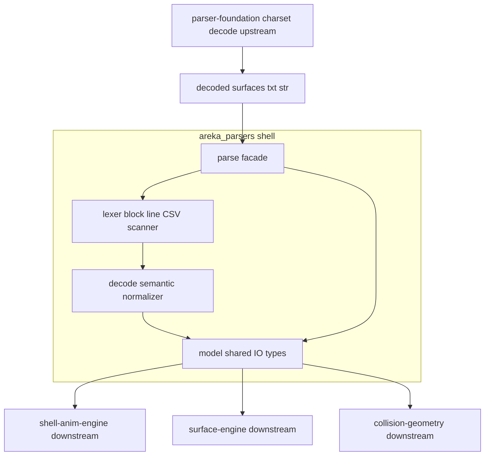
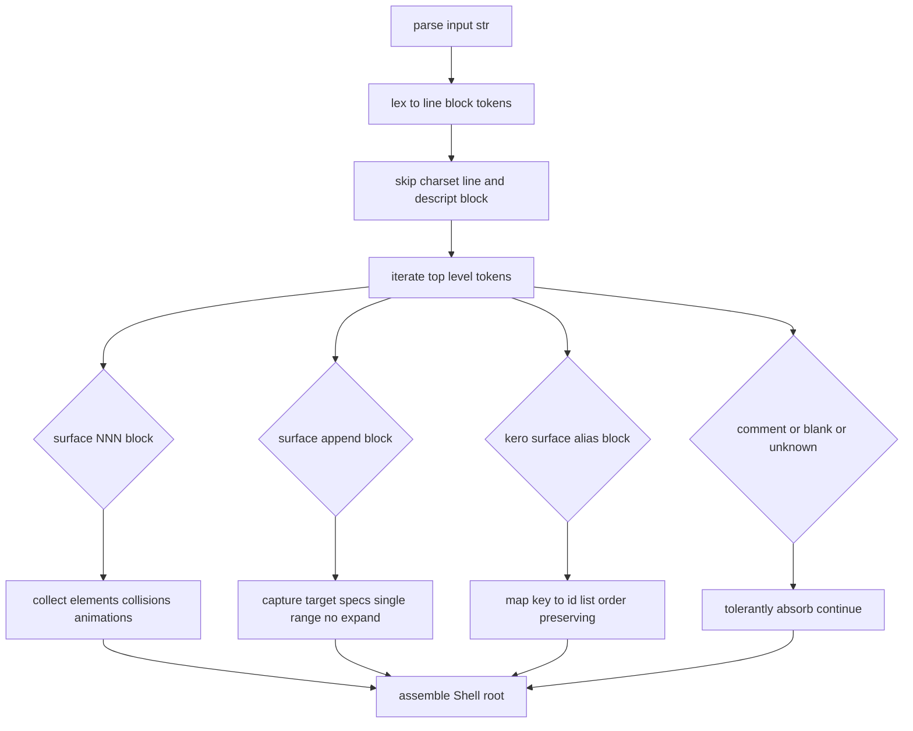

# 技術設計書（Design Document）— areka-P0-shell-parse

## Overview

**Purpose**: 本機能は emo2 の `surfaces.txt`（SERIKO/2.0）を、下流エンジン（`shell-anim-engine` / `surface-engine` / `collision-geometry`）が再パース不要で消費できる**型付きシェルサーフェスモデル**へ変換する純粋関数パーサを、`areka-parsers` クレートへ `shell` モジュールとして追加する。

**Users**: 下流エンジンがモデル型を import して合成・アニメ・collision 消費に用いる。パーサ自体はホスト非依存で、単体テストのみで観測可能（host 不要）。

**Impact**: `areka-parsers` の `lib.rs` に `pub mod shell;` を 1 行追加し、既存 3 兄弟（`charset` / `kv` / `sakura`）と非衝突に並存する。確立済みの `sakura` パターン（`model ← lexer ← decode ← parse` 四層・`Result` 無しの寛容パース・opaque NewType＋read-only accessor・`#[non_exhaustive]` enum・依存は `tracing` のみ・in-source `#[cfg(test)]` テスト）を precise に踏襲する。

### Goals

- emo2 が実際に使う SERIKO/2.0 サブセット（`overlay` メソッド・`bind`/`random,N`/`bind+random,N` interval・矩形 collision・全 offset `0,0`・surface alias 透過）を型付きモデルへ正規化する。
- 下流共有 I/O 契約型を本クレートが所有し、下流の再パースを不要にする（要件 1.2）。
- 寛容パース（`Result` 無し・失敗しない・部分認識を返す）を `sakura` と同一規律で実現する（要件 2）。
- ukadoc（SERIKO/surfaces.txt 正典）準拠の自前 in-source テストで仕様適合を検証し、emo2 fixture は実サンプルのスモークテストとして併用する（要件 10）。

### Non-Goals

- レンダリング・surface 合成（`areka-P0-surface-engine` の領分）。
- アニメ実行・SERIKO ループ・MAYUNA 実行時合成・z-order 実描画（`areka-P0-shell-anim-engine` の領分）。パーサは animation ID を保持するのみで順序付け実行はしない。
- collision → region/actor 写像（`areka-P0-collision-geometry` 増分の領分）。
- emo2 未使用の SERIKO method（`overlayfast`/`base`/`replace`/`interpolate`/`asis`/`move`/`add`/`reduce`）・interval（`sometimes`/`periodic`/`always`/`runonce`/`never`/`talk,n` 等）・`collisionex`（円/楕円/多角形）・element 座標オフセット。
- charset バイト列のデコード（`areka-parsers::charset` 共通基盤の領分。本 parser は UTF-8 デコード済み `&str` を入力に取る）。
- PNG 画像の読み込み・検証（パーサはパス文字列を保持するのみ）。
- **`surface.append` のターゲット範囲展開（`a-b` → 個別 ID 群）と、追記内容の surface 定義ツリーへの転記（流し込み）**。パーサは「これは追記定義であり、対象は〈このターゲット指定（ヘッダ数値・列挙・範囲を第1要素から順に保持）〉である」と転記するのみ。範囲の展開と実サーフェスへの結び付けはツリー構築側（下流）の責務。

## Boundary Commitments

### This Spec Owns

- `areka_parsers::shell` モジュールと、その公開面に集約されるシェルサーフェスモデル型（`Shell` ルート・`Surface`・`Element`・`Animation`・`Interval`・`Pattern`・`Collision`・`SurfaceAppend`・`SurfaceAlias` と opaque NewType `ElementPath` / `AliasKey` / `CollisionName`）。
- 単一公開 facade `pub fn parse(input: &str) -> Shell`（`Result` 無し・寛容パス・純粋決定的）。
- surfaces.txt 固有の構文解析（ブロック `surfaceNNN { ... }` / ドット付きキー `animationN.interval` / 行指向 CSV / `[id,...]` 配列値）と、意味正規化（`animationN` 集約・`surface.append` ターゲット指定捕捉〔範囲は記述子で保持・展開しない〕・alias 写像）。
- 上記モデル型の**正本**（型定義の所有権）。下流はこれを import するのみで再定義しない。

### Out of Boundary

- 上記 Non-Goals のすべて（描画・アニメ実行・collision→actor 写像・charset デコード・PNG 検証）。
- 他 parser（`balloon-parse` / `package-mount`）の領分。
- SERIKO subset 外機能の意味解釈（未対応トークンは寛容に吸収するのみ・値化しない）。

### Allowed Dependencies

- **Upstream**: `areka-parsers` クレート内資産（`sakura` パターンの流儀のみ流用・コードは流用しない）。`areka-P0-parser-foundation`（charset デコード済み `&str` を供給する先行依存・完了済）。
- **外部 crate**: 追加禁止。既存クレート依存（`tracing` のみ・`encoding_rs` は foundation 用で本モジュールは非使用）に限定する（要件 11.2）。
- **依存方向の制約**: モジュール内は `model ← lexer ← decode ← parse` の一方向のみ。逆向き import は許さない（要件 11.1 の公開面集約と整合）。

### Revalidation Triggers

以下の変更は下流（`shell-anim-engine` / `surface-engine` / `collision-geometry`）の再統合確認を要する:

- モデル公開型のシグネチャ変更（フィールド追加/削除・accessor 変更）。`#[non_exhaustive]` variant 追加は後方互換ゆえ再検証不要だが、既存 variant の意味変更は要再検証。
- `parse` の関数シグネチャ変更（入出力型）。
- opaque NewType の accessor 契約変更（`as_str` / `id` 等の read-only 面）。
- surface.append のターゲット保持方針変更（範囲記述子保持 ⇄ parse 時展開の転換・展開責務の parser/下流間の移動）。
- 依存方向の変更（外部 crate 追加・他モジュールへの依存追加）。

## Architecture

### Existing Architecture Analysis

`areka-parsers::sakura` が確立した四層パターンを本モジュールが precise に踏襲する。sakura の実物構造（実読込済）:

- **依存方向**: `model ← lexer ← decode ← parse`（`mod.rs` ヘッダに明記）。
- **`mod.rs`**: 内部 `mod model/lexer/decode/parse` を private に持ち、`pub use model::{...}; pub use parse::parse;` で公開面を一点集約。各層に `#[cfg(test)] mod *_tests;` を併置し、末尾に横断 `validation_tests`。
- **`model.rs`**: フラット enum（`#[non_exhaustive]` + `#[derive(Clone, Debug, PartialEq)]`・`serde`/`Eq`/`Hash` なし）。opaque NewType はフィールド非公開・`new()` ＋ read-only accessor（dola `ActorKey` 流儀）。寛容パススルー variant。
- **`lexer.rs`**: `char_indices` 手書き線形スキャナ。内部トークン enum は `pub(crate)`。未閉じ境界は `Raw` 吸収し走査を中断しない。
- **`decode.rs`**: 構文トークン → 値正規化済みモデル。subset のみ値化し、subset 外は passthrough シームへ委ねる。
- **`parse.rs`**: `pub fn parse(input:&str)->... { decode(lex(input)) }` の一行合成。状態・I/O なし・`Result` なし・空入力で空・純粋決定的。
- **テスト規律**: 公開 `parse` 経由の end-to-end アサーション。**期待値はリテラル直書き**（`include_str!` 不使用＝クレート跨ぎ回避）。

surfaces.txt は sakura（インライン `\tag[args]` 走査）と**構文クラスが異なる**（ブロック構造＋ドット付きキー＋行指向 CSV）。ゆえに lexer/decode の**実体は新規**だが、四層の骨格・規律・思想は完全踏襲する（research §3 Option B）。

### Architecture Pattern & Boundary Map



**Architecture Integration**:
- Selected pattern: **独立四層サブモジュール**（`model ← lexer ← decode ← parse`）。research §3 Option B（sakura 踏襲）を採用。Option A（`kv` 流用）は重複キー潰し・順序喪失・配列値非対応で構造的に不適合ゆえ却下（research §3.A）。Option C（descript のみ kv 委譲）は効果が薄いため不採用（descript は寛容スキップで retain せず、KV パース自体が不要）。
- Domain/feature boundaries: 構文層（lexer）と意味層（decode）を分離。lexer は「行/ブロック/CSV への構文区切り」のみ、decode は「animationN 集約・append 範囲展開・alias 写像」の意味正規化のみ。
- Existing patterns preserved: opaque NewType・`#[non_exhaustive]`・`Result` 無し寛容パース・`tracing` のみ・in-source テスト。
- New components rationale: surfaces.txt はブロック構造ゆえ sakura のインライン走査コードを流用できず、lexer/decode の実体を新規実装する（骨格のみ流用）。
- Steering compliance: `structure.md` の「areka-parsers へ接ぎ木」方針・「過剰実装禁止（emo2 実需で画定・拡張は `#[non_exhaustive]` シームのみ）」に整合。

### Technology Stack

| Layer | Choice / Version | Role in Feature | Notes |
|-------|------------------|-----------------|-------|
| Data / Storage | Rust std（`Vec`/`String`/enum/struct） | モデル型・パーサ内部表現 | 追加 crate なし |
| Infrastructure / Runtime | Rust 2024 edition（`edition.workspace`） | 言語エディション | 既存クレート整合 |
| Logging | `tracing`（既存依存） | 寛容吸収時の debug ログ（任意） | 新規依存追加なし（要件 11.2） |

> 外部依存調査は不要（新規外部 crate なし・純粋 Rust パーサ・host 非依存）。ukadoc SERIKO/2.0 仕様の確認結果は本書 §System Flows・§Data Models に反映済み。

## File Structure Plan

### Directory Structure

```
crates/areka-parsers/src/
├── lib.rs                       # 【変更】pub mod shell; を 1 行追加
└── shell/                       # 【新規】本 spec の中核
    ├── mod.rs                   # 公開面集約（pub use model::{...}; pub use parse::parse;）
    ├── model.rs                 # 下流共有 I/O 契約型（Shell ルート＋各型＋opaque NewType）
    ├── model_tests.rs           # #[cfg(test)] NewType accessor・#[non_exhaustive]・派生の単体
    ├── lexer.rs                 # 構文層（ブロック/行/ドットキー/CSV/[id,...] 配列の pub(crate) トークン化）
    ├── lexer_tests.rs           # #[cfg(test)] 構文区切り・コメント/空行・未閉じ吸収の単体
    ├── decode.rs                # 意味層（animationN 集約・append 範囲展開・alias 写像・subset 値正規化）
    ├── decode_tests.rs          # #[cfg(test)] 値正規化・範囲展開・重複キー保持・疎 pattern の単体
    ├── parse.rs                 # 公開 facade（pub fn parse(&str) -> Shell = decode(lex(input))）
    ├── parse_tests.rs           # #[cfg(test)] 空入力・純粋決定性・facade 結線の単体
    └── validation_tests.rs      # #[cfg(test)] ukadoc 準拠自前断片（主軸）＋emo2 fixture 抜粋スモーク
```

### Modified Files

- `crates/areka-parsers/src/lib.rs` — 既存 `pub mod charset; pub mod kv; pub mod sakura;` に `pub mod shell;` を追加（非衝突・要件 11.1/11.3）。

> 各ファイルは単一責務。lexer は構文区切りのみ、decode は意味正規化のみ、model は型定義のみ、parse は結線のみ。テストは各層に併置し、横断は `validation_tests.rs` に集約する（sakura と同一配置）。

## System Flows

### パース全体フロー（構文層 → 意味層）



**Flow-level decisions**:
- **charset 行 / descript ブロックの寛容スキップ**: 先頭 `charset,VALUE` 行と `descript { ... }` ブロック（fixture では `descript` / `{` / `version,1` / `}` の複数行形）を認識して読み飛ばし、モデルに保持しない（要件 3.1/3.2）。欠落時も既定状態で継続（要件 3.3）。
- **animationN 集約**: `animationN.interval,...` と複数の `animationN.patternM,...` を同一 animation ID `N` の下へ束ねる意味層状態機械。interval 行は始点（ukadoc: 一連 animation 定義で最初に記述）。
- **append ターゲット指定の捕捉（展開しない）**: `surface.appendNNN,tgt,a-b,...` のターゲット指定を、ヘッダ数値 `NNN` を**第1要素**とし後続の列挙・範囲を続けた順序付きリスト（`Single`/`Range` 記述子）として**そのまま保持**する。範囲 `a-b` の個別 ID 展開と、対象 surface ツリーへの転記（流し込み）は下流の責務（要件 7.2・ヘッダ数値の特別扱いはしない）。
- **未知/不正の局所吸収**: 認識できない行/ブロックは吸収して後続の認識可能ブロックのパースを継続する（要件 9.2/9.3）。パニックしない。

## Requirements Traceability

| Requirement | Summary | Components | Interfaces | Flows |
|-------------|---------|------------|------------|-------|
| 1.1 | モデル型を公開面で提供 | model, mod | `pub use` 集約 | — |
| 1.2 | 正規化済み値（再パース不要） | decode, model | 各型 accessor | animationN 集約 |
| 1.3 | 委譲値を opaque NewType＋accessor | model | `ElementPath`/`AliasKey`/`CollisionName` | — |
| 1.4 | 公開 enum を `#[non_exhaustive]` | model | `Interval` 他 | — |
| 1.5 | `Clone`/`Debug`/`PartialEq` 派生・`serde` なし | model | 派生 | — |
| 2.1 | `&str`→`Shell` 公開関数（`Result` なし） | parse | `parse` | パース全体 |
| 2.2 | 空入力で空 `Shell`・非パニック | parse, decode | `parse` | — |
| 2.3 | 不正トークンを寛容保持・全体失敗せず | lexer, decode | `Raw` 相当吸収 | 局所吸収 |
| 2.4 | 純粋・決定的・I/O 非依存 | parse | `parse` | — |
| 3.1 | charset 行を寛容スキップ・非保持 | lexer, decode | — | charset スキップ |
| 3.2 | descript ブロックを寛容スキップ・非保持 | lexer, decode | — | descript スキップ |
| 3.3 | header 欠落でも非失敗 | decode | — | — |
| 3.4 | 将来 header 保持は `#[non_exhaustive]` シーム | model | ルート型拡張余地 | — |
| 4.1 | `surfaceNNN { ... }` を surface 定義へ | lexer, decode, model | `Surface` | surface ブロック |
| 4.2 | element overlay 行をレイヤ/メソッド/パス/座標へ | decode, model | `Element` | — |
| 4.3 | 画像パスを無加工保持・読込しない | model | `ElementPath` | — |
| 4.4 | 複数 element をレイヤ昇順リスト保持 | decode, model | `Surface.elements` | — |
| 4.5 | overlay 以外の element を寛容吸収 | decode | passthrough シーム | 局所吸収 |
| 5.1 | `interval,bind` を `bind` 保持 | decode, model | `Interval::Bind` | animationN 集約 |
| 5.2 | `interval,random,K` を `random`＋K 保持 | decode, model | `Interval::Random` | — |
| 5.3 | `interval,bind+random,K` を保持 | decode, model | `Interval::BindRandom` | — |
| 5.4 | pattern 行を index/参照 ID/wait/座標へ | decode, model | `Pattern` | — |
| 5.5 | 負値参照 ID をレイヤクリア値として保持 | decode, model | `Pattern.surface_id`（`i64`） | — |
| 5.6 | animation ID 保持・順序付け実行しない | model | `Animation.id` | — |
| 5.7 | 3 種以外の interval を寛容吸収 | decode | passthrough シーム | 局所吸収 |
| 6.1 | collision 行を index/矩形/名へ | decode, model | `Collision` | — |
| 6.2 | 領域名を opaque 保持 | model | `CollisionName` | — |
| 6.3 | 矩形以外（collisionex）を寛容吸収 | decode | passthrough シーム | 局所吸収 |
| 7.1 | `surface.appendNNN { ... }` を追記定義（ターゲット指定＋collision/animation）保持 | decode, model | `SurfaceAppend` | append ブロック |
| 7.2 | 複数列挙・範囲ターゲットを記述子で捕捉（展開・転記は下流） | decode, model | `parse_targets`, `AppendTarget` | ターゲット捕捉 |
| 7.3 | 追記の collision/animation を通常と同一表現 | model | 共有 `Collision`/`Animation` | — |
| 8.1 | alias エントリを key→id リスト写像保持 | decode, model | `SurfaceAlias` | alias 写像 |
| 8.2 | alias キーを opaque 保持・非解釈 | model | `AliasKey` | — |
| 8.3 | alias 値を順序付き数値 ID リスト保持 | decode, model | `SurfaceAlias.ids` | — |
| 8.4 | 重複キーを潰さず保持 | model | `Vec<SurfaceAlias>` | alias 写像 |
| 9.1 | コメント/空行を無視 | lexer | — | — |
| 9.2 | 未知行/ブロックを吸収し後続継続 | lexer, decode | passthrough | 局所吸収 |
| 9.3 | 非パニック・部分認識返却 | parse, lexer, decode | — | — |
| 10.1 | ukadoc 準拠自前 in-source テスト | validation_tests | — | — |
| 10.2 | 不確実時は ukadoc を正典参照 | validation_tests | — | — |
| 10.3 | emo2 fixture をスモークテスト併用 | validation_tests | — | — |
| 10.4 | subset 外機能を実装しない | decode | passthrough のみ | — |
| 10.5 | 2 例目まで抽象追加しない | model | `#[non_exhaustive]` シームのみ | — |
| 11.1 | `areka_parsers::shell` へ追加・公開面集約 | mod, lib | `pub mod shell` | — |
| 11.2 | 追加依存なし（`tracing` のみ） | Cargo（無変更） | — | — |
| 11.3 | 兄弟モジュールと非衝突並存 | shell/ | 独立ディレクトリ | — |
| 11.4 | Rust 2024・std 中心 | 全体 | — | — |

## Components and Interfaces

| Component | Layer | Intent | Req Coverage | Key Dependencies | Contracts |
|-----------|-------|--------|--------------|------------------|-----------|
| model | Types | 下流共有 I/O 契約型 | 1, 3.4, 5.5, 8.4, 10.5 | なし（最下層） | State |
| lexer | Syntax | 構文区切り（block/line/CSV/配列/コメント） | 3, 4.1, 9.1, 9.2 | model 非依存の pub(crate) Token | — |
| decode | Semantic | 値正規化・集約・範囲展開・写像 | 2.3, 4.2-4.5, 5, 6, 7, 8 | lexer, model | Service |
| parse | Facade | 公開純粋関数（結線） | 2.1, 2.2, 2.4, 9.3 | lexer, decode, model | Service |
| validation_tests | Test | ukadoc 準拠適合検証＋fixture スモーク | 10 | parse | — |

### Types Layer

#### model

| Field | Detail |
|-------|--------|
| Intent | シェルサーフェスモデルの下流共有 I/O 契約型を定義（型の正本） |
| Requirements | 1.1, 1.2, 1.3, 1.4, 1.5, 3.4, 5.5, 7.2, 8.4, 10.5 |

**Responsibilities & Constraints**
- 全公開型に `#[derive(Clone, Debug, PartialEq)]`（座標に `i64`/`u32` を使い浮動小数を持たないため `Eq`/`Hash` 付与も可能だが、sakura 規律に倣い `serde` は付さず、最小派生に留める）。
- opaque NewType（`ElementPath` / `AliasKey` / `CollisionName`）はフィールド非公開・`new()` コンストラクタ＋read-only accessor（`as_str`）のみ公開（要件 1.3・dola `ActorKey` 流儀）。
- 公開 enum（`Interval`・`AppendTarget`）は `#[non_exhaustive]`（要件 1.4）。将来の interval/method・ターゲット指定種別追加を後方互換に保つ。ルート `Shell` 型も将来の descript header 保持に備えフィールド追加余地を残す（要件 3.4・ただし 2 例目の実需まで追加しない・要件 10.5）。
- 意味の解釈を下流に委譲する値（element パス・alias キー・collision 名）は opaque 保持し、パーサは解釈しない。

**Dependencies**
- Inbound: decode（値を構築）、parse（`pub use` 経由で公開）(P0)
- Outbound: なし（最下層・std のみ）(—)

**Contracts**: State [x]

##### State Management

型スケッチ（Rust・確定契約。実装は本スケッチに従う）:

```rust
/// surfaces.txt 全体のルート集約（下流共有 I/O 契約）。
/// descript ヘッダ・charset は寛容スキップし保持しない（要件 3）。
#[derive(Clone, Debug, PartialEq)]
pub struct Shell {
    /// surfaceNNN 定義（出現順保持）。
    pub surfaces: Vec<Surface>,
    /// surface.append 追記定義（ターゲット指定を記述子で保持〔展開しない〕・出現順保持）。
    pub appends: Vec<SurfaceAppend>,
    /// kero.surface.alias 写像（重複キー保持・出現順保持・要件 8.4）。
    pub aliases: Vec<SurfaceAlias>,
}

/// 1 個の surfaceNNN 定義（要件 4.1）。
#[derive(Clone, Debug, PartialEq)]
pub struct Surface {
    pub id: u32,
    pub elements: Vec<Element>,      // レイヤインデックス昇順（要件 4.4）
    pub collisions: Vec<Collision>,  // 出現順
    pub animations: Vec<Animation>,  // 出現順（ID 順序付け実行は下流・要件 5.6）
}

/// element overlay 行 elementN,overlay,PATH,X,Y（要件 4.2）。
#[derive(Clone, Debug, PartialEq)]
pub struct Element {
    pub layer: u32,        // element の N
    pub path: ElementPath, // 無加工パス（区切り含む・要件 4.3）
    pub x: i64,
    pub y: i64,
}

/// element 画像パスの opaque 中身（読込・検証しない・要件 4.3）。
#[derive(Clone, Debug, PartialEq)]
pub struct ElementPath(String);
impl ElementPath {
    pub fn new(inner: String) -> Self { ElementPath(inner) }
    pub fn as_str(&self) -> &str { &self.0 }
}

/// SERIKO animation（interval＋pattern 群を animation ID で束ねる・要件 5）。
#[derive(Clone, Debug, PartialEq)]
pub struct Animation {
    pub id: u32,
    pub interval: Interval,
    pub patterns: Vec<Pattern>, // pattern index を明示保持（疎許容・要件 5.4）
}

/// interval 3 種（emo2 subset・拡張は non_exhaustive シーム・要件 5.1-5.3/5.7）。
#[non_exhaustive]
#[derive(Clone, Debug, PartialEq)]
pub enum Interval {
    Bind,
    Random { k: u32 },
    BindRandom { k: u32 },
}

/// animationN.patternM,overlay,SURFACE_ID,WAIT,X,Y（要件 5.4/5.5）。
#[derive(Clone, Debug, PartialEq)]
pub struct Pattern {
    pub index: u32,       // patternM の M（疎・連番前提を置かない）
    pub surface_id: i64,  // 負値はレイヤクリア/停止センチネル（要件 5.5・下流解釈）
    pub wait: u32,        // WAIT（ミリ秒・値保持のみ）
    pub x: i64,
    pub y: i64,
}

/// collisionN,LEFT,TOP,RIGHT,BOTTOM,NAME（矩形・要件 6.1/6.2）。
#[derive(Clone, Debug, PartialEq)]
pub struct Collision {
    pub index: u32,
    pub left: i64,
    pub top: i64,
    pub right: i64,
    pub bottom: i64,
    pub name: CollisionName, // opaque（Head/Bust 等・要件 6.2）
}

/// collision 領域名の opaque 中身（意味解釈しない・要件 6.2）。
#[derive(Clone, Debug, PartialEq)]
pub struct CollisionName(String);
impl CollisionName {
    pub fn new(inner: String) -> Self { CollisionName(inner) }
    pub fn as_str(&self) -> &str { &self.0 }
}

/// surface.append 追記定義（ターゲット指定は記述子で保持・展開しない・要件 7）。
/// collision/animation は通常 surface と同一型（要件 7.3）。
#[derive(Clone, Debug, PartialEq)]
pub struct SurfaceAppend {
    /// ターゲット指定（ヘッダ数値を第1要素とする単一/範囲の順序付きリスト）。
    /// 範囲の個別 ID 展開・実 surface ツリーへの転記は下流の責務（要件 7.2）。
    pub targets: Vec<AppendTarget>,
    pub collisions: Vec<Collision>,
    pub animations: Vec<Animation>,
}

/// surface.append のターゲット指定要素（parse 時展開しない・要件 7.2）。
/// `surface.append10,2100-2110` → `[Single(10), Range{start:2100,end:2110}]`。
/// ヘッダ数値も列挙要素と同格の第1要素（カテゴリ番号等の特別扱いはしない）。
#[non_exhaustive]
#[derive(Clone, Debug, PartialEq)]
pub enum AppendTarget {
    /// 単一 surface ID。
    Single(u32),
    /// 範囲指定 `a-b`（両端含む・展開は下流のツリー構築側が担う）。
    Range { start: u32, end: u32 },
}

/// kero.surface.alias の 1 エントリ KEY,[id,...]（要件 8）。
#[derive(Clone, Debug, PartialEq)]
pub struct SurfaceAlias {
    pub key: AliasKey,   // opaque（数値・日本語いずれも・要件 8.2）
    pub ids: Vec<u32>,   // 順序付き数値 ID（要件 8.3）
}

/// alias キーの opaque 中身（意味解釈しない・要件 8.2）。
#[derive(Clone, Debug, PartialEq)]
pub struct AliasKey(String);
impl AliasKey {
    pub fn new(inner: String) -> Self { AliasKey(inner) }
    pub fn as_str(&self) -> &str { &self.0 }
}
```

**Implementation Notes**
- Integration: 下流は本型を import して消費。`Pattern.surface_id: i64` は負値センチネル（ukadoc: `-1` = 当該アニメ停止、`-2` = 全停止）を失わずに保持し、「レイヤクリア」の意味付けは下流に委ねる（要件 5.5）。
- Validation: 数値パース失敗（非数トークン）は寛容に既定値（`0` 等）へ倒すか passthrough とし、パニックしない（要件 2.3・decode の責務）。
- Risks: `Shell` へ descript header フィールドを足したくなる誘惑があるが、2 例目の実需まで追加しない（要件 10.5）。

### Syntax Layer

#### lexer

| Field | Detail |
|-------|--------|
| Intent | surfaces.txt を構文トークン（ブロック/行/ドットキー/CSV/配列/コメント）へ区切る |
| Requirements | 3.1, 3.2, 4.1, 9.1, 9.2 |

**Responsibilities & Constraints**
- `char_indices` 手書き線形スキャナ（sakura 流儀）。行指向で走査し、`//` コメント行・空行を無視（要件 9.1）。
- ブロック境界 `{` / `}` を認識してブロック単位（`surfaceNNN` / `surface.appendNNN,...` / `descript` / `kero.surface.alias`）へ区切る。fixture の複数行形（`descript` と `{` が別行）を許容する。
- ブロック内の行を CSV（カンマ分割）・ドット付きキー（`animationN.interval` の `N` と `.interval` を分離可能な形）・`[id,...]` 配列値へ字句分割する。意味割当は行わない（decode の責務）。
- 内部トークン enum は `pub(crate)`（モジュール外非公開）。未閉じブロック・未知行は `Raw` 相当で吸収し走査を中断しない（要件 9.2）。

**Dependencies**
- Inbound: decode（トークン列を消費）(P0)
- Outbound: なし（model 非依存・std のみ）(—)

**Contracts**: なし（内部 pub(crate) トークンのみ・公開契約なし）

**Implementation Notes**
- Integration: sakura の走査コードは流用不可（構文クラス相違）。骨格・`Raw` 吸収思想のみ流用。
- Validation: 未閉じ `{`・未知先頭語・欠損フィールドで走査を止めない（局所吸収・全域継続）。
- Risks: `surface.appendNNN,tgt,a-b` のヘッダ行は「ブロックヘッダ」かつ「CSV ターゲット列」の二役ゆえ、ヘッダ行と本体行の区別を lexer で明瞭に切ること。

### Semantic Layer

#### decode

| Field | Detail |
|-------|--------|
| Intent | 構文トークンを値正規化済みモデルへ写像（集約・範囲展開・写像・subset 値化） |
| Requirements | 2.3, 4.2-4.5, 5, 6, 7, 8 |

**Responsibilities & Constraints**
- **charset 行 / descript ブロックのスキップ**: retain せず読み飛ばす（要件 3.1/3.2/3.3）。
- **surface ブロック decode**: element/collision/animation 行を対応型へ。element はレイヤ昇順で保持（要件 4.4）。overlay 以外の element method は寛容吸収（要件 4.5）。
- **animationN 集約**: `animationN.interval` と複数 `animationN.patternM` を同一 ID `N` の `Animation` へ束ねる状態機械。interval が始点（ukadoc 準拠）。pattern index は明示保持し疎を許容（要件 5.4・fixture に `pattern1/2/3` のみの例あり）。3 種以外の interval は寛容吸収（要件 5.7）。
- **append ターゲット指定の捕捉（展開しない）**: `parse_targets` がヘッダ数値 `NNN`・単一 ID・`a-b` 範囲を、出現順の `Vec<AppendTarget>`（`Single`/`Range`）へ**そのまま捕捉**する。ヘッダ数値は第1要素として一様に扱い、範囲の個別 ID 展開・実 surface ツリーへの転記は下流に委ねる（要件 7.2）。collision/animation は通常 surface と同一型で保持（要件 7.3）。
- **alias 写像**: 各 `KEY,[id,...]` を `SurfaceAlias` へ。キーは opaque、値は順序付き数値 ID（要件 8.1-8.3）。重複キーは潰さず `Vec` に全出現保持（要件 8.4）。
- **寛容吸収**: subset 外・不正・collisionex は passthrough シーム（明示関数）へ委ね、値を詐称せず・パニックせず・後続継続（要件 2.3/6.3/9.2/10.4）。

**Dependencies**
- Inbound: parse（`decode(lex(input))` で結線）(P0)
- Outbound: lexer（トークン型）、model（構築対象型）(P0)

**Contracts**: Service [x]

##### Service Interface

```rust
// mod 内 pub(crate)。parse が結線する。
pub(crate) fn decode(tokens: Vec<Token>) -> Shell;

// append ターゲット指定を記述子リストへ捕捉（展開しない・要件 7.2）。
// ヘッダ数値を第1要素とし後続列挙・範囲を続ける。
// 入力例: header="10", rest=["2100-2110", "2200-2210"]
//   -> [Single(10), Range{2100,2110}, Range{2200,2210}]
fn parse_targets(header: &str, rest: &[String]) -> Vec<AppendTarget>;
```

- Preconditions: `tokens` は lexer 出力（構文区切り済み）。
- Postconditions: 全トークンがいずれかの `Shell` 構成へ吸収され、未 decode 断片を残さない（要件 1.2）。出現順を保持（要件 4.4/8.4）。
- Invariants: 失敗しない（`Result` でない・エラー送出しない・要件 2.3）。同一入力で同一出力。

**Implementation Notes**
- Integration: `parse_targets` はターゲット指定を**転記するのみで展開しない**。`surface.append<キーワード>` 直後の数値は、ukadoc の surface スコープ id リスト文法（`surface0-2` が先頭 `0` を含む 0,1,2 と一様に解釈される）に従い**id リストの第1要素**として扱う。ゆえに `surface.append10,2100-2110,2200-2210` → `[Single(10), Range{2100,2110}, Range{2200,2210}]`、`surface.append2200 { ... }` → `[Single(2200)]`。ヘッダ数値を「カテゴリ番号」として除外する二役分岐は設けない（emo2 で surface 10 が未定義でも、実在しない対象への append を無視するのは下流の役割であり、パーサは指定を忠実に保持する）。範囲 `a-b` の inclusive 展開（`surface0-2`=0,1,2 の根拠）は下流のツリー構築側が担う。
- Validation: 非数トークン・欠損フィールドは既定値へ倒すか passthrough（要件 2.3）。
- Risks: animationN 集約で interval 前に pattern が来る崩れた入力でも、後から interval を紐付けるか既定 interval で吸収してパニックしない。

### Facade Layer

#### parse

| Field | Detail |
|-------|--------|
| Intent | 公開純粋関数（lexer→decode 結線・状態/I/O なし） |
| Requirements | 2.1, 2.2, 2.4, 9.3 |

**Responsibilities & Constraints**
- `pub fn parse(input: &str) -> Shell { decode(lex(input)) }` の一行合成（sakura `parse` と同型）。
- 空入力 → 空 `Shell`（要件 2.2）。純粋・決定的・host 非依存（要件 2.4）。`Result` を返さない・パニックしない（要件 2.1/9.3）。

**Dependencies**
- Inbound: 下流エンジン・`validation_tests`（`pub use` 経由で呼ぶ）(P0)
- Outbound: lexer, decode, model (P0)

**Contracts**: Service [x]

##### Service Interface

```rust
pub fn parse(input: &str) -> Shell;
```

- Preconditions: `input` は UTF-8 デコード済み（charset は上流 foundation が担う・要件境界）。
- Postconditions: 部分認識を含む `Shell` を常に返す。空入力で空 `Shell`。
- Invariants: 純粋・決定的・副作用なし・非パニック。

**Implementation Notes**
- Integration: `mod.rs` が `pub use parse::parse; pub use model::{Shell, Surface, Element, ElementPath, Animation, Interval, Pattern, Collision, CollisionName, SurfaceAppend, AppendTarget, SurfaceAlias, AliasKey};` で公開面集約（要件 11.1）。
- Validation: `parse("")` が空 `Shell`・`parse(fixture)` が非パニックであることを test で担保。
- Risks: なし（結線のみ）。

## Data Models

### Domain Model

- **集約ルート**: `Shell`。子 `Surface` / `SurfaceAppend` / `SurfaceAlias` は `Shell` に所有され、トランザクション境界は「1 回の `parse` 呼び出し」。
- **不変条件**:
  - `Element.layer` はレイヤインデックス昇順で `Surface.elements` に格納（要件 4.4）。
  - `SurfaceAppend.targets` は範囲記述子（`Single`/`Range`）を出現順・重複可で保持（展開・転記は下流）。
  - `SurfaceAlias` は出現順・重複キー保持（要件 8.4）。
  - `Pattern.index` は疎（連番前提を置かない・要件 5.4）。
  - opaque NewType（`ElementPath`/`AliasKey`/`CollisionName`）の中身は無加工・read-only。

### ukadoc 正典に基づく行文法（decode 正規化の根拠）

ukadoc（SERIKO/surfaces.txt 正典・MCP 参照）で確定した行文法:

| 記述 | ukadoc 文法 | 本モデルへの写像 |
|------|-------------|------------------|
| collision | `collision*,始点X,始点Y,終点X,終点Y,ID` | `Collision { index=*, left=始点X, top=始点Y, right=終点X, bottom=終点Y, name=ID(opaque) }` |
| pattern | `animation*.pattern*,描画メソッド,サーフェス番号,ウェイト,X,Y` | `Pattern { index, surface_id, wait, x, y }`。負サーフェス番号（`-1`/`-2`）はセンチネル保持（要件 5.5） |
| interval | `animation*.interval,インターバル`（`+` で組合せ・SSP のみ） | `Interval::Bind` / `Random{k}` / `BindRandom{k}`（emo2 3 種のみ・要件 5.7 で他は吸収） |
| overlay | `overlay`（ベースへ新規レイヤ重ね） | element/pattern の method 判定（overlay のみ値化・他は吸収） |
| 範囲 | `surface0-2` 記法は 0,1,2 を意味（inclusive） | `AppendTarget::Range` の意味（両端含む）の根拠。展開は下流（要件 7.2） |
| alias/name | `name,定義名` は `surface.alias` と同様 `\s[]` で ID 代替 | alias キーは opaque・`\s[]` 中身は非解釈（要件 8.2） |

> 上記は decode の値正規化の**正典根拠**。emo2 fixture は最小適合サンプルであり、書式の聖典ではない（要件 10.2）。

## Error Handling

### Error Strategy

本パーサは**寛容パース**であり、`Result` もエラー送出も持たない（要件 2.1/2.3）。sakura と同一の「局所吸収・全域継続」戦略を採る:

- **構文的に区切れない断片**（未閉じブロック・未知先頭語）: lexer が `Raw` 相当で吸収し走査を中断しない（要件 9.2）。
- **意味未対応トークン**（overlay 以外の method・3 種以外の interval・collisionex・subset 外行）: decode の passthrough シームで吸収し、値化せず・パニックせず・後続を継続（要件 4.5/5.7/6.3/10.4）。
- **数値パース失敗**（非数トークン・欠損フィールド）: 既定値へ倒す（sakura の `unwrap_or(0)` 流儀）。情報を詐称せず・パニックしない（要件 2.3）。

### Error Categories and Responses

| カテゴリ | 例 | 応答 |
|----------|-----|------|
| 構文断片 | 未閉じ `{` | `Raw` 吸収・走査継続 |
| 意味未対応 | `element0,base,...` | passthrough 吸収・当該行を値化しない |
| 数値不正 | `collision0,x,y,...`（非数） | 既定値（0）へ倒す・非パニック |
| 欠損 | フィールド不足 | 既定値・部分認識 |

### Monitoring

- `tracing` の `debug!`/`trace!` で吸収イベント（未対応 method/interval・未閉じブロック）を任意ログ（既存依存のみ・要件 11.2）。ログは観測補助であり挙動に影響しない。

## Testing Strategy

> **正典 = ukadoc**。テストは ukadoc 準拠の**自前 in-source 断片**を主軸とし、emo2 fixture は実サンプルのスモークテストとして併用する（要件 10.1-10.3）。クレート跨ぎの `include_str!` は自前断片を用いる以上そもそも不要（sakura 規律に整合）。期待値はリテラル直書き。

### Unit Tests（各層併置・ukadoc 準拠自前断片が主軸）

1. **model_tests**: opaque NewType（`ElementPath`/`AliasKey`/`CollisionName`）の `new()`/`as_str()` read-only 契約（要件 1.3）、`Interval` の `#[non_exhaustive]` パターン網羅、`Clone`/`Debug`/`PartialEq` 派生（要件 1.4/1.5）。
2. **lexer_tests**: `//` コメント行・空行の無視（要件 9.1）、`surfaceNNN { ... }` ブロック区切り、複数行 `descript` ブロック区切り、未閉じ `{` の `Raw` 吸収（要件 9.2）。ukadoc 準拠の最小ブロック断片を自作。
3. **decode_tests**:
   - element overlay `element0,overlay,path.png,0,0` → `Element{layer:0, path, x:0, y:0}`、複数 element のレイヤ昇順（要件 4.2/4.4）。
   - interval 3 種 `bind`/`random,4`/`bind+random,4` → 各 `Interval` variant（要件 5.1-5.3）。
   - pattern `overlay,1100,0,0,0` と負 ID `overlay,-1,80,0,0` → `Pattern{surface_id:-1,...}`（要件 5.4/5.5）。
   - 疎 pattern（`pattern1`/`pattern2`/`pattern3` のみ・`pattern0` 欠番）→ index 明示保持（要件 5.4）。
   - collision `collision0,93,62,271,130,Head` → 矩形＋opaque 名（要件 6.1/6.2・ukadoc `始点/終点` 順）。
   - `parse_targets("10", ["2100-2110","2200-2210"])` → `[Single(10), Range{2100,2110}, Range{2200,2210}]`（展開せず記述子保持・ヘッダ数値は第1要素・要件 7.2）、`parse_targets("2200", [])` → `[Single(2200)]`。
   - alias `静観,[2106,2206]`（日本語キー opaque）・`6,[2106,2206]`（数値キー opaque）・重複キー（`100` 2 回）保持（要件 8.2/8.3/8.4）。
4. **parse_tests**: `parse("")` → 空 `Shell`（要件 2.2）、同一入力の決定性（要件 2.4）、facade 結線。

### Integration / Validation Tests（validation_tests.rs）

1. **ukadoc 準拠通し断片（主軸）**: surface 定義＋element＋collision＋animation（bind/random/bind+random）＋surface.append（範囲）＋alias（重複キー）＋負 ID＋コメント/空行を含む最小 `surfaces.txt` 断片を自作し、公開 `parse` 経由で `Shell` 全構成を end-to-end 検証（要件 10.1）。期待値リテラル直書き。
2. **emo2 fixture スモーク**: `crates/pilot/examples/shiori-host-32/fixtures/emo2/shell/master/surfaces.txt` の**代表抜粋をリテラル直書き**（クレート跨ぎ `include_str!` 回避）で parse し、(a) パニックしない、(b) スコープ内機能（surface/element/animation/collision/append/alias）を解釈し切ることを確認（要件 10.3）。唯一の適合基準とはしない（要件 10.2）。
3. **subset 外吸収**: overlay 以外の method・3 種以外の interval・collisionex を含む断片が吸収され、隣接する認識可能ブロックのパースを壊さないこと（要件 4.5/5.7/6.3/9.2）。

## Supporting References

- research.md §3（Option A/B/C 比較・Option B 採用根拠）・§4（要研究 6 項目の解決）・§6（設計決定申し送り）。
- ukadoc（SERIKO/surfaces.txt 正典・MCP `mcp__ukadoc__*` 参照）: `collision*,始点X,始点Y,終点X,終点Y,ID` / `animation*.pattern*,描画メソッド,サーフェス番号,ウェイト,X,Y`（負サーフェス番号 `-1`=停止/`-2`=全停止）/ `animation*.interval`（`+` 組合せ）/ `overlay`（新規レイヤ重ね）/ `surface0-2`（範囲=0,1,2 inclusive）。
- `doc/emo2-conformance-scope.md` §2（emo2 SERIKO 実需・interval 3 種・overlay のみ・矩形 collision・全 offset 0,0・alias 不透明）— emo2 スコープの補助資料。
