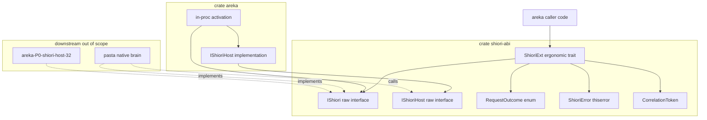
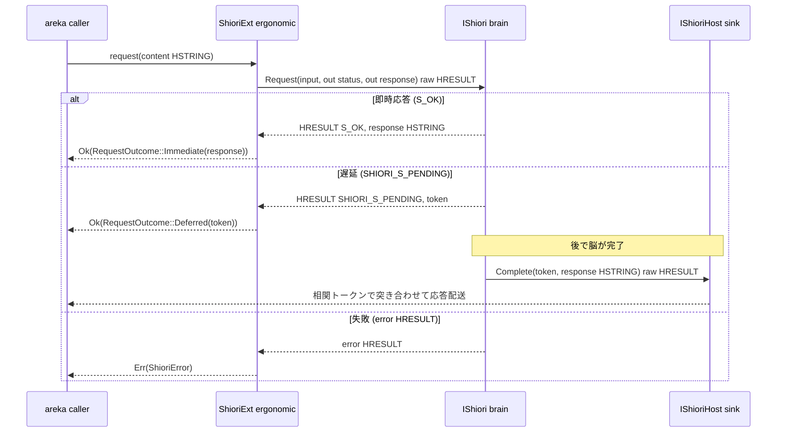
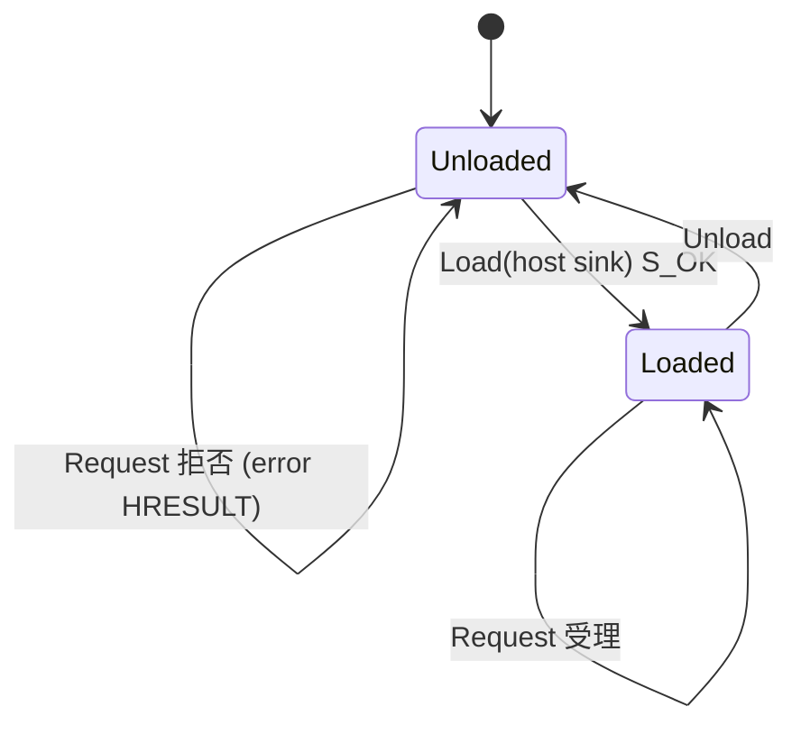

# 技術設計書: areka-P0-shiori-com

> 上位設計の正本: `doc/COMPAT_ARCHITECTURE.md` §5。
> 本書は要件（WHAT, `requirements.md`）を HOW へ翻訳した設計である。調査ログ・比較・出典は `research.md` を参照（結論は本書に再掲し、本書単体でレビュー可能とする）。

## Overview

**Purpose**: 本仕様は、areka 本体と「脳（SHIORI）」の境界となる**内部唯一の抽象境界 `IShiori`（カスタム COM インターフェイス）**と、その能動通知・遅延応答経路 `IShioriHost`（sink インターフェイス）を定義する。これにより、ネイティブ脳（pasta）と過去互換 DLL という性質の異なる実装を、呼び出し側から見て**完全に同一視**できるようにし、areka 本体コードに「ネイティブ／過去互換」の分岐を一切露出させない。

**Users**: areka 本体（`IShiori` の消費側）、ネイティブ脳実装者（pasta／`IShiori` の実装側）、下流 `areka-P0-shiori-host-32`（過去互換 DLL を同 `IShiori` で実装する別バイナリ）が本 ABI を利用する。

**Impact**: 現状 areka は windows-rs 経由で既存 COM を「消費」「実装（`#[implement]`）」する流儀は確立しているが、**自前 GUID/vtable を持つカスタム COM インターフェイスを `#[interface]` で「定義」した実績はゼロ**。本仕様はこのプロジェクト初の技法（カスタム COM 定義）を、最小依存の独立 ABI クレート `crates/shiori-abi` として導入する。

### Goals
- `IShiori`（ライフサイクル load/unload・リクエスト request〔同期呼び出し＋即時/遅延/失敗〕）と `IShioriHost`（能動通知 Raise・遅延応答 Complete）を、HSTRING/UTF-16・WinRT 非依存・OOP マーシャリング非要求のカスタム COM インターフェイスとして定義する。
- 実装種別差を**アクティベーション経路にのみ局所化**し、確立済みの `IShiori` 利用面へ波及させない（R1-5）。
- 生 `#[interface]`（`unsafe fn -> HRESULT`）の上に、Rust 風の `Result<RequestOutcome, ShioriError>` を返す**エルゴノミック変換層**を手書きで被せる 2 層構造（D4）。
- 下流（32bit ホスト・pasta）が同一 ABI クレートに依存して同 `IShiori` を実装できる物理境界を確立する（R5-4・隣接期待）。

### Non-Goals
- 過去互換 DLL（32bit shiori.dll 等）のホスティング → `areka-P0-shiori-host-32`。
- さくらスクリプト／json-rpc 本文の解釈・実行 → 別仕様。本仕様では content は不透明な HSTRING として扱う（R1-6）。
- 毎秒ポーリング（OnSecondChange）等、SHIORI を駆動する上位タイミングロジック。
- SAORI、過去互換のための独自 IPC、OOP 自動マーシャリング、out-of-proc COM 経路。
- x86（32bit）でのネイティブ脳直結（本仕様は x64／CPU ネイティブ前提・R5-3）。
- ABI の後方互換保証・明示的バージョニング機構（D7：リリースまで流動的契約。lockstep 再ビルドで緩和、互換規律はリリース前マイルストーン／別仕様）。

## Boundary Commitments

### This Spec Owns
- **`IShiori` インターフェイス面の定義**: load / unload / request の COM メソッド契約（メソッドシグネチャ・HSTRING 引数戻り値・HRESULT 規約・未ロード時 request 拒否のセマンティクス）。
- **`IShioriHost`（sink）インターフェイス面の定義**: 能動通知 Raise と遅延リクエスト完了 Complete の COM メソッド契約。
- **2 層 ABI 構造**: 生 COM vtable 層（`#[interface]`）と、その上の Rust エルゴノミック変換トレイト（`RequestOutcome` / `ShioriError` を返す）。後者は ABI 非公開の Rust 内部表現。
- **ネイティブ in-proc アクティベーション経路の契約面**: 追加 IPC を介さず同一プロセス内で `IShiori` 実装へ到達する経路の定義（脳が `IShiori` を直接実装し、areka 本体が `IShioriHost` を実装して load 時に受け渡す）。
- **正準 content プロトコルの選定**: `IShiori`/`IShioriHost` 境界の単一正準プロトコルとして json-rpc 2.0 を採用する選定判断（D5）。ABI 上は不透明 HSTRING のまま運ぶ。
- **相関トークン契約**: 遅延リクエストと後続完了応答を突き合わせるトークンの型・寿命・採番方針。
- **エラー HRESULT 規約**: 成功（即時/遅延）・失敗の HRESULT マッピングと、`com-resource-naming-unification` 整合の命名。

### Out of Boundary
- json-rpc 本文・さくらスクリプトのパース／意味解釈（content は不透明）。
- 過去互換 DLL ホスティング・32bit プロセス・自前 IPC・HGLOBAL／Charset 変換 → `areka-P0-shiori-host-32`。
- 毎秒ポーリング等の上位駆動ロジック・脳の選択／生成ポリシー（どの脳を起動するかの判断）。
- OOP 自動マーシャリング・out-of-proc proxy/stub 登録・WinRT ランタイム初期化。
- 互換バージョニング機構（新 IID 追加＋`QueryInterface`、protocol version）。

### Allowed Dependencies
- `windows-core` 0.62.2（workspace 固定）— `#[interface]` / `#[implement]` / `HSTRING` / `IUnknown` / `HRESULT` / `Result`。
- `windows` 0.62.2 の `Win32_System_Com`（COM 基盤・既に有効）。必要範囲のみ。
- `thiserror` 2（内部エラー enum）。
- 依存方向は **`shiori-abi`（ABI 定義・最小依存） → areka 本体（in-proc 配線・`IShioriHost` 実装）** の一方向。`shiori-abi` は `wintf`/`dola`/`bevy_ecs` に依存しない（下流 32bit ターゲットでビルド可能に保つため）。

### Revalidation Triggers
以下の変更は、下流（`areka-P0-shiori-host-32`・pasta・areka 本体の配線）の再検証を要する（D7：流動契約のため lockstep 再ビルドで対応）。
- `IShiori` / `IShioriHost` のメソッド面・引数順・HSTRING 取り回し規約の変更。
- 相関トークンの型・寿命・採番ポリシーの変更。
- HRESULT 成功/失敗マッピング（`SHIORI_S_PENDING` 等カスタムコード）の変更。
- 正準 content プロトコル（json-rpc 2.0）採用判断の変更。
- 依存方向・ABI クレート分割境界の変更。
- IID の変更（リリース前は IID 変動も lockstep 対象。リリース時に凍結＋新 IID 規律へ移行）。

## Architecture

### Existing Architecture Analysis

- ワークスペースはマルチクレート `crates/*`（`wintf`/`dola`/`areka`）。COM ラッパー層は `crates/wintf/src/com/`、`unsafe` は COM 層へ集約、依存方向 **COM → ECS → Message Handling** を厳守（steering structure.md）。
- COM の既存実績: 既存型の「消費」多数、`#[implement]` の唯一例は `crates/wintf/src/com/d2d/command_sink.rs`（`#[implement(ID2D1CommandSink5)]`）。**カスタム `#[interface]` 定義は実績ゼロ**（research §1.2）。
- HSTRING は wintf 内で広く使用。`windows-core` の `HSTRING` は純 Rust 実装で WinRT 非依存・`RoInitialize` 不要（research 確認済み・正本 §5）。
- エラー規約: Windows API 境界は `windows::core::Result`、内部は `thiserror` enum + `#[from]`（R7 と素直に整合）。

**維持する境界**: `shiori-abi` は `wintf` の COM ラッパー層とは別クレートとし、UI 基盤（wintf）と脳 ABI のドメインを分離する。これは下流 32bit ホストが `wintf` 全体を引き込まず ABI のみ共有するための分割（research §3 Option B/C）。

### Architecture Pattern & Boundary Map

**選定パターン**: 2 層 ABI（Raw COM vtable 層 + ergonomic Rust 変換層）+ 独立 ABI クレート（research §3 Option C ハイブリッド）。理由: (1) R1 の「実装種別差をアクティベーション経路にのみ局所化」をクレート/層境界で構造化、(2) windows-rs のカスタム `#[interface]` は `_Impl` トレイトでも raw `unsafe fn -> HRESULT` のままで自動エルゴノミクスが付かない（research §2）ため、人間向け `Result` 変換層を手書きする必然がある。



**Architecture Integration**:
- 選定パターン: 独立 ABI クレート + 2 層（raw vtable / ergonomic）。
- ドメイン境界: ABI 契約（`shiori-abi`） ⇄ in-proc 配線・sink 実装（areka 本体）。実装種別差は areka 本体側のアクティベーション経路のみに局在（R1-5）。
- 維持する既存パターン: `windows-core` の `#[interface]`/`#[implement]`、`Result`/`thiserror` エラー規約、`I` プレフィックス COM 命名。
- 新コンポーネント根拠: `shiori-abi` は下流が `wintf` 非依存で同 ABI を実装するために必要。ergonomic 層は raw `unsafe fn -> HRESULT` を呼び出し側に露出させないために必要。
- steering 準拠: `unsafe` を ABI 層へ集約、依存方向の一方向化、命名規約整合。

### Technology Stack

| Layer | Choice / Version | Role in Feature | Notes |
|-------|------------------|-----------------|-------|
| ABI / COM 定義 | `windows-core` 0.62.2 | `#[interface]` でカスタム COM 定義、`#[implement]` で実装、`HSTRING`/`HRESULT`/`Result` | workspace 固定。新規クレート `shiori-abi` が依存 |
| COM 基盤 | `windows` 0.62.2 (`Win32_System_Com`) | `IUnknown`・COM 基盤型 | 既に有効。`shiori-abi` は必要 feature のみ |
| エラー型 | `thiserror` 2 | 内部 `ShioriError` enum 定義 | 全クレート共通規約 |
| 正準 content protocol | json-rpc 2.0（仕様採用・実装は別仕様） | request/応答/通知の本文表現の選定 | 本仕様は採用判断のみ。ABI 上は不透明 HSTRING |
| ターゲット | x64 / CPU ネイティブ | in-proc 直結前提 | x86 はスコープ外（R5-3） |

> 詳細な調査・比較（windows-rs `#[interface]` の正確な利用形、HSTRING の純 Rust 実装確認、json-rpc 採用理由）は `research.md` §4・§7 を参照。

## File Structure Plan

### Directory Structure
```
crates/shiori-abi/                 # 新規クレート: SHIORI ABI 定義のみ（最小依存・wintf 非依存）
├── Cargo.toml                     # windows-core / windows(Win32_System_Com) / thiserror への最小依存
└── src/
    ├── lib.rs                     # 公開 re-export（IShiori, IShioriHost, RequestOutcome, ShioriError, CorrelationToken, ShioriExt, HRESULT 定数）
    ├── interface.rs               # raw COM 層: #[interface("IID")] による IShiori / IShioriHost 定義（unsafe fn -> HRESULT）
    ├── ergonomic.rs               # ergonomic 層: ShioriExt トレイト（&IShiori に対する Result<RequestOutcome, ShioriError> 変換）
    ├── outcome.rs                 # RequestOutcome enum（Immediate(HSTRING) / Deferred(CorrelationToken)）・CorrelationToken 型
    ├── error.rs                   # ShioriError（thiserror）・HRESULT ⇄ ShioriError 変換・カスタム HRESULT 定数（SHIORI_S_PENDING 等）
    └── tests.rs                   # in-source 単体テスト（ラウンドトリップ・HRESULT マッピング・モック実装の vtable 呼び出し）
```

`shiori-abi/src/tests.rs` 内、または `crates/shiori-abi/tests/` に、`#[implement(IShiori)]` のモック脳を立てて in-proc で `ShioriExt` を呼び出し HSTRING がマーシャリングなしで往復することを検証する結合テストを置く。

### Modified Files
- `Cargo.toml`（workspace root）— `members = ["crates/*"]` のグロブにより `crates/shiori-abi` は自動的に member 化されるため**変更不要**。必要なら `[workspace.dependencies]` に `shiori-abi` のパスエントリを追加（areka 本体が依存するため）。
- `crates/areka/Cargo.toml` — `shiori-abi`（path 依存）を追加。in-proc アクティベーション配線と `IShioriHost` 実装が利用。
- `crates/areka/src/`（配線モジュール）— **本仕様のスコープ外の配線詳細は下流／後続だが**、ABI 定義の受け皿として `IShioriHost` の areka 側実装と最小の in-proc アクティベーション関数を置く（責務は「`IShiori` 実装へ到達し、load 時に sink を渡す」最小経路まで）。

> 各ファイルは単一責務: `interface.rs` = ABI vtable、`ergonomic.rs` = 安全変換、`outcome.rs` = データ型、`error.rs` = エラー/HRESULT。raw 層と ergonomic 層を分離することで、ABI 公開面（raw）と Rust 内部表現（ergonomic/RequestOutcome）の境界を物理的に明示する（D4）。

## System Flows

### リクエスト: 即時 / 遅延 / 失敗（同期呼び出し＋遅延コールバック）



- COM ABI レベルでは `async fn` を公開できないため、`request` は**同期メソッド呼び出し**としてモデル化し、結果を即時/遅延/失敗の 3 値で返す（R3-1〜3・D1）。
- 区別方式（D1）: 成功 HRESULT を分ける — `S_OK`=即時応答あり、カスタム成功コード `SHIORI_S_PENDING`=遅延、失敗=error HRESULT。応答 HSTRING と相関トークンは out-param で受ける。これにより呼び出し側は HRESULT で 3 値を機械的に判別可能（R3-5）。
- 遅延完了は `Raise` とは別メソッド `Complete(token, response)` で `IShioriHost` へ配送（R6-4）。単一 sink が能動通知と遅延応答の双方を受ける（R6-1）。

### ライフサイクル（load / unload と sink 受け渡し）



- `Load` は areka 実装の `IShioriHost`（sink）を引数で受け渡す機会を提供（R6-2）。sink は脳が能動通知・遅延応答に使用。
- 未ロード状態の `Request` は有効処理として受理せず、error HRESULT で拒否（R2-4）。状態の所有者は脳実装側（`IShiori` 実装内）とする — ABI は状態を保持せず、拒否を HRESULT で表現する契約のみを定める。
- sink ライフタイム: `Load` で渡された `IShioriHost` は COM 参照カウントで管理。脳⇄host 循環参照を避けるため、host は areka 本体が所有し脳へは借用相当（`IShioriHost` ポインタ）を渡す。脳は保持期間中 AddRef/Release を遵守する。

## Requirements Traceability

| Requirement | Summary | Components | Interfaces | Flows |
|-------------|---------|------------|------------|-------|
| 1.1 | `IShiori` を唯一の内部契約として定義 | shiori-abi/interface.rs | `IShiori` | — |
| 1.2 | 全操作を `IShiori` メソッド呼び出しで表現 | interface.rs, ergonomic.rs | `IShiori`, `ShioriExt` | リクエスト, ライフサイクル |
| 1.3 | 実装種別問わず同一メソッド面 | interface.rs | `IShiori` | — |
| 1.4 | 面に実装種別分岐を持たない | interface.rs | `IShiori` | — |
| 1.5 | 差異をアクティベーション経路に局所化 | areka 配線（活性化）, interface.rs | activation | アーキ図 |
| 1.6 | 単一正準 content プロトコル（不透明 HSTRING） | error.rs/lib.rs（採用判断）, outcome.rs | json-rpc 2.0 選定 | — |
| 2.1 | load 提供 | interface.rs, ergonomic.rs | `IShiori::Load` | ライフサイクル |
| 2.2 | unload 提供 | interface.rs, ergonomic.rs | `IShiori::Unload` | ライフサイクル |
| 2.3 | load 失敗を判別可能に報告 | interface.rs, error.rs | HRESULT | ライフサイクル |
| 2.4 | 未ロード時 request を受理しない | interface.rs, error.rs | HRESULT 拒否 | ライフサイクル |
| 3.1 | request を同期メソッドで受け戻り値で返す | interface.rs, ergonomic.rs | `IShiori::Request` | リクエスト |
| 3.2 | 即時応答（応答文字列付き） | outcome.rs, interface.rs | `RequestOutcome::Immediate` | リクエスト |
| 3.3 | 遅延結果＋相関トークン発行 | outcome.rs | `RequestOutcome::Deferred`, `CorrelationToken` | リクエスト |
| 3.4 | request 引数・即時応答を HSTRING | interface.rs | HSTRING | — |
| 3.5 | 即時/遅延/失敗を判別可能に返す | error.rs, outcome.rs | HRESULT, `RequestOutcome` | リクエスト |
| 3.6 | request 失敗を判別可能に報告 | error.rs | HRESULT, `ShioriError` | リクエスト |
| 4.1 | 全文字列引数戻り値を HSTRING | interface.rs | HSTRING | — |
| 4.2 | プロセス内取り回しが WinRT 非依存 | interface.rs（HSTRING 純 Rust） | HSTRING | — |
| 4.3 | OOP 自動マーシャリング非要求の不変条件 | interface.rs（in-proc 直 vtable） | `IShiori`/`IShioriHost` | — |
| 5.1 | ネイティブ脳への in-proc 到達経路 | areka 配線（活性化） | activation | アーキ図 |
| 5.2 | ネイティブ経路で OOP マーシャリング非介在 | interface.rs, areka 配線 | in-proc vtable | — |
| 5.3 | x64/CPU ネイティブ前提・x86 除外 | クレート設計（依存最小化） | — | — |
| 5.4 | 脳が `IShiori` を直接実装し接続 | interface.rs（`#[implement]` 可能） | `IShiori` | アーキ図 |
| 6.1 | 単一 sink が能動通知＋遅延応答を受ける | interface.rs | `IShioriHost` | リクエスト, ライフサイクル |
| 6.2 | load 時に sink を脳へ受け渡す機会 | interface.rs, areka HostImpl | `IShiori::Load(host)` | ライフサイクル |
| 6.3 | Raise 操作で通知内容を受け取る | interface.rs | `IShioriHost::Raise` | — |
| 6.4 | Raise と別の完了操作（トークン＋応答） | interface.rs | `IShioriHost::Complete` | リクエスト |
| 6.5 | Raise/完了内容を HSTRING で取り回す | interface.rs | HSTRING | — |
| 7.1 | 各操作の成否を COM 規約で報告 | interface.rs, error.rs | HRESULT | — |
| 7.2 | 成功と区別可能な失敗結果 | error.rs | HRESULT, `ShioriError` | — |
| 7.3 | 既存 COM 命名規約と整合 | 全 ABI 命名 | `IXxx`/`#[interface]` | — |

## Components and Interfaces

| Component | Domain/Layer | Intent | Req Coverage | Key Dependencies (P0/P1) | Contracts |
|-----------|--------------|--------|--------------|--------------------------|-----------|
| `IShiori` (raw) | shiori-abi / ABI | 脳との唯一の COM 境界（load/unload/request） | 1, 2, 3, 4, 5, 7 | windows-core (P0) | Service, State |
| `IShioriHost` (raw) | shiori-abi / ABI | sink（能動通知 Raise・遅延完了 Complete） | 6 | windows-core (P0) | Service |
| `ShioriExt` (ergonomic) | shiori-abi / ergonomic | raw 呼び出しを `Result<RequestOutcome, ShioriError>` へ変換 | 1.2, 2, 3, 7 | `IShiori` (P0) | Service |
| `RequestOutcome` / `CorrelationToken` | shiori-abi / data | 即時/遅延の Rust 内部表現と相関トークン | 3.2, 3.3, 3.5 | — | State |
| `ShioriError` / HRESULT 定数 | shiori-abi / error | 失敗の型化、HRESULT⇄error 変換、`SHIORI_S_PENDING` | 2.3, 2.4, 3.5, 3.6, 7 | thiserror (P0) | Service |
| in-proc activation + `IShioriHost` impl | areka / wiring | `IShiori` 実装到達と sink 受け渡し | 1.5, 5.1, 6.1, 6.2 | shiori-abi (P0) | Service |

### ABI Layer（raw COM, `shiori-abi/src/interface.rs`）

#### IShiori

| Field | Detail |
|-------|--------|
| Intent | areka 本体が脳とやり取りする唯一の内部 COM 境界 |
| Requirements | 1.1, 1.2, 1.3, 1.4, 2.1, 2.2, 2.3, 2.4, 3.1, 3.4, 4.1, 4.2, 4.3, 5.4, 7.1, 7.2 |

**Responsibilities & Constraints**
- load/unload/request の 3 操作を raw COM vtable として公開。実装種別（native/過去互換）の分岐を面に持たない（1.4）。
- 全文字列引数・戻り値は `HSTRING`（UTF-16）。プロセス内取り回しは WinRT 非依存・`RoInitialize` 不要（4.1/4.2、research 確認済み）。
- in-proc 直 vtable 呼び出しのため OOP 自動マーシャリングは発生しない（4.3）。これを不変条件として結合テストで実証する。
- 状態（未ロード時 request 拒否・2.4）は実装側が保持。ABI は拒否を HRESULT 契約として定める（状態フィールドを ABI に持たない）。

**Dependencies**
- Inbound: areka caller / `ShioriExt` — request 等を発行（P0）
- Outbound: なし（脳実装が `#[implement(IShiori)]`）
- External: `windows-core` `#[interface]`/`HSTRING`/`HRESULT`/`IUnknown`（P0）

**Contracts**: Service [x] / API [ ] / Event [ ] / Batch [ ] / State [x]

##### Service Interface（raw vtable 形）
> windows-core 0.62: カスタム `#[interface]` は `unsafe trait ... : IUnknown`、メソッドは `unsafe fn -> HRESULT`。`_Impl` 経由でもこの raw 形を保つ（research §2）。out 値は `*mut T` out-param。
```rust
#[interface("xxxxxxxx-xxxx-xxxx-xxxx-xxxxxxxxxxxx")] // IID は実装時に v4 で採番
unsafe trait IShiori: IUnknown {
    // load: areka 実装の sink を渡す機会（6.2）。成功=S_OK / 失敗=error HRESULT（2.3）
    unsafe fn Load(&self, host: *mut core::ffi::c_void /* IShioriHost raw ptr */) -> HRESULT;
    // unload: 終了処理の機会（2.2）
    unsafe fn Unload(&self) -> HRESULT;
    // request: 同期呼び出し。即時=S_OK(+response)/遅延=SHIORI_S_PENDING(+token)/失敗=error（3.1-3.5, 2.4）
    unsafe fn Request(
        &self,
        input: *const HSTRING,          // [in] 正準 content（json-rpc, 不透明）
        out_response: *mut HSTRING,      // [out] 即時応答（即時時のみ有効）
        out_token: *mut u64,             // [out] 相関トークン（遅延時のみ有効）
    ) -> HRESULT;
}
```
- Preconditions: `Request` は `Load` 成功後のみ受理（未ロードは error HRESULT で拒否・2.4）。`input` は呼び出し側所有の `*const HSTRING`（**借用**）— callee は読み取りのみ、解放しない。
- Postconditions: `S_OK` 時 `out_response` に **callee（脳実装）が確保した HSTRING を move-out** し、**caller（ergonomic 層）が Drop で解放**する（windows-core 標準 move セマンティクス）。`SHIORI_S_PENDING` 時 `out_token` に有効トークンを書き込み `out_response` は空（未書き込み＝解放対象なし）。error 時はいずれの out-param も未書き込み。
- Invariants: 引数・戻り文字列は全て HSTRING。in-proc 直 vtable のためマーシャリング非介在（4.3）。**所有権規約（`[out]`=callee 確保/caller 解放、`[in]`=借用）は流動契約（D7）下でも初版で固定する不変条件**。

##### State Management
- State model: `Unloaded` / `Loaded`（脳実装が保持）。
- Concurrency: 単一脳・in-proc 前提。areka 本体スレッドからの逐次呼び出しを前提とする最小実装。

#### IShioriHost

| Field | Detail |
|-------|--------|
| Intent | areka 本体が実装し脳へ渡す単一 sink（能動通知＋遅延完了） |
| Requirements | 6.1, 6.2, 6.3, 6.4, 6.5 |

**Responsibilities & Constraints**
- 単一インターフェイスで Raise（能動通知）と Complete（遅延応答）の双方を受ける（6.1）。
- 通知内容・完了内容は HSTRING（6.5）。Complete は相関トークン＋応答 HSTRING を受ける（6.4）。

**Dependencies**
- Inbound: 脳（`IShiori` 実装）が host->Raise / host->Complete を呼ぶ（P0）
- Outbound: areka 本体（通知/応答を ECS/上位へ配送 — 配送先は本仕様外）
- External: `windows-core`（P0）

**Contracts**: Service [x] / API [ ] / Event [ ] / Batch [ ] / State [ ]

##### Service Interface（raw vtable 形）
```rust
#[interface("yyyyyyyy-yyyy-yyyy-yyyy-yyyyyyyyyyyy")] // IID は実装時に v4 で採番
unsafe trait IShioriHost: IUnknown {
    // 能動通知（wakeup）。script 相当の不透明 HSTRING（6.3, 6.5）
    unsafe fn Raise(&self, script: *const HSTRING) -> HRESULT;
    // 遅延リクエスト完了。相関トークンで request と突き合わせ（6.4, 6.5）
    unsafe fn Complete(&self, token: u64, response: *const HSTRING) -> HRESULT;
}
```
- Preconditions: 脳は `Load` で受け取った host ポインタの生存期間内に呼ぶ（AddRef/Release 遵守）。`script`/`response` は呼び出し側（脳）所有の `*const HSTRING`（**借用**）— host(areka) は呼び出し中のみ参照可・解放しない。呼び出し後も内容を保持する場合は host 側で clone する。
- Postconditions: areka 本体は token を未完了 request と突き合わせて応答を配送。突合不能トークンは error HRESULT。
- Invariants: 文字列は HSTRING（借用規約は上記 Preconditions）、in-proc 直 vtable。

### Ergonomic Layer（`shiori-abi/src/ergonomic.rs`, `outcome.rs`, `error.rs`）

#### ShioriExt / RequestOutcome / ShioriError

| Field | Detail |
|-------|--------|
| Intent | raw `unsafe fn -> HRESULT` を呼び出し側へ露出させず Rust 風 API を提供（D4） |
| Requirements | 1.2, 2.1, 2.2, 2.3, 2.4, 3.1, 3.2, 3.3, 3.5, 3.6, 7.1, 7.2 |

**Responsibilities & Constraints**
- `&IShiori`（raw）に対する拡張トレイトとして安全 API を提供。out-param/HRESULT を `Result<RequestOutcome, ShioriError>` へ変換。
- `RequestOutcome` / `CorrelationToken` は **ABI 非公開の Rust 内部表現**（D4）。COM 面には出さない。
- HRESULT マッピング: `S_OK`→`Immediate(HSTRING)`、`SHIORI_S_PENDING`→`Deferred(CorrelationToken)`、その他失敗→`ShioriError`（3.5/3.6/7）。

**Contracts**: Service [x]

##### Service Interface（safe 変換層）
```rust
// ABI 非公開（Rust 内部のみ）
pub enum RequestOutcome {
    Immediate(HSTRING),       // 3.2
    Deferred(CorrelationToken), // 3.3
}
pub struct CorrelationToken(pub u64); // D2: in-proc 単一脳前提の最小実装。u64 採番

#[derive(thiserror::Error, Debug)]
pub enum ShioriError {        // 3.6, 7.2
    #[error("brain not loaded")]
    NotLoaded,                // 2.4
    #[error("load failed: {0}")]
    LoadFailed(HRESULT),      // 2.3
    #[error("request failed: {0}")]
    RequestFailed(HRESULT),
    #[error("com error: {0}")]
    Com(#[from] windows_core::Error),
}

pub trait ShioriExt {
    fn load(&self, host: &IShioriHost) -> Result<(), ShioriError>;            // 2.1
    fn unload(&self) -> Result<(), ShioriError>;                              // 2.2
    fn request(&self, content: &HSTRING) -> Result<RequestOutcome, ShioriError>; // 3.1-3.6
}
impl ShioriExt for IShiori { /* unsafe raw 呼び出しをラップ */ }
```
- Preconditions: `request` 呼び出し前に `load` 成功していること（未ロードは `NotLoaded`）。
- Postconditions: 成功時 `RequestOutcome`、失敗時 `ShioriError`（HRESULT を内包）。
- Invariants: 呼び出し側は raw `unsafe`/HRESULT に触れない。

**Implementation Notes**
- Integration: ergonomic 層が唯一の安全な公開呼び出し面。areka 本体は `ShioriExt` のみ使用し、`IShioriHost` を `#[implement]` で実装して `load` に渡す。
- Validation: in-proc モック脳（`#[implement(IShiori)]`）で即時/遅延/失敗/未ロードの 4 経路と HSTRING 往復を検証。
- Risks: HSTRING の所有権規約（[out] は callee 確保・caller 解放）を ergonomic 層で正しく実装すること。raw 層の `unsafe` ミスは UB。

## Data Models

### Domain Model
- **正準 content プロトコル（D5）**: `IShiori`/`IShioriHost` 境界の content は **json-rpc 2.0** を採用する（採用判断のみ本仕様。パース/意味解釈は別仕様）。即時/遅延/失敗と相関トークンが json-rpc の `id`/`result`/`error` 構造に素直に対応（遅延＝`id` のみ先行、`result` は後続 `Complete` で配送）。通知＝`id` なし（Raise に対応）、バッチ要求も将来の高レート用途（D6）に適合。ABI 上は不透明 HSTRING のまま運ぶ（R1-6）。
- **CorrelationToken（D2・R3-3）**: `u64`。in-proc 単一脳前提の最小実装。**トークンは脳（`IShiori` 実装）が遅延結果として発行**し、`Request` の `out_token` out-param 経由で返す（R3-3「相関トークンを発行する」の主体は ABI=脳側）。areka 本体は受け取ったトークンを未完了 request と対応付けて保持し、後続の `IShioriHost::Complete(token, ...)` で突き合わせる。寿命は対応する遅延 request の完了まで。再利用は完了後に許容（脳側の単調増加採番で衝突回避）。
- **不変条件**: 文字列は全て HSTRING/UTF-16。ABI に状態フィールドを持たず、ライフサイクル状態は脳実装側が保持する。

## Error Handling

### Error Strategy
- COM 規約に沿い HRESULT で成否を報告（7.1）。`ShioriError`（thiserror）で Rust 側へ型化（7.2/3.6）。
- 成功の 2 値分岐: `S_OK`=即時応答、カスタム成功コード `SHIORI_S_PENDING`=遅延（D1）。`SHIORI_S_PENDING` はカスタム FACILITY のカスタム HRESULT（customer bit セット）として `error.rs` に定数定義する。
- 失敗: load 失敗（2.3）・未ロード時 request 拒否（2.4）・request 失敗（3.6）を error HRESULT で表現し、ergonomic 層で `ShioriError` 変種へマップ。

### Error Categories and Responses
- **未ロード時 request**（2.4）: 専用 error HRESULT（例: `SHIORI_E_NOT_LOADED`）→ `ShioriError::NotLoaded`。
- **load 失敗**（2.3）: error HRESULT → `ShioriError::LoadFailed(hr)`。
- **request 失敗**（3.6）: error HRESULT → `ShioriError::RequestFailed(hr)`。
- **突合不能な Complete トークン**: error HRESULT を host 側が返す。

### Monitoring
- `tracing`（全体規約）で ABI 境界の呼び出し・HRESULT 結果を構造化ログ。詳細レベルは areka 本体側で設定。

## Testing Strategy

### Unit Tests
- HRESULT ⇄ `ShioriError` マッピング（`S_OK`/`SHIORI_S_PENDING`/各 error コード）の網羅（3.5, 3.6, 7）。
- `RequestOutcome` 構築: `S_OK`+response→`Immediate`、`SHIORI_S_PENDING`+token→`Deferred`（3.2, 3.3）。
- `CorrelationToken` 採番の単調増加・完了後再利用ポリシー（3.3, D2）。
- 未ロード状態での `request` が `NotLoaded` を返す（2.4）。

### Integration Tests
- `#[implement(IShiori)]` のモック脳を in-proc で立て、`ShioriExt::request` 経由で即時応答 HSTRING が往復し、内容が一致する（1.2, 3.1, 3.2, 4.1）— **HSTRING がマーシャリングなしで往復する不変条件の実証**（4.3）。併せて HSTRING の Drop 回数を観測し、**二重解放・リークが発生しないこと（[out]=callee 確保/caller 解放、[in]=借用の所有権規約の実証）**を検証する。
- 遅延経路: モック脳が `SHIORI_S_PENDING`+token を返し、後で `IShioriHost::Complete(token, response)` を呼び、areka 側 sink が token を突き合わせて応答を受領（3.3, 6.1, 6.4）。
- `IShioriHost::Raise` の能動通知が areka 実装 sink に届き HSTRING 内容が一致（6.3, 6.5）。
- load→request→unload のライフサイクル遷移と、unload 後 request 拒否（2.1, 2.2, 2.4）。

### Performance/Load
- 高レート通知（D6）想定: 連続 `Raise`/`request` のスループットを smoke 計測し、json-rpc 不透明 HSTRING 運搬のオーバーヘッドが in-proc 直 vtable 前提で無視できる水準であることを確認（パース自体は別仕様）。

## Security Considerations
- in-proc・同一プロセス・単一脳前提。OOP/プロセス境界を越えないため proxy/stub・WinRT 初期化・外部入力境界は本仕様に存在しない。
- `unsafe` は `shiori-abi` の ABI 層（raw vtable・HSTRING out-param 書き込み）に集約し、ergonomic 層と上位は safe API のみ。HSTRING 所有権規約の誤りが唯一の UB 源であり、結合テストで担保する。

## Open Questions / Risks
- **流動契約（D7）**: リリースまで `IShiori`/`IShioriHost`・IID・HRESULT マッピングは変動を許容。変更時は in-tree 全実装者（areka 本体・`areka-P0-shiori-host-32`・pasta）を lockstep 再ビルド。互換規律（公開不変＋新 IID＋`QueryInterface`）・protocol version 導入はリリース前マイルストーン／別仕様。本リスクは「凍結」ではなく「プロセス（lockstep）」で緩和（research §7 D7）。
- **IID 採番**: 実装フェーズで `IShiori`/`IShioriHost` の v4 GUID を採番し定数化（research §4-1, §6）。
- **HSTRING 所有権（議題1で確定）**: `[out] HSTRING` = callee 確保・caller 解放（move-out/Drop）、`[in]`/`Raise`/`Complete` の `*const HSTRING` = 借用、と ABI 契約として固定（各 Service Interface の Pre/Postconditions・Invariants に明記済み）。結合テストで Drop 回数により二重解放/リーク非発生を実証する。流動契約（D7）下でもこの所有権規約は初版で凍結する。
