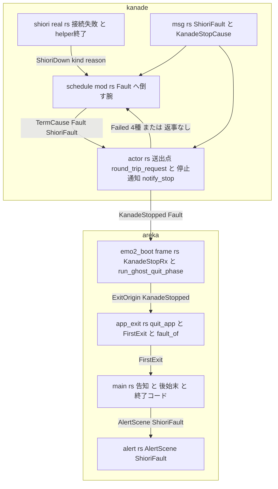
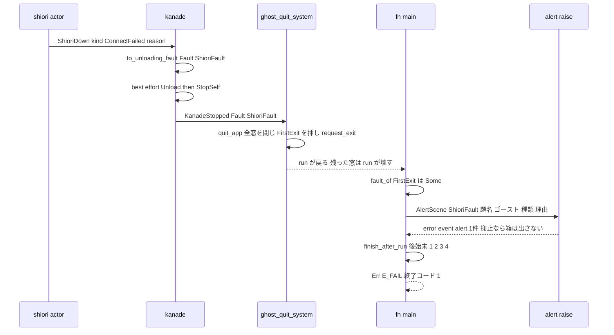
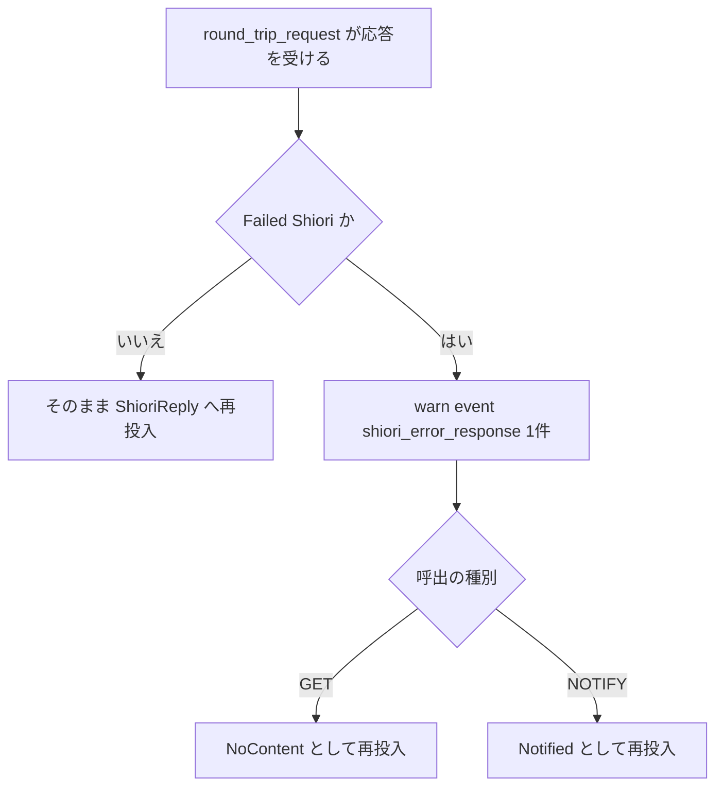
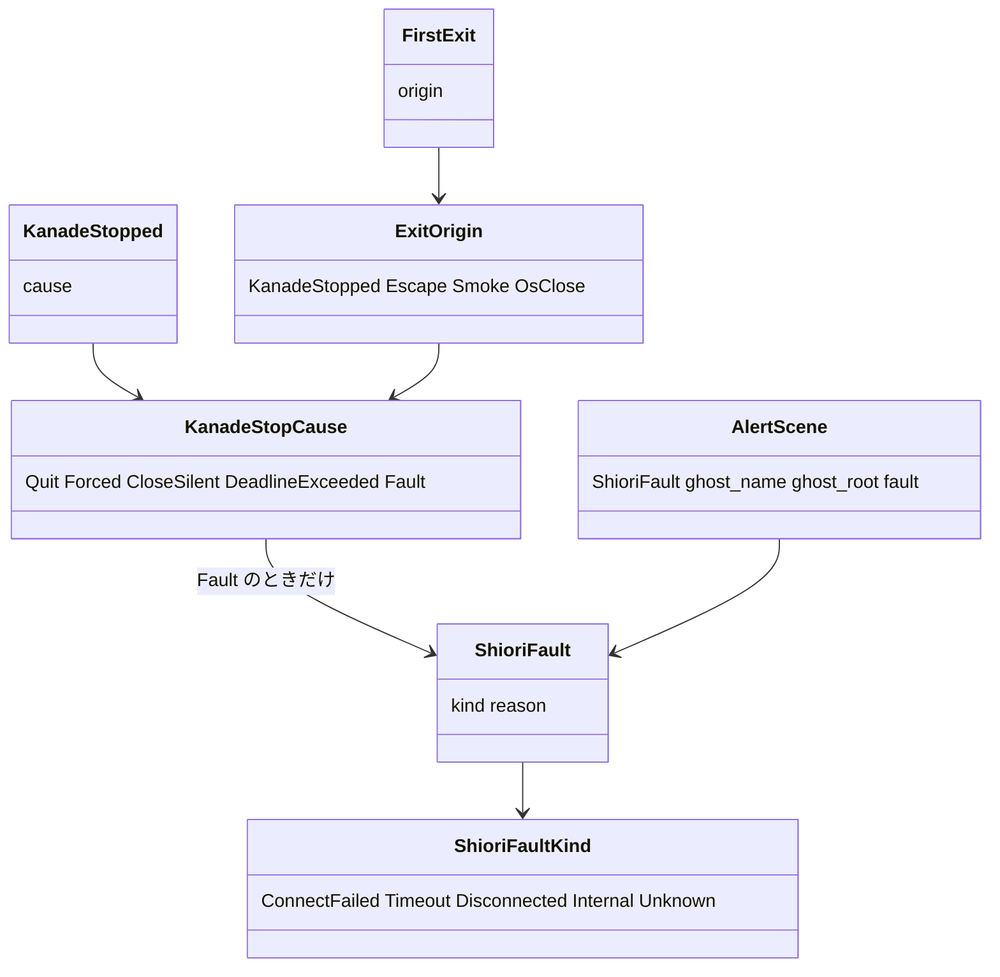

# Design Document: areka-P0-shiori-fault-notice

> 2026-09-24・本ブランチ（main `5db3672a` の内容）で、要件 1〜8 と `research.md`（§6 の 2026-09-24 討議の反映が §1〜§5 より優先）を入力に書いた。コードは「何の定義か」（関数名・型名＋ファイルパス）で指し、行番号では指さない。書いてある事実は Grep／Read で引き直した（引き直しの記録は `research.md` §7）。

## Overview

**Purpose**: SHIORI が動かなくてアプリが終わるとき、利用者に「どのゴーストで・どんな種類の失敗が起きたか」を告げてから終わる。無人の走行（常設の smoke テスト・有界の自動終了）は告知で止まらず、SHIORI の失敗で終わったことが終了コードで分かる。

**Users**: α の利用者（第三者）は黙って消えるアプリの代わりに告知を見る。開発者は終了コードとログの目印で「正常に終わった」と「SHIORI が動かなかった」を取り違えない。

**Impact**: 新しい仕組みは作らない。既に 1 本道になっている「kanade の停止通知 → 全窓を閉じて終了を指示（`quit_app`）→ `fn main` の後始末」に、⑴ 失敗の種類と理由を載せ、⑵ 最初の出所を `fn main` が読める場所に置き、⑶ 告知の部品に場面を 1 つ足し、⑷ 終了コードを後始末の後で決める、の 4 点を足す。あわせて ⑸ エラー応答（400・500）を致命の失敗から外し、⑹ `app.run()` が失敗しても後始末を通し（#57）、⑺ LogSink 側の起動でも同じ停止通知の受け口を使う。

### Goals

- SHIORI の失敗（Fault）で終わるときだけ、全窓を閉じたあと・プロセスが終わる前に告知を 1 回出す（要件 1）。
- 失敗の種類と理由が kanade の停止通知から `quit_app` の記録と告知まで届く（要件 2）。
- Fault で終わったら終了コード 1、それ以外の終了は今日のまま 0（要件 3）。
- 常設 smoke が告知で止まらず、SHIORI が動かない壊れ方を見逃さない（要件 4）。
- 告知の部品が場面ごとの題名を持てる（要件 5・後続 `ghost-install` #15 が乗る）。
- エラー応答は致命にしない・`run()` の失敗でも後始末を通す・起動の 2 経路が停止通知の受け口を 1 本共有する（要件 6）。

### Non-Goals

- SHIORI の失敗そのものを減らすこと。helper／host 側の失敗の種類と記録。
- 接続の失敗・期限切れ・通信の切断・内部の失敗・死活報告を Fault にする判断を変えること（運ぶ内容が増えるだけ）。
- 切替先のゴーストが起動できない場合（#13）・ゴーストの根が無い場合（完了 #12）・照会の往復の失敗の記録の文言（#44）。
- 失敗したゴーストを別のゴーストで起こし直すこと・告知に押されたボタンを返すこと（#15）・main スレッドの panic の後始末（`catch_unwind` も `Drop` も置かない）。

## Boundary Commitments

### This Spec Owns

- kanade の公開語彙: 失敗の種類 `ShioriFaultKind`（5 値）と種類＋理由 `ShioriFault`、`KanadeStopCause::Fault(ShioriFault)`、`KanadeMsg::ShioriDown { kind, reason }`、内部の `TermCause::Fault(ShioriFault)`、そして `ShioriFailure`／`ShioriDown` から種類への写し（純関数・wildcard なし）。
- kanade の腕の判断の変更 **1 点だけ**: エラー応答（`ShioriFailure::Shiori`）を送出点で「返事なし」に写して会話を続ける（記録 1 件）。
- areka 側: 停止通知の受け口 `KanadeStopRx`（World の NonSend 資源）と、それを読む相 `run_ghost_quit_phase`／system `ghost_quit_system`（起動の 2 経路で共有）。最初の出所 `FirstExit`（World の Resource）。判定 `fault_of`。告知の場面 `AlertScene::ShioriFault` と場面ごとの題名。`fn main` の末尾（告知 → 後始末 → 終了コード）と `finish_after_run`。
- 常設 smoke の ①② の追加判定・④ 失敗方向・i686 成果物の複製。
- `doc/COMPAT_ARCHITECTURE.md` §8 の 2 行。実機 3 走行の記録（`signoff.md`）。

### Out of Boundary

- `crates/areka-kanade/src/schedule/{mod,boot,steady,close}.rs` の各腕が Fault へ倒す判断（エラー応答以外）。`unloading_reply`・`choice_shiori_failed_as_204` の腕。
- `crates/shiori-host32-host`／`-helper`／`shiori-abi`（失敗の種類・記録・`HOST32_TESTDLL_LOADU_FAIL` の読み手は test crate のまま）。
- `crates/areka-ghost/src/runtime.rs` の `boot_with_kanade_stop` の形（無改変。相乗り 1 件＝`GhostBootError` の doc の「ダミー窓」1 行だけ直す）。
- `run_ghost_quit_phase` に「停止原因によって終了しない」分岐を足すこと（#13）。`fn main` の起動経路の括り出し（#58）。
- wintf（無改変）。本番コードが読む環境変数の追加（0 件）。

### Allowed Dependencies

- 既存の部品だけを使う: `alert.rs`（`AlertScene`／`alert_text`／`raise`／`suppressed`）、`app_exit.rs`（`quit_app`／`ExitOrigin`）、`emo2_boot/frame.rs`（`run_ghost_quit_phase`）、`areka_ghost::boot_with_kanade_stop`／`ShioriWiring::Custom`、`wintf::AppExit`（`is_requested`）、`GhostRuntime::mount().names.name`、検証用 DLL `shiori-host32-testdll-loadu`、`sample-ghost-kit`／`temp-path-kit`／`log-capture-kit`（dev-dependencies 済み）。
- 依存の向き（違反は誤り）: `areka-kanade`（`msg` → `schedule` → `actor`）→ `areka-ghost`（`runtime`）→ `areka`（`app_exit` → `emo2_boot/frame` → `emo2_boot/mod` → `main`。`alert` は `main` だけが呼ぶ）。kanade は areka を知らない。areka は kanade の内部 `TermCause` を見ない。
- 新しい crate 依存・機能フラグ・環境変数は 0。

### Revalidation Triggers

- `KanadeStopCause`／`KanadeStopped`／`KanadeMsg::ShioriDown` の形（`Copy` を失う・欄が増える）: 構築点を持つ areka-ghost のテスト・areka の `frame_ghost_quit_tests.rs`・後続 #13／#58 が突き合わせる。
- `wire_emo2_boot` の引数（停止通知の送出端を受ける）と `Emo2Wiring::set_kanade_stop` の退役: `emo2_boot/spine.rs` のハーネス・#58 の `&mut World` 化。
- 終了コードの契約（Fault で 1）: smoke ①②④・`alpha-release-signoff` #17 の既知の制限一覧。
- 告知の題名が場面ごとに変わる形: `ghost-install` #15 は `alert_text` の戻り `(title, body)` をそのまま使う。
- エラー応答が 204 相当になる: `BootPrefetch` の `username` 照会の失敗の写し先が `ResourceOutcome::NoContent` に変わる（sylphya 側の扱いは「204・失敗→None」で同じ）。

## Architecture

### Existing Architecture Analysis

- **失敗の入口は 1 本道で終了へ集まる**（実在を確認）: `crates/areka-kanade/src/shiori/real.rs` の `spawn_shiori_actor`（接続の失敗）／`report_exit_once`（helper の予期しない終了）が `KanadeMsg::ShioriDown` を送り、`map_error` が `RequestError` を `ShioriFailure` 4 種へ写す。`crates/areka-kanade/src/actor.rs` の `round_trip` が送出失敗・応答の切断・期限切れを `ShioriFailure::Ipc` にする。`crates/areka-kanade/src/schedule/mod.rs` の `step`（`Input::ShioriDown` の腕）と `on_shiori_reply`（応答待ちの相の `Failed`）が `to_unloading_fault` へ倒す（例外＝`BootPrefetch` と選択肢の往復中）。`actor.rs` の `stop_cause_of`／`notify_stop` が `KanadeStopped { cause }` を 1 度送る。
- **受け口は実 sink 結線にだけある**: `crates/areka/src/emo2_boot/mod.rs` の `wire_emo2_boot` が channel を作り `Emo2Wiring::set_kanade_stop` に置き、`emo2_boot/frame.rs` の `emo2_frame_system` が先頭で `run_ghost_quit_phase` を呼ぶ。`fn main` の `else` 腕（`areka_ghost::boot`＝`boot_with_kanade_stop(options, None)`）には受け口が無く、`Emo2Wiring` も無いので `emo2_frame_system` は no-op。
- **終了は `quit_app` 1 か所**（`crates/areka/src/app_exit.rs`）: 全窓 despawn → `info!(event="app_exit", origin)` → `AppExit::request_exit()`。2 度目の指示は `AppExit` が流す（最初が勝つ）。出所は記録に残るだけで後から読めない。
- **`fn main` は `app.run()?` の後に後始末 ①〜④**（loop ticker の Close → `GhostRuntime::shutdown` → seriko の join → 性能報告）を通り、`run()` が正常なら理由を問わず 0。`Err` なら `?` で後始末を飛ばす（#57）。
- **告知の部品は起動専用**: `crates/areka/src/alert.rs` の `AlertScene` 4 場面・題名は定数 `TITLE`・`raise` は `error!(event="alert")` を必ず 1 件残し `AREKA_NO_ALERT` で抑える。`alert_tests.rs` 9 本。
- **wintf の `WinApp::run` は登録表に残った窓を壊してから戻る**（`crates/wintf/src/runtime/mod.rs` の `run` の手順「残存窓の破棄」）＝`run()` の後に出す告知の背後にゴーストの窓は残らない（要件 1.11）。

### Architecture Pattern & Boundary Map



**Architecture Integration**:
- 選んだ形: 「既存の部品を広げる」（`research.md` 案 A を、停止原因の載せ方だけ `Fault(ShioriFault)` に改めた＝§7 決定 1）。停止通知の 1 本道はそのまま、運ぶ中身と読む場所を足す。
- 持ち場の分け方: **種類を決めるのは kanade**（写しは `msg.rs` の純関数 2 つに閉じる）、**告知するか・終了コードを何にするかを決めるのは areka の `app_exit::fault_of` 1 つ**、**文面を組むのは `alert::alert_text`**。kanade は「Fault なら必ずアプリが終わる」を約束しない（要件 3.1 の将来の複数ゴースト）。
- 保つ既存の形: `quit_app` の「全窓を閉じてから指示」と最初が勝つ規則、`run_ghost_quit_phase` の判断（全件取り出し・1 度だけ・窓 0 は正常系）、後始末 ①〜④ の順序、`alert.rs` の 4 場面の文面・記録・抑止、`stop_cause_of` の wildcard なしの写し。
- 新しい部品は 3 つだけ: World の資源 `KanadeStopRx`（受け口の共有）と `FirstExit`（出所を `main` へ運ぶ）、純関数 `finish_after_run`（`run()` の成否によらず後始末を通す判断＝#58 が括り出す関数の芽）。
- steering との整合: ログ無しの失敗経路を作らない（記録は `alert`／`shiori_error_response`／`app_exit` の既存 event に載る）・テストは判断の分岐だけ・x64 の決定論テストを常時に（i686 は smoke と実機だけ）。

### Technology Stack

| Layer | Choice / Version | Role in Feature | Notes |
|---|---|---|---|
| kanade（`areka-kanade`） | Rust 2024・`thiserror` 2 | 失敗の種類と理由の公開語彙・送出点でのエラー応答の写し | 新規依存なし |
| areka bin | `bevy_ecs` 0.19（`Resource`／NonSend）・`wintf::AppExit` | 受け口と最初の出所を World に置く・終了の指示 | wintf 無改変。`.before(system)` の相手が schedule に無いとき bevy 0.19 は辺を作らないだけで失敗しない（`bevy_ecs-0.19.1/src/schedule/node.rs` の `SystemSets::check_type_set_ambiguity` は同型 system が複数あるときだけ拒む・`schedule.rs` の `build_schedule` はそれを呼ぶ側・§7 で確認） |
| 告知 | `MessageBoxW`（`MB_OK\|MB_ICONERROR`） | 既存 `alert::raise` をそのまま使う | 場面ごとの題名は `alert_text` の戻りで運ぶ |
| テスト | `sample-ghost-kit`・`temp-path-kit`・`log-capture-kit`・`shiori-host32-testdll-loadu`（i686） | smoke ④ の検体・実機 ① の検体 | すべて dev-dependencies 済み・本番コードに口を足さない |

## File Structure Plan

### Modified Files（kanade）

- `crates/areka-kanade/src/msg.rs` — `ShioriFaultKind`（5 値）・`ShioriFault { kind, reason }`・`ShioriFault::from_failure(&ShioriFailure)`／`from_down(ShioriDownKind, String)`（写しはここだけ）・`ShioriDownKind`（2 値）・`KanadeMsg::ShioriDown { kind, reason }`・`KanadeStopCause::Fault(ShioriFault)`（`Copy` → `Clone`）・`KanadeStopped`（`Copy` → `Clone`）。
- `crates/areka-kanade/src/msg_fault_tests.rs`（新規・兄弟）— 写し 2 つの決定論テスト（要件 7.3 の種類の固定）。
- `crates/areka-kanade/src/lib.rs` — `ShioriFault`・`ShioriFaultKind`・`ShioriDownKind` の再輸出。
- `crates/areka-kanade/src/schedule/mod.rs` — `TermCause::Fault(ShioriFault)`（`TermCause` に `Clone`）・`to_unloading_fault(state, fault)`・`Input::ShioriDown { kind, reason }` の腕（`from_down`）・`on_shiori_reply` の横断の腕（`from_failure`）。判断は変えない。
- `crates/areka-kanade/src/actor.rs` — `round_trip_request` の末尾でエラー応答を「返事なし」に写す（GET→`NoContent`・NOTIFY→`Notified`・`warn!(event="shiori_error_response")`）。`stop_cause_of` は `TermCause` を clone して写す。`notify_stop` は原因不明を `Fault(ShioriFault { kind: Unknown, .. })` で送る。
- `crates/areka-kanade/src/shiori/real.rs` — `spawn_shiori_actor` の接続失敗は `ShioriDown { kind: ConnectFailed, reason }` を送ったあと受信端を捨てず、以後の要求に同じ理由の `Failed(Handshake)` で、`Unload` に `Unloaded` で答え、`Close` か全送信端の drop で終わる（`answer_after_connect_failure`。受信端を捨てると、`ShioriDown` より先に届いた起動の要求が「通信が切れた」に化けるため・実装で判明）。`report_exit_once` は `ShioriDown { kind: HelperExited, reason }`。
- 構築点・照合点の追随（判断なし・機械的）: `KanadeMsg::ShioriDown` を綴るテスト（`schedule/{schedule_tests,schedule_log_firing_tests,steady_choice_timeout_tests}.rs`・`shiori/{real_tests,real_idle_tests}.rs`・`tests/kanade/{failure_test,idle_pump_test,real_helper_test}.rs`・`tests/kanade/common/common_window_actor.rs`）、`TermCause::Fault` を綴るテスト（`actor_resources_tests.rs`・`actor_stop_notify_tests.rs`・`schedule/{close,schedule_tests,schedule_log_firing_tests,steady_choice_timeout_tests,user_break_tests}.rs`）、`tests/kanade/close_test_stop_notify_tests.rs`。
- `crates/areka-kanade/src/actor_stop_notify_tests.rs` — 5 値の写し（`Fault` は中身つき）と原因不明＝`Unknown`。
- `crates/areka-kanade/tests/kanade/failure_test.rs` — ケース 1 から `Shiori` を外し、⑴ 入口ごとの停止通知の中身（`Handshake`／`Timeout`／`Ipc`／`Internal`・`ShioriDown` 2 種）を停止通知の投函端つきハーネスで固定、⑵ エラー応答が起動時（`OnInitialize`＝NOTIFY）でも会話中（`OnSecondChange`＝GET）でも Fault にならず会話が続き `shiori_error_response` が 1 件残ることを固定（要件 7.3）。
- `crates/areka-kanade/tests/kanade/choice_test_stage_failure_tests.rs` — 2 本が注入しているエラー応答（`FailKind::Shiori`）を `Ipc` へ替える（エラー応答が返事なしになると、選択肢の往復中の 204 扱いの腕を踏まず、選択肢以外の失敗の Fault も起きなくなるため・タスク生成の査読で判明）。
- `crates/areka-kanade/tests/kanade/common/common_harness.rs` — `spawn_harness_failing` に停止通知の投函端つきの派生を 1 つ足す（既存 `spawn_harness_with_stop_sink` と同型）。
- `crates/areka-kanade/tests/kanade/prefetch_test.rs` — 影響なし（`Timeout` を使う）。

### Modified Files（areka-ghost）

- `crates/areka-ghost/src/runtime.rs` — `GhostBootError` の doc の「ダミー窓」1 行を今の挙動（本物の起動窓）に直す（相乗り）。コードは無改変。
- `crates/areka-ghost/tests/ghost/spine_e2e_test_s2_connect_failure.rs` — `boot_with_kanade_stop(.., Some(tx))` に替え、停止通知が `Fault(ShioriFault { kind: ConnectFailed, reason: "simulated connect failure" })` で届くことを足す（要件 2.4・7.5）。`spine_e2e_test_s3_helper_liveness_detected.rs`・`real_pasta_test.rs` は `ShioriDown` の綴りの追随だけ。

### Modified Files（areka）

- `crates/areka/src/app_exit.rs` — `ExitOrigin`（`Copy` → `Clone`）・`FirstExit(ExitOrigin)`（`Resource`・`quit_app` が最初の出所だけ挿す・2 度目は `debug!(event="app_exit_again")`）・`fault_of(&ExitOrigin) -> Option<&ShioriFault>`（判定はここ 1 つ）。
- `crates/areka/src/app_exit_tests.rs` — `fault_of` の表（停止原因 5 値 × 出所 3 種）・`FirstExit` は最初が勝つ（要件 7.2）。
- `crates/areka/src/emo2_boot/frame.rs` — `KanadeStopRx(Receiver<KanadeStopped>)`（NonSend 資源）・`run_ghost_quit_phase(world: &mut World) -> bool`（受け口を World から読む・判断は不変）・`ghost_quit_system(world)`（薄い包み）。`emo2_frame_system` からは終了相の呼び出しを外す（終了相は `ghost_quit_system` が担う）。
- `crates/areka/src/emo2_boot/frame/wiring.rs` — `Emo2Wiring::kanade_stop` と `set_kanade_stop` を退役。
- `crates/areka/src/emo2_boot/mod.rs` — `wire_emo2_boot(.., kanade_stop: Sender<KanadeStopped>)`（channel を作らず受け取った送出端を `boot_with_kanade_stop` へ渡す）・`wire_kanade_stop(app: &WinApp, rx)`（`KanadeStopRx` を挿し `ghost_quit_system.before(emo2_frame_system)` を `Update` に登録・起動の 2 経路で共通の 1 か所）。`ghost_quit_system` の再輸出。
- `crates/areka/src/emo2_boot/frame_ghost_quit_tests.rs` — 受け口を World の資源に組み替え（既存 4 本の判断は不変）、Fault の場合（種類と理由が `app_exit` の記録と `FirstExit` に届く）を足す（要件 7.4）。
- `crates/areka/src/emo2_boot/frame_ghost_quit_logsink_tests.rs`（新規・兄弟）— 実 sink 結線なし（`Emo2Wiring` 無し）の World に `KanadeStopRx` を挿し、`boot_with_kanade_stop(Custom(Err), Some(tx))` の接続失敗で停止通知が受け口に届き `quit_app` まで進む（`AppExit::is_requested`・`FirstExit`＝`Fault(ConnectFailed)`）ことを固定（要件 7.6 後半）。検体は `spine_e2e_test_s2_connect_failure.rs` と同じ最小の一時フォルダ。
- `crates/areka/src/emo2_boot/frame_schedule_tests.rs` — 据え付けの形を踏むテストを 1 本足す（設計検証 論点 3）: 素の World に `AppExit` と `KanadeStopRx` を挿し、`emo2_frame_system` を登録**せずに** `wire_kanade_stop` と同じ登録（`ghost_quit_system.before(emo2_frame_system)`）を行い、停止通知を 1 件送って `Update` を 1 回走らせ、`AppExit::is_requested()` と `FirstExit` を見る。schedule の組み立てで落ちれば赤・届かなければ赤（bevy の版が変わってこの前提が崩れたとき、本番の LogSink 側の起動だけが落ちるのを防ぐ）。
- `crates/areka/src/emo2_boot/spine_close_wiring_tests.rs` — `run_ghost_quit_phase(&mut harness.wiring, &mut harness.world)` の呼び出しを新しい署名 `run_ghost_quit_phase(&mut world)` に追随（判断なし・機械的）。
- `crates/areka/src/emo2_boot/spine.rs` — ハーネスの `set_kanade_stop(rx)` を `world.insert_non_send(KanadeStopRx(rx))` に替える（判断なし）。
- `crates/areka/src/alert.rs` — `AlertScene::ShioriFault { ghost_name: Option<String>, ghost_root: PathBuf, fault: ShioriFault }`・題名を場面ごとに返す（既存 4 場面は `TITLE` のまま・新場面は `SHIORI_FAULT_TITLE`）・`fault_kind_text(ShioriFaultKind) -> &'static str`（5 語）・`raise` の message を場面に依らない文言にする（判断なし）。
- `crates/areka/src/alert_tests.rs` — 既存 9 本は無改変。5 種類 × ゴースト名の有無の 10 本を足す（要件 7.1）。
- `crates/areka/src/main.rs` — channel を作って 2 経路へ送出端を配る・`wire_kanade_stop`・`app.run()` の `?` を外す・`FirstExit` を読んで Fault なら告知・`finish_after_run(run, fault, cleanup)` で後始末 ①〜④ を通してから終了コードを決める。
- `crates/areka/src/main_finish_after_run_tests.rs`（新規・兄弟）— `finish_after_run` が `Ok`／`Err` のどちらでも後始末を 1 回通し、`Err`・後始末の失敗・Fault のどれでも `Err` を返すことを固定（要件 7.6 前半）。
- `crates/areka/tests/smoke_boot_loop_exit.rs` — i686 成果物の複製（`ensure_i686_artifact`）・①② に「告知の目印 0 件」を足す・④ 失敗方向（要件 4）。
- `doc/COMPAT_ARCHITECTURE.md` — §8 に 2 行（要件 3.6）。
- `.kiro/specs/areka-P0-shiori-fault-notice/signoff.md`（新規・実装フェーズ）— 実機 3 走行の記録（要件 7.8）。

## System Flows

### Flow 1: 接続の失敗から告知と終了コードまで



- 図の最初の矢印（`ShioriDown`）は入口の 1 つにすぎない。起動の `Boot` が `ShioriDown` より先に kanade へ届くと（ほぼ常にこちら）、最初の要求に shiori actor が同じ理由の `Failed(Handshake)` で答え、`from_failure` で同じく `ConnectFailed` になる（理由は `"shiori handshake failure: <接続失敗の理由>"`）。どちらが先でも種類は「接続できなかった」で、理由は届いた入口の記録と同じ文言になる（要件 2.1・2.4）。
- 告知は後始末 ①（再生ループの停止）の**直後・② の前**に出す（`research.md` 議題 8 の「後始末の前」を設計検証の指摘で 1 段ずらした）: ① は `GhostRuntime` を消費しないのでゴースト名を `GhostRuntime::mount().names.name` から読めるうちに組め、②③ の失敗（記録して止める・今日どおり）に巻き込まれず、利用者が告知を閉じるまでのあいだ SERIKO の loop ticker（16 ms）が誰も取り出さないチャネルへ指令を溜め続けることもない。終了コードは後始末の**後**に決める（要件 3.2）。
- 起動時か会話中かは載せない（要件 1.9）。図の入口が `Failed(..)`（期限切れ・切断・内部）でも `KanadeStopped` 以降は同じ。

### Flow 2: エラー応答は送出点で「返事なし」になる



- 写す場所を `actor.rs` の送出点にする理由: 運行表（`schedule/*.rs`）は応答が GET か NOTIFY かを知らず、`BootInit`（`OnInitialize`＝NOTIFY）は `Notified` だけを次へ進める（`NoContent` は「想定外」で相を維持＝起動が止まる）。種別を知っているのは送出点だけである。本番・mock の両方が必ず通る唯一の実行点（DD-IT-7）なので、起動時・会話中・選択肢の往復中のすべての相に 1 か所で効く。
- 運行表の横断の腕（`on_shiori_reply` の `Failed` → Fault）は無改変。そこへ `ShioriFailure::Shiori` が届くことは無くなる（届いたら写し `from_failure` が `Internal` にする＝areka 側の約束が破れたことを示す）。

## Requirements Traceability

| Requirement | Summary | Components | Interfaces | Flows |
|---|---|---|---|---|
| 1.1 | 全窓を閉じたあと・終わる前に告知 1 回 | `quit_app`・`fn main` の末尾・`alert::raise` | `FirstExit`・`fault_of` | Flow 1 |
| 1.2 | 入口ごとに告知を作らない | 停止通知の 1 本道（`notify_stop` → `KanadeStopRx` → `quit_app` → `main`） | `KanadeStopped` | Flow 1 |
| 1.3 | 題名は別・本文 (a)(b)(c) | `AlertScene::ShioriFault`・`alert_text` | `(title, body)` | — |
| 1.4 | 失敗の種類 5 語 | `ShioriFaultKind`・`fault_kind_text` | — | — |
| 1.5 | 告知と同じ内容を `error!` に | `alert::raise`（既存・`event="alert"`） | — | Flow 1 |
| 1.6 | `AREKA_NO_ALERT` で箱だけ抑える | `alert::suppressed`（既存） | — | Flow 1 |
| 1.7 | Fault 以外の停止原因は告知なし | `fault_of` | `Option<&ShioriFault>` | — |
| 1.8 | 強制退避・smoke・OS の閉鎖要求は告知なし | `fault_of` | — | — |
| 1.9 | 起動時か会話中かを言い分けない | `alert_text`（段を載せない） | — | Flow 1 |
| 1.10 | 閉じたらそのまま終える | `raise`（`MB_OK` のみ・既存）・`finish_after_run` | — | Flow 1 |
| 1.11 | 告知の背後に窓を残さない | `quit_app` の despawn＋`WinApp::run` の残存窓の破棄（既存） | — | Flow 1 |
| 1.12 | 告知は 1 プロセス 1 回 | `FirstExit`（最初が勝つ）・`main` で 1 度だけ `raise` | — | Flow 1 |
| 2.1 | 種類と理由を停止通知に載せる | `ShioriFault`・`KanadeStopCause::Fault(ShioriFault)` | `KanadeStopped` | Flow 1 |
| 2.2 | すべての入口から種類を運ぶ（綴りで判別しない） | `ShioriDownKind`・`from_down`・`from_failure`・`notify_stop`（`Unknown`） | `KanadeMsg::ShioriDown { kind, reason }` | Flow 1 |
| 2.3 | Fault にする判断を変えない | `schedule/mod.rs` の腕（引数が増えるだけ） | — | — |
| 2.4 | x64 の接続失敗で通知に種類と理由 | `spine_e2e_test_s2_connect_failure.rs`（`ShioriWiring::Custom`） | `boot_with_kanade_stop` | Flow 1 |
| 2.5 | `app_exit` の記録にも種類と理由 | `quit_app` の `info!(origin = ?origin)`（`ExitOrigin` の `Debug` に載る） | — | Flow 1 |
| 3.1 | Fault で終わるときだけ終了コード 0 以外（1） | `finish_after_run`・`fault_of` | `Result<()>`＝`Err(E_FAIL)` | Flow 1 |
| 3.2 | 後始末を通してから終了コード（`Err` でも） | `finish_after_run` | `cleanup: FnOnce` | Flow 1 |
| 3.3 | 他の終了は 0・順序不変 | `fault_of`（None）・後始末 ①〜④ は無改変 | — | — |
| 3.4 | 抑止でも終了コードは同じ | `raise` の `suppressed` は表示だけ・`finish_after_run` は `suppressed` を見ない | — | — |
| 3.5 | 「SHIORI の失敗で終わった」`error!` 1 件 | `raise` の `event="alert"`（題名が目印） | — | — |
| 3.6 | §8 に記す | `doc/COMPAT_ARCHITECTURE.md` §8 の 2 行 | — | — |
| 4.1 | smoke 3 方向を保つ・i686 成果物を隣へ複製 | `ensure_i686_artifact` | — | — |
| 4.2 | ①② に「失敗していない」を足す | 目印（`SHIORI_FAULT_TITLE`）0 件＋exit 0 | — | — |
| 4.3 | ④ 失敗方向 | `fault_direction_*`（exit 非 0・目印 1 件・見張りの内側） | — | — |
| 4.4 | 検体は検証用 DLL で組む・本番に口を足さない | emo2 の複製＋`descript.txt` の差し替え＋`shiori_loadu.dll`・`HOST32_TESTDLL_LOADU_FAIL=1` | — | — |
| 4.5 | 抑止＋自動終了で失敗が先なら非 0 | `FirstExit`（最初が勝つ）・④ は自動終了を 20 秒にして失敗を先に起こす | — | — |
| 4.6 | 抑止と自動終了は別の関心 | `alert::suppressed` と `smoke_exit_ms` は互いを見ない（既存） | — | — |
| 5.1 | 場面を 1 つ足し題名を場面ごとに | `AlertScene::ShioriFault`・`alert_text` | `(title, body)` | — |
| 5.2 | 既存 4 場面は不変 | `alert_text` の既存の腕・`alert_tests.rs` 9 本無改変 | — | — |
| 5.3 | 文面は純関数 | `alert_text`・`fault_kind_text` | — | — |
| 5.4 | ボタンを返す形は足さない | `raise` の戻り `()` のまま | — | — |
| 6.1 | エラー応答は致命にしない・記録 1 件・閾値なし | `round_trip_request` の写し（`warn!(event="shiori_error_response")`） | `ShioriOutcome` | Flow 2 |
| 6.2 | `username` 照会の失敗で起動を続ける | `on_shiori_reply` の `BootPrefetch` の腕（無改変） | — | — |
| 6.3 | `run()` の `Err` でも後始末（#57） | `finish_after_run` | — | Flow 1 |
| 6.4 | LogSink 側の起動でも受け口 1 本を共有 | `KanadeStopRx`・`wire_kanade_stop`・`ghost_quit_system`・`main` の `else` 腕が `boot_with_kanade_stop(.., Some(tx))` | — | Flow 1 |
| 6.5 | `run_ghost_quit_phase` に終了しない分岐を足さない | `run_ghost_quit_phase`（判断不変） | — | — |
| 6.6 | 本番の環境変数を足さない | `HOST32_TESTDLL_LOADU_FAIL` の読み手は test crate | — | — |
| 7.1 | 文面の純関数テスト | `alert_tests.rs`（5 × 2） | — | — |
| 7.2 | 判定の表を固定 | `app_exit_tests.rs`（`fault_of`・`FirstExit`） | — | — |
| 7.3 | 入口ごとの種類と理由・エラー応答は続く | `msg_fault_tests.rs`・`failure_test.rs`・`actor_stop_notify_tests.rs` | — | Flow 2 |
| 7.4 | `run_ghost_quit_phase` に Fault の場合 | `frame_ghost_quit_tests.rs` | — | — |
| 7.5 | 起動 → 接続失敗 → 停止通知 | `spine_e2e_test_s2_connect_failure.rs` | — | — |
| 7.6 | 判断の分岐だけ・`finish_after_run`・LogSink 経路 | `main_finish_after_run_tests.rs`・`frame_ghost_quit_logsink_tests.rs` | — | — |
| 7.7 | 実機 3 走行 | 実装フェーズの手順（Testing Strategy） | — | — |
| 7.8 | 実機の記録 | `signoff.md` | — | — |
| 8.1 | 裁定 1（終了コード） | 3.1・3.6 と同じ | — | — |
| 8.2 | 裁定 2（種類を運ぶ） | 2.x と同じ | — | — |
| 8.3 | 裁定 3（エラー応答） | 6.1 と同じ | — | Flow 2 |
| 8.4 | 裁定 4（告知の場所） | `fn main` の末尾（`run()` の後） | — | Flow 1 |
| 8.5 | 裁定 5（LogSink 側の穴） | 6.4 と同じ | — | — |
| 8.6 | 裁定 6（#57） | 6.3 と同じ・完了時に台帳 #57 の行を更新 | — | — |
| 8.7 | 覆すなら議題へ | 開発者の裁定 1〜6 を覆した点は 0 件（§7 決定 1 は載せ方の選択であり裁定 2 の範囲内）。research §6 反映 ⑵ の「型を絞る」（討議後の推論）だけは採らず、`from_failure` の `Shiori` の腕を `Internal` として残す（設計討議 2026-09-24 で明記） | — | — |

## Components and Interfaces

| Component | Domain/Layer | Intent | Req Coverage | Key Dependencies | Contracts |
|---|---|---|---|---|---|
| `ShioriFault`／`ShioriFaultKind`／`ShioriDownKind`（`msg.rs`） | kanade 公開語彙 | 失敗の種類と理由・写し 2 つ | 1.4, 2.1, 2.2, 7.3 | `ShioriFailure`（P0） | State |
| `TermCause::Fault(ShioriFault)`・`to_unloading_fault`（`schedule/mod.rs`） | kanade 運行表 | 種類と理由を終了系列へ載せる | 2.2, 2.3 | `msg.rs`（P0） | State |
| エラー応答の写し（`actor.rs` `round_trip_request`） | kanade 送出点 | エラー応答を返事なしにして会話を続ける | 6.1, 6.2, 7.3 | `ShioriCall`（P0） | Event |
| `stop_cause_of`／`notify_stop`（`actor.rs`） | kanade 停止通知 | 中身つきの `Fault` を 1 度送る | 2.1, 2.2 | `KanadeStopped`（P0） | Event |
| `ShioriDown` の送出（`shiori/real.rs`） | kanade 境界 | 種類を型で持たせる | 2.2 | `KanadeMsg`（P0） | Event |
| `KanadeStopRx`・`run_ghost_quit_phase`・`ghost_quit_system`（`frame.rs`） | areka 受け口 | 2 経路共通の受け口と終了相 | 1.2, 6.4, 6.5, 7.4 | `quit_app`（P0） | State |
| `wire_kanade_stop`・`wire_emo2_boot`（`emo2_boot/mod.rs`） | areka 結線 | 受け口の据え付け・送出端の配り | 6.4 | `WinApp`（P0） | Service |
| `FirstExit`・`fault_of`・`quit_app`（`app_exit.rs`） | areka 終了 | 最初の出所を残す・告知と終了コードの判定 | 1.1, 1.7, 1.8, 1.12, 2.5, 3.1, 3.3, 4.5, 7.2 | `AppExit`（P0） | State |
| `AlertScene::ShioriFault`・`alert_text`・`fault_kind_text`（`alert.rs`） | areka 告知 | 場面ごとの題名と 3 行の本文 | 1.3, 1.4, 1.5, 1.6, 1.9, 5.1〜5.4, 7.1 | `ShioriFault`（P0） | Service |
| `fn main` の末尾・`finish_after_run`（`main.rs`） | areka 入口 | 告知 → 後始末 → 終了コード | 1.1, 1.10, 1.11, 3.1, 3.2, 3.4, 6.3, 7.6 | `alert`・`app_exit`（P0） | Service |
| smoke ①②④・`ensure_i686_artifact`（`tests/smoke_boot_loop_exit.rs`） | 検査 | 無人走行で失敗を見逃さない | 4.1〜4.6 | i686 成果物（P1） | Batch |

### kanade

#### `ShioriFault`／`ShioriFaultKind`／`ShioriDownKind`（`crates/areka-kanade/src/msg.rs`）

| Field | Detail |
|---|---|
| Intent | 失敗の種類（5 値）と理由の一行を運ぶ公開語彙。写しはここに閉じる |
| Requirements | 1.4, 2.1, 2.2, 7.3 |

**Responsibilities & Constraints**
- `ShioriFaultKind`: `ConnectFailed`（接続できなかった）・`Timeout`（応答が期限内に返らなかった）・`Disconnected`（通信が切れた）・`Internal`（areka 側の内部の失敗）・`Unknown`（原因不明）。`Copy`・`Debug`（記録の語彙）。平易な日本語は持たない（文面は areka の `alert.rs` の責務）。
- `ShioriFault { kind: ShioriFaultKind, reason: String }`: `Clone`・`PartialEq`・`Eq`・`Debug`。`reason` は対応する `error!` の `error=`／`reason=` と同じ文言（`ShioriFailure` は `Display`＝`to_string()`、`ShioriDown` は `reason` そのもの）。
- `ShioriDownKind`: `ConnectFailed`・`HelperExited`。`KanadeMsg::ShioriDown { kind: ShioriDownKind, reason: String }`（綴りで判別しない・要件 2.2）。
- `KanadeStopCause::Fault(ShioriFault)`。他の 4 値は中身なしのまま。`KanadeStopCause`・`KanadeStopped` は `Copy` を外し `Clone`（`Debug` の出力は `KanadeStopped(Fault(ShioriFault { kind: ConnectFailed, reason: ".." }))`＝検索語 `KanadeStopped(Fault` は変わらない）。

**Contracts**: State [x]

##### State Management
```rust
impl ShioriFault {
    /// 呼出失敗 → 種類（wildcard なし・`Shiori` は送出点で写され届かない契約＝届いたら Internal）。
    pub fn from_failure(failure: &ShioriFailure) -> ShioriFault;
    //  Handshake → ConnectFailed / Timeout → Timeout / Ipc → Disconnected / Shiori → Internal / Internal → Internal
    /// 死活報告 → 種類（ConnectFailed → ConnectFailed / HelperExited → Disconnected）。
    pub fn from_down(kind: ShioriDownKind, reason: String) -> ShioriFault;
    /// 原因を控えられなかったとき（`notify_stop`）。
    pub fn unknown() -> ShioriFault; // kind: Unknown, reason: "stop cause unknown"
}
```
- 不変条件: `Fault` 以外の停止原因は中身を持たない（不正な組み合わせを型で作れない）。

**Implementation Notes**
- Integration: 構築点は `msg.rs`（1）・`actor.rs`（写し・`notify_stop`）・`real.rs`（2 送出）・`schedule/mod.rs`（2 腕）。テストの綴りの追随は File Structure Plan の一覧のとおり（判断なし）。
- Validation: `msg_fault_tests.rs` で `from_failure` の届く 4 腕（`Handshake`・`Timeout`・`Ipc`・`Internal`）・`from_down` 2 腕・`unknown` を固定。`Shiori` の腕は送出点の契約により届かないので判断のテストにはしない（コードのコメントで契約を記す）。
- research §6 の「2026-09-24 討議の反映 ⑵」が書いた「写しの入口を Fault へ入る 4 種に絞った型にする」は**採らない**（設計検証 論点 2）: `ShioriOutcome::Failed(ShioriFailure)` は mock と本番の共通の境界型で、失敗の enum をもう 1 つ増やす割に合わない。腕を残し `Internal` に写す形で、契約が破れたときも記録に見える。この注記は開発者の裁定（「500 は致命ではない」）の範囲内で、覆したのは要件討議の後に書いた推論の側だけ。
- Risks: `Copy` を失うので `KanadeStopCause` を値で使っていた箇所は `clone()` か参照へ（コンパイルが指す・7 ファイル）。

#### エラー応答の写し（`crates/areka-kanade/src/actor.rs` `round_trip_request`）

| Field | Detail |
|---|---|
| Intent | `Failed(ShioriFailure::Shiori)` を GET なら `NoContent`、NOTIFY なら `Notified` に写し、`warn!` を 1 件残す |
| Requirements | 6.1, 6.2, 7.3, 8.3 |

**Responsibilities & Constraints**
- 写す前に `call` の種別（`ShioriCall::Get`／`Notify`）を控える（既に `method` として取り出している）。`round_trip` が返した `ShioriOutcome::Failed(ShioriFailure::Shiori(e))` だけを対象にする。他の 4 種は無改変で `Failed` のまま再投入（Fault の判断は運行表のまま）。
- 記録: `warn!(target: "kanade", event = "shiori_error_response", method, id = %id, error = %e, "SHIORI がエラー応答——返事なし（204）と同じ扱いで会話を続ける")`。回数で終了へ倒す閾値は置かない。
- 影響の明示: `BootPrefetch` の `username` 照会がエラー応答なら `ResourceOutcome::NoContent`（従来は `Failed`）として sink へ渡る。sylphya 側は「204・失敗→None」で同じ値になる（`crates/areka-ghost/src/sylphya_wiring.rs` の `make_username_resource_sink` の doc）。選択肢の往復中の `choice_shiori_failed_as_204` の腕は `Ipc`／`Timeout`／`Internal` だけを受けるようになる（腕は無改変）。

**Contracts**: Event [x]

##### Event Contract
- 入力: `ShioriOutcome::Failed(ShioriFailure::Shiori(_))`（GET／NOTIFY 由来）。
- 出力: GET → `ShioriOutcome::NoContent`、NOTIFY → `ShioriOutcome::Notified`。順序・件数は変えない（1 往復 1 再投入）。
- 記録: `shiori_error_response` を 1 往復に 1 件。

**Implementation Notes**
- Integration: `unloading_reply`（Unload の失敗は `Ipc`）と `event_id_not_allowed`（`Internal`）には触れない。
- Validation: `failure_test.rs` に `FailOn`（`OnInitialize`＝NOTIFY／`OnSecondChange`＝GET）で `FailKind::Shiori` を注入し、kanade が止まらず次の呼出（`OnFirstBoot`／次の Tick）が記録されること・`shiori_error_response` が 1 件であること。既存 `each_failure_vocabulary_drives_observable_termination` から `Shiori` を外す（壊れたテストは更新）。
- Risks: 「黙って壊れる」への戻りは記録 1 件で防ぐ。エラー応答が毎秒続くと `warn!` が毎秒 1 件出る（閾値を置かない裁定の帰結・記録で見える）。

#### `TermCause::Fault(ShioriFault)`・`to_unloading_fault`（`crates/areka-kanade/src/schedule/mod.rs`）

| Field | Detail |
|---|---|
| Intent | Fault へ倒す 2 つの腕が種類と理由を終了系列に載せる |
| Requirements | 2.2, 2.3 |

**Responsibilities & Constraints**
- `to_unloading_fault(state, fault: ShioriFault)`。`Input::ShioriDown { kind, reason }` の腕は `ShioriFault::from_down(kind, reason)`、`on_shiori_reply` の横断の腕は `ShioriFault::from_failure(failure)` を渡す。既存の `error!(event="shiori_down"/"shiori_failed")` は無改変（理由の文言の源）。
- `TermCause` に `Clone` を足す（`stop_cause_of` が控えるため）。判断（どの腕が倒すか・`BootPrefetch`／選択肢の例外）は無改変。

**Contracts**: State [x]

**Implementation Notes**
- Validation: `actor_stop_notify_tests.rs` の 5 値の写しを中身つきに更新。`failure_test.rs` の停止通知の中身のテスト（入口 4 種＋`ShioriDown` 2 種）。
- Risks: `TermCause::Fault` を `matches!` で綴るテストは `Fault(_)` へ（機械的・6 ファイル）。

### areka

#### `KanadeStopRx`・`run_ghost_quit_phase`・`ghost_quit_system`（`crates/areka/src/emo2_boot/frame.rs`）

| Field | Detail |
|---|---|
| Intent | 停止通知の受け口を World に置き、起動の 2 経路が同じ相で読む |
| Requirements | 1.2, 6.4, 6.5, 7.4, 7.6 |

**Responsibilities & Constraints**
- `pub(crate) struct KanadeStopRx(pub(crate) Receiver<KanadeStopped>)`（NonSend 資源。`Receiver` は `Sync` でない）。
- `run_ghost_quit_phase(world: &mut World) -> bool`: 資源が無ければ `false`（結線していない構成）。あれば `try_recv` で全件取り出し、最初の 1 件で `info!(event="ghost_quit", cause = ?stopped.cause)` の上 `quit_app(world, ExitOrigin::KanadeStopped(stopped.cause))` を 1 度。2 件目以降 `debug!(ghost_quit_extra)`・窓 0 は `debug!(ghost_quit_no_windows)`。判断は今日と同一・原因による分岐を足さない。
- `ghost_quit_system(world: &mut World)`: `run_ghost_quit_phase` を呼ぶだけの排他 system。`emo2_frame_system` からは終了相の呼び出しを外す（終了が決まったフレームで他の相が走っても、閉じた窓のために描き直すだけ＝今日の doc の言明どおり。強制退避や smoke の自動終了では既に同じことが毎回起きている）。

**Contracts**: State [x]

##### State Management
- 資源の据え付けは `wire_kanade_stop` の 1 か所。取り出しは `run_ghost_quit_phase` の 1 か所。
- `Emo2Wiring::kanade_stop`／`set_kanade_stop` は退役（受け口を 2 か所に持たない）。

**Implementation Notes**
- Integration: `spine.rs` のハーネスは `world.insert_non_send(KanadeStopRx(rx))` に替える。
- Validation: `frame_ghost_quit_tests.rs` の 4 本を World の資源で組み直し、Fault の場合（`app_exit` の記録に `kind`・`reason` が載る・`FirstExit` が `KanadeStopped(Fault(..))`）を 1 本足す。`frame_ghost_quit_logsink_tests.rs` は `Emo2Wiring` 無しの World で `boot_with_kanade_stop(Custom(Err), Some(tx))` → 有界に `run_ghost_quit_phase` を回して `AppExit::is_requested()` と `FirstExit` を見る。
- Risks: なし（wintf 無改変・system の登録は 1 か所）。

#### `wire_kanade_stop`・`wire_emo2_boot`（`crates/areka/src/emo2_boot/mod.rs`）

| Field | Detail |
|---|---|
| Intent | 受け口の据え付けと system の登録を 1 か所に・送出端を 2 経路へ配る |
| Requirements | 6.4 |

**Contracts**: Service [x]

##### Service Interface
```rust
/// 停止通知の受け口を World に据え、終了相を Update に登録する（起動の 2 経路で共通・1 回だけ）。
pub fn wire_kanade_stop(app: &WinApp, rx: Receiver<KanadeStopped>);
//  world.insert_non_send(KanadeStopRx(rx));
//  world.add_systems(Update, ghost_quit_system.before(emo2_frame_system));

/// 末尾に停止通知の送出端が 1 つ増える。内部で channel は作らない。
pub fn wire_emo2_boot(app, ghost_root, balloon_root, helper_exe, author_dpi, zorder_descript,
                      kanade_stop: Sender<KanadeStopped>) -> Emo2BootOutcome;
```
- 前提: `main` が `mpsc::channel::<KanadeStopped>()` を 1 本作り、`wire_emo2_boot` に `tx.clone()`、`else` 腕の `boot_with_kanade_stop(ghost_boot_options(..), Some(tx.clone()))` に渡し、自分の `tx` は落とす。`wire_kanade_stop` は boot の分岐の後・`app.run()` の前に 1 回。
- `.before(emo2_frame_system)` の相手が LogSink 側の起動では schedule に無い。bevy 0.19 は同型 system が**複数**ある set への辺だけを拒み、空の set は辺を作らないだけ（`research.md` §7）。

**Implementation Notes**
- Validation: `wire_emo2_boot_falls_back_to_unwired_on_missing_ghost_root` は引数の追随のみ。据え付けの**形**（`emo2_frame_system` 無しでの `.before(..)` 登録＝bevy の挙動に依る 1 点）だけは `frame_schedule_tests.rs` の 1 本で踏む（設計検証 論点 3）。それ以外の据え付けは配線（再テストしない・要件 7.6）。
- Risks: なし。

#### `FirstExit`・`fault_of`・`quit_app`（`crates/areka/src/app_exit.rs`）

| Field | Detail |
|---|---|
| Intent | 最初の出所を残し、「告知するか・終了コードを何にするか」を 1 つの判定で決める |
| Requirements | 1.1, 1.7, 1.8, 1.12, 2.5, 3.1, 3.3, 4.5, 7.2 |

**Responsibilities & Constraints**
- `ExitOrigin` は `Copy` → `Clone`（中身に `String` が入る）。4 呼び手は値渡しのまま。
- `#[derive(Resource)] pub(crate) struct FirstExit(pub(crate) ExitOrigin)`: `quit_app` が despawn の直後・受け口の有無に依らず、無ければ挿す。あれば `debug!(event="app_exit_again", origin = ?origin)` で流す（`AppExit::request_exit` の「最初が勝つ」と同じ規則）。
- `pub(crate) fn fault_of(origin: &ExitOrigin) -> Option<&ShioriFault>`: `KanadeStopped(Fault(f))` だけ `Some(f)`。他（`Quit`・`Forced`・`CloseSilent`・`DeadlineExceeded`・`Escape`・`Smoke`・`OsClose`）は `None`。告知あり ⇔ `Some`、終了コード 1 ⇔ `Some`（呼び手は分けて判断しない）。
- `info!(event="app_exit", origin = ?origin, closed)` は無改変＝`Debug` に `kind` と `reason` が載る（要件 2.5）。

**Contracts**: State [x]

**Implementation Notes**
- Validation: `app_exit_tests.rs` に表（停止原因 5 値＋出所 3 種＝8 行・`Some` は `Fault` だけ）と、`quit_app` を 2 度呼んで `FirstExit` が最初のまま・`app_exit_again` 1 件。
- Risks: なし。

#### `AlertScene::ShioriFault`・`alert_text`・`fault_kind_text`（`crates/areka/src/alert.rs`）

| Field | Detail |
|---|---|
| Intent | 場面ごとの題名と、ゴースト・種類・理由の 3 行 |
| Requirements | 1.3, 1.4, 1.5, 1.6, 1.9, 5.1, 5.2, 5.3, 5.4, 7.1 |

**Contracts**: Service [x]

##### Service Interface
```rust
pub(crate) enum AlertScene {
    RootMissing(RootError), GhostMissing { .. }, BalloonMissing { .. }, StartupWindow { .. },  // 不変
    /// SHIORI が動かなくなった（起動時か会話中かは載せない）。
    ShioriFault { ghost_name: Option<String>, ghost_root: PathBuf, fault: ShioriFault },
}
const TITLE: &str = "areka を起動できません";                 // 既存 4 場面
const SHIORI_FAULT_TITLE: &str = "SHIORI が動かなくなりました";   // 新場面・smoke の目印
pub(crate) fn alert_text(scene: &AlertScene) -> (String, String); // 題名は場面ごと
pub(crate) fn fault_kind_text(kind: ShioriFaultKind) -> &'static str;
//  ConnectFailed → "SHIORI に接続できなかった" / Timeout → "SHIORI の応答が期限内に返らなかった"
//  Disconnected → "SHIORI との通信が切れた" / Internal → "areka 側の内部の失敗" / Unknown → "原因不明"
```
- 本文 3 行: ① `ゴースト: {name}（{ghost_root}）`（名前が無ければ `ゴースト: {ghost_root}`）② `失敗の種類: {fault_kind_text}` ③ `理由: {reason}`。
- `raise` は無改変（`error!(event="alert", scene, title, body, suppressed)` を必ず 1 件・抑止なら箱を出さない）。message の文言だけ場面に依らないものに改める（既存テストは message を照合していない）。

**Implementation Notes**
- Validation: `alert_tests.rs` に 5 種類 × 名前の有無＝10 本（題名が `SHIORI_FAULT_TITLE`・3 行の文面）。既存 9 本は無改変で緑。
- Risks: 題名の綴りは smoke ①②④ の目印でもある。定数を 1 か所に置き、smoke 側は同じ綴りを持つ（bin crate の定数はテストから参照できないので綴りを写す・既存 ③ の「ゴーストが見つかりません」と同型）。

#### `fn main` の末尾・`finish_after_run`（`crates/areka/src/main.rs`）

| Field | Detail |
|---|---|
| Intent | `run()` の成否によらず後始末を通し、Fault なら告知し、終了コードを最後に決める |
| Requirements | 1.1, 1.10, 1.11, 3.1, 3.2, 3.4, 6.3, 7.6, 8.4 |

**Contracts**: Service [x]

##### Service Interface
```rust
/// `run()` の結果を受けて後始末へ進む判断（#58 が終了順序を関数へ括り出すときの芽）。
/// 後始末は成否によらず必ず 1 回通す。`run` の失敗・後始末の失敗・Fault のどれか 1 つでも
/// あれば `Err`（終了コード 1）、なければ `Ok`（0）。
fn finish_after_run(
    run: windows::core::Result<()>,
    fault: bool,
    cleanup: impl FnOnce() -> windows::core::Result<()>,
) -> windows::core::Result<()>;
```
- `fn main` の流れ（`app.run()` の後）: `let run = app.run();` → `FirstExit` を World から読む → `fault_of` が `Some` なら告知の場面 `AlertScene::ShioriFault { ghost_name: ghost_runtime.as_ref().and_then(|r| r.mount().names.name.clone()), ghost_root: cfg.ghost_root.clone(), fault: f.clone() }` を組む → `finish_after_run(run, fault, || { ① → （場面があれば `alert::raise(&scene, alert::suppressed())`）→ ②〜④ })`。告知は ① の直後・② の前（Flow 1 の注記）で、`cleanup` の失敗にはならない。
- 後始末 ①〜④ の中身と順序は無改変。② `shutdown`・③ `join` の失敗は今日どおり `error!` の上で止める（残りを飛ばす）＝「記録して止める」を選ぶ（要件 6.3 の設計裁量）。
- 終了コードは `Result<()>` の `Err(E_FAIL)`（Rust の `Termination` が 1 にする）＝起動前の失敗と同じ値（要件 3.1 が許す）。`fn main` の戻り型は変えない。
- 告知の前に窓が無いこと: `quit_app` が全ゴースト窓を despawn し、`WinApp::run` は登録表に残った窓を壊してから戻る。

**Implementation Notes**
- Validation: `main_finish_after_run_tests.rs`（`Ok`／`Err` × 後始末が 1 回走る・`Err` の 3 経路）。実機 ① で告知の背後に窓が無いこと（要件 7.7）。
- Risks: `Err` は debug ビルドで stderr に `Error: ..` を 1 行出す（既存の失敗と同じ・release は `windows_subsystem="windows"`）。

### 検査

#### smoke ①②④・`ensure_i686_artifact`（`crates/areka/tests/smoke_boot_loop_exit.rs`）

| Field | Detail |
|---|---|
| Intent | 無人の走行が告知で止まらず、SHIORI が動かない壊れ方を見逃さない |
| Requirements | 4.1, 4.2, 4.3, 4.4, 4.5, 4.6 |

**Contracts**: Batch [x]

##### Batch / Job Contract
- 前提の充足（4.1）: `ensure_i686_artifact(name)`＝`areka.exe` の隣（`CARGO_BIN_EXE_areka` の親）に `shiori-host32-helper.exe` が無ければ `HOST32_HELPER_EXE` → `<workspace>/target/i686-pc-windows-msvc/{debug,release}` の順で探して複製、無ければ PowerShell の建て方（`cargo build -p shiori-host32-helper --target i686-pc-windows-msvc`）を案内して失敗（`real_helper_test.rs` の `resolve_helper_exe`・`main_loopback_tests.rs` の `resolve_testdll` と同型）。④ の `shiori_loadu.dll` も同じ関数で**探索**する（探索先は `HOST32_TESTDLL_LOADU_DLL` → 同じ target）が、**置き先は別**（検体の複製の中＝テストごとに使い捨て）。helper の置き先 `target/debug/` は ①②④ の 3 本で共有され、`cargo test` は同じバイナリのテストをスレッドで並走させるので、複製は `std::sync::OnceLock` で**同じプロセス内で 1 度**に絞り（隣に既にあれば複製しない）、書く側は一時名へ書いてから改名する（書きかけを別のテストの子プロセスが起動しにいく形を作らない＝設計検証 論点 1）。案内には `cargo build -p shiori-host32-testdll-loadu --target i686-pc-windows-msvc` も載せる（本ワークツリーは helper だけが建っており DLL は無い＝④ は最初の走行でこの案内に当たる）。
- ①②（4.2）: 既存の判定に「`SHIORI が動かなくなりました` を含む行が 0 件」を足す（モニタ 0 台の受理でも 0 件は成り立つので無条件）。自動終了 500 ms は据え置き＝500 ms より遅い失敗はこの 2 本では見えない（盲点は ④ が塞ぐ）。
- ④（4.3〜4.5）: `SampleRoot::acquire("emo2")` の複製の `ghost/master/descript.txt` を UTF-8 の最小内容（`charset,UTF-8`／`name,emo2-fault`／`shiori,shiori_loadu.dll`／`seriko.defaultsurfacedirectoryname,master`）で上書きし、`ghost/master/` に `shiori_loadu.dll` を複製。argv（ゴースト・同梱バルーン）で起動し、envs に `HOST32_TESTDLL_LOADU_FAIL=1`・`AREKA_APP_SMOKE_EXIT_MS=20000`（失敗＝約 2 秒を自動終了より先に起こす・見張り 60 秒の内側）・一時の `AREKA_PROFILE_DIR`。判定: モニタ 0 台なら `accepted_as_no_monitor` で返る。そうでなければ終了コード非 0・目印の行がちょうど 1 件・`REAL_WINDOWS` あり（窓は出てから閉じる）。
- env の到達（`research.md` 議題・Research Needed 3）: `crates/shiori-host32-host/src/process_host.rs` の `spawn` は `Command::new(helper_exe)` に `env_clear` を掛けない＝親の環境をそのまま継ぐ。届かなければ ④ は「exit 0」で赤になり、要件 4.4 のとおり検証用 DLL 側を env なしで偽を返す形に直す（本番に口は足さない）。

**Implementation Notes**
- Risks: `run_smoke` の `.env("AREKA_APP_SMOKE_EXIT_MS", SMOKE_EXIT_MS)` は後の `.envs(envs)` で上書きできる（`Command` は後勝ち）。④ は ①② と並走しうる。検体の複製は使い捨てで共有しないが、helper の複製先は共有＝`OnceLock` で 1 度・一時名→改名（上の Batch 契約）。

## Data Models

### Domain Model

- **失敗の種類** `ShioriFaultKind`（5 値）は kanade の値オブジェクト。**種類＋理由** `ShioriFault` も値オブジェクト（同一性なし）。**停止原因** `KanadeStopCause` は `Fault` のときだけ中身を持つ（不変条件）。
- **最初の出所** `FirstExit(ExitOrigin)` は World に 1 つ・書き込みは 1 度（後勝ちしない）。
- **告知の場面** `AlertScene` は 5 値。題名は場面の関数。

### Logical Data Model



### Data Contracts & Integration

- **記録の語彙**（すべて既存 event・欄が増えるだけ）: `shiori_down`（`reason`）・`shiori_failed`（`error`）・`ghost_quit`（`cause` に `Fault(ShioriFault {..})`）・`app_exit`（`origin` に同上）・`alert`（`scene`・`title`・`body`・`suppressed`）。新しい event は `shiori_error_response`（`warn`）と `app_exit_again`（`debug`）の 2 つ。
- **終了コードの契約**: 0＝正常（Fault 以外の 7 種の終了）、1＝起動前の失敗・`run()` の失敗・後始末の失敗・**SHIORI の失敗でプロセスが終わったとき**。将来ゴーストが複数になり 1 体の Fault でプロセスが終わらなくなったら、その Fault は `FirstExit` に載らず終了コードにも映らない（`fault_of` は「プロセスを終える出所」だけを見る）。

## Error Handling

### Error Strategy

- **失敗の種類は失わない**: 入口で決めた種類と理由を `ShioriFault` に載せ、以後は写し替えない（`stop_cause_of` は clone）。原因を控えられなかったときだけ `Unknown`。
- **エラー応答は失敗ではなく「返事なし」**（Flow 2）。記録は必ず 1 件。
- **後始末は必ず通す**（`finish_after_run`）。後始末の途中の失敗は記録して止める（今日どおり）。
- **告知が出せない**（`MessageBoxW` が 0 を返す）: 既存の `alert_box_failed` の記録で足りる（終了コードは変えない）。
- **受け口が World に無い**（配線の誤り）: `quit_app` の既存 `app_exit_unwired` の `error!`。`run_ghost_quit_phase` は資源が無ければ何もしない（結線していない構成は正常系）。

### Error Categories and Responses

| 失敗 | 入口 | 種類 | 利用者に見えるもの | 終了コード |
|---|---|---|---|---|
| DLL が読めない・入口が無い・初期化が偽・確立の期限切れ | `spawn_shiori_actor`（`ShioriDown ConnectFailed`）／`map_error`（`Handshake`） | 接続できなかった | 告知＋終了 | 1 |
| 応答の期限切れ（`AREKA_SHIORI_REQUEST_TIMEOUT_MS`） | `map_error`（`Timeout`） | 応答が期限内に返らなかった | 告知＋終了 | 1 |
| helper の異常終了・切断・送出失敗・応答の切断 | `report_exit_once`（`HelperExited`）／`map_error`（`Ipc`）／`round_trip` の 3 腕 | 通信が切れた | 告知＋終了 | 1 |
| 送出禁止 ID などの内部規律違反 | `round_trip_request`（`Internal`） | areka 側の内部の失敗 | 告知＋終了 | 1 |
| 原因を控えられずに止まった | `notify_stop`（`stop_cause_unknown`） | 原因不明 | 告知＋終了 | 1 |
| エラー応答 400・500・`ErrorLevel` | `round_trip_request` の写し | （失敗にしない） | その台詞だけ無い・アプリは生きる | — |
| `username` 照会の失敗（種類を問わず） | `BootPrefetch` の腕（無改変） | — | 起動を続ける | — |

### Monitoring

- 実機・smoke の照合語: `event="alert"` の行の `title="SHIORI が動かなくなりました"`、`event="app_exit"` の `origin=KanadeStopped(Fault(ShioriFault { kind: .., reason: .. }))`、`event="shiori_error_response"`。
- `RUST_LOG` は判定の分岐の水準まで開ける: `kanade=warn`（`shiori_error_response`）以上・`areka=debug`（`ghost_quit_extra`／`app_exit_again`）。

## Testing Strategy

### Unit Tests（判断の分岐だけ・配線は再テストしない）

- `msg_fault_tests.rs`: `from_failure` の届く 4 腕・`from_down` 2 腕・`unknown`（要件 7.3）。`Shiori → Internal` の腕は届かない契約なので判断のテストにしない。
- `actor_stop_notify_tests.rs`: 5 値の写しで `Fault` の中身が保たれる・原因不明は `Fault(Unknown)`（要件 2.2）。
- `alert_tests.rs`: 5 種類 × 名前の有無＝10 本。題名が `SHIORI_FAULT_TITLE`・本文 3 行・理由の一行がそのまま載る（要件 7.1）。既存 9 本無改変。
- `app_exit_tests.rs`: `fault_of` の表 8 行・`FirstExit` は最初が勝つ（要件 7.2・4.5）。
- `main_finish_after_run_tests.rs`: `Ok`／`Err` × 後始末が 1 回・`Err` を返す 3 条件（要件 7.6）。

### Integration Tests

- `failure_test.rs`（kanade・mock 結線・停止通知の投函端つき）: 入口 4 種＋`ShioriDown` 2 種で `KanadeStopped { cause: Fault(ShioriFault { kind, reason }) }` の `kind` と `reason` を固定。エラー応答は `OnInitialize`（NOTIFY）でも `OnSecondChange`（GET）でも止まらず次の呼出が記録され `shiori_error_response` が 1 件（要件 7.3・6.1）。
- `frame_ghost_quit_tests.rs`: 既存 4 本（World の資源へ組み替え）＋ Fault の場合（`ghost_quit`／`app_exit` の記録に `kind`・`reason`・`FirstExit`）（要件 7.4）。
- `spine_e2e_test_s2_connect_failure.rs`（areka-ghost・x64・`ShioriWiring::Custom`）: 起動 → 接続失敗 → 停止通知に `ConnectFailed` と理由（要件 2.4・7.5）。
- `frame_ghost_quit_logsink_tests.rs`: `Emo2Wiring` 無しの World＋`KanadeStopRx`＋`Custom(Err)` の起動で `quit_app` まで届く（要件 7.6・6.4）。

### E2E（実プロセス smoke）

- ①②: 既存判定＋目印 0 件・helper の複製（要件 4.1・4.2）。
- ④: 失敗する検体で非 0・目印 1 件・見張りの内側・窓は出てから閉じる（要件 4.3〜4.5）。

### 実機（要件 7.7・7.8・実装フェーズで 1 度）

- ① `loadu` が偽を返す検体（④ と同じ組み立て・`HOST32_TESTDLL_LOADU_FAIL=1`・抑止なし）: 告知の題名・ゴースト名・「SHIORI に接続できなかった」・理由が出て、OK で閉じると終了コード 1・プロセスが残らない。
- ② 動く検体（emo2）に `AREKA_SHIORI_REQUEST_TIMEOUT_MS` を短く: 値は起動の照会が通り `OnSecondChange` で切れる程度を実機で当たる（例 1 → 起動時に切れる・数十 ms → 会話中）。どちらで切れても告知は「応答が期限内に返らなかった」で同じ（要件 1.9）。使った値を `signoff.md` に記す。
- ③ ① に `AREKA_NO_ALERT=1`＋`AREKA_APP_SMOKE_EXIT_MS=20000`: 窓が出ずに 1 で終わりプロセスが残らない。
- `RUST_LOG=areka=debug,kanade=debug,shiori-actor=debug,ghost-boot=info`（判定の分岐 `shiori_down`／`shiori_failed`／`ghost_quit`／`app_exit`／`alert` を含む水準）。コマンド・終了コード・目印の件数を `signoff.md` に残す。

## 文書の更新（要件 3.6）

`doc/COMPAT_ARCHITECTURE.md` §8 に足す 2 行（表の 4 列に合わせる）:

1. **【上書き】SHIORI の失敗でプロセスが終わるときの終了コード**（正典は沈黙・完了 `areka-P0-app-lifetime-separation` 要件 3.8 を Fault に限って上書き）: 0 以外（1）。限定＝「SHIORI の失敗が原因でプロセスそのものが終わるとき」だけ。将来 1 体の失敗がアプリ全体の終了にならない形になったら、その失敗は終了コードに映さない。定義点＝`crates/areka/src/app_exit.rs` の `fault_of` と `crates/areka/src/main.rs` の `finish_after_run`。根拠＝開発者裁定 2026-09-24（無人の走行で区別する手段が他に無い・1 体の失敗はアプリの失敗ではない）。
2. **エラー応答（400・500・`ErrorLevel` 付き）を致命の失敗にするか**（正典 SHIORI/3.0 は「失敗」と定めるだけでベースウェアの振る舞いに沈黙）: しない＝起動時でも会話中でも 204 と同じ扱いで会話を続け、記録を 1 件残す。閾値は置かない。定義点＝`crates/areka-kanade/src/actor.rs` の `round_trip_request`。根拠＝開発者裁定 2026-09-24「500 はそのシーケンスにおける内部エラーでしかなく常に復旧可能性がある。SHIORI プロトコルが流れているなら致命エラーではない」。

## Open Questions / Risks

- 要件 2.1・7.1 の「6 語」は討議前の綴りで、要件 1.4・8.3 の **5 語**が確定。設計は 5 語で書いた（要件文の綴りの直しはディスカッションで拾う・設計を止めない）。
- 実機 ② の `AREKA_SHIORI_REQUEST_TIMEOUT_MS` の値は静的に決められない（上の実機の節に手順を書いた）。
- `HOST32_TESTDLL_LOADU_FAIL` が helper へ届くことは `Command` の既定（環境を継ぐ）で読めるが、④ が最初の走行で実証する。届かなければ要件 4.4 の逃げ道（検証用 DLL を env なしで偽に）。
- smoke ①② の自動終了 500 ms は据え置きなので、500 ms より遅い接続失敗はこの 2 本では見えない（④ が同じ検体の形で塞ぐ）。
