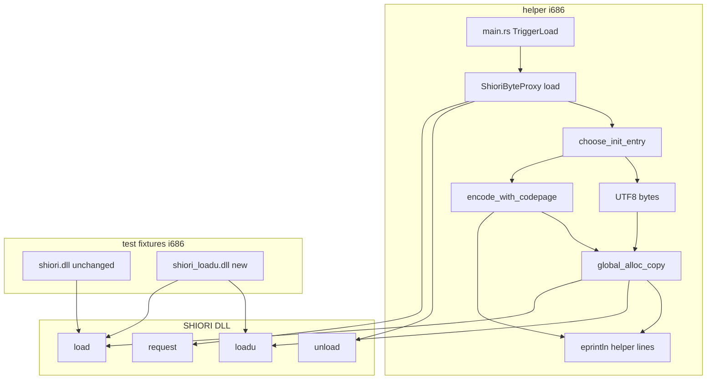
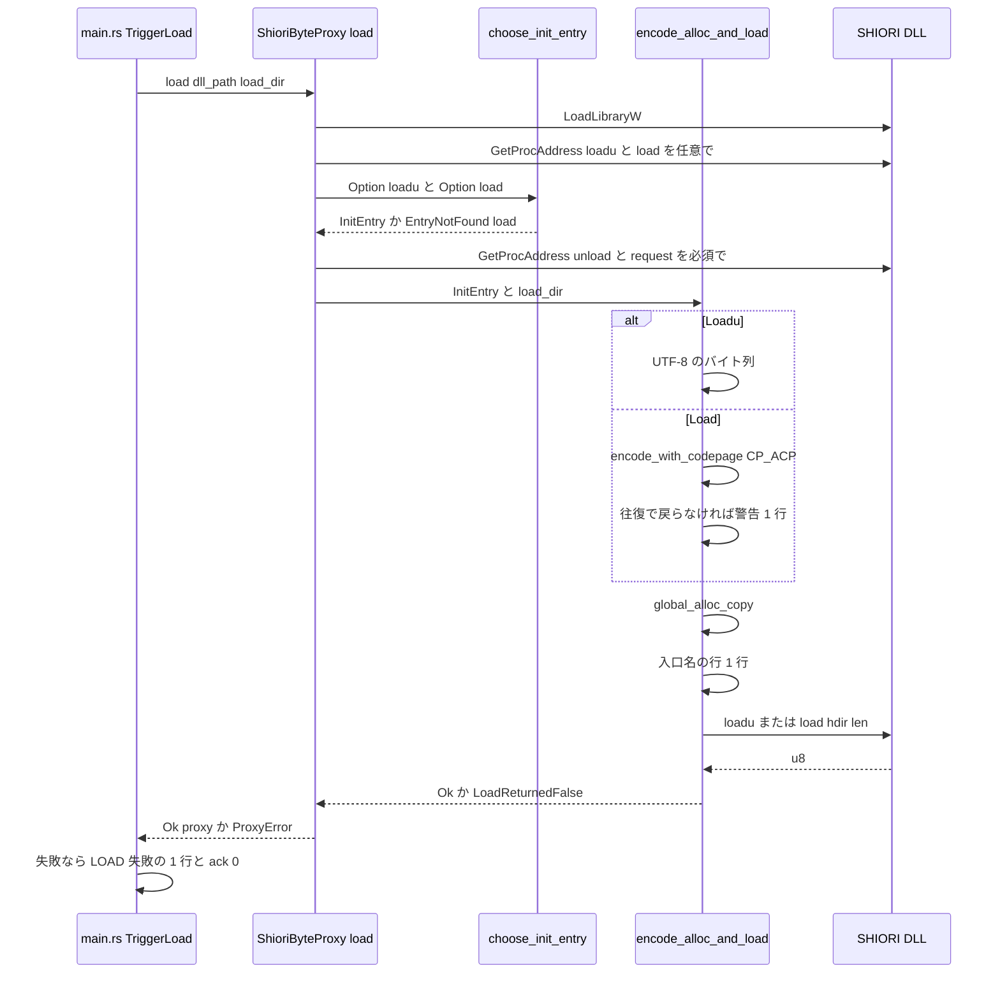

# Design Document: areka-P0-shiori-loadu

> 2026-09-23・本ブランチで実測。コードは「何の定義か」（関数名・型名＋ファイルパス）で指し、行番号では指さない。research.md §8 の設計判断 1〜7・11〜13 は本文書で全て決めた（決定の一覧は末尾「設計判断の対応」・経緯は research.md §10）。

## Overview

**Purpose**: 32bit の助け手（`crates/shiori-host32-helper`）が SHIORI DLL を確立するとき、正典 ukadoc「DLL 共通仕様」が優先する入口 `loadu`（置き場所のパスを UTF-8 で受け取る）を先に引き、在ればそれだけを呼ぶ。無ければ今日と同じ `load`（既定コードページ）を呼ぶが、パスに表せない字があれば警告を 1 行残す。どちらを呼んだかを 1 行記録し、戻り値は 1 バイト整数で受けて 0 か否かで判定する。

**Users**: ゴーストを既定コードページで表せない字を含むフォルダに置いている利用者（`loadu` を持つ SHIORI＝YAYA・pasta なら辞書を見失わなくなる。里々のような `loadu` の無い SHIORI では原因が警告として残る）、`loadu` だけを実装した SHIORI を使いたいゴースト作者、実機確認と障害調査でログを grep する開発者。

**Impact**: 変更は `crates/shiori-host32-helper/src/shiori_proxy.rs` の 2 関数（`ShioriByteProxy::load` の `resolve` クロージャ・`encode_alloc_and_load`）と型定義 2 行に閉じる。親（`shiori-host32-host`）・凍結した受け渡し（`MsgTag`・load-ack 1 バイト）・`main.rs`・既存の偽 DLL・既存テストは **1 行も変えない**。新設は 2 本目の偽 DLL クレートと兄弟テストファイルの 2 つ。

### Goals
- `loadu` の有無 × `load` の有無の 4 通りの判断を、DLL を読まずに検証できる純関数 1 つに閉じる（1.8）。
- `loadu` へは今日 `load` に渡しているのと同じ文字列の UTF-8 を渡す（2.1）。`load` へ渡すバイト列は今日と 1 バイトも変えない（3.2）。
- 表せない字の検出を、実行中の既定コードページが何であっても同じ手順で行う（3.4）。UTF-8 が既定の機械（`GetACP()` = 65001）でも `load` の枝が壊れない。
- 入口名の 1 行と警告の 1 行を、既存の `[helper]` 行と同じ経路（helper の標準エラー出力）に固定の語句で出す（4.1〜4.3）。
- 既存 fixture・既存テスト・host の e2e 4 本を無改変で緑に保つ（6.2・6.8）。

### Non-Goals
- MAKOTO・SAORI・PLUGIN の DLL の読み込み（`areka-P0-makoto-dll-host` ほか）。台帳 `ukadoc:spec_dll` の `status` は `degraded` のまま。
- `request` の文字コード・`unload`／`request` の振る舞い・呼ぶ時機・所有権。変わるのは `unload` の戻り値を受ける型だけ。
- 親側と凍結した受け渡し。親は「どの入口で確立したか」を知らないまま。
- x64 の同居経路（COM `IShiori`）・`crates/pilot/` の先進坑・pasta 上流への `loadu` 追加・パスの末尾区切りの作法。
- 既存 6 か所の `resolve_testdll` の統合（6.8 が既存テストの改変を禁じるため本仕様では行わない。下記「設計判断の対応」7）。

## Boundary Commitments

### This Spec Owns
- **入口の選択**: `shiori_proxy.rs` の純関数 `choose_init_entry` と型 `InitEntry`。判断はここだけ（1.1〜1.8）。
- **初期化の入口へ渡すバイト列の作り方**: `Loadu` → UTF-8（2.1〜2.5）／`Load` → 既定コードページ＋往復比較による表せない字の検出（3.1〜3.6）。関数は `encode_with_codepage`（コードページを引数に取る内側）と `encode_alloc_and_load`（入口別の分岐）。
- **観測の 2 行**: 入口名の行と警告の行。書式・出す位置・回数（4.1〜4.4）。
- **戻り値の受け方**: `LoadFn`／`UnloadFn` の戻りを `u8` にし、`!= 0` で判定（5.1〜5.5）。
- **2 本目の偽 DLL** `crates/shiori-host32-testdll-loadu`（出力 `shiori_loadu.dll`）と、その記録・注入の env 契約（6.1）。
- **兄弟テストファイル** `shiori_proxy_loadu_tests.rs`（純関数テスト x64 常時・fixture 実読 i686 限定・6.3〜6.7）。
- **文書の追随**: `shiori_proxy.rs` 冒頭の確立シーケンス（8.4）・COMPAT §8 の 3 行（8.1）・台帳と正本の該当箇所（8.2・8.3）・host README の手順（6.9）・steering `structure.md` の fixture 節（8.6）。

### Out of Boundary
- `crates/shiori-host32-helper/src/main.rs`（`TriggerLoad` の枝を含む・0 行変更）。入口名の行は proxy が出すので `main.rs` は触らない。
- `crates/shiori-host32-testdll`（既存 fixture・無改変・6.2）。
- `crates/shiori-host32-host/**`（親・e2e 4 本の本文と doc コメントと panic 文言・6.9 後段）。README の「手順」の 1 行追記だけは本仕様が持つ。
- `crates/shiori-host32-helper/src/main_loopback_tests.rs` と `shiori_proxy.rs` の既存 `mod tests`（無改変・6.8）。
- 完了 spec の文書（8.5）・`THIRD-PARTY-NOTICES.md`（`/kiro-complete` の License Gate が撮り直す）・`doc/ukadoc-coverage/report/*.md` の手直し（生成器で撮り直すだけ・8.3）。

### Allowed Dependencies
- `windows` 0.62.2 の `Win32_Globalization`（`WideCharToMultiByte`・`MultiByteToWideChar`・`CP_ACP`・`CP_UTF8`）——helper の `Cargo.toml` で既に有効（`features` に `Win32_Globalization` が在ることを確認済み）。**新しい依存クレート・feature・OS 呼び出しの種類は増やさない**（9.1。`MultiByteToWideChar` は同じ feature の既存 API）。
- 2 本目の偽 DLL は既存 fixture と同じ依存（`windows` の `Win32_Foundation`＋`Win32_System_Memory`）だけ。
- 本番の env 変数は 0 件追加（9.2）。新設 env は fixture の `HOST32_TESTDLL_LOADU_RECORD`・`HOST32_TESTDLL_LOADU_FAIL` の 2 つのみ。
- 依存方向: `shiori-host32-testdll-loadu`（leaf・誰にも依存されない cdylib）← テストが `target/i686-pc-windows-msvc/` の成果物としてだけ読む。helper 本体は fixture クレートに依存しない。

### Revalidation Triggers
- `LoadFn`／`UnloadFn` の署名を再び変える（下流 `areka-P0-makoto-dll-host` は `ShioriByteProxy` を流用する）。
- 入口名の行・警告の行の固定語句を変える（実機確認の grep と、将来の e2e が語句で判定する）。
- fixture の記録ファイルの書式・env 名を変える（`shiori_proxy_loadu_tests.rs` が読む）。
- `ProxyError` に variant を足す（`main.rs` は `{e:?}` で出すだけなので今回は増やさない）。
- 出力名 `shiori_loadu.dll` を変える（README の手順・panic 文言・steering を追随）。

## Architecture

### Existing Architecture Analysis
- **確立の経路は 1 本**: `main.rs` の `handle_message` の `InboundAction::TriggerLoad` の枝 → `ShioriByteProxy::load(&dll_path, &s.load_dir)` → `resolve` クロージャ（`GetProcAddress` ×3）→ `encode_alloc_and_load(load, load_dir)`（`ansi_encode` → `global_alloc_copy` → `load(hdir, len)`）。失敗は `main.rs` が `eprintln!("[helper] LOAD 失敗（観測・ack[0]）: {e:?}")` で 1 行出し、ack `[0]` を返す。
- **ログは `main.rs` に集約され proxy は 0 行**。helper は `tracing` を依存に持たず（`Cargo.toml` の `[dependencies]` に無い）、観測は全て `eprintln!("[helper] …")`。要件の「`warn` 相当」は同じ `eprintln!` の行を指す。
- **`ansi_encode` は表せない字を検出しない**: `WideCharToMultiByte(CP_ACP, 0, &wide, …, PCSTR::null(), None)` を長さ問い合わせと変換の 2 回。最後の引数 `lpUsedDefaultChar` は `Option<*mut BOOL>` で今は `None`。
- **戻り値は Rust `bool`**: `type LoadFn = unsafe extern "C" fn(HGLOBAL, usize) -> bool`・`type UnloadFn = unsafe extern "C" fn() -> bool`。`transmute` でこの型へ落としている。
- **既存テストが固定している契約**: `kernel32_yields_entry_not_found` は `Err(ProxyError::EntryNotFound("load"))` を要求。`ansi_encode_*` の 3 本は `ansi_encode(&Path) -> Result<Vec<u8>, ProxyError>` の署名と ASCII 恒等・空→空を要求。`testdll_*` の 2 本は `resolve_testdll()` と `TESTDLL_SERIAL` を `mod tests` の私有として持つ。
- **fixture の作法**: `crates/shiori-host32-testdll`（`[lib] name = "shiori"`・cdylib・`#[unsafe(no_mangle)] pub unsafe extern "C"`・入力 HGLOBAL は callee が `GlobalFree`・env `HOST32_TESTDLL_*` で注入）。
- **i686 限定の作法**: `#[cfg_attr(not(target_arch = "x86"), ignore = "i686 専用: …")]`。fixture は `CARGO_MANIFEST_DIR/../../target/i686-pc-windows-msvc/{debug,release}/<名>.dll` を探し、無ければ先ビルドの命令を書いて panic。
- **兄弟テストファイルの作法**: `main.rs` の `#[cfg(test)] #[path = "main_loopback_tests.rs"] mod loopback_tests;`（同型が 5 本）。
- **workspace のメンバは `crates/*` の glob**（ルート `Cargo.toml`）＝新クレートは `Cargo.toml` の編集なしで加わる。

### Architecture Pattern & Boundary Map



**Architecture Integration**:
- 選んだ形: research.md §5 の **案 A**（既存 2 関数の拡張）を本体に、テストは **案 C**（兄弟ファイル）へ。判断の純関数 1 つ・符号化の分岐 1 つ・ログ 2 行を全て `shiori_proxy.rs` に置き、unsafe の集約（9.3）と 1,000 行未満（9.4）を同時に満たす。案 B（新モジュールへ切り出し）は unsafe が 2〜3 ファイルに広がるので採らない。
- 境界: **判断**（`choose_init_entry`）・**符号化**（`encode_with_codepage`／UTF-8）・**呼出**（`encode_alloc_and_load`）の 3 つを別の関数にし、それぞれ独立に検証する。`main.rs` は結果の `Result` しか見ない（親へは今日と同じ ack）。
- 保つ作法: 半構築を残さない（確立途中の失敗は `FreeLibrary` してから `Err`）・入力 HGLOBAL は callee 解放・`ProxyError` の variant を増やさない（`main.rs` の `{e:?}` がそのまま失敗種別を出す＝4.4）。
- 新設の理由: `InitEntry`／`choose_init_entry` は「4 通りの判断を DLL を読まずに検証する」（1.8・6.3）ため。`encode_with_codepage` は「検出の判定を機械の既定コードページに依存せず検証する」（6.5）ため。2 本目の偽 DLL は既存 fixture を無改変で残しつつ `loadu` の実呼出を踏む（6.1・6.2）ため。
- steering との整合: 32bit 可搬性は host-32 系のみ（`tech.md`）・unsafe は Win32 呼び出しに限定し Safety を書く・ログ無し失敗経路 0 本・本番 env は増やさない・1 ファイル 1,000 行未満（`structure.md`）。

### Technology Stack

| Layer | Choice / Version | Role in Feature | Notes |
|---|---|---|---|
| helper 本体 | Rust（edition 2024・i686-pc-windows-msvc）＋ `windows` 0.62.2 `Win32_Globalization`／`Win32_System_LibraryLoader`／`Win32_System_Memory` | `GetProcAddress` で `loadu` を任意解決・`WideCharToMultiByte`／`MultiByteToWideChar` で符号化と往復比較 | 新依存 0・feature 追加 0。`MultiByteToWideChar(codepage, flags, &[u8], Option<&mut [u16]>) -> i32` の形で使える（windows 0.62.2 の `Globalization/mod.rs` で確認） |
| fixture | Rust cdylib（i686）＋ `windows` `Win32_Foundation`／`Win32_System_Memory` | `loadu`／`load`／`unload`／`request` の 4 公開・記録と注入 | 既存 fixture と同じ依存 |
| テスト | `cargo test`（x64 常時＋ `--target i686-pc-windows-msvc` 限定） | 純関数の決定論・fixture 実読 | 既存の `#[cfg_attr(ignore)]` の作法 |
| 文書・台帳 | Markdown・TOML・`ukadoc-survey` の `report`／`report-summary` | 裁定の登記・台帳の追随 | 生成物は生成器で撮り直す |

## File Structure Plan

### Directory Structure
```
crates/
├── shiori-host32-helper/src/
│   ├── shiori_proxy.rs                 # 変更: 型 u8・InitEntry・choose_init_entry・resolve・encode_with_codepage・encode_alloc_and_load・ログ 2 行・冒頭 doc・兄弟テストの接続宣言
│   ├── shiori_proxy_loadu_tests.rs     # 新規: 本仕様のテスト（純関数 x64 常時 3 群＋fixture 実読 i686 2 本）・自前の LOADU_SERIAL と resolve_loadu_testdll
│   ├── main.rs                         # 無改変
│   └── main_loopback_tests.rs          # 無改変
├── shiori-host32-testdll/              # 無改変（load のみの fixture）
└── shiori-host32-testdll-loadu/        # 新規: 2 本目の fixture クレート
    ├── Cargo.toml                      # [lib] name = "shiori_loadu"・crate-type cdylib・publish = false
    └── src/lib.rs                      # loadu／load／unload／request の 4 公開・記録 env・偽返却 env
crates/shiori-host32-host/README.md     # 変更: 「手順（コピペ可）」① に 2 本目の先ビルドを 1 行
doc/COMPAT_ARCHITECTURE.md              # 変更: §8 の表の末尾に裁定 3 行
doc/ukadoc-coverage/briefing-shiori.md  # 変更（正本・手で）: 群 14c の「判断の根拠の場所」「共通 note」・「足りない物」⑴
doc/ukadoc-coverage/ledger/shiori.toml  # 変更（写し・手で）: 冒頭注釈 群 14c・[entry."ukadoc:spec_dll"] の note（「壊れ方:」「ログ:」「根拠の場所:」）
doc/ukadoc-coverage/report/shiori.md    # 生成器で撮り直し（手で直さない）
doc/ukadoc-coverage/report/summary.md   # 生成器で撮り直し（手で直さない）
.kiro/steering/structure.md             # 変更: 「Test DLL Fixture Crates」の節に 2 本目を 1 項目
```

### Modified Files
- `crates/shiori-host32-helper/src/shiori_proxy.rs` — (a) `LoadFn`／`UnloadFn` の戻りを `u8` に。(b) `enum InitEntry` と `fn choose_init_entry` を新設。(c) `resolve` クロージャが `loadu`／`load` を任意で引いて `choose_init_entry` を通し、`unload`／`request` は必須のまま。(d) `encode_alloc_and_load(entry: InitEntry, load_dir)` が入口別にバイト列を作り、警告と入口名の行を出し、`!= 0` で判定。(e) `fn encode_with_codepage(cp, path) -> Result<CodepageEncoded, ProxyError>` を新設し、`ansi_encode` はその薄い包み（署名不変・既存テストの保護）。(f) `struct ShioriByteProxy` の `load: LoadFn` 欄（読む者が無い記録欄）を外す。(g) 冒頭の「確立シーケンス」を 4 入口と選択に合わせて書き直す（8.4）。(h) 末尾に `#[cfg(test)] #[path = "shiori_proxy_loadu_tests.rs"] mod loadu_tests;`。既存 `mod tests` は無改変。
- `crates/shiori-host32-host/README.md` — 「手順（コピペ可）」① の `cargo build -p shiori-host32-testdll …` の次に `cargo build -p shiori-host32-testdll-loadu --target i686-pc-windows-msvc` を 1 行（6.9）。
- `doc/COMPAT_ARCHITECTURE.md` — §8 の表に 3 行追記（8.1）。
- `doc/ukadoc-coverage/briefing-shiori.md` → `doc/ukadoc-coverage/ledger/shiori.toml`（この順・正本→写し）— 「loadu は引かない」「3 つを名前で引く」の記述を実装に合わせる（8.2・8.3）。
- `.kiro/steering/structure.md` — fixture 節に `shiori-host32-testdll-loadu` を 1 項目（8.6）。

## System Flows



流れの決めごと:
- `loadu` と `load` の解決は**両方とも失敗を許す**（`Option`）。「両方無い」だけを `EntryNotFound("load")` にする（名札は既存テストが固定する値・下記「設計判断の対応」4）。`unload`・`request` は今日と同じく欠ければ即 `EntryNotFound("unload")`／`("request")`（1.7）。
- 初期化の入口は **1 回の確立で高々 1 回**呼ぶ。`InitEntry` は 1 つの fn ポインタしか持たないので、両方を呼ぶ経路は型の上で存在しない（1.5）。`loadu` が 0 を返しても `load` へは落ちない（1.6・`Err(LoadReturnedFalse)` で終わる）。
- 警告の行は符号化の直後（`Load` の枝だけ・3.5）、入口名の行は呼ぶ直前（成功・失敗を問わず 1 回・4.2）。符号化や確保で失敗したときは入口を呼ばないので入口名の行は出ず、失敗の種別は `main.rs` の既存の 1 行が出す（4.4）。

## Requirements Traceability

| Requirement | Summary | Components | Interfaces | Flows |
|---|---|---|---|---|
| 1.1 | 両方在れば `loadu` だけ | `choose_init_entry` | `(Some, _) → Loadu` | 選択 |
| 1.2 | `loadu` のみでも受け入れる | `choose_init_entry` | `(Some, None) → Loadu` | 選択 |
| 1.3 | `load` のみは今日どおり | `choose_init_entry` | `(None, Some) → Load` | 選択 |
| 1.4 | 両方無い→入口が無い失敗・1 行・ack 0 | `choose_init_entry`・`main.rs`（無改変） | `(None, None) → EntryNotFound("load")` | 選択→失敗 |
| 1.5 | 合わせて高々 1 回 | `InitEntry`（fn ポインタ 1 つ）・`encode_alloc_and_load` | 呼出 1 か所 | 呼出 |
| 1.6 | `loadu` が 0 でも `load` へ落ちない | `encode_alloc_and_load` | `ret == 0 → LoadReturnedFalse` | 呼出 |
| 1.7 | `unload`・`request` は必須のまま | `resolve` クロージャ | `EntryNotFound("unload"/"request")` | 解決 |
| 1.8 | 判断を 1 か所に | `choose_init_entry` | 純関数 | — |
| 2.1 | 同じ文字列の UTF-8 | `encode_alloc_and_load`（`Loadu` の枝） | `Path::to_str` → `as_bytes` | 符号化 |
| 2.2 | 正味長・NUL 無し | 同上 | `len = bytes.len()` | 符号化 |
| 2.3 | メモリ規約同一 | `global_alloc_copy`（既存） | callee 解放 | 確保 |
| 2.4 | 非 ASCII を置き換えない | `Loadu` の枝 | UTF-8 そのまま | 符号化 |
| 2.5 | 新依存・新 OS 呼出なし | `Loadu` の枝 | 標準ライブラリのみ | — |
| 3.1 | 表せない字→警告 1 行（best-fit 含む） | `encode_with_codepage`・`encode_alloc_and_load` | `CodepageEncoded.lossy`・警告の固定語句 | 符号化 |
| 3.2 | 警告しても渡す・バイト列は今日と同一 | `encode_with_codepage` | 変換は既存の 2 回呼びのまま（フラグ 0） | 符号化 |
| 3.3 | 表せる字だけなら 0 行 | `encode_with_codepage` | `lossy == false` | 符号化 |
| 3.4 | CP932 を前提にしない | `encode_with_codepage` | 往復比較（コードページ非依存） | 符号化 |
| 3.5 | `loadu` の枝では判定しない | `encode_alloc_and_load` | `Loadu` の枝は `encode_with_codepage` を呼ばない | 符号化 |
| 3.6 | 変換失敗→`EncodingFailed`・1 行 | `encode_with_codepage`・`main.rs`（無改変） | `needed <= 0`／`written <= 0` | 符号化→失敗 |
| 4.1 | 入口名を 1 行 | `encode_alloc_and_load` | `[helper] SHIORI 初期化の入口: {loadu\|load}` | 呼出 |
| 4.2 | 呼ぶ直前に 1 回だけ | `encode_alloc_and_load` | 呼出の直前の 1 文 | 呼出 |
| 4.3 | 書式固定 | 定数 `INIT_ENTRY_LOG_PREFIX` | 固定語句 | — |
| 4.4 | 失敗種別 1 行 | `main.rs`（無改変・`{e:?}`）・`ProxyError`（variant 不変） | 既存の `LOAD 失敗` 行 | 失敗 |
| 4.5 | 親へ伝えない | `main.rs`・`load_result_to_ack`（無改変） | ack 1 バイト | — |
| 5.1 | `u8`・0 か否か | `LoadFn`／`UnloadFn`・`encode_alloc_and_load` | `-> u8`・`!= 0` | 呼出 |
| 5.2 | 0 以外は成功 | `encode_alloc_and_load` | `!= 0` | 呼出 |
| 5.3 | 0 は失敗 | 同上 | `LoadReturnedFalse` | 呼出 |
| 5.4 | `unload` の戻りは無視 | `Drop`（`let _ =` のまま） | `UnloadFn -> u8` | teardown |
| 5.5 | `request` の署名不変 | `RequestFn`（無改変） | — | — |
| 6.1 | 2 本目の偽 DLL | `shiori-host32-testdll-loadu` | env `HOST32_TESTDLL_LOADU_RECORD`／`_FAIL`・記録書式 | — |
| 6.2 | 既存 fixture 無改変 | `shiori-host32-testdll`（触らない） | — | — |
| 6.3 | 判断表 4 行を x64 で | `shiori_proxy_loadu_tests.rs` 群 A | `choose_init_entry` | — |
| 6.4 | UTF-8 固定バイト列 | 同 群 B | `Loadu` の枝のバイト列 | — |
| 6.5 | 検出をコードページ非依存で | 同 群 C | `encode_with_codepage(20127 / 65001, …)` | — |
| 6.6 | i686 で `loadu` 実呼出・`load` 無し・UTF-8 一致 | 同 群 D-1 | 記録ファイル | — |
| 6.7 | i686 で偽返却→`LoadReturnedFalse`・`load` 無し | 同 群 D-2 | `HOST32_TESTDLL_LOADU_FAIL=1` | — |
| 6.8 | 既存テスト無改変で緑 | 既存 `mod tests`・`main_loopback_tests.rs`・host e2e 4 本 | `ansi_encode` 署名不変・`EntryNotFound("load")` 不変 | — |
| 6.9 | 先ビルド手順の全ての場所 | host README・新テストの panic 文言 | 1 行追記 | — |
| 6.10 | `cargo test --workspace` 緑 | 全て | — | — |
| 7.1 | YAYA・pasta→`loadu`・喋る | 実機手順 | 入口名の行の grep | 実機 |
| 7.2 | 里々→`load`・警告 0 | 実機手順 | 同上 | 実機 |
| 7.3 | 表せない字のフォルダ・赤の先取り | 実機手順 | 警告の行の grep | 実機 |
| 7.4 | 検体の入口を取り直す | 実機手順 | `dumpbin /exports` | 実機 |
| 7.5 | 判定の分岐のログ水準 | 実機手順 | `[helper]` 行は stderr 直・親は `RUST_LOG` | 実機 |
| 8.1 | COMPAT §8 に 3 行 | `doc/COMPAT_ARCHITECTURE.md` | 表の行 | — |
| 8.2 | 台帳 `note`・冒頭注釈 | `doc/ukadoc-coverage/ledger/shiori.toml` | 手で | — |
| 8.3 | 正本→写し→生成器 | `briefing-shiori.md`・台帳・`report/*.md` | `cargo run -p ukadoc-survey -- report`／`report-summary`・`cargo test -p ukadoc-survey` | — |
| 8.4 | 冒頭の確立シーケンス | `shiori_proxy.rs` モジュール doc | — | — |
| 8.5 | 完了 spec 無改変 | （触らない） | — | — |
| 8.6 | steering fixture 節 | `.kiro/steering/structure.md` | 1 項目 | — |
| 9.1 | 新依存 0 | 全て | — | — |
| 9.2 | 本番 env 追加 0 | fixture のみ `HOST32_TESTDLL_LOADU_*` | — | — |
| 9.3 | unsafe 集約＋Safety | `shiori_proxy.rs`・fixture `lib.rs` | — | — |
| 9.4 | 1,000 行未満 | `shiori_proxy.rs`（見込み 670 行前後）・兄弟テスト・fixture | — | — |
| 9.5 | x64 常時／i686 限定 | 兄弟テストの群 A〜C／群 D | `#[cfg_attr(not(target_arch = "x86"), ignore)]` | — |
| 9.6 | ログ無し失敗 0 本 | `ProxyError` 全 variant→`main.rs` の 1 行・警告の行 | — | — |

## Components and Interfaces

| Component | Domain/Layer | Intent | Req Coverage | Key Dependencies | Contracts |
|---|---|---|---|---|---|
| `InitEntry`／`choose_init_entry` | helper・proxy 内 純関数 | 4 通りの判断と呼ぶ fn の選択を 1 つに | 1.1〜1.8, 6.3 | なし | Service |
| `encode_with_codepage`／`CodepageEncoded`／`ansi_encode` | helper・proxy 内 符号化 | 既定コードページ符号化＋往復比較の検出（コードページを引数に） | 3.1〜3.6, 6.5 | `windows` Globalization（P0） | Service |
| `encode_alloc_and_load` | helper・proxy 内 呼出 | 入口別にバイト列を作り・確保・観測 2 行・呼出・`u8` 判定 | 1.5, 1.6, 2.1〜2.5, 3.5, 4.1〜4.3, 5.1〜5.3 | `global_alloc_copy`（P0） | Service |
| `resolve` クロージャ・型 `LoadFn`／`UnloadFn` | helper・proxy 内 解決 | `loadu`／`load` を任意、`unload`／`request` を必須で引く・戻り `u8` | 1.7, 5.1, 5.4, 5.5 | `GetProcAddress`（P0） | Service |
| `shiori-host32-testdll-loadu` | fixture（i686 cdylib） | `loadu`＋`load` を持つ偽 DLL・記録・偽返却の注入 | 6.1, 6.2, 6.6, 6.7 | `windows` Foundation/Memory | Batch（env） |
| `shiori_proxy_loadu_tests.rs` | helper・テスト | 純関数 3 群（x64）＋fixture 実読 2 本（i686） | 6.3〜6.7, 6.9, 9.5 | 上の全て | — |
| 文書・台帳 | doc | 裁定の登記・台帳と正本の追随・手順と steering | 6.9, 8.1〜8.6 | `ukadoc-survey` | — |

### helper（`crates/shiori-host32-helper/src/shiori_proxy.rs`）

#### `InitEntry`／`choose_init_entry`

| Field | Detail |
|---|---|
| Intent | `loadu` の有無 × `load` の有無の 4 通りから、呼ぶ入口を 1 つ選ぶ純関数 |
| Requirements | 1.1, 1.2, 1.3, 1.4, 1.5, 1.6, 1.8, 6.3 |

**Responsibilities & Constraints**
- 判断はこの関数だけ。`resolve` クロージャは `GetProcAddress` の結果（`Option`）を渡すだけで、順序や優先を自分で決めない。
- `InitEntry` は fn ポインタを 1 つしか持たない＝両方を呼ぶ経路が型の上で無い（1.5）。`loadu` が 0 を返したときに `load` を試す枝は `encode_alloc_and_load` に存在しない（1.6）。
- 両方無いときの名札は `"load"`（既存テスト `kernel32_yields_entry_not_found` が固定）。`ProxyError::EntryNotFound` の doc に「初期化の入口（`loadu`／`load`）が両方無いときは `"load"` と記す」と書く。

**Dependencies**
- Inbound: `ShioriByteProxy::load` の `resolve` クロージャ（P0）。
- Outbound: なし（純関数）。

**Contracts**: Service [x]

##### Service Interface
```rust
/// `loadu`／`load` 共通の flat-C cdecl 署名。戻りは 1 バイト整数（0 = 失敗・0 以外 = 成功）。
type LoadFn = unsafe extern "C" fn(hdir: HGLOBAL, len: usize) -> u8;
type UnloadFn = unsafe extern "C" fn() -> u8;
type RequestFn = unsafe extern "C" fn(req: HGLOBAL, len: *mut usize) -> HGLOBAL; // 不変

/// 選ばれた初期化の入口。fn ポインタを 1 つだけ持つ。
enum InitEntry { Loadu(LoadFn), Load(LoadFn) }
impl InitEntry {
    fn name(&self) -> &'static str;   // "loadu" | "load"（入口名の行と fixture の記録の語）
    fn func(&self) -> LoadFn;
}

/// 4 通りの判断表。DLL を読まずに検証できる。
fn choose_init_entry(loadu: Option<LoadFn>, load: Option<LoadFn>) -> Result<InitEntry, ProxyError>;
```
- Preconditions: 引数は `GetProcAddress` の結果を `LoadFn` に `transmute` したもの（`None` は未解決）。
- Postconditions: `(Some(u), _) → Ok(Loadu(u))`／`(None, Some(l)) → Ok(Load(l))`／`(None, None) → Err(EntryNotFound("load"))`。`Loadu` を返すとき `load` の値は捨てる（保持しない）。
- Invariants: 戻りの `InitEntry` が持つ fn は引数のどちらか 1 つと同一。

**Implementation Notes**
- Integration: `resolve` クロージャは `loadu` → `load` の順に `GetProcAddress` を呼び（どちらも `?` を付けない）、`choose_init_entry(loadu, load)?` の後で `unload`・`request` を必須で引く。この順なので kernel32 のような「何も無い」DLL の最初の失敗は今日と同じ `EntryNotFound("load")`。
- Validation: 群 A のテストが 4 行を fn ポインタの同一性（`as usize`）で判定。
- Risks: なし（純関数）。

#### `encode_with_codepage`／`CodepageEncoded`／`ansi_encode`

| Field | Detail |
|---|---|
| Intent | 指定コードページへ符号化し、往復して元に戻るかで「表せない字の有無」を判定する |
| Requirements | 3.1, 3.2, 3.3, 3.4, 3.6, 6.5, 6.8 |

**Responsibilities & Constraints**
- **本番の変換は今日のまま**: `WideCharToMultiByte(cp, 0, &wide, …, PCSTR::null(), None)` の 2 回呼び（フラグ 0・既定文字は OS 既定）。`cp = CP_ACP` のとき返す `bytes` は今日の `ansi_encode` と 1 バイトも変わらない（3.2）。
- **検出は変換の後の比較**: `MultiByteToWideChar(cp, 0, &bytes, …)` で UTF-16 に戻し、元の `wide` と比べる。一致しなければ `lossy = true`。既定文字への置き換え（`?`）も、似た字への置き換え（best-fit）も、戻せば元と違うので同じ手順で捕まる（3.1）。コードページの値で分岐しないので、`GetACP()` が 65001 の機械でも同じ手順で `lossy = false` になる（3.4。`lpUsedDefaultChar` は 65001 で関数自体が失敗する＝採らない）。
- 戻す側の変換が 0 以下を返した（判定できない）ときは `lossy = true` に寄せる（警告して渡す＝確立は止めない・ログ無しにしない）。変換の側（往路）が 0 以下なら今日と同じ `Err(EncodingFailed)`（3.6）。
- 空パスは `bytes` 空・`lossy = false`（今日と同じ）。

**Dependencies**
- External: `windows::Win32::Globalization::{WideCharToMultiByte, MultiByteToWideChar, CP_ACP}`（P0・既存 feature）。

**Contracts**: Service [x]

##### Service Interface
```rust
struct CodepageEncoded {
    bytes: Vec<u8>,   // 入口へ渡すバイト列（cp = CP_ACP なら今日の ansi_encode と同一）
    lossy: bool,      // 往復で元に戻らない字が 1 つ以上あった
}
/// テストのためにコードページを引数で受ける内側。本番は CP_ACP で呼ぶ。
fn encode_with_codepage(cp: u32, path: &Path) -> Result<CodepageEncoded, ProxyError>;
/// 既存の署名を保つ薄い包み（既存テスト 3 本が固定）。`encode_with_codepage(CP_ACP, path).map(|e| e.bytes)`。
fn ansi_encode(path: &Path) -> Result<Vec<u8>, ProxyError>;
```
- Preconditions: `path` は `OsStr`（UTF-16）。
- Postconditions: `Ok(e)` のとき `e.bytes` は正味長（NUL 無し）。`e.lossy == (decode(cp, e.bytes) != encode_wide(path))`。
- Invariants: `ansi_encode(p) == encode_with_codepage(CP_ACP, p).map(|e| e.bytes)`。

**Implementation Notes**
- Integration: `encode_alloc_and_load` の `Load` の枝は `encode_with_codepage(CP_ACP, load_dir)` を直接呼ぶ（`lossy` が要るため）。`ansi_encode` を呼ぶのは既存テストだけになる（`#![allow(dead_code)]` が既に在るので警告は出ない）。
- Validation: 群 C のテストが `cp = 20127`（US-ASCII）で非 ASCII を含むパス→`lossy = true`・ASCII だけ→`false`、`cp = 65001`（UTF-8）で絵文字を含むパス→`false` を固定。機械の既定コードページには触れない（6.5）。20127 が無効な機械では往路が 0 以下＝`Err` になってテストが赤で気付く（黙って緑にならない）。そのときの代替は 1252。
- Risks: 往復比較は OS 呼び出しが 2 回（長さ問い合わせ＋変換）増えるが、確立は 1 回きりなので無視できる。

#### `encode_alloc_and_load`

| Field | Detail |
|---|---|
| Intent | 入口別にバイト列を作り、確保し、観測の 2 行を出し、入口を 1 回呼んで `u8` で判定する |
| Requirements | 1.5, 1.6, 2.1, 2.2, 2.3, 2.4, 2.5, 3.5, 4.1, 4.2, 4.3, 5.1, 5.2, 5.3 |

**Responsibilities & Constraints**
- `Loadu` の枝: `load_dir.to_str()` の `as_bytes()`（標準ライブラリのみ・置き換え無し・NUL 無し・2.1〜2.5）。`to_str()` が `None`（argv が不正な UTF-16＝実際には起きない）なら `Err(EncodingFailed)`（3.6 と同じ種別・`main.rs` の 1 行が出る）。この枝は `encode_with_codepage` を呼ばない（3.5）。
- `Load` の枝: `encode_with_codepage(CP_ACP, load_dir)?`。`lossy` なら警告の行を 1 行出し、それでも `bytes` を渡す（3.1・3.2）。
- 確保は既存の `global_alloc_copy`（callee 解放・2.3）。
- **入口名の行は呼ぶ直前に 1 回**（4.1・4.2）。符号化・確保で失敗したときは出ない（入口を呼んでいないので「呼んだ入口」は無い）。
- 呼出は `entry.func()(hdir, len)` の 1 か所（1.5）。戻り `u8` を `!= 0` で判定し、0 なら `Err(LoadReturnedFalse)`（1.6・5.1〜5.3）。`== 1` とは書かない。

**Dependencies**
- Inbound: `ShioriByteProxy::load`（P0）。
- Outbound: `encode_with_codepage`・`global_alloc_copy`（P0）・`eprintln!`（helper の標準エラー出力）。

**Contracts**: Service [x]

##### Service Interface
```rust
/// 入口別のバイト列（呼出の前段・fn ポインタは呼ばない）。
/// Loadu → `load_dir.to_str()` の UTF-8（None は EncodingFailed）／Load → `encode_with_codepage(CP_ACP, ..)`＋lossy なら警告 1 行。
fn init_bytes(entry: &InitEntry, load_dir: &Path) -> Result<Vec<u8>, ProxyError>;

/// `init_bytes` → `global_alloc_copy` → 入口名の行 → `entry.func()(hdir, len)` → `!= 0` 判定。
fn encode_alloc_and_load(entry: InitEntry, load_dir: &Path) -> Result<(), ProxyError>;

/// 固定語句（実機確認の grep が判定に使う・4.3）。
const INIT_ENTRY_LOG_PREFIX: &str = "[helper] SHIORI 初期化の入口: ";
// 出す行:  "[helper] SHIORI 初期化の入口: loadu"  または  "[helper] SHIORI 初期化の入口: load"
const LOSSY_PATH_WARN_PREFIX: &str = "[helper] 警告: load_dir に既定コードページで表せない字があり別の字へ置き換えた（loadu が無いため load へ渡す）: ";
// 出す行:  上の語句 ＋ 元のパス（`Path::display()`）
```
- Preconditions: `entry` は `choose_init_entry` の戻り。`load_dir` は helper の argv／env 由来。
- Postconditions: `Ok(())` ⇔ 入口が 0 以外を返した。入口名の行は入口を呼んだときだけ、ちょうど 1 回。警告の行は `Load` の枝で `lossy` のときだけ、ちょうど 1 回。入力 HGLOBAL は callee へ move 済み。
- Invariants: `loadu` と `load` を合わせて高々 1 回しか呼ばない。

**Implementation Notes**
- Integration: `ShioriByteProxy::load` は `encode_alloc_and_load(entry, load_dir)` の失敗で今日と同じく `FreeLibrary` してから `Err`。`struct ShioriByteProxy` の `load: LoadFn` 欄は読む者が無いので外す（`unload`・`request`・`module` は不変）。
- Validation: 群 D-1（i686）が記録ファイルで「`loadu` の行が 1 つ・`load` の行が 0・バイト列が UTF-8 と一致」を判定。群 D-2 が「`HOST32_TESTDLL_LOADU_FAIL=1` → `Err(LoadReturnedFalse)`・`load` の行が 0」を判定。
- Risks: proxy に初めて `eprintln!` が入る（今は `main.rs` だけ）。observability の窓口が 2 ファイルになるが、両方とも `[helper]` の接頭辞で同じ stderr に出るので grep の作法は変わらない。

#### `resolve` クロージャ・`Drop`・型（既存の変更点）

| Field | Detail |
|---|---|
| Intent | `loadu`／`load` を任意で、`unload`／`request` を必須で引く。戻り値の型を `u8` に |
| Requirements | 1.7, 5.1, 5.4, 5.5 |

- `resolve` の戻りは `(InitEntry, UnloadFn, RequestFn)`。`transmute` の対象型が `-> bool` から `-> u8` へ変わるだけで、Safety の根拠（cdecl・EAX の下位 1 バイト・HGLOBAL/usize 幅）は同じ文で書き直す。
- `Drop` は `let _ = (self.unload)();` のまま（戻りを捨てる・5.4）。既存 fixture の `unload() -> bool` は 1 バイトで ABI が一致するので無改変で通る（設計判断 11・確認のみ）。
- `RequestFn` は触らない（5.5）。

### fixture（`crates/shiori-host32-testdll-loadu`）

#### `shiori-host32-testdll-loadu`

| Field | Detail |
|---|---|
| Intent | `loadu` と `load` の両方を持ち、どちらが呼ばれ何を受け取ったかをファイルに書き、`loadu` の偽返却を env で注入できる偽 32bit DLL |
| Requirements | 6.1, 6.2, 6.6, 6.7, 9.2, 9.3 |

**Responsibilities & Constraints**
- クレート名 `shiori-host32-testdll-loadu`・`[lib] name = "shiori_loadu"`（出力 `shiori_loadu.dll`）・`crate-type = ["cdylib"]`・`publish = false`。**`shiori.dll` は使えない**（同じ target フォルダで出力名が衝突し、既存 6 か所の解決器が拾う `shiori.dll` を壊す）。
- 公開 4 つ（`#[unsafe(no_mangle)] pub unsafe extern "C"`）:
  - `loadu(hdir: HGLOBAL, len: usize) -> i32`・`load(hdir: HGLOBAL, len: usize) -> i32`: 受け取った `len` バイトをコピー→入力 HGLOBAL を `GlobalFree`（callee 解放）→記録を 1 行**追記**→戻り。`loadu` は env `HOST32_TESTDLL_LOADU_FAIL` が `"1"` なら `0`、それ以外は `1`。`load` は常に `1`。
  - `unload() -> i32`: 常に `1`（マーカーは持たない・今回の対象外）。
  - `request(req: HGLOBAL, len: *mut usize) -> HGLOBAL`: 入力を `GlobalFree` し、固定の `SHIORI/3.0 400 Bad Request\r\n\r\n` を新しい `GlobalAlloc(GMEM_FIXED)` に入れて `*len` を書き戻して返す（解決できることだけが要件・往復は対象外）。
- **戻りの型は Win32 `BOOL` と同じ 4 バイト `i32`**（既存 fixture は Rust `bool` 1 バイト）。helper が `u8` で受けたとき「C 製の DLL（`BOOL`）」と「pasta（1 バイト）」の両方を偽 DLL で踏むことになり、5.1 の両側が無償で揃う。
- unsafe は各ブロックに Safety（9.3）。依存は `windows` の `Win32_Foundation`＋`Win32_System_Memory` だけ。

**Contracts**: Batch [x]（env による注入と記録）

##### Batch / Job Contract
- Trigger: helper（テスト）が `LoadLibraryW` → `GetProcAddress` → 入口を呼ぶ。
- Input / validation: env `HOST32_TESTDLL_LOADU_RECORD`（記録ファイルの絶対パス・未設定なら書かない）・`HOST32_TESTDLL_LOADU_FAIL`（`"1"` で `loadu` が 0 を返す）。接頭辞は既存と同じ `HOST32_TESTDLL_`（9.2）。
- Output / destination: 記録ファイルへ **1 呼出 1 行を追記**。書式は `<入口名>\t<受け取ったバイト列の小文字 16 進>\n`（例: `loadu\t433a5c...`）。16 進にするのは任意のバイト列と改行を 1 行に閉じるため。`load` も同じファイルへ追記するので、「`load` が呼ばれなかった」は「`load\t` で始まる行が 0」で判定できる。
- Idempotency & recovery: 追記のみ。ファイルの作成と削除はテストが行う。書けなくても DLL は落ちない（`let _ =`）。

**Implementation Notes**
- Integration: workspace の `members = ["crates/*"]` で自動的にメンバになる。先ビルドは `cargo build -p shiori-host32-testdll-loadu --target i686-pc-windows-msvc`（PowerShell）。
- Validation: 群 D-1・D-2 が読む。fixture 自身の単体テスト（x64 で `loadu`／`load` を直接呼び、記録の書式と偽返却を判定する 2〜3 本）を `lib.rs` の `mod tests` に置く（既存 fixture の作法）。
- Risks: `request` の 400 固定は「解決できる」以上のことを保証しない。将来 2 本目で往復を試す spec が出たら、そのとき既存 fixture の `parse_request` を写すのではなく共有を検討する（今は要らない）。

### テスト（`crates/shiori-host32-helper/src/shiori_proxy_loadu_tests.rs`）

#### `shiori_proxy_loadu_tests.rs`

| Field | Detail |
|---|---|
| Intent | 本仕様の判断・符号化・検出・実呼出を固定する。既存 `mod tests` には触らない |
| Requirements | 6.3, 6.4, 6.5, 6.6, 6.7, 6.9, 9.4, 9.5 |

- 接続: `shiori_proxy.rs` 末尾の `#[cfg(test)] #[path = "shiori_proxy_loadu_tests.rs"] mod loadu_tests;`（`main.rs` の前例）。`use super::*` で私有項目（`choose_init_entry`・`encode_with_codepage`・`InitEntry`・`ShioriByteProxy`）に届く。
- **群 A（x64 常時）判断表 4 行**: ダミーの `unsafe extern "C" fn` を 2 つ用意し、`choose_init_entry` の 4 通りを変種と fn ポインタの同一性で判定。両方無い→`EntryNotFound("load")`。
- **群 B（x64 常時）UTF-8 固定バイト列**: `r"C:\ゴースト😀\master"` のような CP932 に在る字と無い字を含むパスで、`init_bytes(&InitEntry::Loadu(dummy), path)` が返すバイト列が `str::as_bytes` と一致し NUL 無し（fn ポインタは呼ばれないのでダミーでよい）。
- **群 C（x64 常時）検出の決定論**: `encode_with_codepage(20127, ASCII だけ)` → `lossy = false`・`bytes` が恒等／`encode_with_codepage(20127, 非 ASCII を含む)` → `lossy = true`／`encode_with_codepage(65001, 絵文字を含む)` → `lossy = false`・`bytes` が UTF-8 と一致。機械の既定コードページを読まない。
- **群 D（i686 限定・`#[cfg_attr(not(target_arch = "x86"), ignore = "i686 専用: …")]`）**: 自前の `static LOADU_SERIAL: Mutex<()>`（env `HOST32_TESTDLL_LOADU_*` は既存 fixture の env と重ならないので既存 `TESTDLL_SERIAL` との共用は不要）と `fn resolve_loadu_testdll() -> PathBuf`（env `HOST32_TESTDLL_LOADU_DLL` → `target/i686-pc-windows-msvc/{debug,release}/shiori_loadu.dll` → 無ければ `cargo build -p shiori-host32-testdll-loadu --target i686-pc-windows-msvc` を書いて panic・6.9）。一時 `load_dir` は `std::env::temp_dir().join(format!("host32_loadu_test_{pid}_{nanos}_ゴースト😀"))`（非 CP932 の字を含めて実際に UTF-8 でしか表せないパスを踏む）。
  - **D-1**: 記録 env を設定→`ShioriByteProxy::load` が `Ok`→記録は `loadu\t<hex(load_dir の UTF-8)>` の 1 行のみ・`load\t` の行が 0。優先順を逆にすると記録が `load` になって赤（6.6）。
  - **D-2**: `HOST32_TESTDLL_LOADU_FAIL=1`→`Err(LoadReturnedFalse)`・記録は `loadu\t…` の 1 行・`load\t` の行が 0（6.7・裁定 2）。
- 行数の見込み 250〜300 行（1,000 行未満・9.4）。

### 文書・台帳

- `doc/COMPAT_ARCHITECTURE.md` §8 の表の末尾に 3 行（8.1）。列は「項目・裁量・根拠・出典 spec」。項目は ⑴ `loadu` だけ在って `load` が無い DLL → 受け入れる（正典「loadu関数」「load関数」の節は片方だけの DLL に沈黙）、⑵ `loadu` が偽を返した → `load` へ落ちない＝`LoadReturnedFalse`（正典の落ちる条件は「実装されていない場合」だけ）、⑶ `load` へ落ちてパスが表せない → 警告して渡す（正典は既定コードページで表せない字に沈黙）。出典は `areka-P0-shiori-loadu`（要件 1.2・1.6・3.1〜3.2）。
- `doc/ukadoc-coverage/briefing-shiori.md`（正本・手で・8.3）: 群 14c「判断の根拠の場所」の「`load`・`unload`・`request` の 3 つを名前で引く。正典の 4 つのうち `loadu` は引かない」と、「共通 `note`」の「壊れ方:」「ログ:」「根拠の場所:」の該当文、「足りない物」⑴ を、実装（`loadu` 優先・無ければ `load`・表せない字の警告・4 つの入口）に合わせる。
- `doc/ukadoc-coverage/ledger/shiori.toml`（写し・手で・8.2）: 冒頭注釈「群 14c」を正本と同文に、`[entry."ukadoc:spec_dll"]` の `note` の「壊れ方:」「ログ:」「根拠の場所:」の該当文を同じく改める。`status = "degraded"` は不変。
- 生成器: `cargo run -p ukadoc-survey -- report` と `report-summary` で `report/shiori.md`・`report/summary.md` を撮り直す（数字は変わらない見込み）。`cargo test -p ukadoc-survey` を緑に。
- `crates/shiori-host32-host/README.md`「手順（コピペ可）」①（6.9）・`.kiro/steering/structure.md`「Test DLL Fixture Crates」（8.6）・`shiori_proxy.rs` 冒頭（8.4）。

## Data Models

### Domain Model
- `InitEntry`（値オブジェクト）: `Loadu(LoadFn) | Load(LoadFn)`。不変条件: fn ポインタは 1 つ。
- `CodepageEncoded`（値オブジェクト）: `bytes: Vec<u8>`・`lossy: bool`。不変条件: `lossy == (decode(cp, bytes) != wide)`。
- `ProxyError`（既存・variant 不変）: `LoadLibraryFailed | EntryNotFound(&'static str) | EncodingFailed | LoadReturnedFalse | RequestFailed`。`EntryNotFound` の名札は `"load"`（初期化の入口が両方無い）・`"unload"`・`"request"` の 3 値。

### Data Contracts & Integration
- **fixture の記録ファイル**（テスト専用）: 行指向・`<entry>\t<hex>\n`・追記。`entry ∈ {loadu, load}`。`hex` は小文字 2 桁固定の 16 進。
- **観測の 2 行**（stderr）: 上の `INIT_ENTRY_LOG_PREFIX`／`LOSSY_PATH_WARN_PREFIX` の固定語句。親への ack・`MsgTag` は不変。

## Error Handling

### Error Strategy
- 失敗は全て既存の `ProxyError` で `main.rs` へ返り、`main.rs` の既存の 1 行（`[helper] LOAD 失敗（観測・ack[0]）: {e:?}`）が種別を出し、ack `[0]` を返す。variant を増やさないので `main.rs` は無改変（4.4・4.5）。
- 確立途中の失敗は今日と同じく `FreeLibrary` してから `Err`（半構築を残さない）。

### Error Categories and Responses
| 事象 | 種別 | ログ | 親への ack |
|---|---|---|---|
| `loadu` も `load` も無い | `EntryNotFound("load")` | `main.rs` の 1 行 | `[0]` |
| `unload`／`request` が無い | `EntryNotFound("unload"/"request")` | 同上 | `[0]` |
| `Loadu` で `to_str()` が `None` | `EncodingFailed` | 同上 | `[0]` |
| `Load` で往路の変換が 0 以下 | `EncodingFailed` | 同上 | `[0]` |
| `Load` で往復が一致しない（判定できない場合も） | 失敗ではない | 警告の行 1 行・そのまま渡す | 入口の戻り次第 |
| `GlobalAlloc` 失敗 | `EncodingFailed`（既存） | `main.rs` の 1 行 | `[0]` |
| 入口が 0 を返した | `LoadReturnedFalse` | 同上 | `[0]` |
| 入口が 0 以外を返した | 成功 | 入口名の行 1 行（呼ぶ直前に出ている） | `[1]` |

### Monitoring
- 実機確認は stderr の `[helper] SHIORI 初期化の入口: ` と `[helper] 警告: load_dir に既定コードページで表せない字` を grep する。`[helper]` 行は `eprintln!` で `RUST_LOG` に依らず出る。ゴーストが喋ったことの判定は親（areka）側のログで行い、そちらは判定の分岐の水準まで `RUST_LOG` を開ける（7.5）。

## Testing Strategy

### Unit（x64 常時・`shiori_proxy_loadu_tests.rs` 群 A〜C・fixture の `mod tests`）
1. `choose_init_entry` の 4 行（両方→`Loadu` で `loadu` の fn／`loadu` のみ→`Loadu`／`load` のみ→`Load`／両方無い→`EntryNotFound("load")`）。優先を逆にすると 1 行目が赤（6.3）。
2. `Loadu` の枝のバイト列が `r"C:\ゴースト😀\master"` の `as_bytes` と一致・NUL 無し（6.4・2.1・2.2）。
3. `encode_with_codepage(20127, …)`: ASCII だけ→`lossy=false`・恒等／非 ASCII→`lossy=true`。`encode_with_codepage(65001, 絵文字)`→`lossy=false`・UTF-8 一致（6.5・3.3・3.4）。
4. `ansi_encode` の既存 3 本が無改変で緑（`ansi_encode` の署名と CP_ACP のバイト列が不変＝3.2・6.8）。
5. fixture 単体: `loadu` を直接呼ぶと記録が `loadu\t<hex>` の 1 行・`HOST32_TESTDLL_LOADU_FAIL=1` で `0`・`load` は `1` と `load\t…` の行。

### Integration（i686 限定・群 D）
1. D-1: 2 本目の fixture を UTF-8 でしか表せない一時フォルダから読み、`Ok`・記録は `loadu` 1 行のみ・バイト列が UTF-8 と一致（6.6）。
2. D-2: 偽返却の注入で `Err(LoadReturnedFalse)`・`load` の記録 0（6.7）。
3. 既存の i686 テスト 3 本（`testdll_drop_invokes_courtesy_unload`・`testdll_request_roundtrip_get_and_notify`・`loopback_hello_request_proxy_driven_and_bounded_loop`）と host の e2e 4 本が無改変で緑＝`load` の枝と `unload -> u8` の不変（6.8・5.4）。
4. `cargo test --workspace`（i686 先ビルド: `cargo build -p shiori-host32-helper -p shiori-host32-testdll -p shiori-host32-testdll-loadu --target i686-pc-windows-msvc`）が緑（6.10）。`cargo test -p ukadoc-survey` が緑（8.3）。

### 実機（7.1〜7.5・有界 auto-exit＋stderr の grep）
0. 前提: PowerShell で i686 の helper を build し、`areka.exe` の隣へ複製（workspace の x64 ビルドが `target\debug\shiori-host32-helper.exe` を上書きする罠）。検体は `sample-ghost-kit` の `SampleRoot::acquire` で展開した `konnoyayame`・`R_POST_and_KOMAINU`・`emo2`。
1. **実装の前に赤を取る（7.3）**: 検体を `…\ゴースト😀\` のような既定コードページに無い字を含む浅いフォルダへ複製して起動し、今日の壊れ方（里々: 黙って辞書を見失う・警告 0 行／YAYA・pasta: `load` に化けたパスが渡る）を記録する。`emo2` は絶対パス・短いパス。
2. **入口の取り直し（7.4）**: `dumpbin /exports` で 3 体の `loadu`／`load`／`unload`／`request` の有無を取り、Introduction の表（YAYA・pasta＝`loadu` あり／里々＝なし）と一致することを確認。違えば 7.1〜7.2 の期待値を実物に合わせる。
3. **7.1**: `konnoyayame`・`emo2` → stderr に `SHIORI 初期化の入口: loadu` が 1 行・`入口: load` が 0 行・ゴーストが喋る。
4. **7.2**: `R_POST_and_KOMAINU` → `入口: load` が 1 行・警告 0 行。
5. **7.3（実装後）**: 絵文字フォルダの `konnoyayame` → `loadu`・喋る。同じ場所の里々 → `入口: load` 1 行＋警告 1 行。
6. **7.5**: 親の `RUST_LOG` は判定の分岐の水準まで開ける。`[helper]` 行は無条件に出る。

## Security Considerations
- 新しい信頼境界は無い。DLL の入口は今日と同じ `GetProcAddress`＋`transmute`。`u8` で受けることで「下位バイトが 0／1 以外なら未定義動作」の余地が消える（5.1）。
- fixture の env はテスト専用で本番の helper は読まない（9.2）。

## Supporting References
- 正典: ukadoc [DLL 共通仕様](https://ssp.shillest.net/ukadoc/manual/spec_dll.html)「loadu関数」「load関数」「unload関数」「メモリ管理」。
- 既存の契約: 完了 spec `areka-P0-host32-shiori-load`（`ShioriByteProxy`・callee 解放・`EntryNotFound`）。本仕様が上書きする 2 点は requirements.md「Adjacent expectations」と COMPAT §8 に記す（8.5）。
- 調査の経緯: research.md §1〜§7（現状）・§8（議題）・§10（設計フェーズの決定）。

## 設計判断の対応（research.md §8 の 1〜7・11〜13）

| # | 議題 | 決定 |
|---|---|---|
| 1 | 表せない字の検出法 | **(b) 往復比較**。`WideCharToMultiByte`（今日のまま・フラグ 0）→ `MultiByteToWideChar` で戻して元の UTF-16 と比べる。コードページの値で分岐しない（65001 でも同じ手順）。best-fit も捕まる。戻せなければ `lossy = true` に寄せる |
| 2 | 符号化の関数の形 | **置く**。`encode_with_codepage(cp, path) -> Result<CodepageEncoded, _>`。本番は `CP_ACP`、テストは 20127 と 65001。`ansi_encode` は署名を保つ薄い包み |
| 3 | 入口名の行をどこで出すか | **(a) proxy が呼ぶ直前に `eprintln!`**。`main.rs` は無改変・`ProxyError` の variant も増えない |
| 4 | 「両方無い」の名札 | **`"load"`**。既存テスト `kernel32_yields_entry_not_found` を無改変で保つ。variant の doc に明記 |
| 5 | 2 本目の偽 DLL の名前と場所 | `crates/shiori-host32-testdll-loadu`・`[lib] name = "shiori_loadu"` → `shiori_loadu.dll`。戻りは Win32 `BOOL` と同じ `i32`（既存 fixture の Rust `bool` と対で 5.1 の両側を踏む） |
| 6 | 偽 DLL の記録の形 | env `HOST32_TESTDLL_LOADU_RECORD=<ファイル>` に `<入口名>\t<16 進>\n` を **追記**。`load` も同じファイル。偽返却は `HOST32_TESTDLL_LOADU_FAIL=1`（`loadu` のみ）。`unload` は 1 固定・`request` は 400 固定 |
| 7 | `resolve_testdll` 6 か所の複製 | **統合しない**。6.8（既存テスト無改変）が既存 6 か所への手入れを禁じるため、新テストファイルに `resolve_loadu_testdll` を 1 つ置く（7 か所目）。steering の `<stem>_test_support.rs` への集約は、6.8 の凍結が解けた次の機会に既存 6 か所と一緒に行う（research.md §10 に記録） |
| 11 | `unload` の型変更の範囲 | `UnloadFn -> u8`・`Drop` は `let _ =` のまま。既存 fixture の `unload() -> bool` と 1 バイトで ABI 一致＝無改変で通る（確認のみ） |
| 12 | `loadu` へ渡すパスが UTF-8 にできないとき | `Path::to_str()` が `None` なら **`EncodingFailed`**（3.6 と同じ種別・`main.rs` の 1 行が出る・ログ無し失敗 0 本）。`to_string_lossy` で置き換えて渡す案は「置き換えない」（2.4）と矛盾するので採らない |
| 13 | best-fit も「表せない」に数え・渡すバイト列は今日と同一 | 1 の往復比較で同時に満たす（本番の変換に `WC_NO_BEST_FIT_CHARS` を掛けない） |
