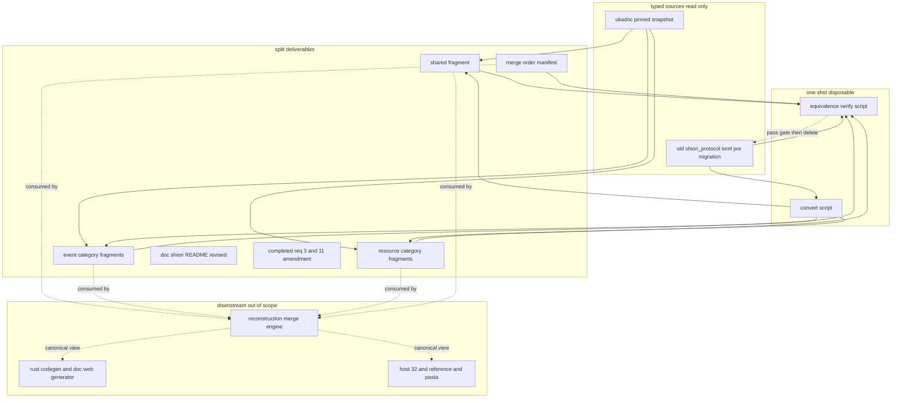
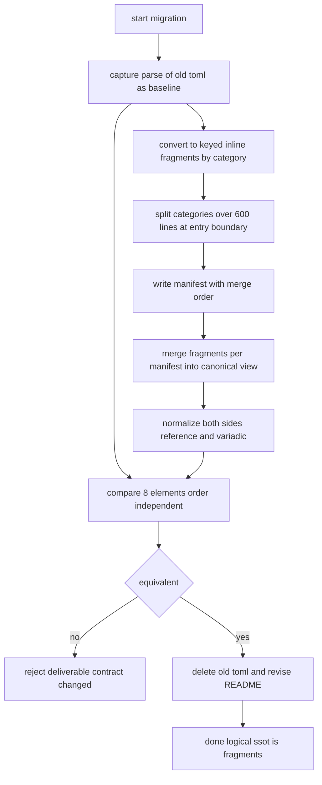
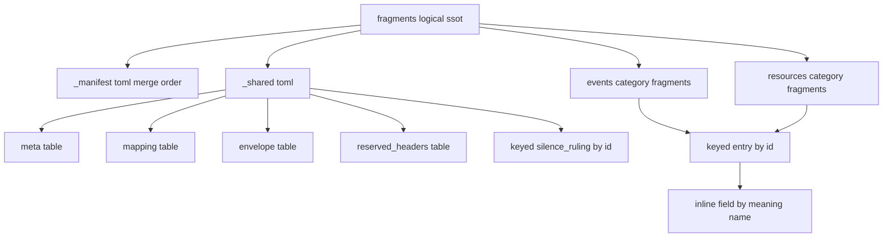

# 技術設計書: areka-P0-shiori-protocol-split

> 上位設計の正本: `doc/COMPAT_ARCHITECTURE.md` §5（SHIORI ホスティング）。
> 拡張元（完了）: `areka-P0-shiori-protocol`（`doc/shiori/shiori_protocol.toml` を単一正本 SSOT として確定。要件3・11 が「契約定義を 1 ファイルへ集約・他ファイルへ分散禁止」を中核不変条件とする）。本仕様はその要件3・11 を「論理 SSOT＝フラグメント結合結果」へ改訂継承する。
> 契約典拠: ukadoc ピン留めスナップショット（`.kiro/specs/completed/areka-P0-shiori-protocol/ukadoc/`）。調査ログ・設計判断の詳細は `research.md` を参照。結論は本書に再掲し本書単体でレビュー可能とする。
> 本仕様は **契約内容そのものを一切変更しない非破壊の物理／符号化形リファクタ**である。

## Overview

**Purpose**: 完了仕様 `areka-P0-shiori-protocol` が確定した正準 SHIORI content 契約の物理ソース `doc/shiori/shiori_protocol.toml`（10,685 行・446 entry・802 field・9 silence_ruling・共有テーブル 5）を、**契約セマンティクスを一切変えずに** Event/Resource 単位の keyed table フラグメント群へ再編し、そのフラグメント群を契約の論理 SSOT（単一権威）とする。あわせて TOML 符号化形を `[[entry]]` 配列から id キー連想テーブルへ、`[[entry.field]]` 配列から意味名キー inline table へ刷新し、id/意味名の一意性をパーサ自身に機械担保させる。

**Users**: 契約のレビュアー（LLM・人手の双方）が ≤600 行のフラグメント単位でレビュー・diff できるようになり、巨大単一ファイルの全読み込みを回避する。下流 consumer（`areka-P0-shiori-host-32`・`areka-P0-shiori-reference`・pasta native 脳・後続の doc/Web 生成器・Rust codegen）は、入力が「単一ファイル」から「フラグメント群（または再構成された正準ビュー）」へ移ることを lockstep で取り込む。

**Impact**: 現状の単一巨大 TOML を、決定的・冪等に正準ビューへ再構成（merge）できるフラグメント群へ転換する。契約セマンティクス（event/resource 集合・field 意味/型/必須/`ReferenceN` 位置/応答意味/provenance/description、封筒マッピング、予約ヘッダ集合、沈黙裁定、バージョニング方針）は不変。非破壊は「変換前 `shiori_protocol.toml` の parse 結果」と「フラグメント結合の parse 結果」を突き合わせる**一回限り（使い捨て）の同値検証プログラム**で証明し、その合格後に旧単一ファイルを tree から削除する。

### Goals
- `shiori_protocol.toml` を ≤600 行・カテゴリ純度のフラグメント群へ物理分割し、フラグメント群を論理 SSOT とする（1.x, 2.x）。
- TOML 符号化形を keyed entry／inline field／keyed silence_ruling へ刷新し、id/意味名の一意性をパーサに機械担保させる（4.x）。
- 共有テーブル（`[meta]`/`[mapping]`/`[envelope]`/`[reserved_headers]`）と全 silence_ruling を単一共有フラグメントへ集約する（5.x）。
- フラグメント→正準契約の決定的・冪等な再構成契約と、意味的同値ゲートの判定基準を成果物の受け入れ基準として確定する（3.x, 9.x）。
- 一回限りの変換＋同値検証で無損失（description/provenance を含む）を実証し、合格後に旧単一ファイルを削除する（6.x, 7.x, 9.5）。
- 完了仕様 要件3・11 を論理 SSOT へ改訂継承し、`doc/shiori/README.md` を改訂する（8.x）。
- **成功基準**: 全 9 要件が、フラグメントレイアウト・符号化スキーマ・再構成契約・同値ゲート判定基準・移行/検証アプローチ・要件改訂・README 改訂のいずれかへ一意に対応づき、同値ゲートが合格して非破壊が証明されること。

### Non-Goals
- 契約セマンティクスの変更（event/resource の追加削除・field 意味/型/`ReferenceN` 位置・封筒マッピング・予約ヘッダ集合・沈黙裁定・バージョニング方針はすべて不変）。
- 下流 consumer 向けの**恒久的**な再構成機構・バリデータ・doc/Web 生成器・Rust codegen の実装コード（HOW・後続フェーズ／下流クレート）。
- COM ABI（`IShiori`/`IShioriHost`）・トランスポート・さくらスクリプト/SAORI 解釈（隣接仕様の領分）。
- 移行/検証スクリプトの恒久資産化（使い捨て・Python 等で可。本仕様完了後に残す資産はフラグメント群・共有フラグメント・マニフェストと検証合否エビデンスのみ）。

## Boundary Commitments

### This Spec Owns
- **フラグメント物理レイアウト**: `doc/shiori/fragments/` 配下のディレクトリ構成・命名規約・サイズ規律（≤600 行）・カテゴリ純度・超過カテゴリの entry 境界サブ分割規則・`_shared.toml` 配置（1.x, 2.x, 5.1）。
- **TOML 符号化スキーマ**: entry の id キー連想テーブル化、field の意味名キー inline table 化、silence_ruling の id キー連想テーブル化、キー常時 quote、`reference`/`reference_variadic` による `ReferenceN` 位置保持、`[mapping]` 記述データの新表現への更新（4.x）。
- **共有フラグメント契約**: `[meta]`/`[mapping]`/`[envelope]`/`[reserved_headers]` と全 silence_ruling の単一共有フラグメントへの集約、`silence_ref` 文字列参照の解決可能性維持（5.x）。
- **決定的・冪等な再構成契約と意味的同値ゲートの判定基準**: フラグメント結合順の固定源（単一の真実源）、冪等性、同値判定の比較対象 8 要素と正規化規則（`reference`/`reference_variadic` 両保持 field・reference 無し field を含む）（3.x, 9.4）。
- **一回限りの移行・無損失検証アプローチ**: 機械変換＋変換前後の同値検証プログラムの契約（入出力・合否基準・エビデンス）。description/provenance/典拠参照整合の無損失保持（6.x, 9.5）。
- **完了仕様 要件3・11 の改訂継承と README 改訂**: completed/ 履歴を不変に保ったままの論理 SSOT 再定義、`doc/shiori/README.md` の SSOT＝fragments 宣言、`shiori_protocol.toml` 削除後の参照整合（7.4, 8.x）。
- **旧単一ファイル `shiori_protocol.toml` の削除**: 同値ゲート合格後の tree からの削除（7.x）。

### Out of Boundary
- 契約セマンティクスの一切（非破壊が大前提・要件 9 が握る）。
- 恒久的な再構成機構・バリデータ・doc/Web 生成器・Rust codegen の実装コード（下流／後続フェーズ）。移行/検証スクリプトは使い捨てで In scope だが、恒久資産化はしない。
- COM ABI（`IShiori`/`IShioriHost`）面・トランスポート（HSTRING 取り回し）→ `areka-P0-shiori-com`（完了・変更しない）。
- さくらスクリプト/SAORI 本文の解釈・実行 → 別仕様（content は不透明文字列のまま）。
- レガシーテキスト ⇄ 正準モデルの翻訳実装 → `areka-P0-shiori-host-32`。
- これらを「ついで」で本仕様に取り込まない。

### Allowed Dependencies
- **典拠（読み取りのみ）**: ピン留め ukadoc スナップショット（`.kiro/specs/completed/areka-P0-shiori-protocol/ukadoc/` の `SOURCES.md`＋URL/取得日/sha256・HTML スナップショット）。フラグメントの provenance 列・典拠参照はこのスナップショットを参照する（6.3）。
- **改訂継承元（履歴は不変）**: 完了仕様 `areka-P0-shiori-protocol` の requirements.md（要件3・11）・design.md（DP1 = `array of entry` 規定・Revalidation Triggers）。本仕様は要件3・11 を論理 SSOT へ改訂継承するが、`completed/` 配下のファイルは変更しない（8.3）。
- **変換器の実行基盤（使い捨て）**: TOML v1.0.0 を parse できる任意の処理系（Python の `tomllib`/`tomli` 等）。本仕様完了後に残さない。crates/* へコード依存を追加しない。
- **依存制約**: 成果物は静的データファイル（フラグメント群・共有フラグメント・マニフェスト）＋ドキュメント＋要件改訂のみ。恒久的なコード依存（serde/toml クレート等）を `shiori-abi` 等の実コードへ追加しない（最小依存・32bit 可搬性を崩さない）。

### Revalidation Triggers
以下の変更は下流 consumer（host-32・reference・pasta・後続 codegen・doc/Web 生成）の再検証を要する（D7：流動契約のため lockstep 更新）。
- **入力ソース形態の変更**: 「単一ファイル `shiori_protocol.toml`」→「フラグメント群（または再構成された正準ビュー）」への移行そのもの。下流は入力ソースをフラグメント群／正準ビューへ寄せる。
- **符号化形（スキーマ形状）の変更**: `[[entry]]` 配列→keyed 連想テーブル、`[[entry.field]]` 配列→inline table、silence_ruling の keyed 化。完了仕様 design.md DP1 の `array of entry` 規定の改訂であり、本仕様の明示的設計判断として畳み込む。
- **再構成契約の変更**: フラグメント結合順の固定源（マニフェスト）・冪等性規約・正準ビューの形態の変更。
- **同値ゲート判定基準の変更**: 比較対象 8 要素・正規化規則の変更。
- **物理レイアウト規約の変更**: フラグメントのディレクトリ構成・命名・サイズ規律・サブ分割規則の変更（捜索パス・マニフェスト記述に影響）。
- **契約セマンティクスの変更（禁止）**: 万一 event/resource 集合・field 意味/型/`ReferenceN` 位置・封筒・予約ヘッダ・沈黙裁定・バージョニングが変われば、それは本仕様の非破壊前提（要件 9）の違反であり、同値ゲートが不合格を返す。

## Architecture

### Existing Architecture Analysis

- 本仕様は**コードではなく契約データ（TOML）とその物理編成**が主成果物。完了済み `areka-P0-shiori-protocol` が確定した単一 TOML 正本の「物理ソース編成と符号化形」のみを再編する拡張であり、契約セマンティクス・ABI 面・トランスポートには触れない。
- **グリーンフィールド確認（research §1.2）**: リポジトリ全体で `shiori_protocol.toml` を parse/読込する実装上の consumer・codegen・build.rs・TOML ツーリングは**存在しない**（grep ヒットは仕様 doc と当該 TOML 本体のみ・crates/* からの参照ゼロ）。本仕様完了時点で壊れる実装は無く、移行はデータ／ドキュメント／要件層で閉じる。Q1 は要件ディスカッション #1 で **C-2（削除）** に確定済み。
- **援用パターン（research §1.3）**: dola の 600 行リファクタ規律（`structure.md`：肥大ファイルを閾値＋意味境界で分割）の哲学のみを援用する。ただし対象は `.rs` ではなくデータ TOML であり、決定的再構成・同値ゲートに相当する既存資産は無い（新規定義が要る）。
- **改訂対象（research §1.3）**: 完了仕様 design.md は「TOML 正本の table 階層・必須キー・型規約の変更」「`array of entry`（DP1）」を下流再検証トリガと明記する。本仕様の符号化形刷新はまさにこの DP1 の改訂であり、意図的な設計判断として畳み込む（要件 4・8）。

### Architecture Pattern & Boundary Map

**選定パターン**: **論理 SSOT＝フラグメント群＋決定的再構成（merge）による正準ビュー**。完了仕様の「単一正本データスキーマ＋派生レンダリング」を、「物理分割されたフラグメント群（論理 SSOT）→ 決定的 merge → 正準ビュー（オンデマンド・非常設）」へ再編する。正準ビューは tree に常設せず、必要時にフラグメント群から再構成して得る（要件 7.3）。



**Architecture Integration**:
- 選定パターン: 論理 SSOT＝フラグメント群。正準ビューはマニフェスト順の決定的 merge で得るオンデマンド生成物（非常設）。
- ドメイン境界: 契約データ（フラグメント群・本仕様所有） ⇄ 再構成機構・バリデータ・生成器・codegen（下流・本仕様非所有）。移行/検証スクリプトは使い捨てで本仕様内。
- 既存パターン維持: 二重定義禁止・全 description のデータ保持・provenance 維持・派生同値/冪等という SSOT の精神を物理分割後も維持する（要件 8.2）。keyed 化によりパーサ自身が id/意味名の一意を機械担保する。
- 新コンポーネント根拠: フラグメント群＋共有フラグメント＝物理分割の正本本体。マニフェスト＝決定的 merge の単一真実源。同値ゲート＝非破壊の唯一の証拠。
- steering 準拠: 600 行リファクタ規律の哲学を踏襲（`structure.md`）。最小依存・32bit 可搬性を崩さない（静的データのみ・恒久コード依存を追加しない）。

### Technology Stack

| Layer | Choice / Version | Role in Feature | Notes |
|-------|------------------|-----------------|-------|
| Data / Storage（正本） | TOML v1.0.0 構文 | 論理 SSOT＝フラグメント群＋共有フラグメント。keyed 連想テーブル＋inline table で符号化 | inline table は単一行限定。キー常時 quote（dot/asterisk id 対応） |
| 再構成順序（契約） | マニフェスト `fragments/_manifest.toml`（TOML） | フラグメント結合順の単一真実源（決定的・冪等） | DD-1 で明示マニフェスト方式を採用 |
| 移行・検証（使い捨て） | Python 3.x（`tomllib`/`tomli` 等の TOML パーサ） | 機械変換＋変換前後の意味的同値検証の一回限りプログラム | 恒久資産化しない。合否エビデンスのみ残す |
| 典拠資産（変更しない） | ukadoc ピン留め HTML スナップショット | フラグメントの provenance 列・典拠参照の参照先 | `.kiro/specs/completed/areka-P0-shiori-protocol/ukadoc/`・sha256 で同一性担保 |

> 符号化形の行数効果・カテゴリ別件数の実測・正規化規則の詳細は `research.md` を参照。

## File Structure Plan

成果物は**契約データ（フラグメント群・共有フラグメント・マニフェスト）＋改訂ドキュメント＋完了仕様の要件改訂**であり、コードクレートは新規作成しない。置き場所は完了仕様が新設した `doc/shiori/` 配下とする。

### Directory Structure
```
doc/
└── shiori/                                  # SHIORI 互換契約資産ルート（完了仕様が新設）
    ├── fragments/                           # 【正本本体】論理 SSOT＝フラグメント群（本仕様が新設）
    │   ├── _manifest.toml                   # 再構成（merge）順の単一真実源（決定的・冪等）
    │   ├── _shared.toml                     # 共有フラグメント。meta/mapping/envelope/reserved_headers＋全 silence_ruling を集約（5.x）
    │   ├── events/                          # kind=event のカテゴリ別フラグメント（287 entry）
    │   │   ├── NN.lifecycle.toml            # 1 カテゴリ = 1 フラグメント（≤600 行・カテゴリ純度）
    │   │   ├── NN.mouse.toml                # NN は _manifest.toml と整合する 2 桁数値接頭辞（可読性補助・権威でない）
    │   │   ├── NN.shortcut_key.01.toml      # 600 行超カテゴリは entry 境界で順序付きサブ分割（.01/.02…）
    │   │   └── NN.shortcut_key.02.toml
    │   └── resources/                       # kind=resource のカテゴリ別フラグメント（159 entry・events/ と同パターン）
    │       └── NN.category.toml
    └── README.md                            # 改訂対象：SSOT＝fragments の宣言・shiori_protocol.toml 廃止の明記

.kiro/specs/completed/areka-P0-shiori-protocol/
└── ...                                      # 履歴不変。ukadoc/ 典拠スナップショットは参照のみ・変更しない
```

> events/・resources/ のディレクトリ分離は **整理目的**であり、フラグメントの内部スキーマ形式は kind に依らず単一（要件 1.3）。要件 1.3 は内部スキーマ形式の単一性を要求するもので、ディレクトリ物理配置の分離を禁じない（research §3.D 注記）。
> `NN.` 数値接頭辞は捜索・可読性の補助に過ぎず、結合順の権威は `_manifest.toml` が単独で持つ（DD-1：単一真実源はマニフェスト・接頭辞は従属）。

### Created Files
- `doc/shiori/fragments/_manifest.toml` — 再構成順の単一真実源。
- `doc/shiori/fragments/_shared.toml` — 共有テーブル＋全 silence_ruling の集約フラグメント。
- `doc/shiori/fragments/events/NN.{category}[.NN].toml` — event カテゴリ別フラグメント群。
- `doc/shiori/fragments/resources/NN.{category}[.NN].toml` — resource カテゴリ別フラグメント群。

### Modified Files
- `doc/shiori/README.md` — 「正本＝`shiori_protocol.toml` 1 枚」宣言を「SSOT＝`fragments/`／`shiori_protocol.toml` は廃止（tree から削除）／正準ビューはオンデマンド merge」へ改訂し、ukadoc 典拠参照（6.3）の整合を保つ（DD-7・要件 7.4/8.4）。

### Deleted Files
- `doc/shiori/shiori_protocol.toml` — 同値ゲート合格後に tree から削除（非権威の生成物としても残置しない・要件 7.2）。削除は変換前内容を検証基準として捕捉してから実施する（要件 7.2）。

### 完了仕様の要件改訂（completed/ 履歴は不変・本仕様側で系譜追跡）
- 完了仕様 `areka-P0-shiori-protocol` の要件3・要件11 の改訂は、**`completed/` 配下のファイルを書き換えない**。本仕様 requirements.md（要件 8）＋本 design.md ＋ `doc/shiori/README.md` に「論理 SSOT＝フラグメント群および決定的結合結果」への改訂継承を記述し、改訂理由（DP1 の `array of entry`→keyed/inline 符号化形刷新・Revalidation Trigger 該当）を明記することで系譜（拡張改訂）として追跡可能とする（DD-6・要件 8.1–8.3）。

## System Flows

### 移行・非破壊検証フロー（一回限り・使い捨て）



- **ゲート決定**: 同値（8 要素が順序非依存で過不足なく一致）でなければ成果物を不合格とし、契約セマンティクスが変化したものとして扱う（要件 9.4）。合格して初めて旧単一ファイルを削除する（要件 7.2・9.5）。
- **冪等性**: マニフェスト順の merge は同一入力に対し常に同一の正準ビューを生成する（要件 3.2）。検証は変換前 baseline を基準に、変換後 merge 結果を突き合わせる一回限りの操作（要件 9.5）。

## Requirements Traceability

| Requirement | Summary | 実現要素（成果物 / 契約） | Flows |
|-------------|---------|---------------------------|-------|
| 1.1 | フラグメント群が論理 SSOT | `fragments/`（events/ + resources/ + _shared.toml） | — |
| 1.2 | 各契約データを唯一の場所に保持 | フラグメントレイアウト＋keyed 一意担保 | — |
| 1.3 | entry を kind 非依存の単一フラグメント形式で表現 | keyed entry 符号化スキーマ（kind 判別子付き・単一形式） | — |
| 1.4 | 二重定義の検出・再構成不合格 | keyed パーサ機械担保＋同値ゲート（二重定義違反検出） | 移行検証 |
| 2.1 | 各フラグメント ≤600 行 | サイズ規律・サブ分割規則 | — |
| 2.2 | カテゴリ純度（ukadoc カテゴリ単位） | events/・resources/ のカテゴリ別フラグメント | — |
| 2.3 | 超過カテゴリの entry 境界サブ分割 | `category.01/02.toml` サブ分割規則 | — |
| 2.4 | 単一 entry を分割しない | サブ分割は entry 境界のみ | — |
| 3.1 | 結合順の決定的固定 | `_manifest.toml`（単一真実源・DD-1） | 移行検証 |
| 3.2 | 冪等な正準ビュー生成 | マニフェスト順 merge 契約 | 移行検証 |
| 3.3 | 正準ビュー＝現行 parse と意味的同値 | 同値ゲート受け入れ基準 | 移行検証 |
| 3.4 | 同値判定（8 要素・順序非依存） | 同値ゲート判定基準＋正規化規則（DD-2） | 移行検証 |
| 4.1 | entry を id キー連想テーブル化（パーサ一意担保） | keyed entry スキーマ | — |
| 4.2 | field を意味名キー inline table 化（entry 内一意担保） | inline field スキーマ | — |
| 4.3 | silence_ruling を id キー連想テーブル化 | keyed silence_ruling スキーマ | — |
| 4.4 | キー常時 quote（dot/asterisk id 対応） | quote 規約 | — |
| 4.5 | `reference`/`reference_variadic` で位置保持（配列順序消失無害） | inline field の reference キー・正規化規則 | — |
| 4.6 | `[mapping]` 記述データを新表現へ更新（意味不変） | `_shared.toml` の `[mapping]` 更新 | — |
| 5.1 | 共有テーブルを単一共有フラグメントへ集約 | `_shared.toml`（meta/mapping/envelope/reserved_headers） | — |
| 5.2 | 全 silence_ruling を共有フラグメントへ集約 | `_shared.toml` の keyed silence_ruling | — |
| 5.3 | `silence_ref` 文字列参照の解決可能性維持 | id キー参照の保持 | 移行検証 |
| 6.1 | 全 description の無損失保持 | 機械変換＋同値ゲート（description 比較） | 移行検証 |
| 6.2 | 全 provenance の無損失保持 | 機械変換＋同値ゲート（provenance 比較） | 移行検証 |
| 6.3 | ukadoc 典拠参照の整合維持 | provenance 列・README 典拠参照の整合 | — |
| 7.1 | フラグメント群を唯一の正本とする | `fragments/` が論理 SSOT | — |
| 7.2 | `shiori_protocol.toml` を tree から削除（ゲート合格後） | 削除手順（baseline 捕捉後） | 移行検証 |
| 7.3 | 正準ビューはオンデマンド merge のみ（常設しない） | 非常設の正準ビュー方針 | — |
| 7.4 | 削除後の既存参照の整合 | README・本 design.md の参照改訂 | — |
| 8.1 | 完了仕様 要件3・11 を論理 SSOT へ改訂 | 要件改訂継承（README＋本 design.md・DD-6） | — |
| 8.2 | 不変条件（精神）の維持 | 二重定義禁止・description/provenance 保持・派生同値 | — |
| 8.3 | completed/ 履歴を不変に保つ系譜追跡 | completed/ 非変更・本仕様側で改訂継承記述 | — |
| 8.4 | README を SSOT＝fragments・廃止明記へ改訂 | `doc/shiori/README.md` 改訂（DD-7） | — |
| 9.1 | entry 集合を不変に保つ | 機械変換＋同値ゲート（entry 集合比較） | 移行検証 |
| 9.2 | field 意味/型/必須/Ref位置/応答/provenance を不変 | 機械変換＋同値ゲート（field 集合比較） | 移行検証 |
| 9.3 | 封筒/予約ヘッダ/沈黙裁定/バージョニングを不変 | `_shared.toml` 保持＋同値ゲート | 移行検証 |
| 9.4 | 差分検出時は成果物を不合格 | 同値ゲートの不合格条件 | 移行検証 |
| 9.5 | 一回限りの同値検証プログラムで実証・合否エビデンス | 移行・検証アプローチ（使い捨て・Python 等） | 移行検証 |

## Components and Interfaces

| Component | Domain/Layer | Intent | Req Coverage | Key Dependencies (P0/P1) | Contracts |
|-----------|--------------|--------|--------------|--------------------------|-----------|
| フラグメント符号化スキーマ | 契約データ / スキーマ | keyed entry・inline field・keyed silence_ruling の符号化形を規定 | 1.3, 4, 5 | 旧 TOML 実測形状 (P0) | Batch |
| フラグメント物理レイアウト | 契約データ / 物理編成 | ディレクトリ構成・命名・サイズ規律・サブ分割規則を規定 | 1.1, 1.2, 2, 5.1 | 符号化スキーマ (P0) | Batch |
| 再構成マニフェスト（`_manifest.toml`） | 契約 / 再構成 | 結合順の単一真実源（決定的・冪等） | 3.1, 3.2 | フラグメントレイアウト (P0) | Batch |
| 共有フラグメント（`_shared.toml`） | 契約データ / 共有 | meta/mapping/envelope/reserved_headers＋全 silence_ruling の集約 | 4.6, 5 | 符号化スキーマ (P0) | Batch |
| 意味的同値ゲート（判定基準） | 契約 / 検証基準 | 比較対象 8 要素＋正規化規則で非破壊を判定 | 3.3, 3.4, 9.4 | マニフェスト (P0), 共有フラグメント (P0) | Batch |
| 一回限り移行・検証スクリプト（使い捨て） | 移行 / ツール | 機械変換＋変換前後の同値検証。合否エビデンスを残す | 6, 7.2, 9.5 | 旧 TOML (P0), 同値ゲート (P0) | Batch |
| 完了仕様 要件改訂・README 改訂 | ドキュメント / 系譜 | 論理 SSOT への改訂継承・参照整合 | 7.4, 8 | フラグメント群 (P0) | Batch |

### 契約データ / スキーマ

#### フラグメント符号化スキーマ

| Field | Detail |
|-------|--------|
| Intent | `[[entry]]`/`[[entry.field]]`/`[[silence_ruling]]` を keyed/inline 連想テーブルへ刷新し一意性をパーサに機械担保させる |
| Requirements | 1.3, 4.1, 4.2, 4.3, 4.4, 4.5, 4.6, 5.1, 5.2, 5.3 |

**Responsibilities & Constraints**
- 各 entry を id をキーとする連想テーブル（quote 付きキー）で表現し、entry id の一意性を TOML パーサに機械担保させる（4.1）。`id =` 行は消えキーへ移る。
- 各 field を entry 配下の inline table（1 field = 1 行・snake_case 意味名キー）で表現し、field 意味名の entry 内一意性を機械担保する（4.2）。`name =` 行は消えキーへ移る。`reference`（整数 N）・`reference_variadic`（可変長末尾 `true`）・`type`・`required`・`provenance`・`description`・任意の `silence_ref`・`response_meaning` を inline table の値として保持する（4.5）。
- 各 silence_ruling を id をキーとする連想テーブルで表現する（4.3）。
- キーは常に quote し、dot/asterisk を含む id（`OnUpdate.OnDownloadBegin`・`char*.defaultx`・`property.get`・`sakura.defaultx` 等）を破綻なく表現する（4.4）。
- `[mapping]` の `canonical_key`/`alias_key`/`alias_variadic_key`/`reference_backed_by` 等の記述データを、新しいテーブルキー表現（field が inline table のキー＝意味名・値内の `reference` キー等）と整合する表現へ更新し、その意味（値キーとテーブルキーの対応）を変えない（4.6）。
- **kind 非依存の単一形式**: event/resource は同一の keyed entry スキーマで表現する。kind は判別子フィールドとして entry 内に保持し、ディレクトリ分離（events/・resources/）は物理整理であってスキーマ形式の分岐ではない（1.3）。

**Dependencies**
- Inbound: フラグメント物理レイアウト・共有フラグメント・移行スクリプトが本スキーマに従う（P0）
- Outbound: なし（静的データスキーマ）
- External: 旧 `shiori_protocol.toml` の実測形状（変換元・読み取り P0）

**Contracts**: Service [ ] / API [ ] / Event [ ] / Batch [x] / State [ ]

##### Batch / Job Contract（符号化スキーマ・データ契約）
- **keyed entry の形**（概念表現。値・id は実データに従う）:
  - `[entry."OnBoot"]` に `kind`/`category`/`dispatch`/`response`/`provenance`/`description`／任意 `silence_ref` を保持。
  - 配下の field は `[entry."OnBoot".field]` テーブルに意味名キーの inline table を並べる。例: `shell_name = { reference = 0, type = "str", required = false, provenance = "ukadoc", description = "…" }`。
- **keyed silence_ruling の形**: `[silence_ruling."sr_dispatch_dressup_changed"]` に `topic`/`basis`/`ruling`/`ukadoc_anchor`/`description` を保持。
- **入力/検証**: 旧 TOML の各 `[[entry]]`/`[[entry.field]]`/`[[silence_ruling]]` を機械変換。entry id・field 意味名・silence_ruling id の重複はパーサがキー重複として機械検出（二重定義違反＝1.4）。
- **冪等性**: 同一入力 entry/field/silence_ruling は同一 keyed テーブルへ決定的に写る。

**Implementation Notes**
- Integration: `reference` 値が `ReferenceN` 位置を担うため、配列順序の消失は契約に影響しない（4.5）。両保持 field（`reference` ＋ `reference_variadic`）は固定開始 N＋可変長末尾を表す（実測 32 件）。reference 無し field（実測 6 件）は両キーを持たず意味名のみで表す。
- Validation: §Testing Strategy の構造検証（必須キー・キー quote・一意性・description/provenance 非空）。
- Risks: 長文 description を持つ少数 field の inline 1 行が長くなるが、形式統一を優先し許容（research R-N1：field 側 description p90 146 字で支障なし）。

### 契約 / 再構成

#### 再構成マニフェスト（`_manifest.toml`）と意味的同値ゲート

| Field | Detail |
|-------|--------|
| Intent | フラグメント結合順を単一真実源として固定し（決定的・冪等）、再構成結果の非破壊を 8 要素の同値ゲートで判定する |
| Requirements | 3.1, 3.2, 3.3, 3.4, 9.4 |

**Responsibilities & Constraints**
- **DD-1（結合順の単一真実源＝明示マニフェスト）**: フラグメント結合順は `_manifest.toml` が**単独で**決定する。ファイル名の `NN.` 数値接頭辞は捜索・可読性の補助であって権威ではない（接頭辞とマニフェストの二重管理による不整合リスクを排除）。要件 3.1 は「マニフェストまたは接頭辞」を許容するが、本設計は単一の真実源としてマニフェストを選ぶ（research DD-1）。マニフェストはサブ分割（`shortcut_key.01/02`）の順序も曖昧さなく固定する。
- マニフェストは結合対象フラグメントのファイル名（相対パス）を結合順に列挙し、各フラグメントの kind・category を明示する。共有フラグメント（`_shared.toml`）の取り込み位置も明示する。
- **冪等性**: 同一フラグメント群＋同一マニフェストに対し、merge は常に同一の正準ビューを生成する（3.2）。
- **同値ゲート（受け入れ基準）**: 再構成された正準ビューは、変換前 `shiori_protocol.toml` の parse 結果と意味的に同値（無損失一致）でなければならない（3.3）。

**Dependencies**
- Inbound: 移行・検証スクリプトがマニフェスト順に merge し同値ゲートを適用（P0）
- Outbound: 下流再構成機構（後続）がマニフェストを消費（P2・スコープ外）
- External: フラグメント群・共有フラグメント（読み取り P0）

**Contracts**: Service [ ] / API [ ] / Event [ ] / Batch [x] / State [ ]

##### Batch / Job Contract（同値ゲートの判定基準・DD-2）
- **Trigger**: 移行時に一回、`parse(旧 toml)` と `parse(merge(fragments, manifest))` を突き合わせる（9.5）。
- **比較対象 8 要素（順序非依存・過不足なく一致）**（3.4）:
  1. entry 集合（id をキーとする集合）
  2. 各 entry の field 集合（entry id × field 意味名をキーとする集合）
  3. 共有テーブル（`[meta]`/`[mapping]`/`[envelope]`/`[reserved_headers]` の各キー・値。ただし `[mapping]` は素直な値一致ではなく下記「`[mapping]` 意味保存例外」に従う）
  4. silence_ruling（id をキーとする集合と各値）
  5. 全 description（entry・field・silence_ruling・共有テーブルのデータ文字列）
  6. 全 provenance（entry・field・silence_ruling）
  7. 封筒マッピング（`[envelope]` の全キー・値）
  8. 予約ヘッダ集合（`[reserved_headers]` の `request`/`response` 配列・`collision_policy`）
- **正規化規則（DD-2・要件 4.5）**:
  - **reference 正規化**: 旧形（`[[entry.field]]` 配列・`reference = N`）と新形（inline table の `reference = N`）の双方を「field 意味名 → reference 値（および `reference_variadic` の有無）」の写像へ正規化し、配列インデックス依存を排除してから集合比較する。同値は意味名キーで突き合わせ、`reference` 値・`reference_variadic` 真偽が一致することを条件とする。
  - **両保持 field（`reference` ＋ `reference_variadic`）**: 両キーをそのまま比較対象に含める（固定開始 N＋可変長末尾の双方が一致すること）。実測 32 件。
  - **reference 無し field**: `reference`/`reference_variadic` をいずれも持たない（None）正規化形とし、両側とも欠如することを一致条件とする。実測 6 件。
  - **任意キーの欠如同値**: `silence_ref`・`response_meaning`・`dispatch`（resource で省略可）等の任意キーは「欠如（None）」と「値あり」を区別し、両側の欠如/値が一致することを条件とする。
  - **`[mapping]` 意味保存例外（4.6）**: `[mapping]` は記述データ（`canonical_key`/`alias_key`/`alias_variadic_key`/`reference_backed_by` 等）が新しいテーブルキー表現へ正当に変わるため、要素3 の素直な値一致ではなく「値キー⇄テーブルキー対応の同一性（意味保存）」として正規化比較する。新旧で指す対応関係が同一であることを一致条件とし、表現差そのものは差分と見なさない。
  - **残差ゼロ（閉包条件・要件 3.4/9.2/9.4）**: 両側（旧 parse／新 merge）の全キー集合が上記 8 要素＋正規化規則で完全に被覆され、いずれの要素にも割り当てられない**未被覆キー（残差キー）が存在しないこと**を一致条件に含める。想定外の新規キーが片側・両側に現れた場合は残差ありとして不合格とし、「比較対象外のキーに契約情報が紛れる」抜け穴を塞ぐ。
- **合否（要件 9.4）**: 8 要素がすべて一致**かつ残差キーがゼロ**＝合格（非破壊が証明された）。1 つでも差分があるか未被覆キーが残れば不合格とし、契約セマンティクスが変化したものとして成果物を棄却する。
- **エビデンス**: 合否結果を非破壊のエビデンスとして残す（9.5）。

**Implementation Notes**
- Integration: keyed 化により正準ビューも比較対象も map 等価比較が自然に成立する（順序非依存比較が容易）。
- Validation: ゲート不合格時は差分要素を特定し、変換器・マニフェスト・フラグメントのいずれかを是正して再実行（移行は一回限りだが、ゲート合格まで反復可）。
- Risks: 同値基準を緩く書くと「契約を変えていない」証明が崩れる（要件 9.4 が不合格条件を握る）。正規化規則を上記のとおり厳密化することで担保する。

### 移行 / ツール

#### 一回限り移行・検証スクリプト（使い捨て）

| Field | Detail |
|-------|--------|
| Intent | 旧 TOML を機械変換しフラグメント群を出力、変換前後の同値検証で無損失を実証する一回限りプログラム |
| Requirements | 6.1, 6.2, 6.3, 7.2, 9.5 |

**Responsibilities & Constraints**
- **DD-3 裁定済み（要件ディスカッション #2）**: 機械変換＋同値検証を使い捨ての一回限りスクリプト（Python 等で可・恒久資産化しない）として本仕様スコープ内で実施する。恒久的な下流ツーリング（Rust codegen 等）はスコープ外。
- 旧 `shiori_protocol.toml` を parse して baseline を捕捉し（削除前に検証基準を確定）、カテゴリ別に keyed/inline へ機械変換してフラグメント群＋`_shared.toml`＋`_manifest.toml` を書き出す。
- 800 超 field の手作業を排し転記ミスをゼロ化し、description/provenance の無損失を機械保証する（6.1/6.2）。
- merge＋同値ゲート（8 要素・正規化規則）を適用し、合格を確認してから旧単一ファイルを削除する（7.2/9.5）。
- ukadoc 典拠参照（provenance 列・sha256）の整合を維持する（6.3）。

**Dependencies**
- Inbound: なし（移行オペレータが起動）
- Outbound: フラグメント群・共有フラグメント・マニフェスト・合否エビデンスを出力（P0）
- External: 旧 TOML（読み取り P0）・TOML パーサ（使い捨て・P0）

**Contracts**: Service [ ] / API [ ] / Event [ ] / Batch [x] / State [ ]

##### Batch / Job Contract（移行）
- **Trigger**: 移行時に一回（手動オペレーション）。
- **Input / validation**: 旧 `shiori_protocol.toml`。parse 成功・446 entry・802 field・9 silence_ruling・共有テーブル 5 の存在を前提検証。
- **Output / destination**: `doc/shiori/fragments/` 配下のフラグメント群・`_shared.toml`・`_manifest.toml`＋同値ゲート合否エビデンス。
- **Idempotency & recovery**: 変換は決定的（同一入力→同一フラグメント）。ゲート不合格時は出力を破棄し是正後に再実行。合格後にのみ旧ファイル削除。

**Implementation Notes**
- Integration: スクリプト自体は本仕様完了後に残さない（恒久資産化しない・Non-Goals）。残す資産はフラグメント群・共有フラグメント・マニフェストと合否エビデンス。
- Validation: 変換器の正しさは同値ゲートが事後証明する（自己検証ループ：移行手段は問わず、ゲート合格が無損失の唯一の証拠・要件 9.4/9.5）。
- Risks: サブ分割が entry 境界を割らないこと（2.4）を変換時に保証する。≤600 行のサイズ規律（2.1）を出力後に検査する。

### ドキュメント / 系譜

#### 完了仕様 要件改訂・README 改訂

| Field | Detail |
|-------|--------|
| Intent | 完了仕様 要件3・11 を論理 SSOT へ改訂継承し（履歴不変）、README を SSOT＝fragments へ改訂、削除後の参照を整合させる |
| Requirements | 7.4, 8.1, 8.2, 8.3, 8.4 |

**Responsibilities & Constraints**
- **DD-6（要件改訂の文言と系譜）**: 完了仕様 要件3（単一正本対応表）・要件11-1（正本＝単一 TOML ファイル）の「単一ファイル正本（single source of truth＝1 枚の TOML）」を、「論理 SSOT＝フラグメント群およびその決定的結合結果（merge）」へ改訂継承する（8.1）。改訂は **`completed/` 配下のファイルを書き換えず**、本仕様 requirements.md（要件 8）＋本 design.md ＋ README に改訂継承を記述する（8.3）。改訂理由として完了仕様 design.md DP1（`array of entry`）の keyed/inline 符号化形刷新・Revalidation Trigger 該当を明記する。
- 改訂は不変条件の精神を維持する: 二重定義禁止・全 description のデータ保持・provenance 維持・派生 doc/Web との同値/冪等（8.2）。
- **DD-7（README/典拠参照の整合）**: `doc/shiori/README.md` の「正本＝`shiori_protocol.toml` 1 枚」宣言を「SSOT＝`fragments/`／`shiori_protocol.toml` は廃止（tree から削除）／正準ビューはオンデマンド merge で得る／契約定義はフラグメント群へ集約し他ファイルへ分散させない」へ改訂する（8.4）。ukadoc ピン留めスナップショット参照（provenance・SOURCES.md・sha256）の整合を保つ（6.3）。
- `shiori_protocol.toml` 削除後、当該ファイルを指す既存参照（README・完了仕様の記述等）が正本＝フラグメント群を指すよう整合させる（7.4）。

**Dependencies**
- Inbound: なし
- Outbound: README・本仕様 requirements/design が改訂内容を保持（P0）
- External: 完了仕様 requirements.md/design.md（読み取りのみ・変更しない P0）

**Contracts**: Service [ ] / API [ ] / Event [ ] / Batch [ ] / State [ ]（ドキュメント改訂のため契約タイプなし）

**Implementation Notes**
- Integration: `completed/` の不変原則を守り、改訂は本仕様側で系譜（拡張改訂）として追跡する。
- Validation: README 改訂後、`shiori_protocol.toml` への参照が残存しないこと・ukadoc 典拠参照が解決可能なことを検査する。
- Risks: completed/ の literal 改変は履歴不変原則に反するため禁止（改訂は継承記述で表現）。

## Data Models

本仕様の中核は「旧符号化形（配列）→新符号化形（keyed/inline）への対応」と「論理 SSOT の table 階層」である。契約セマンティクス（中身）は不変であり、変わるのは符号化形と物理配置のみ。

### 論理 SSOT の table 階層（新符号化形）



### 旧→新 符号化形マッピング（意味不変・形のみ変化）

| 要素 | 旧形（配列・現行 `shiori_protocol.toml`） | 新形（keyed/inline・フラグメント） | 不変条件 |
|------|------|------|------|
| entry | `[[entry]]` ＋ `id =`/`kind =`/`category =`/`dispatch =`/`response =`/`provenance =`/`description =` | `[entry."<id>"]` ＋ 同キー群（`id =` 行はキーへ） | entry 集合・各キー値が不変（9.1） |
| field | `[[entry.field]]` ＋ `name =`/`reference =`/`type =`/`required =`/`provenance =`/`description =`／任意 `reference_variadic`/`response_meaning`/`silence_ref` | `<meaning_name> = { reference = N, type = "…", required = …, provenance = "…", description = "…", … }`（inline table・`name =` 行はキーへ） | field 意味名・型・必須・`reference`(N)・`reference_variadic`・応答意味・provenance が不変（9.2/4.5） |
| silence_ruling | `[[silence_ruling]]` ＋ `id =`/`topic =`/`basis =`/`ruling =`/`ukadoc_anchor =`/`description =` | `[silence_ruling."<id>"]` ＋ 同キー群（`id =` 行はキーへ） | 全裁定の id・topic・basis・ruling・anchor・description が不変（9.3） |
| 共有テーブル | `[meta]`/`[mapping]`/`[envelope]`/`[reserved_headers]`（通常テーブル） | `_shared.toml` 内に同テーブルを集約。`[mapping]` 記述データのみ新キー表現へ整合（4.6・意味不変） | 封筒/予約ヘッダ/メタ/マッピング意味が不変（9.3/4.6） |

> id にドット・アスタリスクを含む実例（`OnUpdate.OnDownloadBegin`・`char*.defaultx` 等）はキー常時 quote で破綻なく表現する（4.4）。`silence_ref` は keyed silence_ruling の id を文字列参照し、共有フラグメント集約後も解決可能（5.3）。

### 実測形状（変換対象の規模）
- 総行数 10,685／`[[entry]]` 446（event 287＋resource 159）／`[[entry.field]]` 802／`[[silence_ruling]]` 9／共有テーブル 5（`[meta]`/`[mapping]`/`[envelope]`/`[reserved_headers]`）。
- `reference_variadic` 保持 field 32／reference 無し field 6／`silence_ref` 参照 44 箇所。
- entry は 36 カテゴリ順で整列済み。最大カテゴリは `shortcut_key`(93)・`ghost_info`(40)・`notify`(31)・`lifecycle`(29)・`os_state`(27)。inline 化（field ~7 行→1 行）で大半のカテゴリは ≤600 行に収まるが、最大級カテゴリは entry 境界サブ分割の対象となり得る（2.3・出力後にサイズ検査）。

## Error Handling

> 本仕様はランタイムコードではなく契約データ・物理編成のため、実行時エラー処理ではなく **契約の整合性違反（バリデーション）と非破壊ゲート違反** を扱う。

### Error Strategy
- 非破壊は同値ゲートで fail-fast に検証する（不合格＝成果物棄却）。フラグメントの構造整合は静的検査（下流/CI のスキーマバリデーションは後続スコープだが、移行時にスクリプトが最低限検査する）。

### Error Categories and Responses
- **二重定義違反**（1.4/4.x）: 同一 entry id・field 意味名・silence_ruling id がフラグメント群内に複数存在 → keyed パーサがキー重複として機械検出し、再構成を不合格とする。
- **同値ゲート差分**（9.4）: 8 要素の比較で差分検出 → 成果物を不合格とし契約変化として扱う。差分要素を特定し是正後に再実行。
- **サイズ規律違反**（2.1）: フラグメントが 600 行超 → カテゴリ純度を保ったまま entry 境界でサブ分割する。
- **entry 跨ぎ分割**（2.4）: 単一 entry が複数フラグメントへまたがる → 不正として是正（サブ分割は entry 境界のみ）。
- **description/provenance 欠落**（6.1/6.2）: 変換後フラグメントで非空 description/provenance が欠落 → 無損失違反として不合格。
- **典拠参照不整合**（6.3）: provenance 列が ukadoc スナップショット（sha256）と整合しない → 是正。
- **completed/ literal 改変**（8.3）: `completed/` 配下を書き換える試み → 履歴不変原則違反として禁止（改訂は継承記述で表現）。

### Monitoring
- 同値ゲート合否エビデンスを残す（9.5）。ukadoc スナップショット sha256 の同一性確認（`SOURCES.md`・6.3）。

## Testing Strategy

> ランタイムテストではなく **フラグメント群の構造・整合性検証と非破壊同値ゲート**（移行スクリプトおよび後続バリデータで実行可能な契約検証項目）。

### Unit Tests（フラグメント構造検証）
- **keyed 一意性**: events/・resources/ 全フラグメントを結合した entry id 集合・各 entry の field 意味名集合・silence_ruling id 集合に重複が無い（パーサがキー重複を検出しない＝1.4/4.1/4.2/4.3）。
- **キー quote**: dot/asterisk を含む id（`OnUpdate.OnDownloadBegin`・`char*.defaultx`・`property.get` 等）が quote 付きキーで破綻なく parse される（4.4）。
- **サイズ規律**: 各フラグメントが ≤600 行であり、サブ分割が entry 境界のみで単一 entry を跨がない（2.1/2.3/2.4）。
- **無損失データ**: 全 entry/field/silence_ruling/共有テーブルに非空 description・provenance（field/entry/silence_ruling）が存在する（6.1/6.2）。
- **共有集約**: `[meta]`/`[mapping]`/`[envelope]`/`[reserved_headers]`＋全 silence_ruling が `_shared.toml` のみに存在し、`silence_ref` が解決可能（5.x）。

### Integration Tests（再構成・非破壊同値ゲート）
- **決定的・冪等 merge**: `_manifest.toml` 順の merge が同一フラグメント群に対し同一正準ビューを生成する（2 回 merge して同値・3.1/3.2）。
- **意味的同値ゲート（8 要素）**: `parse(旧 toml)` と `parse(merge(fragments))` が、entry 集合・field 集合・共有テーブル・silence_ruling・全 description・全 provenance・封筒マッピング・予約ヘッダ集合の各要素で順序非依存に過不足なく一致する（3.3/3.4/9.4）。
- **reference 正規化同値**: `reference`/`reference_variadic` 両保持 field（32 件）・reference 無し field（6 件）が正規化規則に従い両側一致する（4.5/9.2・DD-2）。
- **マッピング意味保存**: `[mapping]` の `canonical_key`/`alias_key`/`alias_variadic_key`/`reference_backed_by` 等の記述データが新キー表現でも同一意味（値キーとテーブルキーの対応）を保つ（4.6・同値ゲートの意味保存例外として受け入れ基準化）。
- **残差ゼロ（閉包）**: 旧 parse／新 merge 双方の全キーが 8 要素＋正規化規則で被覆され、未被覆キー（残差）がゼロである（3.4/9.2/9.4）。

### E2E（移行・削除の受け入れ）
- **無損失移行の実証**: 一回限り変換＋同値ゲートが合格し、その合否エビデンスが残る（9.5）。
- **削除と参照整合**: 同値ゲート合格後に `shiori_protocol.toml` が tree から削除され、README・本仕様の参照がフラグメント群を指す（残存参照ゼロ・7.2/7.4/8.4）。

## Open Questions / Risks
- **DD-3（移行手段）・DD-4（Q1：残置 vs 削除）は要件ディスカッション #2/#1 で裁定済み**: 使い捨て一回限りスクリプト（Python 等）で移行・検証／C-2（削除）。本設計はこれに従い未決ギャップは無い。
- **同値ゲートの厳密性**（本設計の品質中核・要件 9.4）: 正規化規則を緩く書くと非破壊の証明が崩れる。比較対象 8 要素＋reference/variadic/任意キーの正規化規則を上記のとおり厳密化して担保する。
- **最大級カテゴリのサイズ**（2.x）: inline 化で大半は ≤600 行に収まる見込みだが、`shortcut_key`(93 entry) 等は出力後にサイズ検査し、超過時は entry 境界サブ分割（`.01/.02`）する。サイズは変換結果に依存するため、確定はサブ分割規則＋出力後検査に委ねる。
- **マニフェスト保守規律**（DD-1）: 明示マニフェストはフラグメント追加時の更新忘れがドリフト源になり得る。本仕様は単一真実源をマニフェストに固定し、`NN.` 接頭辞を従属（権威でない）と明記してリスクを限定する。恒久的な CI ゲートは下流スコープ。
- **completed/ 履歴不変**（8.3）: 改訂は `completed/` の literal 改変ではなく本仕様側の継承記述で表現する。改訂理由（DP1 符号化形刷新・Revalidation Trigger 該当）を明記し系譜を残す。
