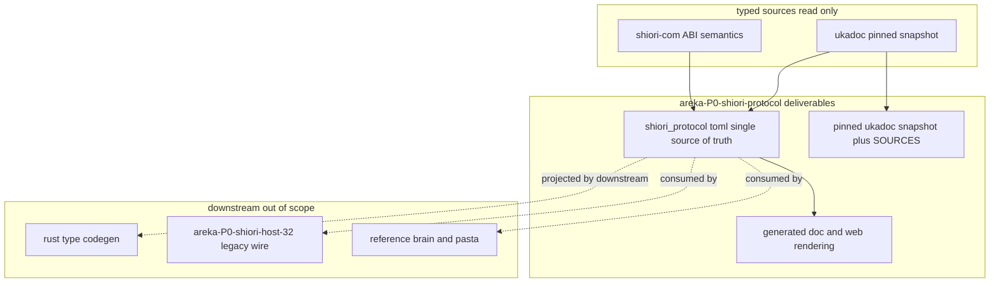
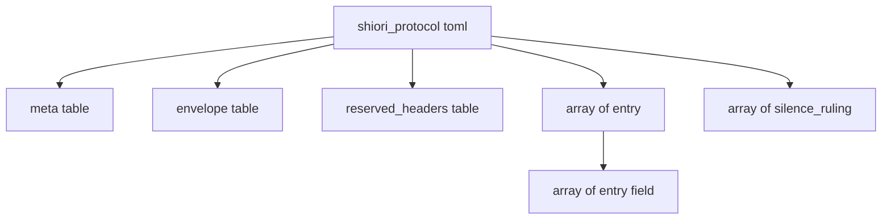
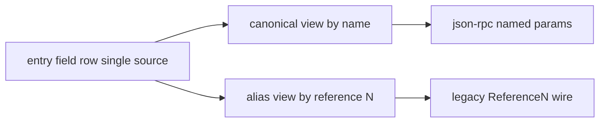

# 技術設計書: areka-P0-shiori-protocol

> 上位設計の正本: `doc/COMPAT_ARCHITECTURE.md` §5（SHIORI ホスティング）／§2（沈黙ルール）。
> 隣接（完了）: `areka-P0-shiori-com`（`IShiori`/`IShioriHost` ABI。content を不透明 HSTRING で運ぶ）。本仕様はその content の中身＝正準プロトコルを定義し、**ABI 面は一切変更しない**。
> 互換契約の典拠: ukadoc（ピン留めスナップショット `ukadoc/`）。調査ログ・典拠抽出は `research.md`（§8 が本設計フェーズ追補）を参照。結論は本書に再掲し本書単体でレビュー可能とする。

## Overview

**Purpose**: 本仕様は、`IShiori`（COM）境界を流れる **正準 content プロトコル（json-rpc 2.0 ベース）の具体形** と、areka 内部の **正準イベントモデル（意味のある named フィールド）** を、単一の機械可読な規範的契約として確定する。`areka-P0-shiori-com` が設計判断 D5 として先送りした「`IShiori` 境界の content の具体形」を、ここで TOML 正本 1 枚として着地させる。

**Users**: リファレンス脳（`areka-P0-shiori-reference`）・`areka-P0-shiori-host-32`（レガシー wire 翻訳）・pasta（native 脳）・doc/Web 生成機構・下流 codegen が、同一プロトコル・同一対応表を典拠に会話・実装するために本契約を利用する。

**Impact**: 現状 content は不透明 HSTRING のまま運ばれ、イベントカタログ・フィールドスキーマ・意味名⇔`ReferenceN` 対応・json-rpc 封筒・予約ヘッダ集合・沈黙裁定ログ・バージョニング方針はコードベース・doc いずれにも未存在。本仕様はこれらを **単一 TOML ファイル（正本）** として新規に定義し、人間可読 doc/Web をそこから生成される派生レンダリングとして位置づける。ABI（`IShiori`/`IShioriHost`）・トランスポート（HSTRING 取り回し）は変更しない。

### Goals
- ukadoc 全イベント／リソースを保持できる **単一 TOML 正本のスキーマ構造**（table 階層・必須キー・型規約）を確定する。
- 意味名（canonical）と `ReferenceN`（alias）を **同一 field 定義から機械投影される 2 表示** として規定する単一スキーマを定義する（R3 の実体化）。
- request／即時応答／遅延（`SHIORI_S_PENDING`）／Raise を json-rpc `id`/`result`/`error`/notification へ写す **封筒マッピングを TOML 上で正準化** する（既存 ABI 意味論への被せ）。
- レガシー wire 併載基準＋per-DLL キルスイッチ・予約ヘッダ非衝突・沈黙裁定追跡・バージョニング方針を契約データとして表現する。
- **成功基準**: 全 11 要件が TOML 正本のいずれかの table/キー、または封筒・doc 生成方針へ一意に対応づき、下流（host-32・reference・codegen・doc/Web）が「何を入力に取れるか」が曖昧さなく定まること。

### Non-Goals
- TOML パーサ・「1スキーマ→2表示」投影機構・キルスイッチのデータ構造・json-rpc 封筒の実装表現（HOW・設計の議論対象だが実装は下流）。
- 生成された Rust 型（event enum・フィールド struct 等）・codegen 機構の実装（R11-5・下流クレート）。
- doc/Web 生成器の実装（生成「アプローチ」は本書で規定、生成器コードは後続）。
- COM ABI（`IShiori`/`IShioriHost` 面）・トランスポート（HSTRING 取り回し）→ `areka-P0-shiori-com`（変更しない）。
- さくらスクリプト／SAORI 本文の解釈・実行（content は不透明文字列のまま運ぶ）→ 別仕様。
- レガシーテキスト ⇄ 正準モデルの翻訳実装 → `areka-P0-shiori-host-32`（翻訳が従う対応表＝契約は本仕様が定義する）。

## Boundary Commitments

### This Spec Owns
- **正準イベント／リソースカタログ**: ukadoc 全 SHIORI イベント（~261）・リソース（~158）の単一カタログと、各エントリの GET／NOTIFY 分類（イベント）（1.x）。
- **フィールドスキーマ**: 各エントリの意味名・型・必須/任意・`ReferenceN` 位置・応答側の意味・典拠（2.x）。
- **唯一の正本対応表**: 意味名（canonical）⇔ `Reference0/1/2…`（alias）の対応を、1 枚のスキーマ（field 定義）から機械投影される 2 表示として規定（3.x）。本仕様がこの正本の所有者。
- **json-rpc 封筒マッピング契約**: method=イベント ID、params=意味名フィールド、相関トークン↔`id`、即時/遅延/失敗/Raise → `result`/`error`/notification の対応（4.x）。
- **レガシー wire 放出契約**: `ReferenceN` 必須放出・意味名併載の既定・per-DLL opt-out キルスイッチ・`Reference0/1/2…` 不消去/不改名の不変条件（5.x）。
- **予約 SHIORI ヘッダ集合と非衝突保証**（6.x）、**沈黙裁定追跡フォーマット**（7.x）、**content エンコーディング/charset 規約と不透明性**（8.x）、**バージョニング方針宣言**（9.x）。
- **正準契約における意味名⇔`ReferenceN` の結合**（併載＝契約上の基準、pristine＝areka 側任意フィルタ）（10.x）。
- **成果物フォーマット**: 単一 TOML 正本（上記すべてを符号化）＋そこから生成される doc/Web 派生レンダリング＋ピン留め ukadoc スナップショット（11.x）。

### Out of Boundary
- COM ABI 面（`IShiori`/`IShioriHost`）・トランスポート（HSTRING 取り回し）→ `areka-P0-shiori-com`（完了・変更しない）。
- 「1スキーマ→2表示」の投影機構・キルスイッチのデータ構造・json-rpc 封筒の実装表現（HOW）。
- 生成された Rust 型・codegen 機構・doc/Web 生成器の実装 → 下流（設計/実装フェーズ・下流クレート）。
- さくらスクリプト／SAORI 本文の解釈・実行 → `areka-P0-sakura-script` ほか（content は不透明）。
- レガシーテキスト ⇄ 正準モデルの翻訳実装 → `areka-P0-shiori-host-32`。
- これらを「ついで」で本仕様に取り込まない。

### Allowed Dependencies
- **典拠（読み取りのみ）**: ピン留め ukadoc スナップショット `ukadoc/list_shiori_event.html` / `list_shiori_resource.html`（`SOURCES.md`＋URL/取得日/sha256）。
- **整合先（変更しない）**: `areka-P0-shiori-com` の ABI 意味論（`crates/shiori-abi`: `IShiori`/`IShioriHost`・`Request`/`Complete`/`Raise`・`CorrelationToken(u64)`・`SHIORI_S_PENDING`）・設計判断 D5/D6/D7。封筒マッピングはこの意味論へ被せる。
- **方針整合**: COMPAT §5（上位設計）・§2（沈黙ルール）。
- **依存制約**: 本仕様の成果物は **静的データファイル（TOML）＋生成された doc/Web** のみ。コード依存（serde/json-rpc クレート等）を `shiori-abi` 等へ追加しない（最小依存・32bit 可搬性を崩さない。投影機構を実装しないため不要）。

### Revalidation Triggers
以下の変更は下流（host-32・reference・pasta・codegen・doc/Web 生成）の再検証を要する（D7：流動契約のため lockstep 更新）。
- TOML 正本の **table 階層・必須キー・型規約**（field の `name`/`reference`/`type`/`required`/`response` 等）の変更。
- 意味名⇔`ReferenceN` 対応（field 行）の追加・改名・意味変更。
- json-rpc 封筒マッピング（method/params 投影・`id`/`result`/`error`/notification 対応）の変更。
- 予約ヘッダ集合の変更、レガシー併載既定・キルスイッチ契約の変更。
- イベントカタログの GET/NOTIFY 分類変更、沈黙裁定の改訂（ukadoc 更新に伴う是正含む）。
- ukadoc スナップショットの再取得（sha256 差分）に伴う契約影響。

## Architecture

### Existing Architecture Analysis

- 本仕様は**コードではなく契約データ（TOML 正本）＋その派生 doc/Web** が主成果物。完了済み `areka-P0-shiori-com` が確定した `IShiori`/`IShioriHost` ABI（content は不透明 HSTRING）の「content の中身」を定義する拡張であり、ABI 面・トランスポートには触れない。
- **封筒マッピングの半分は既に ABI 側に存在する**（research §1.2）。`areka-P0-shiori-com` 設計が ABI セマンティクスと json-rpc 構造の対応を既に宣言済みで、本仕様の R4 は新規通信機構ではなく **既存意味論を json-rpc 語彙で正準化・成文化** する作業:

  | ABI 意味論（既存・shiori-com） | json-rpc 2.0 構造（本仕様で正準化） | 要件 |
  | --- | --- | --- |
  | `Request(input)` の即時応答（`S_OK`＋応答 HSTRING） | `id` 付き request → 同 `id` の `result` | 4.1, 4.2 |
  | 遅延（`SHIORI_S_PENDING`＋相関トークン） | `id` を先行確定（`result` は後送り） | 4.3 |
  | `IShioriHost::Complete(token, response)` | 先行 `id` に対応する `result` を後続配送 | 4.3 |
  | `Request` 失敗（error HRESULT） | 同 `id` の `error` | 4.2 |
  | `IShioriHost::Raise(script)`（能動通知） | `id` なし notification | 4.4 |
  | 相関トークン `u64`（`CorrelationToken`） | json-rpc `id` と一意対応 | 4.5 |

- **ukadoc 構造（research §8.2）**: Event（`<dl id="OnXxx">`・約 28 カテゴリ・~261 件）と Resource（小文字 ID・~158 件）は **同一の `ReferenceN`/Value 形状を共有**する。最大 `Reference9`＋可変長 `Reference*`。GET/NOTIFY は説明文中の `[NOTIFY]` マーカー有無で判別（無印＝GET）。`[NOTIFY/他GET]` 等の文脈依存は沈黙裁定対象。

### Architecture Pattern & Boundary Map

**選定パターン**: **単一正本データスキーマ（TOML）＋派生レンダリング（doc/Web）**。research §3 の Option A/C を、R11 が「TOML を単一正本・doc/Web をそこから生成される派生」と確定したことに従い **TOML 一本正本** へ単純化（種データと doc の正/副の二重管理を構造的に排除）。



**Architecture Integration**:
- 選定パターン: 単一 TOML 正本＋派生 doc/Web。意味名と `ReferenceN` は field 定義 1 行からの 2 投影（R3 を構造で担保）。
- ドメイン境界: 契約データ（TOML 正本・本仕様所有） ⇄ 投影機構・翻訳・codegen・生成器（下流・本仕様非所有）。
- 既存パターン維持: 封筒マッピングは `areka-P0-shiori-com` の ABI 意味論（`Request`/`Complete`/`Raise`・`CorrelationToken`・`SHIORI_S_PENDING`）へ一意整合。ABI 面は不変。
- 新コンポーネント根拠: TOML 正本は「契約を 1 枚へ集約し分散を防ぐ」R3/R11 の中核として必要。doc/Web 派生は人間可読台帳として必要だが正本ではない。
- steering 準拠: 最小依存・32bit 可搬性を崩さない（静的データのみ）。COMPAT §2 沈黙ルール・§5 上位設計に整合。

### Technology Stack

| Layer | Choice / Version | Role in Feature | Notes |
|-------|------------------|-----------------|-------|
| Data / Storage（正本） | TOML（v1.0.0 構文） | 契約の単一正本ファイル（カタログ/スキーマ/対応表/封筒/予約ヘッダ/沈黙ログ/バージョニング） | R11-1。型名は小文字 Rust 準拠（R11-3） |
| Messaging / Events（封筒） | json-rpc 2.0 | request/応答/遅延/通知の正準封筒。本仕様は写像規約のみ定義（実装は下流） | D5 で採用確定。既存 ABI 意味論へ被せる |
| 典拠資産 | ukadoc ピン留め HTML スナップショット | 契約抽出元・差分検証元 | `SOURCES.md`＋URL/取得日/sha256（R7-3/R11-6） |
| 派生出力 | doc 台帳 / Web ページ（生成物） | TOML 正本から生成される人間可読レンダリング | 生成器は後続。正本ではない（R11-2） |
| 整合先（変更しない） | `crates/shiori-abi`（`areka-P0-shiori-com`） | 封筒マッピングの被せ先 ABI 意味論 | 依存追加なし |

> 詳細な ukadoc 構造抽出・シンセシス（一般化/採用/単純化）は `research.md` §8 を参照。

## File Structure Plan

本仕様の成果物は **契約データ（TOML 正本）＋典拠スナップショット＋（後続生成の）doc/Web** であり、コードクレートは新規作成しない。置き場所は doc 配下の互換契約資産とする（COMPAT 台帳と同列）。

### Directory Structure
```
doc/
└── shiori/                              # SHIORI 互換契約資産（本仕様が新設する資産ルート）
    ├── shiori_protocol.toml             # 【正本】単一 TOML。カタログ/スキーマ/対応表/封筒/予約ヘッダ/沈黙ログ/バージョニングを符号化
    └── README.md                        # 正本の位置づけ・生成フローの説明（doc/Web は派生・正本は toml）の明記

.kiro/specs/areka-P0-shiori-protocol/
└── ukadoc/                              # 既存（典拠資産・本仕様が保持）
    ├── SOURCES.md                       # 出典 URL・取得日・sha256（R7-3/R11-6）
    ├── list_shiori_event.html           # ピン留めスナップショット（イベント）
    └── list_shiori_resource.html        # ピン留めスナップショット（リソース）
```

> doc/Web 生成物（例: `doc/shiori/protocol.md` や Web ページ）は **TOML 正本からの派生レンダリング**であり、生成器の実装は後続フェーズ。本仕様の必達は `shiori_protocol.toml`（正本）＋ `README.md`（正本/派生の関係の明記）＋ 既存 `ukadoc/` スナップショットの保持まで。生成物そのものの作成は本仕様の必達範囲に含めず、生成「アプローチ」を §Data Models / §Components で規定する。

### Modified Files
- `.kiro/specs/areka-P0-shiori-protocol/ukadoc/SOURCES.md` — 既存。本仕様の典拠資産として維持（R7-3）。新規変更は不要だが、契約の典拠列が本スナップショットを参照することを README で明記。

> 各ファイルは単一責務: `shiori_protocol.toml` = 契約の全符号化（正本）、`doc/shiori/README.md` = 正本/派生の関係の宣言、`ukadoc/*` = 典拠スナップショット。`shiori_protocol.toml` 以外に契約の定義を分散させない（R3 単一正本）。

## Data Models

本仕様の中核は TOML 正本のスキーマ構造である。以下は **スキーマ（table 階層・必須キー・型）の規範定義** であり、全イベントの列挙（中身）は実装作業（下流）に委ねる。スキーマは ukadoc 全カタログ（event ~261・resource ~158）を保持できる形状とする。

### 正本 TOML の table 階層（DP1）



#### `[meta]` — 契約メタ・既定・バージョニング（9.x, 5.x, 8.x）
| キー | 型 | 必須 | 意味 |
|------|----|----|------|
| `contract_version` | `str` | 必須 | 契約版（プレリリースは流動。例 `"0.x"`）。D7 整合（9.1） |
| `prerelease` | `bool` | 必須 | プレリリース段階か。`true` の間は後方互換保証なし・lockstep 更新前提（9.2） |
| `charset` | `str` | 必須 | content 文字列の charset 規約。`Charset` ヘッダとの対応規則を `description` に明記（8.2） |
| `content_opaque` | `bool` | 必須 | content（さくらスクリプト/SAORI 引数）を不透明文字列として運び解釈しない不変条件（8.1/8.3）。常に `true` |
| `legacy_coemit_default` | `bool` | 必須 | レガシー wire で意味名エイリアスを既定併載するか（5.2/10.1）。既定 `true` |
| `reference_immutable` | `bool` | 必須 | `Reference0/1/2…` を消去/改名しない不変条件（5.4）。常に `true` |
| `high_rate_safe` | `bool` | 必須 | 高レート通信余地（D6）を阻害しない封筒設計である旨の方針宣言（9.3） |
| `description` | `str` | 必須 | 本テーブルの人間可読説明（データ・R11-4） |

#### `[envelope]` — json-rpc 封筒マッピング（4.x）
| キー | 型 | 必須 | 意味 |
|------|----|----|------|
| `protocol` | `str` | 必須 | `"jsonrpc-2.0"`（4.1） |
| `method_source` | `str` | 必須 | method 名の出所。`"event_id"`（イベント ID を method へ）（4.1） |
| `params_style` | `str` | 必須 | `"named"`（params を意味名フィールドで表現）（4.1） |
| `correlation` | `str` | 必須 | 相関トークン↔`id` の対応規約。`"token_eq_id"`（4.5） |
| `immediate_result` | `str` | 必須 | 即時成功の写像。`"result"`（4.2） |
| `error_failure` | `str` | 必須 | 失敗の写像。`"error"`（4.2） |
| `deferred` | `str` | 必須 | 遅延（`SHIORI_S_PENDING`）の写像。`"id_then_result"`（先行 `id`＋後続 `result`）（4.3） |
| `raise_notification` | `str` | 必須 | Raise の写像。`"notification_no_id"`（`id` なし）（4.4） |
| `batch` | `bool` | 必須 | バッチ要求許容（高レート余地・D6/9.3） |
| `description` | `str` | 必須 | 封筒規約の人間可読説明（R11-4） |

#### `[reserved_headers]` — 予約 SHIORI ヘッダ集合（6.x）
| キー | 型 | 必須 | 意味 |
|------|----|----|------|
| `request` | array of `str` | 必須 | リクエスト予約ヘッダ集合（例 `["ID","Sender","SecurityLevel","Charset","Reference*","BaseID","Status"]`）（6.1） |
| `response` | array of `str` | 必須 | レスポンス予約ヘッダ集合（例 `["Value","Marker","Status","Charset"]`）（6.1） |
| `collision_policy` | `str` | 必須 | 意味名が予約と衝突した場合の是正方針（`"rename_to_noncolliding"`）（6.2） |
| `description` | `str` | 必須 | 予約集合の典拠・人間可読説明（R11-4） |

#### `[[entry]]` — 正準イベント／リソースカタログ（1.x, 2.x, 10.x）
Event と Resource は同形のため単一 entry 型へ一般化（research §8.3 Generalization）。
| キー | 型 | 必須 | 意味 |
|------|----|----|------|
| `id` | `str` | 必須 | エントリの一意 ID。イベント名（`OnXxx`）／リソース ID（小文字）（1.4） |
| `kind` | `str` | 必須 | `"event"` または `"resource"`（research §8.3 判別子） |
| `category` | `str` | 必須 | ukadoc カテゴリ（例 `"boot"`/`"mouse"`/`"time"`）（1.1 グルーピング） |
| `dispatch` | `str` | event 時必須 | `"get"`（応答期待）または `"notify"`（通知のみ）（1.2）。resource は省略可 |
| `response` | `str` | 必須 | 応答側の意味（Value の意味。例 `"sakura_script"`/`"text"`/`"none"`）（2.2） |
| `provenance` | `str` | 必須 | 典拠（`"ukadoc"`/`"ssp_secondary"`/`"areka_discretion"`）（7.2） |
| `silence_ref` | `str` | 任意 | 沈黙裁定が関与する場合 `[[silence_ruling]]` の `id` を参照（3.x/7.1） |
| `description` | `str` | 必須 | エントリの人間可読説明（データ・R11-4） |
| `[[entry.field]]` | array of table | 任意 | 各フィールド定義（下記）。引数のないエントリは空 |

#### `[[entry.field]]` — フィールドスキーマ＝R3 の単一スキーマ（2.x, 3.x, 11.3, 11.4）
意味名（canonical）と `ReferenceN`（alias）は **この 1 行から機械投影される 2 表示**。対応表を別テーブルに二重化しない（R3-2 を構造で担保）。
| キー | 型 | 必須 | 意味 |
|------|----|----|------|
| `name` | `str` | 必須 | 意味名（canonical）。予約ヘッダ非衝突（6.1）。これが唯一の正準名（2.3/3.2） |
| `reference` | `i32` | 任意 | `ReferenceN` の N（alias 投影元）。可変長末尾は別途 `reference_variadic = true` で表現。Reference を持たないフィールドは省略（2.2） |
| `reference_variadic` | `bool` | 任意 | `Reference*`（可変長末尾）であることを示す（ukadoc の可変長 Reference 対応） |
| `type` | `str` | 必須 | **小文字 Rust 準拠型名**（`i32`/`u32`/`i64`/`bool`/`str` 等。文字列は `str`、大文字混在禁止）（11.3） |
| `required` | `bool` | 必須 | 必須/任意の区別（2.2） |
| `response_meaning` | `str` | 任意 | 当該フィールドが応答側に持つ意味（2.2 応答側の意味） |
| `provenance` | `str` | 必須 | 当該フィールドの典拠（`"ukadoc"`/`"ssp_secondary"`/`"areka_discretion"`）（7.2） |
| `description` | `str` | 必須 | フィールドの人間可読説明（データ・R11-4） |

> **canonical 優先規則（3.4）**: 意味名と `ReferenceN` 解釈が食い違う場合、`name`（canonical）の解釈を優先する。`reference` は導出 alias であり独立権威を持たない（3.3）。これは正本が field 行 1 枚である構造から従う。

#### `[[silence_ruling]]` — 沈黙裁定ログ（7.x）
| キー | 型 | 必須 | 意味 |
|------|----|----|------|
| `id` | `str` | 必須 | 裁定の一意 ID（`entry`/`field` から `silence_ref` で参照） |
| `topic` | `str` | 必須 | 裁定対象（`"dispatch_class"`/`"extra_header"`/`"meaning_assignment"` 等）（7.1） |
| `basis` | `str` | 必須 | 典拠区分（`"ukadoc_clause"`有/`"ssp_secondary"`/`"areka_discretion"`）（7.2） |
| `ruling` | `str` | 必須 | areka 裁量による裁定内容（7.1） |
| `ukadoc_anchor` | `str` | 任意 | 該当 ukadoc スナップショットのアンカー/抜粋（7.3 再現性） |
| `description` | `str` | 必須 | 裁定の人間可読説明（R11-4） |

### 意味名⇔`ReferenceN` の 2 投影（R3 の実体）



正本は `[[entry.field]]` 行 1 枚。canonical（`name`）は json-rpc の named params へ、alias（`reference`）はレガシー `ReferenceN` wire へ投影される。**投影機構の実装は下流**（本仕様は 2 投影が同一 field 行に由来し同一値を指すことを契約として規定する・10.2）。

### レガシー併載・pristine フィルタ・キルスイッチの契約表現（5.x, 10.x）

- **併載＝契約上の基準**（10.1）: `[meta] legacy_coemit_default = true`。各 entry の field は意味名と `ReferenceN` の両投影を持ち、両名が同一値を指す（10.2）。
- **`ReferenceN` 必須放出・不消去/不改名**（5.1/5.4）: `[meta] reference_immutable = true` を不変条件として宣言。host-32 はレガシー wire に対し対応表由来の `ReferenceN` を必ず放出する。
- **per-DLL キルスイッチ／pristine フィルタ**（5.3/10.3）: 意味名併載の抑制は **契約の変更ではなく areka 側の任意フィルタオプション**として許容する旨を契約で宣言（フィルタ機構の実装は設計/下流）。消費側が `ReferenceN` を読む/読まないは自由で契約を変更しない（10.4）。

### doc/Web 生成アプローチ（R11-2・設計レベル）

- doc/Web は TOML 正本から生成される **派生レンダリング**であり正本ではない。生成は「TOML を読み、各 `[[entry]]`／`[[entry.field]]`／`[[silence_ruling]]` の `description`（コメントでなくデータ・R11-4）を本文へ展開する単純な射」とする。
- **正本との同値**: doc/Web は常に TOML 正本と同値（生成のたびに正本から再構築）。正本に存在しない記述を doc/Web へ手書きしない。
- 生成器コードは本仕様スコープ外（後続）。本書はアプローチ（入力＝正本、出力＝派生、同値保持）を規定するに留める。

## Requirements Traceability

| Requirement | Summary | 実現要素（TOML table / 規約） | Flows |
|-------------|---------|------------------------------|-------|
| 1.1 | 全イベント列挙・単一カタログ所有 | `[[entry]]`（kind=event） | — |
| 1.2 | GET/NOTIFY 分類 | `entry.dispatch` | — |
| 1.3 | 応答期待沈黙時の裁定 | `entry.dispatch` + `[[silence_ruling]]`（topic=dispatch_class） | — |
| 1.4 | イベント ID で一意識別 | `entry.id` | — |
| 2.1 | params を意味名で表現 | `[envelope] params_style="named"`, `entry.field.name` | 封筒 |
| 2.2 | フィールドの意味名/型/必須/Ref位置/応答意味 | `[[entry.field]]`（name/type/required/reference/response_meaning） | — |
| 2.3 | 意味名を単一正準名として用いる | `entry.field.name`（唯一の正準名） | — |
| 3.1 | 意味名⇔ReferenceN 対応を所有 | `[[entry.field]]`（name+reference） | 2投影 |
| 3.2 | canonical/alias を 1 スキーマの 2 投影 | field 行 1 枚→2 投影 | 2投影 |
| 3.3 | ReferenceN は導出 alias・独立権威なし | `entry.field.reference`（alias） | 2投影 |
| 3.4 | 食い違い時 canonical 優先 | canonical 優先規則 | 2投影 |
| 4.1 | json-rpc 封筒・method=event id・params=意味名 | `[envelope]`（protocol/method_source/params_style） | 封筒 |
| 4.2 | 即時=result / 失敗=error | `[envelope]` immediate_result/error_failure | 封筒 |
| 4.3 | 遅延=id先行＋後続result | `[envelope] deferred="id_then_result"` | 封筒 |
| 4.4 | Raise=id なし notification | `[envelope] raise_notification` | 封筒 |
| 4.5 | 相関トークン↔id 一意対応 | `[envelope] correlation="token_eq_id"` | 封筒 |
| 5.1 | ReferenceN 必須放出 | `[meta] reference_immutable`, 放出契約 | — |
| 5.2 | 意味名併載既定 | `[meta] legacy_coemit_default=true` | — |
| 5.3 | per-DLL opt-out キルスイッチ | 任意フィルタ宣言（10.3 具体化） | — |
| 5.4 | Reference0/1/2… 不消去/不改名 | `[meta] reference_immutable=true` | — |
| 6.1 | 予約ヘッダ非衝突保証 | `[reserved_headers]` + field.name 制約 | — |
| 6.2 | 衝突時是正 | `[reserved_headers] collision_policy` | — |
| 7.1 | 沈黙裁定を対応表へ記録 | `[[silence_ruling]]` | — |
| 7.2 | 各裁定の典拠識別 | `silence_ruling.basis`, `*.provenance` | — |
| 7.3 | ukadoc ピン留めスナップショット保持 | `ukadoc/`＋`SOURCES.md` | — |
| 8.1 | content を不透明文字列で運ぶ | `[meta] content_opaque=true` | — |
| 8.2 | charset 規約・Charset ヘッダ対応 | `[meta] charset` | — |
| 8.3 | content を解釈/実行しない | `[meta] content_opaque=true`（不変条件） | — |
| 9.1 | バージョニング方針（D7 整合） | `[meta] contract_version` | — |
| 9.2 | プレリリース流動契約・lockstep | `[meta] prerelease=true` | — |
| 9.3 | 高レート余地（D6）非阻害宣言 | `[meta] high_rate_safe`, `[envelope] batch` | — |
| 10.1 | 併載を契約上の基準 | `[meta] legacy_coemit_default=true`, field 2 投影 | 2投影 |
| 10.2 | 両名が同一スキーマ 2 投影・同値 | field 行 1 枚 | 2投影 |
| 10.3 | 省略は契約変更でなく任意フィルタ | フィルタ宣言（pristine） | — |
| 10.4 | 消費側の読/不読は自由・契約不変 | 契約宣言（consumer free） | — |
| 11.1 | 単一 TOML 正本（a〜g 符号化） | `shiori_protocol.toml` 全 table | — |
| 11.2 | doc/Web は TOML からの派生 | doc/Web 生成アプローチ | — |
| 11.3 | 型名は小文字 Rust 準拠 | `entry.field.type`（i32/u32/i64/bool/str） | — |
| 11.4 | description をデータとして保持 | 各 table の `description` キー | — |
| 11.5 | Rust 型/codegen を成果物に含めない | Non-Goals / Out of Boundary | — |
| 11.6 | ピン留めスナップショットを典拠資産化 | `ukadoc/`＋`SOURCES.md` | — |

## Components and Interfaces

| Component | Domain/Layer | Intent | Req Coverage | Key Dependencies (P0/P1) | Contracts |
|-----------|--------------|--------|--------------|--------------------------|-----------|
| `shiori_protocol.toml`（正本） | 契約データ / SoT | カタログ・スキーマ・対応表・封筒・予約ヘッダ・沈黙ログ・バージョニングを単一ファイルへ符号化 | 1,2,3,4,5,6,7,8,9,10,11 | ukadoc snapshot (P0), shiori-com ABI 意味論 (P0) | Batch（データ契約）, Event |
| 封筒マッピング規約（`[envelope]`） | 契約 / プロトコル | json-rpc 写像を正準化（既存 ABI 意味論へ被せ） | 4 | shiori-com ABI (P0) | Event |
| doc/Web 派生レンダリング | 出力 / 生成物 | TOML 正本から生成される人間可読台帳（生成器は後続） | 11.2 | `shiori_protocol.toml` (P0) | Batch |
| ukadoc ピン留めスナップショット | 典拠資産 | 契約抽出元・差分検証元 | 7.3, 11.6 | — | — |

### 契約データ / 正本

#### `shiori_protocol.toml`（単一正本）

| Field | Detail |
|-------|--------|
| Intent | 全 11 要件の契約を符号化する単一機械可読正本 |
| Requirements | 1.1, 1.2, 1.3, 1.4, 2.1, 2.2, 2.3, 3.1, 3.2, 3.3, 3.4, 4.1-4.5, 5.1-5.4, 6.1, 6.2, 7.1, 7.2, 8.1, 8.2, 8.3, 9.1, 9.2, 9.3, 10.1-10.4, 11.1, 11.3, 11.4 |

**Responsibilities & Constraints**
- 契約定義を本ファイルへ集約し、host-32／reference／codegen へ分散させない（R3 単一正本）。
- 意味名と `ReferenceN` は `[[entry.field]]` 行 1 枚から 2 投影。対応表を別テーブルへ二重化しない（3.2）。
- 型は小文字 Rust 準拠（11.3）、description はコメントでなくデータ（11.4）。
- 不変条件: `reference_immutable=true`（Reference 不消去/不改名・5.4）、`content_opaque=true`（content 不解釈・8.1/8.3）。

**Dependencies**
- Inbound: doc/Web 生成器（派生レンダリング）・下流 codegen・host-32・reference が読む（P0）
- Outbound: なし（静的データ）
- External: ukadoc スナップショット（抽出元・読み取り P0）、shiori-com ABI 意味論（封筒の被せ先・読み取り P0）

**Contracts**: Service [ ] / API [ ] / Event [x] / Batch [x] / State [ ]

##### Event Contract（封筒マッピング）
- 写像: method＝event id、params＝意味名フィールド、即時＝`result`、失敗＝`error`、遅延＝先行 `id`＋後続 `result`（`Complete`）、Raise＝`id` なし notification、相関トークン↔`id` 一意。
- 順序/配送保証: 遅延 `result` は同一 `id` で後続配送（`areka-P0-shiori-com` の `Complete` 意味論に従う）。本仕様は写像規約のみ定義し、配送機構は ABI/下流の責務。

##### Batch / Job Contract（データ契約）
- 入力/検証: ukadoc スナップショットから抽出した event/resource を `[[entry]]` へ符号化。各 field の `type` は小文字 Rust 準拠型のみ許容（検証ルール）。意味名は予約ヘッダ集合と非衝突（6.1 検証）。
- 出力/宛先: 本ファイル（正本）。doc/Web は本ファイルから生成。
- 冪等性: ukadoc 再取得（sha256 差分）時は本ファイルを是正し、沈黙裁定を `[[silence_ruling]]` で追跡（7.x・ukadoc 更新フック）。

**Implementation Notes**
- Integration: 封筒は既存 ABI 意味論への被せのみで新規通信機構なし（research §1.2）。
- Validation: §Testing Strategy の構造検証（必須キー・型語彙・予約非衝突・2 投影一致・封筒被覆）。
- Risks: ukadoc 網羅の完全性（実装作業）。2 投影ドリフトは field 行 1 枚集約で構造的に低減。沈黙裁定品質は `provenance`/`[[silence_ruling]]` で追跡。

## Error Handling

> 本仕様はランタイムコードではなく契約データのため、実行時エラー処理ではなく **契約の整合性違反（バリデーション）** を扱う。

### Error Strategy
- 契約整合性は静的検証（下流/CI のスキーマバリデーション）で fail-fast に検出する。本仕様はその検証ルールを契約として定義する。

### Error Categories and Responses
- **型語彙違反**（11.3）: `entry.field.type` が小文字 Rust 準拠型語彙（`i32`/`u32`/`i64`/`bool`/`str` 等）以外 → 不正として拒否。
- **予約ヘッダ衝突**（6.2）: `entry.field.name` が `[reserved_headers]` と衝突 → `collision_policy` に従い非衝突名へ是正。
- **2 投影不整合**（3.2/10.2）: 同一 field 行の canonical/alias が同一値を指さない構成は契約違反（field 行が正本である構造により原理的に発生しないが、検証で担保）。
- **沈黙裁定の典拠欠落**（7.2）: `provenance`／`silence_ruling.basis` が空 → 追跡不能として拒否。
- **description 欠落**（11.4）: 各 table の `description` が空 → doc/Web 生成不能として拒否。

### Monitoring
- ukadoc スナップショット sha256 の差分監視（`SOURCES.md`）。差分検出時は契約是正レビュー（7.3 再現性・是正フック）。

## Testing Strategy

> ランタイムテストではなく **TOML 正本の構造・整合性検証**（下流バリデータ/CI で実行可能な契約検証項目）。

### Unit Tests（構造検証）
- 必須キー存在: `[meta]`/`[envelope]`/`[reserved_headers]` の必須キーと、各 `[[entry]]`/`[[entry.field]]` の必須キーが全件揃う（1.x/2.x/4.x/6.x/9.x）。
- 型語彙: 全 `entry.field.type` が小文字 Rust 準拠型語彙に属する（大文字混在なし・文字列は `str`）（11.3）。
- description データ化: 全 table/entry/field に非空 `description` が存在する（11.4）。
- 予約非衝突: 全 `entry.field.name` が `[reserved_headers].request/response` と衝突しない（6.1）。

### Integration Tests（契約整合）
- 2 投影一致: 各 `[[entry.field]]` から canonical（name）と alias（reference）の 2 投影が同一 field に由来し、対応表が field 行以外に存在しない（3.2/10.2）。
- 封筒被覆: `[envelope]` が即時/失敗/遅延/Raise/相関の 5 写像をすべて規定し、`areka-P0-shiori-com` の `Request`/`Complete`/`Raise`・`SHIORI_S_PENDING` 意味論へ一意対応する（4.1-4.5）。
- 沈黙裁定追跡: `entry.silence_ref` が参照する `[[silence_ruling]]` が存在し、`basis` が典拠区分を持つ（7.1/7.2）。
- ukadoc 同値: スナップショット sha256 が `SOURCES.md` と一致し、典拠列（provenance）が ukadoc 記述有無と整合（7.3）。

### E2E（生成同値）
- doc/Web 派生同値: TOML 正本から生成した doc/Web が、正本に存在しない記述を含まず、全 entry/field の `description` を反映する（11.2。生成器実装は後続のため本項は生成アプローチの受け入れ基準）。

## Open Questions / Risks
- **R10/Q1 は要件ディスカッション #1 で裁定済み**（併載＝契約上の基準、pristine＝areka 側任意フィルタ）。設計はこれに従い、未決の要件ギャップは無い。
- **ukadoc 網羅の完全性**（実装リスク・本設計の品質中核）: スキーマは全カタログを保持可能だが、列挙の完全性は実装作業に依存。沈黙裁定（`[[silence_ruling]]`）と `provenance` で進捗を可視・反証可能にする（COMPAT §2）。
- **2 投影ドリフト**: field 行 1 枚への集約で構造的に低減。投影機構自体は下流のため、本仕様は「単一 field 由来」を契約・検証で担保するに留める。
- **流動契約（D7）**: プレリリース中は契約変動を許容し、変更時は in-tree 全実装者（areka 本体・host-32・pasta）を lockstep 更新。`[meta] prerelease=true` で宣言。
- **ukadoc 再配布ライセンス**（`SOURCES.md` 注記）: スナップショットの同梱可否は別途確認。必要時は `ukadoc/` を gitignore 化し `SOURCES.md`（URL＋sha256）のみ追跡へ切替可能。典拠参照の再現性は sha256 で担保。
