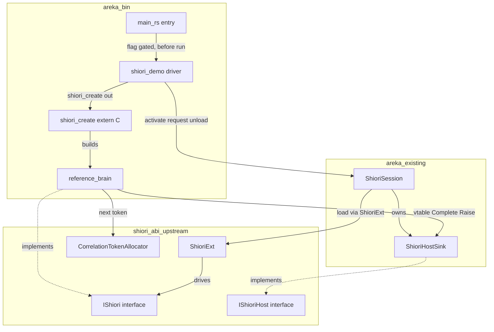
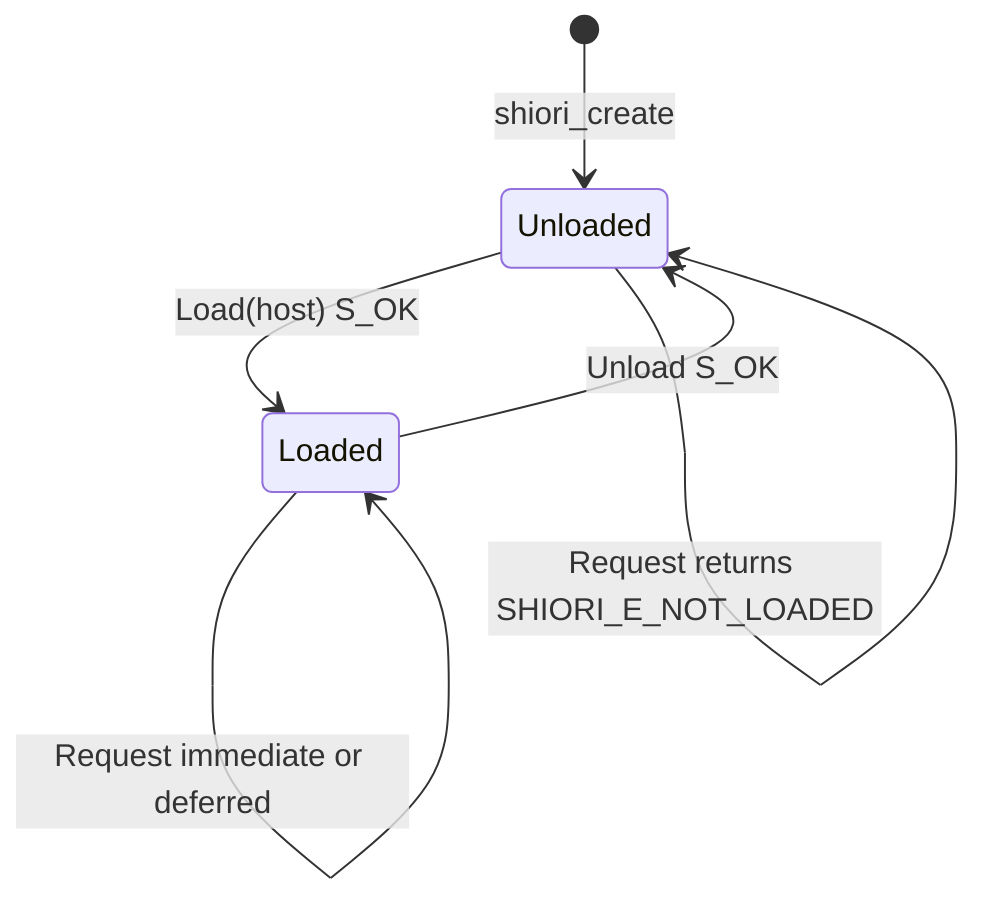

# 技術設計書: areka-P0-shiori-reference

> 上位設計の正本: `doc/COMPAT_ARCHITECTURE.md` §5（SHIORI ホスティング・ネイティブ in-proc 経路）。
> 上流（完成）: `areka-P0-shiori-com`（`IShiori`/`IShioriHost` ABI・`shiori-abi` クレート）。
> 調査ログ・判断根拠の詳細: `research.md`（本書はレビュアーが単独で読める自己完結文書とする）。

## Overview

本仕様は、`areka-P0-shiori-com` で確立した `IShiori`/`IShioriHost` ABI に対する、**非テスト（製品コード）の最小リファレンス COM-SHIORI（native 脳）**と、それを areka 本体から in-proc アクティベーションで挿して数往復ドライブし後始末する**実走デモ経路**を提供する。これにより (1) ABI が実アプリ上で動く実走証明、(2) 下流（`areka-P0-shiori-host-32`／`areka-P0-reference-ghost`）が `IShiori` を実装する際の正解見本、を得る。

リファレンス脳は既存テストモック（`MockBrain`/`DeferringBrain`/`StatefulBrain`）の和集合を単一の製品コード脳へ統合したものであり、新規アルゴリズム・外部依存を一切持たない。`shiori-abi` の公開 API（`#[implement(IShiori)]`・`ShioriExt`・`CorrelationTokenAllocator`・HRESULT 定数）と areka 側の既存受け皿（`ShioriHostSink`・`ShioriSession`）を**変更せずに**採用する。

content（リクエスト・応答・通知の本文）は本仕様では**不透明な HSTRING（UTF-16）のまま固定／エコー**で扱い、意味づけ・解析・スキーマ検証を行わない。正準 content プロトコルは完了仕様 `areka-P0-shiori-protocol`（論理 SSOT＝`doc/shiori/fragments/`）の責務であり、本リファレンスはその語彙を参照・複製しない。

### Goals
- 製品コード（非 `#[cfg(test)]`）として実走する `IShiori` 実装の正解見本を 1 つ提供する。
- `IShiori` の各経路（ロード／アンロード・即時応答・遅延応答＋Complete・能動通知 Raise・未ロード拒否）を実アプリ上で end-to-end に疎通させる。
- `IShiori` 実体を生成する唯一の純粋 C コンストラクタ `shiori_create` を定義・実装し、下流 DLL 境界の生成契約の正解見本とする。
- 各経路の疎通結果を構造化 `tracing` ログで開発者が観測可能にする。

### Non-Goals
- 正準 content プロトコルの定義・確定（→ `areka-P0-shiori-protocol`）。content 語彙を参照・複製しない。
- 32bit DLL ホスティング・`LoadLibraryW`＋`GetProcAddress` による実 DLL ロード経路（→ `areka-P0-shiori-host-32`）。
- pasta（native 旗艦脳）の実装（→ `areka-P0-reference-ghost`, M2）、さくらスクリプト解釈・トークナイズ・balloon 反映（→ `areka-P0-sakura-script` ほか）。
- DLL 適合（conformance）テストキット（host-32 実装過程で決定）。
- 非同期実行系（bevy World system／async タスク）での遅延 request 圧送、毎秒ポーリング等の上位タイミングロジック、x86（32bit）ネイティブ直結。

## Boundary Commitments

### This Spec Owns
- **リファレンス脳の `IShiori` 実装面**: 固定／エコー応答ロジック、遅延（`SHIORI_S_PENDING`＋トークン発行）、能動通知（Raise）、未ロード拒否（`SHIORI_E_NOT_LOADED`）を単一の製品コード脳へ統合（要件 1, 2, 3, 4, 5）。
- **純粋 C コンストラクタ契約**: `IShiori` 実体生成の唯一の入口 `shiori_create`（`extern "system"`・`HRESULT shiori_create(IShiori** out)` 形・C リンケージは `#[unsafe(no_mangle)]`）の定義・実装。COM（x64／ARM64・in-proc）経路の生成入口に限定（要件 9）。
- **実走デモ経路（デモドライバ）**: areka 本体から `shiori_create` 経由で脳を取得し、`activate`→数往復 `request`→遅延完了待ち合わせ→`Raise`→`unload` を駆動し、各経路を `tracing` で観測する配線。フラグ／環境変数で明示有効化されたときのみ駆動（要件 6）。
- **リファレンスとしての doc 化**: 各経路の正解見本説明・content 不透明方針・下流位置づけを、リファレンス脳モジュールの module-level doc に集約（要件 7）。

### Out of Boundary
- 正準 content プロトコルの定義（`areka-P0-shiori-protocol`／`doc/shiori/fragments/`）。本リファレンスは content を不透明に取り回すのみ（要件 8.1, 8.2）。
- 過去互換 flat-C（`load`/`unload`/`request`）・32bit DLL ホスティング・自前 IPC・charset 変換（`areka-P0-shiori-host-32`）。`shiori_create` 契約は COM in-proc 生成入口に限定（要件 9.7）。
- pasta 旗艦脳・さくらスクリプト解釈・conformance テストキット（要件 8.2）。
- `shiori-abi`（`IShiori`/`IShioriHost` ABI・`ShioriExt`）・areka `ShioriHostSink`・`ShioriSession` の面の変更（採用するが不変・要件 1.3, 8.3）。

### Allowed Dependencies
- **上流 `shiori-abi`（完成・不変）**: `IShiori`/`IShiori_Impl`、`IShioriHost`、`ShioriExt::{load,unload,request}`、`RequestOutcome`、`CorrelationToken`/`CorrelationTokenAllocator`、HRESULT 定数（`SHIORI_S_PENDING`/`SHIORI_E_NOT_LOADED`/`SHIORI_E_UNKNOWN_TOKEN`）、`ShioriError`。
- **areka 側既存受け皿（製品コード・不変）**: `ShioriHostSink`（`#[implement(IShioriHost)]`・突合枠＋メールボックス）、`ShioriSession`（`activate`/`request`/`poll_completions`/`expire_if_elapsed`/`unload`・単一 in-flight 規律）、`HostMessage::{Raised,Completed}`。
- **共通基盤**: `windows-core` 0.62.2（`#[implement]`・`Interface::vtable`・`from_raw_borrowed`・`AsImpl`）、`tracing`/`tracing-subscriber`（`logging.md` 準拠）。
- **依存方向の制約**: リファレンス脳・デモドライバは `shiori-abi`・areka 受け皿へ**下向き**にのみ依存する。`shiori-abi` や `ShioriHostSink`/`ShioriSession` を逆に変更してはならない。

### Revalidation Triggers
- 上流 ABI（`IShiori`/`IShioriHost` の vtable 形・HSTRING 所有権規約・HRESULT 語彙）が変動した場合 → in-tree 実装者として本リファレンス脳・デモドライバを追従更新（流動契約 D7・要件 8.3）。
- `shiori_create` の署名（`HRESULT shiori_create(IShiori** out)`・参照カウント 1 の move-out・失敗時 out 未書込）が変わる場合 → 下流 host-32／pasta が生成入口契約を再確認。
- `ShioriSession` の利用面（`activate`/`request`/`poll_completions`/`expire_if_elapsed`/`unload`）または単一 in-flight 規律が変わる場合 → デモ駆動を再確認。
- content を不透明から構造化（json-rpc 等）へ変える場合 → これは本仕様の責務外（`areka-P0-shiori-protocol`）であり、本リファレンスは起点を提供するのみ。

## Architecture

### Existing Architecture Analysis

本仕様は既存システムの拡張（Extension）である。変更不可の前提として以下を尊重する:

- **`shiori-abi`（上流・完成）**: `IShiori` は脳が実装する唯一の COM 境界（`Load(host: *mut c_void)`／`Unload()`／`Request(input: *const HSTRING, out_response: *mut HSTRING, out_token: *mut u64) -> HRESULT`）。`Request` は HRESULT で 3 分岐（`S_OK`＝即時 move-out／`SHIORI_S_PENDING`＝遅延＋トークン／error＝失敗）。HSTRING は `[in]`＝借用（解放しない・保持時 clone）、`[out]`＝callee 確保・caller 解放の move-out。
- **areka 受け皿（製品コード・非テスト）**: `ShioriHostSink`（突合枠 `Mutex<Option<CorrelationToken>>`＋メールボックス `Mutex<VecDeque<HostMessage>>`）、`ShioriSession`（`activate` が内部で `ShioriHostSink::new().into()` を生成し `ShioriExt::load` で脳へ渡す／`request` が単一 in-flight を適用／`poll_completions` が `Complete`/`Raise` を drain して保留解除）。これらは `main.rs` で `mod` 宣言済みだが現状 `#![allow(dead_code)]`（結合テストからのみ利用）。**デモ配線が入ると dead_code は解消する。**
- **areka 実行モデル**: `main.rs` は `#![cfg_attr(not(debug_assertions), windows_subsystem = "windows")]`（release はコンソール無）／`WinThreadMgr::new()?`→`mgr.world()`（bevy_ecs World）→`world.borrow().spawn(|tx| async move {..})`→`mgr.run()?`（ブロッキングメッセージループ）。

### 脳→host 呼び出しイディオム（不変・踏襲必須）

`IShioriHost::Raise`/`Complete` の raw メソッドは ABI 定義モジュール private のため、脳から host を駆動する際は **vtable 直呼び**が必須（既存テストモックと同一技法）:

```rust
// 脳が保持 host へ Complete / Raise を発火する唯一の形
unsafe { (Interface::vtable(host).Complete)(host.as_raw(), token, response as *const HSTRING) }
unsafe { (Interface::vtable(host).Raise)(host.as_raw(), script as *const HSTRING) }
```

`Load` で受け取った raw host は `IShioriHost::from_raw_borrowed(&host)` ＋ `.cloned()`（=AddRef）で保持し、`Unload` で `None` 代入（=Release）する。

### Architecture Pattern & Boundary Map

選択パターン: **製品コード脳（見本）＋ デモドライバ（本体実走）の責務分離**。脳は純粋な `IShiori` 実装として読みやすさ（見本性）を担保し、ドライバはセッション規律の駆動と観測に専念する。デモは `main.rs` の起動経路へフラグゲート付きで最小フックされ、`mgr.run()`（メッセージループ）に入る前に main スレッド上で同期完結する（COM スレッドアフィニティと遅延待ち合わせを同一スレッドに収める）。



**Architecture Integration**:
- Selected pattern: 製品コード脳＋デモドライバの 2 責務分離（脳＝見本、ドライバ＝本体実走）。
- Domain/feature boundaries: 脳は `IShiori` 実装のみ／ドライバはセッション駆動と観測のみ／`shiori_create` は生成入口のみ。content の意味づけはどのコンポーネントも持たない。
- Existing patterns preserved: `shiori-abi` の vtable 直呼びイディオム、`from_raw_borrowed`＋`cloned()` の host 保持、`ShioriSession` の単一 in-flight・`poll_completions` drain・`expire_if_elapsed` 決定的タイムアウト。
- New components rationale: リファレンス脳（製品コード化が欠落）、デモドライバ（実走配線が欠落）、`shiori_create`（生成入口契約が欠落）の 3 点のみ。
- Steering compliance: `tech.md`（Rust 2024・windows-core 0.62.2・tracing 規約）、`structure.md`（snake_case module・責務分離）、`logging.md`（構造化フィールド・スコーププレフィックス）、`COMPAT_ARCHITECTURE.md` §5（in-proc COM 直結）。

### Technology Stack

| Layer | Choice / Version | Role in Feature | Notes |
|-------|------------------|-----------------|-------|
| Runtime / COM | windows-core 0.62.2 | `#[implement(IShiori)]`・`Interface::vtable`・`from_raw_borrowed`・`AsImpl`・HSTRING | 上流 ABI と同一。RoInitialize 不要（in-proc HSTRING は WinRT 非依存・§COMPAT §5） |
| Upstream ABI | shiori-abi（in-tree path 依存） | `IShiori`/`IShioriHost`/`ShioriExt`/`RequestOutcome`/`CorrelationTokenAllocator`/HRESULT 定数 | 不変採用（要件 1.3/8.3） |
| Host 受け皿 | areka `shiori_host`/`shiori_session`（既存） | `ShioriHostSink`・`ShioriSession`・`HostMessage` | 不変採用。デモ配線で dead_code 解消 |
| Observability | tracing / tracing-subscriber | 各経路の info ログ（`logging.md` 準拠） | subscriber は `main.rs` 既設。`RUST_LOG` 制御 |
| Build target | Rust 2024・x64／ARM64（CPU ネイティブ・x86 除外） | `extern "system"`（COM 標準・stdcall。x64/ARM64 で `extern "C"` と同一 ABI） | ARM64 はビルド/CI 確認のみ・ソース分岐なし（要件 8.3, 9.2） |

> cdylib／`LoadLibraryW`＋`GetProcAddress` は本仕様では採用しない（host-32 の責務）。`shiori_create` は in-tree シンボル直呼びで実走させる（research.md Decision 2）。

## File Structure Plan

### Directory Structure
```
crates/areka/src/
├── reference_brain.rs   # 新規: 製品コードのリファレンス脳。#[implement(IShiori)] 実装
│                        #   （即時/エコー・遅延+トークン・Raise・未ロード拒否）＋
│                        #   pub unsafe extern "system" fn shiori_create(out) コンストラクタ＋
│                        #   module-level doc（正解見本・content 不透明方針・下流位置づけ＝要件7）
├── shiori_demo.rs       # 新規: デモドライバ。shiori_create で脳取得→ShioriSession で
│                        #   activate→数往復 request（即時/遅延）→poll_completions 待ち合わせ→
│                        #   Raise 観測→unload。各経路を tracing::info! で観測。
│                        #   フラグ/環境変数ゲート（要件 6.8）
├── shiori_host.rs       # 既存・不変（ShioriHostSink）
├── shiori_session.rs    # 既存・不変（ShioriSession）
└── main.rs              # 変更: mod 宣言追加・mgr.run() 前にフラグゲートでデモ駆動フック
```

### Modified Files
- `crates/areka/src/main.rs` — `mod reference_brain;` `mod shiori_demo;` を追加。`WinThreadMgr` 構築後・`mgr.run()` 呼び出し前に、フラグ／環境変数が有効なときのみ `shiori_demo::run_demo()` を main スレッドで同期呼び出し。デモ配線により `shiori_host`/`shiori_session` の `#![allow(dead_code)]` 依存が解消されるため、不要になった allow 属性を整理。
- `crates/areka/Cargo.toml` — 追加依存は不要（`shiori-abi`・`windows-core`・`tracing` は既設）。`reference_brain`/`shiori_demo` は bin（`areka`）内モジュールとして同梱。

> 各ファイルは単一責務: `reference_brain.rs`＝`IShiori` 実装＋生成入口、`shiori_demo.rs`＝駆動と観測、`main.rs`＝フック点のみ。脳とドライバを分離し、下流が脳モジュール単体を見本として読めるようにする。

## System Flows

### デモ駆動シーケンス（即時→遅延+Complete→Raise→unload）

```mermaid
sequenceDiagram
    participant Main as main_rs
    participant Demo as shiori_demo
    participant Create as shiori_create
    participant Brain as reference_brain
    participant Session as ShioriSession
    participant Sink as ShioriHostSink

    Main->>Demo: run_demo (flag gated, before mgr.run)
    Demo->>Create: shiori_create(out)
    Create-->>Demo: IShiori (refcount 1)
    Demo->>Session: activate(brain)
    Session->>Sink: new().into()
    Session->>Brain: Load(host)
    Brain-->>Session: S_OK (host held)
    Note over Demo,Brain: 即時応答経路
    Demo->>Session: request(OnBoot opaque)
    Session->>Brain: Request(input,out_response,out_token)
    Brain-->>Session: S_OK + response (echo or fixed)
    Note over Demo,Brain: 遅延応答経路
    Demo->>Session: request(OnBoot opaque)
    Session->>Brain: Request(...)
    Brain-->>Session: SHIORI_S_PENDING + token
    Demo->>Brain: trigger deferred completion
    Brain->>Sink: vtable Complete(token,response)
    Demo->>Session: poll_completions()
    Session-->>Demo: HostMessage Completed (pending cleared)
    Note over Demo,Brain: 能動通知経路
    Demo->>Brain: trigger raise
    Brain->>Sink: vtable Raise(script)
    Demo->>Session: poll_completions()
    Session-->>Demo: HostMessage Raised
    Demo->>Session: unload()
    Session->>Brain: Unload()
    Demo-->>Main: return (then mgr.run)
```

**フロー上の決定**:
- 全ステップは main スレッド上で同期完結する（`mgr.run()` 前）。遅延 `Complete` はデモドライバが明示トリガし、同一ループ反復で `poll_completions` が drain して突き合わせる（タイマ・クロススレッド不要・決定的）。
- 単一 in-flight 規律により、遅延 request が保留中は次 request を発行しない（`SessionError::RequestInFlight`）。`Complete` 受領で `pending` が解除されてから次へ進む。
- いずれかの段で失敗したときは、デモドライバが失敗を `tracing::error!` で判別可能に報告し、`unload()` による後始末を試みる（要件 6.6）。

### リファレンス脳のロード状態（未ロード拒否）



未ロード状態での `Request` は `SHIORI_E_NOT_LOADED` を返す（要件 2.3/2.4）。状態は `AtomicBool` で保持（`StatefulBrain` 踏襲）。

## Requirements Traceability

| Requirement | Summary | Components | Interfaces / Contracts | Flows |
|-------------|---------|------------|------------------------|-------|
| 1.1–1.4 | 非テストのリファレンス脳・固定/エコー・content 不解釈 | reference_brain | `IShiori_Impl`（Load/Unload/Request） | 状態図 |
| 2.1–2.4 | ライフサイクル・host 保持・未ロード拒否・失敗報告 | reference_brain | Load（host 保持）/Unload/`SHIORI_E_NOT_LOADED` | 状態図 |
| 3.1–3.4 | 即時応答・move-out・content 不透明取り回し | reference_brain | Request→`S_OK`＋out_response move-out | シーケンス 即時 |
| 4.1–4.4 | 遅延応答・トークン発行・Complete・トークン保持 | reference_brain, ShioriHostSink | `SHIORI_S_PENDING`＋token／vtable Complete／`CorrelationTokenAllocator` | シーケンス 遅延 |
| 5.1–5.3 | 能動通知 Raise・固定文字列・最低1回実演 | reference_brain, ShioriHostSink | vtable Raise | シーケンス Raise |
| 6.1–6.8 | 実走デモ経路・観測・セッション規律・フラグゲート | shiori_demo, ShioriSession, main.rs | `activate`/`request`/`poll_completions`/`expire_if_elapsed`/`unload`／tracing | シーケンス全体 |
| 7.1–7.3 | リファレンス doc 化・content 不透明方針・下流位置づけ | reference_brain module doc | module-level `//!` doc | — |
| 8.1–8.3 | content 不透明性・スコープ境界・x64/ARM64 | reference_brain（規律） | HSTRING 不透明取り回し・非実装事項 | 状態図 |
| 9.1–9.7 | 純粋C コンストラクタ `shiori_create`・所有権・COM 限定 | shiori_create, shiori_demo | `extern "system" HRESULT shiori_create(IShiori** out)` | シーケンス 生成 |

## Components and Interfaces

| Component | Domain/Layer | Intent | Req Coverage | Key Dependencies (P0/P1) | Contracts |
|-----------|--------------|--------|--------------|--------------------------|-----------|
| ReferenceBrain | SHIORI 脳 | 製品コードの `IShiori` 実装（各経路の見本） | 1,2,3,4,5,8 | shiori-abi IShiori (P0), CorrelationTokenAllocator (P0), ShioriHostSink via vtable (P0) | Service, State |
| shiori_create | 生成入口 | `IShiori` 実体生成の唯一の純粋C コンストラクタ | 9 | ReferenceBrain (P0), windows-core (P0) | Service |
| ShioriDemoDriver | デモ配線 | セッション規律を駆動し各経路を観測 | 6 | ShioriSession (P0), shiori_create (P0), tracing (P1) | Service |

### SHIORI 脳

#### ReferenceBrain

| Field | Detail |
|-------|--------|
| Intent | `#[implement(IShiori)]` の製品コード脳。即時/エコー・遅延+トークン・Raise・未ロード拒否を単一実装に統合 |
| Requirements | 1.1, 1.2, 1.3, 1.4, 2.1, 2.2, 2.3, 2.4, 3.1, 3.2, 3.3, 3.4, 4.1, 4.4, 5.1, 5.2, 8.1, 8.3 |

**Responsibilities & Constraints**
- `IShiori` の各経路を実装する唯一の製品コード脳。`shiori-abi` の面を変更しない。
- content は不透明 HSTRING（UTF-16）として取り回し、固定文字列または受信 content のエコーで応答する。パース・スキーマ・意味づけを行わない（要件 1.4/8.1）。
- ロード状態を `AtomicBool` で保持し、未ロード時 `Request` は `SHIORI_E_NOT_LOADED`（要件 2.3/2.4）。
- `Load` で受け取った raw host を `from_raw_borrowed`＋`cloned()` で AddRef 保持、`Unload` で Release（要件 2.1/2.2）。
- 遅延トークンは内部保持の `CorrelationTokenAllocator::next()` で採番し、完了まで保持する（要件 4.1/4.4）。
- 遅延 `Complete`・能動 `Raise` は保持 host へ vtable 直呼びで発火する（脳→host の唯一の形）。

**Dependencies**
- Inbound: shiori_create — 実体生成（P0）／ShioriDemoDriver 経由 ShioriExt — Load/Unload/Request 駆動（P0）
- Outbound: ShioriHostSink（保持 IShioriHost）— vtable Complete/Raise（P0）
- External: shiori-abi `IShiori`/`IShioriHost`/`CorrelationTokenAllocator`/HRESULT 定数（P0）、windows-core `#[implement]`/`Interface::vtable`/`from_raw_borrowed`（P0）

**Contracts**: Service [x] / State [x]

##### Service Interface
```rust
// #[implement(IShiori)] による IShiori_Impl 実装（raw vtable 面）
impl IShiori_Impl for ReferenceBrain_Impl {
    // host を AddRef 保持し Loaded へ遷移。成功=S_OK（要件 2.1）
    unsafe fn Load(&self, host: *mut core::ffi::c_void) -> HRESULT;
    // host を Release し Unloaded へ遷移。成功=S_OK（要件 2.2）
    unsafe fn Unload(&self) -> HRESULT;
    // 未ロード時 SHIORI_E_NOT_LOADED。即時=S_OK+out_response move-out、
    // 遅延=SHIORI_S_PENDING+out_token（要件 2.4/3.x/4.1）
    unsafe fn Request(
        &self,
        input: *const HSTRING,
        out_response: *mut HSTRING,
        out_token: *mut u64,
    ) -> HRESULT;
}
```
- Preconditions: `Request` は `Load` 済みであること（未満足なら `SHIORI_E_NOT_LOADED`）。
- Postconditions: 即時は `out_response` に move-out（caller 解放）。遅延は `out_token` にトークン書込・後続 `Complete` で配送。失敗時 out-param は未書込。
- Invariants: content を解釈しない（不透明取り回しのみ）。発行済みトークンは完了まで突合可能に保持。

##### State Management
- State model: `Unloaded`／`Loaded`（`AtomicBool`）。保持 host は `RefCell<Option<IShioriHost>>`。トークンアロケータは脳内保持。
- Persistence & consistency: プロセス内メモリのみ。永続化なし。
- Concurrency strategy: デモは main スレッド同期駆動（`!Send`/`!Sync` COM オブジェクトの単一スレッド規律）。状態フラグのみ `AtomicBool`。

**Implementation Notes**
- Integration: `MockBrain`（即時 `core::ptr::write(out_response, ..)`＋`S_OK`）/`DeferringBrain`（host 保持・`SHIORI_S_PENDING`＋vtable Complete/Raise）/`StatefulBrain`（`AtomicBool`＋未ロード拒否）の和集合を 1 つの製品コード脳へ統合（テストモックの昇格・新規ロジックなし）。
- Validation: 即時は固定文字列または受信 content のエコー、Raise は固定/既知文字列。いずれも UTF-16 HSTRING のまま。
- Risks: COM スレッドアフィニティ（main スレッド同期で回避）。vtable 直呼びは ABI private メソッドへの唯一の到達手段（既存技法踏襲）。

#### shiori_create（純粋C コンストラクタ）

| Field | Detail |
|-------|--------|
| Intent | `IShiori` 実体を生成する唯一の純粋C コンストラクタ・エクスポート（COM in-proc 生成入口の正解見本） |
| Requirements | 9.1, 9.2, 9.3, 9.4, 9.6, 9.7 |

**Responsibilities & Constraints**
- `IShiori` 生成をこの入口に一元化する（要件 9.1）。
- Windows COM 標準呼出規約（`extern "system"`＝`__stdcall`・x64/ARM64 で `extern "C"` と同一 ABI）に従い、C リンケージは `#[unsafe(no_mangle)]` で担保（要件 9.2）。
- 成功時、参照カウント 1 の `IShiori` を出力引数へ move-out し成功 HRESULT を返す（要件 9.3）。
- 失敗時、出力を生成せず判別可能な失敗 HRESULT を返す（要件 9.4）。
- 対象を COM（x64/ARM64・in-proc）生成入口に限定。過去互換 flat-C・32bit DLL は対象外（要件 9.7）。

**Contracts**: Service [x]

##### Service Interface
```rust
/// IShiori 実体を生成する唯一の純粋C コンストラクタ。
/// 成功時 out へ refcount 1 の IShiori を move-out し S_OK を返す。
/// 失敗時 out 未書込・失敗 HRESULT を返す。
/// 署名は HRESULT shiori_create(IShiori** out) に対応（c_void** で受け、IShiori へ写す）。
#[unsafe(no_mangle)]
pub unsafe extern "system" fn shiori_create(out: *mut *mut core::ffi::c_void) -> HRESULT;
```
> 呼出規約は COM/STDAPI 標準の `extern "system"`（＝stdcall）。x64/ARM64 では `extern "C"` と同一 ABI だが、COM ABI・`IShiori` vtable との整合で正準表記は `system`（要件 9.2）。edition 2024 では `#[unsafe(no_mangle)]`・`unsafe extern "system"` 形が必須（本 workspace は `edition = "2024"`）。C リンケージ（非マングル）は `#[unsafe(no_mangle)]` が担保する。
- Preconditions: `out` は非 NULL の有効な書込先ポインタ（呼び出し側が保証）。
- Postconditions: 成功時のみ `out` へ書込（writes-on-success）＝refcount 1 の `IShiori`（caller が Release 義務）＋`S_OK`。失敗時は `out` を書き込まず（未書込不変条件）失敗 HRESULT を返す。
- Invariants: 生成入口はこの 1 関数のみ。`IShiori` 以外の型を露出しない。失敗時 out 未書込は §Testing Strategy の不変条件テストで固定する（要件 9.3/9.4）。

**Implementation Notes**
- Integration: in-tree シンボル直呼び（`shiori_demo` から直接呼出）。実 DLL ロード（`LoadLibraryW`＋`GetProcAddress("shiori_create")`）は本仕様では実走しないが、`#[unsafe(no_mangle)]`・`unsafe extern "system"`（edition 2024）署名は将来 host-32 が `GetProcAddress` で引ける形を満たす（要件 9.6・正解見本）。
- Validation: 成功 HRESULT は `S_OK`。失敗 HRESULT は判別可能な error（生成失敗時）。
- Risks: cdylib 化しないため実 DLL 境界は未実走（host-32 へ委譲・research.md Decision 2）。署名の忠実性で見本価値を担保。

### デモ配線

#### ShioriDemoDriver

| Field | Detail |
|-------|--------|
| Intent | areka 本体から脳を挿し各経路を駆動・観測し後始末する実走デモ |
| Requirements | 6.1, 6.2, 6.3, 6.4, 6.5, 6.6, 6.7, 6.8, 9.5 |

**Responsibilities & Constraints**
- `shiori_create` で `IShiori` を取得し所有する（要件 6.1/9.5）。
- `ShioriSession::activate` で in-proc アクティベーション（Load で sink 受け渡し・要件 6.1）。
- OnBoot 形の不透明リクエストで即時・遅延・Raise の各経路を数往復ドライブ（要件 6.2/6.7）。会話描画・さくらスクリプト解釈・balloon 反映は行わない（要件 6.7）。
- 遅延応答は既存セッション規律（単一 in-flight・トークン突合・タイムアウト `expire_if_elapsed`）に従って待ち合わせ（要件 6.5）。
- `poll_completions` を同一ループで drain し各経路の疎通を `tracing::info!` で観測（要件 6.4）。
- 完了後 `unload` で後始末（要件 6.3）。`IShiori` を Release（要件 9.5）。
- 失敗時は判別可能に報告し後始末を試みる（要件 6.6）。
- フラグ／環境変数で明示有効化されたときのみ起動（既定では駆動しない・要件 6.8）。

**Dependencies**
- Inbound: main.rs — フラグゲートでの呼出（P0）
- Outbound: shiori_create — 脳取得（P0）／ShioriSession — activate/request/poll_completions/unload（P0）／tracing — 観測（P1）
- External: windows-core HSTRING（P0）

**Contracts**: Service [x]

##### Service Interface
```rust
/// フラグ/環境変数が有効なときのみ呼ばれる。脳を取得→活性化→数往復→後始末。
/// main スレッド上で mgr.run() 前に同期完結する。失敗は判別可能に報告し後始末を試みる。
pub fn run_demo() -> Result<(), DemoError>;

/// デモ駆動失敗の判別可能なエラー（後始末を試みた上で報告）
pub enum DemoError {
    Create(HRESULT),          // shiori_create 失敗
    Session(SessionError),    // activate/request/unload 失敗（単一 in-flight 等）
    Timeout,                  // 遅延完了が expire_if_elapsed のタイムアウトに到達
}
```
- Preconditions: フラグ／環境変数が有効（無効時は呼ばれない・要件 6.8）。
- Postconditions: 各経路（即時・遅延+Complete・Raise）を最低 1 回実演し、`unload`＋Release で後始末（要件 4.3/5.3/6.3）。
- Invariants: 単一 in-flight を破らない（遅延保留中は次 request を発行しない）。main スレッド単一駆動。

**Implementation Notes**
- Integration: `main.rs` の `WinThreadMgr` 構築後・`mgr.run()` 前にフラグ判定し `run_demo()` を同期呼出。フラグは環境変数（例 `AREKA_SHIORI_DEMO`）またはコマンドライン引数で表現（実装時に確定・既定無効を厳守）。
- Validation: 各経路の info ログ（スコーププレフィックス `[shiori-demo]`・構造化フィールド `token`/`hresult` 等は `logging.md` 準拠）。即時/遅延/Raise の到達をログで確認可能。
- Risks: メッセージループ前駆動が UI 立ち上げを阻害しないこと（同期短時間完結）。release コンソール非表示は debug 実行／`RUST_LOG` で観測（research.md Decision 3）。

## Error Handling

### Error Strategy
HRESULT 境界（脳・`shiori_create`）と Rust `Result`／`enum` 境界（デモドライバ）を分離する。脳は ABI の HRESULT 語彙のみを返し、ドライバは `ShioriExt`/`ShioriSession` が写した `Result` を受けて `tracing` で報告し後始末する。

### Error Categories and Responses
- **脳の失敗（HRESULT）**: 未ロード Request → `SHIORI_E_NOT_LOADED`（要件 2.4）。生成失敗 → `shiori_create` が失敗 HRESULT・out 未書込（要件 9.4）。host 突合不能 → host 側が `SHIORI_E_UNKNOWN_TOKEN`（既存 `ShioriHostSink` の挙動・本仕様で新規実装なし）。
- **デモの失敗（DemoError）**: `Create`/`Session`/`Timeout` を判別可能に保持し `tracing::error!`（`error`/`hresult` フィールド）で報告。いずれの失敗でも `unload` 後始末を試みる（要件 6.6）。
- **遅延タイムアウト**: `ShioriSession::expire_if_elapsed` の決定的タイムアウトを用い、未完了時は保留放棄＋host 突合枠クリア（stale Complete を弾く）。

### Monitoring
全経路（`shiori_create`/load/即時/遅延/Complete/Raise/unload）を `tracing::info!`、失敗を `tracing::error!` で発行（`logging.md` 準拠）。subscriber は `main.rs` 既設（`EnvFilter` 既定 info・`RUST_LOG` 制御）。

## Testing Strategy

### Unit Tests（脳単体・`reference_brain` in-source または tests/）
- 即時応答: `Request` が `S_OK`＋固定/エコー HSTRING を `out_response` へ move-out し、content を解釈しないこと（要件 3.2/3.3/3.4）。
- 遅延応答: `Request` が `SHIORI_S_PENDING`＋`CorrelationTokenAllocator` 採番トークンを `out_token` に返し、保持 host へ vtable `Complete(token,response)` を発火できること（要件 4.1/4.2/4.4）。
- 能動通知: 保持 host へ vtable `Raise(script)` を固定/既知文字列で発火すること（要件 5.1/5.2）。
- 未ロード拒否: `Load` 前の `Request` が `SHIORI_E_NOT_LOADED` を返すこと（要件 2.3/2.4）。
- `shiori_create`: 成功時 refcount 1 の `IShiori` を out へ返し `S_OK`、失敗時 out 未書込・失敗 HRESULT（要件 9.3/9.4）。

### Integration Tests（デモ経路・`ShioriSession` 越し）
- 即時→遅延+Complete→Raise→unload の数往復を `ShioriSession` 経由で駆動し、`poll_completions` が `HostMessage::Completed`/`Raised` を drain し保留が解除されること（要件 6.2/6.4/6.5）。
- 単一 in-flight: 遅延保留中の次 request が `SessionError::RequestInFlight` で拒否されること（要件 6.5）。
- タイムアウト: `expire_if_elapsed` で未完了保留が決定的に放棄され、stale `Complete` が `SHIORI_E_UNKNOWN_TOKEN` で弾かれること（要件 6.5/6.6）。
- 後始末: 失敗注入時も `unload`＋Release が試みられること（要件 6.6/9.5）。

### Manual Verification（実走デモ）
- フラグ／環境変数有効時のみ `run_demo()` が起動し、既定（通常起動）では駆動しないこと（要件 6.8）。
- debug 実行（または `RUST_LOG=info`）で各経路の info ログが観測でき、視覚 UX・会話描画に依存しないこと（要件 6.4/6.7）。

## Supporting References
- 既存実シグネチャ・vtable 直呼びイディオム・テストモック昇格元の詳細: `research.md`（設計フェーズ追記 §検証済み実シグネチャ／Decision 1–6）。
- 上位設計の正本: `doc/COMPAT_ARCHITECTURE.md` §5（ネイティブ in-proc COM 経路・push 対応・HSTRING/WinRT 切り分け）。
- 正準 content プロトコル（参照のみ・複製禁止）: `areka-P0-shiori-protocol`／`doc/shiori/fragments/`。
