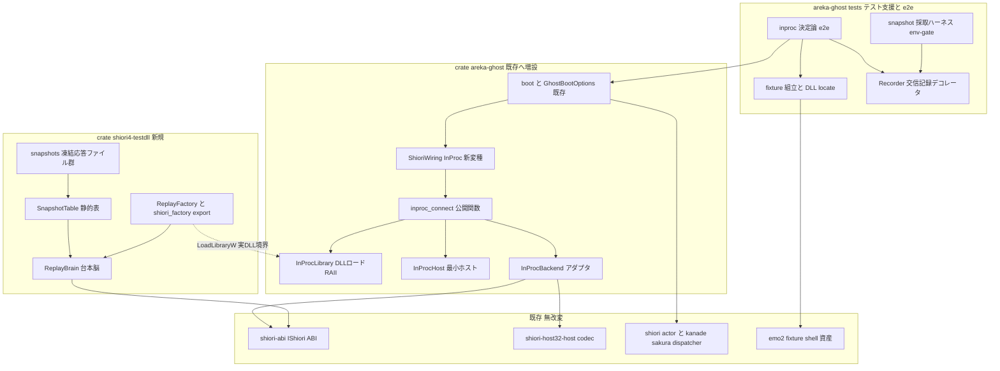
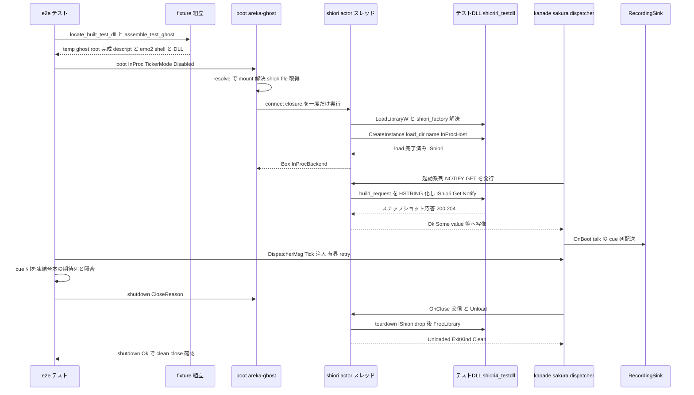

# 技術設計書 — areka-P0-shiori4-test-ghost

## Overview

**Purpose**: 本機能は areka のテスト作者に対し、「実 SHIORI 境界を踏む決定論テストゴースト」を最小手数で立ち上げる基盤を提供する。実 boot 経路（descript.txt 起点マウント → x64 SHIORI4 DLL 実ロード → SHIORI 交信 → talk 再生 → close 握手）を、pasta 非依存・i686 非依存・別プロセス非依存・sleep 不使用のまま `cargo test --workspace` 内で決定論的に一周させる。

**Users**: areka のテスト作者が、境界横断の回帰テストを既存 `GhostBootOptions`／`ShioriWiring` シームだけで記述するために使う。副次に、M2 native x64 SHIORI4 の所有者が `ShioriWiring::InProc` を本番消費者として再利用する。

**Impact**: 現状 2 変種（`Helper`＝i686 別プロセス／`Custom`＝closure 注入 fake）しかない `ShioriWiring` へ第 3 変種 `InProc` を追加し、新規 cdylib crate `shiori4-testdll`（ゴールデンスナップショット replay 脳）とテストゴースト fixture 組立・決定論 e2e・交信記録デコレータ `Recorder` を新設する。本番 main の結線・既存テスト資産（spine e2e／env-gate 実 pasta 追験）は無改変。

### Goals

- テスト作者が fixture パスと `ShioriWiring::InProc` の指定だけで境界横断決定論テストを boot できる（専用入口を新設しない）
- x64 SHIORI4 テスト DLL が正典イベント集合へ、実 pasta 採取のゴールデンスナップショットを決定論 replay する
- boot→talk→close 決定論 e2e が `cargo test --workspace` の常設ゲートとして、手動プリビルドなし・Tick 注入のみで green になる
- SHIORI 交信列（id・GET/NOTIFY・順序）と cue sink 出力の双方を、backend 非依存の同一手口（`Recorder`）で assert できる
- `InProc` シームが M2 native x64 SHIORI4 の正規ロード経路として前方整合する

### Non-Goals

- 本番 main の結線変更（M1 本番ゴーストは emo2＝`Helper` 経路のまま・要件 7.2）
- descript 駆動の bitness／SHIORI 種別自動判別（M2 シーム予約・要件 7.3）
- `IShioriHost::Raise` 起点の自発イベント・deferred（`SHIORI_S_PENDING`）の網羅（要件 7.4——テスト DLL は即時応答のみ、InProc アダプタは PENDING を fail-visible に拒否する防衛線のみ持つ）
- opt-in 実描画エミュレーション e2e の実装（要件 5.5 は許可規定。流用 emo2 資産上で将来追加可能だが本 spec の成果物に含めない——描画正しさの正本は emo 系既存檻）
- SAORI・里々・YAYA（要件 7.5）／`areka-P0-emo2-conformance-e2e` spine の改稿（要件 6.2）

## Boundary Commitments

### This Spec Owns

- **新規 crate `shiori4-testdll`**: x64 SHIORI4 テスト DLL（cdylib＋rlib）。`shiori_factory` エクスポート・replay 脳・スナップショット静的表とその凍結データ（`snapshots/*.txt`）
- **`ShioriWiring::InProc` 変種と `shiori_inproc` モジュール**（`areka-ghost` 本体 src）: x64 DLL ロード経路・最小 `IShioriHost` 実装・`IShiori`→`ShioriBackend` アダプタ・`inproc_connect` 公開関数
- **テストゴースト fixture の組立規約**（テスト支援コード）: descript 生成＋emo2 shell 流用コピー＋ビルド済み DLL 配置
- **boot→talk→close 決定論 e2e**（常設ゲート）と **`Recorder<B: ShioriBackend>` 交信記録デコレータ**（テスト支援）
- **スナップショット採取ハーネス**（env-gate・実 pasta から代表応答を凍結する一発ツール）
- **要件 6.3 の仕分け判断の記録**（本書に明記・コード変更なし）

### Out of Boundary

- `shiori-abi`（IShiori COM ABI）・`ShioriBackend` トレイト・host32 3 crate・SHIORI/3.0 codec——**無改変で消費**（Adjacent expectations）
- emo2 fixture 実体（shell/balloon 資産・pasta.dll）——読み取り流用のみ・書き換えない
- spine e2e（`spine_e2e_test.rs`）の改稿——`pub` 既存品（`RecordingSink`）の参照のみ許す
- areka bin（`reference_brain.rs`／`shiori_host.rs`／`shiori_session.rs`）——移設しない（D-2 決定・research.md §7.1）。ReferenceBrain は ABI リファレンス檻として残置
- deferred 応答・Raise 配送・プロパティ実配線の本格実装（M2 native 消費時の拡張シームとして予約）

### Allowed Dependencies

| 依存元 | 依存先 | 種別 |
|---|---|---|
| `shiori4-testdll` | `shiori-abi`・`windows-core` | 通常依存（**これのみ**。windows(Win32) 不使用・tracing 不使用） |
| `areka-ghost`（src） | 既存依存＋ **`shiori-abi`（新規）**・`windows`（既存・`Win32_System_LibraryLoader` feature 追加）・`shiori-host32-host`（既存・codec/型） | 通常依存 |
| `areka-ghost`（tests） | **`shiori4-testdll`（新規 dev-dependency・rlib 面）** | 契約定数（DLL ファイル名・スナップショット表）の単一権威共有＋ビルド順序辺 |
| 全体 | 新規外部依存 **なし**（`libloading` 等は不採用・Constraints「新規依存なし」） | — |

依存方向の不変則: `shiori-abi` ←（`shiori4-testdll`・`areka-ghost`）。`shiori4-testdll` は areka 系 crate へ依存**しない**（自給・D-2）。`areka-kanade`・`areka` は無改変。

### Revalidation Triggers

- `IShiori`／`IShioriFactory` ABI（IID・署名）の変更 → テスト DLL・InProc アダプタ双方の再検証
- `ShioriBackend` トレイトまたは `RequestError`／`ExitKind`／`HelperStatus` 語彙の変更 → アダプタ写像表と `Recorder` の再検証
- kanade の正典イベント運行表（M1 集合・GET/NOTIFY 別）の変更 → スナップショット再採取＋e2e 期待列の更新
- スナップショット再採取（凍結応答の差し替え） → e2e の期待 cue 列の更新（本設計はドリフト検出 assert を内蔵する）
- M2 native x64 SHIORI4 が InProc を本番消費する時 → `InProcHost` の能力拡張（Raise 配送・deferred・プロパティ実配線）と host 注入シームの再設計

## Architecture

### Existing Architecture Analysis

- **boot 背骨**（`areka-ghost/src/runtime.rs`）: `boot(GhostBootOptions)` がマウント解決→connect closure 構成→shiori actor→kanade→dispatcher→relay→ticker の順に結線する。`ShioriWiring` は `Helper`／`Custom` の 2 変種で、connect closure（`FnOnce() -> Result<Box<dyn ShioriBackend>, String> + Send`）は shiori アクタースレッド上で一度だけ実行される。本設計はこの match に 1 arm 足すだけで済む形状（要件 1.1 の直接根拠）。
- **本番結線の先例**（`areka-ghost/src/shiori_wiring.rs::real_connect`）: `ShioriMount` から DLL ファイル名を取り（`file: None` は推測せず即失敗）、`!Send` 資源をアクタースレッド上で構築する。InProc 結線はこの対になる並置実装。
- **backend 契約**（`areka-kanade/src/shiori/real.rs`）: `ShioriBackend` は Send 境界なし・`&mut self`・呼出は actor ループで直列化。`handle_call` が `Ok(Some)`→Value／`Ok(None)`→NoContent／`Err`→Failed へ写す。unload は `Ok(ExitKind)`／status は sticky 検査（unload 後は不参照）。
- **codec**（`shiori-host32-host/src/shiori3.rs`・純粋・windows 非依存）: `build_request(&ShioriRequest) -> Vec<u8>`／`parse_response(&[u8], Charset) -> Result<ParsedResponse, ShioriError>`。`Shiori3Client::map_get_result` の写像規律（400/500/ErrorLevel→Err・204→Ok(None)・他→Ok(value)）を InProc でも踏襲する。
- **ABI**（`shiori-abi/src/interface.rs`）: `IShioriFactory::CreateInstance`（生成＋load 融合・OutRef move-out）／`IShiori::Get`（S_OK 即時・`SHIORI_S_PENDING` 遅延・error）／`Notify`（片道）。Load/Unload は存在しない（Drop teardown）。
- **駆動技法の先例**（`spine_e2e_test.rs`）: `TickerMode::Disabled`＋`DispatcherMsg::Tick` 注入の有界 retry ループ・`RecordingSink`（pub）・`run_bounded` 有界待機。新 e2e はこの技法を逐語踏襲する。
- **決定論 DLL fixture の先例**（`shiori-host32-testdll`）: request line＋ID 抽出の純関数→固定応答選択（200/204/400）。replay 脳はこの x64/COM 版。

### Architecture Pattern & Boundary Map



**Architecture Integration**:

- **選択パターン**: 「既存シームへの変種追加＋自給 cdylib」——boot 入口・backend 契約・codec を無改変で消費し、新設は (a) 葉 crate（testdll）・(b) areka-ghost 内の 1 モジュール＋1 variant・(c) テスト支援、の 3 点に局在させる。
- **境界の分離**: 脳（DLL・台本データ）／結線（areka-ghost src・本番コード）／観測と組立（tests・テスト支援）の三層。データ（スナップショット）は脳側 crate が単一権威で所有し、e2e は rlib 面から参照する（値の二重定義を作らない）。
- **保存する既存パターン**: connect closure の一回実行・`!Send` 資源のアクタースレッド常駐・log-first 失敗経路・Tick 注入駆動・明示 panic による成果物不足の顕在化。
- **新コンポーネントの理由**: 各コンポーネント節に記載。特に `Recorder` は要件 1.4（交信列 assert）と要件 2.6（採取）を単一装置で満たす一般化（research.md §7.2）。
- **Steering 準拠**: 最小実装＋薄い拡張シーム（deferred/Raise/host 注入は M2 シームとして予約のみ）・決定論テスト必達・正規実装（InProc はテスト専用ハックでなく areka-ghost 本体 src）。

### 主要設計決定（D-1〜D-8 の決着・正本）

| # | 決定 | 要旨（詳細根拠は research.md §7.1） |
|---|---|---|
| D-1 | DLL の所在と受け渡し | `InProc` はユニット variant。DLL パスは `mount.shiori.dir.join(file)` で解決（本番同型・テスト専用パラメータなし）。e2e がビルド済み cdylib（`current_exe()` 起点で `target/<profile>/` を導出して locate）を fixture の `ghost/master/` へコピー。不在時は明示 panic（`cargo test --workspace` を指示） |
| D-2 | carve-out＝**Option B** | テスト DLL は `shiori-abi` のみで自給。InProc 結線は areka-ghost 本体 src（`real_connect` の並置）＝それ自体が正規実装で M2 が `boot()` 経由で再利用。areka bin からの移設ゼロ。ReferenceBrain は**パターン雛形**としてのみ踏襲 |
| D-3 | 交信列観測 | `inproc_connect` を公開し、`Recorder`（tests 支援）を `Custom` 合成で被せる。variant と関数が単一実装なので InProc／fake で同一手口 |
| D-4 | content 解析範囲 | request line（GET/NOTIFY）＋`ID:` ヘッダのみ抽出（純関数・i686 testdll と同型）。References 不参照 |
| D-6 | スレッド座・COM | 全 COM 参照と HMODULE は shiori アクタースレッド常駐（`!Send`）。CoInitializeEx 不使用（直接 vtable dispatch のみ・アクティベーション/マーシャリング非使用） |
| D-7 | 語彙写像 | `status()`: ロード中 Running／unload 後 Exited(Clean)。`unload()`: 明示 teardown→常に `Ok(ExitKind::Clean)`。PENDING/COM error/parse 失敗→`error!`＋`Err(RequestError::Shiori(ShioriError::Parse))`（host32 語彙不変を優先） |
| D-8 | 命名 | crate `shiori4-testdll`・`[lib] name="shiori4_testdll"`・`shiori4_testdll.dll`・descript `shiori,shiori4_testdll.dll`（i686 `shiori.dll` と非衝突） |
| 追補 | スナップショット | `snapshots/<EventID>.txt`（応答全文）→`include_str!`＋CRLF 正規化で静的表化。採取は Recorder ベース env-gate ハーネス（代表 1 応答の凍結・人手コミット） |
| 追補 | 要件 6.3 仕分け | `smoke_boot_loop_exit`／`emo2_real_run` は**残置**（窓/wire plumbing smoke・実機サインオフという別役割）。本 e2e は**追加**。乗り換えなし |

### Technology Stack

| Layer | Choice / Version | Role in Feature | Notes |
|-------|------------------|-----------------|-------|
| 言語 | Rust 2024 Edition | 全実装 | 既存規約どおり |
| COM/ABI | `shiori-abi`（内部）＋ `windows-core` 0.62.2 | `#[implement]`・HSTRING・HRESULT | 既存承認済み依存のみ |
| Win32 | `windows` 0.62.2（`Win32_Foundation`・`Win32_System_LibraryLoader` 追加） | LoadLibraryW／GetProcAddress／FreeLibrary | areka-ghost の既存 dep へ feature 追加のみ |
| ワイヤ codec | `shiori-host32-host`（既存） | `build_request`／`parse_response`／写像規律 | 純 x64 関数・無改変消費 |
| テスト | `cargo test --workspace`（常設）＋ env-gate（採取のみ） | 決定論ゲート | 新規外部依存なし・tokio 不使用 |

## File Structure Plan

### Directory Structure（新規）

```
crates/
├── shiori4-testdll/                    # 新規: x64 SHIORI4 テスト DLL（自給・shiori-abi のみ依存）
│   ├── Cargo.toml                      # [lib] name="shiori4_testdll", crate-type=["cdylib","rlib"]
│   ├── snapshots/                      # 凍結ゴールデンスナップショット（イベント 1 ファイル・応答全文）
│   │   ├── OnBoot.txt                  # 例: SHIORI/3.0 200 OK + Value:（実採取後に凍結コミット）
│   │   ├── OnFirstBoot.txt
│   │   ├── OnSecondChange.txt
│   │   └── OnClose.txt                 # （実際の同梱集合は採取結果＝kanade が GET する ID に一致させる）
│   └── src/
│       ├── lib.rs                      # shiori_factory export＋ReplayFactory＋ReplayBrain＋in-crate 檻
│       ├── request.rs                  # parse_request/select_response 純関数（判断分岐の檻対象）
│       └── snapshot.rs                 # SnapshotTable（include_str!＋CRLF 正規化・公開契約定数）
└── areka-ghost/
    ├── src/
    │   └── shiori_inproc.rs            # 新規: InProcLibrary＋InProcHost＋InProcBackend＋inproc_connect
    └── tests/ghost/
        ├── recorder.rs                 # 新規: Recorder<B: ShioriBackend>＋ExchangeRecord（テスト支援）
        ├── inproc_fixture.rs           # 新規: locate_built_test_dll＋assemble_test_ghost（テスト支援）
        ├── inproc_e2e_test.rs          # 新規: 決定論 e2e（I1〜I3）
        └── snapshot_capture_test.rs    # 新規: env-gate 採取ハーネス（HOST32_PASTA_DLL＋AREKA_SNAPSHOT_OUT）
```

### Modified Files

- `crates/areka-ghost/src/runtime.rs` — `ShioriWiring` へ `InProc` ユニット variant 追加＋`boot()` の match へ 1 arm（`inproc_connect(mount.shiori.clone())` へ委譲）
- `crates/areka-ghost/src/lib.rs` — `mod shiori_inproc;` 宣言＋`inproc_connect` の re-export
- `crates/areka-ghost/Cargo.toml` — `shiori-abi` 依存追加・`windows` feature（`Win32_System_LibraryLoader`）追加・dev-dependency `shiori4-testdll` 追加
- `crates/areka-ghost/tests/ghost.rs` — 新 4 モジュールの `#[path]` 宣言追加（既存流儀どおり束ね役のみ）
- ルート `Cargo.toml` — 変更不要（`members = ["crates/*"]` glob が新 crate を自動編入）

> 既存テスト（spine e2e・real_pasta_test・runtime.rs in-crate 檻・smoke 2 本）はすべて無改変（要件 6.1/6.2/6.4）。

## System Flows

### 決定論 e2e（I1: boot→talk→close 一周）



フロー上の決定: (1) Tick は dispatcher／kanade への注入のみで時間前進（sleep なし・要件 1.3/5.4）。(2) 交信列 assert が要る場合は同図の connect 部を `Custom(Recorder(inproc_connect(..)))` に差し替える（I2）——他は同一。(3) 採取ハーネスは同じ Recorder を `real_connect`（Helper・実 pasta）へ被せ、記録済み GET の初出応答をファイル化する（env-gate・非決定論で可）。

## Requirements Traceability

| Requirement | Summary | Components | Interfaces | Flows |
|-------------|---------|------------|------------|-------|
| 1.1 | 既存 boot 入口だけで立ち上げ | `ShioriWiring::InProc`・`GhostBootOptions`（既存） | `boot()` | I1 |
| 1.2 | 常設 `--workspace`・手動プリビルドなし | `shiori4-testdll`（workspace member）・`locate_built_test_dll` | dev-dep rlib＋明示 panic | I1 |
| 1.3 | Tick 注入のみ・sleep なし | e2e（`TickerMode::Disabled`＋有界 retry） | `DispatcherMsg::Tick`／`KanadeMsg::Tick` | I1 |
| 1.4 | 交信列と cue 出力の双方 assert・同一手口 | `Recorder`・`ExchangeRecord`・`RecordingSink`（既存 pub） | `ShioriBackend`（デコレート） | I2 |
| 1.5 | 応答の決定論 | `ReplayBrain`・`SnapshotTable`（乱数・実時計なし） | — | — |
| 1.6 | `Custom`／Scripted 併存 | 既存シーム無改変 | `ShioriWiring::Custom` | — |
| 2.1 | `shiori_factory` COM ABI 準拠 | `shiori_factory` export・`ReplayFactory` | `IShioriFactory`／`IShiori` | I1 |
| 2.2 | 正典イベントへスナップショット応答 | `SnapshotTable`・`ReplayBrain` | `snapshots/<ID>.txt` | I1 |
| 2.3 | 未知 ID→204 明示 | `ReplayBrain`（`select_response`） | 204 envelope | 檻: unit |
| 2.4 | malformed→fail-visible・panic なし | `ReplayBrain`（400 応答・catch なし設計） | 400 envelope | 檻: unit |
| 2.5 | 不透明搬送・独自スキーマなし | `ReplayBrain`（ID 行のみ読み・応答は凍結全文を逐語返却） | — | — |
| 2.6 | スナップショット採取（env-gate 実 pasta） | `snapshot_capture_test`（Recorder 流用） | `HOST32_PASTA_DLL`＋`AREKA_SNAPSHOT_OUT` | 採取フロー |
| 3.1 | 第 3 結線 `InProc`＝load→factory→IShiori→backend | `InProc` variant・`inproc_connect`・`InProcLibrary` | `boot()` match | I1 |
| 3.2 | id/refs/status→SHIORI/3.0→IShiori→戻り値写像 | `InProcBackend`（両端 codec） | `build_request`／`parse_response`／`map_get_outcome` | I1 |
| 3.3 | live status 報告 | `InProcBackend::status`（Running） | `HelperStatus` | — |
| 3.4 | 正規 teardown | `InProcBackend::unload`＋Drop（解放順固定） | `ExitKind::Clean` | I1 |
| 3.5 | ロード失敗は log-first・偽装なし | `inproc_connect`（`error!`＋`Err(String)`→ShioriDown） | connect closure | I3 |
| 3.6 | 正規実装（テスト専用ハックでない） | `shiori_inproc`＝areka-ghost 本体 src・`real_connect` 並置 | — | — |
| 4.1 | 完全ゴーストフォルダ・emo2 shell 流用 | `assemble_test_ghost` | `resolve()` 契約 | I1 |
| 4.2 | 消費要素を過不足なく | 組立規約（descript＋shell のみ・balloon 非同梱の判断を明記） | — | — |
| 4.3 | pasta.dll・32bit 成果物なし | fixture 組立（x64 テスト DLL のみ配置） | — | — |
| 5.1 | InProc で実 mount→実ロード→交信→talk→close 一周 | e2e I1 | `boot()` | I1 |
| 5.2 | OnBoot talk の台本どおり cue 列観測 | e2e I1（期待列照合＋スナップショットドリフト検出） | `RecordingSink` | I1 |
| 5.3 | clean close 握手観測 | e2e I1（`shutdown` Ok・Unloaded Clean） | `GhostRuntime::shutdown` | I1 |
| 5.4 | `--workspace` 内・sleep なし・プリビルドなし・locate | e2e＋`locate_built_test_dll` | — | I1 |
| 5.5 | 常設は cue sink 受領レベル・実描画は要求しない | e2e の観測水準決定（RecordingSink 止まり）＋ opt-in 非実装の明示（Non-Goals） | — | — |
| 6.1 | env-gate 実 pasta 追験の残置 | 無改変（real_pasta_test・emo2_real_run・HOST32_PASTA_DLL） | — | — |
| 6.2 | conformance spine 不侵 | spine 無改変（pub `RecordingSink` の参照のみ） | — | — |
| 6.3 | emo2 依存 smoke の仕分け明示 | 本書「主要設計決定・追補」＝残置＋追加（乗り換えなし） | — | — |
| 6.4 | Scripted／Custom シーム併存 | 既存シーム無改変 | — | — |
| 7.1 | InProc＝M2 native の正規シーム | `shiori_inproc`（本体 src 配置・`boot()` 経由消費） | `ShioriWiring::InProc` | — |
| 7.2 | 本番 main 結線 unchanged | areka bin 無改変（File Structure Plan に areka 変更なし） | — | — |
| 7.3 | bitness／種別自動判別は範囲外 | `InProc` は呼び出し側の明示選択のみ（判別ロジックなし） | — | — |
| 7.4 | Raise／deferred は e2e 要求範囲のみ | `ReplayBrain`（即時のみ）・`InProcHost`（最小）・PENDING 拒否防衛線 | — | — |
| 7.5 | SAORI・里々・YAYA 非対象 | 境界（Out of Boundary） | — | — |

## Components and Interfaces

| Component | Domain/Layer | Intent | Req Coverage | Key Dependencies | Contracts |
|-----------|--------------|--------|--------------|------------------|-----------|
| SnapshotTable | testdll/データ | 凍結応答の静的表＋契約定数の単一権威 | 2.2, 2.5, 1.5 | snapshots/*.txt（P0） | State |
| ReplayBrain＋ReplayFactory＋export | testdll/COM 脳 | ID 分岐 replay の決定論 SHIORI4 DLL | 2.1–2.5, 7.4, 1.5 | shiori-abi（P0） | Service |
| InProcLibrary | areka-ghost/結線 | x64 DLL ロード RAII＋factory 解決 | 3.1, 3.5 | windows LibraryLoader（P0） | Service |
| InProcHost | areka-ghost/結線 | CreateInstance へ渡す最小 IShioriHost | 3.1, 7.4 | shiori-abi（P0） | Service |
| InProcBackend＋inproc_connect | areka-ghost/結線 | IShiori→ShioriBackend アダプタ（両端 codec） | 3.1–3.6, 7.1 | codec（P0）・shiori-abi（P0） | Service |
| ShioriWiring::InProc | areka-ghost/結線 | boot 入口の第 3 変種（素通し） | 1.1, 3.1, 7.1–7.3 | inproc_connect（P0） | Service |
| Recorder | tests/観測 | backend 非依存の交信記録デコレータ | 1.4, 2.6 | ShioriBackend（P0） | Service, State |
| fixture 組立＋locate | tests/組立 | temp ゴースト組立＋DLL locate | 4.1–4.3, 1.2, 5.4 | emo2 fixture（P1）・testdll rlib（P1） | Batch |
| inproc e2e I1–I3 | tests/檻 | 常設決定論ゲート | 5.1–5.5, 1.1–1.4, 3.5 | 上記全部 | — |
| snapshot 採取ハーネス | tests/採取 | env-gate 実 pasta 代表応答の凍結 | 2.6, 6.1 | Recorder・real_connect（P1） | Batch |

### テスト DLL（crate `shiori4-testdll`）

#### SnapshotTable

| Field | Detail |
|-------|--------|
| Intent | 凍結スナップショットの静的表と、fixture／e2e が共有する契約定数の単一権威 |
| Requirements | 2.2, 2.5, 1.5, 1.2 |

**Responsibilities & Constraints**
- `snapshots/<EventID>.txt`（SHIORI/3.0 応答**全文**・イベント 1 ファイル）を `include_str!` で埋め込み、**埋込時に行末を CRLF へ正規化**する（git EOL 変換への免疫・純関数 `normalize_crlf`）
- 実行時 I/O ゼロ（DLL は自分のファイル所在に依存しない＝決定論・要件 1.5）
- 同梱集合は採取結果（kanade が GET する正典 ID）に一致させる。表はデータ駆動で、どの ID が GET/NOTIFY かの仮定を持たない

##### Service Interface

```rust
/// 出力 DLL ファイル名（fixture descript の shiori 行・e2e の locate/コピーが共有する契約値）。
pub const DLL_FILE_NAME: &str = "shiori4_testdll.dll";

/// 凍結スナップショット（ID → CRLF 正規化済み SHIORI/3.0 応答全文）。
/// 返却スライスは静的順序固定（ID 昇順）＝決定論。
pub fn snapshots() -> &'static [(&'static str, &'static str)];

/// ID に対応する凍結応答（未収載は None）。
pub fn snapshot_for(id: &str) -> Option<&'static str>;
```

- 事前条件: なし（純データ）／事後条件: 同一入力に常に同一参照を返す／不変条件: 全応答は `\r\n` 行末・空行終端の整形済みテキスト

#### ReplayBrain・ReplayFactory・`shiori_factory` export

| Field | Detail |
|-------|--------|
| Intent | 実 IShiori DLL 境界を再現的に横断させる決定論 replay 脳（i686 testdll の x64/COM 版・ReferenceBrain のパターン踏襲） |
| Requirements | 2.1, 2.2, 2.3, 2.4, 2.5, 7.4, 1.5 |

**Responsibilities & Constraints**
- `#[implement(IShiori)] struct ReplayBrain`——保持状態は不変データのみ（`load_dir`／`shiori_name` の観測用 clone 程度）。乱数・実時計・環境変数への依存を持たない（要件 1.5。i686 testdll の env フック類も持ち込まない）
- `Get`: HSTRING → String → `parse_request`（純関数: request line＋`ID:` 抽出）→ `select_response`（純関数: ID 収載→凍結応答／未知・未収載→204／malformed（request line 不在等）→400）→ 応答 HSTRING を `out_response` へ move-out し `S_OK`。**常に即時**（`SHIORI_S_PENDING` を返さない・要件 7.4）。COM error HRESULT は返さない（プロトコル水準の 400 が fail-visible 面・要件 2.4）。panic しない（分岐は総和的な純関数のみで構成）
- `Notify`: 受領のみで `Ok(())`（片道・内容不問・決定論）
- `ReplayFactory::CreateInstance`: host `Ref` 欠落→`E_POINTER`（out 未書込＝半構築非露出）。成功時 `ReplayBrain` を `out.write` で move-out。host は clone 保持するが**呼び返さない**（Raise/Complete/Property 不使用・要件 7.4）
- export（ReferenceBrain と同形）:

```rust
#[unsafe(no_mangle)]
pub unsafe extern "system" fn shiori_factory(out: *mut *mut core::ffi::c_void) -> HRESULT;
// NULL out → E_POINTER（未書込）。成功 → *out = ReplayFactory into_raw（refcount 1）・S_OK。
```

**Dependencies**
- Outbound: `shiori-abi`（IShiori/IShioriFactory/IShioriHost・P0）／`windows-core`（HSTRING・implement・P0）
- 非依存: `windows`(Win32)・`tracing`・areka 系 crate（自給・D-2）

**Contracts**: Service [x]

**Implementation Notes**
- Integration: `[lib] name = "shiori4_testdll"`, `crate-type = ["cdylib", "rlib"]`。rlib 面は areka-ghost tests の契約定数共有専用（実行時リンクには使わない——境界横断は常に cdylib ロード）
- Validation: in-crate `#[cfg(test)]`——純関数（parse/select）の全分岐網羅＋factory→create→Get/Notify の vtable dispatch 存在チェック（reference_brain テストの流儀）＋CRLF 正規化檻
- Risks: スナップショット実採取前は暫定手書き応答（正準形式・`PROVISIONAL` 明記）で先行し、DoD 前に実採取で差し替え凍結（research.md §7.3）

### InProc 結線（crate `areka-ghost`・本体 src）

#### InProcLibrary

| Field | Detail |
|-------|--------|
| Intent | x64 DLL ロードと `shiori_factory` 解決の RAII（`shiori_proxy.rs` の x64/COM 版） |
| Requirements | 3.1, 3.5 |

**Responsibilities & Constraints**
- `LoadLibraryW(path)` → `GetProcAddress("shiori_factory")` → `unsafe extern "system" fn(*mut *mut c_void) -> HRESULT` へ transmute → 呼出 → `IShioriFactory::from_raw`
- 半構築非露出: いずれの段の失敗でも `Err(String)`（`error!` 済み）を返し、取得済み HMODULE は Drop（`FreeLibrary`）で確実に解放
- Drop = `FreeLibrary`（失敗は `error!` のみ・best-effort）

##### Service Interface

```rust
pub(crate) struct InProcLibrary { /* HMODULE 保持・!Send */ }

impl InProcLibrary {
    /// DLL をロードし shiori_factory を解決して IShioriFactory を生成する。
    /// 失敗（欠落 DLL・不正イメージ・シンボル未解決・factory 生成失敗）は
    /// error! ログ済みの Err(String)。
    pub(crate) fn load(dll_path: &Path) -> Result<(Self, IShioriFactory), String>;
}
```

- 不変条件: **DLL 実装 COM オブジェクトの全参照が Release された後にのみ** `FreeLibrary` してよい（違反は UB）。この順序は `InProcBackend` のフィールド宣言順で構造的に担保する

#### InProcHost

| Field | Detail |
|-------|--------|
| Intent | `CreateInstance` へ渡す areka-ghost 側の最小 `IShioriHost` 実装（M1 InProc の消費範囲＝要件 7.4 に等しい能力） |
| Requirements | 3.1, 7.4 |

**Responsibilities & Constraints**
- `#[implement(IShioriHost)]`。`Raise` → `warn!` 記録の上 `Ok(())`（M1 InProc に Raise 消費者はいない・握りつぶさず可視化）／`Complete` → `Err(SHIORI_E_UNKNOWN_TOKEN)`（deferred 非対応＝pending 枠を持たない）／`SetProperty` → 内部 `HashMap` へ格納／`GetProperty` → ストア即答・欠落 key は `Err(SHIORI_E_PROPERTY_NOT_FOUND)`
- areka bin の `ShioriHostSink`（メールボックス・突合枠つき）は**移設しない**——本 host は能力集合が異なる別物であり、M2 native 消費時に host 注入シームごと再設計する（Revalidation Trigger）

**Contracts**: Service [x]（IShioriHost の 4 メソッド・ABI 準拠）

#### InProcBackend と `inproc_connect`

| Field | Detail |
|-------|--------|
| Intent | `IShiori` を `ShioriBackend` へ機械写像する正規アダプタ（両端 codec 挟み込み）＋connect closure 構成 |
| Requirements | 3.1, 3.2, 3.3, 3.4, 3.5, 3.6, 7.1 |

**Responsibilities & Constraints**
- **get**: `ShioriRequest { method: Get, id, references, sender: "areka", status, charset: Utf8 }` → `build_request` → UTF-8 String → HSTRING → `IShiori::Get` → HRESULT 分岐（下記 Error Handling 表）→ `parse_response(bytes, Charset::Utf8)` → `map_get_result` 同一規律（400/500/ErrorLevel→`Err(Shiori(Status))`・204→`Ok(None)`・他→`Ok(value)`）
- **notify**: 同様に組み立て `IShiori::Notify` → `Ok(())`／`Err` は `error!`＋`Err(RequestError::Shiori(ShioriError::Parse))`（Helper 系 `Shiori3Client::notify` が応答を破棄するのと同水準の片道性）
- **unload**: 明示 teardown（`shiori`／`host` を take して drop → `library` を take して drop＝FreeLibrary）→ 常に `Ok(ExitKind::Clean)`。以後 `status()` は `Exited(Clean)`
- **status**: ロード中は常に `HelperStatus::Running`（別プロセスがなく死活監視対象が存在しない・要件 3.3）
- **Drop**: unload 未実行のまま drop された場合も同順序で teardown（フィールド宣言順 `shiori` → `host` → `library` が構造的保証）
- `!Send`（COM 参照＋HMODULE のスレッド常駐・D-6）。CoInitializeEx は呼ばない（D-6）

##### Service Interface

```rust
/// InProc 結線の connect closure を構成する（実行は shiori アクタースレッド上・一度だけ）。
/// 手順: file 未解決なら即 Err（推測しない・real_connect と同律）→
/// InProcLibrary::load(dir.join(file)) → InProcHost 生成 →
/// factory.CreateInstance(load_dir, shiori_name, host) → InProcBackend 構築。
/// いずれの失敗も error! 済み Err(String)（呼び出し側で ShioriDown へ写る・要件 3.5）。
pub fn inproc_connect(
    shiori: ShioriMount,
) -> impl FnOnce() -> Result<Box<dyn ShioriBackend>, String> + Send + 'static;

pub(crate) struct InProcBackend {
    shiori: Option<IShiori>,     // 宣言順＝drop 順: 1) DLL 実装 COM 参照を先に解放
    host: Option<IShioriHost>,   // 2) areka-ghost 実装（DLL 非依存）
    library: Option<InProcLibrary>, // 3) 最後に FreeLibrary
}
impl ShioriBackend for InProcBackend { /* trait 無改変実装 */ }
```

- 事前条件: connect は shiori アクタースレッド上で一度だけ実行される（`spawn_shiori_actor` 既存契約）
- 事後条件: 成功時、load 完了済み brain を駆動可能な backend を返す。factory は `CreateInstance` 直後にスコープ落ちで Release 済み
- 不変条件: `library` より後まで DLL 実装 COM 参照が生存しない

**Dependencies**
- Inbound: `boot()`（`ShioriWiring::InProc` arm・P0）／テスト（`Custom` 合成・P1）
- Outbound: `shiori-abi`（P0）・`shiori-host32-host` codec（P0）・`windows` LibraryLoader（P0）
- External: なし

**Contracts**: Service [x]

**Implementation Notes**
- Integration: `runtime.rs` の match は `ShioriWiring::InProc => Box::new(inproc_connect(mount.shiori.clone()))` の 1 行増分。`inproc_connect` は pub（D-3・テストの Recorder 合成と M2 の直接利用の両方に供する）
- Validation: HRESULT／status 写像は純関数 `map_get_outcome` へ切り出し in-crate 檻で全分岐網羅（GPU 不要・[[test-only-decision-branches-not-proven-wiring]]）。ロード配線自体は e2e の存在チェックで足る
- Risks: `SHIORI_S_PENDING` 受領（M1 では設計上到達しない）→ 防衛線として fail-visible 写像＋`error!`（M2 拡張シームを rustdoc に明記）

### テスト支援と e2e（`areka-ghost/tests/ghost/`）

#### Recorder（交信記録デコレータ）

| Field | Detail |
|-------|--------|
| Intent | `ShioriBackend` seam に噛ませる backend 非依存の記録デコレータ（cue sink 記録装置と対をなす二記録装置・採取ハーネスと共用） |
| Requirements | 1.4, 2.6 |

##### Service Interface

```rust
/// 1 交信の記録（RequestError が非 Clone ゆえ結果は要約列挙で保持する）。
#[derive(Debug, Clone, PartialEq, Eq)]
pub enum ExchangeOutcome {
    Value(String),      // get Ok(Some)
    NoContent,          // get Ok(None)
    NotifyOk,           // notify Ok
    Failed(String),     // Err（Display 文字列化）
    Unloaded(String),   // unload の結果（ExitKind/Err の Debug 文字列化）
}

#[derive(Debug, Clone, PartialEq, Eq)]
pub struct ExchangeRecord {
    pub kind: ExchangeKind,             // Get / Notify / Unload
    pub id: Option<String>,             // Unload は None
    pub references: Vec<String>,
    pub status: Option<String>,
    pub outcome: ExchangeOutcome,
}

pub struct Recorder<B: ShioriBackend> { /* inner: B, log: Arc<Mutex<Vec<ExchangeRecord>>> */ }

impl<B: ShioriBackend> Recorder<B> {
    pub fn new(inner: B) -> (Self, RecorderHandle);   // handle は Clone・records() で読出
}
impl<B: ShioriBackend> ShioriBackend for Recorder<B> { /* 記録して委譲（status は記録しない） */ }
```

- 不変条件: 記録は呼出順（actor 直列化）で追記のみ。`status()` は素通し（sticky 検査ノイズを記録に混ぜない）
- InProc・Scripted・`ShioriConnection`（実 helper）のいずれも同一手口で包める（要件 1.4 の「同一手口」・spine の `ScriptedShioriBackend` 自前記録は併存＝spine 不侵）

#### fixture 組立と DLL locate

| Field | Detail |
|-------|--------|
| Intent | temp ゴースト root の組立（descript 生成＋emo2 shell 流用＋テスト DLL 配置）と、ビルド済み cdylib の決定論 locate |
| Requirements | 4.1, 4.2, 4.3, 1.2, 5.4 |

##### Batch / Job Contract

- **`locate_built_test_dll() -> PathBuf`**: `current_exe()`（`target/<profile>/deps/…`）→ `deps` を pop → `target/<profile>/shiori4_testdll.dll`（`DLL_FILE_NAME` 定数を rlib 面から参照）。不在なら **明示 panic**（「`cargo test --workspace` で自動ビルドされる。単独実行時は `cargo build -p shiori4-testdll` を先に」）——silent skip しない
- **`assemble_test_ghost(tag) -> TempGhost`**: 一意 temp root に (1) `ghost/master/descript.txt` を UTF-8 生成（`charset,UTF-8`／`name,Shiori4TestGhost`／`shiori,shiori4_testdll.dll`／`seriko.defaultsurfacedirectoryname,master`）、(2) emo2 実物 `shell/master/` を再帰コピー（surfaces.txt＋PNG 一式の流用・自作最小 shell を作らない・要件 4.1）、(3) `locate_built_test_dll()` の DLL を `ghost/master/` へコピー。balloon は**非同梱**（boot 経路＝`resolve()` が balloon に触れない実測に基づく「過不足なく」の判断・要件 4.2。opt-in 実描画を将来足す際に `emo2-kakukaku` 流用を追加する）
- Idempotency: tag 付き一意ディレクトリ＋事前削除（spine の `unique_temp_dir` 流儀）。テスト終了時に削除

#### inproc 決定論 e2e（I1〜I3）

| Field | Detail |
|-------|--------|
| Intent | 常設ゲート本体。spine S1/S4 の駆動技法（Tick 注入・有界 retry・`run_bounded`）を実 DLL 境界へ適用する |
| Requirements | 5.1, 5.2, 5.3, 5.4, 5.5, 1.1, 1.2, 1.3, 1.4, 3.5 |

**シナリオ設計**（テスト項目は Testing Strategy 参照）
- **I1 正準一周**（`ShioriWiring::InProc` 素通し）: 組立→boot（`TickerMode::Disabled`・`RecordingSink`×2）→Tick 注入有界 retry→**OnBoot talk の cue 列を凍結台本由来の期待列と全順序照合**→`shutdown(CloseReason)`→`Ok(())` で clean close 確認。**ドリフト検出**: e2e は `snapshot_for("OnBoot")` の凍結 Value が期待定数と一致することも assert し、スナップショット差し替え時に期待列の更新漏れを即座に fail させる（要件 5.2 の決定論を二重化）
- **I2 交信列記録**（`Custom(Recorder(inproc_connect(..)))` 合成）: 同一 fixture で一周し、`ExchangeRecord` 列（id・GET/NOTIFY 別・順序・OnClose→Unload の Clean）と cue 出力の**双方**を assert（要件 1.4 の二記録装置実証）
- **I3 ロード失敗経路**: (a) descript に `shiori` 行なし＝`file: None` → 即 `Err`（推測しない）、(b) DLL ファイル欠落 → `Err`、(c) 不正イメージ（テキストファイルを `.dll` 名で配置）→ LoadLibraryW 失敗 `Err`。`inproc_connect` を直接呼ぶ unit 型（`shiori_wiring.rs` テストの流儀）で決定論に検証（要件 3.5）

#### snapshot 採取ハーネス（env-gate）

| Field | Detail |
|-------|--------|
| Intent | 実 emo2 pasta の代表応答を一度観測して凍結ファイル化する一発ツール（常設ゲート非関与） |
| Requirements | 2.6, 6.1 |

##### Batch / Job Contract

- Trigger: `HOST32_PASTA_DLL` と `AREKA_SNAPSHOT_OUT` の**両方**が設定された場合のみ実行（どちらか欠落は silent skip・既存 env-gate 流儀）。i686 helper は `real_pasta_test.rs::resolve_helper_exe` と同手順で解決
- 手順: 実 pasta fixture を組立（real_pasta_test の `write_real_pasta_ghost_fixture` 流儀）→ `ShioriWiring::Custom(Recorder(real_connect(helper_exe, mount)))` で boot→talk→close を一周（実時間可・本ハーネスは決定論を要求されない）→ 記録から **GET 交信の ID ごと初出**を取り、`Value(s)`→`SHIORI/3.0 200 OK`＋`Charset: UTF-8`＋`Value: <s>` の正準 envelope、`NoContent`→204 envelope へ再構成し `AREKA_SNAPSHOT_OUT/<ID>.txt` へ書き出す
- Output / 運用: 出力ファイルを人手レビューの上 `crates/shiori4-testdll/snapshots/` へコミット（代表 1 応答の凍結・要件 2.6。pasta の乱数性はこの建付けで吸収）。忠実度ノート＝採取点は codec 通過後の値レベルだが Value は逐語搬送・envelope は replay 側と同一 codec の正準形（research.md §7.1）
- Idempotency: 再実行は上書き（採取のたびに新しい代表を選び直してよい——凍結はコミットが確定点）

## Data Models

### スナップショット fixture（`snapshots/<EventID>.txt`）

- **形式**: SHIORI/3.0 応答**全文**のテキストファイル（status line＋`Charset: UTF-8`＋`Value:`（200 時）＋空行終端）。イベント ID がファイル名＝表のキー
- **整合性**: 埋込時 CRLF 正規化（`normalize_crlf` 純関数）で git EOL 設定に依存しない。応答本文（Value のさくらスクリプト）は採取値の逐語（不透明搬送・要件 2.5）
- **所有**: `shiori4-testdll` が単一権威。e2e は rlib 面（`snapshots()`／`snapshot_for()`）から同一値を参照し、値の二重定義を作らない

### ExchangeRecord（交信記録）

- 上記 Recorder 節の型定義が正本。順序は actor 直列化による呼出順で全順序・追記のみ。`RequestError` が非 Clone/非 PartialEq のため結果は要約列挙（文字列化）で保持し、assert 可能性（PartialEq）を確保する

## Error Handling

### Error Strategy

失敗経路はすべて log-first（`error!`＋`Err` 戻り・panic は成果物不足の明示 panic のみ）。写像は既存語彙（`RequestError`／`ShutdownError`／`HelperStatus`／`ExitKind`）を**無改変**で用いる（variant 追加は `map_error` 等の網羅 match へ波及するため不採用・D-7）。

### `IShiori::Get` 応答の写像表（`map_get_outcome`・純関数）

| 観測 | 写像 | 根拠 |
|---|---|---|
| `S_OK`＋応答 parse 成功・status 200 他 | `Ok(Some(value))`／value 欠落は `Ok(None)` | `map_get_result` 同律（要件 3.2） |
| `S_OK`＋status 204 | `Ok(None)` | 同上 |
| `S_OK`＋status 400/500 または ErrorLevel あり | `Err(RequestError::Shiori(ShioriError::Status{..}))` | 同上（テスト DLL の 400 が fail-visible にここへ届く・要件 2.4） |
| `S_OK`＋応答 parse 失敗 | `error!`＋`Err(RequestError::Shiori(ShioriError::Parse))` | codec 契約違反 |
| `SHIORI_S_PENDING` | `error!`（M1 InProc 非対応の明示）＋`Err(RequestError::Shiori(ShioriError::Parse))` | 防衛線（設計上到達しない・M2 拡張シーム・要件 7.4） |
| error HRESULT | `error!`（hr 値つき）＋`Err(RequestError::Shiori(ShioriError::Parse))` | サポート契約下で解釈不能＝Parse へ集約（詳細は log が正本） |

### その他の失敗経路

- **connect 失敗**（file 未解決／DLL 欠落・不正イメージ／シンボル未解決／CreateInstance 失敗）: `error!`＋`Err(String)` → 既存 `spawn_shiori_actor` が `ShioriDown` へ（spine S2 と同型・要件 3.5）。半構築 HMODULE は RAII で解放
- **unload/teardown**: 構造的に不能失敗（Release は失敗しない・FreeLibrary 失敗は `error!` のみ）→ 常に `Ok(ExitKind::Clean)`（D-7）
- **DLL 内**: panic 禁止（純関数分岐のみ）。malformed は 400 応答＝プロトコル水準の fail-visible（要件 2.4）
- **成果物不足**: `locate_built_test_dll` の明示 panic（唯一の panic 経路・指示文言つき）

### Monitoring

既存 `tracing` 規約（steering logging.md）に従う。InProc 経路の主要イベント（load 成功・teardown 完了・写像異常）は `target: "ghost-shiori-inproc"` で構造化ログ化し、実機追験時の grep 判定（[[areka-real-machine-signoff-bounded-auto-exit]] 流儀）にも供する。

## Testing Strategy

### Unit Tests（決定論・判断分岐の檻）

1. `shiori4-testdll::request` — `parse_request`（CRLF/LF・ID 大文字小文字・ヘッダ終端）と `select_response`（収載 ID→凍結応答／未知→204／malformed→400）の全分岐（要件 2.2/2.3/2.4）
2. `shiori4-testdll::snapshot` — `normalize_crlf` の正規化（LF 入力→CRLF 出力・冪等性）と表の順序決定論（要件 1.5）
3. `shiori4-testdll::lib` — factory→`CreateInstance`→`Get`/`Notify` の vtable dispatch 存在チェック（即時 S_OK・move-out・host 欠落 E_POINTER）（要件 2.1）
4. `areka-ghost::shiori_inproc` — `map_get_outcome` 写像表の全行（200/204/400/parse 失敗/PENDING/error HRESULT）（要件 3.2）
5. `areka-ghost::shiori_inproc` — `InProcHost` の 4 メソッド（Raise Ok・Complete UNKNOWN_TOKEN・Set/Get プロパティ・欠落 key NOT_FOUND）（要件 7.4）

### Integration Tests（常設 e2e・`cargo test --workspace`）

1. **I1 正準一周**: `ShioriWiring::InProc`＋Tick 注入で boot→OnBoot talk cue 列（凍結台本との全順序照合＋ドリフト検出 assert）→`shutdown` Ok（要件 5.1/5.2/5.3/5.4/1.1/1.3）
2. **I2 交信列記録**: `Custom(Recorder(inproc_connect))` 合成で同一 DLL 境界を一周し、交信列（id・GET/NOTIFY・順序・Unload Clean）と cue 出力の双方 assert（要件 1.4）
3. **I3 ロード失敗 3 態**: `shiori` 行なし／DLL 欠落／不正イメージ → いずれも `Err`（log-first・偽装なし）（要件 3.5）
4. **既存スイート無改変 green**: spine e2e・runtime 檻・smoke が変更なしで通ること（要件 6.1/6.2/6.4 の共存証明・`--workspace` 一括で確認）

### Env-gate（常設ゲート非関与・実機のみ）

1. **snapshot 採取ハーネス**: `HOST32_PASTA_DLL`＋`AREKA_SNAPSHOT_OUT` 設定時のみ、実 pasta 一周から代表応答をファイル化（要件 2.6・非決定論で可）
2. **既存 env-gate 追験の残置確認**: `real_pasta_test`／`emo2_real_run` が無改変で従来どおり動作（要件 6.1）

### 観測水準の確定（要件 5.5）

常設ゲートの観測は cue sink（`RecordingSink`）受領までとし、実描画（seriko/emo 合成・readback）を要求しない。より深い忠実度（流用 emo2 資産上の実描画）は opt-in 追加テストとして将来駆動可能だが本 spec では実装しない（Non-Goals・描画正しさの正本は emo 系既存檻）。
