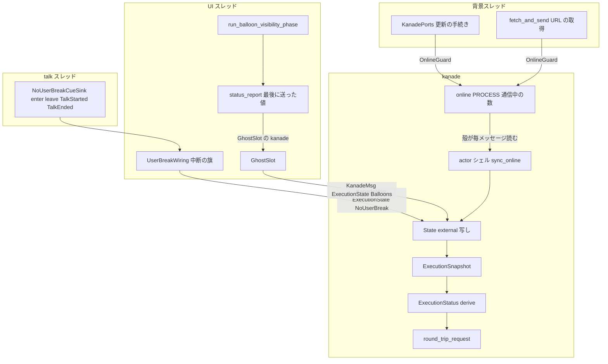
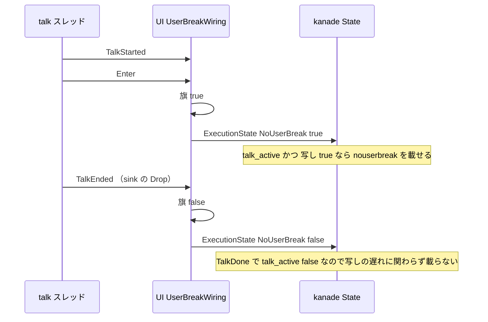
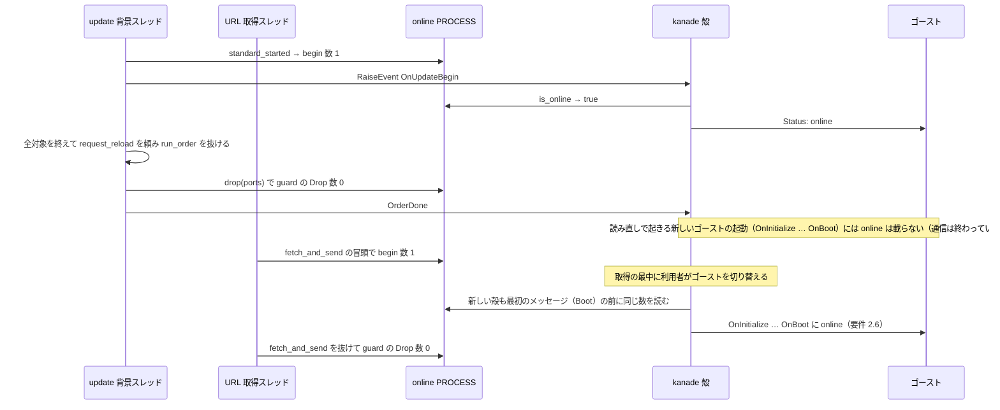

# Design Document: areka-P0-status-execution-states

## Overview

**Purpose**: ゴーストへ送る SHIORI リクエストの `Status` ヘッダに、ukadoc `Status [SSP拡張]` の実行状態のうち `online`（ネットワーク通信中）・`nouserbreak`（中断の無効化モード中）・`balloon(ID群)`（バルーンの表示）の 3 つを、実際の状態から算出して載せる。ゴースト（ぱすた・emo2 を含む）は `online`・`nouserbreak` の間は自発の雑談を止めるので、ネットワーク更新の最中や割り込み禁止の区間に雑談が割り込む潜在のバグが消える。

**Users**: ゴースト作者（`Status` を読んで振る舞いを変えるゴースト）と、その振る舞いを通して利用者。開発者は、出どころがまだ無い 5 状態の持ち主の記録を受け取る。

**Impact**: `Status` を組み立てる材料 `ExecutionSnapshot`（`crates/areka-kanade/src/status.rs`）に 3 本の欄を足し、導出表の 3 行を埋める。材料の出どころは 3 つの既存の仕組み（更新の背景スレッド・URL 取得のスレッド／中断の旗の持ち物／バルーン可視性の相）で、そこから kanade へ値を届ける道を 2 種類（プロセスに 1 つの「通信中の数」を殻が読む／ゴーストごとの持ち物が変化を 1 件ずつ押し込む）だけ足す。送り方の約束（カンマ連結・位置・空なら行なし）と `talking`・`choosing` の規則は変えない。

### Goals

- `online`・`nouserbreak`・`balloon(ID群)` を正典の意味・書式で、`Status` を載せるすべてのリクエストに載せる（要件 2〜5）。
- 中断を断る印の下ろし方を直し、「載っているのに中断できる／載っていないのに中断できない」が構造として起きない形にする（要件 3.4）。
- 出どころがまだ無い 5 状態の語彙と書式を保ち、次の持ち主を記録する（要件 6）。
- 成功の判定は、決定論的なテスト（組み合わせの全網羅・送り口を通した観測）と、emo2（ぱすた）が `online` の間に雑談を始めないことの確認（要件 8）。

### Non-Goals

- `Status` の語彙の構造と送出契約そのもの（完了 `areka-P0-idle-talk`）、`talking`・`choosing` の規則の変更。
- 窓の最小化・`\![enter,inductionmode]`・`\![enter,passivemode]`・`\t`・入力ボックス等の新設（持ち主は要件 6.3 のとおり別 spec）。
- ネットワーク更新・URL からのインストール・中断の無効化モード・バルーン表示そのものの振る舞いの変更（中断を断る印の下ろし方の是正だけは範囲内）。
- マウスのダブルクリックの応答による再生中のトークの置き換えの扱い。
- MCP の `get_status` など、`Status` を読む新しい消費者。

## Boundary Commitments

### This Spec Owns

- `ExecutionSnapshot` の 3 本の新しい欄（`no_user_break`・`online`・`balloons`）と、導出表の 3 行（nouserbreak・online・balloon）の意味。
- kanade が外からの実行状態を受け取る入口 `KanadeMsg::ExecutionState`（中断の旗・バルーンの表示）と、運行状態 `State` の中の写し（`external`）。
- プロセスに 1 つの「通信中の数」（`areka_kanade::online`）と、それを立てる 2 か所（更新の標準の手続き・URL の取得）。
- 中断を禁じる旗を「トークの終わり」で下ろす合図（`NoUserBreakSignal::TalkEnded`）と、旗の変化を kanade へ届ける 1 手。
- バルーン可視性の相の終わりに、見えているバルーンの組を集めて kanade へ届ける配線と、その「最後に送った値」の置き場。
- 5 状態の持ち主の記録（ukadoc 網羅の台帳の宛先・注記、ロードマップの行）。

### Out of Boundary

- `ExecutionStatus::from_states`・`render`・送り口（`actor.rs` の `round_trip_request`・`shiori/real.rs`・host32 の `build_request`）＝変えずに使う。
- 更新の段の遷移（`UpdateDesk.stage`）、URL 取得の成否の扱い、バルーンの出し方・消し方の判断（`balloon_visibility.rs` の `decide`）。
- `judge_press` の判定の順と、kanade 側 `on_user_break` の受理規則。
- 同じウェーブ C1 の約束で触らないファイル: `crates/areka/src/emo2_boot/balloon_visibility.rs`・`crates/areka/src/input_events/balloon.rs`・`crates/areka-emo-text/src/{actor,layout,viewbox,viewbox_draw}.rs`・`crates/areka/src/emo2_boot/mod.rs`・`crates/areka/src/input_events/mod.rs`・`crates/areka/src/emo2_boot/frame/drain_resnap.rs`。`crates/areka/src/main.rs` には宣言を足さない。
- 候補 spec（`areka-P0-passive-mode-states`・`areka-P0-minimize-state`・`areka-P0-inputbox-dialog`・`areka-P0-communicate-events`）の起票。

### Allowed Dependencies

- `areka_kanade::status`（語彙・書式・導出）と `areka_kanade::online`（通信中の数）は `std` だけに依存する葉のまま。
- `crates/areka` の届け元は `areka_kanade::{KanadeMsg, status::BalloonBinding, online}` を使う（依存の向きは今までどおり areka → areka-kanade）。
- バルーンの表示状態は `EmoPresenter::target_visible`・`current_surface_id`（`crates/areka-emo-present/src/presenter/read.rs`）の照会だけを読む。第 2 の帳簿は作らない。
- kanade の送出端は、中断の持ち物 `UserBreakWiring.kanade`（既存）と、World の `GhostSlot` → `GhostSession::kanade()`（既存）から引く。新しい線（結線の配り直し）は作らない。
- 新しい crate 依存は無い。

### Revalidation Triggers

- `ExecutionSnapshot` の欄が増減する（`Copy` を外す本 spec の変更を含む）→ `ExecutionSnapshot { .. }` の構造体リテラルを持つテスト全部。
- `KanadeMsg` の変種が増える → `msg.rs` のラベル関数と `actor.rs` の振り分け、変種の網羅テスト。
- 中断の旗の合図 `NoUserBreakSignal` に値が増える → `fold_no_user_break` の表と兄弟テスト。
- `fetch_and_send`・`spawn_download_with`・`spawn_worker`・`KanadePorts` の引数が増える → `install/fetch_url_tests.rs`・`emo2_boot/install_cue_tests.rs`・`update/worker_tests.rs`・`update/desk_*_tests.rs`。
- tick の門（`AREKA_TICK_GATE`）が既定で有効になる → 入力の段とバルーンの相が毎フレーム走る前提（要件 5.2）を見直す。
- `Emo2Wiring` に欄を足すので、`Emo2Wiring::new` の呼び手と、相の分解（`let Emo2Wiring { .. } = wiring`）の形。
- `KanadeConfig` に `online` の欄を足すので、`KanadeConfig::new` の既定（`&online::PROCESS`）。構成は全部 `KanadeConfig::new` を通る（構造体リテラルは本番にもテストにも無い）ので、呼び手は無改変。
- `balloon_visibility_phase.rs` の冒頭の `use super::super::frame::{…}` に名前を足すので、同じ行を `emo-text-file-split` が触ると併合のときに文字の上の衝突が起きうる（研究 4.3）。併合のときに見るべき 1 行。
- ukadoc 網羅の台帳で `\t` の宛先を `areka-P0-sakura-time-directives` へ移すので、同 spec の `[[spec]].owner_count`。

## Architecture

### Existing Architecture Analysis

- **組み立て側はほぼ揃っている**: `status.rs` の `ExecutionState`（10 状態・正典順）・`BalloonBindings`／`BalloonBinding`（`balloon(0=2/1=0)` の書式）・`ExecutionStatus::from_states`（正典順・重複なし）・`render`（空なら `None`）。足りないのは材料の欄 3 本と導出表の 3 行だけである（研究 2.1 節）。
- **材料の作り手は kanade の `State`**: `State::snapshot`（`schedule/mod.rs`）が運行相と選択の帳簿から `talk_active`・`choice_active` を作る。起動・終了・切替のイベントは `ExecutionSnapshot::INACTIVE` を直接渡している（`boot.rs`・`change.rs`・`steady.rs`・`force_quit`）。
- **外からの入力は `KanadeMsg` → `Input` → 純粋関数 `step`** の形（`actor.rs` の `spawn_kanade_with_stop_sink` が振り分け、`schedule/mod.rs` の `route` が横断の入力を捌く）。状態機械は時刻・I/O・グローバル状態を読まない。
- **出どころ 3 つ**: 中断の旗は UI の `UserBreakWiring.no_user_break`（`input_events/user_break.rs`・ゴーストごとに作り直し・kanade の送出端を既に持つ）。バルーンの表示は `EmoPresenter`（相 `run_balloon_visibility_phase` の終わりが「このフレームの最終の見え方」）。ネットワークは更新の背景スレッド `KanadePorts`（`update/worker.rs`）と URL 取得のスレッド `fetch_and_send`（`install/fetch_url.rs`）。
- **工夫の要る点**: ⑴ online はゴーストでなく areka の状態で、通信が続いている間のゴーストの切替（URL からの取得の最中に利用者が切り替える）をまたいで続く。新しい kanade は起動の最初のイベント（OnInitialize）からそれを知る必要がある（要件 2.6・5.1）。なお更新の読み直しは、`run_order`（`update/procedure.rs`）が全対象を終えてから頼み、頼んだ直後に抜けるので、読み直しの後の起動のときには通信は終わっている。⑵ 中断の旗は今トークの終わりで下りず、次のトークの最初の指示で下りる（要件 3.4 の是正点）。⑶ `GhostSlot` の入れ替えと新しい `Emo2Wiring`・`UserBreakWiring` の据え付けは `ghost_switch.rs` の `boot_into` の中で同期に続けて行われ、間にフレームは走らない（研究 R1）。

### Architecture Pattern & Boundary Map

採った形は研究の案 C（混成）: **nouserbreak と balloon はゴーストごとの持ち物が変化を押し込み、online はプロセスに 1 つの数を殻が読む**。



**Architecture Integration**:
- Selected pattern: 既存の「UI の持ち物が kanade の送出端へ 1 件ずつ送る」形（`KanadeMsg::UserBreak`・`Choice` の前例）を 2 状態に使い、プロセスの状態である online だけは RAII の数（`OnlineGuard`）で持ち、殻が運行表へ渡す前に読む。運行表 `step` は今までどおり状態と入力だけで決まる（グローバルを読むのは殻の 1 か所）。
- Domain/feature boundaries: 「値を作る」（出どころ 3 つ）／「届ける」（押し込み 2 本・数 1 つ）／「組み立てる」（kanade の `State` → `ExecutionSnapshot` → `derive`）を分ける。組み立ての側は届いた値をそのまま写し、判断は「再生中のトークに限る」の 1 つだけ（`nouserbreak` の gating）。
- Existing patterns preserved: 送出契約（`from_states`・`render`・ヘッダの位置）、`talking`／`choosing` の算出、送出失敗を `error!` で残す流儀（`balloon_break_send_failed` と同型）、ゴーストごとの持ち物は新しいゴーストで新品（持ち越さない）。
- New components rationale: `online.rs`（数を 1 か所で数え、どの終わり方でも必ず戻すため）／`frame/status_report.rs`（バルーンの組の差分と送出を可視性の相から切り離し、相の判断を 1 つも増やさないため）／`NoUserBreakSignal::TalkEnded`（旗を次のトークの立ち上がりでなくトークの終わりで下ろすため）。
- Steering compliance: `tracing` の規律（失敗は `error!`、変化は `debug!`／`info!`）、1 ファイル 1,000 行、テストは兄弟ファイル、`AREKA_` の環境変数は増やさない。

### 依存の向き

`areka_kanade::status`／`areka_kanade::online`（std のみ） ← `areka_kanade::schedule`／`msg` ← `areka_kanade::actor` ← `areka`（`update/`・`install/`・`input_events/`・`emo2_boot/`）。各層は左にしか依存しない。`status.rs`・`online.rs` は host32 型・areka-actor 型・bevy を一切 import しない。

### Technology Stack

| Layer | Choice / Version | Role in Feature | Notes |
|-------|------------------|-----------------|-------|
| Messaging / Events | `std::sync::mpsc`（既存の `Sender<KanadeMsg>`） | 中断の旗・バルーンの組を UI から kanade へ 1 件ずつ届ける | 新しい線は作らない |
| Infrastructure / Runtime | `std::sync::atomic::AtomicUsize`＋RAII の guard | プロセスに 1 つの「通信中の数」 | 新しい依存なし。`tokio` 不使用 |
| Backend / Services | `areka-kanade`（Rust 2024） | スナップショットの欄と導出表 | 送出契約は無改変 |

## File Structure Plan

### Directory Structure

```
crates/areka-kanade/src/
├── lib.rs                         # `pub mod online;` と再エクスポートを 1 行ずつ足す
├── online.rs                      # 新規: OnlineCounter / OnlineGuard / PROCESS（std のみ）
├── online_tests.rs                # 新規: 数の増減・どの終わり方でも戻る・ローカルの数で決定論
├── status.rs                      # ExecutionSnapshot の欄 3 本・導出表 3 行・ExternalStates・ExecutionStateUpdate
├── status_derive_tests.rs         # 新規: 全組み合わせ（要件 8.1）。status.rs の既存テストは欄の追随だけ
├── msg.rs                         # KanadeMsg::ExecutionState と、ラベル関数の腕・KanadeConfig.online（既定 &PROCESS）
├── actor.rs                       # 振り分けの腕 1 つ・sync_online（殻が config.online の数を写す）
└── schedule/
    ├── mod.rs                     # Input::ExecutionState・State.external・snapshot/snapshot_without_talk・talk_active_of
    ├── boot.rs / change.rs / steady.rs   # INACTIVE 直渡しを state の作り方へ置換
    └── external_state_tests.rs    # 新規: 入力で写しが変わる・どの相でも受理・gating（schedule/mod.rs から #[path] で接続）
crates/areka-kanade/tests/
├── kanade.rs                      # 束ねの入口: #[path] の接続 1 行
└── kanade/external_status_test.rs # 新規: 送り口を通した観測（要件 8.2・online は自分の数を KanadeConfig で渡す）
crates/areka-ghost/tests/
└── real_pasta_online.rs           # 新規: 要件 8.4 の env ゲート追験。PROCESS を立てるので tests/ghost.rs とは別の実行ファイル
crates/areka/src/
├── update/worker.rs               # KanadePorts に online の数と guard・spawn_worker の引数
├── update/desk.rs                 # UpdateDesk.online（既定 PROCESS・テストは差し替え）
├── install/fetch_url.rs           # fetch_and_send の冒頭で guard・引数に数
├── input_events/user_break.rs     # 旗の変化を kanade へ 1 件（取り出しの終わりに 1 回）・reported の欄・TalkEnded の畳み込み
├── emo2_boot/user_break_cue.rs    # NoUserBreakSignal::TalkEnded・impl Drop
├── emo2_boot/balloon_visibility_phase.rs   # 相の終わりで status_report を呼ぶ（分解に欄を 1 つ足す）
├── emo2_boot/frame.rs             # `mod status_report;` 1 行
├── emo2_boot/frame/wiring.rs      # Emo2Wiring.balloon_status（ゴーストごと・新品）
├── emo2_boot/frame/status_report.rs        # 新規: 組の収集（純関数）・差分・GhostSlot 経由の送出・記録
└── emo2_boot/frame/status_report_tests.rs  # 新規
```

### Modified Files

- `crates/areka-kanade/src/status.rs` — `ExecutionSnapshot` に `no_user_break: bool`・`online: bool`・`balloons: Vec<BalloonBinding>` を足し `Copy` を外す（`Clone` は残す）。`INACTIVE` は全欄なし（`Vec::new()` は const）。導出表 6・7・9 行目を埋める。`BalloonBindings::new` が `character_id` 昇順に整列し重複を落とす。`ExternalStates`（写し）と `ExecutionStateUpdate`（知らせ）を定義。
- `crates/areka-kanade/src/msg.rs` — `KanadeMsg::ExecutionState(ExecutionStateUpdate)` と、ラベル関数の腕。`KanadeConfig.online: &'static OnlineCounter`（`new` で `&online::PROCESS`。殻が読む数の差し替え口。本番の結線は無改変）。
- `crates/areka-kanade/src/actor.rs` — `KanadeMsg::ExecutionState(u) => Input::ExecutionState(u)`、受け取った**すべての**メッセージの処理の前に `sync_online(config.online, &mut state)`（`Close`・`ResourceQuery` の分岐より前）。
- `crates/areka-kanade/src/schedule/mod.rs` — `Input::ExecutionState`、`State.external: ExternalStates`、`route` の横断の腕（相を問わず写しを更新・`trace!`・Action なし）。`snapshot_with_choice` が 3 欄を添える。`snapshot_without_talk` を足す。`snapshot_of(&Phase) -> ExecutionSnapshot` は `talk_active_of(&Phase) -> bool` へ縮める（残る 2 つの呼び手は `state.snapshot()` へ）。
- `crates/areka-kanade/src/schedule/boot.rs` — `boot_start`・`on_reply`（BootInit／BootType）・`on_prefetch_reply` の `on_boot`・`boot_root`（`&State` を受ける）・`to_baseware_version` の `snapshot_of` → `state.snapshot_without_talk()`／`state.snapshot()`。
- `crates/areka-kanade/src/schedule/change.rs` — `begin_change`（OnGhostChanging）・`on_reply_wait`（204 の後の OnClose）の `INACTIVE` → `state.snapshot_without_talk()`。
- `crates/areka-kanade/src/schedule/steady.rs` — `begin_close` の `INACTIVE` → `state.snapshot_without_talk()`（追記は 0 行・935 行のまま）。`force_quit`（`schedule/mod.rs`）も同じ。
- `crates/areka-kanade/src/lib.rs` — `pub mod online;`・`pub use online::{OnlineCounter, OnlineGuard};`・`pub use status::{BalloonBinding, ExecutionStateUpdate, ExternalStates}`。
- `crates/areka/src/update/worker.rs` — `KanadePorts { online: &'static OnlineCounter, online_guard: Cell<Option<OnlineGuard>> }`。`standard_started` で `online_guard.set(Some(online.begin("update")))`。`spawn_worker` の閉包は `run_order` の後に `drop(ports)` してから `OrderDone` を頼む。`spawn_worker(desk, gate, new_fetch, online)`。
- `crates/areka/src/update/desk.rs` — `UpdateDesk.online: &'static OnlineCounter`（`new` で `&areka_kanade::online::PROCESS`・`pub(super)`・テストは起こす前に差し替え）、`hand_over` が `spawn_worker` へ渡す。
- `crates/areka/src/install/fetch_url.rs` — `spawn_download` は `&PROCESS` を渡し、`spawn_download_with(url, tx, dir, make, online)`・`fetch_and_send(url, make, dir, now, tx, online)` の冒頭 `let _online = online.begin("install-fetch");`（関数を抜けるどの経路でも戻る）。
- `crates/areka/src/emo2_boot/user_break_cue.rs` — `NoUserBreakSignal::TalkEnded`、`impl Drop for NoUserBreakCueSink`（`started` のときだけ送る）。
- `crates/areka/src/input_events/user_break.rs` — `fold_no_user_break` に `TalkEnded => (false, false)`、`UserBreakWiring.reported_no_user_break: bool`、`drain_no_user_break_signals` の末尾で「旗 ≠ 最後に送った値」なら `KanadeMsg::ExecutionState(NoUserBreak(旗))` を 1 件（失敗は `error!(no_user_break_send_failed)`）。
- `crates/areka/src/emo2_boot/frame/wiring.rs` — `pub(in crate::emo2_boot) balloon_status: BalloonStatusLedger`（`new` で既定）。
- `crates/areka/src/emo2_boot/balloon_visibility_phase.rs` — 分解に `balloon_status` を足し、`issue_actions` の後（`emit_visibility_logs` の前後どちらでもよい）で `status_report::report_balloons(presenter, world, balloon_status, &scopes)` を呼ぶ。
- `crates/areka/src/emo2_boot/frame.rs` — `mod status_report;`。
- `doc/ukadoc-coverage/ledger/sakura-script.toml`・`ledger/shiori.toml`・`doc/ukadoc-coverage/roadmap-draft.md`・`doc/ukadoc-coverage/report/`（作り直し）・`.kiro/steering/roadmap.md` — 要件 6.3 の記録（後述）。
- 既存テストの追随: `ExecutionSnapshot { .. }` の構造体リテラル（`crates/areka-kanade` と `crates/areka/src/emo2_boot/spine_conformance_support.rs` ほか）は `..ExecutionSnapshot::INACTIVE` で吸収。`status.rs` の `inactive_snapshot_has_every_source_false` だけは網羅のリテラルを 5 欄へ書き直す。`schedule_variant_tests.rs`（`Input` の変種の網羅）・`msg.rs` のラベル網羅に腕を足す。`update/worker_tests.rs`・`install/fetch_url_tests.rs`・`emo2_boot/install_cue_tests.rs`・`update/desk_*_tests.rs` は引数と欄の追随（テスト用の数を渡す）。

## System Flows

### nouserbreak: 旗の上げ下げと kanade への写し



- 旗の畳み込みは 1 回の取り出し（入力の段・押下の判定より前）で全件済ませ、**取り出しの終わりに 1 回だけ**、旗が最後に送った値と違えば送る。同じ巡に `Enter` と `TalkEnded` が届いた場合は差し引き 0 で何も送らない。
- kanade の写しは UI の旗を遅れて追う鏡である。kanade はトークの始まりや終わりで写しを勝手に下ろさない（下ろすと、UI がまだ旗を立てている間に「載っていないのに中断できない」が起きる）。代わりに `nouserbreak` は `talk_active && 写し` で載せるので、トークの終わりの後は写しの遅れに関わらず載らない（要件 3.3）。
- 残る食い違いは「UI が旗を変えてから kanade の受信箱に届くまで」の運搬の間だけで、`talking`（`TalkDone` の運搬）と同じ種類の遅れである。これは 1 フレーム遅らせる解ではなく、旗の形（トークの終わりで下りる）を変えた上での運搬の遅れである。

### online: 数の増減と殻の読み取り



- 数は `AtomicUsize`。`begin` で +1、guard の `Drop` で −1。成功・失敗・中止・途中の `return` のどれでも必ず戻る（要件 2.3）。重なりは数で持ち、載せる値は「0 より大きいか」なので 1 つだけ載る（要件 2.4）。
- 殻は受け取った**すべての**メッセージの処理の前に `config.online`（本番は `PROCESS`）を読み、`State.external.online` に写す（変わったときだけ `debug!(event="online_changed")`）。運行表 `step` はグローバルを読まない。新しいゴーストの kanade も起動の最初のメッセージ（`Boot`）の前に読むので、通信が続いていれば OnInitialize から載る（要件 2.6・5.1）。
- 更新の `online` の区間は `standard_started` から `run_order` を抜けるまでである。`run_order` は全対象を終えてから読み直しを頼み、頼んだ直後に抜ける（`update/procedure.rs`）ので、読み直しで起きる新しいゴーストの起動には `online` は**載らない**。これは要件 2.3（終わったら載せない）のとおりで、要件 2.6 が本番で実在する場面は「URL からの取得が続いている間に利用者がゴーストを切り替えた」である。読み直しの完了まで guard を持ち越す作り（`OrderDone` でなく読み直し後の起動まで持つ）は、通信していない間に `online` を載せることになるので採らない。
- 要件 2.6 の決定論のテストは「数を立てたまま kanade を起こし、`Boot` の最初のリクエスト（OnInitialize）に `online` が載る」で固定する（この作りのまま成立する）。

### balloon: 相の終わりの観測と差分の送出

1 フレームの可視性の相（`run_balloon_visibility_phase`）の手順 ⑴〜⑺ の後に ⑻ を足す: 装着済み scope を昇順に、`target_visible == Some(true)` の scope について `current_surface_id`（`None` なら 0 と見なし警告）で組を作り、最後に送った組と違えば `GhostSlot` の kanade へ `ExecutionState(Balloons(組))` を 1 件送る。

## Requirements Traceability

| Requirement | Summary | Components | Interfaces | Flows |
|-------------|---------|------------|------------|-------|
| 1.1 | 正典順にカンマ連結 | `ExecutionStatus::from_states`（無改変） | `derive` | — |
| 1.2 | 空なら行を出さない | `render`（無改変）・導出の「空の組は載せない」 | `derive` | — |
| 1.3 | 同じ状態を 2 度含めない | `from_states` の重複除去（無改変）・online は数→真偽 | `derive` | online |
| 1.4 | talking・choosing を変えない | `State::snapshot_with_choice` の既存 2 欄の計算は無改変 | `ExecutionSnapshot` | — |
| 1.5 | ヘッダの位置 | `shiori/real.rs`・host32 `build_request`（無改変） | — | — |
| 2.1 | 更新中の online | `KanadePorts.standard_started` の guard・`spawn_worker` の `drop(ports)` | `OnlineCounter::begin` | online |
| 2.2 | 取得中の online | `fetch_and_send` 冒頭の guard | `OnlineCounter::begin` | online |
| 2.3 | 終わったら載せない | guard の `Drop` | `OnlineGuard` | online |
| 2.4 | 重なっても 1 つ | 数で持ち `is_online` は `count > 0` | `OnlineCounter::is_online` | online |
| 2.5 | 通信していなければ載せない | 数 0 → 写し false → 導出表 7 行目が空 | `derive` | online |
| 2.6 | 切替をまたいで持ち越す | プロセスに 1 つの `PROCESS`・殻が毎メッセージ読む（本番の場面は URL 取得中の切替。更新の読み直しの後は通信が終わっているので載らない） | `sync_online` | online |
| 3.1 | enter で載る | `drain_no_user_break_signals` の送出・`State.external.no_user_break` | `KanadeMsg::ExecutionState` | nouserbreak |
| 3.2 | leave で載らない | 同上（false を送る） | 同上 | nouserbreak |
| 3.3 | leave なしで終わっても載らない | `TalkEnded` で旗を下ろす・`talk_active && 写し` の gating | `fold_no_user_break`・`snapshot_with_choice` | nouserbreak |
| 3.4 | 断る区間と一致 | `TalkEnded`（旗の形の是正）・写しは UI の旗の鏡・取り出しの終わりに 1 回送る | `NoUserBreakSignal::TalkEnded` | nouserbreak |
| 3.5 | 切替で持ち越さない | `UserBreakWiring`・kanade の `State` はゴーストごとに新品 | — | — |
| 4.1 | 表示中のキャラクターの組を含める | `status_report::collect_bindings` | `BalloonBinding` | balloon |
| 4.2 | ID の意味 | scope 番号＝`character_id`・`current_surface_id`＝`balloon_id`（`None` は 0） | `collect_bindings` | balloon |
| 4.3 | `/` 区切り・昇順 | 観測は scope 昇順・`BalloonBindings::new` が整列 | `BalloonBindings::new` | balloon |
| 4.4 | 空の括弧を出さない | 導出表 9 行目「空なら載せない」 | `derive` | balloon |
| 4.5 | 消えたら落とす | 相の終わりで `target_visible` を読み直す・差分で送る | `report_balloons` | balloon |
| 4.6 | 番号が変われば新しい番号 | 組の比較は番号を含む | `report_balloons` | balloon |
| 4.7 | 画面と食い違わせない | 相の終わり（本フレームの最終の見え方）で読む・`None` の番号は 0 として落とさず警告 | `collect_bindings` | balloon |
| 4.8 | 切替で持ち越さない | `Emo2Wiring.balloon_status`・`State` はゴーストごとに新品・`GhostSlot` の入れ替えは同期（R1） | — | — |
| 5.1 | すべてのリクエストに同じ規則 | `snapshot`／`snapshot_without_talk` に一本化・`INACTIVE` の直渡しを無くす | `State::snapshot_without_talk` | — |
| 5.2 | 1 秒以内 | online は送出時に読む・nouserbreak は入力の段（毎フレーム）・balloon は相（毎フレーム） | — | 3 本 |
| 6.1 | 5 状態を載せない | 導出表 2〜5・8 行目は空のまま（注記を書き換え） | `derive` | — |
| 6.2 | 語彙と書式を保つ | `ExecutionState`・`OpeningKinds` 無改変 | — | — |
| 6.3 | 持ち主の記録 | 台帳の宛先・注記・ロードマップ・`owner_count`・網羅の検査の確認 | — | — |
| 7.1 | 届けの失敗を error で | `no_user_break_send_failed`・`balloon_status_send_failed`（online は届ける線が無い＝失敗の経路が 0） | — | — |
| 7.2 | 送った値をログで追える | `round_trip_request` の `trace!(event="shiori_request")`（無改変） | — | — |
| 8.1 | 組み合わせの決定論テスト | `status_derive_tests.rs`（48 通り）・`external_state_tests.rs`（gating） | — | — |
| 8.2 | 送り口を通した観測 | `tests/kanade/external_status_test.rs`・`shiori/real_tests.rs` の複合値 1 件 | — | — |
| 8.3 | 既存の期待値の更新 | 構造体リテラルの追随。一周の照合（spine）は `GhostSlot` を据えないので期待値は変わらない（R2） | — | — |
| 8.4 | emo2 が雑談しない | `real_pasta_test.rs` に env ゲートの 1 件（`PROCESS` の guard を持ったまま OnSecondChange を回す） | — | — |

## Components and Interfaces

| Component | Domain/Layer | Intent | Req Coverage | Key Dependencies (P0/P1) | Contracts |
|-----------|--------------|--------|--------------|--------------------------|-----------|
| ExecutionSnapshot と導出表 | kanade `status.rs` | 材料の欄 3 本と導出表 3 行 | 1.1〜1.4, 2.5, 4.3, 4.4, 6.1, 6.2, 8.1 | なし（std） | State |
| ExternalStates と ExecutionStateUpdate | kanade `status.rs` | kanade が持つ写しと、外からの知らせの型 | 3.1, 3.2, 4.1, 4.5, 4.6 | なし（std） | Event, State |
| KanadeMsg::ExecutionState と Input の腕 | kanade `msg.rs`・`actor.rs`・`schedule/mod.rs` | 知らせを写しに写す（相を問わず・Action なし） | 3.1〜3.3, 4.5, 4.6, 5.1 | `State`（P0） | Event |
| スナップショットの作り方 | kanade `schedule/{mod,boot,change,steady}.rs` | `snapshot`・`snapshot_without_talk` への一本化と gating | 1.4, 3.3, 5.1 | `ExternalStates`（P0） | Service |
| online の数 | kanade `online.rs`・`actor.rs` | プロセスに 1 つの数と RAII の guard・殻の同期 | 2.1〜2.6, 5.1, 5.2 | なし（std） | Service, State |
| online の持ち手 | areka `update/worker.rs`・`update/desk.rs`・`install/fetch_url.rs` | 標準の手続きと URL 取得の間だけ数を立てる | 2.1〜2.4 | `OnlineCounter`（P0） | Service |
| nouserbreak の届け | areka `input_events/user_break.rs`・`emo2_boot/user_break_cue.rs` | トークの終わりで旗を下ろし、旗の変化を kanade へ | 3.1〜3.5, 7.1 | `UserBreakWiring.kanade`（P0） | Event |
| balloon の届け | areka `emo2_boot/frame/status_report.rs`・`balloon_visibility_phase.rs`・`frame/wiring.rs` | 見えている組を集め、差分だけ kanade へ | 4.1〜4.8, 7.1 | `EmoPresenter` の照会（P0）・`GhostSlot`（P0） | Event, State |
| 持ち主の記録 | `doc/ukadoc-coverage/`・`.kiro/steering/roadmap.md` | 5 状態と関連タグの次の持ち主 | 6.3 | ukadoc 網羅の整合検査（P1） | — |

### kanade（組み立て）

#### ExecutionSnapshot と導出表

| Field | Detail |
|-------|--------|
| Intent | 材料に 3 本の欄を足し、導出表の 3 行を純関数のまま埋める |
| Requirements | 1.1, 1.2, 1.3, 1.4, 2.5, 4.3, 4.4, 6.1, 6.2, 8.1 |

**Responsibilities & Constraints**
- `ExecutionSnapshot { talk_active, choice_active, no_user_break, online, balloons: Vec<BalloonBinding> }`。`Copy` を外し `Clone` を残す。`INACTIVE` は const のまま（`Vec::new()`）。
- `no_user_break` の意味は「再生中のトークの中断の無効化モード中」。再生中でないときに真にしないのは作り手（`State`）の責務で、導出表は欄をそのまま写す。
- 導出表: 6 行目 `if snapshot.no_user_break { NoUserBreak }`、7 行目 `if snapshot.online { Online }`、9 行目 `if !snapshot.balloons.is_empty() { Balloon(BalloonBindings::new(snapshot.balloons.clone())) }`。2〜5・8 行目は空のままで、注記を「持ち主＝要件 6.3 の宛先」へ書き換える。
- `BalloonBindings::new` は `character_id` 昇順に安定整列し、同じ `character_id` は先頭だけ残す（不変条件を構成の時点で持つ・`from_states` と同じ流儀）。

##### State Management
- State model: 純粋な値。時刻・I/O・グローバルを読まない（無改変の規律）。
- Concurrency strategy: kanade スレッドの中だけで作られ、送出時に `derive` される。

#### ExternalStates と ExecutionStateUpdate

| Field | Detail |
|-------|--------|
| Intent | kanade が持つ「外から届いた状態」の写しと、届ける知らせの型 |
| Requirements | 3.1, 3.2, 4.1, 4.5, 4.6 |

```rust
/// 外から届いた実行状態の写し（kanade の `State` が持つ・ゴーストごとに新品）。
#[derive(Debug, Clone, Default, PartialEq, Eq)]
pub struct ExternalStates {
    /// UI の中断を禁じる旗の写し（UI の旗を遅れて追う鏡。トークの境界で勝手に下ろさない）。
    pub no_user_break: bool,
    /// 通信中か（殻が `online::PROCESS` から毎メッセージ写す）。
    pub online: bool,
    /// 見えているバルーンの組（UI の可視性の相が差分で送る・`character_id` 昇順）。
    pub balloons: Vec<BalloonBinding>,
}

/// UI から kanade への知らせ（`KanadeMsg::ExecutionState` の中身）。online は殻が読むので無い。
#[derive(Debug, Clone, PartialEq, Eq)]
pub enum ExecutionStateUpdate {
    NoUserBreak(bool),
    Balloons(Vec<BalloonBinding>),
}

impl ExternalStates {
    /// 知らせを写しへ反映する（純関数・返り値は変わったか）。
    pub fn apply(&mut self, update: ExecutionStateUpdate) -> bool;
}
```

##### Event Contract
- Published events: UI → kanade `KanadeMsg::ExecutionState(ExecutionStateUpdate)`。
- Subscribed events: kanade の殻が `Input::ExecutionState` へ写し、`route` の横断の腕が相を問わず `state.external.apply` を呼ぶ（`Unloading`／`Stopped` でも受理して写すだけ・Action なし・`trace!(event="execution_state_updated", kind, changed)`）。
- Ordering / delivery guarantees: 同じ送出端からの知らせは FIFO。値は「今の状態」そのもの（増分ではない）ので、落ちても次の変化で正しくなる。送り手は変化があったときだけ送る。

#### KanadeMsg::ExecutionState と Input の腕

| Field | Detail |
|-------|--------|
| Intent | 殻の振り分けと運行表の横断の腕 |
| Requirements | 3.1, 3.2, 3.3, 4.5, 4.6, 5.1 |

- `msg.rs`: `KanadeMsg::ExecutionState(ExecutionStateUpdate)`（doc は「UI → kanade。状態の写しを更新するだけで運行は変えない」）。ラベル関数（`KanadeMsg::Tick { now: _ } => "Tick"` の並び）に `"ExecutionState"` の腕。
- `actor.rs`: `KanadeMsg::ExecutionState(u) => Input::ExecutionState(u)`。
- `schedule/mod.rs`: `Input::ExecutionState(ExecutionStateUpdate)`。`route` の横断の腕（`UserBreak` の隣）。`schedule_variant_tests.rs` の網羅に腕を足す。

#### スナップショットの作り方

| Field | Detail |
|-------|--------|
| Intent | 本番の `ExecutionSnapshot` の作り手を `State` の 2 つのメソッドへ一本化する |
| Requirements | 1.4, 3.3, 5.1 |

##### Service Interface
```rust
impl State {
    /// 送出時点のスナップショット（talk は相から・choice は帳簿から・残り 3 つは写しから）。
    pub(crate) fn snapshot(&self) -> ExecutionSnapshot;
    /// 選択待ちを外から与える版（既存）。3 欄を添える本体はここ。
    pub(crate) fn snapshot_with_choice(&self, choice_active: bool) -> ExecutionSnapshot;
    /// 会話も選択も無いと決めて送る場面（起動の各段・切替・終了の握手・強制終了）。
    /// talk_active=false・choice_active=false・no_user_break=false、online と balloons は写しのまま。
    pub(crate) fn snapshot_without_talk(&self) -> ExecutionSnapshot;
}
/// 相が再生中のトークを運ぶか（旧 `snapshot_of` の talk 軸だけを残す）。
fn talk_active_of(phase: &Phase) -> bool;
```
- Preconditions: なし。
- Postconditions: `snapshot_with_choice` は `no_user_break = talk_active_of(phase) && external.no_user_break`、`online = external.online`、`balloons = external.balloons.clone()`。`talk_active`・`choice_active` の計算は無改変。
- Invariants: 本番の `ExecutionSnapshot` はこの 2 系統からしか作られない（`ExecutionSnapshot::INACTIVE` の本番の直渡しは 0 か所になる。`actor_resources::answer` は既に `state.snapshot()`）。
- 置換点: `boot.rs` の `boot_start`／`on_reply`（BootInit・BootType の次段）／`on_prefetch_reply` の `on_boot`／`boot_root`（`&State` を引数に足す）＝`snapshot_without_talk`、`to_baseware_version`＝`snapshot()`（`BootVersion{talk: Some}` の talking は相から出る）。`change.rs` の `begin_change`・`on_reply_wait`、`steady.rs` の `begin_close`、`schedule/mod.rs` の `force_quit`（Unloading へ移した後）＝`snapshot_without_talk`。`boot_root_tests.rs`・`schedule_tests.rs` の `snapshot_of` 参照は追随。

#### online の数（`online.rs`）と殻の同期

| Field | Detail |
|-------|--------|
| Intent | プロセスに 1 つの「通信中の数」を、どの終わり方でも必ず戻る形で持ち、殻が運行表へ渡す |
| Requirements | 2.1, 2.2, 2.3, 2.4, 2.5, 2.6, 5.1, 5.2 |

##### Service Interface
```rust
/// 通信中の数（`AtomicUsize`）。本番はプロセスに 1 つの `PROCESS`、テストは関数内の `static` で自分の数を持つ。
pub struct OnlineCounter(AtomicUsize);
impl OnlineCounter {
    pub const fn new() -> Self;
    /// 数を 1 増やし、落とすと 1 減る guard を返す。`what` は記録用の名前（"update"・"install-fetch"）。
    pub fn begin(&'static self, what: &'static str) -> OnlineGuard;
    /// 0 より大きいか。
    pub fn is_online(&self) -> bool;
}
pub struct OnlineGuard { counter: &'static OnlineCounter, what: &'static str }
impl Drop for OnlineGuard { /* 1 減らし `info!(target: "kanade", event = "online_end", what, count)` */ }
pub static PROCESS: OnlineCounter = OnlineCounter::new();
```
- Preconditions: `begin` は何度でも重ねられる（数で持つ）。
- Postconditions: `begin` は `info!(event="online_begin", what, count)`、`Drop` は `online_end`。`is_online` は `SeqCst` で読む。
- `msg.rs`: `KanadeConfig.online: &'static OnlineCounter`。`KanadeConfig::new` が `&online::PROCESS` を入れる。構成の作り手は本番（`areka-ghost/src/config.rs` の `resolve_config`）もテストも全部 `KanadeConfig::new` を通るので、呼び手は無改変で、結線のファイルにも触らない。
- `actor.rs`: `fn sync_online(online: &OnlineCounter, state: &mut State)` — `config.online.is_online()` を読み、`state.external.online` と違えば `debug!(target: "kanade", event = "online_changed", online)` の上で写す。呼ぶのは受信閉包の先頭（`Close`・`ResourceQuery` の分岐より前）。
- なぜグローバルか: online はゴーストでなく areka の状態で、通信の最中の切替で作り直される新しい kanade が、起動の最初のメッセージから正しい値を要る（要件 2.6・5.1）。handle を配る道は起動の結線（`emo2_boot/mod.rs`・areka-ghost の起動入力）を通るので C1 の約束に当たる。運行表の純粋さは「殻が読んで状態に写す」ことで保つ。
- テストの決定論: `cargo test` は 1 つの実行ファイルの中のテストを並列に走らせるので、`PROCESS` を立てたテストは同じ実行ファイルの他のテスト（`Some("talking")`・`None` を期待する記録の照合）を揺らす。そこで**読む側も書く側も数を差し替えられる形**にする。⑴ 殻は `config.online` を読む。kanade のハーネス（`tests/kanade`・`src` の兄弟テスト）は関数内の `static` を `KanadeConfig` で渡し、「載っている」「載っていない」の両方を決定論で見る。⑵ 本番の持ち手（更新・取得）は数を**引数で受ける**。areka の兄弟テストは自分の `static` を渡す。⑶ `PROCESS` に触れるテストは要件 8.4 の実 pasta の追験 1 件だけで、`tests/ghost.rs` に束ねず、`crates/areka-ghost/tests/real_pasta_online.rs` という**別の実行ファイル**に置く（`Status` の完全一致を持つテストと同居させない）。

##### State Management
- State model: 数（0 以上）。
- Concurrency strategy: 原子操作のみ。ロックなし。

### areka（出どころと届け）

#### online の持ち手（`update/worker.rs`・`update/desk.rs`・`install/fetch_url.rs`）

| Field | Detail |
|-------|--------|
| Intent | 標準の手続きが始まってから終わるまで、URL の取得が始まってから終わるまで、数を立てる |
| Requirements | 2.1, 2.2, 2.3, 2.4 |

- 更新: `KanadePorts` に `online: &'static OnlineCounter` と `online_guard: Cell<Option<OnlineGuard>>` を足す。`standard_started(&self)` が `self.online_guard.set(Some(self.online.begin("update")))`（`OnUpdateProcessExec` の答え待ちは含まない＝要件 2.1。台本の依頼も `run_order` が同じ所で呼ぶ）。`spawn_worker` の閉包は `run_order` の後 `drop(ports)` してから `ask_desk(OrderDone)`（数が戻ってから窓口が `Idle` へ移る）。`spawn_worker(desk, gate, new_fetch, online)`。`UpdateDesk.online`（既定 `&PROCESS`・`pub(super)`）を `hand_over` が渡す。テストは `new_fetch` と同じく起こす前に差し替える。
- 取得: `fetch_and_send(url, make, dir, now, tx, online)` の冒頭 `let _online = online.begin("install-fetch");`。取得口を作れない・落とせない・送れない、のどの経路で抜けても戻る。`spawn_download` は `&PROCESS` を渡す（呼び手の `\![execute,install,url]` の受け口は無改変）。
- 本番で取得口の型を綴るファイルは今までの 2 つのまま（`worker_tests.rs` の字面の検査に触れない）。

#### nouserbreak の届け（`user_break_cue.rs`・`input_events/user_break.rs`）

| Field | Detail |
|-------|--------|
| Intent | 旗をトークの終わりで下ろし、旗の変化を kanade へ届ける |
| Requirements | 3.1, 3.2, 3.3, 3.4, 3.5, 7.1 |

- `NoUserBreakSignal::TalkEnded`: `NoUserBreakCueSink` に `impl Drop` を足し、`started` が真のときだけ `TalkEnded` を送る。配送はトークごとに受け口を複製し、その複製をトークの再生（`areka-sakura` の `TalkDriver`／`CuePlayer`）が所有して、終わり（最後まで・中断・置き換え）で落とす。`dispatcher` は「古いトークの合流 → 新しいトークの起動」を守るので、`TalkEnded(前)` は `TalkStarted(次)` より前に同じ線へ並ぶ。登録済みの原本は一度も `emit` されない（`started=false`）ので、ゴーストの終了で落ちても何も送らない。`TalkStarted` による解きは残す（複製の順序の二重の守り）。
- `fold_no_user_break`: `TalkEnded => (false, false)`。
- `UserBreakWiring.reported_no_user_break: bool`（`new` で false）。`drain_no_user_break_signals` は全件畳んだ**後**に、`no_user_break != reported_no_user_break` なら `KanadeMsg::ExecutionState(ExecutionStateUpdate::NoUserBreak(no_user_break))` を 1 件送り、送れたら `reported_no_user_break` を更新。送れなければ `error!(event="no_user_break_send_failed", value, "運行の側へ中断の無効化モードの変化を渡せない（受け手が消えている）")`（`reported` は更新しない＝次の変化で再送）。既存の `no_user_break_changed`（`debug!`）は残す。
- 要件 3.5: `UserBreakWiring` はゴーストごとに `wire_user_break` で新品、kanade の `State` も新品。
- `no_user_break()` の読み口の `#[allow(dead_code)]` と「読む者はまだ居ない」の注記は、本 spec で読み手ができるので書き換える（読み手＝取り出しの送出）。

##### Event Contract
- Published events: `KanadeMsg::ExecutionState(NoUserBreak(bool))`（入力の段・取り出しの終わりに高々 1 件）。
- Ordering: 旗の線は FIFO。kanade への知らせも FIFO。

#### balloon の届け（`frame/status_report.rs`・`balloon_visibility_phase.rs`・`frame/wiring.rs`）

| Field | Detail |
|-------|--------|
| Intent | 相の終わりの見え方から組を作り、差分だけ kanade へ届ける |
| Requirements | 4.1, 4.2, 4.3, 4.4, 4.5, 4.6, 4.7, 4.8, 7.1 |

##### Service Interface
```rust
/// 最後に kanade へ送った組と、番号が取れない scope の警告済み集合（ゴーストごと・`Emo2Wiring` が持つ）。
#[derive(Default)]
pub(in crate::emo2_boot) struct BalloonStatusLedger {
    last_sent: Vec<BalloonBinding>,
    surface_unknown_warned: BTreeSet<u32>,
}

/// 1 scope の観測（表示層の照会 2 本をそのまま運ぶ）。
pub(in crate::emo2_boot) struct BalloonObservation { scope: u32, visible: Option<bool>, surface_id: Option<u32> }

/// 観測列から組を作る純関数。`visible == Some(true)` の scope だけを `character_id = scope`・
/// `balloon_id = surface_id.unwrap_or(0)` で並べ（入力の順＝昇順）、番号が取れなかった scope を第 2 の返り値に添える。
pub(in crate::emo2_boot) fn collect_bindings(observed: &[BalloonObservation]) -> (Vec<BalloonBinding>, Vec<u32>);

/// 相の終わりに呼ぶ配線。照会 → 純関数 → 差分 → `GhostSlot` の kanade へ送出 → 記録。
pub(in crate::emo2_boot) fn report_balloons(
    presenter: &EmoPresenter, world: &World, ledger: &mut BalloonStatusLedger, scopes: &[u32],
);
```
- Preconditions: `scopes` は装着済みバルーンの scope 昇順（相が既に作る `scopes`）。`issue_actions` の後に呼ぶ（本フレームの `Show`／`Hide` が照会に反映済み）。
- Postconditions: 組が `ledger.last_sent` と等しければ何もしない。違えば `GhostSlot` → `GhostSession::kanade()` へ `ExecutionState(Balloons(組))` を送る。送れたら `last_sent` を更新し `debug!(event="balloon_status_reported", bindings)`。送れなければ `error!(event="balloon_status_send_failed")`（`last_sent` は更新する＝受け手が消えた kanade へ毎フレーム鳴らさない。新しいゴーストは新しい `Emo2Wiring` で台帳も新品）。置き場にゴーストが無い（切替の最中）は `debug!(event="balloon_status_no_ghost")` で見送り、`last_sent` を更新しない（ゴーストが据わった最初のフレームで送る）。
- 番号が取れない（`visible == Some(true)` かつ `surface_id == None`）: 組には `balloon_id = 0` で載せる（見えているバルーンを落とさない・要件 4.7）。scope ごとに 1 回 `warn!(event="balloon_status_surface_unknown", scope)`、番号が取れた時点で集合から外して再武装する。作りの上では起きにくい（可視化は面の表示で確立する）。
- 要件 4.8: `Emo2Wiring` はゴーストごとに新品。`ghost_switch.rs` の `boot_into` は `boot_ghost_strict`（新しい `Emo2Wiring` の据え付け）と `GhostSlot` の入れ替えを同じ関数で同期に行い、間にフレームは走らない（R1）。降ろした後・起こす前のフレームでは置き場が空なので送らない。
- 要件 5.2: 相は毎フレーム走る（tick の門は既定で無効）。

##### State Management
- State model: `last_sent`（送った組の写し）。表示の真実源は `EmoPresenter` のまま（第 2 の帳簿ではなく「最後に何を送ったか」だけ）。
- Concurrency strategy: UI スレッドだけが触る。

### 記録（要件 6.3）

#### 持ち主の記録

| Field | Detail |
|-------|--------|
| Intent | 5 状態と関連タグの次の持ち主を、ukadoc 網羅の台帳とロードマップに残し、整合検査を緑に保つ |
| Requirements | 6.3 |

- 検査の規則（`crates/ukadoc-survey/tests/consistency/spec_checks.rs` の腕 b・c・f）: 台帳の `owner` は `roadmap-draft.md` の `[[spec]]` の名前か `briefing.md` の `[[owner_completed]]` の名前でなければならず、`[[spec]]` の名前はフォルダが実在しなければならない。**フォルダの無い候補名を `owner` に書くと赤になる**。
- したがって:
  - `\t`（`ledger/sakura-script.toml` の `_5ct:1`）: `owner` を実在の `areka-P0-sakura-time-directives` へ移す。`roadmap-draft.md` の `[[spec]]` の `owner_count` を本 spec 4→3、`sakura-time-directives` 11→12 に合わせる（数は `cargo test -p ukadoc-survey` が判定する。手で書いた数を信じず検査に通す）。
  - `\![enter,inductionmode]`・`\![enter,passivemode]`（同台帳）: `owner` は本 spec のまま（完了時に `[[owner_completed]]` へ移るのは完了手続きの既存の流れ）。`note` に「次の持ち主: 候補 `areka-P0-passive-mode-states`（`doc/ukadoc-coverage/roadmap-draft.md` 束 16・計画の波で起票）」を足す。
  - `Status [SSP拡張]`（`ledger/shiori.toml`）: `note` の「追跡先は areka-P0-status-execution-states」を、「online・nouserbreak・balloon は本 spec で導出済み。残り: timecritical→`areka-P0-sakura-time-directives`／induction・passive→候補 `areka-P0-passive-mode-states`／minimizing→候補 `areka-P0-minimize-state`／opening→候補 `areka-P0-inputbox-dialog`・`areka-P0-communicate-events`」へ書き換える。
  - `doc/ukadoc-coverage/report/`（生成物）は `cargo run -p ukadoc-survey -- report`／`report-summary` で作り直す。`briefing-sakura-script.md` の本 spec の所有行（`\t` の行）と件数は手で合わせる。
  - `.kiro/steering/roadmap.md` の本 spec の行に、同じ宛先の一覧を 1 文で足す。`areka-P0-sakura-time-directives` の brief に `\t` の所有を 1 行足す。
  - 記録したあと `cargo test -p ukadoc-survey` が緑であることを確かめる。候補の spec は起票しない。

## Data Models

### Domain Model

- `ExecutionSnapshot`（値・送出時点の材料）: `talk_active`・`choice_active`（既存）＋ `no_user_break`・`online`・`balloons`。
- `ExternalStates`（kanade の `State` の写し・ゴーストごと）: `no_user_break`・`online`・`balloons`。
- `ExecutionStateUpdate`（知らせ）: `NoUserBreak(bool)`・`Balloons(Vec<BalloonBinding>)`。
- `BalloonBinding { character_id: u32, balloon_id: u32 }`（既存）。`character_id` は scope 番号、`balloon_id` は `\b[N]` の N（表示層の `current_surface_id`・未選択は 0）。
- `OnlineCounter`（プロセスに 1 つ）と `OnlineGuard`（RAII）。
- `BalloonStatusLedger`（UI・ゴーストごと）: `last_sent`・`surface_unknown_warned`。
- `NoUserBreakSignal`: `TalkStarted`・`Enter`・`Leave`・**`TalkEnded`**。

不変条件:
- `ExecutionSnapshot.no_user_break` が真なら `talk_active` も真（作り手が保証）。
- `balloons` は `character_id` 昇順・重複なし（`BalloonBindings::new` が構成時に保証・送り手も昇順で作る）。
- `online` の数は `begin` の回数から落ちた guard の数を引いた値で、0 未満にならない。

### Data Contracts & Integration

**Event Schemas**
- `KanadeMsg::ExecutionState(ExecutionStateUpdate)` — 値は「今の状態」そのもの。送り手は変化があったときだけ送る。受け手は相を問わず写す。
- `NoUserBreakSignal::TalkEnded` — 複製の `Drop` で 1 回（`started` のときだけ）。同じ線の FIFO 上で、そのトークの `Enter`／`Leave` より後、次のトークの `TalkStarted` より前。

**Cross-thread**
- online: 原子的な数。書き手は背景スレッド、読み手は kanade スレッド。順序は `SeqCst`。背景スレッドが guard を立ててから kanade へ送る `OnUpdateBegin` などは、kanade が受け取った時点で必ず `online` を見る。

## Error Handling

### Error Strategy

- 届けの失敗（受け手が消えている）は `error!` で残して続ける。再生も表示も殺さない（要件 7.1）。
  - `no_user_break_send_failed`（`input_events/user_break.rs`）・`balloon_status_send_failed`（`frame/status_report.rs`）。
  - online には届ける線が無い（原子的な数を殻が読む）ので、失敗の経路は 0 本である。これは要件 7.1 の「届けられなかった場合」が構造上起きないことを意味し、記録しないのではなく記録する相手が無い。
- 観測の縮退: 番号が取れない scope は 0 で載せ `warn!` を scope ごとに 1 回（`balloon_status_surface_unknown`）。置き場にゴーストが無い間は `debug!`（`balloon_status_no_ghost`）で見送る。
- 旗の線の送出失敗（talk → UI）は既存の `warn!`（`NoUserBreakCueSink::send`）のまま。`Drop` の中の送出も同じ関数を通す（panic しない）。
- 運行表の横断の腕は入力を捨てない（どの相でも写す）。捨てる経路を作らないので `warn!` は無い。

### Monitoring

- 送った `Status` は `round_trip_request` の `trace!(event="shiori_request")` で今までどおり追える（要件 7.2）。
- 変化の記録: `online_begin`／`online_end`（`info!`・数つき）・`online_changed`（kanade の殻・`debug!`）・`no_user_break_changed`（既存・`debug!`）・`execution_state_updated`（kanade・`trace!`）・`balloon_status_reported`（`debug!`）。
- 実機で判定の分岐まで追うときは `RUST_LOG=areka=debug,kanade=trace`。

## Testing Strategy

### Unit Tests（決定論・判断の分岐だけ）

- `status_derive_tests.rs`（要件 8.1）: `talk × choice × nouserbreak × online × balloons{なし, [0=0], [0=2,1=0]}` の 48 通りを、期待する `render()` の値（または `None`）を**表に逐語で**持って固定する。加えて `BalloonBindings::new` が逆順の入力を昇順に直し、空の組は `balloon` を出さないこと。
- `online_tests.rs`: 関数内の `static` の数で、`begin` で 1 増え `Drop` で戻る・重ねても `is_online` は 1 つの真偽・早期 `return`／`?`／panic を含む閉包から抜けても戻る。
- `schedule/external_state_tests.rs`: `Input::ExecutionState` が `Idle`・`Steady`・`Unloading` のどれでも写しを変え Action を返さない／`snapshot_with_choice` の gating（旗 true・talk なし → `nouserbreak` 無し、talk あり → 有り）／`snapshot_without_talk` が online と balloons だけを残す／`force_quit`・`begin_close`・`begin_change`・boot の各段のリクエストに online と balloon が載る（1 件ずつ・要件 5.1）。
- `input_events/user_break_tests.rs` の追加: `fold_no_user_break(true, TalkEnded) == (false, false)`／取り出しで `Enter` のあと kanade の受信端に `NoUserBreak(true)` が 1 件／同じ巡に `Enter`＋`TalkEnded` なら 0 件／`Leave` を書かずに `TalkEnded` だけでも `false` が届く／受信端を落とした送出で `error!(no_user_break_send_failed)` が 1 件（`log-capture-kit`）。
- `emo2_boot/user_break_cue_tests.rs` の追加: 一度 `emit` した複製を落とすと `TalkEnded` が届き、`emit` していない複製（原本）を落としても何も届かない。
- `frame/status_report_tests.rs`: `collect_bindings` の分岐（不可視・未装着 `None`・可視で番号あり・可視で番号なし→0 と警告対象）／`report_balloons` が差分のときだけ送る・同じ組は送らない・置き場が空なら送らず `last_sent` を保つ・受け手が落ちていれば `error!` 1 件。
- `update/worker_tests.rs`・`install/fetch_url_tests.rs` の追加: `standard_started` の後は数が 1、`run_order` の閉包を抜けると 0（成功・失敗・門が閉じている、の各経路）／`fetch_and_send` の取得失敗・書けない・送れない、の各経路の後で数が 0。

### Integration Tests

- `tests/kanade/external_status_test.rs`（要件 8.2）: 既存のハーネス（`Fixture`・`spawn_harness_gated`・`RecordedCall`）で、`ExecutionState(Balloons([0=0]))`→Tick で `talking,balloon(0=0)`、トークなしで `Balloons([0=2,1=0])`→`balloon(0=2/1=0)`、トーク中に `NoUserBreak(true)`→`talking,nouserbreak`、`false` の後は `talking` だけ、が記録される。`online` は関数内の `static` を `KanadeConfig.online` で渡し、guard を持ったまま起こすと `Boot` の最初のリクエスト（OnInitialize）から `online` が載る（要件 2.6・5.1）、guard を落として次の Tick からは載らない（要件 2.3）、の両方を見る。`PROCESS` には触れない。
- `shiori/real_tests.rs` の追加 1 件: 複合値 `talking,balloon(0=2/1=0)` が `Status:` 行にそのまま書かれ、位置が `Sender` の後・`ID` の前のまま。
- 既存の一周の照合（`spine_conformance_script.rs` の `expected_statuses`）は、ハーネスが `GhostSlot`・`UserBreakWiring` を据えないため（R2）値が変わらない。追随は `spine_conformance_support.rs` の構造体リテラルだけ。

### E2E / 実機

- 要件 8.4: `crates/areka-ghost/tests/real_pasta_online.rs`（新規・`tests/ghost.rs` とは別の実行ファイル。実 pasta の起こし方は `ghost/real_pasta_test.rs` と同じ）に env ゲート（`HOST32_PASTA_DLL`）の 1 件を置く。実ゴーストの結線は `KanadeConfig::new` の既定を使うので `online::PROCESS` の guard を持ったまま実 pasta を起こし、起動の挨拶の完了を待ってから OnSecondChange を pasta の雑談の間隔を超える回数回し、`Value` の応答が 0 件であることを見る。ぱすたの `kick_force`（1 回だけ抑止を突破する旗）が立たない場面で見ること（起動直後の挨拶の後、他の入力を与えない）。実機の観測で代える場合は、URL からのインストールの最中に `RUST_LOG=kanade=trace` で `shiori_request` の `Status` に `online` が載り、その間 OnSecondChange が 204 で返ることを記録する。

## Optional Sections

### Performance & Scalability

- 殻の同期は 1 メッセージにつき原子的な読み取り 1 回。可視性の相の追加は scope 数（1〜2）ぶんの照会と `Vec` の比較で、送るのは変化したフレームだけ。

### Supporting References

- 調査の経緯・選択肢の比較・R1〜R4 の結果は `research.md` の 9 節。
- トークの起動の順序（古いトークを閉じて合流してから、受け口を複製して新しいトークを起こす）は `crates/areka-ghost/src/dispatcher.rs` の `on_start`（areka-sakura ではない）。複製の所有と終わりでの `Drop` は `crates/areka-sakura/src/drive.rs`。
- 設計のレビュー（コードとの突き合わせの結果）は `design-validation.md`。
