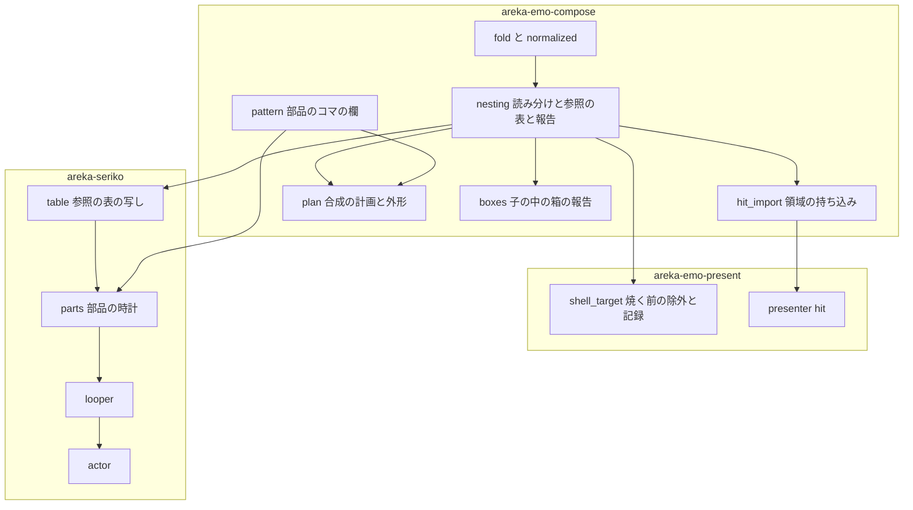
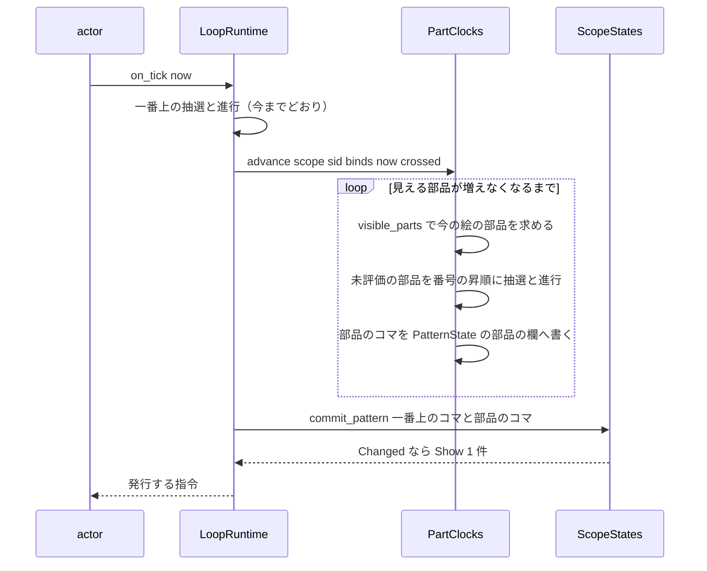
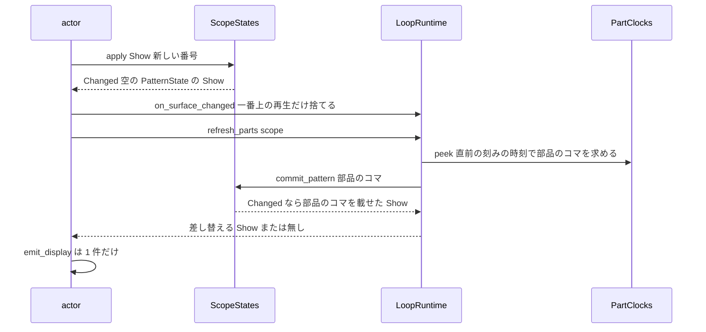

# Design Document: areka-P0-surface-element-nesting

## Overview

**Purpose**: シェルの作者が、目や口などの部品を 1 つのサーフェスにまとめ、element定義のファイル名の欄に数字だけを書いて、いくつもの表情のサーフェスへ置けるようにする。置かれたサーフェスのアニメーションは親の絵の中で動き、表情を切り替えても巻き戻らない。

**Users**: シェルの作者（部品の使い回し）・ゴーストの作者（部品に書いた当たり判定がどの表情でも効く）・後続の `animated-image-playback`（動く画像を部品のサーフェスへ分解して置く土台として使う）。

**Impact**: 合成の計画（`areka-emo-compose` の `plan.rs`）は、element定義からもサーフェスへ再帰する。pattern進行の入力（`PatternState`）は「部品のコマ」の欄を持つ。SERIKO のループ（`areka-seriko`）は「スコープ × 部品のサーフェス番号」ごとの時計を持ち、面の切り替えで捨てない。転記（`areka-parsers`）と焼く段（`areka-emo-atlas`）は変えない。

本書では、**element定義で置かれた子**と、**pattern定義が指して今の絵に出ているサーフェス**をまとめて「部品」と呼ぶ（要件の裁定「サーフェスは、どう参照されても自分の時計を持つ独立した部品」に合わせる）。「子」「親」「一番上のサーフェス」は要件と同じ意味で使う。

### Goals

- 数字だけの欄をサーフェスの番号として読み、何段でも重ねて描く（要件 1・2）。
- 無い番号・循環・子の中の `balloon` を、読み込み 1 回につき 1 度の警告で知らせ、絵は続ける（要件 3・6・8.1）。
- 子の当たり判定を、親が持たない名前の領域だけ、段ごとに持ち込む（要件 4）。
- 部品の時計を一番上のサーフェスの切り替えから独立させ、切り替えた瞬間の 1 枚目から続きのコマを出す（要件 5）。
- 入れ子も、アニメーションを持つ部品も無いシェルでは、絵・外形・当たり判定・乱数の消費・発行の回数が 1 つも変わらない（要件 7）。

### Non-Goals

- 動く画像の分解と読み込み（`animated-image-playback`・`animated-image-decode`）。
- 子の中のシェル内バルーンを使えるようにすること。`balloon` の element定義を並び順どおりに重ねること（`balloon-element-order`）。
- `overlay` 以外の描画メソッド・element定義のオプションの対応を広げること。
- `\s[...]`・`\i[...]` の意味の変更。今動かない間隔の語（`talk`・`always` ほか）を動かすこと。
- バルーン面の部品の時計（要件の範囲はシェルの surfaces.txt。バルーン面は 0 件のまま）。
- 合成のキャッシュの容量（3）の変更。本 spec は測るだけに留める。

## Boundary Commitments

### This Spec Owns

- **読み分け**: 「element定義のファイル名の欄が半角の数字だけ」の判定と、その結果の型（`ElementKind`）。判定の実装は `areka-emo-compose` の 1 関数だけ。
- **参照の表**: サーフェスごとの「element定義で置いた子」「着せ替えの pattern0 が指すサーフェス」の写し（`NestTable`）と、そこから「今の絵に出ている部品」を求める規則。
- **入れ子の報告**: 無い番号・循環（`NestReport`）、子の中の箱（`BoxIssue` の 1 種）。
- **領域の持ち込み**: サーフェスごとの「持ち込み済みの当たり判定の列」（`HitRegions`）。
- **部品のコマ**: `PatternState` の部品の欄と、その読み書きの口。
- **部品の時計**: `areka-seriko` の `PartClocks`（スコープ × 部品の番号 × animation の番号）。
- 入れ子の検体（リポジトリ内）と、`doc/COMPAT_ARCHITECTURE.md` §8 の 2 行。

### Out of Boundary

- `areka-parsers`（`shell/mod.rs`・`model.rs`・`decode.rs`・`boxes.rs`）と `areka-emo-atlas`（`manifest.rs`・`AtlasKey`・`AtlasTable::new` の形）には触らない。
- `areka-emo-text`・`crates/areka/src/input_events/`・`areka-emo-present` の `cache.rs`・`areka-seriko` の `state.rs` には触らない。
- pattern定義だけでできた循環の警告（合成のたびに出る今の `warn!`）は変えない。
- 窓の中の部品どうしの重なり順の裁定（`balloon-element-order`）。

### Allowed Dependencies

- 依存の向きは今のまま: `areka-parsers` → `areka-emo-atlas` → `areka-emo-compose` → `areka-emo-present`、`areka-emo-compose` → `areka-seriko`。逆向きの参照を足さない。
- `areka-seriko` は実行中に面の表（`EmoWorld`）を見ない。構築のときに `NestTable` の写しを受け取る。
- 新しい外部クレートは足さない。

### Revalidation Triggers

- `ElementKind` の読み分けの規則、または `NormalizedElement` の欄が変わるとき（`animated-image-playback` が再確認）。
- `PatternState` の部品の欄の形・鍵（サーフェス番号 → animation の番号）が変わるとき。
- `NestTable::visible_parts` の規則が変わるとき（合成の `flatten_surface` とずれると、見えない部品で描き直しが起きる）。
- 抽選の消費順（下記「部品の時計」）が変わるとき。
- `AnimationTable` が採る間隔の語が増えるとき（部品でも同じ語が動き出す。周期で回る語は `PartClocks` の「開始時刻から求める」形に載せる）。

## Architecture

### Existing Architecture Analysis

- **再帰の骨組みは在る**。`plan.rs` の `flatten_surface` は、コマと着せ替えの pattern0 が指すサーフェスへ再帰し、位置を足し、先祖の積み上げ（`visited`）で循環を止める。element定義の側（`push_static_element_ops`）は画像を命令にするだけで再帰しない。
- **部品の内側は止まった絵**。再帰の段は `is_top_level=false` で `PatternState` を見ない。着せ替えの集合（`binds`）は今も全段へ同じものが渡っている。
- **面の切り替えで再生を全部捨てる**。`actor.rs` のシェル面の切り替えの分岐が `LoopRuntime::on_surface_changed` を呼び、`ScopeStates::apply` は空の `PatternState` を載せた `Show` を出す。
- **記録の型**。純粋な核は事実を報告（`…Report`）に載せ、記録は fs を触る入口（`shell_target.rs` の `load_shell_target`）が読み込み 1 回につき 1 度だけ出す。前例は `EmoWorld::dangling_pattern_targets`。
- **箱は別の転記**。描画メソッド `balloon` の行は `parse_boxes` の側にだけ来て、`decode_elements`（`overlay` だけ）には届かない。要件 1.4・6.2〜6.4 は今の構造のまま成り立つ。
- **焼く一覧は `shell.surfaces` の複製**。`build_shell_target_with_boxes` が焼く前に手を入れられる唯一の場所。

### Architecture Pattern & Boundary Map



**Architecture Integration**:

- 選んだ型: 既存を延ばす＋新しいモジュール 3 つ（compose の `nesting.rs`・`hit_import.rs`、seriko の `parts.rs`）。合成と外形の再帰は `plan.rs` の中で延ばす（同じ再帰に入れるのが自然）。静的な解析と部品の時計は新しいモジュールへ置き、既存のファイルは呼ぶだけにする。
- 境界の分け方: 「静的な入れ子（読み分け・合成・外形・報告・領域）」は compose、「部品の時計」は seriko。両者の継ぎ目は `NestTable`（静的な写し）と `PatternState` の部品の欄（毎回の入力）の 2 つだけ。
- 守る既存の型: parser は転記・解決は下流／記録は入口 1 か所／アニメのエンジンは sakura と seriko の 2 つ／`hit_region` は純関数／発行は `emit_display` の 1 点。
- steering との整合: 1 ファイル 1,000 行以下（`plan.rs` は 730 行から 840 行前後の見込み）・テストは新しい兄弟ファイル・時刻と乱数は注入・記録の無い読み飛ばしを作らない。

### Technology Stack

| Layer | Choice / Version | Role in Feature | Notes |
|-------|------------------|-----------------|-------|
| 合成 | `areka-emo-compose`（既存・`bevy_ecs`） | 読み分け・参照の表・再帰の合成・領域の持ち込み | 新しい依存なし |
| 表示 | `areka-emo-present`（既存） | 焼く前の除外・記録・当たり判定の入口 | 新しい依存なし |
| アニメ | `areka-seriko`（既存） | 部品の時計 | 新しい依存なし |

## File Structure Plan

### Directory Structure

```
crates/areka-emo-compose/
├── src/
│   ├── nesting.rs                  # 新規: ElementKind・element_kind・NestTable・NestReport
│   ├── nesting_kind_tests.rs       # 新規: 読み分けの分かれ目
│   ├── nesting_report_tests.rs     # 新規: 無い番号・循環の報告
│   ├── nesting_visible_tests.rs    # 新規: visible_parts と合成の一致
│   ├── hit_import.rs               # 新規: HitRegions と持ち込みの規則
│   ├── hit_import_tests.rs         # 新規
│   ├── pattern_parts_tests.rs      # 新規: 部品の欄の等しさ・空の扱い
│   ├── plan_nesting_tests.rs       # 新規: 位置・重ね順・多段・循環・部品のコマ
│   ├── plan_nesting_extent_tests.rs# 新規: 外形
│   ├── boxes_nesting_tests.rs      # 新規: 子の中の箱の報告
│   └── nesting_fixture_tests.rs    # 新規: 検体を解析→面の表→焼く→合成まで通す
└── tests/fixtures/surface-nesting/ # 新規: 検体（surfaces.txt と小さな PNG 数枚）

crates/areka-emo-present/src/
├── shell_target_nesting_tests.rs   # 新規: 焼く一覧からの除外・記録が 1 度だけ出る
└── presenter_nesting_hit_tests.rs  # 新規: 持ち込んだ領域が入口から引ける（拡大率つき）

crates/areka-seriko/src/
├── parts.rs                        # 新規: PartClocks（部品の時計）
├── parts_tests.rs                  # 新規: 抽選・進行・見えない間・着せ替えの番人
├── table_parts_tests.rs            # 新規: 参照の表の写しと「動く部品が在るか」
├── looper_parts_tests.rs           # 新規: 刻みの統括・消費順・捨てる時機
├── looper_parts_emo2_tests.rs      # 新規: emo2 が今までと同じ発行列・同じ乱数の回数
└── actor_parts_tests.rs            # 新規: 切り替えの Show が 1 件で部品のコマを載せる
```

### Modified Files

- `crates/areka-emo-compose/src/normalized.rs` — `NormalizedElement` に `kind: ElementKind` を足す。
- `crates/areka-emo-compose/src/fold.rs` — `normalize_element` が `element_kind` を呼んで `kind` を入れる。
- `crates/areka-emo-compose/src/base_image.rs` — `base_element` の `kind` は `Image`。
- `crates/areka-emo-compose/src/atlas_bind.rs` — `kind` が `Image` でない element は引かず、警告も出さない（`None` を置く）。
- `crates/areka-emo-compose/src/pattern.rs` — 部品の欄と口を足す。
- `crates/areka-emo-compose/src/plan.rs` — `flatten_surface`・`flatten_extent` が element定義の子へ再帰する。部品の段は部品のコマを見る。
- `crates/areka-emo-compose/src/hit.rs` — 領域の列を直に受ける形（`hit_region_in`・`hit_region_scaled_in`）を足し、今の 2 関数はそこへ委譲する。
- `crates/areka-emo-compose/src/world.rs` — `EmoWorld::nest_report`・`nest_table`・`hit_regions` を足し、`build_with_images` の最後で領域を持ち込む。
- `crates/areka-emo-compose/src/boxes.rs` — `BoxIssue::InChildSurface` と、その検出。
- `crates/areka-emo-compose/src/lib.rs` — モジュールの宣言と再公開。
- `crates/areka-emo-present/src/shell_target.rs` — 焼く一覧から数字だけの element を外す。`NestReport` を持ち、`load_shell_target` が警告を出す。`log_box_issue` に 1 本足す。
- `crates/areka-emo-present/src/presenter/hit.rs` — `EmoWorld::hit_regions` で引く。
- `crates/areka-seriko/src/table.rs` — `AnimationTable` に `NestTable` の写しと「動く部品が在るか」を持たせる（`from_world` の署名は変えない）。
- `crates/areka-seriko/src/looper.rs` — 刻みの中で `PartClocks` を呼ぶ。シェルの表の差し替えで部品の時計を捨てる。`refresh_parts` を足す。
- `crates/areka-seriko/src/actor.rs` — シェル面の切り替えと着せ替えの変化の 2 か所で `refresh_parts` を呼ぶ。
- `crates/areka-seriko/src/lib.rs` — `mod parts;`。
- `doc/COMPAT_ARCHITECTURE.md` — §8 に 2 行。

## System Flows

### 刻み 1 回（シェル面・動く部品が在るシェルだけ通る）



- 部品の抽選は、**その刻みで一番上の進行を済ませた後の絵**に出ている部品だけが対象。見えない部品は抽選も進行もしない（要件 5.11）。
- 部品のコマが別のサーフェスを指すと、その先も部品になる。そのため「見える部品を求める → 未評価の部品を評価する」を、増えなくなるまで繰り返す（評価済みの集合が増えるだけなので必ず止まる）。

### 一番上のサーフェスの切り替え



- 切り替えの `Show` は**必ず 1 件**。部品のコマが在れば、それを載せた `Show` を空の `Show` の代わりに出す。1 コマ遅れて追い付く形にはしない（要件 5.6）。
- `peek` は時計を書き換えず、抽選もしない。使う時刻は直前の刻みの時刻（画面のほかの部分と同じ時点）。
- 着せ替えの変化（`apply_bind`・`apply_bind_exclusive` が `Changed` を返したとき）も同じ `refresh_parts` を通す。

## Requirements Traceability

| Requirement | Summary | Components | Interfaces | Flows |
|-------------|---------|------------|------------|-------|
| 1.1, 1.2 | 数字だけ→番号（`surface*`・`surface.append*` 共通） | Nesting・Fold | `element_kind`・`NormalizedElement.kind` | — |
| 1.3 | それ以外は画像 | Nesting | `ElementKind::Image` | — |
| 1.4 | `balloon` は名前のまま | （既存の構造） | `parse_boxes` と `decode_elements` が行を分けている | — |
| 1.5 | 数字だけの名前の画像を使わない | ShellTarget・AtlasBind | 焼く一覧からの除外・束縛の飛ばし | — |
| 1.6, 1.7 | 上限なし・使い回し | Plan | 先祖の積み上げは枝を出るとき外す | — |
| 1.8 | ファイル名の慣習だけの子 | （既存）`apply_base_images` が面を新設・Plan は `EmoWorld::surface` で引く | — | — |
| 1.9 | 大きすぎる数 | Nesting | `ElementKind::SurfaceOutOfRange`→`NestIssue::MissingTarget` | — |
| 2.1, 2.2, 2.3 | 位置・重ね順・多段 | Plan | `flatten_surface` の層 (i) | — |
| 2.4 | `element0` が子 | （既存）`apply_base_images` の層 0 の判定 | — | — |
| 2.5, 2.6 | 外形 | Plan | `flatten_extent` | — |
| 2.7 | pattern定義の先の子 | Plan | 同じ再帰 | — |
| 2.8 | 拡大率 | （既存）合成済みの 1 枚を拡大・`hit_region_scaled_in` | — | — |
| 3.1 | 無い番号の警告 | Nesting・ShellTarget | `NestIssue::MissingTarget` | — |
| 3.2, 3.3, 3.4 | 循環 | Nesting・Plan・ShellTarget | `NestIssue::Cycle`・先祖の積み上げ | — |
| 3.5 | 失敗を記録しない | ShellTarget・AtlasBind | 除外・飛ばし | — |
| 4.1, 4.2, 4.3, 4.4, 4.5, 4.6 | 領域の持ち込み・手前奥 | HitImport・PresenterHit | `HitRegions`・`EmoWorld::hit_regions` | — |
| 4.7 | pattern定義の先は持ち込まない | HitImport | element定義の辺だけをたどる | — |
| 4.8, 4.9, 4.10 | 名前で落とす・段ごと・複数の子 | HitImport | 持ち込みの規則 | — |
| 5.1, 5.2 | 部品のアニメ・多段 | Parts・Plan | `PartClocks::advance`・部品のコマ | 刻み |
| 5.3, 5.4 | 時計の鍵・複数の位置で揃う | Parts・Pattern | 鍵＝スコープ×番号・部品の欄は番号ごとに 1 つ | — |
| 5.5 | 初めて表示で動き出す | Parts | 見えた刻みから抽選の対象 | 刻み |
| 5.6 | 切り替えで巻き戻らない | Parts・Looper・Actor | `refresh_parts` | 切り替え |
| 5.7 | 見えない間も進んでいた扱い | Parts | 開始時刻を持ち続け、経過から求める | — |
| 5.8 | シェルの切り替え・降りるとき捨てる | Looper | `replace_shell_table`・アクターの終了 | — |
| 5.9, 5.10 | 一番上は今までどおり・別の時計 | Looper・Pattern | 一番上の欄と部品の欄は別 | 切り替え |
| 5.11 | 見えない子で描き直さない | Parts | 見える部品だけを欄へ書く・`commit_pattern` の同値の番人 | — |
| 5.12 | 着せ替え | Plan・Parts | 同じ `binds`・`BindRandom` の番人 | — |
| 5.13, 5.14 | pattern定義が指すサーフェス | Nesting・Parts | `visible_parts` がコマの先を部品に数える・同じ鍵 | 刻み |
| 6.1 | 子の中の箱の警告 | Boxes・ShellTarget | `BoxIssue::InChildSurface` | — |
| 6.2, 6.3, 6.4 | 残りは描く・一番上では使える・親の箱は不変 | （既存の構造）`BoxLayout` は番号ごと | — | — |
| 7.1, 7.2, 7.3 | 入れ子なしは不変 | 全体 | 空の `NestTable`・空の部品の欄・`has_animated_parts` が偽 | — |
| 7.4 | 検体（emo2）は同じ | Looper | `looper_parts_emo2_tests.rs`（下記「emo2 についての事実」） | — |
| 8.1 | 黙った読み飛ばしなし | Nesting・Boxes・ShellTarget | 3 種の報告 | — |
| 8.2 | 検体 | `tests/fixtures/surface-nesting/` | — | — |
| 8.3 | 決定論テスト | Testing Strategy | — | — |
| 8.4, 8.5 | 登記 | `doc/COMPAT_ARCHITECTURE.md` §8 | — | — |

## Components and Interfaces

| Component | Layer | Intent | Req Coverage | Key Dependencies | Contracts |
|-----------|-------|--------|--------------|------------------|-----------|
| Nesting | compose | 読み分け・参照の表・無い番号と循環の報告 | 1.1〜1.3, 1.9, 3.1〜3.4, 5.13, 8.1 | `EmoWorld`（P0） | Service |
| Plan（拡張） | compose | element定義の子への再帰・部品のコマ・外形 | 1.6, 1.7, 2.1〜2.7, 3.2〜3.4, 5.1, 5.2, 5.12 | Nesting・Pattern（P0） | Service |
| Pattern（拡張） | compose | 部品のコマの欄 | 5.3, 5.4, 5.10 | — | State |
| HitImport | compose | 領域の持ち込み | 4.1〜4.10 | Nesting（P0） | Service |
| Boxes（拡張） | compose | 子の中の箱の報告 | 6.1, 8.1 | Nesting（P1） | Service |
| ShellTarget（拡張） | present | 焼く前の除外・記録 | 1.5, 3.1, 3.2, 3.5, 6.1, 8.1 | Nesting・Boxes（P0） | Service |
| PresenterHit（拡張） | present | 持ち込み済みの列で判定 | 4.1, 4.2, 2.8 | HitImport（P0） | Service |
| Table（拡張） | seriko | 参照の表の写し | 5.1, 7.2, 7.3 | Nesting（P0） | State |
| Parts | seriko | 部品の時計 | 5.1〜5.8, 5.11〜5.14 | Table・Pattern（P0） | Service, State |
| Looper・Actor（拡張） | seriko | 刻みと切り替えの統括 | 5.6, 5.8, 5.9, 7.2, 7.3, 7.4 | Parts（P0） | Service |

### 合成（areka-emo-compose）

#### Nesting（`nesting.rs`）

| Field | Detail |
|-------|--------|
| Intent | 数字だけの欄の読み分けと、入れ子の静的な事実（参照の表・報告）を 1 か所で持つ |
| Requirements | 1.1, 1.2, 1.3, 1.9, 3.1, 3.2, 3.3, 3.4, 5.13, 8.1 |

**Responsibilities & Constraints**

- 読み分けの実装はここだけ。`fold.rs`（畳み込み）と `shell_target.rs`（焼く前の除外）が同じ関数を呼ぶ。
- 記録を出さない。事実を値で返す（記録は `load_shell_target`）。
- 面の表を 1 度なめるだけで、毎コマの経路ではない（`visible_parts` だけは刻みごとに呼ばれるので確保をしない）。

##### Service Interface

```rust
/// element定義が置くもの。
#[derive(Debug, Clone, Copy, PartialEq, Eq)]
pub enum ElementKind {
    /// 画像（今までどおり）。
    Image,
    /// サーフェスの番号（欄が半角の数字だけで、u32 に収まる）。
    Surface(u32),
    /// 欄は半角の数字だけだが u32 に収まらない。画像としては読まない。
    SurfaceOutOfRange,
}

/// 欄が空でなく、全部が半角の数字（0〜9）なら番号として読む。`0100` は 100。
/// 符号つき・全角の数字・拡張子つきは画像。
pub fn element_kind(path: &ElementPath) -> ElementKind;

/// サーフェスごとの静的な参照（Send。seriko が写しを持つ）。
#[derive(Debug, Clone, Default, PartialEq, Eq)]
pub struct NestTable { /* 番号 → SurfaceParts。children・bind_targets・bind_ids のどれかが空でない番号だけを載せる */ }

#[derive(Debug, Clone, Default, PartialEq, Eq)]
pub struct SurfaceParts {
    /// element定義で置いた子（面の表に在る番号だけ・element定義の番号の昇順）。
    pub children: Vec<u32>,
    /// 着せ替えの animation の pattern0 が指すサーフェス（animation の番号, 番号）。
    /// index が 0・番号が 0 以上・描画メソッドが動くものだけ。
    pub bind_targets: Vec<(u32, u32)>,
    /// 着せ替えの種類（`bind`・`bind+random`）の animation の番号。
    pub bind_ids: Vec<u32>,
}

impl NestTable {
    pub fn is_empty(&self) -> bool;
    pub fn parts(&self, surface_id: u32) -> Option<&SurfaceParts>;
    /// 今の絵に出ている部品の番号を、昇順・重複なしで `out` へ入れる（`out` は先に空にする）。
    pub fn visible_parts(&self, top: u32, binds: &BindSet, pattern: &PatternState, out: &mut Vec<u32>);
}

#[derive(Debug, Clone, PartialEq, Eq)]
pub enum NestIssue {
    /// 指した番号のサーフェスが無い（u32 に収まらない数字を含む）。`target` は欄の原文。
    MissingTarget { surface: u32, element: u32, target: String },
    /// この参照をたどると `surface` へ戻る。
    Cycle { surface: u32, element: u32, target: u32 },
}

#[derive(Debug, Clone, Default, PartialEq, Eq)]
pub struct NestReport { pub issues: Vec<NestIssue> }
```

- `EmoWorld::nest_table(&self) -> NestTable`・`EmoWorld::nest_report(&self) -> NestReport` を `world.rs` に足す（中身は本モジュール）。
- **`visible_parts` の規則**（`flatten_surface` と同じ辺をたどる）: 一番上から始め、各サーフェスについて ① `children` ② 有効な着せ替え（`binds` に在る）の `bind_targets`。ただし同じ animation の番号にコマが在ればコマが置き換えるので数えない ③ そのサーフェスのコマ（一番上は今までの欄、部品は部品の欄）のうち、描画メソッドが動くもので、着せ替えの種類なら `binds` に在るもの——の指す先を部品に数え、その先へ進む。先祖に在る番号へ戻る辺は進まない。
- **`NestReport` の循環**: element定義の辺 (親, element, 子) について、子から「element定義の辺と、すべての pattern定義の辺（欄 2 が animation の番号になる 7 語は除く）」をたどって親へ戻れるなら `Cycle`。辺 1 本につき 1 件。並びは親の番号 → element定義の番号の昇順。
- Preconditions: 面の表は畳み込みと土台の絵の決定が済んでいる（ファイル名の慣習だけで建つ面も「在る」に数える）。
- Invariants: `NestTable` は面の表が同じなら同じ値。載せる条件は 1 つだけ（`children`・`bind_targets`・`bind_ids` のどれかが空でない）。pattern0 を持たない `bind+random` だけのサーフェスも `bind_ids` で載る。入れ子も着せ替えの種類の animation も無いシェルでは空。

**Implementation Notes**

- `visible_parts` と `flatten_surface` が同じ結論になることを `nesting_visible_tests.rs` で留める（「部品 X のコマを足すと命令列が変わる」⇔「X が `visible_parts` に在る」）。
- 循環の報告は「どの一番上から見ても切られうる辺」を全部挙げる。合成が実際に切る辺は一番上によって違うが、必ず報告に含まれる（同じテストファイルで留める）。

#### Plan（`plan.rs` の拡張）

| Field | Detail |
|-------|--------|
| Intent | element定義の子を、番号の順の位置で再帰して重ね、部品の段では部品のコマを使う |
| Requirements | 1.6, 1.7, 2.1, 2.2, 2.3, 2.5, 2.6, 2.7, 3.2, 3.3, 3.4, 5.1, 5.2, 5.12 |

**Responsibilities & Constraints**

- 層 (i) は element定義を番号の昇順（同じ番号は書いた順）に 1 つずつ見る。`Image` は今までどおり命令にする。`Surface(c)` は、その場で `c` へ再帰する（位置は親の位置＋ element定義の X,Y）。これで子の絵は親の element定義の順に挟まる。
- `Surface(c)` で `c` が先祖に在る・面の表に無い、または `SurfaceOutOfRange` のときは、その element定義だけを飛ばす（`debug!` 1 行。警告は読み込みのときに出ている）。
- 層 (ii) のコマの合流は、一番上なら今までの欄、部品の段なら部品の欄のその番号の分を使う。規則（着せ替えから外れたコマの拒否・描画メソッドの番人・コマが pattern0 を置き換える・並べ替え）は一番上と同じ 1 本の経路。
- `binds` は今までどおり全段へ同じものを渡す。
- `flatten_extent` も element定義の子へ再帰する（位置を足す）。外形はコマに依らない静的な量のまま。
- pattern定義から入った再帰の循環の `warn!` は今のまま。

**Contracts**: Service [x]

- `build_plan`・`derive_ops`・`compute_extent` の署名は変えない。
- Postconditions: 部品の欄が空で、element定義の子が無いシェルでは、命令列と外形が本 spec の前とバイト単位で同じ。

#### Pattern（`pattern.rs` の拡張）

| Field | Detail |
|-------|--------|
| Intent | 部品のコマを、一番上のコマと別の欄で運ぶ |
| Requirements | 5.3, 5.4, 5.10 |

##### State Management

```rust
impl PatternState {
    /// 部品 `surface_id` の animation `animation_id` の今のコマを置く。
    pub fn set_part(&mut self, surface_id: u32, animation_id: u32, frame: PatternFrame);
    /// 部品のコマを全部消す。
    pub fn clear_parts(&mut self);
    /// 部品 `surface_id` のコマを 1 つ引く。
    pub fn part_get(&self, surface_id: u32, animation_id: u32) -> Option<&PatternFrame>;
    /// 部品 `surface_id` のコマを animation の番号の昇順に走査する（無ければ空）。
    pub fn part(&self, surface_id: u32) -> impl Iterator<Item = (u32, &PatternFrame)>;
}
```

- 状態の形: 今の欄（animation の番号 → コマ）はそのまま。私有の欄を 1 つ足す（部品の番号 → animation の番号 → コマ・どちらも昇順の表）。空の内側の表は持たない（等しさを安定させる）。
- `is_empty` は両方の欄が空のとき真。`set`・`remove`・`get`・`iter` は今までどおり一番上の欄だけを扱う。
- 等しさは派生のまま。`ComposeKey` は `PatternState` を丸ごと含むので、キャッシュの鍵は自動で部品のコマを含む（`cache.rs` は変えない）。
- 同じ番号のサーフェスが「一番上」と「部品」の両方で出ても、欄が別なので混ざらない（要件 5.10）。同じ部品を何か所に置いても欄は 1 つなので揃って動く（要件 5.4）。

#### HitImport（`hit_import.rs`）

| Field | Detail |
|-------|--------|
| Intent | 子の領域を、親が持たない名前だけ、段ごとに、位置をずらして親の列へ持ち込む |
| Requirements | 4.1, 4.2, 4.3, 4.4, 4.5, 4.6, 4.7, 4.8, 4.9, 4.10 |

**Responsibilities & Constraints**

- サーフェス S の「持ち込み済みの列」＝［子から持ち込む分（親の element定義の番号の昇順）］→［S に直接書かれた領域（今の並び）］。`hit_region` は列を逆順に走査するので、後ろほど手前になる（親が最前・番号の大きい子が次）。
- 子 C から持ち込む分＝ C の持ち込み済みの列のうち、**S に直接書かれた領域と同じ名前でないもの**を、element定義の X,Y だけずらした写し。C の列の並びは変えない（子の中の手前奥は単独表示と同じ）。
- 段ごとに当てはまる: C の持ち込み済みの列は、C 自身の名前で孫の領域を落とした結果である。
- 複数の子が同じ名前を持っていても、S がその名前を持たなければ全部持ち込む。
- たどるのは element定義の辺だけ。無い番号・先祖へ戻る辺は持ち込まない。pattern定義が指すサーフェスからは持ち込まない。
- 列は面の表を組むとき（`EmoWorld::build_with_images` の最後）に、各サーフェスを根として 1 回ずつ求める。**持ち込みが 1 つも無いサーフェスには何も足さない**（入れ子の無いシェルでは面の表が本 spec の前と同じ）。

##### Service Interface

```rust
/// 持ち込み済みの当たり判定の列（持ち込みが在るサーフェスにだけ付くコンポーネント）。
#[derive(Debug, Clone, PartialEq, Component)]
pub struct HitRegions(pub Vec<Collision>);

impl EmoWorld {
    /// 当たり判定に使う列。持ち込みが在ればその列、無ければ `SurfaceMaster.collisions`。
    pub fn hit_regions(&self, id: u32) -> Option<&[Collision]>;
}

// hit.rs
pub fn hit_region_in(collisions: &[Collision], x: i64, y: i64, priority: RegionPriority) -> Option<&str>;
pub fn hit_region_scaled_in<'a>(collisions: &'a [Collision], x: i64, y: i64, k: ScaleRatio, priority: RegionPriority) -> ScaledHit<'a>;
```

- `hit_region`・`hit_region_scaled`（`SurfaceMaster` を受ける今の 2 関数）は `…_in` へ委譲するだけにし、署名と既存のテストはそのまま。
- `SurfaceMaster.collisions` は転記のまま残す。

#### Boxes（`boxes.rs` の拡張）

| Field | Detail |
|-------|--------|
| Intent | 子として置かれたサーフェスが箱を持つことを報告に載せる |
| Requirements | 6.1, 8.1 |

- `BoxIssue::InChildSurface { parent: u32, child: u32, name: String }` を足す。`fold_boxes` が、置き場所の表ができた後に、面の表の element定義の辺 (親, 子) ごとに子の置き場所を調べ、箱 1 つにつき 1 件載せる。
- 箱の置き場所の表（`BoxLayout`）は変えない。子の箱は今も親の中に置かれない（要件 6.2〜6.4 は構造のまま）。
- `place` の「画像の element より小さい番号の箱」の判定は今のまま。サーフェスを置く element定義も絵として描かれるので「画像の element」に数える。

### 表示（areka-emo-present）

#### ShellTarget（`shell_target.rs` の拡張）

| Field | Detail |
|-------|--------|
| Intent | 数字だけの element を焼く一覧から外し、入れ子の報告を 1 度だけ記録する |
| Requirements | 1.5, 3.1, 3.2, 3.5, 6.1, 8.1 |

- `build_shell_target_with_boxes` は、`shell.surfaces` の複製から `element_kind` が `Image` でない element を取り除いてから `SurfaceSet` に渡す。これで数字だけの名前の画像は読まれず、読み込みの失敗も記録されない。`manifest.rs` は変えない。
- 同じ関数が、今ある「聞くための面の表」から `nest_report()` を取り、`ShellTarget` に持たせる。
- `load_shell_target` が `NestIssue` 1 件につき `warn!` を 1 行出す（`shell:` の接頭辞・構造化フィールド）。
  - `MissingTarget`: `surface`・`element`・`target`。
  - `Cycle`: `surface`・`element`・`target`。
- `log_box_issue` に `InChildSurface`（`parent`・`child`・`name`）の 1 本を足す。`match` は網羅なので、足し忘れはコンパイルで止まる。

#### PresenterHit（`presenter/hit.rs` の拡張）

- `EmoPresenter::hit_region`・`hit_region_client` は、今のサーフェスの番号で `EmoWorld::hit_regions` を引き、`hit_region_in`・`hit_region_scaled_in` を呼ぶ。拡大率の扱い・縮退・記録は今のまま（要件 2.8・4.2）。

### アニメ（areka-seriko）

#### Table（`table.rs` の拡張）

- `AnimationTable` は「番号 → 動かす animation の列」に加えて、`NestTable` の写しと `has_animated_parts: bool` を持つ。`from_world`・`empty`・`animations` の署名は変えない。
- `has_animated_parts` は「部品になりうるサーフェス（`NestTable` の `children`・`bind_targets` の先、または採った animation のどれかのコマが指す 0 以上の番号）のうち、採った animation を 1 本でも持つものが在る」。偽なら、刻みも切り替えも部品の経路を 1 行も通らない（要件 7.2・7.3）。
- 部品で動く animation は `animations(部品の番号)` がそのまま答える。一番上に表示したときに動く種類と同じになる（要件 5.1。採る語が増えれば部品でも動く）。

#### Parts（`parts.rs`）

| Field | Detail |
|-------|--------|
| Intent | スコープ × 部品の番号ごとの時計を持ち、見える部品のコマを `PatternState` の部品の欄へ書く |
| Requirements | 5.1, 5.2, 5.3, 5.4, 5.5, 5.6, 5.7, 5.8, 5.11, 5.12, 5.13, 5.14 |

**Responsibilities & Constraints**

- 時計の鍵は (スコープ, 部品の番号, animation の番号)。element定義で置いた子も、pattern定義が指したサーフェスも同じ鍵を使う（要件 5.14）。
- 見える部品だけを評価する。見えない部品には触らない（抽選なし・進行なし・欄にも書かない）。
- 時計は `clear` でだけ消える（シェルの表の差し替え）。面の切り替え・`Hide`・部品が見えなくなること・コマが消えることでは消さない。
- 対象はシェル面だけ。

##### State Management

```rust
/// animation 1 本の時計。
enum PartAnim {
    /// 再生中（開始の時刻）。今のコマは `frame_at(経過)` で求める。
    Playing { started_at_ms: u64 },
    /// `-1` の無い末尾まで進んで、最後のコマを保っている。
    Residual { frame_index: usize },
}

pub(crate) struct PartClocks { /* スコープ → 部品の番号 → animation の番号 → PartAnim */ }

impl PartClocks {
    /// 刻み 1 回。見える部品を抽選（境界を跨いだ刻みだけ）・進行させ、
    /// `pattern` の部品の欄を今の絵の分で作り直す。
    pub(crate) fn advance(
        &mut self,
        scope: &ActorKey,
        surface_id: u32,
        binds: &BindSet,
        table: &AnimationTable,
        now_ms: u64,
        crossed: bool,
        rng: &mut LoopRng,
        pattern: &mut PatternState,
    );
    /// 時計を書き換えず、抽選もせずに、`now_ms` の時点の部品のコマで欄を作り直す。
    pub(crate) fn peek(
        &self,
        scope: &ActorKey,
        surface_id: u32,
        binds: &BindSet,
        table: &AnimationTable,
        now_ms: u64,
        pattern: &mut PatternState,
    );
    /// 全スコープの時計を捨てる。
    pub(crate) fn clear(&mut self);
}
```

- **進め方**（`advance`）: 部品の欄を空にする →［`visible_parts` で見える部品を求める → まだ評価していない部品を番号の昇順に評価する → 評価した部品のコマを欄へ書く］を、新しく評価する部品が無くなるまで繰り返す。
- **部品 1 つの評価**: animation の番号の昇順に、
  1. 境界を跨いだ刻みで、再生中でなく、`BindRandom` なら `binds` に在るものだけ `should_fire`。当たれば `Playing { now }`（`Residual` は捨てる）。
  2. `BindRandom` で `binds` に無いものは時計を消す。
  3. `Playing` は `frame_at(now − 開始)` を見る。`Pending` はコマ無し・`Active` はそのコマ・`FinishedResidual` はそのコマを出して `Residual` へ・`Stopped` は時計を消す。`Residual` は保っているコマを出す。
- **`peek` も同じ番人を通す**: `BindRandom` で `binds` に無い animation のコマは、`peek` でも欄に書かない（時計は書き換えないので、消すのは次の `advance`）。着せ替えを外した瞬間の `refresh_parts` で、外れた側のコマを載せた `Show` を出さないため。
- **見えない間**（要件 5.7・5.11）: 何もしない。`Playing` は開始の時刻を持ったままなので、戻った刻みに経過から今のコマが決まる（多くは終わっている）。巻き戻りは起きない。見えない間は抽選しないので、乱数も消費しない。今動く間隔の語は確率で引くものだけなので、見えない間に抽選を回し続ける形と見分けがつかない。
- **初めて表示**（要件 5.5）: 特別な状態は持たない。見えた刻み以降の境界で抽選の対象になる。
- **抽選の消費順**: 今の順（スコープの昇順 → シェル → バルーン → animation の番号の昇順）で一番上の分を全スコープぶん引き終えた後、スコープの昇順に、シェル面の部品を「評価する順（繰り返しの回 → 部品の番号の昇順 → animation の番号の昇順）」で引く。動く部品の無いシェルでは 1 つも足されない。
- **記録**: 発火・停止・末尾での保持は一番上と同じ水準（`info!`）で、`part`（部品の番号）の欄を足す。`-1` 以外の負の番号は (スコープ, 部品, animation) ごとに初回だけ `warn!`。

#### Looper・Actor（`looper.rs`・`actor.rs` の拡張）

| Field | Detail |
|-------|--------|
| Intent | 刻みと、面の切り替え・着せ替えの変化に、部品の時計をつなぐ |
| Requirements | 5.6, 5.8, 5.9, 7.2, 7.3, 7.4 |

```rust
impl LoopRuntime {
    /// 面の切り替え・着せ替えの変化の直後に呼ぶ。今の絵に見える部品のコマを載せ直し、
    /// 保持している `PatternState` が変わったら、それを載せた `Show` を返す。
    pub(crate) fn refresh_parts(&mut self, scope: &ActorKey, states: &mut ScopeStates) -> Option<DisplayCommand>;
}
```

- `LoopRuntime` が `PartClocks` を持つ。
- `on_tick`: 一番上の抽選は今のまま。シェル面で `has_animated_parts` が真のときだけ、一番上の進行の後に `PartClocks::advance` を呼び、`commit_pattern` を 1 回呼ぶ。一番上の再生が無い刻みでは、見える部品に動くものが在るか、保持している部品の欄が空でないときだけ呼ぶ（どちらでもなければ今までどおり何もしない）。偽のとき、およびバルーン面は今の経路のまま。
- `refresh_parts`: `has_animated_parts` が偽、またはそのスコープのシェル面が表示中でなければ `None`。真なら、保持している `PatternState` の写しに `PartClocks::peek`（時刻は直前の刻みの時刻。刻みが 1 度も来ていなければ部品のコマは無い）を当て、`commit_pattern` が `Changed` を返したらその `Show` を返す。
- `actor.rs`:
  - シェル面の切り替え（`states.apply` が `Changed` を返した所）: `on_surface_changed` → `refresh_parts` → `emit_display(refresh が返した Show、無ければ apply の指令)`。発行は 1 件。
  - 着せ替えの変化（`apply_bind`・`apply_bind_exclusive` が `Changed` を返した所）: `refresh_parts` → 同じく 1 件だけ発行。
- `on_surface_changed` は今までどおり一番上の再生だけを捨てる（要件 5.9）。`PartClocks` には触らない。
- `replace_shell_table` が `PartClocks::clear` を呼ぶ（要件 5.8）。ゴーストが降りるときはアクターごと消える。
- `ScopeStates`（`state.rs`）は変えない。切り替えの `Show` に部品のコマを載せる仕事は、今ある `apply` と `commit_pattern` の組み合わせで足りる。

## Data Models

### Domain Model

- **部品の時計**: 鍵 (スコープ, 部品のサーフェス番号, animation の番号)。値は `Playing { 開始の時刻 }` か `Residual { 最後のコマ }`。持ち主は `LoopRuntime`（seriko のアクターの中・ロックなし）。寿命はシェルの表が替わるかアクターが終わるまで。
- **部品のコマ**: `PatternState` の部品の欄。今の絵に見える部品の分だけを載せる。持ち主は今までどおり `ScopeStates`（保持）と `DisplayCommand::Show`（運搬）。
- **参照の表**: `NestTable`。面の表から 1 度作る不変の値。seriko は `AnimationTable` の中に写しを持つ。
- **持ち込み済みの列**: `HitRegions`。面の表の中、持ち込みの在るサーフェスにだけ付く。

不変条件:

- 部品の欄に載る番号は、その `PatternState` と `binds` と一番上の番号で `visible_parts` が返す番号に含まれる。
- 入れ子も動く部品も無いシェルでは、`NestTable` の `children` は全部空・部品の欄は常に空・`HitRegions` は 1 つも無い・`PartClocks` は空。

## Error Handling

### Error Strategy

読み込みを失敗させず、間違えた 1 行だけを飛ばして絵を続ける。飛ばした事実は読み込み 1 回につき 1 度 `warn!` で残す。

### Error Categories and Responses

| 事象 | 応答 | 記録 |
|---|---|---|
| 無い番号を指す element定義（大きすぎる数字を含む） | その element定義だけ描かない。領域も持ち込まない | 読み込みのとき `warn!` 1 行（親・element・指した番号）。合成の中は `debug!` |
| 循環する element定義 | 先祖へ戻る参照だけ描かない。停止しない | 読み込みのとき `warn!` 1 行（辺 1 本につき）。合成の中は `debug!` |
| pattern定義だけの循環 | 今までどおり枝を打ち切る | 今までどおり合成のたびに `warn!`（変えない） |
| 子の中の `balloon` の element定義 | 箱を親の中に置かない。子の残りは描く | 読み込みのとき `warn!` 1 行（親・子・箱の名前） |
| 部品のコマに `-1` 以外の負の番号 | その animation を止める | (スコープ, 部品, animation) ごとに初回だけ `warn!` |

### Monitoring

- 入口の記録は `areka_emo_present::shell_target` の target・`shell:` の接頭辞。
- 部品の発火・停止は `seriko:` の接頭辞・`info!`・`part` の欄つき（実機ではこの行で切り替えをまたいだ継続を確かめる）。
- 合成のキャッシュの命中は、既存の合成の計測の記録（`presenter/timing.rs` の `cache_hit` の欄）で読める。本 spec は数値の目標を置かない。

## Testing Strategy

時刻は `on_tick(now_ms)`・`send_tick`、乱数は `LoopRng` の注入、画像は `MemoryDecoder`、発行は `MockSurfaceOutput`、記録の捕捉は `log-capture-kit` を使う。新しいテストは上の「Directory Structure」の兄弟ファイルへ置く。

### Unit Tests

- **読み分け**（`nesting_kind_tests.rs`・1.1・1.3・1.9）: `100`→`Surface(100)`／`0100`→`Surface(100)`／`100.png`・`+1`・`-1`・全角の数字・空→`Image`／`99999999999`→`SurfaceOutOfRange`。
- **報告**（`nesting_report_tests.rs`・3.1・3.2・3.4・1.9）: 無い番号・大きすぎる数字が `MissingTarget`／自分自身・2 つの相互・element定義と pattern定義が混ざった循環が `Cycle`／同じ子を 2 つの経路から置いても `Cycle` にならない。
- **合成**（`plan_nesting_tests.rs`・2.1〜2.4・2.7・1.6・1.7・3.3・5.12）: 子の画像の位置が各段の X,Y の和／子が親の element定義の番号の順に挟まる／3 段／同じ子を 2 か所／`element0` が子／pattern定義の先の子／循環でも命令列が有限で、切られた辺が報告に含まれる／子の中の着せ替えの pattern0 が `binds` で出る／部品のコマが部品の段で使われ、一番上の同じ番号のコマとは混ざらない（5.10）。
- **外形**（`plan_nesting_extent_tests.rs`・2.5・2.6）: 子を置いた範囲が外形に入る／部品のコマを変えても外形が変わらない。
- **領域**（`hit_import_tests.rs`・4.1〜4.10）: ずらした位置で当たる／番号の大きい子が手前／子の中の順は単独と同じ／親が手前／親と同じ名前は重なっていない場所でも当たらない／孫→子→親の段ごとの落とし方／2 人の子の同じ名前が両方当たる／無い番号・循環の辺からは持ち込まない／pattern定義の先からは持ち込まない／持ち込みの無いサーフェスに `HitRegions` が付かない。
- **部品の欄**（`pattern_parts_tests.rs`）: 空の欄どうしは等しい／入れた順に依らず等しい／`clear_parts` の後は部品の欄を使う前と等しい。
- **部品の時計**（`parts_tests.rs`・5.1〜5.5・5.7・5.11〜5.14）: 見える刻みの境界でだけ抽選する／見えない間は乱数を呼ばず、欄に書かない／再生中に見えなくなり、戻った刻みに経過から決まる（巻き戻らない）／`bind+random` は `binds` に在るときだけ発火し、外れたら止まる／コマが別のサーフェスを指すと、その先の部品も同じ刻みで評価される／element定義で置いた子と pattern定義が指した同じ番号が 1 つの時計を使う／`peek` は `binds` から外れた `bind+random` のコマを書かない。

### Integration Tests

- **検体を通す**（`nesting_fixture_tests.rs`・8.2）: 検体の surfaces.txt を解析→面の表→焼く→合成。報告が検体に仕込んだ件数と一致し、仕込んでいない種類は 0 件。
- **焼く一覧と記録**（`shell_target_nesting_tests.rs`・1.5・3.5・8.1）: 数字だけの名前の画像が在っても読みに行かない／読み込みの失敗が 0 件／無い番号・循環・子の中の箱の `warn!` がそれぞれ 1 度だけ出る。
- **当たり判定の入口**（`presenter_nesting_hit_tests.rs`・4.2・2.8）: `hit_region_client` が子から持ち込んだ名前を返す（拡大率 1 と 2）。
- **切り替えの発行列**（`actor_parts_tests.rs`・5.6・5.9）: 子が閉じ目のコマの途中で `\s` を切り替えると、`Show` が 1 件だけ出て、そのコマを載せている／一番上の animation は最初から／子を置いていない面へ行って戻っても続きから（5.7）／着せ替えの変化でも 1 件／着せ替えを外した瞬間の `Show` に、外れた側の部品のコマが載らない。
- **捨てる時機**（`looper_parts_tests.rs`・5.8）: シェルの表の差し替えの後、部品の時計が空。
- **入れ子なしの不変**（`looper_parts_tests.rs`・`table_parts_tests.rs`・7.1〜7.3）: 入れ子も動く部品も無い表で `has_animated_parts` が偽／同じ刻みの列で、乱数の呼び出し回数と発行列が部品の経路を外した場合と一致する。既存の golden・seriko の決定論テストは 1 本も書き換えない。
- **emo2**（`looper_parts_emo2_tests.rs`・7.4）: 下記。

### 実機

- 検体のフォルダを、ワークツリーの `target\` の下に用意した emo2 のシェルとして読ませ、`\s` の切り替えをまたいで部品の発火・停止の記録（`part` の欄）が途切れないこと、警告 3 種が 1 度ずつ出ることを確かめる（時間を区切って自動で終わらせ、記録を検索する）。

## emo2 についての事実（要件 7.4）

実物（`target\nar-samples\manual\emo2\ghost\emo2\shell\master\surfaces.txt`）を確かめた結果:

- 数字だけの element定義は **0 件**。
- pattern定義が指すサーフェスは 38 個（1100・1101・1200〜1211・1300〜1305・1410〜1414・1500〜1503・1600・1700・1701・1800・1801・2106・2110・2206・2210）。
- そのうちアニメーションを持つのは **2 個**: `surface.append2110` と `surface.append2210`（どちらも `animation0.interval,random,4` で、2106／2206 を 160ms 重ねる）。`\0` 側（1100 番台〜1800 番台）と 2106・2206 は **0 件**。
- 2110 と 2210 は、`\1` のまばたき（`surface.append10,2100` と `surface.append2200` の `animation0`）の 2 枚目のコマとして、発火から 40ms 後〜120ms 後の 80ms だけ絵に出る。

つまり emo2 は、要件 7.1〜7.3 の前提（pattern定義が指すサーフェスのどれもアニメーションを持たない）を `\1` 側で満たさない。本設計での扱い:

- 部品の抽選は、境界を跨いだ刻みに、その部品が絵に出ているときだけ行う。`\1` のまばたきは境界を跨いだ刻みに発火し、2110 が出るのはその 40〜120ms 後で、次の境界は発火の刻みの直後の 1000 の倍数である。両方が重なるのは、発火の刻みが境界から 880ms 以上遅れた（＝刻みが 880ms 以上止まっていた）直後だけになる。
- したがって**刻みが普通に届いているあいだ、emo2 の絵・発行列・乱数の消費は本 spec の前と同じ**。`looper_parts_emo2_tests.rs` は、`\1` のまばたきを細かい刻みで回し、発行列と乱数の呼び出し回数が部品の経路を外した場合と一致することを留める。
- 刻みが 880ms 以上止まった直後の 1 回に限り、2110（または 2210）について抽選が 1 回走りうる（乱数を 1 つ消費し、1/4 で 2106／2206 が最長 80ms 重なる）。これは「pattern定義が指すサーフェスも部品として動かす」（要件 5.13）の帰結で、同じテストファイルがこの端も 1 本の檻で固定する。

**未解決（設計ディスカッションで開発者に確かめる）**: 要件 7.4 の文面「本 spec の前と同じ結果に保つ」は、上の端を含めると字義どおりには成り立たない。7.4 を「刻みが普通に届いているあいだ同じ」と読む形へ書き直すか、この端も塞ぐ規則を要件 5.13 に足すかは、要件の側の判断である。本設計は前者の読みで書いてある（後者なら `PartClocks` の抽選の条件に 1 つ足すだけで、ほかの部分は変わらない）。

## 解決したこと・残したこと

**解決した**

- 読み分けの置き場所: compose の 1 関数。parsers・atlas は無改変。
- 警告の時機: 読み込みのとき 1 度。合成の中は `debug!`。
- 当たり判定: 並べる順と名前の落とし方で手前奥を決める。判定は今の逆順の走査のまま。
- 部品の時計の置き場所: 時計は `LoopRuntime`、コマは `PatternState` の欄。`state.rs` は無改変。
- 見えない部品: 何もしない（開始の時刻から求める）。
- 切り替えの 1 枚目: `refresh_parts` で部品のコマを載せた `Show` を 1 件。
- 大きすぎる数字: 無い番号と同じ扱い。
- 箱の「画像より下」の報告: サーフェスを置く element定義も数える（今の成り行きのまま）。
- 検体: フォルダのまま置く（`crates/areka-emo-compose/tests/fixtures/surface-nesting/`）。検体では `surface.append*`ブレスに画像の element定義を書かない（下の「残した」の最後の項のため）。seriko のテストは surfaces.txt を `include_str!` で読む。

**残した**

- 要件 7.4 の文面（上記）。
- 合成のキャッシュの容量: 3 のまま。親と部品が同時に動くシェルで命中が下がりうるが、測るだけに留める。
- 周期で回る間隔の語: 今は採らない。採るときは `PartAnim::Playing` の開始の時刻から周期を求める形に載る（見えない間に何もしない形のまま延ばせる）。
- `surface.append*`ブレスに書いた画像の element定義は、今も焼く一覧に入っていない（焼く一覧は `shell.surfaces` の複製だけ）。本 spec の前からの事実で、本 spec では変えない。

## Performance & Scalability

- 入れ子も動く部品も無いシェル: 刻み・切り替え・合成・当たり判定のどれも、足される仕事は「偽の `bool` を 1 つ見る」「空の表を 1 つ比べる」だけ。
- emo2: `has_animated_parts` が真なので、刻み 1 回・表示中のシェル面 1 つにつき `visible_parts` を 1 回たどる（作業用の列は使い回す）。見える部品に動くものが無く、保持している部品の欄も空なら、`PatternState` の複製も `commit_pattern` も行わない。
- 領域の持ち込み・報告・参照の表は読み込みのときだけ。
