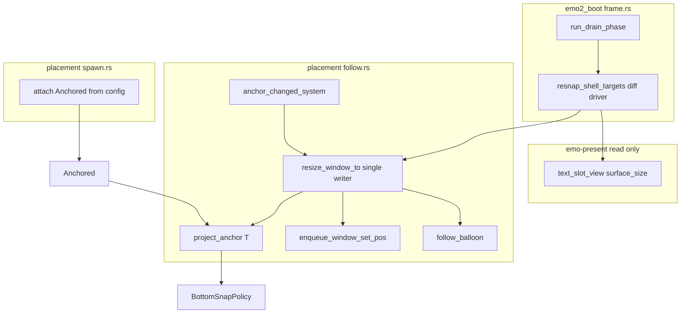
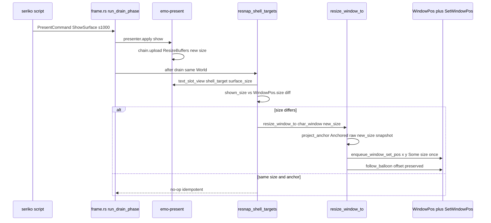
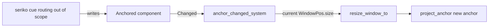

# 技術設計書: areka-P0-surface-resize-resnap

## Overview

**Purpose**: 本機能は、実行時にキャラクターの表示サーフェス寸法が変わっても **`seriko.alignmenttodesktop` の指定アンカー辺が保たれ続ける**（デスクトップの指定辺へ吸着し続ける）ことを、⓪ghost（窓所有者）と受け入れ検証者に提供する。中核は **シェル座標系（アンカー辺基準）→ ウィンドウ座標系（サーフェス寸法基準）の変換 T の恒常維持**である。

**Users**: emo2 本番ゴースト（むらさき）の起動→挨拶 `surface0` 表示→`\s[1000]` 等での本体サーフェス切替という M-boot フローで、切替後もマスコットが画面下端へ立ち続ける。将来 M-dual の二人立ちが同 T・同ライターを再利用する。

**Impact**: 現状は窓の position/size を spawn 時に一度だけ確定し（`placement/measure.rs`＋`placement/spawn.rs`）、実行時サーフェス切替（emo-present の `ShowSurface`）で窓を追随させるシームが無い。本設計は「サーフェス寸法変化・アンカー変化を T 再適用のトリガとして扱う検知シーム」＋「5 アンカー射影 T の単一ライター反映口」を追加し、既存の採寸・spawn・drag ポリシーを再利用する。emo2 実機サインオフ（R9.3）で発見された実機欠陥#1を解消する。

### Goals

- シェル座標系のアンカー辺を真実とし、OS 窓 position/size をサーフェス寸法から変換 T（5 アンカー射影 `top`/`bottom`/`left`/`right`/`free`）で常に再導出する。
- サーフェス寸法変化・アンカー変化を検知し、既存の単一位置ライター経路へ合流させて再吸着する（振動なし・べき等）。
- 決定論部（各アンカー射影・辺再計算・非正寸縮退・べき等・寸法差分判定）を全アンカー純粋関数テストで固定し、`bottom` を実 DPI（≠96）本番ゴーストで目視受け入れする。

### Non-Goals

- 初期表示サーフェスの選択・非表示既定（-1）＝`areka-P0-emo2-boot` #5 の領分。
- サーフェス合成・文字層・αマスク生成の中身、`\![set,scaling]` の実効寸法変化機構。
- `seriko.alignmenttodesktop` 優先度チェーンの読取り・解決、`\![set,alignmenttodesktop]` cue の routing（parsers／seriko／window-placement の領分）。
- バルーンの正式な配置規則・バルーン窓の位置記憶・二人立ち窓割当（M-dual）・位置永続化（M-life）。

## Boundary Commitments

### This Spec Owns

- **変換 T（`project_anchor`）**: 解決済みアンカー＋現寸から窓 position を再導出する純粋射影（5 アンカー）。`bottom` 腕は既存 `BottomSnapPolicy` を委譲再利用し再定義しない。
- **単一ライター反映口（`resize_window_to`）**: 確定した size と position を一度だけ書く口。既存 `enqueue_window_move` を size 対応へ一般化した `enqueue_window_set_pos` を経由する。
- **T 再適用トリガ**: (a) shell サーフェス寸法変化の検知（`frame.rs` の drain 後 diff）、(b) アンカー変化の反応（`Changed<Anchored>`）。両者を同一反映口へ合流。
- **解決済みアンカーの entity 表現（`Anchored` Component）と解釈写像（`Anchor::from_alignment`）**: 既に cascade 解決された `config.alignment` を 5 値へ解釈して char 窓へ付与する消費側契約。
- **随伴バルーンの offset 維持**: char 窓の移動・リサイズ時に既存 `follow_balloon` で offset を保つ（配置規則は所有しない）。

### Out of Boundary

- **初期表示サーフェスの選択・非表示既定（-1）**（6.1）＝`areka-P0-emo2-boot` #5 の領分。「最初に見えるサーフェス」が T の入力寸法基準である前提を利用するのみ。
- **サーフェス合成・文字層・αマスク生成の中身、`\![set,scaling]` の実効寸法変化機構**（6.2）＝emo-compose／隣接トリガの領分。本 spec は表示寸法の変化のみを T 再適用の入力とする。
- **アンカー値の cascade 解決（`config.rs` `resolve_alignment`・4 層優先度チェーン）と `\![set,alignmenttodesktop]` cue の routing**（6.3）＝parsers／seriko／window-placement の領分。本 spec は解決結果 `Alignment` を**解釈消費するのみ**で、`Anchored` を書き換える producer を持たず `Changed<Anchored>` に反応する consumer 契約のみを定義する。
- **二人立ちの窓割当・本格的な相方連動（M-dual）**（6.4）＝同 T・同ライターの再利用余地を残すに留める。
- **バルーンの正式な配置規則・位置永続化（position-persist・M-life）**（6.5）＝既存 follow の offset を破壊しない範囲で追随するのみ。balloon target（奇数）サーフェス寸法変化による窓 resize もしない（バルーン窓は follow の領分）。
- **ドラッグ機構そのもの（event-drag-system／window-placement）**（6.6）＝`DragPositionPolicy`／`BottomSnapPolicy`（＝T の bottom 事例）／`move_window_to` を再定義せず再利用する。

### Allowed Dependencies

- **`areka-P0-window-placement`（完了）**: `BottomSnapPolicy`／`DragPositionPolicy`／`MonitorSnapshot`／`work_area_for_window`／`move_window_to`／`enqueue_window_move`／`BalloonFollow`／`follow_balloon`／`GhostWindows`／`ScopePlacement`／`Alignment`／`config`／`resolver` 型（`PointPx`/`SizePx`/`RectPx`）。**消費・一般化し、cascade 解決は改変しない**。
- **`areka-P0-emo-present`（完了）**: `EmoPresenter::text_slot_view(target) -> Option<TextSlotView>`／`TextSlotView::surface_size() -> (u32,u32)`（read-only）・`TargetId`。**emo-present は改変しない**（read-only 消費）。
- **`areka-P0-emo2-boot`**: `run_drain_phase`／`Emo2Wiring`／`target_map`（`shell_target`/`balloon_target`）。frame シームの結線点。
- **wintf**: `SetWindowPosCommand`（width/height 既存）・`WindowPos`（size フィールド既存）・`WindowHandle`・`Point`/`SizeI`。**新規 wintf API・新規 crates.io 依存・新規通信フレームワークを導入しない**（Rust 2024・tokio 不使用）。

### Revalidation Triggers

以下が変われば下流（M-dual・emo2-boot・seriko）は統合を再確認する:

- `resize_window_to` / `project_anchor` / `Anchored` / `Anchor` の署名・意味の変化。
- `enqueue_window_set_pos` の size 対応契約（`SWP_NOSIZE` 切替・`WindowPos.size` ミラー）の変化。
- shell/balloon target 採番（`2*scope`/`2*scope+1`）や `GhostWindows::char_window` 写像の変化。
- 検知の起点が `text_slot_view` から別 source（例 `apply` 戻り値化・新 `PresentCommand::Resize`）へ移る変化。
- 解決済みアンカーの provenance（seriko が `Anchored` を書く interlock）の契約変化。

## Architecture

### Existing Architecture Analysis

- **spawn 時一度きりの採寸/配置**: `measure_scope_sizes`（初期 surface のみ採寸）→`resolver`（物理 px 配置解決）→`spawn_ghost_windows`（`WindowPos{position,size}` へ焼込・`BottomSnap` marker・`DragConfig{move_window}`）。実行時サイズ変化は関与しない。
- **単一位置ライター規律**: `move_window_to`→`enqueue_window_move` が `SetWindowPosCommand`（`SWP_NOSIZE` 固定=移動専用）を enqueue し、`WindowPos.position` を `bypass_change_detection()` でミラー、`Arrangement.offset` を直接同期する。bypass は `WM_WINDOWPOSCHANGED` echo との二重発行回避＋GA ヒットテスト境界同期（バルーンのクリック死回避）が作り込み済み。
- **物理 px 単一通貨**: placement 全域で DPI 再スケールを挟まない（2026-07-05 二重スケール欠陥の檻）。`resolver` は wintf 非依存の純粋モジュール（U5）。
- **検知側 emo-present**: `apply_show` が cache entry から寸法を導出し `SwapChainPresenter::upload` が `ResizeBuffers` で内部リサイズ、`mount.set_bounds` で visual bounds を更新済み。**キャラ画像は新寸で正しく描画されるが、OS 窓（HWND）だけ spawn 寸のまま**が欠陥機序。現寸は `text_slot_view(target).surface_size()` で参照可能。
- **統合層 frame.rs**: `run_drain_phase(wiring, world)` が同一 `&mut World`＋`wiring.presenter` を保持して `presenter.apply` する排他 World シーム。検知（presenter read）と反映（placement write）を同一 World・同一スレッドで結べる。

### Architecture Pattern & Boundary Map

**Selected pattern**: 同一 World 内データ依存（クロスエンジン通信ではない）＋純粋射影＋単一ライター。検知（emo-present read）→判定（純粋 diff/射影）→反映（placement 単一ライター write）を `frame.rs` シームが同一 `&mut World` で直列に結ぶ。



**Architecture Integration**:
- **Domain boundaries**: 検知=frame.rs（emo-present を read-only 消費）／射影 T=follow.rs（純粋）／反映=follow.rs（単一ライター）／アンカー付与=spawn.rs（config 解釈）。emo-present は placement を一切知らない（依存方向を汚さない）。
- **Existing patterns preserved**: 単一ライター（bypass＋Arrangement 同期）・物理 px 単一通貨・`BottomSnapPolicy` 純粋写像・graceful degradation（identity 縮退）・log-first。
- **New components rationale**: `Anchor`/`project_anchor`（bottom 特化を 5 アンカーへ一般化）・`Anchored`（二値 `BottomSnap` を 5 値へ generalize）・`resize_window_to`/`enqueue_window_set_pos`（move 専用を size 対応へ一般化）・frame シームの diff 駆動（唯一欠けていた検知トリガ）。
- **Dependency direction（強制）**: `resolver`（純粋 std）← `config`（parsers）← `measure` ← `spawn`／`follow`（wintf/bevy）← `frame.rs`（emo-present＋placement の統合層）。左は右を import しない。`Anchor` 純粋 enum は `resolver` に置き（`ScopePlacement` が保持）、bevy Component `Anchored` と射影 `project_anchor` は `follow`（wintf/bevy 層）に置く。

### Technology Stack

| Layer | Choice / Version | Role in Feature | Notes |
|-------|------------------|-----------------|-------|
| Runtime / UI | Rust 2024・bevy_ecs 0.18・wintf | 窓 entity・単一ライター・World シーム | 既存。新規依存なし |
| Windows API | windows 0.62.2（`SetWindowPos`/`WindowPos`） | 窓 resize＋move の 1 コマンド発行 | `SetWindowPosCommand.width/height` 既存・`SWP_NOSIZE` 切替のみ |
| Compositor read | areka-emo-present | 現表示寸の source（`text_slot_view`） | read-only・改変なし |
| Logging | tracing | 縮退・非正寸・不在の `warn!`/`debug!` | log-first 規律 |

新規 crates.io 依存・通信フレームワーク・tokio は導入しない（Req4.4）。

## File Structure Plan

### Modified Files

- **`crates/areka/src/placement/resolver.rs`** — 純粋 `Anchor` enum（`Top`/`Bottom`/`Left`/`Right`/`Free`）＋`Anchor::from_alignment(&Alignment) -> Anchor`（`Seam(String)` を解釈: `"top"`/`"left"`/`"right"`→対応値、未知→`Bottom`＋warn は呼び出し側）を追加。`ScopePlacement` に `pub anchor: Anchor` を追加（`bottom_snap: bool` は `anchor` から導出 or 併存）。resolver の解決関数が `config.alignment` を `Anchor::from_alignment` で転記（cascade は改変しない・解釈のみ）。wintf 非依存を維持（U5）。
- **`crates/areka/src/placement/follow.rs`** — 本 spec の中核実装:
  - `Anchored(pub Anchor)` bevy Component（char 窓に付与・drag/resize が読む）。既存 `BottomSnap` marker を generalize 退役。
  - `project_anchor(anchor, raw: PointPx, size: SizePx, snapshot: Option<&MonitorSnapshot>) -> PointPx`（純粋 T・5 分岐・`Bottom` は `BottomSnapPolicy.resolve` へ委譲）。
  - `resize_window_to(world, char_window, new_size: SizePx) -> bool`（単一ライター反映口・べき等・非正寸/不在縮退）。
  - `enqueue_window_set_pos(world, window, x, y, size: Option<SizePx>) -> bool`（`enqueue_window_move` を一般化・`size=None` で移動専用後方互換・`Some` で `SWP_NOSIZE` 外し＋`WindowPos.size` bypass ミラー）。`move_window_to`/drag は `size=None` で従来通り。
  - `anchor_changed_system`（`Changed<Anchored>` の char 窓を現 `WindowPos.size` で `resize_window_to` 再適用）。
  - `on_char_drag`/`policy_mapped_position` を `Anchored` 経由 `project_anchor` へ改修（R1.6 統一・`Free` は wndproc 委譲維持）。
- **`crates/areka/src/placement/spawn.rs`** — `spawn_ghost_windows` が char 窓へ `Anchored(p.anchor)` を付与。`DragConfig{move_window: matches!(p.anchor, Anchor::Free)}`（Free のみ wndproc 移動）。`OnDragEnd(on_char_drag_end)` を全非 Free アンカーへ結線（現行 `BottomSnap` 限定を一般化）。
- **`crates/areka/src/emo2_boot/frame.rs`** — `run_drain_phase` の drain 後に `resnap_shell_targets(world, presenter, ghost_windows)` を呼ぶ検知シーム。shell target のみ `text_slot_view().surface_size()` を読み、char 窓 `WindowPos.size` と diff し `resize_window_to` を直接呼ぶ（同一 World・DD-2）。純粋判定部 `resnap_from_sizes(world, iter<(scope, SizePx)>)` に分離しヘッドレステスト可能にする。

### 依存方向と配置の根拠

`Anchor`（純粋値）を `resolver` に置くことで `ScopePlacement` が bevy 非依存のまま 5 値を運べ、`project_anchor` の純粋 DPI 檻が wintf 非依存で走る（U5）。射影 `project_anchor` は `MonitorSnapshot`/`work_area_for_window`/`BottomSnapPolicy` を要するため `follow`（それらの住処）へ同居させ、単一ライタークラスタと一体に保つ（新ファイル分割で単一ライター規律を分断しない）。

## System Flows

### サーフェス寸法変化 → resize + re-snap（欠陥#1 の解消経路）



drain 後にシームが走る（1 フレーム遅延なしの同一 tick 内直接呼び）。同寸・同アンカーは非発火（べき等・R3.1）。

### アンカー変化トリガ（`\![set,alignmenttodesktop]` の consumer 側）



producer（seriko）は本 spec 非所有。本 spec は `Changed<Anchored>` に反応する consumer のみを実装し、テストは `Anchored` を直接書換えて駆動する。

## Requirements Traceability

| Requirement | Summary | Components | Interfaces | Flows |
|-------------|---------|------------|------------|-------|
| 1.1 | シェル座標系真実・T 再導出 | Anchored, project_anchor, resize_window_to | `project_anchor`, `resize_window_to` | 寸法変化フロー |
| 1.2 | bottom は BottomSnapPolicy 再利用・他は一般化 | project_anchor | `project_anchor`（Bottom 腕委譲） | — |
| 1.3 | 寸法変化で T 再適用 | resnap_shell_targets | `resnap_from_sizes` | 寸法変化フロー |
| 1.4 | アンカー変化で T 再適用 | anchor_changed_system | `Changed<Anchored>` | アンカー変化フロー |
| 1.5 | 単一ライター経路へ合流・bypass 新設なし | resize_window_to, enqueue_window_set_pos | `enqueue_window_set_pos` | — |
| 1.6 | drag と resize 同一 T・同一ライター | on_char_drag, project_anchor | `project_anchor` | — |
| 1.7 | 一度書き・振動なし | resize_window_to | bypass＋Arrangement 同期 | — |
| 2.1 | bottom 射影 | project_anchor | `project_anchor` Bottom | — |
| 2.2 | top 射影 | project_anchor | `project_anchor` Top | — |
| 2.3 | left 射影 | project_anchor | `project_anchor` Left | — |
| 2.4 | right 射影 | project_anchor | `project_anchor` Right | — |
| 2.5 | free 射影（size のみ） | project_anchor, resize_window_to | `project_anchor` Free | — |
| 2.6 | 随伴バルーン offset 維持 | follow_balloon | `follow_balloon` | 寸法変化フロー |
| 3.1 | 同寸同アンカーべき等 | resnap_from_sizes, resize_window_to | diff＋不動点 | 寸法変化フロー |
| 3.2 | 入力を実寸＋解決済みアンカーに限定 | resnap_shell_targets | `surface_size`＋`Anchored` | — |
| 3.3 | 不在/未付与は warn no-op | enqueue_window_set_pos | 既存 warn 経路 | — |
| 3.4 | 非正寸は縮退＋log | project_anchor, resize_window_to | identity 縮退 | — |
| 4.1 | 寸法は emo-present 適用点から | resnap_shell_targets | `text_slot_view` | 寸法変化フロー |
| 4.2 | 解決済みアンカー消費・解決/routing 非所有 | Anchor::from_alignment, Anchored | `from_alignment` | — |
| 4.3 | 配送実体は設計判断 | frame.rs 直接呼び | 直接関数呼び（DD-2） | — |
| 4.4 | 既存資産・新規依存なし | 全体 | — | — |
| 4.5 | scope 識別・shell 限定駆動 | resnap_shell_targets | `shell_target`, `char_window` | — |
| 5.1 | 実 DPI bottom 切替後アンカー維持 | 統合（frame＋resize） | 手動受け入れ | 寸法変化フロー |
| 5.2 | dpi=96 のみは不合格 | 受け入れ判定 | 実 DPI 証跡 | — |
| 5.3 | 本番ゴースト検証 | 統合 | emo2 real run | — |
| 5.4 | 全アンカー決定論純粋関数テスト | project_anchor tests | headless 純粋檻 | — |
| 5.5 | 振動なし・バルーンクリック可の退行ゲート | resize_window_to, enqueue_window_set_pos | 実 DPI 目視（独立観測項目） | 寸法変化フロー |
| 6.1–6.6 | 境界非所有 | Boundary Commitments | — | — |

## Components and Interfaces

| Component | Domain/Layer | Intent | Req Coverage | Key Dependencies | Contracts |
|-----------|--------------|--------|--------------|------------------|-----------|
| Anchor / from_alignment | resolver（純粋） | 5 値アンカー＋Alignment 解釈 | 4.2 | Alignment (P0) | State |
| project_anchor | follow（純粋） | 変換 T・5 アンカー射影 | 1.1,1.2,2.1–2.5,3.4,5.4 | BottomSnapPolicy, work_area_for_window (P0) | Service |
| resize_window_to | follow（World） | 単一ライター反映口 | 1.1,1.3,1.5,1.7,2.6,3.1,3.4 | enqueue_window_set_pos, follow_balloon (P0) | Service |
| enqueue_window_set_pos | follow（World） | size 対応 enqueue 一般化 | 1.5,3.3 | SetWindowPosCommand (P0) | Service |
| Anchored | follow（Component） | 解決済みアンカーの entity 表現 | 1.4,4.2 | Anchor (P0) | State |
| anchor_changed_system | follow（System） | アンカー変化トリガ | 1.4 | resize_window_to (P0) | Event |
| resnap_shell_targets / resnap_from_sizes | frame.rs（シーム） | 寸法 diff 駆動 | 1.3,3.1,3.2,4.1,4.5 | text_slot_view, GhostWindows, resize_window_to (P0) | Service |
| spawn Anchored attach | spawn（World） | spawn 時アンカー付与 | 4.2 | Anchor, ScopePlacement (P0) | State |

### placement 純粋層（resolver / follow 純粋部）

#### Anchor / from_alignment

| Field | Detail |
|-------|--------|
| Intent | 5 値アンカーの純粋表現と、既に cascade 解決された `Alignment` の解釈写像 |
| Requirements | 4.2 |

**Responsibilities & Constraints**
- `Anchor` は `Top`/`Bottom`/`Left`/`Right`/`Free` の `Copy` enum（wintf/bevy 非依存・`resolver` 在住）。
- `from_alignment` は cascade 解決結果 `Alignment` を消費解釈するのみ。**優先度チェーンの読取り・解決は行わない**（config.rs の領分・Req6.3）。
- `Seam(s)` の解釈: `s` を小文字比較し `"top"`→`Top`・`"left"`→`Left`・`"right"`→`Right`・それ以外（未知値）→`Bottom`（フォールバック＝window-placement DD9 の「未知は bottom 相当」を継承）＋`warn!`。`Bottom`→`Bottom`・`Free`→`Free`。

**Contracts**: State [x]

##### State Management
- `Anchor` 値は `ScopePlacement.anchor` として resolver から spawn へ運ばれ、`Anchored(Anchor)` Component として char 窓へ焼き込まれる。runtime は seriko（非所有）が `Anchored` を書き換える。

**Implementation Notes**
- Integration: resolver の解決関数が `config.alignment` を `Anchor::from_alignment` で `ScopePlacement.anchor` へ転記。`bottom_snap: bool` は `!matches!(anchor, Free)` として導出可（既存呼び手の後方互換）。
- Validation: `from_alignment` の全分岐（Bottom/Free/Seam 4 系）を純粋テストで固定。
- Risks: `Seam` 大小文字・前後空白（parsers 側で正規化済み前提だが `trim().to_ascii_lowercase()` で防御）。

#### project_anchor（変換 T）

| Field | Detail |
|-------|--------|
| Intent | 解決済みアンカー＋生位置＋新寸から、アンカー辺を work area 対応辺へ固定した窓左上位置を返す純粋射影 |
| Requirements | 1.1, 1.2, 2.1, 2.2, 2.3, 2.4, 2.5, 3.4, 5.4 |

**Responsibilities & Constraints**
- 純粋関数（World 不可視・物理 px 単一通貨・`saturating_*` 演算で panic しない）。
- `wa` = 生位置に置いた窓矩形の中心が属するモニタの work area（`work_area_for_window`）。モニタ跨ぎは live 算出。
- graceful degradation: `snapshot` 不在/空・非正寸（w≤0 or h≤0）は identity（`raw` 素通し・`debug!`）。`BottomSnapPolicy` の縮退規約と一致。

**Contracts**: Service [x]

##### Service Interface
```rust
pub fn project_anchor(
    anchor: Anchor,
    raw: PointPx,
    size: SizePx,
    snapshot: Option<&MonitorSnapshot>,
) -> PointPx;
```
- Preconditions: `size` は物理 px（非正は縮退センチネル扱い）。
- Postconditions（アンカー別・`wa` 取得成功かつ正寸のとき）:
  - `Bottom`: `BottomSnapPolicy.resolve(raw, size, snapshot)` へ委譲（X 保持・`y = wa.bottom − h`）。**再定義しない**（Req1.2）。
  - `Top`: `x = raw.x`（保持）・`y = wa.top`。
  - `Left`: `x = wa.left`・`y = raw.y`（保持）。
  - `Right`: `x = wa.right − w`・`y = raw.y`（保持）。
  - `Free`: `raw` 素通し（identity・position 再計算なし・Req2.5）。
- Invariants: アンカー辺は正寸・snapshot 有効時に常に work area 対応辺へ一致（不動点＝既に辺一致なら同値を返す＝べき等の基礎・R3.1）。

**Implementation Notes**
- Integration: `resize_window_to`（resize トリガ）と `on_char_drag`/`policy_mapped_position`（drag トリガ）の**両者が同一 `project_anchor` を呼ぶ**（R1.6・座標系変換の二重化を作らない）。
- Validation: 全 5 アンカー×（正寸・非正寸・snapshot 不在/空・モニタ跨ぎ・96 非倍数座標）を純粋テストで網羅（Req5.4）。
- Risks: `Right`/`Bottom` は `wa.right − w`/`wa.bottom − h` が非正寸で暴走しうる＝正寸ガードで identity 縮退（既存 `BottomSnapPolicy` と同型）。

### placement 反映層（follow World 部）

#### resize_window_to（単一ライター反映口）

| Field | Detail |
|-------|--------|
| Intent | 新寸で T を再適用し、確定 size＋position を単一ライター経路で一度だけ書き、随伴バルーンを維持する |
| Requirements | 1.1, 1.3, 1.5, 1.7, 2.6, 3.1, 3.4 |

**Responsibilities & Constraints**
- 対象は char 窓 entity。`Anchored` を読み `project_anchor` で新 position を導出。
- 非正寸（w≤0 or h≤0）は T 再適用せず現状保持＋`warn!`（Req3.4）。
- 対象不在／`WindowHandle` 未付与は `enqueue_window_set_pos` が `warn!`＋`false`（Req3.3・既存挙動）。
- べき等: 導出 (position,size) が現 `WindowPos`（position,size）と同一なら書込をスキップ（Req3.1）。

**Contracts**: Service [x]

##### Service Interface
```rust
pub fn resize_window_to(world: &mut World, char_window: Entity, new_size: SizePx) -> bool;
```
- Preconditions: `char_window` は char 窓 entity（`Anchored`＋`WindowPos` 想定・欠落は縮退）。`new_size` は物理 px。
- Postconditions: `true` のとき `WindowPos.size = new_size`、`WindowPos.position = project_anchor(anchor, current_pos, new_size, snapshot)`、両者を `enqueue_window_set_pos(.., Some(new_size))` で一度だけ発行。`BalloonFollow` 有れば offset 維持で随伴（`follow_balloon`）。非正寸/不在/`Anchored` 欠落/べき等 skip は `false`（silent failure にしない・log-first）。
- Invariants: `enqueue_window_move` を迂回する bypass 書込を**新設しない**（Req1.5）。単一ライター規律（bypass ミラー＋Arrangement 同期）を継承。

**Implementation Notes**
- Integration: 現 position は `WindowPos.position`。snapshot は `MonitorSnapshot` Resource。`Anchored` 欠落時は `warn!` no-op（char 窓は spawn で必ず付与されるため異常系）。
- Validation: headless World（偽 HWND）で「size＋position を一度書き」「非正寸 no-op＋warn」「不在 no-op＋warn」「べき等 skip」「バルーン随伴 offset 保存」を檻。
- Risks: move+resize 同時発行時の `WM_WINDOWPOSCHANGED` echo（研究事項）＝bypass ミラー＋`is_self_initiated` ガードで二重発行を抑止・実 DPI 実機回帰確認必須。

#### enqueue_window_set_pos（size 対応一般化）

| Field | Detail |
|-------|--------|
| Intent | 既存 `enqueue_window_move` を size 対応へ一般化した共通発行口 |
| Requirements | 1.5, 3.3 |

**Responsibilities & Constraints**
- `size: Some` のとき `cx/cy` を渡し `SWP_NOSIZE` を外す＋`WindowPos.size` を `bypass_change_detection()` でミラー。`size: None` のとき現行移動専用（`SWP_NOSIZE` 付・後方互換）。
- `WindowHandle` 未付与/不在は `warn!`＋`false`（既存）。`WindowPos.position` ミラー＋`Arrangement.offset` 直接同期は現行踏襲。

**Contracts**: Service [x]

##### Service Interface
```rust
fn enqueue_window_set_pos(
    world: &mut World,
    window: Entity,
    x: i32,
    y: i32,
    size: Option<SizePx>,
) -> bool;
```
- Preconditions: 物理 px 素通し（再スケールなし・U4）。
- Postconditions: `SetWindowPosCommand::enqueue` を 1 コマンド発行。`Some` なら flags から `SWP_NOSIZE` を除き `width/height` を設定・`WindowPos.size` を bypass ミラー。`None` なら現行と同一。
- Invariants: 既存 `move_window_to`／drag ハンドラは `size=None` で呼び挙動不変（既存 6 テスト非改修）。

**Implementation Notes**
- Integration: `move_window_to`/`on_char_drag`/`on_char_drag_end`/`follow_balloon` の内部 `enqueue_window_move` 呼びを `enqueue_window_set_pos(.., None)` へ置換（振る舞い等価）。`resize_window_to` のみ `Some(new_size)`。
- Validation: `None` 経路の後方互換（`SWP_NOSIZE` 継続・position のみミラー）と `Some` 経路（`WindowPos.size` ミラー・`SWP_NOSIZE` 除去）を檻。
- Risks: flag 合成ミス（`SWP_NOSIZE` の付け外し）＝`size.is_some()` で明示分岐しテストで固定。

#### Anchored（Component）/ anchor_changed_system

| Field | Detail |
|-------|--------|
| Intent | 解決済みアンカーの entity 表現と、その変化を T 再適用へ結ぶ反応 system |
| Requirements | 1.4, 4.2 |

**Responsibilities & Constraints**
- `Anchored(pub Anchor)` は char 窓に付与される bevy Component（drag/resize が読む単一の真実）。二値 `BottomSnap` marker を generalize 退役。
- `anchor_changed_system` は `Changed<Anchored>` の char 窓を現 `WindowPos.size` で `resize_window_to` 再適用（Req1.4）。producer（seriko の `\![set,alignmenttodesktop]` routing）は非所有＝consumer 契約のみ。

**Contracts**: State [x] / Event [x]

##### State Management
- State model: `Anchored(Anchor)`。spawn 時 `config.alignment` 由来で書かれ、runtime は seriko（非所有）が書き換える。`Changed<Anchored>` が本 spec の反応点。
- Concurrency: UI スレッド・World 排他（他 actor は触れない）。

**Implementation Notes**
- Integration: `on_char_drag` の分岐は `world.get::<Anchored>(entity)` で `Free` か否かを判定（現 `BottomSnap` 有無に相当）。`Free`→wndproc 委譲（`WindowPos` を読み balloon 追従のみ）、非 `Free`→`project_anchor` 単一ライター。
- Validation: `Anchored` を直接 mutate→`anchor_changed_system`→新アンカー辺へ再射影を檻（seriko 不要）。
- Risks: `Changed<Anchored>` が spawn 直後の初回付与でも発火し得る＝初回は `resize_window_to` がべき等 skip（同寸・同位置）で吸収。

### 統合シーム（emo2_boot frame.rs）

#### resnap_shell_targets / resnap_from_sizes

| Field | Detail |
|-------|--------|
| Intent | drain 後に shell サーフェス寸法を検知し、変化した char 窓のみ `resize_window_to` を直接駆動する |
| Requirements | 1.3, 3.1, 3.2, 4.1, 4.5 |

**Responsibilities & Constraints**
- `run_drain_phase` の drain（全 `PresentCommand` 適用）後に走る（適用後の現寸を読むため・Req4.1）。
- **shell target（偶数=`2*scope`）のみ**を対象（balloon target は駆動しない・Req4.5/DD-5）。
- 入力は「`text_slot_view(shell_target).surface_size()`（実適用寸）」と「char 窓の解決済み `Anchored`」に限定（Req3.2）。同寸なら非発火（Req3.1）。

**Contracts**: Service [x]

##### Service Interface
```rust
// frame.rs シーム（run_drain_phase が保持する wiring.presenter を read-only 消費）
fn resnap_shell_targets(presenter: &EmoPresenter, world: &mut World);
// 純粋判定部（headless テスト用に分離・presenter 借用を解いてから呼ぶ）
fn resnap_from_sizes(world: &mut World, sizes: impl Iterator<Item = (usize /*scope*/, SizePx)>);
```
- Preconditions: `GhostWindows` Resource 挿入済み（未挿入は no-op）。
- Postconditions: 各 scope について `shown_size = surface_size(shell_target(scope))`（`None`＝未表示は skip）を `i32::try_from` で `SizePx` 化（変換失敗/0 は skip＝Req3.4 の縮退境界）。char 窓 `WindowPos.size` と異なるときのみ `resize_window_to(world, char_window(scope), shown_size)`。同寸は no-op。
- Invariants: 検知起点は emo-present の適用寸のみ（古い寸で再適用しない・Req4.1）。scope 識別は `GhostWindows` 経由（Req4.5）。

**Implementation Notes**
- Integration: `resnap_shell_targets` は `GhostWindows::scopes()` を回し `wiring.presenter.text_slot_view(shell_target(scope))` を読んで `resnap_from_sizes` へ渡す薄いアダプタ（GPU 結合の thin wiring）。判定・反映は `resnap_from_sizes`（純粋 World 操作・GPU 不要）に閉じヘッドレス檻可能。
- Validation: `resnap_from_sizes` に合成 (scope,size) を注入し「異寸→resize＋re-snap」「同寸→no-op」「非正/変換失敗→skip」「balloon scope 混入無し」を檻（GPU 不要・areka bin-only ゆえ in-crate `#[cfg(test)]`）。
- Risks: talk 中の連続 `\s` 切替＝実寸が変わる時のみ 1 回書き（同寸連発は非発火）・直接呼びゆえ即時（1 フレーム遅延なし・DD-8）。

## Data Models

### Domain Model

- **Anchor（値オブジェクト・不変）**: `Top`/`Bottom`/`Left`/`Right`/`Free`。真実は「シェル座標系のどの辺を work area へ固定するか」。`from_alignment` で `Alignment` から導出。
- **Anchored（Component・可変）**: char 窓が保持する現アンカー。spawn 由来・runtime は seriko が書換。`Changed` が T 再適用トリガ。
- **WindowPos.size（既存・可変）**: 「直前に適用された窓寸」の真実＝検知 diff のベースライン（別マップを新設しない・DD-3）。**前提: char 窓は borderless GPU 合成窓（`WS_EX_NOREDIRECTIONBITMAP`・フレーム無）ゆえ client 領域 ≡ window 矩形**が成立し、`shown_size`（surface 寸＝client 寸）と `WindowPos.size`（window 寸）の diff が等価に働く。非クライアント枠を持つ装飾窓が現れる M-dual 以降はこの等価前提の再確認を要する（現スコープでは正しい）。
- **不変条件**: 正寸・snapshot 有効時、`project_anchor` 適用後の窓のアンカー辺 ≡ work area 対応辺（T の恒常維持＝本 spec の幹）。

### 型の跨ぎ（Data Contracts）

| 境界 | 型 | 変換 |
|---|---|---|
| emo-present → frame.rs | `TextSlotView::surface_size() -> (u32,u32)` | read-only |
| frame.rs → placement | `(u32,u32)` → `SizePx{w,h:i32}` | `i32::try_from`（失敗/0 は skip＝縮退境界） |
| placement → wintf | `SizePx` / `PointPx` → `SizeI{width,height}` / `Point{x,y}` | 直写（i32 同士） |
| resolver → spawn | `ScopePlacement.anchor: Anchor` | 値運搬（bevy 非依存） |

## Error Handling

### Error Strategy

log-first（安易 panic 禁止・失敗は `warn!`／`debug!`＋戻り値）を継承。本 spec の縮退はすべて「窓を破壊せず現状保持＋ログ＋false（or skip）」。

### Error Categories and Responses

- **不在/未付与**（Req3.3）: 対象窓不在・`WindowHandle` 未付与・`Anchored` 欠落 → `warn!`＋no-op（`resize_window_to`→`false`）。`enqueue_window_set_pos` の既存 warn 経路を継承。
- **非正寸**（Req3.4）: `new_size` の w≤0 or h≤0、または `(u32,u32)`→`i32` 変換失敗/0 → `project_anchor` は identity 縮退・`resize_window_to`/`resnap_from_sizes` は再適用せず skip＋ログ。`BottomSnapPolicy` の CW_USEDEFAULT センチネル縮退と整合。
- **snapshot 不在/空**: `project_anchor` は identity（`debug!`・ドラッグ経路 spam 回避で warn にしない・既存流儀）。
- **未表示 target**: `text_slot_view` が `None`（初回 ShowSurface 前）→ skip（no-op）。

### Monitoring

- 縮退・非正寸・不在は `warn!`／`debug!` でトレース。実 DPI 実機受け入れ（Req5）で「切替後の下端維持」を目視証跡として残す（dpi=96 のみは不合格・Req5.2）。
- **退行面の証跡取得（Req5.5）**: 実 DPI 目視で「切替直後に窓が振動しない」「resize 後もバルーンがクリック可能（透過ヒット生存）」を、アンカー維持とは別枠の合否観測として記録する。`enqueue_window_set_pos(.., Some)` の bypass ミラー＋`is_self_initiated`/`SELF_INITIATED_DEPTH` ガードが size 変化込みでも `WM_WINDOWPOSCHANGED` echo を二重反映しない不変を、実機で退行が無いことをもって裏取りする。

## Testing Strategy

### Unit Tests（純粋・in-crate `#[cfg(test)]`・GPU 不要）

1. **project_anchor 全アンカー射影**（Req2.1–2.5,5.4）: `Bottom`/`Top`/`Left`/`Right`/`Free` それぞれで、多様な寸法・work area 値（96 非倍数下端/右端を含む）でアンカー辺 Y/X 再計算を固定。`Bottom` は `BottomSnapPolicy` と同値であることも確認（再利用の証明）。
2. **project_anchor 縮退**（Req3.4）: snapshot 不在/空・非正寸（0・負・`i32::MIN`）で identity。`Free` は常に identity。
3. **project_anchor モニタ跨ぎ**（Req1.1,2.4）: `Right`/`Bottom` で中心帰属モニタの対応辺へ live 算出（跨ぎ再吸着）。
4. **Anchor::from_alignment**（Req4.2）: `Bottom`/`Free`/`Seam("top"/"left"/"right"/"unknown")` の 4 系全分岐。
5. **べき等の不動点**（Req3.1）: 既にアンカー辺一致の位置＋同寸で `project_anchor` が同値を返す。

### Integration Tests（headless World・偽 HWND・GPU 不要・in-crate）

1. **resize_window_to 一度書き＋re-snap**（Req1.1,1.3,1.7,2.1）: `Anchored(Bottom)`＋`MonitorSnapshot` 注入、新寸で `WindowPos.size` 更新＋Y=`wa.bottom−h'` 再計算を一度書き。96 非倍数で dpi/96 再スケール混入の檻。
2. **各アンカーの resize**（Req2.1–2.5）: `Top`/`Left`/`Right`/`Free` で size 更新＋対応 position（Free は position 保持）。
3. **随伴バルーン維持**（Req2.6）: `BalloonFollow` 有りで resize 後も `balloon_pos − char_pos ≡ offset`。
4. **べき等・縮退**（Req3.1,3.3,3.4）: 同寸 no-op・`WindowHandle` 未付与 no-op＋warn・非正寸 no-op＋warn・`Anchored` 欠落 no-op。
5. **enqueue_window_set_pos 後方互換**（Req1.5）: `None` で移動専用（`SWP_NOSIZE` 継続・既存挙動）／`Some` で `WindowPos.size` ミラー。既存 `move_window_to` 6 テストが不変で緑。
6. **anchor_changed_system**（Req1.4）: `Anchored` を直接 mutate→現 `WindowPos.size` で新アンカー辺へ再射影（seriko 不要）。
7. **resnap_from_sizes 駆動判定**（Req1.3,3.1,3.2,4.5）: 合成 (scope,size) で「異寸→resize」「同寸→no-op」「非正/変換失敗→skip」「shell scope のみ・balloon 混入無し」。
8. **drag 統一**（Req1.6）: `on_char_drag` が `Anchored` 経由 `project_anchor` を使い、`Bottom` は従来の Y 釘付け（既存 drag 檻の移植）、`Free` は wndproc 委譲不変。

### E2E / 手動受け入れ（Req5.1–5.3・本番ゴースト・実 DPI≠96）

1. **切替後アンカー維持**（Req5.1）: per-monitor v2 DPI 125% で emo2 本番ゴーストを `bottom` 表示、`surface0`（434×687）→`\s[1000]`（異寸）切替後もキャラ窓下端が画面下端へ維持（宙に浮かない・ずれない）を目視。`surface0→\s[1000]` は任意寸法差の一例＝特定 surface 番号非依存。
2. **DPI=96 単独は不合格**（Req5.2）: 実 DPI（≠96）実機証跡を必達とし、dpi=96 の自己整合を受け入れ根拠にしない。
3. **本番ゴースト先行**（Req5.3）: 単発デモ（ハードコード窓寸・架空 work area）でなく emo2 real run に対して検証（window-placement 原則継承）。
4. **退行ゲート＝振動なし・バルーンクリック可**（Req5.5・アンカー維持 5.1 とは独立した合否軸）: per-monitor v2 DPI≠96 で `surface0`→`\s[1000]` 異寸切替の**直後**に、(a) キャラ窓が振動せず一度書きで確定位置へ収束すること、(b) resize 後もバルーン窓の透過ヒット（αマスクのクリックスルー・`AlphaMask::is_hit`）が生きていることを目視証跡として取得する。決定論檻は偽 HWND ゆえ実 `WM_WINDOWPOSCHANGED` echo を観測できない＝この退行面は構造的に実機目視でしか捉えられないため第一級ゲートに立てる（`enqueue_window_set_pos(.., Some)` が `WindowPos.size` を bypass ミラーしつつ二重 `SetWindowPos` を発行しない echo 抑止不変の実機確認を兼ねる）。

## Security Considerations

該当なし（ローカル UI 窓配置・外部 I/O・認証・機微データを扱わない）。ベースラインは steering に委譲。
