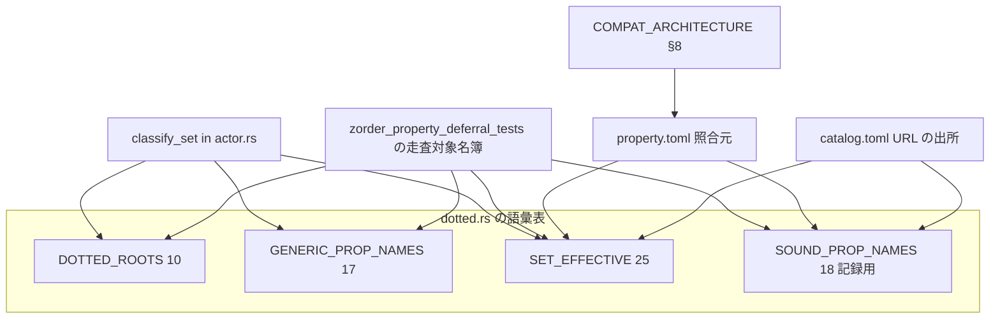

# Design Document: areka-P0-sylphya-set-ledger

> 生成 2026-09-13（`/kiro-spec-design -y`・要件ディスカッション後）。要件 1〜10 と `research.md` §1〜§9 を入力とする。
> 本書は**語彙台帳の追随だけ**を設計する。値の導出・照会経路・仕分け規則の是正は扱わない。

## Overview

**Purpose**: 統一プロパティシステム sylphya の「設定できるプロパティ名の一覧」（`SET_EFFECTIVE`）を正典（ukadoc `list_propertysystem.html`）へ追随させ、正典にありながら台帳から丸ごと欠けていたサウンドプロパティ名 18 葉を記録用の語彙表として登記する。あわせて網羅調査の台帳 `property.toml` の担当欄 2 行を埋め、互換記録 §8 に所有の相互参照を 1 行足す。

**Users**: ゴースト作者は、正典が「設定できる」と定める 4 つの名前（`seriko.sticky-window`・`pause`・`playing`・`position`）への書き込みが「設定できない名前」として黙って捨てられなくなる（本リリースでは既存 21 項と同じ「受理し、予約済みである旨を記録し、値を反映しない」応答）。互換ベースウェアの保守者は、後続 4 spec が同じ台帳を取り合わずに済み、台帳の件数が機械で判定される状態を得る。

**Impact**: 変更は `crates/areka-sylphya/src/vocab/dotted.rs` の配列 1 本の末尾追加と記録用の配列 1 本の新設、件数を固定する検査の更新、`doc/` 配下の文書 2 つ、および先送りを守る既存テストの走査対象名簿への登記に限る。実行時に見える挙動は、上記 4 つの末尾形の名前そのものへの書き込み分類（StoreWrite → RuntimeCommand・要件 1.3 が求める変化）を除き 1 件も変わらない。この唯一の変化は完了報告にも利用者から見える言葉で 1 文載せる（要件 7.2・2026-09-13 改訂）。

### Goals
- `SET_EFFECTIVE` を 21 → **25** にし、その数を 2 通りの数え方で文書化し、検査が不一致を失敗として判定する（要件 1・4）。
- サウンドプロパティ名 18 葉を、書き込みの仕分けが読まない記録用の語彙表へ族ごと登記し、件数 **18** を固定する（要件 3・4.6）。
- 本機能が登記した 19 項目すべてに正典 URL の注記を残す（要件 5）。
- `property.toml` の担当欄の空きを 2 → **0** にし、互換記録 §8 に所有の相互参照を足す（要件 6・8）。
- 先送り中の `currentghost.seriko.zorder` をどの表にも載せず、既存の決定論テストを緑のまま残す（要件 2・7）。
- 正典に根拠のない仕分けの作り 2 点を、引受先つきで記録する（要件 10）。

### Non-Goals
- 値の導出（窓・サーフェス・音の状態を実際に動かすこと）。
- `\![set,property,...]`／`\![get,property,...]` の照会経路。
- 仕分け規則（`classify_set`／`is_canonical_vocab`）の是正。`crates/areka-sylphya/src/actor.rs` には触れない。
- `.ext.拡張プロパティ名` 系 4 項目。
- sylphya の M1 縮退宣言文（`dotted.rs` 冒頭）の改訂。
- 網羅調査の報告書（`doc/ukadoc-coverage/report/*.md`）の再生成。
- steering `structure.md` の語彙表の件数記述の追随。

## Boundary Commitments

### This Spec Owns
- `crates/areka-sylphya/src/vocab/dotted.rs` の 2 配列——`SET_EFFECTIVE`（25 項）と新設の `SOUND_PROP_NAMES`（18 項・記録用）——の内容と、その件数を固定する検査。
- 同クレートの兄弟テストに置く、本機能が足した項目ごとの分類検査・件数検査・構造検査。
- `doc/ukadoc-coverage/ledger/property.toml` の 2 行（`currentghost.seriko.sticky-window`・`currentghost.seriko.zorder`）の `owner` と note の「裁定待ち」行。
- `doc/COMPAT_ARCHITECTURE.md` §8 に足す 1 行（`currentghost.seriko.zorder` の行の直後）。
- `crates/areka/src/placement/zorder_property_deferral_tests.rs` の**走査対象名簿**（`SCANNED_VOCAB_TABLES`・`vocabulary_tables()`・t_zpd11 の名簿本数と較正行）への新表 1 件の登記。

### Out of Boundary
- `currentghost.seriko.zorder` の登記（語彙台帳の行も値の導出も `areka-P0-zorder-property`）。
- `classify_set`／`is_canonical_vocab` の規則（`actor.rs`）。葉だけで正準とみなす判定と、末尾形が実書込キーと突き合わされない件は `areka-P0-property-query-channels` へ起票する（要件 10）。
- `GENERIC_PROP_NAMES`（17 項）の内容。本機能は 1 項も足さない。
- 先送りを守る判定そのもの（t_zpd10／t_zpd30／t_zpd40 の本文）。
- `doc/ukadoc-coverage/report/summary.md`・`report/property.md`（証拠件数が 2 → 21 に動くが再生成は `areka-P0-ukadoc-coverage-roadmap` へ申し送る）。
- `.kiro/steering/structure.md` の「`dotted.rs` ルート枝 10＋汎用名 17＋SET 意味論」の行（新表の記述が不足するが要件 9.1 の範囲外＝完了報告で申し送る）。
- 他 spec の brief（`areka-P0-property-catalog-lists` の「17」2 箇所は当該 spec が着手時に引き直す）。

### Allowed Dependencies
- 照合元: `doc/ukadoc-coverage/ledger/property.toml`（188 件・完了 spec `areka-P0-ukadoc-survey-property` の成果物）。
- URL の出所: `doc/ukadoc-coverage/catalog.toml` の同一 id の `url` 欄。
- 正典本文: ukadoc `list_propertysystem.html`（MCP スナップショットで再確認済み・`research.md` §9.1）。
- 既存の型: `crate::vocab::SetSemantics`（`vocab/mod.rs`）。新しい型・関数・外部依存は増やさない。
- 既存の検査の道具: `crates/ukadoc-survey`（`check`・`evidence` 副手続き・`cargo test -p ukadoc-survey`）は**読むだけ**で、そのソースには触れない。

### Revalidation Triggers
- `SOUND_PROP_NAMES` を `classify_set` が読むようになったとき（`areka-P0-property-query-channels` が仕分け規則を決める時点）——本機能の構造検査（`actor.rs` が新表を参照しない）は同 spec が意図して改訂する。
- `SET_EFFECTIVE` の件数が 25 から動くとき（`areka-P0-zorder-property` の解禁で 26 になる見込み）。
- `dotted.rs` に新しい公開 const が生えるとき（t_zpd12 が名簿への登記を要求する）。
- 正典 `list_propertysystem.html` のサウンドプロパティ名の表に 19 葉目、または ⒜印（SET 有効）の 4 つ目が現れたとき（件数 18／25 の導出が崩れる。ただし正典の増減を自動で見張る仕組みは買わない＝開発者方針 2026-09-11）。

## Architecture

### Existing Architecture Analysis

- 語彙表の読み手は `classify_set`（`crates/areka-sylphya/src/actor.rs`）**ただ 1 か所**。3 段の判定——⑴ `SET_EFFECTIVE` にキー文字列が完全一致 → `RuntimeCommand`、⑵ `parse_dotted` が成功し「根が `DOTTED_ROOTS` に属する **または** 葉が `GENERIC_PROP_NAMES` に属する」→ `NotSettable`、⑶ どちらでもない → `StoreWrite`。
- 参照側（`reader.rs`）はどの語彙表も読まない。未提供の点付きプロパティは `NotFound` へ縮退する。
- `SET_EFFECTIVE` の綴りは末尾形（先頭の親枝とセレクタを除いた形）で、規則から機械的に導けるものではない（例: `seriko.cursor.path` ← `currentghost.seriko.cursor.scope(ID).mouse????list.index(ID2).path`）。
- 先送りを守る決定論テスト（`crates/areka/src/placement/zorder_property_deferral_tests.rs`）は、⑴ `vocab/` の公開 const を**ソースから抜き出して**名簿と両方向で突き合わせ（t_zpd12）、⑵ 名簿に載る表を横断して先送りした名前を探し（t_zpd10）、⑶ `crates/areka-sylphya/src` の**全ソースの本文**から探し語 `zorder`（小文字・部分一致）を探す（t_zpd40）。
- 網羅調査の証拠抽出器（`crates/ukadoc-survey/src/evidence/extract.rs`）は、行頭が `///`・`//!`・`//` のいずれかで始まり `ukadoc:`＋空白＋URL 1 語だけの行を証拠として拾い、カタログの項目 URL と完全一致すればその項目の証拠にする。アンカーの無いページ URL の単独行は「直後のスライス定数の要素名を突き合わせる」別経路を起動する。

### Architecture Pattern & Boundary Map



**Architecture Integration**:
- Selected pattern: **配列への末尾追加＋記録専用配列の新設**。新しい型も関数も作らない。
- Domain/feature boundaries: `classify_set` が読む表（`SET_EFFECTIVE`・`DOTTED_ROOTS`・`GENERIC_PROP_NAMES`）と、読まない表（`SOUND_PROP_NAMES`）を**参照の有無**で分ける。図で `CLASSIFY → SOUND` の辺が無いことが要件 3.3／7.2 の構造上の根拠であり、兄弟テストがこの「辺の不在」を判定する。
- Existing patterns preserved: `SET_EFFECTIVE` の既存 21 項は綴り・順序・意味論とも不変（末尾追加のみ）。件数を固定する検査は既存の `assert_eq!` 形を踏襲。正典 URL 注記は既存の `ukadoc:` 形（`crates/areka/src/placement/config.rs` の配列要素直上の `// ukadoc:` と同型）。
- New components rationale: `SOUND_PROP_NAMES` は、正典がサウンドプロパティ名を汎用プロパティ名とは**別の族**として定めている（使える場所は `currentghost.sound(要素名).` と `currentghost.sound.index(ID).` の下のみ）ことをそのまま写す。`GENERIC_PROP_NAMES` へ相乗りすると葉一致の判定に参加してしまい、要件 7.2 が成立しなくなる。
- Steering compliance: 完全語彙の第一級保持（`structure.md` の `vocab/` の定義）・先送りは完全語彙＋縮退シーム＋追跡 spec（`currentghost.seriko.zorder` は `zorder-property` 側で維持）・ログ無し失敗経路なし（本機能は経路を足さない）。

### Technology Stack

| Layer | Choice / Version | Role in Feature | Notes |
|-------|------------------|-----------------|-------|
| Data / Storage | Rust `const` スライス（`&[&str]`・`&[(&str, SetSemantics)]`） | 語彙台帳の保持 | 既存と同型。新規依存なし |
| Data / Storage | TOML（`property.toml`・人手編集） | 照合元台帳の担当欄 | `cargo test -p ukadoc-survey` が構造を検査する |
| Infrastructure / Runtime | `cargo test`（`areka-sylphya`・`areka` の 2 crate） | 件数・分類・構造・先送りの決定論検査 | i686 helper 不要（sylphya と placement のテストのみ） |

## File Structure Plan

### Directory Structure
```
crates/areka-sylphya/src/
├── vocab/
│   ├── dotted.rs                       # 語彙表本体（SET_EFFECTIVE +4・SOUND_PROP_NAMES 新設・既存インラインテストの件数更新）
│   └── dotted_set_ledger_tests.rs      # 新設: 本機能の検査（件数 18・分類・構造・URL 注記）— dotted.rs から #[path] で接続
├── ledger_key_determinism_tests.rs     # 基準群 C の件数（21→25・サウンド 18 の追加）
crates/areka/src/placement/
└── zorder_property_deferral_tests.rs   # 走査対象名簿への SOUND_PROP_NAMES 登記のみ
doc/
├── ukadoc-coverage/ledger/property.toml # 2 行の owner と note
└── COMPAT_ARCHITECTURE.md              # §8 に 1 行追加
```

### Modified Files
- `crates/areka-sylphya/src/vocab/dotted.rs` — ⑴ `SET_EFFECTIVE` 末尾に 4 要素（`seriko.sticky-window` の直上に `// ukadoc:` 1 行）、⑵ `pub const SOUND_PROP_NAMES: &[&str]`（18 要素・各要素直上に `// ukadoc:` 1 行）を `SET_EFFECTIVE` の後・`EXT_EVENT_GET` の前に新設、⑶ モジュール冒頭と `SET_EFFECTIVE`／`GENERIC_PROP_NAMES` の説明文を更新（件数 25・記録用の表の存在・汎用名の表の定義の改め・要件 10 の記録）、⑷ インラインテストの 21 を 25 へ（関数名を含む 4 箇所）、⑸ 兄弟テストの接続宣言 `#[cfg(test)] #[path = "dotted_set_ledger_tests.rs"] mod set_ledger_tests;`。
- `crates/areka-sylphya/src/vocab/dotted_set_ledger_tests.rs` — **新設**。Components 節「兄弟テスト」の 7 本。
- `crates/areka-sylphya/src/ledger_key_determinism_tests.rs` — 基準群 C: `criterion_ledger_counts_exact` に `SOUND_PROP_NAMES.len() == 18` を追加、`criterion_set_effective_full_group_coverage` の説明文と `[&str; 21]` を 25 へ（4 項追加）。汎用名 17 の記述は**変えない**。
- `crates/areka/src/placement/zorder_property_deferral_tests.rs` — 走査対象名簿への登記のみ（Components 節「走査対象名簿」）。t_zpd10／t_zpd30／t_zpd40 の本文は不変。
- `doc/ukadoc-coverage/ledger/property.toml` — `currentghost.seriko.sticky-window:1` と `currentghost.seriko.zorder:1` の `owner` 記入と note 末尾の「裁定待ち: …」行の差し替え。他の行は不変（サウンド 18 行の「語彙表だけを触る spec: areka-P0-property-query-channels」も**触らない**）。
- `doc/COMPAT_ARCHITECTURE.md` — §8 の `currentghost.seriko.zorder` の行（「プロパティ `currentghost.seriko.zorder`（SSP 2.8.78・SET 有効）の読み書き」で始まる行）の**直後**に 1 行追加。既存行は不変。

> `crates/areka-sylphya/src/actor.rs`・`actor_tests.rs`・`reader.rs`・`key.rs`・`vocab/mod.rs`・`vocab/flat.rs`・`vocab/shiori_resource.rs` は**触らない**。

## Requirements Traceability

| Requirement | Summary | Components | Interfaces | Flows |
|-------------|---------|------------|------------|-------|
| 1.1 | `seriko.sticky-window` を SET 有効へ | SET_EFFECTIVE | 配列要素 `("seriko.sticky-window", RuntimeCommand)` | — |
| 1.2 | `pause`／`playing`／`position` を SET 有効へ | SET_EFFECTIVE | 配列要素 3 つ（RuntimeCommand） | — |
| 1.3 | 4 項の書込分類が RuntimeCommand | 兄弟テスト T3 | `classify_set` の完全一致（段 1） | — |
| 1.4 | 4 項の書込効果が予約のみ | 兄弟テスト T3 | `SylphyaCore::apply` → `Effect::RuntimeCommandReserved` | — |
| 1.5 | 末尾形の綴り | SET_EFFECTIVE | 「綴りの導出」節 | — |
| 1.6 | 既存 21 項の不変 | SET_EFFECTIVE・件数検査 | 末尾追加のみ・既存インラインテスト `set_effective_covers_all_named_group_members` の先頭 21 要素不変 | — |
| 2.1 | `zorder` をどの表にも載せない | SET_EFFECTIVE・SOUND_PROP_NAMES | t_zpd10（不変） | — |
| 2.2 | `zorder` の分類・参照は変更前と同一 | —（`actor.rs`・`reader.rs` 非接触） | t_zpd20／t_zpd30（不変） | — |
| 2.3 | t_zpd10／30／40 が成功 | 走査対象名簿・「探し語の禁止」 | `dotted.rs` の本文に `zorder` の綴りを書かない | — |
| 2.4 | 同ファイルへの変更は名簿・写し・較正行に限り、判定 3 本の本文を変えない | 走査対象名簿 | 「要件 2.4／9.2 との整合」節 | — |
| 2.5 | 完了 spec 要件 13.5 と互換記録の既存行を改訂しない | COMPAT §8 追加行 | 既存行の直後に 1 行追加 | — |
| 3.1 | サウンド 18 葉を正準語彙として保持 | SOUND_PROP_NAMES | 配列 18 要素 | — |
| 3.2 | 族ごと 1 表・3 葉は双方に載る | SOUND_PROP_NAMES・兄弟テスト T2 | 集合検査 | — |
| 3.3 | 仕分けが読まない記録用の表 | SOUND_PROP_NAMES・兄弟テスト T5 | `actor.rs` に参照 0 | — |
| 3.4 | 15 葉の書込は変更前と同一 | 兄弟テスト T4 | literal 期待値表（StoreWrite／NotSettable） | — |
| 3.5 | 18 葉の参照は NotFound | 兄弟テスト T4 | `SylphyaReader::resolve_dotted_str` | — |
| 3.6 | 名簿検査 t_zpd12 が成功 | 走査対象名簿 | `SCANNED_VOCAB_TABLES` 6 本 | — |
| 3.7 | 族外の既存名の書込分類 0 件変化 | 兄弟テスト T4・T5 | 構造（参照 0）＋分類の literal | — |
| 4.1 | SET 有効 25 に固定 | 件数検査 | `set_effective_has_25_entries` | — |
| 4.2 | 25 の 2 通りの導出 | 「件数の導出」節・`dotted.rs` 説明文 | — | — |
| 4.3 | 偶然の一致の注記 | `dotted.rs` 説明文（検査の側） | — | — |
| 4.4 | `.ext.*` 4 行を 26 に含めない理由 | 「件数の導出」節・`dotted.rs` 説明文 | — | — |
| 4.5 | 先取り 2 項は既知の食い違い | 「件数の導出」節・`dotted.rs` 説明文 | — | — |
| 4.6 | 記録用 18 の固定と導出（10＋8） | 兄弟テスト T1・`dotted.rs` 説明文 | `SOUND_PROP_NAMES.len() == 18`・区切りなし 10／`meta.` 8 | — |
| 4.7 | 件数の写しをすべて更新 | 「件数の写しの一覧」節 | 21 の 6 箇所→25・17 は不変 | — |
| 4.8 | 印字でなく判定 | 件数検査・兄弟テスト | すべて `assert_eq!`／`assert!` | — |
| 4.9 | 重複の検出 | 件数検査・兄弟テスト T1 | 集合サイズ＝配列長 | — |
| 4.10 | 足した各項目の分類を項目ごとに確認 | 兄弟テスト T3・T4 | literal 期待値表 22 行 | — |
| 5.1 | 19 項目に URL 注記 1 行 | URL 注記・兄弟テスト T6 | `// ukadoc: <URL>` 19 行 | — |
| 5.2 | URL はカタログ同一 id の URL | URL 注記 | 「URL 注記の一覧」節 | — |
| 5.3 | 既存と同じ書き表し方 | URL 注記 | 抽出器の 3 記号のうち配列要素位置で使える `//` | — |
| 5.4 | 既存 21 項には要求しない | URL 注記 | 19 行ちょうど（T6 が判定） | — |
| 6.1 | `zorder` 行の owner | property.toml 2 行 | `owner = "areka-P0-zorder-property"` | — |
| 6.2 | `sticky-window` 行の owner | property.toml 2 行 | `owner = "areka-P0-sylphya-set-ledger"` | — |
| 6.3 | 「裁定待ち」を所有の記述へ | property.toml 2 行 | note 末尾行の差し替え | — |
| 6.4 | 他の行は不変 | property.toml 2 行 | 差分は 2 エントリに閉じる | — |
| 6.5 | 空き 0 を示せる | property.toml 2 行 | 完了時の 1 回の実数え（数え方を明記） | — |
| 7.1 | 参照結果 0 件変化 | —（`reader.rs` 非接触） | 兄弟テスト T4（18 葉 NotFound） | — |
| 7.2 | 既存 21 項と、登記 4 名以外のあらゆる名前の書込 0 件変化 | 兄弟テスト T4・T5 | 構造＋literal（4 名の変化は 1.3 の側・Impact に開示） | — |
| 7.3 | 利用者に見える状態 0 件変化 | —（値の導出を足さない） | t_zpd50（不変） | — |
| 7.4 | 赤の切り分け | 「既存テストへの影響」節 | 赤になる箇所の事前列挙 | — |
| 7.5 | 2.3／3.6 のテストを更新側に置かない | 「既存テストへの影響」節 | t_zpd10／12／30／40 は不変（t_zpd11 は名簿の写し） | — |
| 8.1 | `zorder` の所有の参照を足す | COMPAT §8 追加行 | 4 列の表の行 | — |
| 8.2 | 既存行を書き換えずに足す | COMPAT §8 追加行 | 直後に 1 行 | — |
| 8.3 | 語彙を書き写さない | COMPAT §8 追加行 | brief への参照のみ | — |
| 8.4 | §8 の該当行の周辺に限る | COMPAT §8 追加行 | 1 行のみ | — |
| 9.1 | 編集範囲 | File Structure Plan | 5 ファイル＋新設 1 | — |
| 9.2 | 名簿への登記に限る | 走査対象名簿 | 判定本文は不変 | — |
| 9.3 | 範囲外は報告 | 「範囲外の申し送り」節 | 4 件 | — |
| 10.1 | 仕分けの欠陥 2 点の記録 | `dotted.rs` 説明文（要件 10 の記録） | — | — |
| 10.2 | 引受先の実在確認 | `dotted.rs` 説明文 | `.kiro/specs/areka-P0-property-query-channels/brief.md` 実在確認済み | — |
| 10.3 | 利用者から見える言葉を 1 つ | `dotted.rs` 説明文 | 「保存して読み戻せる」→「受理して捨てる」 | — |

## Components and Interfaces

| Component | Domain/Layer | Intent | Req Coverage | Key Dependencies (P0/P1) | Contracts |
|-----------|--------------|--------|--------------|--------------------------|-----------|
| SET_EFFECTIVE | sylphya 語彙台帳 | SET 有効群 21 → 25 | 1.1〜1.6, 2.1, 4.1〜4.5 | `SetSemantics`（P0）・`classify_set` が読む（P0・不変） | State |
| SOUND_PROP_NAMES | sylphya 語彙台帳 | サウンドプロパティ名 18 葉の記録用の表 | 2.1, 3.1〜3.3, 4.6 | `classify_set` が読まない（P0） | State |
| URL 注記 | sylphya 語彙台帳 | 19 項目の正典 URL | 5.1〜5.4 | `catalog.toml`（P0）・証拠抽出器（P1・読むだけ） | — |
| 件数検査（既存インライン） | sylphya テスト | 21 → 25 の追随 | 4.1, 4.7〜4.9 | — | — |
| 兄弟テスト T1〜T7 | sylphya テスト | 本機能の項目ごとの判定 | 1.3, 1.4, 3.2〜3.5, 3.7, 4.6, 4.8〜4.10, 5.1, 5.4, 7.1, 7.2 | `classify_set`・`SylphyaCore::apply`・`SylphyaReader`（P0・読むだけ） | — |
| 走査対象名簿 | areka placement テスト | 新表を先送りの走査範囲へ | 2.3, 2.4, 3.6, 9.2 | t_zpd12（P0） | — |
| property.toml 2 行 | 網羅調査台帳 | 担当欄の記入 | 6.1〜6.5 | `cargo test -p ukadoc-survey`（P1） | — |
| COMPAT §8 追加行 | 互換記録 | 所有の相互参照 | 2.5, 8.1〜8.4 | — | — |

### sylphya 語彙台帳（`crates/areka-sylphya/src/vocab/dotted.rs`）

#### SET_EFFECTIVE

| Field | Detail |
|-------|--------|
| Intent | 正典が SET 有効と定める名前を末尾形で保持し、`classify_set` の段 1（完全一致）に供する |
| Requirements | 1.1, 1.2, 1.5, 1.6, 2.1, 4.1, 4.2, 4.3, 4.4, 4.5 |

**Responsibilities & Constraints**
- 既存 21 要素の綴り・順序・`SetSemantics::RuntimeCommand` を変えず、末尾に次の 4 要素を**この順**で足す（グループ見出しコメント「正典追随 4 項（本 spec）」を付ける）:
  1. `("seriko.sticky-window", SetSemantics::RuntimeCommand)` — 直上に `// ukadoc: https://ssp.shillest.net/ukadoc/manual/list_propertysystem.html#currentghost.seriko.sticky-window:1`
  2. `("pause", SetSemantics::RuntimeCommand)`
  3. `("playing", SetSemantics::RuntimeCommand)`
  4. `("position", SetSemantics::RuntimeCommand)`
- 2〜4 には URL 注記を置かない（正典の項目としては 1 つなので、注記は `SOUND_PROP_NAMES` の側に 1 つ・要件 5.1）。代わりにグループ見出しコメントで「URL は `SOUND_PROP_NAMES` の同名要素に置く」と示す。
- 意味論は 4 項とも `RuntimeCommand`（既存 `set_effective_all_runtime_command` がそのまま判定する）。
- **綴りの導出（要件 1.5）**: 既存 21 項と同じく「正典の見出しから先頭の親枝とセレクタを除いた末尾の形」。`currentghost.seriko.sticky-window` → `seriko.sticky-window`（`seriko.defaultsurface` と同じ縮め方）。`pause`／`playing`／`position` は正典の見出しがそのまま末尾形。
- **本文に `zorder` の綴りを書かない**（t_zpd40 は sylphya の全ソース本文から小文字の部分一致で探す。**追跡 spec の名前 `areka-P0-zorder-property` もこの綴りを含むので書けない**）。件数の導出を説明文に書くときは「先送り中の 1 行（窓の重なり順のプロパティ。所有は互換記録 `doc/COMPAT_ARCHITECTURE.md` §8 の該当行を参照）」と言い換える。同じ制約は新設の兄弟テストにも掛かる（`dotted_set_ledger_tests.rs` の本文・失敗メッセージ・コメントに `zorder` を含む語を書かない）。

**説明文（doc コメント）に書く内容**——本 spec が要件 4.2〜4.5 の「文書に明記する」を `dotted.rs` の側で満たす箇所:
- 群構成: 基本 3＋mousecursor 10＋seriko.cursor/tooltip 4＋menu 4＋**正典追随 4**（sticky-window 1・サウンド SET 3）＝ 25。
- 照合元の側の数え方: 調査台帳 `property.toml` で「書き込み: 正典 SET有効」と記録する行は 26 行。先送り中の 1 行を除いて 25 行。`seriko.cursor.path` と `seriko.tooltip.text` はセレクタの書き方違い（当たり判定名で指す形と番号で指す形）で台帳が 2 行ずつに分かれるが語彙表では 1 項目ずつなので 23 項目。これに正典に設定の定めが無いまま areka が先取りで登記している `seriko.cursor.name`・`seriko.tooltip.name` の 2 項目を足して 25。
- 注記（要件 4.3）: 2 通りが同じ 25 に着くのは偶然の一致であり（「2 行→1 項目」で −2、「先取り」で ＋2 が相殺している）、「26 から 1 を引く」だけでは語彙表の件数の根拠にならない。
- `.ext.拡張プロパティ名` 系 4 行が 26 に入らない理由（要件 4.4）: 印は無く ext 亜枝の中継形のため（台帳の当該行の note）。担い手は `areka-P0-property-ipc-transport`。
- 先取り 2 項（要件 4.5）: 完了 spec `areka-P0-ukadoc-survey-property` の design 規則 8 突合表・区分 ⑶ が「印が無く族の頭の継承も無い＝areka の先取り」と確定している既知の食い違い。本 spec は解消しない（引受先は同 spec の完了報告のとおり未定のまま。本 spec は記録のみ）。

**Contracts**: State [x]

##### State Management
- State model: コンパイル時定数。実行時に変化しない。
- Persistence & consistency: 件数 25 は `set_effective_has_25_entries`（インライン）と `criterion_set_effective_full_group_coverage`（基準群 C）の 2 か所で判定する。
- Concurrency strategy: 不要（不変データ）。

#### SOUND_PROP_NAMES

| Field | Detail |
|-------|--------|
| Intent | 正典「サウンドプロパティ名」の族 18 葉を、書き込みの仕分けが読まない記録用の表として保持する |
| Requirements | 2.1, 3.1, 3.2, 3.3, 4.6 |

**Responsibilities & Constraints**
- 宣言: `pub const SOUND_PROP_NAMES: &[&str]`（要素 18・`&[&str]` は `DOTTED_ROOTS`／`GENERIC_PROP_NAMES` と同型）。`pub` にするのは、t_zpd12 が `vocab/` の `pub const` をソースから抜き出して名簿と突き合わせるため（私有にすると「先送りした名前が載っていない」ことを t_zpd10 が見張れない）。
- 要素と順序（各要素の直上に `// ukadoc: <URL>` 1 行）:
  - 括弧を含まない 10 葉（SSP 2.8.72）: `duration`・`error`・`id`・`loop`・`name`・`path`・`preload`・`pause`・`playing`・`position`
  - `meta.` を伴う 8 葉（SSP **2.8.73**）: `meta.album`・`meta.albumartist`・`meta.artist`・`meta.artwork`・`meta.genre`・`meta.title`・`meta.track`・`meta.year`
- 綴りは台帳 id・正典見出し・カタログ title と逐語一致させる（開発者裁定 2026-09-11・`meta.album` 形）。
- `name`・`path` は `GENERIC_PROP_NAMES` にも同じ綴りがあるが、正典は `name:2`／`path:2` として汎用名の `name:1`／`path:1` とは**別の項目**に定めている。本表はサウンド族の記録なので**引かない**（＝`GENERIC_PROP_NAMES` は 17 のまま）。
- `pause`・`playing`・`position` は `SET_EFFECTIVE` にも載る（要件 3.2）。本表からは外さない。
- **`classify_set` は本表を読まない**（要件 3.3）。`actor.rs` に本表への参照を足さないことを兄弟テスト T5 が判定する。読み手は本 spec 時点でテストだけ。
- 版番号を混ぜない: 説明文は「10 葉が 2.8.72・`meta.*` 8 葉が 2.8.73」と分けて書く。

**説明文に書く内容**（要件 4.6・10 の「記録する」箇所）:
- 件数の導出: 正典のサウンドプロパティ名の葉は 18（括弧を含まない 10＋`meta.` 8）。汎用名の表からは引かない理由（上記）。
- 要件 10 の記録（正典に根拠のない areka 固有の作り 2 点）:
  1. 葉の名前が `GENERIC_PROP_NAMES` に載っていれば根が正準でなくても正準語彙とみなす判定（`actor.rs` の正準語彙判定の第 2 項）。正典はどの葉も属する根の下でのみ定義しており、葉の名前が単独で意味を持つ定めは無い。
  2. `SET_EFFECTIVE` が末尾形で持たれているため、実際の書込キー（例 `currentghost.sound(要素名).pause`）とは一度も突き合わされない（既存 21 項すべてが同じ状態）。
  - 利用者から見える結果: 1 により、正典に無い名前（例 `myplugin.name`）への書き込みが「保存して読み戻せる」から「受理して捨てる」へ変わる。
  - 引受先: `areka-P0-property-query-channels`（`.kiro/specs/areka-P0-property-query-channels/brief.md`・実在確認 2026-09-13・`\![set,property,...]` の経路を開通させフルキーが初めて流れ込む spec）。本 spec は是正しない。

**Contracts**: State [x]

##### State Management
- State model: コンパイル時定数。
- Persistence & consistency: 件数 18 は兄弟テスト T1 と `criterion_ledger_counts_exact` の 2 か所で判定する。

#### URL 注記

| Field | Detail |
|-------|--------|
| Intent | 本機能が登記した 19 項目の定義行に正典 URL を 1 行ずつ残す |
| Requirements | 5.1, 5.2, 5.3, 5.4 |

**Responsibilities & Constraints**
- 形: 配列要素の直上に `// ukadoc: <アンカー付き項目 URL>` の**単独行**（`ukadoc:` と URL の間は空白 1 つ・URL の後に説明文を付けない）。既存の `/// ukadoc:` と同じ「記号＋`ukadoc:`＋URL 1 語」の形であり、証拠抽出器は `///`・`//!`・`//` の 3 記号を同じ規則で読む（`crates/ukadoc-survey/src/evidence/extract.rs`）。配列要素の位置では doc コメント `///` はコンパイルできないため `//` を使う（先例: `crates/areka/src/placement/config.rs` の配列要素直上の `// ukadoc:`）。
- 置き場所と本数: `SET_EFFECTIVE` に 1 行（`seriko.sticky-window`）、`SOUND_PROP_NAMES` に 18 行。計 **19 行**。既存 21 項には足さない。
- **ページ URL（アンカー無し）の単独行は置かない**。置くと証拠抽出器の第 2 段（直後のスライス定数の要素名の突き合わせ）が起動し、`SET_EFFECTIVE`／`SOUND_PROP_NAMES` の要素名が意図しない照合にかかる。
- URL の一覧（`catalog.toml` の同一 id の `url` 欄と一致・接頭辞は `https://ssp.shillest.net/ukadoc/manual/list_propertysystem.html#`）:

| 項目 | アンカー |
|---|---|
| `seriko.sticky-window` | `currentghost.seriko.sticky-window:1` |
| `duration` | `duration:1` |
| `error` | `error:1` |
| `id` | `id:1` |
| `loop` | `loop:1` |
| `name` | `name:2` |
| `path` | `path:2` |
| `preload` | `preload:1` |
| `pause` | `pause:1` |
| `playing` | `playing:1` |
| `position` | `position:1` |
| `meta.album` … `meta.year` | `meta.album:1` … `meta.year:1`（8 件・綴りどおり） |

- 影響（範囲外・報告のみ）: `doc/ukadoc-coverage/report/summary.md` の property「証拠あり」が 2 → 21 に動く。再生成は `areka-P0-ukadoc-coverage-roadmap` へ申し送る。

### sylphya テスト

#### 件数検査（既存インライン `mod tests`・`dotted.rs`）

| Field | Detail |
|-------|--------|
| Intent | 21 を固定していた記述を 25 へ追随させる |
| Requirements | 4.1, 4.7, 4.8, 4.9 |

**変更する箇所（`dotted.rs` 内・4 箇所）**
1. `set_effective_has_21_entries` の説明文「…＝ 21」→「…＋正典追随 4 = 25」
2. 関数名 `set_effective_has_21_entries` → `set_effective_has_25_entries`（命名規約は変えない＝開発者裁定 2026-09-11）
3. `assert_eq!(SET_EFFECTIVE.len(), 21)` → `25`
4. `set_effective_covers_all_named_group_members` の `let required: [&str; 21]` → `[&str; 25]`（末尾に 4 項を追加。先頭 21 要素は不変）

`set_effective_no_duplicate_keys`・`set_effective_all_runtime_command`・`menu_group_consistent_with_generic_names`・`generic_prop_names_*`（17）は**そのまま**。

#### 件数検査（基準群 C・`ledger_key_determinism_tests.rs`）

**変更する箇所（2 箇所＋1 追加）**
1. `criterion_set_effective_full_group_coverage` の説明文「全 21 項（…）」→「全 25 項（…＋正典追随 4）」
2. 同 `let required: [&str; 21]` → `[&str; 25]`（末尾に 4 項）
3. `criterion_ledger_counts_exact` に `assert_eq!(SOUND_PROP_NAMES.len(), 18, "サウンド 18");` を追加（見出しコメントに「サウンド 18」を足す）。`GENERIC_PROP_NAMES.len() == 17` は不変。

#### 兄弟テスト T1〜T7（新設 `vocab/dotted_set_ledger_tests.rs`）

| Field | Detail |
|-------|--------|
| Intent | 本機能が足した項目ごとの分類・件数・構造を literal の期待値で判定する |
| Requirements | 1.3, 1.4, 3.2, 3.3, 3.4, 3.5, 3.7, 4.6, 4.8, 4.9, 4.10, 5.1, 5.4, 7.1, 7.2 |

**接続**: `dotted.rs` 末尾に `#[cfg(test)] #[path = "dotted_set_ledger_tests.rs"] mod set_ledger_tests;`（`structure.md` の兄弟テスト規律＝ファイル名 `<stem>_<モジュール名>.rs`・宣言は `mod <モジュール名>;`。stem `dotted`・モジュール名 `set_ledger_tests`。`actor.rs` の `#[path = "actor_tests.rs"]` と同型）。テスト側は `use super::*;`（`SET_EFFECTIVE`・`SOUND_PROP_NAMES`）と `use crate::{classify_set, SetClass, SylphyaCore, SylphyaMsg, Effect, AskerId, AskerContext, SylphyaReader, SharedMirror, MirrorImage, DottedResolution};` で足りる。

**期待値は literal**: 分類の期待値を実装や表から導出せず、テストの中に文字として書く（先送りテストと同じ規律）。

| # | テスト | 判定内容 |
|---|---|---|
| T1 | `sound_prop_names_has_18_entries_10_bare_and_8_meta` | `SOUND_PROP_NAMES.len() == 18`・literal 18 要素の集合と過不足なく一致・集合サイズ＝配列長（重複 0）・`.` を含まない要素がちょうど 10・`meta.` で始まる要素がちょうど 8 |
| T2 | `sound_set_leaves_appear_in_both_tables` | `pause`／`playing`／`position` の 3 つが `SOUND_PROP_NAMES` と `SET_EFFECTIVE` の双方に載る。残り 15 は `SET_EFFECTIVE` に**載らない**（載る個数 == 3 を判定） |
| T3 | `newly_registered_set_keys_are_runtime_command_reserved` | 4 項（`seriko.sticky-window`・`pause`・`playing`・`position`）それぞれで `classify_set == RuntimeCommand` かつ `SylphyaCore::new().apply(Set{..})` の効果列が `vec![Effect::RuntimeCommandReserved{..}]` に等しい |
| T4 | `record_only_leaves_keep_their_previous_classification` | literal 期待値表: `duration`・`error`・`id`・`loop`・`preload` と `meta.*` 8 葉 → `StoreWrite`（13 件）／`name`・`path` → `NotSettable`（2 件）。実キー形 `currentghost.sound(bgm).pause`・`currentghost.sound.index(0).playing`・`currentghost.sound(bgm).meta.album` → `NotSettable`（根 `currentghost` による・3 件。**括弧の中に `.` を含む要素名は使わない**——`parse_dotted` は `.` で分割してから括弧を読むため `sound(bgm.mp3)` は解釈不能＝StoreWrite に落ちて対照にならない）。18 葉すべてと実キー形 2 つを `SylphyaReader::resolve_dotted_str` で引くと `NotFound`（対照として `currentghost.name` を 1 つ載せた鏡像で値が返ることを同居させる） |
| T5 | `classifier_source_does_not_reference_the_record_only_table` | `include_str!` で `../actor.rs` と、その兄弟テスト 3 本（`../actor_tests.rs`・`../actor_actor_integration_tests.rs`・`../actor_actor_criteria_cage.rs`。`structure.md`「構造テストは兄弟テストファイルも走査対象に列挙する」の規律）を読み、4 本すべてで `SOUND_PROP_NAMES` が **0 回**、`actor.rs` で `GENERIC_PROP_NAMES` が 1 回以上（較正）。失敗メッセージに「仕分けが読む表へ変えるなら要件 3.3／7.2 の再検討と `areka-P0-property-query-channels` の裁定が要る」と書く |
| T6 | `exactly_19_anchored_ukadoc_notes_and_no_page_url_line` | `include_str!("dotted.rs")` の行のうち、`trim_start` して `// ukadoc: ` で始まる行がちょうど **19**、うち `list_propertysystem.html#` を含む行が 19、アンカー無しのページ URL（`.html` で終わる）の行が **0** |
| T7 | `set_effective_entries_before_this_spec_are_unchanged_in_order` | 変更前の全キーを literal のスライス `before: &[&str]` に書き、`SET_EFFECTIVE[..before.len()]` のキー列が**順序込みで**一致（要件 1.6 の「順序」を既存の集合検査では見ていないため）。固定長 `[&str; 21]` も関数名の数も使わない＝件数の写しを増やさない |

**Implementation Notes**
- Integration: `SetClass` は `crate::actor::SetClass`（`lib.rs` が re-export）。`Effect::RuntimeCommandReserved { asker, key, value }` の形は既存 `actor_tests.rs`／t_zpd31 と同じ。
- Validation: 全テストが `cargo test -p areka-sylphya --lib` で走る（名前指定では `--lib` が要る＝母数 0 の緑を避ける）。
- Risks: T5・T6 はソース本文を読む構造検査であり、`actor.rs` や `dotted.rs` の改名で壊れる。それは意図した赤（改名時に名簿を直させる）。T6 の探し語 `// ukadoc: ` を兄弟テストの中で**行頭に**書かない（文字列リテラルとして `let` の右辺に置く）。行頭に置くと網羅調査の証拠抽出器がテストファイルの行まで証拠として拾う。

### areka placement テスト

#### 走査対象名簿（`crates/areka/src/placement/zorder_property_deferral_tests.rs`）

| Field | Detail |
|-------|--------|
| Intent | 新設した記録用の表を先送りの走査範囲へ入れる（t_zpd12 の指示どおり） |
| Requirements | 2.3, 2.4, 3.6, 9.2 |

**変更する箇所（名簿と、その写し・較正のみ）**
1. `use areka_sylphya::vocab::dotted::{DOTTED_ROOTS, GENERIC_PROP_NAMES, SET_EFFECTIVE};` に `SOUND_PROP_NAMES` を追加。
2. `const SCANNED_VOCAB_TABLES: [&str; 5]` → `[&str; 6]`、末尾に `"SOUND_PROP_NAMES"`。
3. `fn vocabulary_tables()` に `("vocab::dotted::SOUND_PROP_NAMES", SOUND_PROP_NAMES.to_vec())` を末尾へ追加（t_zpd12 ① が名簿と実際に読む表の一致を判定するため、名簿と対で動かす。順序も名簿と同じ末尾）。
4. t_zpd11 の `assert_eq!(tables.len(), 5, …)` → `6`、`expected_members: [(&str, &str); 5]` → `6`（末尾に `("vocab::dotted::SOUND_PROP_NAMES", "duration")` を追加＝新表も本物を運んでいることの較正）。
5. 数を書いた説明文の写し **9 箇所**をすべて更新する（要件 4.7「1 箇所だけ古いまま残る状態を作らない」）——「5 本」8 箇所（モジュール冒頭の doc・`vocabulary_tables()` の doc 4 箇所・`vocabulary_entries_containing()` の doc・t_zpd10 の doc・t_zpd11 の doc）→「6 本」、「8 本」1 箇所（`vocabulary_tables()` の doc「公開 const は現物 8 本」）→「9 本」。t_zpd10／t_zpd11 の `///` は判定の本文ではなく説明文なので要件 9.2 に触れない。実装後に `grep -n '5 本\|8 本'` が 0 件であることを確かめる。

**変えない箇所**: t_zpd10・t_zpd12・t_zpd20・t_zpd21・t_zpd30・t_zpd31・t_zpd40・t_zpd50 の本文、`NON_PROPERTY_VOCAB_CONSTS`、探し語 `DEFERRED_NEEDLE`。

**要件 2.4／9.2 との整合**: 要件 2.4 と 9.2 が「変更しない」と定めるのは**先送りを守る判定そのもの 3 本（t_zpd10／t_zpd30／t_zpd40）の中身**（要件 2.4 の文言は 2026-09-13 の設計ディスカッションで 9.2 に揃えた＝同ファイルへの変更を名簿・写し・較正行に限る）。上記 1〜5 はすべて「走査対象名簿」とその写し（t_zpd11 の本数と較正行は名簿の側の記述であって判定ではない）。t_zpd11 の `5` は要件 7.4 の「台帳が古い前提を固定していた」側（要件 7.5 が更新側に置くなと定める 2.3／3.6 のテストは t_zpd10／30／40 と t_zpd12 であり、t_zpd11 はどちらにも当たらない）。

### 網羅調査台帳

#### property.toml 2 行（`doc/ukadoc-coverage/ledger/property.toml`）

| Field | Detail |
|-------|--------|
| Intent | 担当欄の空き 2 行を埋め、「裁定待ち」を所有の記述へ |
| Requirements | 6.1, 6.2, 6.3, 6.4, 6.5 |

**変更内容**（CRLF 保持・`status`／`introduced`／`priority`／`values`／`links`・note の他の行は不変）
- `[entry."ukadoc:list_propertysystem:currentghost.seriko.sticky-window:1"]`
  - `owner = ""` → `owner = "areka-P0-sylphya-set-ledger"`
  - note 末尾の「裁定待ち: areka-P0-currentghost-property-tree が …争点は値の導出の担い手と、語彙表の 1 行の持ち主。」→「所有: 語彙表の 1 行は areka-P0-sylphya-set-ledger（SET 有効群へ登記済み）。値の導出は areka-P0-currentghost-property-tree（seriko.* の一括所有・zorder を除く）。」
- `[entry."ukadoc:list_propertysystem:currentghost.seriko.zorder:1"]`
  - `owner = ""` → `owner = "areka-P0-zorder-property"`
  - note 末尾の「裁定待ち: areka-P0-zorder-property が …語彙表の 1 行の持ち主。」→「所有: 語彙表の行も値の導出もともに areka-P0-zorder-property（開発者裁定 2026-09-13・先送り維持＝sylphya の語彙表へ名前だけの先行登記もしない）。」
  - 「転記元: doc/COMPAT_ARCHITECTURE.md:207」の行は不変。
- `status = "vocabulary-only"`（sticky-window）は変えない。本 spec 後もこの行は「語彙表に載るが値は導出されない」であり、記述として正しい。
- サウンド 18 行の「語彙表だけを触る spec: areka-P0-property-query-channels」は**要件 6.4 のとおり触らない**。指し先の古さは COMPAT §8 の追加行で記録の上から上書きする（下記）。

**要件 6.5 の数え方**（完了報告に書く・新しい検査は作らない＝開発者裁定 2026-09-11）: `grep -c '^owner = ""\r\?$' doc/ukadoc-coverage/ledger/property.toml`（Git Bash。台帳は CRLF なので `\r` を許容する形で書く——`$` が `\r` の前で当たらない道具では母数 0 の恒真になる）が変更前 2・変更後 0。対照として `grep -c '^owner = "areka-P0-' …` が 180 行以上を拾うこと（母数 0 の恒真を避ける）。恒久的な見張りの置き場所は `crates/ukadoc-survey/src/check/`＝`areka-P0-ukadoc-coverage-roadmap` へ申し送る。

**Validation**: 台帳を触ったら `cargo test -p ukadoc-survey` を走らせる（`doc/ukadoc-coverage/README.md` の規律）。`owner` の中身は検査対象外なので赤にはならないが、TOML の構造崩れは拾う。

### 互換記録

#### COMPAT §8 追加行（`doc/COMPAT_ARCHITECTURE.md`）

| Field | Detail |
|-------|--------|
| Intent | `currentghost.seriko.zorder` の所有を一意に読めるようにし、サウンド 18 葉の語彙表の担当を記録の上で確定する |
| Requirements | 2.5, 8.1, 8.2, 8.3, 8.4 |

**変更内容**（CRLF 保持・4 列の体裁を踏襲・既存行は 1 文字も変えない）
- 置き場所: 「| プロパティ `currentghost.seriko.zorder`（SSP 2.8.78・SET 有効）の読み書き |」で始まる行の**直後**に 1 行。
- 列の内容:
  - 項目: **【所有の相互参照】`currentghost.seriko.zorder` の語彙台帳の行と値の導出／`currentghost.seriko.sticky-window` の語彙台帳の行／サウンドプロパティ名 18 葉の語彙表**
  - 裁量: `currentghost.seriko.zorder` は**語彙台帳の行も値の導出もともに追跡 spec `areka-P0-zorder-property` が持つ**（直上の行の先送りを維持・sylphya の語彙表へは載せない）。`currentghost.seriko.sticky-window` の語彙台帳の行（`SET_EFFECTIVE` の `seriko.sticky-window`）とサウンドプロパティ名 18 葉の記録用の語彙表（`SOUND_PROP_NAMES`・書き込みの仕分けは読まない）は `areka-P0-sylphya-set-ledger` が持つ。調査台帳 `doc/ukadoc-coverage/ledger/property.toml` のサウンド 18 行の note が「語彙表だけを触る spec: areka-P0-property-query-channels」と記すのは分割前の指し先であり、**本行が上書きする**。語彙そのものは書き写さない（`zorder` の語彙は直上の行の参照先に従い本行では繰り返さない。サウンド 18 葉の綴りと URL は `crates/areka-sylphya/src/vocab/dotted.rs` の `SOUND_PROP_NAMES`）。
  - 根拠: 三重所有（`zorder-property`／`currentghost-property-tree`／`property-query-channels` → 分割後は `sylphya-set-ledger`）の解消。開発者裁定 2026-09-13（`.kiro/steering/roadmap.md`「棚卸⑬の仮裁定」1 の改訂＝SET 有効群は 21→25、26 ではない）。
  - 出典 spec: areka-P0-sylphya-set-ledger（要件 2.5／6.1／8.1〜8.4）
- 先例: §8 は既にアーカイブ済み文書の誤記を「【訂正】」「【上書き】」の行で上書きしている（同節の `seriko.zorder` descript キーの訂正行・`\_l` の上書き行）。

## 件数の導出（要件 4.2〜4.6 の設計上の確定）

### SET 有効群 25（2 通り）

| 数え方 | 計算 | 結果 |
|---|---|---|
| 登記の側 | 既存 21 ＋ 本機能の 4（`seriko.sticky-window`・`pause`・`playing`・`position`） | **25** |
| 照合元の側 | 台帳で「書き込み: 正典 SET有効」の行 26（実測 2026-09-13・`grep -c` 一致）− 先送り 1（`currentghost.seriko.zorder`）＝ 25 行 → `seriko.cursor.path`／`seriko.tooltip.text` は台帳 2 行→語彙表 1 項目ずつで −2 ＝ 23 項目 ＋ 先取り 2（`seriko.cursor.name`・`seriko.tooltip.name`）＝ 25 | **25** |

- 注記（要件 4.3）: −2 と ＋2 が相殺しているだけで、2 通りが一致するのは偶然。「26 − 1」は根拠にならない。
- `.ext.*` 4 行（要件 4.4）: 台帳の note「印は無い・ext 亜枝の中継形のため 26 件には数えない」。担い手 `areka-P0-property-ipc-transport`。
- 先取り 2 項（要件 4.5）: 出典＝完了 spec `areka-P0-ukadoc-survey-property` の `design.md` 規則 8 突合表・区分 ⑶（「印が無く、族の頭の継承も無い＝areka の先取り」・2026-09-05 訂正込み）。本 spec は解消しない。
- 正典本文の再確認（`research.md` §9.1）: サウンドプロパティ名 18 葉のうち `[SET有効]` の記述を持つのは `pause`・`playing`・`position` の **3 葉ちょうど**（残り 15 葉には記述なし・`sticky-window` にはあり）。4 葉目は無い＝25 は崩れない。

### 記録用 18

- 正典「サウンドプロパティ名」の葉 18 ＝ 括弧を含まない 10（2.8.72）＋ `meta.` 8（2.8.73）。台帳 `property.toml` の独立行 18 と一致（`duration`・`error`・`id`・`loop`・`meta.*` 8・`name:2`・`path:2`・`pause`・`playing`・`position`・`preload`）。
- `GENERIC_PROP_NAMES` は 17 のまま（`name`・`path` は正典で別項目）。

### 件数の写しの一覧（要件 4.7）

| 数 | 場所 | 変更 |
|---|---|---|
| 21 | `dotted.rs` 説明文（`set_effective_has_21_entries` の doc） | → 25 |
| 21 | `dotted.rs` 関数名 `set_effective_has_21_entries` | → `set_effective_has_25_entries` |
| 21 | `dotted.rs` `assert_eq!(SET_EFFECTIVE.len(), 21)` | → 25 |
| 21 | `dotted.rs` `let required: [&str; 21]` | → 25 |
| 21 | `ledger_key_determinism_tests.rs` 説明文「全 21 項」 | → 25 |
| 21 | `ledger_key_determinism_tests.rs` `let required: [&str; 21]` | → 25 |
| 21 | `dotted.rs` `SET_EFFECTIVE` の doc「件数 21」 | → 25 |
| 17 | 上記 2 ファイルの 8 箇所・`structure.md`・他 spec brief | **不変** |
| 5／8 | `zorder_property_deferral_tests.rs` の名簿本数と公開 const 本数（t_zpd11 の literal 2 箇所・doc コメント「5 本」8 箇所・「8 本」1 箇所） | → 6／9（計 11 箇所） |
| 18 | 新設（T1・基準群 C） | 新規 |

`SET_EFFECTIVE` の doc 冒頭「件数 21」も写しに数える（要件 4.7 の実測 6 箇所に加えて 1 箇所・計 7 箇所）。実装時の全数確認は**現在の件数を表す形**に絞る: `grep -nE 'len\(\), 21|; 21\]|has_21_|件数 21|全 21 項' crates/areka-sylphya/src/vocab/dotted.rs crates/areka-sylphya/src/ledger_key_determinism_tests.rs` が 0 件、かつ較正として同じ探し語の `25` 版が 5 件以上。「既存 21 ＋ 4 = 25」のような**過去の数を語る記述**と T7 の `[..before.len()]` は写しではないので残す（素の `grep '21'` は設計自身が書く「既存 21」で必ず赤になるため使わない）。

## 既存テストへの影響（要件 7.4／7.5 の切り分け・事前列挙）

| テスト | 変更後の状態 | 分類 |
|---|---|---|
| `dotted.rs` `set_effective_has_21_entries`・`set_effective_covers_all_named_group_members` | 赤（21 固定） | 台帳が古い前提を固定していた → 更新 |
| `ledger_key_determinism_tests.rs` `criterion_set_effective_full_group_coverage` | 赤（21 固定） | 同上 → 更新 |
| `zorder_property_deferral_tests.rs` t_zpd12 | 赤（新しい公開 const が名簿に無い） | 台帳が古い前提（名簿）を固定していた → 名簿へ登記（要件 3.6 の指示どおり） |
| 同 t_zpd11 | 赤（名簿本数 5 固定） | 名簿の写し → 6 へ（要件 7.5 の対象外） |
| 同 t_zpd10／t_zpd20／t_zpd21／t_zpd30／t_zpd31／t_zpd40／t_zpd50 | 緑のまま | **本文不変**。ここが赤なら本機能の側が誤り（要件 7.5） |
| `actor_tests.rs` の `classify_set_*` 5 本 | 緑のまま（渡しているキーはどれも本機能の 4 項に当たらない） | — |
| `dotted.rs` `generic_prop_names_*` 3 本・`menu_group_consistent_with_generic_names` | 緑のまま | — |

t_zpd40 が赤になる唯一の経路は、本機能が `crates/areka-sylphya/src` のどこかに `zorder` の綴り（大文字小文字を問わず）を書くこと。`dotted.rs` の説明文・新設テスト・URL 注記のいずれにも書かない。

## 範囲外の申し送り（要件 9.3・完了報告に載せる 4 件）

1. `doc/ukadoc-coverage/report/summary.md`・`report/property.md` — property の「証拠あり」2 → 21。再生成（`cargo run -p ukadoc-survey -- report` / `report-summary`）は `areka-P0-ukadoc-coverage-roadmap` へ。
2. `.kiro/steering/structure.md` の「`dotted.rs` ルート枝 10＋汎用名 17＋SET 意味論」— 記録用のサウンド 18 の記述が不足（数そのものは古びない）。steering の追随は `/kiro-steering` の巡回で。
3. `doc/ukadoc-coverage/ledger/property.toml` のサウンド 18 行の「語彙表だけを触る spec: areka-P0-property-query-channels」— 要件 6.4 により触らず、COMPAT §8 の追加行が記録の上で上書き。
4. 担当欄の空き 0 を**判定する**検査の恒久的な置き場所は `crates/ukadoc-survey/src/check/`（`areka-P0-ukadoc-coverage-roadmap`）。本 spec は 1 回の実数えで示す。

## Error Handling

本機能は実行時の経路を 1 本も足さない（配列への追加と文書のみ）。誤りはすべてコンパイル時定数の検査（`cargo test`）で赤として現れる。
- 件数の不一致・重複・順序の崩れ → `assert_eq!` の失敗メッセージに「どの表の何が」を含める（既存の書き方どおり）。
- `actor.rs` が新表を読み始めた → T5 が失敗し、引受先（`areka-P0-property-query-channels`）と再検討すべき要件（3.3／7.2）を指す。
- URL の綴り違い → `cargo run -p ukadoc-survey -- check` の `SourceUrlNotInCatalog` が赤にする（カタログとの完全一致のみ受理）。

## Testing Strategy

### Unit Tests（`cargo test -p areka-sylphya --lib`）
1. 件数: `set_effective_has_25_entries`・`criterion_ledger_counts_exact`（18 追加）・T1（18・10＋8・重複 0）。
2. 網羅と順序: `set_effective_covers_all_named_group_members`（25・過不足なし）・T7（先頭 21 の順序）。
3. 分類（要件 4.10・項目ごと・literal）: T3（4 項 → RuntimeCommand ＋ 効果 `RuntimeCommandReserved`）・T4（15 葉 → StoreWrite 13／NotSettable 2・実キー形 3 → NotSettable・参照 NotFound）。
4. 構造: T5（`actor.rs` の参照 0・較正 1 以上）・T6（URL 注記 19・ページ URL 0）・T2（3 葉は双方・15 葉は片方）。

### Integration Tests（`cargo test -p areka --lib placement::zorder_property_deferral_tests`）
1. t_zpd10／t_zpd30／t_zpd40 が緑（要件 2.3・本文不変）。
2. t_zpd12 が緑（名簿 6 本・除外 3 本・公開 const 9 本がどちらかにちょうど 1 回）。
3. t_zpd11 が緑（新表が空でなく `duration` を運ぶ）。

### 台帳・文書の検査
1. `cargo test -p ukadoc-survey`（README の規律）。
2. `cargo run -p ukadoc-survey -- check` を実装後に 1 回（`SourceUrlNotInCatalog` 0 件を確かめる）。
3. `cargo run -p ukadoc-survey -- evidence` を実装の**前後**で 1 回ずつ走らせ、property の証拠件数 2 → 21 を完了報告に記録する（報告書は再生成しない）。
4. `grep -c '^owner = ""\r\?$' doc/ukadoc-coverage/ledger/property.toml` ＝ 0（Git Bash・対照 `^owner = "areka-P0-` ≥ 180）。
5. `git diff --stat` が File Structure Plan の 6 ファイルに閉じている（要件 9.1）。`git diff doc/COMPAT_ARCHITECTURE.md` が追加 1 行のみ（要件 8.2）。`git diff doc/ukadoc-coverage/ledger/property.toml` が 2 エントリ・各 2 行の置換に閉じている（要件 6.4）。

### 実機
不要。実行時の経路を足さない（要件 7.3 は t_zpd50 の不変と「値の導出を足さない」構造で担保）。

## Performance & Scalability

- `dotted.rs` の行数見込み: 現在 289 行 → 本機能後およそ **360 行**（SET 4＋URL 1＋新表 18＋URL 18＋説明文およそ 25＋接続 3）。兄弟テストは別ファイル（およそ 150 行）。後続 `areka-P0-currentghost-property-tree`（W15・縮退宣言文の改訂＝数行）と `areka-P0-property-catalog-lists`（W16・リスト系の名前の追加＝多く見ても 100 行）を合わせても 500 行台に収まり、1,000 行の見張りには当たらない。分割は不要。

## Supporting References

- 正典 URL の一覧: 本書「URL 注記」節（`catalog.toml` `:623`・`:640-689` の `url` 欄と一致）。
- 要件ディスカッションの裁定と前提の訂正: `research.md` §8.1〜§8.5。
- 設計フェーズの調査結果（正典の再確認・版番号・行数・検査の実走時期・先取りの出典）: `research.md` §9。
