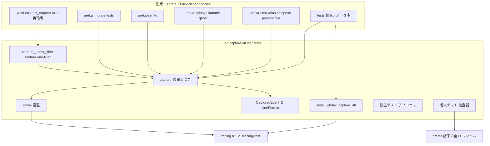
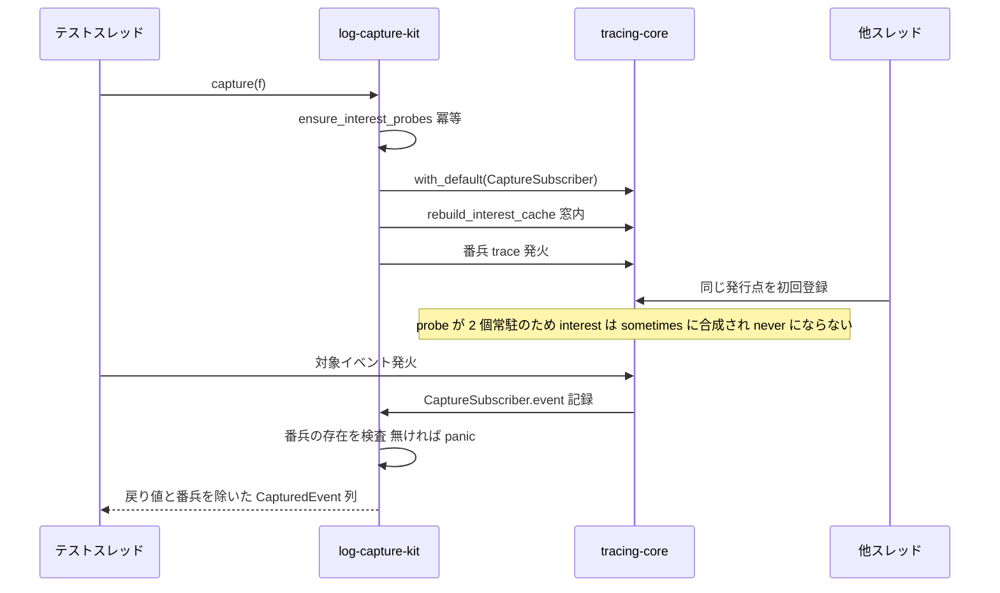
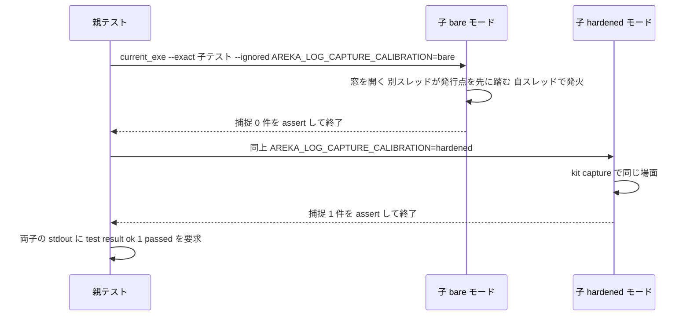
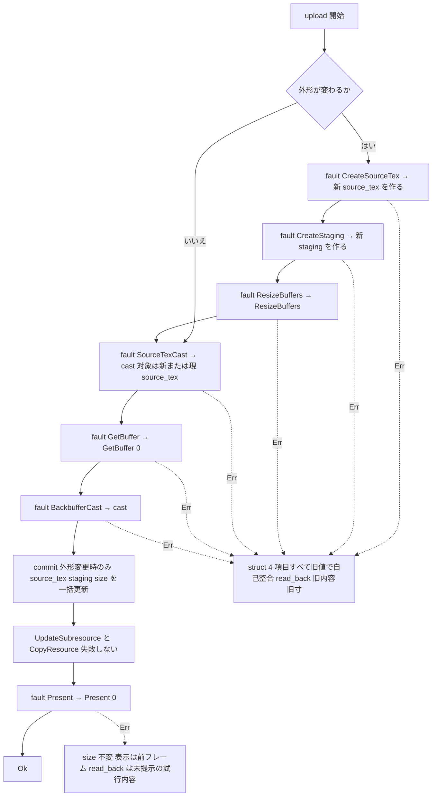
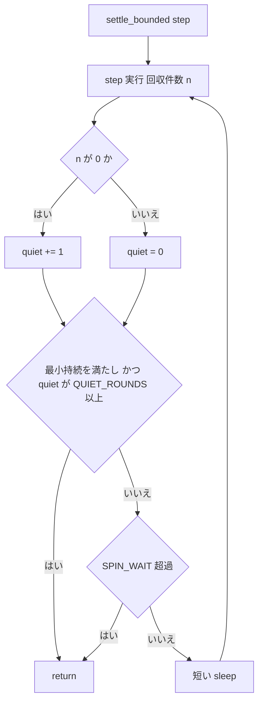

# Technical Design: areka-P0-test-cage-determinism

> **対象ツリー**: HEAD `6ca62a40`（コードは `origin/main f6b81078` と byte 一致）。本文書の file:line はすべて設計生成時（2026-08-22）に現行ツリーで再検証した値である。着手時には要件 2.1／4.1 に従い全面再計測して更新する。
> **前提（実装の開始条件）**: 本仕様の実装は、開発者が別セッションで回す改善ループの成果が `main` へマージされた**後**に開始する（2026-08-22 要件ディスカッションの取り決め・要件 Adjacent expectations）。文書（要件・設計・タスク）はこれに先行してよい。着手時の再計測でマージ後の実形（とくにログ捕捉ヘルパの増減・`chain.rs`／`spine*.rs` の行ずれ）を取り込む。
> **再開しない裁定**: 要件 10（1,000 行番人は採用・見張りだけ・既存 11 ファイルは分割しない）／要件 5.7・5.8（`upload` の前状態保持が破れていれば `chain.rs` の内側で是正・外へ波及するなら別途起票）／`crates/wintf/src/ecs/window/command.rs` は `draw-load-parity` 所有で非接触（要件 7）。

## Overview

**Purpose**: ワークスペースの完了ゲート `cargo test --workspace` の信号が「緑は検証が行われたこと・赤は本番の欠陥」を意味するように、テストが本番挙動と無関係に嘘をつき得る 4 系統（① ログ捕捉のテスト間汚染・② 反復回数固定の待機・③ 硬化設計の併存・④ 表示更新失敗経路の未検証）を 1 本で是正する。あわせて再発防止（共有機構を迂回する捕捉の検知・1 ファイル 1,000 行の番人）と、並走 spec からの申し送り（錠の退役・語彙不変条件）を引き受ける。

**Users**: ワークスペースのテストを書く／保守する開発者（後続 spec `balloon-offset-dpi`・`present-write-coherence`・`emo2-conformance-e2e` を含む）と、完了を承認する開発者。

**Impact**: テスト専用コードの統合が主体である。本番コードへの接触は `crates/areka-emo-present/src/chain.rs`（`upload` の失敗注入点と状態更新順序）**のみ**。新規 leaf crate `log-capture-kit` を追加し、10 crate の `Cargo.toml` に dev-dependency を 1 行ずつ足す。

### Goals
- ログ捕捉の硬化機構の定義箇所をワークスペースで 1 箇所（`log-capture-kit`）にし、`wintf`・bin crate `areka`・`areka-*`・統合テスト（`tests/`）のすべてから同じ形で引けるようにする（要件 1）。
- 未硬化 24 ファイル（2026-08-22 時点）を共有機構へ移行し、誤った説明文と不採用方式の実装コピーを 0 件にする（要件 2・1.5）。
- 捕捉テストが「静かに緑」にも「確率的に赤」にもならないことを、機構の自己テスト（較正を含む）と反復実行の証跡で示す（要件 3・9）。
- 反復回数固定の settle 2 箇所を壁時計と観測量で有界化する（要件 4）。
- `upload` 失敗時の「表示は前状態を保つ」を実行テストで証明し、破れていれば `chain.rs` の内側で是正する（要件 5）。
- 共有機構の迂回と 1,000 行超の新規発生を実行テストで検知する（要件 8・10）。
- 既存テストの判定内容を 1 件も変えない（要件 6）。

### Non-Goals
- 本番の挙動変更（④ の注入点と `chain.rs` 内で閉じる状態更新順序の是正を除く）。`presenter/show.rs`・`presenter/target.rs`・`crates/wintf/src/ecs/window/command.rs` は非接触。
- 既存テストの assert・期待値・本数の変更。観測が正しくなって落ちるテストは欠陥候補として起票する（要件 6.2）。
- 既存の 1,000 行超 11 ファイルの分割・縮小（番人の例外表に載せるのみ・要件 10.4）。
- `spine` 系テストの削除・`areka-ghost` 側の待機・`dpi-transition-atomicity` の実機未達 µs 2 系統・`presenter/show.rs` の可視化の段（いずれも他 spec 所有）。
- 新規外部依存の追加（`tracing`／`tracing-subscriber` は既出・要件 1.4）。
- 再表示時に `ReassertZOrder` を挿す本番配線（`emo2-conformance-e2e` へ申し送り・要件 11.4）。

## Boundary Commitments

### This Spec Owns
- 新規 crate `crates/log-capture-kit/`（ログ捕捉の硬化機構・正準イベント型・行整形・全スレッド捕捉 API・較正テスト・ワークスペース走査の番人テスト 3 種）。crate 名は 2026-08-22 設計ディスカッション 議題 1 で **`log-capture-kit` に確定**（`areka-` を冠さない・接頭辞なしの基盤 crate `dola`／`wintf` と同列）。
- 上記への移行に伴う各 crate の**テスト専用コード**（捕捉ヘルパの本体削除・アダプタ化・説明文の是正）と各 crate `Cargo.toml` の `[dev-dependencies]` 1 行。
- `crates/areka/src/emo2_boot/spine.rs` の settle ヘルパ 1 本と、その適用先 2 ファイル（`spine_display_tests.rs`・`spine_seriko_loop_tests.rs`）。
- `crates/areka-emo-present/src/chain.rs` の `upload` 失敗注入点（`#[cfg(test)]`）と状態更新順序（prepare → commit）、および新設テスト `chain_fault_tests.rs`・`chain_test_support.rs`・`presenter_upload_failure_tests.rs`。
- 錠 `lock_self_initiated_for_test()` の**呼出**の退役（`draw-load-parity` 着地後の条件付き）。
- 検証の反復スクリプトとログ（`.kiro/specs/areka-P0-test-cage-determinism/verification/`）、本仕様の申し送り台帳（requirements.md への登記）。

### Out of Boundary
- `presenter/show.rs`（観測点 :305-310 を含め一切動かさない・`present-write-coherence` が可視化の段を所有）・`presenter/target.rs`・`mount.rs`。
- `crates/wintf/src/ecs/window/command.rs`（`draw-load-parity` 所有。錠の**定義**削除と `SELF_INITIATED_DEPTH` の `Cell<i32>` 化は dlp）。
- 既存 11 ファイルの分割、`spine` 系テストの削除、e2e（実窓）での隣接確認、実機 GPU 失敗の再現。
- 改善ループ（開発者別セッション）が触れる範囲——着手時の再計測で突合するだけで、本仕様は取り込み後の実形に合わせる。

### Allowed Dependencies
- `log-capture-kit` → `tracing`（必須）、`tracing-subscriber`（feature `env-filter` のときのみ・`wintf` 用）。ワークスペース内 crate への依存は**ゼロ**（leaf）。
- 消費 10 crate（`areka`・`wintf`・`areka-seriko`・`areka-kanade`・`areka-sylphya`・`areka-ghost`・`areka-emo-atlas`・`areka-emo-compose`・`areka-emo-present`・`areka-emo-text`）→ `log-capture-kit` は **`[dev-dependencies]` のみ**。`[dependencies]` に現れたら番人テストが赤（依存方向の規律・要件 1.3／11.5）。
- `wintf` の `[dev-dependencies]` に `areka-*` 名の crate は増やさない（`log-capture-kit` は `areka-` を冠さない）。
- ④ は `wintf::ecs::GraphicsCore`（実 D3D デバイス・`D3D_DRIVER_TYPE_HARDWARE`）と `Compositor` を既存 `chain.rs` テストと同じ前提で使う（要件 5.4＝既存 headless 条件）。

### Revalidation Triggers
- `log-capture-kit` の公開 API（`capture`／`capture_lines`／`LineFormat`／`CapturedEvent`／`capture_under_filter`／`install_global_capture_all`）の署名・戻り値の意味が変わる → 消費 10 crate のアダプタと後続 spec（`balloon-offset-dpi` 等）の再確認。
- 番人テストの例外表（`with_default` 直接呼出・1,000 行超・`install_global_capture_all` 利用ファイル）への項目追加は明示編集＝編集した spec が理由を書く。
- `chain.rs` の `upload` の失敗点が増減する → `UploadFault` の値と分類表を更新し `chain_fault_tests.rs` を追随。
- ~~`draw-load-parity` が `SELF_INITIATED_DEPTH` のスレッド局所化を着地させる／見送る → 要件 7.2／7.3 の分岐。~~ **2026-08-23 に着地で解決（分岐⒝）**。
- 共有の起床旗（`tick_wake`）に触るテストを新設する必要が生じる → 要件 11.7／11.8 の制約（唯一の錠・不在主張は注入口で）を再確認する。
- `spine.rs` の待機定数（`SPIN_WAIT`・`BACKOFF_SLEEP`）の変更 → settle ヘルパの最小持続との整合を再確認。

## Architecture

### Existing Architecture Analysis
- **ログ捕捉の硬化方式が 3 系統**: probe 方式（probe dispatcher 2 個を `OnceLock` で常駐＋捕捉窓内 `rebuild_interest_cache()`）が 8 コピー（`areka/src/placement/test_support.rs:153-180`・`wintf/src/ecs/test_support.rs:64-115`・`areka-seriko/src/log_interest_probe.rs:67`・`areka-emo-atlas/src/log_capture.rs`・`areka-emo-compose/src/log_capture.rs`・`areka-emo-present/src/balloon_test_support.rs:153-181`・`scale_tests.rs:398-412`・`areka-emo-text/tests/attach_wiring_test.rs:321-344`）、keeper 方式（素の `registry()` を `set_global_default`）が 3 コピー（`areka-sylphya/src/test_log_capture.rs:109-136`・`areka-kanade/src/schedule/log_capture.rs:156-184`・`areka-ghost/src/test_log_capture.rs:115-131`）、一回限りの全スレッド capture-all が 2 コピー（`areka-ghost/tests/ghost/spine_e2e_test_global_log_probe.rs:75-93`・`areka-seriko/tests/loop_integration.rs:590-608`）。未硬化の直書き／ヘルパは 24 ファイル（requirements.md Introduction の表・設計時に `with_default(` 40 ファイルのうち硬化の印を持つ 16 ファイルを除いて再確認）。
- **機序差が正典を決める**: keeper は `Registry::enabled` が無条件 `true` のため同一バイナリで `tracing::enabled!` が全スレッド真になり、「既定 OFF なら組立も確保もしない」契約と衝突する。probe 方式は `enabled!` を偽のまま保つ。
  - 契約を持つ判定式は **3 箇所**（2026-08-23 の `main` 取り込み後に再計測。`draw-load-parity` が 2 箇所を新設した）: `wintf/src/ecs/window/transition_diag.rs:623`（遷移観測）・`wintf/src/ecs/world/tick_diag.rs:92`（相別観測・新設）・`areka/src/perf_thread_report.rs:75`（スレッド別 CPU 報告・新設）。
  - その消費点（判定が真になると組立・確保が走る側）は `areka/src/placement/dpi_sync.rs:279`・`areka-emo-present/src/presenter/show.rs:347`（いずれも `transition_diag::is_enabled()` 経由）。
  - **この増加は正典の判断を変えず、むしろ補強する**（keeper を選ぶと壊れる契約が 1 系統から 3 系統へ増えた）。
- **依存グラフ**: `wintf` のワークスペース内依存は `dola` のみ（`crates/wintf/Cargo.toml`）。`areka-seriko`／`-kanade`／`-sylphya`／`-ghost`／`-emo-atlas`／`-emo-compose` は `wintf` 非依存。bin crate `areka` は `src/lib.rs` を持たず `[[bin]]` のみ（in-crate テスト必須）。統合テストから lib 内 `#[cfg(test)]` は不可視。→ 既存のどの crate に置いても全消費者から引けない。
- **テスト配置の規約**（`structure.md`）: 新規テストは本番ファイルに書かず兄弟ファイル `<stem>_<モジュール名>.rs` へ置き `#[cfg(test)] #[path] mod` で接続、テーマ間共有ヘルパは `<stem>_test_support.rs`。`chain.rs` には歴史的形式の in-file `mod tests`（:297）が残る。
- **待機の先例**: `spine.rs:329-375`（`SPIN_WAIT` 30s・`SPIN_YIELD_BUDGET`・`BACKOFF_SLEEP` 1ms・`spin_wait_until`）と deadline＋200µs poll の先例（`spine_display_tests.rs:28-40`・`spine_seriko_loop_tests.rs:54-66`）。

### Architecture Pattern & Boundary Map



**Architecture Integration**:
- **Selected pattern**: テスト支援の leaf crate（dev-dependency 配布）＋ crate ごとの薄いアダプタ。硬化機構（probe・`with_default`・`set_global_default`）は kit の内側にだけ存在し、アダプタは整形と crate 固有の派生（`event`／`outcome` 取り出し・`assert_logged*`・件数）だけを持つ。
- **Dependency direction（強制）**: `tracing` → `log-capture-kit` → （dev-deps）各 crate のテストコード。逆方向・`[dependencies]` 経由・kit からワークスペース内 crate への依存はいずれも違反で、番人テストが検知する。
- **Domain boundaries**: ①③（kit と移行）／②（`spine.rs` 近傍）／④（`chain.rs` 近傍）／⑦（wintf のテストファイル 4 本）／⑧⑩（kit の `tests/`）は互いにファイルを共有せず、並行実装できる。
- **Existing patterns preserved**: probe 原典の機序と説明文（`placement/test_support.rs:6-52`）を kit の module doc へ移す。`capture_under_filter` の EnvFilter 濾過（wintf 96 呼出）・`FrameHarness`（`frame_test_support.rs`）・`transition_record_tests.rs` の本文走査は作り直さない（要件 11.3・5.6）。
- **Steering compliance**: `tech.md`「subscriber 初期化はアプリ層」（kit はテスト専用 dev-dep・本番ビルドに入らない）。`structure.md` のテスト分離規約。`logging.md` の log-first（④ の注入失敗も `error!` を経る）。本番 env 変数の `AREKA_` 冠（較正の環境変数 `AREKA_LOG_CAPTURE_CALIBRATION`）。

### Technology Stack

| Layer | Choice / Version | Role in Feature | Notes |
|-------|------------------|-----------------|-------|
| Test infrastructure | `tracing` 0.1.44／`tracing-core` 0.1.36（`Cargo.lock`） | probe dispatcher・捕捉 subscriber・`rebuild_interest_cache` | kit の必須依存。新規依存なし |
| Test infrastructure | `tracing-subscriber` 0.3.23（`env-filter`） | `capture_under_filter` の EnvFilter 濾過（wintf） | kit の feature `env-filter` のみ。既出依存 |
| Test infrastructure | Rust 2024 `std::process::Command`・`std::env::current_exe` | 較正テストの子プロセス起動 | 追加依存なし |
| Graphics（④ テスト） | D3D11／DXGI／WUC（`wintf::ecs::GraphicsCore`・`Compositor`） | 実デバイスで `upload` を駆動し失敗を注入 | 既存 `chain.rs` テストと同一前提（HARDWARE・窓無し） |
| Verification | PowerShell 7 | 反復実行・ログ保存（i686 前提成果物のビルド後） | `workspace-test-needs-i686-host32-artifacts` |

## File Structure Plan

### Directory Structure（新規）
```
crates/log-capture-kit/
├── Cargo.toml                      # name = "log-capture-kit", publish = false, deps: tracing; [features] env-filter = ["dep:tracing-subscriber"]
├── src/
│   ├── lib.rs                      # module doc = 利用手順（どこから引くか・不在主張の書き方・全スレッド捕捉の両立条件）＝要件 11.6。pub use の窓口
│   ├── probe.rs                    # InterestProbe と ensure_interest_probes（原典の機序説明を移設）
│   ├── capture.rs                  # CaptureSubscriber・capture・番兵・run_with_subscriber（内部）
│   ├── event.rs                    # CapturedEvent・LineFormat・format_line・capture_lines・LevelCounts・count_levels
│   ├── filter.rs                   # #[cfg(feature = "env-filter")] capture_under_filter（番兵 directive 追加＋番兵行除去）
│   ├── global.rs                   # install_global_capture_all（set_global_default の唯一の呼出点）
│   ├── capture_tests.rs            # 自己テスト（窓内先着の場面で捕捉できる・番兵無しで panic する・TRACE を捕る・スレッド局所）
│   └── event_tests.rs              # 行整形 2 形の逐語期待値・field 取り出し・件数
└── tests/
    ├── capture_calibration_test.rs # 親（子プロセス 2 モード起動・`1 passed` 検査）＋ #[ignore] 子テスト
    ├── workspace_scan/mod.rs       # 走査器: walk(crates/**/*.rs) と strip_comments と scan_tokens（純関数）
    ├── workspace_scan_test.rs      # **2026-08-24 実装時の追加**: 走査器の自己較正（8.4／10.3）。当初は「Unit（kit）＝src/」に置く想定だったが、走査器は `tests/` の共有 module なので `src/` からは見えない。較正だけを持つ試験対象を 1 本立て、下 2 本の見張りと同じ module を消費する
    ├── with_default_guard_test.rs  # 要件 8: 直接呼出の検知＋例外表＋較正（既知陽性で赤）＋dev-deps-only 検査＋capture-all 利用ファイルの例外表。**2026-08-24 追加**: `env-filter` フィーチャを宣言する crate が `wintf` だけであることの検査（タスク 2.1 の申し送り＝フィーチャはワークスペースで統合されるので「有効にするのは wintf のみ」はコンパイラが強制しない宣言にすぎず、見張りが唯一の担保）
    ├── file_length_guard_test.rs   # 要件 10: 1,000 行番人＋例外表 11 件＋較正（例外を外すと赤）
    └── temp_path_guard_test.rs     # **2026-08-27 追加（要件 12.4・12.5）**: 一時パスの固定名を検知する 4 本目の見張り＋例外表＋較正

crates/temp-path-kit/               # **2026-08-27 新設（要件 12.1）**
├── Cargo.toml                      # name = "temp-path-kit", publish = false, **依存 0**（std のみ）
├── src/
│   ├── lib.rs                      # TempPath（プロセス識別子＋連番＋Drop 後始末）と利用手順
│   └── lib_tests.rs                # 自己テスト（同一プロセス内で名前が衝突しない・Drop で消える・別プロセス識別子なら別名）
```

### Modified Files（crate 別・責務 1 行）

**Cargo（dev-dependencies 1 行ずつ）**: `crates/{areka,wintf,areka-seriko,areka-kanade,areka-sylphya,areka-ghost,areka-emo-atlas,areka-emo-compose,areka-emo-present,areka-emo-text}/Cargo.toml`（`wintf` のみ `features = ["env-filter"]`）。`areka-emo-present` は `tracing-subscriber` を dev-deps に持たないため、kit の既定（`tracing` のみ）で足りる。

**① 移行（ヘルパ本体を kit への委譲に置き換え・説明文を是正）**:
- `crates/areka/src/emo2_boot/{adapter.rs:363-395, spine.rs:506-540, frame_test_support.rs:103-131, frame_chain_finalize_tests.rs:222-250, move_cue_move_severity_log_tests.rs:24-55, talk_lifecycle_tests.rs:78-110}` — `Capture` Layer 削除・`capture_logs` を `kit::capture_lines(LineFormat::LevelTargetFields, f)` の委譲に。誤った説明文（:358-359／:499-500／:96／:215-216／:11／:72-73）を正しい機序へ。
- `crates/areka/src/input_events/{balloon_test_support.rs:121-150, choice_drain.rs:163-190}` — 同上（`LineFormat::LevelFields`）。「最小複製」自認（:119／:160）を削除。
- `crates/areka/src/shiori_demo.rs:244-262`（`Capture`）と直書き 3 呼出（:271／:301／:330）— `capture_lines(LevelFields)` へ。
- `crates/areka/src/placement/test_support.rs` — probe・`CaptureSubscriber`・`capture_logs` 本体を削除し、`LogEvent` は kit `CapturedEvent` の型別名＋`expect_one` 等の判定ヘルパのみ残す。module doc は kit へ誘導。`diag_tests.rs`／`follow_transition_diag_tests.rs`／`follow_window_move_diag_tests.rs` の直接 `rebuild_interest_cache()` 呼出は不要になるため削除。
- `crates/wintf/src/ecs/test_support.rs` — probe・`VecWriter`・`capture_under_filter` 本体を削除し `pub(crate) use log_capture_kit::capture_under_filter;` の薄い再輸出に（96 呼出は無改変）。module doc は「wintf は areka に依存できないため同型を持つ」を「kit を引く」へ。
- `crates/wintf/src/ecs/window_proc/dpi_helpers_tests.rs:326-352` — `capture_logs` を `capture_lines(LevelFields)` へ。
- `crates/areka-seriko/src/log_interest_probe.rs` — **削除**（`lib.rs:37` の `mod` 宣言も削除）。`actor_test_support.rs:39-75`（`capture_logs_flow`／`capture_logs`）・`looper_tests.rs:855-879`・`state_test_support.rs:15-40`・`table.rs:206-240` — 本体を `capture_lines(LevelTargetFields).join("\n")` へ。旧説明文（`state_test_support.rs:12-13`・`looper_tests.rs:852-853`・`actor_test_support.rs:37/49`・`table.rs:206-208` の誤った由来）を是正。
- `crates/areka-emo-atlas/src/log_capture.rs`・`crates/areka-emo-compose/src/log_capture.rs` — probe・`Capture` 削除、`capture_logs` を委譲に（module doc の「`with_default` だけでは取りこぼす」説明は kit を指す形へ短縮）。
- `crates/areka-emo-present/src/balloon_test_support.rs:86-181`・`scale_tests.rs:330-420`・`presenter_test_support.rs:452-520`・`presenter/timing_tests.rs:35-70` — `CapturedEvent`／`CaptureSubscriber`／probe を削除し kit 型へ。**2026-08-24 実装時の追記**: kit の `CapturedEvent` は**固有メソッド `field()` を持つ**ので、取り出しアダプタを `field` と同名の拡張トレイトで足してはならない（固有メソッドが黙って優先され、balloon 側は引用符剥がしが消えて緑のまま・scale 側は型不一致でコンパイルできなくなる）。実装は `FieldUnquoted::field_unquoted`（Debug 表現→`trim_matches('"')`）と `ExpectField::expect_field`（Debug 表現・欠落で panic）の別名で分けた。`field_names()` は kit の `field_names_sorted()` を直接呼ぶ（名前衝突が無く、列は同一＝昇順・重複なし・`message` 込み）。直書き 4 ファイル（`presenter_refresh_and_log_tests.rs` 7・`presenter_perf_log_tests.rs` 6・`presenter/transition_record_tests.rs` 5・`presenter/timing_tests.rs` 3）の `tracing::subscriber::with_default(cap.clone(), …)` を `kit::capture(…)` へ。説明文（:19-23／:42／:20）を是正。
- `crates/areka-emo-text/src/{draw_test_support.rs:61, actor_runtime_frame_tests.rs:53, sink.rs:170}`（`with_log_cage`）・`region.rs:400`（`count_warns`）・`wrap.rs:114`／`writing.rs:128`（`resolve_counting_warns`）・`state_cue_apply_tests.rs:235`／`layout_cursor_tests.rs:544`（`WarnCounter` 直書き）— `LevelCounter`／`WarnCounter` を削除し `kit::count_levels(f)` へ（戻り値 `(T, warns, errors)`／`(T, warns)` は維持）。`sink.rs:168` の説明を是正。
- `crates/areka-emo-text/tests/attach_wiring_test.rs:250-344` — 複製 probe／`CaptureSubscriber`／`capture_logs` を削除し kit へ。
- `crates/areka-ghost/src/test_log_capture.rs`・`crates/areka-kanade/src/schedule/log_capture.rs`・`crates/areka-sylphya/src/test_log_capture.rs` — keeper（`install_interest_keeper`・`set_global_default`）と `CaptureLayer` を削除。`CapturedEvent`（`target`／`level`／`message`／`event`／`outcome`／`fields`）は kit 正準型からの変換で組み立て、`capture()`・`assert_logged*` の名前と意味は維持。module doc の「決定性の要」を kit の機序へ差し替え。`areka-ghost/src/sink.rs:224` の未硬化 `capture` は同 crate の `test_log_capture::capture` へ寄せる。
- `crates/areka-ghost/tests/ghost/spine_e2e_test_global_log_probe.rs:60-93`・`crates/areka-seriko/tests/loop_integration.rs:562-608` — 自前 `set_global_default` を削除し `kit::install_global_capture_all()` へ（`CapturedLine`／行文字列は kit `CapturedEvent` からの変換で維持）。

**② 待機**: `crates/areka/src/emo2_boot/spine.rs`（`spin_wait_until` :358 の隣に `settle_bounded` と定数 2 本を追加・module doc :20-21 の「settle drain は yield_now のみ」を更新）、`spine_display_tests.rs:409-414`、`spine_seriko_loop_tests.rs:371-375`。

**④ 失敗注入**: `crates/areka-emo-present/src/chain.rs`（`UploadFault`・`fault_point`・`upload` の並べ替え・in-file `mod tests` の共有ヘルパ `make_dispatcher_and_compositor`／`composed_of_size` を `chain_test_support.rs` へ移設・接続宣言 2 行追加）、新規 `chain_test_support.rs`・`chain_fault_tests.rs`、`crates/areka-emo-present/src/presenter.rs`（接続宣言 1 本追加）、新規 `presenter_upload_failure_tests.rs`。

**⑦ 錠**（dlp 着地後のみ）: `crates/wintf/src/ecs/window/{command_batch_tests.rs, command_transition_tests.rs}`・`crates/wintf/src/ecs/window_proc/{window_pos_tests.rs, window_pos_transition_tests.rs}` の 19 呼出。`command.rs` 内の 2 呼出は dlp 着地が main マージ済みの場合のみ退役（定義は要件 7.4 で申し送り）。

**文書・検証**: `.kiro/specs/areka-P0-test-cage-determinism/requirements.md`（着手時インベントリ更新・申し送り登記）、`verification/repeat-tests.ps1`（反復実行・ログ保存）、`verification/repeat-tests.md`（手順書）、`verification/summary.md`（走行の要約・追跡）、`verification/logs/`（生ログ・**非追跡**）、`verification/red/`（赤の回の生ログ・追跡）、`.kiro/steering/structure.md`（crate 一覧へ `log-capture-kit` を追記・完了時）。

## System Flows

### Flow 1: 捕捉窓（`capture`）の決定論



- 番兵は「捕捉そのものが働いていた」ことを同じ窓の内側で示す対照であり、返却前に取り除くため既存 assert と戻り値は不変（要件 3.3・6.3）。
- probe の `register_callsite` は常に `Interest::sometimes`、`enabled()` は偽、`event()` は no-op。捕捉窓の外・他スレッドでは `tracing::enabled!` は偽のまま（keeper 方式との差・要件 1.5 の採否理由）。

### Flow 2: 較正（要件 3.4-b）の子プロセス



- 子は `#[ignore]`・環境変数が無ければ即 return（`--include-ignored` で親プロセス内で走っても probe の有無に依存しない）。親は「0 件実行で exit 0」を `1 passed` の検査で排除する（道具の較正・要件 8.4／9.6 の流儀）。

### Flow 3: `upload` の prepare → commit と失敗注入点



- 失敗し得る操作（テクスチャ作成・`ResizeBuffers`・cast・`GetBuffer`）をすべて先に済ませ、内部状態の更新（commit）は **`UpdateSubresource` の直前**に一括で行う。これにより 7 失敗点のうち `Present` 以外の 6 点では struct の 4 項目（`source_tex`・`staging`・`size`・swap chain 寸の記録）が旧値のまま自己整合し、`read_back()` は旧内容・旧寸を返す。
- **残余 2 件（設計で登記・実行テストは現状を期待値として固定・2026-08-22 設計ディスカッション 議題 2 で開発者が「記録のみ・直さない」を裁定）**: ⒜ `Present` 失敗＝表示（backbuffer）は前フレームのまま、`source_tex` は試行内容を持つ（Flow の Y）。⒝ 外形変更経路で `ResizeBuffers` 成功後に `SourceTexCast`／`GetBuffer`／`BackbufferCast` が失敗＝struct は旧値で自己整合だが swap chain の backbuffer だけが新寸・未描画になる（表示は未定義＝次回 `upload` が `self.size` 不一致で `ResizeBuffers` を再度通り回復する）。⒝ は実デバイスでは実質起こらない経路（有効な COM オブジェクトの cast・有効な swap chain の `GetBuffer(0)`）だが、注入テストの期待値表には（失敗点 × 経路）で明記する。
- 期待値表（`chain_fault_tests.rs` が固定）: 外形不変経路＝`SourceTexCast`／`GetBuffer`／`BackbufferCast` 失敗で 4 項目不変・`read_back` 旧内容、`Present` 失敗で `size` 不変・`read_back` 試行内容／外形変更経路＝`CreateSourceTex`／`CreateStaging`／`ResizeBuffers` 失敗で 4 項目不変・`read_back` 旧内容・旧寸、`SourceTexCast`／`GetBuffer`／`BackbufferCast` 失敗で struct 4 項目不変・`read_back` 旧内容・旧寸（残余 ⒝）、`Present` 失敗で `size` 新値・`read_back` 試行内容・新寸。いずれの場合も次回の成功 `upload` で `read_back` は新内容・`size` は新寸（回復）。
- `show.rs:306-310` の早期 return により presenter 側の状態（`visible`／`applied`／`native_size`／`current_surface`／bounds）は書かれない——この分岐は動かさない（要件 5.6）。

### Flow 4: settle の有界化（②）



- Tick を兼ねていた呼出点（`spine_display_tests.rs:410`）は **Tick 注入と待機を完全に分離**する: 前段として旧範囲 `1_000_000..1_000_000 + 5_000` を毎回すべて決定論的に注入し（各 Tick 後に drain・待機しない＝旧ループと同じ注入列）、その後に `settle_bounded(|| drain のみ)` を置く。注入する時刻の範囲は旧テストと同一（壁時計に依存しない）・時刻は観測（drain）より先に進まない（要件 4.3）・待機だけが壁時計＋観測量で有界化される（設計バリデーション指摘 3 の反映）。ヘルパは panic せず、判定は従来どおり呼出側の assert（要件 4.5・4.6）。

## Requirements Traceability

| Requirement | Summary | Components | Interfaces | Flows |
|---|---|---|---|---|
| 1.1 | 硬化機構の定義箇所 1 箇所 | C1 kit（probe・capture） | `ensure_interest_probes`／`capture` | Flow 1 |
| 1.2 | wintf・areka bin・areka-*・tests/ から同じ形 | C1 kit・C2 移行 | dev-dependency・`use log_capture_kit::*` | — |
| 1.3 | wintf に上位 crate 依存を持ち込まない | C1 kit（leaf・命名）・C6 番人 | dev-deps-only 検査 | — |
| 1.4 | 新規外部依存なし | C1 kit | `Cargo.toml`（tracing／feature env-filter） | — |
| 1.5 | 不採用方式のコピー 0 件 | C2 移行 | keeper 3・capture-all 2・probe 8・直書きの削除 | — |
| 1.6 | 両立しない global の扱い | C1 kit（global） | `install_global_capture_all`・利用ファイル例外表 | — |
| 1.7 | 判定結果を変えない | C2 移行・C7 検証 | crate 単位移行＋全テスト緑 | — |
| 2.1 | 着手時の再計測とインベントリ更新 | C7 検証・文書 | `verification/` の再計測手順 | — |
| 2.2 | 24 ファイル移行・未硬化 0 | C2 移行 | File Structure Plan ① | — |
| 2.3 | 派生ヘルパは捕捉層のみ委譲 | C2 移行・C1 event | `LineFormat`・`count_levels`・アダプタ | — |
| 2.4 | 誤った説明文 0 件 | C2 移行 | 説明文の置換箇所一覧 | — |
| 2.5 | 由来表示の正しさ | C2 移行 | `table.rs:206-208` 等 | — |
| 2.6 | 直接 `with_default` 残存 0 の機械証明 | C6 番人 | `with_default_guard_test` | — |
| 3.1 | 並列負荷下で取りこぼさない | C1 kit（probe） | `ensure_interest_probes` | Flow 1 |
| 3.2 | 焼き付きを窓内で解消 | C1 kit（capture） | 窓内 `rebuild_interest_cache` | Flow 1 |
| 3.3 | 不在主張の対照観測 | C1 kit（番兵） | `capture` の番兵検査 | Flow 1 |
| 3.4 | 自己テスト（捕捉できる／素では取りこぼす） | C1 kit（較正） | `capture_calibration_test` | Flow 2 |
| 3.5 | TRACE 含む全レベル | C1 kit（capture） | `CaptureSubscriber::enabled = true` | — |
| 3.6 | スレッド局所意味論・別 API 分離 | C1 kit | `capture` vs `install_global_capture_all` | — |
| 3.7 | seriko 6 テストの反復 0 失敗 | C7 検証 | `repeat-tests.ps1` | — |
| 4.1 | spine の再計測 | C7 検証・文書 | 再計測手順 | — |
| 4.2 | 反復回数のみの打ち切り排除 | C3 settle | `settle_bounded` | Flow 4 |
| 4.3 | Tick 生成と打ち切りの分離・頭打ち | C3 settle | 呼出側カウンタ＋上限 | Flow 4 |
| 4.4 | sleep は有界 poll-backoff のみ | C3 settle | `BACKOFF_SLEEP` 相当の短い sleep | Flow 4 |
| 4.5 | 負検証の回収機会が縮まない | C3 settle | 最小持続 かつ 連続空観測 | Flow 4 |
| 4.6 | テスト本数・判定不変 | C3 settle | assert 無改変 | — |
| 5.1 | 失敗注入を分類単位で | C4 ④ | `UploadFault` 7 値 3 分類 | Flow 3 |
| 5.2 | 失敗時に前状態を保つ | C4 ④ | prepare→commit・`chain_fault_tests` | Flow 3 |
| 5.3 | 失敗を返しログする | C4 ④ | `device_err` 経由 | Flow 3 |
| 5.4 | 既存 headless 条件で完走 | C4 ④ | 実 D3D・窓無し | — |
| 5.5 | 本番挙動・性能不変 | C4 ④ | `#[cfg(test)]` 実体化・定常アロケーション 0 テスト | — |
| 5.6 | 観測点不動・本文走査被覆 | C4 ④ | `show.rs` 非接触 | — |
| 5.7 | 破れたら chain.rs 内で是正 | C4 ④ | 並べ替え（Flow 3） | Flow 3 |
| 5.8 | 外へ波及なら起票 | C4 ④・文書 | 申し送り台帳 | — |
| 6.1 | assert・期待値・本数不変 | C2・C3・C4 | — | — |
| 6.2 | 恒常失敗は起票 | 文書 | 申し送り台帳 | — |
| 6.3 | 不在主張へ対照観測を追加 | C1 kit（番兵） | 自動内蔵 | Flow 1 |
| 6.4 | spine 系テストを削除しない | C3 settle | — | — |
| 7.1 | dlp 未着地では command.rs 非接触 | C5 錠 | 条件付きタスク | — |
| 7.2 | 着地後に 21 呼出を退役＋反復 | C5 錠・C7 検証 | 19＋2 の退役 | — |
| 7.3 | 見送りなら申し送りで完了 | C5 錠・文書 | 申し送り台帳 | — |
| 7.4 | **（改訂）定義削除は本仕様で行う** | C5 錠 | `command.rs:73-102`＋直後の空行の削除（31 行の純削除）・doc コメントの除去・`command_threadlocal_tests.rs` の説明文内リンクの解消。**2026-08-27 タスク 9.1 で実施済み**（起草時の `:88-102` は誤りで、そのまま切ると孤児 doc コメントになった） | — |
| 8.1 | 直接呼出の新設を検知 | C6 番人 | `with_default_guard_test` | — |
| 8.2 | 例外表の追加は明示編集 | C6 番人 | `const ALLOWED` | — |
| 8.3 | 兄弟ファイル・tests/・examples/ を走査 | C6 番人 | walker | — |
| 8.4 | 既知陽性で赤の較正 | C6 番人 | 純関数 `scan_tokens` の自己テスト | — |
| 9.1 | workspace 10 回反復 | C7 検証 | `repeat-tests.ps1` | — |
| 9.2 | seriko 30 回反復 | C7 検証 | 同上 | — |
| 9.3 | 待機テスト 30 回反復 | C7 検証 | 同上 | — |
| 9.4 | 赤はログ保存・テスト名採取 | C7 検証 | `verification/logs/` | — |
| 9.5 | 553/1 の再現有無を記録 | C7 検証・文書 | 申し送り台帳 | — |
| 9.6 | 較正込みで報告 | C7 検証 | 較正テスト結果の併記 | — |
| 10.1 | 1,000 行番人 1 本 | C6 番人 | `file_length_guard_test` | — |
| 10.2 | 例外表 11 件で開始 | C6 番人 | `const OVER_LIMIT_ALLOWED` | — |
| 10.3 | 例外を外すと赤の自己テスト | C6 番人 | 純関数 `over_limit` | — |
| 10.4 | 既存超過ファイルを分割しない | 文書 | — | — |
| 10.5 | dlp への申し送り | 文書 | 申し送り台帳 | — |
| 11.1 | `wintf::transition` 語彙不変条件 | C2 移行 | 観測行を新設しない・逐語テスト緑 | — |
| 11.2 | 窓書込はキュー側で数える | C2 移行 | kit 自己テストは `wintf::transition` 行を出さない | — |
| 11.3 | FrameHarness を作り直さない | C2 移行 | `frame_test_support.rs` は捕捉層のみ | — |
| 11.4 | `ReassertZOrder` 再表示の扱い | 文書 | e2e への申し送り | — |
| 11.5 | dlp と共有ファイル 0・Cargo は dev-deps のみ | C1 kit・C6 番人 | dev-deps-only 検査 | — |
| 11.6 | 利用手順の文書 | C1 kit（lib.rs doc） | module doc | — |
| 11.7 | 起床旗に触るテストは唯一の錠 | C3 settle・C5 錠 | `TICK_WAKE_TEST_LOCK` | — |
| 11.8 | 共有の旗の上で不在主張をしない | C3 settle | 注入口経由 | — |
| 12.1 | プロセス間で一意な一時パスの窓口 | C8 | `temp-path-kit` の `TempPath`（`process::id()`＋連番＋Drop） | — |
| 12.2 | 書込 20 ファイルの移行 | C8 | `areka` 6・`areka-ghost` 12・`areka-parsers` 2 | — |
| 12.3 | 判定内容を変えない | C8 | 主張・期待値・本数を保存／本番コード非接触 | — |
| 12.4 | 迂回の新設を検知 | C6 番人 | `temp_path_guard_test.rs`＋例外表 | — |
| 12.5 | 検知の較正 | C6 番人 | 既知陽性で赤になる自己テスト | — |
| 12.6 | 同時 4 プロセス 30 回で 0 失敗 | C7 検証 | `repeat-tests.ps1 -Target custom`（`cargo test -p areka`） | — |
| 12.7 | 走査式の較正 | C8・C6 番人 | `strip_comments` を用いる（コメント中の語で判定が反転した実例あり） | — |
| 13.1 | 同一実行体・同一集合の A/B | C9 | `ensure_interest_probes` の環境変数による切替 | — |
| 13.2 | 無効側の赤を除外して比較 | C9 | 対照イベントが赤を名乗る性質を利用・両側全緑で比較 | — |
| 13.3 | 中央値と散らばりの両方 | C9 | 埋没する場合はそれを結論とする | — |
| 13.4 | 反復の仕組みで実行し記録 | C9・C7 | `repeat-tests.ps1`／`summary.md` | — |
| 13.5 | 何を測って何を測っていないかを登記 | C9・文書 | 申し送り台帳 | — |

## Components and Interfaces

| Component | Domain/Layer | Intent | Req Coverage | Key Dependencies (P0/P1) | Contracts |
|---|---|---|---|---|---|
| C1 `log-capture-kit` | テスト基盤（leaf crate） | 硬化機構の唯一の定義・正準型・整形・全スレッド捕捉・較正 | 1.1-1.4, 1.6, 3.1-3.6, 6.3, 11.6 | tracing（P0）・tracing-subscriber feature（P1） | Service, State |
| C2 捕捉サイトの移行 | 各 crate のテストコード | 24 未硬化＋16 硬化済み＋2 global を kit へ寄せ、説明文を是正 | 1.5, 1.7, 2.2-2.5, 6.1, 11.1-11.3 | C1（P0） | — |
| C3 settle ヘルパ | `emo2_boot/spine.rs` | 「尽きるのが正常」の待機を壁時計＋観測量で有界化 | 4.2-4.6, 6.4 | `SPIN_WAIT`／`BACKOFF_SLEEP`（P1） | Service |
| C4 `upload` 失敗注入と前状態保持 | `areka-emo-present/chain.rs` | 失敗 7 点の注入と prepare→commit・実行テスト | 5.1-5.8 | `GraphicsCore`／`Compositor`（P0）・`device_err`（P1） | Service, State |
| C5 錠の退役 | `wintf` テストファイル 4 本 ＋ `command.rs` | 21 呼出を退役し、**定義も本仕様で削除**（2026-08-27 裁定で 7.4 改訂） | 7.1-7.4 | dlp の着地（P0・外部） | — |
| C6 番人テスト | kit `tests/`（ワークスペース全体の見張りの置き場） | 直接呼出検知・1,000 行番人・**一時パスの固定名検知**・dev-deps-only・較正 | 1.3, 2.6, 8.1-8.4, 10.1-10.3, 11.5, **12.4, 12.5** | walker（P0） | Batch |
| C7 検証ハーネスと文書 | `verification/`・requirements.md | 反復実行・ログ保存・再計測・申し送り | 2.1, 4.1, 3.7, 9.1-9.6, 5.8, 6.2, 7.3, 7.4, 10.4, 10.5, 11.4 | PowerShell（P1） | Batch |
| C8 一時パスの共通窓口と全面移行 | テスト基盤（leaf crate `temp-path-kit`）＋各 crate のテストコード | プロセス間で一意な一時パスの窓口を 1 つ用意し、書込 20 ファイルを寄せる | 12.1-12.3, 12.6, 12.7 | std のみ（依存 0） | Service, State |
| C9 常時化の費用の測定 | `verification/`・kit `probe.rs` | 同一実行体・同一集合で常駐 probe の有無だけを切り替える A/B | 13.1-13.5 | C7 ハーネス（P0） | Batch |

### テスト基盤層

#### C1 `log-capture-kit`

| Field | Detail |
|-------|--------|
| Intent | ログ捕捉の硬化機構（probe 常駐＋窓内 rebuild＋番兵）をワークスペースで唯一定義し、正準イベント型・行整形・EnvFilter 濾過・全スレッド捕捉・較正テストを提供する |
| Requirements | 1.1, 1.2, 1.3, 1.4, 1.6, 3.1, 3.2, 3.3, 3.4, 3.5, 3.6, 6.3, 11.6 |

**Responsibilities & Constraints**
- `tracing::subscriber::with_default`・`set_global_default`・`Dispatch::new`（probe）の呼出は本 crate の内側にだけ存在する（C6 が機械的に守る）。
- ワークスペース内 crate へ依存しない（leaf）。`publish = false`。`[features] env-filter = ["dep:tracing-subscriber"]`（既定 off）。
- 既定 API はスレッド局所（捕捉窓の外・他スレッドのイベントを混入させない）。全スレッド捕捉は別名 API に分け、同じバイナリで両者を混同しない。
- 正準イベント型はフィールドの**訪問順**を保持し（行整形の byte 一致のため）、値は Debug 表現と `record_str` の生値の**両方**を持つ（keeper 3 crate の `assert_logged` が生値の完全一致で判定しているため。引用符剥がしをアダプタ側で再実装しない＝設計バリデーション指摘 2 の反映）。

**Dependencies**
- Outbound: `tracing` 0.1（P0）— `Subscriber` 実装・`Dispatch`・`callsite::rebuild_interest_cache`。
- Outbound（feature）: `tracing-subscriber` 0.3 `env-filter`（P1）— `capture_under_filter` の `fmt`＋`EnvFilter`。
- Inbound: 消費 10 crate のテストコード（dev-deps）。

**Contracts**: Service [x] / API [ ] / Event [ ] / Batch [ ] / State [x]

##### Service Interface
```rust
/// フィールド 1 個の値。`debug` は `record_debug` 経路の `{:?}` 表現（行整形はこちら）。
/// `str_raw` は `record_str` 経路で渡された生文字列（引用符・エスケープ無し。keeper 3 crate の
/// `event`／`outcome` 完全一致判定はこちら）。文字列リテラルのフィールドは両方が埋まる。
pub struct FieldValue { pub debug: String, pub str_raw: Option<String> }

/// 捕捉した 1 イベント。`fields` は `record()` の訪問順（行整形の byte 一致に必要）。
pub struct CapturedEvent {
    pub level: tracing::Level,
    pub target: String,
    pub fields: Vec<(String, FieldValue)>,   // (名前, 値)
}
impl CapturedEvent {
    pub fn message(&self) -> &str;                         // `message` フィールド（Debug 表現＝fmt::Arguments の本文）。無ければ ""
    pub fn field(&self, name: &str) -> Option<&str>;       // Debug 表現
    pub fn field_str(&self, name: &str) -> Option<&str>;   // record_str の生値（kanade/ghost の `event`／`outcome` 用）
    pub fn field_names_sorted(&self) -> Vec<&str>;         // emo-present `field_names()` 互換
    pub fn fields_map(&self) -> BTreeMap<&str, &str>;       // placement `LogEvent.fields` 互換（Debug 表現）
}

/// 行整形 2 形（現行の文字列形を byte 一致で再現する）。
pub enum LineFormat {
    /// `level={level} target={target}` に ` {name}={value:?}` を訪問順で連結
    LevelTargetFields,
    /// `level={level}` に ` {name}={value:?}` を訪問順で連結
    LevelFields,
}
pub fn format_line(ev: &CapturedEvent, fmt: LineFormat) -> String;

/// 既定 API。現在のスレッドで `f` 実行中に発火した全レベルのイベントを返す（番兵は除去済み）。
/// 前提: probe 常駐（冪等）。窓内で `rebuild_interest_cache`。番兵が捕捉されなければ panic。
pub fn capture<R>(f: impl FnOnce() -> R) -> (R, Vec<CapturedEvent>);
pub fn capture_lines<R>(fmt: LineFormat, f: impl FnOnce() -> R) -> (R, Vec<String>);

/// レベル別件数（emo-text の `with_log_cage`／`count_warns` 互換）。
pub struct LevelCounts { pub error: usize, pub warn: usize, pub info: usize, pub debug: usize, pub trace: usize }
pub fn count_levels<R>(f: impl FnOnce() -> R) -> (R, LevelCounts);

/// `RUST_LOG` 相当の directive を実濾過し通過した fmt 出力を返す（wintf 96 呼出の契約を維持）。
#[cfg(feature = "env-filter")]
pub fn capture_under_filter(directives: &str, f: impl FnOnce()) -> String;

/// 全スレッド横断の一回限り capture-all。`set_global_default` の唯一の呼出点。
/// 先に別の global があれば `expect` で明示失敗（縮退しない）。2 回目以降は同じバッファを返す。
pub fn install_global_capture_all() -> Arc<Mutex<Vec<CapturedEvent>>>;

/// 常駐 probe を明示的に確立する（冪等）。通常は `capture` が内部で呼ぶ。
pub fn ensure_interest_probes();
```
- **Preconditions**: `capture*`／`count_levels`／`capture_under_filter` は呼出スレッドで同期的に発火するイベントを対象とする（別スレッド発火は `install_global_capture_all`）。
- **Postconditions**: 戻り値には番兵イベント（target `log_capture_kit::sentinel`・TRACE）が含まれない。`capture_under_filter` は directive に `log_capture_kit::sentinel=trace` を内部で追加し、返却文字列から番兵行（同 target を含む行）を除く。`install_global_capture_all` 後は同バイナリ内の `tracing::enabled!` が全スレッドで真になる——これは当該 API の**両立条件**として lib.rs doc に明記し、利用ファイルは C6 の例外表（初期 2 件）に列挙する。
- **Invariants**: probe 2 個は `OnceLock` でプロセス寿命。`CaptureSubscriber::enabled` は常に真（TRACE を含む）。`capture` は `with_default` の外で `CapturedEvent` 列を取り出す（`Arc::try_unwrap` に依存しない＝kanade の flaky 経験の踏襲）。

##### State Management
- State model: プロセス内 `OnceLock<(Dispatch, Dispatch)>`（probe）・`OnceLock<Arc<Mutex<Vec<CapturedEvent>>>>`（capture-all）。捕捉バッファは窓ごとの `Arc<Mutex<Vec<_>>>`。
- Concurrency: 捕捉はスレッド局所の dispatcher 差替（`with_default`）。interest は probe により `sometimes` に合成され、他スレッドの先着で `never` が焼き付く経路が閉じる。

**Implementation Notes**
- Integration: lib.rs の module doc を**利用手順**として書く（要件 11.6）: ⒜ `[dev-dependencies] log-capture-kit = { path = "../log-capture-kit" }`（wintf は `features = ["env-filter"]`）、⒝ 存在主張は `capture` → `message()`／`field()` で照合、⒞ 不在主張は `capture` がそのまま対照を内蔵する（番兵）ことの説明、⒟ 全スレッド捕捉は `install_global_capture_all` と両立条件、⒠ 統合テスト（`tests/`）からも同じ `use`。原典 `placement/test_support.rs:6-52` の機序説明を移設し、「`with_default` はスレッドローカルゆえ安全」という誤りを正す文を置く。
- Validation（自己テスト・in-crate）: ⒜ 窓内で別スレッドが同じ発行点を先に踏んでも捕捉できる（要件 3.4-a）、⒝ 番兵が捕捉されない subscriber を差すと panic する（番兵検査の較正）、⒞ TRACE が捕れる（3.5）、⒟ 別スレッド発火を混入させない（3.6）、⒠ `LineFormat` 2 形の逐語期待値（既存 4 形の実出力をコピーした fixture）、⒡ `count_levels` の件数、⒢ `event = "x"` を `field_str("event")` で `x`（引用符なし）・`field("event")` で `"x"`（Debug 表現）として取り出せる。Flow 2 の較正は `tests/capture_calibration_test.rs`。
- Risks: `Interest::sometimes` 常態化の所要時間（R-3）は 9.1 の反復で計測して記録。`capture_under_filter` の directive 追加は番兵 target にのみ効く。

#### C6 番人テスト（kit `tests/`）

| Field | Detail |
|-------|--------|
| Intent | ワークスペース `crates/**/*.rs` を走査し、共有機構の迂回・1,000 行超・依存方向違反を実行テストで検知する |
| Requirements | 1.3, 2.6, 8.1, 8.2, 8.3, 8.4, 10.1, 10.2, 10.3, 11.5, **12.4, 12.5**（2026-08-27 追加） |

> **kit の `tests/` はワークスペース全体の見張りの置き場である**（2026-08-27 に明示的な決定として記録）。1,000 行の番人（要件 10）は既にログ捕捉と無関係であり、一時パスの見張り（要件 12.4）も同様である。3 本が同じ `workspace_scan/mod.rs`（ファイル列挙・コメント除去・語の走査）を共有できるのがこの配置の理由で、**見張りを別 crate へ分けると走査器が複製される**。crate 名が「ログ捕捉」だけを名乗っている点との食い違いは、crate 説明文の 1 行更新で解消する（タスク 8.3 の steering 登記と同じ塊で行う）。

**Responsibilities & Constraints**
- 走査器（`workspace_scan/mod.rs`）: `env!("CARGO_MANIFEST_DIR")/../..` から `crates/**`（`src/`・`tests/`・`examples/`・兄弟ファイルを含む）の `.rs` を `read_dir` 再帰で列挙（`target/`・`vendors/` 除外、**2026-08-24 訂正**: 検知走査から外すのは kit の `src/` だけで、kit の `tests/` は走査する。当初「kit 自身のディレクトリは検知走査から除外」と書いたが、同じ本節が `ALLOWED_DIRECT_CALLS` に `crates/log-capture-kit/tests/capture_calibration_test.rs` を載せていることと矛盾していた。実測（kit の `src/{capture,filter,global}.rs` が 3 件・`tests/capture_calibration_test.rs` が 1 件）と整合する読みは「`src/` は除外・`tests/` は走査」だけである。要件 10 の 1,000 行番人は kit のファイルも含めて測る）。`strip_comments(src)` で `//`・`//!`・`///` 行と行末コメントを除き、`scan_tokens(src, tokens) -> Vec<(line, token)>` で走査。純関数は fixture 文字列で自己テスト。
- 検知（要件 8）: 走査語 `with_default(`・`set_global_default(`・`set_default(`。`const ALLOWED_DIRECT_CALLS: &[(&str, &str)]`（相対パス・理由）は**2026-08-24 実装時の訂正: 初期値は空ではなく 4 件**（当初「初期値 空」と書いたが、移行 3.7 の実測で 3 件が原理的に移行不能と判明し、2.7 の較正 1 件と合わせて 4 件になった）:
  - `crates/areka/src/placement/diag_tests.rs` — 実濾過（`EnvFilter`）の観測が要り、`capture_under_filter` は kit の `env-filter` feature 下。`areka` は当該 feature を有効にしない（有効にしてよいのは `wintf` のみ）ので `cargo test -p areka` では関数が存在しない。実測: `cargo tree -p areka -e dev -i log-capture-kit -f "{p} FEATURES={f}"` → `FEATURES=`（空）
  - `crates/areka/src/placement/follow_transition_diag_tests.rs` — 同上
  - `crates/areka/src/placement/follow_window_move_diag_tests.rs` — 同上
  - `crates/log-capture-kit/tests/capture_calibration_test.rs` — 硬化なしの捕捉が取りこぼすことを示す較正（要件 3.4-b）の意図的な素の呼出。是正すると較正が空振りになる
  なお上記 3 件は移行後も `ensure_interest_probes()` を窓の直前で呼んでおり硬化は保たれている（`has_just_one` が偽に固定されるため `never` は焼き付かない）。**この 3 呼出を「未使用」として外すと 3 窓が静かに硬化を失う**ので、番人の理由欄に明記すること。`install_global_capture_all(` の利用ファイルは `const ALLOWED_GLOBAL_CAPTURE: &[(&str, &str)]` に初期 2 件（`areka-ghost/tests/ghost/spine_e2e_test_global_log_probe.rs`・`areka-seriko/tests/loop_integration.rs`）。
- 依存方向（要件 1.3／11.5）: 各 `crates/*/Cargo.toml` の `[dependencies]`（と `[build-dependencies]`）に `log-capture-kit` が現れたら赤。
- 番人（要件 10）: 行数は改行数（`wc -l` と同一定義）。`const OVER_LIMIT_ALLOWED: &[&str]` は 2026-08-22 時点の 11 件（`areka-emo-present/src/cache_tests.rs` 1,618・`areka-emo-compose/src/plan_ops_tests.rs` 1,374・`areka-seriko/src/actor_bind_loop_tests.rs` 1,336・`areka/src/emo2_boot/frame_transition_branch_tests.rs` 1,255・`areka/src/placement/follow/window_move.rs` 1,227・`areka-ghost/tests/ghost/inproc_e2e_test.rs` 1,129・`areka-emo-present/src/presenter/budget_tests.rs` 1,081・`areka-seriko/src/bind.rs` 1,043・`areka/src/placement/transition_judge_tests.rs` 1,039・`areka/src/placement/transition_judge_verdict_tests.rs` 1,037・`pilot/examples/pilot-clickthrough-alpha-toggle/main.rs` 1,006）。着手時の再計測で増減があれば表を更新する（例外表の追加は明示編集）。**2026-08-24 実装時の訂正**: 表の型は `&[&str]` ではなく **`&[(&str, &str)]`（相対パス・理由）** にした。要件 10.2 の文面が求めるのは件数定数による 2 箇所の明示編集までで、理由欄はそこから要請されるものではない。姉妹の見張りと規律をそろえるため、要件 8.2 に対して `with_default_guard_test.rs` が置いたのと同じ 5 点（⑴ 件数を別のリテラル定数 `OVER_LIMIT_ALLOWED_COUNT` で宣言 ⑵ 各項目が空でない理由を持つ ⑶ 逐語の `.rs` パスを名指し（`*` を含む総括的な指定は不可）⑷ 実在する ⑸ 今も実際に上限を超えている＝陳腐化していない）を**それぞれ独立のテスト**で縛る形を採用した。⑵ は `&[&str]` では表せないので型を変えている。**行数は理由欄に書かない**——書けば当該ファイルへの無関係な編集で表が陳腐化し、本仕様が触らないと決めたファイル（要件 10.4）を触らせる圧力になる。表が表すのは「上限を超えている」という事実だけで、超過の程度ではない。着手時の実測は上記 11 件・行数まで完全一致（2026-08-24 の実行テストで再確認）。
- 較正（8.4／10.3）: 既知陽性 fixture（素の `tracing::subscriber::with_default(sub, f)` を含む文字列）で `scan_tokens` が 1 件返す／コメント行のみでは 0 件。`over_limit(files, allow)` に例外 1 件を外した表を渡すと当該ファイルが返る。walker が `tests/`・`examples/`・`<stem>_*.rs` の既知ファイル（例: `areka-ghost/tests/ghost/spine_e2e_test.rs`・`pilot/examples/pilot-clickthrough-alpha-toggle/main.rs`・`areka/src/emo2_boot/spine_display_tests.rs`）を含む。

**Contracts**: Batch [x]
##### Batch / Job Contract
- Trigger: `cargo test -p log-capture-kit`（`--workspace` に含まれる）。
- Input: ワークスペース根からのファイル列挙。Output: 失敗時は違反ファイルと行・理由をメッセージに列挙。
- Idempotency: 読み取り専用。

### 移行層

#### C2 捕捉サイトの移行（24 未硬化＋16 硬化済み＋2 global）

| Field | Detail |
|-------|--------|
| Intent | 各 crate の捕捉ヘルパ本体を kit への委譲に置き換え、判定内容を変えずに硬化方式を 1 つにし、誤った説明文を是正する |
| Requirements | 1.5, 1.7, 2.2, 2.3, 2.4, 2.5, 6.1, 11.1, 11.2, 11.3 |

**Responsibilities & Constraints**
- 移行の単位は crate。各 crate で「本体削除＋`use`＋アダプタ 1〜3 行」→ `cargo test -p <crate>` 緑 → 次の crate（要件 1.7 の判定不変を crate ごとに確認）。
- アダプタの型対応（File Structure Plan ① と対）: `Vec<String>` 行＝`capture_lines(LevelTargetFields | LevelFields)`・`String` 改行連結＝同 `.join("\n")`・構造体＝`CapturedEvent`（`LogEvent` は型別名・keeper 3 crate の `CapturedEvent` は `message()` と、**生値・Debug 表現の二経路**から組み立てる（**2026-08-24 実装時に訂正**: `field_str` 単独では不可。`?expr`／`%expr` のシジル形は `record_str` を通らず`field_str` が `None` を返すため、現行 visitor と同じ「生値があれば最後の生値、無ければ最初の Debug 表現を`trim_matches('"')` した値」の規則が要る。`field_str` だけにすると kanade 5 本・ghost `sink.rs` 2 本のテストが赤になることを変異注入で実測）。`fields` マップも同じ規則（生値優先・無ければ Debug 表現）で現行の `record_str`／`record_debug` 二経路と同じ内容にする）・件数＝`count_levels`・EnvFilter＝`capture_under_filter`。**呼出側の assert 文・戻り値の意味は不変**。
- 説明文の是正は「スレッドローカルゆえ安全」類の否認文を削除し、「interest キャッシュはプロセス共有・先着が勝つ・kit が probe 常駐＋窓内 rebuild＋番兵で保証する」へ置き換える。由来表示（`table.rs:206-208`「emo-compose/actor.rs の流儀」）は kit を指す。
- `frame_test_support.rs`（`FrameHarness` の土台）は捕捉層（`Capture`／`capture_logs` :103-131）だけを差し替え、ハーネス本体と `frame_harness_tests.rs` の逐語（`include_str!("frame_test_support.rs")` :39）が見張る項目（`single_threaded_schedule`）は動かさない（要件 11.3）。
- kit の自己テストは `wintf::transition` 行を出さず、窓書込の計数も行わない（要件 11.1／11.2 は「移行で語彙を増やさない・既存の逐語テストを緑に保つ」として満たす）。

**Dependencies**: Inbound: なし。Outbound: C1（P0）。

**Implementation Notes**
- Integration: 削除対象＝probe 8 コピー・keeper 3 コピー・capture-all 2 コピー・`Capture`／`CaptureSubscriber`／`LevelCounter`／`WarnCounter` の全定義。`areka-seriko/src/log_interest_probe.rs` はファイルごと削除。`placement/diag_tests.rs` 等の直接 `rebuild_interest_cache()` 呼出も削除。
- Validation: 各 crate 移行直後の lib テスト緑。最後に C6 の検知テストが「直接呼出 0 件」を示す（要件 2.6）。
- Risks: 行整形の byte 差（→ `LineFormat` の逐語 fixture と crate 単位の段階移行で早期検知）。

### 待機層

#### C3 settle ヘルパ（`spine.rs`）

| Field | Detail |
|-------|--------|
| Intent | 「尽きるのが正常」の settle を壁時計の最小持続と連続空観測で有界化し、Tick 生成を打ち切り条件から分離する |
| Requirements | 4.2, 4.3, 4.4, 4.5, 4.6, 6.4 |

**Contracts**: Service [x]
##### Service Interface
```rust
/// 「尽きるのが正常」の回収ループ。`step` は 1 反復分の回収（drain）を行い回収件数を返す（Tick 注入は含めない＝注入は呼出側の前段で決定論的に済ませる）。
/// 終了: 最小持続 SETTLE_MIN を満たし かつ 連続 SETTLE_QUIET_ROUNDS 回 0 件。上限 SPIN_WAIT で必ず返る。
/// 反復間は BACKOFF_SLEEP 相当の短い sleep（有界 poll-backoff）。panic しない（判定は呼出側の assert）。
fn settle_bounded(step: impl FnMut() -> usize);
const SETTLE_MIN: Duration;          // 初期値 200ms（tasks で実測調整）
const SETTLE_QUIET_ROUNDS: u32;      // 初期値 50
```
- `spine_display_tests.rs:410-414`: 前段 `for now in 1_000_000u64..1_000_000 + 5_000 { harness.inject_dispatcher_tick(now); received.extend(harness.wiring.drain_received()); }`（旧ループと同じ注入列・`yield_now` は不要）→ 後段 `settle_bounded(|| { let got = harness.wiring.drain_received(); let n = got.len(); received.extend(got); n })`（**2026-08-24 実装時の訂正**: 当初 `received.extend(got.iter().cloned())` と書いたが**コンパイル不能**。`PresentCommand` は `Option<ReplySender<PresentOutcome>>` を持ち、`ReplySender::send(self)` は「返信は高々 1 回」を型で保証するため self を消費する。したがって `Clone` は未導出なのではなく**意味的に禁止**されている。所有権を移す形が正しく、複製も発生しない）。Tick 生成と打ち切り条件は別の文になり、注入範囲は旧テストと同一。
- `spine_seriko_loop_tests.rs:372-375`: 外側の seriko tick 注入はそのまま、内側を `settle_bounded(|| { let got = drain; emitted.extend(..); got.len() })` に。
- module doc `spine.rs:20-21` の「負検証の settle drain だけは従来どおり `yield_now` のみ」を本ヘルパの説明へ更新。

**Implementation Notes**
- Validation: 2 テストの assert は無改変。9.3 の 30 回反復。
- Risks: `SETTLE_MIN` が小さすぎると負荷下で回収機会が縮む／大きすぎると所要時間が伸びる（2 テストのみなので影響は小）。

### 表示更新層

#### C4 `upload` 失敗注入と前状態保持（`chain.rs`）

| Field | Detail |
|-------|--------|
| Intent | `upload` の失敗 7 点を実行テストから注入できるようにし、失敗時の内部状態の更新順序を prepare → commit に並べ替えて「前状態を保つ」を実行テストで証明する |
| Requirements | 5.1, 5.2, 5.3, 5.4, 5.5, 5.6, 5.7, 5.8 |

**Responsibilities & Constraints**
- 接触は `chain.rs`（＋新設テスト 3 ファイル・`presenter.rs` の接続宣言 1 本）に閉じる。`show.rs`（:305-310 を含む）・`target.rs`・`mount.rs` は非接触（要件 5.6・5.7）。
- 「前状態」の定義: ⒜ `SwapChainPresenter` 内部＝`size()` 不変・`read_back()` が成功する（`source_tex`／`staging` の寸が一致）・`Present` 以外の失敗では `read_back()` の内容も直前成功時と一致／⒝ presenter 側＝`visible`／`applied`／`native_size`／`current_surface`／`mount.set_bounds` 未呼出・`reply` は `Err`。backbuffer の実表示内容は flip model で読み戻せないため観測外（`read_back` は `source_tex` を読む）と明記する。
- **残余 2 件（設計で登記・Flow 3 参照）**: ⒜ `Present` 失敗時は `source_tex` と backbuffer に新内容が書かれ未提示。復元には提示済み内容の複製テクスチャと定常経路の毎フレーム `CopyResource` が要り要件 5.5 に抵触するため採らない。テストは「`size()` 不変（外形不変経路）・presenter 側不変・`read_back()` は未提示の試行内容」を assert し、`read_back` の doc（`chain.rs:243`「表示中画素の CPU 読み戻し」）を「直近に upload へ渡された内容（`Present` 失敗時は未提示の内容を含む）」へ訂正する。⒝ 外形変更経路で `ResizeBuffers` 成功後の後段失敗は swap chain の backbuffer だけが新寸・未描画（struct は旧値で自己整合・次回 `upload` で回復）。

**Contracts**: Service [x] / State [x]
##### Service Interface
```rust
/// `upload` の失敗点（分類: 寸法変更／資源取得／提示）。test ビルドでのみ注入に使う。
#[derive(Clone, Copy, Debug, PartialEq, Eq)]
pub(crate) enum UploadFault {
    CreateSourceTex, CreateStaging, ResizeBuffers,   // 寸法変更
    SourceTexCast, GetBuffer, BackbufferCast,        // 資源取得
    Present,                                         // 提示
}
/// 注入点。test ビルド: スレッド局所 `Cell<Option<UploadFault>>` を消費し、一致すれば
/// `device_err(injected_context(at))(E_FAIL)` を返す（error! 済み・PresentError::Device）。非 test: 常に Ok(())。
/// **2026-08-24 実装時の訂正**: 当初 `device_err("<injected:{at:?}>")` と書いたが、`device_err` の引数は `&'static str` で
/// `PresentError::Device { context: &'static str }` へ渡るため `format!` は使えない（公開エラー型の変更が要る）。変位ごとの
/// 静的文字列を返す `injected_context(at)` を置き、出力される字面は `{at:?}` の展開と変位ごとに完全一致させた。
fn fault_point(at: UploadFault) -> Result<(), PresentError>;
/// test 専用: 次の一致点で 1 回だけ失敗させる（同一スレッド）。
#[cfg(test)] pub(crate) fn arm_upload_fault(at: UploadFault);
#[cfg(test)] pub(crate) fn clear_upload_fault();
```
- `upload` の順序（Flow 3）: 外形変更時 `fault(CreateSourceTex)`→`create_source_tex`（ローカル変数へ） → `fault(CreateStaging)`→`create_staging`（同） → `fault(ResizeBuffers)`→`ResizeBuffers`；共通部 `fault(SourceTexCast)`→`cast`（外形変更時は新 `source_tex`・不変時は現 `source_tex`） → `fault(GetBuffer)`→`GetBuffer(0)` → `fault(BackbufferCast)`→`cast` → **commit（外形変更時のみ `source_tex`／`staging`／`size` を一括代入）** → `UpdateSubresource` → `CopyResource` → `fault(Present)`→`Present`。成功経路の D3D 呼出の集合と回数は現行と同一（`ResizeBuffers` 前に新テクスチャを作るため一時的に新旧が併存するのは現行の代入順でも同じ）。commit を `UpdateSubresource` の直前まで遅らせるのは、失敗し得る操作のすべてを commit より前に終えるため（設計バリデーション指摘 1 の反映）。
- 定常経路（外形不変）に新しい確保は無い（`cast`／`GetBuffer` は現行でも毎回行う）。

##### State Management
- State model: `(swapchain 寸, source_tex, staging, size)`。不変条件「commit は失敗し得る操作のすべての後に・`UpdateSubresource` の直前で一括」により、`Present` 以外の失敗点 6 箇所で struct の 4 項目は旧値で自己整合（`read_back` は旧内容・旧寸）。swap chain 実体だけは `ResizeBuffers` 成功後に戻せない（残余 ⒝・次回 `upload` で回復）。`Present` 失敗は `source_tex` 内容のみ新（残余 ⒜）。
- Concurrency: UI スレッド上の同期処理（現行どおり）。注入フラグはスレッド局所。

**Implementation Notes**
- Integration: `chain.rs` の in-file `mod tests`（:297-）の共有ヘルパ `make_dispatcher_and_compositor`／`composed_of_size` を `chain_test_support.rs`（`pub(super)`）へ移設し、`mod tests` と新設 `mod fault_tests`（`#[path = "chain_fault_tests.rs"]`）の両方から引く（`structure.md`「テーマ間で共有するヘルパは `<stem>_test_support.rs`」）。`presenter_upload_failure_tests.rs` は `presenter.rs` に接続し、`presenter_test_support.rs` の `make_world_with_gpu`／`attach_hit_target`／`show_ok` 系で表示を確立してから `arm_upload_fault` → `ShowSurface` → `reply` が `Err`・`visible`／`applied`／`native_size`／`current_surface`／bounds 不変を見る。
- Validation: `chain_fault_tests.rs`＝7 失敗点 × {外形不変, 外形変更} のうち意味のある組（寸法変更 3 点は外形変更時のみ＝計 11 組）を Flow 3 の期待値表どおりに検証・注入後の次回 `upload` 成功で回復（`read_back` が新内容・`size` が新寸）。`presenter_budget_steady_state_tests.rs` の定常アロケーション 0 テストが緑のまま（要件 5.5）。`transition_record_tests.rs:327-347` が緑のまま（要件 5.6）。
- Risks: 実 D3D で `Present` 失敗の表示内容は観測不能→残余として明記。並べ替えが `chain.rs` の外へ波及する発見があれば要件 5.8 に従い起票し、テストは現状の挙動を記録する形で残す。

### 錠・検証・文書

#### C5 錠の退役（条件付き）

| Field | Detail |
|-------|--------|
| Intent | `draw-load-parity` の `SELF_INITIATED_DEPTH` スレッド局所化が本ブランチへ取り込まれた後に、錠 `lock_self_initiated_for_test()` の呼出 21 箇所を退役し並列実行で 0 失敗を示す |
| Requirements | 7.1, 7.2, 7.3, 7.4 |

- **2026-08-23 に分岐⒝で確定**（`main` 取り込み `76384c83`・PR#118）。カウンタは `thread_local! Cell<i32>`（`command.rs:70`）、錠の定義は `command.rs:104`、実呼出は 21 箇所／5 ファイルで不変、`command_threadlocal_tests.rs` が「錠なし並列でも緑」を固定済み。判断点（`draw-load-parity` の状態と型の実測）は充足済みだが、着手時の再計測（要件 7.1・タスク 7.1）では改めて型を確認する。
- 分岐の記録: ⒜ 未着地 → `command.rs` 非接触・錠は現状維持（7.1）。**⒝ 着地（確定）** → 兄弟テストファイル 4 本の 19 呼出と `command.rs` 内の 2 呼出を退役し、`cargo test -p wintf --lib` を 30 回以上反復して 0 失敗（7.2・9 の条件）。定義 `command.rs:104` の削除は行わず申し送り（7.4・ワークスペースに `-D warnings` は無く `dead_code` 警告は赤にならない）。⒞ 見送り → 申し送りに登記し錠温存で完了（7.3・本ケースは不発）。
- **2026-08-24（タスク 7.1）に着手時の再計測で分岐⒝を再確認**（型・spec の状態・呼出数・新テストの緑をすべて実測。全数値は requirements.md「申し送り台帳 ⑴」）。同時に**要件 7.4 の引受先が実在しない**ことが判明した——`draw-load-parity` は 2026-08-23 に完了しアーカイブ済み（`.kiro/specs/completed/areka-P0-draw-load-parity/spec.json` の `"phase": "completed"`）で申し送りを消化できず、進行中 spec のうち `command.rs` の所有を主張するものも無い。本 C5 の範囲（定義は削除しない）は変えず、実在する引受先の確定はタスク 8.3 の開発者裁定へ回す（完了済み spec は申し送りを消化できないので引受先にならない）。
- **同じ塊で是正する陳腐化（帰属の訂正・2026-08-24）**: 兄弟テスト 4 本の説明文が「**プロセス共有**の `SELF_INITIATED_DEPTH`」のままだった（`command_batch_tests.rs:25`・`command_transition_tests.rs:28`・`window_pos_transition_tests.rs:21`・`window_pos_tests.rs:40`）。錠の退役と同時に直す。**これは要件 2.4 の対象ではない**——要件 2.4（`requirements.md:78`）はログ捕捉サイトの「`with_default` はスレッドローカルゆえ並行実行でも干渉しない」型の誤説明に固有で、置換先も interest キャッシュの機序である。`SELF_INITIATED_DEPTH` の説明文に固有の受入基準は無く、是正の根拠は本 C5（「同じ塊で是正する陳腐化」）そのものである。起草時の本行と tasks.md 7.2 は要件 2.4 を挙げていたが、これは誤りなので取り下げる（タスク 7.2 は要件 2.4 の被覆を主張しない）。
- **2026-08-24（タスク 7.2）に退役を実施**: 実呼出 21 箇所（兄弟テスト 4 本の 19＋`command.rs` の 2）をすべて削除し、`rg -n 'let _serialized = .*lock_self_initiated_for_test\(\)' crates --glob '*.rs'` は **0 件**。「プロセス共有」と現在形で述べる説明文も 4 件すべて書き換え（`crates/**/*.rs` の語ヒットは 30 行 / 21 ファイル → **26 行 / 17 ファイル**。残る 26 行は別の共有物の正しい説明と過去形の記述で、1 行も触っていない）。定義は削除せず残置（要件 7.4・処遇はタスク 8.3 の裁定）。doc の短縮により定義位置は `command.rs:104` → **`command.rs:99`** へ移動した。呼出 0 により `dead_code` 警告が 1 件増える（`cargo clippy -p wintf --all-targets` で `warning: function \`lock_self_initiated_for_test\` is never used` の 1 件。ワークスペースに `deny(warnings)`／`forbid(warnings)` は無く赤にならない）。
- **2026-08-27 開発者裁定（要件 7.4 の改訂・本仕様で定義を削除する）**: 8.3 へ回していた「実在する引受先の確定」に決着が付いた。**⒜ 本仕様で削除する**が採られ、要件 7.4 は改訂済み（`requirements.md` の当該条文と申し送り台帳 ⑴ の該当行も同時に更新）。根拠は 3 点——⑴ 4 行の死んだコードのために新規 spec を立てるのは道具立てが荷物より重い、⑵ 進行中 spec への引受けは 2 度失敗した手の 3 度目（`draw-load-parity` と `dpi-transition-atomicity` の両方で落ちている）、⑶ **呼出を 0 にしたのは本仕様のタスク 7.2 であり、死なせた側が片付ける**。実施範囲は `crates/wintf/src/ecs/window/command.rs` の錠の項目の削除のみ。**同じ変更で doc コメントの「扱いはタスク 8.3 で開発者が裁定する」も消える**（裁定後に残ると存在しない判断を指し続けるため）。**本仕様が `command.rs` に触れる唯一の追加変更**であり、要件 11.5（`draw-load-parity` と共有ファイル 0）は同 spec が完了済みのため抵触しない。
- **2026-08-27（タスク 9.1）に削除を実施**: 起草時に書いた範囲 `:88-102`（doc コメント 11 行＋関数 5 行）は**実物と食い違っていた**。この関数の説明文は `:73` から始まる 25 行で、`:88` から切ると `:73-87` が項目に付かない孤児 doc コメントとなり `error: found a documentation comment that doesn't document anything` でコンパイルが落ちる。実際に削除したのは `:73-102`（説明文 25 行＋`#[cfg(test)]` 1 行＋関数 4 行）と直後の空行 `:103` の**計 31 行・追加 0 の純削除**。実測: `cargo test -p wintf --lib` は削除の前後とも `842 passed; 0 failed`、`cargo fmt -p wintf -- --check` 通過。
- **削除で壊れる説明文が同 crate にもう 1 箇所あった**（設計時に見落としていた）: `command_threadlocal_tests.rs:19`（当時）が `[\`lock_self_initiated_for_test\`](super::lock_self_initiated_for_test)` という**説明文内リンク**を張っており、削除すれば `cargo doc` が解決不能リンクを報告する形だった。**`cargo test` にも `cargo clippy` にも映らない種類の陳腐化**なので、境界を「`command.rs` と、削除により壊れる同 crate の説明文」へ広げて同じ変更で解消した（リンクを平文の過去形へ落とし、節の主張＝このファイルは錠に頼らず並列で緑になることを固定している＝は残した）。
- **clippy の件数は数え方を明示すること**: 削除後の `cargo clippy -p wintf --all-targets` の診断は **wintf 単独で 130 件**（`is never used` は 0 件）。タスク 7.2 の記録にある「151 → 152」は**同じ走行に同居した `dola` の 21 件を含む数**で、`152 − 21 = 131`（削除前の wintf 単独）→ `130` と過不足なく整合する。「1 件減」が相殺でないことは構造で決着した——削除後に残る `command.rs` の警告 2 件は `:298`／`:906` で、削除前の `:329`／`:937` と**行内容が逐語一致し差はちょうど 31**。純削除以外に何も動いていない。
- **起床旗の制約（要件 11.7・11.8）**: `draw-load-parity` が共有の起床旗（`wintf/src/ecs/world/tick_wake.rs`）を導入し、本番経路が旗を立てるようになった（本仕様の接触集合では `emo2_boot/adapter.rs:122`・`balloon_visibility_phase.rs:113-114`）。旗に触る／`EcsWorld::decide_tick`（`world/mod.rs:551`）へ到達するテストは唯一の錠 `TICK_WAKE_TEST_LOCK`（`world/mod.rs:931`）を取り、2 本目の錠を作らない。共有の旗の上で不在主張は書かず、注入口（`tick_bridge.rs:230`／`world/mod.rs:560`）で行う。**要件 4 の待機 2 箇所は旗を観測しないので現状のままで抵触しない**。

#### C7 検証ハーネスと文書

| Field | Detail |
|-------|--------|
| Intent | 着手時の再計測、反復実行（10 回 workspace・30 回 seriko／待機／錠）、ログ保存、申し送りの登記 |
| Requirements | 2.1, 4.1, 3.7, 9.1, 9.2, 9.3, 9.4, 9.5, 9.6, 5.8, 6.2, 7.3, 7.4, 10.4, 10.5, 11.4 |

- `verification/repeat-tests.ps1`: 引数（対象・回数）を受け、各回の出力を `verification/logs/` へ保存、赤ならテスト名と失敗内容を抽出して `summary.md` に登記（要件 9.4）。i686 成果物のビルド後・PowerShell で実行（`workspace-test-needs-i686-host32-artifacts`）。手順書は `verification/repeat-tests.md`。
  - **2026-08-24 訂正（タスク 8.1 の実装に追随）**: ⑴ **負荷の定義**を「別ウィンドウで別の対象を同時に回す」から「**同じ対象を `-Parallel` 個のプロセスで同時に起動する**」へ改める。後者がタスク 7.2 の実測（4 プロセス同時 × 9 巡）と同じ形で、実測でも 1 回あたり 1.6 秒 → 4.4〜5.8 秒と競合が数字に出る。別対象の同時走行は補助手段として手順書 §3 に残す。⑵ ログのファイル名は `<札>-r<回>.out.log` / `.err.log`（stdout と stderr を分けて保存する）。⑶ **判定は 5 値**（緑／赤／空振り／件数不一致／ビルド失敗）で、緑と数えるのは「緑」だけ。終了コード 0 でも `0 passed` は「空振り」＝緑にしない（タスク 7.2 の申し送り ⑴）。⑷ `logs/` は非追跡（試走だけで 2.5MB）とし、**赤の回の生ログだけ `verification/red/` へ複写して追跡**する。⑸ 事前ビルド（`cargo test --no-run --message-format=json`）で実行体を解決して刻印を採る（古い実行体を測る事故・mtime 据え置きで再ビルドされない事故の検出）。⑹ 所要時間の移行前後比較（R-3）のために `-Root` で別ワークツリーを測れる。⑺ **ハーネスの待機はすべて有界**（各回・事前ビルド・停止確認）。`-TimeoutSec`（既定＝単独実測 × 同時数 × 10・下限 120 秒）に達した回はプロセス木を止めて **6 つ目の判定「打ち切り」**として記録する。要件 4 が待機の有界化そのものなので検証側にも同じ規律を当てる（8.2 は約 100 回を無人で回すため、1 回のハングで全体が止まり記録も残らない形を残さない）。⑻ 要約と `verification/red/` に書く本文は `TEMP` / `TMP` / `USERPROFILE` を伏せる（OS アカウント名やその場限りの一時ディレクトリ名を履歴へ入れない。無加工の生ログは非追跡の `logs/` に残る）。
- 再計測（2.1／4.1）: `rg -l 'with_default\('`／硬化の印の有無・`spine*.rs` の `for _ in 0..`／`for now in` 走査・1,000 行超・錠呼出数を同じコマンドで採り requirements.md の表を現在値へ更新する。
- 申し送り台帳（requirements.md 末尾に追記）: 5.8／6.2 の起票・7.3／7.4 の dlp 宛・10.5（合流後の新規 1,000 行超は赤）・11.4（`ReassertZOrder` 再表示隣接は e2e へ。理由: 再表示経路 `emo2_boot/balloon_visibility_phase.rs:385` → `presenter/visibility.rs:69` に Z 順の再断行要求は無く、挿入点は `wintf/src/ecs/window/zorder_pair_establish.rs:180` の確立時 1 発のみ＝固定対象の本番配線が無い・隣接の実測は実窓が要る）・9.5（553/1 の再現有無）・R-3（所要時間）。
- 較正込みの報告（9.6）: 反復結果と並べて kit の較正テスト（Flow 2）と番人の較正テストの結果を記す。

### 一時パス層（2026-08-27 開発者裁定で追加）

#### C8 一時パスの共通窓口と全面移行

| Field | Detail |
|-------|--------|
| Intent | テスト用の一時パスを**プロセス間で一意**に組み立てる窓口を 1 つ用意し、書込を行う 20 ファイルをそこへ寄せる |
| Requirements | 12.1, 12.2, 12.3, 12.6, 12.7 |

**設計判断: なぜ `log-capture-kit` へ相乗りせず新 crate を立てるか**

- `log-capture-kit` の必須依存は `tracing`。一時パスの窓口は**依存 0（std のみ）**で足りる。相乗りすると `areka-parsers` のテストが理由なく `tracing` を引くことになる。
- `log-capture-kit` の crate 説明文は「ログ捕捉テストの硬化機構をワークスペースで唯一定義する」であり、一時パスはその責務ではない。改称は 11 個の `Cargo.toml` と全 `use log_capture_kit::` サイトに波及するので採らない。
- 新 crate `temp-path-kit` は `members = ["crates/*"]`（root `Cargo.toml:2-4`）で自動的に加わる。消費側は**パス依存 1 行**（`log-capture-kit` と同じ形＝`crates/areka/Cargo.toml:64`）。`areka` と `areka-ghost` は既に `log-capture-kit` の配線があるので同じ節へ 1 行、**`areka-parsers` だけが新規**。要件 11.5（`Cargo.toml` の変更は dev-dependencies の追加に限る）に適合する。
- **見張り（要件 12.4）は本 crate ではなく `log-capture-kit/tests/` へ置く**（C6 参照）。走査器 `workspace_scan/mod.rs` を複製しないため。**窓口と見張りが別 crate に分かれるのは意図的な設計**である。

**Responsibilities & Constraints**

- 窓口の型（`temp-path-kit/src/lib.rs`）は既存の正解型の移植とする——`crates/areka/src/placement/placement_shared_test_support.rs:41-68` の `TempDir`＝`AtomicU32` の単調連番 ＋ `std::process::id()` ＋ `Drop` での再帰削除。**発明しない。** 同型は 2026-08-27 時点で 16 ファイルに実在する。
- ディレクトリだけでなく**単一ファイル**の宛先も要る（`transition_signoff_tests.rs:102` は固定ファイル名 1 個）。窓口はディレクトリを配り、ファイルはその下に置く形へ寄せる（宛先の種類を増やさない）。
- 移行対象は **`std::env::temp_dir()` を使い、かつ書込・削除を行う 20 ファイル**（`areka` 6・`areka-ghost` 12・`areka-parsers` 2）。読み出しのみの 2 ファイル（`placement_monitor_tests.rs`・`shiori-host32-host/tests/error_paths.rs`）は対象外で、その判定根拠を記録する。
- 既存の主張・期待値・テスト本数を変えない（要件 12.3）。**本番コード（`#[cfg(test)]` の外）は 1 行も変えない**——`areka-ghost/src/config.rs`・`areka-ghost/src/shiori_wiring.rs`・`areka-parsers/src/package/resolve.rs` は製品ファイルなので、触るのはその中のテストモジュールだけである。
- 移行済みで既に `std::process::id()` を使っている 16 ファイルは**本タスクの対象外**（既に正しい）。ただし見張りの例外表に載せるか窓口へ寄せるかは実装時に決め、根拠を記録する。
- **2026-08-27 訂正（絞り込みがファイル単位だった・対象は 20 → 21）**: 上の 2 行が使っている「ファイルのどこかに `std::process::id()` があれば一意化済み」という判定は**ファイル単位**であり、**1 つのファイルの中で一意名と固定名が混在する形を丸ごと取りこぼす**。タスク 10.5 のレビューが実物を 1 件掘り当てた——`crates/areka-sylphya/src/persist/io.rs` は入口 3 箇所のうち識別子を使うのが `:225-229` の 1 箇所だけで、`:195-197` と `:212-214` は**固定名で書込・削除を行う**。全域を数え直した結果、危険な取りこぼしは**この 1 ファイルだけ**で（残る混在 6 本＝`shiori_proxy.rs`・`process_host.rs`・host32 の e2e 4 本は、書込を伴う箇所がすべて識別子を含み、識別子の無い箇所は「実在するディレクトリ」として読むだけ）、タスク 10.7 で移行する。また実測の 15（うち 1 つは窓口自身）は起草の「16」と合わない。
  - **同じ穴が要件 12.4 の見張りにもある。** 見張りの例外表もファイル単位なので、**既に表に載っているファイルの中に新しい固定名を足しても赤にならない**。行単位へ強めると理由欄が行番号を抱えて陳腐化する（1,000 行の見張りが同じ理由で行数を書かない）ので、**限界を見張りのコード内に明記する**ことで折り合いを付ける。「未達が spec の内側から見えない」を再演しないためである。
- **走査式の較正（要件 12.7）**: 対象の絞り込みに使う式は必ず較正する。本仕様の調査中に、`main_restore_seam_tests.rs:15` の「外部 tempfile 非依存」という**コメント中の語**が絞り込みに拾われ、実際に落ちている当のファイルが候補から外れる事故が起きた。タスク 6.1 の `strip_comments` が同型の罠を既に解いているので、その部品を用いる。

#### C9 ログ有効判定の常時化の費用の測定

| Field | Detail |
|-------|--------|
| Intent | 硬化の代償として支払う実行時間を、**同一のテスト実行体・同一のテスト集合**で測る |
| Requirements | 13.1, 13.2, 13.3, 13.4, 13.5 |

**設計判断: R-3 の測り方を差し替える**

旧 R-3（`## Performance & Scalability`・移行前 `main` との比較）は**タスク 8.2 が実施して分離不能に終わった**（移行前 39.6 秒 対 移行後 41.7 秒＝+2.1 秒 / +5.3%。移行後はテスト 111 件・実行体 6 本が多く、移行前側の散らばり 34.6〜77.8 秒が差の 20 倍。加えて移行前ツリーは素の `cargo test --workspace` で完走しない）。**ツリーを跨ぐ比較では集合が揃わない**ことが実証されたので、同一ツリー・同一実行体の A/B へ差し替える。

**Responsibilities & Constraints**

- 切替点は `crates/log-capture-kit/src/probe.rs:95` の `ensure_interest_probes()`。`OnceLock` の初期化の中で環境変数を 1 度だけ読み、無効指定なら probe を登録せずに戻る形にする。プロセス寿命で 1 度の判定なので測定対象への上乗せは無い。環境変数はワークスペースの規約どおり `AREKA_` 名前空間とし、既存の較正用変数（`AREKA_LOG_CAPTURE_CALIBRATION`・`tests/capture_calibration_test.rs:35`）と同じ流儀で命名する。
- **無効側で赤になるテストは自ら名乗る**。要件 3.2 の対照イベントにより、硬化なしで取りこぼした窓は黙って空を返さず失敗を宣告するので、赤の集合は決定論的で特定可能である。この性質を利用して赤の集合を確定し、**両側から同じフィルタで除外して比較する**（要件 13.2）。除外後は**両側とも全緑**でなければ比較値として採らない。
- 反復して中央値と散らばりの両方を採る（要件 13.3）。**差が散らばりに埋没する場合はそれをそのまま結論とする。** 8.2 の実測では移行前側単独の散らばりが差の 20 倍あったので、この結末は現実的な可能性である。
- 実行は要件 9 の仕組み（`verification/repeat-tests.ps1`）で行い、記録は `verification/summary.md` へ（要件 13.4）。既存の `-Target custom` と `-Note` で足りる見込みだが、環境変数を渡す口が要る場合はハーネスに引数を 1 つ足す。
- 得られた数字と**その数字が何を測っていて何を測っていないか**を申し送り台帳へ登記する（要件 13.5）。「測った、問題なかった」とは書かない。

## Error Handling

- 共有機構: 番兵が捕捉されない（捕捉が働いていない）→ panic（メッセージに「subscriber が差さっていない／別スレッドで発火している」の対処を含む）。`install_global_capture_all` で既に別の global がある → `expect` で明示失敗（両立条件をメッセージに記す）。縮退はしない。
- 番人テスト: 違反ファイルと行・理由を列挙して失敗。例外表の追加は `const` の明示編集。
- ④: 注入失敗は `device_err` を経由して `error!`＋`PresentError::Device` を返す（本番の失敗経路と同じ形・要件 5.3）。
- ②: `settle_bounded` は panic せず上限で返る。判定は呼出側の既存 assert。
- 較正の子プロセス: 起動失敗・`1 passed` 不一致は親テストの失敗（道具の故障を緑にしない）。

## Testing Strategy

- **Unit（kit）**: 窓内先着で捕捉できる（3.4-a）／番兵欠落で panic／TRACE 捕捉（3.5）／他スレッド発火の非混入（3.6）／`LineFormat` 2 形の逐語（既存 4 形の実出力 fixture）／`count_levels`。
- **Integration（kit `tests/`）**: 較正の子プロセス 2 モード（3.4-b・9.6）／`scan_tokens`・`strip_comments`・`over_limit`・`line_count` の純関数較正と列挙の被覆（8.3・8.4・10.3＝`workspace_scan_test.rs`。**2026-08-24 訂正**: 当初 Unit へ置くと書いたが走査器は `tests/` の共有 module なので `src/` からは見えない）／`with_default` 直接呼出 0 件＋例外表（2.6・8.1-8.3）／1,000 行番人＋例外表 11 件（10.1-10.3）／dev-deps-only（1.3・11.5）／capture-all 利用ファイルの例外表（1.6）。
- **移行の回帰**: crate 単位で既存 lib テスト全緑（1.7・6.1）。wintf の 96 `capture_under_filter` 呼出が EnvFilter 契約の回帰スイート。
- **④**: `chain_fault_tests.rs`（7 点・前状態 ⒜・回復）／`presenter_upload_failure_tests.rs`（presenter 側 ⒝・`reply` Err）／既存 `presenter_budget_steady_state_tests.rs`・`transition_record_tests.rs` 緑維持（5.5・5.6）。
- **②**: 2 テストの assert 無改変＋30 回反復（4.6・9.3）。
- **反復証跡（9.1-9.5）**: workspace 10 回・seriko 30 回・待機 30 回・（着地時）wintf lib 30 回。赤はログ保存とテスト名採取。553/1 の再現有無を記録。

## Performance & Scalability
- `Interest::sometimes` 常態化はテストバイナリ限定。**2026-08-27 改訂（R-3 の測り方の差し替え）**: 旧方針「9.1 の反復で `cargo test --workspace` の所要時間を移行前（main）と比較して記録する」は**タスク 8.2 が実施して分離不能に終わった**ため破棄する（+2.1 秒 / +5.3% は得たが、テスト集合が違い、移行前側の散らばりが差の 20 倍で、移行前ツリーは素の全体テストで完走すらしない）。差し替え後は**同一ツリー・同一実行体で常駐 probe の有無だけを切り替える A/B**（要件 13・C9）で測る。
- ④ の定常経路（外形不変）に新しい確保・新しい D3D 呼出は無い。`fault_point` は非 test ビルドで空関数。

## Migration Strategy
1. kit を新設し自己テスト・番人テストを緑にする（番人の検知テストは移行前は赤になるため、移行完了まで例外表に暫定項目を置かず、タスク順で「kit → 移行 → 検知テストの有効化」とする）。
2. crate 単位で移行（seriko → keeper 3 crate → atlas／compose → emo-present → emo-text → areka → wintf → 統合テスト 2 本）。各段で `cargo test -p <crate>` 緑。
3. 検知テスト（8.x）を有効化し 0 件を確認。
4. ②・④ は独立に実施（ファイル共有なし）。
5. **2026-08-27 裁定ぶん（要件 12・13 と改訂後の 7.4）は上記 1-4 の完了後に実施する**。順序は ⑴ 錠の定義の削除（`command.rs`・独立） → ⑵ `temp-path-kit` の新設と自己テスト → ⑶ 21 ファイルの移行（crate 単位: `areka` → `areka-ghost` → `areka-parsers` → **`areka-sylphya`**。最後の 1 本は 2026-08-27 の訂正ぶんで、**⑷ より前に置く**——⑷ の例外表がそのファイルを「一意化済み」と偽って登記してしまうため、先に事実のほうを直す） → ⑷ 一時パスの見張りの有効化と較正 → ⑸ `cargo test -p areka` の同時 4 プロセス 30 回反復 → ⑹ 常時化の費用の A/B 測定 → ⑺ 申し送り台帳の登記。⑹ は `probe.rs` を触るので ⑵-⑸ と**同時に進めない**（⑸ の反復が測定対象の実行体を共有するため）。
5. ⑦ は dlp の状態で分岐。⑩ は kit と同時に有効化（例外表 11 件）。
6. 反復検証と申し送り登記。

## Supporting References
- 機序の原典: `crates/areka/src/placement/test_support.rs:6-52`（probe 方式）・`crates/areka-sylphya/src/test_log_capture.rs:98-136`（keeper 方式）。比較の全文は research.md §1.2・§9.1。
- `upload` の現行順序と状態遷移: research.md §1.5・§9.6。
- 有界待機の先例: `crates/areka/src/emo2_boot/spine.rs:5-22`（module doc）・`:329-375`。
