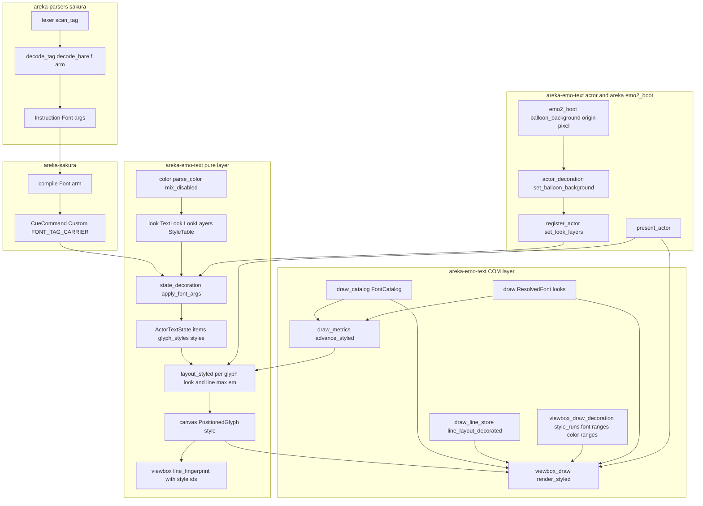
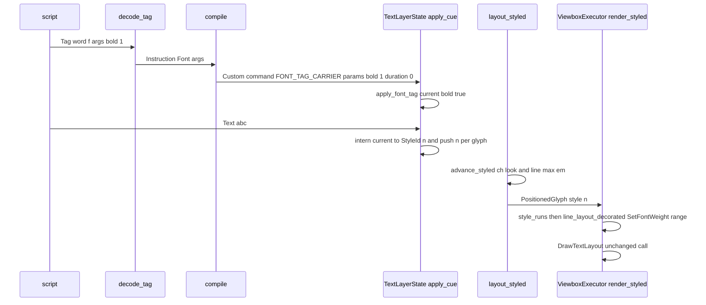

# Design Document: areka-P0-text-decoration-canon

> 作成: 2026-09-11（要件 16 件＋付録 A/B・`research.md` §1〜§9・brief 末尾の 2026-09-11 追記を入力とする）。
> 引用は「何の定義行か」で指し、行番号は 2026-09-11 の実測値を括弧で添える（動く前提）。
> 開発者裁定（2026-09-11 要件ディスカッション）は再審議しない: 描画は DirectWrite の標準機能（1 行 1 レイアウト＋範囲指定＋`DrawTextLayout`）に限る／`sub`・`sup`・`outline` は語彙のみ／フォントファイルは読み込まない／縦書きの線の側は DirectWrite の既定に委ねる／無効表示の色はバルーン背景の原点画素から shell の式で混ぜる。

## Overview

**Purpose**: さくらスクリプトの文字装飾タグ `\f[...]` のうち、フォント系 7 項目（`name`・`height`・`color`・`bold`・`italic`・`underline`・`strike`）と一括の戻し 2 項目（`\f[default]`・`\f[disable]`）を 3 書字方向で ukadoc どおりに効かせ、語彙のみの 3 項目（`sub`・`sup`・`outline`）を受理し、その土台——解読の腕・装飾を運ぶ命令・文字ごとの見た目の配管・既定の見た目と無効表示の見た目の 2 層・`draw.rs` の分割——を建てる。

**Users**: SSP 向けに `\f[bold,1]` や `\f[color,red]` を書いてきたゴースト作者と、そのゴーストを areka で動かす利用者。後続の仕様（寄せ・影・選択肢マーカー・アンカー・`\x`）の実装者は、本設計が定める「文字ごとの見た目」と「戻す操作」をそのまま使う。

**Impact**: いま `\f` は解読の分岐に腕が無く、台本を組み立てる段階で捨てられる。本設計の後は、`\f` は再生時間 0 の命令として台本に載り、文字レンダリング層のスコープごとの「現在の見た目」を更新し、以降の文字にだけ効く。`\f` を含まない台本の表示は 1 画素も変わらない（既定の見た目だけの行は範囲指定を 1 度も呼ばない構造）。

### Goals

- `\f` 43 形すべてを捨てずに受理し（解読→台本→文字レンダリング層）、本仕様の 12 項目に意味を与える。
- 文字ごとの見た目を「追記→配置→行→描画」の 4 段に通し、送り幅の計測・折返し・当たり判定を見た目込みにする。
- 既定の見た目（バルーン定義 5 キー＋ukadoc 既定）と無効表示の見た目の 2 層を 1 か所で組み、「戻す操作」を 1 つの関数として公開する。
- `draw.rs`（988 行）を分割し、以降の追加を新しいファイルへ置いて 1,000 行の見張りを緑に保つ。
- 3 書字方向 × 7 項目の読み戻し・純粋層の状態遷移・計測と描画の一致を決定論テストで固定し、各要件に「過去の欠陥を再現すると赤になる」較正を 1 件以上置く。

### Non-Goals

- `align`／`valign`・影 3 項目（`areka-P0-text-align-shadow-canon`）、`cursor*` 10 項目（`areka-P0-choice-marker-styling`）、`anchor*` 16 項目（`areka-P0-anchor-tag-canon`）、`\x`／`\x[noclear]`（`areka-P0-balloon-lifecycle-events` 項目 9）。本設計は値を保持して表示を変えない「語彙のみ」の状態に置く。
- バルーン定義 `font.*` の残り 8 キーの読み取り（`areka-P0-balloon-font-descript-keys`）。`crates/areka-parsers/src/balloon/parse.rs`・`model.rs` に触れない。
- `sub`／`sup`／`outline` の表示、フォントファイル（`.ttf`／`.otf`／`.ttc`）の読み込み、自前の描画器（`IDWriteTextRenderer`／`IDWriteInlineObject`）。
- `TextEffects` の予約名 `multicolor`／`rotation`（M2 予約のまま）。
- 行末禁則のぶら下がり・`writing_mode` の警告文言（`areka-P0-emo-text-canon-residue`）。

## Boundary Commitments

### This Spec Owns

- **解読と転写**: `crates/areka-parsers/src/sakura/decode.rs` の `decode_tag`／`decode_bare` の `"f"` の腕、`model.rs` の `Instruction::Font`、`crates/areka-sakura/src/compile.rs` の `Font` の腕、運搬名 `FONT_TAG_CARRIER`。
- **文字レンダリング層（`crates/areka-emo-text`）の装飾基盤**: 見た目の型（`TextLook`）と 2 層（`LookLayers`）、`\f` の値の状態機械、スコープごとの装飾状態と装飾表（`StyleTable`／`StyleId`）、文字ごとの見た目の配管（`PositionedGlyph.style`）、見た目込みの計測（`GlyphMetrics::advance_styled`・`DWriteMetrics`）、行内最大 em による行の高さ、行の再利用判定の装飾込み化、DirectWrite 範囲指定の適用（フォント系＝行生成時・色＝毎フレーム）、フォント候補列の解決（`FontCatalog`）、`draw.rs`／`layout.rs`／`viewbox_draw.rs` の分割。
- **「戻す操作」の権威定義**: `TextLayerState::reset_decoration(scope)`——対象（装飾状態の全項目＝`TextLook` 丸ごと＋所有外の語彙）と時期（`\f[default]`・台詞の開始＝`ClearAll`・`\x`）。
- **無効表示の色の口**: `ResolvedBalloonText::resolve_with_background`・`TextLayerRuntime::set_balloon_background`、およびその上流配線（`crates/areka/src/emo2_boot/assets.rs` の `BalloonScopeAssets.background_color`・`frame/attach.rs` の `connect_balloon_text`）。
- **文書**: `doc/COMPAT_ARCHITECTURE.md` §8 の本仕様の行、台帳 2 ファイルの 13 項目、steering `structure.md` の emo-text 節、`roadmap.md` の M2 予約 1 行、隣接 5 spec の brief への相互登記 1 行ずつ。

### Out of Boundary

- 上記 Non-Goals のすべて。
- `crates/dola` への variant 追加（`CueCommand` は既存の汎用キャリア `Custom` に乗せる）。
- `crates/areka-parsers/src/sakura/lexer.rs`（並走 `areka-P0-sakura-tag-word-boundary` の所有）。
- `crates/areka-emo-present`・`crates/areka-emo-atlas`（背景色の導出はアトラスの公開 API を読むだけ）。
- 1,000 行の見張りの例外表（`crates/log-capture-kit/tests/file_length_guard_test.rs`・`OVER_LIMIT_ALLOWED` 11 件）。
- 選択肢の hover の規則（帯の丈・塗り・文字色の差し替え）と当たり帯のブロック軸寸。本設計は行内軸（送り幅）だけを見た目込みにする。
- `\_l` の単位 `em`／`lh`／`%` の係数（既定の見た目の大きさのまま。装飾で変えない）。

### Allowed Dependencies

- 既存の型と経路のみ: `Instruction`（`#[non_exhaustive]`）、`CueCommand::command_carrier`／`as_command_carrier`（`crates/dola/src/cue/command.rs` :201／:213）、`TextLayerState::apply_cue`、`GlyphMetrics`、`LayoutEngine::layout_inner`、`ContentCanvas::from_layout`、`LineLayoutStore`、`ViewboxExecutor::render` の Phase 1 の `SetDrawingEffect` 経路（`viewbox_draw.rs` :353〜:403）、`TextLayerRuntime::register_actor`、`BalloonScopeAssets`、`AtlasTable::resolve`／`entry`／`page`。
- DirectWrite の範囲指定 7 種（`SetFontFamilyName`／`SetFontSize`／`SetFontWeight`／`SetFontStyle`／`SetUnderline`／`SetStrikethrough`／`SetDrawingEffect`）と `GetSystemFontCollection`＋`FindFamilyName`（`windows` 0.62.2・依存追加なし）。
- 依存方向（強制）: `areka-parsers` → `areka-sakura` → `areka-emo-text`（純粋層 `look`／`color`／`state`／`layout`／`canvas`／`viewbox` → COM 層 `draw*`／`viewbox_draw*` → 結線層 `actor*`）→ `areka`（`emo2_boot`）。純粋層は `windows` 系 crate を import しない（`lib.rs` の `pure_layer_modules_have_no_windows_imports` が列挙で守る）。

### Revalidation Triggers

- `TextLook` にフィールドが増える（後続仕様が寄せ・影・マーカーを登記する）→ `LookLayers::from_balloon` の既定値・`reset_decoration` の意味（丸ごと置換なので自動）・`font_key` の対象（計測に効く項目だけ）を再確認。
- `FONT_TAG_CARRIER` の綴り、`Instruction::Font` の引数の並び（`args[0]`＝キー）→ `compile` と `state_decoration` の両端。
- `ResolvedBalloonText::resolve_with_background` の第 3 引数の意味（バルーン画像の原点画素・sRGB 非 premultiplied）→ `emo2_boot/balloon_background.rs`。
- `LineLayoutStore` の再利用鍵（内容文字列＋装飾番号列）→ `Clear`／`ClearAll` が `request_clear` で店を空にする前提。
- `StyleId(0)`＝既定の見た目、という記号の意味 → 装飾表を読むすべての箇所（layout・executor・指紋）。
- `draw.rs` の字面検査（`draw_format_metrics_tests.rs` の `font_family_reaches_directwrite_only_as_author_name_or_default_retry`）が固定する名前——`create_text_format`／`try_create_format`／`for_mode`／`DEFAULT_FONT_NAME`——を改名するとき。

## Architecture

### Existing Architecture Analysis

- **解読→台本→再生**: `decode_tag`（`decode.rs` :201）の `match word.as_str()` は `_w`／`n`／`p`／`s`／`b`／`_l`／`q`／`!` の腕だけを持ち、末尾 `_ => decode_passthrough_tag(word, args)` が `Instruction::Raw` へ落とす。`compile`（`compile.rs`）の catch-all（:202-204）が `Raw` を `debug!` で捨てる。`GenericCommand` は `CueCommand::command_carrier(name, raw_args)` で再生時間 0 の cue になる（:187-195）。内容のある台本の先頭には必ず `ClearAll` が前置される（:225-233）＝**台詞の開始の観測点**。
- **文字レンダリング層の 3 層**: 純粋層（`state.rs`・`layout.rs`・`canvas.rs`・`viewbox.rs`・`choice.rs`・`cursor_tag.rs`）は `windows` 非依存で決定論テストの対象。COM 層（`draw.rs`・`viewbox_draw.rs`・`surface.rs`）が DirectWrite／D2D を触る。結線層（`actor.rs`）が両者を毎フレーム束ねる（`present_actor` :697）。
- **文字ごとの属性が無い 3 か所**: `TextItem::Glyph { ch }`（`state.rs` :104・構築 182 か所）、`PositionedGlyph { ch, inline_pos, advance }`（`layout.rs` :171・構築 7 か所）、`GlyphRunContent { glyphs, size }`（`canvas.rs` :150）。フォントは `ResolvedFont`（`draw.rs` :158）1 束、`IDWriteTextFormat` は actor ごと 1 本、太さ・斜体は `try_create_format`（:340）が NORMAL 固定。
- **範囲指定の先例**: `ViewboxExecutor::render` の Phase 1 が Choice 行に対し「全範囲 `SetDrawingEffect(None)` → hover 範囲へ文字色ブラシ」を毎フレーム焼く（`viewbox_draw.rs` :353-403）。`segment_text_range`（:807）がグリフ列から UTF-16 範囲を導く。
- **字面で守られている 2 ファイル**: `draw.rs` は `draw_format_metrics_tests.rs` の `font_family_reaches_directwrite_only_as_author_name_or_default_retry`（:590・`include_str!("draw.rs")` :507）が `try_create_format` 出現 3・`create_text_format` 本文の呼出文字列 2・`for_mode` 出現 2 を固定する。`layout.rs` は `layout_cursor_overflow_tests.rs`（`LAYOUT_SRC` :422）が `finish_line(` 4・`finish_pending_line(` 3・`fn finish_pending_line(` の存在を固定する。**分割はこの 2 検査を赤にしない形で行う**（research §9 D15／D16）。
- **1,000 行の見張り**: `draw.rs` 988・`layout.rs` 955・`actor.rs` 952・`region.rs` 951・`viewbox_draw.rs` 852・`viewbox.rs` 846・`canvas.rs` 738・`state.rs` 528。例外表は触らない。

### Architecture Pattern & Boundary Map



**Architecture Integration**:

- **採る形**: 既存の「純粋層が状態と配置を決め、COM 層が同じ format 経路で描く」構造をそのまま延長する。装飾は**文字ごとの番号**（`StyleId`）として純粋層を流れ、COM 層は番号を見た目（`TextLook`）に引き直して DirectWrite の範囲指定へ写す。
- **境界**: 解読は「転記」（意味を読まない）、台本の組み立ては「運搬」（キー名の語彙を持たない）、文字レンダリング層の純粋層が「意味」（値の解釈・2 層・戻し）を持ち、COM 層は「写像」（範囲指定・候補列の解決）だけを持つ。
- **保つ既存パターン**: `\!` の汎用キャリア（消費側の名前自己選別）、`parse_cursor_coord` 流の全域関数（パニックしない語彙化）、`CursorWarnGuard` 流の 1 度きり警告、`#[path]` 兄弟ファイルと `pub use` 再輸出によるファサード分割（`structure.md`）、log-first（`error!`＋`Err`・panic 禁止）。
- **新しい部品の理由**: `look.rs`（見た目の型と状態機械を描画から切り離し、描画なしで決定論テストする）、`color.rs`（色の書式を後続 3 仕様が再利用する 1 か所）、`FontCatalog`（候補列→インストール済み名の解決と記憶を計測と描画で共有し、警告を 1 度に留める）、`viewbox_draw_decoration.rs`（run の切り出しと範囲指定の焼き込みを executor 本体から分け、852 行のファイルを膨らませない）。
- **steering との整合**: 1 ファイル 1,000 行（新規は兄弟ファイル・分割はファサード形式）、兄弟テストの命名（`<stem>_<モジュール名>.rs`）、ログの規律（`logging.md`）、純粋層の `windows` 非依存。

### Technology Stack

| Layer | Choice / Version | Role in Feature | Notes |
|-------|------------------|-----------------|-------|
| 解析・再生 | Rust 2024・`areka-parsers`／`areka-sakura`／`dola`（workspace） | `Instruction::Font` の追加・`Custom` キャリアでの運搬 | dola に variant を足さない（D1） |
| 文字レンダリング（純粋層） | `areka-emo-text`（`windows` 非依存） | 見た目の型・状態機械・装飾表・配置・指紋 | 決定論テストの対象 |
| 文字レンダリング（COM 層） | DirectWrite／Direct2D via `windows` 0.62.2・`wintf::com::dwrite` 拡張 trait | `IDWriteTextLayout` の範囲指定 7 種・`GetSystemFontCollection`／`FindFamilyName` | 依存追加なし。自前描画器は採らない（裁定） |
| 結線 | `areka-emo-text::actor`・`areka::emo2_boot` | 2 層の登録・背景色の口と配線 | `areka-emo-present` は読むだけ |
| テスト | `cargo test`（headless DWrite・WARP 可の GPU 読み戻し・`log-capture-kit`） | 純粋層の状態・COM の読み戻し・記録件数 | x86 も実機起動も要さない（R15.8） |

## File Structure Plan

### Directory Structure（新設ファイル）

```
crates/areka-parsers/src/sakura/
├── decode_font_tests.rs            # `\f` 43 形の受理・引数保持・裸形・`\f[]`（decode.rs から #[path] 接続）
crates/areka-sakura/src/
├── compile_font_tests.rs           # Font 腕: 再生時間 0・並び順・`\f` なし台本の不変
crates/areka-emo-text/src/
├── look.rs                         # TextLook / Script / LookLayers / StyleId / StyleTable / GlyphStyles / apply_font_tag（純粋）
├── look_tests.rs                   # 12 項目 × 6 値・+N/-N/N%・排他・戻し
├── color.rs                        # ColorSpec / parse_color / mix_disabled / CSS 色名 147（純粋）
├── color_tests.rs
├── state_decoration.rs             # Decoration（層・現在・所有外語彙・警告記録）・装飾表の配管・reset_decoration（state.rs の子）
├── state_decoration_tests.rs       # スコープ独立・\c で戻らない・ClearAll で戻る・warn 1 度
├── layout_line_ops.rs              # segment_advance_sum / resolve_cursor_component の純移動（layout.rs の子）
├── layout_styled.rs                # LayoutEngine::layout_styled（layout.rs の子）
├── layout_styled_tests.rs          # 見た目込みの送り幅・行内最大 em・折返し・空行の高さ
├── draw_metrics.rs                 # DWriteMetrics（純移動）＋ advance_styled・probe_format_for
├── draw_metrics_styled_tests.rs    # 鍵ごとの計測・既定は従来と同一値・計測＝描画の一致
├── draw_line_store.rs              # LineLayoutStore（純移動）＋ line_layout_decorated
├── draw_line_store_tests.rs        # 装飾込みの再利用判定
├── draw_oracle.rs                  # #[cfg(test)] DrawExecutor ほか比較専用オラクル（純移動）
├── draw_catalog.rs                 # FontCatalog（候補列→インストール済み名・記憶・warn 1 度・ファイル名の読み飛ばし）
├── draw_catalog_tests.rs
├── viewbox_draw_plan.rs            # degrade_if_needed / full_domain_update / plan_inconsistency の純移動（viewbox_draw.rs の子）
├── viewbox_draw_decoration.rs      # StyleRun / style_runs / apply_font_ranges / apply_color_ranges / BrushCache / block_extent
├── viewbox_draw_decoration_tests.rs
├── viewbox_style_fingerprint_tests.rs  # 装飾だけが違う行は再利用しない
├── actor_decoration.rs             # set_balloon_background / background_of（actor.rs の子）
├── actor_decoration_tests.rs       # 登録で 2 層が state へ届く・背景の口・既定は白
crates/areka-emo-text/tests/
├── decoration_readback_test.rs                 # 横書き 7 項目＋語彙のみ 3＋較正（入口）
├── decoration_readback_test_vertical_tests.rs  # 縦書き 2 方向 × 7 項目＋線の側の実測固定
├── decoration_readback_test_test_support.rs    # 共有ヘルパ（GPU world・runtime・読み戻し・インク判定）
crates/areka/src/emo2_boot/
├── balloon_background.rs           # face_origin_color(atlas, file_name) -> (u8,u8,u8)
├── balloon_background_tests.rs
```

### Modified Files

| ファイル（今日の行数） | 変更 | 段階 |
|---|---|---|
| `crates/areka-parsers/src/sakura/model.rs` | `Instruction::Font { args: Vec<String> }` を追加（`#[non_exhaustive]` ゆえ後方互換） | 実体化 |
| `crates/areka-parsers/src/sakura/decode.rs`（360） | `decode_tag` に `"f"` の腕（`// ukadoc:` URL を 12 項目分＋一括の注記）、`decode_bare` に `"f"` の腕、`decode_font_tests.rs` の接続 | 実体化 |
| `crates/areka-sakura/src/contract.rs` | `pub const FONT_TAG_CARRIER: &str = "\\f";` | 実体化 |
| `crates/areka-sakura/src/compile.rs`（329） | `Instruction::Font { args }` の腕（catch-all の前）・`compile_font_tests.rs` の接続 | 実体化 |
| `crates/areka-emo-text/src/lib.rs` | `pub mod look; pub mod color;`・`pure_layer_modules_have_no_windows_imports` の列挙に新設 5 ファイルを追加 | 実体化 |
| `crates/areka-emo-text/src/draw.rs`（988→約 400→約 445） | **分割**: `DWriteMetrics`＋`measure_line_box_ratio`→`draw_metrics.rs`、`CachedLineLayout`＋`LineLayoutStore`＋`measure_line_overhang`→`draw_line_store.rs`、`DrawExecutor`＋`FormatKey`＋`create_target_bitmap`＋`none_err`→`draw_oracle.rs`。`#[path]` 子モジュール＋`pub use`／`pub(crate) use` 再輸出（外部パス `crate::draw::X` 不変）。**実体化**: `FontDisableSeam`／`RESERVED_KEY_DISABLE_FONT_PREFIX` を撤去し `ResolvedFont.looks: LookLayers`・`resolve_with_background`・`DEFAULT_BALLOON_BACKGROUND` を追加。`create_text_format`／`try_create_format` の本文は不変 | 分割→実体化 |
| `crates/areka-emo-text/src/layout.rs`（955→約 890→約 925） | **分割**: `segment_advance_sum`・`resolve_cursor_component` を `layout_line_ops.rs` へ純移動。**実体化**: `GlyphMetrics::advance_styled` の既定実装、`PositionedGlyph.style: StyleId`、`layout_inner` に `styles: Option<GlyphStyles<'_>>` を足し、文字ごとの送り幅と行内最大 em を追跡、`layout_styled.rs` の接続 | 分割→実体化 |
| `crates/areka-emo-text/src/state.rs`（528→約 560） | `ActorTextState` にフィールド 3 つ（`glyph_styles`・`styles`・`decor`）、`Text`／`Choice` の腕で番号を追記、`Clear`→`clear_content()`、`ClearAll`→`clear_content()`＋`reset_decoration(None)`、`Custom` の腕で `FONT_TAG_CARRIER` を自己選別、`state_decoration.rs` の接続と `pub use` | 実体化 |
| `crates/areka-emo-text/src/canvas.rs`（738） | `from_layout` が `style` を転写。モジュール doc と `TextEffects` の doc を改訂（`disable` は実体化・`outline`／`sub`／`sup` は語彙のみ・`shadow` は align-shadow・`multicolor`／`rotation` は M2 予約） | 実体化 |
| `crates/areka-emo-text/src/viewbox.rs`（846） | `CommittedLine.styles: Vec<u32>`、`line_fingerprint` が装飾番号列を写す | 実体化 |
| `crates/areka-emo-text/src/viewbox_draw.rs`（852→約 740→約 810） | **分割**: `degrade_if_needed`／`full_domain_update`／`plan_inconsistency` を `viewbox_draw_plan.rs`（`#[path] mod plan;`・`pub(super) fn`）へ純移動し、ファサードに素の `use plan::{degrade_if_needed, full_domain_update, plan_inconsistency};` を残す（`viewbox_draw_frame_render_tests.rs` が `super::plan_inconsistency` で参照している私有項目の再束縛・`structure.md` の注記どおり）。**実体化**: `fonts: Rc<FontCatalog>`・`brushes: BrushCache`、`new_shared`、`render_styled`（`render` は空の装飾表で委譲）、Phase 1 の行ごとに `style_runs`→`line_layout_decorated`→色の範囲、`ensure_format` が `fonts.pick(font)` の複製で `create_text_format` を呼ぶ、行の箱寸を `block_extent(run.size, mode)` に | 分割→実体化 |
| `crates/areka-emo-text/src/actor.rs`（952→約 965） | `ResolvedBalloonText::resolve_with_background`、`TextLayerRuntime.balloon_background`、`register_actor` で `state.set_look_layers`、`register_actor_binding`／`refresh_actor_binding` が背景付きで解決、`present_actor` が `layout_styled`／`render_styled`／共有 `FontCatalog` を使う。それ以上の追加は `actor_decoration.rs` へ | 実体化 |
| `crates/areka-emo-text/src/draw_format_metrics_tests.rs`（742） | `decoration_and_disable_seams_are_type_only` を「無効表示の層が実体化し、行単位の予約型は 0 バイトのまま」を述べる述語へ改訂。`font_family_reaches_directwrite_only_as_author_name_or_default_retry` の doc と述語に「第 2 の入口 `draw_metrics.rs::probe_format_for`」を加える | 実体化 |
| `PositionedGlyph { .. }` の構築を持つテスト 5 ファイル（`choice_tests.rs`・`choice_decorate_tests.rs`・`viewbox_choice_marker_tests.rs`・`canvas.rs` のテスト・`layout` 系）と `ResolvedFont { .. }` を持つテスト 3 か所 | フィールド追加の書き換え（`style: StyleId::DEFAULT`・`looks: LookLayers::default()`） | 実体化 |
| `crates/areka/src/emo2_boot/assets.rs`（416） | `BalloonScopeAssets.background_color: (u8,u8,u8)`、構築時に `balloon_background::face_origin_color` で導出 | 実体化 |
| `crates/areka/src/emo2_boot/frame/attach.rs`（429） | `connect_balloon_text(..., background)` が `set_balloon_background` → `register_actor_view` の順に呼ぶ | 実体化 |
| `doc/COMPAT_ARCHITECTURE.md` §8 | 本仕様の登記行（Supporting References §A）・`\f[align]`／`\f[valign]`／下線の行（:181）と `\_l` の行（:183）の追跡先を改訂 | 文書 |
| `doc/ukadoc-coverage/ledger/sakura-script.toml`・`assets.toml` | 12 項目の `status`（9 件 `implemented`〔`name`・`height` 注記付き〕・3 件 `vocabulary-only`）、`disable.font.(フォント定義),(指定)` の note | 文書 |
| `.kiro/steering/structure.md`・`roadmap.md` | emo-text 節に分割後のファイルと接続、M2 予約に `sub`／`sup`／`outline` の 1 行 | 文書 |
| 隣接 brief 5 本（`text-align-shadow-canon`・`balloon-font-descript-keys`・`choice-marker-styling`・`anchor-tag-canon`・`balloon-lifecycle-events`） | 相互登記 1 行ずつ（Supporting References §C） | 文書 |

**1,000 行の見張りに対する収支**（実体化後の見込み）: `draw.rs` 約 445・`layout.rs` 約 925・`actor.rs` 約 965・`viewbox_draw.rs` 約 810・`state.rs` 約 560・`viewbox.rs` 約 850・`canvas.rs` 約 740。新設ファイルはいずれも 400 行以下を目安とし、読み戻しテストは入口＋兄弟 2 本に分けて 1 本 700 行以下に収める。例外表は増減しない。

## System Flows

### Flow 1: `\f[bold,1]` が台本から画素へ届くまで



- `\f` は再生時間 0 なので `interval = duration / glyph_count` の式（`state.rs` :386）に影響しない（R3.4／R14.4）。
- 既定の見た目だけの行は `style_runs` が `[StyleId(0)]` の 1 run を返し、`line_layout_decorated` は範囲指定を呼ばず `line_layout` と同じ生成物になる（R14.2）。

### Flow 2: スコープの装飾状態の遷移（純粋層）

```mermaid
stateDiagram-v2
    [*] --> Default: register_actor set_look_layers or first cue
    Default --> Styled: f key value applied
    Styled --> Styled: f key value applied
    Styled --> Default: f default or ClearAll or reset_decoration
    Styled --> Disabled: f disable
    Disabled --> Styled: f key value applied
    Disabled --> Default: f default or ClearAll
    Styled --> Styled: Clear keeps decoration
    Default --> Default: Clear NewLine Cursor keep decoration
```

- 「戻す」は `TextLook` の丸ごと置換（`current = layers.default.clone()`）と所有外語彙の全消去。項目の列挙を持たないので、後続仕様がフィールドを足せば自動的に戻しに含まれる（R10.4）。
- 台詞の開始＝`ClearAll`（`compile` が内容のある台本の先頭に必ず置く）。`\c`＝`Clear` は内容だけを消す（R3.7）。

### Flow 3: 1 フレームの描画（COM 層・装飾入り）

1. `present_actor` が `layout_styled` で行列を得る（文字ごとの送り幅・行内最大 em）。
2. `render_styled` の Phase 1（`BeginDraw` 前・可謬）: 行ごとに `style_runs(glyphs)` → `line_layout_decorated(index, text, format, block_extent, mode, ids, apply_font_ranges)`（生成時のみ範囲指定）→ 既定と異なる色の run があれば「全範囲 `None` → 色の run → hover の色」（Choice 行は従来どおり全範囲 `None` を先に）。
3. Phase 2 は従来のダーティ矩形の正準列①〜⑥のまま（`DrawTextLayout` の呼び方は不変）。

## Requirements Traceability

| Requirement | Summary | Components | Interfaces | Flows |
|---|---|---|---|---|
| 1.1 | `draw.rs` を装飾の変更の前に分割 | draw ファサード・`draw_metrics.rs`・`draw_line_store.rs`・`draw_oracle.rs` | `#[path]` 子モジュール＋再輸出 | 実装順 段階 1 |
| 1.2 | 6 つの公開の入口を不変に | draw ファサード | `pub use draw_metrics::DWriteMetrics` 等 | 段階 1 |
| 1.3 | 追加分は新しい兄弟ファイルへ | File Structure Plan の新設 20 ファイル | — | 全段階 |
| 1.4 | 例外表を増減させない | File Structure Plan の収支表 | — | — |
| 1.5 | 分割後に既存テストが変更なしで緑 | D15／D16（字面検査を赤にしない分割の形） | — | 段階 1 |
| 1.6 | steering の命名規則に従う | 新設ファイル名（`<stem>_<モジュール名>.rs`・最長 stem） | — | — |
| 2.1 | `decode_tag` の `"f"` の腕 | `decode.rs` | `Instruction::Font` | Flow 1 |
| 2.2 | キーと引数列を記述順で保持 | `Instruction::Font { args }` | `args[0]`＝キー・`\f[]`＝`[""]` | Flow 1 |
| 2.3 | 再生時間 0・並び順を保つ | `compile` の Font の腕 | `emit(scope, offset, 0.0, ..)` | Flow 1 |
| 2.4 | 1 本の運搬形 | `FONT_TAG_CARRIER`・`CueCommand::command_carrier` | `as_command_carrier` で自己選別 | Flow 1 |
| 2.5 | 所有外キーは保持・表示不変・debug | `apply_font_tag` の `Note::Unowned`・`Decoration.unowned` | — | Flow 2 |
| 2.6 | 未知キー・引数なしは warn・中断なし | `decode_bare` の `"f"`・`FontTagIssue::{NoKey, UnknownKey}` | — | Flow 2 |
| 2.7 | `// ukadoc:` URL を添える | `decode.rs` の腕 | — | — |
| 2.8 | `\f` なし台本の解読・台本・再生時間は不変 | `decode_font_tests`／`compile_font_tests` の不変検査 | — | — |
| 3.1 | スコープごとの独立した装飾状態 | `ActorTextState.decor` | — | Flow 2 |
| 3.2 | 以降の文字にだけ効く | `intern_current` を追記時に呼ぶ（`Text`／`Choice` の腕） | `StyleId` 列 | Flow 1 |
| 3.3 | 3 層の配管 | `glyph_styles`（追記）→`PositionedGlyph.style`（配置）→`GlyphRunContent.glyphs`（行） | — | Flow 1 |
| 3.4 | リビール中も即時・時刻不変 | `\f` は duration 0・`reveal` に触れない | — | Flow 1 |
| 3.5 | 選択肢の文字にも装飾・hover 優先 | `Choice` の腕で番号追記・色の順序「装飾→hover」 | `apply_color_ranges` | Flow 3 |
| 3.6 | 1 行に混在した装飾を run で描き分け | `style_runs`・`apply_font_ranges`・`apply_color_ranges` | `StyleRun` | Flow 3 |
| 3.7 | `\n`・`\_l`・`\c` は装飾を保持 | `Clear`→`clear_content()`（`decor` 保持）・他の腕は触れない | — | Flow 2 |
| 3.8 | 台詞の開始で全スコープを既定へ | `ClearAll`→`reset_decoration(None)` | — | Flow 2 |
| 3.9 | 純粋層で更新と適用 | `look.rs`・`state_decoration.rs`・`layout_styled.rs`（`windows` 非依存） | — | — |
| 4.1 | 既定の見た目＝5 キー＋ukadoc 既定 | `LookLayers::from_balloon`・`ResolvedFont::resolve` | — | — |
| 4.2 | `parse.rs`・`model.rs` に触れない | `resolve` は `model.font()` の 5 キーだけ読む | — | — |
| 4.3 | 残り 8 キーの差し込み口 | `TextLook` の各フィールド＝口・`LookLayers::from_balloon` の引数列に足すだけ | — | — |
| 4.4 | `FontDisableSeam` を実体へ置換 | `ResolvedFont.looks.disable` | — | — |
| 4.5 | 色以外は既定と同じ | `LookLayers::from_balloon`（`disable = { color: mix, ..default }`） | — | — |
| 4.6 | 無効表示の色＝shell の式・1 定数 | `color::mix_disabled`・`DEFAULT_BALLOON_BACKGROUND`・`BalloonScopeAssets.background_color` | `resolve_with_background`・`set_balloon_background` | — |
| 4.7 | 無効表示の口 | `LookLayers.disable` の各フィールド | — | — |
| 4.8 | 定義の有無 × 各項目のテスト | `look_tests`・`draw_format_metrics_tests` の改訂・`actor_decoration_tests` | — | — |
| 5.1 | `true`／`1` で付ける | `parse_switch`・`apply_font_tag`・`apply_font_ranges`（`SetFontWeight`／`SetFontStyle`／`SetUnderline`／`SetStrikethrough`） | `Switch::On` | Flow 2, 3 |
| 5.2 | `false`／`0` で外す | 同上 | `Switch::Off` | Flow 2 |
| 5.3 | `default` で当該項目だけ既定へ | `apply_font_tag`（`layers.default` の当該フィールド） | `Switch::Default` | Flow 2 |
| 5.4 | `disable` で当該項目だけ無効表示へ | `apply_font_tag`（`layers.disable` の当該フィールド） | `Switch::Disable` | Flow 2 |
| 5.5 | 6 値以外は warn | `FontTagIssue::BadValue`・`Decoration.warned` | — | Flow 2 |
| 5.6 | 書体が無ければ合成に委ねる | `apply_font_ranges`（`SetFontWeight`／`SetFontStyle` のみ・失敗は縮退しない） | — | Flow 3 |
| 5.7 | 線の位置は DirectWrite の既定 | `apply_font_ranges`（`SetUnderline`／`SetStrikethrough` だけ） | 縦書きの実測は 12.4 | Flow 3 |
| 5.8 | 組み合わせ | `TextLook` の独立フィールド | — | — |
| 5.9 | `outline` は語彙のみ・warn 1 度 | `Note::VocabularyOnly("outline")` | — | Flow 2 |
| 6.1 | `sub`／`sup` は語彙のみ | `Script`・`Note::VocabularyOnly` | — | Flow 2 |
| 6.2 | 後勝ちの排他 | `Script` は enum（同時に 1 値） | — | — |
| 6.3 | 有効中の追記で warn 1 度 | `intern_current` が `script != None` なら記録 | — | — |
| 6.4 | 戻す操作の対象 | `TextLook` 丸ごと置換 | — | Flow 2 |
| 7.1 | `N`＝em を image px で | `parse_height`・`HeightSpec::Absolute` | — | Flow 2 |
| 7.2 | `+N`／`-N`＝そのとき効いている大きさに加減 | `HeightSpec::Relative`（`current.height` 基準・重ねて効く） | — | Flow 2 |
| 7.3 | `N%`＝既定の大きさの百分率 | `HeightSpec::Percent`（`layers.default.height` 基準） | — | Flow 2 |
| 7.4 | `default`＝大きさだけ既定へ | `HeightSpec::Default` | — | Flow 2 |
| 7.5 | `disable`＝大きさだけ無効表示へ | `HeightSpec::Disable` | — | Flow 2 |
| 7.6 | 非正・非有限は warn | `FontTagIssue::BadValue` | — | — |
| 7.7 | スタイルシートの語は語彙のみ・warn 1 度 | `HeightSpec::Keyword`・`Note::StylesheetKeyword` | — | — |
| 7.8 | 行送りは `line_pitch` の 1 点 | `layout_inner`（`metrics.line_pitch(line_height)`） | — | Flow 3 |
| 7.9 | 行の高さ＝行内最大 em・空行は現在の大きさ | `layout_inner` の `line_max` 追跡（D22） | — | — |
| 7.10 | 大きさ込みの送り幅 | `advance_styled` | — | — |
| 8.1 | `R,G,B`（0〜255） | `color::parse_color` | `ColorSpec::Rgb` | — |
| 8.2 | `R%,G%,B%`→0〜255 へ写す | `color::parse_color`（`round(v * 255 / 100)`） | `ColorSpec::Rgb` | — |
| 8.3 | `#RRGGBB`／`#RGB` | `color::parse_color`（3 桁は各桁 2 倍） | `ColorSpec::Rgb` | — |
| 8.4 | 小文字の色名 | `color::CSS_COLOR_NAMES` | `ColorSpec::Rgb` | — |
| 8.5〜8.6 | `default`／`default.plain`／`disable` | `ColorSpec::{Default, DefaultPlain, Disable}` | — | — |
| 8.7 | `default.cursor*` | `LookLayers.cursor_text` | — | — |
| 8.8 | `default.anchor*` は default＋warn 1 度 | `Note::AnchorColorAsDefault` | — | — |
| 8.9 | 不正は warn | `ColorParseError`→`FontTagIssue` | — | — |
| 8.10 | 色の解析を 1 か所に | `color.rs` | `parse_color(&[&str])` | — |
| 9.1〜9.2 | 候補列から最初のインストール済み | `FontCatalog::family_for` | — | Flow 3 |
| 9.3 | ファイル名は warn 1 度で読み飛ばし | `FontCatalog::family_for`（拡張子判定） | — | — |
| 9.4 | 全滅は既定＋warn 1 度 | `FontCatalog::family_for`→`None`・`pick` が既定名 | — | — |
| 9.5〜9.6 | `name,default`／`name,disable` | `apply_font_tag` | — | — |
| 9.7 | 探索結果の再利用 | `FontCatalog.memo` | — | — |
| 9.8 | バルーン定義の候補列にも同じ規則 | `looks.default.name = [name] ++ fallback_chain`・`pick` | — | — |
| 10.1〜10.2 | `\f[default]`／`\f[disable]` | `apply_font_tag`（丸ごと置換） | — | Flow 2 |
| 10.3 | 戻す操作を 1 つの関数で | `TextLayerState::reset_decoration` | `scope: Option<&ActorKey>` | Flow 2 |
| 10.4 | 項目の列挙を持たない | `TextLook` 丸ごと置換＋`unowned.clear()` | — | — |
| 10.5 | スコープ単位・全スコープ 1 回 | `reset_decoration(None)` | — | — |
| 10.6 | §8 に 1 行で登記 | Supporting References §A 行 10 | — | — |
| 10.7 | 表示済みの文字は変えない | 番号は追記時に確定・表は追記専用 | — | — |
| 11.1 | 送り幅を装飾込みの鍵で | `DWriteMetrics.cache: (char, FontKey)` | — | — |
| 11.2 | 二段構えで見た目込み判定 | `layout_inner` の `advance` を `advance_styled` へ | — | — |
| 11.3 | 計測と描画が同じ書式経路 | `probe_format_for` と `apply_font_ranges` が同じ `FontKey`／`pick` を通る | — | — |
| 11.4 | 行の再利用は装飾が同じときだけ | `line_layout_decorated` の鍵・`CommittedLine.styles` | — | — |
| 11.5 | 当たり判定は装飾込みの送り幅 | `derive_hit_rows` は `PositionedGlyph.advance` を読む（変更なし・入力が変わる） | — | — |
| 12.1 | 5 項目は方向非依存 | 範囲指定は方向を持たない | — | — |
| 12.2 | 線の側は DirectWrite の既定・§8 に登記 | 読み戻しの実測→Supporting References §A 行 7 | — | — |
| 12.3 | rl と lr で同じ見た目 | 読み戻しテストの述語 | — | — |
| 12.4 | 縦書きの線の側を読み戻しで固定 | `decoration_readback_test_vertical_tests.rs` | — | — |
| 13.1 | 解釈不能は warn（キー・値・スコープ） | `Decoration::note_issue`（`actor`・`key`・`value`・`reason`） | — | — |
| 13.2 | 候補全滅は既定＋warn | `FontCatalog` | — | — |
| 13.3 | DirectWrite 失敗は error＋Err | `device_err` 経由 | — | — |
| 13.4 | 同じ値は台詞ごとに 1 度 | `Decoration.warned`（`ClearAll` で空に） | — | — |
| 13.5 | 記録なしの失敗経路なし | Error Handling 表 | — | — |
| 14.1 | `\f` なし台本は同一 | `StyleId(0)`＝範囲指定なし・`advance` の従来経路・オラクル比較 | — | — |
| 14.2 | 既定だけの行は従来と同じ経路 | `style_runs` 1 run→範囲指定 0 回 | — | — |
| 14.3 | emo2 の観測対象を変えない | emo2 は `\f` 不使用・`font.name` 単一 | — | — |
| 14.4 | 再生時間は不変 | `emit(.., 0.0, ..)` | — | — |
| 15.1 | 解読を `decode.rs` の兄弟テストで | `decode_font_tests.rs` | — | — |
| 15.2 | 台本の組み立てを `compile.rs` の兄弟テストで | `compile_font_tests.rs` | — | — |
| 15.3 | 装飾状態の更新を純粋層のテストで | `look_tests.rs`・`color_tests.rs`・`state_decoration_tests.rs` | — | — |
| 15.4 | 3 方向 × 7 項目の読み戻し・語彙のみ 3 | `tests/decoration_readback_test.rs`＋兄弟 2 本 | — | — |
| 15.5 | 計測＝描画・折返し・当たり判定 | `draw_metrics_styled_tests.rs`・`layout_styled_tests.rs`・`viewbox_draw_decoration_tests.rs` | — | — |
| 15.6 | 2 層が定義の有無 × 各項目で組まれる | `look_tests.rs`（`from_balloon`）・`draw_format_metrics_tests.rs` の改訂・`actor_decoration_tests.rs` | — | — |
| 15.7 | 各要件 1 件以上の較正 | Testing Strategy「較正」表 | — | — |
| 15.8 | `cargo test` 常時実行・x86／実機不要 | headless DWrite・WARP 読み戻し | — | — |
| 16.1 | 裁量 12 点を §8 に 4 欄で登記 | Supporting References §A 行 1〜12 | — | — |
| 16.2 | §8 の既存 2 行の追跡先を改訂 | Supporting References §A 行 13 | — | — |
| 16.3 | 台帳 2 ファイルの `status`／note | Supporting References §B | — | — |
| 16.4 | 予約名の注記と `decoration_and_disable_seams_are_type_only` の改訂 | `canvas.rs`・`draw.rs` の doc・既存テストの改訂 1 | — | — |
| 16.5 | steering `structure.md` へ反映 | Supporting References §D | — | — |
| 16.6 | 隣接 brief への相互登記と roadmap の M2 予約 | Supporting References §C・§D | — | — |
| 16.7 | 主張は実測で裏取り・定義名で指す | 本書の引用規約（行番号は括弧書き）・`/kiro-validate-impl` | — | — |

## Components and Interfaces

| Component | Domain/Layer | Intent | Req Coverage | Key Dependencies (P0/P1) | Contracts |
|---|---|---|---|---|---|
| `Instruction::Font`＋解読の腕 | parsers | `\f` を転記層で受理する | 2.1, 2.2, 2.6, 2.7, 2.8 | lexer の `Token::Tag`／`Bare`（P0） | State |
| `FONT_TAG_CARRIER`＋compile の腕 | sakura | `\f` を再生時間 0 で運ぶ | 2.3, 2.4, 14.4 | `CueCommand::command_carrier`（P0） | Event |
| `look.rs` | emo-text 純粋 | 見た目の型・2 層・装飾表・`\f` の値の状態機械 | 3.9, 4.1, 4.3, 4.5, 4.7, 5.x, 6.x, 7.1〜7.7, 9.5, 9.6, 10.1, 10.2, 10.4 | `color.rs`（P0） | Service, State |
| `color.rs` | emo-text 純粋 | 色指定の解析と無効表示の混色 | 4.6, 8.1〜8.6, 8.8〜8.10 | なし | Service |
| `state_decoration.rs` | emo-text 純粋 | スコープごとの装飾状態・番号の配管・戻す操作・警告の 1 度化 | 2.5, 3.1〜3.5, 3.7, 3.8, 6.3, 10.3, 10.5, 10.7, 13.1, 13.4 | `look.rs`（P0）・`state.rs` の腕（P0） | Service, State |
| `layout_styled.rs`＋`layout.rs` の変更 | emo-text 純粋 | 見た目込みの送り幅と行内最大 em | 3.3, 7.8〜7.10, 11.2, 11.5 | `GlyphMetrics::advance_styled`（P0） | Service |
| `viewbox.rs` の指紋 | emo-text 純粋 | 装飾込みの再利用判定 | 11.4 | `PositionedGlyph.style`（P0） | State |
| draw ファサード分割 | emo-text COM | `draw.rs` を 4 ファイルに | 1.1〜1.6 | 字面検査 2 本（P0） | — |
| `ResolvedFont.looks`／`resolve_with_background` | emo-text COM | 2 層の構築点 | 4.1〜4.8, 9.8 | `LookLayers::from_balloon`（P0） | State |
| `FontCatalog` | emo-text COM | 候補列→インストール済み名・記憶・warn 1 度 | 9.1〜9.4, 9.7, 9.8, 13.2 | `GetSystemFontCollection`／`FindFamilyName`（P0） | Service |
| `DWriteMetrics` の styled 計測 | emo-text COM | 鍵ごとの probe format と記憶 | 7.10, 11.1, 11.3 | `FontCatalog`（P0）・`create_text_format`（P0） | Service |
| `LineLayoutStore::line_layout_decorated` | emo-text COM | 生成時 1 度のフォント系範囲指定と装飾込み再利用 | 3.6, 11.4 | `apply_font_ranges`（P0） | Service |
| `viewbox_draw_decoration.rs`＋`render_styled` | emo-text COM | run の切り出し・範囲指定・色ブラシ・行の箱寸 | 3.5, 3.6, 5.1〜5.8, 12.1〜12.3, 13.3, 14.2 | `LineLayoutStore`（P0）・`FontCatalog`（P0） | Service |
| `actor_decoration.rs`＋`actor.rs` の配線 | emo-text 結線 | 2 層の登録・背景の口・styled 呼出 | 3.1, 4.6, 9.8 | `TextLayerRuntime`（P0） | Service |
| `emo2_boot/balloon_background.rs`＋配線 | areka 結線 | 面 0 の原点画素→背景色 | 4.6 | `AtlasTable`（P0）・`BalloonScopeAssets`（P0） | Service |
| 読み戻しテスト 3 本 | テスト | 3 方向 × 7 項目・語彙のみ 3・線の側 | 12.2〜12.4, 15.4, 15.7 | GPU world（WARP 可） | — |
| 文書・台帳 | doc | §8・台帳・steering・brief | 10.6, 16.1〜16.7 | — | — |

### Parsers 層

#### `Instruction::Font` と解読の腕

| Field | Detail |
|---|---|
| Intent | `\f[...]` を意味を読まずに転記する |
| Requirements | 2.1, 2.2, 2.6, 2.7, 2.8 |

**Responsibilities & Constraints**
- `model.rs` の `Instruction` に `Font { args: Vec<String> }` を足す。`args` は角括弧の中を `,` で割った列そのもの（`args[0]` がキー・以降が値の列・空トークンを潰さない）。`\f[]` は lexer が `[""]` を返すので `args == [""]`、裸の `\f` は `args == []`。
- `decode_tag`（`decode.rs` :201）の `"!"` の腕の次に `"f" => Instruction::Font { args }` を置き、直前に `// ukadoc:` の URL を本仕様の 12 項目分（付録 A の URL）と「他 31 形は所有仕様が後から意味を与える（本腕は転記のみ）」の注記を添える。`decode_bare` に `"f" => Instruction::Font { args: Vec::new() }` を置く（`decode_passthrough_bare` へ落とさない）。
- `\foo[...]` は word が `foo` なので本腕に当たらない（既存テスト `unknown_tag_absorbed_as_raw` は不変）。

**Contracts**: State [x]

```rust
// crates/areka-parsers/src/sakura/model.rs
pub enum Instruction {
    // ...既存 variant...
    /// 文字装飾 `\f[key,args...]`（転記のみ・`args[0]` がキー・`\f[]` は `[""]`・裸の `\f` は `[]`）。
    Font { args: Vec<String> },
}
```

**Implementation Notes**
- Integration: `compile` の catch-all（`other =>`）の前に腕を足す。`Instruction` は `#[non_exhaustive]` なので他 crate の match は壊れない。
- Validation: `decode_font_tests.rs`（43 形の受理・`\f[]`・`\f[bold,]`・裸 `\f`・`\foo` が `Raw` のまま）。較正: 「`\f[bold,1]` が `Raw` になる」を赤にする述語。
- Risks: なし（転記のみ）。

### Sakura 層

#### `FONT_TAG_CARRIER` と compile の腕

| Field | Detail |
|---|---|
| Intent | `\f` を汎用キャリアで再生時間 0 のまま台本へ載せる |
| Requirements | 2.3, 2.4, 14.4 |

```rust
// crates/areka-sakura/src/contract.rs
/// `\f` 装飾を運ぶ `CueCommand::Custom` のコマンド名（消費側はこの名前で自己選別する）。
pub const FONT_TAG_CARRIER: &str = "\\f";

// crates/areka-sakura/src/compile.rs（catch-all の前）
Instruction::Font { args } => {
    cues.push(emit(scope, offset, 0.0, CueCommand::command_carrier(FONT_TAG_CARRIER, args.clone())));
}
```

**Contracts**: Event [x] — 発行: `Custom { command: "\\f", params: Array([String…]) }`・`duration = 0.0`・`start_time = offset`（前後の文字と同じ FIFO 順）。購読: `TextLayerState::apply_cue`（名前で自己選別）。他の消費者（ghost・seriko）は名前が合わないので無視する（既存の `\!` の規約）。

**Implementation Notes**
- Integration: `\![\f,...]` と綴った台本は同じ名前になる（lexer は角括弧内の `\` を `\]` 以外そのまま残す）。ukadoc の `\!` 語彙に `\f` は無く、そう綴った台本が装飾として解釈されても実害が無いので受容する（research §9 D25）。
- Validation: `compile_font_tests.rs`（`\f` の cue の `duration == 0.0`・`start_time` が前後の Text と同じ・`\f` の有無で他の cue の時刻が同一・`catch_all_ignored_set_is_raw_only` が不変）。

### emo-text 純粋層

#### `look.rs` — 見た目の型・2 層・装飾表・`\f` の値の状態機械

| Field | Detail |
|---|---|
| Intent | 描画に依存しない「見た目」の値と、その更新規則の唯一の定義点 |
| Requirements | 3.9, 4.1, 4.3, 4.5, 4.7, 5.1〜5.5, 5.8, 5.9, 6.1〜6.4, 7.1〜7.7, 9.5, 9.6, 10.1, 10.2, 10.4 |

**Responsibilities & Constraints**
- `TextLook` は 1 文字に効く見た目の全項目。`LookLayers` は既定・無効表示・選択肢文字色の 3 値。`StyleTable` は「既定と異なる見た目」だけを番号付きで保持し、`StyleId(0)` は「そのスコープの既定の見た目」を指す記号（D14）。
- `apply_font_tag` は全入力で値を返す（panic せず、`Err` は「何もしない＋記録の材料」）。数値の解釈と 6 値の解釈はこの 1 か所。色の書式は `color::parse_color` に委ね、`ColorSpec` の解決（どの色を引くか）はここで行う。
- 所有外のキー（`align`・`valign`・`shadowcolor`・`shadowstyle`・`cursor*`・`anchor*`・`anchor.font.color`）は `Note::Unowned` を返し `TextLook` を変えない（保持は `state_decoration` が行う）。

**Contracts**: Service [x] / State [x]

```rust
// crates/areka-emo-text/src/look.rs（純粋）
#[derive(Clone, Copy, Debug, PartialEq, Eq)]
pub enum Script { None, Sub, Sup }

#[derive(Clone, Debug, PartialEq)]
pub struct TextLook {
    /// フォント名の候補列（記述順＝優先順・空なら ukadoc 既定 ＭＳ ゴシック）。
    pub name: Vec<String>,
    /// em の大きさ（image px・正の有限値）。
    pub height: f32,
    pub color: (u8, u8, u8),
    pub bold: bool,
    pub italic: bool,
    pub underline: bool,
    pub strike: bool,
    /// 語彙のみ（表示に効かない・M2 予約）。
    pub outline: bool,
    /// 語彙のみ（表示に効かない・後勝ちの排他）。
    pub script: Script,
}

impl TextLook {
    /// ukadoc 既定: ＭＳ ゴシック・12・黒・装飾なし。
    pub fn ukadoc_default() -> TextLook;
    /// 計測と書式生成の鍵（送り幅に効く項目だけ: 候補列・大きさ・太さ・斜体）。
    pub fn font_key(&self) -> FontKey;
}

#[derive(Clone, Debug, PartialEq, Eq, Hash)]
pub struct FontKey { pub name: Vec<String>, pub height_bits: u32, pub bold: bool, pub italic: bool }

#[derive(Clone, Debug, PartialEq)]
pub struct LookLayers {
    pub default: TextLook,
    /// 色だけ `mix_disabled(default.color, background)`・他は既定と同じ（R4.5）。
    pub disable: TextLook,
    /// `default.cursor`／`default.cursornotselect` が引く色（バルーン定義の選択肢文字色）。
    pub cursor_text: (u8, u8, u8),
}

impl LookLayers {
    /// バルーン定義から読めている値だけで 2 層を組む（残り 8 キーの口＝引数を足すだけ）。
    pub fn from_balloon(
        name_candidates: Vec<String>, height: f32, color: (u8, u8, u8),
        background: (u8, u8, u8), cursor_text: (u8, u8, u8),
    ) -> LookLayers;
}
impl Default for LookLayers { /* ukadoc 既定＋背景 白＋cursor_text 黒 */ }

#[derive(Clone, Copy, Debug, PartialEq, Eq, Hash)]
pub struct StyleId(pub u32);
impl StyleId { pub const DEFAULT: StyleId = StyleId(0); }

/// 既定と異なる見た目だけの表（追記専用・同値は同じ番号）。
#[derive(Clone, Debug, Default, PartialEq)]
pub struct StyleTable { looks: Vec<TextLook> }
impl StyleTable {
    /// `look == default` なら `StyleId::DEFAULT`、それ以外は既存と同値なら既存番号・無ければ追加。
    pub fn intern(&mut self, look: &TextLook, default: &TextLook) -> StyleId;
    /// 番号→見た目。`DEFAULT` と範囲外は `default`。
    pub fn resolve<'a>(&'a self, id: StyleId, default: &'a TextLook) -> &'a TextLook;
    pub fn len(&self) -> usize;
    pub fn clear(&mut self);
}

/// layout へ渡す「グリフ序数→見た目」の読み口（表・番号列・既定の 3 つ組）。
#[derive(Clone, Copy)]
pub struct GlyphStyles<'a> { pub table: &'a StyleTable, pub ids: &'a [StyleId], pub default: &'a TextLook }
impl GlyphStyles<'_> {
    pub fn id_of(&self, ordinal: usize) -> StyleId;      // 範囲外は DEFAULT
    pub fn look_of(&self, ordinal: usize) -> &TextLook;  // resolve(id_of(ordinal))
}

/// `\f` 1 件の適用結果（記録は呼び手が行う）。
pub enum Note {
    /// `sub`／`sup`／`outline`: 状態は更新したが表示は変えない（warn 1 度）。
    VocabularyOnly { key: &'static str },
    /// `height` のスタイルシートの語: 大きさを変えない（warn 1 度）。
    StylesheetKeyword,
    /// `color,default.anchor*`: `default` として適用（warn 1 度）。
    AnchorColorAsDefault,
    /// 所有外キー: 見た目を変えない（保持は呼び手・debug）。
    Unowned,
}
pub struct FontTagIssue { pub key: String, pub value: String, pub reason: &'static str }

/// `\f` の値の状態機械（全入力で値を返す・panic しない）。
/// `args[0]`＝キー・`args[1..]`＝値の列。`Ok(None)`＝適用済み・記録不要。
pub fn apply_font_tag(current: &mut TextLook, layers: &LookLayers, args: &[&str]) -> Result<Option<Note>, FontTagIssue>;
```

- Preconditions: `layers.default.height > 0`（`ResolvedFont::resolve` が保証）。
- Postconditions: `Err` のとき `current` は不変。`\f[default]`／`\f[disable]` は `*current = layers.{default,disable}.clone()`。`\f[height,+N]` は `current.height += N`、`\f[height,N%]` は `layers.default.height * N / 100`、いずれも結果が正の有限値でなければ `Err`（値不変）。`\f[sub,1]` は `script = Sub`（`Sup` を外す）、`\f[sub,0]` は `Sub` のときだけ `None`。`\f[bold,default]` は `current.bold = layers.default.bold`、`disable` は `layers.disable.bold`（他項目は不変）。`\f[name,a,b.ttf,c]` は `current.name = ["a","b.ttf","c"]`（ファイル名の読み飛ばしは COM 層の `FontCatalog`）。`\f[color,default.cursor]`／`default.cursornotselect` は `layers.cursor_text`。
- Invariants: `TextLook` は値型（`Clone`・`PartialEq`）。`StyleTable` の番号は追記専用（既存の番号の意味は変わらない）。

**Implementation Notes**
- Integration: 6 値の語 `true`／`1`／`false`／`0`／`default`／`disable` は小文字の完全一致（`doc/COMPAT_ARCHITECTURE.md` §8 の「小文字の完全一致のみ」の先例に揃える・§A 行 12 に登記）。
- Validation: `look_tests.rs`——12 項目 × 6 値・`+N`／`-N` の重ね掛け・`N%` が既定基準・`height` の 0 以下・`sub`↔`sup` の排他・`default`／`disable` の丸ごと置換・所有外キーの不変・`intern` の同値畳み込みと `DEFAULT` の扱い。較正: 「`\f[height,+3]` を現在でなく既定に足す」「`\f[bold,default]` が他項目も戻す」を赤にする述語。
- Risks: `f32` の `height` を `PartialEq` で比べるため、`+3` を 3 回と `+9` を 1 回で番号が分かれうるが、見た目は同じで害はない。

#### `color.rs` — 色指定の解析と無効表示の混色

| Field | Detail |
|---|---|
| Intent | `\f[color]`・影・マーカー・アンカーが共有する「色指定」の唯一の解析点 |
| Requirements | 4.6, 8.1〜8.6, 8.8〜8.10 |

```rust
// crates/areka-emo-text/src/color.rs（純粋）
#[derive(Clone, Copy, Debug, PartialEq, Eq)]
pub enum ColorSpec {
    Rgb(u8, u8, u8),
    Default, DefaultPlain, Disable,
    DefaultCursor, DefaultCursorNotSelect,
    DefaultAnchor, DefaultAnchorNotSelect, DefaultAnchorVisited,
}
#[derive(Clone, Copy, Debug, PartialEq, Eq)]
pub struct ColorParseError { pub reason: &'static str }

/// `\f[color,…]` の値の列（キーを除く）を色指定へ。`R,G,B`（0〜255）／`R%,G%,B%`（0〜100）／
/// `#RGB`／`#RRGGBB`／小文字の色名（CSS 147 語）／`default*`／`disable`。
pub fn parse_color(args: &[&str]) -> Result<ColorSpec, ColorParseError>;
/// 無効表示の色: 成分ごとに `(background + text * 2) / 3`（整数除算・shell の式の輸入）。
pub fn mix_disabled(text: (u8, u8, u8), background: (u8, u8, u8)) -> (u8, u8, u8);
/// CSS の色名表（小文字・147 語・静的）。
pub const CSS_COLOR_NAMES: &[(&str, (u8, u8, u8))];
```

- Postconditions: 百分率は `round(v * 255 / 100)` で 0〜255 へ。`#RGB` は各桁を 2 倍（`#f0a` → `ff00aa`）。成分数不足・範囲外・非数・大文字の色名は `Err`。
- Validation: `color_tests.rs`（各書式の境界・`#` 3 桁と 6 桁・色名の大小文字・`mix_disabled((0,0,0),(255,255,255)) == (85,85,85)`）。較正: 「`R%` を 255 に写さず素通しする」を赤にする述語。

#### `state_decoration.rs` — スコープの装飾状態と配管（`state.rs` の子モジュール）

| Field | Detail |
|---|---|
| Intent | スコープごとの「現在の見た目」を持ち、追記される文字に番号を与え、戻す操作と記録の 1 度化を担う |
| Requirements | 2.5, 3.1〜3.5, 3.7, 3.8, 6.3, 10.3, 10.5, 10.7, 13.1, 13.4 |

**Responsibilities & Constraints**
- `ActorTextState` に 3 フィールドを足す（定義は `state.rs`・操作は本ファイル）: `glyph_styles: Vec<StyleId>`（`items` のグリフ序数と同じ序数空間）・`styles: StyleTable`・`decor: Decoration`。
- `Decoration { layers: LookLayers, current: TextLook, unowned: BTreeMap<String, Vec<String>>, warned: BTreeSet<String> }`。`Default` は ukadoc 既定（登録前に届いた cue のため）。
- `Clear`（`\c`）は `clear_content()`（`items`・`reveal`・`choices`・`glyph_styles`・`styles` を空に・`decor` は不変）。`ClearAll` は `clear_content()`＋`reset_decoration(None)`（`warned` も空に＝台詞の開始）。
- `Custom` の腕: `cue.command.as_command_carrier()` が `Some((FONT_TAG_CARRIER, tokens))` のときだけ `apply_font_args(actor, &tokens)`。それ以外の `Custom` は従来どおり `debug!` で無視。

**Contracts**: Service [x] / State [x]

```rust
// crates/areka-emo-text/src/state_decoration.rs（state.rs から `#[path] mod decoration;` で接続・`pub use`）
pub struct Decoration { /* 上記 */ }

impl ActorTextState {
    pub fn glyph_styles(&self) -> &[StyleId];
    pub fn styles(&self) -> &StyleTable;
    pub fn current_look(&self) -> &TextLook;
    pub fn look_layers(&self) -> &LookLayers;
    /// 所有外キーの最新の引数列（後続仕様の消費者が読む・戻す操作で空になる）。
    pub fn unowned_vocab(&self) -> &BTreeMap<String, Vec<String>>;
    /// 内容だけを消す（`\c`・装飾状態は保持）。
    pub(super) fn clear_content(&mut self);
    /// 現在の見た目を表に登録して番号を返す（追記する文字数だけ `glyph_styles` へ push するのは呼び手）。
    /// `script != None` なら「効かない」記録を 1 度残す（R6.3）。
    pub(super) fn intern_current(&mut self, actor: &ActorKey) -> StyleId;
    /// `\f` 1 件の適用と記録（warn は `キー=値` ごとに 1 度・`Note::Unowned` は `unowned` へ保持＋debug）。
    pub(super) fn apply_font_args(&mut self, actor: &ActorKey, tokens: &[&str]);
    /// 戻す操作の実体（`current = layers.default.clone()`・`unowned.clear()`）。
    pub(super) fn reset_look(&mut self);
}

impl TextLayerState {
    /// 装着時に結線層が呼ぶ。`current` が旧 `layers.default` と同値なら新しい既定へ追随する。
    pub fn set_look_layers(&mut self, actor: &ActorKey, layers: LookLayers);
    /// 「戻す操作」（権威定義・R10.3）。`None`＝全スコープ。表示済みの文字には効かない。
    pub fn reset_decoration(&mut self, scope: Option<&ActorKey>);
}
```

- State model: `(layers, current, unowned, warned)` はスコープごと独立。`current` の初期値は `layers.default`。
- Persistence & consistency: `glyph_styles.len() == items のグリフ数` を `Text`／`Choice` の腕が保つ（追記点は 2 か所）。`styles` は `Clear`／`ClearAll` 以外で縮まない。
- Concurrency: UI スレッド専有（既存と同じ）。

**Implementation Notes**
- Integration: `state.rs` 側の変更は腕の中の呼出だけ（`Text`／`Choice` で `let id = state.intern_current(&cue.actor); state.glyph_styles.extend(iter::repeat_n(id, glyph_count));`・`Clear`／`ClearAll`／`Custom`）。
- Validation: `state_decoration_tests.rs`——スコープ独立（`\0` の `\f[bold,1]` が `\1` に効かない）・以降の文字にだけ番号が付く・`\c` の後も `current` が保たれる・`ClearAll` で既定へ・`\f[default]`＝`reset_decoration(Some)` と同値・所有外キーの保持・同じ不正値の warn が 1 台詞 1 件（`log-capture-kit`）・`\f[]`／裸 `\f` が warn・`set_look_layers` の追随。較正: 「`Clear` で装飾が消える（旧 `= ActorTextState::default()`）」を赤にする述語。
- Risks: 登録前に届いた `\f[height,200%]` は ukadoc 既定（12）を基準に計算される（表示時に既定が 28 でも 24 のまま）。装着は起動時の attach で必ず台詞より先に行われるため、実運用では起きない。起きたときは `debug!` に残す。

#### `layout_styled.rs`／`layout_line_ops.rs`／`layout.rs` の変更

| Field | Detail |
|---|---|
| Intent | 文字ごとの見た目で送り幅を測り、行の高さを行内最大 em にする |
| Requirements | 3.3, 7.8〜7.10, 11.2, 11.5 |

```rust
// crates/areka-emo-text/src/layout.rs
pub trait GlyphMetrics {
    fn advance(&self, ch: char, font_height: f32) -> f32;
    fn line_pitch(&self, font_height: f32) -> f32;
    fn line_box_height(&self, font_height: f32) -> f32;
    /// 見た目込みの送り幅。既定実装は大きさだけを見る（`FixedMetrics`・`LegacyPitchMetrics` は無変更）。
    fn advance_styled(&self, ch: char, look: &TextLook) -> f32 { self.advance(ch, look.height) }
}
pub struct PositionedGlyph { pub ch: char, pub inline_pos: f32, pub advance: f32, pub style: StyleId }

// crates/areka-emo-text/src/layout_styled.rs（layout.rs の子・`impl LayoutEngine`）
impl LayoutEngine {
    /// `layout_with_cursor_warn` の全挙動＋文字ごとの見た目（送り幅・行内最大 em・番号の転写）。
    #[allow(clippy::too_many_arguments)]
    pub fn layout_styled(
        items: &[TextItem], visible_count: usize, region: &TextRegion, mode: WritingMode,
        font_height: f32, metrics: &dyn GlyphMetrics, wrap: WrapPlan<'_>,
        styles: GlyphStyles<'_>, actor: &ActorKey, warn: &mut CursorWarnGuard,
    ) -> Vec<PositionedLine>;
}
```

- `layout_inner` は末尾に `styles: Option<GlyphStyles<'_>>` を受け取る。`None`（既存の `layout`／`layout_with_cursor_warn`）は従来と 1 ビットも変えない。`Some` のとき、グリフ序数 `placed` の見た目 `look` で `advance = if id == DEFAULT { metrics.advance(ch, font_height) } else { metrics.advance_styled(ch, look) }`、`PositionedGlyph.style = id`、`line_max = max(line_max, look.height)`。
- 行の高さ（D22・R7.9）: `finish_line` の丈と、折返し・保留改行の送り量 `pitch` は「閉じる行の `line_max`（文字が無ければ現在の見た目の高さ＝次に置く文字の `look.height`）」から `metrics.line_pitch(h)` で求める。式は `TextLayerConfig::line_pitch` の 1 点のまま（R7.8）。`segment_advance_sum` も同じ見た目で合計する（`layout_line_ops.rs` へ移動した上で `styles` を受ける）。`\_l` の基点束 `CursorBasis { font_height, line_pitch }` は既定の大きさのまま（境界外）。
- Validation: `layout_styled_tests.rs`——`FixedMetrics` で `\f[height,20]` の文字が 20 の送り・行矩形の丈が行内最大・改行だけの行の送りが現在の大きさ・折返し位置が見た目込み・`Segmented` の塊の合計も見た目込み・`styles: None` 相当の出力が `layout_with_cursor_warn` と同一。較正: 「行の丈を既定の `font_height` で固定する（旧）」を赤にする述語。

#### `viewbox.rs` の指紋

- `CommittedLine` に `styles: Vec<u32>`（`PositionedGlyph.style.0` の列）を足し、`line_fingerprint` が写す。番号は `Clear`／`ClearAll` で振り直されるが、そのとき `request_clear` が `prev_lines` を捨てる（`FramePlan::FullClear`）ので古い番号との比較は起きない（research §9.3）。
- Validation: `viewbox_style_fingerprint_tests.rs`——同じ文字列で番号列だけ違う行が「変化あり」になる。較正: 番号列を指紋から外すと緑にならない述語。

### emo-text COM 層

#### draw ファサードの分割（段階 1・変更ゼロのテスト緑）

- `draw.rs` に残す: モジュール doc・import・`DEFAULT_FONT_NAME`／`DEFAULT_FONT_HEIGHT`／`LOCALE_JA_JP`／`PROBE_MAX_EXTENT`・`ResolvedFont`＋`impl`・`DirectionRecipe`＋`impl`・`create_text_format`・`try_create_format`・`create_d2d_target_bitmap`・`device_err`・テスト接続 3 本。
- `draw_metrics.rs`（`#[path] mod metrics;`）: `DWriteMetrics`＋`impl`＋`impl GlyphMetrics`・`measure_line_box_ratio`。`cached_probe_count` は `pub(super)`（ファサード配下のテストから見える最小の可視性）。
- `draw_line_store.rs`（`mod line_store;`）: `CachedLineLayout`・`LineLayoutStore`＋`impl`・`measure_line_overhang`。
- `draw_oracle.rs`（`#[cfg(test)] mod oracle;`）: `FormatKey`・`DrawExecutor`＋`impl`・`create_target_bitmap`・`none_err`。`line_layout_creations` は `pub(super)`。
- ファサードの再輸出: `pub use metrics::{DWriteMetrics}; pub(crate) use line_store::LineLayoutStore; #[cfg(test)] pub use oracle::DrawExecutor;`。子は `super::{device_err, PROBE_MAX_EXTENT, create_text_format, ResolvedFont, ...}` で辿る（`super` はファサード自身・`structure.md` の注記）。
- 分割の段階で触らないもの: `draw_format_metrics_tests.rs`・`draw_oracle_tests.rs`・`draw_test_support.rs`（`use super::{...}` は再輸出で解決）。字面検査 2 本は検査対象の定義が動かないので緑（D15）。

#### `ResolvedFont.looks` と `resolve_with_background`

```rust
// crates/areka-emo-text/src/draw.rs
pub const DEFAULT_BALLOON_BACKGROUND: (u8, u8, u8) = (255, 255, 255);

#[non_exhaustive]
pub struct ResolvedFont {
    pub name: String,               // 既定の見た目の第 1 候補（表示名・FormatKey・ログ用）
    pub fallback_chain: Vec<String>,
    pub height: f32,
    pub color: (u8, u8, u8),
    pub effects: TextEffects,       // 行単位の M2 予約（doc 改訂のみ）
    /// 既定／無効表示の 2 層＋選択肢文字色。`default.name == [name] ++ fallback_chain`・
    /// `default.height == height`・`default.color == color` は `resolve*` の単一構築が保証する。
    pub looks: LookLayers,
}
impl ResolvedFont {
    pub fn resolve(model: &BalloonModel) -> ResolvedFont;   // = resolve_with_background(model, DEFAULT_BALLOON_BACKGROUND)
    pub fn resolve_with_background(model: &BalloonModel, background: (u8, u8, u8)) -> ResolvedFont;
}
```

- `cursor_text` は `ResolvedChoiceStyle::resolve(Some(model.cursor()), color).paint(color)` の文字色（`NoMarker` は既定の文字色）から取る（`choice.rs` の既存の解決を再利用・R8.7）。
- `FontDisableSeam`／`RESERVED_KEY_DISABLE_FONT_PREFIX` は撤去。`ResolvedFont { .. }` のテスト構築 3 か所は `looks: LookLayers::default()` を足す。

#### `FontCatalog`（`draw_catalog.rs`）

| Field | Detail |
|---|---|
| Intent | フォント候補列→インストール済み family 名の解決・記憶・警告の 1 度化を計測と描画で共有する |
| Requirements | 9.1〜9.4, 9.7, 9.8, 13.2 |

```rust
// crates/areka-emo-text/src/draw_catalog.rs（COM）
pub struct FontCatalog {
    collection: IDWriteFontCollection,                      // GetSystemFontCollection
    memo: RefCell<HashMap<Vec<String>, Option<String>>>,   // 候補列→解決名（None＝全滅）
    warned: RefCell<BTreeSet<String>>,                     // 記録済みの候補（ファイル名・全滅の候補列）
}
impl FontCatalog {
    pub fn new(factory: &IDWriteFactory2) -> Result<FontCatalog, TextLayerError>;
    /// 記述順に `FindFamilyName` し最初に見つかった名前。`.ttf`／`.otf`／`.ttc`（大小無視）は warn 1 度で読み飛ばし。
    /// 全滅は warn 1 度（試した候補を含む）＋`None`。結果は候補列ごとに記憶する。空列は `None`（記録なし）。
    pub fn family_for(&self, candidates: &[String]) -> Option<String>;
    /// `[font.name] ++ fallback_chain` を解決した名前を `name` に据えた複製（`None` なら `DEFAULT_FONT_NAME`）。
    /// 既存の `create_text_format` はこの複製で呼ぶ（本文は不変・D17）。
    pub fn pick(&self, font: &ResolvedFont) -> ResolvedFont;
}
```

- `IDWriteFontCollection` は `GetSystemFontCollection(.., false)`（`measure_line_box_ratio` と同じ経路）。`FindFamilyName` の失敗（HRESULT）は `device_err` で `error!`＋その候補を「無い」扱い。
- 共有: `present_actor` が `Rc<FontCatalog>` を 1 つ作り、`DWriteMetrics::new_shared` と `ViewboxExecutor::new_shared` に渡す（警告の源が 1 つ）。既存の `new` は内側で自前の `FontCatalog` を作る（テストの署名不変）。
- Validation: `draw_catalog_tests.rs`（headless DWrite）——`["存在しない", "Yu Gothic UI"]` が第 2 候補・`["a.ttf", "Yu Gothic UI"]` が第 2 候補で warn 1 件・全滅で `None`＋warn 1 件・同じ列の再解決で warn 0 件。較正: 「先頭だけを採る（旧 `ResolvedFont::resolve`）」を赤にする述語。

#### `DWriteMetrics` の見た目込み計測（`draw_metrics.rs`）

```rust
impl DWriteMetrics {
    pub fn new(factory, font, mode, config) -> Result<DWriteMetrics, TextLayerError>;  // 自前 FontCatalog
    pub fn new_shared(factory, font, mode, config, fonts: Rc<FontCatalog>) -> Result<DWriteMetrics, TextLayerError>;
    pub fn fonts(&self) -> &FontCatalog;
    /// 鍵ごとの probe format（`create_text_format` と同じ方向レシピ・weight/style/size を鍵から）。生成は鍵ごと 1 度。
    fn probe_format_for(&self, key: &FontKey) -> Result<IDWriteTextFormat, TextLayerError>;
}
impl GlyphMetrics for DWriteMetrics {
    /// 既定の見た目（`key == default_key`）は束縛 format の `advance` と同じ値（同じ経路）。
    /// それ以外は鍵ごとの probe format で計測し `(char, FontKey)` で記憶する。
    fn advance_styled(&self, ch: char, look: &TextLook) -> f32;
}
```

- `new*` は `fonts.pick(font)` の複製で `create_text_format` を呼ぶ（バルーン定義の候補列にも 9.8 が効く）。
- `probe_format_for` は `factory.create_text_format(family, None, weight, style, STRETCH_NORMAL, size, LOCALE_JA_JP)` ＋ `DirectionRecipe::for_mode(mode).apply` の順で、`create_text_format` と同じ設定を焼く（家族名の第 2 の入口——字面検査の doc と述語をこの名前へ広げる・D24）。失敗は `error!`＋縮退値（`FixedMetrics` と同式）で継続（既存 `advance` と同じ）。
- Validation: `draw_metrics_styled_tests.rs`——既定の見た目の `advance_styled == advance`（同一値）・`height` 2 倍で送り幅が増える・`bold` で（少なくとも）縮まない・同じ鍵の 2 度目は probe を増やさない・計測値と `line_layout_decorated` で組んだ行の cluster advance が一致（既存 `probe_advances_match_drawn_line_cluster_advances` の装飾版）。較正: 「`advance_styled` が大きさを無視して束縛 format で測る」を赤にする述語。

#### `LineLayoutStore::line_layout_decorated`（`draw_line_store.rs`）

```rust
impl LineLayoutStore {
    pub(crate) fn line_layout(&mut self, index, text, format, font_height, mode) -> Result<IDWriteTextLayout, TextLayerError>; // 不変（装飾なし）
    /// 内容文字列と装飾番号列が同じなら再利用。生成時に `decorate` を 1 度だけ呼ぶ（フォント系の範囲指定）。
    pub(crate) fn line_layout_decorated(
        &mut self, index: usize, text: &str, format: &IDWriteTextFormat, block_extent: f32, mode: WritingMode,
        style_ids: &[StyleId],
        decorate: impl FnOnce(&IDWriteTextLayout) -> Result<(), TextLayerError>,
    ) -> Result<IDWriteTextLayout, TextLayerError>;
}
```

- `CachedLineLayout` に `styles: Vec<StyleId>` を足す。`line_layout` は `style_ids = &[]`・`decorate = |_| Ok(())` で委譲（生成物は従来と同一）。
- Validation: `draw_line_store_tests.rs`——同じ文字列・違う番号列で再生成される（`creations` が増える）・同じ番号列で再利用・`decorate` は生成時に 1 度だけ呼ばれる。

#### `viewbox_draw_decoration.rs` と `render_styled`

| Field | Detail |
|---|---|
| Intent | 行のグリフ列を run に切り、DirectWrite の範囲指定へ写す |
| Requirements | 3.5, 3.6, 5.1〜5.8, 12.1〜12.3, 13.3, 14.2 |

```rust
// crates/areka-emo-text/src/viewbox_draw_decoration.rs（COM・viewbox_draw.rs の子）
pub(crate) struct StyleRun { pub range: DWRITE_TEXT_RANGE, pub style: StyleId }
/// 連続する同じ番号を 1 run に（UTF-16 の累積で範囲を導く・`segment_text_range` と同じ数え方）。
pub(crate) fn style_runs(glyphs: &[PositionedGlyph]) -> Vec<StyleRun>;
/// 既定と異なる run にだけ、既定と異なる項目だけを焼く: 家族名（`fonts.family_for(&look.name)` が `Some` のとき）・
/// `SetFontSize`・`SetFontWeight(BOLD/NORMAL)`・`SetFontStyle(ITALIC/NORMAL)`・`SetUnderline`・`SetStrikethrough`。
/// `outline`／`script` は読まない（語彙のみ）。失敗は `device_err`（`error!`＋`Err`）。
pub(crate) fn apply_font_ranges(layout: &IDWriteTextLayout, runs: &[StyleRun], styles: &StyleTable, default: &TextLook, fonts: &FontCatalog) -> Result<(), TextLayerError>;
/// 色: 既定と異なる色の run があるときだけ「全範囲 `None` → run ごとにブラシ」。戻り値は「リセットを行ったか」
/// （Choice 行はリセット済みなので呼び手が `reset` を `false` で渡す）。ブラシは色ごとに記憶。
pub(crate) fn apply_color_ranges(layout: &IDWriteTextLayout, runs: &[StyleRun], styles: &StyleTable, default: &TextLook, brushes: &mut BrushCache, dc: &ID2D1DeviceContext, reset: bool) -> Result<bool, TextLayerError>;
pub(crate) struct BrushCache { brushes: HashMap<(u8, u8, u8), ID2D1SolidColorBrush> }
/// 行の箱のブロック軸寸（横書き＝`size.1`・縦書き＝`size.0`）＝行内最大 em。
pub(crate) fn block_extent(size: (f32, f32), mode: WritingMode) -> f32;

// crates/areka-emo-text/src/viewbox_draw.rs
impl ViewboxExecutor {
    pub fn new(core: &GraphicsCore) -> Result<ViewboxExecutor, TextLayerError>;                       // 自前 FontCatalog
    pub fn new_shared(core: &GraphicsCore, fonts: Rc<FontCatalog>) -> Result<ViewboxExecutor, TextLayerError>;
    pub fn render(&mut self, canvas, window, font, mode, contract, surface) -> Result<bool, TextLayerError>; // = render_styled(.., &StyleTable::default())
    /// 装飾入り。`styles` は当該 actor の装飾表・既定は `font.looks.default`。
    pub fn render_styled(&mut self, canvas, window, font, mode, contract, surface, styles: &StyleTable) -> Result<bool, TextLayerError>;
}
```

- Phase 1 の順序（行ごと）: `runs = style_runs(&run.glyphs)` → `layout = line_layout_decorated(index, text, format, block_extent(run.size, mode), mode, ids, |l| apply_font_ranges(l, &runs, styles, default, &fonts))` → Choice 行なら従来の全範囲 `None` → `apply_color_ranges(.., reset = !is_choice)` → hover の色（従来）。既定だけの行（`runs.len() == 1 && runs[0].style == DEFAULT`）は 3 つとも呼ばれず、生成物・呼出列は従来と同一（R14.2）。
- はみ出し収集ループ（`render` :228-260）も `line_layout_decorated` を同じ引数で呼ぶ（生成はここで 1 度・以降はキャッシュ）。
- `ensure_format` は `self.fonts.pick(font)` の複製で `create_text_format` を呼ぶ。`FormatKey` は不変（`font.name`・高さ・方向）。
- Validation: `viewbox_draw_decoration_tests.rs`——`style_runs` の切り出し（UTF-16 2 単位の文字を含む）・既定だけの行で `apply_*` が何も呼ばない（`DrawStats` と `creations` が従来テストと同値）・色 run の後に hover が勝つ（既存 `viewbox_draw_choice_hover_tests` の装飾版）。較正: 「run を切らず行全体へ焼く」を赤にする述語（混在行の画素差）。

### 結線層

#### `actor_decoration.rs`＋`actor.rs` の配線

```rust
// crates/areka-emo-text/src/actor.rs
impl ResolvedBalloonText {
    pub fn resolve(model: &BalloonModel, image_size: (u32, u32)) -> ResolvedBalloonText;  // 背景 白（不変）
    pub fn resolve_with_background(model: &BalloonModel, image_size: (u32, u32), background: (u8, u8, u8)) -> ResolvedBalloonText;
}
// crates/areka-emo-text/src/actor_decoration.rs（actor.rs の子）
impl TextLayerRuntime {
    /// バルーン背景の原点画素（sRGB・非 premultiplied）。装着（`register_actor_view`）の**前**に呼ぶ。
    pub fn set_balloon_background(&mut self, actor: ActorKey, background: (u8, u8, u8));
    pub(super) fn background_of(&self, actor: &ActorKey) -> (u8, u8, u8);  // 未設定は DEFAULT_BALLOON_BACKGROUND
}
```

- `register_actor` は `self.state.set_look_layers(&actor, resolved.font.looks.clone())` を呼ぶ（装着と再追従の両方が通る 1 点）。
- `register_actor_binding`／`refresh_actor_binding` は `ResolvedBalloonText::resolve_with_background(model, binding.image_size, self.background_of(actor))` を使う（churn ガードの比較は同じ導出で揃う）。
- `present_actor`: `ActorRender` の生成で `Rc<FontCatalog>` を 1 つ作って `new_shared` 2 つに渡す。レイアウトは `layout_styled(.., GlyphStyles { table: actor_state.styles(), ids: actor_state.glyph_styles(), default: &resolved.font.looks.default }, ..)`、描画は `render_styled(.., actor_state.styles())`。
- Validation: `actor_decoration_tests.rs`——`register_actor` で `state.actor_state(actor).look_layers() == resolved.font.looks`・背景未設定は白・設定後の `disable.color` が `mix_disabled`・`refresh_actor_binding` が同じ背景で churn ガードを通る。

#### `emo2_boot/balloon_background.rs`＋配線

```rust
// crates/areka/src/emo2_boot/balloon_background.rs
/// 面 0 の原画像の (0,0) の色。`atlas.resolve(SetId(0), file_name)` → `entry.placement` →
/// `trim_offset == (0,0)` かつ page の当該画素の α == 255 のときだけ `(r,g,b)`（premultiplied BGRA を読む・α 255 なので値そのまま）。
/// 面が無い・placement が None・原点が bbox の外・α ≠ 255 は `DEFAULT_BALLOON_BACKGROUND`＋`debug!`。
pub(super) fn face_origin_color(atlas: &AtlasTable, file_name: &str) -> (u8, u8, u8);
```

- `assets.rs`: `BalloonScopeAssets { scope, emo_world, atlas, model, background_color }`（構築時に `face_origin_color(&atlas, &face0.file_name)`）。テスト構築 3 か所（`frame_test_support.rs`・`input_events/balloon_test_support.rs`・`assets_tests.rs`）はフィールドを足す。
- `frame/attach.rs`: `connect_balloon_text(runtime, view, actor, model, background)` が `rt.set_balloon_background(actor.clone(), background)` の後に `register_actor_view` を呼ぶ。`scale_text.rs` の再追従は runtime が記憶した背景を使うので変更なし。
- Validation: `balloon_background_tests.rs`——`MemoryDecoder`＋`bake` で不透明・透明・トリム付きの 3 画像を作り、それぞれ色・白・白になる。

## Data Models

### Domain Model

- **見た目（`TextLook`）**: 値オブジェクト。1 文字に効く全項目。等値で畳み込める。
- **2 層（`LookLayers`）**: 既定（バルーン定義＋ukadoc 既定）・無効表示（色だけ混色）・選択肢文字色。`ResolvedFont` が唯一の構築点。
- **スコープの装飾状態（`Decoration`）**: `layers`・`current`・所有外語彙・警告記録。集約は `ActorTextState`（`items`・`reveal`・`choices`・`glyph_styles`・`styles`・`decor`）。
- **装飾表（`StyleTable`）と番号（`StyleId`）**: スコープ内の「既定と異なる見た目」の追記専用表。番号 0 は既定の記号。
- **不変条件**: ⑴ `glyph_styles.len()` は `items` のグリフ数に等しい ⑵ `styles` の番号は `Clear`／`ClearAll` 以外で意味を変えない ⑶ `looks.default` と `ResolvedFont` の `name`／`fallback_chain`／`height`／`color` は一致する ⑷ `PositionedGlyph.style` は配置時の `glyph_styles[ordinal]` の写し ⑸ 既定だけの行の描画は範囲指定を 1 度も呼ばない。

### Logical Data Model

| 型 | 主な属性 | 鍵・関係 |
|---|---|---|
| `Instruction::Font` | `args: Vec<String>` | — |
| `CueCommand::Custom` | `command == "\\f"`・`params: Array([String…])` | 消費側の名前自己選別 |
| `TextLook` | `name: Vec<String>`・`height: f32`・`color`・`bold`・`italic`・`underline`・`strike`・`outline`・`script` | `font_key()`＝`(name, height_bits, bold, italic)` |
| `LookLayers` | `default`・`disable`・`cursor_text` | `disable = { color: mix, ..default }` |
| `Decoration` | `layers`・`current`・`unowned: BTreeMap<String, Vec<String>>`・`warned: BTreeSet<String>` | スコープごと |
| `StyleTable` | `looks: Vec<TextLook>` | `StyleId(n) → looks[n-1]`・`StyleId(0)`＝既定 |
| `PositionedGlyph` | `ch`・`inline_pos`・`advance`・`style: StyleId` | — |
| `CommittedLine` | 既存 4 欄＋`styles: Vec<u32>` | 行 index |
| `CachedLineLayout` | `text`・`styles: Vec<StyleId>`・`layout`・`overhang` | 行 index |
| `FontCatalog.memo` | `Vec<String> → Option<String>` | 候補列 |
| `DWriteMetrics.cache` | `(char, FontKey) → f32`（既定は既存の `char → f32`） | — |
| `BalloonScopeAssets` | 既存 4 欄＋`background_color: (u8,u8,u8)` | scope |

## Error Handling

### Error Strategy

log-first（`logging.md`）を保つ。純粋層は失敗を「値の不変＋記録」として扱い、COM 層は `error!`＋`Err`（panic 禁止）で当該フレームを skip し次フレームで再試行する。記録なしの失敗経路を作らない（R13.5）。

### Error Categories and Responses

| 事象 | 層 | 記録 | 振る舞い |
|---|---|---|---|
| キーが無い（`\f`・`\f[]`）・未知のキー | 純粋 | `warn!(actor, key, value, reason)`・`キー=値` ごとに 1 台詞 1 度 | 見た目不変・再生継続（R2.6, 13.1, 13.4） |
| 6 値以外の真偽値・非正／非有限の大きさ・不正な色指定 | 純粋 | 同上 | 当該項目不変（R5.5, 7.6, 8.9） |
| `sub`／`sup`／`outline` の受理・有効中の文字追記 | 純粋 | `warn!` 1 台詞 1 度 | 状態は更新・表示不変（R5.9, 6.1, 6.3） |
| `height` のスタイルシートの語・`color,default.anchor*` | 純粋 | `warn!` 1 台詞 1 度 | 大きさ不変／`default` として適用（R7.7, 8.8） |
| 所有外キー | 純粋 | `debug!(actor, key)` | `unowned` へ保持・表示不変（R2.5） |
| 登録前の cue が ukadoc 既定を基準に計算された | 純粋 | `debug!` | そのまま（起動順で実運用では起きない） |
| フォント候補がファイル名 | COM | `warn!(candidate)` 候補ごと 1 度 | 読み飛ばして次へ（R9.3） |
| フォント候補が全滅 | COM | `warn!(candidates)` 候補列ごと 1 度 | 既定の見た目のフォント（R9.4, 13.2） |
| `FindFamilyName`／`CreateTextFormat`／範囲指定／`SetDrawingEffect`／ブラシ生成の失敗 | COM | `error!(hresult, context)` | `Err(TextLayerError::Device)`・当該フレーム skip（R13.3） |
| probe 計測の失敗 | COM | `error!` | 縮退値（`FixedMetrics` と同式）で継続（既存と同じ） |
| 背景の原点画素が透明・半透明・トリムの外・面が引けない | 結線 | `debug!(scope, reason)` | 白で混色（§A 行 8） |
| `Custom` の params が正準形でない | 純粋 | `debug!` | 無視（既存の良性スキップ） |

### Monitoring

- 構造化フィールド: `actor`・`key`・`value`・`reason`（純粋層）／`candidate`・`candidates`・`family`（COM 層）／`scope`・`reason`（結線）。文言は「[関数名] …」の既存書式。
- 決定論テストは `log-capture-kit` で件数を数える（同じ不正値の繰り返しで 1 件・`ClearAll` 後に再び 1 件）。

## Testing Strategy

### Unit Tests（純粋層・描画なし）

1. `decode_font_tests.rs`: 43 形すべてが `Instruction::Font` になる／`\f[]`＝`[""]`・`\f[bold,]`＝`["bold",""]`・裸 `\f`＝`[]`／`\foo[x]` は `Raw` のまま／`\f` を含まない台本の解読結果が不変（既存 fixture で）。
2. `compile_font_tests.rs`: `\f` の cue が `Custom("\\f")`・`duration 0`・`start_time` が前後の `Text` と整合／`\f` の有無で他 cue の `at`・`duration` が同一／台本の先頭は `ClearAll` のまま。
3. `look_tests.rs`／`color_tests.rs`: 12 項目 × 6 値・`+N`／`-N`／`N%`・色の各書式・排他・戻し・`intern` の畳み込み・`mix_disabled`。
4. `state_decoration_tests.rs`: スコープ独立・以降の文字にだけ効く・`\c`／`\n`／`\_l` で戻らない・`ClearAll`／`\f[default]`／`reset_decoration` で戻る・所有外キーの保持・warn の 1 度化・登録前後の `set_look_layers`。
5. `layout_styled_tests.rs`／`viewbox_style_fingerprint_tests.rs`: 見た目込みの送り幅・行内最大 em・空行の高さ・折返し位置・`Segmented` の合計・指紋。

### Integration Tests（COM・headless DWrite／GPU 読み戻し）

1. `draw_catalog_tests.rs`: 候補列の解決順・ファイル名の読み飛ばし・全滅・記憶。
2. `draw_metrics_styled_tests.rs`／`draw_line_store_tests.rs`: 既定の見た目は従来の `advance` と同一値・鍵ごとの計測・計測＝描画の cluster advance の一致（装飾あり）・装飾込みの再利用判定。
3. `viewbox_draw_decoration_tests.rs`: run の切り出し・既定だけの行で範囲指定 0 回（`DrawStats`／`creations` が従来テストと同値）・色 run と hover の順序。
4. `actor_decoration_tests.rs`／`balloon_background_tests.rs`: 2 層の登録・背景の口・原点画素の 3 ケース。
5. 既存のオラクル比較（`draw_oracle_tests.rs`・`viewbox_draw_live_diff_tests.rs`）・PNG 比較（`viewbox_draw_png_dump_tests.rs`）・`line_pitch_readback_test.rs`・`kero_menu_capacity_test.rs` が**変更なしで緑**（R14.1）。

### 読み戻しテスト（`tests/decoration_readback_test.rs`＋兄弟 2 本・WARP 可）

- 横書き × 7 項目: `bold`・`italic`・`underline`・`strike`・`color`・`height`・`name` のそれぞれで「有効にした行」と「素の行」の画素が違う（`underline`／`strike` は文字の下／中央に水平のインクの列が現れ、その行の位置を今日の値として固定）。語彙のみ 3 項目（`sub`・`sup`・`outline`）は「有効にしても画素が同じ」。
- 縦書き 2 方向 × 7 項目: 同上。`underline`／`strike` は列の左右どちらにインクが増えたかを判定し、`vertical_rl` と `vertical_lr` で同じ側であること、今日の DirectWrite の既定（実測値）と同じであることを述語にする（裁定との一致は述語にしない・R12.4）。実測結果を §8 行 7 に登記する。
- 較正: 各ファイルに「装飾を焼かない経路（`render`）で描くと差が消える」対照を置く（差の検出そのものが空振りしていないことの確認）。
- 実フォント（`Yu Gothic UI`）の存在を先頭で確かめる（`line_pitch_readback_test.rs` と同じ門）。

### 較正（R15.7・要件ごと 1 件以上）

| 要件 | 過去の壊れ方（再現すると赤） | 置き場所 |
|---|---|---|
| 1 | 分割で `crate::draw::DWriteMetrics` 等の名前が消える | 既存テストの `use` がコンパイルで守る |
| 2 | `\f[bold,1]` が `Raw`／compile で捨てられる | `decode_font_tests`／`compile_font_tests` |
| 3 | `Clear` で装飾が消える／前の文字にも効く | `state_decoration_tests` |
| 4 | 無効表示の色が既定と同じ／背景を無視する | `look_tests`・`actor_decoration_tests` |
| 5 | `bold,default` が他項目も戻す／`bold` で画素が変わらない | `look_tests`・読み戻し |
| 6 | `sub` と `sup` が同時に有効 | `look_tests` |
| 7 | `+N` を既定に足す／行の丈が既定固定 | `look_tests`・`layout_styled_tests` |
| 8 | `R%` を素通し／`#RGB` を 6 桁と同じ桁で読む | `color_tests` |
| 9 | 先頭候補だけを採る／ファイル名で失敗する | `draw_catalog_tests` |
| 10 | `\f[default]` と `ClearAll` が別の戻し方をする | `state_decoration_tests` |
| 11 | 大きさを無視して束縛 format で測る／装飾だけ違う行を再利用 | `draw_metrics_styled_tests`・`draw_line_store_tests`・指紋テスト |
| 12 | rl と lr で線の側が違う | 縦書き読み戻し |
| 13 | 同じ不正値で warn が積み上がる | `state_decoration_tests`（`log-capture-kit`） |
| 14 | 既定だけの行で範囲指定が呼ばれる | `viewbox_draw_decoration_tests`・オラクル比較 |
| 15 | 差の検出が空振り | 読み戻しの対照 |
| 16 | 文書の数字が実測と違う | `/kiro-validate-impl` の実測（機械で数え直す） |

### 既存テストの改訂（実体化の段階のみ・分割の段階は 0 件）

1. `draw_format_metrics_tests.rs::decoration_and_disable_seams_are_type_only` → `disable_layer_is_materialized_and_row_effects_stay_reserved`（`resolve(..).looks.disable.color == mix_disabled(color, 白)`・`size_of::<TextEffects>() == 0` は残す）。
2. 同 `font_family_reaches_directwrite_only_as_author_name_or_default_retry`: doc と述語に「第 2 の入口 `draw_metrics.rs::probe_format_for`（鍵の候補列を `FontCatalog` で解決した名前か既定名のみ）」を加える。`draw.rs` 側の述語は不変。
3. `lib.rs::pure_layer_modules_have_no_windows_imports`: `look.rs`・`color.rs`・`state_decoration.rs`・`layout_line_ops.rs`・`layout_styled.rs` を列挙に足す。
4. `PositionedGlyph { .. }`・`ResolvedFont { .. }`・`BalloonScopeAssets { .. }` の構築を持つテストにフィールドを足す。

## Performance & Scalability

- 既定だけの台本: 追加の COM 呼出 0（`StyleId(0)` の run は範囲指定を呼ばない）。`StyleTable::intern` は空の表に対する 1 比較。
- 装飾あり: 範囲指定は行生成時に run 数だけ・色は毎フレーム「色 run のある行」だけ。probe format は鍵ごとに 1 度生成し記憶。`FontCatalog` の `FindFamilyName` は候補列ごとに 1 度。
- 既存の性能指標（`recompose-budget`・`draw-load-parity`）は `\f` なし台本で不変（経路が同一）。

## Implementation Order（タスク生成の入力）

1. **分割**（`draw.rs`→4 ファイル・`layout.rs`→`layout_line_ops.rs`・`viewbox_draw.rs`→`viewbox_draw_plan.rs`）: 純移動と再輸出のみ・全テスト変更なしで緑・`cargo fmt`。
2. **解読と転写**（parsers・sakura・`contract.rs`）＋兄弟テスト 2 本。
3. **純粋層の見た目**（`color.rs`・`look.rs`）＋テスト。
4. **純粋層の状態**（`state_decoration.rs`・`state.rs` の腕・`lib.rs` の列挙）＋テスト。
5. **純粋層の配置**（`PositionedGlyph.style`・`advance_styled`・`layout_styled.rs`・`canvas.rs`・指紋）＋テスト＋構築テストの追随。
6. **COM 層**（`ResolvedFont.looks`・`FontCatalog`・styled 計測・`line_layout_decorated`・`viewbox_draw_decoration.rs`・`render_styled`）＋テスト＋既存検査 2 本の改訂。
7. **結線**（`actor.rs`・`actor_decoration.rs`・`emo2_boot` の背景色）＋テスト。
8. **読み戻し**（3 本）と縦書きの線の側の実測 → §8 行 7 の記入。
9. **文書・台帳・steering・brief**（Supporting References §A〜§D）。

## Supporting References

### §A `doc/COMPAT_ARCHITECTURE.md` §8 へ登記する行（項目／裁量／根拠／出典 spec）

1. **`\f[height,+N]`／`-N` の基準**＝そのとき効いている大きさ（重ねて効く）／根拠: ukadoc「+や-による相対的な変更が可能」＋記述例「3pixel 大きくする」／areka-P0-text-decoration-canon 要件 7.2。
2. **`\f[height,N%]` の基準**＝既定の見た目の大きさ／根拠: 記述例「デフォルトサイズの 200% で表示」／要件 7.3。
3. **スタイルシートの大きさキーワード**＝語彙のみ（大きさ不変・warn 1 度）／根拠: 「スタイルシートのサイズ指定も可能」は語形を定めない／要件 7.7。
4. **`\f[name]` のフォントファイル候補**＝読み込まない（warn 1 度で読み飛ばし）／根拠: 開発者裁定 2026-09-11（インストール済みの指定で足りる）／要件 9.3。
5. **`\f[height,disable]`**＝無効表示の大きさへ／根拠: `disable.font.height` が定義可能／要件 7.5。
6. **`sub`／`sup`／`outline`**＝語彙のみ（状態・戻しに参加・表示不変・warn 1 度）／根拠: DirectWrite の範囲指定で表せず自前描画器を要する・開発者裁定 2026-09-11／要件 5.9・6.1〜6.4。
7. **縦書きの下線・打ち消し線の位置**＝DirectWrite の既定に委ねる。実測: 〔実装時に記入: `vertical_rl`／`vertical_lr` とも列の（右／左）側・打ち消し線は列の（中央）〕。bvc の裁定「列の右側」との照合: 〔一致／不一致〕／根拠: 開発者裁定 2026-09-11・自前で線を描き分けない／要件 5.7・12.2。
8. **無効表示の色の混ぜ方**＝成分ごとに `(バルーン背景の (0,0) の色 + 文字色 × 2) / 3`（整数除算・1 か所 `color::mix_disabled`）。背景は面 0 の原画像の (0,0)（α が 255 でない・トリムで外・面が無いときは白）／根拠: ukadoc shell `menu.disable.font.color.r` の式を輸入・balloon 側は「画像色とミックス」としか定めない／要件 4.6。
9. **行の高さの決め方**＝閉じる行の文字の em の最大値・文字の無い行はそのとき効いている大きさ・行送りは `line_pitch(その高さ)`／根拠: 正典は沈黙／要件 7.9。
10. **戻す操作の対象と時期**＝対象は装飾状態の全項目（`TextLook` 丸ごと＋所有外語彙）・戻すのは `\f[default]`・台詞の開始（`ClearAll`）・`\x`／戻さないのは `\c`・`\n`・`\_l`・`\x[noclear]`／根拠: ukadoc `\x`「`\f` 系の効果も解除」・`\x[noclear]`「効果は残る」／要件 10.6・3.8。追跡先: `areka-P0-balloon-lifecycle-events` 項目 9・`areka-P0-choice-marker-styling`。
11. **`default.anchor*`**＝`default` として扱う（warn 1 度）／根拠: アンカーの色定義が未実装／要件 8.8・追跡先 `areka-P0-anchor-tag-canon`。
12. **6 値の語の大小文字**＝小文字の完全一致のみ／根拠: 正典は小文字で記す・既存の先例（`windowposition.x`・`centerx`）に揃える／要件 5.1〜5.5。
13. 既存行の改訂: 「`\f[align]`／`\f[valign]`／下線の縦書き写像」（:181）の注記を「下線は実装済み（DirectWrite の既定・行 7）・align／valign の追跡先は `areka-P0-text-align-shadow-canon`」へ、追跡先欄の「`\f` 核 17 項目の所有者」を「基盤＋フォント系 10＋一括の戻し 2＝本仕様・寄せ 2＋影 3＋SC8＝align-shadow」へ。「`\_l` の縦書き座標系の正典写像」（:183）の SC8 の追跡先も同様に。

### §B 台帳の更新

- `doc/ukadoc-coverage/ledger/sakura-script.toml`（`owner = "areka-P0-text-decoration-canon"` の 12 項目）: `bold`・`italic`・`underline`・`strike`・`color`・`default`・`disable`＝`implemented`／`name`＝`implemented`（note: フォントファイル候補は読み飛ばし）／`height`＝`implemented`（note: スタイルシートの語は語彙のみ）／`sub`・`sup`・`outline`＝`vocabulary-only`（note: DirectWrite の標準機能で表せる手段が見つかるまで）。`align`・`valign`・`shadowcolor`・`shadowcolor,none`・`shadowstyle` の 5 項目は `owner` を `areka-P0-text-align-shadow-canon` へ（本仕様は保持のみ）。
- `doc/ukadoc-coverage/ledger/assets.toml` の `disable.font.(フォント定義),(指定)`: note を「無効表示の層 `LookLayers.disable` が実体化（色は混色・他は既定と同じ）。`disable.font.*` キーの読み取りは `areka-P0-balloon-font-descript-keys`」へ（`status` は同仕様の着地で `implemented` へ）。

### §C 隣接 brief への相互登記（1 行ずつ）

- `areka-P0-text-align-shadow-canon`: 「親 spec は `align`／`valign`／`shadowcolor`／`shadowstyle` を `ActorTextState::unowned_vocab()` に保持している（表示不変）。実装は `TextLook` にフィールドを足して `apply_font_tag` の `Unowned` から腕へ移すだけで、戻す操作には自動で含まれる」。
- `areka-P0-balloon-font-descript-keys`: 「既定の見た目の口は `LookLayers::from_balloon` の引数列と `TextLook` の各フィールド。残り 8 キーは `ResolvedFont::resolve_with_background` の中で `model.font()` から読んで渡すだけ（`disable.font.*` は `looks.disable` の当該フィールドを上書き）」。
- `areka-P0-choice-marker-styling`: 「`cursor*` は `unowned_vocab()` に保持。`default.cursor*` の色源は `LookLayers.cursor_text`。戻す操作は `TextLayerState::reset_decoration`」。
- `areka-P0-anchor-tag-canon`: 「`anchor*`・`anchor.font.color` は `unowned_vocab()` に保持。`color,default.anchor*` は `default` 扱い（`Note::AnchorColorAsDefault`）の腕を差し替える」。
- `areka-P0-balloon-lifecycle-events`: 「`\x` は `TextLayerState::reset_decoration(None)`（クリック後にスコープが `\0` へ戻るのと同時）を呼ぶ。`\x[noclear]` は呼ばない」。

### §D steering・roadmap

- `structure.md` の emo-text 節: `draw.rs`（ファサード）＋`draw_metrics.rs`／`draw_line_store.rs`／`draw_oracle.rs`／`draw_catalog.rs`、`layout.rs`＋`layout_line_ops.rs`／`layout_styled.rs`、`state.rs`＋`state_decoration.rs`、`viewbox_draw.rs`＋`viewbox_draw_plan.rs`／`viewbox_draw_decoration.rs`、`actor.rs`＋`actor_decoration.rs`、新規純粋モジュール `look.rs`／`color.rs`。
- `roadmap.md` の M2 予約（`TextEffects` 予約名 `rotation`／`multicolor` の並び）: 「`\f[sub]`／`\f[sup]`／`\f[outline]` は DirectWrite の標準機能で表せる手段が見つかるまで語彙のみ（`areka-P0-text-decoration-canon` 2026-09-11）」。
