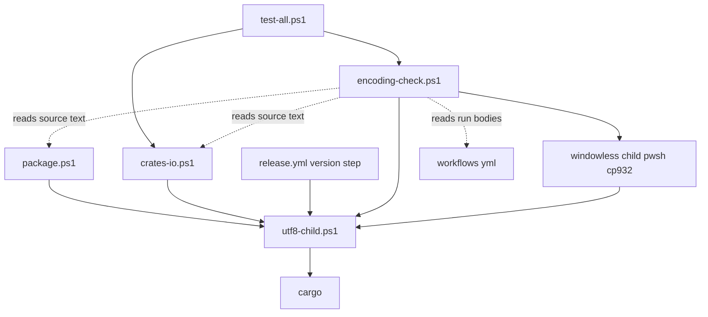
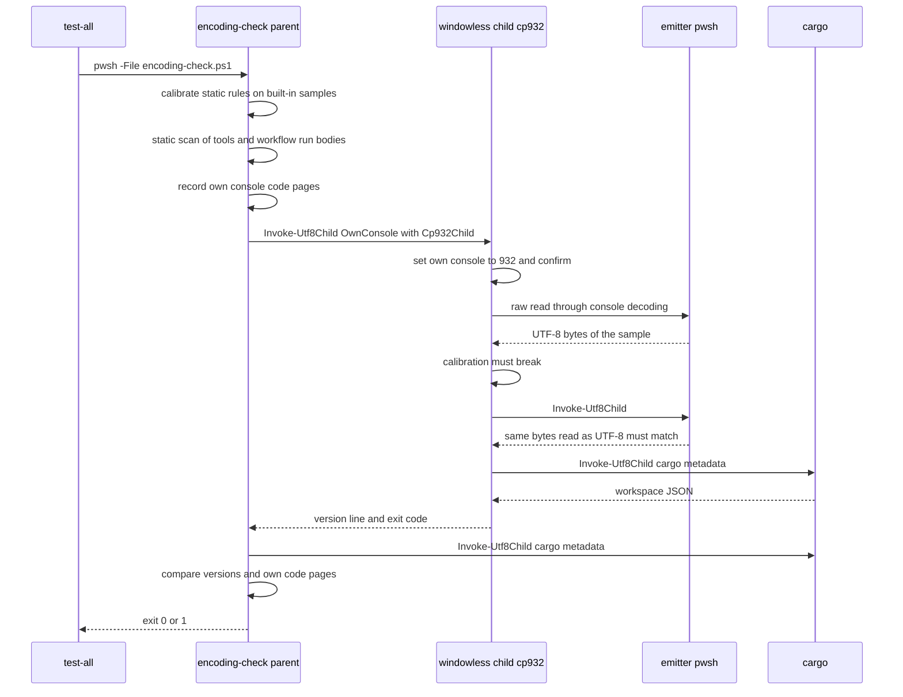

# Design Document: areka-P0-tools-utf8-child-output

## Overview

**Purpose**: リリースの道具が子のプロセスの出力を、端末の文字コードに依らず UTF-8 として読むようにする。あわせて、道具と workflow が端末を書き替える行をすべて消し、道具と workflow が自分で端末へ出す文を ASCII だけにする。直したことは、窓の無い子のプロセスだけが持つ端末をコードページ 932 にして版を読む判定と、本文を機械で読む判定で固定する。

**Users**: リリースを回す開発者が、Shift_JIS（932）の端末のまま `tools/package.ps1 -Check`・`tools/crates-io.ps1 -Verify`・`tools/test-all.ps1` を回す。CI（`release.yml`・`crates-io.yml`）はランナーの端末の文字コードのまま同じ本文を回す。

**Impact**: `tools/` に読み込み用のスクリプト 1 本（子を起こして UTF-8 で読む関数）と、判定のスクリプト 1 本が増える。版を読む 3 か所と検体のパスを読む所がその関数を通る。`tools/crates-io.ps1` の冒頭と workflow の各段の先頭の端末の書き替え（計 15 行）が消える。道具と workflow の端末へ出す文（設計の時点で 319 個の字句）が英語の ASCII になる。全体テストに段が 1 つ増える。

### Goals

- 版を読む 3 か所と検体のパスを読む所が、どのコードページの端末でも同じ値を読む（1.1〜1.5・2.1・2.2・3.7）。
- `tools/` と workflow の本文から端末の書き替えが無くなり、回した後の端末が回す前と同じ（3.1・3.2・3.7）。
- 道具と workflow が自分で端末へ出す文が ASCII だけで、意味と終了コードは今のまま（1.6・1.7・2.3・3.4・7.1・8.1〜8.4）。
- 読み方が端末に頼る形へ戻る・ASCII の外の字が入る・書き替えの行が戻る、のどれでも全体テストが赤になる（5.1〜5.5・8.5）。

### Non-Goals

- 版上げ・タグ・Release（`release-cycle`）。`Cargo.toml`・`Cargo.lock`・`THIRD-PARTY-NOTICES.md`・`dist/README.txt` に触れない。
- `tools/perf/`（`Invoke-PwshChild` の注記と実際のずれは別に `/kiro-discovery` で起票する候補）。
- 子の出力を人が読むためにそのまま写す所の文字化け。
- スクリプトの注記・workflow の段の名前・入力の説明・手順書の地の文の言い換え。
- workflow の段の順・権限・待ち方の作り替え。

## Boundary Commitments

### This Spec Owns

- 子を起こして標準出力と標準エラーを UTF-8 で持ち帰る関数 `Invoke-Utf8Child`（新しいファイル `tools/utf8-child.ps1`）と、その返り値の形。
- 版を読む 3 か所（`tools/package.ps1` 段「前提の確認」・`tools/crates-io.ps1`「2〜6. 実物の判定」の先頭・`release.yml` の段「版の検査」）と `tools/package.ps1` の `Read-SamplePaths` の読み方。
- `tools/crates-io.ps1` の冒頭の書き替えの撤去と、`release.yml` の 8 段の先頭＋段「zip を作る」の子の中の 1 行・`crates-io.yml` の 5 段の先頭の書き替えの撤去。
- 撤去の後も結果が端末の文字コードに依らないための、workflow の `gh` の読み方の手当て（`crates-io.yml` 段「release を待つ」・`release.yml` 段「既存の Release の検査」のタグの一覧）。
- `tools/*.ps1`（`tools/perf/` を除く）と `.github/workflows/*.yml` の `run:` の本文が自分で端末へ出す文の英語の文面（下の「端末へ出す文の一覧」が正本）。
- 判定のスクリプト `tools/encoding-check.ps1` と、`tools/test-all.ps1` のその段。
- `doc/crates-io-publish.md` の、道具の出す文を引いている所。`.kiro/steering/tech.md` の全体テストの説明・`.kiro/steering/structure.md` の `tools/` の一覧。
- 棚卸の結果（下の「棚卸の結果」）と、手元の確かめの記録（`research.md` に足す節）。

### Out of Boundary

- `tools/perf/` の全部（`perf-loop.common.ps1` の `Invoke-Child` は手本として読むだけ。読み込まない）。
- `Cargo.toml`・`Cargo.lock`・`THIRD-PARTY-NOTICES.md`・`dist/README.txt`・各クレートの `description`。
- `release-cycle` の文書（取り込んだ側が ASCII の文面へ読み替える）。`winget-manifest-submission` の `winget.yml`（倣う側）。
- 端末やランナーの設定を変える手順。workflow の段の順・権限・待ち方・`if:` の条件。
- 子のプロセス（cargo・rustc・gh・areka.exe）が出す文の中身。
- `kiro-complete` ほか共通の手順書（全体テストの段名が英語になることは読み替えで足りる。結果の判定は終了コード）。

### Allowed Dependencies

- PowerShell 7（`System.Diagnostics.ProcessStartInfo`・`System.Management.Automation.Language.Parser`・`[System.Text.Encoding]::GetEncoding(932)`。どれも pwsh に既に在る）。新しいモジュール・クレート・道具は足さない。
- 依存の向き: `tools/utf8-child.ps1` は何も読み込まない。`tools/package.ps1`・`tools/crates-io.ps1`・`tools/encoding-check.ps1`・`release.yml` 段「版の検査」が `tools/utf8-child.ps1` を読み込む（逆向きは禁止）。`tools/test-all.ps1` は `tools/encoding-check.ps1` を別のプロセスで回す。`tools/encoding-check.ps1` は他のスクリプトを読み込まず、本文として読むだけ。
- workflow の側: ランナーの `gh` の `--jq`（gh に組み込みの jq）。`release.yml` 段「版の検査」は「取り出し」の後なので `./tools/utf8-child.ps1` を読み込める。`crates-io.yml` 段「release を待つ」は「取り出し」の前なので `tools/` を読めない（`--jq` で手当てする）。

### Revalidation Triggers

- `Invoke-Utf8Child` の引数・返り値の形が変わる: 呼ぶ 4 か所と判定の静的な規則（呼び出しの形を見る）を見直す。
- 判定の対象（`tools/*.ps1`・`.github/workflows/*.yml` の `run:`）に新しいファイルが入る: そのファイルも ASCII の規則・書き替え禁止の規則に従う。`winget-manifest-submission` の `winget.yml` はここで判定に入る。`run:` の本文は pwsh として構文解析するので、pwsh 以外の shell の段を足すときは判定の作りを見直す。
- `$LOG_MARKER_*`（areka の記録の日本語の目印）を増やす・名前を変える: 判定の例外は変数名の前置き `LOG_MARKER_` で決まる。
- 道具の段の名前・出す文を変える: `doc/crates-io-publish.md` の引用と、`release-cycle` の記録の読み替えを見直す。
- 全体テストの段が増えた（`encoding check`）: `kiro-complete` は終了コードで判定するので変更不要。段の一覧を目で見る手順があれば読み替える。

## Architecture

### Existing Architecture Analysis

- 4 か所（版の 3 か所と `Read-SamplePaths`）は `@(cargo … 2>&1)` で子の出力を受ける。PowerShell は子の標準出力を `[Console]::OutputEncoding`（＝端末のコードページ）で解くので、932 の端末では UTF-8 の日本語の後ろの `"` が飲まれて JSON が壊れる（設計の時点の実験: 1 字 `版`（U+7248）だけの `description` で必ず壊れる）。
- `tools/crates-io.ps1` の冒頭と workflow の各段の先頭は `[Console]::OutputEncoding` を UTF-8 に書き替えて穴を隠している。`tools/crates-io.ps1` の行は端末そのもののコードページを書き替え、スクリプトの後も残る。
- 手本は `tools/perf/perf-loop.common.ps1` の `Invoke-Child`（`ProcessStartInfo`・標準出力と標準エラーを UTF-8・非同期で読み切ってから終了を待つ）。perf の変数に頼る部品集なので、読み込まずに小さく写す。

### Architecture Pattern & Boundary Map



**Architecture Integration**:
- Selected pattern: 共通の読み込み用スクリプト 1 本（ギャップ分析の案 B）。読み方の出どころを 1 か所にし、呼ぶ側は失敗の文と終了コードだけを持つ。
- Domain/feature boundaries: 「子を起こして UTF-8 で読む」は `utf8-child.ps1`、「何を読んで、どう失敗を言うか」は各呼び出し側、「直したことの固定」は `encoding-check.ps1`。
- Existing patterns preserved: 各スクリプトの終了コードの約束・`Step` と `Exit-Script` の形・`crates-io.ps1` の「判定の較正」の形（判定のスクリプトも較正から始める）・`release.yml` の「入力は環境変数だけ・手元でも同じ本文」。
- New components rationale: `utf8-child.ps1`＝同じ穴を 3 か所に写したのが今回の元なので、読み方を 1 つにする。`encoding-check.ps1`＝要件 5・8.5 の合否を全体テストで毎回見る（公開の道具の仕事を増やさない）。
- Steering compliance: 一時の物を作らない（判定は子のプロセスとメモリだけ）。終了コードで判定する。依存を足さない。

### Technology Stack

| Layer | Choice / Version | Role in Feature | Notes |
|-------|------------------|-----------------|-------|
| スクリプト | PowerShell 7（手元 7.6.6・ランナーの pwsh） | 道具・判定・workflow の本文 | `#Requires -Version 7` は既存どおり |
| 子の起動 | `System.Diagnostics.ProcessStartInfo` | 標準出力と標準エラーを UTF-8 で読む | `StandardOutputEncoding`・`StandardErrorEncoding`・`ArgumentList` |
| 本文の読み取り | `System.Management.Automation.Language.Parser.ParseInput` | 注記以外の字句・構文木を見る | 新しい依存なし |
| CI | `gh` の `--jq` | 各行の末尾を ASCII の欄にして読む | ランナーに在る物 |

## File Structure Plan

### Directory Structure

```
tools/
├── utf8-child.ps1      # 新規: Invoke-Utf8Child だけを定義する（読み込み用・単独では何もしない）
├── encoding-check.ps1  # 新規: 文字コードの判定（較正 → 本文の判定 → 932 の子の判定）。終了コード 0/1
├── package.ps1         # 変更
├── crates-io.ps1       # 変更
└── test-all.ps1        # 変更
```

### Modified Files

- `tools/package.ps1` — `utf8-child.ps1` を読み込む。段「前提の確認」の版を読む所と `Read-SamplePaths` を `Invoke-Utf8Child` へ。端末へ出す文と段の名前を英語へ。`Test-RunLog` の `Detail` から目印の文言を外す（目印は変数名で示す）。
- `tools/crates-io.ps1` — 冒頭の `[Console]::OutputEncoding` の行と注記を消す。`utf8-child.ps1` を読み込み、版を読む所を `Invoke-Utf8Child` へ。端末へ出す文・較正の見本の名前・較正が探す文の切れ端・較正の見本の中身（`# 理由`・`# 説明`・`# 権限`）を ASCII へ。
- `tools/test-all.ps1` — 段 `encoding check` を足す（「crates.io 公開前の確認」の後・`-License` の前）。段の名前と結果の一覧の文を英語へ。
- `.github/workflows/release.yml` — 8 段の先頭の書き替えの行を消す。段「zip を作る」を `-File` 呼び出しへ（子の中の書き替えを消す）。段「版の検査」を `Invoke-Utf8Child` へ。段「既存の Release の検査」のタグの一覧の `--jq` を末尾が ASCII の欄の形へ。`run:` の文を英語へ。
- `.github/workflows/crates-io.yml` — 5 段の先頭の書き替えの行を消す。段「release を待つ」の `gh api` を `--jq` で 3 つの欄へ絞る。`run:` の文と実行の要約の文を英語へ。
- `doc/crates-io-publish.md` — 道具の出す文の引用を英語の文面へ。
- `.kiro/steering/tech.md` — 全体テストの説明に段 `encoding check` と「道具の端末への文は ASCII・端末を書き替えない」を足す。
- `.kiro/steering/structure.md` — `tools/` の一覧に 2 本を足す。
- `.kiro/specs/areka-P0-tools-utf8-child-output/research.md` — 手元の確かめ（要件 6）の記録の節を足す。

## System Flows

### 判定（`tools/encoding-check.ps1`）



- 判定は「全部見てから 1 回だけ終了コードを決める」（失敗を集め、`FAIL …` を全部印字してから終了コード 1）。
- 子の端末を 932 にできなかった・較正で見本が壊れなかった（＝この機械では判定が戻りを見分けられない）ときも不合格にする。黙って合格にしない（5.5）。

## Requirements Traceability

| Requirement | Summary | Components | Interfaces | Flows |
|-------------|---------|------------|------------|-------|
| 1.1 | package.ps1 の版が端末に依らない | package.ps1・utf8-child.ps1 | `Invoke-Utf8Child` | 判定（932 の子） |
| 1.2 | crates-io.ps1 -Verify が端末に依らない | crates-io.ps1・utf8-child.ps1 | `Invoke-Utf8Child` | — |
| 1.3 | release.yml 段「版の検査」 | release.yml・utf8-child.ps1 | `Invoke-Utf8Child` | — |
| 1.4 | どんな字の並びでも読める | utf8-child.ps1・encoding-check.ps1 | UTF-8 で読む | 判定（見本 `版`） |
| 1.5 | 3 か所が同じ読み方 | 3 か所・encoding-check.ps1（静的） | 呼び出しの規則 | 本文の判定 |
| 1.6 | package.ps1 の失敗は 3 で ASCII の文 | package.ps1 | 文の一覧 | — |
| 1.7 | 公開の道具・版の検査の失敗は今の終了コード・JSON の失敗は捕まえない例外のまま | crates-io.ps1・release.yml | 文の一覧 | — |
| 2.1 | 検体のパスを書いたとおりに読む | package.ps1 `Read-SamplePaths` | `Invoke-Utf8Child` | — |
| 2.2 | ASCII の外の字を含むパスで実在の確かめ | package.ps1 `Read-SamplePaths` | `Test-Path -LiteralPath` | — |
| 2.3 | 鍵が無い・実在しないは ASCII の文で止まる | package.ps1 | 文の一覧 | — |
| 3.1 | 端末の設定を書き替えない（workflow も） | crates-io.ps1・release.yml・crates-io.yml・encoding-check.ps1（静的） | 書き替え禁止の規則 | 本文の判定 |
| 3.2 | 回した後の端末は前と同じ | 全道具・encoding-check.ps1 | 自分の端末のコードページを前後で比べる | 判定 |
| 3.3 | 撤去と読み方の直しを同じ PR | crates-io.ps1 | — | タスクの束ね方 |
| 3.4 | -Verify の人が読む行を同じ内容の ASCII で | crates-io.ps1 | 文の一覧 | — |
| 3.5 | -Pending の標準出力は前と同じ | crates-io.ps1 | 標準出力はクレート名だけ（変更なし） | — |
| 3.6 | test-all の公開前の確認が同じ結果 | crates-io.ps1・test-all.ps1 | 較正の見本と文の切れ端を揃える | — |
| 3.7 | どのコードページでも同じ結果・端末はそのまま | 全道具 | UTF-8 で読む＋ASCII だけを出す＋書き替えない | 判定 |
| 4.1 | 棚卸 | 本書「棚卸の結果」 | — | — |
| 4.2 | 判定に使う所を直す | package.ps1・crates-io.ps1 | `Invoke-Utf8Child` | — |
| 4.3 | 表示だけは記録 | 本書「棚卸の結果」 | — | — |
| 4.4 | 所ごとの扱いを 0 件も明示 | 本書「棚卸の結果」 | — | — |
| 5.1 | 932 から読んで版が取れれば合格 | encoding-check.ps1 | 932 の子 | 判定 |
| 5.2 | 端末に頼る読み方へ戻れば不合格 | encoding-check.ps1 | 本文の判定（素の呼び出しの禁止＋呼び出しの在処）＋932 の子 | 判定 |
| 5.3 | description の字に頼らない | encoding-check.ps1 | 固定の見本 `版`＋較正 | 判定 |
| 5.4 | 判定を回す端末を書き替えない | encoding-check.ps1 | 窓の無い子・前後のコードページの比較 | 判定 |
| 5.5 | 機械のコードページに依らず同じ合否 | encoding-check.ps1 | 子の端末を 932 に作る | 判定 |
| 6.1 | 932 のまま `-Check` が最後の段まで緑 | 手元の確かめの手順 | — | Testing Strategy の手元の確かめ |
| 6.2 | 932 のまま `-Verify` が書き替えずに緑 | 手元の確かめの手順 | — | Testing Strategy の手元の確かめ |
| 6.3 | 後の段で見つかれば棚卸に足して直す | 本書「棚卸の結果」・`Invoke-Utf8Child` | — | — |
| 6.4 | 結果を spec の文書に残す | research.md の節「手元の確かめの記録」 | — | — |
| 7.1 | 終了コードの約束を変えない | 3 本の道具 | 文の一覧（終了コードの列） | — |
| 7.2 | 版上げの 4 ファイルに触れない・依存を足さない | 全体 | Allowed Dependencies | — |
| 7.3 | release.yml の「入力は環境変数だけ」 | release.yml | 根から `./tools/utf8-child.ps1` を読む | — |
| 7.4 | 段の順・権限・待ち方を変えない | release.yml・crates-io.yml | 段の本文だけを変える | — |
| 7.5 | 環境変数を表示しない | utf8-child.ps1・encoding-check.ps1 | 環境を印字しない | — |
| 8.1 | tools の文は ASCII | tools/*.ps1 | 文の一覧 | — |
| 8.2 | workflow の本文の文は ASCII | release.yml・crates-io.yml | 文の一覧 | — |
| 8.3 | 意味を落とさない・終了コードを変えない | 全体 | 文の一覧 | — |
| 8.4 | 子の出力は書き替えない | package.ps1 `Step`・`Read-SamplePaths` | 子の行はそのまま写す | — |
| 8.5 | ASCII の外の字が入れば不合格 | encoding-check.ps1 | ASCII の規則 | 本文の判定 |
| 8.6 | 手順書の引用を合わせる | doc/crates-io-publish.md | — | — |
| 8.7 | 注記・段の名前・地の文は日本語のまま | encoding-check.ps1 の規則の範囲 | 注記と `run:` の外を見ない | — |

## Components and Interfaces

| Component | Domain/Layer | Intent | Req Coverage | Key Dependencies | Contracts |
|-----------|--------------|--------|--------------|------------------|-----------|
| `Invoke-Utf8Child`（`tools/utf8-child.ps1`） | 共通 | 子を起こし、標準出力と標準エラーを UTF-8 で持ち帰る | 1.1〜1.5・2.1・3.7・7.5 | ProcessStartInfo（P0） | Service |
| 版を読む 3 か所 | 道具・CI | 版を読み、今の文と終了コードで失敗を言う | 1.1〜1.3・1.5〜1.7 | `Invoke-Utf8Child`（P0） | — |
| `Read-SamplePaths`（package.ps1） | 道具 | 検体の窓口の `key=value` からパスを読む | 2.1〜2.3・8.4 | `Invoke-Utf8Child`（P0） | — |
| 端末へ出す文 | 道具・CI | 英語の ASCII の文面 | 1.6・1.7・2.3・3.4・7.1・8.1〜8.3・8.6 | — | 文の一覧 |
| workflow の `gh` の読み方 | CI | 撤去の後も端末に依らず読む | 3.1・3.7 | `gh --jq`（P1） | — |
| `encoding-check.ps1` | 判定 | 較正・本文の判定・932 の子の判定 | 1.4・1.5・3.1・3.2・5.1〜5.5・8.5・8.7 | `Invoke-Utf8Child`（P0）・Parser（P0） | Batch |
| `test-all.ps1` の段 | 全体テスト | 判定を毎回回す | 5.1・8.5 | `encoding-check.ps1`（P0） | — |

### 共通

#### Invoke-Utf8Child

| Field | Detail |
|-------|--------|
| Intent | 子のプロセスを起こし、標準出力と標準エラーを UTF-8 のバイトとして読んで持ち帰る |
| Requirements | 1.1, 1.2, 1.3, 1.4, 1.5, 2.1, 3.7, 7.5 |

**Responsibilities & Constraints**
- 端末の設定を読みも書きもしない。子の出力を印字しない（印字は呼ぶ側の仕事）。環境変数を印字しない。
- 子は今の PowerShell の場所（`Get-Location` の FileSystem の実パス）を作業フォルダにする。.NET のプロセスの作業フォルダは `Set-Location` で動かないので、必ず明示する（`package.ps1`・`crates-io.ps1` は根へ `Set-Location` している）。
- コマンド名は `Get-Command -CommandType Application` で解く。今の素の `cargo` 呼び出しと同じ探し方で、`package.ps1` が MSVC 以外の `link.exe` を外した後の `PATH` で探す（ギャップ分析 7-4 の答え）。
- 標準出力と標準エラーを先に非同期で読み始めてから終了を待つ（片方が埋まって子が止まるのを避ける）。
- `-OwnConsole` のときだけ `CreateNoWindow` を立てる（子は窓の無い自分だけの端末を持つ）。既定は立てない（cargo の長い組み立てを Ctrl+C で道連れに止められるよう、端末を分け合う今の形を保つ）。

**Dependencies**
- Inbound: `package.ps1`（版・検体のパス）・`crates-io.ps1`（版）・`release.yml` 段「版の検査」・`encoding-check.ps1` — P0
- External: `System.Diagnostics.ProcessStartInfo` — P0

**Contracts**: Service [x]

##### Service Interface

```powershell
# tools/utf8-child.ps1 （. で読み込む。単独で回しても何もしない）
function Invoke-Utf8Child {
    [OutputType([pscustomobject])]
    param(
        [Parameter(Mandatory)][string]$FilePath,   # コマンド名か絶対パス
        [string[]]$ArgumentList = @(),             # 1 要素 1 引数（ProcessStartInfo.ArgumentList に渡す・引用は .NET が付ける）
        [switch]$OwnConsole                        # 窓の無い自分だけの端末で起こす（判定の子だけが使う）
    )
}
# 返り値: [pscustomobject]@{
#   Code     = [int]       # 子の終了コード
#   Out      = [string]    # 標準出力の全部（UTF-8 で解いた字・BOM は外れる）
#   ErrLines = [string[]]  # 標準エラーを行に分け、空の行を除いた並び（無ければ空の並び）
# }
```
- Preconditions: `$FilePath` がアプリケーションとして見つかる。
- Postconditions: 子は終わっている。`Out` と `ErrLines` は子が書いたバイトを UTF-8 で解いた字。呼んだ側の端末の設定は前と同じ。
- Errors: コマンドが見つからない・起こせないときは throw（終了させる例外）。呼ぶ側の今の扱い（`Step` の catch・捕まえない例外）にそのまま乗る。子の終了コードが 0 でないことは throw にしない（`Code` で返す）。

**Implementation Notes**
- Integration: `package.ps1`・`crates-io.ps1`・`encoding-check.ps1` は `. (Join-Path $PSScriptRoot 'utf8-child.ps1')`。`release.yml` は `. ./tools/utf8-child.ps1`（段は作業ツリーの根で回る）。
- Validation: `encoding-check.ps1` の 932 の子が、見本と本物の `cargo metadata` で確かめる。
- Risks: `Set-StrictMode -Version 3.0` の下で読み込まれるので、未定義の変数を使わない。

### 道具と CI の読み方

#### 版を読む 3 か所

| Field | Detail |
|-------|--------|
| Intent | `Invoke-Utf8Child cargo @('metadata', '--no-deps', '--locked', '--format-version', '1')` の `Out` を `ConvertFrom-Json` に掛ける。失敗の文と終了コードは所ごとに今のまま |
| Requirements | 1.1, 1.2, 1.3, 1.5, 1.6, 1.7 |

| 所 | 子の失敗（`Code` が 0 でない） | JSON の失敗 |
|---|---|---|
| `package.ps1` 段「前提の確認」 | `Exit-Script 3`。`{1}` は `ErrLines` の最後の行（今の「標準エラーの最後の 1 行」と同じ） | `try`/`catch` で `Exit-Script 3`（今のまま） |
| `crates-io.ps1`「2〜6. 実物の判定」の先頭 | `Fail`（終了コード 1）。括弧の中は `ErrLines` の最後の行 | `try` で包まない。捕まえない例外で終了コード 1（1.7 のとおり今のまま） |
| `release.yml` 段「版の検査」 | `Write-Host` の後 `exit 1`。`{1}` は `ErrLines` の最後の行 | `try`/`catch` で `exit 1`（今のまま） |

- `crates-io.ps1` の括弧の中は今「標準出力と標準エラーを混ぜた並びの最後の行」。`cargo metadata` は失敗のとき標準出力に何も書かず、誤りを標準エラーに書くので、`ErrLines` の最後の行と同じ値になる（ギャップ分析 7-3 の答え）。
- `release.yml` の注記「版の読み方は tools/package.ps1 と同じ」は「tools/utf8-child.ps1 の Invoke-Utf8Child で読む（tools/package.ps1 と同じ）」へ改める。

#### Read-SamplePaths（package.ps1）

| Field | Detail |
|-------|--------|
| Intent | `Invoke-Utf8Child cargo @('run', '-q', '--locked', '-p', 'sample-ghost-kit', '--bin', 'nar-sample-path', '--', $Sample)` の `Out` を行に分け、`key=` で始まる行からパスを読む |
| Requirements | 2.1, 2.2, 2.3, 8.4 |

- 子の標準エラー（`cargo run -q` の警告など）は `ErrLines` を `Write-Host` でそのまま写す（今は段の `2>&1` が拾って画面に出ている。見え方を保つ＝ギャップ分析 7-2 の答え）。中身は子の物なので書き替えない（8.4）。ただし `Write-Host` の行は段 `Step` の `2>&1` に入らず「出力の末尾」に残らないので、終了コードの失敗の文に `ErrLines` の最後の行を添える（版を読む所と同じ形）。子が終わるまで標準エラーが出ない（逐次の表示が消える）ことは認める（`cargo run -q` が出す物は少ない）。
- 失敗の文 3 つ（終了コード・鍵が無い・実在しない）は意味を変えずに英語へ（文の一覧）。終了コードの判定は `$LASTEXITCODE` でなく `Code` で行う。
- パスは `Test-Path -LiteralPath … -PathType Container` で確かめる（ASCII の外の字も字のまま渡る＝2.2）。

#### workflow の `gh` の読み方（撤去の後の手当て）

| Field | Detail |
|-------|--------|
| Intent | 段の先頭の書き替えを消した後も、`gh` の出力を読む所の結果が端末の文字コードに依らない |
| Requirements | 3.1, 3.7 |

- 規則: `gh` の出力を値として読む所は、`--jq` で「比べる欄が ASCII で、各行の最後の欄が ASCII」の形に絞ってから読む。2 バイトの文字コード（932 など）で ASCII の外のバイトが続きのバイトを飲んでも、行の区切りの前は必ず ASCII の欄なので行が混ざらず、比べる欄は字のとおりに解ける。
- `crates-io.yml` 段「release を待つ」: 今は回の一覧の JSON を丸ごと読む（回の題・コミットの文を含む）。`--jq '.workflow_runs[] | [.head_branch, .status, (.conclusion | tostring)] | @tsv'` に変え、行をタブで分けて 1 つ目の欄が `$tag` と字のとおり同じ最初の行を採る。2 つ目＝`status`、3 つ目＝`conclusion`（`null` は文字 `null`）。HTTP 404 の見分け（標準エラーの `HTTP 404`）と待ち方は今のまま。この段は「取り出し」の前なので `tools/` を読めない。
- `release.yml` 段「既存の Release の検査」のタグの一覧: `--jq '.[].name'` を `--jq '.[] | [.name, .commit.sha] | @tsv'` に変え、各行の 1 つ目の欄を名前として `Get-PrevTag` に渡す。
- `release.yml` の Release の一覧（段「既存の Release の検査」と「後始末」の 1 字違わず同じ行）は既に `[.tag_name, .id, .html_url, .draft] | @tsv` で、最後の欄が ASCII（`true`／`false`）なので変えない。
- `crates-io.yml` 段「Release の確認」（`--jq .isDraft`）・段「残りの判定」（標準出力はクレート名＝ASCII）・段「記録」（子の標準エラーをファイルで受ける。子の文は ASCII になる）は変えない。
- 段「zip を作る」: `pwsh -NoProfile -NonInteractive -File ./tools/package.ps1 -Arch all` に変える（`-Command` は子の中で書き替えるためだけの形だった）。`$host.SetShouldExit($code)` と `exit $code` は今のまま。

### 判定

#### encoding-check.ps1

| Field | Detail |
|-------|--------|
| Intent | 読み方が端末に頼る形へ戻る・端末へ出す文に ASCII の外の字が入る・端末の書き替えが戻る、を合否で見張る |
| Requirements | 1.4, 1.5, 3.1, 3.2, 5.1, 5.2, 5.3, 5.4, 5.5, 8.5, 8.7 |

**Responsibilities & Constraints**
- 一時のファイル・フォルダを作らない。印字は ASCII だけ。環境変数を印字しない。
- 自分の端末を書き替えない。932 は `-OwnConsole` で起こした子の、子だけの端末に作る。要件 3.1 の書き替え禁止は共有の端末（開発者の窓・CI の段）が対象で、要件 5.5 が定める「判定のために起こす窓の無い子だけの端末」はその外（ギャップ分析の議題 3 は 10.1 の裁定で解けた）。規則 C の例外はこの 1 か所だけに絞る。
- 失敗を全部集めてから、`FAIL <所>: <中身>` を全部印字し、最後に `encoding check: <n> failure(s)`（終了コード 1）か `encoding check: all passed`（終了コード 0）。

**Contracts**: Batch [x]

##### Batch / Job Contract
- Trigger: `pwsh -NoProfile -File tools/encoding-check.ps1`（`test-all.ps1` の段 `encoding check`・手元でも単独で回せる）。内部の口 `-Cp932Child` は自分が起こす子だけが使う。
- Input: リポジトリの本文（`tools/*.ps1`＝`tools/perf/` を除く・`.github/workflows/*.yml`）と今のワークスペース（`cargo metadata`）。本文は `Get-Content -Raw -Encoding utf8` で読む。
- Output: 標準出力へ ASCII の行。終了コード 0＝全部合格・1＝1 つでも不合格。
- Idempotency: 何も書かないので何度回しても同じ。

**1. 判定の較正**（本文の規則が正しく通し・正しく落とすことを、埋めた見本で先に確かめる。見本の日本語は `` `u{…} `` で組み立て、判定のスクリプト自身は ASCII のまま）
- 見本は判定のスクリプトの中では文字列として持ち（単一引用符か連結。`$LOG_MARKER_*` を含む見本を二重引用符で書くと判定のスクリプト自身が規則 B に当たる）、`Parser.ParseInput` に掛けて判定する。
- 落とすべき見本: `$x = @(cargo metadata --no-deps 2>&1)`（素の呼び出し）・`Write-Host '<日本語>'`・`"<日本語> $y"`・`[Console]::OutputEncoding = [Text.Encoding]::UTF8`・`$OutputEncoding = …`・`chcp 65001`・`"$LOG_MARKER_A 件"`（目印の差し込み）・`run: |` の中の `Write-Host '<日本語>'` を持つ YAML。
- 通すべき見本: `# <日本語>` の注記・`<# <日本語> #>`・`$LOG_MARKER_A = '<日本語>'`・`$LOG_MARKER_B = @('<日本語>', 'x')`・`Invoke-Utf8Child cargo @('metadata')`・`- name: <日本語>` と `# <日本語>` だけを持つ YAML・`defaults:` → `run:` → `shell: pwsh` を持つ YAML（写像の `run:` を本文にしない）。

**2. 本文の判定**（対象＝`tools/*.ps1`（`tools/perf/` を除く・この 2 本の新しいスクリプトも含む）と、`.github/workflows/*.yml` の各 `run:` の本文）
- `run:` の本文の取り出し: 取り出すのは `steps` の要素の `run:` で、値が `|` のブロックか 1 行のスカラーのものだけ。`run: |` の行から、その行より深い字下げの行（と空の行）が続く間を本文とする。`run: <1 行>` はその 1 行。`defaults:` の下の `run:` のように値が写像（`shell: pwsh`）の `run:` は本文にしない。取り出した本文は pwsh として構文解析する（どちらの workflow も `defaults.run.shell: pwsh`）。構文の誤りは不合格。
- 規則 A（ASCII・8.5）: `Parser.ParseInput` の字句のうち、種類が注記でない字句の原文（`Extent.Text`。解いた値 `.Value` は見ない＝判定のスクリプト自身の `` `u{…} `` の見本は原文が ASCII なので当たらない）が、タブ・改行・`0x20〜0x7E` の外を含めば不合格（ファイル名と行を示す）。例外: 左辺が `$LOG_MARKER_*` の代入の右辺の中の字句（areka の記録を探す日本語の目印・印字しない）。YAML の `run:` の外（段の名前・注記・入力の説明）は見ない（8.7）。
- 規則 B（目印を文に差し込まない）: `$LOG_MARKER_*` の変数が、差し込みのある文字列（`"…"`・ヒアストリング）の中に現れたら不合格。
- 規則 C（書き替え禁止・3.1）: 構文木で、左辺が `[Console]::OutputEncoding`・`[Console]::InputEncoding`（`[System.Console]` の綴りも）・`$OutputEncoding` の代入、名前が `chcp`／`chcp.com` のコマンドがあれば不合格。字面の検索はしない（判定のスクリプト自身が較正の見本と規則の文字列にこの綴りを持つため。見本は文字列なので構文木の代入にもコマンドにもならない）。例外は `tools/encoding-check.ps1` の関数 `Set-OwnConsoleCp932` の中だけ（`-Cp932Child` のときにだけ呼ばれる）。
- 規則 D（素の呼び出しの禁止・5.2）: コマンド名が `cargo`／`cargo.exe` で、要素に `metadata` か `nar-sample-path` を含むコマンド（`&` 付きも含む）があれば不合格。
- 規則 E（呼び出しの在処・1.5・5.2）: 次の所に、名前が `Invoke-Utf8Child` で本文に `metadata`（または `nar-sample-path`）を含む呼び出しが 1 つ以上無ければ不合格: `tools/package.ps1`（`metadata` と `nar-sample-path` の両方）・`tools/crates-io.ps1`（`metadata`）・`.github/workflows/release.yml` の `run:`（`metadata`）。

**3. 932 の子の判定**（5.1・5.3・5.4・5.5）
- 親: 自分の `[Console]::OutputEncoding.CodePage` と `[Console]::InputEncoding.CodePage` を覚える → `Invoke-Utf8Child ([Environment]::ProcessPath) @('-NoProfile', '-NonInteractive', '-File', $PSCommandPath, '-Cp932Child') -OwnConsole` → 子の行を写す → 子の終了コードが 0 でなければ不合格 → 自分でも `Invoke-Utf8Child cargo metadata` で版を読み、子の `version=<版>` の行と字のとおり同じでなければ不合格 → 自分の 2 つのコードページが前と違えば不合格（5.4）。
- 子（`-Cp932Child`）: 標準出力と標準エラーの両方がつながれていなければ（＝開発者が手で端末から回した）何もせず終了コード 1（開発者の端末を書き替えない）。`Set-OwnConsoleCp932` で自分の端末を 932 にし、`[Console]::OutputEncoding.CodePage` が 932 でなければ不合格。
  - 見本: `{"description":"版","version":"0.0.1"}`（`版`＝U+7248。UTF-8 の最後のバイト `0x88` が 932 の 1 バイト目で、続く `"` を飲む）。見本を出す子は `pwsh -NoProfile -NonInteractive -Command "[Console]::OpenStandardOutput().Write([Convert]::FromBase64String('<見本の UTF-8 の Base64>'))"`（バイトをそのまま書く）。
  - 較正: 見本を出す子を素の呼び出し（`@(& $pwsh … 2>&1) -join "`n" | ConvertFrom-Json`）で読み、JSON が読めて `description` が見本と同じなら不合格（この端末では戻りを見分けられない）。
  - 本番: 見本を出す子を `Invoke-Utf8Child` で読み、`description` が見本と字のとおり同じで `version` が `0.0.1` でなければ不合格（5.3）。
  - 本物: `Invoke-Utf8Child cargo metadata` を読み、`areka` のパッケージがちょうど 1 つで、版が `^\d+\.\d+\.\d+(-[0-9A-Za-z.-]+)?$` に合えば `version=<版>` を出す。でなければ不合格（5.1）。

**Implementation Notes**
- Integration: `test-all.ps1` に `Step 'encoding check' { pwsh -NoProfile -File tools/encoding-check.ps1 }` を「crates.io 公開前の確認」の後に足す。
- Validation: 5.2 は「規則 D・E（本文）」と「932 の子（関数の中身）」の 2 本で塞ぐ。どの所を `@(cargo metadata … 2>&1)` へ戻しても規則 D と E が落ち、`Invoke-Utf8Child` の中の UTF-8 の指定を外せば 932 の子の本番が落ちる。どちらも今の `description` の字に頼らない。
- Risks: Windows に 932 のコードページが入っていない機械では子の端末を 932 にできず不合格になる（黙って合格にはしない）。Windows の標準の構成には入っている。

## 棚卸の結果（要件 4）

調べたスクリプト: `tools/package.ps1`・`tools/crates-io.ps1`・`tools/test-all.ps1`（`tools/` の直下はこの 3 本だけ・`tools/perf/` は除く）。新しい 2 本（`utf8-child.ps1`・`encoding-check.ps1`）は読み方そのものなので対象に数えない。

| スクリプト | 所 | 子の出力の使い方 | 扱い |
|---|---|---|---|
| package.ps1 | `cargo metadata`（段「前提の確認」） | JSON | 直した |
| package.ps1 | `nar-sample-path`（`Read-SamplePaths`） | パス | 直した |
| package.ps1 | `git rev-parse --short=7 HEAD` | 値（BUILD-INFO と zip の判定） | ASCII しか出ないので対象外 |
| package.ps1 | `git status --porcelain`（始めと終わり） | 比べる | ASCII しか出ないので対象外（git が日本語のパスを ASCII の逃がし字で出す・要件の範囲外にも明記） |
| package.ps1 | `cargo about --version`・`cargo deny --version` | 捨てる（終了コードだけ） | 字面に依らないので対象外 |
| package.ps1 | `vswhere … -property installationPath` | 空かどうかだけ | 字面に依らないので対象外 |
| package.ps1 | 段の中の子（`rustup`・`cargo build`・`cargo deny check`・`cargo about generate`） | 表示と、失敗のときの出力の末尾 | 表示だけで対象外 |
| package.ps1 | `areka.exe`（`Start-Process -RedirectStandardOutput/-RedirectStandardError` → `Get-Content -Raw`） | 記録の判定 | 端末を通らないので対象外（子がファイルへ直に書き、pwsh 7 が UTF-8 で読む） |
| crates-io.ps1 | `cargo metadata` | JSON | 直した |
| crates-io.ps1 | `cargo publish --dry-run`・`cargo package` | 受けない（終了コードだけ） | 表示だけで対象外 |
| test-all.ps1 | `git rev-parse --short HEAD` | 一覧への表示 | ASCII しか出ないので対象外 |
| test-all.ps1 | `@(git status --porcelain).Count` | 行の数だけ | 字面に依らないので対象外 |
| test-all.ps1 | 各段の子（`rustup`・`cargo`・`pwsh -File tools/crates-io.ps1`） | 受けない（終了コードだけ） | 表示だけで対象外 |

- 子のプロセスでない読み取り（`crates-io.ps1` の `Invoke-WebRequest`・`Get-Content -Raw` の Cargo.toml と workflow）は棚卸の対象外（端末を通らない）。
- 直す所は 4 か所で、上の 2 本の外に **0 件**。
- 表示だけの文字化けの記録（4.3）: 設計の時点で見つかったのは `package.ps1` の道具自身の文の 3 行（`—`＝U+2014 を含む「展開先が長すぎる…」「展開した木を消せなかった…」と、`〜`＝U+301C を含む「判定 1〜8 すべて合」）。どれも要件 8 で ASCII の文になり解消する。子の出力をそのまま写す所の文字化けは、設計の時点で **0 件**（要件 6 の手元の確かめで見つかれば `research.md` の記録に足す）。
- 参考（`tools/` の外・撤去の影響を受ける workflow の読み取り）: 上の「workflow の `gh` の読み方」のとおり。段「release を待つ」とタグの一覧を直し、他は ASCII の欄だけを読むので変えない。

## Error Handling

### Error Strategy

- 失敗の分け方と終了コードは変えない（`package.ps1`: 0・1・2・3／`crates-io.ps1`: 0・1／`test-all.ps1`: 0・1／`release.yml` 段「版の検査」: 1）。変えるのは文の字だけ。
- 文に入れる値（パス・子の出力の行・例外の文・版・URL）は今のまま差し込む。値の中の字は子や実行環境の物で、書き替えない（8.4 と同じ考え）。道具の作者が書く字だけを ASCII にする。
- `crates-io.ps1` の JSON の失敗は捕まえない例外のまま（1.7）。

### Monitoring

- 判定 `encoding-check.ps1` を全体テストで毎回回す。CI では回さない（全体テストが門のまま・steering の方針どおり）。

## Testing Strategy

- 静的な判定（`encoding-check.ps1` の 1・2）: 較正の見本で規則 A〜E がそれぞれ通し・落とすことを確かめた上で、実物の 3 本の道具・新しい 2 本・2 本の workflow を判定する。ASCII の外の字（8.5）・書き替えの行（3.1）・素の `cargo metadata`／`nar-sample-path`（5.2）・3 か所の呼び出しの在処（1.5）が対象。
- 動的な判定（`encoding-check.ps1` の 3）: 窓の無い子の端末を 932 にし、較正（素の読み方で見本が壊れる）→ 本番（`Invoke-Utf8Child` で見本が字のとおり読める）→ 本物（今のワークスペースの版が読め、親が読んだ版と同じ）の順に確かめる。親の端末のコードページが前後で同じことも確かめる（5.4）。
- 戻しの確かめ（実装のときに 1 回・記録を残す）: ⒜ `package.ps1` の版を読む所を `@(cargo metadata … 2>&1)` へ戻すと規則 D・E が落ちる ⒝ `utf8-child.ps1` の `StandardOutputEncoding` の行を消すと 932 の子の本番が落ちる ⒞ 道具の文に日本語を 1 字足すと規則 A が落ちる ⒟ `crates-io.ps1` の冒頭に書き替えの行を戻すと規則 C が落ちる。戻した後は元へ戻して緑を確かめる。
- 全体テスト: `tools/test-all.ps1` の段「crates.io 公開前の確認」が前と同じく緑（3.6）。較正の見本の名前と探す文の切れ端は新しい英語の文と揃える。
- 手元の確かめ（6.1〜6.4・窓が開くので開発者）: 932 の端末のまま、`tools/package.ps1 -Check` が段 `finalize` まで緑で終わること、`tools/crates-io.ps1 -Verify` が緑で終わること、回す前後で `[Console]::OutputEncoding.CodePage` と `chcp` が同じことを確かめ、端末の文字コード・終了コード・通った段を `research.md` の節「手元の確かめの記録」に残す。版を読む段より後で文字コードのために落ちる所が見つかれば、棚卸に足して同じ読み方で直す（6.3）。
- CI の確かめ: `release.yml` を `workflow_dispatch` で乾いた走りに回し、段「版の検査」「既存の Release の検査」「zip を作る」が緑で、ログが ASCII で読めることを確かめる。`crates-io.yml` の段「release を待つ」はタグの push でしか回らないので、`--jq` の式は実装のときに手元の `gh api`（`event=workflow_dispatch` の回の一覧）で出力の形を確かめる。

## Security Considerations

- `Invoke-Utf8Child` と判定は環境変数を印字しない（7.5）。判定の子へ渡すのは引数だけ。
- `release.yml` の段「版の検査」は作業ツリーの `tools/utf8-child.ps1` を読み込む。取り出したコミット（タグのコミット）の物なので、`crates-io.yml` が既に `tools/crates-io.ps1` を使うのと同じ信頼の範囲。

## Supporting References

### 端末へ出す文の一覧（要件 8・英語の文面の正本）

- 書き方の約束: 意味（どの段の・何が・どの値で）を落とさない。値の差し込み（`$…`・`{0}`）は今と同じ位置・同じ値。全角の括弧・中黒・ダッシュ・矢印は `()`・`, `／`; `・`-`・`->` に。並びをつなぐ `'・'` は `', '`（失敗の文の並びは `'; '`）。
- 「合／否」は `PASS`／`FAIL`、「緑／赤」は `green`／`red`、段の失敗の印 `FAIL` と成功の印 `OK` は今のまま。

#### tools/package.ps1 の段の名前（`==> 名前`・`OK 名前`・`FAIL 名前` に出る）

| 今 | 英語 |
|---|---|
| 前提の確認 | `preflight` |
| i686 ターゲット導入 | `add i686 target` |
| arm64 ターゲット導入 | `add arm64 target` |
| i686 helper ビルド | `build i686 helper` |
| `$a` 本体ビルド | `build $a areka` |
| 静的リンクの確認 | `check static linking` |
| ライセンス検査 | `license check` |
| 謝辞の生成 | `generate third-party notices` |
| 検体の展開 | `extract samples` |
| `$a` 組み立て | `$a assemble` |
| `$a` 圧縮 | `$a compress` |
| `$a` 中身の判定 | `$a content check` |
| `$a` SHA256 | `$a SHA256`（変更なし） |
| 短いパスへ展開 | `expand to short path` |
| 起動 | `launch` |
| 番犬 | `watchdog` |
| 記録の判定 | `log check` |
| 後片付け | `cleanup` |
| git status 不変の確認 | `git status unchanged` |
| 完成 | `finalize` |

#### tools/package.ps1 の文

| 所・今の文（要旨） | 英語 | 終了コード |
|---|---|---|
| `Step` 成功 `OK   $Name（$sec 秒）` | `OK   $Name ($sec s)` | — |
| `Step` 理由 `終了コード $LASTEXITCODE` | `exit code $LASTEXITCODE` | — |
| `Step` 見出し `---- 出力の末尾（最大 N 行） ----` | `---- output tail (last $OUTPUT_TAIL_LINES lines) ----` | — |
| `Step` 失敗 `FAIL $Name（$sec 秒・$reason）` | `FAIL $Name ($sec s, $reason)` | 1 |
| -SmokeExitMs は正の整数で指定する（受け取った値: …） | `-SmokeExitMs must be a positive integer (got: '$SmokeExitMs')` | 3 |
| -Arch は {0} のどれかで指定する（受け取った値: …）・並びは `'・'` | `-Arch must be one of {0} (got: '{1}')`・並びは `', '` | 3 |
| -Check の起動確認には x64 の zip が要る（…） | `-Check needs the x64 zip (combine with -Arch x64 or all; got: '$Arch')` | 3 |
| -CheckDir は絶対パスで指定する（…） | `-CheckDir must be an absolute path (got: '$CheckDir')` | 3 |
| -CheckDir はリポジトリの中なら …target\ の下を指定する（…） | `-CheckDir inside the repository must be under ${repoRoot}target\ (got: '$CheckDir')` | 3 |
| 展開先が長すぎる（{0} 文字・上限 {1}）: {2} — … | `expand path too long ({0} chars, limit {1}): {2} - pass a shorter -CheckDir (outside the repository or under ${repoRoot}target\) or move the worktree to a shorter path` | 3 |
| git が動かない（…） | `git does not run (install git and add it to PATH)` | 3 |
| cargo about が無い（…で入れる） | `cargo about not found (install with: cargo install cargo-about --version 0.9.2 --locked)` | 3 |
| cargo deny が無い（…で入れる） | `cargo deny not found (install with: cargo install cargo-deny --version 0.20.2 --locked)` | 3 |
| Cargo.lock が無い（…） | `Cargo.lock not found (restore the tracked Cargo.lock from git)` | 3 |
| vswhere.exe が無い（探した場所: …） | `vswhere.exe not found (searched: $VSWHERE_PATH and PATH; install Visual Studio or Build Tools)` | 3 |
| arm64 のリンクに要る VS の部品が無い（…） | `VS component for arm64 linking not found (add $ARM64_VS_COMPONENT in VS Installer; vswhere: $vswhere)` | 3 |
| 版を読めない（cargo metadata が終了コード {0}: {1}） | `cannot read the version (cargo metadata exited with code {0}: {1})` | 3 |
| 版を読めない（cargo metadata の出力が JSON として読めない: $_） | `cannot read the version (cargo metadata output is not valid JSON: $_)` | 3 |
| 版を読めない（cargo metadata に areka のパッケージが N 件） | `cannot read the version (cargo metadata has $($pkg.Count) areka package(s))` | 3 |
| 版を読めない（areka の version が空。…） | `cannot read the version (areka version is empty; set [workspace.package] version in Cargo.toml)` | 3 |
| 版の形が違う（…・受け付ける形 …。+ の付記は付けない） | `unexpected version format ('$script:Version'; accepted: $VERSION_PATTERN; no + suffix)` | 3 |
| 前回の物を消した: $p | `removed previous artifact: $p` | — |
| コミット …・未コミットの変更 N 件・版 …・CPU 種別 … | `commit $script:Commit, uncommitted changes $script:Dirty, version $script:Version, arch $($script:BuildArchs -join ', ')` | — |
| PE の署名が無い | `no PE signature` | — |
| 知らない optional header の magic 0x{0:x} | `unknown optional header magic 0x{0:x}` | — |
| RVA 0x{0:x} がどの節にも無い | `RVA 0x{0:x} is in no section` | — |
| ビルドの出力が無い: $exe | `build output missing: $exe` | — |
| `{0}: 機種 0x{1:x4}（期待 0x{2:x4}）・取り込み {3}` | `{0}: machine 0x{1:x4} (expected 0x{2:x4}), imports {3}` | — |
| `  機種が違う` | `  wrong machine` | — |
| `  拒否表に当たる: …` | `  matches the deny list: $($denied -join ', ')` | — |
| 機種が違うか、VC++ ランタイムの DLL を読んでいる（…） | `wrong machine or loads a VC++ runtime DLL (+crt-static not effective)` | — |
| 謝辞の出力が無い: … | `third-party notices output missing: $script:Notices` | — |
| nar-sample-path $Sample が終了コード N | `nar-sample-path $Sample exited with code $($r.Code): $($r.ErrLines \| Select-Object -Last 1)` | — |
| nar-sample-path $Sample の出力に $key= が無い | `nar-sample-path $Sample output has no $key=` | — |
| nar-sample-path $Sample の $key= が実在しない: $path | `nar-sample-path $Sample ${key}= does not exist: $path` | — |
| 1 必須の項目が無い: $r | `1 required entry missing: $r` | — |
| 2 許可表に無い項目: … | `2 entry not in the allow list: $prefix$_` | — |
| 3 profile/ を含む項目が N 件（最初: …） | `3 $($prof.Count) entries contain profile/ (first: $($prof[0]))` | — |
| 4 許可表に無い実行ファイル: $_ | `4 executable not in the allow list: $_` | — |
| 4 実行ファイルが無い: $_ | `4 executable missing: $_` | — |
| 5 PE として読めない: $n（$_） | `5 cannot read as PE: $n ($_)` | — |
| `{0}: 機種 0x{1:x4}・取り込み {2}` | `{0}: machine 0x{1:x4}, imports {2}` | — |
| 5 機種が違う: {0} は 0x{1:x4}（期待 0x{2:x4}） | `5 wrong machine: {0} is 0x{1:x4} (expected 0x{2:x4})` | — |
| 6 拒否表の DLL を読む: $n → … | `6 imports a denied DLL: $n -> $($denied -join ', ')` | — |
| 7 説明書が無い: … | `7 readme missing: $($pair[0])` | — |
| 7 emo2.nar に … が無い | `7 emo2.nar has no $($pair[1])` | — |
| 7 emo2.nar の … とバイトが違う: … | `7 bytes differ from $($pair[1]) in emo2.nar: $($pair[0])` | — |
| 8 … とバイトが違う: … | `8 bytes differ from $($pair[1]): $($pair[0])` | — |
| 8 BUILD-INFO.txt に … が無い | `8 BUILD-INFO.txt lacks $want` | — |
| 判定 1〜8 すべて合 | `content checks 1-8 all passed` | — |
| 否 $_ | `FAIL $_` | — |
| 中身の判定で否が N 件 | `content check: $($bad.Count) failure(s)` | 1 |
| 展開先が既に在る: … | `expand dir already exists: $script:ExpandDir` | 1 |
| 記録の置き場が既に在る: … | `log dir already exists: $script:LogDir` | 1 |
| arm64 の zip は作ったが起動確認はしていない（…） | `built the arm64 zip but did not launch-check it (the launch check covers the x64 zip only)` | — |
| 展開先: … | `expanded to: $script:ExpandDir` | — |
| 子のプロセス番号: … | `child process id: $($script:Child.Id)` | — |
| 番犬: N ミリ秒を超えたので自分が起こした子（プロセス番号 …）だけを止めた | `watchdog: exceeded $limitMs ms; killed only the child this script started (process id $($script:Child.Id))` | — |
| 子の終了コード: … | `child exit code: $($script:Child.ExitCode)` | — |
| 記録の判定の行 `{0} {1}（{2}）`・`合`／`否` | `{0} {1} ({2})`・`PASS`／`FAIL` | — |
| 記録: …（2 行） | `log: $script:RunLog`・`log: $script:RunErrLog` | — |
| 起動確認の否（{0}）・並びは `'・'` | `launch check failed ({0})`・並びは `', '` | 2 |
| 展開した木を残した（-KeepExpanded）: … | `kept the expanded tree (-KeepExpanded): $script:ExpandDir` | — |
| 展開した木を消せなかった（段「後片付け」・N 回試した）: … — … | `could not remove the expanded tree (stage 'cleanup', tried $REMOVE_RETRY times): $script:ExpandDir - $($last.Exception.Message)` | 1 |
| 展開した木を消した: … | `removed the expanded tree: $script:ExpandDir` | — |
| 記録（残す）: … | `log (kept): $script:LogDir` | — |
| git status が失敗した | `git status failed` | 1 |
| 消えた $_／増えた $_ | `gone $_`／`new $_` | — |
| git status --porcelain が始めと違う | `git status --porcelain differs from the start` | 1 |
| 完成の最後 `コミット …・未コミットの変更 N 件` | `commit $script:Commit, uncommitted changes $script:Dirty` | — |
| 最後 `全段 緑` | `all steps green` | 0 |

`Test-RunLog` の行（`Name` と `Detail`。目印の文言は出さず、変数名で示す＝規則 B）:

| 今の Name | 英語の Name | 英語の Detail |
|---|---|---|
| 番犬で止めていない | `not killed by watchdog` | `killed by watchdog`／`exited by itself` |
| 有界で走った | `ran bounded` | `LOG_MARKER_SMOKE_GATE: $gate line(s)` |
| 終了コード 0 | `exit code 0` | `exit code $ExitCode` |
| ゴーストの窓が立った | `ghost window opened` | `LOG_MARKER_WINDOWS: $win line(s)` |
| SHIORI の接続の失敗が無い | `no SHIORI connection failure` | 当たった目印ごとに `LOG_MARKER_FAULTS[$i]: $n line(s)` を `'; '` でつなぐ・無ければ `fault markers: 0 lines` |
| 会話が始まった | `talk started` | `LOG_MARKER_GREETING: $greet line(s) before auto exit, $all in total` |
| 初回のバルーンは同梱 | `first balloon is bundled` | 行が無い: `no LOG_MARKER_BALLOON line`／在る: 行が `LOG_MARKER_BALLOON_ROUTE` を含めば `route=Companion dir=$dir`、含まなければ `route=other dir=$dir`（`$dir` は areka の記録から読んだ値をそのまま） |

#### tools/crates-io.ps1 の文

| 所・今の文（要旨） | 英語 | 終了コード |
|---|---|---|
| `Fail` の頭 `失敗 $Message` | `FAIL $Message` | 1 |
| 一覧の外なのに出せる: … | `publishable but not in the list: $($extra -join ', ')` | — |
| 一覧にあるのに出せない: … | `in the list but not publishable: $($missing -join ', ')` | — |
| … の欄が空: … | `$($pkg.name) has empty fields: $($empty -join ', ')` | — |
| … の Cargo.toml に「publish = false # 理由」の行が無い | `$Name Cargo.toml has no line 'publish = false # <reason>'` | — |
| … の版 … が渡された版 … と違う | `$($pkg.name) version $($pkg.version) differs from the given version $Want` | — |
| … の .crate が無い | `$name .crate is missing` | — |
| … の .crate が N バイトで上限 M バイトを超える | `$name .crate is $size bytes, over the limit of $Max bytes` | — |
| … は crates.io に 1 つも版が無い・手順書の予備の手順で出して Trusted Publishing を設定する | `$Name has no version on crates.io yet; publish it with the fallback procedure in the guide and set up Trusted Publishing` | — |
| … の索引を読めない（HTTP …） | `cannot read the index of $Name (HTTP $Status)` | — |
| … の … が crates.io に無い | `$Name $Want is not on crates.io` | — |
| … が secrets. を参照している（…） | `$Name references secrets. (credentials are Trusted Publishing and github.token only)` | — |
| … に行頭の on: が無い | `$Name has no top-level on:` | — |
| … の on: を 1 行に書いている（…）: … | `$Name writes on: on one line (triggers must be workflow_dispatch and tag push only): $inline` | — |
| … の on: の直下にきっかけが無い | `$Name has no trigger under on:` | — |
| … の on: を並び（- で始まる行）で書いている（キーの形で書く） | `$Name writes on: as a list (lines starting with -); write keys instead` | — |
| … の on: の直下に workflow_dispatch・push 以外のきっかけ: … | `$Name has triggers other than workflow_dispatch and push under on: $($other -join ', ')` | — |
| … の on: の直下に workflow_dispatch（…）が無い | `$Name has no workflow_dispatch (manual re-run entry) under on:` | — |
| … の push: を 1 行に書いている（…） | `$Name writes push: on one line (put only tags: under it)` | — |
| … の push: の下に tags 以外: …（…） | `$Name has keys other than tags under push: $($bad -join ', ') (do not run on branch or path pushes)` | — |
| … の push: の下に tags: が無い（…） | `$Name has no tags: under push: (run on tag push only)` | — |
| 較正「…」: 正しい見本（…）を落とした: … | `calibration '$Judgment': good sample ($Sample) was rejected: $text` | 1 |
| 較正「…」: 誤った見本（…）を通した | `calibration '$Judgment': bad sample ($Sample) was accepted` | 1 |
| 較正「…」: 誤った見本（…）の失敗の文に「…」が無い: … | `calibration '$Judgment': failure text of bad sample ($Sample) lacks '$m': $text` | 1 |
| 較正と判定の並びのつなぎ `'・'` | `'; '` | — |
| 読み取り: cargo metadata が終了コード N（…） | `read: cargo metadata exited with code $($r.Code) ($($r.ErrLines \| Select-Object -Last 1))` | 1 |
| 判定「…」: … | `check '$Judgment': $($Got -join '; ')` | 1 |
| OK 判定「…」 | `OK check '$Judgment'` | — |
| 残り: … がワークスペースに無い | `pending: $name is not in the workspace` | 1 |
| 残り: … は 4 文字未満で、… | `pending: $name is shorter than 4 characters; its index path rule is not implemented` | 1 |
| 残り: … の索引を読めない（…） | `pending: cannot read the index of $name ($($_.Exception.Message))` | 1 |
| 残り: $err | `pending: $err` | 1 |
| 残り: … の索引を読めない（本文: …） | `pending: cannot read the index of $name (body: $($_.Exception.Message))` | 1 |
| 無い … …／在る … … | `absent $name $($pkg.version)`／`present $name $($pkg.version)` | — |
| 判定「公開の段の形」: … が無い | `check 'workflow shape': $WORKFLOW is missing` | 1 |
| 包む: … が終了コード N（…） | `package: $step exited with code $LASTEXITCODE ($($PUBLISH -join ', '))` | 1 |
| OK 包む（…） | `OK package ($step)` | — |
| 緑（公開する一覧: …） | `green (publish list: $($PUBLISH -join ', '))` | 0 |

判定の名前（`$Judgment`・較正と本番で同じ）: 一覧 `list`・欄 `fields`・理由 `reason`・版 `version`・大きさ `size`・残り `pending`・公開の段の形 `workflow shape`。

較正の見本の名前（`$Sample`）と、探す文の切れ端（`$Mention`）:

| 判定 | 今の見本の名前 → 英語 |
|---|---|
| list | 正しい見本 `good sample`・一覧の外のクレートが出す `crate outside the list publishes`・一覧の外のクレートが置き場を名指しで出す `crate outside the list names a registry`・wintf が出さない `wintf does not publish` |
| fields | 正しい見本 `good sample`・説明が空 `empty description` |
| reason | 理由つきの行 `line with a reason`・publish = false だけの行 `bare publish = false line`・コメントが別の行 `comment on another line`・コメントにした行 `commented-out line`・中身の無いコメント `empty comment` |
| version | 同じ版 `same version`・違う版 `different version` |
| size | 上限ちょうど `exactly at the limit`・上限を 1 バイト超え `1 byte over the limit`・.crate が無い `.crate missing` |
| pending | その版が在る `version present`・その版が無い `version absent`・索引が 404 `index 404`・索引が 500 `index 500` |
| workflow shape | 正しい見本 `good sample`・on: が最初の行 `on: on the first line`・workflow_dispatch だけ `workflow_dispatch only`・On: と書いた `written as On:`・pull_request を足した `pull_request added`・workflow_run を足した `workflow_run added`・schedule を足した `schedule added`・Push: と書いた `written as Push:`・workflow_dispatch が無い `no workflow_dispatch`・push に branches `branches under push`・push に paths `paths under push`・push の下が空 `empty push`・push を 1 行に `push on one line`・on: を並びで `on: as a list`・on: を 1 行に `on: on one line`・on: を 1 行の並びで `on: as a one-line list`・on: が無い `no on:`・secrets. を含む `contains secrets.` |

- 探す文の切れ端: `'1 つも版が無い'` → `'no version'`・`'予備の手順'` → `'fallback'`・`'並び'` → `'list'`。他の切れ端（クレート名・版・`on:`・`push`・`tags` など）は ASCII のまま。
- 較正の見本の中身: `# 理由` → `# reason`（`Test-Reason` の 4 つの見本）・`$flow` の `# 説明` → `# description`・`# 権限` → `# permissions`（`(?=^# 権限)` の 4 つの正規表現も `(?=^# permissions)` へ）。見本の意味（注記の位置）は変わらない。

#### tools/test-all.ps1 の文

| 今 | 英語 |
|---|---|
| 段 i686 ターゲット導入 | `add i686 target` |
| 段 i686 成果物ビルド | `build i686 artifacts` |
| 段 cargo fmt（整形） | `cargo fmt (format)` |
| 段 fmt --check | `fmt --check`（変更なし） |
| 段 x64 ワークスペース全テスト | `x64 workspace tests` |
| 段 i686 テスト（host-32 系） | `i686 tests (host-32)` |
| 段 crates.io 公開前の確認（包むだけ） | `crates.io pre-publish check (package only)` |
| （新しい段） | `encoding check` |
| 段 cargo deny check・cargo about generate | 変更なし |
| `==== 結果（検査したコミット …・開始時の未コミットの変更 N 件） ====` | `==== results (commit $head, uncommitted changes at start: $dirty) ====` |
| `{0}  {1}（{2} 秒・終了コード {3}）` | `{0}  {1} ({2} s, exit code {3})` |
| THIRD-PARTY-NOTICES.md に差分あり（…） | `THIRD-PARTY-NOTICES.md has changes (dependencies changed; include it in the commit)` |
| 赤 N 段 | `red: $failed step(s)` |
| 全段 緑 | `all steps green` |

#### tools/encoding-check.ps1 の文（新規・すべて ASCII）

`PASS <name>`・`FAIL <file>:<line>: <rule> <token>`・`FAIL calibration <rule>: <sample>`・`FAIL cp932 child: <what>`・`version=<v>`（子）・`encoding check: <n> failure(s)`／`encoding check: all passed`。`-Cp932Child` を端末から直に回したとき: `-Cp932Child is internal; run tools/encoding-check.ps1 without it`。

#### .github/workflows/release.yml の `run:` の文

| 段・今の文（要旨） | 英語 |
|---|---|
| 改行の設定 `(未設定)` | `(not set)` |
| 改行の設定 core.autocrlf の元の値と出どころ: … | `core.autocrlf original value and origin: $origin` |
| 版の検査 版を読めない（3 種） | `package.ps1` と同じ 3 つの英文 |
| 版の検査 タグの版と Cargo.toml の版が違う（…） | `tag version differs from Cargo.toml version (tag '$tagVersion', Cargo.toml '$version')` |
| 版の検査 タグの版と Cargo.toml の版が一致（…） | `tag version matches Cargo.toml version ('$version')` |
| 版の検査 タグが無いので比べを飛ばす（…） | `no tag; skipping the comparison (Cargo.toml version '$version')` |
| 既存の Release の検査・後始末 Release の一覧を取れない（…） | `cannot list releases (gh api exited with code $LASTEXITCODE)` |
| 既存の Release の検査 タグ … の Release が既に在る（URL …・下書き …） | `release for tag '$tag' already exists (URL $($f[2]), draft $($f[3]))` |
| 既存の Release の検査 乾いた走りなので止めずに続ける | `dry run; continuing` |
| 既存の Release の検査 タグ … の Release は無い（下書きを含めて 0 件） | `no release for tag '$tag' (0 including drafts)` |
| 既存の Release の検査 タグの一覧を取れない（…） | `cannot list tags (gh api exited with code $LASTEXITCODE)` |
| 既存の Release の検査 一つ前のタグ: … | `previous tag: '$prevTag'` |
| 環境の記録 `(無い)`（2 か所） | `(none)` |
| 環境の記録 実行環境のイメージ: …・版 … | `runner image: $imageOs, version $imageVersion` |
| 環境の記録 `(無い・終了コード N)`・`(無い・印字が空)`・`(無い: $_)` | `(none, exit code $LASTEXITCODE)`・`(none, empty output)`・`(none: $_)` |
| 環境の記録 arm64 のリンクの道具: 無い（vswhere.exe が無い・…） | `arm64 link tools: none (vswhere.exe not found; searched: $VSWHERE_PATH and PATH)` |
| 環境の記録 arm64 のリンクの道具: 無い（…・終了コード …） | `arm64 link tools: none ($ARM64_VS_COMPONENT, vswhere: $vswhere, exit code $code)` |
| 環境の記録 arm64 のリンクの道具: 在る（…） | `arm64 link tools: present ($vs)` |
| 環境の記録・4 つの確かめ 作業ドライブ {0} の空き容量: {1:N1} GB | `free space on work drive {0}: {1:N1} GB` |
| 環境の記録・4 つの確かめ 作業ドライブの空き容量: 読めない（…） | `free space on work drive: unreadable ($_)` |
| 4 つの確かめ 無い: …（置き場 …） | `missing: $n (dir $dir)` |
| 4 つの確かめ ….sha256 が … と合わない（期待 …・実際 …） | `$z.sha256 does not match $z (expected '$(Show-Text $expected)', actual '$(Show-Text $actual)')` |
| 4 つの確かめ 揃った: …（SHA256 …）・揃った: ….sha256 | `ok: $z (SHA256 $($hashes[$z]))`・`ok: $z.sha256` |
| Release を公開 Release を公開できない（…） | `cannot publish the release (gh release create exited with code $code)` |
| 後始末 タグ … の Release が残っているおそれがある。手で確かめる先: … | `a release for tag '$tag' may remain; check manually: $where` |
| 後始末 タグ … の Release は残っていない（…） | `no release left for tag '$tag' (0 including drafts)` |
| 後始末 Release を消せない（番号 …・URL …・下書き …・gh api が終了コード …） | `cannot delete release (id $($f[1]), URL $($f[2]), draft $($f[3]), gh api exited with code $code)` |
| 後始末 Release を消した（…）。タグ … は残す | `deleted release (id $($f[1]), URL $($f[2]), draft $($f[3])); tag '$tag' kept` |

#### .github/workflows/crates-io.yml の `run:` の文

| 段・今の文（要旨） | 英語 |
|---|---|
| 版の形 タグ … が v と数字 3 つの版の形でない（…）。何も上げていない | `::error::tag $($env:TAG \| ConvertTo-Json) is not v followed by three numbers (e.g. v0.0.2); nothing published` |
| 版の形 入力 version … が数字 3 つの版の形でない（…）。何も上げていない | `::error::input version $($env:INPUT \| ConvertTo-Json) is not three numbers (no v, e.g. 0.0.2); nothing published` |
| 版の形 版: …（きっかけ: …） | `version: $version (trigger: $env:EVENT)` |
| release を待つ release.yml（…）がリポジトリに無い。… | `::error::release.yml (the workflow that creates the Release) is not in the repository; nothing published for $tag` |
| release を待つ 様子 `読めない（HTTP N）` | `unreadable ($([regex]::Match($err, 'HTTP [0-9]+').Value))` |
| release を待つ 様子 `まだ始まっていない` | `not started yet` |
| release を待つ release が緑で終わった（…） | `release finished green ($tag)` |
| release を待つ … の release が … で終わった。… | `::error::release for $tag finished with $conclusion; nothing published. Make release green, then re-run this run` |
| release を待つ N 分待っても … | `::error::release for $tag is not green after $LIMIT_MINUTES minutes (last state: $state); nothing published` |
| release を待つ 待つ: … の release は … | `waiting: release for $tag is $state` |
| Release の確認 … の GitHub Release が無い（…）。… | `::error::GitHub Release v$env:VERSION not found (drafts are not readable with this permission, so a draft also stops here). Publish the Release, then start again. Nothing published` |
| Release の確認 … の GitHub Release が下書き。… | `::error::GitHub Release v$env:VERSION is a draft. Publish the Release, then start again. Nothing published` |
| 残りの判定 残り: …／なし（すべて出ている） | `pending: $names`／`none (all published)` |
| 記録（実行の要約） 取り出しまで（…）で止まった・何も上げていない | `stopped before checkout (version format, wait for release, checkout); nothing published` |
| 記録 残りの判定が失敗した（終了コード N） | `pending check failed (exit code $code)` |
| 記録 まだ出ていない: … | `not yet published: $($names -join ' ')` |
| 記録 すべて出ている | `all published` |

- 段の名前（`- name:`）・入力の説明（`description:`）・注記は日本語のまま（8.7）。注記「日本語のログを化けさせない」は行ごと消える。

#### doc/crates-io-publish.md の引用（8.6）

| 今の引用 | 改めた引用 |
|---|---|
| 「在る dola 0.0.2」「在る wintf 0.0.2」 | `present dola 0.0.2`・`present wintf 0.0.2` |
| 「OK 判定「版」」や「在る・無い」の行 | `OK check 'version'` や `present`・`absent` の行 |
| 「在る・無い」（実行の要約） | `present`・`absent` |
| 「無い」と出たら | `absent` と出たら |
| 画面の「失敗」の行 | 画面の `FAIL` の行 |
| 「crates.io に 1 つも版が無い」 | `has no version on crates.io yet` |
| 「まだ始まっていない」・「`release.yml` が無い」 | `not started yet`・`release.yml ... is not in the repository` |
| 「release が failure で終わった」 | `release for v0.0.2 finished with failure` |
| 例のコマンド `"終了コード $LASTEXITCODE・残り: $left"` | `"exit code $LASTEXITCODE, left: $left"`（開発者の端末へ出す文を ASCII に揃える） |
