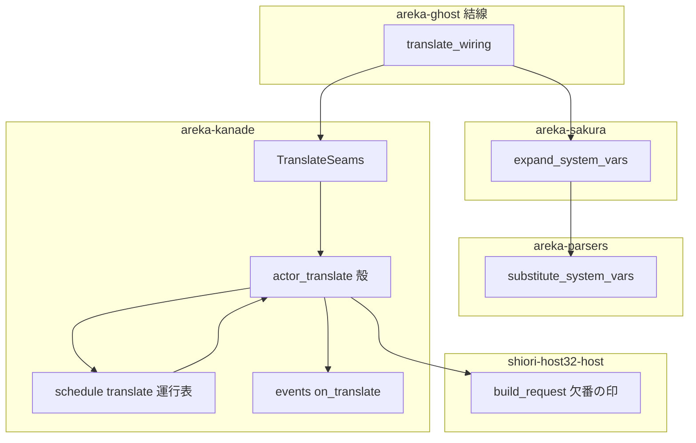
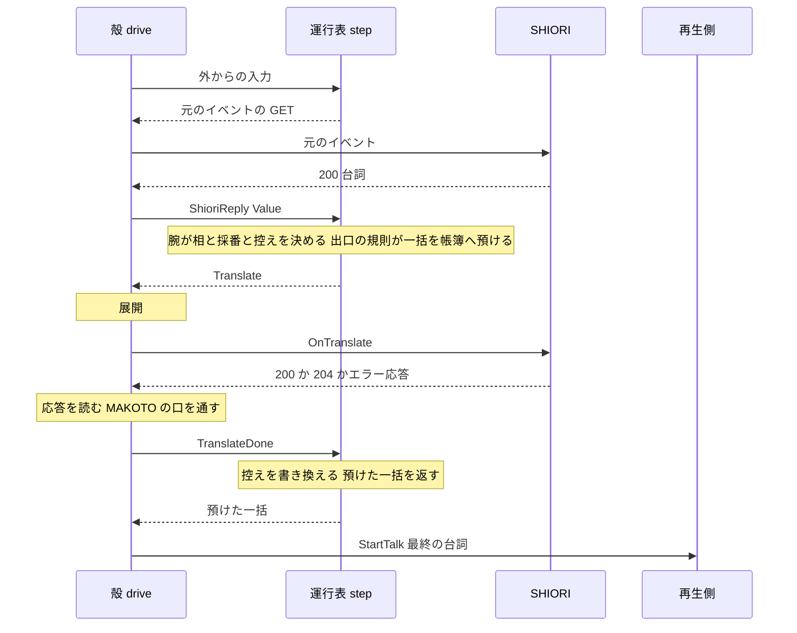
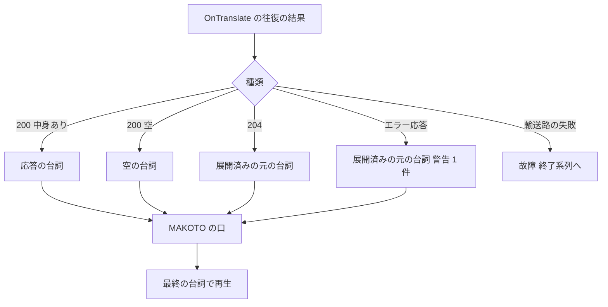

# Design Document: areka-P0-translate-pipeline

## Overview

**Purpose**: SHIORI が返した台詞を、バルーンに表示する前に正典（ukadoc「トランスレータ」「OnTranslate」）の順序で 1 回だけ翻訳する。里々・YAYA の標準の辞書が `OnTranslate` で行っている直し（敬称の重なりの除去・語尾・自動の間）が、areka でも表示に反映されるようにする。

**Users**: 既存ゴーストの利用者とゴースト作者。後半の spec `areka-P0-makoto-dll-host` の実装者（MAKOTO の鎖を差し込む口を使う）。

**Impact**: 運行表（`crates/areka-kanade/src/schedule/` の純粋な状態機械）に「翻訳の待ち」の帳簿を 1 つ足し、SHIORI の台詞から再生を始める直前に `OnTranslate` の往復を 1 つ挟む。環境変数（`%username` 等）の展開を翻訳の前でも行う。再生側（台本の解釈・文字の表示）は変えない。`OnTranslate` に 204 を返すゴースト（emo2 の pasta）では、表示される文字の並びは今日と同じ。

### Goals
- SHIORI の台詞が再生へ渡る 5 種類の経路すべてを、運行表の出口 1 か所で翻訳に通す（経路ごとの書き換えをしない）。
- 順序を「展開 → `OnTranslate` → MAKOTO の鎖の口 → 再生」にする。
- 「SHIORI との往復は一度に 1 つまで」の決まりに例外を足さない。
- 再生を始める時点の運行の状態（相・期限・台詞の切れ目の見張り・Status の導き方）を今日と同じ値に保つ。

### Non-Goals
- MAKOTO/2.0 DLL の読み込み・通信・文字コード・`\![load|unload|reload,makoto]`（`areka-P0-makoto-dll-host`）。
- SSTP・コミュニケート・プラグインなど新しい台詞の出所。Reference1 の出所の語彙。
- `%(...)` の展開。新しい環境変数名への対応。
- 再生側（`areka-sakura` の `compile`・`areka-ghost` の `dispatcher`）の振る舞いの変更。`areka-talk` の `StartTalk` の型の変更。
- `ShioriBackend` の関数の形の変更（17 個の実装に触れない）。

## Boundary Commitments

### This Spec Owns
- 運行表の「翻訳の待ち」の帳簿と、SHIORI の台詞の再生開始を出口で捕まえて後ろへ回す規則。
- `OnTranslate` の組み立て（Reference0・2・3 と Reference1 の欠番）・許可表の 1 語・応答の扱い・記録の語彙。
- 文字列のままで行う環境変数の展開（`areka-parsers` の置き換え関数と `areka-sakura` の展開関数）と、それを kanade へ注入する結線。
- 線の層の「欠番の印」（Reference の番号を保ったまま行を出さない約束）。
- MAKOTO の鎖を差し込む口の型と、素通しの実装 1 つ。
- 控える台詞（`OnChoiceTimeout` の Reference0 の源・`OnGhostChanged` の Reference1 の源）を翻訳の後の値にすること。
- `doc/COMPAT_ARCHITECTURE.md` §8 の登記・許可表の ukadoc の URL の注記・網羅の台帳の更新。

### Out of Boundary
- MAKOTO の口の向こう側（DLL・プロセス・文字コード・失敗の扱い）。
- `crates/areka/src/` の本番のコード（`ghost_session.rs`・`main.rs`・`emo2_boot/`）。触れてよいのは、テスト用の偽の SHIORI に「`OnTranslate` は既定で 204」を足すことと、テストの期待の列への書き足しだけ。
- `crates/areka-kanade/src/schedule/` の `boot.rs`・`close.rs`・`change.rs`・`steady.rs` の腕の書き換え（本設計は出口で捕まえるので、これらの本番の行は変えない）。
- ファイルの長さの検査の例外表。
- SHIORI の失敗の分類の決まり（`areka-P0-shiori-fault-notice`）そのもの。

### Allowed Dependencies
- `areka-kanade` の依存は今日のまま（`areka-actor`・`areka-talk`・`shiori-host32-host`）。`areka-sakura`・`areka-parsers`・`areka-sylphya` へは依存しない。展開と MAKOTO の口は外から関数で渡す。
- `areka-sakura` → `areka-parsers`（既存の向き）。
- `areka-ghost` → `areka-kanade`・`areka-sakura`・`areka-sylphya`（既存の向き）。結線はここで行う。
- 依存の向き: 下の層から順に ⑴ `shiori-host32-host`・`areka-parsers`・`areka-talk` ⑵ `areka-sakura`（parsers の上）と `areka-kanade`（host32・talk の上。互いに参照しない） ⑶ `areka-ghost` ⑷ `areka`。上の層が下の層を参照するだけで、逆向きと ⑵ の横向きの参照は作らない。
- 外部クレートの追加は 0。`Cargo.toml` の変更は 0。

### Revalidation Triggers
- `TranslateSeams`・`ScriptExpander`・`MakotoChain` の形が変わる（`areka-P0-makoto-dll-host` が再確認）。
- `Action::Translate`・`Input::TranslateDone`・`State` の `translate`／`reply_source` の欄が変わる（同じ運行の判断のファイルを触る `areka-P0-property-query-channels`・`areka-P0-balloon-lifecycle-events`・`areka-P0-network-update-canon-order` が再確認）。
- 運行表に、SHIORI の台詞から再生を始める新しい腕が足される（出口の規則が自動で捕まえるが、経路ごとのテストを 1 本足す）。
- areka が自分で作る台詞に、中身のある文字列を持つものが足される（「翻訳しない」の見分け方の前提が変わる）。
- 字句解析の規則（`%`・`\\`・`\%`・タグ名の長さ）が変わる（置き換え関数は走査を共有するので追随するが、展開の同値の検査のテストを見直す）。
- 欠番の印の値、または `build_request` の Reference の書き方が変わる。

## Architecture

### Existing Architecture Analysis

- **往復は 1 メッセージの処理の中で閉じる**。`crates/areka-kanade/src/actor.rs` の `drive` は、`step` が返した行動の一括を全部実行し、最後の SHIORI の応答だけを入れ直して `step` を呼ぶことを、行動が尽きるまで繰り返す。その間、受け箱は読まない。よって翻訳の往復を同じ `drive` の中に置けば、待ちの間に届いた入力は受け箱に積まれたまま残る。
- **SHIORI の台詞で再生を始める腕は 8 か所、areka が自分で作る台詞は 1 か所**（2026-10-03 に再確認）。

  | 経路 | 腕（定義している関数） | ファイル |
  |---|---|---|
  | 1 起動の挨拶 | `to_baseware_version` の台詞ありの腕 | `schedule/boot.rs` |
  | （areka が作る台詞） | `to_baseware_version` の「起動の記録だけ」の腕（`script` が空） | `schedule/boot.rs` |
  | 2 終了の別れ | `on_close_pending` の `Value` の腕 | `schedule/close.rs` |
  | 3 切替の送り出し | `on_reply_wait` の `Value` の腕（`OnGhostChanging` と切替の `OnClose` の両方） | `schedule/change.rs` |
  | 3 取りやめた切替 | `on_yielded_reply` の `Value` の腕 | `schedule/change.rs` |
  | 4 定常・空き | `on_reply` の `Steady{talk: None}` の `Value` の腕 | `schedule/steady.rs` |
  | 4 定常・置き換え | `on_reply` の置き換えの腕 | `schedule/steady.rs` |
  | 5 選択の連鎖 | `on_cascade_reply` の `Value` の腕 | `schedule/steady.rs` |
  | 5 時間切れ | `on_timeout_reply` の `Value` の腕 | `schedule/steady.rs` |

  9 か所とも、入力が `Input::ShioriReply` の `step` の中でだけ `Action::StartTalk` を作る。それ以外の入力から `StartTalk` を作る所は 0 か所。
- **許可表は 45 語**（`schedule/events.rs` の `ALLOWED_EVENT_IDS`）。数は `schedule/events_change_tests.rs` が `assert_eq!(ALLOWED_EVENT_IDS.len(), 45)` で固定している。
- **送った後は元のイベントを覚えていない**。殻が応答に付けて返すのは ID の写し（`origin: &'static str`）だけで、選択肢の任意名は `"OnChoiceEvent"` に丸められ、Reference は捨てられる。
- **Reference の線の形は 0 から詰めて並べる 1 通り**。組み立ては `crates/shiori-host32-host/src/shiori3.rs` の `build_request` の 1 か所で、補助プロセス経由（`ShioriConnection`）も in-proc（`crates/areka-ghost/src/shiori_inproc.rs` の `build_input`）もここを通る。
- **展開は字句解析の後にしか無い**。`areka-sakura` の `compile` の `Instruction::SystemVar` の腕が `resolve_system_var` を呼ぶ。字句の規則は `crates/areka-parsers/src/sakura/lexer.rs` の `lex`（`%` の後ろの英数字と `_` を貪欲に読む・`\\` と `\%` は文字・タグの角括弧の中の `%` は対象外・未閉じの `[` は末尾まで 1 かたまり）。
- **台詞の切れ目の見張り**（`schedule/talk_gap.rs` の `observe`）は、印のイベントの応答の `step` の直後に相から今のトークを読む。相が変わると見張りの結果が変わる。

### Architecture Pattern & Boundary Map



**Architecture Integration**:
- **選んだ形**: 相は今日のまま進め、翻訳の待ちを相の外の帳簿（`State::translate`）で表す。捕まえる点は `step` の出口の 1 か所。
- **責務の分け方**: 判断（何を翻訳するか・応答をどう読むか・控えの書き換え）は運行表、実行（展開の呼び出し・往復・MAKOTO の口の呼び出し）は殻、字句の規則は `areka-parsers`、値の規則は `areka-sakura`、値の源の結線は `areka-ghost`。
- **保つ型**: 「行動の一括を全部実行し、最後の往復の結果だけを入れ直す」駆動・相の外の帳簿（`pending_close`・`choice` と同じ置き方）・注入の関数（`ResourceSink` と同じ置き方）・公開の型と運行表の同名モジュールの組（`crate::change` と `schedule::change` と同じ）。
- **新しい部品の理由**: 下の「設計で決めたこと」の各項。
- **steering との整合**: kanade は sylphya・sakura へ依存しない（疎結合を保つ）・記録の無い失敗経路を作らない・1 ファイル 1,000 行未満・テストは兄弟ファイル。

### 設計で決めたこと（採った案と採らなかった案）

| 論点 | 採った案 | 採らなかった案と理由 |
|---|---|---|
| 1 翻訳の待ちの表し方 | 相の外の帳簿 `State::translate`。各腕は今日どおり相・採番・期限・控えを決め、出口の規則がその一括を帳簿へ預ける | **相を 1 つ足す**: 印のイベントの応答の直後に相が「翻訳中」になり、台詞の切れ目の見張りが「台詞なし」「定常でない」と誤って決める。Status の `talking` が落ちる。相の網羅の `match` すべてに判断が要り、`steady.rs`（929 行）の分割が先に要る。**殻の中で同期に済ませる**: 要件 5.2 が禁じる |
| 2 捕まえる点 | `step` の出口の 1 か所。「SHIORI の GET が中身のある台詞を返した `step`」が作った `StartTalk` を対象にする。areka が自分で作る台詞は、台詞の無い応答（204）の `step` で `script` が空のまま生まれるので、この規則に当たらない | **8 か所の腕が共通の関数を呼ぶ**: 呼び忘れた腕が翻訳を素通りする。8 か所の本番の行と `steady.rs` の分割が要る。出口なら将来の腕も自動で通る |
| 3 後ろへ回す範囲 | その一括を丸ごと、順序を変えずに預ける（起動の `basewareversion` NOTIFY も、選択の連鎖の `ResolveChoice` も） | **`StartTalk` だけ回す**: 起動では 1 つの一括に往復が 2 つ並ぶ（決まりの例外になる）。選択の連鎖では古い台詞の選択待ちが先に解けて、新しい台詞が始まるまでの数ミリ秒だけ古い台詞が進む（今日は同じ一括で隙間が無い） |
| 4 展開の置き場所 | 外から関数で渡す（`ScriptExpander`）。殻が `Action::Translate` の実行の中で呼ぶ。中身は `areka-ghost` が組む | **kanade が `areka-sakura` に依存する**: 運行が再生側の部品へ依存する向きが新しく生まれる。`Cargo.toml` を触る。値の源は結局外から要る。**運行表（`step`）の中で呼ぶ**: 値を読む関数なので運行表が純粋でなくなる。**kanade が `username` を自分で持つ**: `selfname` 等を拾えず要件 2.3 を満たさない |
| 5 展開の字句の規則 | `areka-parsers` に公開の置き換え関数 `substitute_system_vars` を足す。字句解析の走査の本体を 1 本にして `lex` と共有する | **既知の名前の最長一致の文字列走査**（brief の案）: `%usernameabc` が今日は `%usernameabc` のまま、最長一致だと「太郎abc」になり要件 2.5 に反する。規則の写しを 2 か所に持つことにもなる |
| 6 値に `\` や `%` があるとき | `\` を `\\`、`%` を `\%` にして埋める。加えて、埋めた結果の読みが元の読みと同じであることを照合し、違えばその台詞は展開せずに元のまま返す（警告を 1 件） | **そのまま埋める**: 再生時の字句解析が値をタグや環境変数として読み直し、今日と表示が変わる。**照合なし**: `\w%username`（値が数字で始まる）・`\n%username`（値が `[` で始まる）・`\_%username` などで、直前のタグが値の先頭を飲み込む |
| 8 Reference1 の欠番 | 線の層に「欠番の印」を 1 つ決め、`build_request` がその位置の行を出さず番号を保つ | **Reference の型を「値か欠番か」に変える**: `ShioriBackend` の 17 個の実装と、記録した Reference を比べる多数のテストが変わる。`crates/areka/src/emo2_boot/spine.rs`（998 行・境界の外）の関数の形も変わる。**空文字で送る**: 要件 3.3 が求める「行そのものが無い」にならない |
| 9 `OnTranslate` の Status | 捕まえた時点（腕が相を決めた後＝再生を始める時点）の `State::snapshot` から導く | **元のイベントを送った時点の値を写す**: 既存の決まり「Status は送る時点の運行の状態から導く」の例外になる。起動の挨拶では直後の `basewareversion` と食い違う |
| 10 選択の後の `OnTranslate` の輸送路の失敗 | 故障（終了系列）にする。翻訳の結果は専用の入力で戻るので、選択の往復の例外（失敗を 204 と同じに扱う）の腕を通らない | **選択の例外に揃える**: 要件 4.5 が例外を禁じる |
| 13 既存テストの扱い | 期待の列に `OnTranslate` を書き足す。偽の SHIORI は既定で 204 を返し、記録には残す | **比べる道具に「`OnTranslate` を除いて比べる」を足す**: 送っていることが既存テストから見えなくなり、往復の数（要件 5.6）の後退を見逃す |
| 16 写しを撮る時点 | 翻訳の直前（殻）と再生の開始（`dispatcher` の `on_start`）の 2 回のまま。`StartTalk` には写しを載せない | **翻訳の前の写しを `StartTalk` で運ぶ**: 依存ゼロの契約 `areka-talk` の型と `dispatcher` を変える。2 回の間は同じ 1 メッセージの処理の中（数ミリ秒）で、翻訳の前に埋めた名前は再生側ではもう変わらないので、食い違いうるのは「翻訳の時点で値が無く、再生の時点で値がある名前」だけ（今日の表示と同じになる） |

### Technology Stack

| Layer | Choice / Version | Role in Feature | Notes |
|-------|------------------|-----------------|-------|
| 運行 | `areka-kanade`（既存） | 帳簿・出口の規則・`OnTranslate` の組み立て・殻の実行 | 依存の追加 0 |
| 字句 | `areka-parsers`（既存） | 環境変数の位置を字句解析と同じ規則で決めて置き換える | 公開関数 1 つ |
| 再生側の値の規則 | `areka-sakura`（既存） | `resolve_system_var` を使った文字列の展開と同値の照合 | `compile` は変えない |
| 結線 | `areka-ghost`（既存） | 写しの源を kanade の展開へ渡す | `runtime.rs` の結線 |
| 線 | `shiori-host32-host`（既存） | 欠番の印と `build_request` | 関数の形は変えない |
| 記録 | `tracing`（既存） | `target: "kanade"` の `translate_*` | テストは `log-capture-kit` |

## File Structure Plan

### Directory Structure
```
crates/
├── areka-kanade/src/
│   ├── translate.rs                    # 新規: 外から渡す口の型（TranslateSeams・ScriptExpander・MakotoChain・素通し）
│   ├── actor_translate.rs              # 新規: 殻が Action::Translate を実行する 1 関数（展開→往復→読み→MAKOTO の口）
│   ├── actor_translate_tests.rs        # 新規: 殻の実行のテスト（偽の SHIORI・止まる偽の SHIORI）
│   └── schedule/
│       ├── translate.rs                # 新規: 帳簿・出口の規則・応答の読み・再開（純粋）
│       ├── translate_tests.rs          # 新規: 出口の規則と応答の行列
│       ├── translate_path_tests.rs     # 新規: 5 種類の経路ごとの通過（外すと赤）と控えの書き換え
│       └── translate_test_support.rs   # 新規: 既存テスト用の「翻訳を 204 で通す」補助
├── areka-parsers/src/sakura/
│   └── lexer_substitute_tests.rs       # 新規: 置き換え関数のテスト
├── areka-sakura/src/
│   └── sysvar_expand_tests.rs          # 新規: 展開と同値の照合のテスト
└── areka-ghost/src/
    ├── translate_wiring.rs             # 新規: 写しの源の分け方と ScriptExpander の組み立て
    └── translate_wiring_tests.rs       # 新規
```

### Modified Files
- `crates/areka-kanade/src/schedule/mod.rs` — `State` に `translate`・`reply_source` の 2 欄、`Action::Translate`、`Input::TranslateDone`、`route` の腕 1 つ、`step` に出口の規則の呼び出し 2 行。故障への遷移は既存の `to_unloading_fault` を子モジュール `translate` から呼ぶ（可視性は変えない）。908 行 → 940 行前後。
- `crates/areka-kanade/src/schedule/events.rs` — `on_translate` の組み立て、`ALLOWED_EVENT_IDS` に `OnTranslate`（ukadoc の URL の注記つき）、冒頭の Reference 表に 1 行。
- `crates/areka-kanade/src/schedule/events_change_tests.rs` — 許可表の数 45 → 46。
- `crates/areka-kanade/src/actor.rs` — `spawn_kanade_translating`（口つきの派生）、`execute_actions` の `Action::Translate` の腕、`drive` の入れ直しを 2 種類（SHIORI の応答・翻訳の結果）に、`round_trip_request` を「送って生の結果を返す部分」と「エラー応答を 204 へ写す部分」に分ける。725 行 → 770 行前後。
- `crates/areka-kanade/src/lib.rs` — `translate` の公開と `spawn_kanade_translating` の再輸出。
- `crates/areka-kanade/src/shiori/real.rs` — 欠番の印の再輸出（host32 の境界は今日どおりここに閉じる）。
- `crates/shiori-host32-host/src/shiori3.rs` — `ABSENT_REFERENCE` と `build_request` の 1 分岐。
- `crates/areka-parsers/src/sakura/lexer.rs`・`mod.rs` — 走査の本体の共有と `substitute_system_vars` の公開。
- `crates/areka-sakura/src/sysvar.rs`・`lib.rs` — `expand_system_vars` の追加と公開。
- `crates/areka-ghost/src/runtime.rs` — 写しの源を 2 つに分け、`spawn_kanade_translating` に `TranslateSeams` を渡す。
- `crates/areka-ghost/src/sylphya_wiring.rs` — 翻訳用の写しの読み口（固定の記録「talk snapshot from sylphya reader」を出さない別の関数）。
- テスト用の偽の SHIORI（本番のコードではない）: `crates/areka/src/emo2_boot/spine.rs` の `ScriptedShioriBackend::get` の既定の式に `OnTranslate` を混ぜる（行数は増やさない・998 行のまま）。`crates/areka-ghost/tests/ghost/spine_e2e_test.rs` の同名の型も同じ。
- 期待の列に `OnTranslate` を書き足すテスト: `crates/areka-kanade/src/schedule/*_tests.rs`・`crates/areka-kanade/src/actor_*_tests.rs`・`crates/areka-kanade/tests/kanade/`・`crates/areka-ghost/` のテスト・`crates/areka/src/` のテスト（台詞を返す台本を持つもの）。
- `doc/COMPAT_ARCHITECTURE.md` §8 — 新しい行と、既存の行「`OnGhostChanged` の Ref1 に何を載せるか」の書き換え。
- `doc/ukadoc-coverage/ledger/shiori.toml` — `ukadoc:list_shiori_event:OnTranslate:1` を `implemented`・`owner = "areka-P0-translate-pipeline"` に。

## System Flows

### 翻訳を挟んだ 1 つの台詞の流れ



- 1 つの `drive` の中で完結する。受け箱は読まないので、待ちの間に届いた入力は再生の開始の後に今日の規則で処理される（5.3・5.4）。
- 預けた一括に往復（起動の `basewareversion` NOTIFY）が含まれていれば、その応答は今日どおり入れ直される。どの一括も往復は 1 つまで（5.1・5.2）。
- 翻訳の結果の `step` では出口の規則は働かない（入力が SHIORI の応答ではない）。よって `OnTranslate` は再び送られない（4.6）。

### 応答の読み方



## Requirements Traceability

| Requirement | Summary | Components | Interfaces | Flows |
|-------------|---------|------------|------------|-------|
| 1.1 | 再生の前に 1 回だけ翻訳 | TranslateLedger・TranslateRunner | `defer`・`Action::Translate` | 翻訳を挟んだ流れ |
| 1.2 | 5 種類の経路が同じ 1 つの翻訳 | TranslateLedger | `step` の出口の規則 | 同上 |
| 1.3 | areka が作る台詞は翻訳しない | TranslateLedger | `defer` の条件（台詞を返した応答の `step` だけ） | — |
| 1.4 | 起動の記録は翻訳に渡さない | TranslateLedger | `StartTalk` の `script` だけを差し替え `epilogue` は触らない | — |
| 1.5 | 素通りを決定論テストで赤に | Testing Strategy | `translate_path_tests.rs` | — |
| 2.1 | 展開 → `OnTranslate` → MAKOTO → 再生 | TranslateRunner | `run_translate` の順序 | 翻訳を挟んだ流れ |
| 2.2 | Reference0 は展開の後 | TranslateRunner・SysVarExpander | `ScriptExpander`・`on_translate` | — |
| 2.3 | 今日と同じ規則・値の源・既定値 | SysVarExpander・TranslateWiring | `expand_system_vars`（`resolve_system_var` を使う） | — |
| 2.4 | 値の無い名前は綴りのまま | SysVarExpander | `resolve` が `None` を返す名前は置き換えない | — |
| 2.5 | 204 で今日と 1 文字も違わない | SysVarSubstitution・SysVarExpander | エスケープ＋同値の照合 | — |
| 2.6 | 残った綴りは再生時に展開 | （変更なし） | `compile` の `SystemVar` の腕を残す | — |
| 3.1 | GET を 1 回・空の 200 には送らない | TranslateLedger | `defer` の条件（中身が 1 文字以上） | — |
| 3.2 | Reference0・2・3 | OnTranslateCall | `on_translate` | — |
| 3.3 | Reference1 は欠番 | AbsentReference・OnTranslateCall | `ABSENT_REFERENCE`・`build_request` | — |
| 3.4 | 許可表に加える | OnTranslateCall | `ALLOWED_EVENT_IDS` | — |
| 3.5 | 切替の間の送り先 | （構造） | kanade と SHIORI はゴーストごとに 1 組 | — |
| 3.6 | 他の GET と同じ見出し | OnTranslateCall | `ExecutionStatus::derive`・線の `SecurityLevel` | — |
| 3.7 | URL の注記と台帳 | OnTranslateCall・文書 | 許可表の注記・`shiori.toml` | — |
| 4.1 | 200 の台詞を MAKOTO の口へ | TranslateRunner・TranslateLedger | `read_reply` | 応答の読み方 |
| 4.2 | 200 で空は空を採用 | TranslateLedger | `read_reply` | 同上 |
| 4.3 | 204 は展開済みの元の台詞 | TranslateLedger | `read_reply` | 同上 |
| 4.4 | エラー応答は元の台詞＋警告 | TranslateLedger・TranslateRunner | `read_reply`・生の往復 | 同上 |
| 4.5 | 輸送路の失敗は故障 | TranslateLedger | `on_done` の `Err` の腕 → `to_unloading_fault` | 同上 |
| 4.6 | 再び送らない | TranslateLedger | 出口の規則の条件（入力が SHIORI の応答のときだけ） | — |
| 4.7 | 応答の種類の記録 | TranslateLedger | `translate_reply` | — |
| 5.1 | 元の応答の後にだけ送る | TranslateLedger | 元の応答の `step` の行動として出る | 翻訳を挟んだ流れ |
| 5.2 | 運行表の状態で表す・例外なし | TranslateLedger | `State::translate`・一括に往復 1 つ | 同上 |
| 5.3 | 待ちの間は他のイベントを送らない | （構造）TranslateRunner | `drive` は受け箱を読まない | 同上 |
| 5.4 | 待ちの間の入力は再生の後に | （構造） | 受け箱に残る | 同上 |
| 5.5 | 再生の開始の時点の状態は今日と同じ | TranslateLedger | 腕が決めた相をそのまま使う | — |
| 5.6 | 往復は 1 回だけ増える | TranslateLedger | `defer` の条件 | — |
| 6.1 | `OnChoiceTimeout` の源は翻訳の後 | TranslateLedger | `on_done` が `ActiveTalk.script` を書き換える | — |
| 6.2 | `OnGhostChanged` の Reference1 は翻訳の後 | TranslateLedger | `on_done` が `ChangeState.script` を書き換える | — |
| 6.3 | §8 の 6 点の登記 | 文書 | `doc/COMPAT_ARCHITECTURE.md` | — |
| 6.4 | §8 の既存の行の書き換え | 文書 | 同上 | — |
| 7.1 | 口は 1 つ | TranslateSeams | `MakotoChain` | — |
| 7.2 | 差し込みが無ければ 1 文字も変えない | TranslateSeams | `TranslateSeams::passthrough` | — |
| 7.3 | 応答の種類に依らず通す | TranslateRunner | `run_translate` | 応答の読み方 |
| 7.4 | DLL・プロセス・文字コードを持ち込まない | TranslateSeams | 口の引数は文字列 2 つだけ | — |
| 8.1 | 決定論テスト ⑴〜⑼ | Testing Strategy | — | — |
| 8.2 | 204 のゴーストで今日と同じ | Testing Strategy | emo2 の e2e・実機の記録 | — |
| 8.3 | 全体のテストが緑 | Testing Strategy | `tools/test-all.ps1` | — |
| 8.4 | 記録の無い経路 0 本 | Error Handling | 記録の語彙の表 | — |

## Components and Interfaces

| Component | Domain/Layer | Intent | Req Coverage | Key Dependencies (P0/P1) | Contracts |
|-----------|--------------|--------|--------------|--------------------------|-----------|
| TranslateLedger | kanade 運行表 | 出口で捕まえ、預け、応答を読み、再開する | 1.1〜1.4, 3.1, 4.1〜4.7, 5.1, 5.2, 5.5, 5.6, 6.1, 6.2 | `schedule/mod.rs` の `State`・`step` (P0) | Service, State |
| OnTranslateCall | kanade 運行表 | `OnTranslate` の組み立てと許可表 | 3.2〜3.4, 3.6, 3.7 | AbsentReference (P0) | Service |
| TranslateRunner | kanade 殻 | `Action::Translate` を実行する | 2.1, 2.2, 4.1, 4.4, 5.3, 7.3 | TranslateSeams (P0)・TranslateLedger (P0) | Service |
| TranslateSeams | kanade 公開の型 | 展開と MAKOTO の口の受け口 | 7.1〜7.4 | — | Service |
| AbsentReference | 線 | Reference の番号を保って行を出さない | 3.3 | `build_request` (P0) | Service |
| SysVarSubstitution | parsers | 字句解析と同じ規則で環境変数を置き換える | 2.5 | `lex` と走査を共有 (P0) | Service |
| SysVarExpander | sakura | 写しの値で展開し、同値を照合する | 2.2〜2.5 | SysVarSubstitution (P0)・`resolve_system_var` (P0) | Service |
| TranslateWiring | ghost 結線 | 写しの源を展開へ渡す | 2.3 | SysVarExpander (P0)・sylphya の読み口 (P0) | Service |

### kanade 運行表

#### TranslateLedger（`crates/areka-kanade/src/schedule/translate.rs`）

| Field | Detail |
|-------|--------|
| Intent | SHIORI の台詞の再生開始を `step` の出口で捕まえて預け、翻訳の結果で再開する |
| Requirements | 1.1, 1.2, 1.3, 1.4, 3.1, 4.1, 4.2, 4.3, 4.4, 4.5, 4.6, 4.7, 5.1, 5.2, 5.5, 5.6, 6.1, 6.2 |

**Responsibilities & Constraints**
- 相・採番・期限・選択の帳簿には触れない。各腕が決めた値をそのまま使う。
- 捕まえる条件は 3 つすべて: ⑴ この `step` の入力が `Input::ShioriReply` で結果が `Value` ⑵ その台詞が 1 文字以上 ⑶ 返った行動の一括に `Action::StartTalk` がある。
- 条件 ⑴⑶ を満たすが台詞が 0 文字のときは捕まえず、`trace!`（`translate_skipped_empty`）を 1 件残して今日どおり進む。
- 元のイベントが分からない（`reply_source` が空）ときは、`error!`（`translate_source_missing`）を残して翻訳せずに再生する（台詞を捨てない）。構造上は起きない。
- 帳簿は高々 1 つ。帳簿が在る間に外からの入力は届かない（`drive` の中で完結する）。

**Dependencies**
- Inbound: `schedule/mod.rs` の `step`・`route` — 出口の規則と翻訳の結果の腕 (P0)
- Outbound: `events.rs` の `SourceEvent`（元のイベントの型）・`schedule/mod.rs` の `to_unloading_fault` (P0)

**Contracts**: Service [x] / State [x]

##### Service Interface
```rust
/// 翻訳の待ちの帳簿（State::translate）。
pub(crate) struct TranslateWait {
    pub talk_id: TalkId,
    pub source: EventId,        // 記録用
    pub deferred: Vec<Action>,  // 腕が返した一括をそのまま（順序を保つ）
}

/// 殻へ渡す翻訳の依頼（Action::Translate の中身）。
pub(crate) struct TranslateRequest {
    pub script: String,         // SHIORI が返したまま（展開の前）
    pub source: SourceEvent,
    pub status: ExecutionStatus,
}

/// 殻が運行表へ戻す翻訳の結果（Input::TranslateDone の中身）。
pub(crate) type TranslateResult = Result<String, ShioriFailure>;

/// OnTranslate の応答の読み（殻が呼ぶ純粋な関数）。
pub(crate) enum ReplyReading {
    /// MAKOTO の口へ渡す台詞。
    Proceed(String),
    /// 輸送路の失敗。
    Failed(ShioriFailure),
}

/// step が route の前に呼ぶ。入力が SHIORI の応答なら reply_source を取り出して返す。
pub(super) fn before(state: &mut State, input: &Input) -> Replied;
/// step が route の後に呼ぶ。条件を満たせば一括を預けて [Action::Translate] に替える。
/// その後、返す一括の最後の往復が GET なら reply_source に控え、それ以外の往復なら空にする。
pub(super) fn after(state: &mut State, replied: Replied, actions: Vec<Action>) -> Vec<Action>;
/// OnTranslate の生の結果を読む。記録（translate_reply）もここで残す。
pub(crate) fn read_reply(source: &EventId, expanded: String, outcome: ShioriOutcome) -> ReplyReading;
/// route の Input::TranslateDone の腕。
pub(super) fn on_done(state: State, result: TranslateResult) -> (State, Vec<Action>);
```
- Preconditions: `after` は `route` の直後・`talk_gap::observe` の直前に 1 回だけ呼ぶ。
- Postconditions（`after` が捕まえたとき）: 返る一括は `[Action::Translate]` だけ。`State::translate` は `Some`。相は腕が決めたまま。
- Postconditions（`on_done` の `Ok(script)`）: 預けた一括の `StartTalk` の `script` を `script` に差し替えて返す（`epilogue` は触らない）。控えを書き換える（下の State Management）。`State::translate` は `None`。
- Postconditions（`on_done` の `Err`）: `error!`（`translate_failed`）の上で預けた一括を捨て、`to_unloading_fault` と同じ遷移を返す。
- Invariants: 入力が `Input::TranslateDone` の `step` では `after` は捕まえない（翻訳の結果を再び翻訳しない）。

**`read_reply` の表**

| 生の結果 | 返す値 | 記録（`translate_reply` の `kind`） | レベル |
|---|---|---|---|
| `Value(s)`・`s` が 1 文字以上 | `Proceed(s)` | `replaced` | `info` |
| `Value("")` | `Proceed("")` | `empty` | `info` |
| `NoContent` | `Proceed(expanded)` | `no_content` | `info` |
| `Failed(ShioriFailure::Shiori(_))`（エラー応答） | `Proceed(expanded)` | `error_response`（`error` に内容） | `warn` |
| `Failed(その他)`（接続・期限切れ・通信・内部） | `Failed(_)` | 記録は `on_done` の `translate_failed` | — |
| `Notified`・`Unloaded`（GET では起きない） | `Proceed(expanded)` | `unexpected` | `warn` |

どの行も `source`（元のイベントの ID）を載せる。エラー応答の警告はこの 1 件だけにする（殻は生の往復を使い、既存の `shiori_error_response` は重ねて出さない）。

##### State Management
- **足す欄**（`schedule/mod.rs` の `State`）: `translate: Option<TranslateWait>`（初期値 `None`）・`reply_source: Option<SourceEvent>`（初期値 `None`）。
- **`reply_source` の決まり**: `step` が返す一括の最後の往復が `ShioriCall::Get` なら、その ID と Reference の写しを入れる。最後の往復が NOTIFY・降ろす往復・`Translate` なら空にする。往復が無い一括では変えない。入力が `Input::ShioriReply` の `step` の入口で取り出す（1 回だけ使う）。
- **控えの書き換え**（`on_done` の `Ok`）: 相は腕が決めたままなので、次の 2 つを `talk_id` の一致で書き換える。
  - 相が `Steady{talk: Some}` か `BootVersion{talk: Some}` で、そのトークの `talk_id` が帳簿と同じ → `ActiveTalk.script` を最終の台詞に（6.1）。
  - 相が `ChangeTalkWait` で `talk_id` が帳簿と同じ、かつ `State::change` が在る → `ChangeState.script` を最終の台詞に（6.2）。この相は「`OnGhostChanging` の台詞を再生している」ことだけを表すので、切替の `OnClose` の台詞（相は `ChangeCloseTalkWait`）では書き換えない。
- **Status**: `TranslateRequest::status` は `after` が捕まえた時点の `State::snapshot` から導く（腕が相を決めた後）。
- **足す行動と入力**: `Action::Translate(TranslateRequest)`・`Input::TranslateDone(TranslateResult)`。`Input::ShioriReply` の形は変えない。

**Implementation Notes**
- Integration: `step` は「`talk_gap::marked_reply` → `translate::before` → `route` → `translate::after` → `talk_gap::observe`」の順。見張りは相だけを読むので、今日と同じ結果になる。翻訳の結果の入力は `Input::ShioriReply` ではないので、`talk_gap::marked_reply` にも `on_shiori_reply` の「応答待ちでない相への応答」の腕にも当たらない。
- Validation: 経路ごとの通過のテストは `step`（最上位の入口）から入れる。腕の関数を直接呼ぶ既存テストは変わらない。
- Risks: 既存の最上位の `step` のテストで「`Value` の直後に `StartTalk`」を期待しているものは、`[Translate]` に変わる。`translate_test_support.rs` の補助（翻訳の結果を「台詞そのまま」で入れ直す）で続きを確かめる。

#### OnTranslateCall（`crates/areka-kanade/src/schedule/events.rs`）

| Field | Detail |
|-------|--------|
| Intent | `OnTranslate` の GET を正典の Reference で組み立てる |
| Requirements | 3.2, 3.3, 3.4, 3.6, 3.7 |

##### Service Interface
```rust
/// 元のイベント（GET を送った時点で控え、応答の後まで覚えておく）。
pub struct SourceEvent {
    pub id: EventId,            // 選択肢の任意名は逐語のまま
    pub references: Vec<String>,
}

/// `OnTranslate`（GET）。
/// Ref0＝展開済みの台詞、Ref1＝欠番、Ref2＝元のイベントの ID、
/// Ref3＝元のイベントの Reference をバイト値 1 で連ねたもの（0 個なら空文字列）。
pub fn on_translate(expanded: &str, source: &SourceEvent, status: ExecutionStatus) -> ShioriCall;
```
- Postconditions: `id` は `EventId::Static("OnTranslate")`。`references` は長さ 4 で、添字 1 は欠番の印。
- 許可表 `ALLOWED_EVENT_IDS` に `"OnTranslate"` を足し、他の行と同じ形で `// ukadoc: https://ssp.shillest.net/ukadoc/manual/list_shiori_event.html#OnTranslate:1` を付ける（45 → 46 語）。
- `SourceEvent` は `events.rs` に置く（公開の関数 `on_translate` の引数なので、`crate::events` の公開面に出る）。

**Implementation Notes**
- Risks: 許可表に載るので、汎用の通知の入口（`change::on_raise_event`）から `OnTranslate` を頼めるようになる。既に表にある `OnClose`・`OnFirstBoot` などと同じ扱いで、害は台詞が 1 つ流れるだけ。表を「送ってよい」と「外から頼める」に分ける仕組みは作らない。

### kanade 殻

#### TranslateRunner（`crates/areka-kanade/src/actor_translate.rs`）

| Field | Detail |
|-------|--------|
| Intent | `Action::Translate` を実行して翻訳の結果を返す |
| Requirements | 2.1, 2.2, 4.1, 4.4, 5.3, 7.3 |

##### Service Interface
```rust
/// 展開 → OnTranslate の往復 → 応答の読み → MAKOTO の口、の順に実行する。
pub(crate) fn run_translate(
    request: TranslateRequest,
    shiori: &Sender<ShioriMsg>,
    seams: &TranslateSeams,
) -> TranslateResult;
```
- 順序: ⑴ `(seams.expand)(&request.script)` ⑵ `events::on_translate` ⑶ 生の往復（許可表の検査と `shiori_request` の記録は今日の `round_trip_request` と同じ関数を通す・エラー応答の 204 への写しだけ通さない） ⑷ `translate::read_reply` ⑸ `Proceed(text)` なら `(seams.makoto)(&text, request.source.id.as_str())` を返す。`Failed` はそのまま返す。
- `actor.rs` の変更: `execute_actions` の `Action::Translate` の腕が `run_translate` を呼び、結果をその一括の「入れ直すもの」にする。`drive` は入れ直すものが SHIORI の応答なら `Input::ShioriReply`、翻訳の結果なら `Input::TranslateDone` を入れる。汎用の通知の入口の返事（最初の一括の往復の結果）は今日のまま（翻訳は 2 つ目以降の一括にしか現れない）。
- `round_trip_request` は「検査して送って生の結果を返す関数」と、それを呼んでエラー応答を写す今日の関数に分ける。既存の呼び手の振る舞いは変えない。

**Implementation Notes**
- Risks: 展開の関数と MAKOTO の口は kanade のスレッドで同期に呼ぶ。返るまで運行は進まない。素通しと写しの読み取りはすぐ返る。後半の spec が DLL の鎖を差し込むときは、SHIORI の往復と同じく期限つきで返す責任を口の実装が持つ。

#### TranslateSeams（`crates/areka-kanade/src/translate.rs`）

| Field | Detail |
|-------|--------|
| Intent | 翻訳のために外から渡す 2 つの関数の型 |
| Requirements | 7.1, 7.2, 7.3, 7.4 |

##### Service Interface
```rust
/// 台詞の環境変数を展開する（値の無い名前は綴りのまま返す）。
pub type ScriptExpander = Box<dyn Fn(&str) -> String + Send>;
/// MAKOTO の鎖を差し込む口。引数は（台詞, 元のイベントの ID）。返すのは台詞。
pub type MakotoChain = Box<dyn Fn(&str, &str) -> String + Send>;

pub struct TranslateSeams {
    pub expand: ScriptExpander,
    pub makoto: MakotoChain,
}

impl TranslateSeams {
    /// 展開も MAKOTO も台詞をそのまま返す（口を渡さない構成・テストの既定）。
    pub fn passthrough() -> Self;
}

/// 口つきの起動（`spawn_kanade_with_stop_sink` と同じ引数に `seams` を足した派生）。
pub fn spawn_kanade_translating(
    config: KanadeConfig,
    shiori: Sender<ShioriMsg>,
    sakura: Sender<TalkCommand>,
    resource_sink: ResourceSink,
    stop_sink: Option<Sender<KanadeNotice>>,
    seams: TranslateSeams,
) -> (Sender<KanadeMsg>, ActorHandle);
```
- 既存の `spawn_kanade`・`spawn_kanade_with_stop_sink` は `TranslateSeams::passthrough()` を渡す薄い包みにする（既存の呼び手は 1 つも変わらない）。
- 本 spec が持つ MAKOTO の実装は `passthrough` の中の素通し 1 つだけ。`areka-ghost` の結線もこれを渡す。`areka-P0-makoto-dll-host` は `areka-ghost` の結線で `makoto` を差し替える。
- 口の引数は文字列 2 つだけで、DLL・プロセス・文字コードの型を持たない。

### 線

#### AbsentReference（`crates/shiori-host32-host/src/shiori3.rs`）

| Field | Detail |
|-------|--------|
| Intent | Reference の番号を保ったまま、その行を出さない |
| Requirements | 3.3 |

##### Service Interface
```rust
/// 欠番の印。Reference の並びの中でこの値と一致する位置は、行を出さずに番号だけ進める。
pub const ABSENT_REFERENCE: &str = "\u{0}";
```
- `build_request` は Reference を番号つきで書く繰り返しの中で、値が `ABSENT_REFERENCE` と一致する位置を飛ばす（番号は詰めない）。他の値の書き方は 1 バイトも変えない。
- 値に NUL 1 文字を選ぶ理由: 見出しの値として線に載せられない文字で、実際の Reference の値と重ならない。Reference3 の区切りのバイト値 1 とも重ならない（元のイベントの Reference が空文字 2 個のとき Reference3 は「バイト値 1 が 1 個」になるので、バイト値 1 は印に使えない）。
- kanade は `shiori/real.rs`（host32 との境界）から再輸出した名前で使う。偽の SHIORI は印をそのまま受け取るので、テストは「添字 1 が印と等しい」で欠番を確かめ、線の上の欠番は `shiori3` のテストで確かめる。

### 字句と値

#### SysVarSubstitution（`crates/areka-parsers/src/sakura/lexer.rs`）

| Field | Detail |
|-------|--------|
| Intent | 字句解析が環境変数と読む位置だけを、文字列のまま置き換える |
| Requirements | 2.5 |

##### Service Interface
```rust
/// `resolve` が `Some(値)` を返した名前の `%名前` を値に置き換えた文字列を返す。
/// 値は台本の文字として読まれる形（`\` → `\\`、`%` → `\%`）にして埋める。
/// `None` を返した名前と、環境変数でない部分は 1 バイトも変えない。
pub fn substitute_system_vars(
    input: &str,
    resolve: &mut dyn FnMut(&str) -> Option<String>,
) -> String;
```
- 位置の決め方は `lex` と同じ走査を使う（走査の本体を 1 本にし、`lex` はそれが返すトークンを集め、本関数はそれが返す位置を使う。規則の写しを作らない）。
- Postconditions: 環境変数が 1 つも無い入力、または `resolve` がすべて `None` を返す入力では、出力は入力と同じ。

#### SysVarExpander（`crates/areka-sakura/src/sysvar.rs`）

| Field | Detail |
|-------|--------|
| Intent | 写しの値で台詞を展開し、読みが変わらないことを確かめる |
| Requirements | 2.2, 2.3, 2.4, 2.5 |

##### Service Interface
```rust
/// 台詞の環境変数を、再生時の展開と同じ規則（`resolve_system_var`）で展開する。
pub fn expand_system_vars(script: &str, vars: &SystemVarSnapshot) -> String;
```
- 値の決め方: `resolve_system_var` が `ResolvedVar::Text(v)` を返す名前は `v`、`ResolvedVar::PassThrough` を返す名前は置き換えない。よって写しに値がある名前はその値、`username` は値が無ければ `DEFAULT_USERNAME`、それ以外は `%名前` のまま（2.3・2.4）。
- **同値の照合**: 展開した文字列を `areka_parsers::sakura::parse` に通した命令の列が、元の文字列の命令の列で「置き換えた `Instruction::SystemVar` を `Instruction::Text(値)` にし、隣り合う `Text` をつないだもの」と等しいことを確かめる。等しくなければ、`warn!`（`sysvar_expand_fallback`）を残して元の文字列をそのまま返す（その台詞は翻訳の前には展開されず、再生時の展開が今日どおり働く）。
- Postconditions: 返す文字列を再生したときの文字の並びは、元の文字列を今日の再生で展開したときと同じ（2.5）。

**Implementation Notes**
- Risks: 展開した値は前後の文字と同じ文字のかたまりになる（今日は別々のかたまり）。値の境界をまたいで 1 つの書記素にまとまる並び（値の直後が結合文字で始まる台詞など）では、文字の並びは同じだが、数え方が 1 つ減りうる（再生時間が 50 ミリ秒短くなる）。文字の並びの差は 0。この並びは実在のゴーストでは見込まないので、検査は足さず、ここに書いて残す。

#### TranslateWiring（`crates/areka-ghost/src/translate_wiring.rs`）

| Field | Detail |
|-------|--------|
| Intent | 写しの源から `ScriptExpander` を組み、kanade へ渡す |
| Requirements | 2.3 |

##### Service Interface
```rust
/// 写しの源から展開の関数を組む（呼ばれるたびに写しを 1 回読む）。
pub(crate) fn make_script_expander(source: SystemVarSource) -> ScriptExpander;
/// 注入された 1 つの源を、翻訳用と再生用の 2 つに分ける（同じ源を順に呼ぶ）。
pub(crate) fn split_source(source: SystemVarSource) -> (SystemVarSource, SystemVarSource);
```
- `runtime.rs` の結線: 写しの源の解決を kanade の起動の前へ移す。`SystemVarWiring::FromSylphya` は同じ読み口から翻訳用と再生用を 1 つずつ作る。`SystemVarWiring::Custom` は `split_source` で分ける。
- 翻訳用の読み口は、再生用の固定の記録「talk snapshot from sylphya reader」（実機の確かめで数を数える記録）を出さない。別の `debug!`（`translate snapshot from sylphya reader`）を出す。
- 値の源は再生と同じ読み口（`SylphyaReader::talk_snapshot`）なので、`username` のほか `selfname`・`selfname2`・`keroname` も同じ値になる（2.3）。

**Implementation Notes**
- Risks: `SystemVarWiring::Custom` の源が呼ばれる回数は、台詞 1 つにつき 1 回から 2 回になる。呼ばれた回数を数えているテストがあれば期待を直す（設計の時点の検索では 0 件）。

## Data Models

### Domain Model
- **元のイベント**（`SourceEvent`）: ID と Reference の並び。GET を送った `step` で控え、その応答の `step` で 1 回だけ使う。
- **翻訳の待ち**（`TranslateWait`）: 預けた一括・トークの番号・元のイベントの ID。在るのは 1 つの `drive` の中だけ。
- **不変条件**: `State::translate` が `Some` の間、相は「その台詞を再生している」値（`BootVersion{Some}`・`Steady{Some}`・`CloseTalkWait`・`ChangeTalkWait`・`ChangeCloseTalkWait` のどれか）で、`Unloading`・`Stopped` ではない。

### Data Contracts & Integration
`OnTranslate` の要求（線の上）:

| 見出し | 値 |
|---|---|
| `ID` | `OnTranslate` |
| `Status` | 再生を始める時点の運行の状態から導く（空なら行なし） |
| `Reference0` | 展開済みの台詞 |
| `Reference1` | 行なし（欠番） |
| `Reference2` | 元のイベントの ID（選択肢の任意名は逐語） |
| `Reference3` | 元のイベントの Reference をバイト値 1 で連ねたもの（0 個なら空の値の行） |
| `SecurityLevel` | `local`（線の層が全要求に付ける） |

## Error Handling

### Error Strategy
翻訳の不具合で会話を消さない。SHIORI が答えた（エラー応答を含む）なら元の台詞で進み、輸送路が壊れたときだけ今日の故障の扱いにする。失敗の分類は `areka-P0-shiori-fault-notice` の決まりをそのまま使う。

### Error Categories and Responses

| 起きること | 扱い | 記録（`target: "kanade"`） |
|---|---|---|
| エラー応答（400・500 等） | 展開済みの元の台詞で進む | `warn!` `translate_reply` `kind=error_response` `source` `error` |
| 輸送路の失敗（つながらない・期限切れ・通信が切れた） | 預けた一括を捨て、故障（`Unloading{Fault}`）へ | 送出点の既存の `error!`（`shiori_send_failed` 等）＋ `error!` `translate_failed` `source` `talk_id` |
| GET では起きない結果（`Notified`・`Unloaded`） | 204 と同じ | `warn!` `translate_reply` `kind=unexpected` |
| 元のイベントが分からない | 翻訳せずに再生する | `error!` `translate_source_missing` `talk_id` |
| 帳簿が無いのに翻訳の結果が届いた | 捨てる | `warn!` `translate_done_unexpected` |
| 展開で読みが変わる | その台詞は展開せずに翻訳へ渡す | `warn!` `sysvar_expand_fallback`（`areka-sakura`） |
| 写しの源の排他が壊れている（`split_source`） | 空の写しで進む（`username` は既定値になる） | `error!` `translate_snapshot_poisoned`（`areka-ghost`） |

### Monitoring
正常の経路の記録:

| 記録 | レベル | いつ | 欄 |
|---|---|---|---|
| `translate_begin` | `debug` | 一括を預けたとき | `talk_id`・`source` |
| `translate_reply` | `info`（`replaced`・`empty`・`no_content`） | 応答を読んだとき | `source`・`kind` |
| `translate_resume` | `debug` | 預けた一括を返したとき | `talk_id`・`changed`（最終の台詞が SHIORI の返した台詞と違うか） |
| `translate_skipped_empty` | `trace` | 0 文字の台詞を翻訳せずに通したとき | `talk_id` |
| `shiori_request` | `trace`（既存） | `OnTranslate` を送る直前 | 既存の欄 |

本 spec が足す分岐は上の 2 つの表ですべてで、記録の無いまま進む経路は 0 本（8.4）。

## Testing Strategy

どのテストも DLL を使わない（偽の SHIORI と純粋な関数）。括弧の中は要件 8.1 の番号。

### Unit Tests（純粋）
- `translate_path_tests.rs`: 5 種類の経路それぞれについて、最上位の `step` に元のイベントの `Value` を入れると一括が `[Translate]` だけになり `StartTalk` が出ないこと、`TranslateDone(Ok)` で預けた一括（起動は `[StartTalk, basewareversion]`・選択の連鎖は `[ResolveChoice, StartTalk]` の順）が返ること。出口の規則を外すとどの経路も赤になる（⑴・1.5）。経路は表の 8 か所を 1 本ずつ。
- 同: areka が作る台詞（起動で 204・起動の記録あり）は `[StartTalk, …]` がそのまま出ること。0 文字の `Value` も翻訳されないこと（⑼・3.1）。
- 同: 再生を始めた後の相・期限・`talk_gap` の結果が、翻訳なしの今日の値と同じこと（5.5）。印のイベント（`OnShellChanging`）の台詞で見張りが「印の台詞」を追うこと。
- 同: `TranslateDone(Ok)` の後、`ActiveTalk.script` と `ChangeState.script` が最終の台詞になり、`OnChoiceTimeout` の Reference0 と停止通知の切替の中身がその値になること。切替の `OnClose` の台詞では `ChangeState.script` が変わらないこと（⑻）。
- `translate_tests.rs`: `read_reply` の表の全行（⑶・⑹）。`on_done` の `Err` で `Unloading{Fault}` になり預けた一括が出ないこと。選択の連鎖の後でも故障になること（論点 10）。翻訳の結果の `step` で `Translate` が出ないこと（⑷）。帳簿なしの `TranslateDone` が捨てられること。
- `events_tests.rs`: `on_translate` の Reference0〜3（Reference が 0 個・1 個・複数・空文字を含む・選択肢の任意名）と添字 1 の欠番の印（⑸）。許可表の数 46。
- `shiori3` のテスト: 欠番の印の位置に `Reference1:` の行が無く、`Reference2:`・`Reference3:` の番号が保たれること。印を含まない要求のバイト列が変わらないこと（⑸）。
- `lexer_substitute_tests.rs`: 貪欲な名前（`%usernameabc` は置き換えない）・タグの角括弧の中の `%`・`\%`・`\\`・未閉じの `[`・値の中の `\` と `%` のエスケープ・`resolve` が `None` の名前は 1 バイトも変わらないこと。
- `sysvar_expand_tests.rs`: `%usernameさん` → `太郎さん`・既定値・`selfname` 等・値の無い名前は綴りのまま。読みが変わる並び（`\w%username` で値が数字始まり・`\n%username` で値が `[` 始まり・`\_%username`）で元の文字列が返ること。展開した文字列と元の文字列を `parse`・`compile` に通した結果の文字の並びが同じであること（2.5）。

### Integration Tests（殻・偽の SHIORI）
- `actor_translate_tests.rs`: 展開の関数に「`%username` → 太郎」を渡し、偽の SHIORI が `OnTranslate` の Reference0 に `太郎さん` を受け取ること（⑵）。応答の行列（200 で置換・200 で空・204・エラー応答・輸送路の失敗）ごとに再生側へ届く台詞と停止の原因（⑶）。MAKOTO の口が応答の種類に依らず 1 回ずつ呼ばれ、引数が（台詞, 元のイベントの ID）であること（7.3）。台詞 1 つにつき `OnTranslate` が 1 回だけであること（⑷・5.6）。記録の語彙（⑹）。
- 同: `OnTranslate` で止まる偽の SHIORI を使い、待ちの間にマウス・毎秒の時刻・終了の要求・切替の要求・外からの依頼を送る。止めている間は SHIORI へ何も送られず、放した後に `StartTalk` が先に出て、その後で各入力が今日の「再生中」の規則で処理されること（⑺）。
- `crates/areka-kanade/tests/kanade/`: 既存の結合テストの期待の列に `OnTranslate` を書き足す（偽の SHIORI は未知の GET に 204 を返す既定のまま）。送った ID がすべて許可表にあるテストが通ること。
- `crates/areka-ghost` のテスト: 本物の結線（sylphya の写し → `expand_system_vars`）で、`username` を持つゴーストの台詞 `%usernameさん` が `OnTranslate` に `太郎さん` で届き、204 のとき再生側の文字の並びが今日と同じこと（2.2・2.5）。`translate_wiring_tests.rs` で 2 つに分けた源が同じ値を返すこと。

### E2E
- emo2 の e2e（`crates/areka/src/` の既存テスト）: 偽の SHIORI の既定の 204 で、表示される台詞が本 spec の前と同じであること。期待の列に `OnTranslate` を書き足す（8.2）。
- 実機: emo2（pasta）で起動 → 雑談 → 選択肢 → 終了を 1 周し、`RUST_LOG` を `kanade=trace` にして `translate_reply` が `kind=no_content` で台詞ごとに 1 件出ること、台詞の記録が本 spec の前と同じであることを確かめる（8.2）。pasta の振り分け（`vendors/pasta` の `pasta_scripts/pasta/shiori/event/init.lua` の `EVENT.fire`）は、登録の無いイベントで同名のシーンも無ければ 204 を返し、続きを待っているシーンには触れない（設計の時点でソースを読んで確認。実機での確認は実装の最初に行う）。
- 全体: `pwsh -NoProfile -File tools/test-all.ps1`（8.3）。

## Performance & Scalability
- 台詞が返ったイベント 1 つにつき SHIORI の往復が 1 回増える（数ミリ秒）。毎秒のポンプは台詞が返ったときだけ。
- GET を送るたびに Reference の写しを 1 つ作る（短い文字列が数個）。
- 展開の同値の照合で、環境変数を含む台詞は翻訳の前に 2 回字句解析される（環境変数を含まない台詞は照合しない）。

## Migration Strategy
実装の順序（差分を確かめやすい順）:
1. 欠番の印（線）と置き換え関数・展開関数（字句と値）— 単独で着地でき、振る舞いは変わらない。
2. `on_translate` と許可表・口の型・殻の実行。
3. 運行表の帳簿と出口の規則（ここで初めて `OnTranslate` が送られる）。同時に偽の SHIORI の既定と既存テストの期待の列を直す。
4. `areka-ghost` の結線。
5. 文書（§8・台帳）と実機の確かめ。

## Supporting References

### `doc/COMPAT_ARCHITECTURE.md` §8 に登記する行
要件 6.3 の 6 点:
1. 控える台詞（`OnChoiceTimeout` の Reference0 の源）は翻訳の後。
2. `OnGhostChanged` の Reference1 は翻訳の後（既存の行「`OnGhostChanging` が返した台本をそのまま載せる」を「`OnGhostChanging` が返した台本を翻訳した後の、実際に表示した台詞を載せる」に書き換える。行は足さない＝6.4）。
3. `OnTranslate` の Reference1 は常に欠番。
4. `OnTranslate` がエラー応答のときは元の台詞で進む。
5. 翻訳の結果に残った環境変数は再生時に展開する。
6. 中身が空の 200 には `OnTranslate` を送らない。

設計で決めた裁量（同じ表に足す。どれも正典が沈黙する）:

7. `OnTranslate` の Status は再生を始める時点の運行の状態から導く。
8. 展開した値の中の `\` と `%` は文字として読まれる形（`\\`・`\%`）で Reference0 に入る。
9. 展開すると台本の読みが変わる台詞は、翻訳の前には展開しない（Reference0 に `%名前` が残る）。

既存の行「`%username` 既定値」には、展開が翻訳の前でも同じ定義点（`DEFAULT_USERNAME`）を使うことを書き足す。
