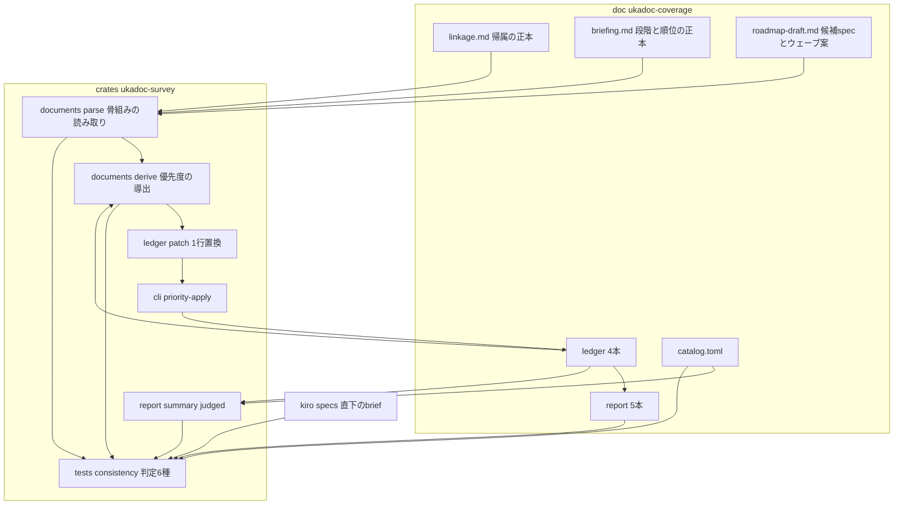
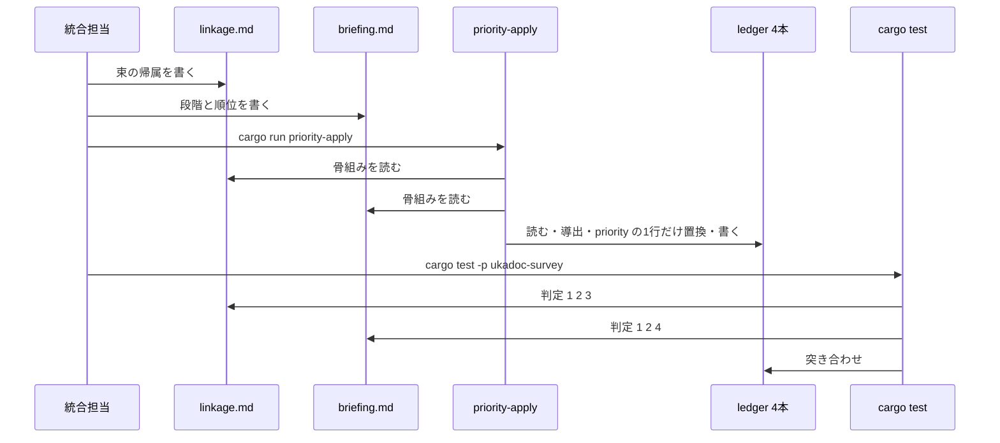

# 技術設計: areka-P0-ukadoc-coverage-roadmap

> 作成: 2026-09-11・入力: `requirements.md`（確定版）・`research.md`（ギャップ分析＋要件ディスカッションの処分 §6.1＋設計フェーズの調査 §10）・`brief.md`・steering（`product.md`・`tech.md`・`structure.md`・`roadmap.md`）。
> 数値はすべて 2026-09-11 の作業ツリー（`67e0a4d3`）の写真であり、実装時に数え直す（要件 1.5）。

## Overview

**目的**: ukadoc 網羅調査 6 本の最終＝統合 spec。完了した調査 4 本の台帳（1,749 項目）はドメイン別に閉じている。本 spec は、ドメインを跨ぐ繋がりを「名前付き束」に組み直し（`linkage.md`）、束を利用者が体験できる節目の段階 A〜E へ写して固定序列の 4 つの根拠で順位付けし（`briefing.md`）、M2 以降のマイルストーン候補・候補 spec・ウェーブ案に写す（`roadmap-draft.md`）。確定した段階と順位は 4 台帳の `priority` 欄へ書き戻し、3 文書が述べる id・束・件数は標準のテスト実行（`cargo test -p ukadoc-survey`）が台帳と突き合わせて判定する。

**利用者**: M2 以降の着手順を決める開発者（棚卸セッション）と、`/kiro-discovery` 再入で先頭ウェーブの brief を起票する担当。

**影響**: areka の実行時コードには 1 行も触れない。触るのは `doc/ukadoc-coverage/`（新規 3 文書・台帳 4 本・報告 5 本・README の限定箇所）と `crates/ukadoc-survey`（文書の骨組みの読み取り・`priority` の書き戻し・全体報告の判定範囲の切り出し・判定テスト）だけである。

### Goals

- 状態が `implemented`・`vocabulary-only`・`degraded`・`absent` の全項目（1,552 件）が、ちょうど 1 つの名前付き束（または単独項目）と、ちょうど 1 つの段階＋順位を持つ。
- 3 文書に書かれた id・束 id・件数・段階分布・brief 数が、台帳・カタログ・報告・spec ディレクトリの実物と食い違えば赤になる。
- 段階 A〜E と順位が、第一段の草案→第二段（M1 完成の実物）の改訂の 2 段で記録され、根拠が台帳の id で引ける。
- `/kiro-discovery` 再入が先頭ウェーブの節をそのまま brief の材料に使える。

### Non-Goals

- 実装（実行時の挙動の変更）・`.kiro/steering/roadmap.md` の編集・候補 spec の brief 生成・既存 27 brief と調査 4 本のブリーフィングの編集・SSP との実機比較・実在ゴーストの走行・M2 技術選定の順位付け（要件 Boundary Context「Out of scope」のとおり）。
- 道具の純粋層 `check/`（`CheckInput`・`FindingKind` 15 種）への欄や種別の追加。判定は統合テスト側に置く（後述 D-3）。
- 台帳の項目形式・状態の語彙・関連の種別・テーマ・ドメインの分割の変更（凍結）。

## Boundary Commitments

### This Spec Owns

- **文書 3 本**: `doc/ukadoc-coverage/linkage.md`（束の帰属の正本）・`briefing.md`（段階と順位の正本）・`roadmap-draft.md`（候補 spec とウェーブ案）。3 本とも「人が読む本文」と「機械が読む骨組み（```toml の囲み）」を同じファイルに持つ。
- **台帳 4 本の `links`・`values`・`priority`・`owner`・`note` の統合のための編集**（形式は凍結のまま）。`priority` の値の正本は「`linkage.md` の帰属 × `briefing.md` の順位」であり、台帳の `priority` はそこから機械で導いた写しである。
- **報告 5 本の作り直し**（`report`・`report-summary` の副手続きで）。
- **道具の追加分**: 文書の骨組みの読み取り（`documents`）・`priority` の 1 行置換（`ledger::patch`）・副手続き `priority-apply`・全体報告の判定範囲の切り出し（`render_summary_judged`）・判定テスト 6 種と摂動・母数のテスト。
- **README の限定編集**: 「誰が何を作り直すか」の表の `summary.md` 行とその直下の説明 1 段落、「この一式に入っているもの」への新規 3 文書の追記。

### Out of Boundary

- `.kiro/steering/roadmap.md`・既存 27 brief・`briefing-{shiori,assets,sakura-script,property}.md`・`values.md`・`catalog.toml`（要件 12.3）。
- `crates/ukadoc-survey` の純粋層 `check/`・`model.rs`・`assignment.rs`・`catalog/`・`evidence/`・`diff.rs`（触らない）。
- `crates/ukadoc-survey` 以外の crate（要件 12.1）。
- 候補 spec の起票（`/kiro-discovery` 再入）と roadmap.md への反映（棚卸セッション）。
- テンプレート辞書の配布物のリポジトリへの追加（取得して静的に読むだけ・要件 6.3）。

### Allowed Dependencies

- `crates/ukadoc-survey` の既存の公開 API: `ledger::read`・`ledger::blocks::split`・`report::summary::render_summary`・`report::bundle::bundles`・`io::{paths,files}`・`model::{EntryId,Domain,Status,THEMES,LinkKind}`・`tomlout`。
- 外部 crate は既存の `toml`（読み取り）だけ。新規依存は 0。
- 読む文書: `.kiro/specs/completed/areka-P0-emo2-conformance-e2e/design.md`（D4 の 20 項目）・`.kiro/specs/completed/areka-P0-emo2-conformance-e2e/verification/m1-completion.md` §6（持ち越し 8 行。`briefing.md` に写すときもこの相対パスで書く）・`.kiro/steering/roadmap.md`（ウェーブ編成・M2 予約群）・調査 4 本のブリーフィングと完了 spec の `tasks.md`（申し送りの出典）。いずれも**読むだけ**。
- 判定テストが読む場所: `doc/ukadoc-coverage/` 一式と `.kiro/specs/` 直下（`brief.md` の数え上げ）と `.kiro/specs/completed/` のディレクトリ名（`owner` の宛先の整合）。
- テンプレート辞書: 里々「ポストと狛犬」・YAYA「はろーYAYAわーるど」／「SimpleYAYA」の配布物。URL は実装時に開発者へ確認してから取得する（開発者裁定 2026-09-11 議題 2）。ネットワークを使うのはこの取得だけで、テストは使わない。

### Revalidation Triggers

- **骨組みの形の変更**（D-1 の表の欄名・囲みの規則）: 判定テスト 6 種と `priority-apply` が同じ読み手（`documents::parse`）に寄りかかるので、欄を変えれば両方を見直す。
- **束の帰属の変更**（`linkage.md` の `members`）: `priority-apply` を再実行し、報告と台帳を同じコミットに入れる。
- **順位の変更**（`briefing.md` の `[[rank]]`）: 同上。第二段（要件 9）はこの経路で行う。
- **`render_summary` の版面の変更**: 判定 ⑹ が本文をバイトで比べるので、報告を作り直して同じコミットに入れる（ドメイン別報告と同じ運用）。
- **spec ディレクトリの増減**（brief の起票・完了）: 判定 ⑸ は「表の各名前の実在」と「`count` ＝ 表の行数」だけを主張するので、他 spec の起票・完了では赤にならない。赤になるのは表の spec が改名・削除されたときだけで、そのときは表を直す。本 spec の完了前に main へ rebase して `spec_dirs` を数え直す（段 6）。
- **完了手続きによる本 spec の移動**: 判定 ⑸ は本 spec 自身のディレクトリ名を除いて数えるので移動の前後で同じ値を返す（D-6）。テストに本 spec の**パス**は書かない（要件 12.8）。

## Architecture

### Existing Architecture Analysis

`crates/ukadoc-survey` は「純粋層（文字列と値だけ）／入出力層（場所と読み書き）／入口（`cli`・`tests/consistency`）」の 2 層＋入口で、判定の実体は純粋層 `check/` に 1 つしかない。全体報告 `summary.md` は上流の設計（toolkit 要件 7.6）が**構造として**検査から遮断している（`CheckInput` に欄が無い）。遮断の理由「並走 4 本が同じファイルを取り合う」は調査 4 本の完了で消えた（要件 11.2）。

再利用する部品:

| 部品 | 場所（何の定義か） | 本 spec での使い方 |
|---|---|---|
| 台帳の読み取り | `ledger::read::read` | 判定と `priority-apply` の入力 |
| 塊の切り分け | `ledger::blocks::split`（前置きの終端と各項目の `start`/`end`） | `priority` 1 行だけの置換（D-4） |
| 束の連結成分 | `report::bundle::bundles` | 機械の束の再計算は**しない**（判定 ⑵ は報告の本文を読む）。設計上の根拠として束 id が構成 id の最小値であることに寄りかかる |
| 全体報告の描画 | `report::summary::render_summary` | 判定範囲（カタログ＋台帳由来）と証拠の表を切り分ける（D-5） |
| 囲みの中の id の実在検査 | `tests/consistency/examples.rs` の `toml_blocks`／`quoted_ids` | 純粋層 `documents::parse` へ移し、`examples.rs` はそれを使う（重複を 1 つにする） |
| 写しを 1 か所壊す道具 | `tests/consistency/perturb.rs` の `Perturbed` | 文書の写しを壊す摂動は文字列の上で行うので、`Perturbed` は流用せず同じ流儀で `documents.rs` に置く |
| 母数 0 を許さない前例 | `tests/consistency/non_vacuity.rs` | 同じ形（下限の定数＋関係の主張）を `documents_non_vacuity.rs` に |
| 1 ファイル 1,000 行の番人 | `crates/log-capture-kit/tests/file_length_guard_test.rs` | 新ファイルはすべて 1,000 行未満に収める。`checks.rs`（893 行）へは足さない |

### Architecture Pattern & Boundary Map



**Architecture Integration**:

- **採る形**: 「文書が正本・台帳は導出・テストが突き合わせ」。人が決めるもの（帰属・段階・順位・4 つの根拠）は 3 文書の骨組みに 1 度だけ書き、そこから機械で導けるもの（`priority`・段階ごとの件数・テーマの和集合・跨ぐドメイン・資産の広さ・基盤共有度）は書いても必ず数え直す。
- **境界**: `documents`（読み取りと導出）は純粋層で、ファイルに触らない。ファイルに触るのは `cli::generate::priority_apply` と統合テストの読み込みだけ（既存の 2 層の規律を保つ）。
- **保つ既存の形**: `check/` と `FindingKind` は触らない。判定は統合テストの兄弟ファイルに置く（research.md §7 案 A）。`cli check` からは新しい判定は見えないが、要件 11.6 が求めるのは「標準のテスト実行」であり、`cargo test -p ukadoc-survey` がそれである。
- **新しい部品の理由**: `documents::parse`（3 文書を機械が読む唯一の口。テストと副手続きで読み方が割れない）・`documents::derive`（`priority` と 4 つの根拠の導出を 1 か所に）・`ledger::patch`（`merge_initial` は差し込みしかできない）・`render_summary_judged`（判定 ⑹ の対象を証拠の表から切り離す）。
- **依存の向き**: `model` → `ledger`／`catalog` → `report` → `documents` → `cli`／`tests`。`documents` は `ledger`（`Status`・`LedgerEntry`）と `model` にだけ依存し、`check/`・`report/` には依存しない。

### Technology Stack

| 層 | 選択 | 役割 | 備考 |
|---|---|---|---|
| 道具 | Rust 2024・`crates/ukadoc-survey`（既存 leaf crate） | 読み取り・導出・書き戻し・判定 | 新規依存 0。`toml` は既存 |
| 文書 | Markdown ＋ ```toml の囲み | 人の本文と機械の骨組みを同じファイルに | 囲みの読み手は `documents::parse` 1 つ |
| 検査 | `cargo test -p ukadoc-survey`（統合テスト `tests/consistency/`） | 判定 6 種＋摂動＋母数 | ネットワーク・実機・一時ディレクトリを使わない |
| 外部資料 | テンプレート辞書 2〜3 本（静的読み） | 根拠 ⑶ の参照値 | リポジトリに入れない。URL は実装時に確認 |

## File Structure Plan

### Directory Structure

```
doc/ukadoc-coverage/
├── linkage.md            # 新規: 名前付き束の帰属（8 項目）・単独項目・tally・SAORI 節・別軸 節
├── briefing.md           # 新規: 着手条件・段階の定義と写像規則・順位の骨組み・主障壁・根拠表への参照・処分台帳・第二段の改訂記録・是正候補への参照
├── roadmap-draft.md      # 新規: 段階→束→候補 spec→依存順→ウェーブ案・27 brief の位置づけ・M2 予約群の対応表・別軸 節
├── README.md             # 限定編集（誰が何を作り直すか／この一式に入っているもの）
├── ledger/*.toml         # links の骨格補修・priority の書き戻し・owner と note の限定編集
└── report/*.md           # 機械で作り直す（手で編集しない）

crates/ukadoc-survey/
├── src/documents/
│   ├── mod.rs                    # 型: Linkage・NamedBundle・Breakage・Tally・Briefing・RankRow・StageCount・Barrier・After・Template・RoadmapDraft・SpecRow・Reserved
│   ├── parse.rs                  # toml_blocks・quoted_ids・backticked_ids・bare_id_tokens・read_linkage・read_briefing・read_roadmap_draft
│   ├── parse_tests.rs
│   ├── derive.rs                 # priorities・themes_of・domains_of・assets_of・shared_of・axis_key（4 つの根拠の比較鍵）
│   └── derive_tests.rs
├── src/ledger/patch.rs           # replace_priority: 塊ごとに priority の 1 行だけを置き換える純粋関数
├── src/ledger/patch_tests.rs
├── src/cli/generate.rs           # priority_apply / priority_apply_with を追加
├── src/cli/mod.rs                # SUBCOMMANDS 8→9・usage
├── src/io/paths.rs               # linkage_path・briefing_path・roadmap_draft_path を追加
├── src/report/summary.rs         # render_summary_judged を切り出し・冒頭 2 行と証拠の表の見出しの文言
└── tests/consistency/
    ├── mod.rs                    # mod 宣言 4 つを追加・冒頭の「summary.md は読まない」の但し書きを改める
    ├── documents.rs              # 読み込み Documents::load・spec ディレクトリの数え上げ・写しを壊す道具（テスト本体は置かない）
    ├── documents_checks.rs       # 判定 ⑴ ⑵ ⑸ ⑹ の実データでの緑＋各 1 か所壊して赤
    ├── linkage_checks.rs         # 判定 ⑶ ⑷ の実データでの緑＋各 1 か所壊して赤
    ├── documents_non_vacuity.rs  # 判定 6 種の対象が 0 件でないことの下限
    └── examples.rs               # 自前の toml_blocks／quoted_ids を documents::parse のものへ差し替え
```

### Modified Files

- `crates/ukadoc-survey/src/lib.rs` — `pub mod documents;` を追加。
- `crates/ukadoc-survey/src/ledger/mod.rs` — `pub mod patch;` を追加。
- `crates/ukadoc-survey/src/cli/mod.rs`・`cli_tests.rs` — 副手続き 9 つ（表・使い方・「8 つ」の釘付けを 9 へ）。
- `crates/ukadoc-survey/src/report/summary.rs`・`summary_tests.rs` — 判定範囲の切り出し（D-5）と冒頭の文言（「常時検査の合否に入れません」は事実でなくなる）。`summary_tests.rs` はその文言を逐語で釘付けしているので同時に直す。
- `crates/ukadoc-survey/tests/consistency/mod.rs`・`examples.rs` — 上記。
- `doc/ukadoc-coverage/README.md` — 「誰が何を作り直すか」の表の `summary.md` 行を「入る（末尾の証拠の表を除く）・作り直すのは台帳を触った人」に改め、その直下の「`summary.md` を常時の検査に入れないのは…」の 1 段落を「証拠の表だけを外す理由」に書き換える（要件 11.2・12.4 の「表の更新」にこの段落を含める——表と段落は一体で、表だけ直すと段落が表を否定する）。「この一式に入っているもの」に新規 3 文書を 3 行追記。加えて、判定 ⑹ で事実でなくなる文——「4. 報告の扱い」節の「全体報告は…新しさは常時の検査に入っていない」「統合担当が作り直したときにだけ更新される」と「⚠ 全体報告は黙って古くなる」節の「常時の検査には入っていないので何も失敗しない」——を「カタログと台帳から決まる本文は常時検査が判定する。証拠の表だけは対象外」に揃える（要件 12.4 は「11.2 に伴い事実でなくなる記述」を編集範囲に含める）。ほかは触らない。
- `doc/ukadoc-coverage/ledger/{shiori,assets,sakura-script,property}.toml` — 要件 3・7・8.6 の編集。
- `doc/ukadoc-coverage/report/{summary,shiori,assets,sakura-script,property}.md` — 機械で作り直す。

## System Flows

### 文書から台帳へ（書き戻しの経路）



- `priority-apply` は**冪等**である。2 回続けて走らせると 2 回目は 1 バイトも変えない（在中テストで釘付け）。
- 導出に失敗する項目が 1 つでもあれば（対象の状態なのにどの束にも属さない・束名が `[[rank]]` に無い・`[[rank]]` の束名が `linkage.md` に無い）**1 バイトも書かず**に id と文書名を挙げて止まる（既存の「読めてから初めて書く」の流儀）。
- 第二段（要件 9）は `briefing.md` の `[[rank]]` を書き換えて `priority-apply` を再実行する。改訂の記録（変更前・変更後・理由＝適合検証項目の番号か持ち越し行の見出し）は同じ文書の節に人が書く。

### 作業の段（タスク生成の骨）


| 段 | 中身 | 並走できる境界 |
|---|---|---|
| 0 | 要件 1 の 3 条件の確認と数え直し。道具の追加分（`documents`・`patch`・`priority-apply`・`render_summary_judged`・`paths`）を在中テスト付きで実装。骨組みの形は本設計 D-1 で確定しているので、文書の下書きと並走できる | 道具（crate）と文書（doc）は別ディレクトリ |
| 1 | 3 連鎖の骨格の `links` 補修（D-7）。`report`・`report-summary` を走らせ、常時検査が緑であることを確かめて台帳と報告 5 本を同じコミットに入れる | 単独 |
| 2 | `linkage.md`: makoto 束の分割（D-7）→ 段階 A 相当の束から順に名前付き束を書き、関連 0 本の項目を人手で入れる → 単独項目 → `[tally]`・SAORI 節・別軸 節。判定 ⑴⑵⑶ と摂動・母数をこの段で有効にする | 1 ファイルなので直列。束の群（A／B／C／D・E）ごとにタスクを切る |
| 3 | `briefing.md` 第一段: テンプレート辞書の取得と語彙の写像（D-8）→ `[[rank]]`・`[stage.*]`・`[[barrier]]`・`[[after]]`・写像規則 → `priority-apply` → `owner` の限定編集（要件 7.4）→ 報告の作り直し。判定 ⑷⑹ を有効にする | 辞書の写像と `[[rank]]` の作成は直列 |
| 4 | 第二段: D4 の 20 項目と持ち越し 8 行を 1 行ずつ読み、`[[rank]]` を改訂（`override` 欄に根拠）し、改訂記録を書き、`priority-apply` を再実行 | 単独 |
| 5 | `roadmap-draft.md`（27 brief の表・先頭ウェーブ・M2 予約群の対応表・別軸）。判定 ⑸ を有効にする。申し送りの処分台帳（要件 8.2〜8.6）・裁定 2 件の `owner`／`note` への反映・README の限定編集 | `roadmap-draft.md` と処分台帳は別ファイルなので並走可 |
| 6 | main へ rebase して `spec_dirs`・`completed_specs` を数え直し（改名・削除があれば `roadmap-draft.md`・`[[owner_completed]]` を直す）、全判定の緑と摂動の赤を確かめ、要件 12.7 の 6 項目の完了報告を書く | 単独 |

## Requirements Traceability

| 要件 | 要約 | 部品 | 契約・骨組み | 流れ |
|---|---|---|---|---|
| 1.1 | 着手条件 3 つの確認と記録 | `briefing.md` 冒頭「着手条件の確認」 | 確認日・方法（`ls`・`summary.md` の未分類 0・`m1-completion.md` の署名欄） | 段 0 |
| 1.2 | `report.md` を `report/summary.md` に読み替え | 3 文書 | 判定 ⑴ の兄弟として「`report.md` の綴りが 3 文書に無い」を `documents_checks.rs` に置く | 段 2〜5 |
| 1.3 | brief 数の数え方（本 spec 自身を除く・移動前後で 27） | `roadmap-draft.md` `[briefs]`・`documents.rs` の数え上げ | D-6 | 段 5 |
| 1.4 | 欠けていれば絶対パスを添えて止まる | `Documents::load`・`priority_apply` | 既存 `io::files` の失敗の形（探した絶対パスと理由） | 段 0 |
| 1.5 | 写す時点で数え直す | 3 文書の骨組み | 「数は骨組みに置き機械が数え直す」（D-1） | 全段 |
| 2.1 | 台帳を編集したら報告 5 本を同じコミットに | 段 1・3・4 の手順 | `report`・`report-summary` | 段 1〜4 |
| 2.2 | 報告を手で編集しない | 判定 ⑹・既存 `DomainReportStale` | D-5 | 段 3 |
| 2.3 | 世代別の表はドメイン別報告に委ねる | `briefing.md` の根拠表の節 | 参照のみ・写しを作らない | 段 3 |
| 2.4 | テーマ別の状態分布は `summary.md` を引用 | `briefing.md` の根拠表の節 | 参照のみ | 段 3 |
| 2.5 | 改行の差を手で直さない・内容差分だけコミット | 段 1・3・4 の手順 | `write_lf` は LF・作業ツリーは CRLF・git は内容差分だけを見る | 段 1〜4 |
| 3.1 | 例示 3 連鎖が 1 つの束に収まることを束 id と構成 id で示す | `linkage.md` の該当束（時刻の刻み・重なり順・インストール） | D-7 | 段 1・2 |
| 3.2 | 不足の関連を片方の台帳に 1 本・往復しない・本数をドメインごとに書く | 台帳の `links`・`linkage.md`「補修した関連」節 | D-7（property→assets 1 本ほか） | 段 1 |
| 3.3 | makoto 束を `linkage.md` で分け、由来と過剰な関連を書く。`links` は削らない | `linkage.md` の各束の `machine` 欄と「機械の束の分割」節 | D-7 | 段 2 |
| 3.4 | 種別は README の 6 つ。`alias_of`／`supersedes` だけの対は束にしない | 既存 `bundles`（辺は `links` だけ）・`LinkKind` | 変更なし | — |
| 3.5 | `links` 編集のたびに常時検査が緑 | 段 1 の手順 | `cargo test -p ukadoc-survey` | 段 1 |
| 3.6 | `links` は跨ぐ骨格の不足分に限る。帰属は `linkage.md` | D-7・D-2 | `hand` 欄 | 段 1・2 |
| 4.1 | 束ごとに 8 項目を 1 か所に | `[bundle."名前"]` の骨組み＋直下の本文 ⑸⑹ | D-2 | 段 2 |
| 4.2 | 1,552 件がちょうど一方に属する・3 つの数と合計 | `[tally]`・判定 ⑶ | D-2・D-3 | 段 2 |
| 4.3 | `alias`・`not-applicable` を除き件数と理由を書く | `[tally]` の `alias_excluded`・`not_applicable_excluded`・本文 | 判定 ⑶ | 段 2 |
| 4.4 | 推量の語を使わない・⑹ を書けない束は単独項目へ | 単独項目の `reason` 欄・レビュー基準 | D-2 | 段 2 |
| 4.5 | SAORI の専用の節 | `linkage.md`「SAORI」節 | 束に入れない（`not-applicable` は除外対象） | 段 2 |
| 4.6 | M2 技術選定は「別軸」1 節 | `linkage.md`「別軸」節 | 束にしない | 段 2 |
| 4.7 | 解説は `linkage.md` にだけ | 報告 5 本は機械生成 | 判定 ⑹・`DomainReportStale` | — |
| 5.1 | 段階 A〜E の定義表 | `briefing.md`「段階の定義」 | 本文の表 | 段 3 |
| 5.2 | brief の段階表を初期値に | `briefing.md`「段階の定義」・`[[rank]]` | 本文に初期配置を写し、`[[rank]]` は確定値 | 段 3 |
| 5.3 | 「更新」は B の先頭・`system.*` は C の末尾 | `[[rank]]` の並び | 判定 ⑷-g が釘付け | 段 3 |
| 5.4 | 写像の規則 3 つ | `briefing.md`「写像の規則」・`[[rank]]` | D-9 | 段 3 |
| 5.5 | 初期配置と台帳の根拠が食い違えば裁定候補 | `briefing.md`「裁定候補」節 | 初期配置・台帳が示す配置・差の理由（id 付き） | 段 3 |
| 5.6 | 束の全数が 1 つの段階・単独項目も段階を持つ・段階ごとの束数と項目数（0 も書く） | `[stage.A]`〜`[stage.E]`・判定 ⑷ | D-3 | 段 3 |
| 5.7 | M3 受入基準の候補 | `roadmap-draft.md`「M3 候補」節 | 決定は棚卸に委ねる旨 | 段 5 |
| 6.1 | 根拠 4 つ・序列固定 | `derive::axis_key` | D-9 | 段 3 |
| 6.2 | 順位の行に 4 つの値と由来 id | `[[rank]]` の欄と、`linkage.md` の `breakage`・`themes`（由来 id は束の構成 id） | D-2 | 段 3 |
| 6.3 | テンプレート辞書を静的に読み id に写す・出典を書く・配布物は入れない | `[[template]]`・D-8 | `ids` は判定 ⑴ が実在を確かめ、判定 ⑷ が `assets` を数え直す | 段 3 |
| 6.8 | 取得できなければ wiki の語彙へ退路・「根拠不足」へ | `[[template]]` の `fallback = true`・`[[rank]]` の `insufficient = true` | D-8 | 段 3 |
| 6.4 | ⑵ は「無いと伺かでなくなる」 | `themes` は `values` の和集合（`values.md` の付与規則がそのまま効く） | D-9 | 段 3 |
| 6.5 | ⑷ は「その基盤で成立する束の数」・束の名前を書く | `foundation` 欄・`derive::shared_of`・本文 | D-9 | 段 3 |
| 6.6 | 推量の語を書かない・根拠が空の束は順位表に載せず「根拠不足」へ | `insufficient = true`・本文の一覧 | D-8 | 段 3 |
| 6.7 | 4 つが同値なら同順位・解消は先頭ウェーブ選定で裁定候補 | `[[rank]]` は同じ `rank` を許す・判定 ⑷-e | D-9・`roadmap-draft.md`「裁定候補」 | 段 3・5 |
| 7.1 | 1,552 件の `priority` を「段階 1 文字＋段階内の束の順位」で書き戻す | `derive::priorities`・`patch::replace_priority`・`priority-apply` | D-4 | 段 3・4 |
| 7.2 | `alias`・`not-applicable` は `""`・件数を書く | `derive::priorities`（状態で `""`）・`briefing.md` の `[priority_blank]` | 判定 ⑷ | 段 3 |
| 7.3 | 前後の段階分布の表 | `briefing.md`「書き戻しの前後」（前＝本文に手順付きの写真・後＝`[[after]]`） | 判定 ⑷ が「後」を数え直す | 段 3 |
| 7.4 | `owner` の 4 規則 | 手編集（≤75 行）・`briefing.md` 本文に件数（0 も）・判定 ⑸-c | D-4 | 段 3 |
| 7.5 | `note` に書き足すとき既存を消さず行番号を書かない | 手編集の規律・レビュー基準 | — | 段 3・5 |
| 7.6 | 書き戻し後に緑・赤になった種別と直し方を記録 | 段 3 の手順・作業記録 | `cargo test -p ukadoc-survey` | 段 3 |
| 8.1 | `briefing.md` の 8 節 | `briefing.md` の節構成 | D-2 | 段 3〜5 |
| 8.2 | 申し送りの全数拾いと処分台帳 | `briefing.md`「申し送りの処分台帳」 | 出典・要約・処分・理由の 4 列（D-10） | 段 5 |
| 8.3 | 名指しの項目を含む | 同上 | research.md §2.4 の当たりを使う | 段 5 |
| 8.4 | 採用なら反映先を書き検査で確かめられる形に | 同上「反映先」列 | 台帳の id または 3 文書の節名 | 段 5 |
| 8.5 | 裁定候補には 3 行の前置き | 同上 | D-10 | 段 5 |
| 8.6 | 裁定待ち 2 件を裁定し `owner`・`note`・台帳へ | `briefing.md`・sakura-script 台帳の 2 項目 | D-10 | 段 5 |
| 8.7 | 平易な語で | レビュー基準（符牒を持ち込まない） | — | 全段 |
| 8.8 | 本文を写さず参照で | レビュー基準・骨組みの数は機械が数え直す | D-1 | 全段 |
| 9.1 | 第一段を「草案」と明記・第二段で 20 項目と 8 行を 1 行ずつ | `briefing.md`「第二段の改訂記録」 | D-11 | 段 4 |
| 9.2 | 変えるなら変更前・変更後・理由（項目番号か見出し） | 同上・`[[rank]]` の `override` | D-11 | 段 4 |
| 9.3 | 変えないなら明記し項目番号を列挙 | 同上 | D-11 | 段 4 |
| 9.4 | 起票済み 4 件は新たな束にせず既存 brief の位置づけへ | `roadmap-draft.md` の spec 表 | D-11 | 段 4・5 |
| 9.5 | 段階 A の温度感と一般化で壊れる項目を id 単位に | `briefing.md`「段階 A の一般化」（`[[template]]` の `ids` ∩ 段階 A の構成 id のうち状態が `absent`・`vocabulary-only`・`degraded`） | D-8 | 段 4 |
| 9.6 | 参照元の切り替え方針と現状の切り替え先が無いこと | `briefing.md` 本文 | — | 段 4 |
| 10.1 | 段階→束→候補 spec→依存順→ウェーブ案 | `roadmap-draft.md` | D-12 | 段 5 |
| 10.2 | 27 brief の 1 表（段階・束・`owner` の id 数・ウェーブ） | `[[spec]]`・判定 ⑸ | D-6・D-12 | 段 5 |
| 10.3 | ウェーブ編成は入力・並べ替えは裁定候補 | `roadmap-draft.md`「裁定候補」 | — | 段 5 |
| 10.4 | 先頭ウェーブの束と 3 行の要約 | `roadmap-draft.md`「先頭ウェーブ」 | D-12 | 段 5 |
| 10.5 | 先頭より後は brief を作らない | 同上の但し書き | — | 段 5 |
| 10.6 | 技術選定は「別軸」 | `roadmap-draft.md`「別軸」 | — | 段 5 |
| 10.7 | 既存 brief の是正候補 3 列 | `roadmap-draft.md`「是正候補」 | spec 名・食い違う id・直し方 | 段 5 |
| 10.8 | M3 候補と M2 予約群の対応表（0 件も書く） | `[[reserved]]`・判定 ⑸-d | D-12 | 段 5 |
| 10.9 | 草案である旨を冒頭に | `roadmap-draft.md` 冒頭 | — | 段 5 |
| 11.1 | 判定 6 種を標準のテスト実行に | `documents_checks.rs`・`linkage_checks.rs` | D-3 | 段 2・3・5 |
| 11.2 | ⑹ の除外を覆す旨を README と本 spec の文書に・証拠の表は対象外 | README の表・`render_summary_judged`・`summary.md` の「判定の対象外」行 | D-5 | 段 0・5 |
| 11.3 | 種別ごとに 1 か所壊して赤 | 各判定の摂動 | D-3 | 段 2・3・5 |
| 11.4 | 種別ごとに対象 0 件でない | `documents_non_vacuity.rs` | D-3 | 段 2・3・5 |
| 11.5 | 0 は「0」と書き数え方を添える | 骨組みの欄（省略不可）・本文 | D-1 | 全段 |
| 11.6 | 使い捨ての場所に判定を置かない | `tests/consistency/` のみ | — | — |
| 11.7 | 赤は文書か台帳を直す・判定を緩めない | 作業規律・レビュー基準 | — | 全段 |
| 12.1 | 実行時コード非接触 | File Structure Plan | — | — |
| 12.2 | crate への接触の範囲 | `documents`・`patch`・`priority-apply`・`render_summary_judged`・`paths`・テスト | D-4（`priority` のみ置換） | — |
| 12.3 | 非編集の文書 | Out of Boundary | — | — |
| 12.4 | README の編集範囲 | Modified Files | 表＋直下の 1 段落＋一式の追記 | 段 5 |
| 12.5 | 実機比較・実走をしない | Allowed Dependencies | ukadoc の URL と逐語引用 | — |
| 12.6 | 行番号を書かない | レビュー基準 | 「何の定義行か」または節名 | 全段 |
| 12.7 | 完了報告の 6 項目 | 段 6 | — | 段 6 |
| 12.8 | 自 spec のパスを書かない | D-6（テストは**ディレクトリ名**だけ） | — | 段 5 |

## Components and Interfaces

| 部品 | 層 | 意図 | 要件 | 主な依存（P0／P1） | 契約 |
|---|---|---|---|---|---|
| `documents::parse` | 純粋層 | 3 文書の ```toml の囲みと id の綴りを読む唯一の口 | 4.1, 4.2, 5.6, 6.2, 10.2, 11.1 | `toml`（P0）・`model::EntryId`（P0） | Service |
| `documents::derive` | 純粋層 | 帰属 × 順位 → `priority`・4 つの根拠の導出 | 6.1〜6.7, 7.1, 7.2 | `parse`（P0）・`ledger::Ledger`（P0） | Service |
| `ledger::patch` | 純粋層 | 塊のバイト列を保って `priority` の 1 行だけ置換 | 7.1, 12.2 | `ledger::blocks::split`（P0） | Service |
| `cli::generate::priority_apply` | 入口 | 読む→導く→置換→書く | 7.1, 7.6 | `documents`・`patch`・`io`（P0） | Batch |
| `report::summary::render_summary_judged` | 純粋層 | 判定 ⑹ の対象本文 | 11.1 ⑹, 11.2 | `tally`・`bundle`（P0） | Service |
| `tests/consistency/documents.rs` | 入口 | 実データの読み込みと写しを壊す道具 | 11.3, 11.4 | `RepoData`（P0）・`documents::parse`（P0） | State |
| `documents_checks.rs`・`linkage_checks.rs`・`documents_non_vacuity.rs` | 入口 | 判定 6 種・摂動・母数 | 11.1〜11.4 | 上 | — |
| `linkage.md`・`briefing.md`・`roadmap-draft.md` | 文書 | 帰属・順位・編成の正本 | 3〜6, 8〜10 | — | 骨組み（D-2） |

### 純粋層 / `documents`

#### `documents::parse`

| 項目 | 内容 |
|---|---|
| 意図 | Markdown 本文から ```toml の囲みを取り出して 1 つの TOML として読み、型付きの骨組みに写す |
| 要件 | 4.1, 4.2, 5.6, 6.2, 10.2, 11.1 ⑴〜⑸ |

**責務と制約**
- ファイルに触らない。`&str` を受け取り値を返す。
- 囲みの取り出しは `examples.rs` の `toml_blocks` と同じ規則（` ```toml ` 行で始まり ` ``` ` 行で閉じる・入れ子なし・閉じ忘れは末尾まで）。1 文書の囲みを**改行で連結して 1 度だけ** `toml::Table` として読む——`[[rank]]` のような配列を複数の囲みに分けて書けるうえ、同じ表の鍵が 2 度現れれば `toml` が重複として落とす。
- `toml` の読み取りは既存の流儀どおり `toml::Table` を手で辿る（`serde` の派生は使わない・`Cargo.toml` の注記）。
- 欄の欠落・語彙外の値（状態・テーマ・壊れ方・段階の文字）は `SurveyError` で落ち、**文書名と表の鍵（束名・`[[rank]]` の束名・spec 名）**を添える。行番号は添えない（要件 12.6 の向き）。

##### Service Interface

```rust
/// ```toml の囲みの中身を現れた順に返す（examples.rs から移す）。
pub fn toml_blocks(markdown: &str) -> Vec<String>;
/// 二重引用符で囲まれた "ukadoc:…" を現れた順に返す（examples.rs から移す）。
pub fn quoted_ids(text: &str) -> Vec<String>;
/// 逆引用符で囲まれた `ukadoc:…` を現れた順に返す（地の文の引用）。
pub fn backticked_ids(markdown: &str) -> Vec<String>;
/// 引用符にも逆引用符にも囲まれていない `ukadoc:` 始まりの語を返す（0 件であるべき）。
pub fn bare_id_tokens(markdown: &str) -> Vec<String>;

pub fn read_linkage(markdown: &str) -> Result<Linkage, SurveyError>;
pub fn read_briefing(markdown: &str) -> Result<Briefing, SurveyError>;
pub fn read_roadmap_draft(markdown: &str) -> Result<RoadmapDraft, SurveyError>;
```

- 事前条件: 本文は復帰文字を落としたもの（`io::files::read_normalized` が行う）。
- 事後条件: `Linkage.bundles` は束名の文字順・`Briefing.ranks` は本文に現れた順（順位の主張は `derive` が見る）。
- 読み取り時の形の検査（値の突き合わせではなく形だけ）: `[[rank]]` の行は `bundle` か `singles` のちょうど一方を持つ。`bundle` は `single = true` でない束の名前、`singles` の各 id は `single = true` の束の名前でなければならない（単独項目を `bundle` で指すことも、名前付き束を `singles` に混ぜることも落とす）。`[stage.*]` は A〜E の 5 つが揃う。`breakage = "該当なし"` は全構成 id が `implemented` の束にだけ許す（判定 ⑶-e が台帳で確かめる）。
- 不変条件: 同じ本文から 2 回読めば同じ値。

**Implementation Notes**
- 較正: 実在する id と実在しない id を混ぜた小さな本文で「囲みの中・逆引用符・裸の語」がそれぞれ正しい口に振り分けられることを在中テストで釘付けする（`examples.rs` の較正と同じ形）。
- リスク: 地の文に `ukadoc:` を裸で書くと `bare_id_tokens` が拾って判定 ⑴ が赤になる。文書の書き方の規律として「id は必ず逆引用符か引用符で囲む」を `linkage.md` 冒頭に書く。

#### `documents::derive`

| 項目 | 内容 |
|---|---|
| 意図 | 骨組みと台帳から、機械で決まる値を 1 か所で導く |
| 要件 | 6.1, 6.2, 6.4, 6.5, 6.7, 7.1, 7.2 |

##### Service Interface

```rust
/// 束ごとの、機械で決まる値。
pub struct Derived {
    pub themes: BTreeSet<String>,      // 構成 id の values の和集合
    pub domains: BTreeSet<Domain>,     // 構成 id を持つ台帳のドメイン
    pub assets: usize,                 // 構成 id ∩ テンプレート語彙の id
    pub shared: usize,                 // 同じ foundation を持つ束の数（自分を含む）
}
pub fn derive_bundle(bundle: &NamedBundle, linkage: &Linkage, briefing: &Briefing, ledgers: &[Ledger]) -> Derived;

/// 4 つの根拠の比較鍵（大きいほど先）。壊れ方 > テーマ数 > 資産の広さ > 基盤共有度。
pub fn axis_key(breakage: Breakage, themes: usize, assets: usize, shared: usize) -> (u8, usize, usize, usize);

/// 全項目の priority。対象の状態なら "段階 1 文字＋順位"、alias／not-applicable なら ""。
/// どの束にも属さない対象の項目、[[rank]] に無い束、linkage.md に無い束名は Err（id と文書名を添える）。
pub fn priorities(linkage: &Linkage, briefing: &Briefing, ledgers: &[Ledger]) -> Result<BTreeMap<EntryId, String>, SurveyError>;
```

- 事後条件: `priorities` の鍵は 4 台帳の全 id と一致する（1,749 件）。
- 不変条件: 同じ束の項目は同じ値。

### 純粋層 / `ledger::patch`

| 項目 | 内容 |
|---|---|
| 意図 | 既存の塊のバイト列を保ったまま `priority = "…"` の 1 行だけを置き換える |
| 要件 | 7.1, 12.2 |

##### Service Interface

```rust
/// 各塊の `priority = "…"` 行だけを wanted の値へ置き換えた本文を返す。
/// wanted に無い id の塊は 1 バイトも変えない。塊に priority 行が無い・2 行ある場合は id を挙げて Err。
pub fn replace_priority(text: &str, wanted: &BTreeMap<EntryId, String>) -> Result<String, SurveyError>;
```

- 手順: `blocks::split` で塊の範囲を取り、各塊の中で**行頭**が `priority = ` で始まる行を 1 つ見つけ、その行だけを `tomlout::basic_string` で組み立てた値に差し替える。前置き・他の行・空行・備考の複数行文字列はバイト列のまま写す（備考の中に字下げされた `priority = ` らしき行があっても行頭でなければ触らない）。
- 事後条件: 置換の必要が 0 件なら返る本文は入力と 1 バイトも違わない（冪等）。`ledger::read` で読み直した `priority` が `wanted` と一致し、他の欄は読み直しても変わらない。
- 在中テスト: 上の 2 つの事後条件と、備考の中の字下げ行を触らないこと、`priority` 行が無い塊で id を挙げて落ちること。

### 入口 / `cli::generate::priority_apply`

| 項目 | 内容 |
|---|---|
| 意図 | 3 文書のうち 2 本（`linkage.md`・`briefing.md`）と台帳 4 本を読み、`priorities` を導き、`replace_priority` で 4 本を書き直す |
| 要件 | 7.1, 7.2, 7.6, 1.4 |

##### Batch / Job Contract
- 起動: `cargo run -p ukadoc-survey -- priority-apply`（引数なし・振り分け表の 9 つ目）。
- 入力と検査: `linkage.md`・`briefing.md`・台帳 4 本が読めること。1 本でも読めなければ探した絶対パスを添えて止まり、何も書かない。導出に失敗する id があれば挙げて止まり、何も書かない。
- 出力: 台帳 4 本を `write_lf` で書き、「書き出した: <パス>（変更 n 項目）」を標準出力へ 1 行ずつ。
- 冪等性: 2 回目は変更 0 項目で本文が変わらない。読み取りと書き手を引数で受ける `priority_apply_with` を置き、ファイルを作らずに順番（4 本の本文が全部決まってから書く）を確かめる（`ledger_init_with` と同じ形）。
- 行末: `write_lf` は LF で書く。作業ツリーが CRLF なら見かけの行末差が出るが、git は内容差分だけを差分にする（要件 2.5 の運用と同じ）。

### 純粋層 / `report::summary::render_summary_judged`

| 項目 | 内容 |
|---|---|
| 意図 | 全体報告のうちカタログと台帳 4 本だけから決まる本文を返す。`render_summary` はこれに証拠の表を継ぎ足す |
| 要件 | 11.1 ⑹, 11.2, 2.2 |

```rust
pub fn render_summary_judged(catalog: &Catalog, ledgers: &[Ledger], themes: &[&str]) -> String;
pub fn render_summary(catalog: &Catalog, ledgers: &[Ledger], evidence: &EvidenceIndex, themes: &[&str]) -> String; // 既存。judged ＋ 証拠の表
```

- 冒頭の 2 行目「4 本の台帳を跨ぐ報告なので、新しさは常時検査の合否に入れません」を「カタログと台帳から決まる本文は常時検査が判定します。末尾の証拠の表だけは判定の対象外です」に改める。証拠の表の見出しの直下に「（判定の対象外——ソース木を歩いて数える値なので、常時検査には入れない）」の 1 行を置く（要件 11.2）。
- 判定 ⑹ は `summary.md` の本文（復帰文字を落としたもの）が **`render_summary_judged` の出力で始まる**ことを主張する。証拠の表以降は比べない。
- 事後条件: `render_summary` の出力は `render_summary_judged` の出力を接頭辞として持つ（在中テストで釘付け）。

### 入口 / `tests/consistency`（判定 6 種）

#### `documents.rs`（道具・テスト本体なし）

```rust
pub struct Documents {
    pub linkage_text: String, pub briefing_text: String, pub roadmap_text: String,
    pub summary_text: String,                 // report/summary.md
    pub linkage: Linkage, pub briefing: Briefing, pub roadmap: RoadmapDraft,
    pub spec_dirs: BTreeSet<String>,          // .kiro/specs 直下で brief.md を持つディレクトリ名（completed と自 spec を除く）
    pub completed_specs: BTreeSet<String>,    // .kiro/specs/completed 直下のディレクトリ名
}
impl Documents { pub fn load(repo: &RepoData) -> Self; }
/// 自 spec のディレクトリ名（パスではない）。完了手続きの grep はこの綴りを見つけるが、実ファイル読みではないので書き換えない。
pub(super) const OWN_SPEC_DIR: &str = "areka-P0-ukadoc-coverage-roadmap";
/// 判定 ⑴ が拾った id の総数を文書ごとに返す（母数の主張に使う）。
pub(super) fn cited_ids(markdown: &str) -> BTreeSet<String>;
```

- 写しを壊す道具: 本文の写し（`String`）の上で「id を 1 文字変える」「`members` から id を 1 つ抜く」「件数を 1 ずらす」「束名を 1 つ消す」を行う小さな関数。repo のファイルには 1 バイトも触れない。

#### 判定の一覧（`documents_checks.rs`・`linkage_checks.rs`）

| 判定 | 主張（実データで成り立つこと） | 1 か所壊すと赤（11.3） | 対象 0 でない（11.4） |
|---|---|---|---|
| ⑴ id の実在 | 3 文書の `quoted_ids ∪ backticked_ids` の全数がカタログに実在し、`bare_id_tokens` が 0 件。付随: 3 文書に `report.md` の綴りが無い（1.2） | id を 1 文字変える | 文書ごとの引用 id 数の下限（`linkage.md` は 1,552 以上）・裸の語を 1 つ混ぜると赤 |
| ⑵ 機械の束 id の実在 | 3 文書で引用された束 id（`machine` 欄と本文）の全数が、報告 5 本の束の一覧（`\| ukadoc:` で始まる行の 1 列目）に在る | `machine` の id を 1 文字変える | 引用された束 id が 1 件以上・報告から読めた束 id が 100 以上（2026-09-11 の実測は 123。`links` の補修で束が合流すれば減りうるので下限にする。段 1 で数え直した値を下限の注釈に残す） |
| ⑶ 帰属の分割 | a) 束の `members` が互いに素、b) `members` の和集合＝状態が対象 4 語の全項目（過不足なし）、c) `hand` ⊆ `members` かつ `members ∖ hand` ⊆ 引用した機械の束の構成 id の和集合、d) `alias`・`not-applicable` の id が 1 つも現れない、e) `themes`・`domains` が `derive` の値と一致し、`breakage = "該当なし"` の束は全構成 id が `implemented`、f) `[tally]` の各数が数え直しと一致（`target`・`from_machine`・`by_hand`・`singles`・`alias_excluded`・`not_applicable_excluded`・`singles_by_domain` の 4 欄）し、恒等式 `target = from_machine + by_hand + singles`・`Σ singles_by_domain = singles`・`target + alias_excluded + not_applicable_excluded = 4 台帳の項目数` が成り立つ（`from_machine`・`by_hand` は `single = true` でない束だけの合算） | id を 1 つ抜く／2 束に入れる／`tally` を 1 ずらす | 名前付き束が 1 つ以上・`by_hand` が 1 以上（開発者裁定の反映） |
| ⑷ 段階と順位 | a) 名前付き束（単独項目を含む）の全数が `[[rank]]` にちょうど 1 度現れ、`[[rank]]` の束名がすべて `linkage.md` に在る、b) `[stage.X]` の `bundles`（`bundle` の行の数）・`singles`（`singles` の行の id の総数）・`items`（台帳で `priority` がその文字で始まる項目数）が数え直しと一致（5 段階すべて・0 も比べる）、c) 台帳の全項目の `priority` が `derive::priorities` と一致（`alias`・`not-applicable` は `""`）、d) `[[rank]]` の `assets`・`shared` が `derive` と一致、e) 同じ段階の `[[rank]]` のうち `override` も `insufficient` も持たない行（対象行）は `axis_key` の降順で並び、鍵が等しい行は同じ `rank`・鍵が異なれば異なる `rank`、`rank` は 1 から始まり同順位の次は 1 増える（密な順位 1,2,2,3。要件 7.1）。`singles` の行は並べた id の鍵がすべて等しいこと（等しくなければ行を分ける）。`override` を持つ行は `kind` が `second-stage` なら `ref` が「項目 n」（1〜20）か持ち越し行の見出し、`stage-rule` なら `ref` が "要件 5.3" であること。`insufficient` の行は同じ段階の対象行より後に並ぶこと、f) `[[barrier]]`・`[[after]]`・`[priority_blank]` の数が台帳の数え直しと一致、g) 段階 B の `rank` 1 の束の `themes` に「更新」が含まれ、段階 C の最大 `rank` の束の `members` に `system.` を含む id がある（5.3 の釘付け） | 束名を 1 つ消す／`items` を 1 ずらす／`priority` を 1 件書き換える | `[[rank]]` が 1 行以上・段階 A の `items` が 1 以上 |
| ⑸ spec ディレクトリ | a) `[briefs].count` ＝ `[[spec]]` の行数、b) `[[spec]]` の各名前が `spec_dirs ∪ completed_specs` に在る（他 spec の起票・完了で赤にならない。改名・削除で赤になる）、c) `owner_count` ＝ 台帳で `owner` がその名前の項目数、d) `[[reserved]]`・`[[spec]]` の `bundle` が `linkage.md` に在る（`none = true` の行を除く）、e) `briefing.md` の `[[owner_completed]]` に列挙した spec 名が `completed_specs` に在り、その名前を `owner` に持つ項目の状態がすべて `implemented` か `degraded`（7.4 ⑵。生きた `completed/` の全走査はしない）、f) 台帳の非空 `owner` はすべて `[[spec]]` の名前か `[[owner_completed]]` の名前のいずれか（7.4 ⑶: brief の無い候補 spec 名を書かない） | `count` を 1 ずらす／spec 名を 1 文字変える／`owner` を 1 件書き換える | `[[spec]]` が 20 行以上・`[[owner_completed]]` が 1 行以上・`completed_specs` が 100 以上 |
| ⑹ 全体報告の新しさ | `summary.md`（復帰文字を落とす）が `render_summary_judged(catalog, ledgers, THEMES)` で始まる | 本文の数字を 1 つ変える | `render_summary_judged` の出力が空でない・`summary.md` がそれより長い（証拠の表がある） |

- 失敗の本文は**ファイル名と id（または束名・spec 名）**を名指す（要件 11.1）。
- ⑸ の数え方（1.3・12.8）: `spec_dirs` は `.kiro/specs/` の直下でディレクトリ名が `completed` でも `OWN_SPEC_DIR` でもなく `brief.md` を持つもの。本 spec が `completed/` へ移る前は 28−1、移った後は 27−0、どちらも 27。`[briefs].count` は着手時の写真（`snapshot_on` を添える）であり、判定は「表の各名前が直下か `completed/` に実在する」と「`count` が表の行数と一致する」を主張する。生きた総数との一致は主張しない——他 spec の起票・完了のたびに赤になり、`roadmap-draft.md` が全 spec の共有ファイルになるため（W13「共有ファイル 0」）。新しい brief の登記先は roadmap.md の spec 台帳であり、本文書は 2026-09-11 の草案である。
- 判定の入力に `evidence` は要らない（⑹ は証拠の表を比べない）。`RepoData` は既存のまま使い、`Documents::load` が足りない分（`summary.md`・3 文書・spec ディレクトリ）を読む。

## Data Models

### Domain Model

- **名前付き束**（集約）: 名前で識別。構成 id の集合を所有し、その集合は他の束と交わらない。単独項目は構成 id が 1 つだけの束で、名前は id の綴りそのもの。
- **順位の行**: 束名（または単独項目の id の並び）と段階と順位。束は順位の行をちょうど 1 つ持つ。
- **台帳の項目**（既存）: `priority` は順位の行から導く写し。
- 不変条件: 対象の状態（`implemented`・`vocabulary-only`・`degraded`・`absent`）の項目 ⇔ ちょうど 1 つの束の構成 id ⇔ ちょうど 1 つの順位の行 ⇔ `priority` が非空。

### Logical Data Model（3 文書の骨組み・D-2）

#### `linkage.md`

各束は見出し `### <束名>` の直下に ```toml の囲みを 1 つ置き、その下に本文で ⑸「成立に要る最小の基盤」と ⑹「束が欠けると壊れる既存ゴーストの振る舞い」を書く（利用者から見える結果の差で）。

```toml
[bundle."時刻の刻み"]
machine = ["ukadoc:descript_plugin:secondchangeinterval_2c_79d2_6570:1"]   # 由来する機械の束 id（0 個以上）
members = [                                                                # 構成 id の全列挙
  "ukadoc:descript_plugin:secondchangeinterval_2c_79d2_6570:1",
  "ukadoc:list_plugin_event:OnSecondChange:1",
  "ukadoc:list_shiori_event:OnSecondChange:1",
  "ukadoc:list_shiori_event:OnMinuteChange:1",
]
hand = ["ukadoc:list_shiori_event:OnMinuteChange:1"]                       # 人手で足した id（members の部分集合）
domains = ["assets", "shiori"]                                             # 跨ぐドメイン（数え直す）
foundation = "時刻イベントの発火路"                                          # ⑸ の見出し（同じ綴りの束が「基盤共有度」を共有する）
breakage = "黙って壊れる"                                                    # ⑺ 最悪値: 黙って壊れる／明示エラー／見た目の差／該当なし（全構成 id が implemented のときだけ）
themes = ["気配"]                                                           # ⑻ values の和集合（数え直す）
```

単独項目は同じ表で `single = true` と `reason = "…"`（⑹ を書けない理由）を持ち、`members` は id 1 つ、`machine`・`hand` は書かない。**`[tally]` の数え方**: `from_machine`・`by_hand` は `single = true` でない束だけを合算し、`singles` は単独項目の数（＝単独項目の id 数）とする。恒等式 `target = from_machine + by_hand + singles`・`Σ singles_by_domain = singles`・`target + alias_excluded + not_applicable_excluded = 台帳 4 本の項目数` を判定 ⑶-f が主張する（要件 4.2 の 3 つの数が重複なく分割する）。

```toml
[tally]
target = 0                # 対象 4 状態の全数（実装時に数える。以下同じ）
from_machine = 0          # single でない束の members ∖ hand の総数
by_hand = 0               # single でない束の hand の総数
singles = 0               # single = true の束の数（＝単独項目の id 数）。target = from_machine + by_hand + singles
alias_excluded = 0
not_applicable_excluded = 0
[tally.singles_by_domain]
assets = 0
property = 0
sakura-script = 0
shiori = 0
```

`[tally]` の 4 欄は 0 のドメインも省略できない（要件 4.2・11.5。読み手が欠落を落とす）。上の例の 0 は書き方を示す仮の値で、実装時に数える。

#### `briefing.md`

```toml
[[rank]]
stage = "A"
rank = 1
bundle = "起動と挨拶"
assets = 0                # ⑶ members ∩ テンプレート語彙（数え直す）
shared = 0                # ⑷ 同じ foundation の束の数（数え直す）
# override = { kind = "second-stage", ref = "項目 12" }   4 つの根拠の順序から外す行だけに書く。kind と ref の受け付け形:
#   second-stage → ref は「項目 n」（n は 1〜20）または持ち越し行の見出し（要件 9.2）
#   stage-rule   → ref は "要件 5.3"（「更新」を B の先頭・system.* を C の末尾に置くための例外）
# insufficient = true            退路（6.8）で assets が決められない束だけに書く。順序の主張から外し、同じ段階の対象行より後に並べる

[[rank]]
stage = "E"
rank = 9
singles = ["ukadoc:…:1", "ukadoc:…:1"]   # 同順位の単独項目（1 行にまとめてよい）

[stage.A]
bundles = 0
singles = 0
items = 0
# B〜E も同じ形で必ず 5 つ

[[barrier]]                       # 8.1 ⑷ 段階 A の主障壁（ページ別の状態分布）
page = "list_shiori_event"
implemented = 0
vocabulary_only = 0
degraded = 0
absent = 0
alias = 0
not_applicable = 0

[[after]]                         # 7.3 の「後」（ドメイン別の段階分布）
domain = "shiori"
A = 0
B = 0
C = 0
D = 0
E = 0
empty = 0

[priority_blank]                  # 7.2
alias = 0
not_applicable = 0

[[owner_completed]]               # 7.4 ⑵ 完了済み spec を owner に残した宛先（判定 ⑸-e はこの列挙だけを見る）
spec = "areka-P0-window-placement"
items = 0                         # その名前を owner に持つ項目数（数え直す）。状態はすべて implemented か degraded

[[template]]                      # 6.3
name = "ポストと狛犬"
shiori = "里々"
url = "…"                         # 実装時に開発者へ確認した URL
fetched_on = "2026-09-…"
files = ["…"]                     # 読んだ辞書ファイル名
mapping = "…"                     # id への写し方（見出し名の一致・タグの綴りの一致など）
fallback = false                  # 6.8 の退路を使ったら true にし、url に取得できなかった配布元を書く
ids = ["ukadoc:…:1"]              # 辞書に現れた語彙をカタログの id に写したもの
```

`breakage` と `themes` は `linkage.md` の束の表から読む（同じ値を `[[rank]]` に書かない）。`[[rank]]` は段階ごとに 1 つの囲みに分けて書いてよい（連結して読む）。

#### `roadmap-draft.md`

```toml
[briefs]
count = 27                        # ＝ [[spec]] の行数。着手時の写真（数え方は本文・本 spec 自身のディレクトリ名を除く）
snapshot_on = "2026-09-11"

[[spec]]
name = "areka-P0-present-gpu-transform-scale"
wave = "W13"
stage = "A"
bundle = "…"                      # linkage.md の束名。どの束にも属さなければ none = true と理由
owner_count = 0                   # 台帳で owner にこの名前を持つ id の数（数え直す）

[[reserved]]                      # 10.8 M2 予約群
name = "SSTP"
bundle = "…"                      # 写った束。写らなければ none = true と理由
```

### 数の置き方の規則（D-1）

- **状態の数**（台帳・カタログ・spec ディレクトリから今数えられる数）は骨組みに 1 度書き、判定が数え直す。本文で同じ数に触れるときは「骨組みの `tally.singles`」のように欄名で指す。
- **履歴の数**（`links` を足した本数・`owner` を変えた件数・書き戻し前の分布）は数え直せないので、本文に「どのコミットの差分をどう数えたか」を添えて書く。
- `linkage.md` と `briefing.md` の両方に要件が求める同じ数（別名 27・対象外 170）は、両方とも骨組みに置き両方とも判定する。要件 8.8 の「同じ数を 2 か所に持たない」は上流ブリーフィングの写しを禁じる趣旨であり、機械が両方を数え直す限り古びない。

## Error Handling

- **読めない**（文書・台帳・報告・spec ディレクトリ）: 探した絶対パスと理由を添えて止まる（`io::files` の既存の失敗の形・要件 1.4）。テストは `panic!` で同じ本文を出す。
- **骨組みの形の誤り**（欄の欠落・語彙外・鍵の重複・`[stage.*]` が 5 つ揃わない）: 文書名と表の鍵を添えた `SurveyError`。行番号は使わない。
- **導出の失敗**（帰属の無い対象項目・`[[rank]]` に無い束・`linkage.md` に無い束名）: id と文書名を挙げて止まり、`priority-apply` は 1 バイトも書かない。
- **判定の赤**: 失敗の本文がファイル名と id（束名・spec 名）を名指す。直し方は 2 つだけ——文書を台帳に合わせるか、台帳を直して報告を作り直す（要件 11.7）。判定を緩めない。
- **摂動の空振り**: 各摂動は「ちょうどその 1 件が赤」を主張し、巻き添えが増えたら気づけるようにする（`perturb.rs` の `expect_exactly` の向き）。

## Testing Strategy

- **在中テスト（純粋層）**: `parse_tests.rs`（囲みの連結・鍵の重複で落ちる・欄の欠落で鍵を名指す・3 種の id の口の較正）、`derive_tests.rs`（`priorities` の全 id 被覆・帰属の無い id で落ちる・`axis_key` の序列・`shared` が自分を含む・`themes` の和集合）、`patch_tests.rs`（冪等・他の欄のバイト不変・備考の中の字下げ行を触らない・`priority` 行の無い塊で落ちる・置換後に `ledger::read` が読める）、`summary_tests.rs` への追記（judged が全体の接頭辞・証拠の表の直下に「判定の対象外」の行）、`generate_tests.rs` への追記（`priority_apply_with` が 4 本の本文を決めてから書く・導出失敗で 1 本も書かない）、`cli_tests.rs`（9 つ目の名前）。
- **統合テスト（`tests/consistency/`）**: 上の判定の一覧の 6 種 × ⑴ 実データで緑 ⑵ 1 か所壊して赤 ⑶ 対象 0 でない。
- **実行体テスト**: `cli_streams.rs` に「`priority-apply` は引数を取らない」の使い方の誤りの腕を 1 つ足す（repo の中身に寄りかからない範囲）。
- **文書の手順としての検証**（機械化しないもの）: 段階 A の主障壁の数え直し（8.1 ⑷）は `[[barrier]]` が数え直すので機械化される。申し送りの全数拾い（8.2）は「統合担当」「裁定案」「是正候補」「申し送り」の 4 語で 4 ブリーフィングと 5 `tasks.md` を検索した結果の件数を処分台帳の冒頭に書き、宛先で仕分けた手順を添える（research.md §2.4 の当たり）。
- **1,000 行の番人**: 新ファイルはいずれも 1,000 行未満。`documents_checks.rs` と `linkage_checks.rs` を分けてあるのはそのため。

## 設計判断（D-1〜D-12）

### D-1 3 文書は「本文＋```toml の骨組み」で 1 ファイル（別ファイルにしない）

- 選択肢: (a) 表の列を固定して Markdown の表を読む／(b) ```toml の囲み／(c) `linkage.toml` を別に置く。
- 採用: (b)。理由は 3 つ。`examples.rs` に囲みの読み手の前例があり `toml` は既存依存である。(a) は 53 件の構成 id を 1 セルに入れる表になり読めない。(c) は要件 4.1「8 つを 1 か所に」と 8.8 に反し、機械の正本と人の解説が別ファイルで乖離する。
- 骨組みに置く数はすべて判定が数え直す（「数の置き方の規則」）。
- 本文の表（要件 8.1 ⑶ の「段階ごとの順序付き束一覧」など）は束名・順位・`assets`・`shared` だけを持ち、壊れ方とテーマは「`linkage.md` の `breakage`・`themes`」と欄名で指す（判定されない写しを本文に作らない）。
- 判定 ⑴ が拾う id の範囲: 囲みの中の引用符付き＋地の文の逆引用符付き。加えて裸の `ukadoc:` を 0 件と主張する（拾い漏れを塞ぐ）。`examples.rs` が囲みの中だけを見るのは「地の文に反例を置く」ためだが、新規 3 文書には反例を置かない。

### D-2 束の 8 項目の置き場

- ⑴ 名前＝表の鍵・⑵ `machine`・⑶ `members`（人手の印は `hand`）・⑷ `domains`・⑸ `foundation` の見出し＋本文・⑹ 本文・⑺ `breakage`・⑻ `themes`。⑷⑻ は書いても数え直す（4.1 は「書く」ことを求めるので書き、11.1 の精神で判定する）。
- 単独項目は `single = true` の束として同じ表に置く。型が 1 つで済み、分割の判定も順位の行も同じ規則で扱える。
- 壊れ方の語彙は台帳の備考の書き方（README「壊れ方の根拠は備考に書く」）に合わせた 3 語＋「該当なし」。備考は自由文なので束ごとの最悪値は人が判定し、根拠 id は構成 id そのものである（6.2）。

### D-3 判定は統合テストの兄弟ファイルに置く（純粋層 `check/` に足さない）

- research.md §7 の案 A。`CheckInput`・`FindingKind` に触らないので、上流が固定した所見 15 種と `cli check` の出力は変わらない。
- 分割: `documents.rs`（道具）・`documents_checks.rs`（⑴⑵⑸⑹）・`linkage_checks.rs`（⑶⑷）・`documents_non_vacuity.rs`（母数）。`checks.rs`（893 行）へは足さない。
- ⑵ は報告の本文から束 id を読む（要件の文言どおり）。報告の新しさは既存の `DomainReportStale` と判定 ⑹ が守るので、台帳から束を作り直す必要が無い。

### D-4 書き戻しは副手続き `priority-apply`（`priority` だけ）・`owner`／`note`／`links` は手編集

- 1,552 件の `priority` は「帰属 × 順位」から機械で決まり、第二段で必ず変わる。使い捨てのスクリプトでは第二段の再実行と「台帳が文書どおりか」の検証が別々になる。副手続きにすると導出の実体が 1 つになり、判定 ⑷-c がそれを再計算して突き合わせる。
- 置換は `blocks::split` の範囲内で行頭の `priority = ` 行 1 つだけ。`merge_initial` と同じく他のバイトは写す。
- `owner` の変更は最大 75 行（完了済み spec 宛ての未対応・語彙のみ）、`note` の追記と `links` の補修は数行なので手編集。件数は本文に履歴の数として書き、`owner` の宛先の整合は判定 ⑸-e が状態として守る。

### D-5 判定 ⑹ は `render_summary_judged` の接頭辞一致・証拠の表は `summary.md` に残す

- research.md §5.5 の (b)。`render_summary` を「判定範囲」と「証拠の表」に分け、判定は前者だけを比べる。証拠の表は toolkit 要件 2.3（報告に証拠の有無を載せる）を保つため `summary.md` に残し、直下に「判定の対象外」と書く（要件 11.2）。`evidence` 副手続きへ移す案は toolkit 設計 D-11 の置き場を動かすので採らない。
- 副作用: 台帳 4 本のいずれかを触った spec は `report-summary` を走らせる必要がある。README の表をそう改める。ソースだけを触る spec は影響を受けない（これが証拠の表を外す理由）。

### D-6 判定 ⑸ は自 spec の**ディレクトリ名**を除いて数える

- `.kiro/specs/` 直下で `brief.md` を持つディレクトリのうち `completed` と `OWN_SPEC_DIR` を除く。移動の前後で 27。
- 要件 12.8 が禁じるのは自 spec の**パス**（`.kiro/specs/areka-P0-…/…`）で、`/kiro-complete` の手順 5-2 が `crates/` を grep して書き換えるのは実ファイル読みだけである。`OWN_SPEC_DIR` は実ファイル読みではないので書き換えの対象にならず、仮に書き換えられても直下に無い名前を除くだけで 27 のままである。定数の注釈にそのことを書く。
- `roadmap-draft.md` の数え方の本文も名前だけを書き、パスを書かない。
- 判定 ⑸ は生きた総数と比べない（判定の一覧「⑸ の数え方」）。`[briefs]` に `snapshot_on = "2026-09-11"` を持たせ、段 6 で main へ rebase して `spec_dirs` を数え直し、改名・削除があれば表を直してから完了手続きへ進む。

### D-7 3 連鎖の補修と makoto 束の分割（設計フェーズの実測・research.md §10）

- **⑴ 時刻**: 既に 3 件の束（`ukadoc:descript_plugin:secondchangeinterval_2c_79d2_6570:1`）。`links` の追加 0 本。名前付き束「時刻の刻み」はこれを核に `OnMinuteChange`・`OnHourTimeSignal`・`system.clock.*` 系を人手で足す。
- **⑵ 重なり順**: `descript_shell:seriko.zorder…`（assets）は関連 0 本。property 台帳の `currentghost.seriko.zorder` の行に `{ kind = "configures", to = "ukadoc:descript_shell:seriko.zorder_2c_30b9_30b3_30fc_30d7ID_2c_30b9_30b3_30fc_30d7ID_2c...:1" }` を **1 本**足す（property→assets は既存 24 件すべてが `configures`・assets→property は 0 件なので向きもこれに従う。README の種別定義は「設定キー → 挙動」で、既存の流儀は定義と逆向きである。束は向きを持たないので判定に影響しないが、その事実を `linkage.md`「補修した関連」節に 1 行書く）。これで既存の 48 件の束（束 id `ukadoc:descript_shell:char_2a.menu_2cauto_307e_305f_306fhidden:1`）に入る。`\![reset,zorder]` は関連 0 本のままで、名前付き束へは人手で入れる（3.6）。
- **⑶ インストール**: `\![execute,install,path,…]` と `\![execute,install,url,…]` から `OnInstallComplete` へ `triggers` を各 1 本（sakura-script 台帳・タグ行に書く既存の流儀）。`descript_install:*` 16 件は関連 0 本のままで名前付き束「インストール」へ人手で入れる。合計の追加は **最大 3 本**（property 1・sakura-script 2・shiori 0・assets 0）。本数は実装時に数えて `linkage.md` に書く。
- **makoto 束（53 件）の分割**: 53 件を繋いでいるのは assets 台帳の 13 のページ単位 id（`dev_bind`・`dev_nar`・`dev_ownerdraw`・`dev_shell`・`dev_update`・`manual_balloon`・`manual_directory`・`manual_ghost`・`manual_install`・`manual_owner_draw_menu`・`manual_shell`・`manual_translator`・`manual_update`）どうしの `same-feature` 46 本で、これはページの相互参照であって機能の繋がりではない。13 件を除くと残り 40 件は「ネットワーク更新（27 件＝`OnUpdate*`・`OnUpdateOther*`・`OnUpdatedata*`・`\![update,…]`・`\![updateother,…]`・`other_homeurl_override`）」＋「`OnInstallComplete` の対（2 件）」＋「URL インストール（`OnURLQuery`＋`\![execute,install,url,…]`）」＋ 9 件の孤立に分かれる。
  - 名前付き束: **ネットワーク更新**（27 件＋`manual_update`・`dev_update`）／**インストール**（`OnInstallComplete` の対・URL インストール・`\![execute,install,path,…]`・`OnInstallCompleteAll`・`OnInstallRefuse`・`OnInstallReroute`・`manual_install`・`descript_install:*` 16 件・`OnInstallBegin` 等の関連 0 本の同系）／**nar の作成**（`\![execute,createnar]`・`OnNarCreating`・`OnNarCreated`・`dev_nar`）／**トランスレータ**（`descript_ghost:makoto`・`manual_translator`。M2 の `translate-pipeline`／`makoto-dll-host` が引受先）／**オーナードローメニュー**（`manual_owner_draw_menu`・`dev_ownerdraw`）／**着せ替え**（`dev_bind`・`dev_shell`・`manual_shell` は着せ替えとシェル切替の解説ページなので、`\![bind,…]`・`OnDressupChanged` 等と同じ束）／`manual_directory`・`manual_ghost`・`manual_balloon` は配布物の構造の解説ページなので「配布物の構造」束（`descript_ghost` の `install.accept` 等と同居）か単独項目。最終の帰属は実装で決め、13 のページ id 全部の行き先を `linkage.md`「機械の束の分割」節に表で書く。
  - `links` は削らない（3.3）。各名前付き束の `machine` に同じ束 id `ukadoc:descript_ghost:makoto_2c_30d5_30a1_30a4_30eb_540d:1` を書き、過剰だった関連（種別と両端）は同じ節に列挙する。判定 ⑶-c は「`members ∖ hand` が引用した機械の束の構成 id に含まれる」ことだけを見るので、1 つの機械の束を複数の名前付き束が引用してよい。

### D-8 根拠 ⑶「資産の広さ」＝テンプレート辞書の語彙（開発者裁定 議題 2）

- 取得: 里々「ポストと狛犬」・YAYA「はろーYAYAわーるど」（無ければ「SimpleYAYA」）の配布物。URL は実装の最初のタスクで開発者へ確認し、`[[template]]` の `url`・`fetched_on`・`files` に書く。配布物はリポジトリに入れず、実走しない。
- 写し方: 辞書の本文から、イベント名（里々は `＊OnXxx` の見出し・YAYA は `OnXxx` の関数名）・さくらスクリプトのタグ（`\![…]`・`\s[…]` 等の綴り）・プロパティ名（`currentghost.*` 等）・descript のキー（テンプレートの `descript.txt`）を取り出し、カタログの `title` との一致（引数の部分は捨てる）で id に写す。写せなかった語彙は件数と例を本文に書く。
- 値: 束の `assets` ＝ `members ∩ ∪ template.ids` の件数。判定 ⑷-d が数え直す。
- 退路（6.8）: 取得できなければ ukadoc MCP の里々／YAYA wiki が名指しする語彙（`OnFirstBoot`・`OnBoot`・`OnClose`・`OnGhostChanged`・`OnUserInput`・`OnAiTalk`・`OnSecondChange` 等）だけを `ids` にし、`fallback = true` と取得できなかった配布元を書く。その場合も `assets` は数（0 を含む）なので、「根拠不足」に置くのは wiki にも辞書にも現れない束ではなく、**退路を使った事実を書いたうえで `insufficient = true` を付けた束**だけとする。`insufficient` の行は順序の主張（判定 ⑷-e）から外れ、同じ段階の対象行より後に並べる。
- 9.5 の「一般化で壊れる項目」＝ `∪ template.ids` ∩ 段階 A の構成 id のうち状態が `absent`・`vocabulary-only`・`degraded` のもの。本文に id で列挙する（数は `[[template]]` から導けるので骨組みに重ねて書かない）。

### D-9 順位の導出と写像の規則

- 段階への写像は人が決めて `[[rank]].stage` に書く。規則 3 つ（5.4）は本文に書き、初期配置（5.2）と食い違う束は「裁定候補」節へ（5.5）。
- 段階内の順位は `axis_key = (壊れ方の重み, テーマ数, assets, shared)` の降順。壊れ方の重みは 黙って壊れる 3 ＞ 明示エラー 2 ＞ 見た目の差 1 ＞ 該当なし 0。テーマは集合なので比べられる値として**個数**を使う（5.4 も個数で規則を切っている）。同じ鍵は同順位（6.7）。判定 ⑷-e がこの順序を釘付けするので「たぶん重要」で並べた行は赤になる。
- 順位は 1 から始め、同順位の次は 1 増やす（密な順位 1,2,2,3）。判定 ⑷-e が釘付けする。
- 「更新」のテーマを持つ束を B の先頭に・`system.*` を C の末尾に置く（5.3）のは人の決めで、順序の主張と両立するように `[[rank]]` を組む。両立しなければその行に `override = { kind = "stage-rule", ref = "要件 5.3" }` を書いて順序の主張から外し、裁定候補にも載せる。第二段の改訂は `override = { kind = "second-stage", ref = "項目 n" または持ち越し行の見出し }`。`override` の形は骨組みの注釈（Logical Data Model）と判定 ⑷-e が正本。

### D-10 申し送りの処分台帳

- 出典の全数: 4 ブリーフィングと 5 `tasks.md`（shiori・assets・sakura-script・property・toolkit）を「統合担当」「裁定案」「是正候補」「申し送り」で検索し、宛先（統合担当宛て／上流 toolkit 宛て／自 spec 内向け）で仕分ける。統合担当宛てと、宛先が無いが本 spec で処分できるものを台帳に載せ、仕分けの件数を冒頭に書く。
- 1 件ごとに「出典（文書名と節名）・要約・処分（採用／却下／裁定候補）・理由・反映先」。裁定候補は 3 行の前置き（何が問題か・何を決めるか・利用者から見える結果の差）。答えで作業が変わらないものは自分で決めて理由を書く。
- 裁定待ち 2 件（`\![embed,…]`・`\![move]` の分担）は統合担当として裁定し、該当 id の `owner`・`note` に書く。
- property の「10 刻み」提案は却下（7.1 が段階内の順位を 1 から通しと定めた）と理由を書く。

### D-11 第二段の改訂の形

- 「第一段＝草案」を `briefing.md` の順位の節の冒頭に明記する。
- 20 項目（D4 の表）と 8 行（§6）を 1 行ずつ、`briefing.md`「第二段の改訂記録」に「項目番号／見出し・関わる束・順位を動かすか・理由」の表で書く。動かす行は `[[rank]]` を書き換え `override` に根拠を書く。動かさなければ「いずれも順位を動かす根拠にならなかった」と明記し番号を列挙する（9.3）。
- 起票済み 4 件（W13 の 3 本と W14 の `dpi-transition-two-tick-bounce`）は新たな束にせず `roadmap-draft.md` の spec 表に載せる（9.4）。

### D-12 `roadmap-draft.md` の構成

- 冒頭に「草案であり、roadmap.md への反映は棚卸セッションで一括裁定する」（10.9）。
- 段階ごとに: 束（`linkage.md` の名前）→候補 spec 名の案→依存する既存 spec→ウェーブ案。先頭ウェーブの束だけ、構成 id の全列挙と `/kiro-discovery` 再入の入力になる 3 行の要約（問題・現状・何が変わるか）を持つ（10.4）。それより後は名前と候補 spec 名だけ（10.5）。
- 27 brief の表（`[[spec]]`）・M2 予約群の対応表（`[[reserved]]`）・M3 候補（5.7）・別軸（10.6）・既存 brief への是正候補の 3 列表（10.7）・ウェーブ並べ替えの裁定候補（10.3）・同順位の解消の裁定候補（6.7）。

## Migration Strategy

台帳の `priority` は「仮置き（ドメインごとに作り方が違う）」から「確定値（4 ドメイン共通）」へ 1 度で移る。前の分布は本文に写真（コミット `67e0a4d3` の値と数え方）として残し、後の分布は `[[after]]` として判定が数え直す。巻き戻しは `git revert` で済む（機械生成物と導出物だけが変わる）。

## Supporting References

- research.md §2（既存資産の実測）・§5（技術課題）・§6.1（要件ディスカッションの処分）・§10（設計フェーズの調査: makoto 束の辺の一覧・3 連鎖の現状・テンプレート辞書の候補）。
- `doc/ukadoc-coverage/README.md`「優先度 — 根拠は 4 つ、序列は固定」「壊れ方の根拠は備考に書く」「束 id は人の文書から引用する」。
- `.kiro/specs/completed/areka-P0-ukadoc-survey-toolkit/design.md` D-6（改行）・D-11（報告の入力）・D-12（塊の切り貼り）。
