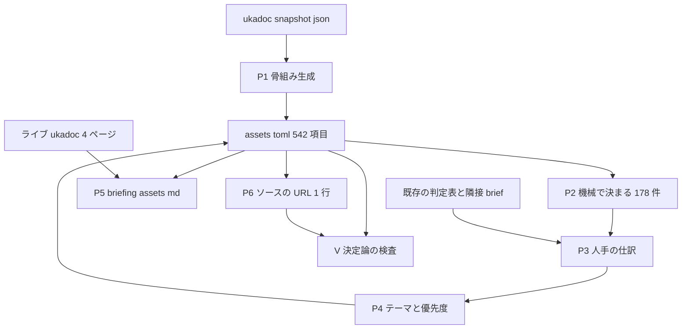

# 技術設計書: areka-P0-ukadoc-survey-assets

> 本書の事実主張はすべて 2026-09-03 にこの作業ツリー（`claude/areka-p0-ukadoc-survey-33754d`・origin/main へ rebase 済み）で `file:line` を開くか、正典スナップショットを機械で数え直して確かめた。要件・ギャップ分析と食い違った箇所は「§12 実測の訂正」に一覧で置き、本文はすべて訂正後の値で書いてある。

## 1. 概要

本 spec の成果物は**文書**である。ukadoc の「資産の定義と配布・更新」24 ページ 542 項目を全数仕訳し、台帳 1 本・ブリーフィング 1 本を書き、実装済みと判定した項目の定義箇所へ正典 URL 1 行を置く。areka の実行時の振る舞いは 1 行も変わらない。

したがって本書で言う「設計」は、動くものの構造ではなく**生産手順**である。⑴ 542 項目の骨組みをどう機械で起こすか、⑵ 状態をどの順でどの規則で埋めるか、⑶ ブリーフィングに何をどの形で載せるか、⑷ URL をどのファイルの何行目に置くか、⑸ 上流の道具が無い間に何を決定論の手順で検査するか——この 5 つを決める。

利用者は 3 人いる。統合担当（`areka-P0-ukadoc-coverage-roadmap`）は台帳を集計して段階を決める。将来の実装者はブリーフィングを読んで「読まれない記述がどう扱われるか」と「nar と更新に何が要るか」を知る。台帳を読む人はソースの URL で根拠が生きていることを確かめる。

### 1.1 目標

- 台帳 `doc/ukadoc-coverage/ledger/assets.toml` に 542 項目がちょうど収まり、未分類が 0 件で、id の集合がスナップショットと完全に一致すること。
- 台帳の正しさが、上流の道具が無くても決定論の手順（§11）で確かめられること。
- ブリーフィング `doc/ukadoc-coverage/briefing-assets.md` が、未知の記述の扱い 9 種・SERIKO/MAYUNA 世代表 137 行・nar と更新の導線 6 段を持つこと。
- 実装済みと判定した項目に、スナップショットと 1 文字も違わない正典 URL がソース側に 1 行ずつ置かれること。

### 1.2 非目標

- 実装・設計の決定（展開ライブラリの選定、更新機構の構造、プラグイン／ヘッドラインの実装可否）。
- 他 3 ドメインの台帳、全体報告 `report/summary.md`、束の解説 `linkage.md`、段階 A〜E の最終順序。
- 上流の道具（調査用クレート）の実装、カタログ・テーマ定義・README の作成。
- 隣接 spec の brief の書き換え。SSP 実機との挙動比較。

## 2. 境界の約束

### 2.1 本 spec が持つもの

- `doc/ukadoc-coverage/ledger/assets.toml`（新設）——資産ドメイン 542 項目の状態・世代・別名・担当・優先度・テーマ・関連・備考。
- `doc/ukadoc-coverage/briefing-assets.md`（新設）——人手で書く読み物。
- `crates/` 配下の `/// ukadoc: <URL>` 1 行コメント——実装済みと判定した項目の定義箇所のみ。
- 上流の道具が着地していた場合の `doc/ukadoc-coverage/report/assets.md`（再生成のみ・手編集なし）。

### 2.2 持たないもの

- 他 3 台帳（`shiori.toml`・`sakura-script.toml`・`property.toml`）と `catalog.toml`・`values.md`・`README.md`・`report/summary.md`・`linkage.md`。
- `doc/COMPAT_ARCHITECTURE.md`・`doc/emo2-conformance-scope.md`・`.kiro/steering/roadmap.md`・隣接 spec の文書（すべて読むだけ）。
- areka の実行時の振る舞い。ログを増やす変更・分類を足す変更も行わない（要件 3.7・10.1）。
- 担当が決まっていない項目の担当割り当て（空のまま統合担当へ渡す・要件 7.5）。

### 2.3 依存してよいもの

| 依存先 | 使い方 | 区分 |
|---|---|---|
| 上流契約 `.kiro/specs/areka-P0-ukadoc-survey-toolkit/requirements.md`（承認済み・付録 A / 付録 B） | 台帳の形式・7 状態語彙・6 関連種別・8 テーマ・ページ割り当て・URL の書き方・id 抽出手順 | P0・変更しない |
| ukadoc スナップショット `%APPDATA%\npm\node_modules\ukagaka-doc-mcp\data\index.json`（`version` 1・`generatedAt` 2026-08-24T04:08:57.881Z） | id・見出し・本文・URL の取得元 | P0・読むだけ |
| ライブの ukadoc（4 ページのみ・要件 1.12） | 綴りの実在確認と新しい見出しの検出 | P1 |
| repo 内の既存判定表（`doc/COMPAT_ARCHITECTURE.md:128-207` の 80 行、`doc/emo2-conformance-scope.md:82-88` の 7 行、完了 spec の設計表） | 縮退の転記元・担当の取り込み元 | P1・読むだけ |
| 隣接 spec の brief 群 | 担当の取り込み | P1・読むだけ |

### 2.4 再確認が要る変化

- **上流契約の付録 A・状態語彙・ページ割り当てが改訂されたとき**——台帳の全行が影響する。
- **スナップショットが更新されたとき**——id の集合が変わるので要件 1.4 の一致が崩れる。上流契約 要件 8 の差分で見直す範囲を絞る。
- **上流の道具が着地したとき**——要件 9.1／9.2 が発効し、報告の再生成とワークスペースのテストが完了条件に加わる（§5 の D7）。
- **担当として書いた spec 名が消えた・改名されたとき**——`owner` 欄が宙に浮く。
- **本 spec が URL を置いたソース行が別 spec の実装で消えたとき**——上流契約 要件 6.6 の検査が赤になる。

## 3. 上流契約の確定範囲と未決範囲

上流 spec は**要件のみ承認済みで、`design.md` はまだ生成されていない**（2026-09-03 に `.kiro/specs/areka-P0-ukadoc-survey-toolkit/` を確認・`brief.md`・`requirements.md`・`research.md`・`spec.json` の 4 本だけが存在する）。したがって「道具の設計が決めるはずの事柄」は、まだ決まっていない。

| 事項 | 状態 | 本 spec の扱い |
|---|---|---|
| 台帳 1 項目の形（`[entry."<id>"]`＋欄）・欄名 `owner`／`supersedes` | **凍結済み**（付録 A.1・A.2） | そのまま従う |
| 状態 7 語彙・関連 6 種別・テーマ 8 つ | **凍結済み**（要件 2.2・4.3・4.4） | そのまま従う |
| doc コメントの書式 `/// ukadoc: <正典 URL>`・1 項目 1 行・定義箇所のみ・語彙表は頭にページ URL 1 つ | **凍結済み**（要件 5.1〜5.4・付録 A.3） | そのまま従う |
| id の抽出手順（コロンで分割・`_` で分割しない） | **凍結済み**（付録 B） | そのまま従う |
| 報告 `report/<ドメイン>.md` の構成 | **凍結済み**（要件 7.1） | 道具が着地した場合のみ従う |
| **本文からの SSP 版番号の抽出規則** | **未決**（要件 1.2 は「本文に現れる版番号すべて」としか書かず、語境界の有無を決めていない） | §5 の D6 で本 spec が仮に決める。道具着地時に照合 |
| 台帳と報告の一致検査の実装 | 未着地 | §11 の自前検査で代替（要件 9.3 の退避路） |

## 4. アーキテクチャ（生産の流れ）



**依存の向き**は一方向である。スナップショット → 台帳 → （ブリーフィング｜ソースの URL）。逆流させない。とくに次の 2 つを規律として置く。

- **ブリーフィングは台帳を写す側**である。世代表 137 行も 44 行の一覧も、台帳から機械で起こすか、台帳の値をそのまま引く（要件 4.2）。ブリーフィングを直して台帳を追随させる向きは採らない。
- **ソースの URL は台帳の従属物**である。`status = "implemented"` の項目だけが URL を持ち、URL を先に置いてから状態を決めることはしない。

### 4.1 使う道具

| 層 | 選択 | 役割 | 備考 |
|---|---|---|---|
| 骨組み生成・世代表生成・検査 | Python 3.13（この環境で実測・`tomllib` 同梱） | スナップショット読み取り・TOML の生成と検査 | **`crates/` の外**（作業用の一時ディレクトリ）に置く。成果物としてコミットしない（D1） |
| TOML の読み書き | 生成は自前の文字列組み立て・検査は `tomllib` | 生成は決定論の並び順が要るので整形器に任せない | `tomllib` は重複キーで例外を投げるので重複検出に使える |
| ライブ確認 | WebFetch（4 ページのみ） | 綴りの実在と新しい見出しの検出 | `mcp__ukadoc` は同じスナップショットを引くので**ライブ確認には使わない** |
| 版管理 | git（`core.autocrlf` = true・`.gitattributes` 無し） | 改行の正規化 | 新規ファイルは CRLF で書く（D8） |

## 5. 設計判断

### D1: 骨組みは使い捨てスクリプトで作る（research 判断 1 = 案 ⑴）

542 項目・id 最長 153 文字・アンカーは日本語を符号化した文字列である。手写しは要件 1.4（ちょうど 542・集合が完全一致）と要件 1.5（文字順・重複なし）を構造的に満たせない。

- スクリプトは `crates/` の外の作業用ディレクトリに置き、**成果物の TOML だけをコミットする**（要件 10.1・10.2 が `crates/` への変更を doc コメントだけに限っているため）。
- スクリプトが残らない弱点は、**§6.1 に骨組みの生成規則を全部書く**ことで補う。同じ規則から同じバイト列が再現できる。
- 上流の道具が着地したときは、上流契約 要件 3.3a（既存項目を書き換えず不足分だけ挿入）がそのまま噛み合う。

### D2: 台帳は 4 段に分けて書く（research 案 C）

| 段 | 中身 | 完了の目印 |
|---|---|---|
| 第 1 段 | 骨組み 542 件（id ＋ 全欄の初期値） | 件数 542・id 集合一致（V1・V2） |
| 第 2 段 | 状態・別名・担当・関連。埋める順は **balloon → shell → surfaces → install／update／plugin／headline → ページ全体項目 15 件** | `unclassified` 0 件（V4） |
| 第 3 段 | テーマと優先度を束ごとに一括 | alias と not-applicable 以外の全件に優先度（V9） |
| 第 4 段 | ソースの URL とブリーフィング | URL と台帳の一致（V11） |

第 2 段の順序は「既存の判定表がある面 → 実装ゼロが確定している面 → 粒度の粗い面」である。balloon と shell は `doc/COMPAT_ARCHITECTURE.md` の 80 行と完了 spec の判定表がそのまま写せるので、判断の基準を先に固めてから残りへ進む。

### D3: `charset` の URL は 3 ページ分・`prescan.rs` に 3 行（research 判断 3 = 案 ⑴）

`charset` は本ドメインの descript 系 8 ページすべてに項目がある。areka の実装は 1 か所（`crates/areka-parsers/src/charset/prescan.rs:54`・クレート内で唯一大小文字を無視する照合）で、ファイル種別を区別しない。**種別ごとに実際に通るかどうかで割れる**。

| ページの `charset` | 通る経路 | 状態 |
|---|---|---|
| `descript_ghost` | `package/resolve.rs:64` が `charset::decode` を呼ぶ | implemented |
| `descript_shell` | 同 `:156` | implemented |
| `descript_balloon` | `crates/areka-emo-present/src/balloon.rs:418`（`read_decoded` が `decode(&bytes, DefaultEncoding::Ansi)`） | implemented |
| `descript_shell_surfaces` | 通らない。`crates/areka/src/emo2_boot/assets.rs:279` と `crates/areka/src/placement/measure.rs:333` が `std::fs::read_to_string` で読み、`shell/decode.rs` は `charset` を照合しない（明文 `:90`・`:490`） | absent・担当は `areka-P0-charset-canon` |
| `descript_shell_surfacetable`・`descript_install`・`descript_plugin`・`descript_headline` | 読む経路そのものが無い | absent・担当は空（`areka-P0-charset-canon/brief.md:51` が対象外を宣言） |

**URL は `prescan.rs:54` の直上に 3 行**（ghost・shell・balloon の 3 id）。`resolve.rs:64`・`:156`・`balloon.rs:418` は呼び出し側なので何も置かない（要件 6.2）。

### D4: 記録の段は備考に書き、分類は 3 つのまま（research 判断 5 = 案 ⑴）

要件 3.1 の 3 分類（黙って捨てる／記録を残す／エラーにする）を増やさない。段（`warn!`／`debug!`）は備考の情報として書く。要件 3.5a の裁定に従い、**`debug!` だけの記録は分類を「記録を残す」のままにして、壊れ方の判定は「黙って壊れる」にする**（既定のログ水準は `info`・`crates/areka/src/main.rs:141`）。

備考の書き方を 1 行の型に固定する。

```
壊れ方: <黙って壊れる|明示的なエラー|見た目の差>。記録: <なし|debug!|warn!|error!> <file:line>。
```

現在の記録の全数（本ドメインに関わる範囲）。

| file:line | 段 | 何を記録するか |
|---|---|---|
| `crates/areka-parsers/src/package/resolve.rs:296` | `warn!` | bindgroup の名前宣言にパーツ名が無い（`areka-parsers` 唯一の `warn!`） |
| `crates/areka-parsers/src/charset/decode.rs:35` | `debug!` | 未対応の charset ラベルを既定へ落とす |
| `crates/areka-parsers/src/charset/decode.rs:52` | `debug!` | デコード中の不正バイト列を代替文字で吸収 |
| `crates/areka-seriko/src/table.rs:111-115` | `debug!` | 間隔語 `bind` は静的な着せ替えゆえ非駆動 |
| `crates/areka-seriko/src/table.rs:118-127` | `debug!` | 未知の間隔語を元の語を添えて非駆動（`vocab` は `:123`） |
| `crates/areka-seriko/src/table.rs:128-136` | `debug!` | 将来の値を非駆動 |
| `crates/areka-emo-compose/src/method.rs:160-161` | `warn!` | 解決できない合成メソッド名を `Unknown` へ吸収 |

`areka-parsers` に `error!` は 0 件。無言で落ちる経路は `crates/areka-parsers/src/kv/parse.rs:39`（同じキーは後勝ち）・`crates/areka-parsers/src/shell/decode.rs:197-199`（第 2 欄が `overlay` 以外の `element` 行）・同 `:234-236`（`collisionex`）の 3 つ。

### D5: 世代表 137 行は台帳から機械で起こす（research 判断 7 = 案 ⑴）

要件 4.2 が「表の版番号を台帳から取り、食い違わせない」と命じており、道具が未着地の間その一致を保つ仕組みが他に無い。世代表は §6.1 と同じ作業用スクリプトが台帳を読んで Markdown の表を吐き、ブリーフィングへ貼る。表の生成規則（列・並び順・注記）は §9.2 に置く。

### D6: 版番号は語境界付きで読み、境界事例 7 件は空にする（research 判断 10 = 案 ⑴＋⑶）

抽出規則は上流の道具の設計が決めるはずだが、その設計はまだ無い（§3）。本 spec は**語境界付き**（前後に英数字・下線・ピリオドが続かない `\d+\.\d+\.\d+`）で読む。緩い規則は「他の数字の並び」を版番号と誤読するので、厳しい側を既定にする。

そのうえで、**2 つの規則で結果が割れる 7 項目は `introduced` を空にする**（要件 2.7「版番号が無ければ空・最古と決めつけない」が形式上そのまま使える）。上流の道具がどちらの規則を採っても上流契約 要件 6.7 の照合が赤にならない。

| 項目 id | 語境界あり | 語境界なし |
|---|---|---|
| `ukadoc:descript_balloon:cursor_2c_30d5_30a1_30a4_30eb_540d_20_2f_20mousecursor_2c_30d5_30a1_30a4_30eb_540d:1` | なし | 2.5.40 |
| `ukadoc:descript_ghost:cursor_2c_30d5_30a1_30a4_30eb_540d_20_2f_20mousecursor_2c_30d5_30a1_30a4_30eb_540d:1` | なし | 2.5.41 |
| `ukadoc:descript_ghost:shiori.cache_2c_6570_5024:1` | なし | 2.4.73・2.4.74 |
| `ukadoc:descript_ghost:shiori.logo.file_2c_30d5_30a1_30a4_30eb_540d:1` | なし | 2.4.26・2.8.56 |
| `ukadoc:descript_install:_76f8_5bfe_30d1_30b9_2c...:1`（相対パス系の 1 件） | なし | 2.5.17 |
| `ukadoc:manual_shell` | なし | 2.2.57・2.7.38 |
| `ukadoc:dev_nar` | 2.7.52 | 2.3.00・2.7.52 |

（ギャップ分析は 5 件と書いたが、集合の差で数え直すと 7 件である。§12 の訂正 3 を参照。）

`introduced` は 1 つの版だけを書く欄なので、語境界付きで 2 つ以上の版が取れる項目は**最も古い版**を書く（その項目が最初に現れた版という欄の意味に合う）。上流契約 要件 6.7 は「カタログの版番号のいずれかに含まれること」しか求めないので、これで赤にならない。

### D7: 上流の道具は「未着地」を前提に固定する（research 判断 8 = 案 ⑴）

着手条件は上流の要件確定であって実装完了ではない（要件 Introduction・上流契約 2.1）。したがって要件 9.3 の退避路——報告を再生成せず、台帳とブリーフィングだけを成果物とし、ブリーフィングの冒頭に「`doc/ukadoc-coverage/report/assets.md` は未生成であり、上流の道具の着地後に再生成が要る」と書く——を既定にする。

ただし完了の直前に 1 度だけ `doc/ukadoc-coverage/` と調査用クレートの有無を確かめる（§11 の V15）。着地していれば要件 9.1／9.2 が発効し、報告の再生成とワークスペースのテスト実行を完了条件に足す。冒頭の 1 段落を差し替えるだけで済むよう、この段落は独立した節にしておく。

### D8: 新規ファイルは CRLF で書く（research §6-5）

この作業ツリーのテキストファイルはすべて復帰文字付きである（`doc/COMPAT_ARCHITECTURE.md` は 216 行すべて CRLF）。`.gitattributes` は無く、`core.autocrlf` = true が変換を担う。骨組み生成スクリプトは改行を明示（Python なら `open(..., "w", newline="\r\n")`）し、作業ツリー上の `assets.toml`・`briefing-assets.md` を CRLF にする。

### D9: 正典に居場所が無い areka の語は台帳に行を作らない（research §6-7・要件 4.3）

`surface.append`・`kero.surface.alias`・`bind+random` はスナップショット全 1,749 件で見出し 0・本文 0 である（2026-09-03 に再確認）。要件 1.4 が件数を 542 に、要件 1.6 がページを 24 に固定しているので、新しい行を作る余地は無い。

| areka の語 | 認識箇所 | 書く先 |
|---|---|---|
| `surface.append` | `crates/areka-parsers/src/shell/decode.rs:127` | ページ全体項目 `ukadoc:manual_shell` の備考 ＋ ブリーフィングの surfaces.txt 節 |
| `kero.surface.alias` | 同 `:122` | 同上（`manual_shell` は `alias.txt` が旧仕様で surfaces.txt に統合された旨を書くだけで、綴りが違う） |
| `bind+random` | 同 `:391`・駆動は `crates/areka-seriko/src/table.rs:107-109` | `ukadoc:descript_shell_surfaces:random_2c_6570_5024:1` の備考 ＋ 世代表の注記（要件 4.3 が明示） |

3 語ともライブ確認の対象（要件 1.12 ⑴ は前 2 語）。結果はブリーフィングに「実在する／しない・正しい綴り」で記す。**ライブで実在が確かめられない限り、この 3 語に対応する台帳の項目を `implemented` にはしない**（根拠が立たないため）。

### D10: URL を置くのは `implemented` の項目だけ

要件 6.1 は `implemented` に URL を義務づけ、要件 6.6 は未実装に何も書くなと言う。`degraded`・`vocabulary-only` はどちらの文にも直接当たらない。**最も狭い読み方**を採り、URL を置く集合を `status = "implemented"` の項目だけに限る。理由は 2 つ。

- 検査が 1 本の等式になる——「ソース中の URL の集合」＝「台帳で `implemented` の id の集合」。どちらの向きのずれも V11 で赤にできる。
- 上流契約 要件 6.6 は `implemented` 行に証拠があることしか求めておらず、狭く置いても赤にならない。

**1 つの id に対する URL は repo 全体で 1 行だけ**にする（要件 6.3）。2 つのファイルが同じ語を定義している場合は、意味を所有する側に置く（例: 描画メソッド `overlay` は `crates/areka-emo-compose/src/method.rs:148`。`crates/areka-parsers/src/shell/decode.rs:198` は行の受理側なので置かない）。

なお要件 6.4 の「語彙表の先頭にページ URL 1 つ」という書き方は本ドメインでは使わない。唯一の候補である合成メソッドの種別表（`crates/areka-emo-compose/src/method.rs:186-204` の 19 種）は、実導出を持つのが `Overlay` だけ（`:130-132`）で表の中身が `vocabulary-only` になるため、D10 の下では URL を置く対象にならない。

## 6. データの定義

### 6.1 骨組みの生成規則（第 1 段・要件 1.2〜1.10）

1. スナップショットを読む。場所は環境変数 `AREKA_UKADOC_SNAPSHOT` があればそれ、無ければ `%APPDATA%\npm\node_modules\ukagaka-doc-mcp\data\index.json`。
2. `source == "ukadoc"` かつ `id.split(":")[1]` が担当 24 ページのいずれかである entry を選ぶ（**`_` で分割しない**・上流契約 付録 B）。件数が 542 でなければ止める。
3. id を昇順に並べる。542 件の id はすべて ASCII で（実測）、Python の文字列順とバイト順が一致することを確かめてある。
4. ファイルの冒頭に次を書く（要件 1.3・8.7）。

   ```toml
   [ledger]
   domain = "assets"
   pages = [ ... 24 ページ ... ]
   ```

   続けてコメントで ⑴ id の読み替え規則 1 行——「ukadoc の見出しにある `*` は areka の照合では 1 個以上の数字にあたる。例: `sakura.bindgroup*.default` ↔ `sakura.bindgroup0.default`」、⑵ 「段階 A〜E の最終順序は決めない。決定は `areka-P0-ukadoc-coverage-roadmap` に委ねる」、⑶ 版番号の抽出規則（D6）を書く。
5. 各項目を上流契約 付録 A.2 の欄順で書く。初期値は `status = "unclassified"`・`introduced = ""`・`owner = ""`・`priority = ""`・`values = []`・`links = []`・`note = ""`。
6. id とアンカーの文字列は**見た目で直さずそのまま写す**（見出しを `_6c4e_7528_...` のように符号化した部分を含む・要件 1.8）。id は引用符で囲むだけでよい（542 件の id に逆斜線・引用符・非 ASCII・空白はいずれも 0 件——実測）。付録 A.3 が言う逆斜線の書き分けは本ドメインでは 1 件も起きない。
7. アンカーを持たないページ全体の項目 15 件（`manual_*` 8・`dev_*` 6・`memo` 1）も同じ形で収容し、粒度が粗いことを備考に書く（要件 1.10）。
8. ukadoc の本文は写さない（要件 1.9）。見出しと本文は判断材料にするだけである。
9. 改行は CRLF（D8）。

### 6.2 1 項目の欄（上流契約 付録 A.2 を再掲・変更しない）

| 欄 | 型 | 本 spec での決まり |
|---|---|---|
| （表のキー） | `[entry."<id>"]` | スナップショットの id をそのまま。文字順・重複なし |
| `status` | 文字列 | 7 語彙のみ。完了時に `unclassified` は 0 件 |
| `introduced` | 文字列 | D6 の規則。無ければ `""` |
| `alias_of` | 文字列 | `status = "alias"` のときだけ。指す先の状態は `alias` でない（要件 2.4） |
| `supersedes` | 文字列の配列 | 任意 |
| `owner` | 文字列 | 担当 spec 名。未定は `""`（要件 7.5） |
| `priority` | 文字列 | `^[A-E][0-9]+$`。`alias`・`not-applicable` は `""`（要件 8.6） |
| `values` | 文字列の配列 | 8 テーマ名のみ（要件 8.1） |
| `links` | インラインテーブルの配列 | `{ kind = "...", to = "..." }`。`kind` は 6 種・`to` はスナップショットに実在する id（要件 9.7） |
| `note` | 複数行文字列 | D4 の 1 行型を含む。ukadoc の本文は写さない（要件 1.9） |

### 6.3 機械で決まる 178 件（第 2 段の下書き・要件 2.1）

| 規則 | 件数 | 決め方 |
|---|---|---|
| 規則 1: areka の受理キー表と見出しが文字列一致 | 62 | ゴースト 7・シェル 8・バルーン 29・surfaces 18 |
| 規則 2: 合成メソッドの写像表と突き合わせ | 55 | `crates/areka-emo-compose/src/method.rs:173-204` が解ける 38 名 → `vocabulary-only`、解けない 17 名 → `absent`（`:160-161` で `warn!`） |
| 規則 3: 読む経路が無いページ | 61 | `descript_plugin` 13 ＋ `descript_headline` 9 ＋ `descript_install` 15 ＋ `spec_update_file` 9 ＋ ページ全体項目 15 |
| 合計 | **178** | 残り 364 件は人手。ただし大半は素直に `absent` で、実作業は備考・テーマ・優先度の文章 |

規則 1 の一致は実測で裏が取れている。バルーンは 30 キーのうち 28 が `descript_balloon` の見出しと 1 文字も違わずに一致し、一致しない 2 つ（`writing_mode`・`budoux_newline`）は areka 独自の拡張で正典に項目が無い。ゴーストは 7/7 一致。シェルだけは形が違い、ukadoc の `sakura.bindgroup*.default` に対して areka は接頭辞＋番号＋接尾辞で照合するので、§6.1 の読み替え規則 1 行で橋を架ける。なお `descript_shell` には `char*.bindgroup*.*`・`char*.bindoption*.group` という別系統の項目もあり、areka はこちらを照合しない（`crates/areka-parsers/src/package/resolve.rs:111-121` の接頭辞は `sakura.`／`kero.` の 2 つだけ）。

### 6.4 別名の向きと「対象外」の決め方（要件 2.5・2.6）

**別名**（`status = "alias"`）は、上流契約 要件 4.1 の順で決める。⑴ 正典本文の注記（廃止予定・旧・統合された旨）→ ⑵ SSP 版番号 → ⑶ 人手の判断。**どの手掛かりで決めたかを必ず備考に書く**（要件 2.5）。最も新しい書式を正典とし、それ以外を別名にする。

第 1 段でそのまま決まる好例が本ドメインに 2 系統ある。

- 合成メソッドの `ukadoc:descript_shell_surfaces:bind:2` の本文が「現在は `add` が互換。処理の内容は `overlay` と同義」と自分で向きを書いており、`crates/areka-emo-compose/src/method.rs:148` の `"overlay" | "add" | "bind" => Overlay` とぴたり一致する。
- 旧書式の `overlaymultiply`・`overlayscreen` は、同 `:176-177` が `blend-multiply-fast`・`blend-screen-fast` へ明示写像している。

別名の連鎖は作らない（指す先の状態が `alias` であってはならない・要件 2.4・V6）。`alias_of` の逆向きを書きたいときは `supersedes` を使う。

**対象外**（`not-applicable`）は、SSP 以外のベースウェア専用の記述に付ける候補とし、根拠を備考に書く（要件 2.6）。本ドメインでの該当は少数で、いずれもページ全体項目に集中する（MATERIA の注記 8・CROW 5）。ベースウェア名を挙げているだけで SSP でも有効な記述は対象外にしない。

### 6.5 テーマと優先度の付け方（第 3 段・要件 8）

**テーマ**（8 つのみ・要件 8.1〜8.4）。「この項目が無いと利用者はゴーストの何を失うか」に答えられるものだけを付け、答えられなければ空にする。既定で付けない群は、配布者向けページ（`dev_bind`・`dev_nar`・`dev_ownerdraw`・`dev_shell`・`dev_shell_error`・`dev_update`・`memo`）、プラグインとヘッドラインの descript、トランスレータ。外す場合は理由を備考に書く。更新機構に属する 14 項目（`spec_update_file` 9 ＋ `descript_install` の `refresh`／`refreshundeletemask`／`*.refresh`／`*.refreshundeletemask` 4 ＋ `manual_update` 1）には必ず「更新」を含める（要件 8.3）。

**優先度**は 1 件ずつではなく**束ごとに一括**で付ける。手順を固定する。

1. 壊れ方の段を決める（黙って壊れる ＞ 明示的なエラー ＞ 見た目の差）。判定は D4 の記録の実測に基づき、根拠を備考に書く（要件 8.8）。
2. テーマの数で段階を動かす。2 つ以上なら 1 段繰り上げてよい。1 つなら同じ段階の先頭寄り。0 個かつ見た目の差以下なら E 候補。
3. 同じ段階の中の数値は、影響する既存資産の広さ → 依存する基盤の共有度 の順で決める（要件 8.5 の固定序列）。
4. 同じ束に属する項目は**同じ優先度**を書き、束の名前を備考に残す。数値の一意性は求めない。

段階の名前は `.kiro/steering/roadmap.md` の登記（A そこにいて触れて話す／B 迎えて育てて見送る／C 察してくれる／D 仲間がいる／E 周辺）を読み替えの目安に使うが、**最終順序は決めない**（要件 8.7）。

## 7. ファイル構成計画

### 7.1 新設するファイル（成果物）

```
doc/
└── ukadoc-coverage/
    ├── ledger/
    │   └── assets.toml          # 542 項目の台帳。本 spec が唯一の書き手
    ├── briefing-assets.md       # 人手で書く読み物（§9 の目次）
    └── report/
        └── assets.md            # 上流の道具が着地している場合のみ・再生成のみ（D7）
```

`doc/ukadoc-coverage/` はまだ存在しない（2026-09-03 に不在を確認）。ディレクトリごと新設する。`catalog.toml`・`values.md`・`README.md`・`linkage.md`・`report/summary.md`・他 3 台帳は**作らない**（要件 9.4・9.5・10.3）。

### 7.2 変更するファイル（`crates/` の doc コメントのみ）

| ファイル | 置く URL の数（上限） | 置く場所 |
|---|---|---|
| `crates/areka-parsers/src/charset/prescan.rs` | 3 | `:54` の照合の直上（D3） |
| `crates/areka-parsers/src/package/resolve.rs` | 12 | ゴースト 6 キーは各引き行（`:69`・`:70`・`:71`・`:72`・`:78`・`:83`）の直上、シェルの合成形 6 は定数群（`:111-121`）の直上にまとめて 6 行 |
| `crates/areka-parsers/src/balloon/parse.rs` | 28 | 各引き行の直上（`writing_mode`・`budoux_newline` は正典項目が無いので置かない） |
| `crates/areka-parsers/src/shell/decode.rs` | 9 | `element*`（`:197`）・`collision*`（`:234`）・`animation*.interval`（`:323`）・`animation*.pattern*`（`:334`）・`animation-sort`（`:501`）・`collision-sort`（`:502`）・`bind`（`:387`）・`random`（`:388`）ほか。`descript`／`surface`／`surface.append`／`kero.surface.alias`／`ascend`／`descend` は正典項目が無いので置かない |
| `crates/areka-emo-compose/src/method.rs` | 1 | `overlay`（`:148`）。ほかは `vocabulary-only` ゆえ置かない（D10） |
| `crates/areka/src/emo2_boot/frame/zorder_descript.rs` | 1 | `seriko.zorder` の読取（`:47`） |

**上限は 54 行**である。実際に置く数は状態が `implemented` に確定した項目数で決まる（`degraded` と判定した項目には置かない・D10）。URL を置く対象は本ドメインの項目に限り、他ドメインの項目の定義箇所には置かない（要件 6.9）。

行数の上限テストは `crates/**/*.rs` を走査する（`crates/log-capture-kit/tests/workspace_scan/mod.rs:38` が上限 1,000・`:82` が `root.join("crates")`・`:103` が `.rs` だけ）。追加後の行数は `resolve.rs` 949→961、`balloon/parse.rs` 168→196、`shell/decode.rs` 558→567、`method.rs` 395→396、`prescan.rs` 60→63 で、いずれも上限を超えない（V13 で確かめる）。

### 7.3 作業用（コミットしない）

`crates/` の外の一時ディレクトリに 3 本置く。`gen_skeleton.py`（§6.1）・`gen_seriko_table.py`（§9.2）・`check_ledger.py`（§11）。生成規則と検査項目は本書に全部書いてあるので、失われても同じ結果を再現できる。

## 8. 担当 spec の取り込み

要件 7.2 が名指しする 15 本に加えて、要件確定後に main へ現れた 2 本を取り込む（要件 7.1「既存 spec が担当している項目は担当の欄に書き、新しい追跡先を作らない」）。担当 spec 名の実在は 2026-09-03 に確認した。

| 担当 spec | 取り込む項目 | 出所 |
|---|---|---|
| `areka-P0-balloon-canon-residue` | バルーンの残語彙 **12 項目すべて**（brief の Scope 行が書く「10 項目」は採らない・要件 7.3） | `brief.md:11-16`・`:24-27`・`:33`・`:35` |
| `areka-P0-surfaces-basepos` | `point.basepos.x`／`.y` | `brief.md:38` |
| `areka-P0-text-decoration-canon` | バルーン descript の `font.*` 系と `disable.font.*` | `brief.md:33` |
| `areka-P0-anchor-tag-canon` | `anchor.font.*`／`anchor.notselect.font.*`／`anchor.visited.font.*` | `brief.md:30`・`:16` |
| `areka-P0-choice-marker-styling` | バルーン descript の `cursor.*` | `brief.md:26`・`:8` |
| `areka-P0-charset-canon` | `shiori.encoding`／`shiori.forceencoding`／surfaces.txt の `charset` | `brief.md:50` |
| `areka-P0-scope-zorder-pinning` | シェル descript の `seriko.zorder` | 完了 spec |
| `areka-P0-windowposition-limit` | ゴースト側 `windowposition.*` | 完了 spec |
| `areka-P0-kero-balloon`／`-balloon-visibility`／`-balloon-vertical-canon`／`-balloon-offset-dpi` | バルーンの系列名・表示寿命・縦書き・単位空間 | 完了 spec |
| `areka-P0-bindoption-exclusivity` | `bindoption*.group` | 完了 spec |
| `areka-P0-package-mount` | ゴースト descript の起点と install.txt の対象外宣言 | 完了 spec |
| `areka-P0-shell-parse`／`-balloon-parse` | 転記層の範囲 | 完了 spec |
| **`areka-P0-makoto-dll-host`（追加）** | `ukadoc:descript_ghost:makoto_2c_30d5_30a1_30a4_30eb_540d:1`（本ドメインで `makoto` を見出しに持つ唯一の項目——2026-09-03 に全 542 件で確認） | `brief.md:10`・`:37`・`:57` |
| **`areka-P0-translate-pipeline`（追加）** | ページ全体項目 `ukadoc:manual_translator` | `brief.md:9`・`:47` |

`ukadoc:manual_translator` は 2 本が半分ずつ主張する（`translate-pipeline` が継ぎ目と順序、`makoto-dll-host` が DLL のホスティング）。`owner` は 1 つしか書けないので、ページが説明する仕組みの入口を持つ `areka-P0-translate-pipeline` を担当とし、備考に `areka-P0-makoto-dll-host` が後半を持つことを書き、`links` に `{ kind = "same-feature", to = "ukadoc:descript_ghost:makoto_..." }` を置く。

**担当が空のまま残るもの**（要件 7.5）: `descript_install`・`descript_shell_surfacetable`・`descript_plugin`・`descript_headline` の `charset`（`areka-P0-charset-canon/brief.md:51` が対象外を宣言）、install／update／nar の全項目、プラグインとヘッドラインの descript、配布者向けページ。

**名前が同じで id が違う項目**は同一視しない（要件 7.6）。備考に区別を書く。代表例は `homeurl`（本ドメイン 5 ページ＋`list_propertysystem`＋`list_shiori_resource`）と、`descript_ghost` と `descript_shell` の両方にある `name`・`sakura.name`・`sakura.name2`・`kero.name`（areka はゴースト側だけを読む——`crates/areka-parsers/src/package/resolve.rs:69-72`——ので状態が割れる）。

**隣接 brief の是正候補**（要件 7.4・brief は書き換えない）。ブリーフィングに 1 節として並べ、当該項目の備考にも「担当 spec の記述が古い」と 1 行書く。現時点で確定しているのは 4 件——⑴ `balloon-canon-residue/brief.md:58` の Scope 行が「10 項目」のまま（実際は 12）、⑵ `charset-canon/brief.md:51` の対象外宣言により 4 ページの `charset` が担当なしになる、⑶ `zorder-property/brief.md:52` の三重所有が未決、⑷ `text-decoration-canon/brief.md:33` の「13 キー」に名前の列挙が無い（`descript_balloon` の `font.*` は実測 14 種）。

## 9. ブリーフィングの構成

`doc/ukadoc-coverage/briefing-assets.md` は人手で書く（要件 5.1）。節を次の順で置く。

### 9.1 冒頭（D7 の差し替え点）

上流の道具の着地状況と、`report/assets.md` が未生成であること・再生成が要ることを 1 段落で書く（要件 9.3）。基準時点（スナップショット `generatedAt` = 2026-08-24T04:08:57.881Z・ライブ確認日）もここに置く。

### 9.2 SERIKO/MAYUNA 世代別対応表（要件 4）

`descript_shell_surfaces` 137 項目を 1 行ずつ。列は「項目 id・見出し・登場した版・areka の状態」（要件 4.1）。台帳から機械で起こす（D5）。表に添える注記は 4 つ。

- 間隔語のうち実際にアニメーションを駆動するのは `random` と `bind+random` の 2 語だけで、`bind` は駆動しない。転記側 `crates/areka-parsers/src/shell/decode.rs:380-396`・駆動側 `crates/areka-seriko/src/table.rs:105-137`（`Random` は `:106`、`BindRandom` は `:107-109`、`Bind` の非駆動と記録は `:110-117`）（要件 4.3）。
- `bind+random` に対応する正典項目は無いので `random` の備考に書いた（D9）。
- 合成メソッドの実導出は `overlay` だけ（`crates/areka-emo-compose/src/method.rs:130-132`）（要件 4.4）。
- 当たり判定は矩形のみ。`collisionex`（円・楕円・多角形）は何も記録せずに読み飛ばす（`crates/areka-parsers/src/shell/decode.rs:234-236`）（要件 4.5）。縮小の出所は `doc/emo2-conformance-scope.md:82`（要件 4.6）。

見出しが `bind` で重なる 2 項目（`ukadoc:descript_shell_surfaces:bind:1` = 間隔語、`:2` = 合成メソッド）は id で区別して別々の行に載せる（要件 4.7）。

### 9.3 未知の記述の扱い（9 種・要件 3）

定義ファイル種別ごとに 1 節。各節に ⑴ 分類（3 つのいずれか 1 つ）、⑵ file:line の根拠、⑶ 記録の段、⑷ 壊れ方の判定、⑸ 「その記述を読むのは誰か」（転記層で止まるのか下流のどのエンジンまで届くのか）、⑹ 「成立に要る基盤は何か」（例: オーナードローメニュー・更新機構）を書く（要件 3.2・3.6）。

| 節 | 分類 | 根拠 |
|---|---|---|
| ゴーストの descript | 黙って捨てる | `crates/areka-parsers/src/kv/parse.rs:20`（KV 化）・`:26`（最初の読点で分割）・`:39`（後勝ち・記録なし）。受理は `package/resolve.rs:69-83` の 6 キー |
| シェルの descript | 黙って捨てる | 同上。受理は `package/resolve.rs:111-121` の定数と `:146-218` の照合（6 形）。唯一の `warn!` は `:296` で、これは未知キーではなく bindgroup の名前宣言の不備 |
| surfaces.txt | 黙って捨てる | `crates/areka-parsers/src/shell/decode.rs`。塊の見出しは `:118`・`:122`・`:127`・`:132` の 4 語だけ。`charset` は照合されず素通り（明文 `:90`・`:490`）。例外として未知の間隔語だけが下流で記録を残す（`crates/areka-seriko/src/table.rs:118-127`・段は `debug!`＝既定では見えない・要件 3.5a） |
| バルーンの descript | 黙って捨てる | `crates/areka-parsers/src/balloon/parse.rs` の完全一致引き 31 か所（30 キー）。明文は `:9`・`:39`・`:121-125` |
| install.txt | 黙って捨てる（ファイル全体） | 読む経路が無い。宣言は `crates/areka-parsers/src/package/resolve.rs:8`、影響しないことを固定するテストは `crates/areka-parsers/src/package/validation_tests.rs:113`・`:122-125`・`:127`（要件 3.8） |
| プラグインの descript | 黙って捨てる（ファイル全体） | 解析コードが無い。名前の予約のみ（`crates/areka-sylphya/src/vocab/dotted.rs:25`・`:104`） |
| ヘッドラインの descript | 黙って捨てる（ファイル全体） | 同 `:24`・`:104` |
| surfacetable.txt | 黙って捨てる（ファイル全体） | `crates/` に `surfacetable` を含む Rust の行が 0 件 |
| 更新ファイル（updates2.dau・updates.txt・delete.txt） | 黙って捨てる（ファイル全体） | Rust から参照する行が 0 件 |

`areka-parsers` の記録経路が 3 つしか無いこと（`warn!` 1・`debug!` 2・`error!` 0）と、それ以外がすべて無言であることを 1 節として明記する（要件 3.3）。`collisionex` が何も記録せずに読み飛ばされることは、対応する台帳の項目の備考にも file:line 付きで書く（要件 3.4）。扱いが「黙って捨てる」に当たる項目は、上流契約 要件 4.7 の壊れ方 ⑴ に当たるかを判定し、「どの記録が出るか・出ないか」を備考に書く（要件 3.5）。

### 9.4 nar インストールとネットワーク更新の導線（要件 5）

6 段（入手 → 展開 → 配置 → 起動 → 更新 → 削除）。各段に ⑴ 必要な正典項目の id、⑵ 最小成立要件（install.txt の解釈・zip の展開・配置の規則・updates2.dau の照合・delete.txt・更新イベントとの繋がり）、⑶ areka の現状（実装ゼロ）を並べる（要件 5.2・5.3）。

- **areka の現状は実測値で書く**（要件 5.6）——`crates/` 配下の Rust コードから `updates2.dau`・`updates.txt`・`.nar`・`OnUpdate` を参照する行はいずれも 0 件、zip 展開の依存なし、ネットワーク入出力なし。
- **正典書式の実ファイルが試験用ゴーストに 7 本ある**ので、各段の実例に使う。`crates/pilot/examples/shiori-host-32/fixtures/emo2/updates.txt:1-2`（`charset,UTF-8` ＋ `file,...` 行）・`.../fixtures/emo2/ghost/master/updates.txt`・`.../fixtures/emo2/delete.txt:1-2`・`.../fixtures/emo2/install.txt:1-6`・`.../fixtures/emo2/emo2-kakukaku/install.txt`・`.../fixtures/emo2-kakukaku-offsetdpi/install.txt`・`.../fixtures/emo2-kakukaku-wplimit/install.txt`（後 2 本は `emo2/` の中ではなく兄弟——§12 の訂正 4）。
- **既存の判断記録が 1 件も無い**こと（沈黙ルール対応表に該当行 0 行）と、既存の言及がいずれも「対象外」の宣言であることを書く（要件 5.7）。実在を確かめた箇所は `doc/emo2-conformance-scope.md:73`・`:75`・`:76`・`:92` と `crates/areka-parsers/src/package/resolve.rs:8`（要件が挙げる `:89` は空行——§12 の訂正 5）。
- 本ドメインの外へ伸びる先は台帳の `links` で指し、項目を複製しない（要件 5.4）。少なくともさくらスクリプト側の `\![execute,install,...]`・`\![execute,createnar]`・`\![execute,createupdatedata]`・`\![update,...]`・`\![updateother,...]` と、shiori 側の `OnInstallComplete`／`OnInstallCompleteAll`／`OnInstallRefuse`／`OnInstallReroute`／`OnNarCreating`／`OnNarCreated`／`OnUpdatedataCreating`／`OnUpdatedataCreated`／`OnUpdateProcessExec`／`OnUpdateBegin`／`OnUpdateReady`／`OnUpdateComplete`／`OnUpdateFailure` を持つ（要件 5.5）。
- 実装方式は決めない（要件 5.8）。nar の作成側は導線の対象外候補として区別し、台帳には優先度だけを付ける（要件 5.9）。
- 将来 spec の自然な境界を 3 つ挙げるだけにする——「定義ファイルの解釈（既存の転記層の拡張）」「配布と更新（新しい基盤）」「surfaces.txt の SERIKO/MAYUNA（単独で 1 本になる大きさ）」（要件 5.10）。

### 9.5 沈黙ルール対応表 44 行の一覧（要件 2.9）

`doc/COMPAT_ARCHITECTURE.md:128-207` の 80 行のうち本ドメインの項目に触れる行の**行番号一覧**を 1 節として載せる。表にドメインを示す欄が無く 44 と 16 が機械で再現できないため、この一覧が数の根拠になる。縮退（`degraded`）と判定した項目の備考には転記元の行番号を必ず書く（要件 2.8）ので、逆引きでも数え直せる。

### 9.6 ライブ確認の結果（要件 1.12）

WebFetch で 4 ページを引く（`manual_shell`・`descript_shell_surfaces`・`descript_balloon`・`descript_shell`）。`mcp__ukadoc` は同じスナップショットを引くので使わない。

- ⑴ `surface.append`・`kero.surface.alias` の綴りと正典上の実在を `manual_shell`／`descript_shell_surfaces` で確かめ、「実在する／しない・正しい綴り」を書く。
- ⑵ 版番号が新しい 3 ページのライブの見出し一覧とスナップショットの見出し一覧を突き合わせ、増えた見出しを §9.7 へ回す。
- 他の 21 ページはライブを見ない。ネットワークが使えない場合は「未確認」と理由を書き、D9 の判定（`implemented` にしない）を据え置く。

### 9.7 未収載の候補（要件 1.11）

スナップショットに無い正典項目（2.8.83 以降の追加など）を、ページ名と見出しで並べる。**台帳には書かない**（id はカタログと完全一致でなければならず、追加は上流契約 要件 8 のスナップショット更新で入る）。

### 9.8 隣接 spec の是正候補（要件 7.4）

§8 の 4 件と、調査中に見つかったものを並べる。brief は書き換えない。

## 10. 進めかたと段取り

| 段 | 作業 | 出来上がるもの | 依存 |
|---|---|---|---|
| 0 | ライブ確認 4 ページ（§9.6） | 綴りの確定・新しい見出しの一覧 | なし。**先に済ませる**（D9 の判定と §9.7 の材料になるため） |
| 1 | 骨組み生成（§6.1） | 542 項目・全欄初期値の `assets.toml` | 0 は不要 |
| 2 | 機械で決まる 178 件（§6.3） | 状態が入った 178 件 | 1 |
| 3 | 人手の仕訳 364 件（balloon → shell → surfaces → install ほか → ページ全体） | `unclassified` 0 件 | 2・既存判定表・隣接 brief |
| 4 | テーマと優先度（§6.5） | 優先度が入った台帳 | 3 |
| 5 | ソースの URL（§7.2） | `crates/` の doc コメント | 4（`implemented` の集合が確定してから） |
| 6 | ブリーフィング（§9） | `briefing-assets.md` | 0・4・5 |
| 7 | 検査（§11） | 全項目が緑 | 6 |

段 1〜4 は台帳 1 本しか触らないので、途中で止まっても `unclassified` の残り件数で進み具合が読める。段 5 を段 4 より前に出さない——URL は台帳の従属物である（§4）。

## 11. 検証計画

上流の道具が無くても走る決定論の検査を、作業用スクリプト 1 本（`check_ledger.py`）にまとめる。**`crates/` にテストを足さない**（要件 10.1）。すべて入力が同じなら結果が同じで、ネットワークにも実機にも依存しない。

| 番号 | 検査 | 要件 |
|---|---|---|
| V1 | `[entry."..."]` の塊がちょうど 542 個 | 1.4 |
| V2 | 台帳の id 集合＝「スナップショットで `source` が `ukadoc` かつページが担当 24 ページ」の id 集合（差分を両向きで出す） | 1.4・1.6・1.7 |
| V3 | id が昇順・重複なし（`tomllib` が重複キーで例外を投げることも併用） | 1.5 |
| V4 | `unclassified` が 0 件（文字列検索でも 0 件） | 2.2 |
| V5 | `status` が 7 語彙のいずれか | 2.3 |
| V6 | `status = "alias"` の行に `alias_of` があり、指す先が台帳に実在し、その状態が `alias` でない | 2.4 |
| V7 | `links[].kind` が 6 種のいずれか・`links[].to` がスナップショットに実在する id | 9.7 |
| V8 | `values[]` が 8 テーマ名のいずれか | 8.1 |
| V9 | `alias`・`not-applicable` 以外の全項目の `priority` が `^[A-E][0-9]+$`。この 2 状態は `""` | 8.6 |
| V10 | `introduced` が空、またはその項目の本文から語境界付きで取れる版番号のいずれか。D6 の 7 項目は空であること | 2.7・D6 |
| V11 | `crates/**/*.rs` の `/// ukadoc: <URL>` を集めて、⑴ 各 URL がスナップショットの `url` と 1 文字も違わない、⑵ URL → id の集合が台帳の `implemented` の id 集合と一致、⑶ 同じ id の URL が 2 行以上ない | 6.1・6.3・6.5・6.7・6.9・D10 |
| V12 | 世代表 137 行の版番号が台帳の `introduced` と一致（表の再生成結果とブリーフィング中の表がバイト一致） | 4.1・4.2 |
| V13 | URL を足した各ファイルの行数が 1,000 未満（上限テストの前倒し・`crates/log-capture-kit/tests/workspace_scan/mod.rs:38`） | 6.8 |
| V14 | `git diff --name-only` の変更対象が `doc/ukadoc-coverage/` 配下と `crates/` の doc コメントだけ。`doc/COMPAT_ARCHITECTURE.md`・`.kiro/steering/roadmap.md`・他 3 台帳・隣接 spec の文書に差分が無い（パスの実在を先に確かめてから差分を取る） | 10.1〜10.6 |
| V15 | 完了直前に `doc/ukadoc-coverage/catalog.toml` と調査用クレートの有無を確かめる。着地していれば `cargo test --workspace` と報告の再生成を足す | 9.1〜9.3 |

**道具そのものを較正する**（緑は道具が壊れていても出る）。V1〜V12 は、それぞれ「わざと 1 か所壊した写し」を作って赤になることを 1 度は確かめてから本番に当てる。例——id を 1 つ削って V1・V2 が赤になるか、`status` を綴り違いにして V5 が赤になるか、URL の末尾を 1 文字変えて V11 が赤になるか。

**doc コメント追加の前後で既存テストの結果を変えない**（要件 6.8）。段 5 の前後で `cargo test --workspace` を 1 度ずつ走らせ、結果が同じであることを確かめる。差が出たら doc コメントを疑う。

## 12. 実測の訂正

要件・ギャップ分析と実測が食い違った箇所。**要件は書き換えない**。台帳とブリーフィングに書き写すときは、下の右列の値を使う。

| # | 出所の記載 | 実測（2026-09-03） |
|---|---|---|
| 1 | ギャップ分析 §1.2「シェルの照合の本体は `resolve.rs:171-215`」 | 要件本文の **`:146-218`** が正しい（`read_bindgroup_defaults` 全体）。`:171-215` は腕の途中で切れている |
| 2 | ギャップ分析 §1.2「未知キーの明文は `balloon/parse.rs:122-126`」 | **`:121-125`**（`:126` は `BalloonCursor::new(` のコード行） |
| 3 | ギャップ分析 §3-4・§6-2「語境界の有無で動くのは 5 件」 | **7 件**（§5 の D6 の表）。5 件は「版番号を 1 つも持たなくなる descript 系の項目」の数で、`ukadoc:manual_shell`（2 つ失う）と `ukadoc:dev_nar`（1 つ失う）が漏れている |
| 4 | ギャップ分析 §1.2 の試験用ファイル 7 本の場所 | `emo2-kakukaku-offsetdpi/install.txt` と `emo2-kakukaku-wplimit/install.txt` は `fixtures/emo2/` の中ではなく **`fixtures/` 直下**（`emo2/` の兄弟）。7 本という数は正しい |
| 5 | 要件 5.7「`doc/emo2-conformance-scope.md:75`・`:76`・`:89` の 3 か所」 | **`:89` は空行**。実在する言及は `:73`（install.txt の type）・`:75`（delete.txt は M1 マウントでは無視可）・`:76`（NAR インストーラは M1 範囲外）・`:92`（生態系拡張として NAR インストール等が M1 後）の 4 か所。主張の中身（いずれも「対象外」の宣言）は正しい |
| 6 | ギャップ分析 §1.2「`prescan.rs:52` が最初の読点で分割」 | **`:51`**（`:52` は `continue`）。`:54` の照合は一致 |
| 7 | ギャップ分析 §1.2 の `areka-seriko/src/table.rs` の行 | 駆動の判断は **`:105-137`**、`Random` は **`:106`**、`BindRandom` は **`:107-109`**、`Bind` の非駆動は **`:110-117`**（`debug!` 自体は `:111-115`）、`Other` は `:118-127`（一致）、将来の値は **`:128-136`** |
| 8 | ギャップ分析 §1.2 の `areka-emo-compose/src/method.rs` の行 | 実導出の判定は **`:130-132`**（`:129` は説明文）、名前の解決は `:142` が関数の宣言で小文字化が **`:143`**・記号の除去が **`:145`**、種別 19 種は **`:186-204`**、語彙 10 種を数えるテストは **`:236-248`**。`:148`・`:153`・`:160-161`・`:173`・`:176-177` は一致 |
| 9 | ギャップ分析 §1.2「`validation_tests.rs:123-126` の doc コメント・`:128` のテスト本体」 | doc は **`:122-125`**、テスト関数は **`:127`**。`:113` は一致 |
| 10 | ギャップ分析 §6-6「上限テストの起点は `workspace_scan/mod.rs:81`」 | **`:82`**。上限値 `:38`・`.rs` だけを拾う `:103` は一致 |

**rebase による移動は 1 件も無い**。この作業ツリーが取り込んだ上流の 2 コミットは `crates/wintf/src/ecs/visual/draw/builder.rs` だけを変えており、`areka-parsers`・`areka-seriko`・`areka-emo-compose`・`areka` のいずれにも差分が無い（`git diff --name-only` で確認）。上の 10 件はすべて、もとの引用の取り方の粗さである。

## 13. 危険と対処

| 危険 | 影響 | 対処 |
|---|---|---|
| スナップショットが 2.8.82 で止まっている | 2.8.83 以降に追加された項目が台帳から丸ごと抜ける。既存項目の本文が改訂されていれば別名の向きの判断が古い本文に基づく | 要件 1.12 のライブ確認を 3 ページに限って行い、増えた見出しを §9.7 に列挙する。台帳には入れない |
| 版番号の抽出規則が上流の道具と食い違う | 上流契約 要件 6.7 の照合が赤になる | D6（語境界付き＋境界事例 7 件は空）。道具着地時に V10 を回して差分を見る |
| 名前の重なりで別ページの項目を取り違える | 同じ名前で状態が割れる（`charset` は 8 ページ・`homeurl` は 7 ページ・`name` 系は ghost と shell の両方） | 名前で引かず、必ず「ページを決めてから」引く。区別を備考に書く（要件 7.6）。URL も id ごとに書く（要件 6.5） |
| ブリーフィングと台帳が二重管理になる | 世代表 137 行と台帳の版番号がずれる | D5（表は台帳から機械で起こす）＋ V12 |
| 上流の道具が本 spec の完了前に着地する | 完了条件が変わる（要件 9.1・9.2 が発効） | D7 で「未着地」を既定に固定し、V15 で 1 度だけ分岐する。冒頭の 1 段落を差し替えるだけで済む形にしておく |
| doc コメントの追加でファイルが 1,000 行を越える | ワークスペースのテストが赤になる | V13。現状の最大は `resolve.rs` 949 行＋12 行＝961 行で余裕がある |
| 台帳が数千行になる | 影響なし | 行数の上限テストは `crates/**/*.rs` だけを走査する（`crates/log-capture-kit/tests/workspace_scan/mod.rs:82`・`:103`） |

## 14. 要件対応表

| 要件 | 受入基準 | 実現する設計要素 |
|---|---|---|
| 1 台帳の新設と全数収容 | 1.1・1.2・1.3・1.4・1.5・1.6・1.7・1.8・1.9・1.10 | §6.1 骨組みの生成規則、§7.1 ファイル構成、D1、V1〜V3 |
| | 1.11 | §9.7 未収載の候補 |
| | 1.12 | §9.6 ライブ確認、§10 段 0 |
| 2 仕訳と状態語彙 | 2.1・2.2・2.3 | §6.2 欄の定義、§6.3 機械で決まる 178 件、D2、V4・V5 |
| | 2.4・2.5・2.6 | §6.4 別名の向きと対象外の決め方、§6.2、D9、V6 |
| | 2.7 | D6、V10 |
| | 2.8・2.9 | §9.5 沈黙ルール表 44 行の一覧、D4 の備考の型 |
| 3 未知の記述の扱い | 3.1・3.2・3.6・3.8 | §9.3 の 9 節の表 |
| | 3.3・3.4・3.5・3.5a | D4 記録の段の全数表と壊れ方の判定、§9.3 の末尾 |
| | 3.7 | §2.2 持たないもの、V14 |
| 4 SERIKO/MAYUNA 世代表 | 4.1・4.2 | §9.2、D5、V12 |
| | 4.3 | D9、§9.2 の注記 |
| | 4.4・4.5・4.6・4.7 | §9.2 の注記 4 つ |
| 5 nar と更新の導線 | 5.1・5.2・5.3・5.6・5.7 | §9.4 |
| | 5.4・5.5 | §9.4 の `links`、§6.2 の `links` 欄、V7 |
| | 5.8・5.9・5.10 | §9.4 の末尾 3 項、§1.2 非目標 |
| 6 実装済みの証拠 | 6.1・6.2・6.3・6.4・6.6・6.9 | D10、§7.2 URL を置く場所の表 |
| | 6.5・6.7 | V11 |
| | 6.8 | §11 の末尾、V13 |
| 7 担当の取り込み | 7.1・7.2・7.3・7.5 | §8 取り込み表 |
| | 7.4 | §8 末尾、§9.8 |
| | 7.6 | §8 の「名前が同じで id が違う項目」、§13 |
| 8 テーマと優先度 | 8.1・8.2・8.3・8.4 | §6.5 テーマ、V8 |
| | 8.5・8.6・8.8 | §6.5 優先度の 4 手順、V9 |
| | 8.7 | §6.1 の 4（台帳冒頭の 1 行） |
| 9 報告と整合検査 | 9.1・9.2・9.3 | D7、§9.1、V15 |
| | 9.4・9.5・9.6 | §2.2、§7.1、V14 |
| | 9.7 | §6.2 の `links`、V7 |
| 10 非接触と非重複 | 10.1・10.2・10.3・10.4・10.5・10.6 | §2.2、§7 ファイル構成、V14 |
| | 10.7 | 本書と成果物の書き方の規律（平易な語だけを使い、プロジェクト内でしか通じない言い回しを持ち込まない） |
| | 10.8 | §3 上流契約の確定範囲、§12（変更せず訂正として記録する） |

## 15. 未決のまま残すもの

いずれも本 spec の作業を止めない。設計としての扱いを決めてある。

1. **上流の道具の版番号抽出規則**——上流 spec の設計が未生成（§3）。D6 の「語境界付き＋境界事例 7 件は空」で凌ぐ。着地後に V10 で照合する。
2. **`surface.append`・`kero.surface.alias` の正典上の実在**——ライブ確認（§9.6）で決める。確かめられない間は当該の areka の語を根拠にした `implemented` 判定をしない（D9）。
3. **`areka-P0-text-decoration-canon` が言う「13 キー」の実体**——当該 brief に名前の列挙が無く、`descript_balloon` の `font.*` は実測 14 種。台帳側で名前を確定し、是正候補として §9.8 に記録する（brief は書き換えない）。
4. **`ukadoc:manual_translator` の担当**——2 本が半分ずつ主張する。§8 の規則（`owner` は `translate-pipeline`・備考と `links` に `makoto-dll-host`）で扱い、最終判断は統合担当へ渡す。
