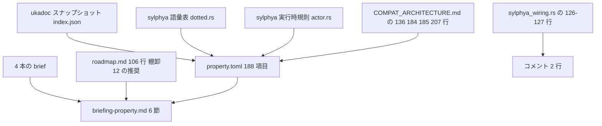

# 技術設計書: areka-P0-ukadoc-survey-property

> 本書は**文書を書くための設計**である。実行時のコードは 1 行も増えず、1 ビットも挙動が変わらない。
> 設計の中身は ⑴ 何をどこに書くか ⑵ 1 項目の判断をどの決定表で決めるか ⑶ どの順で作業するか ⑷ 納品前に何を機械で確かめるか、の 4 つである。
> 本書に書いた行番号・件数はすべてこのワークツリー（`claude/areka-p0-ukadoc-survey-57d0e2`）で 2026-09-03 に数え直した。
> **2026-09-05 追記**: 上流 `areka-P0-ukadoc-survey-toolkit` の実装が main に着地し（PR#136・本ブランチへ merge 済み）、初期台帳・カタログ・常設整合検査・`ukadoc-survey` の 8 副手続きが揃った。これに伴い「道具の着地を待たない」前提で書いた箇所を書き換えてある（該当箇所に *(2026-09-05 更新)* と記す）。決定表（規則 0〜8）と成果物 3 本は変わらない。

## Overview

**目的**: ukadoc のプロパティシステムのページ（`list_propertysystem`・188 項目）について、areka が「どの名前に値を返し、どれを名前だけ持ち、どれを持っていないか」を 1 つの台帳へ書き出す。あわせて、既に所有を宣言している 4 本の brief と正典 id を突き合わせ、無所有・二重所有・新旧の名前を仕訳する。

**読む人**: 統合担当（`areka-P0-ukadoc-coverage-roadmap`）と、これから実装する 4 本の spec の担当者。前者は「正典の項目 1 つ 1 つが誰の持ち物か」を機械で辿るために台帳を読み、後者は「自分の brief のどの記述をどの id の一覧へ書き換えるか」をブリーフィングから読む。

**変わること** *(2026-09-05 更新)*: `doc/ukadoc-coverage/` は上流の道具が既に作っている。本 spec は骨組みだけの台帳 `ledger/property.toml` を中身のある台帳にし、新規にブリーフィング 1 本を置き、`report/property.md` を機械で作り直す。ソースへの接触は 2 行のコメントだけで、実行時の挙動は変わらない。

### Goals

- 正典 188 項目を 1 件も落とさず台帳へ収め、全項目に状態・世代・担当・優先度・関連・備考を付ける（`unclassified` 0 件）。
- 4 本の brief の所有宣言を id 単位へ展開し、無所有・件数の食い違い・二重所有を 1 枚の文書から読めるようにする。
- 二重所有（`currentghost.seriko.zorder`／`currentghost.seriko.sticky-window`）について、採る／採らないの影響が並んだ裁定案を 1 つ出す（決めるのは本 spec ではない）。
- 上流 `areka-P0-ukadoc-survey-toolkit` の凍結契約（要件 2・要件 4・付録 A／B）に**従う側**であり続ける。形式・語彙・仕訳規則を 1 つも再定義しない。

### Non-Goals

- 実装（プロパティ値の導出・照会経路の新設・語彙表の件数変更）を 1 つも行わない。
- 段階（A〜E）の最終決定・統合報告 `summary.md` の生成・既存 4 brief 本文の書き換えを行わない。
- 上流の道具と重複する常設の検査コードを repo に置かない。
- SSP 実機との挙動比較・ukadoc 本文の repo 取り込みを行わない。

## Boundary Commitments

### This Spec Owns

- `doc/ukadoc-coverage/ledger/property.toml` — `list_propertysystem` の 188 id だけを収める台帳 1 本。編集権は本 spec が単独で持つ（1.7・10.2）。
- `doc/ukadoc-coverage/briefing-property.md` — 6 節のブリーフィング 1 本（8.1）。
- `crates/areka-ghost/src/sylphya_wiring.rs:126-127` の 2 行に置く id 付きの正典 URL のコメント（9.2）。ソースへの接触はこの 2 行だけ。
- 本ドメインの判断そのもの（各 id の状態・世代・担当・優先度・テーマ・関連・備考）。

### Out of Boundary

- 台帳の項目形式・欄・状態語彙・仕訳規則の定義（上流 toolkit の要件 2・4・付録 A が凍結済み。1.3）。
- 照会経路そのものの項目（`%property[...]`・`\![get,property,...]`・`\![set,property,...]` は sakura-script 台帳、`property.get`／`property.set` は shiori 台帳の持ち物。本台帳は相手として**指すだけ**・6.2）。
- 他 3 ドメインの台帳と報告（10.2）・カタログ・テーマ定義 `values.md`（1.7）。
- 既存 4 brief の本文と優先順位（4.10・10.3）・`.kiro/steering/roadmap.md`（10.5）。
- 二重所有の**裁定そのもの**（`areka-P0-ukadoc-coverage-roadmap` の会で行う・5.6）。
- 常設の整合検査（上流 toolkit 要件 6 が唯一の持ち主）。
- 語彙表 `crates/areka-sylphya/src/vocab/*.rs` への URL 記入と件数変更（9.3・9.5）。

### Allowed Dependencies

| 依存先 | 使い方 | 制約 |
|---|---|---|
| 上流 toolkit 要件 2・4・付録 A／B | 形式・語彙・仕訳規則・id の取り方 | 読むだけ。再定義しない |
| ukadoc スナップショット（既定は `%APPDATA%\npm\node_modules\ukagaka-doc-mcp\data\index.json`。環境変数 `AREKA_UKADOC_SNAPSHOT` があればそちらを優先） | id・見出し・本文・版番号の取得元 | 本文を repo に写さない（10.6） |
| `crates/areka-sylphya/src/actor.rs:136-166`・`crates/areka-sylphya/src/vocab/dotted.rs` | 状態判定の規則と語彙表の中身 | 読むだけ。1 行も変えない |
| `crates/areka-ghost/src/sylphya_wiring.rs:126-127` | 実装済み 2 件の値の定義行 | コメント 2 行の追加のみ |
| `doc/COMPAT_ARCHITECTURE.md:136`／`:184`／`:185`／`:207` | 縮退・書込応答の転記元 | 読むだけ |
| 4 本の brief（`areka-P0-property-query-channels`／`areka-P0-currentghost-property-tree`／`areka-P0-property-catalog-lists`／`areka-P0-zorder-property`） | 所有宣言の突合元 | 読むだけ（4.10） |
| `.kiro/steering/roadmap.md:106`（棚卸⑫の三重所有の推奨） | 裁定案の下敷き | 読むだけ（10.5） |
| `crates/ukadoc-survey`（上流の道具・8 副手続き）*(2026-09-05 追記)* | `check` で整合を確かめ、`report` で `doc/ukadoc-coverage/report/property.md` を作り直す | 走らせるだけ。道具のコードを 1 行も変えない |

### Revalidation Triggers

- **上流 toolkit の付録 A／要件 2・4 が改訂されたとき** — 台帳の形式・語彙・仕訳規則が動くため、本 spec の決定表（後述「台帳の記入規則」）を引き直す。
- **スナップショットが更新され `list_propertysystem` の id 集合が 188 から変わったとき** — 件数・id の逐語一致・版番号の集合がずれる。
- **`crates/areka-sylphya/src/vocab/dotted.rs` の 3 表（ルート枝 10・汎用名 17・SET 有効群 21）の件数が変わったとき** — 状態の決定表（規則 1）と SET の突合表（規則 8）が動く。
- **`crates/areka-ghost/src/sylphya_wiring.rs` の実導出が増えたとき** — 「実装済み」の件数が動き、URL を置く行が増える（9.3a により、増やすのは実装した spec の仕事）。
- **`doc/COMPAT_ARCHITECTURE.md` に本ページの項目の登記が増えたとき** — 「縮退」に振り分ける id の集合が動く（規則 1 の第 4 行）。
- **二重所有の裁定が下りたとき** — 当該 2 id の担当 spec 欄が空文字から実名へ変わる。
- **上流の道具 `crates/ukadoc-survey` の検査・出力形式が変わったとき** *(2026-09-05 追加)* — 検証計画の「誰が見るか」の割り振りと、報告の作り直し手順が動く。

## Architecture

本 spec は実行時の部品を 1 つも作らない。設計の対象は**文書の構造と、判断を一意に決める規則**である。



**依存の向き**: 正典と既存資産 → 台帳 → ブリーフィング。ブリーフィングは台帳から読めることだけを書き、台帳がブリーフィングを参照することはない。コメント 2 行は台帳の「実装済み」2 件の根拠であり、台帳側に証拠の欄は無い（上流 2.3）。

**上流契約への従属**: 台帳ファイルの先頭には付録 A.1 の `[ledger]` 表（`domain = "property"`／`pages = ["list_propertysystem"]`）を置く。`pages` に無いページの id は置けないという上流の決まりが要件 1.2 を機械で担保する。台帳の 1 項目は付録 A の形（`[entry."<id>"]` に `status`／`introduced`／`alias_of`（別名のときだけ）／`supersedes`（任意）／`owner`／`priority`／`values`／`links`／`note` を 1 行ずつ）。`status`・`introduced`・`owner`・`priority`・`values`・`links`・`note` の 7 つは値が空でも**キーを必ず置く**（付録 A.2 の「必須」）。1 行に詰めない。id は文字順。これらは本 spec が決めることではない。

### 上流の整合検査との関係 *(2026-09-05 更新)*

**当初の想定は覆った。** 設計時点では他 3 ドメインの台帳が無いため、上流要件 6.4（カタログの全 id が 4 つの台帳のいずれか 1 つにちょうど 1 回だけ現れる）と 6.7（関連の両端の id が実在する）は成立せず、ブリーフィング末尾に「他 3 台帳が揃うまで検査できない項目」と注記する予定だった。しかし上流の実装が**4 ドメインすべての初期台帳**（`property` 188・`shiori` 342・`assets` 677・`sakura-script` 542。合計がカタログ 1,749 と一致することを常設テストが固定している）と一緒に着地したため、**6.4・6.7 はいま成立し、`cargo run -p ukadoc-survey -- check` が常時これを見ている**。

したがって本 spec は代替の検査を用意しない。ブリーフィング末尾の注記も「検査できない項目」ではなく、**上流の `check` が食い違い 0 件で通ったことの記録**に変わる（merge 直後の実測は「食い違い 0 件／証拠のある項目 0 件」）。

## File Structure Plan

### Directory Structure

*(2026-09-05 更新: 上流の着地により `doc/ukadoc-coverage/` は既に在り、その下の 12 ファイルも既に在る。本 spec が新規に作るのはブリーフィング 1 本だけになった。)*

```
doc/
└── ukadoc-coverage/              # 上流が作成済み（PR#136）
    ├── ledger/
    │   └── property.toml         # 台帳 188 項目（上流が骨組みを着地済み・中身は本 spec の単独所有）
    ├── report/
    │   └── property.md           # 台帳から機械で作り直す（手で書かない・8.3）
    └── briefing-property.md      # ブリーフィング 6 節＋末尾注記（新規・本 spec の単独所有）
```

`doc/ukadoc-coverage/report/property.md` は**既に在る**（着地時点の中身は全件 `unclassified` を映したもの）。台帳を書き換えたら `cargo run -p ukadoc-survey -- report` で作り直し、台帳と同じコミットに載せる。手で編集しない（8.3）。上流の `check` は報告が台帳と食い違うと赤にするので、作り直しの漏れは機械が捕まえる。要件 8.4 の「道具が着地するまで作らない」は着地により条件が満たされ、作り直す側の運用に切り替わる。`doc/ukadoc-coverage/values.md`・`README.md`・`catalog.toml`・`report/summary.md`・他 3 ドメインの台帳と報告は本 spec が触らない（8.5・10.2）。`report-summary` は統合担当の持ち物なので本 spec は走らせない。

### Modified Files

- `crates/areka-ghost/src/sylphya_wiring.rs` — 126 行目（`("baseware.name".to_string(), BASEWARE_NAME.to_string()),`）と 127 行目（`("baseware.version".to_string(), baseware_version.to_string()),`）の**各要素の直前行**に、id 付きの正典 URL のコメントを 1 行ずつ足す。足すのは次の 2 行だけで、説明文を伴わない（上流 5.1〜5.3・9.2・9.7）。

  ```
  // ukadoc: https://ssp.shillest.net/ukadoc/manual/list_propertysystem.html#baseware.name:1
  // ukadoc: https://ssp.shillest.net/ukadoc/manual/list_propertysystem.html#baseware.version:1
  ```

  置き方を「各要素の直前行の `//` コメント」にするのは、対象が `vec![...]` の要素であって Rust の doc コメント（`///`）を付けられる位置ではないためである。1 項目 1 行・定義行に隣接・説明文なしの 3 つを同時に満たす形はこれだけになる。上流 5.5 の証拠収集は URL の出現をファイル単位で拾うので、`///` である必要は無い。

  *(2026-09-05 更新)* 設計時点では「道具が `///` だけを拾う作りになると上流 6.6 が赤になる」ことを危ぶみ、README への提案を書き添える予定だった。**着地した実装を読んで確かめたところ、この心配は要らない** — `crates/ukadoc-survey/src/evidence/extract.rs:37` の `MARKERS` は `["///", "//!", "//"]` の 3 つで、長い印から順に剥がして `//` も拾う。**この提案は取り下げる**（ブリーフィング ⑸ 節に残す上流 README への提案は優先度の数値形 1 件だけになる）。

- **変更しないファイル**: `crates/areka-sylphya/src/vocab/dotted.rs`・`flat.rs`・`shiori_resource.rs`（9.3。`dotted.rs:3`・`:15`・`:67` にある URL を伴わない「ukadoc」の語もそのまま残す＝9.8）。件数を固定するテスト `crates/areka-sylphya/src/vocab/dotted.rs:191` と `crates/areka-sylphya/src/ledger_key_determinism_tests.rs:201-204` が現状のまま通ること（9.5）。

## 台帳の記入規則（決定表）

以下は 188 件を 1 件ずつ埋めるときの判断規則である。**上から順に当てはめ、最初に当たった行を採る**（先勝ち）。

### 規則 0: 名前の読み方（葉だけの id をどう扱うか）

正典ページには族の頭が別の項目として立っており、**見出しが葉の名前だけの id が 35 件ある**（汎用プロパティ名の葉 17・サウンドの要素葉 18。うち `name` と `path` は両群に 1 件ずつあって見出しが重複する）。

**決定**: 状態の判定は、その葉が**実際に使われる完全な名前**（族の頭が定める前置きを補った形）に対して規則を当てる。id そのものは逐語で写す（1.4）ので、台帳の見た目は変わらない。

根拠（正典本文・2026-09-03 にスナップショットで確認）:

- サウンドの要素葉 18 の前置きは、族の頭 2 件が明示している — `currentghost.sound.index(ID).サウンドプロパティ名`（「ID 番目のものから情報を取得」）と `currentghost.sound(要素名).サウンドプロパティ名`（「要素名が一致する最も新しいものから情報を取得」）。つまり実際の名前は `currentghost.sound(...).position` の形である。
- 汎用プロパティ名の葉 17 の本文は「対象の名前。」「対象のパス。」のように前置きを省いた書き方で、`menu` 群 4 件は本文が「（currentghost.shelllist のみ有効）」「（currentghost のみ有効）」と前置きを名指ししている。

**採らなかった読み方**: 葉の名前をそのまま照会される名前として規則に当てる読み方。これを採ると `position`・`playing`・`meta.*` などサウンドの要素葉 16 件が「根がルート枝でも葉が汎用名でもない」ことになり `absent` へ落ちる。areka は `currentghost.sound(0).position` を正準語彙として認識する（根が `currentghost`）ので、実挙動と食い違う。開発者裁定 2026-09-02 議題 1 の趣旨（areka が認識している名前を「未対応」と呼ばない）にも反する。

この決定により、188 件すべてが「根 ∈ ルート枝 10」を満たす（機械で確認済み: 見出しの先頭語がルート枝 10 のいずれかである項目 153 件＋葉だけの 35 件はいずれも前置きがルート枝配下）。

### 規則 1: status の決定表

| 順 | 条件 | status | 実測見込み |
|---|---|---|---|
| 1 | areka が実際に値へ導出する（`crates/areka-ghost/src/sylphya_wiring.rs:126-127` が実値を publish する 2 名） | `implemented` | **2** |
| 2 | 正典本文が旧名・廃止・統合と述べ、同じ値へ到達する新しい書式がある | `alias` | **0** |
| 3 | 正典が他の実装主体の持ち物として定めており areka の担当範囲の外 | `not-applicable` | **0** |
| 4 | `doc/COMPAT_ARCHITECTURE.md` に、その項目の応答が正典と違うことが**既に登記されている** | `degraded` | **8** |
| 5 | 規則 0 で補った完全な名前が、根 ∈ `DOTTED_ROOTS`（10）または葉 ∈ `GENERIC_PROP_NAMES`（17）を満たす | `vocabulary-only` | **178** |
| 6 | 上のいずれにも当たらない | `absent` | **0** |
| — | 判断が付かない | `unclassified` | **0（納品時）** |

合計 2 + 8 + 178 = 188。*(2026-09-05 訂正: 当初は縮退 7 件・語彙のみ 179 件と書いていたが、`doc/COMPAT_ARCHITECTURE.md` を全行読み直すと、`:184`／`:185` のほかに `:207` が `currentghost.seriko.zorder` **1 項目の読み取り応答**を個別に登記していた〔正典は SSP 2.8.78 でこのプロパティを定め SET も有効とするのに、areka は「本リリースでは提供しない」と決めて未提供のプロパティに対する現行どおりの応答を返す〕。第 4 行の条件「その項目の応答が正典と違うことが既に登記されている」に当たるので縮退へ移し、語彙のみを 1 件減らした。`:136` を引き金にしない理由〔後述〕は `:207` には当てはまらない——`:136` は 188 件のほぼ全部に掛かる書き込み側の一般規則であるのに対し、`:207` は 1 項目の読み取り応答の登記だからである)* 第 5 行の規則は sylphya が実行時に正準語彙かどうかを判定する規則そのもの（`crates/areka-sylphya/src/actor.rs:136-166` の `is_canonical_vocab`）である。第 6 行と第 3 行が 0 件だった場合は、その旨をブリーフィングに書く（2.5）。

**第 4 行の対象 8 件**（スナップショットで id を確認済み）:

| id | 転記元 |
|---|---|
| `ukadoc:list_propertysystem:currentghost.balloon.scope_28ID_29.vertical:1` | `doc/COMPAT_ARCHITECTURE.md:184` |
| 同 `...validwidth:1`／`...validwidth.initial:1`／`...validheight:1`／`...validheight.initial:1`／`...lines:1`／`...lines.initial:1` の 6 件 | 同 `:185` |
| `ukadoc:list_propertysystem:currentghost.seriko.zorder:1` *(2026-09-05 追加)* | 同 `:207` |

`:185` の 6 件は、スナップショットの本文が 2.8.80 のままで現行の正典（2.8.83 で役割が入れ替わった）より古い。台帳には id と版番号だけを写して意味の判定を行わず、備考の転記元として `:185` を指す（10.4）。

**`:136` を縮退の引き金にしない理由**（本設計で明示する）: `doc/COMPAT_ARCHITECTURE.md:136` は「SET 無効な正準語彙への書込は受理＋警告＋非反映」という**書き込み側の一般規則**の登記であり、188 件のほぼ全部に掛かる。要件 2.9 は状態を「areka が値を返すか否か」＝**読み取り**で決めると定め、要件 2.5a は書き込みの準拠を**備考**に書くと定めている。したがって `:136` は全 `vocabulary-only` 項目の備考の引用元であって、状態を `degraded` に変える根拠ではない。第 4 行が拾うのは、その項目**個別**の読み取り応答の食い違いが登記されている 8 件だけである。*(2026-09-05 訂正: 7 件→8 件。`:207` を数え落としていた)* **登記の全数を確かめた手順**: `doc/COMPAT_ARCHITECTURE.md` の全 217 行を読み、台帳の 188 件の名前を機械で突き合わせた。プロパティ名が逐語で現れるのは `:184`（`currentghost.balloon.scope(ID).vertical`）・`:185`（同族 6 件）・`:207`（`currentghost.seriko.zorder`）の 3 行だけである。紛らわしい 4 行は縮退の引き金にしない——`:192`／`:198`／`:200`／`:206` はいずれも **shell 設定のキー `seriko.zorder`**（`\![set,zorder,…]` の descript 版）についての登記であって、本ページのプロパティ `currentghost.seriko.zorder` とは別物である。`:165` も `Status [SSP拡張]` という別ページの語彙についての登記で、本ページの `currentghost.status` の応答は登記していない。なお `currentghost.seriko.sticky-window`（`:207` と同じ SSP 2.8.78 で入り `[SET有効]` の印を持つ隣の項目）には**個別の登記が 1 行も無い**ため、語彙のみのままである。

**第 4 行と第 5 行の実質差**: 178 件と 8 件はどちらも照会されれば「値なし」を返す。違うのは**登記があるかどうか**（要件 2.4 が「既に登記されている」を条件にしている）だけである。この点はブリーフィングの前置きにも 1 行で書き、読者が「縮退 8 件だけ壊れている」と誤読しないようにする。

### 規則 2: introduced（登場した版）

- スナップショット本文から `x.y.z` 形の番号を拾い、その集合から選ぶ。集合が空なら `""`（世代不明。最古と決めつけない・3.1／3.2）。
- 複数ある項目は 1 件だけ（`system.os.(キー)` が `2.6.26`／`2.8.17`／`5.19.0`）。`5.19.0` は本文が例示する OS の版であって SSP の版ではないので**採らず**、採らなかった理由を備考に書く（3.3）。残る 2 つのうち古い方（`2.6.26`）を登場した版とする。
- 実測: 版番号を持つ項目 **99 件**・番号の種類 21 種。*(2026-09-05 訂正: 当初 98 件と書いたのは版番号を 1 つだけ持つ束の数で、3 つ持つ `system.os.(キー)` を数え落としていた。カタログの `versions` が空でない項目は 99 件〔188 − 空の 89〕であり、本規則は `system.os.(キー)` にも `2.6.26` を与えるため非空は 99 件になる。種類 21 種は `5.19.0` を除いた数で変わらない)*

### 規則 3: alias / supersedes

- 同じ値へ到達する名前が 2 つ以上ある場合のみ `alias` を使い、向きは ⑴ 本文の注記 → ⑵ 版番号 → ⑶ 人手の判断の順で決める（3.4）。新しい側から旧 id への `supersedes` は任意で足してよい（3.6）。
- `alias_of` の指す先が `alias` であってはならない（3.5・連鎖の禁止）。
- **実測見込みはゼロ群**。本ページに `balloon.` で始まる見出しは 0 件で、brief が例示した旧 `balloon.*` 系は存在しない（3.8）。群が 1 つも無かった場合は、その旨をブリーフィングの ⑵ 節に明記する（3.7）。
- 見出しが重複する `name`／`path` は**別名ではない**（別の値を指す 2 つの項目）。規則 8 の「見出しの重複」で扱う。

### 規則 4: owner（担当 spec）

**上から順に当てはめ、最初に当たった行を採る（先勝ち）。** 裁定待ちの 2 id は 4.7 の行より上に置く。`currentghost.seriko.sticky-window` は「tree が値の導出・channels が語彙表の 1 行」という 4.7 の形にも当たるため、順を決めないと答えが 2 つ（tree と空文字）になる（設計検証の指摘 1）。

| 順 | 条件 | owner | 根拠 |
|---|---|---|---|
| 1 | `status = implemented` の 2 件 | `areka-P0-sylphya`（完了済み） | 4.8。同 spec の要件が `baseware.name`／`baseware.version` の実導出を明記（`.kiro/specs/completed/areka-P0-sylphya/requirements.md:71`・`:75`） |
| 2 | `currentghost.seriko.zorder`／`currentghost.seriko.sticky-window` | `""`（裁定待ち） | 5.4・5.5 |
| 3 | 4 本の brief のいずれか 1 本だけが宣言している id | その spec 名 | 4.1・4.4 |
| 4 | 2 本以上が主張し、一方が値の導出・他方が語彙表の 1 行だけ | 値を導出する側 | 4.7（語彙表だけを触る側は備考へ） |
| 5 | どの brief も宣言していない | `""`（所有者なし） | 4.5。起票前の spec 名は owner に書かず、備考とブリーフィングの一覧に「候補: ...」として書く（4.6） |

**表の外の制約**: 未実装の項目には完了済み spec 名を書かない（4.9）。第 1 行以外が完了済み spec を返すことは無い（4 本の brief はいずれも未完了）ので、この制約は第 1 行の適用範囲を実装済み 2 件に限ることで満たされる。

**brief の記述 → id の展開**は、4 本の brief が枝と概数で書いている範囲を実測の id 群へ広げる作業である（brief は id を 1 つも列挙していない）。件数が食い違うときはカタログを正とし、差をブリーフィングに記録する（4.3）。id にどうしても対応が付かない記述は、表記の揺れとして表に残し、近い id へ憶測で結び付けない（4.2）。

### 規則 5: priority（優先度・仮置き）

上流 4.7 の序列（⑴ 壊れ方 ＞ ⑵ テーマ ＞ ⑶ 影響する既存資産の広さ ＞ ⑷ 依存する基盤の共有度・要件 7.5）を本ドメインに当てると 5 段になる。**上から先勝ち**。

| 順 | 条件 | priority | 序列のどれで前へ出るか |
|---|---|---|---|
| 1 | `status = implemented` | `""` | 作業が残らない（未設定） |
| 2 | 正典で SET が有効（規則 8 の 26 件）かつ未実装 | `"C10"` | ⑴ 読みが値なしのうえ、書き込みが**受理されて効かない**（呼び出し側には成功に見える＝誤った結果を正常な顔で見せる） |
| 3 | テーマを付けた項目（規則 6） | `"C20"` | ⑵ |
| 4 | `status = degraded` の 8 件 | `"C30"` | ⑶ 既存の登記 3 行と完了済み spec の記述が依存している |
| 5 | それ以外 | `"C90"` | 既定＝段階 C の末尾（7.4） |

**縮退 8 件のうち 1 件は第 4 行に届かない** *(2026-09-05 追記)*: `currentghost.seriko.zorder` は正典本文に `[SET有効]` の印があり（規則 8 の⒜ 14 件に含まれる）実導出も無いので、**上から先勝ちの第 2 行（SET 有効かつ未実装 → `C10`）が第 4 行より先に当たる**。したがって本件の優先度は `C30` ではなく `C10` であり、今回の縮退への移動で優先度は 1 つも動かない（移動前も第 2 行で `C10` だった）。`C30` が付くのはバルーンの縦書き族 7 件のほうである。

**テーマを付けた 3 件のうち 1 件も第 3 行に届かない** *(2026-09-05 訂正)*: `currentghost.scope(ID).seriko.defaultsurface` は正典本文が設定を認めており（規則 8 の⒝本文で読んだ 3 件の 1 つ＝SET 有効 26 件の一員）実導出も無いので、**上から先勝ちの第 2 行（SET 有効かつ未実装 → `C10`）が第 3 行（テーマを付けた項目 → `C20`）より先に当たる**。したがって規則 6 が挙げるテーマ 3 件のうち `C20` になるのは `currentghost.seriko.surfacelist.all`・同 `.defined` の **2 件だけ**で、`defaultsurface` は `C10` である。当初の本節はこの先勝ちを `currentghost.seriko.zorder`（第 4 行に届かない例）についてだけ書いており、テーマ側にも同じことが起きるとは書いていなかった。規則 6 の 3 件を読んだ読み手は `C20` が 3 件出ると期待するが、実測は 2 件である。テーマを付けること自体は優先度と独立なので、`defaultsurface` の `values` と備考の「テーマ:」行は `C10` でもそのまま要る（7.2）。

**「段階 C の末尾」の数値形の決定**（研究議題 13）: 既定を **`"C90"`** とし、本台帳では 90 より大きい数値を使わない。したがって `C90` が本ドメインの末尾になる。10 刻みにするのは、裁定や後続の調査で項目を前へ挿すときに全件の振り直しが要らないようにするためである。ドメイン内の通し連番にしない理由は、項目が 1 つ動くたびに 188 件の数値が書き換わり、差分が読めなくなるからである。**4 本の台帳で揃えるべき事柄なので、この形を上流 README への提案としてブリーフィングの ⑸ 節に書き添える**（段階の最終決定は統合担当が行う・7.6）。

### 規則 6: values（テーマ）

- 既定は空（7.1）。本ドメインは値を運ぶ配管であり、大半の項目は「無いと利用者はゴーストの何を失うか」に答えられない。
- 付けるときは、その答えを備考に**必ず**書く（7.2）。
- **本 spec が使うテーマは「装い」1 語だけに絞る**。対象は次の 3 id に限る: `currentghost.seriko.surfacelist.all`・`currentghost.seriko.surfacelist.defined`・`currentghost.scope(ID).seriko.defaultsurface`（着せ替えの状態と既定の面。7.3 が例示する `currentghost.seriko.*` の 2 件と、`scope(ID)` 配下にある `defaultsurface` の 1 件。id を名指しして判断の余地を無くす＝設計検証の軽微指摘）。
  - **この 3 件の優先度は揃わない** *(2026-09-05 訂正)*: `currentghost.scope(ID).seriko.defaultsurface` は SET 有効 26 件にも入っているため、規則 5 の第 2 行が第 3 行より先に当たって `C10` になる。テーマを理由に `C20` が付くのは残る 2 件（`currentghost.seriko.surfacelist.all`・同 `.defined`）だけである。当初の本項は 3 件を並べるだけで、うち 1 件が既に 26 件の側にいることを書いていなかった。
  - 理由: テーマ名 8 語（気配・触れ合い・掛け合い・装い・記憶・交わり・気配り・更新）は上流 4.4 で凍結済みだが、各語の 1 行の定義（上流 4.5）を持つ `doc/ukadoc-coverage/values.md` は**まだ存在しない**（道具が作る）。定義文を読まずに 8 語を広く使うと、`values.md` の着地後に付け直しが要る。「装い」は要件 7.3 が名指ししており、定義文が無くても取り違えようがない。
  - `degraded` の 8 件には**テーマを付けない**。利用者向けの筋書きは既に文書として残っている——バルーンの縦書き族 7 件は `doc/COMPAT_ARCHITECTURE.md:184`／`:185`、`currentghost.seriko.zorder` は同 `:207` である。序列 ⑶（影響する既存資産の広さ）で前へ出せば足りる（規則 5 の第 4 行。ただし `currentghost.seriko.zorder` だけは第 2 行が先に当たり `C10` になる）。*(2026-09-05 訂正: 「バルーンの縦書き族（7 件）」と書いていたのを、縮退 8 件の内訳を分けた形に改めた)*
- テーマ名の綴りは上流 4.4 の 8 語から逐語で引く。`values.md` 着地後に上流の検査 6.8 が綴りを確かめる。

**`values.md` は着地した——1 語に絞る制限は残すが、その理由は差し替わった** *(2026-09-05 訂正)*: 上流 `areka-P0-ukadoc-survey-toolkit` の着地で `doc/ukadoc-coverage/values.md` が実在するようになったため、上の「理由」が挙げた根拠（各語の定義文がまだ無いので広く使うと付け直しになる）は**もう成り立たない**。制限そのものは次の 4 つを根拠に維持する——要件 7.1 が本ドメインでは空欄を原則と定めていること、要件 7.3 が例に挙げているのが `currentghost.seriko.*` の群そのものであること、tasks.md 3.3 が対象を「3 件に限り」と書いていること、要件 7.6 が段階の最終決定を統合担当（`areka-P0-ukadoc-coverage-roadmap`）に委ねていることである。

**着地した `values.md` は本台帳の id を 2 つ名指ししている（テーマ「記憶」）** *(2026-09-05 訂正)*: `values.md` の `## 記憶` の節は、代表となる項目として `rateofuselist(名前).boottime`（`ukadoc:list_propertysystem:rateofuselist_28_540d_524d_29.boottime:1`）と `history.ghost.count`（`ukadoc:list_propertysystem:history.ghost.count:1`）を挙げている。どちらも本台帳の項目であり、現状はいずれも `status = "vocabulary-only"`・`values = []`・`priority = "C90"` である。**本 spec は「記憶」をこの 2 件に付けない**——上の 4 根拠により、テーマを広げる判断は本 spec が単独で下せる範囲を超えるからである。要件 5.6 の流儀（`ext` 系の SET の読みと同じ扱い）で、決めずに記録して統合担当と開発者へ回す。

- 統合担当が採る場合の帰結: 採った id は 1 件ずつ `C90` → `C20` へ動く（どちらも SET 有効 26 件に入っていないので規則 5 の第 2 行は当たらず、第 3 行が当たる）。あわせて要件 7.2 により各件に「テーマ:」の備考行が要る。さらに規則 6 の「装い 1 語だけ」の主張、tasks.md の 3.3 と 6.1 の完了状態、ブリーフィングの記述を書き換える必要がある。
- 未決の下位論点: 「記憶」が届くのは `values.md` が名指しした 2 件だけなのか、`rateofuselist`（24 件）と `history`（12 件）の枝ごとなのか。枝ごとなら最大 36 件が `C90` から `C20` へ動き、統合担当が見る並び順が実質的に変わる。本 spec はこの問いに答えない。
- 併記しておく観測: `values.md` が「装い」の代表として挙げる 3 項目はいずれもさくらスクリプトの id で、本ドメインの id は 1 つも無い。したがって本 spec の「装い」3 件は、`values.md` の代表項目ではなく定義の 1 行（「ゴーストの見た目（シェル・着せ替え・バルーン）を選び替えられること」）に照らして決めている。これは食い違いではなく、代表項目が網羅列挙ではないことの反映である。

### 規則 7: links（関連）

`kind` は上流 4.3 の 6 種（`alias_of`・`supersedes`・`triggers`・`configures`・`queries`・`same-feature`）に限る。`to` は**関係の相手の id**であり、カタログに実在するものだけを書く（6.5）。

**種別の選び方（凍結された向きを裏返さない）**: 上流 4.3 は `queries` を「タグ・イベント→プロパティ」と凍結している。本台帳の項目は常にその矢の終点側なので、本台帳から `queries` を書くと凍結された向きを裏返して読み替えることになり、要件 1.3（規則を再定義しない）に反する（設計検証の指摘 2）。したがって**本台帳は `queries` を書かない**。`queries` はタグ・イベント側の台帳（sakura-script／shiori）が正典の向きどおりに書く。本台帳から照会経路を指すときは `same-feature`（同じ機能の別の面）を使う。brief 自身が照会経路と木の関係を「タグとして向こう・木として本 spec＝同じ機能の別の面」と述べており、凍結された 6 種の中でこの関係に当たるのは `same-feature` だけである。上流の整合検査 6.7 は両端の実在だけを見るので、相手の台帳が `queries` で同じ対を書いても二重登記にはならず、報告の束（上流 7.1・関連で繋がった連結成分）は向きに依らず同じになる。

書く関連は次のとおり。**全項目に一様に効く読み取り経路 2 本は台帳に書かない**（188 件に同じ 2 本を張ると 376 本の同一関連が並び、上流 7.1 の「関連が閉じている束」が 1 つの塊に潰れて優先度の材料にならなくなる）。代わりにブリーフィングの前置きに「本ドメイン全項目に共通の読み取り経路」として 1 度だけ書く。

| 対象 | kind | 相手 id（2026-09-03 にスナップショットで実在を確認） |
|---|---|---|
| 正典で SET が有効な 26 件（規則 8 の表） | `same-feature` | `ukadoc:list_sakura_script:_5c_21_5bset_2cproperty_2c_30d7_30ed_30d1_30c6_30a3_540d_2c_5024_5d:1`（`\![set,property,プロパティ名,値]`） |
| `activeghostlist(ゴースト名/本体側名/パス).ext.拡張プロパティ名`／`activeghostlist.index(ID).ext.拡張プロパティ名` の 2 件 | `same-feature` ×2 | `ukadoc:list_shiori_event:property.get:1`／`ukadoc:list_shiori_event:property.set:1` |
| `pluginlist(プラグイン名/パス/ID).ext.拡張プロパティ名`／`pluginlist.index(ID).ext.拡張プロパティ名` の 2 件 | `same-feature` ×2 | `ukadoc:list_plugin_event:property.get:1`／`ukadoc:list_plugin_event:property.set:1` |
| `currentghost.seriko.zorder`／`currentghost.seriko.sticky-window` | `same-feature` | 対応するさくらスクリプトのタグ（本文が「現在の `\![set,zorder,～]` の設定状態」「現在の `\![set,sticky-window,～]` の設定状態」と名指しする）。id は書く直前にスナップショットで実在確認 |
| サウンドで**本文がタグを名指しする 8 件**（要素葉 6 ＝ `loop`・`name:2`・`pause`・`playing`・`position`・`preload`、頭 2 ＝ `currentghost.sound.count`・`currentghost.sound(要素名).サウンドプロパティ名`） | `same-feature` | 本文が名指しする `\![sound,...]` 系のタグ。id は書く直前に実在確認。*(2026-09-05 訂正: 当初は「要素葉 18 ＋ 頭 3」と書いていたが、188 件の本文を読み直すと `duration`・`error`・`id`・`meta.*` 8 の計 11 件と `currentghost.sound.index(ID).サウンドプロパティ名` はタグを 1 つも名指ししない。また `preload` が名指す `\![sound,preload]` は**カタログに id が無い**〔さくらスクリプトのページに項目が存在しない〕ので 6.5 により書けず、実際に張れたのは 10 本になる)* |
| `currentghost.scope(ID).surface.num`／`currentghost.scope(ID).animation.num` | `same-feature` | 本文が名指しする `\s[]`／`\i[]` のタグ。id は書く直前に実在確認 |
| 値の源が descript のキーである項目（`menu` 群 4 件の初期値は shell 側 descript.txt の `menu`／`sakura.menu`／`kero*.menu`／`char*.menu`、`currentghost.scope(ID).name` は descript.txt の `sakura.name`／`kero.name`／`char?.name`） | `configures` | `descript_shell`／`descript_ghost` ページの該当 id（assets 台帳の持ち物。**指すだけ**）。id は書く直前に実在確認。*(2026-09-05 訂正: `kero*.menu` は本文の綴りで、カタログのキーは `kero.menu` 〔`descript_shell`〕である。実在する方へ張る。`currentghost.scope(ID).name` は本文が側を書き分けないので `descript_ghost`・`descript_shell` の両方へ張る〔6 id〕)* |
| `currentghost.scope(ID).x`／`.y` *(2026-09-05 追記)* | `configures` | `descript_ghost`／`descript_shell` の `sakura`／`kero`／`char*` × `defaultx`（`.y` は `defaulty`）の 6 id ずつ、計 12 id。本文が「GHOST **および** SHELL の descript.txt の、sakura(kero、char*).defaultx で設定可能」と両側を名指しする。*(2026-09-05 訂正: 上の行の括弧書きが `menu` 群と `scope(ID).name` しか挙げていなかったため表が閉じて見えたが、本文が descript のキーを名指しする項目はこの 2 件も同じ条件に当たる。行を足して開いた形に直す)* |
| `currentghost.scope(ID).scaling`／`currentghost.balloon.scope(ID).scaling` *(2026-09-05 追記)* | `configures` | `ukadoc:descript_shell_surfaces:scaling:1`（本文の「SERIKO 設定」＝ surfaces.txt の scaling。相手の本文も同じ掛け算を綴る）。**タグの指定は張らない** — 本文は「タグ設定」としか書かず、正典にある \![set,scaling,…] の 3 つの形のどれを指すか決まらないため（`\i[]` と同じ規律）。利用者の設定は相手の id が無いので備考の「値の源:」の行が持つ |
| `currentghost.status` *(2026-09-05 追記)* | `same-feature` | `ukadoc:spec_shiori3:Status_20_5bSSP_62e1_5f35_5d:1`（本文が「SHIORI Status ヘッダ」と名指しする）。**`configures` ではない** — 凍結された `configures` は「設定キー→挙動」であり、Status は設定キーではなく応答ヘッダだからである |

**`property.get`／`property.set` をどちらのページの id へ向けるか**（研究議題 14）: 正典本文が名指ししている側へ張り、両方へは張らない。`activeghostlist(...).ext.*` の本文は「**SHIORI イベント**（property.get・property.set）を起こし、ゴースト内部の拡張プロパティを取得・設定する」、`pluginlist(...).ext.*` の本文は「**プラグインイベント**（property.get・property.set）を起こし、プラグイン内部の拡張プロパティを取得・設定する」と書いており、所有者の種別で片方ずつに決まる。

**相手 id が正典に存在しない値の源**（OS のメトリクス・他エンジンが持つ状態など）は `links` に書けない（6.5 が実在する id だけに限る）。この場合は備考へ「値の源: ...」の 1 行として書く。要件 6.3 は値の源を関連として登記するよう求めるが、6.5 がその範囲を実在する id に限っているためであり、備考が受け皿になる。

**乗算の関係**（6.6・6.7）: 汎用プロパティ名の葉 17 とサウンドの要素葉 18 は、複数のルート枝の下で使い回されてもカタログに 1 件ずつしか置かれない。**ルート枝ごとに項目を増やさない**。前置きの一覧（どのルート枝の下で使われるか）は備考に 1 行で書く。

### 規則 8: note（備考）のひな型と SET の突合

`status` が `alias`（写像先の行に委ねる・2.7）と `not-applicable`（理由だけ・2.6）のものを除く全項目に、次の形で書く。

```
壊れ方: <黙って壊れる|明示的なエラー|見た目の差> — <一文>
ログ: <出るログ行の要旨 or「出ない」>
書き込み: 正典 <SET有効（⒜印|⒝本文|⒞族の頭の継承）|SET の定めなし> / areka <型シームの予約のみ・実書込なし|受理＋警告＋非反映|保存へ回す> / <一致|不一致（内容）>
[転記元: doc/COMPAT_ARCHITECTURE.md:<行>]        （status = degraded のとき必須・2.4／10.4）
[値の源: <descript のキー|OS のメトリクス|他エンジンの状態>]  （links に書けないとき・6.3）
[前置き: <この葉が使われるルート枝の一覧>]                    （葉だけの id のとき・規則 0／6.6／6.7）
[版: 5.19.0 は本文が例示する OS の版のため採らない]          （system.os.(キー) のみ・3.3）
[テーマ: <無いと利用者が失うもの>]                            （テーマを付けたとき・7.2）
[語彙表だけを触る spec: <spec 名>]                            （4.7）
[候補: <起票前の引受先の名前>]                                （4.6）
[裁定待ち: <争っている spec 名と争点>]                        （5.4）
[見出しの重複: <この id がどちらの群か・本文の根拠>]          （9.4）
```

**「壊れ方」と「ログ」の型**（2.8）。本ドメインは 3 型に収束する。ログ行は実測した（下表の file:line は 2026-09-03 に確認）。

| 型 | 対象 | 壊れ方 | ログ |
|---|---|---|---|
| 読み取りが値なし | `implemented` 以外の全項目 | **黙って壊れる**。辞書は空文字を前提に進み、利用者にも作者にも何も見えない | `crates/areka-sylphya/src/reader.rs:137-142` の `tracing::debug!`（target `areka_sylphya::reader`・"dotted resolution not found"）。**debug 段なので既定の実行では出ない** |
| 書き込みが SET 有効群（21 名）に当たる | 規則 8 の突合で 21 名が指す 25 id のうち該当分 | 呼び出しは成功を返すが何も起きない | `crates/areka-sylphya/src/actor.rs:302-307` の `tracing::warn!`（target `areka_sylphya::actor`・"SET on runtime-command vocab: reserved seam, not wired in M1 (no write)"） |
| 書き込みが SET 無効の正準語彙 | 上記以外の `vocabulary-only`／`degraded` | 受理＋警告＋非反映（`doc/COMPAT_ARCHITECTURE.md:136` の登記） | 同 `crates/areka-sylphya/src/actor.rs:345-350` の `tracing::warn!`（"SET on non-settable canonical vocab: warn and drop (call still Ok, no write)"） |

**「正典で SET が有効」の読み方は 3 形**（6.4）。本ページで実際に効いたのは次のとおり（2026-09-03 に全 188 件の本文を機械で走査して確定した）。

| 読み方 | 件数 | 中身 |
|---|---|---|
| ⒜ 本文の `[SET有効]` の印 | 14 | `currentghost.mousecursor`／`currentghost.seriko.cursor.scope(ID).mouse????list(当たり判定名).path`／同 `.index(ID2).path`／`currentghost.seriko.tooltip.scope(ID).textlist(当たり判定名).text`／同 `.index(ID2).text`／`currentghost.seriko.sticky-window`／`currentghost.seriko.zorder`／`menu`／`sakura.bind.menu`／`kero.bind.menu`／`char*.bind.menu`／`position`／`playing`／`pause` |
| ⒝ 本文の記述 | 3 | `currentghost.scope(ID).surface.num`（「設定も可能で `\s[]` タグと同じ挙動になる」）・`currentghost.scope(ID).animation.num`（「設定時：指定したアニメーション ID を追加で実行する」）・`currentghost.scope(ID).seriko.defaultsurface`（「設定も可能。」） |
| ⒞ 族の頭からの継承 | +9 | `currentghost.mousecursor` の本文「以降 currentghost.mousecursor / currentghost.balloon.mousecursor で始まるプロパティに共通：…[SET有効]」が本体側 6・balloon 側 4 の計 10 件に及ぶ（頭 1 件は⒜で計上済み）。**族の頭はページ全体でこの 1 件だけ**（「以降」「共通」を含む本文を全件走査して確認） |
| 合計 | **26** | |

**sylphya の SET 有効群 21 名との突合結果**（6.4 が求める双方向の一覧。相対名を正典の完全名へ広げて突き合わせた）:

| 区分 | 件数 | 中身 |
|---|---|---|
| ⑴ 21 名のうちカタログ id に対応が付かなかった名前 | **0** | 21 名すべてが 1 つ以上の id に当たる（合計 25 id） |
| ⑵ 正典では SET が有効なのに 21 名に無い葉 | **5** | `currentghost.seriko.zorder`・`currentghost.seriko.sticky-window`（2.8.78）・`position`・`playing`・`pause`（2.8.72）。**`areka-P0-property-query-channels` brief の「21→26」の中身とちょうど一致する** |
| ⑶（追加で分かったこと）21 名のうち、正典が SET 有効としない id を指す名前 | **2 名 / 4 id** | `seriko.cursor.name`・`seriko.tooltip.name`。当たる id は `...mouse????list(当たり判定名).name`／`...mouse????list.index(ID2).name`／`...textlist(当たり判定名).name`／`...textlist.index(ID2).name` の 4 件で、いずれも印が無く、族の頭の継承も無い＝**areka の先取り**。*(2026-09-05 訂正: 当初は 4 件すべてが「index 指定との互換用の記述であり、特に意味はない」と述べていると書いたが、スナップショットで読み直すとこの文が付くのは `(当たり判定名)` の 2 件だけで、`.index(ID2)` の 2 件は「マウスカーソル定義リスト内の指定した位置の当たり判定名。」「ツールチップ定義リスト内の指定した位置の当たり判定名。」と述べる。印が無いこと・継承が無いことは 4 件とも同じなので、区分 ⑶ の件数は動かない)* |
| ⑷（追加）1 名が 2 id に対応する名前 | **4 名** | `seriko.cursor.path`・`seriko.cursor.name`・`seriko.tooltip.text`・`seriko.tooltip.name`（当たり判定名で指す形と番号で指す形の 2 つ） |

⑶⑷ は要件 6.4 が求める最小（⑴⑵）に足すもので、要件と矛盾しない。ブリーフィングの ⑴ 節の後ろに置く。
数合わせの検算: 21 名が指す 25 id のうち正典が SET 有効とするのは 21 id、正典の 26 件との差 5 件が ⑵ に一致する。

## ブリーフィングの構成

`doc/ukadoc-coverage/briefing-property.md` は次の順で書く（8.1 の 6 つ＋前置きと末尾注記）。平易な日本語で書き、プロジェクトの中でしか通じない言い回しを持ち込まない（8.6）。

| 節 | 中身 | 要件 |
|---|---|---|
| 前置き | 本ドメイン全項目に共通の読み取り経路 2 本（`%property[プロパティ名]`・`\![get,property,イベント名,プロパティ名,…]`）を 1 度だけ書く。`mouse????list` の `????` は正典の表記そのもの（`mouseuplist`／`mousedownlist`／`mousehoverlist`／`mousewheellist` の総称）で、写しの過程で失われた記号ではない旨を書く。「縮退 8 件」と「語彙のみ 178 件」の実質差は登記の有無だけである旨も 1 行 | 1.4・6.1 |
| ⑴ 所有の突合表 | 4 本の brief の記述を 1 行ずつ並べ、対応する id 群を「接頭辞＋件数」で示す。id を全列挙するのは食い違いがある行だけ。**別ファイルを立てず本文の 1 節として持つ**（研究議題 1。別ファイルを立てると本 spec の編集ファイルが 4 本目に増え、要件 10 の宣言が動くため）。続けて SET の突合の 4 区分（⑴〜⑷） | 4.1・4.2・6.4 |
| ⑵ 別名の一覧 | 「同じ値へ到達する名前の群」の一覧。群が 0 ならその旨を明記。brief が例示した旧 `balloon.*` 系がカタログに存在しなかったことも記録 | 3.7・3.8 |
| ⑶ 所有者なし／裁定待ちの一覧と優先度 | 担当 spec 欄が空文字の全件。起票前の引受先候補は「候補: ...」の形で | 4.5・4.6・5.4 |
| ⑷ 二重所有の裁定案 | 次節の形 | 5.1〜5.6 |
| ⑸ 既存 brief への是正候補 | 「どの brief のどの記述を、どの id の一覧へ書き換えるか」の形。件数の差のうち原因が特定できたものも同じ形で書く。あわせて上流 README への提案 1 件（優先度の末尾の数値形＝規則 5。証拠コメントの形の提案は着地した実装が既に `//` を拾うため取り下げ＝Modified Files・2026-09-05 更新） | 8.2・7.6 |
| ⑹ カタログとの件数の差 | `currentghost` 69 対約 65（差 4 ＝ `currentghost.balloon.mousecursor` 系 4 件がどの束にも入っていない）・`history` 12 対 8・`headlinelist` 3 対 2・`pluginlist` 5 対 4（いずれも `.count` の葉の数え落とし）。見出しが重複する `name`／`path` の 4 行の表もここに置く | 1.6・4.3・9.4 |
| 末尾注記 *(2026-09-05 更新)* | 検証計画の結果をここに書く — 道具の `check` の出力（食い違いの件数・証拠のある項目の件数）、自前 4 検査の件数と合否、`cargo test --workspace` の結果、対象 0 件で緑になった検査の名指し。**当初予定していた「他 3 台帳が揃うまで検査できない項目」の注記は要らなくなった**（4 ドメインの台帳が揃い、上流 6.4・6.7 が成立したため）。その代わり、設計時にそう書く予定だった経緯を 1 行残す | 境界節 |

**見出しの重複の書き分けの深さ**（研究議題 2）: 台帳の備考に 1 行（どちらの群か・本文の根拠）と、ブリーフィング ⑹ 節の 4 行の表の**両方**を書く（要件 9.4 が双方を求めている）。本文で確実に分けられる — `:1` の 2 件は「対象の名前。」「対象のパス。」＝汎用プロパティ名の葉、`:2` の 2 件は「対象のメディアの要素名。」「対象のメディアの解決後のフルパス。」（2.8.72）＝サウンドの要素葉。文書の並び順でも裏付けが取れる。

### 二重所有の裁定案（⑷ 節の形）

**出し方の決定**（研究議題 9）: 案を **1 つに絞って推奨として提示**する（5.2）。採った場合と採らなかった場合の影響を 3 本の spec ごとに併記する（5.3）。検討して退けた代案は 1 行ずつ理由付きで残し、比較の材料は失わない。**これは案であって決定ではないことを節の冒頭に明記する**（5.2・5.6）。まず 3 本が何を主張しているかを brief の該当箇所を示して並べる（5.1）。

**推す案（案 甲）**: 値の導出は `areka-P0-zorder-property` が単独で持ち、`areka-P0-currentghost-property-tree` は `seriko.*` から `zorder` を外す。sylphya の SET 有効群の 1 行は `areka-P0-property-query-channels` が持つ。

- **選んだ理由**: `.kiro/steering/roadmap.md:106`（棚卸⑫）の推奨と一致する — 「**推奨＝切り出し**: 値の導出は `zorder-property` 単独・tree は `seriko.*` から `zorder` を除外・台帳行 1 本は channels⑶ が持つ」。本 spec が独自の案を立てて統合担当の会に別の軸を持ち込むより、既にある推奨に対して「採る／採らない」の影響を測る方が裁定を 1 度で終えられる。
- **採ったときの影響**: 3 本の食い違いが消える。tree の範囲が `seriko.*` 14 から 13 へ減る。`zorder-property` brief の本文（「`dotted.rs` の 21 項に入れない・本 brief が語彙の正本」）は ⑸ 節の是正候補の対象になる（語彙表の行は channels が持つため）。
- **採らなかったときの影響**: 完了済み spec `areka-P0-scope-zorder-pinning` の追跡先が宙に浮く（同 spec は `zorder-property` を単独の追跡先として記録済み）。所有者なしの一覧に 2 件が残り、統合担当が同じ議論を再度開く。
- **退けた代案**: 案 乙（tree が `seriko.*` を一括で持ち `zorder-property` を畳む）＝ `zorder-property` に書かれた完全な語彙（読みの書式・完全置換・要素 2 個未満は無視）の移し替えが要り、棚卸⑫の推奨とも逆になる。案 丙（保留）＝要件 5.4 の既定であって案ではない。

**`sticky-window` の扱い**（5.5）: 同じ形の食い違いがあるので同じ案の対象に含める。ただし `zorder-property` は `sticky-window` を主張していないので、争っているのは tree（`seriko.*` の一括所有）と channels（SET 有効群の行）の 2 本だけであり、この 2 本の争いは要件 4.7 が既に決めている（値の導出は tree・語彙表の行は channels）。案 甲を採ると `sticky-window` の担当は tree に確定する。**裁定が下りるまでは 2 件とも担当 spec 欄を空文字にする**（5.4）。

## 作業手順

**採る進め方は案 B**（骨組みを機械で写し、判断を人手で埋める）。案 A（全部人手）と成果物は同一で、違うのは「id と版番号を手で写すか機械で写すか」だけである。符号化された id 67 件を手で写すと 1 文字の違いが混入し、要件 1.4（逐語）と 1.5（文字順）を確実には満たせない。

*(2026-09-05 更新: 段 1 が「生成」から「実在確認と版番号の記入」へ変わり、コメント 2 行を置く段が前へ出た。理由は下の 2 つの段落。)*

| 段 | やること | 出るもの |
|---|---|---|
| 1 | 上流が着地させた `property.toml` の骨組み（188 件・`[ledger]` 表つき・全件 `unclassified`・`introduced` は全件空）を実在確認し、各 id の本文から版番号を拾って `introduced` を埋める（`5.19.0` を除く） | `introduced` だけ埋まった台帳 |
| 2 | `crates/areka-ghost/src/sylphya_wiring.rs` の 126・127 行目の各直前行にコメント 1 行ずつを足す | コメント 2 行 |
| 3 | 規則 0〜8 を 1 件ずつ当てて `status`・`owner`・`priority`・`values`・`links`・`note` を埋める | 台帳の本体 |
| 4 | 4 本の brief を読み直し、記述を id 群へ展開して突合表を作る。件数の差の原因を特定する | ブリーフィング ⑴⑹ 節 |
| 5 | 別名の仕訳・所有者なし／裁定待ちの一覧・裁定案・是正候補を書く | ブリーフィング ⑵⑶⑷⑸ 節 |
| 6 | `cargo run -p ukadoc-survey -- report` で `report/property.md` を作り直す。`check` と自前の 4 検査と `cargo test --workspace` を回し、結果をブリーフィングの末尾に記録する（9.6） | 作り直した報告と受け入れの証跡 |

**コメント 2 行を段 2 へ前倒しする理由** *(2026-09-05 追記)*: 上流の `check` は「`status = "implemented"` の項目に証拠が 1 件も無ければ赤」を見る（`crates/ukadoc-survey/src/check/content.rs:94`・上流要件 6.6）。段 3 で `baseware.name`／`baseware.version` を `implemented` にした瞬間、コメントがまだ無ければ `check` は赤になる。証拠を先に置けばこの窓が開かない。設計当初はコメントを最後に置く順だったが、それは道具が無い前提の順だった。

**段 1 の道具の扱い**（要件 10.1・上流との非重複）*(2026-09-05 更新)*: 骨組みの生成そのものは上流の `ledger-init` が済ませたので、本 spec は**書き足す側**になった。版番号を拾って `introduced` を埋める短い手順と、後述の自前 4 検査（6b・6c・7・8）だけが使い捨てとして残る。置き場所は作業用の一時領域（`doc/ukadoc-coverage/` の外）で、コミットしない。カタログ生成と初期台帳生成は上流 toolkit の要件 1・3.3 が持つ責務なので、同じものを本 spec が repo に置かない。**成果物は台帳 1 本・ブリーフィング 1 本・作り直した報告 1 本で、生成の手続きは成果物に含めない。**

**上流 3.3a の保証**: 道具が後から `ledger-init` を走らせても、本 spec が書いた項目は書き換えられず、足りない id だけが差し込まれる（`crates/ukadoc-survey/src/ledger/write.rs:175-196`）。台帳を書き進めている最中に上流が動いても書いたものは失われない。

## 検証計画

**方針** *(2026-09-05 全面更新)*: 本 spec は**常設の検査コードを repo に置かない**（要件 10.1・上流 toolkit の要件 6 が常時検査の唯一の持ち主）。当初は 14 検査を自前の使い捨て手順で回す計画だったが、**着地した道具が台帳側のほとんどを既に持っており、自前で要るのは 4 つだけになった**。したがって受け入れ確認は次の 3 段になる。

1. `cargo run -p ukadoc-survey -- check` — 下表で「道具」と記した検査。食い違い 0 件を求める。
2. **自前の使い捨て 4 検査**（下表で「自前」と記した 6b・6c・7・8）— 道具が持たない 4 つだけを一時領域の短い手順で見る。
3. `cargo test --workspace` と `git diff` — ソース側の回帰と差分の形。

各検査の件数と合否はブリーフィングの末尾に書き残す。**「対象 0 件で緑」と「実際に働いて緑」の区別を記録する**方針は変えない（道具の側は `check` の出力する件数を書き写す）。

| # | 検査 | 期待値 | 誰が見るか | 由来 |
|---|---|---|---|---|
| 1 | `property.toml` が台帳として読める（必須欄の欠落・型違いはここで止まる） | 成功 | 道具（`ledger/read.rs:17`） | 付録 A |
| 2 | `[entry."..."]` の件数 | **188** | 道具（常設テスト `the_four_ledgers_hold_677_542_342_188_rows_that_add_up_to_the_catalog`） | 1.1 |
| 3 | 台帳の id 集合とカタログの `list_propertysystem` の id 集合が**逐語で一致**（両方向） | 差分 0 | 道具（`LedgerIdNotInCatalog`／`CatalogIdMissingFromLedgers`・上流 6.3・6.4） | 1.1・1.2・1.4 |
| 4 | id が文字順に並んでいる・重複が無い | 昇順・0 件 | 道具（`LedgerOutOfOrder`） | 1.5・付録 A |
| 5 | 他ページの id を置いていない | 違反 0 件 | 道具（`LedgerIdPageMismatch`／`LedgerPagesMismatch`） | 1.2 |
| 6a | 必須キー 7 つが全項目にある。`alias_of` は `status = "alias"` の項目にだけある。`status` が 7 語彙のいずれか | 違反 0 件 | 道具（台帳の読みが拒む） | 2.1・付録 A.2 |
| 6b | `unclassified` が 0 件 | 0 件 | **自前** | 2.1 |
| 6c | `status` が `alias`・`not-applicable` 以外の全項目で `note` が空でない（キーが在るだけでなく中身が在る） | 違反 0 件・件数を記録 | **自前** | 2.8 |
| 7 | `owner` が `.kiro/specs/`（`completed/` を含む）に実在する spec 名か空文字 | 違反 0 件 | **自前** | 4.4・4.6 |
| 8 | `priority` が「段階 1 文字＋数値」の形か空文字。使われた値が `""`／`C10`／`C20`／`C30`／`C90` のいずれか | 違反 0 件 | **自前** | 7.4・規則 5 |
| 9 | `alias_of` が書かれた項目の指す先の `status` が `alias` でない | 違反 0 件 | 道具（`content.rs:160`） | 3.5・付録 A |
| 10 | `links` の相手・`alias_of`・`supersedes` の id がカタログに実在する | 違反 0 件 | 道具（`content.rs:122`・上流 6.7） | 6.5・上流 4.3 |
| 11 | `introduced` がカタログの版番号と矛盾しない | 違反 0 件 | 道具（`content.rs:200`） | 3.1・3.3 |
| 12 | `values` の要素が `values.md` の凍結 8 語のいずれか | 違反 0 件 | 道具（`content.rs:246`・上流 6.8） | 7.3・上流 4.4 |
| 13 | 実装済み 2 件に証拠がある。ソース中の正典 URL がすべてカタログに実在する | 違反 0 件 | 道具（`content.rs:94`・`:77`・上流 6.5・6.6） | 2.10・9.7 |
| 14 | `report/property.md` が台帳から作り直した本文と一致する | 違反 0 件 | 道具（`freshness.rs`・上流 7.4） | 8.3 |
| 15 | `crates/areka-ghost/src/sylphya_wiring.rs` の変更がコメント 2 行だけ（`git diff` が追加 2 行・削除 0 行）。他のソースに差分が無い | 追加 2・削除 0 | **自前**（`git diff`） | 9.1・9.3・9.5 |
| 16 | `cargo test --workspace` が通る（x64 の標準実行を緑にするには host-32 の i686 成果物を先にビルドしておく。未ビルドだと helper 系のテストが黙って飛ばずに明示的に失敗する。この worktree は submodule が未初期化だと `cargo` 自体が転ぶので `git submodule update --init --recursive` を先に済ませる） | 成功 | **自前** | 9.6 |

**空振りの記録** *(2026-09-05 更新)*: 検査 9 は本ドメインの別名群が 0 件の見込みなので、対象 0 件で緑になる可能性が高い。**対象が 0 件だったことも合否と一緒に記録する**（0 件で緑になったのか、実際に検査が働いて緑になったのかを読者が区別できるようにするため）。同じ理由で、検査 6a〜8・11・12 も「検査した件数」を合否と並べて書く。道具の側は `check` が食い違いの件数と証拠のある項目の件数を出すので、その数字を書き写す。

**当初あった「検査 10 の限界」は消えた**: 4 ドメインの台帳が揃ったので、上流 6.7 の「関連の両端が実在する」はカタログに照らして本当に確かめられる。スナップショット側で代替する必要はない。

## Requirements Traceability

| 要件 | 要旨 | 設計上の受け皿 |
|---|---|---|
| 1.1・1.2・1.5 | 188 件を落とさず・他ページを置かず・文字順で重複なし | 作業手順 段 1／検証計画 2・3・4・5（いずれも道具が見る） |
| 1.3 | 形式・語彙・仕訳規則を再定義しない | Boundary Commitments「Out of Boundary」／Architecture「上流契約への従属」 |
| 1.4 | id を逐語で写す・`????` は正典の表記 | 作業手順 段 1／規則 0／ブリーフィング 前置き／検証計画 3 |
| 1.6 | 件数の食い違いはカタログを正としてブリーフィングへ | ブリーフィング ⑹ 節 |
| 1.7 | 台帳 1 本に限り他を編集しない | File Structure Plan／Boundary Commitments |
| 1.8 | 道具の完成を待たない | 作業手順 段 1。*(2026-09-05: 道具は着地したので条件節が空振りになる。付録 B の手順は使わず、上流の初期台帳の上に書き足す)* |
| 2.1 | `unclassified` 0 件 | 規則 1／検証計画 6a・6b |
| 2.2 | 実導出は「実装済み」 | 規則 1 第 1 行（2 件・`crates/areka-ghost/src/sylphya_wiring.rs:126-127`） |
| 2.3 | 名前は登記済みだが値を返さない＝「語彙のみ」（塊単位の裁定） | 規則 0／規則 1 第 5 行（`crates/areka-sylphya/src/actor.rs:136-166`） |
| 2.4 | 登記済みの食い違いは「縮退」・転記元を備考へ | 規則 1 第 4 行（8 件・`doc/COMPAT_ARCHITECTURE.md:184`／`:185`／`:207`。*2026-09-05 訂正: 7 件→8 件*）／規則 8 |
| 2.5 | 語彙にも無く応答も無い＝「未対応」 | 規則 1 第 6 行（0 件見込み。0 ならブリーフィングへ） |
| 2.5a | 備考に書き込みの準拠を 1 件ずつ | 規則 8 の「書き込み:」行／規則 1 の `:136` の扱い |
| 2.6 | 担当範囲の外＝「対象外」・理由を備考へ | 規則 1 第 3 行／規則 8 |
| 2.7 | 「別名」の行は判定せず写像先に委ねる | 規則 3／規則 8（適用除外） |
| 2.8 | 全項目に壊れ方とログの根拠 | 検証計画 6c／規則 8 の 3 型の表（`reader.rs:137-142`／`actor.rs:302-307`／`actor.rs:345-350`） |
| 2.9 | 状態は読み取りで決める | 規則 1 の `:136` の扱い |
| 2.10 | 実装済みの根拠は値を作るソースの定義行の URL | File Structure Plan「Modified Files」／作業手順 段 2／検証計画 13 |
| 3.1・3.2 | 版番号は本文の集合から・無ければ世代不明 | 規則 2／検証計画 11 |
| 3.3 | SSP の版でない番号を採らない | 規則 2／規則 8 の「版:」行 |
| 3.4・3.5・3.6 | 別名の向き・連鎖の禁止・置き換えの登記 | 規則 3／検証計画 9 |
| 3.7・3.8 | 別名の群の一覧・brief の例が無かった記録 | ブリーフィング ⑵ 節 |
| 4.1・4.2・4.3 | 突合表・表記の揺れ・件数の差 | ブリーフィング ⑴⑹ 節／規則 4 |
| 4.4・4.5 | 担当 spec 欄と空文字の全件掲載 | 規則 4／ブリーフィング ⑶ 節／検証計画 7 |
| 4.6 | 起票前の spec 名は備考と一覧へ | 規則 4／規則 8 の「候補:」行 |
| 4.7 | 値の導出側を担当欄・語彙表側は備考 | 規則 4／規則 8 の「語彙表だけを触る spec:」行 |
| 4.8・4.9 | 完了済み spec を書いてよい場合／いけない場合 | 規則 4 第 1 行（`areka-P0-sylphya`）と、同表の「表の外の制約」 |
| 4.10 | 既存 brief を書き換えない | Boundary Commitments／ブリーフィング ⑸ 節 |
| 5.1〜5.6 | 二重所有の並置・裁定案 1 つ・影響の併記・空文字・`sticky-window` も同じ扱い・裁定はしない | ブリーフィング ⑷ 節（案 甲）／規則 4 第 4 行 |
| 6.1・6.2 | 照会経路を種別つきで指す・項目としては置かない | 規則 7（相手 id は確認済み）／Boundary Commitments |
| 6.3 | 値の源を関連として登記 | 規則 7 の `configures` 行／備考の「値の源:」行 |
| 6.4 | SET の双方向の突合 | 規則 8 の 3 形の表と 4 区分の突合表／ブリーフィング ⑴ 節 |
| 6.5 | 相手 id は実在するものだけ | 規則 7／検証計画 10 |
| 6.6・6.7 | 汎用 17・サウンド 18 の乗算を項目に増やさない | 規則 0／規則 7 の乗算の段 |
| 7.1・7.2・7.3 | テーマは原則空・付けるなら理由を・8 語から選ぶ | 規則 6（「装い」1 語）／検証計画 12 |
| 7.4・7.5 | 仮の優先度・4 つの根拠の序列 | 規則 5（既定 `C90`）／検証計画 8 |
| 7.6 | 段階の最終決定をしない | 規則 5（上流 README への提案として書き添える） |
| 8.1 | ブリーフィングの 6 つ | ブリーフィングの構成の表 |
| 8.2 | 是正候補の形・件数の差も同じ形で | ブリーフィング ⑸⑹ 節 |
| 8.3・8.4 | 道具の着地時だけ報告を再生成・手で編集しない | File Structure Plan（着地したので `ukadoc-survey -- report` で作り直し、台帳と同じコミットに載せる）／作業手順 段 6／検証計画 14 |
| 8.5 | `summary.md` を触らない | File Structure Plan／Boundary Commitments |
| 8.6 | 平易な日本語 | ブリーフィングの構成（前置き） |
| 9.1・9.2 | ソース変更はコメントだけ・2 行の置き場所 | File Structure Plan「Modified Files」／検証計画 15 |
| 9.3・9.3a | 語彙表に URL を置かない・後続は実装した spec が置く | File Structure Plan「変更しないファイル」／Revalidation Triggers |
| 9.4 | 見出しの重複を記録し備考で示す | ブリーフィングの構成「見出しの重複の書き分けの深さ」／規則 8 の該当行 |
| 9.5・9.6 | 語彙表の件数を変えない・標準のテストが通る | File Structure Plan／検証計画 15・16 |
| 9.7・9.8 | 根拠は正典 URL だけ・URL 無しの「ukadoc」は数えない | File Structure Plan「Modified Files」「変更しないファイル」 |
| 10.1 | 実装を 1 つも行わない | Non-Goals／作業手順 段 1 の道具の扱い／検証計画の方針 |
| 10.2・10.3・10.5 | 他ドメイン・既存 brief・roadmap を触らない | Boundary Commitments |
| 10.4 | 古いスナップショットの箇所は意味を判定せず登記を指す | 規則 1 第 4 行（`:185` の 6 件） |
| 10.6・10.7 | 本文を写さない・実機比較をしない | Non-Goals／Allowed Dependencies |

## Risks

| 危うさ | 中身 | 手当て |
|---|---|---|
| 状態の根拠が台帳の文章に集中する | 語彙表の名前と正典の見出しが文字どおり一致するのは 188 件中 19 id（見出し 17 種。語彙表側の要素 21 は menu 系 4 名が両表に重なった数で、`name`／`path` は各 2 id に当たる）だけで、残り 169 件の状態は台帳の側だけが持つ | 規則 1 を決定表にして「その項目を見て誰が引いても同じ答えになる」形にした。判断の余地は規則 0 の 1 か所に集約し、そこだけを明文化した |
| 規則 0 の読み方が後から覆る | 葉だけの id を完全な名前へ広げて判定する読み方を採ったが、別の読み方なら 16 件が `absent` へ動く | 採らなかった読み方とその影響件数を規則 0 に明記した。覆るなら規則 1 の第 5・6 行だけを差し替えれば済む |
| ~~上流の整合検査が単独では満たせない~~ *(2026-09-05 解消)* | 6.4・6.7 は 4 本の台帳が揃うまで確かめられない、という危うさだった | 上流の実装が 4 ドメインの初期台帳ごと着地したため**消滅**。`check` が両方を常時見る |
| 道具の常設検査が本 spec の作業中に赤を出す | `status = "implemented"` を書いた時点で証拠が無ければ上流 6.6 が赤・台帳を書き換えて報告を作り直し忘れれば上流 7.4 が赤 | 作業手順でコメント 2 行を段 2 へ前倒しし、段 6 に `report` の作り直しを置いた。どちらも `check` を回せばその場で分かる |
| `values.md` が未着地のままテーマを付ける | 定義文を読まずに 8 語を広く使うと後で付け直しになる | 規則 6 で「装い」1 語に絞り、対象も着せ替えに直接関わるものだけにした |
| 使い捨ての手順が repo に残る | 上流の道具と二重になる（要件 10.1 に反する） | 作業手順 段 1 で置き場所（`doc/ukadoc-coverage/` の外・コミットしない）を明示した。検証計画も同じ扱い。*(2026-09-05: 道具の着地で使い捨ての量そのものが 14 検査から 3 検査＋版番号の記入まで減った)* |
| 並走中の brief が設計期間中に動く | 4 本の brief の記述が変わると突合表が陳腐化する | 段 3 の突合は brief を読み直してから行う。差の原因が本設計の実測（`.count` の数え落とし・`currentghost.balloon.mousecursor` 系 4 件）と食い違ったら、カタログを正として差を記録し直す（1.6・4.3） |
