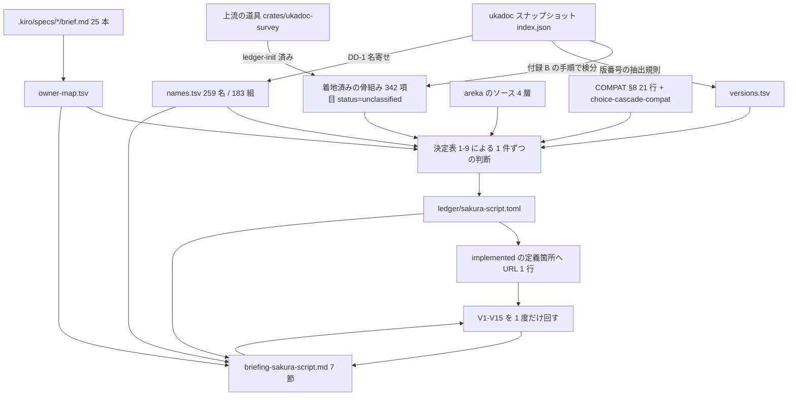

# 技術設計書: areka-P0-ukadoc-survey-sakura-script

> 本書は**文書を書くための設計**である。実行時のコードは 1 行も増えず、1 ビットも挙動が変わらない。
> 中身は ⑴ 何をどこに書くか ⑵ 1 項目の判断をどの決定表で決めるか ⑶ どの順で作業するか ⑷ 納品前に何を機械で確かめるか、の 4 つである。
> 本書の件数・定義名はすべてこのワークツリー（作業ブランチ `claude/areka-p0-ukadoc-survey-e3da3e`・`origin/main` に追従済み）で 2026-09-04 に数え直した。備考に行番号は書かない規律（要件 2.11）に合わせ、本書も判断の根拠は**定義の名前**で示す。表の中の行番号は設計時点の所在を示すためだけのもので、成果物へは写さない。

## Overview

**目的**: ukadoc のさくらスクリプトのページ（`list_sakura_script`・342 項目）について、areka が「どのタグを意味づけして動かし、どれを名前だけ登記して素通しし、どれを何も見ずに捨てているか」を 1 つの台帳へ書き出す。あわせて書式群と新旧の仕訳・`\![...]` の消費側の名前の表・所有の突合を 1 本のブリーフィングに書く。

**読む人**: 統合担当（`areka-P0-ukadoc-coverage-roadmap`）と、さくらスクリプトの項目の所有を宣言している 11 本の brief の担当者。前者は「正典の項目 1 つ 1 つが誰の持ち物か」を id 単位で辿るために台帳を読み、後者は「自分の brief のどの記述をどの id の一覧へ書き換えるか」をブリーフィングから読む。

**変わること**: 着地済みの台帳 1 本が 342 項目とも埋まり、ブリーフィング 1 本が増え、担当ドメインの報告 1 本が作り直され、実装済みと判定した項目の定義箇所に正典 URL の 1 行コメントが約 22 行加わる。実行時の判断は 1 つも変わらない。

### Goals

- 正典 342 項目を 1 件も落とさず台帳へ収め、全項目に状態・世代・担当・優先度・テーマ・関連・備考を付ける（`unclassified` 0 件）。
- 名寄せの規則を 1 文で書き切り、その規則から**再現できる件数**（異なり 259 名・2 件以上を持つ名前 23 群・105 件）で書式群と新旧を仕訳する。
- `\![...]` 198 件について「キャリアは通るが誰も消費しない」名前と id を件数付きで示す。
- 11 本の brief と `doc/COMPAT_ARCHITECTURE.md` §8 の 21 行の所有宣言を id 単位へ展開し、無所有・件数の食い違い・二重所有を 1 枚の文書から読めるようにする。
- 上流 `areka-P0-ukadoc-survey-toolkit` の凍結契約（要件 2・4・付録 A／B）に**従う側**であり続ける。形式・語彙・仕訳規則を 1 つも再定義しない。

### Non-Goals

- 実装（未対応タグを動かす作業）を 1 行も行わない。字句・意味写像・compile・消費側のいずれの判断も変えない。**消費側を新設せず、`\![...]` ごとの専用の型も提案しない**（既存の方針＝1 本の汎用キャリアに載せて消費側が名前で選ぶ、を前提とする・要件 5.5）。
- 段階 A〜E の最終決定・`linkage.md`・全体の報告・既存 brief 本文の書き換え・`doc/COMPAT_ARCHITECTURE.md` の書き換えを行わない。
- 上流の道具と重複する常設の検査コードを repo に置かない（空振り台帳の宣言を実測へ合わせるのは重複ではなく、テスト自身の説明文が求める更新である）。
- SSP 実機との挙動比較・実ゴースト資産の走査・ukadoc 本文の repo 取り込みを行わない。

## Boundary Commitments

### This Spec Owns

- `doc/ukadoc-coverage/ledger/sakura-script.toml` — `list_sakura_script` の 342 id だけを収める台帳 1 本（上流の道具が既に建てた骨組み。本 spec は**値の欄だけ**を埋め、id・並び順・前置きには触らない）。編集権は本 spec が単独で持つ（1.1・1.3・12.2）。
- `doc/ukadoc-coverage/briefing-sakura-script.md` — 7 節のブリーフィング 1 本（10.1・10.2）。
- 実装済みと判定した項目の定義箇所に置く `ukadoc: <正典 URL>` の 1 行コメント（見込み 22 行・5 ファイル・5 クレート）。ソースへの接触はこれだけ（9.1・12.1）。
- 本ドメインの判断そのもの（各 id の状態・世代・担当・優先度・テーマ・関連・備考）と、名寄せの規則。
- `doc/ukadoc-coverage/report/sakura-script.md` の作り直し（11.1）。道具は 2026-09-05 に着地したので、これは本 spec の担当に入っている（11.2 の「未着地」の枝は使わない）。手で書き換えない（11.3）。

### Out of Boundary

- 台帳の項目形式・欄・状態語彙・関連の種別・テーマの定義（上流 toolkit 要件 2・4・付録 A が凍結済み。1.6・12 の枠）。**再解釈も再定義である。**
- 他 3 ドメインの台帳・報告・ブリーフィング、およびそこに属する項目の行（11.5・12.2）。`list_propertysystem` の 188 件は指すだけで置かない。
- 照会経路 3 件を除く他ドメインの項目、`values.md`・`README.md`・`catalog.toml`・`linkage.md`・`report/summary.md`（11.5）。
- 既存 brief 11 本の本文と優先順位（8.9・12.4）・`doc/COMPAT_ARCHITECTURE.md`・`.kiro/steering/roadmap.md`（12.3）。
- 二重所有の**裁定そのもの**（本 spec は案を 1 つ添えるだけ・8.4）と段階 A〜E の最終順序（7.9・10.6）。
- `areka-P0-sakura-tag-word-boundary` が扱う「本文の半角 `[` で直前のタグと本文が黙って消える」欠陥の是正（12.5）。
- 常設の整合検査の**判定そのもの**（上流 toolkit 要件 6 が唯一の持ち主）。**ただし空振り台帳（`crates/ukadoc-survey/tests/consistency/checks.rs` の `census` の `Subjects::Zero` の行）だけは例外**——2026-09-06 の開発者裁定により本 spec が `NonEmpty` へ移す。判定の中身は変えず、「今日の実データに対象があるか」の宣言だけを実測へ合わせる（要件 12.1 の但し書き）。

### Allowed Dependencies

| 依存先 | 使い方 | 制約 |
|---|---|---|
| 上流 toolkit 要件 2・4・付録 A／B と同 design（未 main・`claude/areka-p0-ukadoc-survey-1617ba`） | 形式・語彙・仕訳規則・id の取り方・版番号の抽出規則・証拠行の形 | 読むだけ。再定義しない |
| ukadoc スナップショット（既定 `%APPDATA%\npm\node_modules\ukagaka-doc-mcp\data\index.json`・環境変数 `AREKA_UKADOC_SNAPSHOT` があればそちら） | id・見出し・本文・版番号・URL・`links` の相手の実在確認 | 本文を repo に写さない（12.6） |
| ukadoc MCP `search_docs`（`source` を `satori_wiki`／`yaya_wiki` に絞る） | 使用頻度の**弱い代理**（7.8） | 総数だけを使う。作例本文を写さない |
| `crates/areka-parsers/src/sakura/{lexer,decode}.rs`・`crates/areka-sakura/src/{compile,sysvar}.rs`・`crates/areka-seriko/src/{actor,resolve,state}.rs`・`crates/areka-kanade/src/schedule/{choice,steady,events}.rs`・`crates/areka/src/emo2_boot/{move_cue,zorder_cue,consumer_ledger}.rs`・`crates/areka-ghost/src/{sylphya_wiring,prop_sink,runtime}.rs`・`crates/areka-emo-text/src/{state,layout}.rs`・`crates/areka-sylphya/src/vocab/flat.rs` | 状態判定の根拠 | 読むだけ。URL コメントを置く 5 ファイル以外は 1 文字も変えない |
| `doc/COMPAT_ARCHITECTURE.md` §8 の 21 行と `doc/choice-cascade-compat.md` | 縮退の転記元・語彙のみ登記の転記元 | 読むだけ（12.3） |
| `.kiro/specs/*/brief.md`（25 本を走査・本ドメインの所有を主張するのは 11 本） | 所有宣言の突合元 | 読むだけ（8.9） |

### Revalidation Triggers

- 上流 toolkit が付録 A の欄・状態語彙・関連の種別・テーマ・版番号の抽出規則を改訂したとき（台帳全体の再点検）。
- スナップショットが更新され `list_sakura_script` の件数が 342 でなくなったとき（骨組みの作り直し・1.9）。
- 名寄せの規則（DD-1）または別名の判定（DD-2）を変えたとき（105 件の `status` と `alias_of` が動く）。
- `crates/areka-sakura/src/compile.rs` の `command_carrier` を読む 4 経路が増減したとき（`\![...]` 198 件の状態が動く・5.3）。
- `doc/COMPAT_ARCHITECTURE.md` §8 に本ドメインの行が増減したとき（`degraded` と `vocabulary-only` の境が動く・2.5・2.6）。
- 他 3 台帳が揃ったとき（上流の検査 6.4・6.7 が初めて動く・要件 1 の付随注記）。

## Architecture

### 既存の形と本 spec の位置

areka の側は 4 つの層に分かれ、本調査はそのどこにも手を入れず**読むだけ**である。

| 層 | 定義（ファイルと名前） | 本調査での役割 |
|---|---|---|
| 字句 | `lexer.rs` の `Token` 6 種・`SHORTHAND_WORDS`・`bare_tag_len` | 綴りを切り出すだけで名前を知らない。**名前の登記にあたらない**（`bare_tag_len` は先頭の `_` の数だけで 1／2／3 文字を消費する構造的な関数） |
| 意味写像 | `decode.rs` の `decode_token`／`decode_bare`／`decode_tag`／`decode_bang`／`fold_choice_marker` | 「areka が名前を見て動きを起こす」かどうかの第 1 の判定点（2.4 ⒜） |
| 台本化 | `compile.rs`（`CueCommand::command_carrier` への転写と `debug!` の受け皿） | 名前を保ったまま運ぶ。ここでは選別しない |
| 消費 | `move_cue.rs`／`zorder_cue.rs`／`areka-seriko/src/actor.rs` の名前自己選別 | `\![...]` の第 2 の判定点（2.4 ⒝）。**実行時に名前で自分を選ぶ経路は 4 つだけ** |

`%` は別系統で、`sysvar.rs` の `resolve_system_var` が値を作り、`crates/areka-sylphya/src/vocab/flat.rs` の `FLAT_VOCAB`（26）と `SYNTAX_RECORDS`（2）が名前だけを並べる（実行時の解決には使われない）。本ドメインで「名前は登記されているが何も起こらない」に当たるのは、この表と `doc/COMPAT_ARCHITECTURE.md` §8 の「語彙（と意味論）の記録だけがある」と明記した行だけである（2.5・実文は規則 2 の順 5 に列挙）。

### 生産の流れ



依存の向きは一方向である。**スナップショット → 骨組み → 判断 → 台帳 → URL コメント／ブリーフィング → 検査**。URL コメントは台帳の従属物なので、台帳が確定する前に置かない。

### 上流の整合検査との関係

**2026-09-05 の更新**: 上流の道具と 4 ドメインの台帳がすべて着地したので、下表の「揃うまで確かめられない」はもう成り立たない。ブリーフィング末尾の注記（要件 10.7）は「確かめられない項目の列挙」ではなく**実際に回した結果**を書く。

| 上流の検査 | 内容 | 本 spec での扱い |
|---|---|---|
| 6.4 | カタログの全 id が 4 つの台帳のいずれか 1 つにちょうど 1 回だけ現れる | 他 3 台帳も repo にあるので**この木で実際に回せる**（常設の検査が担当。着地時点で緑を確認済み）。本台帳側の 342 件の網羅は V1・V2 で重ねて確かめる |
| 6.7（両端実在） | 関連の両端の id が実在する | 相手がカタログに実在することは V7 でスナップショットに直接当てて確かめる（要件 6.7 が「書く前に確かめる」を求めるため。常設の検査を待たない） |

上流の検査 6.6（`implemented` に証拠がある）・6.7 の別名連鎖禁止・6.7 の版番号所属は常設の検査に入っているが、書きながら早く気づけるよう本 spec 側でも V6・V10・V11 として先取りする。

### 常設の検査との分担（2026-09-05）

着地した道具は 15 種の所見を常時出す——台帳 id とカタログの一致・4 台帳での重複と欠落・担当ページ・前置き・id の昇順・ページ割り当て・ソースの正典 URL の実在・`implemented` の証拠・関連と別名の相手の実在・別名の連鎖・登場版の所属・テーマ名・報告の陳腐化。状態語彙・テーマ名・関連の種別の綴り違いは読み込みの段で落ちる。

**本 spec の使い捨ての台本は、この 15 種に無いものだけを作る**（重複した常設テストを repo に置かない方針は Non-Goals のまま）。残るのは V2 の 4 節の割り振り・V4 の未分類 0・V5 の欄の存在と空文字の別々の確認・V6 の「別名でない行に `alias_of` が無い」・V7 の `configures` 0 件と発火の相手なし・V8 の「失うもの」の 1 文・V9 の優先度の形と空の条件・V10 の最小の版と `7.4.1` 不採用・V11 の重複行と 156 行の非採用・V12 の表の一致・V13 の行数・V14・V15 である。

## 設計判断

要件ディスカッションから設計へ送られた 6 件と、調べもの 8 件の答えである。

### DD-1. 名寄せの規則（要件 4.5・議題 1 前半）

**規則（1 文）**: 見出しの先頭にある 1 つ目のタグだけを見て、`\![` で始まるものは命令名（第 1 引数）と選択子（第 2 引数）までを名前とし、`%` で始まるものは最初の `[` の直前までを名前とし、それ以外のタグは `\` に続く**先頭の `_` の連なり（最大 2 個）＋ 1 文字**を名前とする。丸括弧以降は名前に含めない。

補足 3 点。⑴「1 つ目のタグだけ」は、見出しが「もしくは」「または」で 2 綴りを並べる 8 件と、`\![enter,selectmode,...]` のように複数の完全形を連ねる 2 件の両方に効く。⑵ 角括弧なしタグの規則は `lexer.rs` の `bare_tag_len` が採る規律と同じであり、正典の名前の切れ目と areka の字句の切れ目が同じ場所に来る。⑶ 丸括弧を落とす規則により `biff(`・`updatebymyself(` は `biff`・`updatebymyself` になる（要件 5.2）。

**この規則が出す件数（再現可能・ブリーフィングにはこの数を載せる）**

| 量 | 値 |
|---|---|
| 項目の総数 | 342（うちタグでない見出し 1） |
| 異なる名前 | **259**（`\![...]` の組 183 ＋ `%` 28 ＋ それ以外のタグ 48） |
| 2 件以上の id を持つ名前 | **23 群・105 件** |
| `\![...]` の第 1 段（命令名だけ） | **52 名**・198 件 |
| `\![...]` の第 2 段（命令名＋選択子） | **183 組**（うち選択子が 2 つ以上ある名前 20・その展開 151 行） |

23 群の内訳は要件 4.5・4.6 の語彙とちょうど一致する——**引数の数だけが違う 9 群（31 件）**＝`\_b` 6・`\q` 6・`\c` 5・`\![execute,http-get]` 3・`\![set,scaling]` 3・`\![execute,http-post]` 2・`\![reload,descript]` 2・`\x` 2・`\_s` 2、**括弧なし形と括弧形の対 3 群（6 件・要件 4.6 の特例）**＝`\s`・`\p`・`\b`、**引数の値が違うだけの兄弟 11 群（68 件）**＝`\f` 43・`\![open,dialog]` 4・`\_a` 3・`\![set,windowstate]` 3・`\n` 3・`\i` 2・`\__w` 2・`\![anim,add]` 2・`\![execute,install]` 2・`\![set,alignmenttodesktop]` 2・`\![set,autoscroll]` 2。9＋3＋11＝23、31＋6＋68＝105。

### DD-2. 別名にしてよい範囲＝接頭辞の検査（要件 4.5・4.7）

要件 4.5 は `\_b` 6 件を「引数の数だけが違う組」に数え、同時に `\_b[…,inline]` と `\_b[…,x,y]` を「値が違うだけの兄弟」に挙げている。同じ群の中に両方が混じっているためで、群の単位では割り切れない。**判定は群ではなく 2 つの id の対に当てる。**

**判定（1 文）**: 同じ名前の 2 つの id のうち、引数の並びが短い側が長い側の並びと先頭から 1 語ずつ一致する（＝短い側が長い側の接頭辞である）とき、その 2 つは引数の数だけが違う組であり、短い側を `alias`・長い側を正典とする。一致しないときは引数の値が違う兄弟であり、別名にしない。

同点の処理 2 つ。⑴ 接頭辞の相手が複数あるときは**引数が 1 つだけ多い相手**を採る。⑵ それでも 2 つ以上残るときは別名にせず、それぞれが自分の状態を持ち、候補が 2 つあったことを備考に書く（実測 2 件＝`\c` と `\n`。どちらも引数なしの形が 2 つの族の頭に等しく近い）。

この判定は 105 件へ機械的に当たり、**14 件が `alias`** になる（括弧なし形と括弧形の 3 対を含む）。`\_b` は `x,y` 族と `inline` 族の 2 本の鎖に割れて 4 つの根（正典）と 2 つの別名を出す——要件 4.5 の 2 つの記述が両方とも成り立つ形である。**この判定は「値が違うだけの兄弟」の群にも 1 件だけ届く**——`\_a[ID]` は `\_a[ID,r2,r3...]` の接頭辞なので `alias` になる（`\_a[OnID,r0,r1...]` は `OnID` で並びが違うので兄弟のまま）。`\_b` と同じく、群の名前は 11 群の側にあっても対の判定は id ごとに当たる、というだけのことで、判定を群で例外扱いしない。ただし `areka-P0-anchor-tag-canon` が所有を宣言している 3 件のうち 1 件が `alias` になるので、⑴ その行の備考に所有の主張を残し（規則 4 の末尾が `\sID番号` に対して採る書き方と同じ）、⑵ ブリーフィング ⑶ 節の所有の突合表は `alias` の id も落とさずに載せ、`（alias → 根の id）` と注記して brief の件数（3）と台帳の `owner` の件数（2）の差の理由を読めるようにする。`\![execute,http-get]` のように置き場所の語が違う（`URL,パラメータ` と `URL,オプション,…`）ものも接頭辞にならないので、根が 2 つ残る。根が 2 つ以上ある群は、その事実と兄弟の id を備考に書く。

本文の注記で向きが決まる 7 件（要件 4.2）はこの判定の**前**に当て、置き換え先が本文から特定できる 3 件を `alias` にする——`\![reloadsurface]`→`\![reload,shell]`・`\z`→`\e`（いずれも名指し）・旧書式 `\q[ID][タイトル]または\q*[ID][タイトル]`→`\q` の鎖の根（本文は「上記のものとは違い」と現行の `\q` の書式群を参照で特定している。名指しではないが相手は 1 つに定まる）。**`alias_of` の相手は必ず鎖の根（自身が `alias` でない id）にする**（要件 4.7 の連鎖禁止）。旧書式 `\q` の指す先も `\q` の鎖の根であって、`alias` である `\q[タイトル,ID]` ではない（要件 3.5）。areka の `fold_legacy_q` はこの旧書式をわざと選択肢にせず `Raw` へ畳むので、別名の行でもその綴りを受けないことを備考に書き、ブリーフィング ⑸ 節の群にも載せる（`\sID番号` と同じ扱い）。

**`alias` の確定値は 20 件**＝本文の注記で決まる 3 件（順 1）＋括弧なし形と括弧形の対 3 件（順 4）＋接頭辞の検査で残る 11 件（順 5）＋**本文が「同じ機能」と言い切る組 3 件（順 6）**。**2026-09-05 のタスク 2.6（是正）で 17 → 20 に改めた**——本書は当初 順 1・順 4・順 5 しか数えておらず、順 6 の 3 組（`\_V`→`\![sound,wait]`・`\7`→`\![executesntp]`・`\_v[ファイル名]`→`\![sound,play,...]`）が抜けていた。向きは本文の注記でも版番号でも決まらず（版番号は 8 件とも空・`[旧仕様]` の札は当該 4 組に無い）、正典の文書順を裏付けにした**人手の判断**（要件 4.1 の第 3 段）。`\![anim,stop,ID]`／`\![anim,clear,ID]` は本文が同等を言い切るが**向きが決まらないので別名にせず** `same-feature` で結んだ。実装者が数え直すときはこの内訳と突き合わせる。

### DD-3. `\![...]` の表は 2 段にする（要件 5.2・議題 2）

**表 A（52 行・全数）**: 命令名｜属する id の件数｜選択子の異なり｜消費される組｜受け手（定義名）｜消費されない id の件数。
**表 B（151 行）**: 表 A のうち**選択子が 2 つ以上ある 20 名だけ**を組へ展開する。命令名＋選択子｜属する id の件数｜消費の有無｜受け手。選択子が 1 つしかない 32 名は表 A の行がそのまま組なので展開しない（展開しても情報が増えない）。

この形で「`set` は 31 件・25 組あり、消費されるのは `zorder` の 1 組 1 件だけ」が 2 つの表の突き合わせで読める。

### DD-4. 1 つの腕に複数の id が当たるときは 1 項目 1 行で積む（要件 9.2・9.3・議題 3）

`decode_tag` の `"n"` の腕には 2 件、`"q"` の腕には現行 5 件のうち `implemented` と判定したものが当たる。**腕の直上に、id の文字順で 1 行ずつ `// ukadoc: <URL>` を積む。** 代表 1 件だけを置く案は上流の検査 6.6 で残りが「証拠なし」になるので採らない。台帳の状態を寄せて 1 件に減らす案は台帳そのものを歪めるので採らない。

### DD-5. `lexer.rs` には 1 行も置かない（議題 4 の解消）

URL を置く先は「意味を作っている定義」であって「綴りを並べた表」ではない（要件 9.6 が `%` 語彙表について定める扱いを、綴りの表にも同じく当てる）。短縮形 3 語の意味を作っているのは `decode.rs` の `decode_token` にある `Token::Shorthand { word: 'w' … }` などの腕であり、`lexer.rs` の `SHORTHAND_WORDS` は綴りの集合を宣言しているだけである。さらに `\bID番号`・`\pID番号` は DD-2 により `alias` になるので URL 自体が要らない。結果として `SHORTHAND_WORDS` の既存の説明文（`ukadoc:` の語を含む `///` ブロック）には**触れない**。要件 9.11 の「書き換えない」と、`areka-P0-property-query-channels` が同じファイルの `scan_sysvar` を直す予定であることの両方に対して、衝突が構造的に消える。

### DD-6. `%` の未対応 24 件の備考は語彙表の層で 5 群に分ける（要件 2.12・議題 12）

`flat.rs` が既に層で並べているので、その切れ目をそのまま使う。群ごとの説明はブリーフィングに 1 度だけ書き、備考からは群の名前を指す。

| 群 | 件数 | 中身 | backing 層 |
|---|---|---|---|
| 暦時計 | 5 | `%month` `%day` `%hour` `%minute` `%second` | `SystemEnv` |
| 画面と OS 起動時間・時刻ネタ | 5 | `%screenwidth` `%screenheight` `%exh` `%et` `%wronghour` | `SystemEnv` |
| 単語ランダム系 | 10 | `%ms` `%mz` `%ml` `%mc` `%mh` `%mt` `%me` `%mp` `%m?` `%dms` | `RuntimeState` |
| インストール文脈 | 2 | `%lastghostname` `%lastobjectname` | `RuntimeState` |
| 構文記録 | 2 | `%*` `%property[プロパティ名]` | `SYNTAX_RECORDS` |

5＋5＋10＋2＋2＝24。残り 4 件（`%username`・`%selfname`・`%selfname2`・`%keroname`）は値の源が実在するので `implemented`（要件 2.5 の後段）。24＋4＝28 で `%` の節と 1 対 1 に閉じる。

### DD-7. §8 の「正典沈黙の裁量」は `degraded` の根拠にならない（要件 2.6）

`doc/COMPAT_ARCHITECTURE.md` §8 の見出しは「正典沈黙箇所の areka 裁量記録」であり、行には 2 種類ある。⑴ 正典が黙っている所を areka が決めた行（`%username` の既定値・`%selfname2` 未定義時など）。⑵ 正典に定めがあるのに別の応答を返すと明記した行（`\![move]` の名前付き `--key=value` 形・非スコープ基準・`time>0` の 3 行、`\_l` の縦書きの行）。**`degraded` の根拠になるのは ⑵ だけ**である。要件 2.6 は「正典が定める応答に対して別の応答を返す」と書いており、正典が黙っている所には当たらない。⑴ の行は `implemented` の判断を覆さず、裁量の内容を備考に写す。

「M1 非実装／非受理／非実導出で語彙（と意味論）の記録だけがある」と明記した行（時間指令の allowlist＝「語彙保持」・`\![set,balloontimeout]` と `\x`／`\x[noclear]`＝「完全な語彙と意味論の記録のみ」・`\f[align]`／`\f[valign]`＝「未実装（語彙記録）」）は `vocabulary-only` の根拠であって `degraded` ではない（要件 2.5 の 2 つ目の登記）。`\_l` の行も「未実装（語彙記録）」で始まるが、続けて既知非互換を実測として登記しているので ⑵ に当たる（DD-9 の Q5）。

### DD-8. 未登記の食い違いは状態を変えず、是正候補として出す

本調査は §8 に登記の無い食い違いを 3 件見つけた（DD-9 の Q1）。要件 2.6 は `degraded` の条件に「既に登記されている」を置いているので、**未登記の食い違いで状態を動かさない**。代わりに ⑴ 当該項目の備考に食い違いの中身を書き（要件 2.10 の「壊れ方」の一部として）、⑵ ブリーフィングの ⑹ 節へ「§8 に新しい行を足す候補」として出す（要件 10.5・12.3 により本 spec は §8 を書き換えない）。

### DD-9. 調べもの 8 件の答え

| # | 問い | 答え（根拠は定義の名前） |
|---|---|---|
| 1 | `\s[ID]` は seriko まで届いて面が変わるか | **届く**。`decode_tag` の `"s"` の腕 → `compile` の `Instruction::Surface` の腕 → `SurfaceResolver::resolve` → `ScopeStates::apply` → `emit_display`。`-1` は `SurfaceTarget::Hide` として解決される。よって `\s[ID番号]` は `implemented`。ただし**未登記の食い違いが 3 つ**ある——⒜ 面の別名は `kero.surface.alias` の塊しか読まない（`crates/areka-parsers/src/shell/decode.rs` の `dispatch_block` が完全一致で判定し、`sakura.surface.alias` は `crates/` に 1 件も無い）⒝ `name,定義名` による別名は `decode_surface_body` にキーが無く一切入らない ⒞ 同名が複数 id を持つとき先頭固定で選ぶ。DD-8 の扱い |
| 2 | `\q[タイトル,script:実行内容]` の `script:` | **名前で見分けたうえで、わざと何も起こさない**。`decode_choice` は素通しするが、`crates/areka-kanade/src/schedule/choice.rs` の `plan_cascade` が `script:` を最初に見て `CascadePlan::Unsupported` を返し、`steady.rs` の当該の腕が `warn!("choice_unsupported_category")` を出して選択肢待ちだけ解く。SHIORI イベントは 1 つも出ない。転記元は `doc/choice-cascade-compat.md` の 7a-i／7a-ii（`doc/COMPAT_ARCHITECTURE.md` から参照）＝**登記あり → `degraded`**。**2026-09-05 の追記（タスク 2.2 の裁定）**: 同じ表の 7b-i／7b-ii が `\q[タイトル,ID1,ID2,ID3...]` の複数 ID 形も「M1 非対応」と登記している（正典本文は「ID\* は Reference\* に格納される」と定めるが、`crates/areka-kanade/src/schedule/events.rs` の `on_choice_select` は Reference を 1 個しか作らず 2 番目以降が落ちる。§8 の当該行の主題が「CROW 複数 ID 形の M1 非対応縮退」を名指しして同文書へ委譲している）。したがって**この形も `degraded`** であり、本書が当初 `implemented` と見込んでいたのは 7b-ii の拾い落としであった |
| 3 | 単独の `\![*]` | **`absent`**。`fold_choice_marker` は直後が現行 `\q[...]` のときだけ畳み、単独形は `GenericCommand { name: "*" }` になってキャリアに載る。名前 `"*"` を選ぶ受け手は無く、`areka-emo-present/src/balloon.rs` の系列名の解決も `marker*` を明示的に外している。畳まれた場合もマーカーは描かれない |
| 4 | `\![bind-noevent,...]` | **`absent`**。`crates/areka-seriko/src/actor.rs` の `handle_message` は `if name != "bind"` の完全一致で選ぶ。`crates/` 全体で `bind-noevent` に当たるのはこの分岐のコメント 1 行だけで、別経路は無い |
| 5 | `\_l[x,y]` の縦書き | **`degraded`**。§8 の当該行は「未実装（語彙記録＋**既知非互換の登記**）」と書き、`vertical_rl` で `\_l[0,0]` が描画範囲の外側左方へ着地することを実測として登記している。`crates/areka-emo-text/src/layout.rs` の `cursor_to_image_px` は `px`／`em`／`lh` の非負絶対だけを解き、`%`・`@` 相対・負値は `None`（軸不変）へ落ちる。横書きでは動くので「別の応答を返す」に当たる |
| 6 | 上流の版番号の抽出規則 | 本文から「前後が数字でも小数点でもない `数字+.数字+.数字+`」をすべて拾い、重複を除いて文字列として昇順に並べる。正規表現は `(?<![0-9.])\d+\.\d+\.\d+(?![0-9.])`。本ドメインへ当てると **65 件が 1 つ以上・版の種類 39** で、要件の実測と一致する |
| 7 | `links` の相手の綴り | スナップショットで実在を確認済み。`ukadoc:list_shiori_event:OnChoiceSelect:1`・`:OnChoiceSelectEx:1`・`:OnChoiceTimeout:1`・`:OnAITalk:1`・`:OnAnchorSelect:1`・`:OnAnchorSelectEx:1`。プロパティ側は `ukadoc:list_propertysystem:<ドット名>:1`（188 件）。descript のフォント設定は `ukadoc:descript_balloon:font.*`。相手の判定は `id` をコロンで割った 2 番目の要素で行う（付録 B 手順 2） |
| 8 | 「キャリアは通るが誰も消費しない」件数 | 実行時に名前で自分を選ぶ経路は **4 つ**（`move_cue.rs` の `MoveCueSink::emit`＝`"move"`／`zorder_cue.rs` の `ZOrderCueSink::emit`＝`("set","zorder")` と `("reset","zorder")`／`areka-seriko/src/actor.rs` の `handle_message`＝`"bind"`）。5 つ目の `crates/areka-ghost/src/prop_sink.rs` は areka 内部の cue 名 `areka.prop.set` を選ぶだけで正典のタグではない（要件 5.7）。`consumer_ledger.rs` の `ConsumerLedger::canonical()` は**宣言の表で、実行時に引かれない**（呼び出しは自身のテストだけ）。したがって `\![...]` 198 件のうち**消費されるのは 4 件**、**194 件が通るだけ**。第 1 段では 52 名のうち 4 名だけが受け手に触れられ（うち `set`・`reset` は選択子でしか触れられない）、**48 名は 1 度も触れられない**。第 2 段では 183 組のうち **179 組**が消費されない |

## 台帳の記入規則（決定表）

以下は 342 件を 1 件ずつ埋めるときの判断規則である。**上から順に当てはめ、最初に当たった行を採る**（先勝ち）。

### 規則 0: 骨組みの生成規則（要件 1.1・1.4・1.5・1.10）

1. スナップショットは `AREKA_UKADOC_SNAPSHOT` があればそこ、無ければ `%APPDATA%\npm\node_modules\ukagaka-doc-mcp\data\index.json`。
2. 自ドメインの id ＝ `source == "ukadoc"` かつ `id` をコロンで割った 2 番目の要素が `list_sakura_script` のもの。**アンダースコアで割らない。** 件数は 342。
3. 並びは **id のバイト昇順**。本ドメインの id は全件 ASCII で、逆斜線も引用符も非 ASCII も 1 件も含まない（見出しの記号は `_5c`・`_21` のように符号化済み）。したがってバイト順＝文字順であり、`%` の 28 件が先頭、`\` のタグ 313 件が中央、日本語見出しの 1 件が末尾に来る。
4. 書き出しは付録 A.1 の形。冒頭に `[ledger]`（`domain = "sakura-script"`・`pages = ["list_sakura_script"]`）を置き、以下 342 個の `[entry."<id>"]` を欄の順（`status`・`introduced`・`owner`・`priority`・`values`・`links`・`note`）で並べる。初期値は `status = "unclassified"`・他は空。
5. 文字列は TOML の二重引用符。`\` は `\\`、`"` は `\"` へ逃がす。**id にはこの逃がしが要らない**（3 のとおり符号化済み）。備考は逆斜線を大量に含むので、ここでの逃がしが唯一の要点になる。備考が複数行になるときは `"""…"""` を使う。
6. 符号化された部分を読みやすい形へ直さない（要件 1.4）。見出しと本文は判断材料にするだけで台帳へ写さない（要件 12.6）。
7. **証拠の欄を作らない**（要件 9.9）。実装済みの根拠はソース側の 1 行コメントであり、台帳には現れない。独自の欄も独自の語彙も足さない（要件 1.6）。

### 規則 1: 節への振り分け（要件 2.2・2.3）

見出しの先頭で機械的に割る。1 つの id を 2 つの節に数えない。

| 節 | 判定 | 件数 |
|---|---|---|
| `\![...]` の命令 | 見出しの先頭が `\![` | 198 |
| `%` 環境変数 | 見出しの先頭が `%` | 28 |
| それ以外のタグ | 見出しの先頭が `\` で `\![` でない | 115 |
| タグでない | 上のどれでもない（見出し `環境変数の記述例`） | 1 |

### 規則 2: `status`（先勝ち・要件 2.1〜2.9・2.13）

| 順 | 条件 | status | 見込み |
|---|---|---|---|
| 1 | 見出しがタグでない（規則 1 の第 4 節）、または areka の担当範囲の外である | `not-applicable` | **1** |
| 2 | DD-2 の判定で別名になった、または本文の注記が旧仕様と述べ置き換え先が本文から特定できる（DD-2 の 3 件） | `alias` | **17** |
| 3 | `doc/COMPAT_ARCHITECTURE.md` §8（または §8 が指す `doc/choice-cascade-compat.md`）に、正典の定めに対して別の応答を返すことが**既に登記されている**（DD-7 の ⑵ の行だけ） | `degraded` | **4** |
| 4 | areka が名前を見て正典の動きを起こす。⒜ `decode.rs` の写像先が cue になり実際に効く ⒝ `\![...]` について実行時の 4 経路のいずれかに当たる ⒞ `%` について値の源が実在し展開される | `implemented` | **22** |
| 5 | `crates/areka-sylphya/src/vocab/flat.rs` の `%` 語彙表に名前がある、または §8 が「M1 非実装／非受理／非実導出で、語彙（と意味論）の記録だけがある」と明記して名指ししている（§8 の実文は行ごとに違い、「完全な語彙と意味論の記録のみ」〔`\![set,balloontimeout]`・`\x`〕・「未実装（語彙記録）」〔`\f[align]`／`\f[valign]`／`\f[underline,true]`——この行は「等」で閉じておらず 3 綴りを逐語で書いている（2026-09-05 のタスク 2.3 の裁定で `underline` を追記）〕・「語彙保持＋縮退のみ」〔時間指令の一覧〕の 3 通り。「語彙・意味論のみ記録」という逐語は §8 に無い）。**行が「等」で閉じている場合（実測 1 行＝compile 側の時間指令の一覧）は、その行が逐語で綴りを書いた名前だけを名指しとみなす**（`quicksection`・`set,balloonwait`・`set,choicetimeout`・`set,balloontimeout`・`embed`・`sound,wait`・`wait,syncobject` の 7 名。「同期 `move` 系の持続時間引数」は綴りではないので名指しに数えない）。書かれていない綴りは順 6 に落とし、行が「等」で開いていることを備考に書く | `vocabulary-only` | **36** |
| 6 | 上のいずれにも当たらない | `absent` | **259** |
| — | 判断が付かない | `unclassified` | **0（納品時）** |

- 順 3 を順 4 より前に置くのは要件 2.6 の明示である。動く用法と動かない用法の両方を備考に書く。
- 順 4 と順 5 の双方に当たる項目は順 4 が勝つ（要件 2.5 の後段。`%` 語彙表の 26 名には値の源が実在する 4 名が含まれるため）。
- `\![...]` のうち消費側の登録が無く §8 にも記録が無い名前は順 6 に落ちる（要件 2.7）。名前がキャリアに載って最後まで運ばれること自体は備考に書く。
- `implemented` としたいのに定義箇所が特定できない項目は `implemented` にせず、順 5 か順 3 として理由を備考に書く（要件 2.13）。
- 見込みの合計は 1＋20＋4＋22＋36＋259＝342。`alias` 20 と `degraded` 4・`implemented` 22 は本書で確定した値（`alias` は 2026-09-05 のタスク 2.6 の是正で 17 → 20・`absent` は 262 → 259）（`degraded` は 2026-09-05 のタスク 2.2 の裁定で 3 → 4・`implemented` は 23 → 22 に改めた。根拠は DD-9 の Q2 の追記）、`vocabulary-only` 36 と `absent` 262 は順 5 の「等」の規則で機械的に決まる見込みの値であり（2026-09-05 のタスク 2.3 で `\f[underline,パラメータ]` が名指しに当たると分かり 34 → 35・264 → 263、続くタスク 2.4 で §8 の逐語 7 名が id では 8 件になると分かり 35 → 36・263 → 262 に改めた）、納品時の集計（V4・V5）で確かめて置き換える。§8 に本ドメインの行が増減したら再点検する（Revalidation Triggers）。

### 規則 3: `introduced`（要件 4.9〜4.11）

1. その項目の本文へ DD-9 の Q6 の抽出規則を当て、拾えた版番号の集合を作る。
2. 集合が空なら `""`（世代不明。最古と決めつけない）。ただし本文が 2 桁の版だけを書いている **6 件**（`\![sound,play,...]`・`\![sound,load,...]`・`\![sound,option,...]` の各 `2.4`〔正典では別々の 3 id〕・`\__v[オプション]` の `2.4`・`\![biff(,アカウント名)]` の `2.5`・`\![execute,resetwindowpos]` の `2.7 RC1`。**2026-09-05 のタスク 2.4 の裁定で `\![move]` の `2.5` を外し、行の数「5 件」を id の数「6 件」に改めた**——`\![move]` の本文に版の区画は無く、`2.5` は記述例の「2.5 秒かけて移動する」という所要時間である）は、備考に「本文は `2.4` と書くがカタログの規則で拾えない」の形で本文の版を写し、単なる世代不明と区別する。2 桁を拾う規則を上流へ提案しない。
3. 集合に SSP の版でない番号が混じる 1 件（`\![close,websocket,URL]` の `7.4.1`）は候補から除き、除いた理由を備考に書く。
4. 残った集合が 2 つ以上なら**最小の版**を採り、採らなかった版と、それが本文のどの追記に当たるかを備考に書く（実測 4 件）。
5. 採った版は必ず 1 の集合に含まれる（上流の検査 6.7 の版番号所属を満たす）。

### 規則 4: `alias_of` と `supersedes`（要件 4.1〜4.8）

向きは上流 要件 4.1 の順序で決める。⑴ 正典本文の注記（`[旧仕様]` を含む 7 件）→ ⑵ 版番号 → ⑶ 人手の判断。

| 順 | 条件 | 結果 |
|---|---|---|
| 1 | 本文が旧仕様と述べ、置き換え先が本文から 1 つに特定できる（名指し＝`\![reloadsurface]`→`\![reload,shell]`・`\z`→`\e`／参照＝旧書式 `\q[ID][タイトル]または\q*[ID][タイトル]` の「上記のものとは違い」→現行 `\q` の書式群） | `alias`。`alias_of` は相手の鎖の根。areka がその綴りを受けない場合（旧書式 `\q` は `fold_legacy_q` が `Raw` へ畳む）は備考に書く |
| 2 | 本文が旧仕様と述べるが置き換え先を名指ししない（`\_!`・`\__c`・`\__t`） | 別名にしない。旧仕様であることを踏まえて状態を決め、置き換え先が特定できないことを備考に書く（要件 4.3） |
| 3 | 本文が旧仕様と述べるが現行の振る舞いを明記している（`\a`） | 別名にしない。`triggers` で `ukadoc:list_shiori_event:OnAITalk:1` を指す |
| 4 | 括弧なし形と括弧形の対（`\s`・`\p`・`\b`） | 括弧形が正典・括弧なし形が `alias`。版番号が付く `\b[ID番号]`（`2.6.34`）を向きの根拠として明記し、版番号の無い `\s`・`\p` に同じ向きを人手の判断として当てたことを備考に書く（要件 4.6） |
| 5 | DD-2 の接頭辞の検査で短い側になった | `alias`。狭さ（`\sID番号` の「0〜9 のみ」など）を備考に書く |
| 6 | 本文が「同じ機能」と言い切る組（`\![sound,play,...]`＝`\_v[ファイル名]`・`\![sound,wait]`＝`\_V` など） | 旧い側を `alias` にし、根拠の文言を備考に写す |
| 7 | 本文の明言が「同様」「ID 仕様は同じ」「〜と同じだが〜しない」にとどまる組（`\__q` と `\q`・`notify` 系と `raise` 系・`%*` と `\![*]`） | 別名にせず `links` の `same-feature` で結ぶ。`%*`＝`\![*]` は `%` の節と `\![...]` の節をまたぐ唯一の関連で、`%*` の側から指す（要件 4.4） |
| 8 | 上のどれでもない | 別名にしない |

- `alias_of` の相手は必ず `alias` でない id にする（連鎖禁止・要件 4.7）。
- 新しい側から旧 id への `supersedes` は書いてよい（要件 4.8）。両方を書いても片方だけでもよい。
- `alias` の行ではその行で実装状態を判定しない（要件 2.9）。ただし**その綴りを areka が受けるかどうかが正典側と違う場合は備考に書く**（要件 3.4・4.6）。実測でここに当たるのが `\sID番号` である——`SHORTHAND_WORDS` は `w`・`b`・`p` の 3 語で `s` を含まないため、`\s0` は `Bare("s")` ＋ `Text("0…")` に割れ、面は変わらず数字が台詞へ漏れる（要件 2.10 の壊れ方 ⑶ そのもの）。この事実は正典の記述例にも現れる形なので、ブリーフィングの未対応一覧にも群として載せる。

### 規則 5: `owner`（先勝ち・要件 8.1〜8.9）

転記元は `.kiro/specs/*/brief.md` の走査（2026-09-04 の実測は 25 本中 11 本が本ドメインの所有を主張）と `doc/COMPAT_ARCHITECTURE.md` §8 の 21 行。brief がさくらスクリプト以外の id も名乗っている場合は主張をドメインで割り、本台帳へ転記するのはさくらスクリプトの id だけにする。

| 順 | 条件 | owner |
|---|---|---|
| 1 | `status = "not-applicable"`、または `status = "alias"` で **areka がその綴りを受ける**（写像先の根と同じ動きをする） | `""`（作業が残らない） |
| 1a | `status = "alias"` だが **areka がその綴りを受けない**（実測 **3 件**＝`\sID番号` は `SHORTHAND_WORDS` に `s` が無く数字が台詞へ漏れる・旧書式 `\q[ID][タイトル]` は `fold_legacy_q` が `Raw` へ畳む・`\z` は既定の腕から `Raw` へ落ちてトークが終わらない。**2026-09-05 のタスク 3.3 の裁定で 2 件 → 3 件に改めた**——`\z` も台帳の備考が逐語で「areka はこの綴りを受けない…`Raw` へ落ちて compile の catch-all に捨てられるのでトークが終わらない」と書いており、写像先の根 `\e`（`decode_bare` の `"e"` の腕＝`Instruction::End`）と動きが違う。順 1a の 3 件は `\sID番号`・旧書式 `\q[ID][タイトル]または\q*[ID][タイトル]`・`\z`） | 空にせず順 2 以降で判定する（別名の綴りを根へ写す作業が残るため）。所有を主張する brief が無ければ順 7 の「所有者なし」へ |
| 2 | 2 本以上が主張し、**互いに相手を知らない**（実測 2 件＝`\![embed,イベント名,r0,r1,r2...]` を `sakura-time-directives` と `property-query-channels` が、`\![move]` を `surfaces-basepos`（`base` の解決）と `sakura-time-directives`（時間の枠）が、それぞれ別々に主張。**2026-09-05 のタスク 3.1 で理由を取り直した**——`\![move]` はこの記述のとおり両者が互いを 0 回も名指ししていない〔両方向 grep で確認〕。一方 `\![embed,イベント名,r0,r1,r2...]` は `property-query-channels` の brief が `sakura-time-directives` を **Adjacent として一方向に名指ししている**ので「互いに相手を知らない」は当たらない。ただしその名指しは「層違いで非衝突」と述べるだけで**どちらがどの id を持つかの分担を決めておらず**、相方も相手を認識していないので、**分担は未確定＝順 3 ではなく順 2 に落ちる**。備考には「相手を知らない」ではなく「名指しは一方向で分担が未確定」と書き分ける。§8 の `\![move]` の 5 行は完了済み `sakura-dialogue-tags` を担当に書くだけで両者の住み分けを登記していない） | `""`（裁定待ち）。両者の主張をブリーフィング ⑷ 節に並べ、裁定案を 1 つ添え、それが案であって決定ではないことを明記する。`\![move]` は主張が別々の引数（`base` と `--time`）に向いているので、案は「引数ごとに分ける」形でよいが、決定は統合担当に委ねる |
| 3 | 2 本以上が主張するが**分担が合意済み**（互いを名指ししている、または §8 に住み分けが登記されている。**2026-09-05 のタスク 3.1 で実測を取り直した**——主張の型を `ownership`／`example`／`lexical-boundary` の 3 つに割って行番号ごとに逐語で裏取りすると、二重所有は **6 件**で、うち順 3 に落ちるのは **4 件**＝`\![set,balloontimeout,時間]`・`\_l[x,y]`〔根拠は名指しでなく §8 の `\_l` の行の「実装は areka-P0-cursor-tag-canon」の登記〕・`\x`・`\x[noclear]`。`\![set,choicetimeout,時間]` は**主張する現役の brief が 1 本だけ**〔相方 `areka-P0-choice-select-events` は完了済み〕なので順 3 ではなく要件 8.7 の側の話であり、この列から外す） | まだ作業が残っている側の spec 名。相方と分担の中身を備考に書く（二重所有として扱わない） |
| 4 | 1 本だけが主張している | その spec 名 |
| 5 | 未実装で、主張しているのが完了済み spec だけ | `""`（完了した spec は新しい作業を引き受けられない・要件 8.7）。備考に実装元を書く |
| 6 | 実装済みで、実装した spec が完了済み | その完了済み spec 名（誰が実装したかの記録・要件 8.8） |
| 7 | どの brief も §8 も宣言していない | `""`（所有者なし）。ブリーフィング ⑷ 節の一覧へ入れ、引受先の候補があれば**備考にだけ**書く（`owner` には書かない・要件 8.6） |

同じ id を 2 つ以上の `owner` に数えない（要件 8.3）。brief に書かれた綴りがどの id にも対応しないときは表記の揺れとして突合表に残し、憶測で近い id に結び付けない（要件 8.5）。

### 規則 6: `values`（テーマ・要件 7.1〜7.4）

上流 要件 4.4 の 8 つ（気配・触れ合い・掛け合い・装い・記憶・交わり・気配り・更新）だけを書く。付与規則は「この項目が無いと利用者はゴーストの何を失うか」に答えられるテーマだけを付け、答えられないときは空にする。テーマを付けたら「無いと利用者が失うもの」を 1 文で備考に書く（要件 7.3）。

既定で空にする群と、その理由を備考に書く（要件 7.4）——照会の配管（`%property[プロパティ名]`・`\![get,property,...]`・`\![set,property,...]`）・`\![embed,...]`・自ゴースト宛の `\![raise,...]`・`\![lock,...]`／`\![unlock,...]`・開発者向けの機能（`\![open,developer]`・`\![open,shiorirequest]`・`\![open,errorlog]`・`\![execute,createnar]` など）。

### 規則 7: `priority`（先勝ち・仮置き・要件 7.5〜7.9）

序列は上流 要件 4.7 のとおり **壊れ方 → 伺からしさ（テーマ）→ 影響する既存資産の広さ → 依存する基盤の共有度**。入れ替えない。段階 A〜E の最終決定は行わない。

| 順 | 条件 | priority | 序列のどれで前へ出るか |
|---|---|---|---|
| 1 | `status` が `implemented`・`not-applicable`、または `alias` で areka がその綴りを受ける | `""` | 作業が残らない |
| 1a | `status = "alias"` だが areka がその綴りを受けない（規則 5 の順 1a と同じ **3 件**） | 空にせず順 2 以降で判定する | 別名の綴りを根へ写す作業が残り、壊れ方も利用者に見える |
| 2 | 「書いてあるのに何も起きない」うえに**引数が台詞へ漏れる**（壊れ方 ⑶）。実測ではこの形に当たる id は **`\sID番号` の 1 件だけ**——括弧なしで引数を取る見出しは 4 件（`\w時間`・`\bID番号`・`\pID番号`・`\sID番号`）で、前 3 つは `SHORTHAND_WORDS` の語なので漏れない。`\s0` は古いゴーストの辞書で最も日常的な面切り替えの綴りであり、`alias` の行であっても優先度を空にしない | `"C10"` | ⑴ 黙って壊れるうえ、台詞そのものが崩れて利用者の目に見える |
| 3 | 「書いてあるのに何も起きない」でタグが消える（壊れ方 ⑴）かつテーマが付いている | `"C20"` | ⑴＋⑵ |
| 4 | `%名前` が台詞にそのまま出る（壊れ方 ⑵） | `"C30"` | ⑴ 黙って壊れるが、失われるのは 1 語 |
| 5 | `status = "degraded"` | `"C40"` | ⑴ 主要な用法は動く |
| 6 | `status = "vocabulary-only"` | `"C50"` | ⑶⑷ 登記があるぶん引受先が近い |
| 7 | それ以外 | `"C90"` | 既定＝段階 C の末尾 |

数値は 10 刻みにし、90 より大きい値を使わない（後から項目を前へ挿すときに全件を振り直さずに済む）。同じ段の中の並びと 1 段の繰り上げにだけテーマを使う（要件 7.7）。

**使用頻度の参照値**（要件 7.8・開発者裁定 2026-09-04）: ukadoc MCP の `search_docs` で `source` を `satori_wiki`／`yaya_wiki` に絞り、綴りを `query` にして返る `total`（文書数）を里々・YAYA 別に採る。これは裁定が言う「標準テンプレート辞書が使うタグ」の**弱い代理**であり、台帳の備考とブリーフィングの両方にそう明記する。この検索は綴りによっては 0 を返す（実測: `\s0` は 0・`\q` は里々 27・`\f` は里々 10・`\_a` は里々 2／YAYA 3）ので、**0 は「使われていない」ではなく「この検索に当たらない」と読む**。標準テンプレート辞書の場所が開発者から指定された場合は、その辞書ファイルだけを走査した出現に置き換え、代理を補助へ下げる（要件 7.8a）。実ゴースト資産は走査しない。

### 規則 8: `links`（要件 6.1〜6.9）

種別は上流 要件 4.3 の 6 つに限る。本台帳は `triggers` と `queries` の**矢の始点側**なので、凍結された向きのまま書ける唯一のドメインである。

| 種別 | 本台帳での使い方 |
|---|---|
| `triggers` | タグ → イベント id。相手が 1 つに定まるときだけ書く（`\q` の 3 イベント・`\a` の `OnAITalk`）。任意のイベント名を引数に取る `\![raise,...]`／`\![notify,...]`／`\![embed,...]` は**相手を書かず**、任意のイベントを起こせることを備考に書く（要件 6.3） |
| `queries` | タグ → `list_propertysystem` の実在 id。読みと書きのどちらであるかは備考に書く（種別に書き込みを表すものが無いため・要件 6.4） |
| `same-feature` | 設定ファイルのキー（`descript_balloon` の `font.*` など）との対応、および規則 4 の順 7 の組。`%*` ⇄ `\![*]` はここ |
| `alias_of`／`supersedes` | 規則 4 の結果。上の専用キーと二重に書かなくてよい |
| `configures` | **使わない**。上流 要件 4.3 が定めるその向きは「設定キー → タグ」であり、タグの側の行から書くと向きが裏返る。`configures` を書くのは設定キーを持つ `assets` 台帳の側である（要件 6.6） |

照会経路の 3 件（`%property[プロパティ名]`・`\![get,property,...]`・`\![set,property,プロパティ名,値]`）は本台帳の項目として持ち、プロパティ側の台帳には行を作らせない（要件 6.5）。相手が他ドメインの項目であっても、その項目の行を本台帳に作らない（要件 6.8）。**書く前にスナップショットで相手 id の実在を確かめる**（要件 6.7・V7）。繋がりに人手の名付けや解説を持たせない（要件 6.9）。

### 規則 9: `note`（備考）のひな型（要件 2.10〜2.12）

行番号を書かず、定義の名前（関数名・分岐の腕・定数名）で場所を示す。同じ文言を繰り返さず、群に共通する説明はブリーフィングに 1 度だけ書いて備考からその群を指す。

```
壊れ方: <黙って壊れる（消える／%名前が出る／引数が漏れる）|明示的なエラー|見た目の差> — <一文>
ログ: <出るログ行の要旨 or 「出ない」>
[転記元: doc/COMPAT_ARCHITECTURE.md の <行の主題>]        （status = degraded のとき必須・2.6）
[未登記の食い違い: <中身>]                                （DD-8・是正候補にも出す）
[別名の根拠: <本文の注記の逐語|版番号|人手の判断>]        （alias のとき・4.1）
[狭さ: <引数空間の制限と、areka がその綴りを受けるか>]    （4.6・3.4）
[根が 2 つ: <兄弟の id>]                                  （DD-2 の同点・4.5）
[版: <採らなかった版と本文のどの追記か>|本文は 2.4 と書くがカタログの規則で拾えない]  （4.9・4.10・4.11）
[運搬: 名前はキャリアに載って最後まで運ばれるが、名前として登記した表が無い]         （2.7）
[引数の語彙: <既にある語彙表の定義名と、正典のどの記述に当たるか>]                  （5.6）
[群: <ブリーフィングの群の名前>]                          （2.12・DD-6）
[テーマ: <無いと利用者が失うもの>|テーマ無し: <理由>]     （7.3・7.4）
[頻度: 里々 <n> / YAYA <n>（wiki の作例の文書数＝弱い代理）]  （7.8）
[分担: <相方の spec 名と分担の中身>]                      （8.4 の順 3）
[候補: <起票前の引受先の名前>]                            （8.6）
[裁定待ち: <争っている spec 名と争点>]                    （8.4 の順 2）
[並べられた綴り: <\h・\u・\q* など。正典に独立した id が無い>]  （3.2・3.3）
[語境界の欠陥: 本文の半角 [ で直前のタグと本文が消える。areka-P0-sakura-tag-word-boundary 所有]  （12.5）
```

## コメントを置く場所（唯一のコード接触）

`status = "implemented"` の項目だけに置く（要件 9.2・9.4）。`degraded`・`vocabulary-only`・`absent`・`alias`・`not-applicable` には何も書かない。1 行は `ukadoc: <正典 URL>` だけで、説明文を続けない（要件 9.3）。URL はスナップショットの `url` の値をそのまま写す（例 `https://ssp.shillest.net/ukadoc/manual/list_sakura_script.html#_5c_2a:1`）。定義箇所に限り、呼び出し側には書かない（要件 9.5）。同じ id の URL を repo 全体で 2 行以上書かない。

**`///` と `//` の使い分け**: 項目そのものの宣言（定数・関数）の直上は `///`、分岐の腕や式の途中のように Rust が `///` を受け付けない場所は `//`（`unused_doc_comments` の警告を避ける）。上流の証拠収集は `///`・`//!`・`//` を同等に扱う。本ドメインは置き場所がほぼ全部 `match` の腕なので、実際には大半が `//` になる。

| 置き場所（ファイル・定義名） | 当たる項目 | 行数 |
|---|---|---|
| `crates/areka-parsers/src/sakura/decode.rs` の `decode_bare` の各腕 | `\e`・`\c`・`\-`・`\n`・`\0もしくは\h`・`\1もしくは\u` | 6 |
| 同 `decode_tag` の `"_w"`・`"n"`・`"p"`・`"s"`・`"b"`・`"q"` の腕 | `\_w[時間]`・`\n[パーセント]`・`\n[half]`・`\p[ID番号]`・`\s[ID番号]`・`\b[ID番号]`・`\q` の現行形のうち `implemented` と判定したもの | 8 |
| 同 `decode_token` の `Token::Shorthand { word: 'w', .. }` の腕 | `\w時間` | 1 |
| `crates/areka-seriko/src/actor.rs` の `handle_message` の名前選別 | `\![bind,カテゴリ名,パーツ名,数値]` | 1 |
| `crates/areka/src/emo2_boot/zorder_cue.rs` の `ZOrderCueSink::emit` にある名前と選択子の組の判定の直上（定数 `NAME_SET`／`NAME_RESET`／`SELECTOR_ZORDER` は綴りの宣言であって意味を作る場所ではない＝DD-5 と同じ考え方。定数は 3 つで id は 2 件なので、定数側に置くと対応が 1 対 1 にならない） | `\![set,zorder,スコープID,スコープID,...]`・`\![reset,zorder]` | 2 |
| `crates/areka-sakura/src/sysvar.rs` の `resolve_system_var` の既定値の分岐（`if name == "username"`。この関数に `match` は 1 つも無い。2026-09-06 のタスク 5.1 の裁定で「腕」から訂正） | `%username` | 1 |
| `crates/areka-ghost/src/sylphya_wiring.rs` の `derive_flat_statics` の 3 分岐（`keroname` は本体名への代替を含めて 2 か所で値を積むので、正典の `%keroname` そのものを積む側の 1 か所にだけ置く。同じ id の URL を 2 行書かない） | `%selfname`・`%selfname2`・`%keroname` | 3 |
| 合計 | | **22** |

`decode_tag` の `"_l"` の腕と `move_cue.rs` は `degraded` なので置かない。`lexer.rs` は DD-5 により 1 行も置かない。`crates/areka-sylphya/src/vocab/flat.rs` の語彙表にも置かない（要件 9.6）。触る 5 ファイルの現在の行数は 351／521／159／156／**389** で、1 ファイル 1,000 行の上限から遠い（要件 9.7。2026-09-06 の rebase 後の実測。sylphya_wiring.rs は areka-P0-ukadoc-survey-property が置いた URL コメント 2 行の分だけ 387 → 389 に増えた）。

## File Structure Plan

### Directory Structure

**2026-09-05 の更新**: 上流の道具が `origin/main` へ着地し（PR#136）、本ワークツリーへ取り込み済み。`doc/ukadoc-coverage/` は既に repo にあり、担当の台帳も 342 項目が `unclassified` で並んでいる（前置き・欄の順・id のバイト順は本書の規則 0 と一致することを確認済み）。以下は着地後の姿である。

```
doc/
└── ukadoc-coverage/                    # 上流の道具が既に建てた（本 spec は作らない）
    ├── catalog.toml                    # 正典 1,749 件（読むだけ）
    ├── values.md・README.md            # テーマ定義と手順書（読むだけ）
    ├── ledger/
    │   ├── sakura-script.toml          # 台帳 342 項目（既存・本 spec が値だけを埋める）
    │   └── assets.toml・property.toml・shiori.toml   # 他ドメイン（触らない）
    ├── report/
    │   ├── sakura-script.md            # 担当の報告（本 spec が機械で作り直す）
    │   └── assets.md・property.md・shiori.md・summary.md   # 触らない
    └── briefing-sakura-script.md       # ブリーフィング 7 節＋末尾注記（新規・本 spec の単独所有）
```

台帳は**その場で値を書き換える**。id・並び順・`[ledger]` の前置きには最後まで触らない。`doc/ukadoc-coverage/report/sakura-script.md` は道具が着地しているので台帳から再生成して同時にコミットし、手で編集しない（要件 11.1・11.3。要件 11.2 の「未着地」の枝は使わない）。報告の作り直しは 4 ドメイン分を一度に作るので、他 3 本が変わらないことを V14 で見る。`values.md`・`README.md`・`catalog.toml`・`linkage.md`・`report/summary.md`・他 3 台帳は触らない（要件 11.5）。

### Modified Files（コメント行のみ・実行時の振る舞いは不変）

- `crates/areka-parsers/src/sakura/decode.rs` — `decode_bare`／`decode_tag`／`decode_token` の腕の直上に `//` を 16 行。
- `crates/areka-seriko/src/actor.rs` — `handle_message` の名前選別の直上に `//` を 1 行。
- `crates/areka/src/emo2_boot/zorder_cue.rs` — `ZOrderCueSink::emit` の組の判定の直上に `//` を 2 行。
- `crates/areka-sakura/src/sysvar.rs` — `resolve_system_var` の既定値の腕の直上に `//` を 1 行。
- `crates/areka-ghost/src/sylphya_wiring.rs` — `derive_flat_statics` の 3 分岐の直上に `//` を 3 行。

5 ファイル・5 クレート（`areka-parsers`・`areka-seriko`・`areka`・`areka-sakura`・`areka-ghost`）。`crates/areka` を含むので、`cargo test --workspace` を緑にするには **i686 の host-32 成果物を先にビルドしておく**（新しいワークツリーでは submodule の展開と i686 ビルド 2 本が前提。未ビルドだと helper 系のテストが黙って飛ばずに明示的に失敗する）。

**並走との重なりは 1 か所だけになる**——`crates/areka-ghost/src/sylphya_wiring.rs` を `areka-P0-ukadoc-survey-property` と共有する（同じファイルの別の関数）。後着が rebase する。`crates/areka-parsers/src/sakura/lexer.rs` は DD-5 により触らないので、`areka-P0-property-query-channels` との重なりは消える。

### repo に置かないもの（作業用の一時置き場）

作業用ディレクトリは `crates/` にも `doc/` にも `.kiro/` にも置かない。既定は `%TEMP%\areka-ukadoc-sakura\`。2 本の使い捨ての台本（`gen_tables`・`check_ledger`）と、段の間で受け渡す中間ファイルを置く。**コミットしない。** 理由は 2 つ——⑴ カタログ生成・初期台帳生成・常設の整合検査は上流 toolkit の持ち物であり、同じものを本 spec が repo に置くと二重になる ⑵ 上流 要件 3.3a により、道具が後から初期台帳を生成しても本 spec が書いた項目は書き換えられない。台本が失われても、規則と検査項目（V1〜V15）が本書に全部書いてあるので同じ結果を再現できる。

**2026-09-05 の更新**: 道具が着地したので、骨組みを作る台本（`gen_skeleton`）は要らなくなった。規則 0 は生成規則ではなく、着地済みの骨組みが満たしていることを確かめる**検分の規則**として読む（実際に一致することを確認済み）。切り替えても成果物と決定表は変わらない。

## ブリーフィングの構成

`doc/ukadoc-coverage/briefing-sakura-script.md`。平易な日本語で書き、プロジェクトの中でしか通じない言い回しを持ち込まない（要件 10.8）。

| 節 | 内容 | 要件 |
|---|---|---|
| ⑴ 書式群と新旧の一覧 | DD-1 の規則を 1 文で示し、そこから出る 259／23 群／105 件を載せる。23 群を 9＋3＋11 に割った表と、正典 1 つと別名の対応・向きを決めた根拠が ⑴ 本文の注記 ⑵ 版番号 ⑶ 人手の判断のどれかを列に持つ | 4.12・3.1〜3.5 |
| ⑵ `\![...]` の消費側の名前の表 | DD-3 の表 A（52 行）と表 B（151 行）。「キャリアは通るが誰も消費しない」名前 48・組 179・id 194 を明示する | 5.2・5.4・5.6 |
| ⑶ 所有の突合表 | 11 本の brief と §8 の 21 行が宣言するタグを 1 つずつカタログ id へ対応付ける。件数の差の原因（`\f` 43＝17＋16＋10 の照合を含む）と表記の揺れも載せる | 8.1・8.5 |
| ⑷ 所有者なし／裁定待ちの一覧 | `owner` が空の id を理由別（所有者なし／裁定待ち／`alias`・`not-applicable`）に並べる。裁定待ちの 2 件（`\![embed,...]`・`\![move]`）にそれぞれ裁定案を 1 つ添え、案であって決定ではないと明記する | 8.4・8.6 |
| ⑸ 「書いてあるのに何も起きない」順の未対応一覧 | 群にまとめ、群ごとに「利用者に何が起きるか（何を失うか）」「その群を成立させる最小の基盤」「台帳の項目 id」を書く。未対応であることを結論として明記し、憶測の実装計画（設計・工程・見積り）を書かない | 10.3・10.4 |
| ⑹ 既存 brief と §8 への是正候補 | 「どの文書のどの記述を、どの id の一覧へ書き換えるか」の形。書き換えは行わない。§8 の古い file:line と DD-8 の未登記の食い違い 3 件もここへ | 8.10・10.5・12.3 |
| ⑺ カタログとの件数の差 | 342 と台帳の件数の突合。差があればカタログを正とし、差の中身を書く | 1.9 |
| 末尾 | 他の 3 台帳が揃うまで確かめられない検査項目の注記、段階 A〜E が仮の位置づけであることの明記、V1〜V15 の結果（検査した件数と合否）、使用頻度が弱い代理であることの明記 | 10.6・10.7・7.8 |

## 作業手順

自走の実装では 1 段が 1 プロセスで走るため、段の間の受け渡しを**名前の付いたファイル**で行う（置き場所は前掲の作業用ディレクトリ）。ファイルが無ければその段が規則から作り直せる。

| 段 | やること | 出るもの（受け渡しファイル） |
|---|---|---|
| 1 | 着地済みの台帳が規則 0 を満たすことを検分し、各 id の本文から版番号の集合を拾う | 検分の記録（6 点）・`versions.tsv`（id／版番号の集合） |
| 2 | DD-1 の名寄せと DD-2 の接頭辞の検査を機械で当てる | `names.tsv`（id／第 1 段の名前／第 2 段の組／引数の並び／別名の判定と相手） |
| 3 | `%` の節 28 件を埋める（語彙表と 1 対 1・最短で閉じる） | 台帳の `%` の 28 項目 |
| 4 | それ以外のタグ 115 件を埋める（写像の腕との突合・`\f` 43 の所有転記） | 台帳の当該 115 項目 |
| 5 | `\![...]` 198 件を埋める。あわせて表 A・表 B を生成する | 台帳の当該 198 項目・`bang-tier1.tsv`・`bang-tier2.tsv` |
| 6 | `.kiro/specs/*/brief.md` 25 本と §8 の 21 行を走査し、所有を id へ展開する。`owner` を規則 5 で埋め、`priority`・`values` を規則 6・7 で埋める（頻度は `freq.tsv`） | `owner-map.tsv`・`freq.tsv`・台帳の `owner`／`priority`／`values` |
| 7 | `links` を規則 8 で埋め、相手 id の実在をスナップショットで確かめる | 台帳の `links`・`link-targets.tsv` |
| 8 | ブリーフィング 7 節を書く | `briefing-sakura-script.md` |
| 9 | `implemented` の 22 か所へ URL コメントを置く | ソースの 22 行（5 ファイル） |
| 10 | 常設の検査（15 種の所見）と V1〜V15 を回し、担当の報告を作り直し、結果をブリーフィングの末尾に記録する | 常設の検査の出力・`check-report.txt`・作り直した `report/sakura-script.md` → ブリーフィング末尾 |

**段 9 を段 8 より前に出さない。** URL コメントは台帳の従属物であり、`status` が動けば置き場所も動く。段 9 の直前の順序は固定する——⑴ submodule の展開と i686 ビルド 2 本を済ませる ⑵ `origin/main` へ rebase して 5 か所の置き場所を再確認する ⑶ **そのツリーで既存テストの基準線を取る**（要件 9.8）⑷ URL を置く。基準線を rebase より前に取ると古いツリーの結果と比べることになる。

## 検証計画

**2026-09-05 の更新**: 常設の検査が着地したので、下表のうち常設の検査が既に見る分は台本で作り直さない（前掲「常設の検査との分担」）。台本が受け持つのは、その表で残ると挙げた分だけである。V1・V3・V6 の相手実在・V7 の相手実在・V10 の所属・V11 の 2 方向の対応は、常設の検査を回すことで満たす。

作業用の台本 1 本（`check_ledger`）にまとめる。`crates/` にテストを足さない。すべて入力が同じなら結果が同じで、ネットワークにも実機にも依存しない。**1 度だけ回し、結果をブリーフィングの末尾に書き残す**（0 件で緑になったのか検査が働いて緑になったのかを読者が区別できるよう、検査した件数も並べて書く）。

| 番号 | 検査 | 要件 |
|---|---|---|
| V1 | `[entry."..."]` の塊がちょうど 342 個 | 1.1 |
| V2 | 台帳の id 集合＝規則 0 の手順で得た id 集合（差分を両向きで出す）。`list_sakura_script` 以外の id が 0 件。規則 1 の 4 つの節へ割った件数が 198／28／115／1 で、どの id も 2 つの節に数えられていない | 1.1・1.3・1.4・2.2 |
| V3 | id がバイト昇順・重複なし（TOML 読み戻しが重複キーで例外を投げることも併用） | 1.5 |
| V4 | `unclassified` が 0 件（文字列検索でも 0 件） | 1.7・2.1 |
| V5 | 3 つを別々の検査として行う——⒜ 必須 7 欄が全項目に**存在する** ⒝ `status` の値が**空文字でない** ⒞ `status` の値が上流の凍結した 7 語彙のいずれかである。⒜ だけでは `status = ""` の項目が完成扱いになる | 1.8・2.1・11.4 |
| V6 | `status = "alias"` の行に `alias_of` があり、指す先が台帳に実在し、その状態が `alias` でない。`alias` 以外の行に `alias_of` が無い | 4.7・上流 6.7 |
| V7 | `links[].kind` が 6 種のいずれか。`links[].to` がスナップショットに実在する id。`configures` が 0 件。`\![raise,...]`／`\![notify,...]`／`\![embed,...]` に `triggers` が 0 件 | 6.1・6.3・6.6・6.7 |
| V8 | `values[]` が 8 テーマ名のいずれか。テーマが付いた行の備考に「失うもの」の 1 文がある | 7.1・7.3 |
| V9 | `priority` が `^[A-E][0-9]+$`。`implemented`・`not-applicable`・綴りを受ける `alias` は `""`。綴りを受けない `alias` **3 件**（`\sID番号`・旧書式 `\q[ID][タイトル]`・`\z`）は空でなく、`\sID番号` は `"C10"`。90 より大きい数値が無い | 7.5 |
| V10 | `introduced` が空、またはその項目の本文から DD-9 の Q6 の規則で取れる版番号のいずれか。2 つ以上取れる 4 件は最小の版であること。`7.4.1` が 1 件も採られていないこと | 4.9・4.11・上流 6.7 |
| V11 | `crates/**/*.rs` から「行頭の空白を除いて `///`・`//!`・`//` のいずれかで始まり、`ukadoc:` の後に空白区切りの 1 語だけが続き行末に達する行」を集め、⑴ 各 URL がスナップショットの `url` と 1 文字も違わない ⑵ URL → id の集合が台帳の `implemented` の id 集合と一致 ⑶ 同じ id の URL が 2 行以上ない。URL を伴わない `ukadoc` の 156 行は 1 行も拾われない | 9.2〜9.5・9.10・9.11 |
| V12 | 表 A・表 B・所有の突合表の再生成結果とブリーフィング中の表がバイト一致（比較は作業ツリーのファイル同士・改行を揃える） | 5.2・8.1・10.2 |
| V13 | URL を足した 5 ファイルの行数が 1,000 未満。`cargo build` で `unused_doc_comments` の警告が 1 件も出ない | 9.7 |
| V14 | `git diff --name-only`（比較元は分岐点の `origin/main`）の変更対象が `doc/ukadoc-coverage/ledger/sakura-script.toml`・`doc/ukadoc-coverage/briefing-sakura-script.md`・`doc/ukadoc-coverage/report/sakura-script.md`・上記 5 ファイルの URL コメント・**`crates/ukadoc-survey/tests/consistency/checks.rs` の `census` の宣言行**（2026-09-06 の開発者裁定で許した唯一の追加・要件 12.1 の但し書き）・本 spec 自身の `.kiro/specs/areka-P0-ukadoc-survey-sakura-script/` だけ。`doc/COMPAT_ARCHITECTURE.md`・`.kiro/steering/roadmap.md`・他 3 台帳・他 3 ドメインの報告・`report/summary.md`・`catalog.toml`・`values.md`・`README.md`・11 本の brief に差分が無い（**パスの実在を先に確かめてから差分を取る**——実在しないパスへの `git diff` は空を返して「差分なし」と区別が付かない） | 8.9・11.5・12.1〜12.4 |
| V15 | 段 9 の前後で `cargo test --workspace` を 1 度ずつ走らせ、結果が同じであること（i686 の host-32 成果物を先にビルドしておく）。道具は着地済みなので、完了直前に担当の報告を必ず作り直し、作り直した後にもう一度常設の検査を回して報告が台帳と食い違わないことを確かめる | 9.8・11.1・11.3 |

**道具そのものを較正する**（緑は台本が壊れていても出る）。V1〜V13 は、それぞれ「わざと 1 か所壊した写し」で赤になることを 1 度は確かめてから本番に当てる（V13 の行数の側は 1,000 行の閾値を一時的に下げて赤を出す）。V14・V15 は git とテスト実行そのものが検査なので較正の対象にしない。例——id を 1 つ削って V1・V2 が赤になるか、`status` を綴り違いにして V5 が赤になるか、`alias_of` を別名へ向けて V6 が赤になるか、URL の末尾を 1 文字変えて V11 が赤になるか。

## Requirements Traceability

| 要件 | 設計の受け皿 |
|---|---|
| 1.1・1.2・1.3・1.4・1.5・1.10 | 規則 0（骨組みの生成規則）・V1・V2・V3 |
| 1.6 | Boundary の Out of Boundary（形式・語彙の再定義も再解釈も行わない）・Allowed Dependencies |
| 1.7・1.8 | 規則 2 の末尾・V4・V5 |
| 1.9 | ブリーフィング ⑺ 節 |
| 2.1・2.4・2.5・2.6・2.7・2.8・2.9・2.13 | 規則 2（先勝ち決定表）・DD-7・DD-8 |
| 2.2・2.3 | 規則 1（節への振り分け） |
| 2.10・2.11・2.12 | 規則 9（備考のひな型）・DD-6 |
| 3.1・3.2・3.3 | DD-1 の「1 つ目のタグだけ」・規則 9 の `[並べられた綴り]` |
| 3.4 | 規則 4 の末尾（`\sID番号` の実例） |
| 3.5 | DD-2 の末尾（旧書式 `\q[ID][タイトル]` は鎖の根を指す） |
| 4.1・4.2・4.3・4.4・4.7・4.8 | 規則 4（順 1〜8） |
| 4.5 | DD-1・DD-2 |
| 4.6 | 規則 4 の順 4 |
| 4.9・4.10・4.11 | 規則 3・V10 |
| 4.12 | ブリーフィング ⑴ 節 |
| 5.1 | 規則 1（`\![...]` 198 件を id ごとに 1 項目） |
| 5.2 | DD-3（表 A・表 B）・V12 |
| 5.3・5.4 | DD-9 の Q8・ブリーフィング ⑵ 節 |
| 5.5 | Non-Goals（消費側を新設せず `\![...]` ごとの専用の型を提案しない） |
| 5.6 | 規則 9（重なり指定の語彙が正典のどの記述に当たるかを備考へ） |
| 5.7 | DD-9 の Q8（`areka.prop.set` は `crates/areka-ghost/src/prop_sink.rs` の内部 cue 名・台帳に置かない） |
| 6.1・6.2・6.3・6.4・6.5・6.6・6.8・6.9 | 規則 8 |
| 6.7 | 規則 8 の末尾・段 7・V7 |
| 7.1・7.2・7.3・7.4 | 規則 6・V8 |
| 7.5・7.6・7.7・7.9 | 規則 7・V9 |
| 7.8・7.8a | 規則 7 の末尾（弱い代理・0 の読み方・置き換えの条件） |
| 8.1・8.5 | 規則 5 の前文・ブリーフィング ⑶ 節 |
| 8.2・8.3・8.4・8.6・8.7・8.8 | 規則 5（先勝ち決定表）・ブリーフィング ⑷ 節 |
| 8.9 | Out of Boundary・V14 |
| 8.10 | ブリーフィング ⑹ 節・DD-8 |
| 9.1・9.4・9.9・9.10 | コメントを置く場所（`implemented` だけ・証拠の欄を持たない）・V11 |
| 9.2・9.3・9.5 | DD-4・コメントを置く場所の表 |
| 9.6 | DD-5（語彙表・綴りの表には置かない） |
| 9.7 | V13 |
| 9.8 | 段 9 の前の基準線・V15 |
| 9.11 | DD-5・V11 |
| 10.1・10.2・10.3・10.4・10.5・10.6・10.7・10.8 | ブリーフィングの構成（7 節と末尾） |
| 11.1・11.2・11.3 | File Structure Plan の注記・V15 |
| 11.4 | V5 の ⒞・V7・V8 |
| 11.5 | Out of Boundary・V14 |
| 12.1・12.2・12.3・12.4・12.6・12.7・12.8 | Boundary Commitments・Non-Goals・V14 |
| 12.5 | 規則 9 の `[語境界の欠陥]` |

## 実測の訂正

要件・ギャップ分析の記述のうち、本設計の実測が上書きするもの。台帳とブリーフィングには**下の「実測」を書く**。

| 記述 | 実測 | 影響 |
|---|---|---|
| `\![...]` の内部 cue 名は `crates/areka/src/emo2_boot/prop_sink.rs` にある | 実在するのは **`crates/areka-ghost/src/prop_sink.rs`**（別クレート）。定数は `PROP_SET_CUE_NAME` | 要件 5.3・5.7 の参照先を訂正して備考に書く |
| 名寄せの異なりは規則しだいで 259〜263 名・20〜24 群・99〜107 件 | DD-1 の規則で **259 名・23 群・105 件**に一意に定まる。内訳は 9 群 31 件＋3 群 6 件＋11 群 68 件で、要件 4.5・4.6 の語彙とちょうど一致する | ブリーフィング ⑴ 節にこの数を載せる |
| 台帳の id には逆斜線が大量に含まれるので `\\` の書き分けが最大の危うさ | **342 件の id に逆斜線・引用符・非 ASCII は 1 件も無い**（見出しの記号は `_5c` などに符号化済み）。`\\` の逃がしが要るのは**備考**だけ | 規則 0 の 5。骨組みを機械生成する利点は「逆斜線」ではなく「符号化された 342 件の逐語と文字順」に移る |
| `implemented` は 30 件・URL コメントは約 30 行・7 ファイル・5 クレート | **22 件・22 行・5 ファイル・5 クレート**。減った内訳は `\![move]`・`\_l[x,y]`・`\q[タイトル,script:実行内容]`・`\q[タイトル,ID1,ID2,ID3...]` が `degraded`（−4）、`\bID番号`・`\pID番号`・`\q[タイトル,ID]` が `alias`（−3）、単独 `\![*]` が `absent`（−1） | コメントを置く場所の表。`lexer.rs` と `move_cue.rs` に触らなくなる |
| 「値が違うだけの兄弟 11 群」からは別名が出ない | DD-2 の対の判定は `\_a[ID]`⊂`\_a[ID,r2,r3...]` に届き、11 群の側からも **1 件**が `alias` になる。`alias` は合計 **17 件**（順 1 の 3＋順 4 の 3＋接頭辞の 11） | DD-2・規則 2 の順 2。突合表は `alias` の id も載せる |
| `\![move]` の二重所有は合意済みの分担 | `areka-P0-surfaces-basepos` と `areka-P0-sakura-time-directives` の brief は互いを名指ししておらず、§8 の `\![move]` の行にも両者の住み分けは登記されていない | 規則 5 の順 2（裁定待ち）へ。裁定案を添える対象は `\![embed,...]` と `\![move]` の 2 件 |
| `\![*]` は `fold_choice_marker` により実装済みの候補 | 畳まれた場合もマーカーは描かれず、単独形の名前 `"*"` を選ぶ受け手も無い＝`absent` | 規則 2 の順 6 |
| 上流 付録 A.1 の記入例にある id（`ukadoc:list_sakura_script:\\![get,property,ID]:1`） | その綴りの id はスナップショットに存在しない（形を説明するための作り物）。実物は符号化された形 | 規則 0 の 6。見た目で直さない |

## 危険と対処

| 危険 | 兆候 | 対処 |
|---|---|---|
| 名寄せの規則を後から変える | 105 件の `status` と `alias_of` が一斉に動き、手戻りになる | DD-1・DD-2 を段 2 で機械化し、`names.tsv` を段 3 以降の唯一の入力にする。規則を変えたら段 3 からやり直す（Revalidation Triggers） |
| 未登記の食い違いを見つけて `degraded` に流用したくなる | `degraded` が 3 件を大きく超える | DD-7・DD-8。`degraded` の根拠は §8（と §8 が指す文書）の登記だけ。見つけた食い違いは是正候補に出す |
| `alias` にした行の壊れ方が消える | `\sID番号` のように「別名だが areka はその綴りを受けない」項目が未対応一覧から落ちる | 規則 4 の末尾。別名の行でも綴りの扱いの差を備考に書き、ブリーフィング ⑸ 節に群として載せる |
| 行番号を備考に書いてしまう | 備考が黙って古びる。§8 の file:line が既に古い実例がある | 規則 9（定義の名前で示す）・V14 の前に備考の目視 1 周。本書の表の行番号も成果物へ写さない |
| 検査の台本が壊れたまま緑を出す | 全部緑で終わる | V1〜V12 は「わざと壊した写し」で赤を 1 度出してから本番に当てる |
| 「差分なし」を実在しないパスで確かめる | `git diff` が空を返し exit 0 になる | V14。パスの実在を先に確かめ、赤を出せる対照を添える |
| 並走の後着になって rebase が要る | `sylphya_wiring.rs` を property 調査と共有する | 段 9 の直前に `origin/main` へ rebase して置き場所を再確認する |
| `cargo test --workspace` が i686 未ビルドで赤くなる | helper 系のテストが明示的に失敗する | 段 9 の基準線を取る前に submodule の展開と i686 ビルド 2 本を済ませる |
