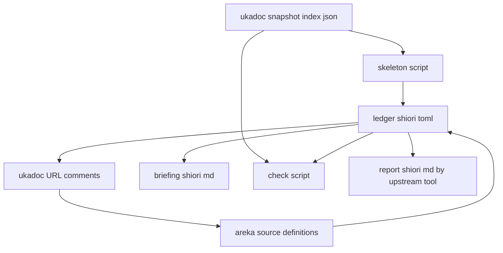

# 技術設計書: areka-P0-ukadoc-survey-shiori

## Overview

本 spec は、ukadoc（SSP 公式仕様書）のうち「ベースウェアと SHIORI／外部との対話面」に属する **677 項目**を 1 件ずつ仕分けし、その結果を人が読める形と機械が読める形の両方で repo に置く**調査 spec** である。上流 `areka-P0-ukadoc-survey-toolkit` が要件確定の時点で凍結した台帳の契約（付録 A・付録 B）を**適用する側**であり、契約自体は作らない。

作るものは 2 つのファイルと、ソースへの 22 行のコメントだけである。台帳 `doc/ukadoc-coverage/ledger/shiori.toml`（677 項目・未分類 0）と、人が読むブリーフィング `doc/ukadoc-coverage/briefing-shiori.md`。ソース側には「実装済み」と判定した項目の定義箇所に正典 URL を 1 行だけ書く。areka の実行時の振る舞いは 1 行も変わらない。

利用者から見える成果は間接的である。areka が SHIORI へ送るイベントは今 11 種類しかなく、既存ゴースト（里々・YAYA 製）の辞書が前提にしているイベントの大半は送られない。送られないイベントは例外にもログにもならず、「その場面で何も喋らない」という形でだけ現れる。本 spec は、その静かな壊れ方の全体像を 1 項目ずつ並べて、次に何を作るかを決められる材料にする。

### Goals

- 担当 12 ページ・677 項目すべてに状態・世代・担当 spec・優先度の仮置き・テーマ・繋がり・備考を与え、`unclassified` を 0 件にする。
- 「実装済み」と書いた行の根拠が、ソース側の定義箇所に正典 URL として実在する状態にする。
- 未対応の群を「利用者が何を失うか」の順に並べたブリーフィングを置き、段階 A〜E の最終決定は統合担当へ委ねたまま、材料だけを揃える。
- 上流の道具（機械の検査）が着地する前でも、台帳の正しさを自前で確かめられる手立てを持つ。

### Non-Goals

- 未対応の項目を送れるようにする実装（1 行も行わない）。
- 他ドメインの台帳（`assets.toml`／`sakura-script.toml`／`property.toml`）と、そこに属する項目の判定。
- 段階 A〜E の最終順序・束の名付け・全体の報告 `report/summary.md`・`linkage.md`（すべて `ukadoc-coverage-roadmap` の持ち物）。
- 台帳の項目形式・状態語彙・関連の種別・テーマの定義そのものの改訂（上流要件の改訂を要する）。
- SSTP・FMO・PLUGIN・HEADLINE・SAORI の実装可否の判断（要件の材料を整えるところまで）。

## Boundary Commitments

### This Spec Owns

- `doc/ukadoc-coverage/ledger/shiori.toml` — 担当 12 ページ 677 項目の台帳。このファイルの唯一の書き手。
- `doc/ukadoc-coverage/briefing-shiori.md` — 本ドメインのブリーフィング。
- 下記 4 ファイルに置く**正典 URL のコメント 22 行**（`events.rs` 11・`resources.rs` 1・`shiori_resource.rs` 1・`shiori3.rs` 9）。
- 台帳を書くための使い捨ての台本 2 本（骨組みの生成・台帳の検証）。**repo の外**（作業用の一時置き場）に置き、成果物に含めない。
- `doc/ukadoc-coverage/report/shiori.md` — **条件つきで所有する**。本 spec の実装が終わる時点で上流の道具が既に着地していれば、本 spec が台帳から再生成して台帳と一緒に置く（要件 10.1）。着地していなければ作らない（下記）。

### 報告ファイルの所有が条件つきである理由

要件 10.1 と 10.2 は、上流の道具が着地しているかどうかで担い手が変わることを定めている。判断の分かれ目と行き先は次の 2 つだけである。

| 本 spec の実装が終わる時点 | 誰が `report/shiori.md` を作るか | 本 spec の完了条件 |
|---|---|---|
| 上流の道具が着地済み | 本 spec が台帳から再生成して一緒に置く（要件 10.1）。手で書き換えない（要件 10.3） | 台帳・ブリーフィング・報告の 3 点 |
| 上流の道具が未着地 | 誰も作らない。初回生成は道具の着地に伴う上流の仕事（要件 10.2） | 台帳・ブリーフィングの 2 点 |

どちらの場合も、完了した本 spec を後から再生成の担い手として残さない（要件 10.2）。

### Out of Boundary

- 他ドメインの台帳 3 本・`report/summary.md`・`linkage.md`・`values.md`・`catalog.toml`（要件 10.4）。
- 上流の道具が未着地のまま本 spec が完了する場合の `doc/ukadoc-coverage/report/shiori.md` の**初回生成**（上記の表の下の行）。
- `doc/shiori/fragments/`（287＋159）と `crates/areka-sylphya/src/vocab/`（159）の中身。正典 id との対応を確かめるだけで書き換えない（要件 12.6）。ただし `shiori_resource.rs` の `SHIORI_RESOURCE_IDS` の**doc コメント 1 行**は本 spec が置く（語彙表の中身は不変）。
- `.kiro/steering/roadmap.md`・隣接 spec の brief（要件 12.4・12.5）。食い違いを見つけても書き換えず、`note` またはブリーフィングに記録する。
- `areka-P0-status-execution-states`（`Status` の実行状態語彙）と `areka-P0-property-query-channels`（`property.get`／`property.set`）が所有する項目の**判断**。本 spec は `owner` にその spec 名を書くだけである。

### Allowed Dependencies

- 正典スナップショット `%APPDATA%\npm\node_modules\ukagaka-doc-mcp\data\index.json`（`generatedAt` = `2026-08-24T04:08:57.881Z`・環境変数 `AREKA_UKADOC_SNAPSHOT` があればその場所）。**読むだけ**。
- 上流 `areka-P0-ukadoc-survey-toolkit/requirements.md` 付録 A（台帳の形）・付録 B（id の取り出し手順）・要件 2.2／4.3／4.4／4.7。**唯一の正本**であり、`doc/ukadoc-coverage/values.md` はまだ存在しない。
- 本ワークツリーのソース（判定の根拠として**読む**）。書き込みは上記 4 ファイルのコメント行だけ。
- `doc/COMPAT_ARCHITECTURE.md` §8（沈黙ルール対応表）と `doc/emo2-conformance-scope.md` §6（縮退の転記元・読むだけ）。

### Revalidation Triggers

次のいずれかが起きたら、本 spec の成果物を引き直す必要がある。

- 上流が台帳の欄・状態語彙・関連の種別・テーマの語彙を改訂したとき（`status`／`values`／`links` の `kind` の綴りが変わる）。
- スナップショットが更新され、担当 12 ページの id 集合が 677 件から変わったとき（上流 要件 8.1 の差分が入口）。
- `areka-P0-charset-canon` が `shiori3.rs` の `build_request`／`parse_response` を書き換えたとき（コメント 9 行の位置と、リクエスト側 `Charset` の行の状態）。
- `areka-P0-translate-pipeline`／`areka-P0-makoto-dll-host` が `crates/areka-kanade/src/schedule/` を書き換えたとき（`events.rs` のコメント 11 行の位置）。
- 送出許可表 `ALLOWED_EVENT_IDS`・照会許可表 `ALLOWED_RESOURCE_IDS` に要素が増減したとき（`implemented` の行が増減する）。

## Architecture

### 既存の形と本 spec の位置

areka 側には既に 3 系統の「正典を写した資産」がある。本 spec はそのどれとも重ならない 4 つ目を作る。

| 既存資産 | 中身 | 本 spec との関係 |
|---|---|---|
| `doc/shiori/fragments/events/`（287）・`resources/`（159） | 正典の項目を機械可読な断片にしたもの | **突き合わせるだけ**。差の 3 件を台帳の `note` に記録する（要件 2.11） |
| `crates/areka-sylphya/src/vocab/shiori_resource.rs`（159） | リソース名の語彙表 | **突き合わせるだけ**＋表の先頭に URL 1 行 |
| `crates/areka-kanade/src/schedule/{events,resources}.rs` | 実際に送る／引く許可表（11＋1） | **判定の根拠**＋要素ごとに URL 1 行 |
| **（新）** `doc/ukadoc-coverage/ledger/shiori.toml` | 677 項目の仕分け結果 | 本 spec が作る |

### 依存の向き



向きは一方向である。スナップショットとソースが入力、台帳が中間の正本、ブリーフィングとコメントと（将来の）報告が出力になる。台帳から出力へ向かう線しかないので、ブリーフィングや報告を手で書き換えて辻褄を合わせる経路は存在しない（要件 10.3）。

### 技術要素

| 層 | 選んだもの | 役割 | 備考 |
|---|---|---|---|
| データ | TOML（上流 付録 A の形） | 台帳 | 1 項目＝`[entry."<id>"]` のキー付きテーブル・id の文字順 |
| 文書 | Markdown（日本語・平易な語） | ブリーフィング | 内輪の言い回しを使わない（要件 11.6） |
| ソース注釈 | Rust の 1 行コメント（`///` と `//` の使い分け） | 実装済みの証拠 | 実行時に評価される記述は 1 行も足さない |
| 作業道具 | Python 3.13（標準の `tomllib`・`json`） | 骨組みの生成と台帳の検証 | **repo の外**・成果物に含めない・新しい依存を repo に足さない |

Rust 側に新しいクレート・モジュール・テストは足さない。上流の道具が着地すれば機械の検査はそちらに載る（上流 要件 6）ので、本 spec は同じ検査を Rust で先取りしない。

## 設計判断（要件ディスカッションから設計へ送られた 11 件）

`research.md` §9.2 が設計へ送った 11 件を、選んだ案と理由とともにここで確定する。番号は `research.md` §3 のものを引き継ぐ。

### DD-1（§3-1）台帳 677 項目の書き起こし方 — **案 ⒝ を採用**

使い捨ての台本で骨組みを作り、中身を人手で埋める。

- 台本 1「骨組みの生成」: スナップショットを読み、`source` が `ukadoc` かつ id のページ部分が担当 12 ページのものを取り出し、**id の文字順**に並べ、`[ledger]` の見出し（`domain = "shiori"`・`pages` に 12 ページ）と 677 個の `[entry."<id>"]` を書き出す。各項目の初期値は上流 付録 A のとおり `status = "unclassified"`・他は空。
- 骨組みを作った直後に台本 2（DD-9）で「id の集合がスナップショット由来の 677 件と完全一致」「ページ別の件数が要件 1.1 の内訳と一致」を確かめ、以後の編集は普通のテキスト編集で行う。
- **理由**: 677 件の id を手で写すと 1 文字の誤りが上流の検査で後から赤になる（上流 要件 6.3）。id はすべて ASCII・最大 148 文字・引用符と逆斜線を含まないので、機械で写せば誤写は起きない。上流 要件 3.3a が「後から道具が動いても既存の項目を書き換えず、足りない id だけを挿入する」と定めているため、この骨組みはそのまま道具に引き継がれる。
- 案 ⒜（全部手書き）は誤写が避けられず、案 ⒞（中間の表から機械で描く）は台帳とは別の第 2 の正本を作ってしまうため採らない。

### DD-2（§3-3）`build_request` のヘッダの「定義箇所」 — **案 ⒞ を採用**

`parse_response` 側は分岐の腕の直前、`build_request` 側は各ヘッダを書き出す文の直前に置く。

- `build_request` はヘッダを表として持たず、ヘッダ名を書き出す文が並ぶだけなので、「1 項目 1 行」を守れる最小の場所が文の直前になる。
- `parse_response` はヘッダ名を大小文字を無視して比べる分岐が並ぶので、上流 要件 5.2 が挙げる「分岐の腕」にそのまま当たる。
- 具体的な置き場所は後述の「コメントを置く場所」の表で確定する。

### DD-3（§3-4 ⒞）他ゴースト由来の拡張イベントの繋がり — **案 ⒜＋⒞ を採用**

状態は 168 件すべて `not-applicable` のまま（要件 4.1）、理由を群の共通 `note` で正確にし、繋がりを `links` で示す。

- 繋がりの相手は `ukadoc:list_shiori_event:OnCommunicate:1`（ゴースト間のやり取りの本体側）1 件、種別は `same-feature`。`OnCommunicateInputCancel` は入力欄の取り消しであって伝達の担い手ではないので相手にしない。
- 繋がりを書く対象は **7 件**。要件 4.2 が名指しする 3 件（`OnRequestValues`・`OnGetValues`・可変名の返信イベント）に加え、本文が `raiseother`／`notifyother` を使うと明記している 4 件（`Send60stair_GetStatus`・`OnKanadeTeaPartyInfomationRequest`・`OnPoker`・`OnMahjong`。本設計フェーズの実測で判明）も同じ性質なので同じ扱いにする。状態も件数も要件どおりで、理由の正確さだけが上がる。
- `list_shiori_event` と同名の 3 件（`OnBatteryLow`・`OnBatteryCritical`・`OnMusicPlay`）も `same-feature` で本体側の行と結ぶ。書く側は後述の「繋がりを書く側の決め方」に従う。

### DD-4（§3-5）`OnUpdate` 系 26 件の内訳 — **案 ⒜＋⒞ を採用**

26 件すべてに同じテーマ（更新）と同じ優先度を置き、内訳は `note` の 1 文で書き分け、`links` の `same-feature` で鎖にする。

- 鎖の順序は**正典ページの掲載順**に従い、同じ小群の中で隣り合う 2 項目を結ぶ。掲載順は機械で確かめられるので、人が進行順を推測して書くことがない。
- 小群と件数（実測・検証で訂正）: 本体更新 **11**（`OnUpdatedataCreating`・`OnUpdatedataCreated`・`OnUpdateProcessExec`・`OnUpdateBegin`・`OnUpdateReady`・`OnUpdateComplete`・`OnUpdateFailure`・`OnUpdate.OnDownloadBegin`・`OnUpdate.OnMD5CompareBegin`・`OnUpdate.OnMD5CompareComplete`・`OnUpdate.OnMD5CompareFailure`）・他ゴースト更新 8・点検 2・結果 5＝26。鎖の本数は 10＋7＋1＋4＝**22**。
- これに加えて、本体更新と他ゴースト更新の**対応する 8 組**（`OnUpdateBegin` と `OnUpdateOtherBegin` など）を `same-feature` で結ぶ。合計 **30 本**。

### DD-5（§3-6）`sakura.*`／`kero.*`／`char*.*` の繋がり — **案 ⒜ を採用**

同じ末尾を持つ 3 者を**総当たり**で `same-feature` で結ぶ。要件 3.4 が「別名として扱わない」と決めた以上、どれかを代表に立てる案 ⒝ は `alias` と読み違えられる危険がある。

実測: `sakura.` 11・`kero.` 9・`char*.` 10、末尾は 12 種類。3 者が揃う末尾が 9 種類あり、**関係の総数は 27 本**（総当たりの実測値。`research.md` §3-6 が「最大 60 本ほど」と見積もったのは概算で、実測はこれより小さい）。3 者が揃わない末尾（`portalbuttoncaption`・`portalsites`・`recommendsites.caption`）は相手が無いので繋がりを持たない。

### DD-6（§3-7）`list_plugin_event` と同名 12 件 — **案 ⒜ を採用**

12 組すべてを `same-feature` で結ぶ。「同じ名前で送り先が違う（SHIORI 向けか PLUGIN 向けか）」は「同じ機能の別の面」の定義にそのまま当たる。実測の 12 組は `OnInstallComplete`・`OnOtherGhostTalk`・`OnSecondChange`・`balloonpathlist`・`ghostpathlist`・`headlinepathlist`・`installedballoonname`・`installedghostname`・`installedplugin`・`pluginpathlist`・`property.get`・`property.set`。

### DD-7（§3-8）粒度が粗い項目 — **案 ⒞ を採用**

正典の粒度をそのまま採り、粗さを `note` に書く。加えて名前の食い違いを明記する。

1. **アンカーの無いページ全体で 1 項目**が 4 件（`ukadoc:spec_dll`・`ukadoc:spec_plugin`・`ukadoc:spec_headline`・`ukadoc:memo_shiorievent`）。4 件すべてに「このページ全体で 1 項目であり、他ページの 1 項目より粗い」を書く。
2. **1 項目に 2 つの名前が入っている** 1 件（`(入力ボックス種類).defaultleft` と `(入力ボックス種類).defaulttop` が全角空白で 1 項目になっている）。`note` に「areka 側の語彙表は半角空白で写しており、正典は全角空白。名前で突き合わせるときに躓く 1 件」と明記する。`doc/shiori/fragments/` 側は名前を読みやすく置き換えたうえ `.defaulttop` を落としていることも併記する。
3. **`Reference*`／`Reference0`／`Reference1〜`** のように 1 項目が可変個のヘッダを表すもの。`note` に「1 項目が可変個のヘッダを表す」と書く。

案 ⒝（areka 側の実装単位に割り直す）は上流 要件 1.1（カタログの id と 1 対 1）に反するので採れない。

### DD-8（§3-9）`charset-canon` と `shiori3.rs` を触る順番 — **案 ⒜ を採用（切替条件つき）**

本 spec が先に着地し、`areka-P0-charset-canon` が rebase してコメントの位置を自分の書き換えに合わせる。向こうの brief が「後着が rebase」と既に宣言しており、本 spec が置くのはコメント 9 行だけなので、合わせる側の負担は小さい。

**判断を切り替える条件**（実装の担当者が判断する）: `shiori3.rs` にコメントを置く作業に入る時点で、既定の枝（`main`）の `crates/shiori-host32-host/src/shiori3.rs` が既に任意の文字コードへ書き換わっている（`Charset` が 1 値でなくなっている）なら、`charset-canon` が先着している。そのときは 9 行を後回しにせず、**書き換わった後の定義箇所に置き直す**（本 spec が後着として合わせる側になる）。どちらの順序でも台帳の行と完了条件は変わらない。

### DD-9（§3-10）道具の着地前の台帳の検証 — **案 ⒜ を採用**

使い捨ての Python 台本（標準の `tomllib`）で確かめる。**赤が出せることを先に実証する**（緑は台本が壊れていても出る）。検査項目と赤の作り方は後述の「テスト方針」に置く。

### DD-10（§3-11）`note` の分量 — **案 ⒜ を採用（置き場所を具体化）**

群ごとに共通の文面を使い、要所だけ個別の文を足す。**共通の説明の置き場所**を次のように定める。

- 台帳ファイルの**冒頭の `#` コメント**に「群の索引」を置く。群ごとに、対象・件数・状態・テーマ・優先度・共通 `note` の全文・判断の根拠の場所（ファイル名と定義名）を 1 度だけ書く。TOML のコメントなので上流の道具の読み取りには影響しない（付録 A の記入例も冒頭に `#` コメントを置いている）。
- 各項目の `note` には、その群の共通の 1 文を写す。**根拠の場所（ファイル名と定義名）を書くのは `implemented`・`degraded`・`vocabulary-only` の行だけ**とし、`absent` の各行には繰り返さない（開発者裁定 2026-09-03・要件 2.9）。
- `[ledger]` テーブルに欄を足すことはしない（独自の欄の追加は要件 1.3 が禁じている）。
- 台帳冒頭の `#` コメントは、上流の道具が足りない id を挿入する処理（上流 要件 3.3a）を通したときに残る保証が契約に無い。そのため**群の索引の正本はブリーフィング文書の冒頭**（本 spec が所有し、道具に書き換えられない）に置き、台帳の `#` コメントはその写しとする。上流へは「挿入処理はコメント行を保存すること」を材料として送る。各項目の `note` に写す 1 文には壊れ方の段とログの有無（要件 7.6）を必ず含め、最初の 1 群で見本を作って確かめる。

### DD-11（§3-12）優先度の仮置き — **案 ⒜ を採用（群ごとに 1 つの値・段階は brief の開発者裁定に固定）**

優先度は項目ごとに考えず、**群（機構で切った束）ごとに 1 つの値**を置く。段階の当てはめは brief の開発者裁定（2026-09-02 追記(90)・議題 5〜7）が既に代表例で定めているので、それを固定点にする。上流 要件 4.7 の 4 つの根拠の序列（壊れ方 ＞ 伺からしさ ＞ 影響する既存資産の広さ ＞ 基盤の共有度）は入れ替えない。段階の名前は「利用者が体験できる節目」（A そこにいて触れて話す／B 迎えて育てて見送る／C 察してくれる／D 仲間がいる／E 周辺）。

**段階の決め方（3 段）**

1. **壊れ方**を群ごとに 1 つ書く（黙って壊れる／明示的なエラー／見た目の差）。本 spec の範囲では、送らないイベント・送らないヘッダ・引かないリソースはいずれも例外にもログにも現れず「黙って壊れる」。唯一の例外は画面の材料（群 7）で、文言が無ければ既定の文言が出る＝「見た目の差」。
2. **テーマ**で段階を当てる（下表）。brief が名指しした代表例はそのまま、名指しの無いテーマは段階の名前に最も近いところへ仮置きし「仮」と明記する。
3. 壊れ方が「見た目の差」の群は 1 段下げる。テーマが 2 つ以上ある群は 1 段上げてよいが、brief が段階を名指ししている群はそれに従う。

| 群（機構の束） | テーマ | 壊れ方 | 段階 | 値 | 根拠 |
|---|---|---|---|---|---|
| `implemented`／`alias`／`not-applicable` の行すべて | — | — | — | `""` | 作業が残っていない |
| 時刻・起動終了（`OnMinuteChange`・`OnHourTimeSignal`・`OnDayTimeSignal` ほか。`OnSecondChange`・`OnBoot`・`OnFirstBoot`・`OnClose` は実装済み） | 気配 | 黙って | A | `A1` | brief 裁定（旧 C → A） |
| マウス・タッチ・撫で・ジェスチャー・ホイール（`OnMouse*`・`OnTouch*`・`OnNadenade` ほか） | 触れ合い | 黙って | A | `A2` | A「触れて」 |
| 選択肢・アンカー・入力欄（`OnChoice*`・`OnAnchor*`・`OnUserInput*`・`OnTeach*`・`OnNotifyUserInfo`） | 掛け合い／記憶 | 黙って | A | `A3` | brief 裁定（`OnUserInput`・`OnTeach` 系・`OnNotifyUserInfo` は A） |
| 更新（`OnUpdate*` 26） | 更新 | 黙って | B | `B1` | brief 裁定「新旧両軸で高い唯一の群・B 先頭」 |
| ファイルの受け渡し（`OnFileDrop2`・`OnFileDropping`） | 触れ合い＋更新 | 黙って | B | `B2` | brief 裁定（テーマ 2 つで B） |
| 消滅（`OnVanish*` 5） | 記憶 | 黙って | B | `B3` | brief 裁定 |
| 見た目の変化（`OnShell*`・`OnBalloon*`・`OnDressup*`・`OnSurface*`・群 2a） | 装い | 黙って | B | `B4` | brief に名指し無し・B「迎えて」に**仮置き** |
| 導入と配布（`OnInstall*`・`OnNar*`・`OnDownload*`・`OnArchive*`） | 記憶 | 黙って | B | `B5` | 「育てる」側の記憶・**仮置き** |
| 画面の材料（群 7・ボタンの文言・`menu.*`・`popupmenu.*`） | 装い／記憶 | **見た目の差** | C | `C1` | テーマは B だが見た目の差で 1 段下げ |
| 察し（`OnBattery*`・`OnNetwork*`・`OnDisplay*`・`OnSysResume`／`OnSysSuspend`・`OnScreenSaver*`・`OnFullScreenApp*`・`OnWindowState*`） | 気配り | 黙って | C | `C2` | brief 裁定 |
| 交わり（`OnOtherGhost*`・`OnGhostCalled`・`OnGhostChanged`・`OnCommunicate*`・群 14a の SSTP／FMO） | 交わり | 黙って | D | `D1` | brief 裁定（基盤の重さはテーマ側で下げない） |
| テーマの無い配管（群 4 の `On` 以外・群 10／11 のヘッダ・群 8 のその他のリソース） | — | 黙って | D | `D2` | 単体では利用者に見えない |
| 受け口そのものが無い周辺（群 13 PLUGIN・群 14b の WEB／PLUGIN／HEADLINE・群 14c の DLL 共通仕様） | — | 黙って | E | `E1` | roadmap 追記(90)④（ヘッドラインは E・PLUGIN は M2 予約）。群 14c は `degraded` で E のまま（SAORI 等の同居は M2 以降の周辺・開発者裁定 2026-09-03 議題 1） |

上の表に当たらない項目（テーマの付け方の表で「上のどれにも当たらない `On` 始まり」122 件の一部）は、1 項目ずつ規則 4.6 でテーマを決めたあと、同じテーマの群の値を写す。数値は段階の中の通し番号であり、段階と数値のどちらも**仮置き**である。最終決定は `ukadoc-coverage-roadmap` が行う（要件 7.5）。

## 仕分けの設計

### 群の一覧（件数は実測・合計 677）

| # | 群 | 件数 | 状態 | テーマ | 優先度 |
|---|---|---|---|---|---|
| 1 | 送出しているイベント | 11 | `implemented` | 項目ごと | `""` |
| 2 | 送出していないイベント（`On` 始まり） | 248 | `absent` | 項目ごと（8 語彙） | 群→段階の表（DD-11） |
| 2a | M1 で意図的に発火させていないバルーンのイベント（`OnBalloonClose`・`OnBalloonTimeout`・`OnBalloonBreak`） | 3 | `vocabulary-only` | 装い | 群→段階の表（DD-11） |
| 3 | 旧仕様の別名（`OnFileDrop`・`OnFileDropped`・`OnFileDropEx`） | 3 | `alias` | `[]` | `""` |
| 4 | `list_shiori_event` に同居する `On` 以外（通知と照会が混在） | 25 | `absent` | 原則 `[]` | `D2` |
| 5 | 外部が送る拡張イベント | 168 | `not-applicable` | `[]` | `""` |
| 6 | 実際に引いているリソース（`username`） | 1 | `implemented` | 項目ごと | `""` |
| 7 | 語彙だけあるリソース・画面の材料 | 131 | `vocabulary-only` | 装い／記憶ほか | テーマから決まる |
| 8 | 語彙だけあるリソース・その他 | 27 | `vocabulary-only` | 項目ごと | テーマから決まる |
| 9 | 送っているヘッダ | 5 | `implemented` | `[]` | `""` |
| 10 | 固定値で送っているヘッダ（`Charset`・`SecurityLevel`） | 2 | `degraded` | `[]` | `D2` |
| 11 | 送らない／読み飛ばすヘッダ | 15 | `absent` | `[]` | `D2` |
| 12 | 解釈している応答（ステータスコード・`Value`・`ErrorLevel`・`ErrorDescription`） | 4 | `implemented` | `[]` | `""` |
| 13 | PLUGIN の受け口 | 19 | `absent` | `[]` | `E1` |
| 14a | 外部連携のうちゴースト同士の交わり（SSTP 2・FMO 6） | 8 | `absent` | 交わり | `D1` |
| 14b | 外部連携のその他（WEB 3・PLUGIN 1・HEADLINE 1） | 5 | `absent` | `[]` | `E1` |
| 14c | DLL 共通仕様（`ukadoc:spec_dll`・SHIORI 用の `load`／`unload`／`request` は host-32 が実装済み・SAORI／MAKOTO／PLUGIN の同居は無い） | 1 | `degraded` | `[]` | `E1` |
| 15 | イベント一覧の補足（`memo_shiorievent`） | 1 | `not-applicable` | `[]` | `""` |

内訳の検算: 11＋248＋3＋3＋25 ＝ 290（`list_shiori_event`）／168（`list_shiori_event_ex`）／1＋131＋27 ＝ 159（`list_shiori_resource`）／5＋2＋15＋4 ＝ 26（`spec_shiori3`）／19（`list_plugin_event`）／8＋5＋1 ＝ 14（外部連携の 6 ページ）／1（`memo_shiorievent`）＝ **677**。

群 2 の 248 件は「290 − 実装済み 11 − `On` 以外 25 − 別名 3 − 意図的非発火 3（群 2a）」である。群 2a の 3 件は `doc/COMPAT_ARCHITECTURE.md` §8 が「M1 非発火・語彙と Reference 割当と受け渡し口の型のみを残す」と記録しているもので、上流の状態語彙では「語彙のみ登記」＝`vocabulary-only` に当たる。`owner` は追跡先の `areka-P0-balloon-canon-residue`（進行中）。仕分けの途中で新たな別名が見つかれば、その行は群 2 から群 3 へ移る（要件 6.1 の順序で決める）。件数が固定なのは 677 の合計とページ別の内訳だけで、状態ごとの件数は判定の結果として決まる。

群 14c の `ukadoc:spec_dll` は「DLL 共通仕様」のページ全体で 1 項目であり、SHIORI・SAORI・MAKOTO・PLUGIN が共有する `load`／`unload`／`request` の入口の決まりを指す。areka の host-32（`crates/shiori-host32-helper/src/shiori_proxy.rs` の `ShioriProxy::load`／`request`）は SHIORI DLL に対してこの 3 つの入口を解決して呼んでいるので「受け口が無い」ではなく、同じ入口を使う SAORI・MAKOTO・PLUGIN の DLL は読み込めないので「実装済み」でもない。上流の状態語彙では `degraded`（一部だけできている）が当たる（開発者裁定 2026-09-03 議題 1・案 ⒜）。`note` には「SHIORI 用の入口は host-32 が実装済み・SAORI／MAKOTO／PLUGIN の同居は無い」と、SAORI の成立条件（要件 5.9・転記元は `doc/emo2-conformance-scope.md` §6）、MAKOTO は `areka-P0-makoto-dll-host` が担う旨を書く。`owner` は空のまま。実装済みではないので URL コメントは置かず、コード接触は 4 ファイル 22 行のまま変わらない。

`spec_shiori3` 26 件の内訳（群 9〜12）は次のとおり。リクエスト側 11＝送っている 5（要求行・`Sender`・`Status`・`ID`・`Reference*`）／固定値 2（`Charset`・`SecurityLevel`）／送らない 4（`SenderType`・`SecurityOrigin`・`BaseID`・リクエスト側の `X-SSTP-PassThru-`）。レスポンス側 15＝解釈している 4（ステータスコード・`Value`・`ErrorLevel`・`ErrorDescription`）／読み飛ばす 11（レスポンス側の `Charset`・`Sender`・`SecurityLevel`・`X-SSTP-PassThru-`、`ValueNotify`・`Marker`・`BalloonOffset`・`Reference0`・`Reference1〜`・`Age`・`MarkerSend`）。`BaseID` は `shiori3.rs` の `build_request` の説明に「送らないもの」として挙がっていないことを `note` に書く（要件 5.3）。

### テーマの付け方

上流 要件 4.6 の付与規則（「この項目が無いと利用者はゴーストの何を失うか」に答えられるテーマだけを付ける）に従う。答えられない項目は空にする。判定の出発点として、名前の頭による群を使う（件数は実測・実装済みの 11 件を除く）。

| 名前の頭 | 件数 | 既定のテーマ |
|---|---|---|
| `OnMouse`／`OnTouch`／`OnBind`／`OnDrag` | 18 | 触れ合い |
| `OnChoice`／`OnAnchor`／`OnUserInput`／`OnTeach`／`OnCommunicat`／`OnTranslate`／`OnTalk` ほか | 14 | 掛け合い |
| `OnShell`／`OnBalloon`／`OnDressup`／`OnSurface`／`OnWindow` ほか | 14 | 装い |
| `OnGhost`／`OnVanish`／`OnNadenade`／`OnAI`／`OnNotify` ほか | 23 | 記憶 |
| `OnOtherGhost`／`OnRaiseOther` | 6 | 交わり |
| `OnUpdate` | 26 | 更新 |
| `OnBattery`／`OnNetwork`／`OnDisplay`／`OnPower`／`OnRecycleBin` ほか | 18 | 気配り |
| `OnMinute`／`OnHour`／`OnDay`／`OnBoot`／`OnClose` ほか | 3 | 気配 |
| `OnInstall`／`OnDownload`／`OnNar`／`OnArchive` ほか | 10 | 記憶（導入と配布） |
| 上のどれにも当たらない `On` 始まり | 122 | 項目ごとに規則 4.6 で判断 |

上の合計 254 件には群 3（別名）の 3 件が含まれるが、別名の `values` は空にするので判断の対象は 251 件である。`OnCommunicate`・`OnCommunicateInputCancel` の 2 件は上の表では掛け合いの行に数えているが、brief の開発者裁定（2026-09-02 追記(90)）に従い**交わり**に置く。

名前の頭は出発点であって根拠ではない。最後は 1 項目ずつ正典本文を読んで規則 4.6 に当てはめる。既定のテーマが本文と合わない項目は個別に直し、直した理由を `note` に書く。テーマを付けた行には「無いと利用者が失うもの」を 1 文で書く（要件 7.3）。テーマを付けない既定の群（拡張 168・`OnBasewareUpdating` と `OnBasewareUpdated`・`property.get` と `property.set`・HEADLINE）はその理由を `note` に書く（要件 7.4）。

### 繋がり（`links`）の設計

種別は上流 要件 4.3 の 6 つに限る。相手の id は、書く前にスナップショット由来の全 1,749 件の一覧に照らして実在を確かめる（要件 8.4・台本 2 が機械で再検査する）。

**繋がりを書く側の決め方**（1 つの関係は 1 回だけ書く）:

1. 要件が名指しで側を定めているものは、その側に書く（DD-3 の 7 件は `list_shiori_event_ex` 側）。
2. 進行や派生の向きがあるものは、先に起きる側・元の側に書く（`OnUpdate` の鎖・本体更新と他ゴースト更新の対応）。
3. それ以外は id の文字順で先に来る側に書く（`char*.` ＜ `kero.` ＜ `sakura.`／`list_plugin_event:` ＜ `list_shiori_event:`）。

**確定している繋がり**:

| 由来 | 種別 | 本数 | 書く側 |
|---|---|---|---|
| 他ゴースト由来の拡張イベント から `OnCommunicate`（DD-3） | `same-feature` | 7 | `list_shiori_event_ex` 側 |
| 拡張側と本体側の同名 3 件（`OnBatteryLow` ほか・DD-3） | `same-feature` | 3 | `list_shiori_event` 側 |
| `OnUpdate` の掲載順の鎖（DD-4） | `same-feature` | 22 | 先に来る項目 |
| 本体更新と他ゴースト更新の対応 8 組（DD-4） | `same-feature` | 8 | 本体側 |
| `sakura.`／`kero.`／`char*.` の総当たり（DD-5） | `same-feature` | 27 | 文字順で先の側 |
| `list_plugin_event` と `list_shiori_event` の同名 12 組（DD-6） | `same-feature` | 12 | `list_plugin_event` 側 |
| 旧仕様 3 件 から `OnFileDrop2`（要件 6.3） | `alias_of` | 3 | 別名側（`alias_of` の欄で足りる） |
| `OnMouseClick` と `OnMouseClickEx`（要件 6.5） | `same-feature` | 1 | `OnMouseClick` 側 |

上記のほか、要件 2.8 が求める「発火条件の源」（descript のキー・プロパティ・さくらスクリプトのタグ・OS の事象・利用者の操作）を `triggers`／`configures`／`queries` で登記する。相手が他ドメインの項目であってもその id を書いてよく、その項目の行は本台帳に作らない（要件 8.3）。繋がりに人手の名付けや解説は持たせない（要件 8.5・束の名付けは統合担当の `linkage.md`）。別名の連鎖は作らない（`alias_of` の指す先が `alias` であってはならない・要件 6.8）。

### 版番号（`introduced`）の決め方

- 本文に版番号（`2.x.y` の形）を含む項目は担当 12 ページ全体で **98 件**。`list_shiori_event_ex` は 0 件なので、拡張 168 の `introduced` はすべて空にする（要件 4.5）。
- 版番号が無い項目は `introduced` を空にし、最も古いものとして扱わない（要件 6.9）。
- `introduced` に書く値は必ず本文に現れる版番号のいずれかにする。上流の検査（上流 要件 6.7）は将来のカタログが持つ版番号の集合に含まれるかを見るので、カタログ側の取り出し方が本文の正規表現と違えば綴りが正しくても赤になりうる。取り出し方の一致を上流へ送る材料に加える。
- 相異なる版番号を 2 つ以上含む項目が **12 件**ある。項目そのものの登場を示す版番号を `introduced` に書き、残りとその意味（挙動の変更・引数の追加など）を `note` に書く。本文から判別できなければ最も小さい版番号を書く（要件 6.10）。

### 縮退（`degraded`）の転記元

要件 3.6 の「縮退の記録の転記元」は `doc/COMPAT_ARCHITECTURE.md` §8（沈黙ルール対応表）と `doc/emo2-conformance-scope.md` §6（見直し表）である。実測では、§8 の行のうち SHIORI ドメインの項目を名指ししているのは **4 行**である（設計の初版は 2 行としていたが、検証で 2 行の数え落としが見つかり訂正した）。§6 からは 1 行が出てくる。

| §8 の行 | 対応する台帳の行 | 書くこと |
|---|---|---|
| `%username` の SHIORI Resource `username` が 204 や空値を返したときの値 | `ukadoc:list_shiori_resource:username:1` | 照会そのものは行われる（`implemented`）が、値が無いときは既定値へ縮退する。転記元を明記 |
| 選択確定カスケードの正典沈黙分岐一式（`Status` の複合値を含む） | `ukadoc:spec_shiori3:Status_20_5bSSP_62e1_5f35_5d:1` | 語彙の所有は `areka-P0-status-execution-states`。詳細台帳 `doc/choice-cascade-compat.md` を転記元として明記 |
| `Status [SSP拡張]` の `balloon`（表示中のバルーン ID 群）の実導出 | 同上（`Status` の行の 2 つ目の転記元） | 同じ行の `note` に 2 つ目の転記元として併記 |
| `OnBalloonClose`／`OnBalloonTimeout`／`OnBalloonBreak` の SHIORI 発火＝M1 非発火（語彙・Reference 割当・受け渡し口の型のみ残す） | `ukadoc:list_shiori_event:OnBalloonClose:1`・`…:OnBalloonTimeout:1`・`…:OnBalloonBreak:1` | 群 2a。`vocabulary-only`・`owner` は `areka-P0-balloon-canon-residue`・転記元と解禁の条件を `note` に写す。`OnBalloonClick` は正典に無いので行を作らない |
| `doc/emo2-conformance-scope.md` §6「SAORI 同居を M1 から削除」 | `ukadoc:spec_dll` | `spec_dll` の `note`（SAORI の成立条件・要件 5.9）の転記元として明記 |

実装時に §8 の全行と §6 を 1 行ずつ読み直し、SHIORI ドメインの項目を名指ししている行が上の 5 行のほかに無いことを確かめる。増えていれば同じ形で対応する行の `note` に書く。

## コメントを置く場所（唯一のコード接触）

`///` は「定義そのもの」にだけ使う。配列の要素や関数本体の文には Rust が `///` を受け付けない（`unused_doc_comments` の警告が出ることを着手時に実測済み）ため `//` を使う（要件 9.1）。文言は `ukadoc: <正典 URL>` の 1 行だけで、説明文は付けない（要件 9.5）。URL はスナップショットの `url` の値をそのまま写す（例: `https://ssp.shillest.net/ukadoc/manual/list_shiori_event.html#OnInitialize:1`）。

| # | ファイル | 場所 | 書き方 | 行数 |
|---|---|---|---|---|
| 1 | `crates/areka-kanade/src/schedule/events.rs` | `ALLOWED_EVENT_IDS` の 11 要素それぞれの直前 | `//` | 11 |
| 2 | `crates/areka-kanade/src/schedule/resources.rs` | `ALLOWED_RESOURCE_IDS` の doc コメントの末尾 | `///` | 1 |
| 3 | `crates/areka-sylphya/src/vocab/shiori_resource.rs` | `SHIORI_RESOURCE_IDS` の doc コメントの末尾（ページの URL 1 つ・要素ごとには置かない） | `///` | 1 |
| 4 | `crates/shiori-host32-host/src/shiori3.rs` | `build_request` の中で、要求行・`Sender`・`Status`・`ID`・`Reference` を書き出す文の直前 | `//` | 5 |
| 5 | 同上 | `parse_response` の中で、ステータスコードを取り出す文の直前と、`Value`／`ErrorLevel`／`ErrorDescription` の 3 つの分岐の腕の直前 | `//` | 4 |
|  |  |  | **合計** | **22** |

- #2 は要素が 1 件だけで 1 行に収まっているため、要素ごとの `//` を置く場所が無い。この 1 件では「定義そのもの」と「要素」が一致するので `///` を定義に置く（配列の書き方は変えない）。
- #4 に `Charset` と `SecurityLevel` を書き出す文が含まれないのは、この 2 項目の状態が `degraded`（固定値でしか送れない）であり、実装済みでない項目にはソース側へ何も書かないと決めているためである（要件 9.4）。`areka-P0-charset-canon` が着地して `Charset` が任意になった時点で、その spec が行を `implemented` へ更新しコメントを足す（向こうの brief に下流として明記されている）。台帳の該当行の `owner` には `areka-P0-charset-canon` を書く。
- 定義箇所が特定できない項目は `implemented` とせず、`vocabulary-only` または `degraded` として理由を `note` に書く（要件 9.9）。
- 同じページの URL が 2 か所に現れる（`shiori_resource.rs` の表の先頭と `resources.rs` の `username`）。重複した証拠の扱いは上流が未決なので、本 spec は最初の実例を作る側として `research.md` に材料を残す。

## File Structure Plan

### 新規に作るファイル

```
doc/ukadoc-coverage/
├── ledger/
│   └── shiori.toml          # 677 項目の台帳（本 spec が唯一の書き手）
├── report/
│   └── shiori.md            # 条件つき: 上流の道具が着地済みのときだけ台帳から再生成して置く
└── briefing-shiori.md       # 人が読む文書（未対応の群を利用者への影響順に）
```

`doc/ukadoc-coverage/` そのものが未作成なので、`ledger/` ごと新規に作る。`report/summary.md`・`linkage.md`・`values.md`・`catalog.toml` は本 spec では作らない。`report/shiori.md` は上記の条件を満たすときだけ作り、満たさないときは `report/` ごと作らない。

### 変更するファイル（コメント行のみ・実行時の振る舞いは不変）

- `crates/areka-kanade/src/schedule/events.rs` — `ALLOWED_EVENT_IDS` の 11 要素に URL 1 行ずつ。
- `crates/areka-kanade/src/schedule/resources.rs` — `ALLOWED_RESOURCE_IDS` の doc コメントに URL 1 行。
- `crates/areka-sylphya/src/vocab/shiori_resource.rs` — `SHIORI_RESOURCE_IDS` の doc コメントにページ URL 1 行。
- `crates/shiori-host32-host/src/shiori3.rs` — `build_request` に 5 行・`parse_response` に 4 行。

### repo に置かないもの（作業用の一時置き場）

- 骨組みを生成する台本（DD-1）。
- 台帳を検証する台本（DD-9）。

どちらも `crates/` にも `doc/` にも `.kiro/` にも置かない。台帳が確定したあとは捨ててよい。上流の道具が着地すれば同じ検査が常時走るようになる（上流 要件 6）。

## ブリーフィング文書の構成

台帳の群（前掲の 15 群）とテーマ群がそのまま章になる。順序は「黙って壊れる」ものが先、次にテーマの付いたもの、最後に受け口が無い外部連携（要件 11.2）。

各章に次の 3 つを書く（要件 11.3）。

1. **利用者に何が起きるか** — 「この場面でゴーストが何も言わなくなる」のように、利用者から見える結果で書く。
2. **その群を成立させる最小の基盤** — 「イベントを組み立てて送る経路はあるので、許可表に名前を足し、発火の条件をどこかで観測できればよい」のように、今ある物と足りない物を分けて書く。
3. **台帳の項目 id** — 群に属する id の一覧。

書かないもの: 憶測の実装計画（設計・工程・見積り）・段階 A〜E の最終順序（要件 11.4・11.5）・プロジェクトの内輪でしか通じない言い回し（要件 11.6）。冒頭に「段階と優先度は仮置きであり、最終決定は `ukadoc-coverage-roadmap` が行う」と明記する。

隣接 spec の brief に正典と食い違う記述を見つけたときは、brief を書き換えず、ブリーフィングの末尾に「是正の候補」として列挙する（要件 12.4）。着手時点で既に判明しているものは `requirements.md` 付録の食い違い表 26 行にある。

## Requirements Traceability

| 要件 | 要旨 | 設計上の受け皿 |
|---|---|---|
| 1.1, 1.2, 1.3, 1.5, 1.7 | 担当 12 ページ 677 件だけを付録 A の形・id の文字順で収める | DD-1（骨組みの生成が id とページを機械で決める）・File Structure Plan |
| 1.4 | 完了時に `unclassified` 0 件 | 群の一覧（15 群で 677 を尽くす）・テスト方針の検査 ⑹ |
| 1.6 | 件数が食い違えば確定させない | テスト方針の検査 ⑵・「検査が食い違ったときの扱い」 |
| 2.1, 2.2, 2.3 | イベント 290 の仕訳・許可表との対応・`absent` の理由 | 群 1・群 2・DD-10（共通 `note` の文面と置き場所） |
| 2.4, 2.5 | `On` 以外の 25 と `basewareversion` の向きの書き分け | 群 1（`basewareversion` は実装済み・イベント側の行）・群 4 |
| 2.6 | areka 内部だけの名前（`OnTalk`・`OnHour`・`OnMenuBack`）は行を作らない | 群の一覧の注記（`events.rs` の恒久禁止の記載を最も近い項目の `note` へ写す） |
| 2.7 | `OnUpdate` 26 件を 1 つの群として揃える | DD-4 |
| 2.8 | 発火条件の源を `links` に登記 | 繋がりの設計（`triggers`／`configures`／`queries`） |
| 2.9 | 根拠はファイルパスと定義名で書き、行番号は書かない | DD-10（書く対象を `implemented`・`degraded`・`vocabulary-only` と群の索引に限る） |
| 2.10 | `memo_shiorievent` にも状態を与える | 群 15・DD-7 の 1 |
| 2.11 | 断片 287 との差 3 件を `note` に記録 | 群 2 の個別の `note`（差の 3 件は確定済み） |
| 3.1, 3.2, 3.3 | リソース 159 の仕訳・空白の全角半角を同一視 | 群 6・群 7・群 8・DD-7 の 2 |
| 3.4 | `sakura.`／`kero.`／`char*.` はスコープの違い | DD-5 |
| 3.5 | 画面の材料になるリソース群を束ねられる形にする | 群 7（実測 131 件＝ボタンの文言 99・`menu.` 18・`popupmenu.` 9・`recommendsites` 3・`portalsites` 1・`vanishbuttonvisible` 1） |
| 3.6 | 縮退の転記元を `note` に書く | 縮退の転記元の表（COMPAT §8 の 4 行＋scope §6 の 1 行）・群 2a |
| 4.1, 4.2, 4.3, 4.4 | 拡張 168 を 1 つの群として `not-applicable`・共通 `note`・`values` は空 | 群 5・DD-3 |
| 4.5 | 拡張 168 の版番号は 0 件・`introduced` は空 | 版番号の決め方（実測 0 件） |
| 5.1, 5.2, 5.3, 5.4, 5.4a | `spec_shiori3` 26 件の仕訳（リクエスト 11・レスポンス 15） | 群 9〜群 12 と内訳の段落・コメントを置く場所 #4・#5 |
| 5.5 | 見出しが同じ 2 組（`Charset`・`Sender`）を id で区別 | DD-1（id をそのまま写すので潰れない）・群 9〜11 の内訳 |
| 5.6 | `list_plugin_event` 19 の種別の書き分け | 群 13・DD-6 |
| 5.7 | 外部連携 14 は「受け口の有無」だけを判定 | 群 14a（SSTP／FMO・`D1`）・群 14b（`E1`）・群 14c（DLL 共通仕様は SHIORI 用の受け口が実在するので `degraded`・`E1`） |
| 5.8 | アンカーの無い 4 件の粗さを `note` に書く | DD-7 の 1 |
| 5.9 | SAORI は `spec_dll` の `note` に書き独立した行を作らない | 群 14c（`spec_dll` は `degraded`・個別の `note` に成立の条件を併記） |
| 6.1, 6.2, 6.8 | 正典と別名の決め方・`alias_of`・連鎖を作らない | 群 3・繋がりの設計・テスト方針の検査 ⑸ |
| 6.3, 6.4 | 旧仕様 3 件は `OnFileDrop2` の別名・`OnFileDropping` は含めない | 群 3（5 件すべての実在を確認済み） |
| 6.5 | `OnMouseClick` と `OnMouseClickEx` は分担 | 繋がりの設計（`same-feature` 1 本） |
| 6.6 | `X-SSTP-Return-` の廃止予定はレスポンス側に付く | 群 11（レスポンス側 `X-SSTP-PassThru-` の `note`） |
| 6.7 | brief と正典が食い違えば正典に従い `note` に明記 | ブリーフィング文書の構成（是正の候補）・要件付録の食い違い表 |
| 6.9, 6.10 | 版番号が無ければ空・複数あれば登場の版 | 版番号の決め方（実測 98 件・複数 12 件） |
| 7.1, 7.2, 7.3, 7.4 | テーマは 8 語彙・付与規則・付けた理由・付けない既定の群 | テーマの付け方 |
| 7.5, 7.7 | 優先度の仮置きと 4 つの軸の序列 | DD-11 |
| 7.6 | 壊れ方の段とログの根拠を `note` に | DD-10（群の共通 `note` に壊れ方の段とログの有無を含める）・DD-11（群ごとの壊れ方の列） |
| 8.1, 8.2, 8.3, 8.5 | `links` の種別・登記・他ドメインの相手・名付けを持たせない | 繋がりの設計 |
| 8.4 | 相手 id の実在を書く前に確かめる | テスト方針の検査 ⑺ |
| 9.1, 9.2, 9.3, 9.4, 9.5 | 正典 URL の 1 行コメント・置き場所・語彙表は先頭 1 つ・実装済み以外は書かない | コメントを置く場所（22 行） |
| 9.6, 9.7 | 逐語一致のテスト 4 本と 1,000 行の見張りが緑のまま | テスト方針の「既存のテスト」 |
| 9.8 | 台帳に証拠の欄を持たない | 付録 A の欄をそのまま使う（DD-1）・独自の欄を足さない |
| 9.9 | 定義箇所が特定できなければ `implemented` にしない | コメントを置く場所の注記 |
| 10.1, 10.2 | 道具が着地済みなら本 spec が報告を再生成し、未着地なら作らない | 「報告ファイルの所有が条件つきである理由」の 2 行の表 |
| 10.3 | 整合検査が赤なら台帳か再生成で解消し報告を手で直さない | Architecture の依存の向き（台帳から報告への一方向） |
| 10.4 | 他の成果物を編集しない | Out of Boundary |
| 10.5 | 語彙が上流の凍結語彙であることを確かめる | テスト方針の検査 ⑷ |
| 11.1, 11.2, 11.3, 11.4, 11.5, 11.6 | ブリーフィングの置き場所・順序・章の中身・書かないもの | ブリーフィング文書の構成 |
| 12.1 | 実行時の振る舞いを変えない | コメントを置く場所（追加はコメント行 22 行のみ）・テスト方針 |
| 12.2 | 他ドメインの行を作らない | Boundary Commitments・テスト方針の検査 ⑵ |
| 12.3 | 既存 spec が所有する項目は `owner` を書くだけ | 群 10（`Charset` の `owner`）・縮退の転記元（`Status` の `owner`）・群 2a（`areka-P0-balloon-canon-residue`） |
| 12.4 | brief の食い違いは書き換えず記録する | ブリーフィング文書の構成（是正の候補） |
| 12.5 | `roadmap.md` を変更しない | Out of Boundary |
| 12.6 | `doc/shiori/fragments/` と `vocab/` を書き換えない | Out of Boundary（`shiori_resource.rs` はコメント 1 行のみ・語彙は不変） |
| 12.7 | ukadoc の本文を repo に取り込まない | DD-1（骨組みが写すのは id だけ・見出しと本文は判断材料に留める） |

## テスト方針

本 spec が足すのは文書とコメント行だけなので、ワークスペースに新しいテストは 1 本も追加しない。確かめる先は 2 つある。

### 既存のテスト（コメントを足しても緑のままであることを確かめる）

| 対象 | 何を固定しているか | 走らせ方 |
|---|---|---|
| `events_tests.rs` の許可 ID を逐語で固定するテスト | `ALLOWED_EVENT_IDS` の 11 要素 | `cargo test -p areka-kanade` |
| `resources.rs` の許可リソースを逐語で固定するテスト | `ALLOWED_RESOURCE_IDS` が `username` 1 件であること | 同上 |
| `shiori_resource.rs` の件数を固定するテスト | 159 件であること | `cargo test -p areka-sylphya` |
| `ledger_key_determinism_tests.rs` の同旨の検査 | 159 件であること | 同上 |
| `file_length_guard_test.rs` の上限の見張り | 1 ファイル 1,000 行の上限と例外表の一致 | `cargo test -p log-capture-kit` |

触る 4 ファイルの現在の行数は 413／223／290／589 で、22 行を足しても上限から大きく離れている。加えて、コメントを足した後に対象クレートをビルドし、`unused_doc_comments` の警告が 1 件も出ないことを確かめる（`///` と `//` の使い分けが正しいことの確認）。

### 台帳の検証（使い捨ての台本・DD-9）

| # | 確かめること | わざと赤にする作り方 |
|---|---|---|
| ⑴ | TOML として読めること | 引用符を 1 つ落とす |
| ⑵ | id の集合がスナップショット由来の 677 件と完全一致し、ページ別の件数も一致すること | id を 1 文字変える／担当外ページの id を 1 行足す |
| ⑶ | 並びが id の文字順であること | 隣り合う 2 項目を入れ替える |
| ⑷ | `status`・`values`・`links` の `kind` が上流の凍結した語彙だけであること | `implemented` の綴りを崩す／テーマ名を 1 つ創作する |
| ⑸ | `alias_of` の指す先が同じ台帳にあり、その `status` が `alias` でないこと | 別名の指す先を別の `alias` へ向ける |
| ⑹ | `status` が `unclassified` の行が 0 件であること | 1 行を `unclassified` に戻す |
| ⑺ | `links` の相手 id が全 1,749 件の一覧に実在すること | 相手 id の末尾の連番を消す |
| ⑻ | 4 ファイルから `ukadoc: ` で始まる行の URL を集め、スナップショットの `url` の値で id へ解き、その集合が台帳の `status = "implemented"` の行と完全一致すること（`shiori_resource.rs` のページ URL 1 つは項目ではないので、ページ URL として別に数える） | URL の符号化部分を 1 文字崩す／`implemented` の行を 1 つ `absent` に変える |

**赤を先に出す**。台帳を書き始める前に、上の 8 通りの壊し方を当てた見本で台本が実際に赤になることを 1 件ずつ確かめる。検査 ⑻ は上流の検査（上流 要件 6.5・6.6）が本 spec の完了後に初めて走るものの先取りであり、URL の写し間違いを本 spec の完了前に見つける唯一の手立てである。緑は台本が壊れていても出るため、緑だけでは検証にならない。

### 検査が食い違ったときの扱い

- ページ別の件数がスナップショットの実測と合わないときは、台帳を確定させず、食い違ったページ名と件数を示して原因を先に解消する（要件 1.6）。数を合わせるために行を足したり消したりしない。
- 上流の道具が着地して整合検査が本ドメインについて赤になったときは、台帳側の修正か報告の再生成で解消する。報告を手で書き換えて合わせない（要件 10.3）。

## 隣接する spec との関係と rebase

同じファイルに触れる spec が **3 本**あり、いずれも自分の brief で「後着が rebase」と本 spec を名指ししている。共有するのはコメント行だけで、実行時のコードは 1 行も共有しない。

| 隣接 spec | 触れる場所 | 向こうの宣言 | 本 spec の扱い |
|---|---|---|---|
| `areka-P0-charset-canon` | `shiori3.rs` の `build_request` と `parse_response` を書き換える | 「後着が rebase」と明記。着地で `Charset` の台帳行が `implemented` へ変わることも下流として明記 | DD-8（本 spec が先着なら向こうが合わせる。先着されていたら本 spec が置き直す） |
| `areka-P0-translate-pipeline` | `events.rs`（`OnTranslate` の送出と許可表）ほか `areka-kanade/schedule/` | 「`events.rs` の定義箇所へ ukadoc URL コメント＝後着 rebase」「実装済みの証拠は置かない＝`ukadoc-survey-shiori` の仕事」と明記 | 本 spec は許可表の要素行にコメントを置くだけ。向こうが要素を増やせば、その要素の URL コメントは向こうが置く（証拠の置き方は本 spec が定めた形に従う） |
| `areka-P0-makoto-dll-host` | `shiori-host32-helper`・新規の MAKOTO 用ファイル・`areka-kanade/schedule/` | 「kanade/schedule の doc 1 行＝後着 rebase」と明記。`shiori3.rs` と `client.rs` は非接触と宣言 | 本 spec の `shiori3.rs` への 9 行とは重ならない |

このほか `areka-P0-status-execution-states`（`Status` の実行状態語彙）と `areka-P0-property-query-channels`（`property.get`／`property.set`）は同じ**項目**を所有する。本 spec は台帳の `owner` にその spec 名を書くだけで、判断を上書きしない（要件 12.3）。並走する調査 spec 3 本（assets／sakura-script／property）とは台帳ファイルが別で、共有するファイルは無い。

## 危険と対処

| 危険 | 見立て | 対処 |
|---|---|---|
| 677 件を書く途中で方針が変わる | 中 | 群の一覧・テーマの付け方・優先度の表・共通 `note` の文面を、書き始める前に台帳冒頭の「群の索引」として固定する |
| 台帳の `note` に書いた場所（ファイル名と定義名）が、隣の spec の整理で古くなる | 低 | 行番号を書かない（開発者裁定）。定義名は整理で消えにくく、消えたときは名前で探せる |
| 隣の spec が先に着地してコメントの位置がずれる | 中 | DD-8 の切替条件。ずれても台帳の行と完了条件は変わらない |
| テーマの付け方が項目ごとにぶれる | 中 | 名前の頭による既定を出発点にし、規則 4.6 に合わないものだけ個別に直して理由を `note` に残す |
| 使い捨ての台本が壊れていて緑を出す | 中 | 8 通りの壊し方で赤が出ることを書き始める前に確かめる |
